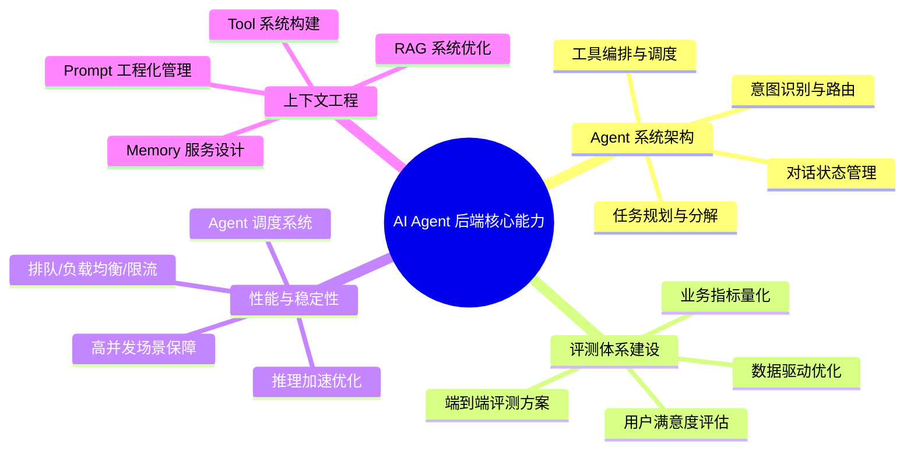

---

## 一、编程语言与工程基础

| 优先级 | 技能要求 |
|--------|---------|
| ⭐⭐⭐ 必备 | **Go（Golang）**——几乎所有 JD 都将其列为首选或必备语言 |
| ⭐⭐⭐ 必备 | **Python**——大模型生态第一语言，训练/评测/数据处理广泛使用 |
| ⭐⭐ 加分 | Java、C++、Rust、Node.js（部分岗位提及） |

**工程基础要求**：
- 扎实的数据结构与算法功底
- 良好的面向对象设计思想和编程习惯
- 熟悉 Linux 开发环境
- 具备 **AI Coding 能力**，熟练使用 AI Coding 工具（多个 JD 明确提出）

---

## 二、系统设计与后端架构能力

这是与纯算法岗最大的区分点，几乎所有 JD 都强调：

1. **分布式/高并发/微服务架构**设计、开发与调优经验
2. 熟悉常见中间件技术栈：
    - 数据库：**MySQL**（事务、索引、性能调优）
    - 缓存：**Redis**（持久化、集群、高可用）
    - 搜索引擎：**Elasticsearch**
    - 消息队列：**MQ**（Kafka 等）
    - RPC 框架、微服务架构、**Kubernetes**
3. 高可用保障能力：SLA 设计、降级方案、性能瓶颈挖掘与优化
4. **向量数据库**经验（Milvus、Pinecone 等）——Agent 记忆与 RAG 的核心组件

---

## 三、大模型（LLM）应用核心技术栈

这是 AI Agent 岗位最核心的技术差异化要求：

### 3.1 必须掌握的基础能力
| 技术方向 | 具体要求 |
|---------|---------|
| **Prompt Engineering** | 提示词工程化设计与优化，几乎每个 JD 都提到 |
| **RAG（检索增强生成）** | 知识检索系统设计与优化，向量化技术、知识库构建 |
| **Function Calling / Tool Use** | 工具系统设计，让 LLM 调用外部 API 和服务 |
| **Agent 架构设计** | 任务规划、意图识别、对话管理、流程编排 |
| **MCP 协议** | 模型上下文协议的链路搭建与性能调优（多个 JD 明确要求） |
| **Memory 管理** | 智能体记忆管理系统，长期/短期记忆设计 |

### 3.2 进阶/加分能力
| 技术方向 | 具体要求 |
|---------|---------|
| **SFT / RLHF / RL** | 模型微调与强化学习，数据训练与评测 |
| **Multi-Agent 协作** | 多智能体系统设计与协作机制 |
| **A2A 协议** | Agent-to-Agent 标准协议 |
| **多模态** | 文本+图片+视频等多模态内容理解与生成 |
| **Context Engineering** | 上下文工程优化，包括 RAG 和工具系统的生态优化 |

### 3.3 必须熟悉的框架与工具
| 类别 | 框架/工具 |
|------|----------|
| **Agent 框架** | LangChain、LangGraph、LlamaIndex、AutoGen、CrewAI、**Eino**（字节自研） |
| **Agent 平台** | Dify、LangFlow、Fornax |
| **大模型服务** | GPT、Claude、Gemini 等国内外主流模型 |
| **深度学习框架** | PyTorch、TensorFlow（部分岗位要求） |
| **数据处理** | Pandas 等 AI 相关 Python 库 |

---

## 四、Agent 专项能力（区别于普通后端）

从 JD 中可以提炼出 Agent 后端工程师的**独特能力要求**：

---

## 五、业务理解与软技能

几乎所有 JD 都强调的非技术要求：

1. **产品意识**：深入理解用户/客户需求场景，具备产品思考能力
2. **业务驱动**：能够将技术方案与业务目标紧密结合，技术驱动业务增长
3. **跨团队协作**：与产品、算法、运营等多团队高效沟通协同
4. **前沿跟踪**：持续关注 AI Agent 领域最新动态（Monica、Operator、Manus、UI-TARS 等被明确提及）
5. **创新能力**：在没有可参考案例时给出创新技术解决方案
6. **自驱力**：主动发现问题、探索新技术、推动落地

---

## 六、经验要求分层

| 级别 | 年限 | 典型要求 |
|------|------|---------|
| 初级 | 1年+ | 扎实编程基础 + 了解 LLM/Agent 基本概念 + 熟悉常见中间件 |
| 中级 | 3年+ | 扎实系统设计能力 + LLM 应用实战经验 + RAG/Agent 项目经验 |
| 高级/专家 | 5年+ | 主导架构设计 + 从0到1搭建 Agent 系统 + 训练评测全流程 + 行业最佳实践沉淀 |

---

## 七、建议学习路线（优先级排序）

如果要系统准备 AI Agent 后端岗位，建议按以下优先级推进：

1. **夯实 Go + Python 双语言能力**（Go 偏工程部署，Python 偏模型实验）
2. **掌握 Prompt Engineering + RAG + Function Calling** 三板斧
3. **动手搭建一个完整的 Agent 应用**（推荐用 LangChain/LangGraph 或字节的 Eino 框架）
4. **深入学习 MCP 协议**（已成为行业标准，多个 JD 明确要求）
5. **构建评测体系**——这是从"能用"到"好用"的关键能力
6. **学习 Multi-Agent 协作模式**——Agent 系统的演进方向
7. **补齐分布式系统设计能力**——高并发、高可用是生产环境的基本要求

> **总结一句话**：AI Agent 后端 = **扎实的后端工程能力** + **LLM 应用技术栈** + **Agent 系统设计思维** + **业务场景理解力**。这不是纯算法岗，也不是纯后端岗，而是两者的深度融合，同时要求对 Agent 生态有全局认知和实践经验。