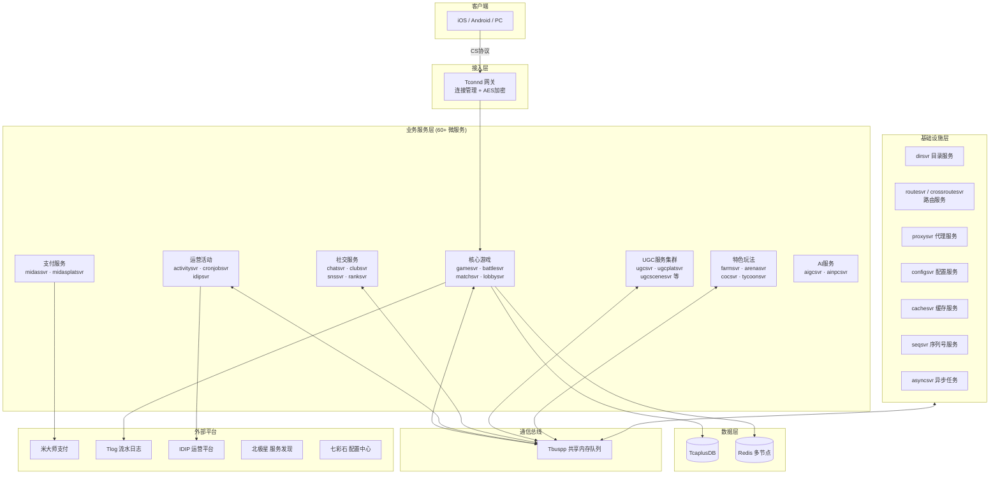
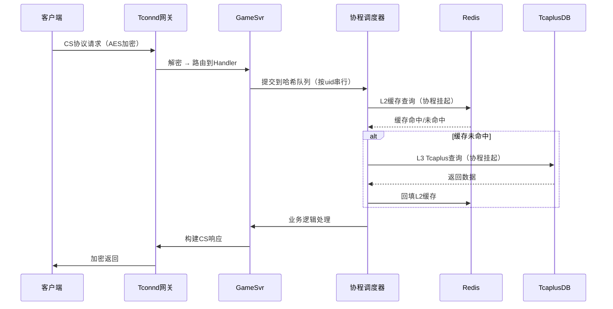
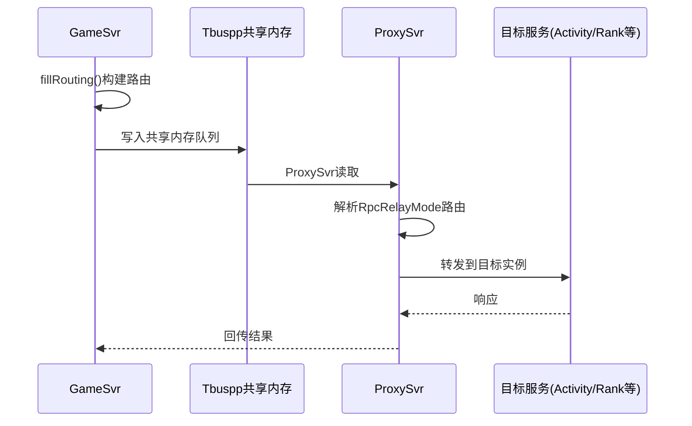
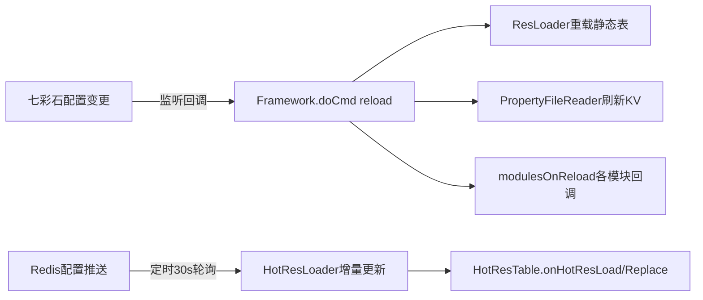

# LetsGo 游戏服务端项目 —— 总体概览

> **文档性质**: 基于39份专题总结的结构化宏观索引
> **项目代号**: WeA / LetsGo
> **技术定位**: 大型多人在线游戏服务端（腾讯内部TSF4G2框架体系）
> **最后更新**: 2026-03-08

---

## 一、项目画像

### 1.1 一句话描述

LetsGo是一个基于 **Java + C++ 混合架构** 的大型游戏服务端，采用 **60+ 微服务** 的分布式部署模式，使用 **Tbuspp共享内存** 作为核心通信手段，以 **用户态协程** 驱动高并发处理，数据持久化依赖 **TcaplusDB + Redis** 多级缓存体系，运行于 **Kubernetes** 容器化平台之上。

### 1.2 核心技术栈速览

| 维度 | 技术选型 |
|:---:|---------|
| **主语言** | Java 11（Kona Fiber协程）+ C++（底层框架/IRPC） |
| **构建系统** | Gradle 多模块 + PyHome 工具链 |
| **通信框架** | Tbuspp（共享内存）、RPC/IRPC、gRPC |
| **序列化** | Protocol Buffers |
| **数据存储** | TcaplusDB（NoSQL）、Redis（多节点缓存） |
| **消息队列** | Kafka、Pulsar（TDMQ） |
| **容器编排** | Kubernetes（GameStatefulSet + BCS） |
| **服务发现** | 北极星 Polaris |
| **配置中心** | 七彩石 Rainbow |
| **监控体系** | Prometheus + Grafana + 企业微信告警 |
| **CI/CD** | 蓝盾流水线 |
| **脚本/热更** | Groovy（测试/运维） |

---

## 二、架构全景图



---

## 三、文档索引与内容速查

### 3.1 文档地图

下面按**十大主题域**对39份总结进行分组，每篇标注核心要点，便于快速定位。

---

#### 🏗️ 主题一：架构与设计

| # | 文档 | 核心要点 |
|---|------|---------|
| 01 | [项目架构与服务全景分析](01%20项目架构与服务全景分析.md) | 整体分层（框架引擎 → 通信 → 协程 → 数据访问 → 业务）；微服务60+清单；Gradle多模块结构；标准化五层架构（RPC→Service→Manager→Logic→Data）；服务分类（核心/活动/UGC/社交/基础设施/分配/支付/特色/AI） |
| 25 | [DDD与服务边界分析](25%20领域驱动设计(DDD)与服务边界分析.md) | 核心/支撑/通用领域划分；聚合根设计（Player/Battle/Activity/Club）；事件驱动EventSwitch；CQRS模式应用 |
| 26 | [高可用与容灾设计](26%20高可用与容灾设计分析.md) | SLA目标；故障域隔离；数据备份恢复；服务降级策略；故障自愈机制 |
| 34 | [技术决策分析（ADR）](34%20技术决策分析.md) | 10大ADR决策记录；Tbuspp vs gRPC权衡；TcaplusDB vs MySQL对比；协程 vs 多线程；服务拆分粒度；Protobuf vs JSON/Thrift；GameStatefulSet vs Deployment |

---

#### ⚙️ 主题二：系统流程与核心机制

| # | 文档 | 核心要点 |
|---|------|---------|
| 02 | [系统流程分析](02%20项目服务启动、重启等主要系统流程分析报告.md) | 启动流程（Framework→ServerEngine→Module→WarmUp→Run）；主循环Proc；Reload热更新流程；Pod优雅退出 |
| 04 | [核心业务与条件系统分析](04%20核心业务与条件系统分析.md) | 登录/登出完整流程；PlayerModule生命周期（prepare→on→after×3阶段）；条件系统框架设计详解（条件/任务/成就完整架构）；事件驱动EventSwitch；活动服务引擎 |
| 05 | [通讯协议架构分析](05%20项目通讯协议架构全面分析.md) | 五大协议体系（CS/SS/IRPC/Tlog/IDIP）；SS路由模式（9种RpcRelayMode）；IRPC DS通信机制；协议性能对比分析（Tbuspp vs gRPC延迟/吞吐）；协议版本兼容机制与实际案例；网络编程与协议原理深度补充（TCP粘包/拆包、I/O多路复用、共享内存原理）；面试专栏 |
| 13 | [热更新机制分析](13%20项目热更新与热配置更新机制分析.md) | 三套热更机制（七彩石Table + 七彩石KV + HotRes）；Reload触发方式（HTTP/七彩石/脚本）；配置变更监听回调 |
| 15 | [平台交互深度分析](15%20项目与其他端或平台交互分析报告.md) | 五大交互领域（客户端通信/服务间通信/外部平台对接/数据上报/配置管理）；米大师支付对接；Tlog流水日志（UDP异步）；IDIP运营指令完整处理链路；北极星服务发现实现细节；七彩石配置 |
| 30 | [开发规范与编码标准](30%20开发规范与编码标准.md) | 五层分层架构规范（各层职责与调用约束）；包结构命名约定；错误码体系；异常处理规范；RPC接口定义标准；日志编写规范；配置管理规范；设计模式应用指南 |

---

#### 💾 主题三：数据与存储

| # | 文档 | 核心要点 |
|---|------|---------|
| 06 | [数据读取与管理机制](06%20项目数据读取与管理机制分析报告.md) | 三级缓存（L1本地 → L2 Redis → L3 Tcaplus）；Cache-Aside模式；三种分布式锁（CacheLockAgent/RedisLock/DistributedLockMgr）；版本号乐观锁 |
| 07 | [数据资源管理架构](07%20项目数据资源管理架构分析报告.md) | 五类资源（ResLoader静态表 / PropertyFileReader进程配 / HotResLoader热更配 / BaseTable DB表 / Cache缓存）；配置读取优先级链 |
| 29 | [数据一致性与分布式事务](29%20数据一致性与分布式事务实践.md) | Cache-Aside双写一致性；CoLoadingCache防击穿；BillUtil订单状态机（支付幂等）；CacheLockAgent CAP策略选择+自动续期；LeaseManager租约迁移；PlayerInteraction离线消息补偿；对标TCC/Saga/本地消息表 |
| 35 | [数据迁移与Schema演进](35%20数据迁移与Schema演进实践.md) | TcaplusDB表结构变更流程（Proto+XML双文件）；Protobuf向前/向后兼容策略；在线不停服迁移方案；get_replace自研迁移工具；玩家数据版本递进迁移；Redis Schema演进；数据备份恢复归档 |

---

#### 🔧 主题四：工具、框架与中间件

| # | 文档 | 核心要点 |
|---|------|---------|
| 08 | [工具实现分析](08%20项目工具实现分析报告.md) | 分布式锁（3种）；CoroutineAsync协程异步；RateLimiter令牌桶；SingleFlight防击穿；TimingWheel时间轮；Kafka/Pulsar集成 |
| 16 | [内部框架与中间件](16%20项目内部框架与中间件分析报告.md) | Tbuspp通信（共享内存+服务发现）；Tconnd网关；TimiCoroutine协程框架；Tcaplus存储；Rainbow配置；Prometheus监控；Tlog日志 |
| 17 | [外部开源框架](17%20项目外部开源框架和中间件分析报告.md) | 50+框架（Netty/gRPC/Protobuf/Jackson/Kafka/Pulsar/ES/Redis/Log4j2/ZK/Guava/Disruptor/JCTools等） |
| 18 | [日志功能分析](18%20项目日志功能详细分析报告.md) | Log4j2分类日志策略（50+日志文件）；异步Appender；性能/业务/调试日志分离；日志轮转与清理 |
| 31 | [算法与数据结构实践](31%20项目中的算法与数据结构实践.md) | DP背包匹配算法（matchsvr阵营分配）；多维度过滤+贪心FFD降级；skiplist排行榜（ranksvr）；9种RPC路由算法（一致性哈希/模哈希/元数据路由）；层级时间轮TimingWheel；令牌桶RateLimiter；LRU缓存淘汰CoLoadingCache；SingleFlight并发合并 |

---

#### 📊 主题五：监控、运维与质量保障

| # | 文档 | 核心要点 |
|---|------|---------|
| 09 | [监控告警机制](09%20项目监控告警机制分析报告.md) | 3000+ MonitorId指标；Prometheus采集 + Grafana可视化；企业微信机器人告警（4级）；@Author责任人追踪；核心告警规则完整列表与阈值设定；告警风暴抑制策略；通过监控发现问题的实际案例；面试专栏 |
| 10 | [资源管理分析](10%20项目资源管理分析报告.md) | 玩家数据大小监控（120KB告警）；JOL内存分析工具；消息大小/频率限流；背包格子限制（3000）；缓存LRU+TTL |
| 11 | [计算开销管理](11%20项目计算过程开销管理分析报告.md) | 协程调度优化；ForkJoin并行计算；批量处理（Tcaplus/Redis Pipeline）；对象池化；StringBuilder复用 |
| 12 | [异常紧急处理机制](12%20项目异常紧急情况处理机制分析报告.md) | 熔断保护（CombatHystrix）；多层限流（Pod/Entity/注解）；功能开关（FeatureOpenConf）；降级兜底；灰度发布回滚 |
| 14 | [调试工具分析](14%20项目中可用的后台运行分析和调试工具分析.md) | 9大工具：Arthas在线诊断、async-profiler火焰图、BTrace动态追踪、JMC持续监控、jtop线程CPU、jstack/jmap、Glowroot APM、GCViewer；每个工具的实际线上案例（STAR格式）；工具选择决策树 |
| 22 | [安全机制分析](22%20项目安全机制分析.md) | 通信安全完整链路（DH密钥协商→AES加密→签名验证）；反作弊信用分系统评分模型与决策逻辑；Token鉴权完整流程（颁发→验证→续期→撤销）；数据安全合规设计考量；防沉迷；面试专栏 |
| 23 | [运维操作手册](23%20运维操作手册与SOP分析.md) | 日常运维SOP；版本发布流程；紧急故障Runbook；Tcaplus/Redis运维；配置变更审计；扩缩容流程；值班规范 |
| 24 | [测试体系分析](24%20测试体系与质量保障分析.md) | 单元测试/集成测试/压测；Groovy脚本测试；Mock桩服务；代码质量度量 |
| 27 | [性能优化专题](27%20性能优化专题分析.md) | JVM G1 GC调优；协程池配置；多级缓存优化；数据库索引；网络IO优化；性能基线与热点排查方法论 |

---

#### 💰 主题六：支付与交易

| # | 文档 | 核心要点 |
|---|------|---------|
| 32 | [支付与交易系统深度分析](32%20支付与交易系统深度分析.md) | midassvr/midasplatsvr双服务架构；直购/赠送两种支付模式；支付全链路（下单→支付→回调→发货→对账）；BillTable订单状态机；掉单补单机制；签名验证防篡改；货币/钻石一致性；对标业界支付架构 |

---

#### 🤖 主题七：AI与智能化

| # | 文档 | 核心要点 |
|---|------|---------|
| 28 | [AI/大模型在游戏服务端的应用](28%20AI大模型在游戏服务端的应用分析.md) | 4个AI微服务（aigcsvr/ainpcsvr/streamsvr/gamesvr AI模块）；异步AIGC生成管线（图片/语音/动捕/建筑）；AI NPC伙伴系统（多轮对话/上下文管理/人设Prompt）；Socket.IO流式代理网关；Token消耗控制；降级兜底策略 |

---

#### 🏢 主题八：领域建模与业务案例

| # | 文档 | 核心要点 |
|---|------|---------|
| 33 | [业务建模案例分析](33%20业务建模案例分析.md) | 4大领域建模案例；农场玩法（Farm聚合根/状态机/好友互动）；活动系统（60+活动策略模式/ActivityFactory）；UGC系统（地图创作/发布/审核/推荐领域划分）；社交系统（Club/Chat关系建模/@ClubEvent领域事件） |

---

#### 🚀 主题九：构建、部署与交付

| # | 文档 | 核心要点 |
|---|------|---------|
| 19 | [构建编译与代码生成分析](19%20构建编译与代码生成分析.md) | Gradle多模块 + Shadow JAR打包 + PyHome代码生成工具链（Protocol/Attr/Res/TLog四大生成器）；代码生成机制详解；增量编译；并行编译优化 |
| 20 | [CI/CD流水线](20%20CICD流水线与自动化部署分析.md) | 蓝盾CI系统；代码→构建→测试→质量门禁→制品→部署全链路；灰度发布；多环境管理（Dev/Test/Pre/Prod） |
| 21 | [K8s容器化部署](21%20容器化与Kubernetes部署分析.md) | Dockerfile镜像构建；Helm Chart模板；GameStatefulSet；Pod优雅停机（PodOfflineManager）；HPA自动扩缩容；Polaris服务发现 |

---

#### 📚 主题十：面试深度专题（基础原理 + 项目实践）

| # | 文档 | 核心要点 |
|---|------|---------|
| 36 | [并发编程深度专题](36%20并发编程深度专题.md) | N:M协程调度模型；并发控制原语（锁/CAS/原子操作）；线程安全集合；协程池调度算法；Channel通信模型；MailBox顺序执行；SingleFlight防击穿；分布式锁对比（CacheLockAgent/RedisLock/ZK锁）；面试话术 |
| 37 | [Redis深度原理与应用专题](37%20Redis深度原理与应用专题.md) | Redis客户端架构；数据结构选型；连接管理与连接池；熔断限流保护；Lua脚本原子操作；分布式锁实现；缓存一致性策略（Cache-Aside）；热key/大key治理；多节点隔离（MAIN/REGION/MINOR/FARMCRAZY）；面试话术 |
| 38 | [消息队列深度专题](38%20消息队列深度专题.md) | Pulsar + CKafka双MQ架构；事件驱动系统完整链路（EventCenter/EventProduceService/EventConsumeService）；消息可靠性保障；消费语义控制（exactly-once）；死信与重试机制；限流与监控体系；与RPC通信的双通道设计；面试话术 |
| 39 | [MySQL与数据库原理深度专题](39%20MySQL与数据库原理深度专题.md) | MySQL核心架构与存储引擎；索引原理与优化（B+树/聚簇索引）；事务与隔离级别（MVCC）；锁机制深度分析；查询优化与执行计划；TcaplusDB核心原理与架构；TcaplusDB vs MySQL全维度对比；项目数据模型设计实践；面试高频QA |

---

### 3.2 快速定位指南

> **我想了解...** → 去看哪篇？

| 我的问题 | 推荐文档 |
|---------|---------|
| 项目整体长什么样？ | **01** 架构与服务全景分析 |
| 服务怎么启动/停止的？ | **02** 系统流程 |
| 玩家登录做了什么？ | **04** 核心业务与条件系统 |
| 条件/任务/成就系统怎么设计的？ | **04** 核心业务与条件系统 |
| 客户端和服务端怎么通信？ | **05** 通讯协议 |
| TCP粘包/拆包、I/O多路复用原理？ | **05** 通讯协议（网络编程原理章节） |
| 数据存哪里？怎么读写？ | **06** 数据读取 → **07** 数据资源 |
| 配置表怎么加载和热更？ | **07** 数据资源 → **13** 热更新 |
| 有哪些基础工具可以用？ | **08** 工具实现 |
| 出了问题怎么监控告警？ | **09** 监控告警 |
| 内存/数据大小怎么控制？ | **10** 资源管理 |
| 怎么优化计算性能？ | **11** 计算开销 → **27** 性能优化 |
| 线上出了紧急故障？ | **12** 异常紧急处理 → **23** 运维SOP |
| 怎么调试线上问题？ | **14** 调试工具 |
| 和支付/运营平台怎么对接？ | **15** 平台交互 |
| 用了哪些框架/中间件？ | **16** 内部框架 → **17** 外部框架 |
| 日志在哪里？怎么配置？ | **18** 日志功能 |
| 代码怎么编译和构建？ | **19** 构建编译与代码生成 |
| 怎么发布到线上？ | **20** CI/CD → **21** K8s部署 |
| 安全方面做了什么？ | **22** 安全机制 |
| 服务边界和领域怎么划分？ | **25** DDD分析 → **33** 业务建模案例 |
| 高可用怎么保障？ | **26** 高可用容灾 |
| AI/大模型怎么用在游戏里？ | **28** AI大模型应用 |
| 缓存一致性/分布式事务怎么处理？ | **29** 数据一致性 → **06** 数据读取 |
| 项目的编码规范是什么？ | **30** 开发规范与编码标准 |
| 项目用了哪些算法？ | **31** 算法与数据结构 |
| 支付系统怎么设计的？ | **32** 支付与交易 → **15** 平台交互 |
| 具体业务怎么建模的？ | **33** 业务建模 → **25** DDD分析 |
| 技术选型背后的原因？ | **34** 技术决策分析（ADR） |
| 数据库表怎么演进/迁移？ | **35** 数据迁移与Schema演进 |
| 协程模型和并发控制原理？ | **36** 并发编程深度专题 |
| Redis原理和项目中怎么用的？ | **37** Redis深度原理与应用 |
| 消息队列怎么用的？原理是什么？ | **38** 消息队列深度专题 |
| MySQL索引/事务/锁机制原理？ | **39** MySQL与数据库原理 |
| TcaplusDB和MySQL有什么区别？ | **39** MySQL与数据库原理（对比章节） |
| 面试怎么准备缓存问题？ | **06** 数据读取（面试专栏）→ **37** Redis深度 |
| 面试怎么聊故障处理？ | **12** 异常处理（面试专栏） |
| 面试怎么讲性能优化？ | **27** 性能优化（面试专栏） |
| 面试怎么聊并发编程？ | **36** 并发编程（面试话术） |
| 面试怎么准备数据库问题？ | **39** MySQL与数据库原理（面试QA） |

---

## 四、关键架构决策总结

### 4.1 为什么选这些技术？

| 决策 | 选型 | 核心理由 |
|------|------|---------|
| **进程间通信** | Tbuspp共享内存 | 同机部署时零网络开销，微秒级延迟 |
| **并发模型** | Kona Fiber用户态协程 | 避免线程切换成本，单线程可处理数万并发 |
| **数据库** | TcaplusDB | 腾讯自研NoSQL，Protobuf原生支持，高性能KV |
| **序列化** | Protobuf | 跨语言（Java/C++/Lua）、高效编解码、IDL强类型 |
| **部署方式** | K8s + GameStatefulSet | 有状态服务优雅升级、自动扩缩容 |
| **配置管理** | 七彩石Rainbow | 实时热更、版本管理、灰度下发 |

### 4.2 核心设计模式

| 模式 | 应用场景 | 体现位置 |
|------|---------|---------|
| **模板方法** | 服务引擎生命周期 | ServerEngine → 各Engine子类 |
| **观察者/事件驱动** | 条件系统、模块间解耦 | EventSwitch + BaseConditionEvent |
| **工厂+反射** | 任务/条件自动注册 | TaskFactory、ConditionFactory |
| **状态机** | 任务流转、订单管理 | RunTask（Init→Triggered→Completed→Rewarded→Finish）、BillUtil订单状态机 |
| **策略模式** | 路由、限流、活动系统 | RpcRelayMode（9种路由策略）、ActivityFactoryUtil（60+活动类型） |
| **Cache-Aside** | 多级缓存读写 | CoLoadingCache → Redis → Tcaplus |
| **令牌桶** | 限流控制 | RateLimiter |
| **SingleFlight** | 防缓存击穿 | CacheNode + SingleFlight |
| **0-1背包DP** | 匹配阵营分配 | matchsvr dpProcMatchSide |
| **租约机制** | 有状态服务数据缓存 | LeaseManager（ainpcsvr/cachesvr） |
| **ADR决策记录** | 技术选型记录与复盘 | 10大架构决策（34号文档） |

---

## 五、核心数据流

### 5.1 玩家请求生命周期



### 5.2 服务间调用链路



### 5.3 配置热更新链路



---

## 六、项目关键数字

| 指标 | 数值 | 说明 |
|------|------|------|
| 微服务数量 | **60+** | 涵盖核心游戏、活动、社交、UGC、支付、AI等 |
| 监控指标数 | **3000+** | MonitorId覆盖业务/系统/JVM/DB/RPC全维度 |
| 配置表类型 | **5类** | 静态ResLoader/进程Property/热更HotRes/DB表/缓存 |
| 协议体系 | **5种** | CS/SS-RPC/IRPC/Tlog/IDIP |
| 路由模式 | **9种** | RpcRelayMode（指定/哈希/元数据/匹配/状态/大区等） |
| 日志文件分类 | **50+** | 按功能分离（业务/性能/RPC/缓存/协程/GC等） |
| 玩家模块 | **119+** | gamesvr中的playerservice子模块 |
| 活动类型 | **60+** | activitysvr中的活动implement |
| 调试工具 | **9种** | Arthas/async-profiler/BTrace/JMC/jtop/jstack/jmap/Glowroot/GCViewer |
| 外部框架 | **50+** | Netty/gRPC/Kafka/ES/Redis/Log4j2/Guava/Disruptor等 |
| AI微服务 | **4个** | aigcsvr/ainpcsvr/streamsvr/gamesvr AI模块 |
| 支付服务 | **2个** | midassvr（直购发货回调）/midasplatsvr（充值流水转发） |
| 匹配算法 | **3种** | DP背包精确分配/贪心FFD降级/最小百分比堆均衡 |
| 技术决策记录(ADR) | **10个** | 通信/存储/并发/拆分/热更/序列化/部署/日志/路由等 |
| 总结文档 | **39份** | 覆盖架构/流程/数据/工具/运维/支付/AI/建模/决策/并发/Redis/MQ/MySQL等 |

---

## 七、架构成熟度评估

| 维度 | 评分 | 亮点 | 改进方向 |
|------|:----:|------|---------|
| **性能设计** | ⭐⭐⭐⭐⭐ | 共享内存+协程模型，微秒级通信 | 更精细的性能基线管理 |
| **可扩展性** | ⭐⭐⭐⭐ | 60+微服务独立部署，K8s HPA弹性 | 部分巨型服务（gamesvr）需拆分 |
| **数据管理** | ⭐⭐⭐⭐ | 三级缓存+分布式锁+乐观锁+版本递进迁移 | 缓存一致性增强、读写分离 |
| **运维能力** | ⭐⭐⭐⭐ | CI/CD全链路+灰度发布+SOP | 自动化故障自愈、AIOps |
| **可观测性** | ⭐⭐⭐⭐ | 3000+指标+多级告警+9种调试工具 | 全链路Tracing落地 |
| **容错能力** | ⭐⭐⭐⭐ | 熔断/限流/功能开关/降级 | 统一Service Mesh治理 |
| **安全防护** | ⭐⭐⭐ | AES加密+鉴权+反作弊+防沉迷 | 协议签名、审计日志增强 |
| **可维护性** | ⭐⭐⭐⭐ | 标准化五层分层+编码规范+设计模式应用指南 | 巨型类拆分、统一异常处理 |
| **构建交付** | ⭐⭐⭐⭐ | Gradle+PyHome代码生成+蓝盾CI | 增量编译优化、构建缓存 |
| **支付安全** | ⭐⭐⭐⭐ | 订单状态机+签名验证+幂等去重+掉单补单 | 对账自动化、风控规则引擎 |
| **AI能力** | ⭐⭐⭐ | 4个AI微服务+流式对话+AIGC管线 | RAG知识增强、Agent自主决策、模型本地化 |
| **数据治理** | ⭐⭐⭐ | Proto兼容策略+不停服迁移+版本递进 | 统一迁移平台、自动化回归验证 |

---

## 八、改进全景路线图

### P0 — 基础质量 (立即)

- [ ] 拆分巨型类文件（GSEngine 208KB、BattleInfo 593KB、BattleMgr 227KB等）
- [ ] 统一异常处理框架（替代分散的try-catch + 魔法数字返回值）
- [ ] 完善告警规则 + 告警收敛机制

### P1 — 可观测性提升 (1-2月)

- [ ] 统一TraceId贯穿日志/指标/链路追踪
- [ ] 完善缓存命中率、热点Key监控
- [ ] MonitorId按模块拆分，规范命名
- [ ] 支付对账自动化与差异告警

### P2 — 架构优化 (2-4月)

- [ ] gamesvr playerservice拆分为独立微服务
- [ ] 引入Service Mesh统一流量治理（熔断/限流/路由）
- [ ] 缓存一致性增强（延迟双删/消息队列驱动）
- [ ] RedisLock升级（SET NX EX原子操作 + watchdog续期）
- [ ] 统一数据迁移平台（替代手动get_replace脚本）

### P3 — 长期演进 (6月+)

- [ ] 领域驱动设计深化，明确聚合根边界
- [ ] 智能运维（AIOps基线告警、故障自愈）
- [ ] 全链路压测体系建设
- [ ] 配置体系统一收敛（三套热更机制整合）
- [ ] AI Agent自主决策能力增强（RAG知识库 + 工具调用链）
- [ ] 支付风控规则引擎建设

---

## 九、附录：文档完整清单

```
总结/
├── 00 项目总结总体概览.md          ← 本文档（宏观索引）
│
├── 【架构与设计】
│   ├── 01 项目架构与服务全景分析.md            ← 合并自原01+03，整体架构+60+服务全景
│   ├── 25 领域驱动设计(DDD)与服务边界分析.md
│   ├── 26 高可用与容灾设计分析.md
│   └── 34 技术决策分析.md
│
├── 【系统流程与核心机制】
│   ├── 02 项目服务启动、重启等主要系统流程分析报告.md
│   ├── 04 核心业务与条件系统分析.md            ← 合并自原04+条件系统解析，含完整条件框架
│   ├── 05 项目通讯协议架构全面分析.md          ← 已补强：+协议性能对比+版本兼容案例+网络编程原理+面试专栏
│   ├── 13 项目热更新与热配置更新机制分析.md
│   ├── 15 项目与其他端或平台交互分析报告.md    ← 已补强：+五大交互领域深度分析+IDIP完整链路+北极星实现细节
│   └── 30 开发规范与编码标准.md
│
├── 【数据与存储】
│   ├── 06 项目数据读取与管理机制分析报告.md
│   ├── 07 项目数据资源管理架构分析报告.md
│   ├── 29 数据一致性与分布式事务实践.md
│   └── 35 数据迁移与Schema演进实践.md
│
├── 【工具、框架与中间件】
│   ├── 08 项目工具实现分析报告.md
│   ├── 16 项目内部框架与中间件分析报告.md
│   ├── 17 项目外部开源框架和中间件分析报告.md
│   ├── 18 项目日志功能详细分析报告.md
│   └── 31 项目中的算法与数据结构实践.md
│
├── 【监控、运维与质量保障】
│   ├── 09 项目监控告警机制分析报告.md          ← 已补强：+完整告警规则+告警风暴抑制+实际案例+面试专栏
│   ├── 10 项目资源管理分析报告.md
│   ├── 11 项目计算过程开销管理分析报告.md
│   ├── 12 项目异常紧急情况处理机制分析报告.md
│   ├── 14 项目中可用的后台运行分析和调试工具分析.md  ← 已补强：+STAR格式实战案例+工具选择决策树
│   ├── 22 项目安全机制分析.md                  ← 已补强：+DH密钥协商原理+信用分模型+Token完整流程+面试专栏
│   ├── 23 运维操作手册与SOP分析.md
│   ├── 24 测试体系与质量保障分析.md
│   └── 27 性能优化专题分析.md
│
├── 【构建、部署与交付】
│   ├── 19 构建编译与代码生成分析.md            ← 合并自原19+生成代码分析，含PyHome四大生成器详解
│   ├── 20 CICD流水线与自动化部署分析.md
│   └── 21 容器化与Kubernetes部署分析.md
│
├── 【支付与交易】
│   └── 32 支付与交易系统深度分析.md
│
├── 【AI与智能化】
│   └── 28 AI大模型在游戏服务端的应用分析.md
│
├── 【领域建模与业务案例】
│   └── 33 业务建模案例分析.md
│
└── 【面试深度专题】                             ← 新增主题域
    ├── 36 并发编程深度专题.md                   ← 新增：协程模型/并发原语/锁机制/Channel通信
    ├── 37 Redis深度原理与应用专题.md            ← 新增：数据结构/持久化/集群/Pipeline/分布式锁/热key治理
    ├── 38 消息队列深度专题.md                   ← 新增：Pulsar+CKafka双架构/事件驱动/可靠性/消费语义
    └── 39 MySQL与数据库原理深度专题.md          ← 新增：索引/事务/锁/查询优化/TcaplusDB对比
```

---

> **最后更新**: 基于01-39号共39份专题总结文档综合整理（含文件合并3组、补强5篇、新增面试深度专题4篇）
