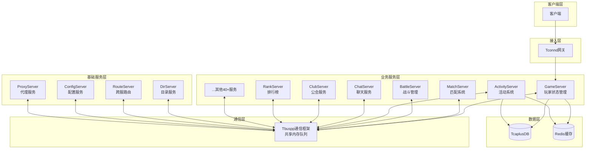
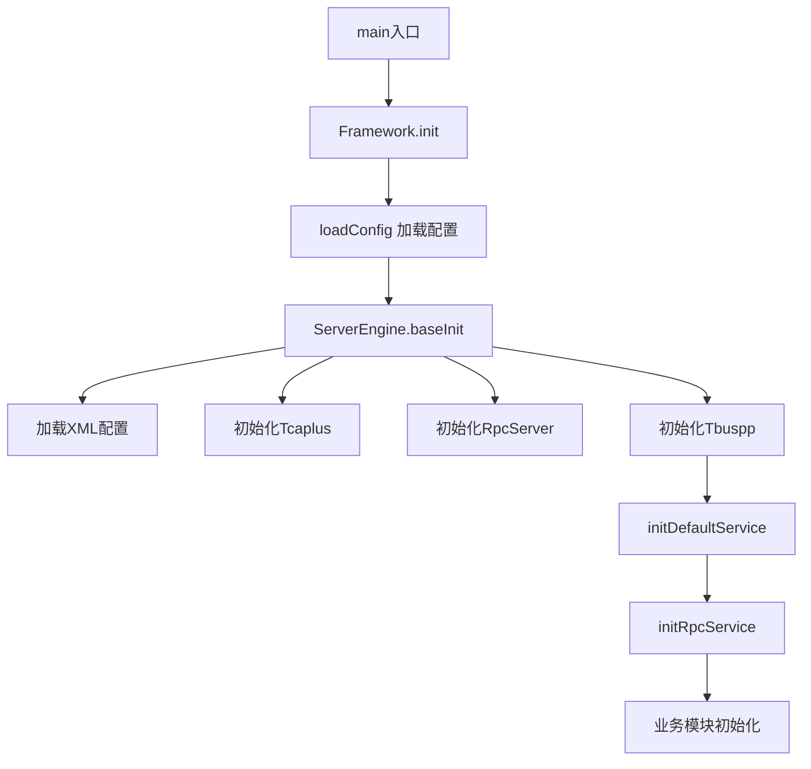
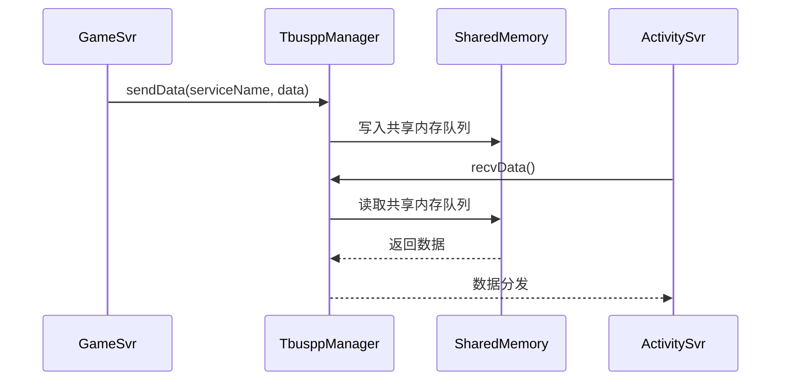
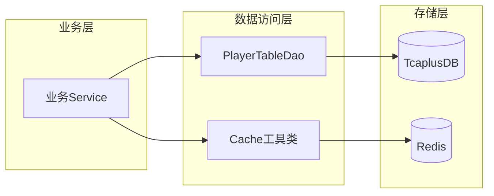
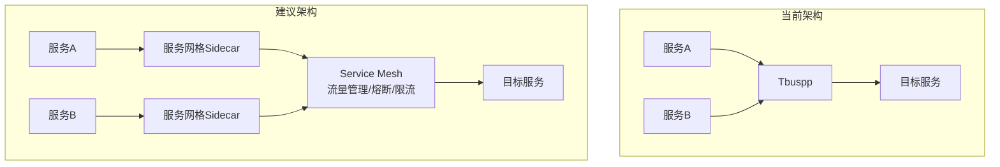

---

# 项目架构与服务全景分析

> **合并自**: 01 项目服务架构分析 + 03 项目业务服务模块分析报告
> **涵盖范围**: 整体架构设计、分层结构、核心框架实现、60+服务模块全景、标准化开发模式、改进建议

---

## 一、整体架构概览

### 1.1 系统架构图



### 1.2 技术栈

| 层级 | 技术 |
|------|------|
| 构建工具 | Gradle |
| 主要语言 | Java (业务逻辑), C++ (底层框架) |
| RPC框架 | IRPC (基于TSF4G2), Tbuspp |
| 数据库 | TcaplusDB, Redis |
| 配置管理 | Rainbow实时配置 |
| 序列化 | Protocol Buffers |
| 脚本支持 | Groovy (热更新/测试) |
| 基础框架 | TSF4G2 (Tencent Service Framework For Game 2) |

---

## 二、项目分层结构

### 2.1 模块划分

项目采用 **Gradle 多模块架构**，主要分为以下层次：

| 层次 | 目录 | 功能说明 |
|------|------|----------|
| **公共框架层** | `WeA/common` | 框架核心、工具类、通信协议、数据访问层 |
| **工具库层** | `WeA/timiutil` | 监控、属性读取、协程等工具组件 |
| **协议层** | `WeA/protocol` | Protobuf协议定义与生成代码 |
| **业务服务层** | `WeA/projects/*` | 60+ 个独立微服务 |
| **运行配置层** | `run/` | 部署脚本、配置文件 |

### 2.2 标准化服务分层架构

每个业务服务内部遵循统一的分层：

```
┌─────────────────────────────────────────┐
│            RPC Layer (rpc/service/)      │  ← 对外接口层
├─────────────────────────────────────────┤
│           Service Layer (service/)       │  ← 业务服务层
├─────────────────────────────────────────┤
│           Manager Layer (manager/)       │  ← 管理器层
├─────────────────────────────────────────┤
│           Logic Layer (logic/)           │  ← 业务逻辑层
├─────────────────────────────────────────┤
│           Data Layer (data/, db/)        │  ← 数据访问层
└─────────────────────────────────────────┘
```

---

## 三、核心架构层实现分析

### 3.1 框架引擎层 (Framework + ServerEngine)

**实现位置**: 
- [Framework.java](C:/UGit/letsgo_server/WeA/common/src/main/java/com/tencent/nk/commonframework/Framework.java)
- [ServerEngine.java](C:/UGit/letsgo_server/WeA/common/src/main/java/com/tencent/nk/commonframework/ServerEngine.java)

**核心职责**:
```java
// Framework 核心功能
public class Framework extends FrameworkUtil {
    // 1. 全局初始化入口
    public void init(ServerEngine engine, String[] args) {
        // 协程初始化、RPC初始化、配置加载等
        CoroHandle.init();
        engine.initDefaultService();
        engine.initRpcService();
    }
    
    // 2. 主循环驱动
    public void run() {
        while (state == EngineState.ES_Running) {
            // 处理协程任务、定时器、RPC消息
        }
    }
}

// ServerEngine 抽象基类
public abstract class ServerEngine extends ServerEngineUtil {
    protected static RpcClient rpcClient;      // RPC客户端
    protected static RpcServer rpcServer;      // RPC服务端
    protected static G6IrpcClient g6IrpcClient; // G6 IRPC客户端
    protected static G6IrpcServer g6IrpcServer; // G6 IRPC服务端
    
    // 生命周期管理
    public final int baseInit(Framework framework);  // 基础初始化
    protected abstract int init();                    // 子类实现具体初始化
    protected void preRun();                          // 运行前准备
}
```

**设计思路**:
- **模板方法模式**: `ServerEngine` 定义初始化骨架，具体服务继承实现
- **单例+工厂模式**: 全局服务通过 `getInstance()` 获取
- **生命周期管理**: 统一管理服务的启动、运行、热更新、停机流程

#### 统一的服务启动流程



---

### 3.2 通信层 (Tbuspp + RPC)

**实现位置**: 
- [TbusppManager.java](C:/UGit/letsgo_server/WeA/common/src/main/java/com/tencent/tbuspp/TbusppManager.java)
- [RpcClient.java](C:/UGit/letsgo_server/WeA/common/src/main/java/com/tencent/rpc/RpcClient.java)



**核心实现**:
```java
public class TbusppManager implements NtfEventListener {
    // 消息路由策略
    static public enum RouteType {
        Random(1),    // 随机路由
        MHash(3),     // 模哈希
        CHash(4),     // 一致性哈希
        Master(5);    // 主节点
    }
    
    // 服务发现与注册
    public void registerService(String serviceName, String userData);
    
    // 消息收发
    public int sendData(String serviceName, ByteBuf data, MsgParam param);
    public int recvData(byte[] data, MsgDesc desc);
}
```

**设计特点**:
- **共享内存通信**: 避免网络开销，适合同机多进程部署
- **服务发现**: 基于名字服务的动态路由
- **负载均衡**: 支持多种路由策略（一致性哈希/随机/主从）

---

### 3.3 协程框架层 (Coroutine)

**实现位置**: 
- [LocalService.java](C:/UGit/letsgo_server/WeA/common/src/main/java/com/tencent/timiCoroutine/LocalService.java)
- [coroutine.h](C:/UGit/letsgo_server/WeA/common/src/main/cpp/irpc/include/common/base/coroutine.h)

**核心架构**:
```java
public abstract class LocalService {
    // 协程执行器
    private ArrayList<TimiCoroScheduledExecutorService> scheduledExecutorArrayList;
    
    // 任务调度
    public <V> V callJob(Callable<V> callable, long timeout, String jobname);
    public <V> void runJob(Callable<V> callable, String jobname);
    
    // 顺序队列（保证同一玩家请求串行处理）
    public static class LocalServiceSequentialWrapper {
        public void runJob(long hashKey, Callable<?> invoker, ProtocolInfo info);
    }
}
```

**设计思路**:
- **用户态协程**: 避免线程切换开销
- **哈希队列**: 同一玩家请求分配到同一队列，保证串行处理
- **超时控制**: 每个任务有超时时间，防止阻塞

---

### 3.4 数据访问层 (DAO + Cache)

**实现位置**:
- [PlayerTableDao.java](C:/UGit/letsgo_server/WeA/common/src/main/java/com/tencent/tcaplus/dao/PlayerTableDao.java)
- [Cache.java](C:/UGit/letsgo_server/WeA/common/src/main/java/com/tencent/cache/Cache.java)



**核心实现**:
```java
// TcaplusDB 数据访问
public class PlayerTableDao {
    public static TcaplusDb.Player getTcaplusPlayer(long uid) {
        TcaplusDb.Player.Builder record = TcaplusDb.Player.newBuilder();
        record.setUid(uid);
        TcaplusManager.TcaplusReq req = TcaplusUtil.newGetReq(record);
        TcaplusManager.TcaplusRsp queryRsp = req.send();  // 协程同步调用
        return (TcaplusDb.Player) queryRsp.firstRecordData().msg;
    }
}

// Redis 缓存封装
public class Cache {
    private static Map<String, CacheNode> allNode = new ConcurrentHashMap<>();
    
    public enum CacheNodeType {
        MAIN,    // 主游戏节点
        REGION,  // 大区节点
        MINOR,   // 次要节点
    }
    
    // 支持协程的Redis操作
    public static CoRedisCmd<String, String> getCoRedisCmdForString();
}
```

**设计特点**:
- **Protobuf序列化**: 数据表结构用Protobuf定义
- **协程友好**: 数据库/缓存操作支持协程异步等待
- **多节点支持**: 支持主/大区/次要多个Redis节点

---

### 3.5 配置热更新机制

**实现位置**: [HotResLoader.java](C:/UGit/letsgo_server/WeA/common/src/main/java/com/tencent/hotresourceloader/HotResLoader.java)

```java
public class HotResLoader {
    private HotResHolder hotResHolder = new HotResHolder();
    
    // 初始化加载
    public static int init() {
        return getInstance().getHotResHolder().init();
    }
    
    // 获取配置表实例
    public static HotResTable<?, ?, ?> getResTableInstance(String resName) {
        return getInstance().getHotResHolder().getResTableInstance(resName);
    }
}

// 配置表基类
public abstract class HotResTable<K, V, P extends Message> {
    // 热更新回调
    protected void onHotResLoad();     // 全量加载
    protected void onHotResReplace();  // 增量替换
    protected void onHotResDelete();   // 删除处理
}
```

**更新流程**:
1. 配置存储在Redis
2. 通过版本号检测变更
3. 支持全量/增量更新
4. 回调机制通知业务层

---

### 3.6 业务服务实现模式

以 `ActivityServiceImpl` 为例分析业务服务实现模式：

```java
public class ActivityServiceImpl implements ActivityService {
    
    // 1. RPC方法实现 - 请求响应模式
    @Override
    public RpcResult<RpcPlayerLoginRes.Builder> rpcPlayerLogin(RpcPlayerLoginReq.Builder req) {
        // 参数校验
        if (uid <= 0) return RpcResult.create(NKErrorCode.InvalidParams);
        
        // 获取玩家对象
        PlayerActivity player = getPlayer(uid, req.getBaseInfo());
        
        // 业务处理
        player.updateHandleTime("rpcPlayerLogin");
        
        // 构建响应
        return RpcResult.create(resBuilder);
    }
    
    // 2. 分布式锁抢占
    @Override
    public RpcResult<CacheLockPreemptRes.Builder> cacheLockPreempt(CacheLockPreemptReq.Builder req) {
        // 玩家状态标记
        player.setStatus(PlayerActivityStatus.NEED_WEEKOUT);
        // 数据存盘
        PlayerActivityManager.getInstance().savePlayerToDb(uid);
        // 释放锁
        PlayerActivityManager.getInstance().releaseLock(uid);
    }
}
```

**服务实现规范**:
1. **接口定义**: 通过Protobuf定义RPC接口
2. **参数校验**: 每个方法入口进行参数校验
3. **玩家对象管理**: 通过Manager获取/创建玩家对象
4. **生命周期续约**: 每次操作更新玩家活跃时间
5. **异常处理**: 统一捕获异常返回错误码

---

## 四、服务模块全景（约60个服务）

### 4.1 核心游戏服务 (Core Game Services)

| 服务 | 功能 | 代码规模 | 模块结构 |
|------|------|---------|---------|
| **gamesvr** | 游戏主服务，玩家会话管理 | 特大(GSEngine 208KB) | framework/, playerservice/(119+子模块), rpc/, irpc/, scripts/ |
| **battlesvr** | 战斗服务，对局管理和结算 | 大(BattleInfo 593KB) | battleservice/battledata/, settlement/, metaai/, level/ |
| **lobbysvr** | 大厅服务，玩家状态同步 | 大(LobbyMgr 104KB) | lobbyservice/lobbydata/, migrate/, chat/, place/ |
| **matchsvr** | 匹配服务，玩家队伍匹配 | 大(MatchAlgorithmUtils 84KB) | matchservice/matchdata/, matchProcService/, matchStatistics/ |

**典型模块结构**（以 gamesvr 为例）：
```
gamesvr/
├── framework/          # 服务引擎和配置
│   ├── GSEngine.java   # 游戏服务引擎（极大文件）
│   ├── GSConfig.java   # 配置管理
│   └── GSWarmUp.java   # 预热逻辑
├── playerservice/      # 玩家业务模块（119+子目录）
│   ├── login/          # 登录
│   ├── bag/            # 背包
│   ├── mall/           # 商城
│   ├── task/           # 任务
│   ├── arena/          # 竞技场
│   └── ...             # 其他玩家功能
├── rpc/
│   ├── service/        # RPC服务实现
│   └── plugin/         # RPC插件
├── irpc/service/       # IRPC服务实现
├── chatservice/        # 聊天服务
└── scripts/            # Groovy测试脚本
```

### 4.2 活动运营服务 (Activity Services)

| 服务 | 功能 |
|------|------|
| **activitysvr** | 活动管理服务，包含60+种活动实现 |
| **cronjobsvr** | 定时任务服务 |
| **idipsvr** | IDIP运营平台对接 |

**activitysvr 模块设计**:
```
activitysvr/
├── framework/ActivityEngine.java      # 活动服务引擎
├── rpc/service/ActivityServiceImpl.java (64KB - 大文件)
├── service/
│   ├── implement/                      # 60+种活动具体实现
│   │   ├── WishActivity.java          # 许愿活动
│   │   ├── MonopolyActivity.java      # 大富翁活动
│   │   ├── LuckyKoiActivity.java      # 锦鲤活动
│   │   └── ...
│   ├── manager/                        # 活动管理器
│   ├── condition/                      # 条件系统
│   ├── db/                             # 数据访问层
│   └── gm/                             # GM指令
└── rpc/plugin/SetupPlugin.java        # RPC注册
```

### 4.3 UGC (User Generated Content) 服务

| 服务 | 功能 |
|------|------|
| **ugcsvr** | UGC主服务，地图管理 |
| **ugcplatsvr** | UGC平台服务 |
| **ugcappsvr** | UGC应用服务 |
| **ugcdatastoresvr** | UGC数据存储 |
| **ugcscenesvr** | UGC场景服务 |
| **ugcsceneallocsvr** | UGC场景分配 |
| **ugcmovesvr** | UGC资源迁移 |

**ugcsvr 模块设计**（复杂业务模块示例）：
```
ugcsvr/
├── framework/UgcSvrEngine.java (53KB)
├── action/           # 业务动作层
│   ├── ds/           # DS相关动作
│   ├── player/       # 玩家相关动作
│   └── ugc/          # UGC相关动作(60+)
├── data/             # 数据模型层
├── db/               # 数据访问层
│   ├── redis/
│   ├── tcaplus/
│   └── table/
├── handle/           # 处理器层
├── logic/            # 业务逻辑层
├── manager/          # 管理器层(20+)
├── module/           # 功能模块层
├── procedure/        # 流程控制层
├── proxy/            # 代理层
├── service/          # 服务接口层
└── lock/             # 分布式锁
```

### 4.4 社交服务 (Social Services)

| 服务 | 功能 |
|------|------|
| **chatsvr** | 聊天服务 |
| **clubsvr** | 俱乐部/公会服务 |
| **snssvr** | 社交网络服务 |
| **ranksvr** | 排行榜服务 |

**ranksvr 模块设计**（Leader-Follower架构）：
```
ranksvr/
├── framework/RankEngine.java (94KB)
├── rankservice/
│   ├── backend/              # 后端存储
│   │   ├── ApolloTRankMgr.java
│   │   ├── PlatMgr.java
│   │   └── ZSetMgr.java
│   ├── cache/                # 缓存层
│   ├── coordination/         # 分布式协调
│   │   ├── candidate/        # 候选者
│   │   ├── leader/           # 主节点
│   │   └── follower/         # 从节点
│   └── utils/
└── rpc/service/
```

### 4.5 基础设施服务 (Infrastructure Services)

| 服务 | 功能 |
|------|------|
| **dirsvr** | 目录服务（玩家路由） |
| **proxysvr** | 代理服务（跨服通信） |
| **routesvr** | 路由服务 |
| **crossroutesvr** | 跨区路由 |
| **configsvr** | 配置服务 |
| **cachesvr** | 缓存服务 |
| **seqsvr** | 序列号服务 |
| **asyncsvr** | 异步任务服务 |

### 4.6 分配服务 (Allocation Services)

| 服务 | 功能 |
|------|------|
| **lobbyallocsvr** | 大厅分配 |
| **matchallocsvr** | 匹配分配 |
| **dscallocsvr** | DSC分配 |
| **ugcsceneallocsvr** | UGC场景分配 |

### 4.7 支付与经济服务 (Payment Services)

| 服务 | 功能 |
|------|------|
| **midassvr** | Midas支付服务 |
| **midasplatsvr** | Midas平台服务 |

### 4.8 特色玩法服务 (Game Mode Services)

| 服务 | 功能 |
|------|------|
| **farmsvr** | 农场玩法 |
| **farmcrazysvr** | 农场狂热模式 |
| **farmcrazymatchsvr** | 农场匹配 |
| **arenasvr** | 竞技场服务 |
| **cocsvr** | 家园玩法服务 |
| **tycoonsvr** | 大亨玩法 |
| **xiaowosvr** | 小窝玩法 |

### 4.9 AI相关服务 (AI Services)

| 服务 | 功能 |
|------|------|
| **aigcsvr** | AIGC服务 |
| **ainpcsvr** | AI NPC服务 |

### 4.10 其他服务

| 服务 | 功能 |
|------|------|
| **httpsvr** | HTTP接口服务 |
| **streamsvr** | 流媒体服务 |
| **danmusvr** | 弹幕服务 |
| **lbssvr** | LBS位置服务 |
| **translatesvr** | 翻译服务 |
| **profilesvr** | 用户画像服务 |
| **analyzesvr** | 数据分析服务 |
| **privatesvr** | 私有服务 |

### 4.11 按职责分类汇总

| 类别 | 服务 | 核心任务 |
|------|------|---------|
| **玩家会话** | gamesvr | 玩家登录、会话管理、消息路由 |
| **匹配对局** | matchsvr, battlesvr | 队伍匹配、对局创建、战斗结算 |
| **场景管理** | lobbysvr, roomsvr, scenesvr | 大厅同步、房间管理、场景状态 |
| **运营活动** | activitysvr, cronjobsvr | 活动逻辑、定时任务 |
| **UGC系统** | ugcsvr系列 | 用户创作内容管理 |
| **社交系统** | chatsvr, clubsvr, snssvr | 聊天、公会、好友 |
| **排行榜** | ranksvr | 多维度排行榜计算与同步 |
| **支付** | midassvr | 充值、道具购买 |
| **基础设施** | 各种xxxsvr | 路由、缓存、配置、序列号等 |

---

## 五、RPC服务标准实现模式

```java
// 典型的RPC服务实现结构
public class XxxServiceImpl extends RpcServiceBase {
    // RPC方法处理
    public void handleXxxReq(RpcContext ctx, XxxReq req) {
        // 1. 参数校验
        // 2. 业务逻辑调用
        // 3. 响应返回
    }
}

// 插件注册
public class SetupPlugin {
    public void setup() {
        RpcServer.register(new XxxServiceImpl());
    }
}
```

---

## 六、改进空间分析

### 6.1 代码质量问题

#### 问题1: 巨型类文件（God Class）
| 文件 | 行数/大小 | 问题 |
|------|----------|------|
| BattleInfo.java | 593KB | 战斗信息过于庞大 |
| GSEngine.java | 208KB | 游戏引擎职责过重 |
| BattleMgr.java | 227KB | 管理器承担过多逻辑 |
| PlayerArenaMgr.java | 225KB | 竞技场管理器 |
| ActivityServiceImpl.java | 64KB | RPC实现类过大 |

**改进建议**：
- 按功能拆分为多个子模块，使用**组合模式**分离职责
- 引入**领域驱动设计(DDD)**概念

#### 问题2: 深层目录嵌套 & 服务粒度不一致

- 有些服务非常小（如 `seqsvr`），有些极其庞大（如 `gamesvr` 包含119+子模块）
- 某些模块目录层级过深，如 `matchservice/matchdata/matchProcService/matchProcCommon/matchFillStrategy/`

**改进建议**：
- 扁平化目录结构，按功能域而非技术层分包
- 将 `gamesvr` 的 `playerservice` 拆分为独立微服务
- 建立统一的服务边界规范

### 6.2 架构层面改进



| 问题 | 现状 | 改进建议 |
|------|------|----------|
| **异常处理** | 各服务的错误处理方式不够统一 | 建立统一的错误码体系，实现全局异常拦截器 |
| **配置管理** | 分散在properties/XML/Rainbow/Excel多处 | 统一配置中心，配置热更新机制标准化 |
| **缺乏统一监控** | — | 引入分布式链路追踪(Jaeger/SkyWalking) |
| **熔断限流** | — | 集成Sentinel/Hystrix进行流量控制 |
| **服务层臃肿** | `ActivityServiceImpl` 1400+行 | 使用**AOP切面**统一处理参数校验、异常等 |

**代码重构示例**:
```java
// 建议: 使用注解+AOP简化RPC方法
@RpcMethod(timeout = 5000, rateLimitKey = "uid")
public RpcResult<RpcPlayerLoginRes.Builder> rpcPlayerLogin(
    @Validated RpcPlayerLoginReq.Builder req) {
    // 参数校验、超时、限流由框架处理
    PlayerActivity player = getPlayer(req.getUid());
    return RpcResult.create(player.login());
}
```

### 6.3 数据层面改进

| 问题 | 改进建议 |
|------|---------|
| **缓存一致性** | 引入Cache-Aside模式的统一封装 |
| **读写分离** | 对读多写少的数据进行读写分离 |
| **分库分表** | 随着数据量增长，考虑数据分片 |

### 6.4 可维护性改进

| 问题 | 改进建议 |
|------|---------|
| **测试覆盖不足** | 增加JUnit单元测试，引入集成测试框架 |
| **文档缺失** | 使用Swagger/OpenAPI生成API文档，绘制服务依赖关系图 |
| **遗留代码** | 清理历史遗留文件、统一注释规范 |
| **Groovy脚本管理** | 开发者个人脚本混入版本库，需清理 |

### 6.5 可观测性增强

```
建议增强:
├── 日志聚合: ELK/Loki 统一日志查询
├── 指标监控: Prometheus + Grafana 完善指标
├── 链路追踪: 分布式调用链追踪
├── 告警系统: 基于规则的智能告警
└── 性能分析: 持续性能profiling
```

---

## 七、总结

### 架构评价

该项目是一个**成熟的游戏服务端微服务架构**，具有以下特点：

1. **技术栈**：Java + C++ 混合，Gradle构建，Protobuf通信
2. **通信机制**：Tbuspp共享内存 + RPC/IRPC
3. **并发模型**：协程 + 哈希队列保证串行
4. **数据存储**：TcaplusDB + Redis
5. **部署方式**：Docker/K8s容器化
6. **服务规模**：约60个独立微服务，按功能域清晰划分

### 架构成熟度

| 维度 | 评分 | 说明 |
|------|------|------|
| 性能设计 | ⭐⭐⭐⭐⭐ | 共享内存+协程，高性能 |
| 可扩展性 | ⭐⭐⭐⭐ | 微服务架构，但部分服务过大 |
| 可维护性 | ⭐⭐⭐ | 代码量大，部分模块耦合 |
| 可观测性 | ⭐⭐⭐ | 有基础监控，可增强 |
| 容错能力 | ⭐⭐⭐⭐ | 有分布式锁、存盘机制 |

### 后续优化优先级

1. **P0 - 代码质量**：大服务拆分、统一异常处理、统一错误码体系
2. **P1 - 可观测性**：完善链路追踪、告警体系
3. **P1 - 测试覆盖**：增加单元测试和集成测试
4. **P2 - 服务治理**：引入熔断限流、服务网格
5. **P3 - 架构演进**：领域驱动设计、CQRS模式

---

### 📊 面试话术

**Q: 介绍一下你们项目的架构？**

> 我们项目是一个基于TSF4G2框架的大型游戏服务端微服务架构，包含约60个独立微服务。采用Java+C++混合开发，使用Tbuspp共享内存队列实现服务间高性能通信（微秒级延迟），协程模型处理高并发请求。数据层使用TcaplusDB+Redis，部署在K8s容器平台上。
>
> 核心服务包括：gamesvr负责玩家会话管理（119+业务子模块），matchsvr/battlesvr处理匹配和战斗，activitysvr管理60+种运营活动，还有UGC、社交、排行榜等专项服务。通过Protobuf定义统一的RPC接口，每个服务遵循"RPC层→Service层→Manager层→Logic层→Data层"的标准分层架构。

**Q: 这个架构有什么优缺点？你做了什么改进？**

> **优点**：共享内存通信性能极高、协程模型支撑高并发、微服务独立部署职责清晰、配置热更新减少停服。
>
> **不足**：部分核心服务（如gamesvr 208KB引擎文件）过于庞大，存在God Class问题；错误处理和配置管理分散。
>
> **改进方向**：引入DDD做服务边界划分、AOP统一处理横切关注点、建设分布式链路追踪提升可观测性。