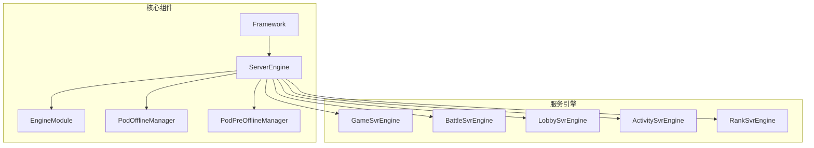
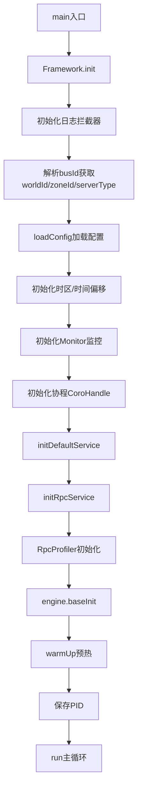
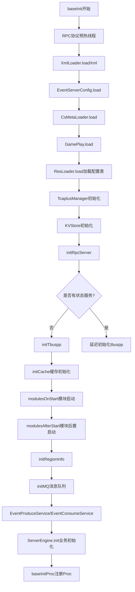
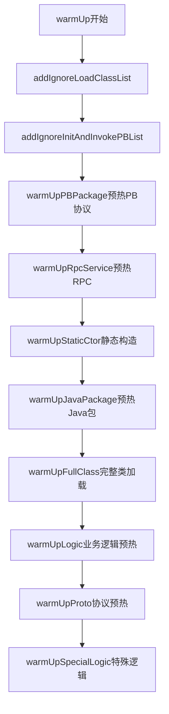
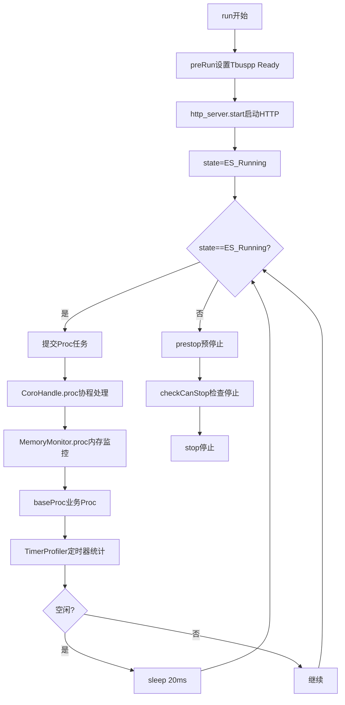
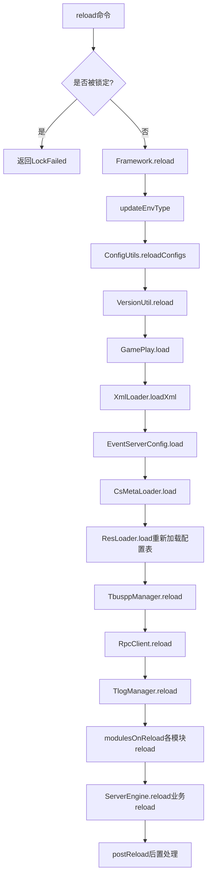
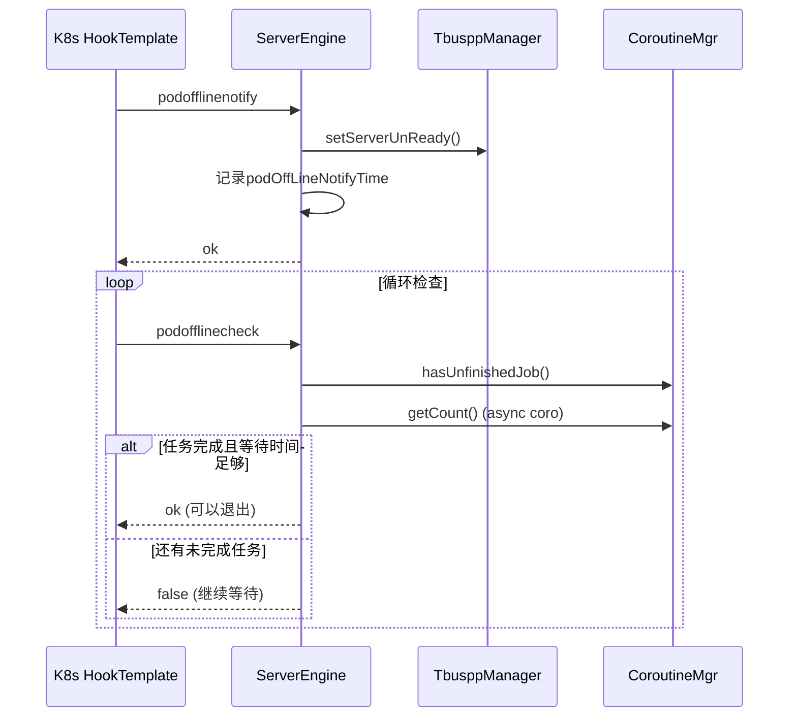
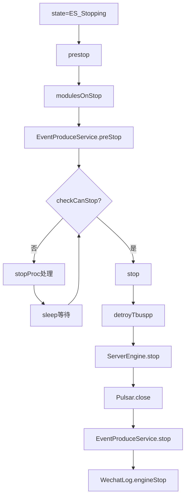

---

# 项目服务启动、重启等主要系统流程分析报告

## 一、总体架构概述

该项目是一个基于Java的大型游戏服务器框架，采用**微服务架构**，包含多种类型的服务（如GameServer、LobbyServer、BattleServer等）。核心框架由以下几个关键组件构成：



---

## 二、服务启动流程详解

### 2.1 启动入口与初始化阶段

服务启动入口位于各具体Engine的 `main` 方法：

```java
// 例如 ActivityEngine
public static void main(String[] args) {
    Framework.getInstance().init(ActivityEngine.getInstance(), args);
}
```

### 2.2 Framework.init() - 主初始化流程



**承担的任务**：
1. **环境解析**：从bus_id解析世界ID、区服ID、服务器类型、实例ID
2. **配置加载**：加载本地配置和七彩石(Rainbow)实时配置
3. **基础设施初始化**：时区、监控、GUID生成器等
4. **协程系统初始化**：CoroHandle.init()
5. **RPC服务初始化**：创建RpcClient、RpcServer

### 2.3 ServerEngine.baseInit() - 引擎基础初始化

这是服务启动的核心阶段，[ServerEngine.java](C:/UGit/letsgo_server/WeA/common/src/main/java/com/tencent/nk/commonframework/ServerEngine.java) 中的 `baseInit` 方法：



**关键子流程**：

| 阶段 | 任务描述 |
|------|----------|
| **loadXml** | 加载XML格式的配置定义 |
| **CsMetaLoader** | 加载客户端-服务端通信元数据 |
| **ResLoader** | 加载Excel导出的Protobuf配置表(.pbin) |
| **TcaplusManager** | 初始化TcaplusDB连接 |
| **initTbuspp** | 初始化Tbuspp服务发现和通信框架 |
| **modulesOnStart/AfterStart** | 按顺序初始化各业务模块 |

### 2.4 模块生命周期管理

[EngineModule.java](C:/UGit/letsgo_server/WeA/timiutil/src/main/java/com/tencent/timiutil/framework/module/EngineModule.java) 定义了标准的模块生命周期：

```java
public abstract class EngineModule {
    public abstract int onStart();      // 模块初始化(仅初始化模块本身)
    public abstract int afterStart();   // 模块初始化(跨模块初始化)
    public abstract int onReload();     // reload时调用
    public abstract int onStop();       // stop时调用
}
```

### 2.5 预热流程(WarmUp)

预热是保证服务启动后能快速响应请求的关键，[CustomWarmUpFlow.java](C:/UGit/letsgo_server/WeA/common/src/main/java/com/tencent/nk/warmup/CustomWarmUpFlow.java) 实现了通用预热流程：



**预热内容**：
- **PB协议包**：Common/CS/SS/SR协议
- **RPC服务**：预先加载和实例化RPC服务类
- **Java包**：按命名空间批量加载类
- **业务逻辑**：特定业务的JIT编译优化

---

## 三、主循环流程(Run)

服务启动完成后进入主循环，[Framework.java](C:/UGit/letsgo_server/WeA/common/src/main/java/com/tencent/nk/commonframework/Framework.java) 中的 `run` 方法：



**主循环承担的任务**：
1. **协程调度**：处理协程任务队列
2. **内存监控**：定期检查内存使用
3. **业务Proc**：执行各模块的定时任务（如TcaplusManager.proc、Cache.proc等）
4. **性能统计**：收集和上报Timer/StopWatch统计

---

## 四、热更新/Reload流程

### 4.1 Reload触发方式

1. **HTTP命令**：通过 `/cmd?cmd=reload` 接口
2. **七彩石变更监听**：配置变更自动触发
3. **脚本命令**：通过 `service.sh reload` 

### 4.2 Reload执行流程

[Framework.java](C:/UGit/letsgo_server/WeA/common/src/main/java/com/tencent/nk/commonframework/Framework.java) 中的 `doCmd` 方法处理reload命令：



### 4.3 各服务的Reload实现

以 [ActivityEngine.java](C:/UGit/letsgo_server/WeA/projects/activitysvr/src/main/java/com/tencent/wea/framework/ActivityEngine.java) 为例：

```java
@Override
public int reload() {
    int ret = 0;
    if (activityService.reload() != 0) {
        LOGGER.error("activityService reload error");
        ret |= -1;
    }
    if (slowJobService.reload() != 0) {
        ret |= -1;
    }
    
    int retReloadShardName = reloadTbusppShardName();
    
    // 刷新配置
    ActivityConfigManager.getInstance().reloadCfg();
    ActsvrOutputMgr.reload();
    
    return ret;
}
```

---

## 五、优雅退出流程

### 5.1 Pod下线流程(PodOffline)

[PodOfflineManager.java](C:/UGit/letsgo_server/WeA/common/src/main/java/com/tencent/nk/server/PodOfflineManager.java) 管理K8s环境下的优雅退出：



**关键检查点**：
1. **Tbuspp Ready状态**：设置为unready停止接收新请求
2. **协程任务完成**：检查是否有未完成的协程任务
3. **异步操作完成**：检查RPC、Redis、Tcaplus等异步操作
4. **最小等待时间**：确保下游服务已感知状态变更（默认15秒）

### 5.2 预下线流程(PodPreOffline)

[PodPreOfflineManager.java](C:/UGit/letsgo_server/WeA/common/src/main/java/com/tencent/nk/server/PodPreOfflineManager.java) 处理不需要销毁Pod的内存清理：

```java
public boolean podPreOffLineCheck() {
    // 检查协程数量
    if(check) {
        if (CoroutineMgr.getInstance().hasUnfinishedJob()) {
            return false;
        }
        if (CoroutineAsyncMgr.getCount() != 0) {
            return false;
        }
    }
    
    // 最小等待时间
    long preOfflineTimeMs = podPreOffLineNotifyTime + 5_000;
    if (Framework.currentTimeMillis() < preOfflineTimeMs) {
        return false;
    }
    return true;
}
```

### 5.3 服务级自定义下线逻辑

不同服务可覆盖 `podOffLineCheck` 实现自定义检查逻辑，例如：

- **BattleSvr**：等待所有Battle结束
- **MatchSvr**：通知预下线并等待匹配完成  
- **IdipSvr**：隔离北极星流量后等待120秒
- **ClubSvr**：通知俱乐部下线并检查数据同步

---

## 六、停止流程(Stop)



---

## 七、配置管理流程

### 7.1 配置层次

```
配置优先级（从高到低）:
1. 七彩石实时配置（Rainbow KV）
2. 环境自定义配置（custom/*.yaml）
3. 环境通用配置（{env_flag}/*.yaml）
4. 全局配置（common.yaml + other.yaml）
5. 代码默认值
```

### 7.2 配置类型

| 类型 | 加载器 | 特点 | 示例 |
|------|--------|------|------|
| 进程配置 | PropertyFileReader | 支持缓存/实时两种模式 | 开关、参数 |
| 资源配置 | ResLoader | Protobuf格式，支持七彩石热更 | 道具、任务配置表 |
| 热更配置 | HotResLoader | Redis存储，增量更新 | 活动、商城配置 |

### 7.3 配置变更监听

```java
// 七彩石配置变更监听
RainbowConfigLoader.registerConfigChangeCallback(
    rainbowEnv,
    rainbowGroupName,
    ConfChangeListeners.RELOAD_CALLBACK_FUNC
);

// 变更时自动触发reload
public void callback(RainbowChangeInfo change) {
    if (Framework.getInstance().isRunning()) {
        Framework.getInstance().doCmd("reload", "rainbow");
    } else {
        Framework.getInstance().setNeedReloadAfterInitDone(true);
    }
}
```

---

## 八、改进空间分析

### 8.1 启动流程改进

| 问题 | 现状 | 改进建议 |
|------|------|----------|
| **启动时间过长** | 配置加载、预热等串行执行 | 1. 配置加载并行化<br>2. 预热任务按优先级分批异步执行 |
| **预热不够彻底** | 部分类首次使用时仍有JIT开销 | 1. 完善预热类列表<br>2. 增加C2编译预热 |
| **模块初始化顺序耦合** | onStart/afterStart区分不够清晰 | 1. 明确定义模块依赖关系<br>2. 引入依赖注入框架 |
| **错误处理不一致** | 部分初始化失败直接返回-1 | 1. 统一错误码定义<br>2. 增加初始化重试机制 |

### 8.2 热更新改进

| 问题 | 现状 | 改进建议 |
|------|------|----------|
| **Reload不是原子操作** | 部分reload成功部分失败时状态不一致 | 1. 引入事务机制<br>2. 支持回滚 |
| **配置验证缺失** | reload时可能加载不合法配置 | 1. 增加配置预检查<br>2. 配置灰度发布 |
| **Reload阻塞主线程** | 大量配置reload时影响服务响应 | 1. 异步reload<br>2. 渐进式配置替换 |

### 8.3 优雅退出改进

| 问题 | 现状 | 改进建议 |
|------|------|----------|
| **下线等待时间固定** | 默认15秒，某些场景不够灵活 | 1. 根据当前负载动态调整<br>2. 支持按业务类型配置 |
| **缺乏下线进度可视化** | 只能通过日志查看 | 1. 提供下线进度API<br>2. 暴露Prometheus指标 |
| **强制超时机制不完善** | 部分服务未实现`getMaxPodOfflineTimeMs` | 统一实现超时保护机制 |

### 8.4 监控和可观测性改进

| 问题 | 现状 | 改进建议 |
|------|------|----------|
| **启动耗时不够细化** | StopWatch只记录大阶段 | 增加更细粒度的启动耗时统计 |
| **缺乏健康检查标准化** | 各服务健康检查逻辑不统一 | 1. 定义标准健康检查接口<br>2. 集成K8s readiness/liveness探针 |
| **配置变更追踪不足** | 难以追溯配置变更历史 | 1. 配置变更审计日志<br>2. 配置版本管理 |

### 8.5 代码架构改进

| 问题 | 现状 | 改进建议 |
|------|------|----------|
| **Framework类过于庞大** | [Framework.java](C:/UGit/letsgo_server/WeA/common/src/main/java/com/tencent/nk/commonframework/Framework.java) 1500+行 | 拆分为多个职责明确的子类 |
| **模块依赖不清晰** | 模块间存在隐式依赖 | 1. 使用依赖注入<br>2. 明确模块边界 |
| **错误处理硬编码** | 大量魔法数字返回值 | 统一使用NKErrorCode枚举 |
| **日志级别不统一** | 关键流程使用logger.info/error混乱 | 制定日志级别使用规范 |

---

## 九、关键代码文件索引

| 文件 | 职责 |
|------|------|
| [Framework.java](C:/UGit/letsgo_server/WeA/common/src/main/java/com/tencent/nk/commonframework/Framework.java) | 核心框架，主循环、命令处理 |
| [ServerEngine.java](C:/UGit/letsgo_server/WeA/common/src/main/java/com/tencent/nk/commonframework/ServerEngine.java) | 服务引擎基类，生命周期管理 |
| [PodOfflineManager.java](C:/UGit/letsgo_server/WeA/common/src/main/java/com/tencent/nk/server/PodOfflineManager.java) | Pod优雅下线管理 |
| [EngineModuleContainer.java](C:/UGit/letsgo_server/WeA/timiutil/src/main/java/com/tencent/timiutil/framework/module/EngineModuleContainer.java) | 模块容器，生命周期调度 |
| [CustomWarmUpFlow.java](C:/UGit/letsgo_server/WeA/common/src/main/java/com/tencent/nk/warmup/CustomWarmUpFlow.java) | 预热流程管理 |
| [process.yaml](C:/UGit/letsgo_server/run/config/process.yaml) | 进程配置定义 |

---

这份分析涵盖了项目的主要系统流程。如需进一步深入分析某个特定流程或模块，请告诉我具体方向。