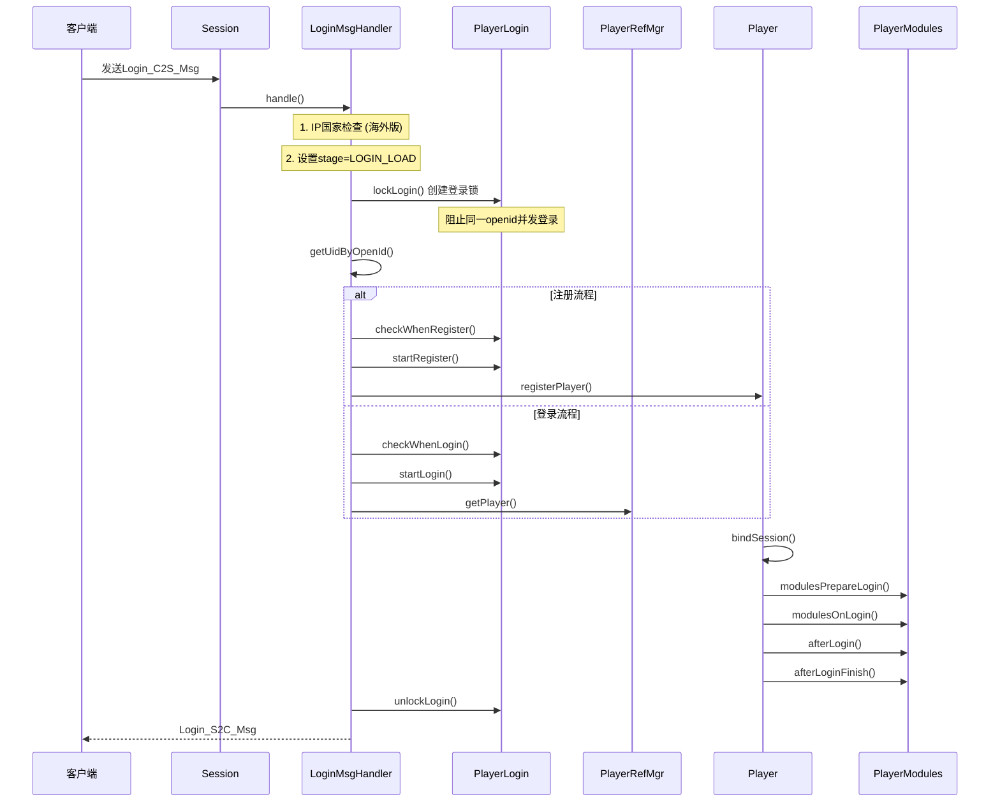
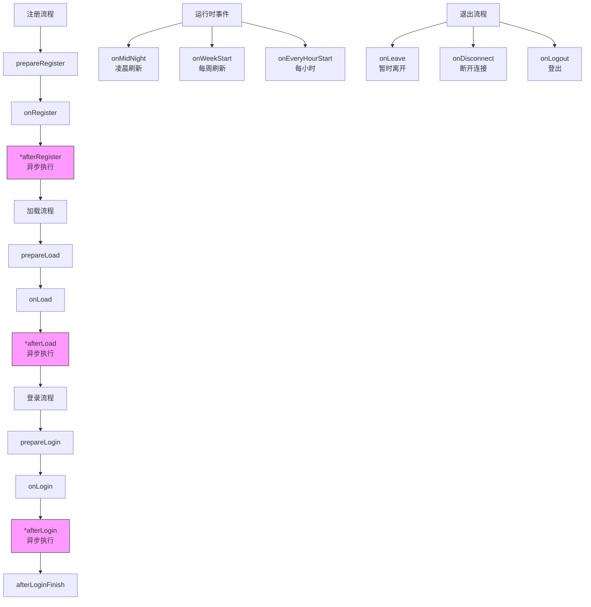
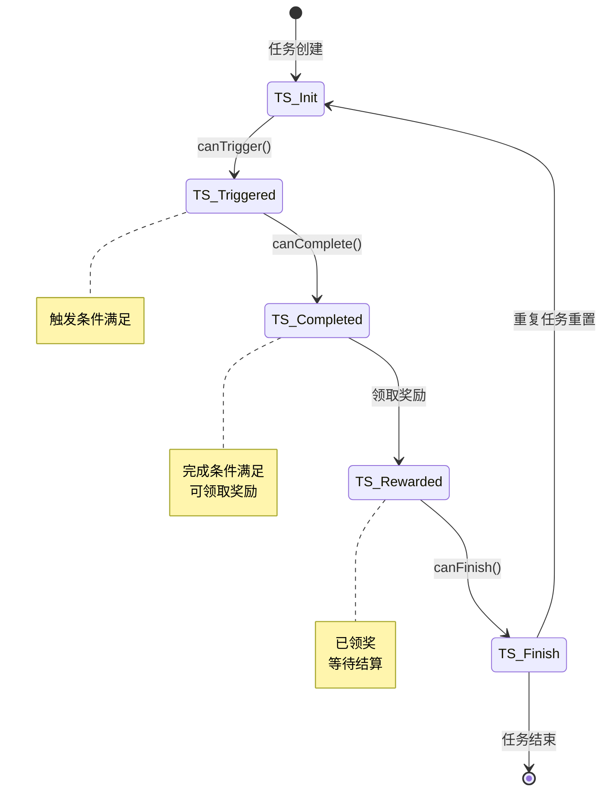
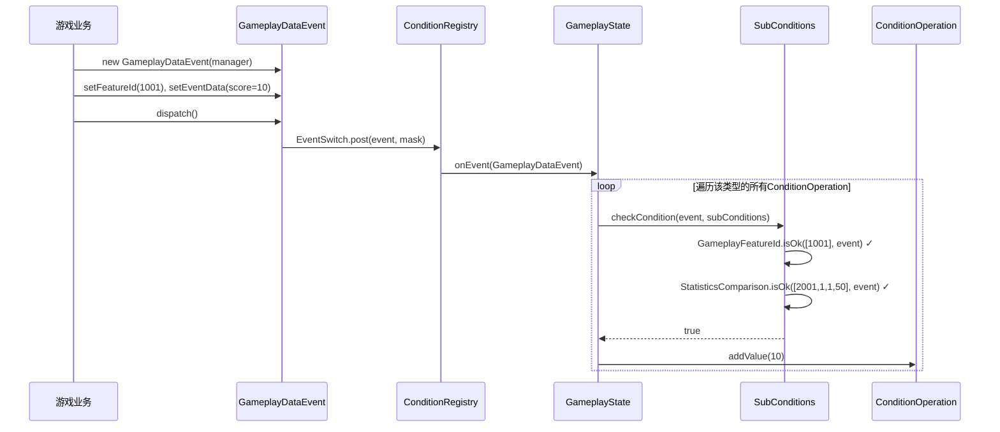
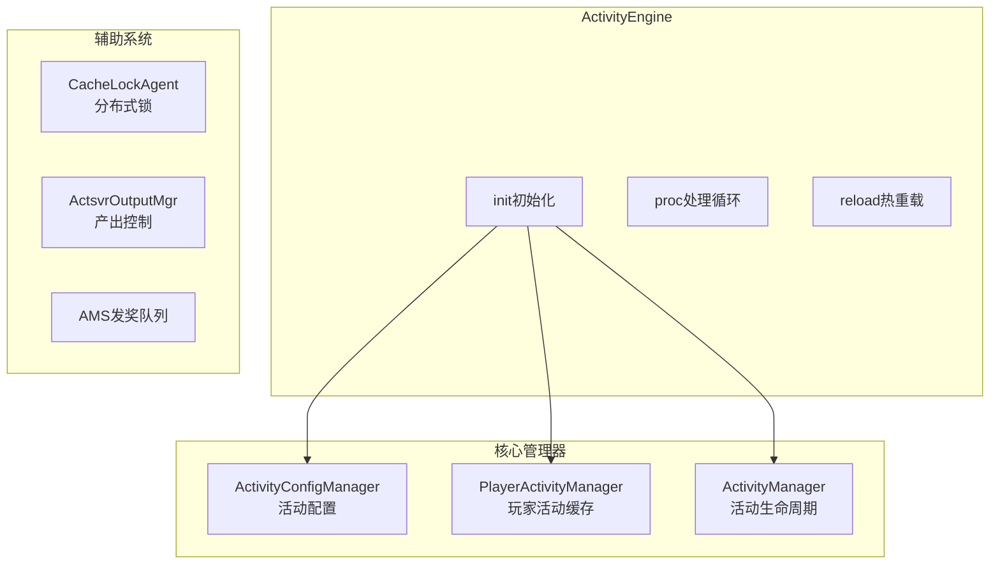

---

# 核心业务与条件系统分析

> **合并自**: 04 项目核心业务服务模块分析报告 + 条件系统解析
> **涵盖范围**: 玩家登录/登出流程、模块生命周期、条件/任务/成就系统完整架构、事件驱动机制、活动服务引擎

---

## 📋 分析目录

1. **玩家登录/登出流程分析**
2. **玩家模块生命周期管理**
3. **条件系统框架设计详解**
4. **条件系统核心组件**
5. **事件系统详解**
6. **条件系统实例说明**
7. **活动服务引擎分析**
8. **改进空间与建议**

---

## 1. 玩家登录/登出流程分析

### 1.1 登录流程架构



### 1.2 核心实现原理

**登录处理器** ([LoginMsgHandler.java](C:/UGit/letsgo_server/WeA/projects/gamesvr/src/main/java/com/tencent/wea/playerservice/cshandler/handler/player/LoginMsgHandler.java)):

```
登录流程关键步骤：
1. PlayerLogin.lockLogin() → 创建PlayerLoginLock，阻止并发登录
2. PlayerLogin.checkAlways() → 通用检查
3. player.load | player.register() → 加载/注册玩家数据
4. player.bindSession() → 绑定会话，包含login处理逻辑
5. player.afterLogin() → 登录后处理
```

**设计目的**：
- **并发控制**：通过 `PlayerLoginLock` 防止同一账号并发登录
- **数据一致性**：注册过程先插入 `zonetable`，再插入 `playertable`，最后增加 `openidtouid` 映射
- **热切换支持**：支持 `ReLogin` 重连模式，可重定向到其他 gamesvr

### 1.3 登出流程

```java
// Player.java 中的登出流程
private void logout(NKErrorCode errorCode) {
    // 1. 防沉迷处理
    AntiAddictMgr.getInstance().addLogoutQueue(getOpenId(), session);
    
    // 2. 反外挂处理
    getPlayerCreditScoreMgr().antiCheatLogoutProcess(errorCode);
    
    // 3. 更新统计数据 (在线时长等)
    basicInfo.setLogoutTimeMs(nowMillis);
    basicInfo.addDailyOnlineTimeMs(onlineInterval);
    
    // 4. 发送流水日志
    TlogFlowMgr.sendModPlayerLogoutFlow(this, ...);
    
    // 5. 触发登出事件
    getPlayerEventManager().dispatch(new LogoutEvent(getConditionMgr()));
    
    // 6. 各模块登出回调
    modulesOnLogout();
}
```

---

## 2. 玩家模块生命周期管理

### 2.1 PlayerModule 生命周期

基于 [PlayerModule.java](C:/UGit/letsgo_server/WeA/projects/gamesvr/src/main/java/com/tencent/wea/playerservice/gamemodule/modules/PlayerModule.java) 的设计：



### 2.2 设计原理

```java
public abstract class PlayerModule extends GameModule.Module {
    protected final Player player;
    private final GameModuleId module;
    
    // 构造时自动注册到Player
    public PlayerModule(GameModuleId module, Player player) {
        this.module = module;
        this.player = player;
        this.player.addModule(this);  // 自动注册
    }
    
    // 生命周期方法 - 注册阶段
    public abstract void prepareRegister() throws NKCheckedException;
    public abstract void onRegister() throws NKCheckedException;
    public abstract void afterRegister() throws NKCheckedException;  // 异步
    
    // 生命周期方法 - 加载阶段
    public abstract void prepareLoad() throws NKCheckedException;
    public abstract void onLoad() throws NKCheckedException;
    public abstract void afterLoad();  // 异步
    
    // 生命周期方法 - 登录阶段
    public abstract void prepareLogin() throws NKCheckedException;
    public abstract void onLogin() throws NKCheckedException;
    public abstract void afterLogin(boolean todayFirstLogin);  // 异步
    public abstract void afterLoginFinish(boolean todayFirstLogin);
    
    // 生命周期方法 - 运行时
    public abstract void onLogout();
    public abstract void onMidNight();
    public abstract void onWeekStart();
}
```

**设计目的**：
- **解耦**：各业务模块独立管理，通过生命周期钩子协调
- **异步优化**：`after*` 方法异步执行，不阻塞主流程
- **统一管理**：通过 `PlayerModuleContainer` 统一调度所有模块

---

## 3. 条件系统框架设计详解

### 3.1 整体架构

```
┌─────────────────────────────────────────────────────────────────────────────────┐
│                              条件/任务/成就系统架构                                │
├─────────────────────────────────────────────────────────────────────────────────┤
│                                                                                 │
│  ┌──────────────────┐    ┌──────────────────┐    ┌──────────────────┐          │
│  │   业务层 (Task/   │    │   业务层 (成就)    │    │  业务层 (活动)    │          │
│  │   Achievement)   │    │   AchievementMgr  │    │  ActivityMgr    │          │
│  └────────┬─────────┘    └────────┬─────────┘    └────────┬─────────┘          │
│           │                       │                       │                    │
│           └───────────────────────┼───────────────────────┘                    │
│                                   ▼                                            │
│  ┌─────────────────────────────────────────────────────────────────────────┐   │
│  │                    条件组层 (BaseConditionGroup)                          │   │
│  │   ┌─────────────┐  ┌─────────────┐  ┌─────────────┐                     │   │
│  │   │ConditionOp1 │  │ConditionOp2 │  │ConditionOp3 │   AND/OR/...       │   │
│  │   └─────────────┘  └─────────────┘  └─────────────┘                     │   │
│  └───────────────────────────────┬─────────────────────────────────────────┘   │
│                                  │                                             │
│                                  ▼                                             │
│  ┌─────────────────────────────────────────────────────────────────────────┐   │
│  │                   条件管理层 (ConditionManager)                           │   │
│  │          HashMap<ConditionType, List<ConditionOperation>>               │   │
│  └───────────────────────────────┬─────────────────────────────────────────┘   │
│                                  │                                             │
│                                  ▼                                             │
│  ┌─────────────────────────────────────────────────────────────────────────┐   │
│  │                   条件注册中心 (ConditionRegistry)                         │   │
│  │   ┌─────────────────────┐  ┌─────────────────────────────┐              │   │
│  │   │ 主条件 HashMap       │  │  子条件 HashMap             │              │   │
│  │   │ Type -> BaseCondition│  │  Type -> BaseSubCondition  │              │   │
│  │   └─────────────────────┘  └─────────────────────────────┘              │   │
│  └───────────────────────────────┬─────────────────────────────────────────┘   │
│                                  │                                             │
│                                  ▼                                             │
│  ┌─────────────────────────────────────────────────────────────────────────┐   │
│  │                   事件系统层 (EventSwitch / EventFilterMgr)               │   │
│  │   ┌──────────────┐  ┌──────────────┐  ┌──────────────┐                  │   │
│  │   │EventRouter   │  │SubscriberReg │  │MethodInfo   │                  │   │
│  │   └──────────────┘  └──────────────┘  └──────────────┘                  │   │
│  └───────────────────────────────┬─────────────────────────────────────────┘   │
│                                  │                                             │
│                                  ▼                                             │
│  ┌─────────────────────────────────────────────────────────────────────────┐   │
│  │                   事件层 (BaseConditionEvent / Events)                    │   │
│  │   GameplayDataEvent | LoginEvent | BattleEvent | ActivityEvent | ...    │   │
│  └─────────────────────────────────────────────────────────────────────────┘   │
│                                                                                 │
└─────────────────────────────────────────────────────────────────────────────────┘
```

### 3.2 任务状态机



### 3.3 RunTask 任务状态刷新核心逻辑

```java
public void refreshTask(TaskRefreshTriggerType triggerType) {
    if (conditionGroup != null) {
        conditionGroup.checkComplete();
    }
    
    boolean changed;
    do {
        changed = false;
        switch (attrTask.getStatus()) {
            case TS_Init:
                if (canTrigger()) {
                    changed = changeTaskStatus(TaskStatus.TS_Triggered);
                }
                break;
            case TS_Triggered:
                if (canComplete()) {
                    changed = changeTaskStatus(TaskStatus.TS_Completed);
                }
                break;
            case TS_Completed:
                if (isAutoReward()) {
                    receiveAutoReward();
                }
                break;
            case TS_Rewarded:
                if (canFinish()) {
                    changed = changeTaskStatus(TaskStatus.TS_Finish);
                }
                break;
        }
        
        if (changed) {
            registerAttrConditionGroup();  // 重新注册条件组
        }
    } while (changed);  // 循环直到状态稳定
}
```

### 3.4 条件触发完整流程

```
1. 业务事件发生 (如: 玩家升级)
   ↓
2. 创建事件对象 (PlayerLevelUpEvent)
   ↓
3. EventSwitch.post() 分发事件
   ↓
4. BaseCondition.handleEvent() 处理事件
   ↓
5. ConditionOperation.addValue() 更新进度
   ↓
6. RunTask.refreshTask() 检查状态转换
   ↓
7. 任务完成 → 触发 PlayerCompleteTaskEvent
```

---

## 4. 条件系统核心组件

### 4.1 条件工厂 (ConditionFactory)

**代码位置**：[ConditionFactory.java](C:/UGit/letsgo_server/WeA/common/src/main/java/com/tencent/condition/ConditionFactory.java)

- **职责**：自动发现、加载、创建条件实例
- **机制**：`ReflectionFactory` 扫描 `com.tencent.condition.main` 包，反射创建实例 → 获取 `getType()` → 注册到 `CONDITION_MAP`
- **核心数据结构**：
  - `CONDITION_HASH_MAP`: `Map<Integer, Class<BaseCondition>>`
  - `SUB_CONDITION_HASH_MAP`: `Map<Integer, Class<BaseSubCondition>>`

### 4.2 条件注册中心 (ConditionRegistry)

**代码位置**：[ConditionRegistry.java](C:/UGit/letsgo_server/WeA/common/src/main/java/com/tencent/condition/ConditionRegistry.java)

- **职责**：线程级条件管理、事件分发
- **线程隔离**：`ThreadLocal<ConditionRegistry>`
- **核心数据**：
  - `conditions`: `HashMap<Type, BaseCondition>` — 已注册的主条件实例
  - `subConditions`: `HashMap<Type, BaseSubCondition>` — 已注册的子条件实例
  - `eventSwitch`: `EventSwitch` — 事件交换机

### 4.3 条件管理器 (ConditionManager)

**代码位置**：[ConditionManager.java](C:/UGit/letsgo_server/WeA/common/src/main/java/com/tencent/condition/ConditionManager.java)

- **职责**：管理某个实体（玩家/活动等）的所有条件进度
- **核心数据**：`conditionOperationMap: HashMap<ConditionType, ArrayList<ConditionOperation>>`

```
例如：
{
    GameplayState -> [任务1的条件, 任务2的条件, ...]
    LoginCumulative -> [成就1的条件, 活动1的条件, ...]
}
```

### 4.4 条件操作接口 (ConditionOperation)

**代码位置**：[ConditionOperation.java](C:/UGit/letsgo_server/WeA/common/src/main/java/com/tencent/condition/ConditionOperation.java)

| 方法类别 | 关键方法 | 说明 |
|---------|---------|------|
| 进度管理 | `getValue()`, `addValue()`, `setValue()`, `getTargetValue()` | 获取/修改条件进度 |
| 条件配置 | `getConditionType()`, `getSubConditionList()` | 获取条件类型和子条件 |
| 完成状态 | `checkComplete()`, `onEvent()` | 检查完成、事件回调 |

### 4.5 主条件基类 (BaseCondition)

**代码位置**：[BaseCondition.java](C:/UGit/letsgo_server/WeA/common/src/main/java/com/tencent/condition/main/BaseCondition.java)

**事件处理流程 (handleEvent)**：
1. 从 `event.getConditionManager()` 获取条件管理器
2. 通过 `getConditionList(getType())` 获取该类型的条件
3. 遍历每个 `ConditionOperation`：调用 `handleCondition(event, condition)`，然后 `condition.onEvent()` 触发完成检查

**子条件检查流程 (checkCondition)**：
1. `conditionPreCheck(event)` 前置检查
2. 遍历所有子条件，从Registry获取子条件实例
3. 调用 `subCondition.isOk(values, event)`
4. 所有子条件通过才算满足

### 4.6 子条件基类 (BaseSubCondition)

**代码位置**：[BaseSubCondition.java](C:/UGit/letsgo_server/WeA/common/src/main/java/com/tencent/condition/sub/BaseSubCondition.java)

- **核心方法**：`getType()` 返回子条件类型、`isOk(valueList, event)` 判断是否满足
- **辅助比较**：`checkValueExist`, `checkValueEqual`, `checkValueMoreOrEqual`, `checkValueLessOrEqual`, `checkContainsValue` 等

### 4.7 条件组 (BaseConditionGroup)

**代码位置**：[BaseConditionGroup.java](C:/UGit/letsgo_server/WeA/common/src/main/java/com/tencent/condition/group/BaseConditionGroup.java)

**条件关系类型**：
| 类型 | 说明 |
|------|------|
| `ConditionRelation_And` | 所有条件都满足 |
| `ConditionRelation_Or` | 任一条件满足 |
| `ConditionRelation_AndNot` | 存在条件不满足 |
| `ConditionRelation_OrNot` | 所有条件都不满足 |

**初始化流程**：`flushConditionGroupData()` → `generateConditions()` → 注册到ConditionManager → `checkComplete()`

### 4.8 配置数据结构

```protobuf
message ResConditionInfo {
    int32 conditionType = 1;        // 条件类型枚举
    int64 targetValue = 2;          // 目标值
    repeated ResSubConditionInfo subConditions = 3;  // 子条件列表
}

message ResSubConditionInfo {
    int32 type = 1;                 // 子条件类型枚举
    repeated int64 value = 2;       // 配置的判断值列表
}

message ResConditionGroup {
    repeated ResConditionInfo condition = 1;   // 条件列表
    ConditionRelation conditionRelation = 2;   // 条件关系(AND/OR/...)
}
```

### 4.9 代码目录结构

```
com/tencent/condition/
├── ConditionFactory.java           # 条件工厂（反射加载）
├── ConditionManager.java           # 条件管理器（抽象基类）
├── ConditionOperation.java         # 条件操作接口
├── ConditionRegistry.java          # 条件注册中心
├── PlayerConditionManager.java     # 玩家条件管理器
├── event/                          # 事件定义
│   ├── BaseConditionEvent.java
│   ├── gameplay/GameplayDataEvent.java
│   └── player/common/ValSyncRefreshedEvent.java
├── main/                           # 主条件实现 (200+个)
│   ├── BaseCondition.java
│   ├── gameplay/GameplayState.java
│   └── PlayerLoginCumulative.java ...
├── sub/                            # 子条件实现 (100+个)
│   ├── BaseSubCondition.java
│   ├── gameplay/GameplayFeatureId.java
│   └── battle/MatchType.java ...
└── group/BaseConditionGroup.java   # 条件组
```

---

## 5. 事件系统详解

### 5.1 事件层级结构

```
                         BaseEvent (抽象基类)
                                │
                ┌───────────────┼───────────────┐
                ▼               ▼               ▼
        BaseConditionEvent  其他事件类型    ...
                │
    ┌───────────┼───────────┬───────────┐
    ▼           ▼           ▼           ▼
GameplayData  LoginEvent  BattleEvent  ActivityEvent
Event
    │
    ▼
ValSyncRefreshedEvent
```

### 5.2 事件路由机制

**代码位置**：[BaseConditionEvent.java](C:/UGit/letsgo_server/WeA/common/src/main/java/com/tencent/condition/event/BaseConditionEvent.java)

```java
@EventRouterEnum(router = ERT_Condition, defaultRouter = true)
public Collection<EventConsumer> routeToConditionRegistry() {
    return Collections.singleton(ConditionRegistry.getInstance());
}

@EventRouterEnum(router = ERT_PlayerManager)
public Collection<EventConsumer> routeToPlayerManager() { ... }

@EventRouterEnum(router = ERT_Player)
public Collection<EventConsumer> routeToPlayer() { ... }
```

| 路由类型 | 说明 |
|---------|------|
| `ERT_Condition` | 路由到条件注册中心（处理条件进度） |
| `ERT_PlayerManager` | 路由到玩家管理器（全局处理） |
| `ERT_Player` | 路由到特定玩家（玩家级处理） |
| `ERT_Default` | 特殊占位符，转换为 defaultRouter=true 的路由器 |

### 5.3 事件订阅与分发流程

**订阅注册阶段**：
1. `ConditionRegistry.registerCondition(type)`
2. `ConditionFactory.newCondition(type)` → `BaseCondition`实例
3. `EventSwitch.register(condition)`
4. `SubscriberRegistry` 扫描 `@SubscribeEvent` 方法
5. 提取方法参数类型作为 `eventType`，注册到 subscribers Map

**事件触发阶段**：
1. 业务代码创建事件：`new XxxEvent(conditionManager).dispatch()`
2. `EventFilterMgr.doFilter()` 遍历路由器
3. 调用 `routeToXxx()` 获取目标 `EventConsumer` 集合
4. 对每个 Consumer 调用 `EventSwitch.post(event, filterMask)`
5. `SubscriberRegistry` 根据 eventType 查找订阅者
6. 检查 `filterMask` 匹配后，反射调用订阅方法

### 5.4 EventSwitch 核心实现

```java
public class EventSwitch {
    private final SubscriberRegistry subscribers = new SubscriberRegistry(this);
    
    public void register(EventSubscriber eventSubscriber) {
        subscribers.register(eventSubscriber);
    }
    
    public void post(BaseEvent event, int filterMask) {
        List<Class<?>> eventTypes = SubscriberRegistry.flattenHierarchy(event.getClass());
        for (Class<?> eventType : eventTypes) {
            SubscribersContainer container = subscribers.getSubscribers(eventType);
            if (container != null) {
                for (Subscriber subscriber : container.getSubscribers()) {
                    if (EventFilterMgr.checkFilterMatch(
                            subscriber.getMethodInfo().getFilterMask(), filterMask)) {
                        subscriber.dispatchEvent(event);
                    }
                }
            }
        }
    }
}
```

---

## 6. 条件系统实例说明

### 6.1 实例1：玩法状态条件 (GameplayState)

**场景**：玩家在玩法1001中累计获得100分后完成成就。

```protobuf
AchievementTaskConf {
    id: 60001
    condition: {
        conditionType: ConditionType_GameplayState
        targetValue: 100
        subConditions: [
            { type: SCT_GameplayFeatureId, value: [1001] },
            { type: SCT_GameplayStatisticsComparison, value: [2001, 1, 1, 50] }
        ]
    }
}
```



### 6.2 实例2：累计登录条件

**场景**：累计登录7天完成任务。

```protobuf
TaskConf { id: 10001, condition: { conditionType: PlayerLoginCumulative, targetValue: 7 } }
```

流程：玩家登录 → `LoginEvent.dispatch()` → `PlayerLoginCumulative.onEvent()` → `condition.addValue(1)` → 达到7后完成

### 6.3 实例3：多子条件过滤

**场景**：竞速模式下使用道具1001获得第一名3次。

```protobuf
AchievementTaskConf {
    id: 60002
    condition: {
        conditionType: ConditionType_BattleResult, targetValue: 3
        subConditions: [
            { type: SCT_MatchType, value: [1] },          # 竞速模式
            { type: SCT_BattleRank, value: [1] },          # 第一名
            { type: SCT_UseGameplayPropId, value: [1001] } # 道具1001
        ]
    }
}
```

子条件检查：`event.matchType(1) in [1]` ✓ → `event.rank(1) == 1` ✓ → `event.usedPropIds contains 1001` ✓ → `addValue(1)`

### 6.4 实例4：条件组 (AND/OR逻辑)

**场景**：等级达到10 **或** 累计登录7天。

```protobuf
ResConditionGroup {
    conditionRelation: ConditionRelation_Or
    conditions: [
        { conditionType: PlayerLevel, targetValue: 10 },
        { conditionType: LoginCumulative, targetValue: 7 }
    ]
}
```

- 场景1: 等级=10, 登录=3 → 条件1完成, OR → 整体完成 ✓
- 场景2: 等级=5, 登录=7 → 条件2完成, OR → 整体完成 ✓
- 场景3: 等级=5, 登录=3 → 都未完成 → 整体未完成 ✗

### 6.5 实例5：ValSync 数据同步条件

GameplayState 条件支持两种数据源：

| 类型 | 触发事件 | 数据来源 | 特点 |
|------|---------|---------|------|
| **ValSync** | `ValSyncRefreshedEvent` | 持久化存储 | 支持断线恢复、初始化预设 |
| **非ValSync** | `GameplayDataEvent` | 事件临时数据 | 适合即时统计 |

**ValSync流程**：获取最新valSync值 → 计算增量 `delVal = sum - oldVal` → `condition.addValue(delVal)`

### 6.6 成就系统完整生命周期

```
阶段1：服务启动 → ConditionFactory 反射扫描加载所有条件类
阶段2：玩家登录 → 加载成就数据 → 创建ConditionGroup → 注册到ConditionManager/Registry
阶段3：游戏过程 → 事件触发 → 进度更新 → 完成检查 → 注销条件
阶段4：领取奖励 → 检查完成状态 → 发放物品 → 更新为已领取
阶段5：玩家离线 → 保存进度 → 注销所有条件
```

---

## 7. 活动服务引擎分析

### 7.1 ActivityEngine 架构

基于 [ActivityEngine.java](C:/UGit/letsgo_server/WeA/projects/activitysvr/src/main/java/com/tencent/wea/framework/ActivityEngine.java):



### 7.2 活动玩家登录流程

```java
// ActivityManager.java
public int onLogin(PlayerActivity player) {
    // 1. 刷新所有活动数据
    refreshActivity(player);
    // 2. 执行所有运行中活动的登录回调
    for (BaseActivity activity : player.getRunningActivity().values()) {
        activity.onLogin();
    }
    // 3. 任务系统登录
    player.getTaskManager().onLogin();
    // 4. 产出控制系统登录
    player.getOutputMgr().onLogin();
    // 5. 下发红点通知
    ntfAllActivityRedDotInfo(player);
    // 6. 奖励补发
    player.getRewardCompensateManager().onLogin();
}
```

---

## 8. 改进空间与建议

### 8.1 登录流程改进

| 问题 | 现状 | 建议 |
|------|------|------|
| **登录耗时** | 同步执行，存在2000ms+慢登录 | 将非关键操作（流水上报、统计）移至异步执行 |
| **异常处理** | 异常后直接关闭连接 | 增加异常分级，非致命异常可降级处理 |
| **重连逻辑** | 重连时需判断缓存是否存在 | 增加缓存预热机制 |

### 8.2 模块系统改进

| 问题 | 建议 |
|------|------|
| **模块依赖** | 引入模块依赖声明，支持依赖注入 |
| **生命周期** | 明确区分同步/异步生命周期阶段 |
| **异常隔离** | 单个模块异常不影响其他模块 |

### 8.3 条件系统改进

| 问题 | 建议 |
|------|------|
| **内存占用** | 按需加载条件实例，增加LRU缓存 |
| **性能** | 增加条件类型索引，减少无效遍历 |
| **可观测性** | 增加条件触发日志和监控指标 |

### 8.4 活动服务改进

| 问题 | 建议 |
|------|------|
| **扩展性** | 增加活动模板系统，配置化创建活动 |
| **缓存管理** | 增加智能淘汰策略，根据活跃度管理缓存 |
| **跨服数据** | 增加数据一致性保障机制 |

---

## 📊 设计模式总结

| 设计模式 | 应用位置 | 说明 |
|---------|---------|------|
| **观察者模式** | EventSwitch 事件分发 | 解耦业务逻辑与条件触发 |
| **工厂模式** | ConditionFactory / TaskFactory | 反射自动注册，减少手动配置 |
| **状态机模式** | RunTask 任务状态管理 | 清晰的状态转换逻辑 |
| **模板方法模式** | PlayerModule 生命周期 / BaseCondition.handleEvent() | 统一管理框架、定义处理骨架 |
| **组合模式** | BaseConditionGroup | 组合多个条件形成复杂判断逻辑 |
| **策略模式** | BaseCondition / BaseSubCondition | 不同条件类型实现不同判断策略 |
| **线程本地存储** | ThreadLocal<ConditionRegistry> | 线程隔离，避免并发问题 |
| **注册表模式** | ConditionRegistry | 管理条件实例的注册与查找 |

---

### 📊 面试话术

**Q: 你们的任务/条件系统怎么设计的？**

> 我们采用**配置驱动+事件驱动+组合模式**的条件系统，支撑了任务、成就、活动等多种业务。核心思想是将"条件"抽象为可组合的原子单元：
>
> 1. **主条件（200+种）**：如GameplayState、LoginCumulative，定义"对什么事件感兴趣、怎么增加进度"
> 2. **子条件（100+种）**：如MatchType、BattleRank，做精细过滤——"只有满足特定条件的事件才计数"
> 3. **条件组**：支持AND/OR组合多个条件
>
> 通过ConditionFactory反射自动注册，EventSwitch做事件订阅分发，ThreadLocal隔离保证线程安全。新增条件类型只需添加一个BaseCondition子类，零配置自动生效。

**Q: 登录流程是怎么处理并发的？**

> 我们用PlayerLoginLock防止同一账号并发登录。登录过程中先获取分布式锁，完成数据加载和会话绑定后才释放。同时支持ReLogin重连模式，可以无缝重定向到其他gamesvr实例。

### 关键指标建议

1. **登录耗时监控**：设置 500ms/2000ms 阈值告警
2. **条件触发性能**：监控单次事件处理耗时
3. **模块初始化耗时**：定位慢模块
4. **缓存命中率**：优化玩家数据缓存策略