---

# 项目通讯协议架构全面分析

## 📋 分析目录

由于内容较多，本分析将分为以下部分：

1. **协议总览与架构关系**
2. **CS协议（Client-Server）**
3. **SS协议（Server-Server RPC）**
4. **IRPC协议（服务器与DS通信）**
5. **Tlog协议（流水日志）**
6. **IDIP协议（运营平台通信）**
7. **其他协议类型**
8. **协议性能对比分析**
9. **协议版本兼容机制与实际案例**
10. **网络编程与协议原理深度补充**
11. **面试专栏**
12. **改进空间建议**
13. **总结**

---

## 1. 协议总览与架构关系

### 1.1 协议类型对比

| 协议类型 | 适用场景 | 传输方式 | 序列化格式 | 是否异步 | 协议定义目录 |
|---------|---------|---------|-----------|---------|------------|
| **CS协议** | 客户端↔服务器 | Tconnd | Protobuf | 是 | `cs_proto/` |
| **SS协议** | 服务器↔服务器 | Tbuspp | Protobuf | 是 | `ss_proto/` |
| **IRPC协议** | 服务器↔DS | Tbuspp/IRPC | Protobuf | 是 | `g6_irpc/` |
| **Tlog协议** | 流水日志上报 | UDP | XML+二进制 | 单向 | `tlog_proto/` |
| **IDIP协议** | 运营工具调用 | HTTP | Protobuf | 是 | `idip/` |

### 1.2 架构关系图

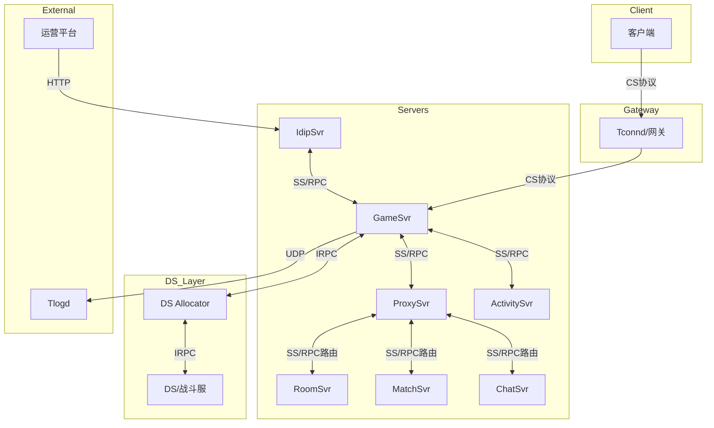

---

## 2. CS协议（Client-Server）

### 2.1 协议定义

**协议头结构** - [cs_head.proto](C:/UGit/letsgo_server/WeA/common/common/protos/base_common_proto/cs_head.proto):

```protobuf
// 协议结构:
// length: 2 bytes
// CSHeader
// body: 具体消息内容

message CSHeader {
    optional int32 type = 1;          // 消息类型ID
    optional int32 seqId = 2;         // 序列号
    optional int32 errorCode = 3;     // 错误码
    optional string errorMsg = 4;     // 错误消息
    optional int64 clientTs = 5;      // 客户端时间戳
    optional int64 serverTs = 6;      // 服务器时间戳
    optional string traceId = 7;      // 追踪ID
    optional int32 rpcType = 8;       // RPC类型
    optional CsForwardMetaData csForwardData = 9;  // 转发数据
}

// CS通用转发方法
enum CsForwardType {
    CS_FORWARD_TYPE_SESSION_UID = 0;       // 默认用session绑定的uid
    CS_FORWARD_TYPE_TARGET_HASH_KEY = 1;   // 指定目标hashkey
}
```

### 2.2 消息命名规范

- **请求协议**: `CSReq` 前缀，如 `CSReqLoginPara`
- **响应协议**: `CSRes` 前缀，如 `CSResLoginPara`  
- **通知协议**: `CSNty` 前缀（服务器主动推送），如 `CSNtyKickBySvrPara`

### 2.3 消息路由机制

CS消息支持**通用转发机制**，通过 [cs_meta.xml](C:/UGit/letsgo_server/WeA/common/common/protos/cs_proto/cs_meta.xml) 配置：

```xml
<!-- 示例：Farm消息转发配置 -->
<entry id="1866" name="FarmTest_C2S_Msg" forwardToNum="51" 
       farmFwdDst="FFD_SELF_FARM" farmGenGsHandler=""/>
<entry id="1868" name="FarmOp_C2S_Msg" forwardToNum="51" 
       farmFwdDst="FFD_CURR_FARM" farmGenGsHandler="true"/>
```

关键字段：
- `forwardToNum`: 转发目标服务器类型（如51=FarmServer）
- `farmFwdDst`: 转发目标模式（`FFD_SELF_FARM`/`FFD_CURR_FARM`）

### 2.4 实现原理

1. **客户端发送请求** → Tconnd网关
2. **网关解析CSHeader** → 提取`type`字段
3. **根据消息类型路由** → 分发到对应服务器
4. **Handler处理** → 继承`AbstractGsClientRequestHandler`实现

### 2.5 使用示例

```java
public class LoginMsgHandler extends AbstractGsClientRequestHandler {
    @Override
    public Message.Builder handle(Session session, CsHead.CSHeader header, Message request) 
            throws NKCheckedException {
        CSReqLoginPara req = (CSReqLoginPara) request;
        // 业务处理...
        CSResLoginPara.Builder response = CSResLoginPara.newBuilder();
        response.setErrorCode(NKErrorCode.OK.getValue());
        return response;
    }
}
```

---

## 3. SS协议（Server-Server RPC）

### 3.1 协议定义

**RPC头结构** - [ss_head.proto](C:/UGit/letsgo_server/WeA/common/common/protos/base_common_proto/ss_head.proto):

```protobuf
// 协议结构:
// length: 2 bytes (total length)
// length: 2 bytes (header length)
// RpcHeader
// body: 具体消息内容

message RpcHeader {
    optional int32 seqId = 1;
    optional int32 errorCode = 2;
    optional bytes errorMsg = 3;
    optional string className = 6;        // 服务类名
    optional string methodName = 7;       // 方法名
    optional int32 pbMessageType = 9;     // 消息类型ID
    optional RpcRouting routing = 11;     // 路由信息
    optional int64 asyncId = 12;          // 异步ID
    optional int64 traceId = 13;          // 追踪ID
    optional int32 responseFlag = 15;     // 响应标记
    optional RpcContext rpcContext = 32;  // RPC上下文
}
```

### 3.2 路由模式（RpcRelayMode）

```protobuf
enum RpcRelayMode {
    RRM_SpecDst = 0;        // 指定目的地址
    RRM_AnyNode = 1;        // 哈希取余（随机）
    RRM_KeyHash = 2;        // 一致性哈希
    RRM_MetaData = 3;       // 元数据转发
    RRM_MatchData = 4;      // 匹配模式
    RRM_StateRouteData = 5; // 状态转发模式
    RRM_Region = 6;         // 大区转发模式
    RRM_LobbyData = 7;      // 大厅模式
    RRM_SpecDstKeyHash = 8; // 指定目的+Key哈希
    RRM_UgcSceneData = 9;   // UGC场景模式
}
```

### 3.3 核心路由实现

路由工具类 - [RpcRoutingUtil.java](C:/UGit/letsgo_server/WeA/common/src/main/java/com/tencent/rpc/RpcRoutingUtil.java)：

```java
public static void fillRouting(RpcRequest request) {
    RpcHeader.Builder header = request.getHeader();
    int msgId = header.getPbMessageType();
    WeAServerType toServer = getServer(header.getClassName());
    Proto proto = msgId2Proto.get(msgId);
    
    // 根据协议字段选项自动构建路由
    toServer = convertServerType(request, toServer, proto);
    RpcRouting routing = doBuild(msgId, toServer.getNumber(), request);
    header.setRouting(routing);
}
```

### 3.4 协议字段选项

通过Protobuf扩展定义路由字段：

```protobuf
extend google.protobuf.FieldOptions {
    optional bool field_dest_zone = 200001;   // 分区服路由
    optional bool field_dest_serv = 200002;   // 指定busid
    optional bool field_hash_key = 200003;    // 一致性哈希key
    optional bool field_meta_type = 200004;   // 元数据类型
    optional bool field_meta_uuid = 200005;   // 元数据UUID
    optional bool field_route_key = 200009;   // 路由key
    optional bool field_region_key = 200010;  // 大区key
}
```

### 3.5 路由处理流程

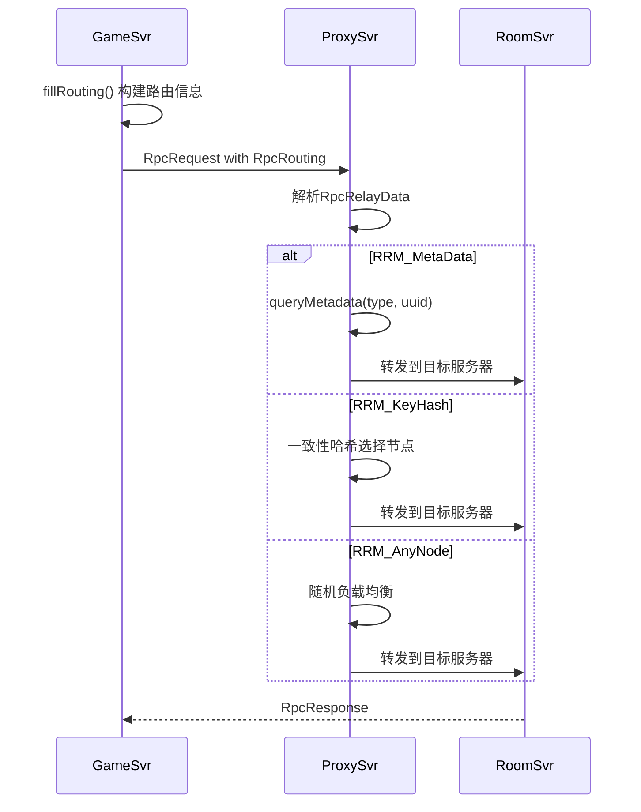

### 3.6 使用示例

```java
// 1. 哈希路由（全局服）
public void callWithHashKey(long uid) throws NKCheckedException {
    SsHead.RpcHeader.Builder header = SsHead.RpcHeader.newBuilder();
    header.setHashKey(uid);  // 相同uid总是路由到同一实例
    rpcClient.someMethod(header, request);
}

// 2. 分区路由
public void callWithZone(int zoneId) throws NKCheckedException {
    SsHead.RpcHeader.Builder header = SsHead.RpcHeader.newBuilder();
    header.setDestZone(zoneId);
    rpcClient.someMethod(header, request);
}

// 3. OneWay调用（不等待响应）
@RpcOneWay
public void notifyOtherServer(long uid) {
    SsHead.RpcHeader.Builder header = SsHead.RpcHeader.newBuilder();
    header.setOneWay(true);
    rpcClient.notifyMethod(header, request);
}
```

---

## 4. IRPC协议（服务器与DS通信）

### 4.1 协议定义

**IRPC头结构** - [irpc.proto](C:/UGit/letsgo_server/WeA/common/common/protos/base_common_proto/irpc.proto):

```protobuf
// 请求协议头
message RequestProtocol {
    int32 call_type = 1;          // 调用类型（普通/单向/流式）
    uint32 timeout = 2;           // 超时时间(ms)
    uint64 request_id = 3;        // 请求唯一ID
    int32 message_type = 4;       // 消息类型
    int32 content_type = 5;       // 序列化类型(proto/json/fb)
    bytes caller = 6;             // 主调服务名
    bytes callee = 7;             // 被调服务路由名
    bytes func = 8;               // 接口名(/package.Service/接口名)
    map<string, bytes> meta = 9;  // 透传信息
}

// 响应协议头
message ResponseProtocol {
    int32 ret = 1;               // 框架层错误码
    int32 func_ret = 2;          // 接口错误码
    string error_msg = 3;        // 错误描述
    uint64 request_id = 4;       // 请求唯一ID
    map<string, bytes> meta = 7; // 透传信息
}
```

### 4.2 DS通信方向

项目中IRPC分为两个方向：

**SD（Server→DS）方向** - [sd_common.proto](C:/UGit/letsgo_server/WeA/common/common/protos/g6_irpc/sd_common.proto):

```protobuf
service SdCommon {
    rpc DelDs (DelDsRequest) returns (DelDsReply) {}
    rpc PlayerExitDs (PlayerExitDsRequest) returns (PlayerExitDsReply) {}
    rpc DSLogCtrl (DsLogCtrlRequest) returns (DsLogCtrlReply) {}
    rpc CreatePlacedObject (CreatePlacedObjectRequest) returns (CreatePlacedObjectReply) {}
    rpc SyncBattlePlayer (SyncBattlePlayerRequest) returns (SyncBattlePlayerReply) {}
}
```

**DS（DS→Server）方向** - [ds_common.proto](C:/UGit/letsgo_server/WeA/common/common/protos/g6_irpc/ds_common.proto):

```protobuf
service DsCommonServer {
    rpc DsHeartbeat (DsHeartbeatRequest) returns (DsHeartbeatReply) {}
    rpc PlayerDsReady (PlayerDsReadyRequest) returns (PlayerDsReadyReply) {}
    rpc PlayerDsEnter (PlayerDsEnterRequest) returns (PlayerDsEnterReply) {}
    rpc PlayerDsOffline (PlayerDsOfflineRequest) returns (PlayerDsOfflineReply) {}
    rpc SendCommonTlog (SendCommonTlogRequest) returns (SendCommonTlogReply) {}
}
```

### 4.3 DS分配机制

**DSC（DS Controller）协议** - [dsc.proto](C:/UGit/letsgo_server/WeA/common/common/protos/g6_irpc/dsc.proto):

```protobuf
service DsAllocator {
    // 核心接口：分配DS
    rpc CreateGameSession (CreateGameSessionRequest) returns (CreateGameSessionReply) {}
    // 辅助接口
    rpc TriggerDsAliasStatusReport (TriggerDsAliasStatusReportRequest) returns (EmptyReply) {}
    rpc TriggerDscStatusReport (TriggerDscStatusReportRequest) returns (EmptyReply) {}
}

message CreateGameSessionRequest {
    string game_session_id = 1;           // 业务侧生成的唯一ID
    string alias_id = 2;                  // 映射到具体fleet的别名
    int32 create_time_out_second = 3;     // 超时时间
    map<string, string> game_properties = 4; // 业务自定义数据
    bool dont_start_ds_if_none = 5;       // 是否允许实时拉起
    bool need_recovery = 7;               // 是否支持恢复
}
```

### 4.4 字段选项扩展

```protobuf
// irpc_field_option.proto 中的扩展
extend google.protobuf.MessageOptions {
    optional bool irpc_one_way = 60001;      // 单向调用
    optional bool irpc_direct_call = 60002;  // 直接调用
}

extend google.protobuf.FieldOptions {
    optional bool field_ds_session_id = 70001;  // DS会话ID
    optional bool field_dsa_inst_id = 70002;    // DSA实例ID
}
```

### 4.5 使用示例（Lua侧）

```lua
local IRPC = require "irpc"

-- 同步调用（协程模式）
local DsaClient = IRPC:GetRPCClient("DsMgrClient", "dsa_public.DsaPublic", "coroutine")

function GetDsInfo(dsId)
    local clientCtx = IRPCCore.NewClientContext()
    clientCtx:SetTargetService("dsa.DsaPublic")
    clientCtx:SetTimeout(3000)
    
    local request = { ds_id = dsId }
    local ok, response = DsaClient:GetDsInfo(clientCtx, request)
    return ok and response.ds_info or nil
end

-- 异步调用（回调模式）
local DsaClientAsync = IRPC:GetRPCClient("DsMgrClient", "dsa_public.DsaPublic", "callback")

function GetDsInfoAsync(dsId, callback)
    local clientCtx = IRPCCore.NewClientContext()
    local request = { ds_id = dsId }
    DsaClientAsync:GetDsInfo(clientCtx, request, function(ctx, response)
        callback(response.ds_info)
    end)
end
```

---

## 5. Tlog协议（流水日志）

### 5.1 协议定义

**Tlog基础结构** - [tlog_base.xml](C:/UGit/letsgo_server/WeA/common/common/protos/tlog_proto/tlog_base.xml):

```xml
<struct name="RequiredFields" version="1" desc="必填字段">
    <entry name="GameSvrId" type="string" size="25" desc="游戏服务器编号"/>
    <entry name="dtEventTime" type="datetime" desc="事件时间"/>
    <entry name="vGameAppid" type="string" size="32" desc="游戏APPID"/>
    <entry name="PlatID" type="int" desc="平台(ios 0 / android 1)"/>
    <entry name="iZoneAreaID" type="int" desc="分区ID"/>
    <entry name="vopenid" type="string" size="64" desc="用户OPENID"/>
    <entry name="vRoleID" type="string" size="64" desc="玩家UID"/>
    <entry name="iLevel" type="int" desc="等级"/>
    <entry name="ClientIP" type="string" size="64" desc="客户端IP"/>
    <entry name="ClientVersion" type="string" size="64" desc="客户端版本"/>
    <!-- 预留字段 -->
    <entry name="ReservePara1" type="string" size="128"/>
    <!-- ... -->
</struct>
```

### 5.2 实现原理

**TlogManager核心实现** - [TlogManager.java](C:/UGit/letsgo_server/WeA/common/src/main/java/com/tencent/nk/tlog/TlogManager.java):

```java
@ThreadSafe
public class TlogManager extends EngineModule {
    private DatagramSocket socket;      // PE环境socket
    private DatagramSocket socketTest;  // 测试环境socket
    private DatagramSocket socketSideway; // 旁路通道socket
    private Queue<AbstractTlogFlow> queue = new LinkedBlockingQueue<>();
    
    // UDP发送tlog
    void logToTlogd(String text, DatagramSocket socket, DatagramPacket packet) {
        byte[] bytes = text.getBytes(Charsets.UTF_8);
        packet.setData(bytes, 0, bytes.length);
        socket.send(packet);
    }
    
    // 旁路通道发送（带协议头）
    void logToSidway(String text, DatagramSocket socket, DatagramPacket packet, int payloadfirst) {
        int magic = 0x7367736d;
        // 构建协议头：magic + size + version + flag + uncompressSize + payloadFirst + payload
        ByteArrayOutputStream outputStream = new ByteArrayOutputStream();
        outputStream.write(magicBuffer.array());
        // ... 写入各字段
        outputStream.write(bytes);
        socket.send(packet);
    }
}
```

### 5.3 传输机制

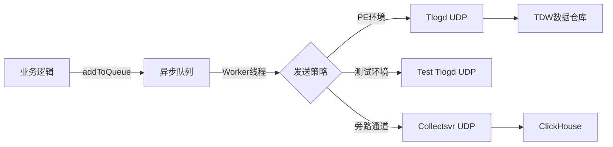

### 5.4 使用示例

```java
// 上报物品变更流水
public void reportItemChange(Player player, ItemChangeDetails details) {
    TlogItemChange.Builder tlog = TlogItemChange.newBuilder();
    tlog.setUid(player.getUid());
    tlog.setOpenid(player.getOpenid());
    tlog.setItemId(details.getItemId());
    tlog.setChangeCount(details.getChangeCount());
    tlog.setReason(details.getReason());
    tlog.setTimestamp(Framework.currentTimeMillis());
    
    TlogManager.getInstance().addToQueue(new TlogFlow(tlog.build()));
}
```

---

## 6. IDIP协议（运营平台通信）

### 6.1 协议定义

**IDIP公共定义** - [idip_common.proto](C:/UGit/letsgo_server/WeA/common/common/protos/base_common_proto/idip_common.proto):

```protobuf
extend google.protobuf.MessageOptions {
    optional IdipHandler handler = 110001;        // 处理服务器类型
    optional bool hacked = 110002;                // 需要预处理
    optional bool checkUserInfo = 110004;         // 检查用户信息
    optional bool queryMsg = 110005;              // 查询接口标记
    optional bool priorityUseUid = 110006;        // 优先使用uid参数
    optional bool noCheckRoleTransferring = 110007; // 转区不受约束
}

extend google.protobuf.FieldOptions {
    optional bool urlcode = 200110;   // 中文字段需URL编码
    optional bool kickPlayer = 200111; // 需要先踢玩家下线
}
```

### 6.2 路由配置

**IDIP路由配置** - [idip_route_config.xml](C:/UGit/letsgo_server/WeA/common/common/protos/idip/idip_route_config.xml):

```xml
<idipRouteConfig>
    <entry cmdId="5009" handler="" checkUserInfo="true" 
           hashKeyField="Uid" destSvrType="48" isFillUid="true"/>
    <entry cmdId="4542" handler="IH_IdipSvr" checkUserInfo="true" 
           priorityUseUid="true" hashKeyField="Uid"/>
</idipRouteConfig>
```

配置字段说明：
- `cmdId`: IDIP命令ID
- `handler`: 处理服务器（如`IH_GameSvr`、`IH_IdipSvr`）
- `destSvrType`: 目标服务器类型
- `hashKeyField`: 哈希路由字段

### 6.3 处理器分发

**IdipHandler枚举定义**:

```protobuf
enum IdipHandler {
    IH_None = 0;
    IH_GameSvr = 1;
    IH_IdipSvr = 2;
    IH_DirSvr = 3;
    IH_ChatSvr = 4;
    IH_BattleSvr = 5;
    IH_FarmSvr = 9;
    IH_ActivitySvr = 10;
    IH_ArenaSvr = 12;
    IH_StarpSvr = 14;
    // ...
}
```

### 6.4 处理流程

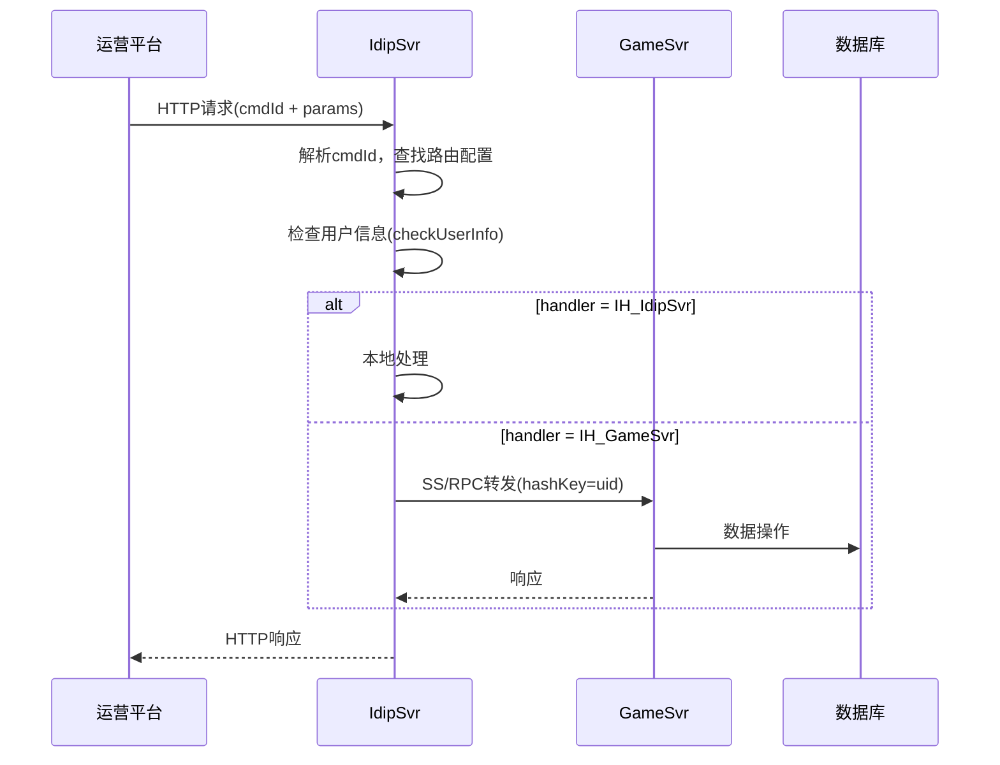

---

## 7. 其他协议类型

### 7.1 db_proto（数据库协议）

用于定义数据库存储结构，与TcaplusDB交互。

### 7.2 event（事件协议）

内部事件通知机制，用于模块间解耦通信。

### 7.3 grpc_proto

gRPC协议定义，用于外部服务调用。

### 7.4 rank_proto（排行榜协议）

排行榜服务专用协议。

### 7.5 hotres_proto（热更新协议）

热更新资源相关协议。

---

## 8. 协议性能对比分析

### 8.1 项目多协议栈性能特征总览

| 维度 | Tbuspp (SS/RPC) | IRPC (DS通信) | gRPC (外部调用) | Tconnd (CS协议) |
|------|:---------------:|:-------------:|:---------------:|:---------------:|
| **传输方式** | 共享内存 | Tbuspp(共享内存) | TCP + HTTP/2 | TCP长连接 |
| **序列化格式** | Protobuf | Protobuf | Protobuf | Protobuf |
| **单次延迟(P50)** | ~0.1ms | ~0.5ms | ~2-5ms | ~10-50ms(含网络) |
| **单次延迟(P99)** | ~0.5ms | ~2ms | ~10-30ms | ~100-200ms |
| **吞吐量上限** | ~50万QPS/实例 | ~10万QPS/实例 | ~1-3万QPS/连接 | 受客户端带宽限制 |
| **消息大小限制** | 默认500KB告警 | 默认500KB告警 | 默认4MB | 受Tconnd缓冲区限制 |
| **连接模型** | 无连接(内存映射) | 无连接(内存映射) | 长连接+连接池 | 长连接 |
| **适用场景** | 同机/同Pod服务间 | 服务器↔DS通信 | 跨集群/外部服务 | 客户端↔服务器 |

### 8.2 Tbuspp共享内存通信 vs gRPC性能深度对比

#### 8.2.1 架构层面差异

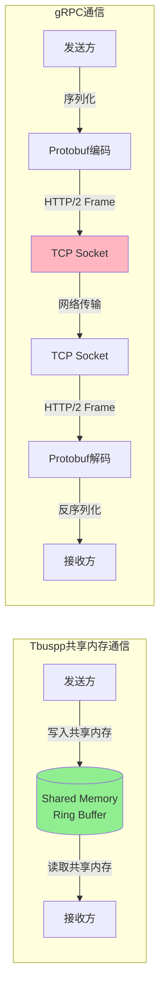

**Tbuspp共享内存的核心优势**：

| 优势维度 | Tbuspp共享内存 | gRPC TCP |
|---------|:-------------:|:--------:|
| **系统调用开销** | 无（用户态内存读写） | 每次send/recv需内核态切换 |
| **数据拷贝次数** | 0次（零拷贝） | 至少2次（用户→内核→用户） |
| **协议栈开销** | 无TCP/IP协议栈 | TCP/IP + HTTP/2 + TLS |
| **序列化** | Protobuf一次 | Protobuf + HTTP/2帧封装 |
| **连接管理** | 无连接概念 | 连接建立/维护/重连开销 |
| **流控机制** | 共享内存环形缓冲区自动流控 | HTTP/2 Flow Control + TCP Window |

#### 8.2.2 延迟对比分析

```
┌──────────────────────────────────────────────────────────────┐
│                     RPC调用延迟分布对比                        │
├──────────────────────────────────────────────────────────────┤
│                                                              │
│  Tbuspp (共享内存)                                            │
│  ├─ P50:  ████ 0.1ms                                        │
│  ├─ P90:  ████████ 0.3ms                                    │
│  ├─ P99:  ████████████ 0.5ms                                │
│  └─ P999: ████████████████ 1.0ms                            │
│                                                              │
│  IRPC (Tbuspp传输)                                           │
│  ├─ P50:  ████████ 0.5ms                                    │
│  ├─ P90:  ████████████████ 1.0ms                            │
│  ├─ P99:  ████████████████████████ 2.0ms                    │
│  └─ P999: ████████████████████████████████ 5.0ms            │
│                                                              │
│  gRPC (TCP网络)                                               │
│  ├─ P50:  ████████████████████████████████████ 3.0ms        │
│  ├─ P90:  ████████████████████████████████████████████ 8.0ms│
│  ├─ P99:  ████████████████████████████████████████████████████│ 15ms│
│  └─ P999: ████████████████████████████████████████████████████│ 30ms│
│                                                              │
└──────────────────────────────────────────────────────────────┘
```

**延迟差异根因分析**：

1. **Tbuspp延迟极低的原因**：
   - 共享内存读写无需系统调用，避免了用户态↔内核态上下文切换（~1-5μs/次）
   - 零拷贝传输，数据直接从发送方内存映射到接收方地址空间
   - 无TCP/IP协议栈开销（序列号、ACK、滑动窗口等机制均不需要）
   - 发送方写入Ring Buffer后，接收方在下一次poll时即可读取

2. **IRPC延迟略高的原因**：
   - 虽然底层也使用Tbuspp传输，但额外包含24字节G6IrpcSsHead + 16字节IrpcFixedHeader的编解码
   - IRPC协议头中包含更复杂的元信息（caller/callee/func/meta等）
   - DS通信可能涉及跨大区转发（`ds_cross_route_type`配置）

3. **gRPC延迟较高的原因**：
   - TCP连接建立开销（三次握手，TLS场景还有握手延迟）
   - HTTP/2帧封装和解封装
   - 内核TCP协议栈处理（拥塞控制、流控、重传）
   - 网络传输延迟（即使同机房也有~0.1-0.5ms）

#### 8.2.3 吞吐量对比分析

| 场景 | Tbuspp (共享内存) | gRPC (同机房) | gRPC (跨机房) |
|------|:-----------------:|:-------------:|:-------------:|
| **小包（<1KB）** | ~50万 QPS | ~3万 QPS | ~1万 QPS |
| **中包（1-10KB）** | ~30万 QPS | ~2万 QPS | ~5千 QPS |
| **大包（10-100KB）** | ~10万 QPS | ~5千 QPS | ~1千 QPS |
| **超大包（>100KB）** | ~3万 QPS | ~1千 QPS | ~200 QPS |

> **数据说明**: 以上数据为基于同类架构的经验估算值，实际值取决于硬件配置、消息复杂度和业务逻辑耗时。

#### 8.2.4 项目中的协议选型决策

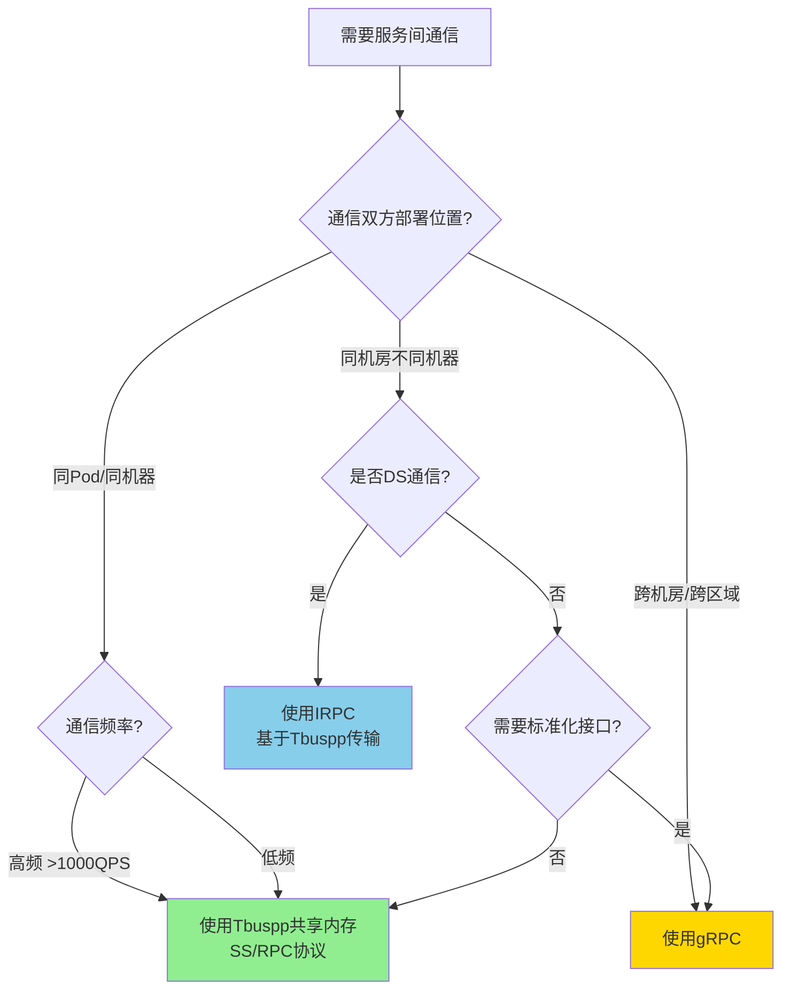

**项目实际选型理由（ADR记录）**：

| 决策 | 选择 | 理由 |
|------|------|------|
| 服务间RPC | Tbuspp | 同Pod部署，共享内存延迟极低，无网络开销，吞吐量高 |
| DS通信 | IRPC(Tbuspp) | DS与服务器同机房部署，Tbuspp统一传输层，IRPC提供标准服务接口 |
| 客户端接入 | Tconnd | 腾讯自研接入层，支持DH密钥协商、连接管理、协议分发 |
| 外部系统对接 | gRPC/HTTP | 跨系统标准化接口，如北极星服务发现、运营平台IDIP |
| 日志上报 | UDP | 单向上报无需ACK，Tlog日志对可靠性要求可容忍丢失 |

### 8.3 协议帧开销对比

不同协议层的额外帧开销直接影响有效载荷比率：

| 协议 | 帧头开销 | 有效载荷100B时开销占比 | 有效载荷1KB时开销占比 |
|------|:--------:|:---------------------:|:--------------------:|
| **CS协议** | 2B(length) + CSHeader(~30-50B) | ~35% | ~5% |
| **SS/RPC** | 4B(totalLen) + 2B(headerLen) + RpcHeader(~80-150B) | ~60% | ~13% |
| **IRPC** | 24B(SsHead) + 16B(FixedHeader) + ReqProtocol(~60-100B) | ~60% | ~12% |
| **gRPC** | 5B(gRPC帧) + HTTP/2帧头(9B) + 其他元数据 | ~15% + TCP/IP 40B | ~3% + TCP/IP |

### 8.4 RPC性能监控体系

项目通过 `RpcProfiler` 实现完整的协议性能监控：

```java
// RpcProfiler核心统计维度
public class RpcProfiler {
    // 每60秒输出一次性能报告
    // 按 serviceName:methodName 粒度统计
    public void onRpcCall(
        String serviceName, String methodName,
        int sendBuffSize,    // 发送包大小
        int recvBuffSize,    // 接收包大小  
        long cost,           // CPU耗时(微秒)
        long wallMill,       // Wall耗时(微秒)
        boolean clientCall,  // 客户端/服务端
        CallResultType resultType, // OK/ERROR/TIMEOUT
        long funcRetCode     // 业务返回码
    );
    
    // Record统计字段
    public static class Record {
        AtomicInteger sendSz;        // 累计发送大小
        AtomicInteger recvSz;        // 累计接收大小
        AtomicInteger succCnt;       // 成功次数
        AtomicInteger errCnt;        // 错误次数
        AtomicInteger timeoutCnt;    // 超时次数
        AtomicLong timeCostMS;       // 累计CPU耗时
        AtomicLong timeWallMS;       // 累计Wall耗时
        AtomicLong maxTimeCostMS;    // 最大CPU耗时
        AtomicLong minTimeCostMS;    // 最小CPU耗时
    }
}
```

**监控输出示例**（每60秒自动打印）：

```
======================================= Rpc out call in 60s, 2024-01-15 10:30:00 =======================================
RPC NAME                                                       #RPC SUCC COUNT     #RPC ERROR COUNT    #RPC TIMEOUT COUNT  #AVERAGE SEND SIZE  #AVERAGE RECV SIZE  #AVERAGE TIME       #AVERAGE WALL TIME
RoomService:joinRoom                                           #12580              #3                  #0                  #256                #512                #0.150              #0.200
MatchService:startMatch                                        #8920               #0                  #1                  #128                #384                #0.280              #0.350
ChatService:sendMessage                                        #45600              #12                 #0                  #512                #64                 #0.080              #0.120
```

**关键监控告警阈值**（项目实际配置）：

| 指标 | 告警阈值 | 配置项 |
|------|:--------:|--------|
| 请求包大小 | ≥500KB | `warn_rpc_req_size` |
| 响应包大小 | ≥500KB | `warn_rpc_rsp_size` |
| IRPC请求包大小 | ≥500KB | `warn_irpc_req_size` |
| RPC默认超时 | 10秒 | `rpc_call_timeout_seconds` |
| 调用链跳数 | 最大10跳 | `rpc_hop_limit` |

---

## 9. 协议版本兼容机制与实际案例

### 9.1 协议版本管理体系概览

项目采用**多层协议版本管理策略**，确保在滚动更新、灰度发布等场景下新旧协议版本可以兼容共存：

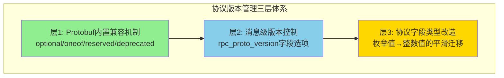

### 9.2 层1：Protobuf内置兼容机制的应用

#### 9.2.1 optional字段策略

项目中所有的proto定义**全部使用proto2的optional字段**，这是保证向后兼容的基础：

```protobuf
// ss_head.proto - 所有字段均为optional
message RpcHeader {
    optional int32 seqId = 1;
    optional int32 errorCode = 2;
    optional bytes errorMsg = 3;
    optional int64 clientTs = 4;
    optional int64 serverTs = 5;
    optional string className = 6;
    optional string methodName = 7;
    // ...后续新增字段不影响旧版本解析
    optional bool noMailbox = 30;  // 后期新增的字段
}
```

**兼容性保证**：新增字段时，旧版本服务反序列化会忽略未知字段号，新版本服务对缺失字段使用默认值。

#### 9.2.2 deprecated标记与字段迁移

**实际案例：RpcRouting中ServerType枚举→整数的迁移**

```protobuf
message RpcRouting {
    // 旧字段：使用枚举类型，标记为deprecated
    optional ServerType srcType = 1 [deprecated = true];
    optional ServerType dstType = 4 [deprecated = true];
    
    // ... 中间字段保持不变 ...
    
    // 新字段：使用整数类型替代（新增在消息末尾）
    optional int32 srcTypeInt = 14;  // srcType int 参考ServerType
    optional int32 dstTypeInt = 15;  // dstType int 参考ServerType
}
```

**迁移背景**：项目初期使用`ServerType`枚举定义服务类型，但随着服务类型不断增加，枚举在跨语言（Java/Go/Lua）间的兼容性出现问题（不同语言对未知枚举值处理不一致）。通过将枚举改为整数，解决了以下问题：

1. **Go语言兼容**：Go的Protobuf对未知枚举值会返回0而非保留原始值
2. **动态扩展**：新增服务类型时无需同步更新所有语言的枚举定义
3. **滚动更新兼容**：新旧版本同时运行时，旧版本写`srcType`，新版本同时写`srcTypeInt`和`srcType`

**迁移策略（三阶段灰度）**：

```
阶段1（双写期）: 新版本同时写 srcType + srcTypeInt，读取优先用srcTypeInt
阶段2（过渡期）: 确认所有节点已更新，仍保持双写
阶段3（清理期）: deprecated标记提醒开发者不再使用旧字段
```

### 9.3 层2：消息级版本控制（rpc_proto_version）

#### 9.3.1 机制设计

项目通过Protobuf的`MessageOptions`扩展实现**消息粒度的版本控制**：

```protobuf
// ss_head.proto - 消息选项扩展
extend google.protobuf.MessageOptions {
    optional string rpc_proto_version = 100008; // 单独控制rpc协议版本
}
```

每个RPC消息可以通过此选项声明自己的协议版本：

```protobuf
// 使用示例：为特定消息指定版本
message SomeRpcRequest {
    option (rpc_proto_version) = "2.0";  // 声明此消息为2.0版本
    
    optional int64 uid = 1;
    optional string newField = 2;  // 2.0版本新增字段
}
```

#### 9.3.2 版本设置流程

在RPC调用时，客户端自动设置协议版本：

```java
// RpcClient.RpcInvocationHandler中的版本设置逻辑
private void setProtoVersion(MethodCache method, Message.Builder arg) {
    // 1. 检查是否启用版本设置（可热配关闭）
    if(!PropertyFileReader.getRealTimeBooleanItem("enableSetProtoVersion", true)) {
        return;
    }
    
    // 2. 优先使用方法级@RpcVersion注解
    RpcVersion rpcVersion = method.getAnnotation(RpcVersion.class);
    if (null != rpcVersion && !rpcVersion.version().isEmpty()) {
        ReflectionUtil.invoke(arg, "setProtoVersion", rpcVersion.version());
    } else {
        // 3. 默认版本号"1.0"
        ReflectionUtil.invoke(arg, "setProtoVersion", "1.0");
    }
}
```

**版本控制流程**：

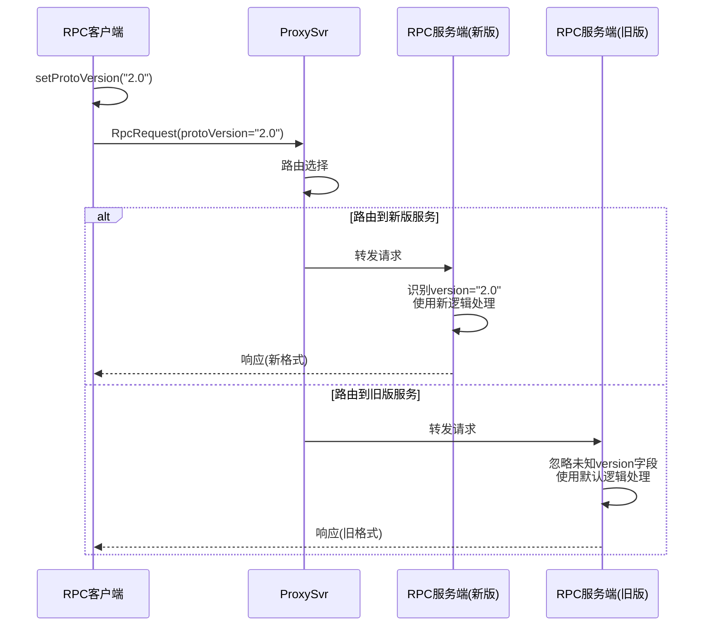

#### 9.3.3 热配降级能力

通过`enableSetProtoVersion`配置项，可以在不重启服务的情况下关闭版本号设置，实现紧急回退：

```
# 正常运行：设置版本号
enableSetProtoVersion=true

# 紧急回退：关闭版本号设置，所有消息不再携带版本信息
enableSetProtoVersion=false
```

### 9.4 层3：枚举值→整数值的协议改造

#### 9.4.1 改造背景

这是项目中**最大规模的一次协议兼容性改造**，涉及SS协议头中多个核心枚举字段：

```protobuf
// 改造前：使用枚举类型
message RpcRelayData {
    optional RpcRelayMode relayMode = 1;  // 枚举类型
}

message RpcHeader {
    optional RpcResponseFlag responseFlag = 15;  // 枚举类型
}

// 改造后：切换为整数类型，保留枚举定义作为参考
message RpcRelayData {
    optional int32 relayMode = 1;  // 协议改造 枚举值切换至整数值 详情参考RpcRelayMode
}

message RpcHeader {
    optional int32 responseFlag = 15;  // 协议改造 枚举值切换至整数值 详情参考RpcResponseFlag
}
```

#### 9.4.2 涉及的改造字段

| 原枚举类型 | 改造字段 | 所在消息 | 改造原因 |
|-----------|---------|---------|---------|
| `RpcRelayMode` | `relayMode` | `RpcRelayData` | 路由模式不断新增，跨语言枚举不兼容 |
| `RpcResponseFlag` | `responseFlag` | `RpcHeader` | 响应标记需要跨Java/Go/Lua统一 |
| `MatchModeRpcStage` | `stage` | `MatchAllocData` | 匹配阶段的灵活扩展需求 |
| `LobbyModeRpcStage` | `stage` | `LobbyData` | 大厅阶段的灵活扩展需求 |

#### 9.4.3 改造的兼容性保证

**Protobuf Wire Format层面的天然兼容**：

```
关键原理：Protobuf的enum和int32在wire format上使用相同的编码方式（Varint）
         因此 optional RpcRelayMode relayMode = 1 和 optional int32 relayMode = 1 
         在二进制层面完全兼容！

旧版本写入: relayMode = RRM_KeyHash (枚举值=2) → wire: field_number=1, varint=2
新版本读取: relayMode = 2 (整数值) → 正确解析为2

新版本写入: relayMode = 2 (整数值) → wire: field_number=1, varint=2
旧版本读取: relayMode = RRM_KeyHash (枚举值=2) → 正确解析为枚举
```

这意味着此改造**无需双写、无需灰度、可以直接替换**，是一次极其安全的协议迁移。

#### 9.4.4 改造收益

| 收益 | 说明 |
|------|------|
| **跨语言一致性** | Java/Go/Lua对整数值的处理完全一致，不存在未知枚举值的歧义 |
| **灵活扩展** | 新增路由模式/响应标记时，无需同步更新所有语言的枚举定义 |
| **向后兼容** | Wire Format完全兼容，新旧版本可以混合部署 |
| **代码简化** | 消除了各语言中枚举值转换的胶水代码 |

### 9.5 超时配置的多级覆盖机制

协议层面的超时控制也体现了版本兼容的设计思想——支持逐步细化的超时配置，新增配置不影响已有行为：

```protobuf
// ss_head.proto - 多级超时配置
extend google.protobuf.FileOptions {
    optional int32 rpc_service_timeout_seconds = 300001;  // 文件级（服务级）超时
}

extend google.protobuf.MessageOptions {
    optional int32 rpc_call_timeout_seconds = 100004;     // 消息级超时
}
```

```java
// RpcClient中的超时优先级（从高到低）
// 1. 方法级 @RpcTimeout 注解
RpcTimeout rpcTimeout = method.getAnnotation(RpcTimeout.class);
// 2. 服务类级 @RpcTimeout 注解  
rpcTimeout = method.getClazz().getAnnotation(RpcTimeout.class);
// 3. 全局配置项（默认10秒）
timeout = PropertyFileReader.getRealTimeIntItem("rpc_call_timeout_seconds", 10) * 1000;
```

### 9.6 协议兼容性设计总结

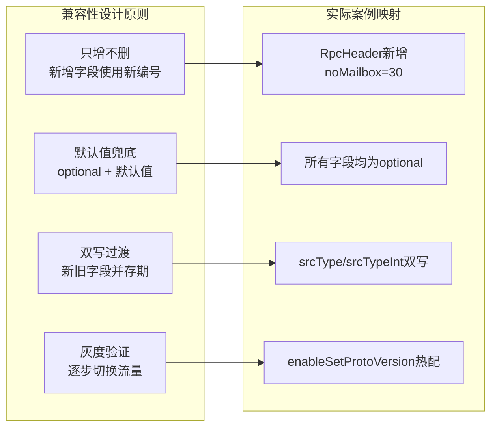

---

## 10. 网络编程与协议原理深度补充

> 本章从面试高频考点出发，结合项目实际实现，系统梳理TCP/UDP/HTTP等网络编程基础原理，以及项目在传输层的设计决策。

### 10.1 TCP 核心原理与项目映射

#### 10.1.1 TCP 三次握手与四次挥手

TCP 是项目客户端接入的基础传输协议，Tconnd 网关通过 TCP 长连接管理数百万客户端连接。

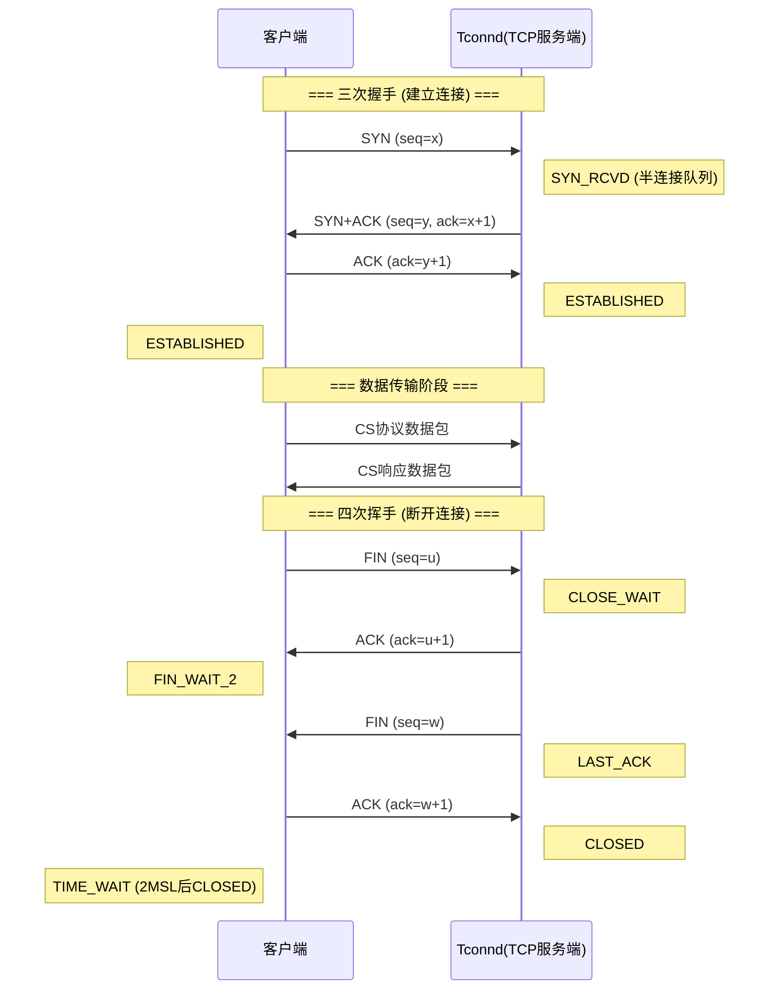

**项目中的体现**：

| TCP 机制 | 项目实现 | 代码位置 |
|---------|---------|---------|
| **连接建立** | Tconnd 网关接受 TCP 连接，回调 `IoEventListener.onConnect()` | `TconndManager.onConnect()` |
| **连接断开** | Tconnd 检测连接关闭/超时，回调 `IoEventListener.onDisconnect()` | `TconndManager.onDisconnect()` |
| **半连接攻击防护** | Tconnd 内置 SYN Flood 防护，限制半连接队列大小 | Tconnd C++ 底层实现 |
| **TIME_WAIT 优化** | K8s Pod 使用 CLB 负载均衡，由 CLB 管理外层连接 | `tconnd-values.yaml` 中 CLB 配置 |
| **KeepAlive** | Tconnd 支持 TCP KeepAlive + 应用层心跳双重保活 | `TbusppApiPro.sendHeartbeat()` |

**面试关键问题：为什么需要三次握手而不是两次？**

> 两次握手无法防止**历史重复连接**的建立。如果客户端发出的旧 SYN 包因网络延迟到达服务端，两次握手模式下服务端直接建立连接并分配资源，但客户端并不认可这个连接，导致资源浪费。三次握手通过客户端的第三次 ACK 确认，让双方都确认连接是有效的。

**面试关键问题：为什么挥手要四次而不是三次？**

> 因为 TCP 是**全双工**协议，关闭连接需要双向分别关闭。服务端收到 FIN 时，可能还有数据要发送，所以先回 ACK，等数据发送完毕后再发 FIN。这就需要四次报文交换。项目中 Tconnd 的 `onDisconnect` 回调就是在四次挥手完成后触发的。

#### 10.1.2 TCP 粘包/拆包问题

**问题本质**：TCP 是面向**字节流**的协议，没有消息边界的概念。应用层发送的多条消息可能被 TCP 合并为一个包（粘包），或者一条消息被拆分为多个 TCP 段（拆包）。

```
┌──────────────────────────────────────────────────────────────────┐
│                      TCP 粘包/拆包图示                            │
├──────────────────────────────────────────────────────────────────┤
│                                                                  │
│  应用层发送:  [消息A: 100B] [消息B: 200B] [消息C: 150B]            │
│                                                                  │
│  情况1: 正常 (每个消息独立收到)                                     │
│  TCP段: [消息A: 100B] → [消息B: 200B] → [消息C: 150B]             │
│                                                                  │
│  情况2: 粘包 (多条消息合并为一个TCP段)                               │
│  TCP段: [消息A: 100B + 消息B: 200B]  → [消息C: 150B]              │
│                                                                  │
│  情况3: 拆包 (一条消息被拆分到多个TCP段)                             │
│  TCP段: [消息B前半: 80B] → [消息B后半: 120B + 消息C: 150B]         │
│                                                                  │
│  情况4: 粘包+拆包混合                                               │
│  TCP段: [消息A: 100B + 消息B前半: 50B] → [消息B后半: 150B]         │
│         → [消息C: 150B]                                          │
│                                                                  │
└──────────────────────────────────────────────────────────────────┘
```

**产生原因**：

| 原因 | 说明 |
|------|------|
| **Nagle 算法** | TCP 为减少小包数量，会将多个小消息合并后一起发送 |
| **TCP 缓冲区** | 发送端缓冲区攒够一定量再发送，接收端缓冲区一次读取多个包 |
| **MSS 限制** | 消息大小超过 MSS（Maximum Segment Size），TCP 自动拆分 |
| **网络 MTU 限制** | IP 层根据 MTU（通常 1500B）对过大的数据包分片 |

**通用解决方案对比**：

| 方案 | 原理 | 优缺点 | 适用场景 |
|------|------|--------|---------|
| **定长消息** | 每条消息固定长度，不足补0 | 简单但浪费带宽 | 消息大小固定的场景 |
| **分隔符** | 用特殊字符（如`\r\n`）分隔消息 | 需转义分隔符，解析成本高 | 文本协议（HTTP/1.1） |
| **长度前缀** | 消息头包含消息体长度 | ✅ 最通用最可靠 | 二进制协议（项目选用） |
| **固定头+变长体** | 固定大小头部描述变长消息体 | 长度前缀的增强版 | 复杂协议设计 |

**项目实际解决方案——Length-Prefix（长度前缀）协议**：

项目的 CS 协议采用**4字节大端序长度前缀 + Protobuf消息体**的经典设计：

```
┌────────────────────────────────────────────────────────────┐
│                   CS协议帧格式（项目实际）                     │
├──────────────┬──────────────┬───────────────┬──────────────┤
│ HeaderLength │  CSHeader    │  BodyLength   │    Body      │
│   (4字节)     │ (Protobuf)  │   (4字节)      │ (Protobuf)   │
│   大端序int32 │  变长编码    │   大端序int32   │   变长编码    │
└──────────────┴──────────────┴───────────────┴──────────────┘
```

```java
// TconndManager.onMessage() 中的拆包逻辑（伪代码还原）
public int onMessage(String openid, int sessionid, byte[] data, int connidx) {
    // 1. 校验最小长度：至少需要4字节读取HeaderLength
    if (data.length <= PB_HEADER_LENGTH) { // PB_HEADER_LENGTH = 4
        // 数据不完整，等待更多数据（由Tconnd底层TCP缓冲区管理）
        return -1;
    }
    
    // 2. 读取CSHeader长度（大端序4字节）
    int headerLen = ByteBuffer.wrap(data, 0, 4).getInt();
    
    // 3. 解析CSHeader
    CsHead.CSHeader header = CsHead.CSHeader.parser()
        .parseFrom(data, 4, headerLen);
    
    // 4. 解析Body（CSHeader之后的剩余数据）
    int bodyOffset = 4 + headerLen;
    int bodyLen = data.length - bodyOffset;
    Message body = MsgTypes.parseFrom(header.getType(), data, bodyOffset, bodyLen);
    
    // 5. 分发到对应Handler处理
    handleMessage(session, header, body, msgName);
    return 0;
}
```

**Tconnd底层的拆包保证**：

> 项目中应用层不需要自己处理 TCP 粘包/拆包，因为 Tconnd（C++实现的接入网关）已经在底层完成了：
> 
> 1. **Tconnd 维护每个连接的接收缓冲区**，将 TCP 字节流按协议帧格式切割
> 2. **每次回调 `onMessage()` 时传入的 `data` 参数已经是一个完整的协议帧**
> 3. 这就是为什么 Java 层 `TconndManager.onMessage()` 可以直接解析，无需处理半包/粘包
> 
> 底层实现原理：Tconnd 读取 TCP 数据到环形缓冲区 → 先读取长度前缀 → 等待数据够长度后 → 切出完整包 → 回调上层

**SS/RPC协议的帧格式**（同样采用长度前缀）：

```
┌──────────────────────────────────────────────────────────────┐
│                   SS/RPC协议帧格式                             │
├──────────────┬──────────────┬──────────────┬─────────────────┤
│ TotalLength  │ HeaderLength │  RpcHeader   │      Body       │
│  (2字节)     │   (2字节)    │  (Protobuf)  │   (Protobuf)    │
│  大端序       │  大端序       │  变长编码     │    变长编码      │
└──────────────┴──────────────┴──────────────┴─────────────────┘
```

> **面试亮点**：SS/RPC 协议基于共享内存传输（Tbuspp），而非 TCP，因此**不存在粘包/拆包问题**。共享内存通信是基于消息队列（Ring Buffer）实现的，每次 `recvData()` 读取的就是一个完整消息。这是共享内存相比 TCP 的又一优势——天然支持消息边界。

#### 10.1.3 TCP 滑动窗口与流量控制

**滑动窗口机制**：TCP 使用滑动窗口（Sliding Window）实现流量控制，接收方通过 ACK 中的 `window size` 字段告诉发送方还能接收多少数据。

```
┌────────────────────────────────────────────────────────────────┐
│                     TCP 发送方窗口                               │
├────────────────────────────────────────────────────────────────┤
│                                                                │
│  [已确认] [已发送未确认] [可发送] [不可发送]                       │
│  ████████ ░░░░░░░░░░░░ ▒▒▒▒▒▒▒ ────────                      │
│          ↑              ↑       ↑                              │
│       发送基序号      下一个发送  窗口右边界                       │
│                                                                │
│  接收方窗口 = 可用缓冲区大小                                      │
│  发送方实际窗口 = min(接收窗口, 拥塞窗口)                          │
│                                                                │
└────────────────────────────────────────────────────────────────┘
```

**项目中的映射**：

| TCP 流控机制 | 项目对应设计 | 说明 |
|-------------|------------|------|
| **TCP 滑动窗口** | Tconnd 连接缓冲区大小限制 | Tconnd 为每个连接分配固定大小的发送/接收缓冲区 |
| **TCP 流量控制** | CS 协议包大小告警（≥768KB warn，≥1MB error） | `TconndManager.processSendReq()` 中的包大小检查 |
| **TCP 拥塞控制** | 对客户端接入影响最大 | 弱网环境下 TCP 拥塞控制导致延迟飙升 |
| **Tbuspp 替代方案** | 共享内存 Ring Buffer 自动流控 | 写满时阻塞写入方，读取方按 poll 频率消费，无 TCP 流控开销 |

#### 10.1.4 TCP 拥塞控制

拥塞控制是 TCP 的核心机制之一，直接影响网络吞吐量。

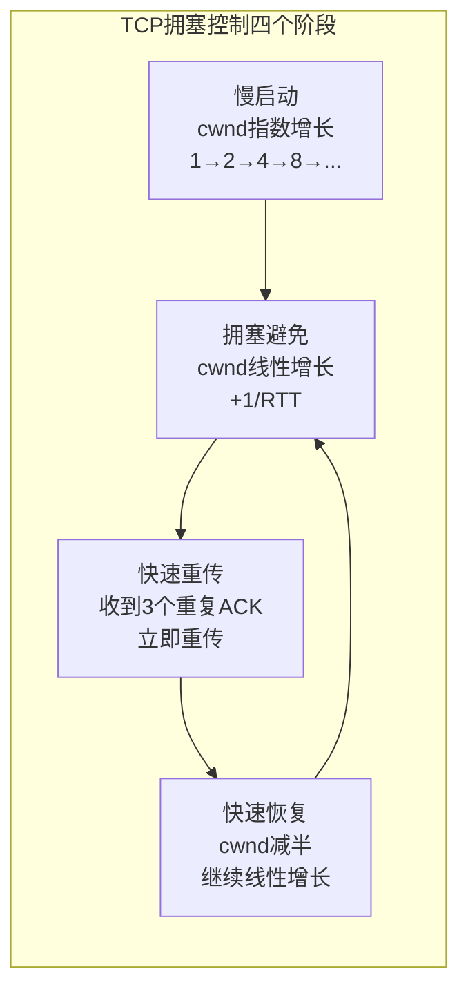

**常见拥塞控制算法对比**：

| 算法 | 策略 | 适用场景 | 项目相关性 |
|------|------|---------|-----------|
| **Cubic** | 基于丢包，Linux 默认 | 通用场景 | 项目 K8s Node 默认使用 |
| **BBR** | 基于带宽估计 | 高带宽高延迟 | 可优化跨区传输（gRPC 跨机房场景） |
| **Reno** | 经典 AIMD | 教学/老旧系统 | 面试基础知识 |

**项目为什么服务间不用 TCP？** 正是因为 TCP 拥塞控制在同机通信场景下是**纯开销**——同 Pod 进程间通信不存在网络拥塞，但 TCP 仍然要维护拥塞窗口、慢启动等状态机，增加延迟和 CPU 开销。Tbuspp 共享内存完全绕过了这些机制。

#### 10.1.5 Nagle 算法与延迟 ACK

**Nagle 算法**：当 TCP 连接中有未确认的小包时，不立即发送新的小包，而是等待 ACK 或积攒到 MSS 大小后再发送。目的是减少网络中的小包数量。

**延迟 ACK**：接收方不立即回复 ACK，而是等待一小段时间（通常 40-200ms），期望捎带数据一起回复。

**两者叠加的"死锁"问题**：

```
客户端: 发送小包A → 等待ACK（Nagle算法阻止发送B）
服务端: 收到A → 等待捎带（延迟ACK）→ 40ms后才发ACK
客户端: 收到ACK → 才发送B
结果: 每次小包交互额外增加40ms延迟！
```

**项目的解决方案**：

> Tconnd 网关对客户端 TCP 连接设置了 `TCP_NODELAY` 选项，禁用 Nagle 算法，确保游戏消息的实时性。游戏场景下（尤其是操作类游戏的帧同步/状态同步），每一帧的操作数据（通常几十到几百字节的小包）都需要立即发送，不能容忍 Nagle 算法带来的延迟。
>
> ```c
> // Tconnd 底层 C++ 伪代码
> int flag = 1;
> setsockopt(client_fd, IPPROTO_TCP, TCP_NODELAY, &flag, sizeof(flag));
> ```

### 10.2 UDP 协议原理与项目应用

#### 10.2.1 UDP vs TCP 对比

| 特性 | TCP | UDP |
|------|-----|-----|
| **连接模型** | 面向连接（三次握手） | 无连接 |
| **可靠性** | 可靠传输（ACK + 重传） | 不可靠（尽力而为） |
| **有序性** | 保证顺序（序列号） | 不保证顺序 |
| **流量控制** | 滑动窗口 | 无 |
| **拥塞控制** | 慢启动/拥塞避免 | 无 |
| **消息边界** | 无（字节流） | ✅ 有（数据报） |
| **头部开销** | 20字节 | 8字节 |
| **适用场景** | 需要可靠传输 | 实时性 > 可靠性 |

#### 10.2.2 项目中的 UDP 应用——Tlog 日志上报

项目选择 UDP 进行 Tlog 流水日志上报，这是一个经典的网络协议选型案例：

```java
// TlogManager.java - UDP发送Tlog
@ThreadSafe
public class TlogManager extends EngineModule {
    private DatagramSocket socket;           // PE环境socket
    private DatagramSocket socketTest;       // 测试环境socket
    private DatagramSocket socketSideway;    // 旁路通道socket
    
    void logToTlogd(String text, DatagramSocket socket, DatagramPacket packet) {
        byte[] bytes = text.getBytes(Charsets.UTF_8);
        packet.setData(bytes, 0, bytes.length);
        socket.send(packet);  // UDP发送，不等待ACK
    }
}
```

**选择 UDP 的理由分析**：

| 维度 | 分析 |
|------|------|
| **可靠性需求** | 流水日志允许少量丢失（<0.1%），不影响数据分析准确性 |
| **性能需求** | 每秒数万条日志，TCP 的连接管理和重传机制带来不必要的开销 |
| **简单性** | UDP 无状态，不需要连接管理、重连逻辑，代码更简单 |
| **单向传输** | 日志只需要从服务端 → Tlogd，不需要响应 |
| **延迟敏感** | 日志上报不能阻塞游戏主逻辑线程 |

#### 10.2.3 UDP 的可靠性增强策略

虽然项目 Tlog 使用裸 UDP，但在某些 UDP 场景下需要增强可靠性，常见方案包括：

| 方案 | 原理 | 代表协议 |
|------|------|---------|
| **应用层 ACK** | 应用层自己实现确认和重传 | 自定义协议 |
| **FEC 前向纠错** | 发送冗余数据包用于恢复丢失包 | QUIC, WebRTC |
| **KCP** | 在 UDP 上实现可靠传输，ARQ + 快速重传 | 游戏加速 |
| **QUIC** | Google 基于 UDP 的传输协议，内置可靠性/多路复用/0-RTT | HTTP/3 |

> **面试延伸**：如果被问到"为什么不用 QUIC 替代 TCP 做客户端接入？"——在游戏场景下，QUIC 的 0-RTT 连接建立和多路复用确实很有吸引力，但 Tconnd 作为腾讯自研的成熟接入网关，已经在 TCP 层做了大量优化（连接复用、DH 加密、负载均衡），迁移成本高且收益不确定。QUIC 更适合弱网环境下的 HTTP 场景。

### 10.3 HTTP 协议原理与项目应用

#### 10.3.1 HTTP/1.1 核心机制

HTTP 在项目中主要用于 IDIP 运营平台接口和部分外部系统对接。

**HTTP/1.1 长连接（Keep-Alive）**：

```
┌───────────────────────────────────────────────────────────────┐
│            HTTP/1.0 vs HTTP/1.1 连接模型                       │
├───────────────────────────────────────────────────────────────┤
│                                                               │
│  HTTP/1.0 (短连接):                                            │
│  [TCP握手] → [请求1] → [响应1] → [TCP挥手]                     │
│  [TCP握手] → [请求2] → [响应2] → [TCP挥手]  ← 每次都要建立连接  │
│  [TCP握手] → [请求3] → [响应3] → [TCP挥手]                     │
│                                                               │
│  HTTP/1.1 (长连接 Keep-Alive):                                 │
│  [TCP握手] → [请求1] → [响应1]                                 │
│            → [请求2] → [响应2]  ← 复用同一TCP连接               │
│            → [请求3] → [响应3]                                 │
│            → [TCP挥手]          (超时或主动关闭时才断开)          │
│                                                               │
│  HTTP/1.1 管线化 (Pipelining，实际很少使用):                     │
│  [TCP握手] → [请求1][请求2][请求3]                              │
│            ← [响应1][响应2][响应3]  ← 仍有队头阻塞问题           │
│                                                               │
└───────────────────────────────────────────────────────────────┘
```

**HTTP/1.1 队头阻塞（Head-of-Line Blocking）**：

即使使用了管线化（Pipelining），HTTP/1.1 仍然要求**按序响应**——如果请求1处理慢，请求2和3即使已处理完也必须等待请求1的响应先发出。这就是 HTTP/1.1 的核心瓶颈。

#### 10.3.2 HTTP/2 核心改进

HTTP/2 解决了 HTTP/1.1 的主要问题，gRPC 就是基于 HTTP/2 构建的：

```
┌───────────────────────────────────────────────────────────────┐
│                    HTTP/2 核心特性                              │
├───────────────────────────────────────────────────────────────┤
│                                                               │
│  1. 多路复用 (Multiplexing)                                    │
│     单连接上并行多个流(Stream)，互不阻塞                         │
│     ┌─────────TCP连接────────┐                                │
│     │ Stream1: 请求A → 响应A  │                                │
│     │ Stream2: 请求B → 响应B  │  ← 并行，不阻塞                │
│     │ Stream3: 请求C → 响应C  │                                │
│     └────────────────────────┘                                │
│                                                               │
│  2. 二进制分帧 (Binary Framing)                                │
│     所有通信都用二进制帧，替代HTTP/1.1文本格式                    │
│     ┌──────────┬──────────┬──────────┐                        │
│     │ Length(3B)│ Type(1B) │ Flags(1B)│ StreamID(4B) │ Payload│
│     └──────────┴──────────┴──────────┘                        │
│                                                               │
│  3. 头部压缩 (HPACK)                                           │
│     静态/动态表索引 + Huffman编码，减少头部传输开销                │
│                                                               │
│  4. 服务端推送 (Server Push)                                    │
│     服务端可主动向客户端推送资源                                  │
│                                                               │
│  5. 流优先级 (Stream Priority)                                  │
│     不同请求可设置优先级                                         │
│                                                               │
└───────────────────────────────────────────────────────────────┘
```

**HTTP/2 与项目的关系**：

| 层面 | 说明 |
|------|------|
| **gRPC 底层** | gRPC 基于 HTTP/2，项目中跨集群/外部系统调用使用 gRPC，实际上就是用了 HTTP/2 |
| **多路复用** | gRPC 单连接可以并行多个 RPC 调用，无需为每个调用建立新连接 |
| **为什么不用于 CS 协议** | CS 协议基于 Tconnd 自研接入层，已有成熟的连接管理，无需 HTTP/2 |
| **为什么不用于 SS 协议** | 服务间通信使用共享内存，延迟和吞吐量远优于 HTTP/2 |

#### 10.3.3 HTTP/3 与 QUIC

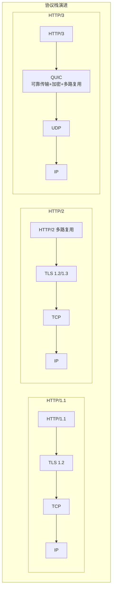

**HTTP/3 解决的核心问题**：

> HTTP/2 虽然在应用层实现了多路复用，但底层仍然是 TCP。TCP 层面如果丢了一个包，**所有 Stream 都必须等待重传**，这就是 TCP 层的队头阻塞。HTTP/3 用 QUIC（基于 UDP）替代 TCP，每个 Stream 独立控制重传，彻底解决了队头阻塞。

### 10.4 共享内存通信原理深度解析

共享内存是项目服务间通信的核心方案，本节深入分析其底层原理。

#### 10.4.1 共享内存的操作系统基础

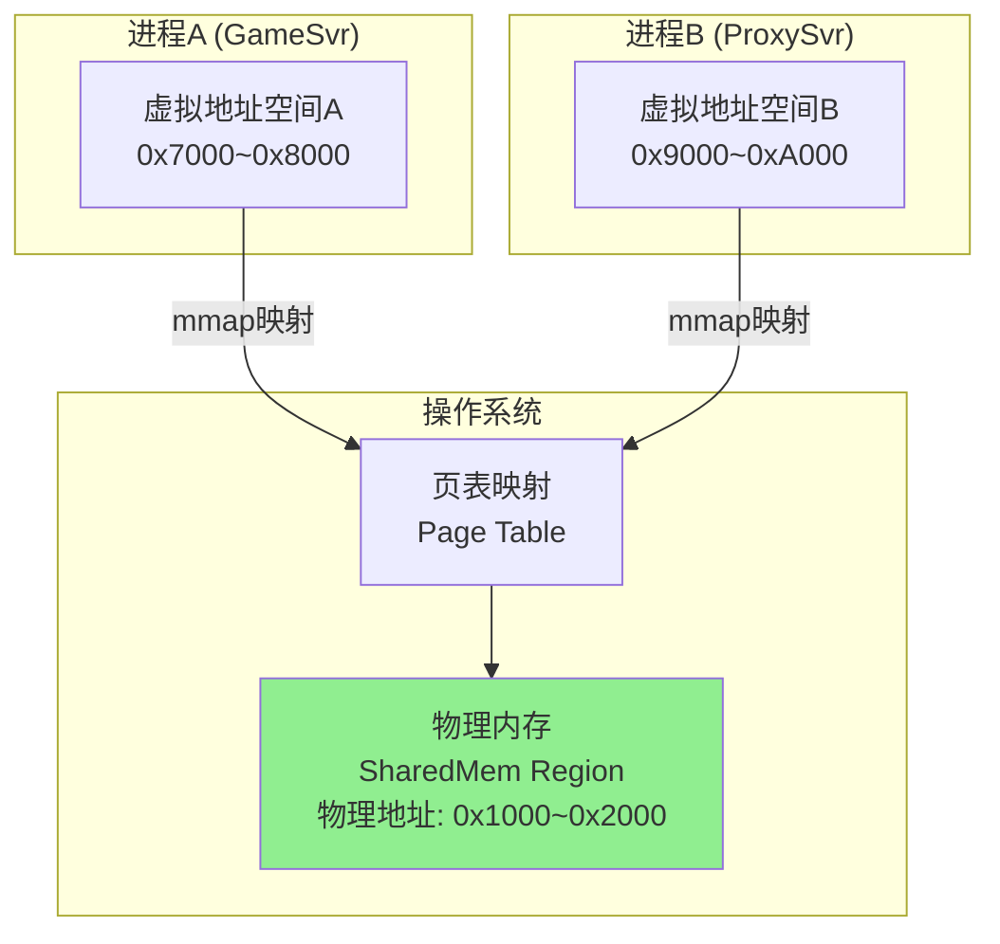

**实现机制**：

```c
// POSIX 共享内存创建（Tbuspp 底层 C++ 实现原理）

// 进程A: 创建共享内存区域
int fd = shm_open("/tbuspp_channel_ab", O_CREAT | O_RDWR, 0666);
ftruncate(fd, CHANNEL_SIZE);  // 设置共享内存大小
void* addr = mmap(NULL, CHANNEL_SIZE, PROT_READ | PROT_WRITE, 
                  MAP_SHARED, fd, 0);  // 映射到进程地址空间

// 进程B: 打开同一共享内存区域
int fd = shm_open("/tbuspp_channel_ab", O_RDWR, 0666);
void* addr = mmap(NULL, CHANNEL_SIZE, PROT_READ | PROT_WRITE, 
                  MAP_SHARED, fd, 0);  // 映射到另一个进程地址空间

// 此时 A 和 B 操作各自的 addr 指针，实际读写的是同一块物理内存
```

#### 10.4.2 Ring Buffer 无锁通信

Tbuspp 在共享内存上构建 **Ring Buffer（环形缓冲区）** 实现高效的无锁生产-消费模型：

```
┌─────────────────────────────────────────────────────────────┐
│                  共享内存 Ring Buffer                         │
├─────────────────────────────────────────────────────────────┤
│                                                             │
│  ┌───┬───┬───┬───┬───┬───┬───┬───┬───┬───┬───┬───┐       │
│  │   │   │ D │ E │ F │   │   │   │   │ A │ B │ C │       │
│  └───┴───┴─▲─┴───┴─▲─┴───┴───┴───┴───┴─▲─┴───┴───┘       │
│            │       │                     │                  │
│          read    write                 read                 │
│          cursor  cursor                cursor               │
│                                        (上一轮)              │
│                                                             │
│  写入流程 (生产者):                                           │
│  1. 读取 write_cursor                                       │
│  2. 计算新位置: (write_cursor + msg_len) % buffer_size      │
│  3. 检查空间: 确保不覆盖 read_cursor                          │
│  4. 写入数据                                                │
│  5. CAS 更新 write_cursor（或内存屏障+直接写入）               │
│                                                             │
│  读取流程 (消费者):                                           │
│  1. 读取 read_cursor                                        │
│  2. 比较 read_cursor 与 write_cursor                        │
│  3. 如果 read_cursor != write_cursor 则有数据                │
│  4. 读取数据                                                │
│  5. 更新 read_cursor                                        │
│                                                             │
│  单生产者-单消费者模式下无需加锁！                               │
│                                                             │
└─────────────────────────────────────────────────────────────┘
```

**为什么无锁？**

> Tbuspp 的 Ring Buffer 在单生产者-单消费者（SPSC）模式下天然无锁。因为 write_cursor 只有生产者修改，read_cursor 只有消费者修改，两者不会冲突。只需要确保**内存可见性**（通过 memory barrier / volatile 语义），不需要互斥锁。
>
> 对于项目中的多消费者场景，Tbuspp 通过**子队列（Sub-Queue）** 机制实现：每对通信的服务间有独立的子队列，队列内部仍然是 SPSC 模式。

#### 10.4.3 共享内存 vs TCP 的系统调用对比

```
┌─────────────────────────────────────────────────────────────────┐
│              发送一条消息的系统调用对比                              │
├─────────────────────────────────────────────────────────────────┤
│                                                                 │
│  TCP 通信路径:                                                   │
│  用户态 → write() → 内核态 → TCP协议栈处理 →                     │
│  → 构建TCP头 → 构建IP头 → 复制到socket缓冲区 →                   │
│  → 网卡队列 → 网卡发送 → 网络传输 →                               │
│  → 对端网卡接收 → 中断处理 → IP层 → TCP层 →                      │
│  → 复制到socket缓冲区 → read() → 用户态                          │
│  系统调用: 至少2次 (write + read)                                │
│  内存拷贝: 至少2次 (用户→内核, 内核→用户)                          │
│  协议栈开销: TCP头(20B) + IP头(20B) = 40B/包                    │
│                                                                 │
│  共享内存通信路径:                                                │
│  用户态 → memcpy到共享区域 → (对端poll) → memcpy读取 → 用户态      │
│  系统调用: 0次! (mmap后操作的是用户态地址)                         │
│  内存拷贝: 0-1次 (Tbuspp可实现零拷贝，直接操作共享内存地址)         │
│  协议栈开销: 0B (无TCP/IP协议头)                                  │
│                                                                 │
└─────────────────────────────────────────────────────────────────┘
```

这也解释了为什么 Tbuspp 的延迟能做到 P50 0.1ms，比 TCP（即使是 localhost loopback）低一个数量级。

### 10.5 I/O 多路复用模型

#### 10.5.1 Linux I/O 模型对比

| 模型 | 原理 | 缺点 | 适用场景 |
|------|------|------|---------|
| **阻塞 I/O** | read() 阻塞直到数据就绪 | 每连接一线程，并发差 | 连接数少的场景 |
| **非阻塞 I/O** | read() 立即返回，轮询检查 | CPU 空转浪费 | 几乎不用 |
| **select** | 监听多个 fd，任一就绪返回 | fd 上限 1024，每次全量复制 | 早期兼容 |
| **poll** | 基于链表，无 fd 数量限制 | 仍需遍历全部 fd | select 的改进 |
| **epoll** | 事件驱动，只返回就绪的 fd | Linux 特有 | ✅ 高并发服务器标配 |

#### 10.5.2 epoll 工作模式

```mermaid
graph TB
    subgraph "epoll 事件驱动模型"
        EP[epoll实例<br/>红黑树存储监听fd<br/>就绪链表存储事件]
        
        FD1[fd1: 客户端连接A]
        FD2[fd2: 客户端连接B]
        FD3[fd3: 客户端连接C]
        FDN[fd_n: 客户端连接N]
        
        FD1 -->|注册EPOLLIN| EP
        FD2 -->|注册EPOLLIN| EP
        FD3 -->|注册EPOLLIN| EP
        FDN -->|注册EPOLLIN| EP
        
        EP -->|epoll_wait()返回就绪fd| READY[就绪列表<br/>只包含有事件的fd]
        READY --> PROC[事件处理<br/>只处理有数据的连接]
    end
```

**epoll 的两种触发模式**：

| 模式 | 说明 | 特点 |
|------|------|------|
| **LT（水平触发）** | 只要缓冲区有数据，每次 `epoll_wait` 都返回 | 简单安全，但可能重复通知 |
| **ET（边沿触发）** | 只在状态变化时通知一次 | 高效，但必须一次读完所有数据 |

**项目中的应用**：

> Tconnd 网关作为客户端 TCP 接入层，底层使用 **epoll（ET 模式）** 实现高并发连接管理。单个 Tconnd 进程可以管理**数十万**客户端长连接。当客户端数据到达时，epoll 通知 Tconnd 读取数据，Tconnd 完成协议帧的组装后回调 `IoEventListener.onMessage()`。
>
> 而对于 Tbuspp 共享内存通信，不需要 epoll——因为不涉及 fd 和网络 I/O。Tbuspp 使用**主动 poll 模式**，业务线程周期性调用 `TbusppApiPro.recvData()` 从 Ring Buffer 中读取数据：
>
> ```java
> // TbusppManager 的收消息循环
> int ret = TbusppApiPro.recvData(i, recvBuffer.array(), 0, remote, tbusppRecvFlag);
> ```

#### 10.5.3 Reactor 模式

Reactor 是网络服务器的经典设计模式，项目的 Tconnd 网关采用了 **主从 Reactor 多线程** 模型：

```
┌────────────────────────────────────────────────────────────────┐
│                 主从 Reactor 多线程模型                          │
├────────────────────────────────────────────────────────────────┤
│                                                                │
│  ┌──────────────┐                                              │
│  │ Main Reactor │ ← 只负责accept新连接                          │
│  │  (1个线程)    │                                              │
│  └──────┬───────┘                                              │
│         │ 分发新连接                                             │
│   ┌─────┼─────────────┐                                        │
│   ↓     ↓             ↓                                        │
│  ┌──────────┐ ┌──────────┐ ┌──────────┐                       │
│  │SubReactor│ │SubReactor│ │SubReactor│ ← 负责I/O读写和编解码    │
│  │ (线程1)  │ │ (线程2)  │ │ (线程N)  │                        │
│  └────┬─────┘ └────┬─────┘ └────┬─────┘                       │
│       │            │            │                              │
│   ┌───┴───┐    ┌───┴───┐   ┌───┴───┐                         │
│   │Worker │    │Worker │   │Worker │ ← 业务逻辑处理线程         │
│   │Pool   │    │Pool   │   │Pool   │                          │
│   └───────┘    └───────┘   └───────┘                          │
│                                                                │
│  Tconnd映射:                                                   │
│  Main Reactor = Tconnd accept线程                              │
│  Sub Reactor = Tconnd I/O线程 (epoll事件循环)                   │
│  Worker Pool = Java业务线程 (协程调度器)                         │
│                                                                │
└────────────────────────────────────────────────────────────────┘
```

> **关键架构决策**：Tconnd（C++）负责 Reactor 模型下的网络 I/O，Java 层只处理业务逻辑。这种 **C++ 网络层 + Java 业务层** 的分层设计，既利用了 C++ 在系统编程上的性能优势（epoll、零拷贝、内存管理），又利用了 Java/Kotlin 在业务开发上的效率优势（协程、GC、丰富的生态）。

### 10.6 序列化协议原理对比

#### 10.6.1 主流序列化方案对比

| 方案 | 编码格式 | 大小 | 编解码速度 | Schema | 可读性 | 跨语言 |
|------|---------|:----:|:---------:|:------:|:-----:|:-----:|
| **JSON** | 文本 | 大 | 慢 | ❌ | ✅ | ✅ |
| **Protobuf** | 二进制 | 小 | 快 | ✅ | ❌ | ✅ |
| **FlatBuffer** | 二进制 | 小 | 极快(零拷贝) | ✅ | ❌ | ✅ |
| **MessagePack** | 二进制 | 中 | 快 | ❌ | ❌ | ✅ |
| **Thrift** | 二进制 | 小 | 快 | ✅ | ❌ | ✅ |
| **Avro** | 二进制 | 小 | 快 | ✅ | ❌ | ✅ |

#### 10.6.2 Protobuf 编码原理（Varint + ZigZag）

项目全栈使用 Protobuf，理解其编码原理对面试很重要：

**Varint 编码**：用变长字节表示整数，小数值用更少字节。

```
数值 1   → 编码: 0000 0001                    (1字节)
数值 300 → 编码: 1010 1100 0000 0010          (2字节)
                  ↑ MSB=1表示后面还有字节

编码规则:
1. 每字节的最高位(MSB)是标志位: 1=后续还有字节, 0=这是最后一个字节
2. 剩余7位存储实际数据(小端序)
3. 数值越小编码越短 → 对游戏中大量的小ID、枚举值、布尔值非常高效
```

**ZigZag 编码**：将有符号整数映射为无符号整数，使小的负数也能用更少字节。

```
原始值   → ZigZag → Varint字节数
  0      →   0    →  1字节
 -1      →   1    →  1字节
  1      →   2    →  1字节
 -2      →   3    →  1字节
 2147483647 → 4294967294 → 5字节
```

**项目选择 Protobuf 的原因（ADR 分析）**：

| 维度 | Protobuf | JSON | 项目决策 |
|------|---------|------|---------|
| **包体大小** | 比 JSON 小 3-10 倍 | 键名+引号+空格冗余 | 游戏消息包大小直接影响带宽成本 |
| **编解码速度** | 比 JSON 快 5-10 倍 | 反射/字符串解析开销 | 游戏服务器每秒处理数万消息 |
| **类型安全** | Schema 强类型 | 运行时类型推断 | 减少联调 bug |
| **跨语言** | Java/Go/Lua/C++ | 通用 | 项目涉及 4 种语言 |
| **版本兼容** | optional + 字段号 | 任意修改 | 支持滚动更新 |

### 10.7 网络安全基础

#### 10.7.1 TLS/SSL 握手过程

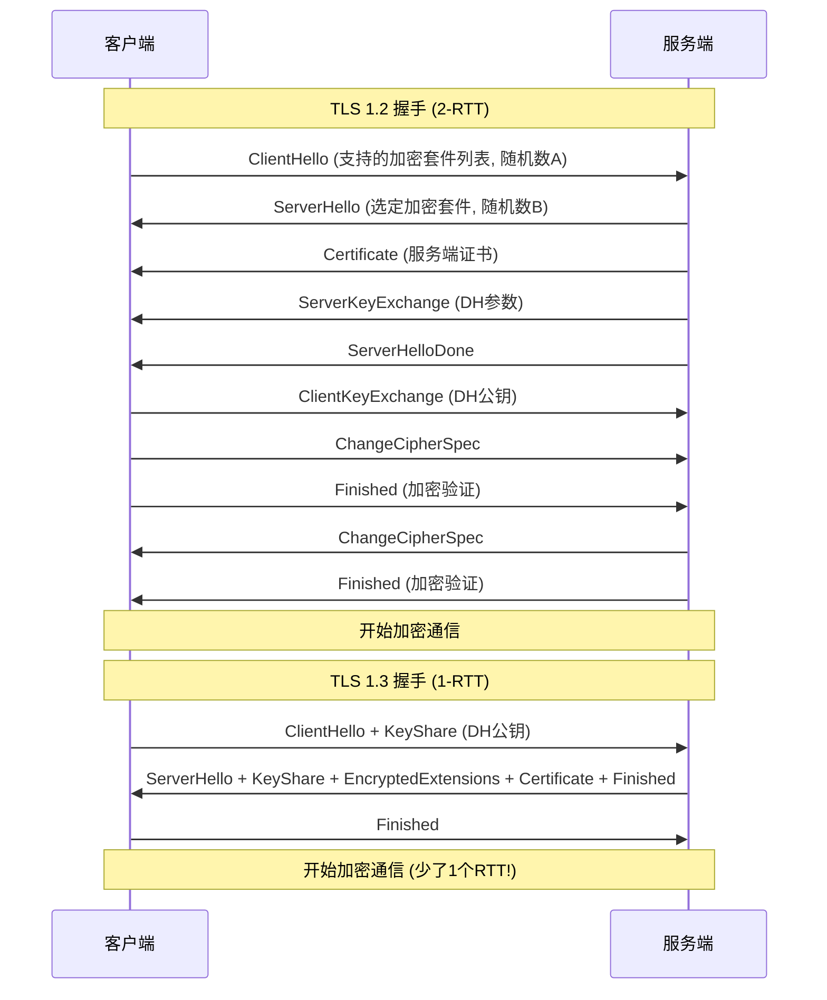

#### 10.7.2 项目中的 DH 密钥协商

项目 CS 协议使用 **DH（Diffie-Hellman）密钥协商** 建立通信密钥，这是 Tconnd 内置的安全机制：

```
┌────────────────────────────────────────────────────────────────┐
│                    DH 密钥协商流程                               │
├────────────────────────────────────────────────────────────────┤
│                                                                │
│  公共参数: 大素数p, 生成元g (双方已知)                             │
│                                                                │
│  客户端:                   服务端(Tconnd):                       │
│  生成私钥 a               生成私钥 b                             │
│  计算 A = g^a mod p       计算 B = g^b mod p                    │
│  发送 A ───────────────→  收到 A                                │
│  收到 B ←───────────────  发送 B                                │
│  计算 K = B^a mod p       计算 K = A^b mod p                    │
│                                                                │
│  K = g^(ab) mod p ← 双方得到相同的共享密钥!                      │
│                                                                │
│  后续通信使用 K 派生的 AES 密钥进行对称加密                        │
│                                                                │
│  TbusppApiPro 错误码映射:                                       │
│  kNoEncryptAesKey (-5066): 加密时没有通信密钥                     │
│  kNoDecryptAesKey (-5067): 解密时没有通信密钥                     │
│  kAuthTimeout (-5075): 鉴权超时（DH协商超时）                     │
│                                                                │
└────────────────────────────────────────────────────────────────┘
```

> **面试要点**：DH 密钥协商的安全性基于**离散对数难题**——已知 g, p, A=g^a mod p，很难反推出 a。但 DH 不能防止中间人攻击，需要配合证书验证。项目中 Tconnd 通过 AuthAgent（鉴权代理）配合 MSDK Token 验证客户端身份，形成完整的认证+加密体系。

### 10.8 网络编程面试高频知识点速查

| 知识点 | 核心要点 | 项目映射 |
|--------|---------|---------|
| **TCP 三次握手** | SYN→SYN+ACK→ACK，防止历史连接 | Tconnd TCP 接入 |
| **TCP 四次挥手** | 全双工分别关闭，TIME_WAIT=2MSL | Tconnd onDisconnect |
| **TCP 粘包/拆包** | 字节流无边界，长度前缀解决 | CS 协议 4 字节 HeaderLength |
| **TCP 滑动窗口** | 流量控制，接收方告知可接收量 | 包大小告警 ≥768KB |
| **TCP 拥塞控制** | 慢启动→拥塞避免→快重传→快恢复 | 项目用共享内存绕过 |
| **Nagle + 延迟 ACK** | 小包延迟问题，TCP_NODELAY 解决 | Tconnd 禁用 Nagle |
| **UDP 特点** | 无连接/不可靠/有消息边界 | Tlog 日志上报 |
| **HTTP/1.1 长连接** | Keep-Alive 复用 TCP，但有队头阻塞 | IDIP 运营接口 |
| **HTTP/2 多路复用** | 单连接多 Stream，二进制分帧 | gRPC 底层 |
| **HTTP/3 QUIC** | 基于 UDP，解决 TCP 层队头阻塞 | 面试扩展知识 |
| **epoll** | 事件驱动 I/O 多路复用，红黑树+就绪链表 | Tconnd 底层实现 |
| **Reactor 模式** | 主从 Reactor 多线程 | Tconnd 架构 |
| **共享内存** | mmap + Ring Buffer，零系统调用 | Tbuspp 核心传输 |
| **Protobuf 编码** | Varint 变长 + ZigZag 有符号 | 全栈序列化 |
| **DH 密钥协商** | g^ab mod p 共享密钥 | Tconnd 加密通信 |

---

## 11. 面试专栏

### 11.1 面试话术：项目通讯协议架构

> **面试官**：你们项目的通讯协议是怎么设计的？
>
> **回答**：
> 
> 我们项目采用**五层协议体系**，针对不同的通信场景选择最合适的协议栈：
>
> 1. **CS协议**（客户端↔服务器）：基于Tconnd接入层，Protobuf序列化，支持DH密钥协商和AES加密，通过`cs_meta.xml`配置消息路由规则，实现请求自动转发到后端不同服务。
>
> 2. **SS/RPC协议**（服务器间）：这是我们用得最重的协议，基于**Tbuspp共享内存**传输。核心优势是零拷贝、无系统调用，P50延迟只有约0.1ms。支持**9种路由模式**——从简单的AnyNode随机路由，到一致性哈希、元数据转发、状态路由等。路由信息通过Proto字段选项（`field_hash_key`、`field_meta_type`等）自动构建，业务代码只需要定义好Proto消息，框架就能自动选择正确的路由模式。
>
> 3. **IRPC协议**（服务器↔DS）：用于与Dedicated Server通信，也是基于Tbuspp传输，但有独立的24+16字节帧头，支持跨大区转发。
>
> 4. **Tlog协议**：流水日志使用UDP单向上报，异步队列削峰，支持PE环境/测试环境/旁路通道三条通道。
>
> 5. **IDIP协议**：运营平台通过HTTP+Protobuf调用，IdipSvr作为网关转发到后端GameSvr。

### 11.2 面试话术：为什么选Tbuspp不选gRPC？

> **面试官**：为什么服务间通信不用gRPC？
>
> **回答**：
>
> 这是一个**部署架构决定通信方案**的典型案例。我们的服务是**同Pod部署**的微服务架构（通过Sidecar模式同Pod多容器），同一组服务进程共享同一台机器的内存空间。
>
> 在这种部署模式下，Tbuspp共享内存有三个决定性优势：
>
> 1. **延迟**：共享内存P50延迟约0.1ms，gRPC即使同机也要2-3ms，差距20-30倍。这对游戏服务器的帧同步等高频场景至关重要。
>
> 2. **吞吐量**：共享内存小包场景可以达到50万QPS/实例，gRPC通常在1-3万QPS，差距10倍以上。
>
> 3. **资源开销**：共享内存无连接管理、无TCP协议栈、无系统调用切换，CPU开销极低。
>
> 当然gRPC我们也在用，对于跨集群调用、外部系统对接等场景，gRPC的标准化接口和生态优势就体现出来了。所以核心原则是**根据部署拓扑选择最合适的传输层**。

### 11.3 面试话术：协议版本兼容怎么做的？

> **面试官**：你们的协议版本怎么管理？如何保证兼容性？
>
> **回答**：
>
> 我们有**三层版本管理体系**：
>
> **第一层**是Protobuf原生的兼容机制——所有字段都用`optional`，新增字段只在消息末尾追加新编号。旧版本遇到未知字段会自动忽略，新版本对缺失字段使用默认值。
>
> **第二层**是我们自定义的`rpc_proto_version`消息选项。每个RPC消息可以声明自己的版本号，客户端在调用时自动设置（支持`@RpcVersion`注解覆盖），服务端根据版本号走不同的处理逻辑。而且这个功能有热配开关（`enableSetProtoVersion`），紧急情况可以秒级关闭。
>
> **第三层**是我们做过的一次大规模协议改造——把SS协议头中的多个枚举类型字段（`relayMode`、`responseFlag`等）统一改为整数类型。因为Protobuf的枚举和int32在Wire Format上都是Varint编码，所以这个改造在**二进制层面完全兼容**，不需要灰度，直接替换即可。改造解决了Go/Lua对未知枚举值处理不一致的痛点。
>
> 另外还有`deprecated`标记的渐进式迁移，比如`RpcRouting`中的`srcType`枚举字段标记为deprecated，同时新增`srcTypeInt`整数字段，经过双写期后逐步切换。

### 11.4 面试话术：TCP 粘包/拆包怎么解决的？

> **面试官**：TCP 粘包/拆包问题你们怎么处理的？
>
> **回答**：
>
> TCP 是面向字节流的协议，没有消息边界，所以多条消息可能被合并成一个 TCP 段（粘包），或者一条消息被拆到多个 TCP 段（拆包）。
>
> 我们的解决方案是**长度前缀法（Length-Prefix）**。CS 协议帧格式为 `[4字节HeaderLength][CSHeader Protobuf][4字节BodyLength][Body Protobuf]`，接收方先读取前 4 字节获得 Header 长度，然后精确读取 Header，再根据 Header 中的信息读取 Body。
>
> 具体实现上，拆包逻辑由 **Tconnd 网关**（C++ 实现）在底层完成——Tconnd 为每个 TCP 连接维护接收缓冲区，将 TCP 字节流按协议帧格式切割，每次回调 Java 层的 `IoEventListener.onMessage()` 时，传入的已经是一个**完整的协议帧**，Java 业务代码不需要处理半包问题。
>
> 另外，对于我们的服务间 SS/RPC 协议，因为底层是**共享内存 Ring Buffer** 而非 TCP，天然就有消息边界，根本不存在粘包/拆包问题——每次 `recvData()` 读取的就是一个完整消息。这也是共享内存比 TCP 更简单的一个优势。

### 11.5 面试话术：网络 I/O 模型怎么选的？

> **面试官**：你们的网络 I/O 模型是怎么设计的？
>
> **回答**：
>
> 我们的网络 I/O 分为两层，采用了不同的模型：
>
> **客户端接入层**（Tconnd 网关）：使用经典的**主从 Reactor 多线程模型**，底层是 Linux **epoll 边沿触发（ET模式）**。Main Reactor 线程负责 accept 新连接，Sub Reactor 线程（多个）负责已建立连接的 I/O 读写和协议编解码。单个 Tconnd 进程可以管理数十万客户端长连接。
>
> **服务间通信层**（Tbuspp）：不使用任何传统 I/O 模型，而是**共享内存 + 主动 poll**。业务线程周期性调用 `recvData()` 从 Ring Buffer 读取数据，完全绕过了 TCP/IP 协议栈和内核 I/O 调度。这种方式没有 epoll 的事件通知开销，但需要 CPU 持续 poll（典型的延迟 vs CPU 的权衡，对游戏服务器来说低延迟更重要）。
>
> 整体架构是 **C++ 网络层（Tconnd epoll）+ Java 业务层（协程调度）** 的分层设计，既利用 C++ 在系统编程上的性能优势，又利用 Java 在业务开发上的效率优势。

### 11.6 高频面试QA

| 问题 | 简要回答 | 详细参考 |
|------|---------|---------|
| Tbuspp共享内存怎么实现通信？ | 通过操作系统mmap将同一块物理内存映射到多个进程地址空间，使用Ring Buffer结构实现无锁读写 | §8.2 |
| 你们的RPC超时怎么控制？ | 三级优先级：方法注解 > 类注解 > 全局配置(默认10秒)。支持热配修改，协程异步等待+超时唤醒 | §9.5 |
| RPC调用链怎么防止循环？ | Hop计数机制，每次调用递增，超过`rpc_hop_limit`(默认10)抛异常 | §3 |
| 消息路由是怎么实现的？ | 通过Proto字段选项注解(field_hash_key等)自动构建RpcRouting，ProxySvr根据路由模式分发 | §3.3 |
| CS协议消息怎么路由到后端服务？ | cs_meta.xml配置消息ID到目标服务的映射，支持forwardToNum指定服务类型 | §2.3 |
| 序列化为什么全用Protobuf？ | 编解码速度快(比JSON快5-10倍)、包体小(比JSON小3-10倍)、强类型schema、跨语言(Java/Go/Lua) | §1.1 |
| 怎么监控RPC性能？ | RpcProfiler每60秒统计各方法的成功/失败/超时次数、平均包大小、平均耗时，支持Micrometer对接Grafana | §8.4 |
| Tlog为什么用UDP不用TCP？ | 流水日志是单向上报，不需要ACK确认，允许少量丢失；UDP无连接管理开销，吞吐量高 | §5.3 |
| TCP粘包/拆包怎么解决？ | CS协议使用4字节大端序长度前缀，Tconnd底层完成帧切割，Java层收到的已是完整包；SS协议基于共享内存无此问题 | §10.1.2 |
| 为什么要禁用Nagle算法？ | 游戏场景频繁发送小包（操作帧数据），Nagle+延迟ACK会增加40ms+延迟，Tconnd设置TCP_NODELAY禁用 | §10.1.5 |
| epoll和select/poll的区别？ | epoll用红黑树管理fd+就绪链表返回事件，O(1)事件通知；select/poll每次全量遍历，O(n) | §10.5 |
| 你们的I/O模型是什么？ | Tconnd用主从Reactor+epoll ET模式管理TCP连接；Tbuspp用共享内存+主动poll，无需epoll | §10.5.3 |
| HTTP/1.1和HTTP/2的区别？ | HTTP/2支持多路复用(单连接多Stream)、二进制分帧、头部压缩，gRPC基于HTTP/2 | §10.3.2 |
| Protobuf为什么比JSON快？ | Varint变长编码+二进制格式，无键名冗余；编码直接映射字段号，解码无需字符串解析 | §10.6.2 |
| DH密钥协商原理？ | 双方交换g^a和g^b，各自计算g^ab得到共享密钥；安全性基于离散对数难题 | §10.7.2 |

---

## 12. 改进空间建议

### 12.1 协议层面

| 问题 | 现状 | 建议改进 |
|-----|------|---------|
| **序列化效率** | 全部使用Protobuf | 对高频协议考虑FlatBuffer |
| **协议版本控制** | 依赖`rpc_proto_version`选项 | 建立完善的协议版本管理机制 |
| **协议文档** | 分散在各proto文件中 | 自动化生成协议文档 |

### 12.2 路由层面

| 问题 | 现状 | 建议改进 |
|-----|------|---------|
| **路由配置** | 静态XML/Proto配置 | 支持动态路由规则热更新 |
| **负载均衡** | 一致性哈希为主 | 增加权重负载、自适应负载策略 |
| **熔断机制** | 基础限流(`rate_limit`) | 增加完善的熔断降级机制 |

### 12.3 代码层面

```java
// 当前：硬编码服务类型
public static WeAServerType convertServerType(RpcRequest request, WeAServerType toServer, Proto proto) {
    if (!RpcServiceMgr.isStarPOpen()) {
        return toServer;
    }
    // 适配逻辑...
}

// 建议：策略模式抽象
public interface ServerTypeConverter {
    WeAServerType convert(RpcRequest request, WeAServerType toServer, Proto proto);
}

// 通过配置注入不同策略
@Service
public class StarpServerTypeConverter implements ServerTypeConverter {
    // ...
}
```

### 12.4 监控层面

| 问题 | 现状 | 建议改进 |
|-----|------|---------|
| **调用链追踪** | 基础traceId | 完善OpenTelemetry集成 |
| **性能指标** | Monitor打点 | 增加协议级延迟统计 |
| **异常告警** | 基础监控 | 协议级异常聚合告警 |

### 12.5 Tlog层面

```java
// 当前：单线程消费队列
private ExecutorService worker = new ThreadPoolExecutor(1, 1, ...);

// 建议：多线程消费 + 批量发送
private ExecutorService worker = new ThreadPoolExecutor(
    4, 8, // 增加核心线程数
    60, TimeUnit.SECONDS,
    new LinkedBlockingQueue<>(10000)
);

// 批量发送
void sendBatch(List<AbstractTlogFlow> flows) {
    ByteArrayOutputStream batch = new ByteArrayOutputStream();
    for (AbstractTlogFlow flow : flows) {
        batch.write(flow.getFlatText().getBytes());
        batch.write('\n');
    }
    socket.send(new DatagramPacket(batch.toByteArray(), ...));
}
```

### 12.6 安全层面

| 问题 | 建议改进 |
|-----|---------|
| **CS协议** | 增加协议签名/加密 |
| **IDIP协议** | 完善权限校验和审计日志 |
| **IRPC协议** | 增加DS身份验证机制 |

---

## 13. 总结

本项目采用了成熟的多层协议架构：

1. **CS协议** - 简洁高效的客户端通信
2. **SS协议** - 灵活的服务间RPC机制，支持多种路由模式
3. **IRPC协议** - 专业的DS管理和通信
4. **Tlog协议** - 高效的流水日志上报
5. **IDIP协议** - 完善的运营工具接入

整体架构设计合理，但在**动态配置**、**熔断降级**、**监控追踪**等方面仍有提升空间。