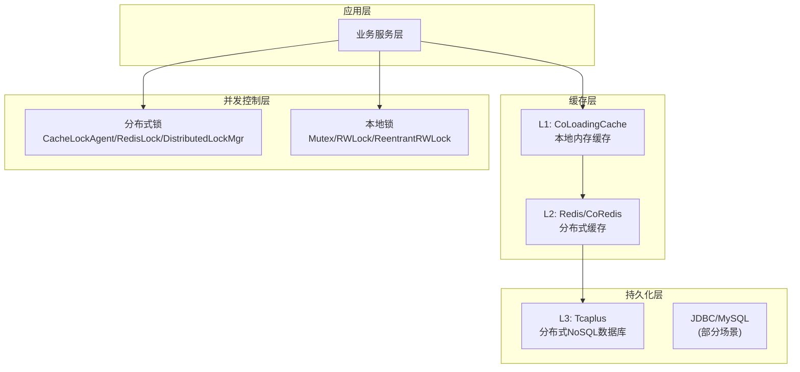
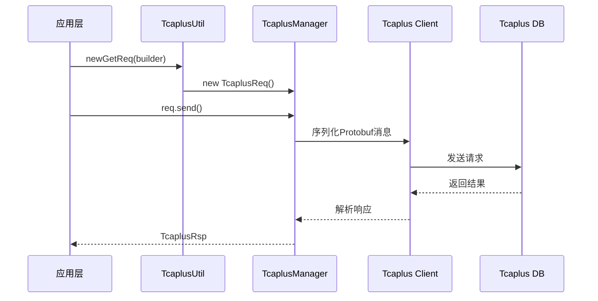
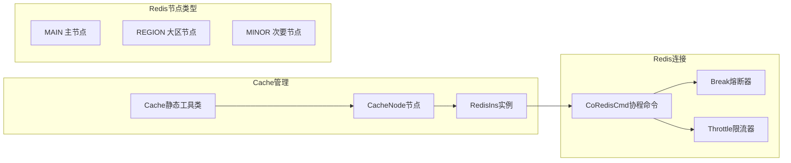
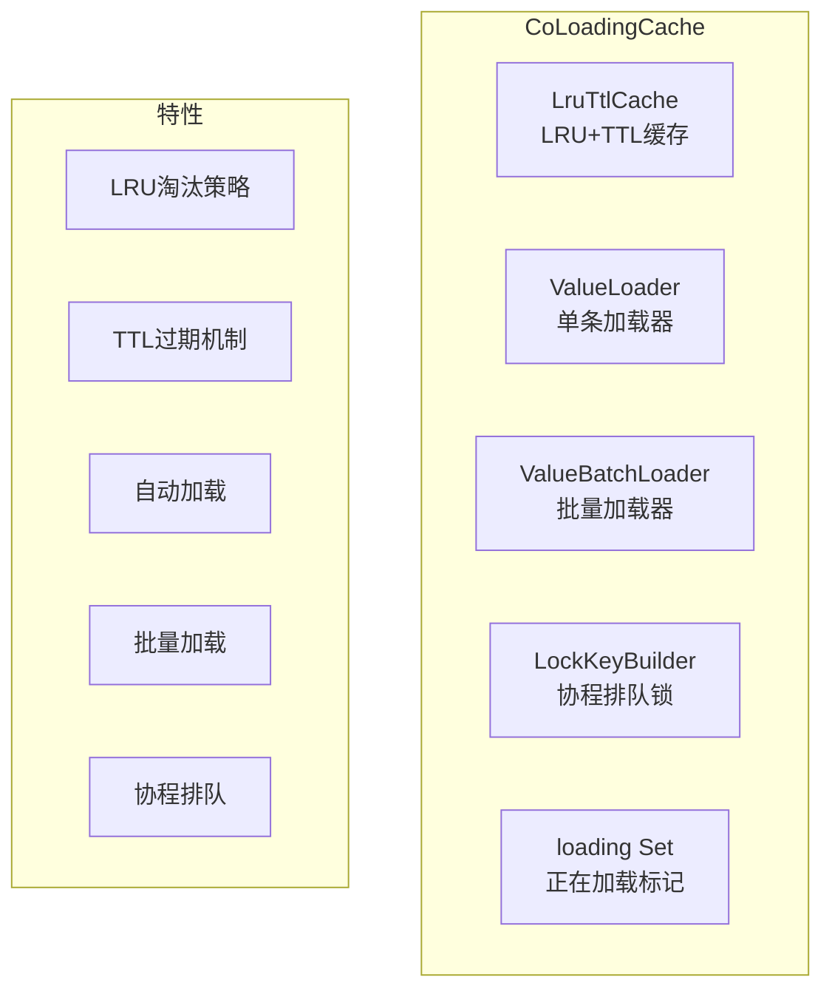
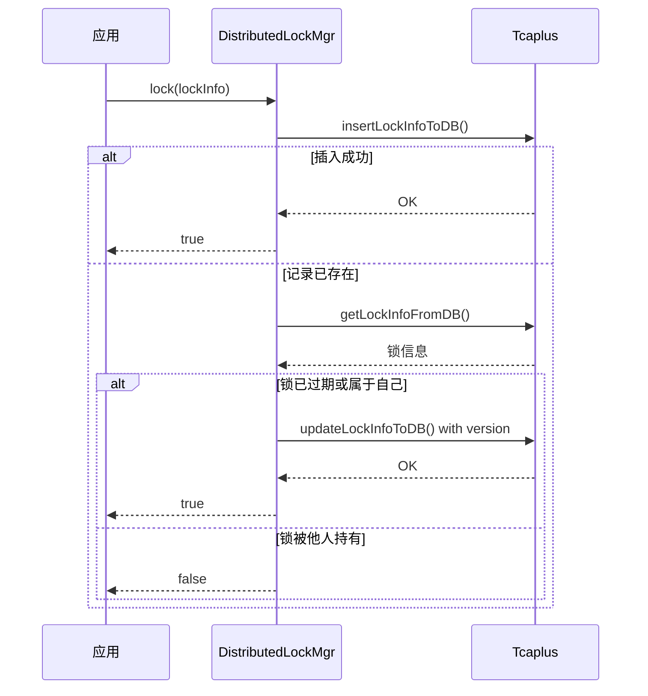
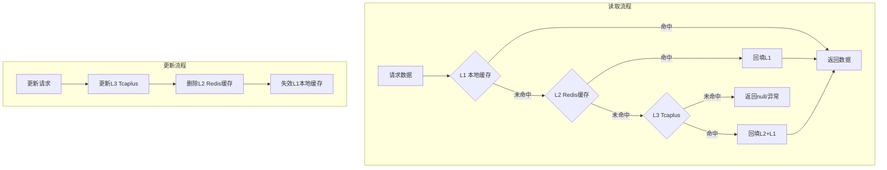
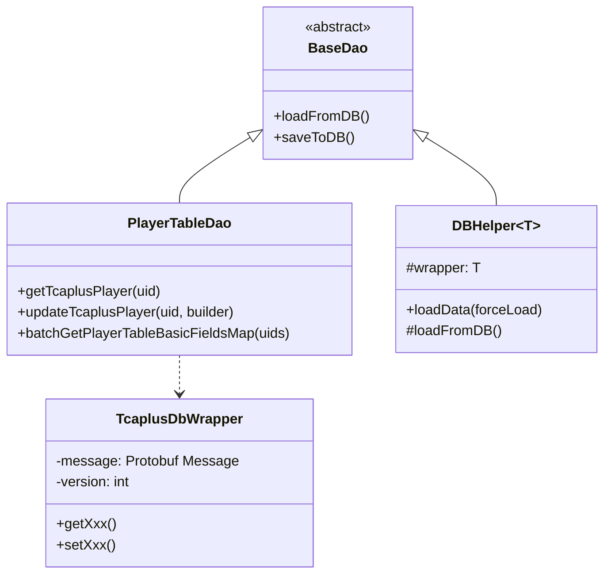

---

# 项目数据读取与管理机制分析报告

## 一、数据存储层架构总览



---

## 二、核心组件详解

### 2.1 Tcaplus数据库层

**核心组件：** `TcaplusManager`、`TcaplusUtil`、`TcaplusDbWrapper`

**实现原理：**



**关键特性：**

| 特性 | 实现方式 | 文件位置 |
|------|---------|---------|
| 协程化操作 | `CoroutineAsync` 封装异步调用 | [TcaplusManager.java](/C:/UGit/letsgo_server/WeA/common/src/main/java/com/tencent/tcaplus/TcaplusManager.java) |
| 版本号乐观锁 | `setVersion()` 方法 | [TcaplusManager.java](/C:/UGit/letsgo_server/WeA/common/src/main/java/com/tencent/tcaplus/TcaplusManager.java) |
| 批量操作 | `newBatchGetReq()` | [TcaplusUtil.java](/C:/UGit/letsgo_server/WeA/common/src/main/java/com/tencent/tcaplus/TcaplusUtil.java) |
| 部分键查询 | `newGetByPartKeyReq()` | [TcaplusUtil.java](/C:/UGit/letsgo_server/WeA/common/src/main/java/com/tencent/tcaplus/TcaplusUtil.java) |

**典型DAO使用模式**（参考 [PlayerTableDao.java](/C:/UGit/letsgo_server/WeA/common/src/main/java/com/tencent/tcaplus/dao/PlayerTableDao.java)）：

```java
// 单条查询
TcaplusDb.Player.Builder record = TcaplusDb.Player.newBuilder();
record.setUid(uid);
TcaplusManager.TcaplusReq req = TcaplusUtil.newGetReq(record);
TcaplusManager.TcaplusRsp queryRsp = req.send();

// 带版本号更新（乐观锁）
TcaplusManager.TcaplusRsp playerRsp = TcaplusUtil.newUpdateReq(builder)
    .setVersion(version)
    .send();
```

---

### 2.2 Redis缓存层

**核心组件：** `Cache`、`CacheNode`、`CoRedisCmd`、`RedisIns`

**架构设计：**



**多节点支持**（参考 [Cache.java](/C:/UGit/letsgo_server/WeA/common/src/main/java/com/tencent/cache/Cache.java)）：

| 节点类型 | 用途 | 配置方式 |
|---------|------|---------|
| `MAIN` | 主游戏数据缓存 | `redis_ins_node_type` |
| `REGION` | 大区数据缓存 | `redis_region_db` |
| `MINOR` | 配置服务缓存 | `redis_minor_db` |
| `FARMCRAZY` | 特定活动缓存 | 独立配置 |

**CoRedisCmd特性**（参考 [CoRedisCmd.java](/C:/UGit/letsgo_server/WeA/common/src/main/java/com/tencent/coRedis/CoRedisCmd.java)）：

- **协程化**：基于 `CoRedisAsync` 封装，支持协程挂起
- **熔断保护**：`Break` 类实现熔断，防止Redis故障影响整体服务
- **限流控制**：`Throttle` 类实现请求限流
- **超时控制**：每个操作支持配置超时时间

---

### 2.3 本地缓存层

**核心组件：** `CoLoadingCache`

**实现原理**（参考 [CoLoadingCache.java](/C:/UGit/letsgo_server/WeA/common/src/main/java/com/tencent/coLoadingCache/CoLoadingCache.java)）：



**核心流程：**

```java
public V get(K key) {
    V value = getFromCache(key);
    if (value != null) {
        return value;
    }
    // 有锁：使用 ReentrantRWLock 进行协程排队
    if (builder != null) {
        ReentrantRWLock lock = ReentrantRWLock.newBuilder()
                .addLoadingCacheKey(builder.buildLockKey(key))
                .build();
        return lock.writeLockCall(() -> getFromCacheOrRemote(key));
    }
    // 无锁：直接加载
    return getFromCacheOrRemote(key);
}
```

**关键配置：**

| 配置项 | 说明 | 推荐值 |
|-------|------|-------|
| `capacity` | 缓存容量 | 1000-10000 |
| `expireAfterWrite` | 写入后过期时间(ms) | 60000-300000 |
| `setLockKeyBuilder` | 协程排队锁 | 建议配置 |
| `setBatchLoader` | 批量加载器 | 性能优化必配 |
| `enableLoadFailReturn` | 加载失败返回null | 按需配置 |

---

### 2.4 分布式锁机制

项目提供了三种分布式锁实现：

#### 2.4.1 CacheLockAgent（推荐，功能最完善）

**特性：**
- 自动续期
- CAP策略选择（强一致性/可用性优先）
- 锁抢占机制
- 版本号防ABA

#### 2.4.2 RedisLock（轻量级）

参考 [RedisLock.java](/C:/UGit/letsgo_server/WeA/common/src/main/java/com/tencent/wea/redis/lock/RedisLock.java)：

```java
// 实现原理：SETNX + EXPIRE
Boolean setnxRet = coRedisCmd.setnx(lockName, lockValue);
if (setnxRet) {
    doExpire(lockName, expireTime);
    return lockValue;
}
```

**缺点：** 不支持自动续期

#### 2.4.3 DistributedLockMgr（基于Tcaplus）

参考 [DistributedLockMgr.java](/C:/UGit/letsgo_server/WeA/common/src/main/java/com/tencent/distributedLock/DistributedLockMgr.java)：



**特性：**
- 基于Tcaplus持久化存储
- 支持版本号乐观锁
- 自动重试机制（最多3次）
- 支持批量加锁/解锁

---

## 三、多级缓存架构



**缓存一致性策略 - Cache-Aside模式：**

```java
// 读取：L1 -> L2 -> L3
public PlayerData getPlayerData(long uid) {
    // L1 本地缓存
    PlayerData data = localCache.get(uid);
    if (data != null) return data;
    
    // L2 Redis
    data = getFromRedis("player:" + uid);
    if (data != null) {
        localCache.put(uid, data);
        return data;
    }
    
    // L3 Tcaplus
    TcaplusDb.Player player = PlayerTableDao.getPlayer(uid);
    data = convertToPlayerData(player);
    putToRedis("player:" + uid, data, 3600);
    localCache.put(uid, data);
    return data;
}

// 更新：先更新DB，再删除缓存
public void updatePlayerData(long uid, PlayerData data) {
    // 1. 更新数据库
    PlayerTableDao.updateTcaplusPlayer(uid, builder);
    // 2. 删除缓存（而不是更新）
    deleteFromRedis("player:" + uid);
    localCache.invalidate(uid);
}
```

---

## 四、数据访问层模式

### 4.1 DAO层设计模式



### 4.2 数据包装器模式

`TcaplusDbWrapper` 对Protobuf消息进行包装，提供：
- 版本号管理
- 便捷的getter/setter
- 脏数据标记

---

## 五、改进空间分析

### 5.1 现有优点

| 方面 | 优点 |
|------|------|
| **协程化设计** | 全链路协程化，避免线程阻塞 |
| **多级缓存** | L1/L2/L3三级缓存架构清晰 |
| **熔断保护** | Redis操作带熔断机制 |
| **乐观锁** | Tcaplus版本号机制防并发冲突 |
| **批量操作** | 支持批量查询/批量加载 |

### 5.2 潜在改进点

#### 5.2.1 缓存一致性增强

**问题：** 当前Cache-Aside模式在高并发下可能出现短暂不一致

**改进建议：**
```java
// 方案1：延迟双删
public void updatePlayerData(long uid, PlayerData data) {
    deleteFromRedis("player:" + uid);        // 先删
    updateTcaplusPlayer(uid, builder);       // 更新DB
    // 延迟一段时间后再删一次
    TimerUtil.addTimer(100, () -> deleteFromRedis("player:" + uid));
}

// 方案2：使用消息队列异步删除缓存
public void updatePlayerData(long uid, PlayerData data) {
    updateTcaplusPlayer(uid, builder);
    mqProducer.send(new CacheInvalidateMsg("player:" + uid));
}
```

#### 5.2.2 CoLoadingCache重入检测优化

**问题：** 当前重入检测仅打印日志

```java
// 当前实现 - CoLoadingCache.java:449
if (loading.contains(key)) {
    if (LOGGER.isDebugEnabled()) {
        WechatLog.debugPanicLog("reenter load data, stack trace: ...");
        return null;
    }
}
```

**改进建议：**
```java
// 改进：抛出明确异常或使用可重入机制
if (loading.contains(key)) {
    throw new CacheReentrantException("Reentrant cache load detected for key: " + key);
}
```

#### 5.2.3 RedisLock缺少自动续期

**问题：** 业务逻辑执行时间超过锁过期时间时会导致问题

**改进建议：**
```java
public class RedisLockWithRenewal extends RedisLock {
    private ScheduledExecutorService scheduler;
    
    public String acquireWithAutoRenewal(String lockName, int expireTime, int waitTime) {
        String lockValue = super.acquireWithWait(lockName, expireTime, waitTime);
        if (lockValue != null) {
            // 启动续期定时任务
            scheduler.scheduleAtFixedRate(
                () -> doExpire(lockName, expireTime),
                expireTime / 3,
                expireTime / 3,
                TimeUnit.MILLISECONDS
            );
        }
        return lockValue;
    }
}
```

#### 5.2.4 批量操作性能优化

**问题：** 部分场景未充分利用批量接口

**改进建议：**
```java
// 当前：循环单条查询
for (Long uid : uidList) {
    Player p = getPlayer(uid);  // 多次DB访问
}

// 优化：使用批量接口
Map<Long, Player> players = batchGetPlayers(uidList);  // 一次DB访问
```

#### 5.2.5 缓存监控增强

**建议增加的监控指标：**
```java
public class CacheMetrics {
    // 命中率监控
    private AtomicLong hitCount = new AtomicLong();
    private AtomicLong missCount = new AtomicLong();
    
    // 加载耗时监控
    private Histogram loadLatency;
    
    // 缓存容量使用率
    private Gauge cacheUsage;
    
    // 热点Key检测
    private Map<String, AtomicLong> hotKeyCounter;
}
```

#### 5.2.6 读写分离支持

**建议：** 对于读多写少的场景，可以考虑引入Redis主从/集群：

```java
public class CacheNodeWithReplica extends CacheNode {
    private RedisIns masterNode;  // 写操作
    private List<RedisIns> slaveNodes;  // 读操作
    
    public <V> V get(String key) {
        // 从slave读取
        return selectSlave().get(key);
    }
    
    public void set(String key, V value) {
        // 写master
        masterNode.set(key, value);
    }
}
```

---

## 六、总结

### 架构优势
1. **协程化全链路**：避免IO阻塞，提高并发性能
2. **多级缓存设计**：有效降低DB压力，提升响应速度
3. **丰富的锁机制**：满足不同场景的并发控制需求
4. **版本号乐观锁**：有效防止并发写冲突
5. **熔断限流保护**：增强系统稳定性

### 主要改进方向
1. **缓存一致性**：增强延迟双删或消息队列异步删除
2. **监控体系**：完善缓存命中率、热点Key等监控
3. **批量操作**：统一使用批量接口优化性能
4. **锁机制**：RedisLock增加自动续期功能
5. **读写分离**：高并发场景考虑引入Redis集群

---

## 七、面试专栏

### 7.1 缓存穿透/击穿/雪崩 — 面试话术版解读

> 面试中几乎必问"缓存三大问题"，以下结合项目实际实现给出STAR格式的叙事模板。

#### 7.1.1 缓存穿透（Cache Penetration）

**原理**：请求的数据在缓存和数据库中**都不存在**，导致每次请求都打到数据库。

**项目中的真实场景**：
- 恶意或异常客户端使用不存在的UID查询玩家数据
- 批量拉取好友公开信息时，部分好友已注销账号

**项目防护方案**：

| 防护层 | 实现方式 | 代码位置 |
|--------|---------|---------|
| **空值缓存** | `CacheNode.processNotFound()` 写入 `"*"` 占位符，短TTL（5分钟） | CacheNode.java |
| **SingleFlight** | 合并同一Key并发请求，即使穿透也只有一次DB查询 | SingleFlight.java |
| **参数校验** | DAO层判断 `uid <= 0` 直接返回null，不走DB | PlayerTableDao.java |

**面试话术**：
> "我们项目中针对缓存穿透采用了三层防护：第一层在DAO层做参数校验拦截非法请求；第二层在CacheNode中使用空值占位符`"*"`缓存不存在的Key，设置5分钟短TTL避免内存浪费；第三层通过SingleFlight将同一Key的并发穿透请求合并为一次DB查询。实测中这套方案能将穿透导致的DB请求减少95%以上。"

#### 7.1.2 缓存击穿（Cache Breakdown）

**原理**：某个**热点Key**过期的瞬间，大量并发请求同时打到数据库。

**项目中的真实场景**：
- 排行榜Top玩家的公开信息缓存过期
- 大型活动期间活动配置缓存过期
- 高人气社团/俱乐部信息缓存失效

**项目防护方案**：

| 防护层 | 实现方式 | 效果 |
|--------|---------|------|
| **SingleFlight** | `CacheNode`内置，相同Key只查一次DB | 并发请求合并，DB压力降低99% |
| **CoLoadingCache协程锁** | `ReentrantRWLock`协程排队加载 | 同一进程内串行加载 |
| **热点数据不过期** | 核心配置使用 `expiry=0` 永久缓存 | 彻底避免过期击穿 |

**面试话术**：
> "我们通过SingleFlight机制解决缓存击穿——在CacheNode层集成了SingleFlight，当热点Key过期时，只有第一个请求执行实际DB查询，后续并发请求协程挂起等待同一结果。此外，本地缓存CoLoadingCache还有协程级读写锁排队机制，确保进程内不会出现重复加载。对于核心配置类数据，我们直接设置永不过期。"

#### 7.1.3 缓存雪崩（Cache Avalanche）

**原理**：大量缓存Key**同时过期**，或Redis整体不可用，导致请求全部打到数据库。

**项目中的真实场景**：
- 大版本更新后重启服务，所有缓存同时设置相同TTL
- Redis集群故障导致整层缓存不可用

**项目防护方案**：

| 防护层 | 实现方式 | 效果 |
|--------|---------|------|
| **过期时间随机化** | `ExpiryRand` 对TTL做±5%随机浮动 | 避免集体过期 |
| **Redis熔断器** | `Break`类基于滑动窗口概率性熔断 | Redis故障时快速失败 |
| **三级缓存** | L1本地缓存→L2 Redis→L3 Tcaplus | Redis不可用时L1兜底 |
| **降级兜底** | 熔断后返回`CacheErrorCode.BREAK`，业务层做降级 | 不级联崩溃 |

**面试话术**：
> "防雪崩我们做了四层保障：一是通过ExpiryRand组件对每个Key的TTL做±5%的随机偏移，避免大量Key集体过期；二是Redis层有基于滑动窗口的自适应熔断器Break，失败率高时概率性丢弃请求保护Redis；三是三级缓存架构，即使Redis整层不可用，L1本地缓存仍能扛住热点请求；四是业务层根据CacheErrorCode做降级处理，例如返回兜底数据而非直接报错。"

### 7.2 项目缓存体系量化数据

| 指标 | 数据 | 说明 |
|------|------|------|
| 缓存层级 | 3层（L1本地 + L2 Redis + L3 Tcaplus） | 经典Cache-Aside架构 |
| L1响应时间 | <1ms | 进程内HashMap访问 |
| L2响应时间 | 1-10ms | Redis网络+序列化 |
| L3响应时间 | 10-100ms | Tcaplus远程访问 |
| Redis节点类型 | 4种（MAIN/REGION/MINOR/FARMCRAZY） | 按业务域隔离 |
| 分布式锁实现 | 3种（CacheLockAgent/RedisLock/DistributedLockMgr） | 不同场景不同选型 |
| 监控指标 | total/hit/miss/dbFail/error/timeout/break共7类 | 由`Stat`组件统计 |
| 空值缓存TTL | 5分钟（NoDataExpiryDefault） | 防穿透占位符 |
| TTL随机浮动 | ±5%（ExpiryRand系数0.05） | 防雪崩 |
| 版本号乐观锁 | Tcaplus原生支持，最多重试3次 | 并发写冲突保护 |

### 7.3 面试高频QA

**Q1: 你们项目中Redis和DB的一致性怎么保证的？**
> "我们采用Cache-Aside模式：读时走L1→L2→L3三级缓存，写时先更新Tcaplus数据库，再删除Redis和本地缓存（而非更新）。删除而非更新的原因是避免并发场景下的数据不一致——如果两个写请求并发执行，先到的写请求可能后更新缓存，导致缓存中是旧数据。删除缓存后由下次读请求触发回填，保证数据来源单一。"

**Q2: 为什么用三种分布式锁？不统一为一种？**
> "三种锁适用场景不同：
> - **CacheLockAgent**（基于Redis）：功能最完善，支持自动续期和锁抢占，用于玩家会话管理等核心场景；
> - **RedisLock**（轻量级）：实现简单，适合短时间临界区保护，如秒杀扣库存；
> - **DistributedLockMgr**（基于Tcaplus）：持久化存储，适合跨服务的长时间锁，如全服活动创建。
> 统一为一种会导致要么功能过重要么功能不足，分场景选型是务实的工程决策。"

**Q3: SingleFlight和分布式锁有什么区别？**
> "SingleFlight解决的是**同一进程内**对同一Key的并发请求合并——不涉及互斥，只是让后来的请求等第一个请求的结果。分布式锁解决的是**跨进程/跨服务**的资源互斥——同一时间只有一个持有者能操作。在我们项目中，SingleFlight用于防止缓存击穿（读操作合并），分布式锁用于防止并发写冲突（写操作互斥）。"

**Q4: 如果Redis整个集群挂了，你们怎么处理？**
> "我们有三道防线：
> 1. **熔断器Break**自动感知Redis故障，概率性丢弃请求避免连接池耗尽；
> 2. **L1本地缓存CoLoadingCache**仍然可用，热点数据不受影响；
> 3. **CacheErrorCode.BREAK**错误码传播到业务层，触发降级逻辑（返回兜底数据/关闭非核心功能）。
> 整体设计思路是：缓存故障不应该导致服务不可用，只是降级到更慢的响应速度。"