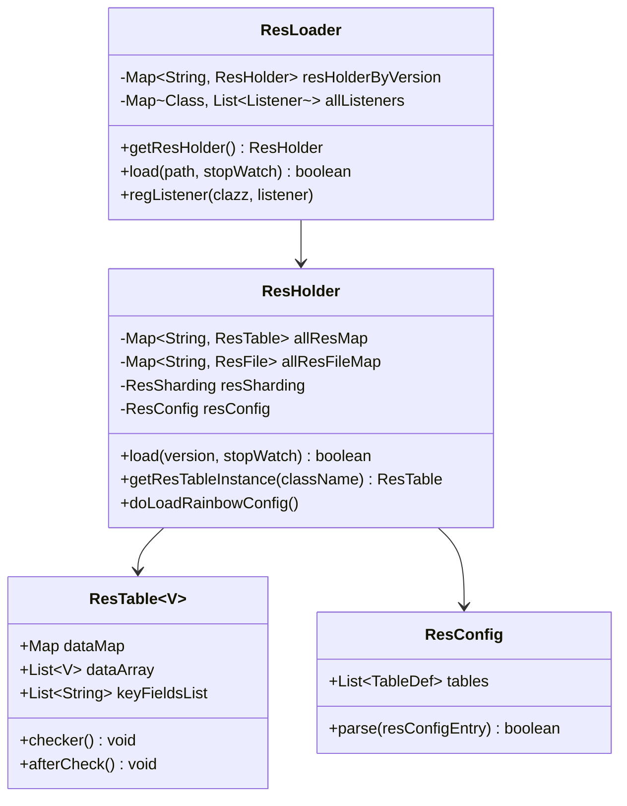
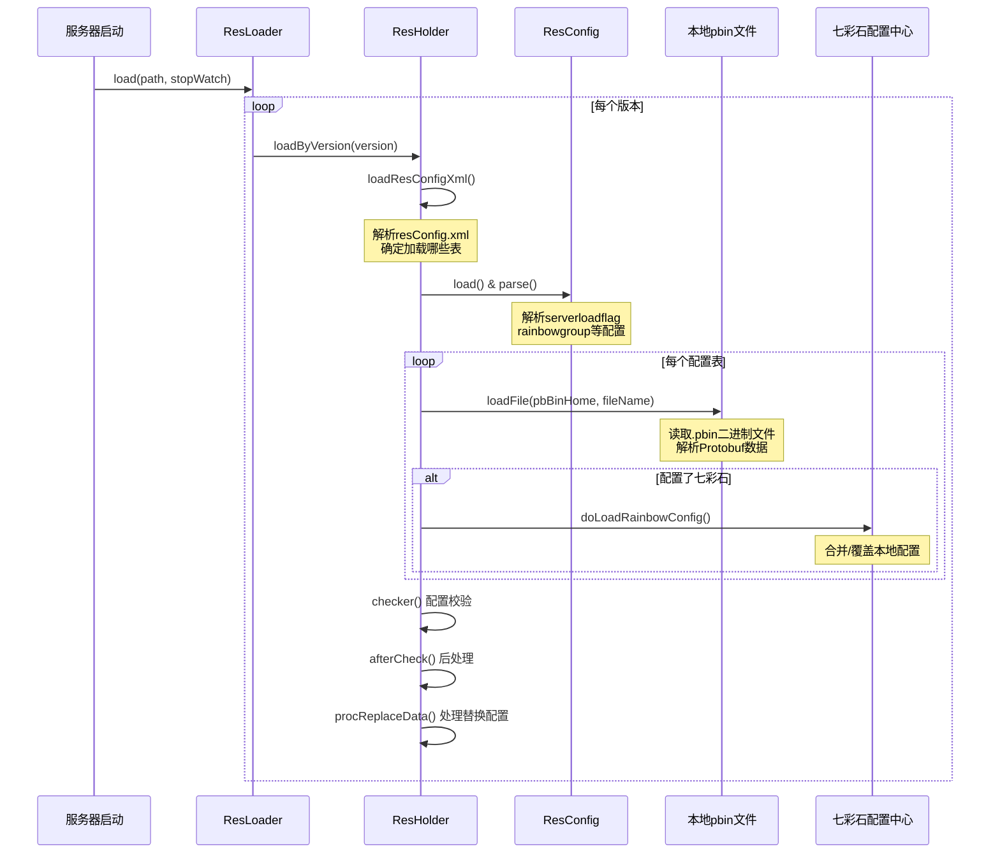
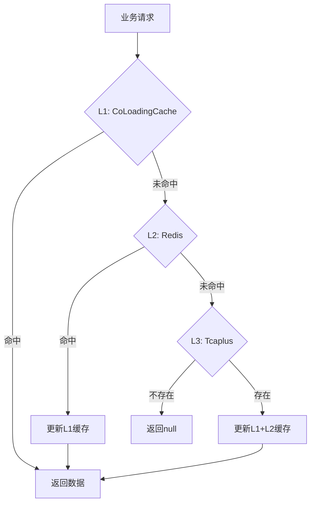

---

# 项目数据资源管理架构分析报告

## 一、总体架构概览

本项目采用**多层、多类型**的数据资源管理架构，涵盖静态配置表、动态配置、数据库表访问等多个层面。

```
┌───────────────────────────────────────────────────────────────────────────┐
│                            业务层（Business Layer）                        │
│  ResLoader.getResTable() / PropertyFileReader / HotResLoader / BaseTable  │
└───────────────────────────────────────────────────────────────────────────┘
                                    ↓
┌───────────────────────────────────────────────────────────────────────────┐
│                       配置管理层（Configuration Layer）                     │
│  ┌─────────────────┐ ┌──────────────────┐ ┌─────────────────────────────┐│
│  │  ResLoader      │ │ PropertyFileReader│ │ HotResLoader               ││
│  │  (静态配置)      │ │ (进程配置)        │ │ (热更新配置)               ││
│  └────────┬────────┘ └────────┬─────────┘ └───────────┬─────────────────┘│
│           │                   │                       │                  │
│  ┌────────▼────────┐ ┌────────▼─────────┐ ┌───────────▼─────────────────┐│
│  │ ResHolder       │ │ cached/realtime  │ │ HotResHolder                ││
│  │                 │ │ Properties       │ │                             ││
│  └─────────────────┘ └──────────────────┘ └─────────────────────────────┘│
└───────────────────────────────────────────────────────────────────────────┘
                                    ↓
┌───────────────────────────────────────────────────────────────────────────┐
│                           缓存层（Cache Layer）                            │
│  ┌───────────────────┐  ┌──────────────────┐  ┌────────────────────────┐ │
│  │  CoLoadingCache   │  │  CacheNode/Redis │  │  rainbowRealtime       │ │
│  │  (本地协程缓存)    │  │  (分布式缓存)     │  │  Properties            │ │
│  └───────────────────┘  └──────────────────┘  └────────────────────────┘ │
└───────────────────────────────────────────────────────────────────────────┘
                                    ↓
┌───────────────────────────────────────────────────────────────────────────┐
│                         存储层（Storage Layer）                            │
│  ┌────────────────┐  ┌──────────────────┐  ┌────────────────────────────┐│
│  │ .pbin文件       │  │  七彩石配置中心    │  │  Tcaplus数据库            ││
│  │ (Protobuf二进制) │  │  (Rainbow)        │  │                          ││
│  └────────────────┘  └──────────────────┘  └────────────────────────────┘│
└───────────────────────────────────────────────────────────────────────────┘
```

---

## 二、各类型数据资源详细分析

### 2.1 静态配置表（ResLoader + ResHolder）

#### 核心类关系



#### 加载流程与顺序



#### 对应关系（resConfig.xml配置）

| 配置项 | 说明 | 示例 |
|--------|------|------|
| `pbinname` | .pbin文件名 | `LobbyConfigData` |
| `classname` | Java类名 | `LobbyConfigData` |
| `serverloadflag` | 加载的服务器类型 | `ST_GameServer,ST_LobbyServer` |
| `rainbowenvdefault` | 七彩石环境选择 | `0`=当前环境，`1`=default |
| `rainbowgroup` | 七彩石配置组名 | `LobbyConfigData` |
| `splitsubtableflag` | 是否分表 | `1`=分表 |
| `subtablename` | 子表名称列表 | `main,ugc,testUgc` |

---

### 2.2 进程配置（PropertyFileReader）

#### 两种配置模式

```java
// 1. 缓存配置（启动时加载，不支持热更新）
PropertyFileReader.getItem(key, defaultValue)
PropertyFileReader.getIntItem(key, defaultValue)
PropertyFileReader.getBooleanItem(key, defaultValue)

// 2. 实时配置（支持热更新）
PropertyFileReader.getRealTimeItem(key, defaultValue)
PropertyFileReader.getRealTimeIntItem(key, defaultValue)
PropertyFileReader.getRealTimeBooleanItem(key, defaultValue)
```

#### 配置读取优先级

```
getRealTimeXxxItem():
  七彩石配置(rainbowRealtimePropertyReader) 
    → 本地realtime配置(realTimePropertyReader) 
    → 默认值

getXxxItem():
  本地cached配置(cachedPropertyReader) 
    → 默认值
```

---

### 2.3 热更新配置（HotResLoader + HotResTable）

#### 核心设计

```java
public abstract class HotResTable<Key, Proto, Config> {
    private Map<Key, Config> hotDataMap;  // 配置数据存储
    private AtomicLong version;           // 版本控制
    private AtomicLong nextRefresh;       // 下次刷新时间
    
    // 抽象方法需要子类实现
    public abstract String getHotResName();
    protected abstract void setAllowServerType();
    protected abstract Config getHotResConfig(Proto proto, JSONObject jsonObject);
    protected abstract void onHotResLoad();
    protected abstract void onHotResReplace(List<Config> list);
    protected abstract void onHotResDelete(List<Config> list);
}
```

#### 特点

- **增量更新**：通过版本号判断是否需要更新
- **定时刷新**：默认30秒刷新一次
- **服务器类型过滤**：不同服务器加载不同配置
- **Redis存储**：配置数据存储在Redis中

---

### 2.4 数据库表访问（BaseTable + Tcaplus）

#### 三级缓存架构



#### BaseTable核心方法

```java
public abstract class BaseTable<K, T extends BaseDBData<K>> {
    protected CacheUtil redisCache;                    // Redis缓存
    private CoLoadingCache<K, T> ugcLoadingCache;     // 本地协程缓存
    
    // 数据读取（三级缓存）
    public T getData(K key) {
        if (ugcLoadingCache != null) {
            return ugcLoadingCache.get(key);  // L1
        }
        return load(key);  // L2 → L3
    }
    
    // 数据加载链路
    public T load(K key) {
        // 1. 尝试Redis
        ret = redisGet(table.getRecord().getBuilder(), key);
        if (ret == 0) return table;
        
        // 2. 查Tcaplus
        ret = tcaplusGet(table);
        if (ret != 0) return null;
        
        // 3. 回写Redis
        redisSet(table);
        return table;
    }
}
```

#### Tcaplus操作封装

```java
// 基本CRUD操作
TcaplusUtil.newGetReq(builder).send()           // 查询
TcaplusUtil.newInsertReq(builder).send()        // 插入
TcaplusUtil.newUpdateReq(builder).send()        // 更新
TcaplusUtil.newReplaceReq(builder).send()       // 替换
TcaplusUtil.newDeleteReq(builder).send()        // 删除
TcaplusUtil.newBatchGetReq(builder).send()      // 批量查询
TcaplusUtil.newGetByPartKeyReq(builder).send()  // 部分键查询
```

---

### 2.5 缓存机制（CacheNode + CoLoadingCache）

#### CacheNode（Redis缓存节点）

```java
public class CacheNode {
    private SingleFlight b;        // 防止缓存击穿
    private ExpiryRand expiryRand; // 随机过期时间（防雪崩）
    private RedisIns ins;          // Redis连接
    
    // 带SingleFlight的读取
    public <V> CacheResult<V> getCache(String key, CodecType type, boolean isSingleFlight) {
        if (isSingleFlight) {
            result.val = b.doCall(key, () -> cmd.get(key));
        } else {
            result.val = cmd.get(key);
        }
    }
}
```

#### CoLoadingCache（协程化本地缓存）

```java
public class CoLoadingCache<K, V> {
    protected final ValueLoader<K, V> loader1;       // 单条加载器
    protected final ValueBatchLoader<K, V> loader2;  // 批量加载器
    protected LruTtlCache<K, V> cache;               // LRU+TTL缓存
    protected final Set<K> loading;                  // 正在加载中的key
    
    // Builder模式构建
    new CoLoadingCache.Builder<K, V>()
        .setLoader(this::loadSingle)
        .setBatchLoader(this::batchLoad)
        .setLockKeyBuilder(lockKeyBuilder)
        .setCapacity(10000)
        .expireAfterWrite(300000)
        .setRemoveNotifier(notifier)
        .enableLoadFailReturn()
        .build();
}
```

---

## 三、加载顺序总结

### 3.1 服务器启动加载顺序

```
1. Framework.init()
   ├── loadConfig() - 加载配置文件
   ├── PropertyFileReader.init() - 初始化进程配置
   └── rainbowReload() - 加载七彩石实时配置

2. ServerEngine.baseInit()
   ├── ResLoader.load() - 加载静态配置表
   │   ├── 解析resConfig.xml
   │   ├── 加载本地.pbin文件
   │   ├── 加载七彩石Table配置
   │   ├── checker() 校验
   │   └── afterCheck() 后处理
   │
   ├── HotResLoader.init() - 初始化热更新配置
   │   ├── loadResConfigXml() - 解析配置
   │   ├── registerAllSubTable() - 注册表
   │   └── registerTimer() - 注册定时刷新
   │
   └── init() - 子类初始化（可能包含BaseTable初始化）
```

### 3.2 数据资源对应关系图

```
┌─────────────────┬─────────────────┬──────────────────┬─────────────────┐
│    资源类型      │    存储位置      │     管理类        │    使用方式      │
├─────────────────┼─────────────────┼──────────────────┼─────────────────┤
│ 静态配置表       │ .pbin文件       │ ResLoader        │ 启动加载        │
│                 │ +七彩石Table    │ ResHolder        │ 支持热更新      │
├─────────────────┼─────────────────┼──────────────────┼─────────────────┤
│ 进程配置(缓存)   │ .properties     │ PropertyFile-    │ 启动加载        │
│                 │                 │ Reader           │ 不支持热更新    │
├─────────────────┼─────────────────┼──────────────────┼─────────────────┤
│ 进程配置(实时)   │ 七彩石KV        │ PropertyFile-    │ 实时读取        │
│                 │ +.properties    │ Reader           │ 支持热更新      │
├─────────────────┼─────────────────┼──────────────────┼─────────────────┤
│ 热更新配置       │ Redis           │ HotResLoader     │ 定时刷新        │
│                 │                 │ HotResTable      │ 支持增量更新    │
├─────────────────┼─────────────────┼──────────────────┼─────────────────┤
│ 数据库表数据     │ Tcaplus         │ BaseTable        │ 三级缓存        │
│                 │ +Redis          │ TcaplusUtil      │ L1→L2→L3       │
│                 │ +本地缓存       │                  │                 │
└─────────────────┴─────────────────┴──────────────────┴─────────────────┘
```

---

## 四、改进空间分析

### 4.1 架构层面

| 问题 | 现状 | 改进建议 |
|------|------|----------|
| **配置管理分散** | 多套配置体系（ResLoader/PropertyFileReader/HotResLoader）各自独立 | 考虑统一配置管理入口，提供一致的API |
| **缓存策略不统一** | 不同模块采用不同缓存策略，难以统一监控 | 制定统一缓存规范，标准化过期时间、容量设置 |
| **热更新机制复杂** | 七彩石Table + 七彩石KV + HotRes三套热更新机制 | 梳理使用场景，减少机制重叠 |

### 4.2 代码层面

```java
// 问题1: ResHolder.load()方法过长（~400行），职责过重
// 改进: 拆分为多个小方法
public boolean load(String version, TxStopWatch nkStopWatch) {
    // 拆分为：
    // - loadConfiguration()
    // - loadPbinFiles()
    // - loadRainbowConfig()
    // - validateAndPostProcess()
}

// 问题2: BaseTable中Redis和Tcaplus逻辑耦合
// 改进: 使用策略模式分离存储层
public interface StorageStrategy<K, T> {
    T load(K key);
    void save(T data);
}
public class RedisStrategy implements StorageStrategy { }
public class TcaplusStrategy implements StorageStrategy { }

// 问题3: 配置加载顺序隐式依赖
// 改进: 显式定义依赖关系
@DependsOn("ResLoader")
public class HotResLoader { }
```

### 4.3 性能层面

| 方面 | 现状 | 改进建议 |
|------|------|----------|
| **启动加载** | 串行加载配置表 | 支持并行加载无依赖的配置表 |
| **缓存预热** | 部分场景缺乏预热 | 增加启动时缓存预热机制 |
| **批量加载** | BatchGet有1000上限 | 优化分批逻辑，减少RPC次数 |
| **内存占用** | dataMap和dataArray双重存储 | 评估是否可以只保留一种 |

### 4.4 可观测性

```java
// 改进: 增加配置加载监控
public class ResLoaderMetrics {
    // 配置加载时间
    public void recordLoadTime(String tableName, long duration);
    // 配置数量
    public void recordConfigCount(String tableName, int count);
    // 七彩石配置版本
    public void recordRainbowVersion(String groupName, String version);
}

// 改进: 增加缓存命中率监控
public class CacheMetrics {
    // L1命中率
    public void recordL1Hit(String cacheName, boolean hit);
    // L2命中率
    public void recordL2Hit(String cacheName, boolean hit);
    // 缓存大小
    public void recordCacheSize(String cacheName, int size);
}
```

### 4.5 容错处理

```java
// 改进1: 配置加载失败时的降级策略
public class ResLoaderFallback {
    // 从本地文件缓存加载
    public ResTable loadFromFileCache(String tableName);
    // 使用默认配置
    public ResTable loadDefaultConfig(String tableName);
}

// 改进2: 缓存穿透防护增强
public class CacheProtection {
    // 布隆过滤器
    private BloomFilter<String> bloomFilter;
    // 空值缓存
    private Cache<String, Boolean> nullCache;
}
```

---

## 五、总结

本项目的数据资源管理架构**功能完善、层次清晰**，但存在一定的**复杂度**和**优化空间**：

**优点**：
1. 多层缓存设计，性能优秀
2. 支持多种热更新机制
3. 七彩石配置中心集成完善
4. 协程化设计，IO效率高

**待改进**：
1. 配置体系过于分散
2. 部分代码职责过重
3. 缺乏统一的监控体系
4. 启动加载可优化为并行