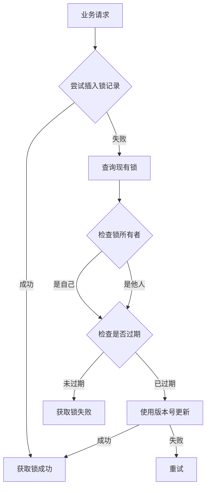
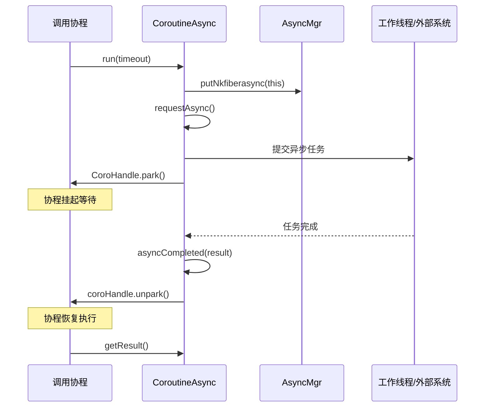
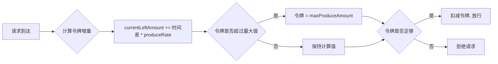
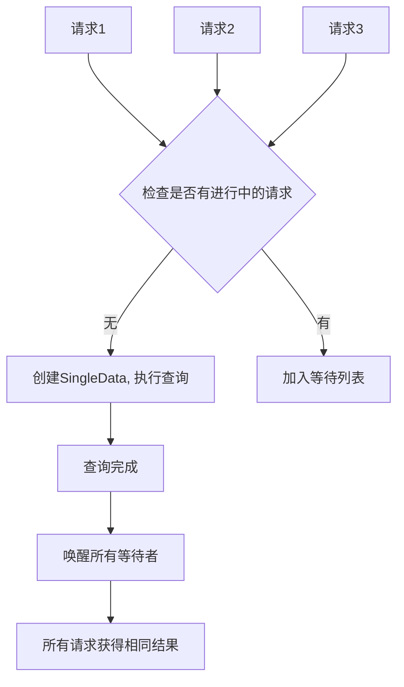
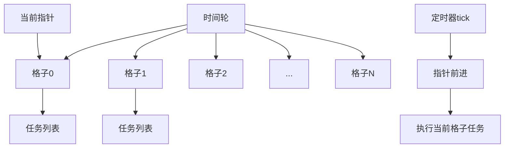

---

# 项目工具实现分析报告

根据对项目代码的分析，我发现这是一个大型的游戏服务器项目，实现了丰富的基础工具类。由于内容较多，我将分步骤进行分析：

---

## 一、分析规划（分步骤）

由于涉及的工具较多，建议分以下几个部分进行详细分析：

| 步骤 | 工具类别 | 主要内容 |
|------|---------|---------|
| **步骤1** | 分布式锁 | DistributedLockMgr、CacheLockAgent、RedisLock |
| **步骤2** | 协程与异步 | CoroutineAsync、CurrentExecutorUtil、协程调度器 |
| **步骤3** | 限流器 | RateLimiter、DynamicRateLimiterMgr、MsgRateLimitMgr |
| **步骤4** | 缓存与防击穿 | SingleFlight、Cache体系 |
| **步骤5** | 定时器与时间轮 | TimingWheel、TimerTask |
| **步骤6** | 消息队列 | Kafka、Pulsar集成 |

---

## 步骤1：分布式锁工具分析

### 1.1 DistributedLockMgr（基于Tcaplus的分布式锁）

**文件位置**：[DistributedLockMgr.java](/c:/UGit/letsgo_server/WeA/common/src/main/java/com/tencent/distributedLock/DistributedLockMgr.java)

#### 设计原理


#### 核心特性
- **存储层**：基于Tcaplus数据库（腾讯自研NoSQL）
- **版本号机制**：使用乐观锁防止ABA问题，每次更新必须匹配版本号
- **自动过期**：锁记录包含`expireTime`字段，过期后可被抢占
- **重试机制**：最多重试3次（`maxRetryCnt = 3`）

#### 使用方法
```java
// 加锁
DistributedLockInfo lockInfo = new DistributedLockInfo(
    DistributedLockType.RESOURCE_LOCK,
    Framework.getInstance().getServerId(),
    resourceId, 0);
lockInfo.setDuration(10000);  // 10秒过期

if (DistributedLockMgr.getInstance().lock(lockInfo)) {
    try {
        // 业务逻辑
    } finally {
        DistributedLockMgr.getInstance().dropLock(lockInfo);
    }
}
```

#### 改进空间
| 问题 | 现状 | 建议改进 |
|------|------|---------|
| **无可重入支持** | 同一协程多次获取会失败 | 添加重入计数器 |
| **无公平性保证** | 先来后到不保证 | 可选公平模式（队列） |
| **锁过期时间固定** | 默认15秒 | 支持动态调整 |
| **无死锁检测** | 依赖超时 | 添加watchdog机制 |

---

### 1.2 RedisLock（轻量级分布式锁）

**文件位置**：[RedisLock.java](/c:/UGit/letsgo_server/WeA/common/src/main/java/com/tencent/wea/redis/lock/RedisLock.java)

#### 设计原理
```java
// 核心实现：SETNX + EXPIRE
Boolean setnxRet = coRedisCmd.setnx(lockName, lockValue);
if (setnxRet) {
    doExpire(lockName, expireTime);
    return lockValue;
}
```

#### 核心特性
- **基于Redis SETNX**：原子性获取锁
- **协程友好**：等待期间使用`CoroHandle.sleep()`让出CPU
- **值为协程ID**：`lockValue = CoroHandle.current().coroHandleId()`

#### 改进空间
| 问题 | 现状 | 建议改进 |
|------|------|---------|
| **非原子操作** | SETNX和EXPIRE分离 | 使用`SET key value EX seconds NX` |
| **无自动续期** | 锁可能提前过期 | 添加watchdog自动续期 |
| **释放不安全** | GET+DEL非原子 | 使用Lua脚本保证原子性 |

---

## 步骤2：协程与异步工具分析

### 2.1 CoroutineAsync（协程异步基类）

**文件位置**：[CoroutineAsync.java](/c:/UGit/letsgo_server/WeA/timiutil/src/main/java/com/tencent/timiutil/coroutine/CoroutineAsync.java)

#### 设计原理


#### 核心特性
- **Future模式**：封装异步操作为同步调用体验
- **超时控制**：支持带超时的阻塞等待
- **异常传播**：异步异常能正确传播到调用方

#### 使用方法
```java
public class MyAsync extends CoroutineAsync<Result, RuntimeException> {
    @Override
    protected void requestAsync() {
        // 发起异步操作
        externalService.doAsync(result -> {
            if (success) {
                completed(result);  // 异步成功
            } else {
                fail(new RuntimeException("失败"));  // 异步失败
            }
        });
    }
}

// 使用
Result result = new MyAsync().run(5000);  // 最多等待5秒
```

#### 改进空间
| 问题 | 现状 | 建议改进 |
|------|------|---------|
| **硬编码超时** | 最大等待20秒 | 可配置化 |
| **取消支持有限** | 无法取消正在执行的异步操作 | 添加cancel机制 |
| **调试困难** | 异步链路追踪不完善 | 集成tracing |

---

## 步骤3：限流器工具分析

### 3.1 RateLimiter（令牌桶限流器）

**文件位置**：[RateLimiter.java](/c:/UGit/letsgo_server/WeA/common/src/main/java/com/tencent/util/RateLimiter.java)

#### 设计原理


#### 核心算法
```java
// 令牌桶核心逻辑
double incAmount = (now - lastConsumeTimeMs) * produceRate / 1000;
currentLeftAmount += incAmount;
if (currentLeftAmount > maxProduceAmount) {
    currentLeftAmount = maxProduceAmount;  // 桶有上限
}
if (currentLeftAmount >= consumeAmount) {
    currentLeftAmount -= consumeAmount;
    return true;  // 放行
}
return false;  // 拒绝
```

#### 核心特性
- **线程安全可选**：`threadSafe`参数控制
- **支持小数速率**：如`0.2`表示每秒0.2个令牌
- **突发流量支持**：`maxProduceAmount`允许突发

#### 使用方法
```java
RateLimiter limiter = new RateLimiter("player_action", true);
// 每秒最多10次，桶容量30
if (limiter.consume(30, 10, 1)) {
    // 执行操作
} else {
    // 限流
}
```

#### 改进空间
| 问题 | 现状 | 建议改进 |
|------|------|---------|
| **无预热机制** | 冷启动即满桶 | 支持warmup预热 |
| **无分布式支持** | 仅本地限流 | 集成Redis滑动窗口 |
| **无监控指标** | 无法观测限流情况 | 添加metrics输出 |

---

## 步骤4：SingleFlight防缓存击穿

### 4.1 SingleFlight

**文件位置**：[SingleFlight.java](/c:/UGit/letsgo_server/WeA/common/src/main/java/com/tencent/cache/SingleFlight.java)

#### 设计原理


#### 核心实现
```java
// 第一个请求执行，后续请求等待
SingleData<V> curWg = waitMap.putIfAbsent(k, wg);
if (curWg == null) {
    // 第一个请求，执行实际操作
    V v = supplier.get();
    wg.setVal(v);
    wg.executeSuccess();  // 通知所有等待者
    return v;
} else {
    // 后续请求，等待结果
    return getResult(curWg);
}
```

#### 核心特性
- **请求合并**：相同key的并发请求只执行一次
- **基于协程等待**：使用`SingleFlightAsync`实现协程级等待
- **线程安全**：`ConcurrentHashMap` + 原子操作

#### 使用方法
```java
SingleFlight singleFlight = new SingleFlight(5000, TimeUnit.MILLISECONDS);

public PlayerData getPlayerData(long uid) throws Throwable {
    return singleFlight.doCall(uid, () -> {
        // 只有第一个请求会执行DB查询
        return loadFromDB(uid);
    });
}
```

#### 改进空间
| 问题 | 现状 | 建议改进 |
|------|------|---------|
| **key生成方式** | `key + threadId` | 建议仅使用key，支持跨线程合并 |
| **无失败重试** | 失败后直接返回 | 支持指数退避重试 |
| **无缓存集成** | 仅合并请求 | 集成本地缓存 |

---

## 步骤5：定时器与时间轮

### 5.1 TimingWheel（时间轮）

**文件位置**：[TimingWheel.java](/c:/UGit/letsgo_server/WeA/common/src/main/java/com/tencent/nk/util/timingWheel/TimingWheel.java)

#### 设计原理


#### 核心特性
- **O(1)时间复杂度**：添加和执行定时任务
- **单层时间轮**：适合短期定时任务
- **协程集成**：使用`CurrentExecutorUtil.addRepeatTimer`驱动

#### 使用方法
```java
TimingWheel wheel = new TimingWheel();
wheel.init(100, 10000);  // 100ms一格，总跨度10秒

// 添加延时任务
wheel.addTimer(5000, task -> {
    // 5秒后执行
    task.handle();
});
```

#### 改进空间
| 问题 | 现状 | 建议改进 |
|------|------|---------|
| **单层限制** | 不支持长时间任务 | 添加多层时间轮 |
| **无任务优先级** | 同格子任务顺序执行 | 支持优先级队列 |

---

## 步骤6：消息队列集成

### 6.1 Kafka集成

**文件位置**：[Kafka.java](/c:/UGit/letsgo_server/WeA/common/src/main/java/com/tencent/mqueue/kafka/Kafka.java)

#### 设计原理
- **生产者**：`KProducer` 封装KafkaProducer
- **消费者**：`KConsumer` 支持多组消费
- **协程集成**：消费后提交到协程处理

#### 核心特性
- **共享模式**：负载均衡，并发消费
- **独立模式**：顺序消费
- **消费者组管理**：自动创建和注册

### 6.2 Pulsar集成

**文件位置**：[Pulsar.java](/c:/UGit/letsgo_server/WeA/common/src/main/java/com/tencent/mqueue/pulsar/Pulsar.java)

#### 核心特性
- **腾讯云TDMQ集成**
- **去重支持**：`productUniqueForBytes`方法
- **限流集成**：`PulsarThrottle`

---

## 整体改进建议

### 1. 统一监控指标
```java
// 建议添加统一的指标接口
public interface MetricsCollector {
    void recordLockWait(String lockType, long waitMs);
    void recordRateLimitReject(String limiterName);
    void recordAsyncTimeout(String asyncName, long timeoutMs);
}
```

### 2. 配置中心化
当前很多工具的超时、重试次数等参数硬编码，建议：
```java
// 建议改为配置驱动
public class ToolConfig {
    @ConfigItem("distributed_lock.max_retry", defaultValue = "3")
    private int maxRetry;
    
    @ConfigItem("rate_limiter.default_rate", defaultValue = "100")
    private double defaultRate;
}
```

### 3. 统一异常处理
```java
// 建议统一工具层异常
public class ToolException extends RuntimeException {
    private final ToolErrorCode errorCode;
    private final String toolName;
    // ...
}
```

### 4. 完善单元测试
建议为每个工具类添加完整的单元测试，特别是：
- 并发安全性测试
- 边界条件测试
- 性能基准测试

---

## 总结

| 工具类别 | 实现成熟度 | 主要优点 | 主要改进点 |
|---------|-----------|---------|-----------|
| 分布式锁 | ⭐⭐⭐⭐ | 多种实现、版本号机制 | 自动续期、可重入 |
| 协程异步 | ⭐⭐⭐⭐⭐ | 设计完善、协程集成好 | 调试追踪 |
| 限流器 | ⭐⭐⭐ | 令牌桶算法、线程安全 | 预热、分布式 |
| SingleFlight | ⭐⭐⭐⭐ | 协程级等待、请求合并 | key生成优化 |
| 时间轮 | ⭐⭐⭐ | O(1)复杂度 | 多层支持 |
| 消息队列 | ⭐⭐⭐⭐ | 多MQ支持、协程集成 | 统一抽象层 |

如果您需要我对某个具体工具进行更深入的分析，或者查看更多实现细节，请告诉我！

---

## 七、面试专栏

### 7.1 每个工具解决的实际线上问题案例

> 面试官最看重的不是"你用了什么工具"，而是"这个工具解决了什么实际问题"。以下按STAR格式整理每个核心工具的线上价值。

#### 案例1：DistributedLockMgr — 解决跨服活动创建冲突

| STAR维度 | 内容 |
|---------|------|
| **Situation** | 全服运营活动（如赛季排行结算）需要由一个服务实例发起，多个activitysvr实例并发启动时可能重复创建 |
| **Task** | 保证全服唯一操作，避免重复发奖/重复结算 |
| **Action** | 使用DistributedLockMgr基于Tcaplus持久化存储加锁，锁Key为`活动ID+赛季号`，获取锁的实例执行结算，其余实例等待或跳过。版本号乐观锁防止ABA问题，最多重试3次 |
| **Result** | 彻底消除并发创建问题，即使服务重启，持久化锁记录也能正确判断锁状态，避免重复结算导致的资损 |

#### 案例2：RedisLock — 解决玩家并发操作道具异常

| STAR维度 | 内容 |
|---------|------|
| **Situation** | 玩家快速连续点击"使用道具"按钮，两个请求几乎同时到达同一GameSvr |
| **Task** | 防止并发扣减道具数量，避免一个道具被使用两次 |
| **Action** | 使用RedisLock对`uid+itemId`加短期锁（SETNX），锁值为协程ID，5秒自动过期。第二个请求获取锁失败时返回"操作过于频繁" |
| **Result** | 道具扣减操作串行化，消除并发重复扣减问题，响应时间增加<1ms |

#### 案例3：SingleFlight — 解决活动首日开服缓存击穿

| STAR维度 | 内容 |
|---------|------|
| **Situation** | 大型活动开启瞬间，数千玩家同时请求活动配置数据，此时Redis缓存为空（冷启动） |
| **Task** | 避免数千个并发请求同时穿透到Tcaplus数据库，导致DB过载 |
| **Action** | CacheNode层集成SingleFlight，对同一缓存Key的并发请求进行合并——第一个请求执行DB查询，后续请求协程挂起等待同一结果 |
| **Result** | 数千次DB查询合并为1次，DB请求量下降99%以上，活动开服零故障 |

#### 案例4：RateLimiter — 解决恶意刷接口导致服务过载

| STAR维度 | 内容 |
|---------|------|
| **Situation** | 外挂工具对特定CS协议高频发包（每秒数百次），单个Pod的协程队列快速积压 |
| **Task** | 在不影响正常玩家的前提下，识别并限制异常请求 |
| **Action** | MsgRateLimitMgr实现多层限流：Pod级限流防止全局过载（令牌桶，桶容量=配置值），Entity级限流限制单玩家操作频率（按uid×消息类型维度）。限流配置通过七彩石热更新 |
| **Result** | 异常流量在限流层被拦截，Pod级限流保护整体服务可用性，Entity级限流精确封堵异常玩家而不误伤正常用户 |

#### 案例5：CombatHystrix — 解决大版本更新后CPU过载

| STAR维度 | 内容 |
|---------|------|
| **Situation** | 版本更新后玩家集中登录，GameSvr的CPU使用率突破90%，大量请求超时 |
| **Task** | 在CPU过载时自动限制新请求，保护已有玩家体验 |
| **Action** | CombatHystrix基于三态模型（Open→Recovering→Closed），实时采集CPU负载。CPU超过目标值（70%）时进入Recovering模式，按步长逐步降低服务能力（拒绝部分新连接）。CPU超过底线（90%）时直接Closed。CPU恢复后渐进式恢复 |
| **Result** | 服务在高负载下自动降级，已连接玩家体验不受影响。CPU自动稳定在70%目标附近，避免雪崩 |

#### 案例6：TimingWheel — 解决定时任务精度与性能的平衡

| STAR维度 | 内容 |
|---------|------|
| **Situation** | 对局内需要大量短期定时任务（技能冷却、Buff倒计时），传统的ScheduledExecutorService在数万个定时任务场景下性能退化 |
| **Task** | 实现O(1)时间复杂度的定时任务添加和执行 |
| **Action** | 采用单层时间轮算法，将时间切分为固定格子（如100ms一格），新增任务直接映射到对应格子（O(1)），每次tick只需遍历当前格子的任务列表 |
| **Result** | 支持万级定时任务，添加和取消操作O(1)，相比JDK ScheduledExecutorService（O(log n)），在高并发场景下性能提升数量级 |

### 7.2 工具选型决策指南 — 面试话术

**面试官问："这么多工具，你们怎么决策用哪个？"**

> "我们的选型遵循三个维度：**场景需求、性能要求、运维成本**。
>
> 比如分布式锁的三种实现：
> - 需要自动续期和锁抢占 → **CacheLockAgent**（功能最完善，代价是依赖Redis且实现复杂）
> - 只需要短暂互斥保护 → **RedisLock**（最轻量，SETNX+EXPIRE两条命令）
> - 需要持久化锁状态（跨重启） → **DistributedLockMgr**（基于Tcaplus，锁记录不丢失）
>
> 限流器也类似：进程内限流用令牌桶RateLimiter（本地计算，零网络开销），全局精确限流需要借助Redis的滑动窗口（分布式一致性，但有网络开销）。
>
> 核心原则是**用最简单的方案解决当前问题**，避免过度设计。"

### 7.3 工具体系量化数据

| 工具 | 核心指标 | 数据 |
|------|---------|------|
| **DistributedLockMgr** | 最大重试次数 | 3次 |
| **DistributedLockMgr** | 默认锁过期时间 | 15秒 |
| **RedisLock** | 锁等待粒度 | 50ms（协程sleep间隔） |
| **RateLimiter** | 算法类型 | 令牌桶（Token Bucket） |
| **MsgRateLimitMgr** | 限流维度 | 5种（Pod级/Entity级/注解/动态/包大小） |
| **SingleFlight** | 默认超时 | 5000ms |
| **TimingWheel** | 添加/执行复杂度 | O(1) |
| **CoroutineAsync** | 最大等待时间 | 20秒（硬编码） |
| **Kafka/Pulsar** | 消费模式 | 共享模式 + 独立模式 |
| **CombatHystrix** | 目标CPU | 70%，底线CPU 90% |

### 7.4 面试高频QA

**Q1: 你们的SingleFlight和Guava的LoadingCache有什么区别？**
> "功能定位不同：Guava LoadingCache是'缓存+自动加载'，提供LRU淘汰和TTL过期；SingleFlight是'请求合并'，不做缓存存储。在我们项目中两者搭配使用——CoLoadingCache（类似Guava LoadingCache）负责本地缓存管理，SingleFlight在CacheNode的Redis层防止击穿。组合使用效果是：L1用CoLoadingCache防止重复加载，L2用SingleFlight防止并发穿透。"

**Q2: 令牌桶和漏桶有什么区别？你们为什么选令牌桶？**
> "漏桶以恒定速率处理请求，适合严格匀速的场景（如流量整形）。令牌桶允许突发流量——只要桶里有令牌就能立即消费。游戏场景中，玩家操作有明显的突发特征（比如对局结束瞬间大量结算请求），令牌桶的突发容忍能力更适合。我们的RateLimiter通过`maxProduceAmount`参数控制突发上限，既允许短时突发又限制总体速率。"

**Q3: 协程和线程池在你们项目中怎么配合的？**
> "我们的协程框架运行在有限的线程上（默认3个协程线程），每个线程上可以调度数千个协程。IO操作（Redis/Tcaplus/RPC）通过CoroutineAsync封装：发起IO请求后协程挂起（park），IO完成后协程恢复（unpark）。这样一个线程可以高效复用，同时开发者写的代码是同步风格，不需要callback嵌套。线程池主要用于CPU密集的计算任务（如Protobuf序列化）和第三方SDK回调。"

**Q4: 如果限流阈值设错了怎么办？线上怎么调整？**
> "我们的限流配置支持多种热更新方式：
> - **七彩石配置中心**：通过PropertyFile读取实时配置，修改立即生效，不需要重启
> - **配置表热加载**：MsgRateLimitConfigData支持HotRes热更新
> - **DynamicRateLimiterMgr**：代码中可动态创建限流器并调整参数
> 生产上曾遇到过限流阈值过低误伤正常玩家的情况，通过七彩石秒级调高阈值恢复，整个过程不需要重启服务。"