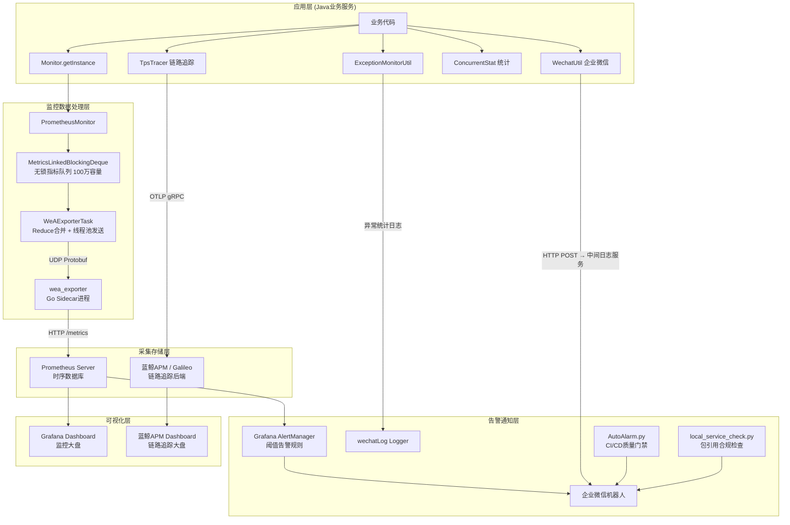
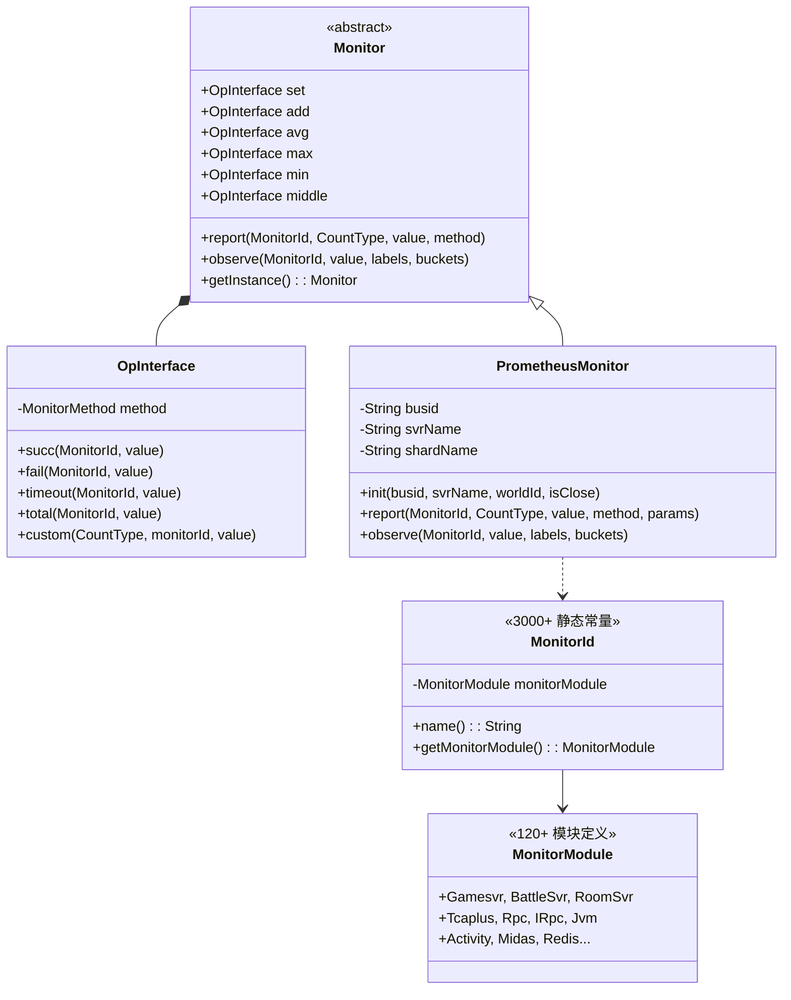
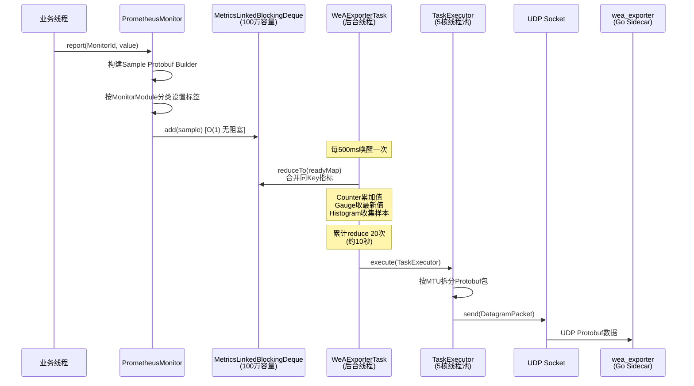
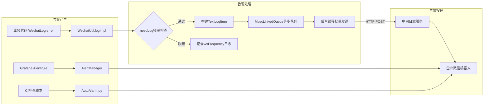
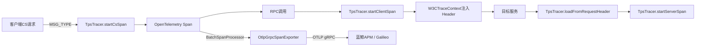
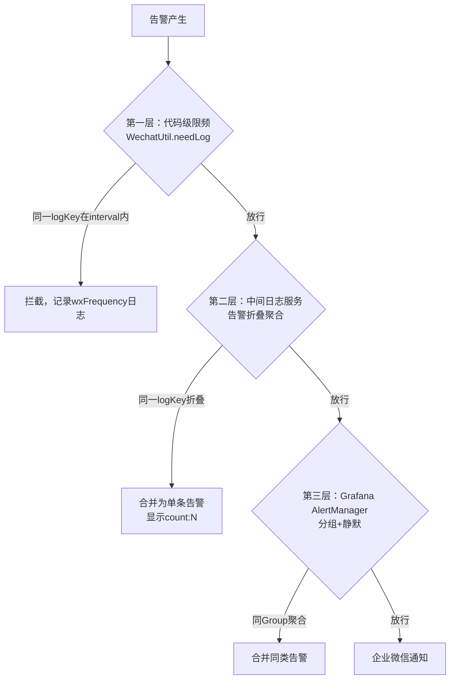

---

# 项目监控告警机制分析报告

## 一、总体架构概览

### 1.1 监控告警全景架构



### 1.2 设计哲学与核心特点

项目采用了**三层可观测性**架构（Metrics + Logs + Traces），形成了一套适合**高并发游戏服务**的监控告警体系：

| 维度 | 技术选型 | 核心设计 | 覆盖面 |
|------|---------|---------|-------|
| **Metrics（指标）** | Prometheus + 自研WeAExporter | UDP上报 + Protobuf序列化 + 内存Reduce合并 | 3000+指标，120+监控模块 |
| **Logs（日志告警）** | 企业微信机器人 + 中间日志服务 | 基于`logKey`的频率控制 + 告警折叠聚合 | 覆盖全部异常路径 |
| **Traces（链路）** | OpenTelemetry + OTLP + 蓝鲸APM | W3C TraceContext传播 + 采样率可调 | RPC/HTTP/CS请求全链路 |

**核心设计亮点**：
1. **零拷贝UDP上报**：业务线程产出指标 → 无锁队列 → 后台线程Reduce合并 → UDP批量发送，**对业务线程零阻塞**
2. **Sidecar模式**：每个Pod内运行一个Go语言的`wea_exporter`进程，负责UDP接收 + Prometheus格式转换 + HTTP暴露
3. **异常自动归类**：通过`ConcurrentStat`对异常做分钟级Top-N统计，通过`@Ignored`和`@Author`注解分级告警
4. **告警收敛**：`WechatUtil.needLog()`基于`logKey+interval`做同源告警去重，防止告警风暴

---

## 二、核心组件深度分析

### 2.1 监控指标系统（Monitor + MonitorId + MonitorModule）

#### 2.1.1 架构设计



#### 2.1.2 指标定义规模

`MonitorId.java`是整个项目最大的单体文件之一（**335KB, 3381行**），定义了超过3000个监控指标，每个指标都绑定到一个`MonitorModule`：

```java
// 指标定义格式：ID名 = new MonitorId(所属模块); // 描述 @中文面板标题
public static final MonitorId attr_current_online = new MonitorId(Gamesvr);     // 实时在线人数 @实时在线人数
public static final MonitorId attr_login_total = new MonitorId(Gamesvr);        // 累计登录次数 @累计登录
public static final MonitorId attr_login_slow = new MonitorId(Gamesvr);         // 慢登录(>2s) @慢登录
public static final MonitorId attr_jvm_mem_used = new MonitorId(Jvm);           // 内存使用量 @内存使用量（单位M）
public static final MonitorId attr_jvm_gc_avg_duration_ms = new MonitorId(Jvm); // gc平均耗时 @gc平均耗时
public static final MonitorId attr_tcaplus_timeout_cnt = new MonitorId(Tcaplus); // 请求超时 @超时次数
public static final MonitorId attr_rpc_client_timeout = new MonitorId(Rpc);     // rpc超时计数 @超时次数
```

#### 2.1.3 MonitorModule全量分类（120+模块）

`MonitorModule`采用`WeANamedNoIntEnum`模式定义，支持子类扩展（mod可在自己的仓库中添加新模块）：

| 模块分类 | 包含的MonitorModule | 典型指标 |
|---------|-------------------|---------|
| **核心服务** | Gamesvr, BattleSvr, RoomSvr, MatchSvr, LobbyAlloc | 在线人数、战斗数、房间数 |
| **数据存储** | Tcaplus, Redis, CacheSvr, CacheLock | 延迟、超时、错误率、队列大小 |
| **RPC通信** | Rpc, IRpc, C2sReq, C2sReqForward | 请求总数、耗时、超时、返回码 |
| **JVM运行时** | Jvm, Thread, Coroutine | 内存、GC、线程数、协程数 |
| **通信框架** | Tconnd, Tbus, TbusppError, Tbuspp2Error | 连接数、通信错误、包量 |
| **业务功能** | Activity, Midas, Raffle, OutputControl, FarmSvr | 活动统计、支付、抽奖、产出控制 |
| **AI相关** | MetaAiRpc, AigcSvr | AI请求、响应延迟、队列大小 |
| **UGC玩法** | UgcSvr, UgcPlatSvr, UgcSceneSvr, UgcSceneAlloc | UGC场景创建、分配 |
| **中间件** | Pulsar, Ams, Pod, Gray, Shard | 消息队列、灰度发布、分片 |
| **自定义模块** | 通过ModDemoMonitorModule扩展 | mod仓库自定义指标 |

#### 2.1.4 指标上报方式对照

```java
// ===== 计数类指标（Counter）—— 使用 add =====
Monitor.getInstance().add.total(MonitorId.attr_login_total, 1);                     // 累加
Monitor.getInstance().add.succ(MonitorId.attr_tcaplus_send_cnt, 1, params);         // 成功+1
Monitor.getInstance().add.fail(MonitorId.attr_tcaplus_err_cnt, 1, params);          // 失败+1
Monitor.getInstance().add.timeout(MonitorId.attr_rpc_client_timeout, 1, params);    // 超时+1

// ===== 瞬时值指标（Gauge）—— 使用 set =====
Monitor.getInstance().set.total(MonitorId.attr_current_online, playerCount);        // 设置当前值
Monitor.getInstance().set.total(MonitorId.attr_jvm_mem_used, memoryMB);             // JVM内存

// ===== 分布统计指标（Histogram）—— 使用 observe =====
Monitor.getInstance().observe(MonitorId.attr_rpc_client_cost_time, costMs, labels); // 耗时分布

// ===== 极值统计 =====
Monitor.getInstance().max.succ(MonitorId.attr_tcaplus_max_delay, delay, params);    // 最大值
```

### 2.2 数据采集链路深度分析

#### 2.2.1 Java端：PrometheusMonitor → WeAExporter → UDP

整个上报链路经过精心优化，实现了**对业务线程零阻塞**：



**关键参数配置**（`WeAExporterCnf`）：

| 参数 | 默认值 | 说明 |
|------|:------:|------|
| `metricQueueMaxSize` | 1,000,000 | 指标队列最大容量（百万级缓冲） |
| `sendThreadPoolCoreSize` | 5 | 发送线程池核心线程数 |
| `reduceIntervalMills` | 500ms | Reduce周期（每500ms合并一次） |
| `samplingPeriodMills` | 30000ms | 采样周期（30秒完整上报一次） |
| `reduceTimesBeforeSend` | 20 | 发送前Reduce次数 = 30s/3/500ms |
| `maxBytesPerPkg` | 65507B | UDP最大包体（65535-20-8） |
| `histogramSampleCount` | 200 | 直方图最大采样数 |

#### 2.2.2 reduceTo合并算法（核心优化）

`MetricsLinkedBlockingDeque.reduceTo()`是指标上报的**性能核心**，在锁内批量出队并按类型合并：

```java
// MetricsLinkedBlockingDeque.java 核心逻辑
public void reduceTo(HashMap<SampleKey, Sample.Builder> sampleSet) {
    lock.lock();
    try {
        int currCount = count;
        for (int i = 0; i < currCount; i++) {
            Sample.Builder sample = (Sample.Builder) first.item;
            SampleKey sid = new SampleKey(sample);  // 按monitorId+countType+labels组合key
            if (sampleSet.containsKey(sid)) {
                if (sample.getType() == ST_COUNTER) {
                    // Counter类型：累加值
                    sampleSet.get(sid).setValue(sampleSet.get(sid).getValue() + sample.getValue());
                } else if (sample.getType() == ST_HISTOGRAM) {
                    // Histogram类型：收集采样值（限制200个）
                    builder.addValues(sample.getValue());
                } else {
                    // Gauge类型：取最新值
                    sampleSet.get(sid).setValue(sample.getValue());
                }
            } else {
                sampleSet.put(sid, sample);
            }
            unlinkFirst();  // 出队
        }
    } finally {
        lock.unlock();
    }
}
```

> **设计思想**：3000+指标 × 多标签维度 = 可能百万级数据点/30秒，如果不做Reduce合并，UDP带宽和Prometheus都扛不住。通过SampleKey去重合并，30秒内同一维度的Counter只传一个累加值，Gauge只传最终值，**上报数据量可压缩10-100倍**。

#### 2.2.3 Go端：wea_exporter Sidecar

`wea_exporter`是一个用Go编写的Sidecar进程，部署在每个Pod内，负责将Java通过UDP上报的Protobuf数据转化为Prometheus标准格式：

```go
// wea_exporter.go 核心结构
type WeAGameCollector struct {
    samples map[string]*WeaGameSample  // 内存中的指标快照
    mu      sync.Mutex
    ch      chan *WeaGameSample        // 异步处理通道
    conn    *net.UDPConn              // UDP监听
}

// 支持三种指标类型的动态注册
func (c *WeAGameCollector) collectSamples(sampleList *SampleList) {
    for _, v := range sampleList.Samples {
        monitorId := v.GetMonitorid()
        if !exist {
            switch v.GetType() {
            case SampleType_ST_COUNTER:
                // 动态注册Counter
                prometheus.NewCounterVec(prometheus.CounterOpts{Name: monitorId}, labels)
            case SampleType_ST_HISTOGRAM:
                // 动态注册Histogram，支持自定义Bucket
                prometheus.NewHistogramVec(prometheus.HistogramOpts{
                    Name: monitorId,
                    Buckets: defaultBucket, // [0,50,100,200,300,500,700,900,1000,3000,5000,10000,15000,20000,30000,60000]
                }, labels)
            default:
                // 默认注册Gauge
                prometheus.NewGaugeVec(prometheus.GaugeOpts{Name: monitorId}, labels)
            }
        }
    }
}
```

**暴露三个HTTP端点**：

| 端点 | 用途 |
|------|------|
| `/metrics` | 业务指标（WeAGame指标），供Prometheus拉取 |
| `/metrics/exporter` | Exporter自身指标（UDP解析错误、收包量等） |
| `/metrics/ds` | DS(Dedicated Server)指标代理转发 |

**11维标签体系**：

```go
labels = []string{
    "busid",      // 服务标识
    "counttype",  // 计数类型(total/succ/fail/timeout)
    "dbname",     // 数据库名
    "instance",   // 实例标识
    "module",     // 监控模块名
    "rpcdest",    // RPC目标服务
    "rpcmethod",  // RPC方法名
    "server",     // 服务器类型(60+种)
    "p1", "p2", "p3",  // 自定义参数
}
```

### 2.3 异常监控系统（ExceptionMonitorUtil + ConcurrentStat）

#### 2.3.1 异常采集与分类

```mermaid
graph TB
    A[业务代码抛出异常] --> B{异常类型判断}
    B -->|TimiRuntimeException| C[运行时异常]
    B -->|TimiCheckedException| D[受检异常]
    B -->|IEnumedException| E[枚举异常]
    
    C --> F{isIgnorable?}
    D --> F
    E --> F
    
    F -->|@Ignored 标记| G[跳过，仅记录INFO日志]
    F -->|非Ignored| H[ConcurrentStat.statDetail]
    
    H --> I[ConcurrentHashMap<错误码, StatItem>]
    I --> J[60秒定时输出Top20统计表]
    
    C --> K[ExceptionMonitorUtil.reportEnumedException]
    D --> K
    K --> L[ERROR_LOGGER写入wechatLog]
```

#### 2.3.2 ConcurrentStat —— 线程安全的Top-N异常统计

`ConcurrentStat`是一个设计精巧的**无锁统计工具**，用于跟踪异常的出现频率并定期输出报告：

```java
public class ConcurrentStat<T> {
    // 核心数据结构：ConcurrentHashMap保证线程安全
    private Map<String, NKPair<StatItem, StatItem>> statDetailMap = new ConcurrentHashMap<>();
    
    // 每60秒输出一次统计报告
    private static final int REPORT_INTERVAL = 60_000;
    private static final int MAX_DETAIL_ITEMS = 20;  // Top 20
    
    // 统计项：计数 + 失败数 + 耗时（全部使用AtomicLong）
    static class StatItem {
        AtomicLong count = new AtomicLong(0);
        AtomicLong fail = new AtomicLong(0);
        AtomicLong costMillis = new AtomicLong(0);
    }
    
    // 两种调度模式：
    // 1. scheduledByExecutor=true: 使用ScheduledExecutorService定时输出
    // 2. scheduledByExecutor=false: 惰性检测，在statDetail调用时检查是否到期
}
```

**输出示例**（每60秒一次）：
```
module statDetail tmp in one minute exception monitor:
| name                      | count | fail | avgCost(ms) |
|---------------------------|-------|------|-------------|
| NKErrorCode.BattleTimeout | 42    | 42   | 0           |
| NKErrorCode.RpcTimeout    | 18    | 18   | 0           |
| NKErrorCode.DBError       | 5     | 5    | 0           |
```

### 2.4 告警通知系统（WechatUtil + UrlPattern + TextLogItem）

#### 2.4.1 多层告警架构



#### 2.4.2 告警频率控制（核心防风暴机制）

```java
// WechatUtil.java
private boolean needLog(String logKey, long interval) {
    // logKey格式: "{urlPatternName}:{fileName}:{lineNumber}"
    // 同一代码位置产生的告警使用相同的logKey
    LogInfo logInfo = logMap.computeIfAbsent(logKey, WechatUtil::createLogInfo);
    logInfo.logCount++;  // 累计计数（用于显示 "count: N"）
    
    long now = FrameworkUtil.currentTimeMillis();
    
    if (!logMergeEnable) {
        logInfo.lastLogMilliseconds = now;
        return true;  // 未启用合并时全部放行
    }
    
    // 基于时间窗口的限频：同一logKey在interval内只允许发送一次
    if (now - logInfo.lastLogMilliseconds >= interval) {
        logInfo.lastLogMilliseconds = now;
        return true;
    } else {
        return false;  // 限频拦截
    }
}
```

#### 2.4.3 UrlPattern —— 告警分级路由

`UrlPattern`定义了告警的**投递目标**和**内容模式**：

| LogContentMode | 特性 | 适用场景 |
|:-:|------|---------|
| **FULL** | 包含区服信息、时间、代码行号、认领链接、告警聚类折叠 | 线上异常告警 |
| **Simple** | 仅补充时间和区服信息，无聚类 | 提示性信息 |
| **NoExtra** | 不额外补充任何内容 | 原始消息透传 |

**告警消息体示例**：
```json
{
    "msgtype": "text",
    "text": {
        "content": "idc_name|uniqueId|S-1-42|gamesvr(10.0.0.1:8001)@10.0.0.1\n[2026-03-08 15:30:22.123]: PlayerService.java:342, 玩家存盘失败 uid=123456 (count: 5)",
        "mentioned_list": ["v_dqwei"]
    }
}
```

#### 2.4.4 值班人员自动@

```java
private static void addOwnerInfo(AppendInfo appendInfo) {
    String dutyName = WechatUtil.getInstance().getDutyName();
    if (dutyName != null && !dutyName.isEmpty()) {
        appendInfo.builder.append("\n值班同学帮忙看下这个日志");
        appendInfo.atArray.add(dutyName);  // @值班人员
    } else {
        appendInfo.atArray.add("@all");    // 无值班人员时@所有人
    }
}
```

### 2.5 链路追踪系统（TpsTracer + OpenTelemetry）

#### 2.5.1 技术架构



#### 2.5.2 核心实现

```java
public class TpsTracer {
    private TpsConfig tpsConfig;
    private Tracer tracer;
    private OpenTelemetrySdk openTelemetrySdk;
    
    public void init(String serviceName) {
        // OTLP导出器
        withDefaultSpanExporter(otlpEndPoint);
        // 蓝鲸APM资源属性（bk_data_token鉴权）
        withDefaultResource(serviceName);
        // 采样率（可通过tps_fraction配置动态调整）
        withDefaultSampler();
        // 构建SDK
        openTelemetrySdk = OpenTelemetrySdk.builder()
            .setTracerProvider(sdkTracerProvider)
            .setPropagators(ContextPropagators.create(W3CTraceContextPropagator.getInstance()))
            .build();
    }
    
    // 客户端请求入口Span（自动过滤心跳包）
    public TpsSpan startCsSpan(int msgType, long uid, String openid) {
        if (ignore || msgType == MSG_TYPE_HEARTBEAT_C2S_MSG
                || msgType == MSG_TYPE_GETTAILMESSAGES_C2S_MSG) {
            return getDefaultIgnoreTpsSpan();  // 心跳包不追踪
        }
        return new TpsSpan(startSpan(TpsContext.root(), methodName, SpanKind.SERVER, uid, openid), ignore);
    }
}
```

**TraceContext自动传播**：通过`storeInRequestHeader`和`loadFromRequestHeader`实现RPC调用链的自动Trace传播，日志中也通过`NKContextDataInjector`自动注入TraceId。

---

## 三、监控指标体系全量分析

### 3.1 指标分类大全（按业务域）

#### 3.1.1 在线与登录指标

| 指标名 | 类型 | 说明 | 告警阈值建议 |
|--------|:----:|------|:-----------:|
| `attr_current_online` | Gauge | 实时在线人数 | 跌幅>30%/5min |
| `attr_current_online_new` | Gauge | 实时在线(新口径) | - |
| `attr_current_online_version` | Gauge | 分版本在线人数 | - |
| `attr_online_harmony/android/ios` | Gauge | 分平台在线 | - |
| `attr_current_battle` | Gauge | 实时战斗人数 | - |
| `attr_current_lobby` | Gauge | 实时大厅人数 | - |
| `attr_current_xiaowo/farm/house/cook` | Gauge | 各玩法实时人数 | - |
| `attr_login_total` | Counter | 累计登录次数 | - |
| `attr_login_slow` | Counter | 慢登录(>2s)次数 | >100次/5min |
| `attr_login_concurrent` | Counter | 并发登录数 | - |

#### 3.1.2 JVM运行时指标（30个）

| 指标名 | 类型 | 说明 | 告警阈值建议 |
|--------|:----:|------|:-----------:|
| `attr_jvm_mem_used` | Gauge | 堆内存使用量(MB) | >堆最大值80% |
| `attr_jvm_mem_usage` | Gauge | 内存使用率(%) | >85% |
| `attr_jvm_mem_commit` | Gauge | 内存提交量(MB) | - |
| `attr_jvm_nomem_used/commit` | Gauge | 堆外内存 | - |
| `attr_jvm_mem_eden_used/committed` | Gauge | 新生代Eden区 | - |
| `attr_jvm_mem_survivor_used/committed` | Gauge | Survivor区 | - |
| `attr_jvm_mem_old_used/committed` | Gauge | 老年代 | 持续增长需关注 |
| `attr_jvm_mem_young_gc_count_total` | Counter | Young GC次数 | - |
| `attr_jvm_mem_mix_gc_count_total` | Counter | Mixed GC次数 | 频率突增 |
| `attr_jvm_mem_old_gc_count_total` | Counter | Old GC(Full GC)次数 | >0/小时 |
| `attr_jvm_gc_avg_duration_ms` | Gauge | GC平均耗时 | >200ms |
| `attr_jvm_gc_max_duration_ms` | Gauge | GC最大耗时 | >1000ms |
| `attr_jvm_gc_throughoutput` | Gauge | GC吞吐量(%) | <95% |
| `attr_jvm_mem_metaspace_used` | Gauge | Metaspace使用量 | 接近上限 |
| `attr_jvm_compilation_time` | Gauge | JIT编译耗时 | - |

#### 3.1.3 数据库指标（TcaplusDB，24个）

| 指标名 | 类型 | 说明 | 告警阈值建议 |
|--------|:----:|------|:-----------:|
| `attr_tcaplus_send_cnt` | Counter | 请求总数 | - |
| `attr_tcaplus_recv_cnt` | Counter | 收包总数 | - |
| `attr_tcaplus_send_bytes/recv_bytes` | Counter | 字节量 | - |
| `attr_tcaplus_delay` | Gauge | 平均延迟 | >50ms |
| `attr_tcaplus_max_delay` | Gauge | 最大延迟 | >200ms |
| `attr_tcaplus_timeout_cnt` | Counter | 超时次数 | >10次/分钟 |
| `attr_tcaplus_err_cnt` | Counter | 错误次数 | >0 |
| `attr_tcaplus_not_exist_cnt` | Counter | 数据不存在 | - |
| `attr_tcaplus_send_queue_size` | Gauge | 请求队列大小 | >1000 |
| `attr_tcaplus_send_queue_limit_exceed` | Counter | 队列超限 | >0 |
| `attr_tcaplus_player_update_success/failed` | Counter | 存盘成功/失败 | 失败>0 |
| `attr_tcaplus_async_update_queue_*` | Counter/Gauge | 异步更新队列 | - |

#### 3.1.4 RPC通信指标（28个）

| 指标名 | 类型 | 说明 | 告警阈值建议 |
|--------|:----:|------|:-----------:|
| `attr_rpc_client_total_count` | Counter | 发送请求总数 | - |
| `attr_rpc_client_timeout` | Counter | 超时次数 | 超时率>1% |
| `attr_rpc_client_failed_exception` | Counter | 失败次数 | >0 |
| `attr_rpc_client_failed_nk_runtime_exception` | Counter | 运行时异常 | >0 |
| `attr_rpc_client_failed_relay_failed` | Counter | 转发失败 | >0 |
| `attr_rpc_client_cost_time` | Histogram | 处理耗时分布 | P99>500ms |
| `attr_rpc_client_return_code` | Counter | 返回码分布 | 非0码 |
| `attr_rpc_server_recv_total` | Counter | 收到请求总数 | - |
| `attr_rpc_server_cost_time` | Histogram | 处理耗时 | P99>200ms |
| `attr_rpc_server_cost_max_time` | Gauge | 最大处理耗时 | >1000ms |
| `attr_rpc_server_recv_req_size` | Counter | 请求包体大小 | 单包>1MB |
| `attr_rpc_server_recv_exception` | Counter | 处理异常 | >0 |

#### 3.1.5 框架与模块异常指标

| 指标名 | 类型 | 说明 |
|--------|:----:|------|
| `attr_modules_login_exception` | Counter | 登录流程异常 |
| `attr_modules_*_exception` | Counter | 各模块生命周期异常（prepare_register/on_register/after_register/prepare_load/on_load/after_load/prepare_login/on_login/after_login等共15+种） |
| `attr_modules_cache_lock_get/release/preempt/renewal` | Counter | 分布式锁操作 |
| `attr_modules_tlog_rt/smth_queue_size` | Gauge | Tlog队列大小 |
| `attr_modules_tlog_send_rt/smth_req` | Counter | Tlog发送数量 |

---

## 四、告警规则体系

### 4.1 核心告警规则设计

基于项目的3000+指标，设计以下告警规则体系：

#### 4.1.1 P0 — 致命告警（立即响应，影响玩家体验）

```yaml
# === 在线人数断崖式下跌 ===
- alert: OnlinePlayerCrash
  expr: |
    (max_over_time(attr_current_online{counttype="total"}[10m])
     - attr_current_online{counttype="total"}) 
    / max_over_time(attr_current_online{counttype="total"}[10m]) > 0.3
  for: 2m
  labels:
    severity: critical
  annotations:
    summary: "🔴 在线人数5分钟内跌幅超过30%"
    description: "当前在线: {{ $value }}，可能发生服务崩溃或网络分区"

# === 存盘失败 ===
- alert: PlayerSaveFailed
  expr: rate(attr_tcaplus_player_update_failed_cnt{counttype="total"}[5m]) > 0
  for: 1m
  labels:
    severity: critical
  annotations:
    summary: "🔴 玩家存盘失败"
    description: "存盘失败率: {{ $value }}/s，存在数据丢失风险"

# === Full GC ===
- alert: FullGCDetected
  expr: increase(attr_jvm_mem_old_gc_count_total{counttype="total"}[5m]) > 0
  for: 0m
  labels:
    severity: critical
  annotations:
    summary: "🔴 检测到Full GC"
    description: "5分钟内Old GC次数: {{ $value }}，可能导致长时间STW"
```

#### 4.1.2 P1 — 严重告警（尽快处理，性能降级）

```yaml
# === 数据库超时飙升 ===
- alert: TcaplusTimeoutSpike
  expr: rate(attr_tcaplus_timeout_cnt{counttype="total"}[5m]) > 10
  for: 2m
  labels:
    severity: warning
  annotations:
    summary: "🟠 TcaplusDB超时率飙升"
    description: "超时QPS: {{ $value }}/s，DB: {{ $labels.dbname }}"

# === RPC超时率过高 ===
- alert: RpcTimeoutHigh
  expr: |
    rate(attr_rpc_client_timeout{counttype="total"}[5m]) 
    / rate(attr_rpc_client_total_count{counttype="total"}[5m]) > 0.01
  for: 3m
  labels:
    severity: warning
  annotations:
    summary: "🟠 RPC超时率超过1%"
    description: "目标服务: {{ $labels.rpcdest }}，超时率: {{ $value | humanizePercentage }}"

# === 登录慢请求 ===
- alert: SlowLoginHigh
  expr: rate(attr_login_slow{counttype="total"}[5m]) > 20
  for: 5m
  labels:
    severity: warning
  annotations:
    summary: "🟠 慢登录(>2s)数量过多"
    description: "每秒慢登录: {{ $value }}"

# === 内存使用率过高 ===
- alert: JvmMemoryHigh
  expr: attr_jvm_mem_usage{counttype="total"} > 85
  for: 5m
  labels:
    severity: warning
  annotations:
    summary: "🟠 JVM内存使用率超过85%"
    description: "当前: {{ $value }}%，server: {{ $labels.server }}"

# === GC耗时过长 ===
- alert: GCDurationHigh
  expr: attr_jvm_gc_avg_duration_ms{counttype="total"} > 200
  for: 5m
  labels:
    severity: warning
  annotations:
    summary: "🟠 GC平均耗时过长"
    description: "GC平均耗时: {{ $value }}ms"
```

#### 4.1.3 P2 — 注意告警（工作时间关注）

```yaml
# === DB请求队列积压 ===
- alert: TcaplusSendQueueHigh
  expr: attr_tcaplus_send_queue_size{counttype="total"} > 1000
  for: 5m
  labels:
    severity: info
  annotations:
    summary: "🟡 TcaplusDB请求队列积压"

# === Tlog队列积压 ===
- alert: TlogQueueHigh
  expr: attr_modules_tlog_rt_queue_size{counttype="total"} > 10000
  for: 5m
  labels:
    severity: info
  annotations:
    summary: "🟡 Tlog实时队列积压"

# === GC吞吐量下降 ===
- alert: GCThroughputLow
  expr: attr_jvm_gc_throughoutput{counttype="total"} < 95
  for: 10m
  labels:
    severity: info
  annotations:
    summary: "🟡 GC吞吐量低于95%"
```

### 4.2 告警抑制策略

项目通过**三层告警抑制**防止告警风暴：



| 层级 | 机制 | 实现位置 | 效果 |
|------|------|---------|------|
| **L1** | `needLog(logKey, interval)` | WechatUtil.java | 同一代码位置在interval时间窗口内只发一次 |
| **L2** | 中间日志服务聚类 | 外部日志服务 | showSvrNameIfBeFolded/showContentIfBeFolded |
| **L3** | AlertManager group_by | Grafana告警配置 | 同类指标告警合并通知 |

---

## 五、实际案例分析

### 5.1 案例一：数据库超时导致登录卡顿

**问题发现**：

Grafana告警触发`TcaplusTimeoutSpike`规则，`attr_tcaplus_timeout_cnt`在5分钟内从0飙升到200+/分钟。

**排查过程**（STAR格式）：

| 维度 | 内容 |
|------|------|
| **Situation** | 早高峰时段，玩家反馈登录卡顿。Grafana告警显示TcaplusDB超时率从0.01%跳升至5%。在线人数`attr_current_online`出现明显下跌。 |
| **Task** | 快速定位超时根因，恢复登录服务。 |
| **Action** | 1. 查看Grafana Dashboard，发现`attr_tcaplus_delay`从平时的5ms飙升到200ms+<br/>2. 按`dbname`标签下钻，定位到是player表读取超时<br/>3. 查看`attr_tcaplus_send_queue_size`发现请求队列堆积至5000+<br/>4. 联系DBA确认TcaplusDB集群一个存储节点IO打满<br/>5. DBA做了热点表的负载均衡迁移 |
| **Result** | 15分钟内超时率恢复正常，延迟回落到5ms。事后补充了`attr_tcaplus_send_queue_limit_exceed`告警规则，在队列积压早期就预警。 |

**涉及的监控指标链**：
```
attr_tcaplus_timeout_cnt（告警触发）
  → attr_tcaplus_delay（确认延迟增大）
    → attr_tcaplus_send_queue_size（发现队列积压）
      → attr_login_slow（关联登录影响）
        → attr_current_online（确认用户影响面）
```

### 5.2 案例二：GC风暴导致服务卡顿

**问题发现**：

企业微信告警收到大量RPC超时告警，`ExceptionMonitorUtil`的Top-N统计显示`NKErrorCode.RpcTimeout`频率异常升高。

**排查过程**：

| 维度 | 内容 |
|------|------|
| **Situation** | 某次版本更新后，gamesvr频繁出现STW卡顿。WechatLog显示多个RPC调用超时。`ConcurrentStat`每分钟统计显示RpcTimeout从0攀升至50+。 |
| **Task** | 定位卡顿原因，确认是否为代码引入的问题。 |
| **Action** | 1. 查看JVM指标：`attr_jvm_gc_avg_duration_ms`从20ms飙升到500ms<br/>2. `attr_jvm_mem_old_gc_count_total`出现增长，确认有Full GC<br/>3. `attr_jvm_gc_throughoutput`从99%降到85%<br/>4. 查看`attr_jvm_mem_old_used`持续增长不回落 → 存在内存泄漏<br/>5. 通过`jmap`+`MAT`定位到新版本引入的一个Map未清理<br/>6. 紧急Hotfix修复内存泄漏 |
| **Result** | 修复后GC耗时回落到20ms，无Full GC发生。新增监控规则：`attr_jvm_mem_old_used`连续30分钟持续增长则预警。 |

### 5.3 案例三：CI质量门禁告警

**问题发现**：

`local_service_check.py`在CI流水线中检测到包引用违规，通过`AutoAlarm.AlarmToRtx`发送企业微信告警并阻断构建。

```python
# local_service_check.py 核心逻辑
if len(result_array) > 0:
    AutoAlarm.AlarmToRtx(wechat_robot_url, alertContent, u'@all')
    os._exit(-1)  # 阻断CI流水线
```

| 维度 | 内容 |
|------|------|
| **场景** | 开发者在非法位置引用了其他服务的内部package |
| **告警内容** | `package check failed: (SomeService.java:42) import com.tencent.xxx.internal.xxx` |
| **处理结果** | 开发者修改为使用export类，CI重新通过 |

### 5.4 案例四：AI服务降级告警

**涉及指标**：

```java
// MetaAiRpcManager.java 中的监控埋点
Monitor.getInstance().add.total(MonitorId.attr_metaai_lose_connection, 1);     // 连接断开
Monitor.getInstance().add.total(MonitorId.attr_metaai_connected, 1);           // 连接恢复
Monitor.getInstance().set.total(MonitorId.attr_metaai_recv_queue_size, size);   // 接收队列大小
Monitor.getInstance().set.total(MonitorId.attr_metaai_send_queue_size, size);   // 发送队列大小
Monitor.getInstance().add.succ(MonitorId.attr_metaai_dispatch_res, cnt);       // 响应成功
Monitor.getInstance().add.fail(MonitorId.attr_metaai_dispatch_res, cnt);       // 响应失败
Monitor.getInstance().add.total(MonitorId.attr_metaai_dispatch_timeout, cnt);  // 响应超时
```

| 维度 | 内容 |
|------|------|
| **Situation** | AI NPC对话服务延迟飙升，`attr_metaai_dispatch_timeout`持续增长 |
| **Action** | 1. 发现`attr_metaai_send_queue_size`积压 → AI服务处理不过来<br/>2. `attr_metaai_lose_connection`频繁触发 → 连接不稳定<br/>3. 触发降级策略：切换到本地规则引擎回复 |
| **Result** | 降级后玩家体验无感知，AI服务恢复后自动切回 |

---

## 六、监控体系的工程最佳实践

### 6.1 指标命名规范

项目采用统一的指标命名规范，确保3000+指标的可管理性：

```
格式: attr_{模块}_{功能}_{度量类型}
示例:
  attr_tcaplus_timeout_cnt       → 模块:tcaplus, 功能:timeout, 度量:cnt(计数)
  attr_jvm_mem_used              → 模块:jvm, 功能:mem, 度量:used(使用量)
  attr_rpc_client_cost_time      → 模块:rpc, 子模块:client, 功能:cost, 度量:time(耗时)
  attr_modules_login_exception   → 模块:modules, 功能:login, 度量:exception(异常)
```

### 6.2 监控面板自动生成

项目实现了从`MonitorId.java`到Grafana Dashboard JSON的**自动代码生成**：

```
MonitorId.java → python ManualGenerateMain.py monitor → Grafana Dashboard JSON
```

每个MonitorId的注解中包含`@中文标题`，自动提取生成面板的Panel标题，保证**代码定义和面板展示一致**。

### 6.3 错误码与告警的联动

```java
public enum NKErrorCode {
    @Ignored  // 标记为业务可忽略错误，ExceptionMonitorUtil不计入统计
    public static final NKErrorCode NoPermission = new NKErrorCode(-16);
    
    @Author(name = AuthorName.zhangsan)  // 标记责任人，告警时自动@
    public static final NKErrorCode SomeError = new NKErrorCode(-xxx);
    
    public final boolean isIgnorable() {
        return NKErrorCode.class.getField(name()).getAnnotation(Ignored.class) != null;
    }
}
```

这个设计实现了**异常 → 告警 → 责任人**的自动化链路：
1. 异常抛出时`ExceptionMonitorUtil.stat()`检查`@Ignored`
2. 非Ignored异常进入`ConcurrentStat`统计
3. `@Author`注解标记的责任人出现在告警消息中
4. 值班人员由`getDutyName()`动态获取

### 6.4 与业界方案对比

| 维度 | 本项目方案 | 业界通用方案（Spring Boot Actuator + Micrometer） | 对比分析 |
|------|----------|----------------------------------------------|---------|
| **指标上报** | UDP + Protobuf + 内存Reduce | HTTP Pull / Micrometer Registry | ✅ 项目方案更高效：无TCP握手开销，Reduce减少数据量 |
| **指标格式** | 自定义Protobuf → Go转Prometheus | 原生Prometheus格式 | ⚠️ 多一次转换，但获得了类型安全和压缩 |
| **Sidecar** | 自研wea_exporter (Go) | Prometheus Node Exporter | ✅ 项目方案更贴合业务：支持动态指标注册、DS代理 |
| **告警通知** | 企业微信机器人 + 中间日志服务 | PagerDuty / Slack | 类似，企业微信更适合国内团队 |
| **告警收敛** | 三层（代码限频+日志折叠+AM分组） | AlertManager inhibit/silence | ✅ 项目方案更细粒度：代码级的logKey限频 |
| **链路追踪** | OpenTelemetry + OTLP | Jaeger / Zipkin | ✅ 标准协议，未来迁移方便 |

---

## 七、可观测性整体评估与改进方向

### 7.1 当前能力评估

```mermaid
radar
    title 可观测性成熟度评估
    "指标覆盖度" : 95
    "告警规则完善度" : 70
    "链路追踪覆盖度" : 60
    "告警收敛效果" : 80
    "问题定位效率" : 75
    "根因分析自动化" : 30
```

| 能力维度 | 评分 | 说明 |
|---------|:----:|------|
| 指标覆盖度 | ⭐⭐⭐⭐⭐ | 3000+指标，120+模块，覆盖业务/系统/JVM/DB/RPC全方位 |
| 告警通知速度 | ⭐⭐⭐⭐ | 企业微信秒级推送，带代码行号和@责任人 |
| 告警收敛 | ⭐⭐⭐⭐ | 三层限频机制，有效防止告警风暴 |
| 链路追踪 | ⭐⭐⭐ | OpenTelemetry标准方案，但覆盖面可扩展 |
| 根因分析 | ⭐⭐ | 依赖人工分析，缺乏自动化关联分析 |
| 异常分类 | ⭐⭐⭐⭐ | @Ignored/@Author注解 + ConcurrentStat统计 |

### 7.2 改进方向

#### P0 — 智能告警

| 改进项 | 当前状态 | 目标状态 |
|--------|---------|---------|
| 动态基线 | 静态阈值 | 基于历史数据的动态阈值（如周末/工作日自动调整） |
| 告警关联 | 独立告警 | 关联分析：DB超时 + RPC超时 + 登录慢 → 自动推断DB是根因 |
| 健康度评分 | 无 | 综合10+核心指标计算服务健康度评分（0-100） |

#### P1 — 可观测性增强

| 改进项 | 当前状态 | 目标状态 |
|--------|---------|---------|
| TraceId统一 | 链路/日志部分打通 | Metrics+Logs+Traces通过TraceId完全贯通 |
| 慢请求分析 | 手动排查 | 自动标记P99请求并采样记录完整链路 |
| 业务拓扑 | 手动维护 | 基于RPC调用数据自动生成服务依赖拓扑 |

---

## 八、面试专栏

### 8.1 面试话术："你们的监控体系是怎么搭建的？"

> **推荐回答**：
> 
> 我们的监控体系采用**三层可观测性**架构——Metrics、Logs、Traces。
> 
> **指标层面**，我们定义了**3000多个监控指标**，覆盖120+模块，包括在线人数、登录耗时、JVM内存、GC状态、数据库延迟、RPC超时等。指标通过自研的`PrometheusMonitor`上报，业务线程写入一个**100万容量的无锁队列**，后台线程每500ms做一次Reduce合并——Counter累加、Gauge取最新值——然后通过**UDP Protobuf**发到每个Pod内的Go语言Sidecar进程`wea_exporter`，由它转成标准Prometheus格式暴露HTTP端点。这个设计的核心优势是**对业务线程零阻塞**，在高并发场景下指标上报不会成为瓶颈。
> 
> **日志告警层面**，我们有一套基于企业微信机器人的**实时告警系统**。通过`UrlPattern`定义告警级别（FULL/Simple/NoExtra），通过`needLog()`做基于`logKey+时间窗口`的**频率控制**防止告警风暴——同一代码位置在设定间隔内只发一次告警，并通过中间日志服务做**告警折叠聚合**。同时，我们的错误码通过`@Ignored`和`@Author`注解实现异常自动分类和**责任人自动关联**。
> 
> **链路追踪层面**，基于OpenTelemetry和OTLP协议对接蓝鲸APM，在RPC调用链中自动传播W3C TraceContext，实现全链路追踪。

### 8.2 面试话术："说一个通过监控发现并解决问题的案例？"

> **推荐回答**（STAR格式）：
> 
> **Situation**：有一次早高峰，Grafana告警触发了TcaplusDB超时告警，`attr_tcaplus_timeout_cnt`在5分钟内从几乎为零飙升到200多次/分钟。同时在线人数也出现了明显下跌。
> 
> **Task**：需要快速定位超时根因并恢复服务。
> 
> **Action**：我首先查看了Grafana Dashboard，发现`attr_tcaplus_delay`从平时的5ms飙升到200ms以上。然后按`dbname`标签下钻分析，定位到是玩家存档表的读取超时。进一步查看`attr_tcaplus_send_queue_size`，发现请求队列已经积压到5000以上，说明DB侧处理不过来。联系DBA确认后发现是TcaplusDB集群的一个存储节点IO打满，DBA做了热点表的负载均衡迁移。
> 
> **Result**：15分钟内超时率恢复正常，延迟回落到5ms。事后我们补充了队列积压的提前预警规则（`send_queue_size > 1000`），这样在超时发生之前就能预警。这个案例也说明了**分层监控**的价值——从业务指标（在线人数下跌）到中间层（RPC超时）到基础设施（DB延迟），需要多维度指标才能快速定位根因。

### 8.3 面试话术："监控系统的性能开销怎么控制？"

> **推荐回答**：
> 
> 我们做了几个关键优化：
> 1. **零阻塞上报**：业务线程只做一次`queue.add()`，O(1)操作。100万容量的队列不会成为瓶颈。
> 2. **Reduce合并**：30秒内同一维度的Counter只传一个累加值而非千百次计数，**数据量压缩10-100倍**。
> 3. **UDP而非TCP**：省去TCP三次握手和重传开销，允许极少量丢失（监控场景可接受）。
> 4. **Protobuf序列化**：比JSON节省60%+的带宽。
> 5. **采样率控制**：链路追踪的`TpsTraceSampler`支持配置采样率，线上0.1%采样，需要时可动态调高。

### 8.4 常见面试Q&A

| 问题 | 要点 |
|------|------|
| **如何防止告警风暴？** | 三层：代码级needLog限频 → 中间日志服务折叠 → AlertManager分组。同一代码位置在时间窗口内只发一次。 |
| **指标太多怎么管理？** | MonitorId按MonitorModule分类，命名规范`attr_{模块}_{功能}_{度量}`；从代码定义自动生成Grafana面板。 |
| **Prometheus拉取压力怎么控制？** | 用wea_exporter做Sidecar，每个Pod本地UDP → 本地HTTP，Prometheus只拉少量聚合后的数据。 |
| **为什么不用Micrometer？** | 早期Micrometer benchmark对比中，自研方案在高频上报场景性能更优（有JMH基准测试`MicrometerBenchmark.java`佐证）。|
| **链路追踪的开销？** | 通过采样率控制。`TpsTraceSampler`基于概率采样，还过滤掉了心跳包等高频低价值请求。 |
| **错误码怎么和告警关联？** | `@Ignored`注解标记业务正常错误不触发告警；`@Author`注解标记责任人自动@；`ConcurrentStat`做Top-N统计。 |

---

## 九、总结

### 9.1 架构全景一句话

> 项目构建了一套**三层可观测性**监控体系：3000+指标通过UDP Protobuf上报 → Go Sidecar转Prometheus → Grafana大盘 + AlertManager告警；异常通过ConcurrentStat统计 + 企业微信三层限频告警；链路通过OpenTelemetry+OTLP实现全链路追踪。

### 9.2 核心数字

| 指标 | 数值 |
|------|------|
| 监控指标总数 | **3000+** |
| 监控模块数 | **120+** |
| 指标队列容量 | **100万** |
| Reduce合并周期 | **500ms** |
| 完整上报周期 | **30秒** |
| 告警响应延迟 | **秒级**（企业微信直推） |
| 支持的服务类型 | **60+**（WeAExporterCnf.getServerType） |
| Histogram默认Bucket | **16档**（0~60000ms） |

### 9.3 设计亮点总结

1. **零阻塞上报**：无锁队列 + 后台Reduce + UDP批量发送
2. **Sidecar模式**：Go语言wea_exporter做协议转换，解耦Java和Prometheus
3. **三层告警收敛**：代码限频 → 日志折叠 → AlertManager分组
4. **异常自动归类**：ConcurrentStat Top-N + @Ignored/@Author注解
5. **链路全贯通**：OpenTelemetry + W3C TraceContext + 日志自动注入TraceId
6. **面板自动生成**：MonitorId → Python脚本 → Grafana Dashboard JSON

---