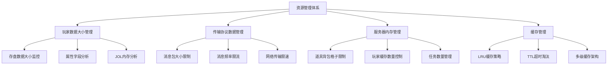

---

# 项目资源管理分析报告

## 一、资源管理概览

本项目在资源管理方面建立了较为完整的体系，主要涵盖以下几个维度：



---

## 二、玩家数据大小管理

### 2.1 存盘数据监控机制

**核心文件**: [PlayerGameDBMgr.java](C:/UGit/letsgo_server/WeA/projects/gamesvr/src/main/java/com/tencent/wea/playerservice/attr/PlayerGameDBMgr.java)

```java
// 关键常量和逻辑
private static volatile int maxDbMainAttrSize = 0;
private final static int USER_ATTR_WARNNING_SIZE = 120000;  // 120KB 预警阈值

// 数据大小监控
if (dbMainAttrSize > maxDbMainAttrSize) {
    maxDbMainAttrSize = dbMainAttrSize;
    record = UserAttr.generateFieldProfile(getDbPlayer().getUserAttr(), 3, "userAttr");
    AttrProfiler.printTree(record, "player {} main attr profile:", getDbPlayer().getUid());
    if (maxDbMainAttrSize > USER_ATTR_WARNNING_SIZE) {
        WechatLog.debugPanicWithNoticer(Programmer.nilyang,
                "player-{} db pkg size:{} larger than max size:{}. Look AttrProfiler.log for detail"
                , dbPlayer.getUid(), dbMainAttrSize, USER_ATTR_WARNNING_SIZE);
    }
}
```

**监控指标** ([PlayerAttrMonitor.java](C:/UGit/letsgo_server/WeA/projects/gamesvr/src/main/java/com/tencent/wea/playerservice/player/PlayerAttrMonitor.java)):
- `attr_full_update_even_size`: 全量存盘平均大小
- `attr_full_update_max_size`: 全量存盘最大大小
- `attr_delta_update_even_size`: 增量更新平均大小
- `attr_delta_update_max_size`: 增量更新最大大小

### 2.2 JOL内存分析工具

**核心文件**: [JolTool.java](C:/UGit/letsgo_server/WeA/timiutil/src/main/java/com/tencent/timiutil/tool/JolTool.java)

```java
// 解析对象内存占用
public static TimiGraphLayout parseWithFilter(Object target, int gprInitialCap, long maxSize, 
        Collection<JolFilter> filterList) {
    TimiGraphLayout graphLayout = TimiGraphLayout.parseInstanceWithFilter(target, gprInitialCap, maxSize, filterList);
    return graphLayout;
}

// 获取对象总大小
public static long getTotalSize(GraphLayout graphLayout) {
    return graphLayout.totalSize();
}
```

**使用场景** (在Player类中):
```java
// 定期检查玩家对象大小
GraphLayout graphLayout = JolTool.parseRetain(player, maxSize, player.getClass().getClassLoader());
long curSize = JolTool.getTotalSize(graphLayout);
if (curSize >= maxSize) {
    jolLogger.error("found player size larger than {} >= {}", curSize, maxSize);
}
```

### 2.3 改进空间

| 现状 | 问题 | 改进建议 |
|------|------|---------|
| 固定120KB预警阈值 | 不能适应不同玩家类型 | 根据玩家等级/活跃度动态调整阈值 |
| 只记录最大值 | 无法看到分布情况 | 增加直方图统计，了解数据分布 |
| JOL检测间隔固定 | 可能错过内存峰值 | 增加事件触发的检测机制 |
| 缺少字段级别的限制 | 单个字段可能过大 | 对关键字段设置独立大小限制 |

---

## 三、传输协议数据管理

### 3.1 消息大小限制

**核心文件**: [MsgRateLimitMgr.java](C:/UGit/letsgo_server/WeA/common/src/main/java/com/tencent/rpc/limiter/MsgRateLimitMgr.java)

```java
// 消息大小限制器
public static class MsgSizeLimiter {
    private String msgName;
    private int limitSize;
    private boolean isTest;
    
    public boolean check(int msgSize) {
        return msgSize < limitSize;
    }
}

// 消息消费检查
if(MsgRateLimitRealtimeCfg.getEnableMsgSizeLimit()) {
    MsgSizeLimiter sizeLimiter = msgSizeLimiterMap.get(msgName);
    if(sizeLimiter != null) {
        if(!sizeLimiter.check(msgSize)) {
            Monitor.getInstance().add.total(MonitorId.attr_msg_size_limit, 1, params);
            if(!sizeLimiter.getIsTest()) {
                return false;  // 拒绝超限消息
            }
        }
    }
}
```

### 3.2 消息频率限流

支持多种限流维度:
- **Pod级别限流**: 整个服务实例的消息频率限制
- **Entity级别限流**: 按玩家(uid)或房间(roomId)的限流
- **注解限流**: 通过proto注解配置限流

```java
// Pod级别限流
StaticRateLimiter rateLimiter = podRateLimiterMap.get(msgName);
if (rateLimiter != null && !rateLimiter.consume(1)) {
    // 触发限流
}

// Entity级别限流
StaticRateLimiterMgr<String> limitMgr = entitiesRateLimiterMgrMap.get(msgName);
if(limitMgr != null && !limitMgr.consume(entityKey, 1)) {
    // 触发限流
}
```

### 3.3 网络传输限速配置

**tconnd配置文件**:
```xml
<TransLimit>
    <!-- 上行最大发包速度:单位包/秒 -->
    <PkgSpeed>0</PkgSpeed>
    <!-- 上行最大传输速度:单位字节/秒 -->
    <ByteSpeed>0</ByteSpeed>
    <!-- 超过限速是否断开连接 -->
    <LimitAction>1</LimitAction>
</TransLimit>
```

### 3.4 协议层限制

**C++层限制** (g6_proto.h):
```cpp
const uint32_t kMaxCSPkgSize = 16777215;  // 约16MB
const uint8_t kMaxServiceNameSize = 127;
```

**Protobuf默认限制**:
- 默认消息大小限制: 64MB
- 理论最大安全值: 512MB

### 3.5 改进空间

| 现状 | 问题 | 改进建议 |
|------|------|---------|
| 限流配置分散 | 管理复杂 | 统一配置中心管理 |
| isTest模式手动切换 | 上线风险 | 灰度发布自动切换 |
| 缺少自适应限流 | 无法应对突发流量 | 引入滑动窗口自适应算法 |
| 客户端缓冲区400KB | 属性同步可能超限 | 分片同步大属性 |

---

## 四、服务器玩家数据内存管理

### 4.1 玩家缓存管理

**核心文件**: [PlayerMgr.java](C:/UGit/letsgo_server/WeA/projects/gamesvr/src/main/java/com/tencent/wea/playerservice/player/PlayerMgr.java)

```java
// 缓存最大人数
private int maxPlayerCacheCount = 4_000;

// 初始化玩家缓存
playerLoader = new CoLoadingCache.Builder<Long, Player>()
    .setCapacity(maxPlayerCacheCount)
    .setLoader(uid -> {
        // 从DB加载玩家
        TcaplusManager.TcaplusRecordData<?> firstRecord = loadDbPlayer(uid);
        Player np = new Player((TcaplusDb.Player) firstRecord.msg, firstRecord.version);
        np.load();
        return np;
    })
    .setRemoveNotifier((uid, player) -> {
        playerCount.getAndDecrement();
        player.onDestroy();
    })
    .build();
```

### 4.2 玩家踢出策略

**核心文件**: [PlayerKickMgr.java](C:/UGit/letsgo_server/WeA/projects/gamesvr/src/main/java/com/tencent/wea/playerservice/player/PlayerKickMgr.java)

```java
// 踢人配置
private int cfgEvictPlayerStepForGracefulShutdown = 2;  // 每秒踢人频率
private int cfgPodOfflineKickSamePlayerMaxCount = 8;    // 最多踢8次
private long cfgPodOfflineKickSamePlayerInterval = 15*1000L;  // 15秒间隔
private long cfgPodOfflineSlowKickCD = 10*1000L;        // 首次踢人后CD

// 离线后玩家保持时间
long keepTime = PropertyFileReader.getRealTimeLongItem("keep_player_cache_after_disconnet", 180000);
```

### 4.3 道具背包限制

**主背包** ([ItemManager.java](C:/UGit/letsgo_server/WeA/projects/gamesvr/src/main/java/com/tencent/wea/playerservice/bag/ItemManager.java)):
```java
private static final int DEFAULT_GRIDS_LIMIT = 3000;

private static int getGridsLimit() {
    int gridsLimit = MiscConf.getInstance().getMiscConf().getPlayerBackpackGridLimit();
    if (gridsLimit < DEFAULT_GRIDS_LIMIT) {
        gridsLimit = DEFAULT_GRIDS_LIMIT;
    }
    return gridsLimit;
}

// 预警限制
private static int getGridsWarnLimit() {
    return PropertyFileReader.getRealTimeIntItem("bag_grids_warning_limit", 2500);
}
```

**农场背包**:
```java
// farm背包格子限制
return PropertyFileReader.getRealTimeIntItem("farm_bag_grids_limit", 12000);

// farmcrazy背包格子限制
var bagSlotLimit = (int)FarmCrazySysConf.getIntWithDefault(
    FarmCrazySysConf.ID.FarmCrazyBagSlotLimit, 1700);
```

### 4.4 任务管理

```java
// 运行中的任务管理
private final HashMap<Integer, ActivityTask> runningTaskMap = new HashMap<>();
private final ArrayList<Integer> tasksToDelete = new ArrayList<>();
private final IntSet tasksNeedLoadTimeCheck;
```

### 4.5 改进空间

| 现状 | 问题 | 改进建议 |
|------|------|---------|
| 固定4000玩家缓存 | 不能动态调整 | 根据内存使用率动态调整容量 |
| 缺少内存预警 | 可能OOM | 设置内存水位线，主动淘汰 |
| 道具按格子限制 | 不考虑道具复杂度 | 增加道具权重概念 |
| 踢人策略较简单 | 可能踢走活跃玩家 | 优先踢不活跃玩家 |

---

## 五、缓存管理策略

### 5.1 LRU+TTL缓存

**核心文件**: [LRUTTLCache.java](C:/UGit/letsgo_server/WeA/common/src/main/java/com/tencent/lru/LRUTTLCache.java)

```java
public class LRUTTLCache<K, V extends LRUCacheItemInterface> extends LRUCache<K, V> {
    private long ttlMs = 0;           // TTL超时时间
    private long checkTickMs = 0;     // 检查频率
    
    // 超时检查
    protected boolean isTimeout(NKPair<K, V> item, long time) {
        if (time - value.getLastAccessTime() >= ttlMs) {
            if (remove(key) != null) {
                onRemove(key, value, true);
            }
            return true;
        }
        return false;
    }
    
    // 容量超限淘汰
    @Override
    protected boolean removeEldestEntry(java.util.Map.Entry<K, V> eldest) {
        boolean remove = super.removeEldestEntry(eldest);
        if (remove) {
            onRemove(eldest.getKey(), eldest.getValue(), false);
        }
        return remove;
    }
}
```

### 5.2 CoLoadingCache

```java
// 支持容量限制、TTL、自动加载
CoLoadingCache<Long, Player> cache = new CoLoadingCache.Builder<Long, Player>()
    .setCapacity(maxCacheCount)
    .expireAfterWrite(60000)  // 1分钟过期
    .setLoader(this::loadFromDB)
    .setRemoveNotifier(this::onRemoval)
    .build();
```

### 5.3 多级缓存架构

```java
// L1: 本地缓存（热数据，毫秒级）
private final CoLoadingCache<Long, Player> localCache;

// L2: Redis缓存（温数据，10ms级）
private final CoRedisCmd<String, String> redis;

// L3: 数据库（冷数据，50ms级）
// Tcaplus
```

### 5.4 改进空间

| 现状 | 问题 | 改进建议 |
|------|------|---------|
| TTL固定值 | 不适应访问模式 | 根据访问频率动态调整TTL |
| LRU单一策略 | 可能淘汰重要数据 | 结合LFU，使用LRFU |
| 缺少缓存预热 | 冷启动性能差 | 服务启动时预热热点数据 |
| 无缓存分片 | 大对象影响性能 | 对大对象分片存储 |

---

## 六、总体改进建议

### 6.1 短期改进（1-2周）

1. **增强监控告警**
   - 为关键资源指标设置合理阈值
   - 实现资源使用率趋势分析
   - 增加异常数据自动报警

2. **配置可视化**
   - 统一资源限制配置管理
   - 支持运行时动态调整
   - 配置变更审计日志

### 6.2 中期改进（1-2月）

1. **智能限流**
   ```java
   // 建议：自适应限流算法
   public class AdaptiveRateLimiter {
       private double currentRate;
       private double minRate;
       private double maxRate;
       
       public void adjustRate(double successRatio, double latency) {
           if (successRatio > 0.95 && latency < threshold) {
               currentRate = Math.min(currentRate * 1.1, maxRate);
           } else if (successRatio < 0.9 || latency > threshold * 2) {
               currentRate = Math.max(currentRate * 0.8, minRate);
           }
       }
   }
   ```

2. **内存压力管理**
   ```java
   // 建议：内存水位线管理
   public class MemoryPressureManager {
       private static final double HIGH_WATERMARK = 0.8;
       private static final double LOW_WATERMARK = 0.6;
       
       public void checkAndEvict() {
           double usage = getHeapUsageRatio();
           if (usage > HIGH_WATERMARK) {
               // 激进淘汰
               evictUntil(LOW_WATERMARK);
           }
       }
   }
   ```

### 6.3 长期改进（3-6月）

1. **资源池化管理**
   - 实现统一的资源池框架
   - 支持资源借还、超时回收
   - 资源使用追踪和泄漏检测

2. **分布式缓存优化**
   - 实现一致性哈希分片
   - 热点数据自动识别和复制
   - 跨节点缓存预热

3. **数据压缩**
   - 对大属性字段启用压缩
   - 增量同步优化
   - 协议层数据压缩

---

## 七、总结

项目在资源管理方面已有较完整的框架，主要优点：
- ✅ 完善的监控指标体系
- ✅ 多层次的限流机制
- ✅ 成熟的缓存淘汰策略
- ✅ JOL工具支持内存分析

需要改进的方面：
- ⚠️ 配置分散，缺少统一管理
- ⚠️ 限制阈值相对固定，缺乏动态调整
- ⚠️ 缺少资源使用的预测和预警
- ⚠️ 大数据场景下的优化空间较大