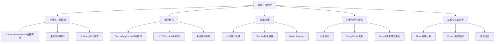
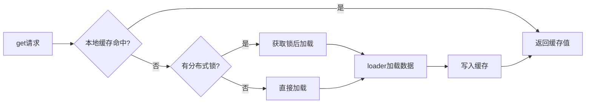

---

# 项目计算过程开销管理分析报告

## 1. 开销管理总体架构

项目采用了**多层次、多维度**的计算开销管理策略，主要包括以下几个方面：



---

## 2. 协程与并发控制

### 2.1 管理方式

项目通过 [CurrentExecutorUtil.java](C:/UGit/letsgo_server/WeA/common/src/main/java/com/tencent/timiCoroutine/CurrentExecutorUtil.java) 统一管理协程任务提交：

| 方法 | 用途 | 开销特点 |
|------|------|---------|
| `runJob()` | Fire-and-Forget异步执行 | 无阻塞，高性能 |
| `runJobSequentialByKey()` | 按Key串行执行 | 避免数据竞争 |
| `batchSubmitJob()` | 批量并行提交 | 高并发处理 |
| `partBatchSubmitJob()` | 分批并行处理 | **核心优化方法** |
| `parallelRun()` | ForkJoin CPU密集型并行 | 充分利用多核 |

### 2.2 分批处理实现（关键代码）

```java
// 来自 CurrentExecutorUtil.java 第625-674行
public static <K, R> HashMap<K,R> partBatchSubmitJob(List<K> batchKeyList, Function<K, R> func, int partCount, int timeoutMs) {
    HashMap<K, R> resultMap = new HashMap<>();
    List<Callable<HashMap<K, R>>> callJobs = new ArrayList<>();
    List<K> tmpPartList = new ArrayList<>(); // 按固定数量分成多批执行
    
    for (K key : batchKeyList) {
        tmpPartList.add(key);
        if (tmpPartList.size() >= partCount) {
            List<K> reqPlayerList = new ArrayList<>(tmpPartList);
            callJobs.add(() -> partExcute(reqPlayerList, func)); // 每批内部顺序执行
            tmpPartList.clear();
        }
    }
    // 批次之间并行执行
    List<CoroHandle<HashMap<K, R>>> coroHandleList = batchSubmitJob(callJobs, "partBatchSubmitJob", true);
    // ... 等待结果
}
```

**设计思路**：将大量任务拆分成多个小批次，批次内部顺序执行避免资源争抢，批次之间并行执行提升吞吐量。

### 2.3 改进空间

1. **动态批次大小**：目前 `partCount` 是固定的，可以根据当前系统负载动态调整
2. **背压机制**：当协程池接近饱和时，应自动降低批次并发度
3. **超时分级**：不同类型任务应有不同的超时策略

---

## 3. 缓存优化机制

### 3.1 CoLoadingCache 实现分析

项目的核心缓存实现位于 [CoLoadingCache.java](C:/UGit/letsgo_server/WeA/common/src/main/java/com/tencent/coLoadingCache/CoLoadingCache.java)：



**关键特性**：
- **LRU淘汰策略**：使用 `ConcurrentLinkedHashMap` 实现
- **TTL过期管理**：`expired` Map 记录每个key的过期时间
- **弱引用支持**：`holder` 使用 `MapMaker().weakValues()` 避免内存泄漏
- **批量加载**：支持 `loader2` 批量加载器减少IO次数
- **重入检测**：`loading` Set 防止循环加载

### 3.2 批量加载优化

```java
// CoLoadingCache.java 第366-400行
public Map<K, V> getAll(Collection<K> keys) {
    Map<K, V> result = new HashMap<>(keys.size());
    ObjectSet<K> miss = null;
    for (K key : keys) {
        V value = getFromCache(key);
        if (value != null) {
            result.put(key, value);
        } else {
            if (miss == null) {
                miss = new ObjectArraySet<>(keys.size()); // 使用fastutil优化
            }
            miss.add(key);
            // 分页批量加载
            if (loader2 != null && pageLimit > 0 && miss.size() >= pageLimit) {
                Map<K, V> merge = batchLoad(miss);
                result.putAll(merge);
                miss.clear();
            }
        }
    }
    // ...
}
```

### 3.3 改进空间

1. **缓存预热机制**：可以在启动时预加载热点数据
2. **过期数据清理**：目前是惰性删除，可以增加主动清理定时任务
3. **命中率监控**：增加缓存命中率统计，便于优化容量配置
4. **分层缓存**：文档提到的L1/L2/L3三级缓存架构可以更系统化实现

---

## 4. 批量处理优化

### 4.1 Tcaplus数据库批量操作

从 [BaseTable.java](C:/UGit/letsgo_server/WeA/common/src/main/java/com/tencent/ugc/BaseTable.java) 和 [TcaplusUtil.java](C:/UGit/letsgo_server/WeA/common/src/main/java/com/tencent/tcaplus/TcaplusUtil.java) 可见：

```java
// BaseTable.java 第226-264行
private void batchLoadTcaplus(Collection<K> keyList, Map<K, T> dbDataList) {
    TcaplusManager.TcaplusReq batchGetReq = null;
    for (K key : keyList) {
        Builder db = createDbBuilder(key);
        if (batchGetReq == null) {
            batchGetReq = TcaplusUtil.newBatchGetReq(db);
        } else {
            batchGetReq.addRecord(db);
        }
        // 每批最多1000条，避免单次请求过大
        if (batchGetReq.getRecordCount() >= 1000) {
            batchLoadTcaplusSend(batchGetReq, dbDataList);
            batchGetReq = null;
        }
    }
    // ...
}
```

### 4.2 批量操作规范

根据开发规范文档，推荐的批量大小：

| 场景 | 单次操作耗时 | 批量大小建议 |
|------|------------|------------|
| Tcaplus批量查询 | 10-50ms | 50-100 |
| Redis Pipeline | 5-20ms | 100-200 |
| 协程批量提交 | 取决于任务 | 50-200 |

### 4.3 改进空间

1. **自适应批量大小**：根据响应时间动态调整批量大小
2. **批量操作合并**：对于短时间内的多次请求，可以合并后批量处理
3. **部分字段查询**：使用 `setChangeField()` 只查询需要的字段

---

## 5. 对象与内存优化

### 5.1 StringBuilder复用

项目广泛使用 `StringBuilder` 替代字符串拼接（搜索到94个文件，200处使用）：

```java
// TlogFlow.java 第36行 - ThreadLocal复用
private static final ThreadLocal<StringBuilder> sbPool = ThreadLocal.withInitial(() -> new StringBuilder(1024));
```

### 5.2 fastutil原生类型集合

项目使用 `fastutil` 库避免基本类型装箱开销（搜索到98个文件使用）：

```java
// 示例：使用IntSet替代HashSet<Integer>
IntSet nodeSet = new IntArraySet();  // 避免Integer装箱
IntSet visitedNode = new IntArraySet();

// 使用Int2ObjectMap替代HashMap<Integer, Object>
Int2ObjectMap<Config> configMap = new Int2ObjectOpenHashMap<>();
```

### 5.3 对象池化

项目使用Apache Commons Pool进行对象池化：

```java
// RedisIns.java - Redis连接池
private List<GenericObjectPool<StatefulRedisConnection>> poolArray = new ArrayList<>();

// PlatSessionManager.java - WebSocket连接池
private GenericObjectPool<PlatWebSocketClient> npcPool;
```

### 5.4 改进空间

1. **List复用**：参考开发规范的 `allocRepeatedBuffer` 模式，更多场景可以复用List
2. **ByteBuf池化**：Netty的ByteBuf应统一使用池化分配器
3. **Protobuf Builder复用**：PB消息构建可以复用Builder对象

---

## 6. 监控与性能分析

### 6.1 现有监控体系

```java
// MonitorId.java 中定义了丰富的监控指标
public static final MonitorId attr_task_run_gt_1sec = new MonitorId(Task);   // 任务执行>1s
public static final MonitorId attr_task_run_gt_5sec = new MonitorId(Task);   // 任务执行>5s
public static final MonitorId attr_player_proto_latency_10 = new MonitorId(Player);  // 时延<10ms
public static final MonitorId attr_execute_queue_wait_task_time = new MonitorId(ExecuteQueue); // 等待时间
```

### 6.2 Timer性能分析

[TimerProfiler.java](C:/UGit/letsgo_server/WeA/common/src/main/java/com/tencent/nk/timer/TimerProfiler.java) 提供定时器性能统计：

```java
public static class TimerStatsRecord {
    int totalCnt;
    int addCnt;
    int runCnt;
    int cancelCnt;
    long totalCostNs;
    long maxCostNs;
}
```

### 6.3 改进空间

1. **火焰图支持**：集成async-profiler，支持CPU热点分析
2. **慢查询日志**：记录执行时间超过阈值的操作详情
3. **趋势分析**：增加性能指标的趋势分析和预警

---

## 7. 综合改进建议

### 7.1 高优先级改进

| 改进项 | 当前状态 | 改进方案 | 预期收益 |
|--------|---------|---------|---------|
| 动态批量调整 | 固定批量大小 | 根据响应时间自适应调整 | 提升吞吐量20-30% |
| 缓存命中率监控 | 无统计 | 增加hit/miss计数 | 优化缓存配置 |
| 循环内对象复用 | 部分实现 | 统一使用对象池 | 减少GC压力 |

### 7.2 中优先级改进

1. **协程池监控增强**：实时监控协程池使用率，提前预警
2. **批量请求合并**：短时间内的多次小请求合并成批量请求
3. **懒加载优化**：配置表支持按需加载，减少启动时间

### 7.3 代码示例：动态批量大小调整

```java
// 建议增加的动态批量调整逻辑
public class AdaptiveBatchConfig {
    private static final int MIN_BATCH_SIZE = 20;
    private static final int MAX_BATCH_SIZE = 200;
    private static final double TARGET_BATCH_DURATION_MS = 100.0;
    
    private int currentBatchSize = 50;
    private double smoothedDuration = 0.0;
    
    public int computeOptimalBatchSize(double lastBatchDurationMs) {
        // 指数平滑
        smoothedDuration = 0.8 * smoothedDuration + 0.2 * lastBatchDurationMs;
        
        if (smoothedDuration < TARGET_BATCH_DURATION_MS * 0.5) {
            // 批量太快，可以增大
            currentBatchSize = Math.min(currentBatchSize * 2, MAX_BATCH_SIZE);
        } else if (smoothedDuration > TARGET_BATCH_DURATION_MS * 1.5) {
            // 批量太慢，需要减小
            currentBatchSize = Math.max(currentBatchSize / 2, MIN_BATCH_SIZE);
        }
        
        return currentBatchSize;
    }
}
```

---

## 8. 总结

项目在计算开销管理方面已经建立了**较为完善的体系**，包括：

✅ **协程调度**：`CurrentExecutorUtil` 提供统一的协程管理  
✅ **批量处理**：`partBatchSubmitJob` 分批并行优化大量任务  
✅ **缓存机制**：`CoLoadingCache` 支持LRU淘汰、TTL过期、批量加载  
✅ **类型优化**：广泛使用 `fastutil` 避免装箱开销  
✅ **性能监控**：丰富的监控指标和性能分析工具  

**主要改进方向**：
1. 动态自适应调整（批量大小、超时时间）
2. 更细粒度的监控和分析能力
3. 对象复用的统一化管理