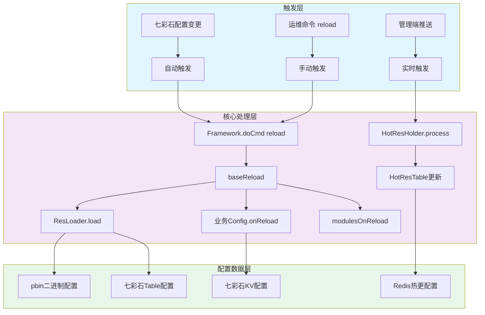
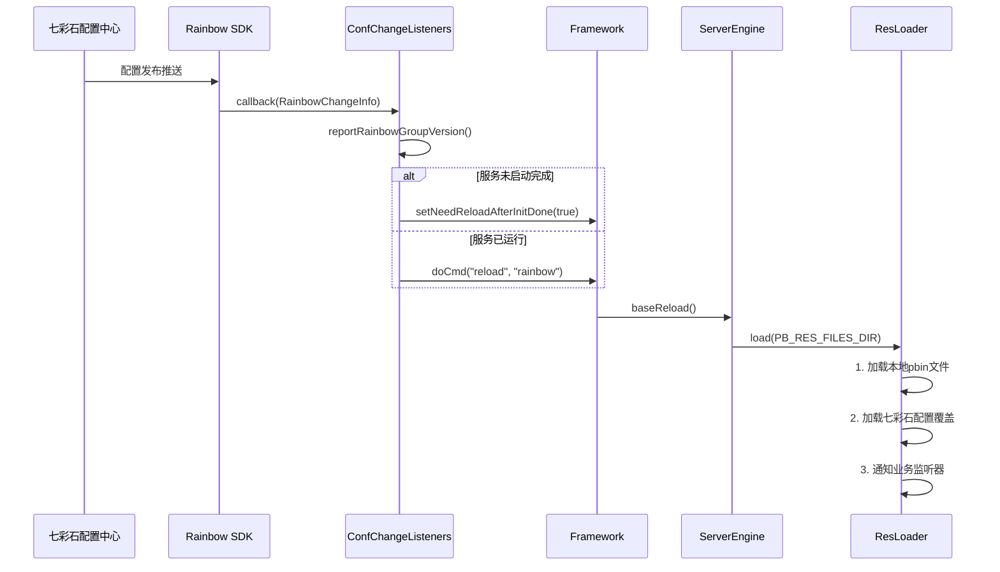
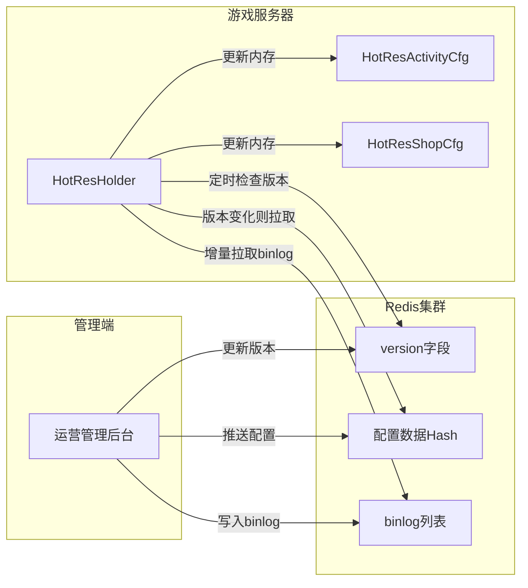

---

# 项目热更新与热配置更新机制分析

根据对代码库的深入分析，我整理了项目中关于热更新、热配置更新等灵活性变更流程的完整分析报告。

---

## 一、热更新机制整体架构



---

## 二、三大配置热更新机制详解

### 2.1 ResLoader配置热更新（Excel配置 + 七彩石Table配置）

**实现原理：**

| 组件 | 文件位置 | 职责 |
|-----|---------|-----|
| `ResLoader` | [ResLoader.java](C:/UGit/letsgo_server/WeA/common/src/main/java/com/tencent/resourceloader/ResLoader.java) | 配置加载入口 |
| `ResHolder` | ResHolder.java | 管理配置表实例，处理七彩石配置合并 |
| `ConfChangeListeners` | [ConfChangeListeners.java](C:/UGit/letsgo_server/WeA/common/src/main/java/com/tencent/rainbow/util/ConfChangeListeners.java) | 七彩石配置变更监听 |

**加载流程：**



**核心代码实现（来自 [ConfChangeListeners.java](C:/UGit/letsgo_server/WeA/common/src/main/java/com/tencent/rainbow/util/ConfChangeListeners.java)）：**

```java
class NKTableGroupListenCallback implements ListenCallback<RainbowChangeInfo> {
    @Override
    public void callback(RainbowChangeInfo change) {
        // 上报配置版本
        RainbowConfigLoader.reportRainbowGroupVersion(change.getEnvName(), change.getGroup(), false);
        
        if (!Framework.getInstance().isRunning()) {
            // 服务未启动完成，标记待reload
            Framework.getInstance().setNeedReloadAfterInitDone(true);
            return;
        }
        // 触发reload
        Framework.getInstance().doCmd("reload", "rainbow");
    }
}
```

---

### 2.2 PropertyFileReader实时配置热更新（七彩石KV配置）

**实现原理：**

七彩石KV配置的特点是**无需触发reload即可实时生效**，通过`getRealTimeXxxItem()`方法每次访问时直接从缓存读取最新值。

**核心代码示例（来自 [ConfChangeListeners.java](C:/UGit/letsgo_server/WeA/common/src/main/java/com/tencent/rainbow/util/ConfChangeListeners.java)）：**

```java
class NKKvGroupListenCallback implements ListenCallback<RainbowChangeInfo> {
    private final Properties kvDataContainer;  // 外部配置容器
    
    @Override
    public void callback(RainbowChangeInfo change) {
        if (kvDataContainer != null) {
            final UpdateGroupType updateType = change.getUpdateGroupType();
            if (updateType == UpdateGroupType.DELETE) {
                // 删除配置
                for (String deletedKey : change.getKeyValue().keySet()) {
                    kvDataContainer.remove(deletedKey);
                }
            } else {
                // 新增/更新配置
                for (Map.Entry<String, KvGroup.KvDataValue> entry : change.getKeyValue().entrySet()) {
                    kvDataContainer.put(entry.getKey(), entry.getValue().getValue());
                }
            }
        }
        // 触发reload（可选）
        Framework.getInstance().doCmd("reload", "rainbow");
    }
}
```

**使用方式：**

```java
// 实时获取配置（自动从七彩石更新）
boolean featureSwitch = PropertyFileReader.getRealTimeBooleanItem("feature_switch", false);
int maxPlayerCount = PropertyFileReader.getRealTimeIntItem("max_player_count", 10000);
```

---

### 2.3 HotResLoader热更新（运营配置增量更新）

**实现原理：**

HotResLoader是专门为**高频变更的运营配置**（活动、商城、UGC等）设计的热更新系统，支持：
- **基于版本的增量更新**（避免全量拉取）
- **Redis存储**（支持分布式）
- **binlog机制**（记录变更历史）
- **定时轮询**（5秒检查一次）

**架构图：**



**核心实现（来自 [HotResHolder.java](C:/UGit/letsgo_server/WeA/common/src/main/java/com/tencent/hotresourceloader/HotResHolder.java)）：**

```java
// 加载配置判断逻辑
private HotResRedisDataLoaded loadConfigs(HotResPrivateMethods hotResPrivateMethods) {
    long localVersion = hotResPrivateMethods.getVersion();
    HotResRedisDataLoaded hotResRedisData = new HotResRedisDataLoaded(resName);
    
    if (localVersion == -1) {
        // 首次加载：全量拉取
        hotResRedisData.load();
        hotResPrivateMethods.setVersion(localVersion, hotResRedisData.getVersion());
        return hotResRedisData;
    }
    
    // 增量更新：先只拉取版本号
    hotResRedisData.loadVersion();
    
    if (hotResRedisData.getVersion() == hotResPrivateMethods.getVersion()) {
        // 版本相同，无需更新
        return null;
    }
    
    boolean loadAllAlways = PropertyFileReader.getRealTimeBooleanItem("hotres_load_all_always", false);
    
    if (loadAllAlways || forceLoadAll) {
        // 全量加载
        hotResRedisData.load();
    } else {
        // 增量加载：通过binlog拉取变更
        hotResRedisData.loadBinlogAndDeal(hotResPrivateMethods.getVersion());
    }
    
    hotResPrivateMethods.setVersion(localVersion, hotResRedisData.getVersion());
    return hotResRedisData;
}
```

**HotResTable的增量更新回调（来自 [HotResTable.java](C:/UGit/letsgo_server/WeA/common/src/main/java/com/tencent/hotresourceloader/HotResTable.java)）：**

```java
public abstract class HotResTable<Key, Proto, Config> {
    private Map<Key, Config> hotDataMap = new ConcurrentHashMap<>();
    
    // 全量加载后回调
    protected abstract void onHotResLoad();
    
    // 增量更新：配置被替换
    protected abstract void onHotResReplace(List<Config> list);
    
    // 增量更新：配置被删除
    protected abstract void onHotResDelete(List<Config> list);
    
    // 原子替换整个Map
    private void swap(ConcurrentHashMap<Key, Config> newMap) {
        this.hotDataMap = newMap;
    }
}
```

---

## 三、Framework reload核心流程

**核心代码（来自 [Framework.java](C:/UGit/letsgo_server/WeA/common/src/main/java/com/tencent/nk/commonframework/Framework.java)）：**

```java
public String doCmd(String cmd, String arg) {
    return GetSystemExecuter().callJob(30000, () -> {
        if (isDoingCmd) {
            throw new NKRuntimeException("docmd cmd fail for doingcmd");
        }
        try {
            isDoingCmd = true;
            if ("reload".equals(cmd)) {
                if (arg.equals("rainbow") && isReloadLock()) {
                    // 正在下发reload配置，加锁防止并发
                    return NKErrorCode.LockFailed.getValue();
                }
                ret = reload();  // 调用实际reload
            }
            // ... 其他命令处理
        } finally {
            isDoingCmd = false;
        }
    }, "frameworkDoCmd", true);
}
```

**baseReload完整流程（来自 [ServerEngine.java](C:/UGit/letsgo_server/WeA/common/src/main/java/com/tencent/nk/commonframework/ServerEngine.java)）：**

```java
public int baseReload(TxStopWatch stopWatch) {
    // 1. 更新环境类型
    updateEnvType();
    ConfigUtils.reloadConfigs();
    
    // 2. 重载版本工具
    VersionUtil.reload();
    
    // 3. 重载GamePlay
    var err = GamePlay.getInstance().load();
    
    // 4. 重载XML配置
    XmlLoader.loadXml(stopWatch, framework.getGameName());
    EventServerConfig.load();
    
    // 5. 重载CsMeta
    CsMetaLoader.load();
    
    // 6. 重载ResLoader（pbin + 七彩石Table配置）
    ResLoader.load(PB_RES_FILES_DIR, stopWatch);
    
    // 7. 重载Tbuspp
    TbusppManager.getInstance().reload();
    RpcClient.reload();
    
    // 8. 重载Tlog
    getTlogManager().reload();
    
    // 9. 调用业务模块reload
    modulesOnReload();
    
    // 10. 调用子类reload
    reload();
    
    // 11. 其他组件reload
    Monitor.getInstance().reload();
    MSDKManager.reload();
    CacheFlowControl.getInstance().load();
    MsgRateLimitMgr.getInstance().reload();
    
    return ret;
}
```

---

## 四、配置类型优先级与适用场景

| 配置类型 | 更新方式 | 优先级 | 适用场景 | 存储位置 |
|---------|---------|-------|---------|---------|
| **七彩石KV配置** | 实时生效 | 最高 | 开关、参数、灰度控制 | 七彩石配置中心 |
| **七彩石Table配置** | reload触发 | 高 | Excel配置表覆盖 | 七彩石配置中心 |
| **HotResLoader** | 定时轮询(5s) | 高 | 运营活动、商城配置 | Redis |
| **本地pbin文件** | reload触发 | 低 | Excel导出的默认配置 | 本地文件系统 |
| **代码默认值** | 重启生效 | 最低 | 兜底默认值 | 代码中 |

---

## 五、热更新过程中的线程安全保障

**核心机制：**

```java
// 1. volatile保证可见性
private static volatile boolean featureSwitch = false;
private static volatile Map<Integer, Config> configMap = new HashMap<>();

// 2. 原子替换而非修改
public static void reloadConfig() {
    Map<Integer, Config> newMap = new HashMap<>();
    loadConfigToMap(newMap);  // 加载到新Map
    configMap = newMap;        // 原子替换引用
}

// 3. ConcurrentHashMap用于HotRes
private Map<Key, Config> hotDataMap = new ConcurrentHashMap<>();

// 4. isDoingCmd标记防止并发reload
if (isDoingCmd) {
    throw new NKRuntimeException("docmd cmd fail for doingcmd");
}
```

---

## 六、改进空间分析

### 6.1 当前架构的优点

| 优点 | 说明 |
|-----|------|
| **多层次配置体系** | 七彩石KV（实时）、七彩石Table（准实时）、HotRes（定时）分层设计 |
| **环境隔离** | 支持Dev/Test/Business等多环境配置隔离 |
| **增量更新** | HotResLoader支持基于binlog的增量更新，减少网络开销 |
| **监听机制** | 七彩石SDK主动推送，减少轮询开销 |
| **版本管理** | 支持配置版本回滚 |

### 6.2 潜在改进方向

#### 1. **reload原子性不足**

**问题：** `baseReload`方法中多个组件顺序reload，如果中途失败，会导致部分配置已更新、部分未更新的不一致状态。

**建议改进：**
```java
// 改进方案：两阶段提交
public int baseReload() {
    // Phase 1: 准备阶段 - 加载所有配置到临时变量
    TempConfig tempConfig = prepareReload();
    if (tempConfig.hasError()) {
        return tempConfig.getError();  // 准备失败则不提交
    }
    
    // Phase 2: 提交阶段 - 原子替换所有配置
    commitReload(tempConfig);
    return 0;
}
```

#### 2. **HotResLoader轮询间隔固定**

**问题：** 固定5秒轮询间隔，无法根据配置变更频率动态调整。

**建议改进：**
```java
// 自适应轮询间隔
private int dynamicRefreshInterval = 5;  // 初始5秒

private void adjustRefreshInterval(boolean hasUpdate) {
    if (hasUpdate) {
        dynamicRefreshInterval = Math.max(1, dynamicRefreshInterval / 2);  // 有更新则加快
    } else {
        dynamicRefreshInterval = Math.min(30, dynamicRefreshInterval + 1);  // 无更新则减慢
    }
}
```

#### 3. **配置变更缺少diff日志**

**问题：** 配置变更时只记录"reload success"，缺少具体变更内容。

**建议改进：**
```java
// 记录配置diff
public void onLoad(Class<? extends ResTable> clazz) {
    Map<String, Object> oldConfig = snapshotConfig(clazz);
    // ... reload ...
    Map<String, Object> newConfig = snapshotConfig(clazz);
    
    List<String> diffs = calculateDiff(oldConfig, newConfig);
    LOGGER.info("Config {} changed: {}", clazz.getSimpleName(), diffs);
}
```

#### 4. **reload锁粒度过粗**

**问题：** 当前使用`isDoingCmd`全局锁，导致reload期间阻塞所有命令。

**建议改进：**
```java
// 分离读写锁
private ReadWriteLock configLock = new ReentrantReadWriteLock();

public void reload() {
    configLock.writeLock().lock();
    try {
        // reload操作
    } finally {
        configLock.writeLock().unlock();
    }
}

public Config getConfig() {
    configLock.readLock().lock();
    try {
        return configMap.get(key);
    } finally {
        configLock.readLock().unlock();
    }
}
```

#### 5. **DS服务热更新支持不完善**

**问题：** 根据代码注释（[LobbyRedEnvelopActResCfgDataSyncMgr.java](C:/UGit/letsgo_server/WeA/projects/lobbysvr/src/main/java/com/tencent/wea/lobbyservice/activity/LobbyRedEnvelopActResCfgDataSyncMgr.java)）：
> "目前ds无法热更 向ds同步红包雨活动数据"

**建议改进：**
- 让DS支持配置MD5校验
- DS主动请求最新配置而非被动推送
- 增加DS配置版本同步机制

#### 6. **缺少配置变更审计**

**建议增加：**
```java
// 配置变更审计日志
public class ConfigAuditLog {
    private String configName;
    private String operator;      // 操作人
    private long timestamp;
    private String oldValue;
    private String newValue;
    private String source;        // 来源：rainbow/local/hotres
}
```

#### 7. **配置预热机制**

**建议增加：**
```java
// 新配置预热验证
public boolean preValidateConfig(Config newConfig) {
    // 1. 格式校验
    // 2. 业务规则校验
    // 3. 性能预估
    return isValid;
}
```

---

## 七、总结

项目的热更新机制设计相对完善，具有以下特点：

1. **分层设计**：KV配置（实时）→ Table配置（准实时）→ HotRes（定时轮询）
2. **推拉结合**：七彩石主动推送 + HotRes定时拉取
3. **增量更新**：HotResLoader支持基于binlog的增量更新
4. **环境隔离**：支持多环境配置分离

主要改进方向集中在：
- **原子性保障**：两阶段提交
- **可观测性**：配置diff日志、审计日志
- **性能优化**：自适应轮询、细粒度锁
- **功能完善**：DS热更支持、配置预热验证