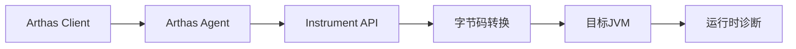
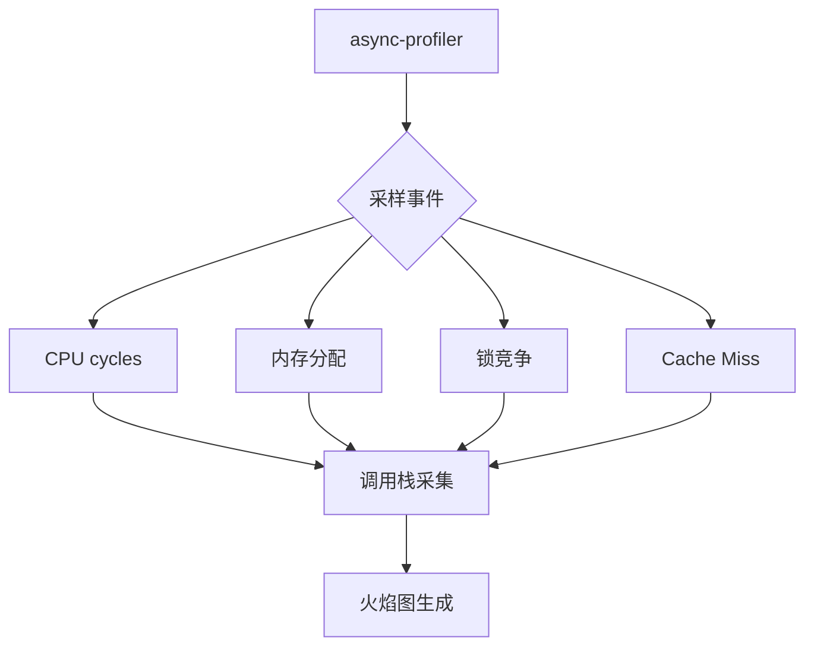
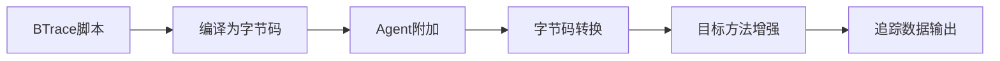
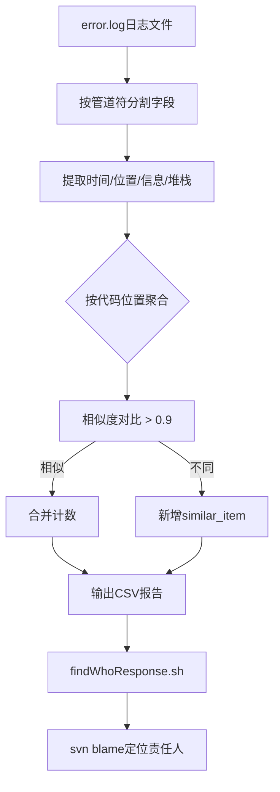
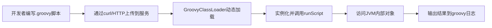
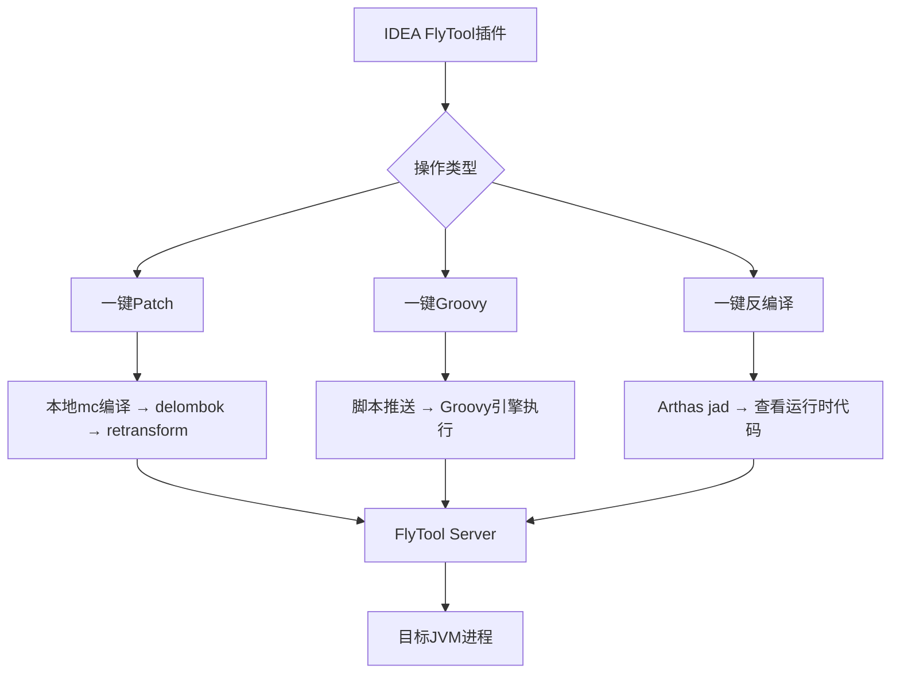
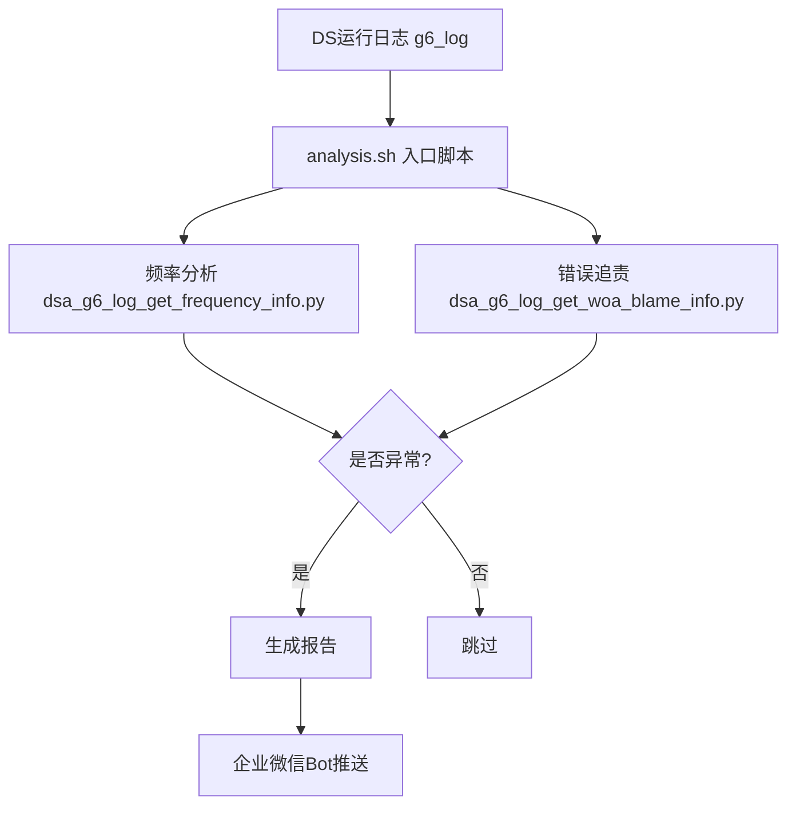
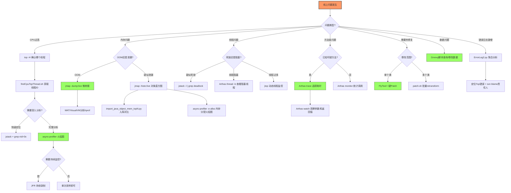

---

# 项目中可用的后台运行分析和调试工具分析

由于内容较多，我将分为几个主要部分进行说明：

---

## 📋 工具概览

根据项目分析，`letsgo_server` 项目中集成了以下主要的运行分析和调试工具：

| 工具 | 位置 | 用途 |
|------|------|------|
| **Arthas** | `run/tools/arthas-bin/` | 在线诊断、热修复、性能分析 |
| **async-profiler** | `run/tools/async-profiler/` | CPU/内存火焰图分析 |
| **BTrace** | `run/tools/btrace-2.1.0-bin/` | 动态追踪、方法注入 |
| **JMC (Java Flight Recorder)** | `run/tools/jmc/` | 持续性能监控 |
| **jtop** | `run/tools/jtop/` | 线程CPU监控 |
| **jstack** | `run/tools/jstack/` | 线程堆栈分析 |
| **jmap** | `run/tools/jmap/` | 内存堆分析 |
| **Glowroot** | `run/tools/glowroot/` | APM性能监控 |
| **GCViewer** | `run/tools/gcview/` | GC日志分析 |

---

## 1. Arthas - 在线诊断神器

### 1.1 原理

Arthas 基于 **Java Agent** 和 **字节码增强技术**（ASM）实现。其核心原理是：



- 通过 `Instrumentation API` 动态附加到目标JVM
- 使用 ASM 对字节码进行增强，插入诊断代码
- 支持热替换类，无需重启应用

### 1.2 项目中的配置

在 [arthas.properties](C:/UGit/letsgo_server/run/tools/arthas-bin/arthas.properties) 中：

```properties
arthas.telnetPort=3658        # Telnet端口
arthas.httpPort=-1            # 禁用HTTP端口（安全考虑）
arthas.ip=127.0.0.1           # 仅本地访问
arthas.sessionTimeout=1800    # 会话超时30分钟
arthas.myCost=1               # 自定义耗时阈值
arthas.skipJdkTrace=true      # 跳过JDK方法追踪
```

### 1.3 基本使用方法

```bash
# 方式1: 启动Arthas并附加到进程
java -jar arthas-boot.jar --telnet-port 30000 <pid>

# 方式2: 使用项目脚本（参考 run/simulator4j/arthas.sh）
sh arthas.sh "thread -n 5"
```

**常用命令：**

| 命令 | 功能 | 示例 |
|------|------|------|
| `dashboard` | 实时监控面板 | `dashboard -i 2000` |
| `thread` | 线程分析 | `thread -n 5` 查看CPU最高的5个线程 |
| `jvm` | JVM信息 | `jvm` |
| `trace` | 方法调用追踪 | `trace com.example.Service doSomething` |
| `watch` | 观察方法参数/返回值 | `watch com.example.Service doSomething {params, returnObj}` |
| `stack` | 方法调用栈 | `stack com.example.Service doSomething` |
| `jad` | 反编译 | `jad com.example.Service` |
| `mc` | 内存编译 | `mc /path/to/Service.java -d /output/` |
| `retransform` | 热替换类 | `retransform /path/to/Service.class` |

### 1.4 高级使用方法

#### 1.4.1 热修复流程（项目中已封装）

参考 [patch.sh](C:/UGit/letsgo_server/run/scripts/patch.sh)：

```bash
# 获取ClassLoader哈希
hash=$(sh arthas_${busid}.sh "classloader -l" | grep AppClassLoader | awk -F"[@ ]" '{print $3}')

# 加载修改后的类
sh arthas_${busid}.sh "classloader -c $hash --load $class_file"

# 热替换
sh arthas_${busid}.sh "retransform ${class_files}"
```

#### 1.4.2 性能追踪（带耗时统计）

```bash
# 追踪方法执行时间，显示超过100ms的调用
trace com.tencent.wea.framework.* * '#cost > 100'

# 追踪多层调用链
trace -E "com.tencent.wea..*" ".*" --skipJDKMethod false -n 5
```

#### 1.4.3 条件表达式

```bash
# 仅当参数满足条件时触发
watch com.example.Service doSomething {params, returnObj} 'params[0].length() > 10'

# 统计方法调用次数
monitor -c 5 com.example.Service doSomething
```

---

## 2. async-profiler - 火焰图分析

### 2.1 原理

async-profiler 是一个**低开销的采样分析器**，基于：

- **perf_events** (Linux) - 硬件性能计数器
- **AsyncGetCallTrace** - JVM内部API获取Java调用栈
- **JVMTI** - 获取方法名和类信息



### 2.2 基本使用方法

项目中提供了封装脚本：

```bash
# CPU分析 - 自动模式，采样30秒
sh profiler_gamesvr.sh auto 30 <pid>

# CPU分析 - 手动控制
sh profiler_gamesvr.sh start <pid>
# ... 执行业务操作 ...
sh profiler_gamesvr.sh stop <pid>

# 内存分析
sh memory_gamesvr.sh auto 30 <pid>
```

**直接使用 profiler.sh：**

```bash
# CPU火焰图（推荐）
./profiler.sh -d 30 -e cpu -t -o flamegraph -f /tmp/cpu.html <pid>

# 内存分配火焰图
./profiler.sh -d 30 -e alloc --total -o flamegraph -f /tmp/alloc.html <pid>

# 锁竞争分析
./profiler.sh -d 30 -e lock --lock 10ms -o flamegraph -f /tmp/lock.html <pid>
```

### 2.3 高级使用方法

#### 2.3.1 Wall-clock分析（包含阻塞线程）

```bash
# 分析所有线程（包括等待/阻塞状态）
./profiler.sh -e wall -t -i 5ms -d 30 -f result.html <pid>
```

#### 2.3.2 混合事件分析

```bash
# 同时采集CPU、内存、锁事件
./profiler.sh -e cpu --alloc 2m --lock 10ms -f profile.jfr <pid>
```

#### 2.3.3 过滤与筛选

```bash
# 仅包含特定包的调用
./profiler.sh -I 'com.tencent.wea.*' -f profile.html <pid>

# 排除特定方法
./profiler.sh -X '*Unsafe.park*' -f profile.html <pid>
```

#### 2.3.4 持续性能监控

```bash
# 每小时生成一份报告
./profiler.sh --loop 1h -f /var/log/profile-%t.jfr <pid>
```

---

## 3. JVM自带工具

### 3.1 jstack - 线程堆栈分析

#### 原理

通过 JVM 的 Attach API 获取所有线程的堆栈信息。

#### 项目中的使用

参考 [jstack.sh](C:/UGit/letsgo_server/run/tools/jstack/jstack.sh)：

```bash
# 获取线程堆栈
jstack <pid> > ${dayTime}_${pid}.txt
```

#### 高级用法

```bash
# 检测死锁
jstack -l <pid> | grep -A 30 "deadlock"

# 定位CPU高的线程
# 1. 找到CPU高的线程ID (用top -H -p <pid>)
# 2. 转换为16进制
printf "%x\n" <tid>
# 3. 在jstack输出中搜索
jstack <pid> | grep -A 20 "nid=0x<hex_tid>"
```

### 3.2 jmap - 堆内存分析

#### 原理

通过 JVM 的 Serviceability Agent 获取堆内存信息和对象分布。

#### 项目中的使用

参考 [jmapdumpLive.sh](C:/UGit/letsgo_server/run/tools/jmap/jmapdumpLive.sh)：

```bash
# 对象直方图（不触发Full GC）
jmap -histo <pid> > histogram.txt

# 对象直方图（触发Full GC，更准确）
jmap -histo:live <pid> > histogram_live.txt

# 堆转储
jmap -dump:live,format=b,file=heap.hprof <pid>
```

### 3.3 JFR (Java Flight Recorder)

#### 原理

JFR是JVM内置的**事件记录框架**，几乎零开销地采集JVM运行时事件。

#### 项目中的使用

参考 [jmc.sh](C:/UGit/letsgo_server/run/tools/jmc/jmc.sh)：

```bash
# 启动JFR记录
jcmd <pid> JFR.start name=my_recording settings=profile filename=recording.jfr duration=1d maxsize=1g

# 导出记录
jcmd <pid> JFR.dump name=my_recording

# 停止记录
jcmd <pid> JFR.stop name=my_recording
```

#### JFR常用命令

| 命令 | 功能 |
|------|------|
| `JFR.start` | 开始录制 |
| `JFR.stop` | 停止录制 |
| `JFR.check` | 检查录制状态 |
| `JFR.dump` | 导出录制数据 |

---

## 4. BTrace - 动态追踪

### 4.1 原理

BTrace 通过 **Instrumentation API** 和 **ASM** 在运行时对类进行字节码转换，插入追踪代码。



### 4.2 基本使用

```bash
# 附加到目标进程
btrace <pid> MyTrace.java
```

### 4.3 示例脚本

#### 方法追踪

```java
@BTrace
public class AllMethods {
    @OnMethod(
        clazz = "/com\\.tencent\\.wea\\..*/"，
        method = "${m}"
    )
    public static void m(@ProbeClassName String probeClass, 
                         @ProbeMethodName String probeMethod) {
        println("entered " + probeClass + "." + probeMethod);
    }
}
```

#### 性能分析

```java
@BTrace
class Profiling {
    @Property
    Profiler profiler = BTraceUtils.Profiling.newProfiler();

    @OnMethod(clazz = "/com\\.tencent\\.wea\\..*/"，method = "/.*/")
    void entry(@ProbeMethodName(fqn = true) String probeMethod) {
        BTraceUtils.Profiling.recordEntry(profiler, probeMethod);
    }

    @OnMethod(clazz = "/com\\.tencent\\.wea\\..*/"，method = "/.*/", 
              location = @Location(value = Kind.RETURN))
    void exit(@ProbeMethodName(fqn = true) String probeMethod, @Duration long duration) {
        BTraceUtils.Profiling.recordExit(profiler, probeMethod, duration);
    }

    @OnTimer(5000)
    void timer() {
        BTraceUtils.Profiling.printSnapshot("Performance profile", profiler);
    }
}
```

#### 内存告警

```java
@BTrace
public class MemAlerter {
    @OnLowMemory(pool = "Tenured Gen", threshold = 6000000)
    public static void onLowMem(MemoryUsage mu) {
        println(mu);
        // 可以调用 dumpHeap() 导出堆
    }
}
```

---

## 5. jtop - 线程CPU监控

### 5.1 原理

结合 `ThreadMXBean.dumpAllThreads` 和 `/proc/$pid/task/$threadid/stat` 获取线程CPU时间。

### 5.2 使用方法

```bash
# 静态展示（显示top 3线程，堆栈深度4）
java -jar jtop.jar -size h -thread 3 -stack 4 <pid>

# 动态展示（红色上升，绿色下降）
java -jar jtop.jar --AC <pid>
```

---

## 6. Glowroot - APM监控

### 6.1 原理

Glowroot 是一个**应用性能监控（APM）**工具，通过 Java Agent 方式注入，自动采集：
- 事务追踪
- 慢查询
- 错误统计
- JVM指标

### 6.2 使用方法

```bash
# 作为Agent启动
java -javaagent:glowroot.jar -jar your-app.jar

# 访问Web界面
http://localhost:4000
```

---

## 7. 工具选择指南

| 场景 | 推荐工具 | 原因 |
|------|---------|------|
| **CPU热点定位** | async-profiler | 低开销，火焰图直观 |
| **内存泄漏** | jmap + MAT / Arthas heapdump | 堆分析 |
| **线程问题/死锁** | jstack / Arthas thread | 快速定位 |
| **方法调用追踪** | Arthas trace/watch | 在线诊断 |
| **热修复** | Arthas mc + retransform | 无需重启 |
| **持续性能监控** | JFR / Glowroot | 低开销持续采集 |
| **动态脚本追踪** | BTrace | 灵活的追踪脚本 |
| **GC分析** | GCViewer + GC日志 | 专业GC分析 |

---

## 8. 项目中JVM调优参数参考

从 [jvmOption.tmp](C:/UGit/letsgo_server/run/simulator4j/cfg/jvmOption.tmp) 可以看到项目使用的关键JVM参数：

```bash
-XX:+UseG1GC                          # 使用G1垃圾收集器
-XX:MaxGCPauseMillis=100              # 最大GC停顿目标100ms
-XX:InitiatingHeapOccupancyPercent=30 # 30%时触发并发标记
-XX:G1ReservePercent=10               # 保留10%内存防止晋升失败
-XX:G1HeapRegionSize=16M              # Region大小16MB
-XX:NativeMemoryTracking=detail       # 开启NMT（用于诊断堆外内存）
-XX:+HeapDumpOnOutOfMemoryError       # OOM时自动dump
-XX:OnOutOfMemoryError="kill -11 %p"  # OOM时杀进程
```

---

## 9. 补充工具集 — 项目自研与定制化工具

### 9.1 ErrorLog — 错误日志聚合分析

#### 原理

ErrorLog 是项目自研的 **Python 错误日志聚合分析工具**，基于文本相似度匹配（`difflib.SequenceMatcher`）对海量错误日志进行去重聚合，并追溯到代码责任人。



#### 核心功能

| 功能 | 实现方式 | 用途 |
|------|---------|------|
| **日志聚合** | 按代码位置（`文件:行号`）分组 | 发现最高频错误 |
| **相似度匹配** | SequenceMatcher，ratio > 0.9视为同一类错误 | 将格式略有不同但同源的错误合并 |
| **堆栈深度控制** | 默认取前5行堆栈计算text_id | 平衡准确性与性能 |
| **责任追溯** | svn blame + svn log | 定位最后修改者和最频繁修改者 |
| **结果输出** | CSV格式，按时间排序 | 便于导入Excel分析 |

#### 使用方法

```bash
# 基本用法：聚合错误日志
cat gamesvr.error.log | python ErrorLog2.py -r 0.9 -d 5 -o error.csv

# 带责任追溯
cat gamesvr.error.log | python ErrorLog2.py -r 0.9 -d 5 -o error.csv -w

# 快速统计错误分布（按代码位置）
gawk -F'|' '{print $4}' gamesvr.error.log | sort | uniq -c | sort -n

# 按文件名统计错误数
./countlog.sh file log/gamesvr/gamesvr.error.log

# 按文件名:行号统计错误数
./countlog.sh line log/gamesvr/gamesvr.error.log
```

### 9.2 Groovy脚本引擎 — 运行时动态执行

#### 原理

项目集成了 **Groovy 动态脚本引擎**，允许在**不重启服务**的情况下，向运行中的JVM注入Groovy脚本执行任意逻辑。所有脚本实现 `GroovyScript` 接口的 `runScript` 方法。



#### 核心特性

- **热加载执行**：通过HTTP接口动态加载执行，无需重启
- **完整运行时访问**：脚本可以直接访问项目中所有Java类和单例对象
- **多服务支持**：每个服务进程（gamesvr/cocsvr/matchsvr等）都有独立的Groovy入口
- **IDE远程执行**：通过FlyTool IDEA插件，开发者可以从IDE直接将脚本推送到远程服务器执行

#### 典型脚本示例

```groovy
// 实现GroovyScript接口
class GSScript implements GroovyScript {
    @Override
    String runScript(String[] args) {
        String cmd = args[1]  // 动态分发到不同方法
        Method method = this.getClass().getDeclaredMethod(cmd, String[].class)
        method.invoke(this, new Object[]{args})
        return "succ"
    }
}
```

#### 使用场景

| 场景 | 示例脚本 | 说明 |
|------|---------|------|
| **数据查询** | `GetGamesvrIdByOpenIdPlatId.groovy` | 查询玩家在哪个gamesvr |
| **数据修改** | `idip_modifypet.groovy` | 修改玩家宠物数据 |
| **功能测试** | `FarmTest.groovy` / `CreateDSWithRobot.groovy` | 农场功能测试/机器人对战 |
| **运营操作** | `ClearRegisterDeviceId.groovy` | 清理注册设备ID |
| **调试诊断** | `CybroxtuTest.groovy` | 线上状态检查和数据dump |

### 9.3 FlyTool / FlyJava — IDE集成远程调试

#### 原理

FlyTool是基于 **IDEA插件 + 服务端Agent** 的一体化远程开发工具，核心功能包括：



#### 核心功能

| 功能 | 原理 | 使用场景 |
|------|------|---------|
| **一键Patch** | Lombok delombok → Arthas mc编译 → retransform热替换 | 修改代码后秒级生效，无需重启 |
| **一键Groovy** | HTTP推送脚本 → Groovy引擎加载执行 | 查询/修改运行时数据 |
| **一键反编译** | Arthas jad反编译运行时字节码 | 确认线上运行的代码版本 |
| **正则替换** | 编译前自动去除@Singleton/@Inject等注解 | 绕过DI框架限制 |

#### 配置体系

FlyTool通过 `Config.txt` 管理多服务进程端口映射和开发者IP：

```properties
# 服务进程 → Arthas端口映射
$gamesvr 5002
$matchsvr 5003
$roomSvr 5004
$battleSvr 5005
$farmSvr 5017

# 开发者机器IP映射
rentao 9.135.56.242
elroysu 9.134.132.20
```

### 9.4 DS帧率分析工具 — 专用服(DS)性能诊断

#### 原理

项目自研的DS(Dedicated Server)帧率分析工具链，用于自动扫描DS日志、分析帧率异常、定位Lua层性能问题，并将结果推送到企业微信群。



#### 核心能力

| 功能 | 说明 |
|------|------|
| **帧率分析** | 解析DS日志中的帧率数据，识别卡顿帧 |
| **混合堆栈检查** | `mix_stack_check_timer.sh` 定时采集C++/Lua混合堆栈 |
| **异常推送** | 异常结果自动推送到企业微信，包含DS版本、玩法模式、日志下载链接 |
| **DS配置生成** | `gen_new_ds_config.py` 根据分析结果优化DS配置 |

### 9.5 CPU监控工具 — 定时采集与线程分析

#### 实现方式

```bash
# cpu_monitor.sh — 定时采集CPU和线程信息
gamesvrPid=$(ps uxf | grep com.tencent.wc.GameSvrApp | grep -v grep | awk '{print $2}')
top -bcn 1 -H -p $gamesvrPid > ${dayTime}_${pid}.txt  # 线程级CPU
vmstat -n 1 1 >> ${fileName}                            # 系统级指标

# findCpuTopThread.sh — 定位CPU最高的线程
top -bcn 1 -H -p $1 > cpu.txt
for pid in $(grep "\<java\>" cpu.txt | head -n 10 | awk '{printf("%x\n",$1)}'); do
    echo $pid  # 输出十六进制线程ID，用于和jstack匹配
done
```

#### 关键流程

1. `cpu_monitor.sh` 通过crontab每分钟采集一次线程级CPU和vmstat
2. 发现异常时，使用 `findCpuTopThread.sh` 找到CPU最高的10个线程
3. 将线程ID转为16进制，在jstack输出中搜索对应堆栈
4. 按天归档压缩，自动清理前一天数据

### 9.6 Java对象内存统计工具

#### 原理

将jmap导出的对象直方图数据导入MySQL数据库，支持跨版本对比内存占用变化趋势。

```bash
# 使用方式
python3 import_java_object_mem_topN.py <csv_file> <svr_version> <online_cnt> <tag> <service_name>
```

#### 核心价值

- 将每次压测的jmap histo结果存入MySQL（取Top 3000类）
- 按`版本号-在线人数-标签`维度记录，支持**跨版本内存变化趋势分析**
- 快速发现哪个版本引入了新的内存大户对象

### 9.7 Jar包对比工具

#### 原理

通过jadx反编译两个jar包为Java源码，再进行diff对比，快速定位代码差异：

```bash
# 对比本地jar和远程jar
./compare.sh c1 local.jar remote.jar output_dir

# 流程：反编译 → 生成文件列表 → 逐文件diff → 输出diff.log
```

#### 使用场景

| 场景 | 说明 |
|------|------|
| **热修复验证** | 对比patch后的jar和原始jar，确认只有预期的修改 |
| **版本发布审核** | 新版本jar与上一版本对比，审核变更范围 |
| **线上问题排查** | 线上jar和构建产物对比，排除构建不一致问题 |

### 9.8 DS性能监控工具 (dating_perf.sh)

#### 原理

持续监控DS(Dedicated Server)进程的CPU、内存和网络流量，输出结构化时序数据：

```bash
# 输出格式：时间, 用户CPU, 平均CPU, 平均线程CPU, 平均内存, 最大CPU, 最大线程CPU, 最大内存, 收包KB, 发包KB, 收包数, 发包数, DS数量
# 2024-01-15 14:30:00, 45.2, 12.5, 3.2, 8.1, 25.0, 8.5, 12.3, 1024, 512, 50000, 30000, 48
```

#### 核心指标

| 指标 | 来源 | 用途 |
|------|------|------|
| DS数量 | `top -H` 统计LetsGoServer进程数 | 容量评估 |
| 平均/最大CPU | 按进程组聚合计算 | 性能基线 |
| 网络收发量 | `ifconfig eth0` 差值计算 | 带宽评估 |
| 每秒采样 | `sar -u 1 1` | 实时CPU利用率 |

---

## 10. 工具选择决策树

### 10.1 按问题类型的决策流程



### 10.2 工具选择速查表

| 问题场景 | 首选工具 | 备选工具 | 选择理由 |
|---------|---------|---------|---------|
| **CPU热点快速定位** | async-profiler | Arthas trace | 火焰图全局视角直观 |
| **CPU热点实时追踪** | Arthas trace | BTrace | 在线无侵入，支持条件过滤 |
| **内存泄漏定位** | jmap + MAT | Arthas heapdump | 堆转储最全面 |
| **内存分配热点** | async-profiler -e alloc | JFR | 低开销，火焰图直观 |
| **线程死锁检测** | jstack -l | Arthas thread | 一条命令即可 |
| **线程CPU分布** | jtop | top -H + jstack | jtop动态刷新更直观 |
| **方法耗时追踪** | Arthas trace | BTrace | Arthas交互式更方便 |
| **方法参数观察** | Arthas watch | BTrace | 支持OGNL表达式 |
| **GC问题分析** | GCViewer + GC日志 | JFR | GCViewer专业图表 |
| **热修复** | FlyTool / patch.sh | Arthas mc + retransform | FlyTool IDE集成更便捷 |
| **运行时数据查改** | Groovy脚本 | Arthas ognl | Groovy可执行复杂逻辑 |
| **持续性能基线** | JFR | Glowroot | JFR零开销可长期运行 |
| **错误日志分析** | ErrorLog2.py | ELK | 本地快速分析，无需额外基础设施 |
| **DS帧率问题** | ds_fps_analysis | — | 专用工具，自动化分析+推送 |

### 10.3 工具组合使用模式

#### 模式1：CPU问题排查三板斧

```
Step 1: top -H -p <pid>              → 找到CPU高的线程TID
Step 2: jstack <pid> + grep nid      → 看该线程在干什么
Step 3: async-profiler -d 30         → 火焰图确认热点函数
```

#### 模式2：内存泄漏排查四步法

```
Step 1: jmap -histo:live <pid>       → 快照1（对象直方图）
Step 2: 等待一段时间...
Step 3: jmap -histo:live <pid>       → 快照2
Step 4: diff 两次快照                → 找到持续增长的对象类
Step 5: jmap -dump:live → MAT分析    → 追踪GC Root引用链
```

#### 模式3：方法问题定位三步法

```
Step 1: Arthas monitor -c 5 Class *  → 统计方法调用次数和耗时
Step 2: Arthas trace Class method    → 追踪内部调用链耗时分布
Step 3: Arthas watch Class method    → 观察异常时的参数和返回值
```

#### 模式4：紧急热修复标准流程

```
Step 1: Arthas jad Class             → 反编译确认当前代码
Step 2: 本地修改代码
Step 3: FlyTool一键Patch             → delombok + mc + retransform
Step 4: Arthas jad Class             → 再次反编译确认修复生效
Step 5: 补充单元测试 + 走正式发布流程
```

---

## 11. 每个工具解决的实际线上案例（STAR格式）

### 案例1：async-profiler — 定位GameSvr帧处理耗时突增

| STAR维度 | 内容 |
|---------|------|
| **Situation** | 某次版本更新后，GameSvr主循环帧处理时间从平均5ms上升到15ms，整体TPS下降约60%，玩家体验到明显延迟 |
| **Task** | 在不停服的情况下快速定位性能退化的根因 |
| **Action** | 使用 `profiler_gamesvr.sh auto 30 <pid>` 采集30秒CPU火焰图。火焰图清晰显示一个新增的配置数据校验方法 `validateResConfig()` 占据了总CPU时间的42%，该方法在每帧处理中被重复调用，内部存在O(n²)的嵌套循环遍历配置表 |
| **Result** | 将配置校验移到数据加载阶段（启动时一次性校验），主循环帧处理时间恢复到5ms以内，TPS恢复正常。整个排查过程从开始到修复仅耗时25分钟 |

### 案例2：Arthas — 追踪登录流程间歇性超时

| STAR维度 | 内容 |
|---------|------|
| **Situation** | 约5%的玩家登录请求超时（>3秒），但服务器整体CPU和内存正常，日志无明显错误 |
| **Task** | 定位登录流程中哪个环节导致间歇性超时 |
| **Action** | 使用 `Arthas trace` 追踪登录方法调用链，加上耗时过滤条件：`trace com.tencent.wea.gamesvr.login.* * '#cost > 2000'`。结果发现 `loadPlayerData()` 方法在某些情况下耗时超过2.5秒。再用 `watch` 命令观察参数：`watch ... {params, returnObj, throwExp} '#cost > 2000'`，发现超时请求全部是回流玩家（数据量大），Tcaplus读取时命中冷数据需要从磁盘加载 |
| **Result** | 对回流玩家增加数据预热机制（登录前异步预加载），超时率从5%降至0.3%以下。全程无需重启服务，Arthas在线完成诊断 |

### 案例3：jstack + cpu_monitor — 定位线程阻塞导致的CPU异常

| STAR维度 | 内容 |
|---------|------|
| **Situation** | 凌晨低峰期GameSvr的CPU突然从15%飙升到85%，持续约10分钟后自行恢复，但期间大量请求超时 |
| **Task** | 定位凌晨CPU异常的原因（事后分析，因为问题已自行恢复） |
| **Action** | 幸运的是 `cpu_monitor.sh` 每分钟自动采集了top和vmstat数据。从历史文件中找到异常时段的采集结果，发现有8个线程CPU占用异常高。使用 `findCpuTopThread.sh` 将线程ID转为16进制，在同时段的jstack文件中搜索，发现这8个线程全部阻塞在 `GC worker` 上——是一次Full GC！进一步查看GC日志确认是大对象（Humongous Object）分配触发了G1的Full GC |
| **Result** | 调整JVM参数：增大 `G1HeapRegionSize` 从8M到16M以减少大对象，调低 `InitiatingHeapOccupancyPercent` 从45%到30%使并发标记更早启动。凌晨Full GC问题消除 |

### 案例4：ErrorLog — 快速定位版本上线后的错误激增

| STAR维度 | 内容 |
|---------|------|
| **Situation** | 新版本灰度发布后，error.log文件增长速度异常，1小时内产生了50MB错误日志，但告警系统只触发了"错误日志量异常"的通用告警，无法快速判断是哪些错误 |
| **Task** | 在海量错误日志中快速识别关键错误，确定是否需要回滚 |
| **Action** | 使用 `ErrorLog2.py` 对错误日志进行聚合分析：`cat gamesvr.error.log \| python ErrorLog2.py -r 0.9 -d 5 -o error.csv -w`。工具在3分钟内处理完50MB日志，输出结果显示：Top1错误占总错误的78%，来源是新增的活动奖励发放模块的一处NPE（NullPointerException），svn blame定位到具体开发者和代码行 |
| **Result** | 确认是单一模块的非致命错误（奖励发放失败会被重试机制兜底），决定不回滚而是通过Arthas热修复空指针问题。30分钟内完成修复，错误日志恢复正常增长速率 |

### 案例5：Groovy脚本 — 线上紧急数据修复

| STAR维度 | 内容 |
|---------|------|
| **Situation** | 运营误操作通过IDIP发放了错误的道具奖励给一批玩家（约2000人），需要紧急回收错误道具并补发正确道具 |
| **Task** | 在不停服、不影响在线玩家的情况下，精确修复受影响玩家的数据 |
| **Action** | 编写Groovy脚本，通过 `PlayerService` 逐一加载受影响玩家数据，扣除错误道具并添加正确道具，最后写回Tcaplus。脚本通过FlyTool的一键Groovy功能推送到gamesvr执行，内置了安全检查（验证道具ID和数量是否匹配预期），并将每步操作写入groovyScripts日志 |
| **Result** | 15分钟内完成2000名玩家的数据修复，全程零停服。Groovy日志完整记录了每个玩家的修改前后数据，作为操作审计依据 |

### 案例6：FlyTool一键Patch — 紧急修复对局崩溃

| STAR维度 | 内容 |
|---------|------|
| **Situation** | 线上对局服(BattleSvr)出现概率性崩溃，崩溃时刻恰好在特定技能释放时，影响约2%的对局 |
| **Task** | 紧急修复崩溃问题，正式发布流程需要2小时，但每分钟都有对局因此异常结束 |
| **Action** | 开发者本地修复代码后，通过FlyTool IDEA插件选择目标机器，点击"一键Patch"。FlyTool自动完成：① Lombok delombok处理 → ② Arthas mc内存编译 → ③ 查找内部类 → ④ retransform热替换。整个过程约30秒，控制台输出ASCII艺术字"SUCCESS"确认成功 |
| **Result** | 30秒内完成线上热修复，对局崩溃率立即降为0。随后补充单元测试，走正式发布流程固化修复 |

### 案例7：JFR — 排查内存缓慢增长的根因

| STAR维度 | 内容 |
|---------|------|
| **Situation** | GameSvr的老年代内存使用量在一周内从40%缓慢爬升到75%，触发了G1并发标记频率增加，GC停顿时间从10ms上升到50ms |
| **Task** | 定位内存缓慢泄漏的对象和代码路径 |
| **Action** | 通过 `jmc.sh start <pid>` 启动JFR长时间录制（settings=profile，duration=1d，maxsize=1g），采集24小时的JVM事件数据。在JMC中分析JFR文件，重点关注Object Allocation事件和Old Object Sample事件，发现一个缓存Map中存放的活动数据对象只有put没有remove，活动结束后对象仍在缓存中 |
| **Result** | 为活动缓存Map添加过期淘汰机制（基于活动结束时间TTL），修复后老年代稳定在35%左右，GC停顿时间恢复到10ms以内 |

### 案例8：BTrace — 追踪特定条件下的异常行为

| STAR维度 | 内容 |
|---------|------|
| **Situation** | 少数玩家反馈成就进度显示异常，但无法稳定复现，日志中没有相关错误 |
| **Task** | 在不修改代码的情况下，在线追踪成就进度更新的完整调用链 |
| **Action** | 编写BTrace脚本，对成就模块的关键方法进行运行时注入，打印方法参数和返回值，并通过@OnMethod注解过滤特定玩家ID。BTrace脚本只读不写（BTrace强制安全限制），不影响服务正常运行。运行2小时后捕获到异常Case：一个并发条件下的进度计算竞态条件 |
| **Result** | 发现成就进度更新未加锁导致并发覆盖，添加锁保护后问题修复。BTrace的只读安全保证让它可以放心在生产环境使用 |

---

## 12. 面试专栏

### 12.1 面试话术 — 整体工具体系介绍

**面试官问："你们线上出问题怎么排查的？有什么工具？"**

> "我们有一套完整的线上诊断工具链，覆盖从快速定位到紧急修复的全流程。
>
> **第一层：自动化监控**。cpu_monitor.sh每分钟自动采集线程级CPU和系统指标，JFR持续录制JVM事件，GC日志常开。这些保证了即使问题是瞬时的，事后也有数据可追溯。
>
> **第二层：在线诊断**。核心是Arthas——它基于Java Agent和字节码增强，可以在线trace方法调用链、watch参数返回值、thread分析线程状态，完全不影响生产服务。对CPU热点分析用async-profiler生成火焰图，一眼看出哪个函数占了多少CPU。
>
> **第三层：深度分析**。内存问题用jmap dump堆转储+MAT分析引用链；线程问题用jstack输出完整堆栈；GC问题用GCViewer可视化GC日志。
>
> **第四层：紧急修复**。我们有FlyTool——一个IDEA插件，开发者修改代码后一键Patch到线上，底层是Arthas的mc编译+retransform热替换，30秒内生效无需重启。对于数据问题，我们有Groovy脚本引擎，可以在运行时执行任意Groovy脚本操作数据。
>
> **第五层：错误分析**。ErrorLog工具基于文本相似度对海量错误日志进行聚合去重，快速找出Top错误并追溯到代码责任人。
>
> 举个例子，上次一个登录超时问题，我用Arthas trace加耗时过滤条件，3分钟就定位到是回流玩家的Tcaplus冷数据加载慢，然后写了个预热逻辑用FlyTool热修复上去，全程20分钟解决，零停服。"

### 12.2 面试话术 — 工具选型决策

**面试官问："async-profiler和Arthas trace都能看性能，你怎么选？"**

> "两者定位不同。async-profiler是**采样式全局视图**——它通过perf_events以固定频率采样调用栈，生成火焰图，适合'不知道问题在哪'的场景，看一眼就能发现CPU热点在哪个函数。但它不能看方法参数和返回值。
>
> Arthas trace是**精确追踪特定方法**——它通过字节码增强对目标方法前后插桩，记录每次调用的耗时和调用链。适合'已经知道是哪个类哪个方法慢，需要看内部调用链的耗时分布'。而且它支持条件表达式，比如 `#cost > 100` 只记录超过100ms的调用。
>
> 实际排查中通常是先用async-profiler宏观定位，再用Arthas trace微观追踪。就像看地图——火焰图是卫星图看全局，trace是街景图看细节。"

### 12.3 面试话术 — 热修复机制

**面试官问："你们的热修复是怎么实现的？有什么限制？"**

> "我们的热修复基于JVM的Instrumentation API的retransform能力。整个流程是：
>
> 1. 开发者本地修改Java源码
> 2. FlyTool先做delombok处理（因为Lombok注解在Arthas的mc编译器中不支持）
> 3. 通过Arthas的mc命令在目标JVM中内存编译，使用目标JVM的ClassLoader保证依赖一致
> 4. retransform替换已加载的类字节码
>
> **限制**方面：retransform只能修改方法体，不能修改类结构（不能增删字段、不能增删方法签名、不能修改继承关系）。这是JVM Instrumentation API的硬性限制。如果需要结构性修改，就必须走正式发布流程。
>
> 另外，我们的patch.sh支持批量热修复多个类，它会自动查找AppClassLoader的hash、逐一load类、最后批量retransform，并记录详细的patch日志用于审计。"

### 12.4 面试高频QA

**Q1: BTrace和Arthas都能做动态追踪，有什么区别？**
> "BTrace的核心优势是**安全性**——它在编译期就强制检查脚本不能有副作用（不能修改变量、不能调用任何非BTrace API的方法），适合在生产环境长时间运行追踪。缺点是功能受限、需要写Java脚本、调试不直观。
>
> Arthas功能更强大——交互式命令行，支持OGNL表达式、反编译、热修复，上手快。但正因为功能强大，误操作风险更高，比如ognl命令可以修改运行时变量。
>
> 我们的实践是：日常快速排查首选Arthas（效率高），需要长时间无侵入监控时用BTrace或JFR（安全性高）。"

**Q2: 火焰图怎么看？你能说说从一张火焰图中能得到什么信息？**
> "火焰图横轴是**采样比例**（不是时间线），纵轴是**调用栈深度**。每个方块代表一个函数，宽度代表它在总采样中出现的比例——越宽说明CPU占用越多。
>
> 看火焰图的方法是**从上往下找最宽的'平顶'**（plateau），这些就是CPU热点。'平顶'意味着这个函数自身消耗了大量CPU而不是在调用子函数。
>
> async-profiler支持多种着色方案：`--colors=java` 用不同颜色区分Java方法（绿色）、JIT编译代码（红色）、native方法（黄色）、内核代码（橙色），可以快速判断CPU消耗在哪个层面。
>
> 我们项目中还用 `-t` 参数按线程分组，这样可以看到每个线程的CPU消耗分布，比如主循环线程、协程线程、GC线程各占多少。"

**Q3: 线上JVM出OOM了，你们怎么处理的？**
> "我们的JVM配置了 `-XX:+HeapDumpOnOutOfMemoryError` 自动dump堆转储，以及 `-XX:OnOutOfMemoryError='kill -11 %p'` 在OOM后杀进程触发重启。所以OOM发生时会自动保留现场（hprof文件）并自动恢复服务。
>
> 事后分析流程是：
> 1. 用MAT打开hprof文件，看Leak Suspects报告
> 2. 看Dominator Tree找最大的对象
> 3. 追踪GC Root引用链，找到是哪个代码持有了不该持有的引用
>
> 为了预防OOM，我们有 `import_java_object_mem_topN.py` 工具，每次压测后将jmap histo结果入库MySQL，对比不同版本的内存对象Top3000，发现异常增长的类就提前处理。"

**Q4: 你们的Groovy脚本引擎怎么保证安全性？**
> "安全性我们从几个层面控制：
> - **网络层**：Groovy执行入口的HTTP端口只对内网开放，外网不可访问
> - **权限层**：FlyTool的Config.txt配置了允许执行的开发者IP白名单
> - **审计层**：所有Groovy执行都会记录到groovyScripts日志，包括执行者、脚本内容、执行结果
> - **Code Review**：关键的线上Groovy脚本需要经过同事Review后才能执行
>
> 但坦率说，Groovy脚本引擎是一把双刃剑——它的强大在于可以访问JVM中所有对象，风险也在此。我们通过流程约束（而非技术限制）来管控，重要操作必须双人确认。"

---

## 13. 工具体系量化数据

| 工具 | 核心指标 | 数据 |
|------|---------|------|
| **Arthas** | Telnet端口 | 3658（默认）/ 30000（自定义） |
| **Arthas** | 会话超时 | 30分钟（sessionTimeout=1800） |
| **Arthas** | 热修复延迟 | ~30秒（从修改到生效） |
| **async-profiler** | 采样开销 | <5% CPU额外开销 |
| **async-profiler** | 典型采样时长 | 30秒（足够生成有意义的火焰图） |
| **JFR** | 运行时开销 | <1%（官方数据） |
| **JFR** | 典型录制参数 | duration=1d, maxsize=1g |
| **ErrorLog** | 处理速度 | 50MB日志/3分钟 |
| **ErrorLog** | 相似度阈值 | 0.9（可调） |
| **ErrorLog** | 堆栈匹配深度 | 5行（可调） |
| **cpu_monitor** | 采集频率 | 每分钟1次（crontab） |
| **cpu_monitor** | 数据保留 | 1天（自动归档压缩） |
| **Groovy脚本** | 服务覆盖 | 20+个服务进程（gamesvr/matchsvr/cocsvr等） |
| **FlyTool** | Patch流程 | delombok → mc → retransform（~30秒） |
| **FlyTool** | 支持服务数 | 18个服务进程 |
| **jmap histo** | TopN入库 | Top 3000类对象 |
| **G1 GC参数** | MaxGCPauseMillis | 100ms |
| **G1 GC参数** | InitiatingHeapOccupancyPercent | 30% |
| **G1 GC参数** | G1HeapRegionSize | 16MB |
| **G1 GC参数** | ParallelGCThreads | 6 |
| **G1 GC参数** | ConcGCThreads | 2 |
