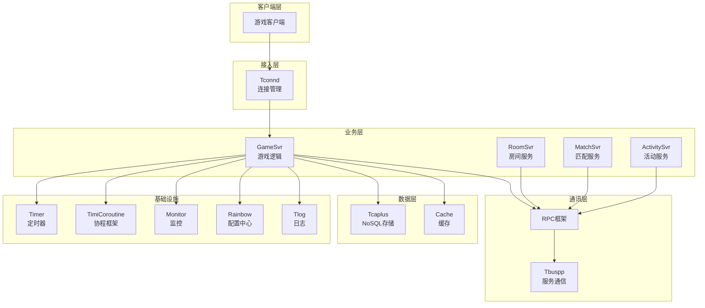

---

# 项目内部框架与中间件分析报告

## 分析内容目录

由于内容较多，我将按以下步骤分析：

1. **通讯层框架** (Tbuspp, Tconnd, RPC)
2. **数据存储层** (Tcaplus)
3. **协程/异步框架** (TimiCoroutine)
4. **定时器系统** (Timer)
5. **配置中心** (Rainbow)
6. **监控系统** (Monitor/Prometheus)
7. **日志系统** (Tlog)
8. **业务支撑框架** (Framework, ServerEngine)

---

## 1. Tbuspp 通讯层框架

### 作用
Tbuspp 是腾讯内部开发的高性能服务间通信框架，用于微服务间的消息传递，支持**按服务名路由**和**按实例ID路由**两种模式。

### 原理大致介绍
```
┌───────────────┐     ┌──────────────┐     ┌───────────────┐
│   Service A   │────▶│  Tbuspp Agent│────▶│  NameServer   │
└───────────────┘     └──────────────┘     └───────────────┘
                                                    │
                      ┌──────────────┐              │
                      │  Tbuspp Agent│◀─────────────┘
┌───────────────┐     └──────────────┘
│   Service B   │◀────────────┘
└───────────────┘
```

- **共享内存通道**：使用共享内存实现本机进程间通信，减少数据拷贝
- **服务注册/发现**：通过 NameServer 实现服务注册与发现
- **负载均衡**：支持随机、一致性哈希、主节点等路由策略

### 基本使用方法

**初始化配置** (参考 [TbusppApi.java](C:/UGit/letsgo_server/WeA/common/src/main/java/com/tencent/tbuspp/TbusppApi.java)):
```java
// 初始化 Tbuspp
Tbuspp2Api.EndpointConf conf = new Tbuspp2Api.EndpointConf();
conf.setAgentUrl("tcp://127.0.0.1:11235");
conf.setBusidStr("1.1.0");
conf.setTimeoutSec(10);

Tbuspp2Api.Endpoint ep = new Tbuspp2Api.Endpoint();
ep.open(conf);
```

**发送消息**:
```java
// 发送数据
ep.sendData(busidStr, data, offset, length, param);

// 接收数据
ep.recvData(data, offset, desc);

// 更新（处理事件）
ep.update();
```

### 高级使用方法

**路由策略配置** (参考 [Tbuspp2Api.java](C:/UGit/letsgo_server/WeA/common/src/main/java/com/tencent/tbuspp/Tbuspp2Api.java)):
```java
// 路由类型枚举
enum RouteType {
    None(0),    // 无路由
    Random(1),  // 随机路由
    MHash(3),   // 模哈希
    CHash(4),   // 一致性哈希
    Master(5);  // 主节点路由
}

// 发送带路由策略的消息
Tbuspp2Api.MsgParam param = new Tbuspp2Api.MsgParam();
param.setRouteType(RouteType.CHash.getValue());
param.setHashKey(uid);  // 使用uid作为哈希key
```

### 改进空间
1. **协议版本管理**：当前协议变更需要手动协调，建议增加自动版本协商机制
2. **监控告警**：可增加更细粒度的QPS、延迟分布监控
3. **熔断机制**：建议集成熔断降级策略

---

## 2. Tcaplus 数据存储层

### 作用
Tcaplus 是腾讯游戏云存储服务，提供高性能、高可用的 NoSQL 数据库服务，专为游戏场景优化。

### 原理大致介绍
```
┌─────────────┐     ┌─────────────┐     ┌─────────────┐
│  GameSvr    │────▶│  Tcap Proxy │────▶│  Tcap Store │
└─────────────┘     └─────────────┘     └─────────────┘
      │                                        │
      │              ┌─────────────┐           │
      └─────────────▶│  Tcapdir    │◀──────────┘
                     └─────────────┘
```

- **Generic表**：支持 key-value 结构，适合玩家数据
- **List表**：支持列表结构，适合排行榜等
- **Protobuf支持**：原生支持 PB 序列化

### 基本使用方法

**初始化** (参考 [TcaplusManager.java](C:/UGit/letsgo_server/WeA/common/src/main/java/com/tencent/tcaplus/TcaplusManager.java)):
```java
// 配置文件
tcaplus_appid=352
tcaplus_zone=40
tcaplus_signature=88A05100A76773EC
tcaplus_dir=tcp://set2.tcapdir.tcaplusdev.oa.com:9999

// 初始化
TcaplusManager.getInstance().init(appId, zoneId, signature, dirUrl);
```

**CRUD操作**:
```java
// 查询
TcaplusRsp rsp = TcaplusManager.getInstance().get(tableName, key);

// 插入
TcaplusManager.getInstance().insert(tableName, record);

// 更新
TcaplusManager.getInstance().update(tableName, record);

// 删除
TcaplusManager.getInstance().delete(tableName, key);
```

### 高级使用方法

**批量操作与协程支持**:
```java
// 批量获取
List<TcaplusRsp> rspList = TcaplusManager.getInstance().batchGet(tableName, keys);

// 协程异步操作（与TimiCoroutine集成）
@CoroutineAsync
public TcaplusRsp asyncGet(String tableName, Message key) {
    // 自动挂起协程，等待DB返回
    return TcaplusManager.getInstance().get(tableName, key);
}

// 部分键查询
TcaplusRsp rsp = TcaplusManager.getInstance().getByPartKey(tableName, partKey);
```

**表遍历**:
```java
// 遍历表
GenericTableTraverser traverser = TcaplusManager.getInstance().traverse(tableName);
while (traverser.hasNext()) {
    Record record = traverser.next();
    // 处理记录
}
```

### 改进空间
1. **二级索引**：当前查询依赖主键，建议优化部分键查询性能
2. **缓存层**：可增加本地缓存减少 DB 压力
3. **连接池管理**：优化连接复用策略

---

## 3. TimiCoroutine 协程框架

### 作用
提供类似 Go/Lua 协程的编程模型，让异步代码可以同步书写，简化游戏服务器开发。

### 原理大致介绍
```
┌─────────────────────────────────────────────┐
│               Coroutine Scheduler            │
├──────────┬──────────┬──────────┬────────────┤
│ Running  │ Waiting  │ Timeout  │   Ready    │
│ Queue    │ Queue    │ Queue    │   Queue    │
└──────────┴──────────┴──────────┴────────────┘
      │
      ▼
┌─────────────────────────────────────────────┐
│           Continuation / JKU               │
│         (JVM底层协程实现)                    │
└─────────────────────────────────────────────┘
```

- **多种实现**：支持 Continuation、VirtualThread、JKU 等多种协程实现
- **协程调度器**：时间轮+优先级队列管理协程生命周期

### 基本使用方法

**创建协程** (参考 [CoroutineContainer.java](C:/UGit/letsgo_server/WeA/timiutil/src/main/java/com/tencent/timiutil/coroutine/CoroutineContainer.java)):
```java
// 提交协程任务
CoroHandle handle = CurrentExecutorUtil.getDefaultService().submit(() -> {
    // 协程代码，可以安全地挂起
    TcaplusRsp rsp = db.get(key);  // 这里会挂起等待
    return rsp;
});

// 等待协程完成
Object result = handle.get(timeout, TimeUnit.MILLISECONDS);
```

**协程挂起与恢复**:
```java
// 在协程内挂起
CoroHandle.park(timeoutMs);

// 恢复协程
coroHandle.unpark();
```

### 高级使用方法

**协程配置** (参考 [CoroutineConfig.java](C:/UGit/letsgo_server/WeA/timiutil/src/main/java/com/tencent/timiutil/coroutine/CoroutineConfig.java)):
```java
// 配置协程实现类型
CoroutineConfig.setCoroutineType(CoroutineType.CONTINUATION);

// 配置协程池大小
CoroutineConfig.setPoolSize(1000);

// 配置超时检测
CoroutineConfig.setTimeoutCheckInterval(100);
```

**与RPC集成**:
```java
// RPC调用自动挂起协程
RpcResult result = rpcClient.getService(SomeService.class)
    .someMethod(request);
// 协程自动挂起，等待RPC响应后恢复
```

### 改进空间
1. **协程泄漏检测**：增加长时间未完成协程的监控告警
2. **调用栈追踪**：增强异步调用链的可追踪性
3. **内存优化**：大量协程时的内存占用优化

---

## 4. RPC 框架

### 作用
基于 Tbuspp 的远程过程调用框架，提供服务间方法调用的透明化。

### 原理大致介绍
```
┌─────────────────────────────────────────────────────┐
│                     RpcClient                        │
├───────────────┬───────────────┬─────────────────────┤
│  Proxy Layer  │ Filter Chain  │  Transport Layer    │
│  (动态代理)    │  (拦截器链)   │  (Tbuspp传输)       │
└───────────────┴───────────────┴─────────────────────┘
                        │
                        ▼
┌─────────────────────────────────────────────────────┐
│                     RpcServer                        │
├───────────────┬───────────────┬─────────────────────┤
│ Dispatcher    │ Service Impl  │  Transport Layer    │
│ (请求分发)     │ (服务实现)    │  (Tbuspp传输)       │
└───────────────┴───────────────┴─────────────────────┘
```

### 基本使用方法

**客户端调用** (参考 [RpcClient.java](C:/UGit/letsgo_server/WeA/common/src/main/java/com/tencent/rpc/RpcClient.java)):
```java
// 获取服务代理
SomeService service = rpcClient.getService(SomeService.class);

// 调用远程方法
RpcResult<Response> result = service.someMethod(Request.newBuilder()
    .setParam1("value")
    .build());

// 检查结果
if (result.isSuccess()) {
    Response response = result.getResult();
}
```

**服务端实现**:
```java
// 实现服务接口
public class SomeServiceImpl implements SomeService {
    @Override
    public RpcResult<Response> someMethod(Request request) {
        // 业务逻辑
        return RpcResult.success(response);
    }
}

// 注册服务
rpcServer.register(new SomeServiceImpl());
```

### 高级使用方法

**路由配置**:
```java
// 设置路由键（用于一致性哈希）
RpcRoutingUtil.setRoutingKey(request, uid);

// 指定目标实例
RpcRoutingUtil.setTargetInstance(request, instanceId);
```

**注解支持**:
```java
@RpcTimeout(seconds = 30)  // 超时配置
@RpcOneWay  // 单向调用，不等待响应
@RpcNoMailbox  // 不使用邮箱转发
public interface SomeService {
    RpcResult<Response> someMethod(Request request);
}
```

### 改进空间
1. **服务版本控制**：增加服务版本管理，支持灰度发布
2. **重试策略**：增加可配置的重试策略
3. **调用链追踪**：完善分布式追踪集成

---

## 5. Timer 定时器系统

### 作用
高性能定时器管理，支持游戏内各种定时逻辑。

### 原理大致介绍
```
┌─────────────────────────────────────────────────────┐
│                   TimerManager                       │
├─────────────────────────────────────────────────────┤
│                    TimerWheel                        │
│  ┌─────┬─────┬─────┬─────┬─────┬─────┬─────┬─────┐ │
│  │ tv0 │ tv0 │ tv0 │ ... │ tv1 │ tv1 │ ... │ tvN │ │
│  │[0]  │[1]  │[2]  │     │[0]  │[1]  │     │     │ │
│  └─────┴─────┴─────┴─────┴─────┴─────┴─────┴─────┘ │
│            ▲                                         │
│            │ tick                                    │
│         currentTick                                  │
└─────────────────────────────────────────────────────┘
```

- **时间轮**：O(1) 时间复杂度的定时器管理
- **多级时间轮**：支持长周期定时器

### 基本使用方法

**添加定时器** (参考 [TimerManager.java](C:/UGit/letsgo_server/WeA/common/src/main/java/com/tencent/nk/timer/TimerManager.java)):
```java
// 单次定时器
TimerHandle handle = timerManager.addTimer(
    TimerType.PLAYER_SAVE,
    TimerUtil.msToTick(5000),  // 5秒后执行
    true,  // 允许yield（协程挂起）
    playerObj  // 关联对象
);

// 周期定时器
TimerHandle handle = timerManager.addPeriodicTimer(
    TimerType.HEARTBEAT,
    TimerUtil.msToTick(1000),  // 间隔1秒
    true,
    playerObj
);
```

**取消定时器**:
```java
handle.cancel();
```

### 高级使用方法

**定时器注册与回调**:
```java
// 注册定时器类型处理器
@TimerRegister(timerType = TimerType.PLAYER_SAVE, paramType = TimerParamType.OBJ_PARAM)
public void onPlayerSave(TimerHandle handle) {
    Player player = (Player) handle.getObject();
    player.save();
}

// 弱引用支持 - 对象销毁时自动取消定时器
handle.getObjectWeakReference();  // 使用弱引用，避免内存泄漏
```

### 改进空间
1. **定时器统计**：增加定时器执行耗时统计
2. **优先级支持**：增加定时器优先级
3. **定时器分组**：支持批量取消某类定时器

---

## 6. Rainbow 配置中心

### 作用
腾讯七彩石配置中心，提供动态配置管理、实时配置下发能力。

### 原理大致介绍
```
┌───────────────┐     ┌───────────────┐     ┌───────────────┐
│  Rainbow SDK  │────▶│ Rainbow Server│◀────│  Admin Console │
└───────────────┘     └───────────────┘     └───────────────┘
        │                    │
        │    Pull/Push       │
        ▼                    ▼
┌───────────────┐     ┌───────────────┐
│ Local Cache   │     │    Backup     │
└───────────────┘     └───────────────┘
```

### 基本使用方法

**加载配置** (参考 [RealtimeConfig.java](C:/UGit/letsgo_server/WeA/common/src/main/java/com/tencent/rainbow/config/RealtimeConfig.java)):
```java
// 加载实时配置
RealtimeConfig.getInstance().loadConfig();

// 获取配置值
String value = RealtimeConfig.getInstance()
    .getRealtimeConfigInRainbow().getProperty("key");
```

**配置变更监听**:
```java
// 注册配置变更监听
RainbowConfigLoader.registerConfigChangeCallback(env, groupName, 
    new ConfChangeListeners.NKKvGroupListenCallback(properties));
```

### 高级使用方法

**配置表加载**:
```java
// 从Rainbow加载配置表
List<ObjectNode> tableData = RainbowConfigLoader
    .getTableGroupDataAsJson(env, groupName);

// 带版本控制的配置加载
String versionedGroupName = configVersion + "." + groupName;
```

### 改进空间
1. **灰度发布**：增加配置灰度发布能力
2. **配置回滚**：增加配置版本管理和回滚
3. **配置加密**：敏感配置加密存储

---

## 7. Monitor 监控系统

### 作用
基于 Prometheus 的指标监控系统，用于服务性能监控和告警。

### 原理大致介绍
```
┌───────────────┐     ┌───────────────┐     ┌───────────────┐
│   GameSvr     │────▶│  Exporter     │────▶│  Prometheus   │
│   Monitor.add │     │  (Pull)       │     │  (Store)      │
└───────────────┘     └───────────────┘     └───────────────┘
                                                    │
                                                    ▼
                                           ┌───────────────┐
                                           │    Grafana    │
                                           │  (Dashboard)  │
                                           └───────────────┘
```

### 基本使用方法

**上报指标** (参考 [Monitor.java](C:/UGit/letsgo_server/WeA/timiutil/src/main/java/com/tencent/timiutil/monitor/Monitor.java)):
```java
// 计数器 - 累加
Monitor.getInstance().add.total(MonitorId.attr_login_count, 1);

// 成功/失败计数
Monitor.getInstance().add.succ(MonitorId.attr_rpc_call, 1);
Monitor.getInstance().add.fail(MonitorId.attr_rpc_call, 1);

// 设置值（Gauge）
Monitor.getInstance().set.total(MonitorId.attr_online_player, count);

// 直方图观测
Monitor.getInstance().observe(MonitorId.attr_rpc_latency, latencyMs);
```

### 高级使用方法

**带标签的指标**:
```java
// 带维度标签
String[] params = new String[] { "rpcMethod", "targetServer" };
Monitor.getInstance().add.total(MonitorId.attr_rpc_call, 1, params);

// 自定义桶分布
float[] buckets = new float[] { 10, 50, 100, 200, 500, 1000 };
Monitor.getInstance().observe(MonitorId.attr_latency, value, params, buckets);
```

### 改进空间
1. **指标命名规范**：统一指标命名规范
2. **自动告警**：集成告警规则配置
3. **指标采样**：高频指标采样优化

---

## 8. Tconnd 客户端连接层

### 作用
游戏客户端连接管理，处理网络协议、会话管理、安全认证等。

### 原理大致介绍
```
┌─────────────┐     ┌─────────────┐     ┌─────────────┐
│   Client    │────▶│   Tconnd    │────▶│   GameSvr   │
│  (手机/PC)   │     │  (连接层)   │     │  (业务层)   │
└─────────────┘     └─────────────┘     └─────────────┘
                           │
                    ┌──────┴──────┐
                    │   Session   │
                    │   Manager   │
                    └─────────────┘
```

### 基本使用方法

**会话管理** (参考 [TconndManager.java](C:/UGit/letsgo_server/WeA/common/src/main/java/com/tencent/tconnd/TconndManager.java)):
```java
// 获取会话
Session session = TconndManager.getInstance().getSessionByOpenid(openid);

// 发送消息给客户端
session.sendMsg(msgType, message);

// 关闭会话
session.close();
```

### 改进空间
1. **连接限流**：增加更精细的限流策略
2. **协议压缩**：增加协议压缩支持
3. **多协议支持**：增加 WebSocket 等协议支持

---

## 9. 总体架构图



---

## 总结与改进建议

### 整体改进方向

| 领域 | 当前状态 | 建议改进 |
|------|---------|---------|
| **可观测性** | Prometheus指标 | 增加分布式追踪(Jaeger)、日志关联 |
| **容错能力** | 基础超时处理 | 增加熔断、限流、重试策略 |
| **配置管理** | Rainbow配置 | 增加配置版本控制、灰度发布 |
| **开发效率** | 协程+RPC | 增加更多语法糖、代码生成 |
| **性能优化** | 当前架构 | 协程池优化、连接池复用 |
| **安全性** | 基础认证 | 增加配置加密、访问控制 |

这套框架体系是为腾讯游戏后台量身定制的，在高并发、低延迟方面有很好的表现。如需深入了解某个具体组件，我可以进一步详细分析。