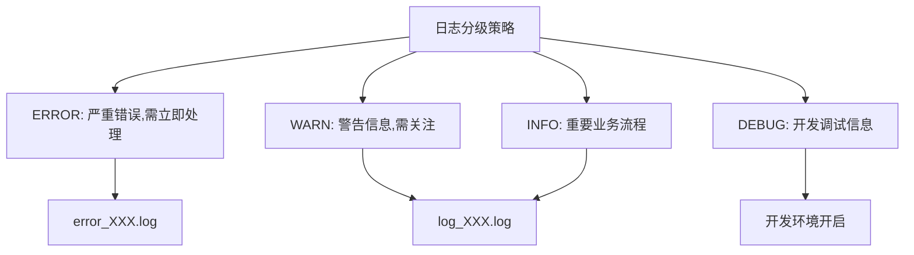
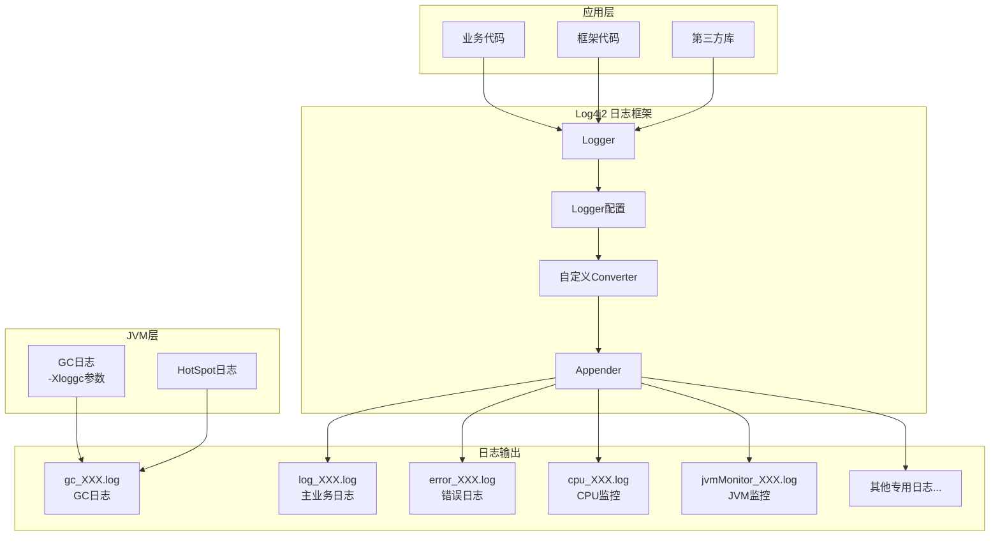

---

# 项目日志功能详细分析报告（以 gamesvr 为例）

## 一、日志系统概述

该项目使用 **Log4j2** 作为主要的 Java 日志框架，同时也支持 **Logback**（用于 tcaplusclient 等模块）。日志系统采用**分类日志**策略，将不同功能的日志写入不同文件，便于问题定位和性能分析。

---

## 二、日志文件分类详解

根据 [log4j2_666.0.10.1.xml](C:/UGit/letsgo_server/run/gamesvr/log4j2_666.0.10.1.xml) 配置，gamesvr 共配置了 **50+ 种不同功能的日志文件**：

### 2.1 核心业务日志

| 日志文件 | Logger | 功能说明 |
|---------|--------|----------|
| `log_XXX.log` | Root Logger | 主业务日志，所有未分类日志的默认输出 |
| `error_XXX.log` | Root Logger (level=ERROR) | 错误日志，只记录 ERROR 级别及以上 |
| `session_XXX.log` | Session | 会话相关日志 |
| `rollback_XXX.log` | rollbacklog | 回滚操作日志 |

### 2.2 性能监控日志

| 日志文件 | Logger | 功能说明 |
|---------|--------|----------|
| `cpu_XXX.log` | `CpuCostCoroStat` / `CpuCostStat` | **CPU 消耗统计**，记录协程/线程级别的 CPU 使用情况 |
| `jvmMonitor_XXX.log` | `MemoryMonitor` | **JVM 内存监控**，记录堆内存、GC 统计等 |
| `coroutine_XXX.log` | `CoroutineMonitorLogger` | **协程监控**，记录协程状态和性能 |
| `stopwatch_XXX.log` | `TxStopWatch` | **计时器统计**，记录方法执行耗时 |
| `methodMonitor_XXX.log` | `MethodCallStats` | **方法调用统计** |
| `micrometer_XXX.log` | `ProfileMeterRegistry` | **Micrometer 指标日志** |

### 2.3 GC 日志

GC 日志通过 **JVM 参数** 配置，在启动脚本 [start_666.0.10.1.sh](C:/UGit/letsgo_server/run/gamesvr/start_666.0.10.1.sh) 中：

```bash
-Xloggc:../log/gamesvr/gc_666.0.10.1.log.$dayTime
-XX:LogFile=../log/gamesvr/hotspot_666.0.10.1.log.$dayTime
```

| 日志文件 | 功能说明 |
|---------|----------|
| `gc_XXX.log` | **JVM GC 日志**，记录垃圾回收详情 |
| `hotspot_XXX.log` | **HotSpot VM 诊断日志** |

### 2.4 存储/数据库日志

| 日志文件 | Logger | 功能说明 |
|---------|--------|----------|
| `tcaplus_XXX.log` | `com.tencent.tcaplus` | TcaplusDB 操作日志 |
| `tcaplusClient_XXX.log` | `ClientImpl` | TcaplusDB 客户端日志 |
| `tcaplusMonitor_XXX.log` | tcaplusMonitor | TcaplusDB 监控统计 |
| `tcaplusDb_XXX.log` | tcaplusDb | TcaplusDB 数据操作日志 |
| `redis_XXX.log` | `io.lettuce.core` | Redis 操作日志 |
| `redisMonitor_XXX.log` | `CoRedisMonitor` | Redis 监控统计 |
| `redisson_XXX.log` | `org.redisson` | Redisson 客户端日志 |
| `pulsarMonitor_XXX.log` | `PulsarMonitor` | Pulsar 消息队列监控 |

### 2.5 RPC/网络日志

| 日志文件 | Logger | 功能说明 |
|---------|--------|----------|
| `rpcProfile_XXX.log` | `RpcProfiler` | RPC 调用性能分析 |
| `rpcMsgContent_XXX.log` | RpcMsgContent | RPC 消息内容日志 |
| `pkgProfile_XXX.log` | `TconndProfiler` | 网络包性能分析 |
| `grpc_XXX.log` | `shade.polaris.io.grpc.netty` | gRPC 网络日志 |
| `polaris_XXX.log` | `polaris.plugins.router` | 北极星服务发现日志 |

### 2.6 业务特性日志

| 日志文件 | Logger | 功能说明 |
|---------|--------|----------|
| `tlog_XXX.log` | `com.tencent.nk.tlog` | **TLOG 数据上报日志** |
| `attrStats_XXX.log` | attrStats | 属性统计日志 |
| `attrProfile_XXX.log` | attrProfile | 属性性能分析 |
| `attrUpdate_XXX.log` | attrUpdate | 属性更新日志 |
| `hotswap_XXX.log` | `HotSwapAgent` | **热更新/热加载日志** |
| `groovyScripts_XXX.log` | groovyScripts | Groovy 脚本执行日志 |
| `zhiyanTrace_XXX.log` | zhiyanTrace | 织燕追踪日志 |
| `zhiyanTraceDetail_XXX.log` | zhiyanTraceDetail | 织燕追踪详情 |
| `zhiyanMonitor_XXX.log` | zhiyanMonitor | 织燕监控日志 |
| `wechatLog_XXX.log` | wechatLog | 微信相关日志 |
| `wechatLogProfile_XXX.log` | wechatLogProfile | 微信性能分析日志 |
| `starpDs_XXX.log` | starpDs | StarP DS 相关日志 |
| `cocMonitor_XXX.log` | `CocSvrInfo` | COC 模式监控日志 |

### 2.7 调试/诊断日志

| 日志文件 | Logger | 功能说明 |
|---------|--------|----------|
| `lock_XXX.log` | `LockManager` | 锁管理器日志 |
| `timer_XXX.log` | timerLogger | 定时器日志 |
| `corohandleTrace_XXX.log` | corohandleTrace | 协程句柄追踪 |
| `coroWorkerTrace_XXX.log` | coroWorkerTrace | 协程工作者追踪 |
| `objspawner_XXX.log` | spawnerAppender | 对象生成器日志 |
| `objLeakMonitor_XXX.log` | objLeakMonitor | **对象泄漏监控** |
| `jolStat_XXX.log` | jolStat | JOL 统计日志 |
| `res_XXX.log` | `com.tencent.rainbow` | 资源加载日志 |
| `serviceResult_XXX.log` | serviceResult | 服务结果日志 |
| `comstat_XXX.log` | MetricStatCommon | 通用统计日志 |

### 2.8 动态路由日志

```xml
<Routing name="clientMessage" ignoreExceptions="false">
  <Routes pattern="${ctx:uid}">
    <!-- 按用户ID动态创建日志文件 -->
    <Route>
      <RollingFile name="rolling-${ctx:uid}-XXX"
        fileName="../log/cs_log/${ctx:uid}_XXX.log">
      </RollingFile>
    </Route>
  </Routes>
  <IdlePurgePolicy timeToLive="5" timeUnit="minutes"/>
</Routing>
```

这是一个按**用户 UID** 动态创建日志文件的配置，用于追踪特定用户的操作。

---

## 三、日志配置详解

### 3.1 日志格式

```
%d{yyyy-MM-dd HH:mm:ss.SSS,GMT+8} %timeoffset|%-5level|%thread|%fiberid|%creator|%traceid|%uid|%battleid|%file:%line|%method|%msg%n
```

| 占位符 | 说明 |
|--------|------|
| `%d{...}` | 时间戳（东八区） |
| `%timeoffset` | 时间偏移（自定义） |
| `%-5level` | 日志级别 |
| `%thread` | 线程名 |
| `%fiberid` | 协程/纤程ID（自定义） |
| `%creator` | 创建者（自定义） |
| `%traceid` | 追踪ID（分布式追踪） |
| `%uid` | 用户ID（自定义） |
| `%battleid` | 战斗ID（自定义） |
| `%file:%line` | 源文件和行号 |
| `%method` | 方法名 |
| `%msg` | 日志消息 |

### 3.2 滚动策略

```xml
<Policies>
  <OnStartupTriggeringPolicy />  <!-- 启动时滚动 -->
  <TimeBasedTriggeringPolicy />  <!-- 按时间滚动 -->
  <SizeBasedTriggeringPolicy size="128MB"/>  <!-- 按大小滚动 -->
</Policies>
<DefaultRolloverStrategy max="50">
  <Delete basePath="../log/gamesvr" maxDepth="1">
    <IfFileName glob="*.log" />
    <IfLastModified age="7d" />  <!-- 7天后删除 -->
  </Delete>
</DefaultRolloverStrategy>
```

- 文件大小：单文件最大 **128MB**
- 保留数量：最多 **50** 个滚动文件
- 自动清理：**7 天** 后自动删除旧日志

### 3.3 自定义 Log4j2 扩展

项目在 `packages="com.tencent.log4j2,com.tencent.timiutil.time"` 中注册了自定义扩展：

- `%timeoffset` - 时间偏移转换器
- `%fiberid` - 协程ID转换器
- `%creator` - 创建者转换器
- `%traceid` - 追踪ID转换器
- `%uid` - 用户ID转换器
- `%battleid` - 战斗ID转换器

---

## 四、核心监控实现

### 4.1 CPU 监控（CpuCostCoroStat）

文件：[CpuCostCoroStat.java](C:/UGit/letsgo_server/WeA/timiutil/src/main/java/com/tencent/timiutil/tool/CpuCostCoroStat.java)

```java
// 细粒度cpu统计信息，按Container -> JobQueue -> Job三级统计
static {
    ThreadRunner CpuCostCoroStat = new ThreadRunner("CpuCostCoroStat", () -> {
        // 每5秒统计一次，每30秒打印一次
        if (DateUtils.currentTimeSec() - lastPrintSec > PRINT_INTERVAL_SEC) {
            LOGGER.debug("Print current");
            print(preSecResult);
        }
    }).idleConfig(1, STAT_INTERVAL_MS);
}
```

### 4.2 内存/GC 监控（MemoryMonitor）

文件：[MemoryMonitor.java](C:/UGit/letsgo_server/WeA/timiutil/src/main/java/com/tencent/timiutil/tool/MemoryMonitor.java)

```java
public static void init() {
    registerGcNotify();  // 注册GC通知监听
    initMonitorThreadMap();  // 初始化线程监控
}

// 监听G1 GC事件
private static void registerGcNotify() {
    List<GarbageCollectorMXBean> gcBeans = ManagementFactory.getGarbageCollectorMXBeans();
    for (GarbageCollectorMXBean gcBean : gcBeans) {
        if (!gcBean.getName().contains("G1")) continue;
        NotificationListener listener = new VCG1NotificationListener();
        emitter.addNotificationListener(listener, new VCG1NotificationFilter(), null);
    }
}
```

---

## 五、日志使用方式

### 5.1 标准日志使用

```java
// 获取Logger
private static final Logger LOGGER = LogManager.getLogger(MyClass.class);

// 使用
LOGGER.debug("调试信息");
LOGGER.info("普通信息");
LOGGER.warn("警告信息");
LOGGER.error("错误信息", exception);
```

### 5.2 特定功能日志使用

```java
// 使用特定名称的Logger写入独立文件
private static final Logger CPU_LOGGER = LogManager.getLogger("com.tencent.timiutil.tool.CpuCostCoroStat");
private static final Logger TCAPLUS_LOGGER = LogManager.getLogger("tcaplusMonitor");
```

---

## 六、改进建议

### 6.1 日志配置改进

| 问题 | 建议 |
|------|------|
| 日志文件过多（50+种） | 考虑合并低频使用的日志，减少文件数量 |
| 所有日志级别都是 DEBUG | 生产环境应提升为 INFO 或 WARN |
| 缺少异步日志配置 | 添加 `<AsyncRoot>` 或 `<AsyncLogger>` 提升性能 |
| JVM 选项模板为空 | 应预配置标准的 GC 参数模板 |

### 6.2 建议添加异步日志

```xml
<!-- 改进方案：使用异步日志减少IO阻塞 -->
<Appenders>
  <Async name="AsyncFile">
    <AppenderRef ref="fileAppender"/>
    <LinkedTransferQueue/>
    <disruptor/>
  </Async>
</Appenders>
```

### 6.3 建议添加日志压缩

```xml
<!-- 改进方案：日志滚动时自动压缩 -->
<filePattern>../log/gamesvr/log_XXX.log.%d{yyyy-MM-dd}.%i.gz</filePattern>
```

### 6.4 建议统一 JVM GC 日志配置

```bash
# 建议的JVM GC配置（JDK 11+）
-Xlog:gc*:file=../log/gamesvr/gc_%t.log:time,level,tags:filecount=10,filesize=100m
-XX:+HeapDumpOnOutOfMemoryError
-XX:HeapDumpPath=../log/gamesvr/heapdump/
```

### 6.5 日志分级策略建议



### 6.6 监控日志采集建议

| 日志类型 | 采集建议 |
|---------|---------|
| `gc_XXX.log` | 接入 Prometheus/Grafana 监控 GC 频率和耗时 |
| `cpu_XXX.log` | 定时解析生成 CPU 热点报告 |
| `jvmMonitor_XXX.log` | 接入 APM 系统监控内存趋势 |
| `error_XXX.log` | 接入告警系统，错误即时通知 |

---

## 七、日志架构流程图



---

## 总结

该项目的日志系统设计较为完善，具有以下特点：
1. **分类明确**：不同功能的日志写入不同文件，便于问题定位
2. **扩展性强**：自定义了多种 Log4j2 转换器，支持协程ID、用户ID等追踪
3. **监控完善**：有专门的 CPU、内存、GC 监控日志
4. **动态路由**：支持按用户动态创建日志文件

主要改进空间在于：**异步日志优化、日志压缩、合并低频日志、完善 JVM 配置模板**。