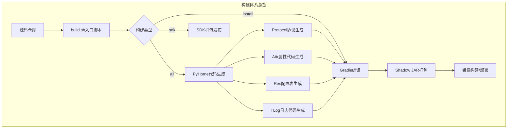
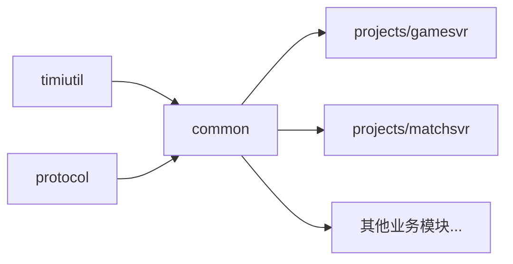
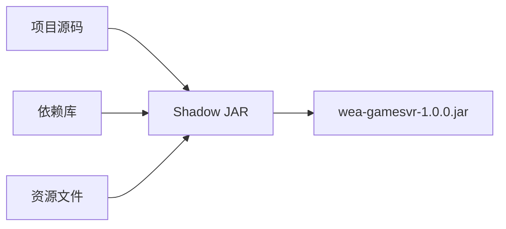
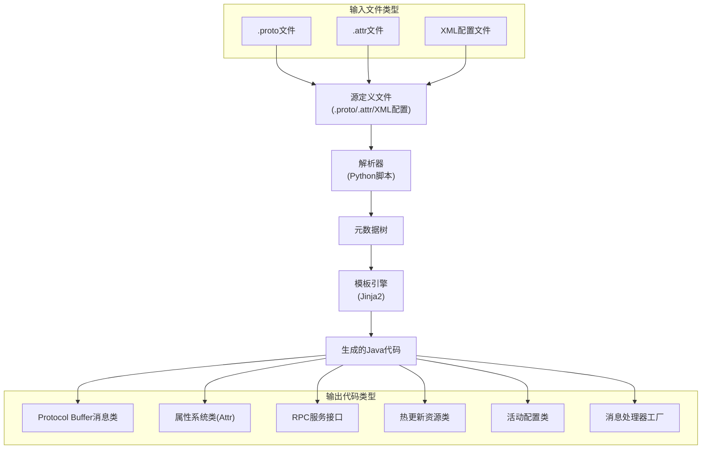
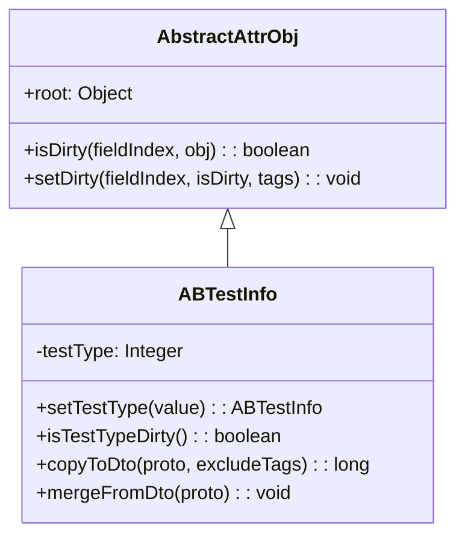
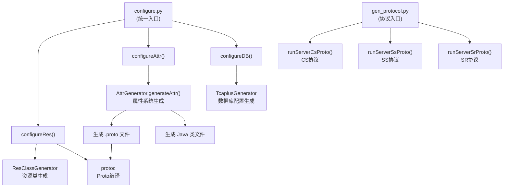
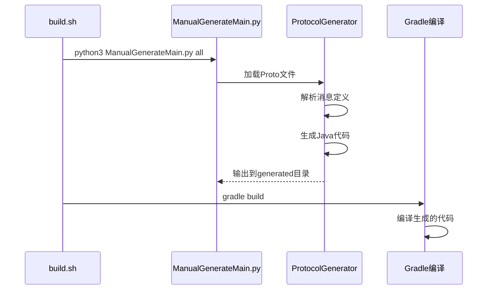
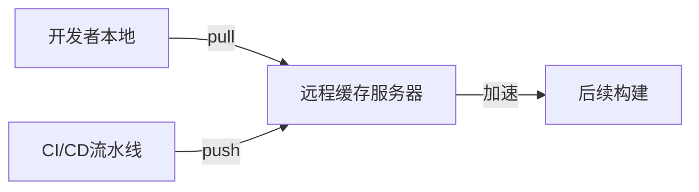

---

# 构建编译与代码生成分析

> **合并自**: 19 项目构建与编译体系分析 + 生成代码分析报告
> **涵盖范围**: Gradle多模块构建系统、Shadow JAR打包、PyHome代码生成工具链、代码生成机制详解、构建优化策略

---

## 一、构建体系概览

### 1.1 整体架构

项目采用**Gradle多模块构建系统**，结合**PyHome工具链**实现从协议定义到可执行Jar包的全流程自动化构建。



### 1.2 核心构建组件

| 组件 | 说明 | 关键文件 |
|-----|------|---------|
| **Gradle构建系统** | Java项目编译打包 | `build.gradle`、`settings.gradle` |
| **PyHome工具链** | 协议/配置代码生成 | `ManualGenerateMain.py` |
| **Shadow插件** | Fat JAR打包 | Shadow Gradle Plugin |
| **自定义插件** | 日志注入/重复检测 | `TbuLoggerLocationInjector`、`duplicate-scanner` |

---

## 二、Gradle构建系统详解

### 2.1 项目结构与模块组织

```
WeA/
├── build.gradle          # 根构建脚本
├── settings.gradle       # 模块注册与配置
├── gradle.properties     # Gradle全局参数
├── timiutil/             # 基础工具库模块
├── common/               # 核心公共模块
├── protocol/             # 协议模块（自动注册）
├── components/           # 组件模块
└── projects/             # 业务服务模块（60+）
    ├── gamesvr/          # 游戏服务器
    ├── matchsvr/         # 匹配服务器
    └── ...
```

### 2.2 模块注册机制

[settings.gradle](C:/UGit/letsgo_server/WeA/settings.gradle) 实现了灵活的模块管理：

```groovy
// 条件包含机制 - 支持通过环境变量排除模块
gradle.ext.wea_exclude_projects = System.getenv("WEA_EXCLUDE_PROJECTS")?.split(",")?.collect { it.trim() } ?: []

def includeIfNotExcluded(projName) {
    if (gradle.ext.wea_exclude_projects.contains(projName)) return
    include projName
}

// 核心模块始终包含
include 'timiutil'
include 'common'
include 'components'

// 业务模块条件包含
includeIfNotExcluded 'projects:gamesvr'
includeIfNotExcluded 'projects:matchsvr'
// ... 60+个服务模块
```

protocol模块支持**自动发现和注册**子模块：

```groovy
def autoRegisterModule(root) {
    def moduleSymbol = ["build.gradle"]
    def ignoreDirs = [".gradle", ".idea", ".git", "build"]
    file(root).eachDir { file ->
        if (ignoreDirs.contains(file.getName())) return
        file.eachFile { f ->
            if (!f.isDirectory() && moduleSymbol.contains(f.getName())) {
                include "$root:$modelName"
            }
        }
    }
}
autoRegisterModule("protocol")
```

### 2.3 Gradle配置详解

#### gradle.properties配置

```properties
org.gradle.daemon=false              # 禁用守护进程（CI推荐）
org.gradle.jvmargs=-Xmx10g -XX:MaxMetaspaceSize=1g -XX:+UseParallelGC
org.gradle.parallel=true             # 并行编译
org.gradle.configureondemand=true    # 按需配置
org.gradle.caching=true              # 构建缓存
```

#### 远程构建缓存

```groovy
buildCache {
    local { enabled = true }
    remote(HttpBuildCache) {
        url = gradle.ext.remoteCacheUrl  // http://9.135.5.170:5071/cache/
        push = ciBranch == "develop" || ciBranch ==~ /s\d+-dev/ || ciBranch ==~ /s\d+-release/
    }
}
```

### 2.4 依赖管理

#### 核心依赖关系



#### 典型模块依赖配置

```groovy
dependencies {
    api project(':timiutil')
    compileOnly project(':protocol')
    api 'com.google.protobuf:protobuf-java:3.20.1'
    api 'io.netty:netty-all:4.1.77.Final'
    api 'io.lettuce:lettuce-core:5.1.0.RELEASE'
    api 'com.tencent.tcaplus:service-api:3.62.0SP03'
    api 'com.google.guava:guava:31.1-jre'
}
```

### 2.5 编译配置

```groovy
compileJava {
    options.encoding = "UTF-8"
    options.fork = true           // Fork编译进程
    options.incremental = true    // 增量编译
    
    if (project.name == "common") {
        options.forkOptions.jvmArgs = ["-Xmx8g"]  // common模块需要更多内存
    } else {
        options.forkOptions.jvmArgs = ["-Xmx2g"]
    }
}
```

---

## 三、Shadow JAR打包机制

### 3.1 原理说明

Shadow插件将项目及其所有依赖打包成一个**Fat JAR**（Uber JAR），使应用作为独立可执行文件运行。



### 3.2 配置详解

```groovy
shadowJar {
    setZip64(true)  // 支持大于65535个文件
    manifest {
        attributes(
            'Multi-Release': "true",
            'Implementation-Title': "${project.archivesBaseName}",
            'Implementation-Vendor': "Tencent",
        )
    }
}
```

---

## 四、自定义Gradle插件与任务

### 4.1 TbuLoggerLocationInjector

编译时自动注入日志位置信息，用于日志追踪和调试。

### 4.2 Duplicate-Scanner

检测JAR包中的重复类，避免类路径冲突：

```groovy
duplicateScanner {
    failOnDuplicates = true
    excludePatterns = ['module-info', 'META-INF.*', 'com\\.tencent\\.asm\\..*']
    includePatterns = ['com\\.tencent\\..*']
}
```

### 4.3 exportDependencies

导出项目依赖树为JSON格式，用于依赖分析。构建完成后自动执行。

---

## 五、代码生成机制详解

### 5.1 代码生成架构概览

项目采用 **模板驱动 + 元数据解析** 的代码生成机制，从配置文件到Java代码实现自动化转换。



### 5.2 代码生成来源

| 来源 | 位置 | 说明 |
|------|------|------|
| **Protocol Buffers (.proto)** | 项目 `proto` 目录 | 定义消息结构、枚举类型、服务接口和自定义选项 |
| **属性定义文件 (.attr)** | — | 支持 `@import`、`@oneof`、`@listenable`、`@root` 等标签 |
| **XML 配置文件** | — | 资源配置、消息类型映射、热更新资源配置 |

### 5.3 生成代码类型详解

#### 5.3.1 Protocol Buffer 消息类

- **生成器**: `protoc` 编译器
- **文件头**: `// Generated by the protocol buffer compiler. DO NOT EDIT!`
- **字段映射**: `int32`→`int`, `string`→`String`, `repeated`→`List<>`, `message`→嵌套类

#### 5.3.2 属性系统类 (Attr)

- **生成器**: `attr_builder` (Python脚本)
- **基类**: `AbstractAttrObj`
- **核心功能**:

```java
public final class ABTestInfo extends AbstractAttrObj {
    private Integer testType = 0;
    
    // Getter/Setter
    public ABTestInfo setTestType(int value) { ... }
    public int getTestType() { return testType; }
    
    // Dirty 标记（脏数据检测）
    public boolean isTestTypeDirty() { ... }
    
    // DTO 转换
    public long copyToDto(Builder proto, BitSet excludeTags) { ... }
    public void mergeFromDto(proto_ABTestInfo proto) { ... }
    
    // 数据库/服务器同步
    public long copyToDb(Builder proto) { ... }
    public long copyToSs(Builder proto) { ... }
}
```



#### 5.3.3 RPC 服务接口

- **生成器**: `protoc-gen-ss` (Python插件)
- **Proto到Java映射**:

| Proto 定义 | Java 生成 |
|-----------|----------|
| `service CommonService` | `interface CommonService` |
| `rpc Test(TestReq) returns (TestRes)` | `RpcResult<TestRes.Builder> test(TestReq.Builder req)` |
| `option (rpc_timeout) = 3` | `@RpcTimeout(seconds = 3)` |
| `option (rpc_one_way) = true` | `@RpcOneWay` |

```java
public interface CommonService {
    static CommonService get() {
        return Framework.getInstance().getLocalEngine().getRpcClient().getService(CommonService.class);
    }
    
    @RpcTimeout(seconds = 3)
    default RpcResult<TestRes.Builder> test(TestReq.Builder req) throws RpcException;
    
    @RpcOneWay
    default Void rpcApiSendEvent(RpcApiSendEventReq.Builder req) throws RpcException;
}
```

#### 5.3.4 消息助手类 (MsgHelper)

- **生成器**: 模板引擎
- **文件头**: `Generated by AdminMsgHelper.java.template, DO NOT EDIT!`

#### 5.3.5 活动配置工具类

- **生成器**: `gen_activity_config.py`
- **机制**: 解析Proto文件中的 `ActivityType` 枚举，根据 `svrType` 选项分类生成

```java
public class ActivityConfigUtilAutoGen {
    static {
        addActivitySvrObj(new ActivityConfigObject(ActivityType.ATWish, false, false));
        addGameSvrObj(new ActivityConfigObject(ActivityType.ATTask, false, false));
    }
}
```

### 5.4 代码生成工具链



### 5.5 生成目录结构

```
WeA/common/src/generated/main/java/com/tencent/wea/
├── protocol/     # CS/SS通讯协议
├── attr/         # 属性定义
├── res/          # 配置表数据类
├── rpc/service/  # RPC服务接口
├── activity/     # 活动配置工具
├── adminpb/      # 管理消息助手
└── tlog/         # 流水日志
```

### 5.6 生成代码作用汇总

| 代码类型 | 主要作用 |
|---------|---------|
| **Protocol Buffer类** | 网络通信序列化/反序列化、跨语言数据交换 |
| **属性系统类(Attr)** | 玩家数据管理、脏数据检测、同步控制、数据库存储 |
| **RPC服务接口** | 微服务间通信、服务调用抽象 |
| **消息助手类** | 消息转发、协议处理简化 |
| **活动配置类** | 活动类型管理、服务器归属配置 |
| **热更新资源类** | 运行时资源动态加载、配置热更新 |

---

## 六、PyHome代码生成流程

### 6.1 完整构建流程

```bash
cd letsgo_server
sh build.sh install all

# 执行流程：
# 1. 克隆letsgo_common仓库（如果不存在）
# 2. 执行PyHome生成所有代码
# 3. 执行Gradle编译
# 4. 复制产物到运行目录
```

### 6.2 Protocol生成流程



### 6.3 注意事项

- ✅ 提交Proto源文件到Git
- ❌ **不提交** generated目录下的生成代码
- ✅ 本地生成验证编译通过
- ✅ CI/CD流水线自动生成代码

---

## 七、构建优化策略

### 7.1 编译性能优化

| 优化策略 | 配置 | 效果 |
|---------|-----|------|
| **并行编译** | `org.gradle.parallel=true` | 多模块并行编译 |
| **按需配置** | `org.gradle.configureondemand=true` | 只配置相关项目 |
| **增量编译** | `options.incremental=true` | 只编译变更文件 |
| **Fork编译** | `options.fork=true` | 独立JVM编译 |
| **构建缓存** | `org.gradle.caching=true` | 复用任务输出 |

### 7.2 远程缓存优化



- `develop`/`s*-dev`/`s*-release`分支：推送缓存
- 其他分支：只读缓存

### 7.3 选择性构建

```bash
export WEA_EXCLUDE_PROJECTS="projects:simulator4j,projects:privatesvr"
sh WeA/build.sh install --lite
```

---

## 八、SDK发布与版本管理

### 8.1 SDK构建流程

```bash
sh build.sh install sdk
# 1. 生成所有协议代码（带--isolation选项）
# 2. 编译timiutil、protocol、common模块
# 3. 发布到Maven仓库
```

### 8.2 版本管理

优先级：命令行参数 > `WEA_APP_VERSION` > `WEA_SDK_VERSION`，格式 `major.minor.patch`

---

## 九、测试与质量保障

### 9.1 JUnit测试

```groovy
test {
    jvmArgs "-Xms512M", "-Xmx1024M", "-XX:+UseG1GC"
    ignoreFailures = true
}
```

### 9.2 JMH性能基准测试

```groovy
task jmh(type: JavaExec) {
    classpath = sourceSets.jmh.runtimeClasspath
    main = 'org.openjdk.jmh.Main'
    args '-jvmArgsPrepend', '-Xmx4096m'
    args '-rf', 'json'
}
```

### 9.3 代码覆盖率 (JaCoCo)

```groovy
jacocoTestReport {
    classDirectories.from = fileTree(dir: 'build/classes/java/main', includes: [
        "com/tencent/nk/playerservice/cshandler/**/*",
        "com/tencent/nk/rpc/service/*",
    ])
}
```

---

## 十、常用构建命令

| 命令 | 说明 |
|-----|------|
| `sh build.sh install all` | 全量构建（生成+编译+部署） |
| `sh build.sh install` | 仅编译和部署 |
| `sh build.sh install sdk` | 构建SDK |
| `sh WeA/build.sh clean` | 清理构建产物 |
| `sh WeA/build.sh test all` | 运行所有测试 |
| `sh WeA/build.sh dep all` | 查看依赖树 |
| `sh WeA/build.sh install --scan` | 启用构建扫描 |
| `sh WeA/build.sh install --profile` | 生成性能报告 |

---

## 十一、改进空间

### 11.1 当前问题

| 问题 | 描述 | 影响 |
|-----|------|-----|
| **编译时间长** | 60+模块全量编译耗时较长 | 开发效率 |
| **生成代码管理** | generated目录依赖CI生成 | 本地调试不便 |
| **缓存命中率** | 远程缓存仅特定分支推送 | 缓存利用率低 |
| **依赖版本管理** | 部分依赖版本硬编码 | 升级维护困难 |

### 11.2 优化建议

| 方向 | 建议 |
|------|------|
| **构建加速** | 引入Gradle Enterprise、配置缓存（Gradle 8.1+）、模块化拆分提高并行度 |
| **依赖管理** | 使用Version Catalog统一管理版本(`gradle/libs.versions.toml`) |
| **生成代码本地化** | 支持选择性生成 `python3 ManualGenerateMain.py protocol --module=gamesvr` |
| **缓存策略** | 扩大推送范围到feature/hotfix分支 |

---

## 十二、总结

### 构建体系特点

| 特点 | 说明 |
|-----|------|
| **多模块管理** | 60+服务模块统一管理，支持条件包含和自动注册 |
| **代码生成自动化** | PyHome工具链实现协议/配置/属性的全自动生成 |
| **构建优化完善** | 并行编译、增量编译、远程缓存等多重优化 |
| **打包机制成熟** | Shadow JAR实现Fat JAR打包，支持独立部署 |
| **质量保障集成** | 测试框架、代码覆盖率、重复检测等工具集成 |
| **多源生成** | 支持Proto、Attr、XML等多种输入格式 |
| **一致性保证** | 协议定义与代码实现严格同步，模板驱动减少手动错误 |

### 代码生成核心价值

1. **模板驱动**: Jinja2模板引擎确保代码风格统一
2. **自动化链路**: 从定义到代码实现完全自动化
3. **分层设计**: 属性系统、协议系统、数据库系统各自独立
4. **增量更新**: 只有内容变化时才重新生成

### 最佳实践

1. **日常开发**：使用`sh build.sh install`快速编译，配合IDE增量编译
2. **协议变更**：修改Proto后执行`ManualGenerateMain.py protocol`重新生成
3. **配置变更**：修改Excel后执行`ManualGenerateMain.py res`重新生成
4. **版本发布**：CI/CD流水线自动执行`build.sh install all`全量构建
5. **SDK发布**：使用`build.sh install sdk`构建并发布到Maven仓库