# 20. CI/CD流水线与自动化部署分析

---

## 📋 概述

本文档详细分析项目的CI/CD（持续集成/持续部署）流水线架构，涵盖从代码提交到生产部署的完整自动化流程，包括蓝盾CI系统集成、自动化测试、质量门禁、制品管理、配置分发、灰度发布及多环境管理等核心能力。

---

## 一、CI/CD流水线架构原理

### 1.1 整体架构设计

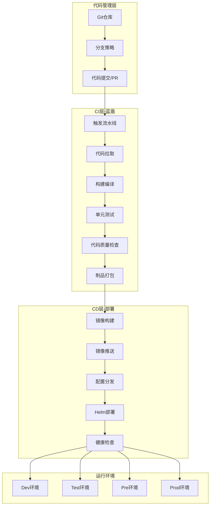

### 1.2 核心组件说明

| 组件 | 作用 | 技术实现 |
|------|------|----------|
| 蓝盾CI | 流水线编排与执行 | BK-CI YAML配置 |
| Gradle | Java项目构建 | 多模块依赖管理 |
| Docker | 容器镜像构建 | Dockerfile |
| Helm | K8s应用部署 | Chart模板 |
| 七彩石 | 配置中心管理 | Rainbow API |
| 镜像仓库 | 制品存储 | mirrors.tencent.com |

---

## 二、蓝盾CI流水线详解

### 2.1 流水线配置结构

项目使用YAML格式定义流水线，核心配置文件位于 `流水线/Java服务更新.yaml`：

```yaml
version: v3.0
name: 【服务器】测试环境JAVA更新
on:
  manual:           # 手动触发
    name: 手动触发
    can-skip-step: true
  remote:           # 远程触发（支持API调用）
    name: 远程触发
    enable: enabled

variables:
  branch:           # 代码分支
    value: develop
  startMode:        # 启动模式：reload/restart/patch
    value: reload
  env:              # 目标环境
    value: letsgo-press
  serverList:       # 服务器列表（多选）
    value: "gamesvr,roomsvr,matchsvr..."
```

### 2.2 流水线阶段划分

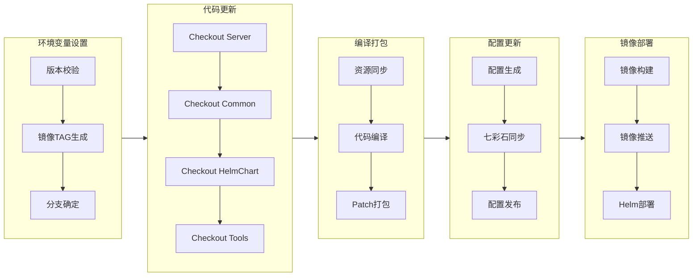

### 2.3 启动模式详解

流水线支持三种启动模式，适应不同的更新场景：

| 模式 | 说明 | 适用场景 | 影响范围 |
|------|------|----------|----------|
| `reload` | 热加载配置 | 配置变更 | 无需重启，配置实时生效 |
| `restart` | 重启Pod更新 | 代码变更 | Pod重启，服务短暂中断 |
| `patch` | 热更新代码 | 紧急修复 | 在线热更新class文件 |

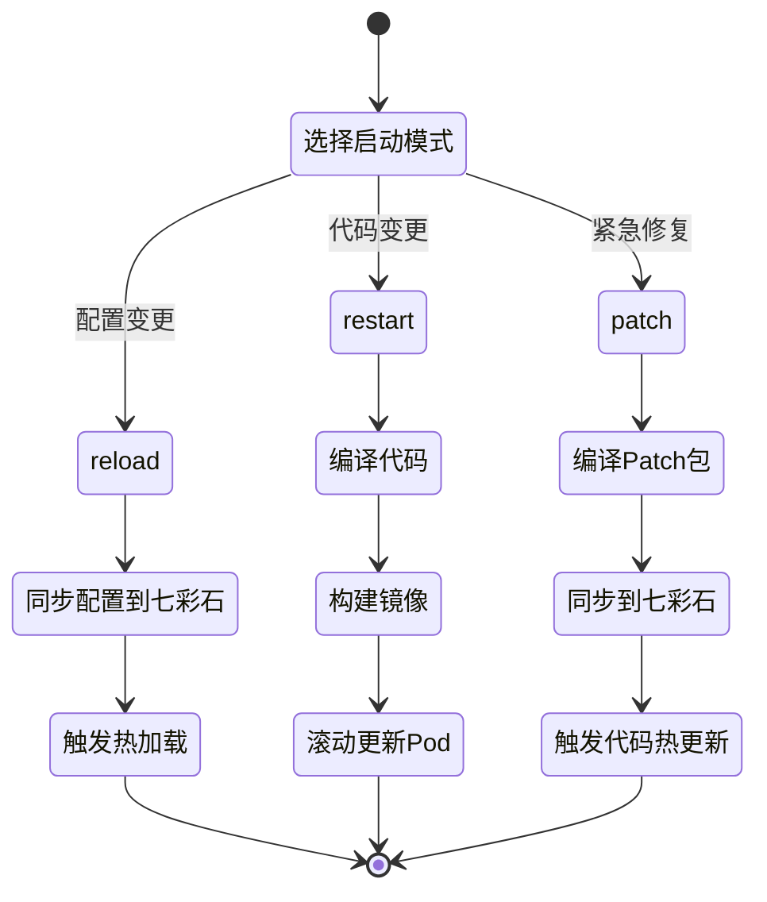

---

## 三、构建编译流程

### 3.1 Gradle构建体系

项目使用Gradle 8.10.2进行构建，支持多模块依赖管理：

```bash
# 构建入口脚本 WeA/build.sh
gradle -b build.gradle build -x test ${BUILD_OPTIONS} ${VC_GRADLE_DAEMON_FLAG}
```

#### 核心构建配置

```groovy
// WeA/build.gradle
buildscript {
    repositories {
        maven { url "https://mirrors.tencent.com/nexus/repository/maven-public/" }
    }
    dependencies {
        classpath 'com.tencent.tbu:tbu-gradle-plugins:20250618180034'
        classpath 'com.tencent.wea:plugins:1.0.0'
    }
}

// 远程构建缓存配置
buildCache {
    local { enabled = true }
    remote(HttpBuildCache) {
        url = gradle.ext.remoteCacheUrl
        allowInsecureProtocol = true
        push = gradle.ext.isPushRemoteCache  // 只有develop和release分支推送缓存
    }
}
```

#### 模块依赖结构

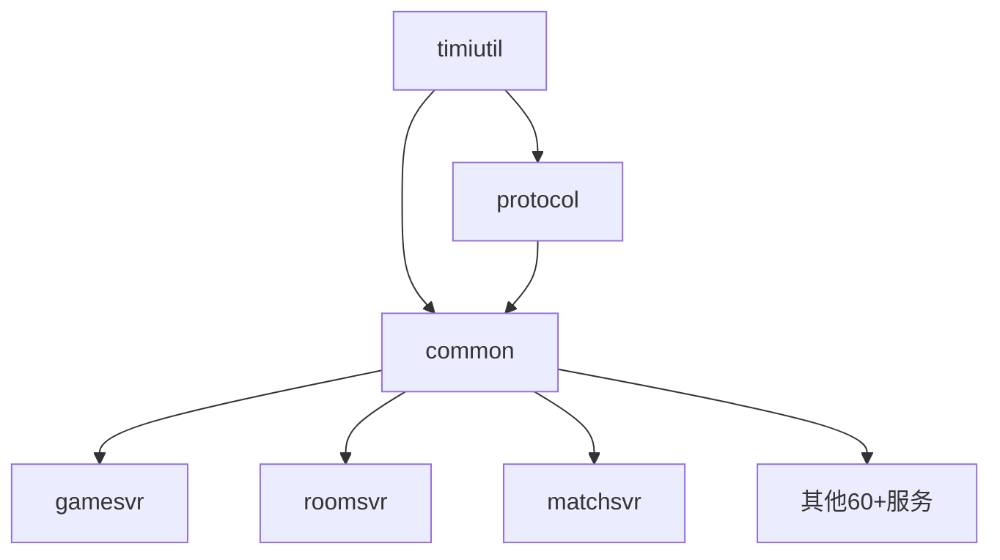

### 3.2 协议代码生成

协议生成是构建流程的关键环节，由PyHome工具链完成：

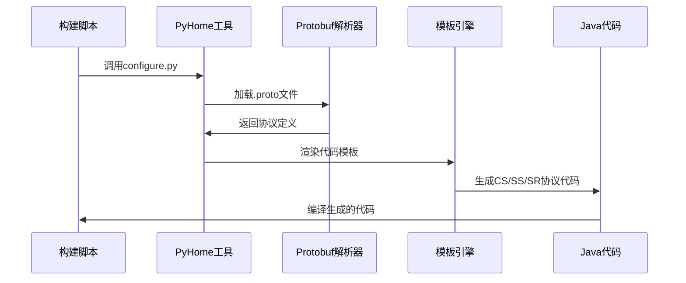

---

## 四、自动化测试体系

### 4.1 测试框架集成

```groovy
// 测试配置
test {
    useJUnitPlatform()
    systemProperty "jna.library.path", "./build/libs"
}

// Jacoco覆盖率配置
jacoco {
    toolVersion = "0.8.8"
}

jacocoTestReport {
    reports {
        xml.required = true
        html.required = true
        xml.destination = file("$buildDir/reports/jacocoXml.xml")
    }
}
```

### 4.2 测试执行命令

```bash
# 运行单元测试
gradle -b build.gradle :projects:gamesvr:test --tests "com.tencent.*"

# 生成测试报告
gradle -b build.gradle jacocoTestReport --info

# 代码覆盖率统计
gradle -b build.gradle codeCoverage --info
```

### 4.3 测试类型矩阵

| 测试类型 | 执行阶段 | 工具 | 覆盖范围 |
|----------|----------|------|----------|
| 单元测试 | 构建时 | JUnit5 | 方法级别 |
| 集成测试 | 构建后 | Groovy脚本 | 模块交互 |
| 压力测试 | 部署后 | 自研框架 | 性能基线 |
| 场景测试 | 发布前 | Simulator4j | 业务流程 |

---

## 五、代码质量门禁

### 5.1 Checkstyle代码检查

```bash
# 构建时自动执行Checkstyle检查
gradle -b build.gradle build -x test -x checkstyleTest
```

### 5.2 质量门禁机制

流水线中通过质量红线机制实现门禁控制：

```yaml
# 流水线中的质量门禁设置
- name: compile
  uses: linuxScript@1.*
  with:
    script: |
      # 设置自定义指标
      # setGateValue "CodeCoverage" $myValue
      # 然后在质量红线选择相应指标和阈值
      # 若不满足，流水线在执行时将会被卡住
```

### 5.3 代码覆盖率报告

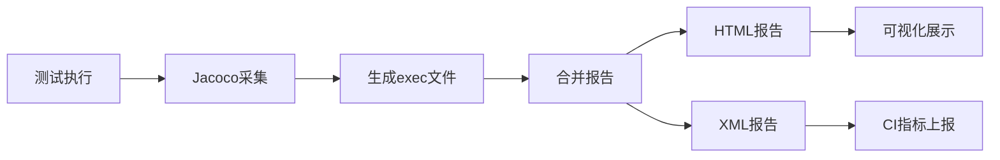

---

## 六、制品管理与版本控制

### 6.1 镜像版本命名规范

```bash
# 镜像TAG生成规则
IMAGE_TAG="${BK_CI_START_USER_NAME}-${DATE}-${BK_CI_BUILD_NUM}-${env}-${WEA_APP_VERSION}"
# 示例: zhangsan-20251215-123-letsgo-press-1.2.3
```

### 6.2 制品发布流程

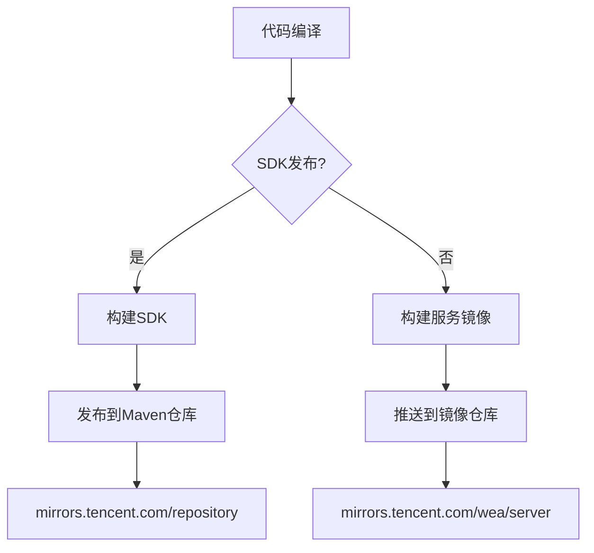

### 6.3 SDK发布配置

```groovy
// WeA/common/build.gradle
if (project.hasProperty('publish_sdk')) {
    apply plugin: 'maven-publish'
    
    group = 'com.tencent.wea'
    publishing {
        publications {
            mavenJava(MavenPublication) {
                artifact "build/libs/wea-${project.name}-${project.version}.jar"
            }
        }
        repositories {
            maven (gradle.ext.weaSdkRepoConfig)
        }
    }
}
```

---

## 七、配置分发流程（七彩石配置中心）

### 7.1 七彩石集成架构

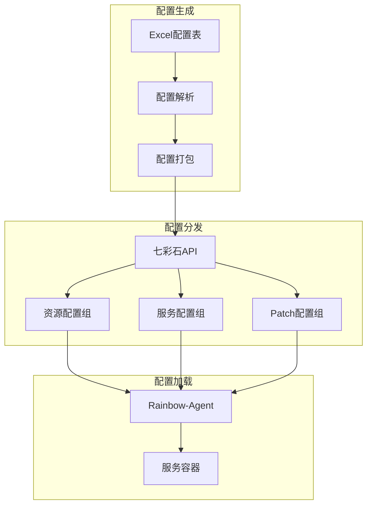

### 7.2 配置同步脚本

```python
# 流水线中设置七彩石变量
import load_config

config_dict = load_config.get_config_dict("${env}")
print("setEnv RAINBOW_APP_ID {}".format(config_dict["common"]["rainbowAppID"]))
print("setEnv RAINBOW_USER_ID {}".format(config_dict["common"]["rainbowUserID"]))
print("setEnv RAINBOW_SECRET_KEY {}".format(config_dict["common"]["rainbowSecretKey"]))
```

### 7.3 配置API调用

```python
# 七彩石API调用示例
def request_rainbow_api(url_path, body, timeout=30):
    # 环境变量验证
    app_id = os.getenv("RAINBOW_APP_ID")
    user_id = os.getenv("RAINBOW_USER_ID")
    api_key = os.getenv("RAINBOW_API_KEY")
    
    # 生成签名
    signature = gen_sign(SignatureParams(
        version=DEFAULT_VERSION,
        app_id=app_id,
        user_id=user_id,
        timestamp=int(time.time()),
        nonce=str(uuid.uuid4())
    ), api_key)
    
    # 发送请求
    response = requests.post(full_url, headers=headers, data=body, timeout=timeout)
    return response.json()
```

---

## 八、容器镜像构建与部署

### 8.1 Docker镜像构建

```yaml
# 流水线镜像构建步骤
- name: 构建并推送Docker镜像
  uses: DockerBuildAndPushImage@3.*
  with:
    targetImage: mirrors.tencent.com/wea/server/java-all
    targetTicketId: mirror_repo_secret
    targetImageTag: "${IMAGE_TAG}"
```

### 8.2 镜像构建前置脚本

```bash
# before_build.sh
cd ${WORKSPACE}/run/deployment/java
if [[ "${isOverseaBuild}" == "true" ]]; then
    sh before_build.sh isOverseaBuild
else
    sh before_build.sh
fi
```

### 8.3 基础镜像层级

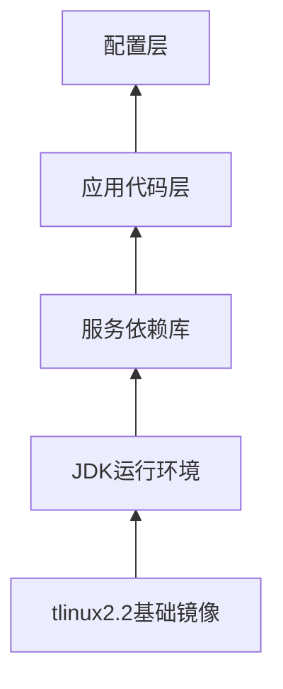

---

## 九、Helm Chart部署体系

### 9.1 Chart目录结构

```
helm_chart_release/
├── init-services/          # 初始化服务
│   └── charts/
│       ├── service-monitor/
│       ├── tbuspp-mesh-init/
│       └── wea-pod-monitor/
├── template/               # 模板目录
│   ├── chart/
│   │   ├── java/          # Java服务模板
│   │   ├── dsa/           # DSA服务模板
│   │   ├── dsc/           # DSC服务模板
│   │   └── tconnd/        # Tconnd服务模板
│   └── values/            # 配置值模板
└── update.py              # Chart生成脚本
```

### 9.2 GameStatefulSet资源定义

```yaml
# Java服务K8s资源模板
apiVersion: tkex.tencent.com/v1alpha1
kind: GameStatefulSet
metadata:
  name: {{ include "chart_server.fullname" . }}
spec:
  serviceName: {{ include "chart_server.fullname" . }}
  replicas: {{ .Values.replicaCount }}
  updateStrategy:
    type: RollingUpdate
    rollingUpdate:
      partition: {{ .Values.rollingUpdate.partition }}
      maxUnavailable: {{ .Values.maxUnavailable }}
  template:
    spec:
      containers:
        - name: {{ .Chart.Name }}
          image: "{{ .Values.image.repository }}:{{ .Values.image.tag }}"
          readinessProbe:
            exec:
              command:
                - /bin/bash
                - -c
                - su user00 -c /data/run/*/startCheckCmd_*.sh
          env:
            - name: ENV_KEY
              value: '{{.Values.envKey}}'
            - name: WORLD_ID
              value: '{{.Values.worldID}}'
            - name: SERVER_NAME
              value: ${config["server_name"]}
```

### 9.3 多容器Pod架构

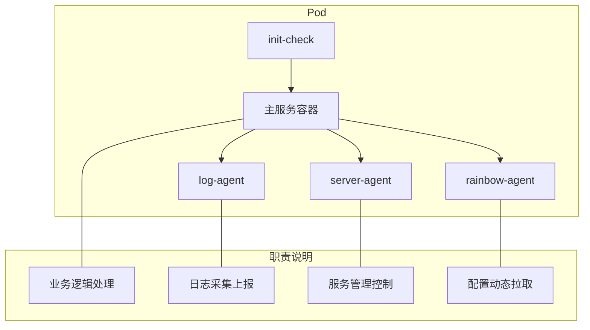

### 9.4 Chart生成脚本

```python
# helm_chart_release/update.py
def gen_config(env_key):
    pool_dict = load_pool_config()
    custom_config = GetConfigDict({'key': env_key})
    
    for svr_name in custom_config['helm']:
        config_dict = {}
        config_dict['worldID'] = pool_dict['env_pool'][env_key]['world']
        config_dict['zoneID'] = pool_dict['env_pool'][env_key]['zone']
        
        # 生成values.yaml
        tmpl_file = "template/values/{}-values.yaml.tmpl".format(tmpl_svr)
        valuestmpl = Template(filename=tmpl_file)
        result = valuestmpl.render(config=config_dict)
        
        # 写入Chart目录
        with open(f"chart/{svr_name}/values.yaml", 'w') as f:
            f.write(result)
```

---

## 十、灰度发布与回滚机制

### 10.1 滚动更新策略

```yaml
# GameStatefulSet更新策略
updateStrategy:
  type: RollingUpdate
  rollingUpdate:
    partition: {{ .Values.rollingUpdate.partition }}  # 分区更新
    maxUnavailable: {{ .Values.maxUnavailable }}      # 最大不可用数
```

### 10.2 灰度发布流程

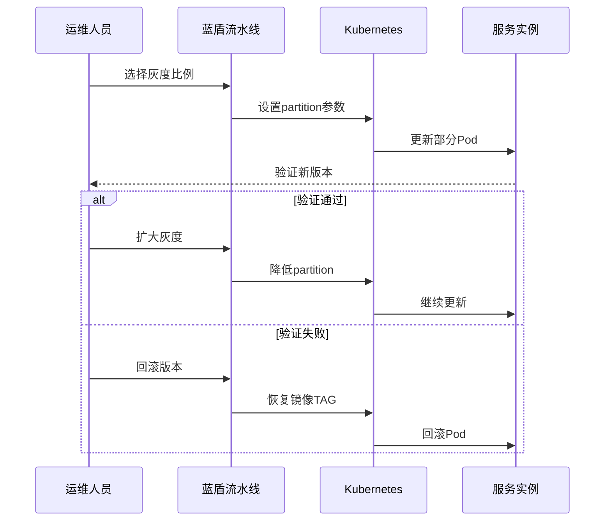

### 10.3 回滚机制

```bash
# 通过Helm回滚
helm rollback <release-name> <revision>

# 通过K8s原生命令
kubectl rollout undo deployment/<deployment-name>

# 通过流水线回滚
# 重新执行流水线，选择之前的镜像TAG
```

### 10.4 HookRun前置检查

```yaml
# 删除/更新前的Hook检查
preDeleteUpdateStrategy:
  hook:
    templateName: {{ include "chart_server.fullname" . }}
```

---

## 十一、多环境管理

### 11.1 环境划分

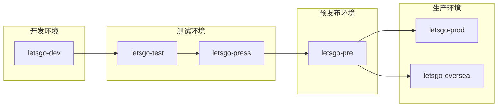

### 11.2 环境配置隔离

```python
# 通过pool.yaml管理环境配置
env_pool:
  letsgo-dev:
    world: 1
    zone: 1
  letsgo-test:
    world: 2
    zone: 1
  letsgo-press:
    world: 3
    zone: 1
  letsgo-prod:
    world: 10
    zone: 1
```

### 11.3 环境变量注入

```yaml
# Pod环境变量配置
env:
  - name: ENV_KEY
    value: '{{.Values.envKey}}'
  - name: WORLD_ID
    value: '{{.Values.worldID}}'
  - name: ZONE_ID
    value: '{{.Values.zoneID}}'
  - name: RAINBOW_APP_ID
    value: '{{.Values.rainbowAppID}}'
```

---

## 十二、健康检查与监控

### 12.1 Readiness探针

```yaml
readinessProbe:
  periodSeconds: 5
  exec:
    command:
      - /bin/bash
      - -c
      - su user00 -c /data/run/*/startCheckCmd_*.sh
```

### 12.2 服务监控集成

```yaml
# PodMonitor配置
apiVersion: monitoring.coreos.com/v1
kind: PodMonitor
metadata:
  name: wea-game-monitor
spec:
  selector:
    matchLabels:
      jvm_monitor: prom
      game_monitor: prom
  podMetricsEndpoints:
    - port: agent-port
```

### 12.3 告警通知

```bash
# 部署失败告警（企业微信机器人）
if [ -n "$gen_res" ]; then
    curl http://in.qyapi.weixin.qq.com/cgi-bin/webhook/send?key=$ALARM_WECHAT_ROBOT_KEY \
         -d "{\"msgtype\":\"text\",\"text\":{\"content\":\"配置生成失败: $gen_res\"}}"
fi
```

---

## 十三、进阶使用技巧

### 13.1 并行构建优化

```groovy
// settings.gradle中配置远程构建缓存
buildCache {
    local { enabled = true }
    remote(HttpBuildCache) {
        url = "http://9.135.5.170:5071/cache/"
        push = ciBranch == "develop" || ciBranch ==~ /s\d+-dev/
    }
}
```

### 13.2 增量编译策略

```bash
# 只编译变更的模块
gradle -b build.gradle :projects:gamesvr:build -x test

# 使用--parallel参数并行编译
gradle -b build.gradle build -x test --parallel
```

### 13.3 Patch热更新

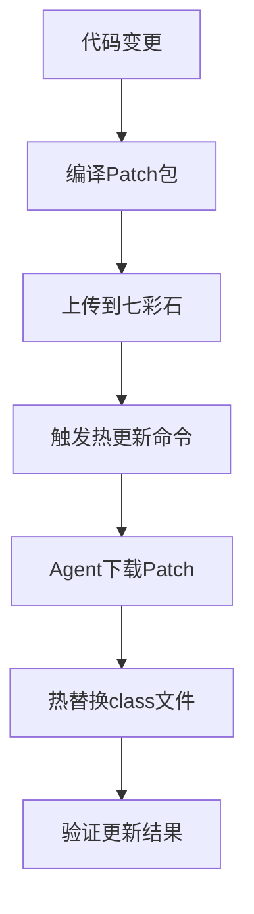

### 13.4 条件执行流水线

```yaml
# 根据启动模式条件执行
- name: compile
  if:
    mode: NOT_RUN_WHEN_ALL_PARAMS_MATCH
    params:
      startMode: reload  # reload模式时跳过编译
```

---

## 十四、常见问题与解决方案

### 14.1 构建失败处理

| 问题类型 | 可能原因 | 解决方案 |
|----------|----------|----------|
| 编译失败 | 依赖冲突 | 检查gradle依赖树，排除冲突 |
| 测试失败 | 环境问题 | 检查测试数据，隔离测试环境 |
| 镜像推送失败 | 网络问题 | 重试或检查仓库凭证 |
| 部署超时 | 资源不足 | 检查K8s资源配额 |

### 14.2 配置同步问题

```python
# 错误码处理
ret_code = response.get("ret_code")
if ret_code == 0:
    return response  # 成功
elif ret_code == 1010:
    logging.debug("无配置修改")  # 正常情况
else:
    raise Exception(f"API错误: {ret_code}")
```

### 14.3 回滚操作指南

```bash
# 1. 确认当前版本
kubectl get pods -l app=gamesvr -o jsonpath='{.items[0].spec.containers[0].image}'

# 2. 查看历史版本
helm history <release-name>

# 3. 回滚到指定版本
helm rollback <release-name> <revision>

# 4. 验证回滚结果
kubectl rollout status deployment/<deployment-name>
```

---

## 十五、改进空间与建议

### 15.1 流水线优化建议

| 改进方向 | 现状 | 建议 | 预期收益 |
|----------|------|------|----------|
| 构建缓存 | 仅develop分支推送 | 扩展到feature分支 | 减少30%构建时间 |
| 并行测试 | 串行执行 | 引入测试分片 | 减少50%测试时间 |
| 制品版本 | 基于时间戳 | 语义化版本 | 提升可追溯性 |
| 部署策略 | 手动灰度 | 自动金丝雀 | 降低发布风险 |

### 15.2 质量门禁增强

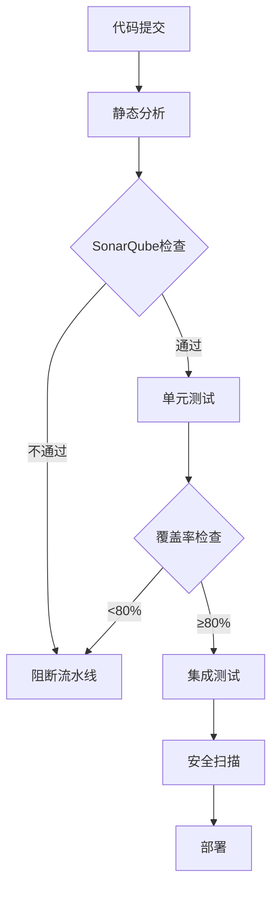

### 15.3 GitOps实践建议

```yaml
# 推荐的GitOps工作流
代码仓库(letsgo_server) --> 配置仓库(letsgo_helm_chart)
                    ↓
                ArgoCD自动同步
                    ↓
              Kubernetes集群
```

### 15.4 可观测性增强

1. **链路追踪**: 集成Jaeger/Zipkin，实现全链路追踪
2. **日志聚合**: 统一日志格式，接入ELK/Loki
3. **指标监控**: 完善Prometheus指标，建立SLO/SLI
4. **告警优化**: 分级告警，减少噪音

### 15.5 安全增强建议

| 安全方面 | 当前状态 | 建议措施 |
|----------|----------|----------|
| 镜像扫描 | 无 | 集成Trivy/Clair |
| 密钥管理 | 环境变量 | 使用Vault/SOPS |
| 网络策略 | 开放 | 实施NetworkPolicy |
| RBAC | 基础配置 | 最小权限原则 |

---

## 十六、总结

LetsGo服务器项目的CI/CD流水线构建了一套完整的自动化部署体系，主要特点包括：

1. **灵活的触发机制**: 支持手动、远程API、定时等多种触发方式
2. **多模式发布**: reload/restart/patch三种模式适应不同场景
3. **完善的配置管理**: 七彩石配置中心实现配置与代码分离
4. **容器化部署**: Helm Chart + GameStatefulSet实现标准化K8s部署
5. **多环境支持**: Dev/Test/Pre/Prod环境隔离与配置管理
6. **健康检查**: 完善的探针配置确保服务可用性

通过持续优化流水线效率、增强质量门禁、引入GitOps实践，可以进一步提升项目的DevOps成熟度和发布效率。

---

## 附录：关键文件索引

| 文件路径 | 用途 |
|----------|------|
| `流水线/Java服务更新.yaml` | 主流水线定义 |
| `WeA/build.sh` | 构建入口脚本 |
| `WeA/build.gradle` | Gradle主配置 |
| `helm_chart_release/update.py` | Helm Chart生成 |
| `helm_chart_release/template/` | 部署模板目录 |
| `run/config/pool.yaml` | 环境配置池 |
