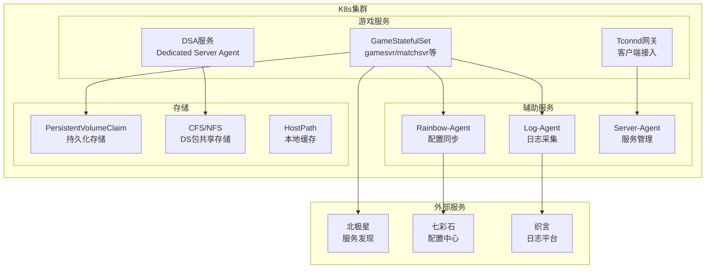
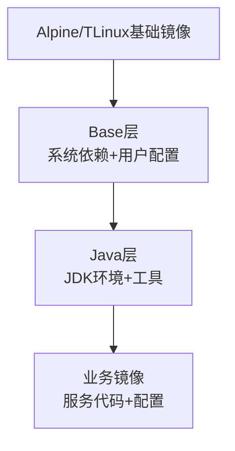
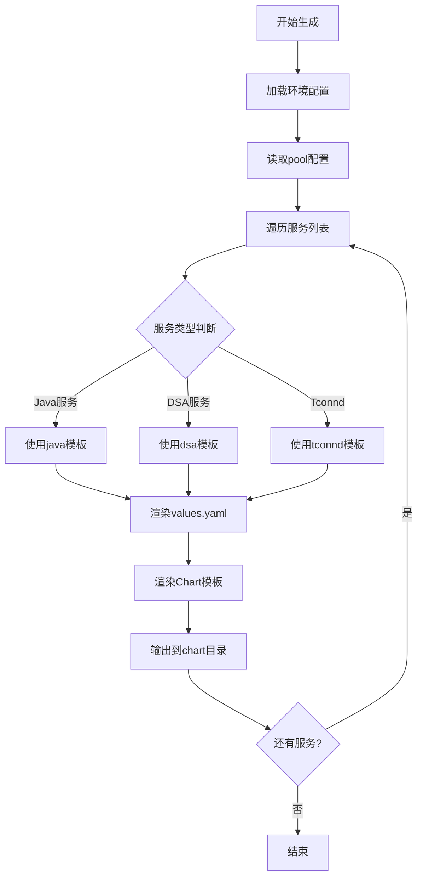
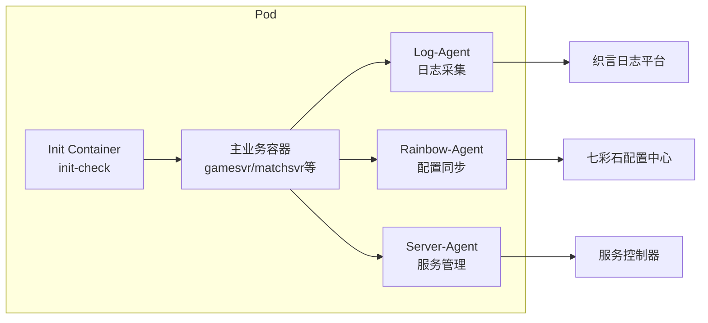
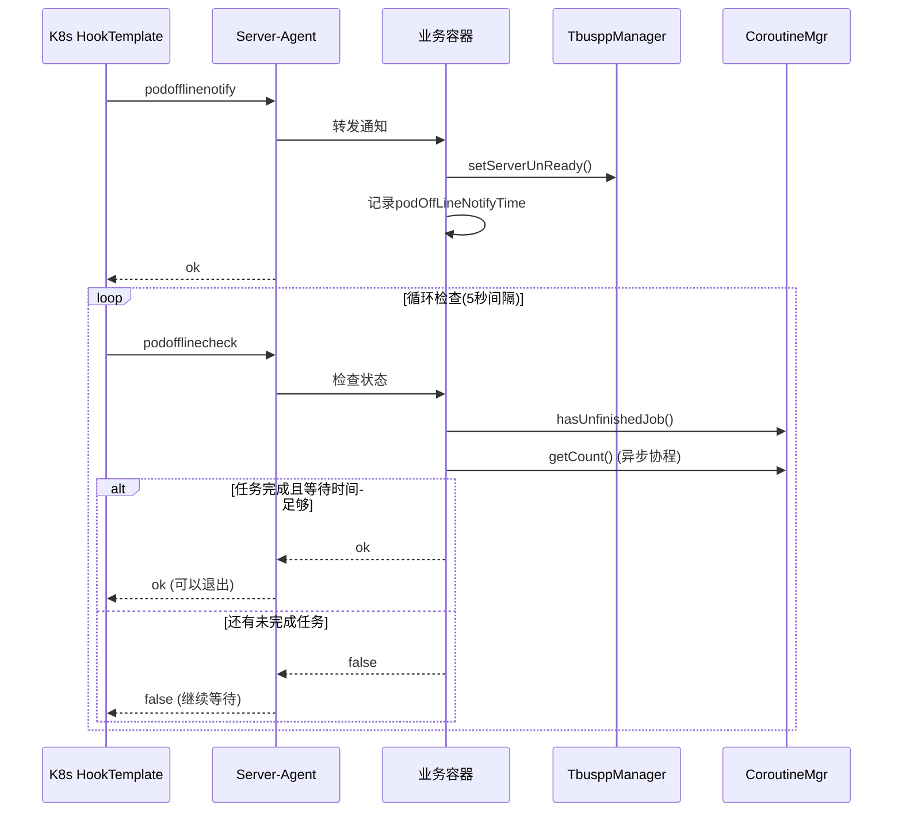
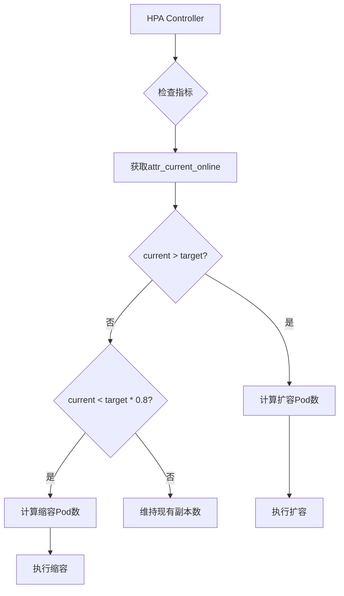
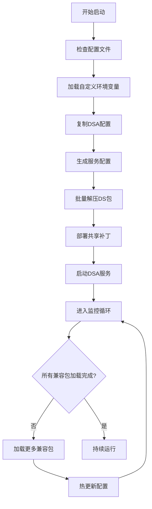
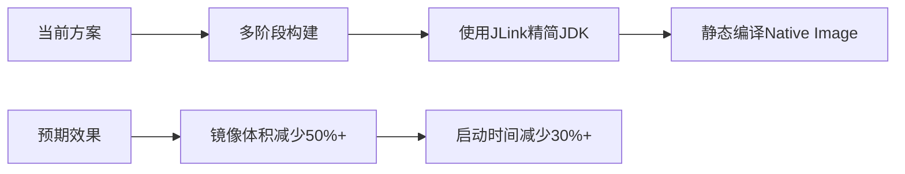
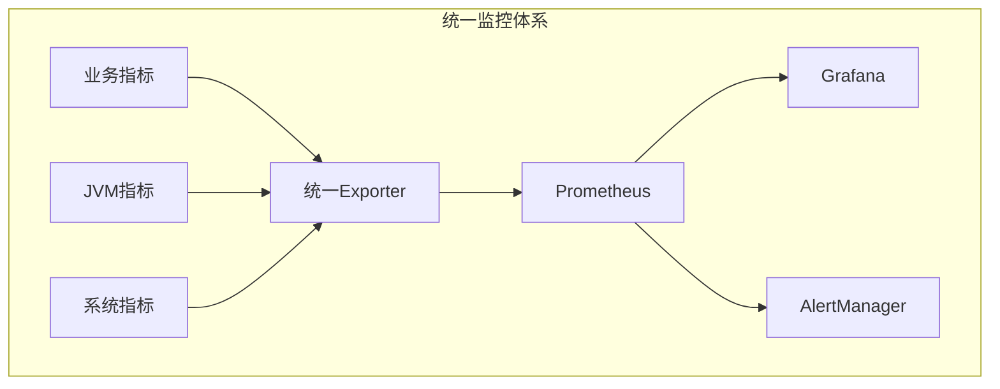

# 21. 容器化与Kubernetes部署分析

---

## 一、概述

### 1.1 文档目的

本文档深入分析LetsGo项目的容器化与Kubernetes部署架构，涵盖Dockerfile镜像构建、Helm Chart配置、K8s资源定义、Pod生命周期管理、服务发现与负载均衡、扩缩容策略等核心内容，帮助开发和运维人员全面理解项目的云原生部署体系。

### 1.2 技术栈概览

| 技术组件 | 用途 | 关键特性 |
|---------|------|----------|
| **Docker** | 容器化运行环境 | 镜像分层、环境一致性 |
| **Kubernetes** | 容器编排平台 | 自动调度、自愈能力 |
| **Helm** | K8s包管理 | 模板化、版本管理 |
| **GameStatefulSet** | 游戏有状态部署 | BCS扩展、滚动更新 |
| **Polaris** | 服务发现 | 负载均衡、健康检查 |
| **Rainbow** | 配置中心 | 动态配置、热更新 |
| **HPA** | 自动扩缩容 | 基于指标的弹性伸缩 |

### 1.3 部署架构总览



---

## 二、Dockerfile镜像构建分析

### 2.1 镜像层次结构

项目采用多层镜像架构，实现基础环境与业务代码的分离：



### 2.2 基础镜像类型

| 镜像类型 | 基础系统 | 用途 | 特点 |
|---------|---------|------|------|
| `base-alpine` | Alpine Linux | 轻量级服务 | 体积小、启动快 |
| `base-tlinux` | TLinux | 生产环境 | 稳定、兼容性好 |
| `java-alpine` | Alpine + JDK | Java服务 | 包含glibc兼容层 |
| `java-tlinux` | TLinux + JDK | Java服务 | 原生支持 |

### 2.3 Java Alpine镜像分析

**文件位置**：[Dockerfile](/c:/UGit/letsgo_server/tools/dockerfiles/java-alpine/Dockerfile)

```dockerfile
FROM mirrors.tencent.com/wea/alpine-server:latest

RUN echo "" >> ~/.bashrc \
      && apk update \
      && apk add libstdc++ wget \
      # 安装glibc兼容层
      && wget -P /tmp/glibc/ .../glibc-2.27-r0.apk \
      && wget -P /tmp/glibc/ .../glibc-bin-2.27-r0.apk \
      && apk add --allow-untrusted /tmp/glibc/* \
      # 安装JDK
      && wget -P /tmp/jdk/ .../jdk8-timi.tar.gz \
      && tar -zxvf /tmp/jdk/jdk8-timi.tar.gz -C /tmp/jdk \ 
      && /bin/bash /tmp/jdk/jdk8-timi/install.sh \
      # 清理临时文件
      && rm -r /tmp/glibc \
      && rm -r /tmp/jdk \
      && apk del wget
```

**设计要点**：
- 使用Alpine作为基础镜像减小体积
- 安装glibc兼容层支持Java运行
- 单层RUN指令减少镜像层数
- 安装后清理临时文件

### 2.4 业务服务镜像结构

**DSA服务Dockerfile**：[Dockerfile](/c:/UGit/letsgo_server/run/deployment/dsa/letsgo/Dockerfile)

```dockerfile
FROM mirrors.tencent.com/wea/dsa:${DSA_VERSION}

# 复制启动脚本
COPY start.sh /data/run/dsa/
COPY generate.py /data/run/dsa/
COPY rainbow_config.sh /data/run/dsa/
COPY custom.env /data/run/dsa/

# 设置工作目录
WORKDIR /data/run/dsa

# 启动命令
CMD ["sh", "start.sh"]
```

### 2.5 镜像构建优化策略

| 优化策略 | 实现方式 | 效果 |
|---------|---------|------|
| **多阶段构建** | 编译阶段与运行阶段分离 | 减小最终镜像体积 |
| **层缓存利用** | 将不常变化的层放前面 | 加速构建过程 |
| **清理临时文件** | RUN指令末尾删除缓存 | 减小镜像体积 |
| **使用.dockerignore** | 排除不必要文件 | 减少构建上下文 |
| **指定镜像版本** | 避免使用latest标签 | 保证可重现性 |

---

## 三、Helm Chart配置详解

### 3.1 Chart目录结构

```
helm_chart_release/
├── init-services/                    # 初始化服务Charts
│   └── charts/
│       ├── service-monitor/          # 服务监控配置
│       ├── tbuspp-mesh-init/         # Tbuspp网格初始化
│       ├── wea-game-monitor/         # 游戏监控
│       └── wea-pod-monitor/          # Pod监控
├── template/                         # 模板文件
│   ├── chart/                        # Chart模板
│   │   ├── java/                     # Java服务模板
│   │   ├── dsa/                      # DSA服务模板
│   │   ├── dsc/                      # DSC服务模板
│   │   └── tconnd/                   # Tconnd服务模板
│   └── values/                       # Values模板
│       ├── java-values.yaml.tmpl
│       ├── dsa-values.yaml.tmpl
│       └── tconnd-values.yaml.tmpl
├── chart/                            # 生成的Chart文件
├── update.py                         # Chart生成脚本
└── update.sh                         # 更新脚本
```

### 3.2 Chart生成流程

**生成脚本**：[update.py](/c:/UGit/letsgo_server/helm_chart_release/update.py)



**核心生成逻辑**：

```python
def gen_config(env_key):
    # 加载配置
    pool_dict = load_pool_config()
    custom_config = GetConfigDict({'key': env_key})
    
    for svr_name in tmp_config:
        # 构建配置字典
        config_dict['worldID'] = pool_dict['env_pool'][env_key]['world']
        config_dict['zoneID'] = pool_dict['env_pool'][env_key]['zone']
        
        # 根据服务类型选择模板
        if svr_name.startswith("dsa-svr"):
            tmpl_svr = 'dsa'
        elif svr_name.startswith("dsc-svr"):
            tmpl_svr = 'dsc'
        else:
            tmpl_svr = 'java'
            
        # 使用Mako渲染模板
        tmpl_file = f"template/values/{tmpl_svr}-values.yaml.tmpl"
        valuestmpl = Template(filename=tmpl_file)
        result = valuestmpl.render(config=config_dict)
```

### 3.3 Values配置详解

**Java服务Values配置**：[java-values.yaml.tmpl](/c:/UGit/letsgo_server/helm_chart_release/template/values/java-values.yaml.tmpl)

```yaml
# 基础配置
rainbowAppID: ${config["rainbowAppID"]}
rainbowUserID: ${config["rainbowUserID"]}
rainbowSecretKey: ${config["rainbowSecretKey"]}
envKey: ${config["envKey"]}
appVersion: '${config["app_version"]}'
worldID: ${config["worldID"]}
zoneID: ${config["zoneID"]}

# 副本配置
replicaCount: ${config["replicaCount"]}
maxUnavailable: 1
rollingUpdate:
  parallel: false
  partition: ${int(config["replicaCount"]) + 1}

# 镜像配置
image:
  repository: mirrors.tencent.com/wea/server/java-all
  pullPolicy: ${config["image.pullPolicy"]}
  logAgentTag: latest
  rainbowAgentTag: latest

# 资源配置
resources:
  server:
    limits:
      cpu: ${config["resources.server.limits.cpu"]}
      memory: ${config["resources.server.limits.memory"]}
    requests:
      cpu: ${config["resources.server.requests.cpu"]}
      memory: ${config["resources.server.requests.memory"]}

# 持久化存储配置
pvc:
  storageClassName: ${config["pvc.storageClassName"]}
  storage: ${config["pvc.javaStorage"]}
  enable: true

# Pod反亲和性配置
affinity:
  podAntiAffinity:
    preferredDuringSchedulingIgnoredDuringExecution:
    - weight: 100
      podAffinityTerm:
        labelSelector:
          matchExpressions:
          - key: server
            operator: In
            values:
            - ${config["chart_server"]}
        topologyKey: kubernetes.io/hostname

# HookRun优雅退出配置
hookrun:
  enabled: ${config["hookrun"]["enabled"]}
  count: ${config["hookrun"]["count"]}
  interval: ${config["hookrun"]["interval"]}
```

---

## 四、K8s资源定义分析

### 4.1 GameStatefulSet核心配置

**文件位置**：[gamestatefulset.yaml.tmpl](/c:/UGit/letsgo_server/helm_chart_release/template/chart/java/gamestatefulset.yaml.tmpl)

GameStatefulSet是BCS对Kubernetes StatefulSet的扩展，专门针对游戏服务场景优化。

```yaml
apiVersion: tkex.tencent.com/v1alpha1
kind: GameStatefulSet
metadata:
  name: {{ include "${config["chart_server"]}.fullname" . }}
  labels:
    server: ${config["chart_server"]}
    jvm_monitor: prom
    game_monitor: prom
spec:
  serviceName: {{ include "${config["chart_server"]}.fullname" . }}
  replicas: {{ .Values.replicaCount }}
  
  # Pod管理策略：支持并行启动
  podManagementPolicy: Parallel
  
  # 滚动更新策略
  updateStrategy:
    type: RollingUpdate
    rollingUpdate:
      partition: {{ .Values.rollingUpdate.partition }}
      maxUnavailable: {{ .Values.maxUnavailable }}
  
  # 预删除钩子：优雅退出
  preDeleteUpdateStrategy:
    hook:
      templateName: {{ include "${config["chart_server"]}.fullname" . }}
```

### 4.2 Pod模板配置

```yaml
template:
  spec:
    # 初始化容器
    initContainers:
      - name: init-check
        image: mirrors.tencent.com/wea/busybox:latest
        command: ['sh', '-c', 
          'if [ ! -f /data/rainbow/rainbow_group_info.json ]; 
           then touch /data/rainbow/rainbow_group_info.json; fi']
    
    # 主容器
    containers:
      # 业务容器
      - name: {{ .Chart.Name }}
        readinessProbe:
          periodSeconds: 5
          exec:
            command:
              - /bin/bash
              - -c
              - su user00 -c /data/run/*/startCheckCmd_*.sh
        env:
          - name: ENV_KEY
            value: '{{.Values.envKey}}'
          - name: WORLD_ID
            value: '{{.Values.worldID}}'
          - name: SERVER_NAME
            value: ${config["server_name"]}
          - name: POD_NAME
            valueFrom:
              fieldRef:
                fieldPath: metadata.name
        resources:
          limits:
            cpu: ...
            memory: ...
      
      # 日志采集容器
      - name: log-agent
        image: 'mirrors.tencent.com/wea/log-agent:{{ .Values.image.logAgentTag }}'
        env:
          - name: ZHIYAN_LOG_NAME
            value: '{{.Values.zhiyanLogName}}'
      
      # 配置同步容器
      - name: rainbow-agent
        image: 'mirrors.tencent.com/wea/rainbow-agent:latest'
        env:
          - name: group
            value: '{{.Values.rainbowAppID}}/resource;{{.Values.rainbowAppID}}/config'
      
      # 服务管理容器
      - name: server-agent
        image: "mirrors.tencent.com/wea/server/agent:latest"
        ports:
          - name: agent-port
            containerPort: 8080
```

### 4.3 多容器架构设计



**各容器职责**：

| 容器 | 职责 | 核心功能 |
|------|------|----------|
| **init-check** | 初始化检查 | 创建必要目录、清理旧日志 |
| **主业务容器** | 运行业务逻辑 | 处理游戏请求、执行业务逻辑 |
| **log-agent** | 日志采集 | 采集日志发送到织言平台 |
| **rainbow-agent** | 配置同步 | 监听七彩石配置变更，热更新 |
| **server-agent** | 服务管理 | 提供HTTP接口进行服务管理 |

### 4.4 存储卷配置

```yaml
volumes:
  # Core文件存储
  - name: corepath
    hostPath:
      path: /data/corefile
      type: DirectoryOrCreate
  
  # 配置备份
  - name: configbak
    hostPath:
      path: /data/config_bak
      type: DirectoryOrCreate
  
  # DS包共享存储(DSA专用)
  - name: dspkgdir
    nfs:
      server: {{ .Values.cfs.server }}
      path: {{ .Values.cfs.path }}/ds/{{ .Values.envKey }}
      readOnly: true

# 持久化存储声明
volumeClaimTemplates:
  - metadata:
      name: data
    spec:
      accessModes: [ "ReadWriteOnce" ]
      storageClassName: {{ .Values.pvc.storageClassName }}
      resources:
        requests:
          storage: {{ .Values.pvc.storage }}
```

---

## 五、Pod生命周期管理与优雅停机

### 5.1 优雅退出机制概述



### 5.2 HookTemplate配置

**文件位置**：[hook.yaml.tmpl](/c:/UGit/letsgo_server/helm_chart_release/template/chart/java/hook.yaml.tmpl)

```yaml
apiVersion: tkex.tencent.com/v1alpha1
kind: HookTemplate
metadata:
  name: {{ $fullName }}
spec:
  policy: Ordered
  args:
  - name: PodName
  - name: PodNamespace
  metrics:
  # 第一步：隔离北极星流量
  - name: ${config["chart_server"]}-isolate-polaris
    provider:
      kubernetes:
        function: patch
        fields:
          - path: metadata.annotations.isolate.tencent.bkbcs.polaris
            value: "true"
    successfulLimit: 1
    interval: 10s

  # 第二步：通知服务下线
  - name: ${config["chart_server"]}-offline-notify
    count: 1
    interval: 10s
    successfulLimit: 1
    successCondition: "asInt(result) == 0"
    provider:
      web:
        url: http://{{`{{args.PodName}}`}}...8080/pod-offline-notify
        jsonPath: "{$.ret}"
        timeoutSeconds: 10

  # 第三步：检查是否可以下线
  - name: ${config["chart_server"]}-offline-check
    count: {{ .Values.hookrun.count }}
    interval: {{ .Values.hookrun.interval }}
    successfulLimit: 1
    successCondition: "asInt(result) == 0"
    provider:
      web:
        url: http://{{`{{args.PodName}}`}}...8080/pod-offline-check
        jsonPath: "{$.ret}"
        timeoutSeconds: 10
```

### 5.3 PodOfflineManager实现

**文件位置**：[PodOfflineManager.java](/c:/UGit/letsgo_server/WeA/common/src/main/java/com/tencent/nk/server/PodOfflineManager.java)

```java
public class PodOfflineManager {
    protected long podOffLineNotifyTime = 0;
    private volatile long offlineUnreadyTimestamp;
    
    // 接收下线通知
    public boolean podOffLineNotify() {
        logger.info("receive pod offline notify message");
        if (getPodOffLineNotifyTime() > 0) {
            logger.warn("already offlining");
            return false;
        }
        
        // 设置Tbuspp为不可用状态，停止接收新请求
        if (getPodOfflineSetServerUnreadySwitch()) {
            TbusppManager.getInstance().setTbusppUnready();
        }
        
        // 记录下线开始时间
        setPodOffLineNotifyTime(Framework.currentTimeMillis());
        return true;
    }
    
    // 检查是否可以下线
    public boolean podOffLineCheck() {
        // 检查Tbuspp状态
        if (TbusppInstance.isInstanceReady(Framework.getInstance().getServerId())) {
            logger.warn("still in ready state");
            return false;
        }
        
        // 检查协程任务是否完成
        if (CoroutineMgr.getInstance().hasUnfinishedJob()) {
            int jobCnt = CoroutineMgr.getInstance().getAllJobCnt();
            logger.warn("has unfinished job, count:{}", jobCnt);
            return false;
        }
        
        // 检查异步操作是否完成
        int coroAysncCount = CoroutineAsyncMgr.getCount();
        if (coroAysncCount != 0) {
            CoroutineAsyncMgr.dumpRunningCoroutines();
            return false;
        }
        
        // 等待最小时间（默认15秒）
        long offlineTimeMs = offlineUnreadyTimestamp +
            PropertyFileReader.getRealTimeIntItem("offline_after_unready_ms", 15_000);
        if (Framework.currentTimeMillis() < offlineTimeMs) {
            return false;
        }
        
        return true;
    }
}
```

### 5.4 服务级自定义下线逻辑

不同服务可重写`podOffLineCheck()`实现自定义检查逻辑：

| 服务 | 自定义逻辑 | 超时时间 |
|------|-----------|---------|
| **GameSvr** | 等待玩家数量降为0或低于阈值 | 无限制 |
| **MatchSvr** | 通知预下线并等待匹配完成 | 无限制 |
| **RouteSvr** | 隔离北极星流量后等待 | 60秒 |
| **ClubSvr** | 通知俱乐部下线并检查数据同步 | 无限制 |
| **CocSvr** | 等待活跃玩家数量降到阈值以下 | 无限制 |

**GameSvr示例**：

```java
@Override
public boolean podOffLineCheck() {
    boolean frameworkCheckResult = super.podOffLineCheck();
    
    // 获取当前玩家数量
    int playerNum = PlayerRefMgr.getInstance().getGameSvrPlayerNum();
    
    // 检查玩家数量阈值
    int threshold = PropertyFileReader.getRealTimeIntItem(
        "game_svr_offline_player_threshold", 0);
    
    if (playerNum > threshold) {
        return false;
    }
    
    // 离线前进行数据上报
    if (serviceOfflineReportSwitch) {
        PlayerServiceInfoMgr.getInstance().serviceOfflineReport();
    }
    
    return true;
}
```

---

## 六、服务发现与负载均衡

### 6.1 北极星（Polaris）服务发现

**文件位置**：[PolarisDiscover.java](/c:/UGit/letsgo_server/WeA/common/src/main/java/com/tencent/cl5/PolarisDiscover.java)

```mermaid
graph TB
    subgraph 服务注册
        A[服务启动] --> B[创建InstanceRegisterRequest]
        B --> C[设置namespace/service/host/port]
        C --> D[调用providerAPI.register]
        D --> E[获取instanceId]
    end
    
    subgraph 心跳保活
        F[定时器触发] --> G[遍历所有注册服务]
        G --> H[创建InstanceHeartbeatRequest]
        H --> I[调用providerAPI.heartbeat]
    end
    
    subgraph 服务注销
        J[服务停止] --> K[创建InstanceDeregisterRequest]
        K --> L[调用providerAPI.deRegister]
    end
```



**服务注册实现**：

```java
public class PolarisDiscover {
    private static ProviderAPI providerAPI = DiscoveryAPIFactory.createProviderAPI();
    private ConcurrentHashMap<String, DiscoverData> allDiscover = new ConcurrentHashMap<>();
    
    // 注册服务
    private String registerService(DiscoverData data) {
        InstanceRegisterRequest request = new InstanceRegisterRequest();
        request.setNamespace(data.namespace);
        request.setService(data.service);
        request.setHost(data.host);
        request.setPort(data.port);
        request.setTtl(data.ttl);
        
        InstanceRegisterResponse response = providerAPI.register(request);
        return response.getInstanceId();
    }
    
    // 心跳保活
    private void hearBeat() {
        for (Entry<String, DiscoverData> entry : allDiscover.entrySet()) {
            DiscoverData value = entry.getValue();
            InstanceHeartbeatRequest request = new InstanceHeartbeatRequest();
            request.setNamespace(value.namespace);
            request.setService(value.service);
            request.setHost(value.host);
            request.setPort(value.port);
            providerAPI.heartbeat(request);
        }
    }
    
    // 启动定时心跳
    public void init() {
        int second = PropertyFileReader.getIntItem("polaris_discover_sec", 60);
        scheduler.scheduleWithFixedDelay(() -> hearBeat(), 5, second, TimeUnit.SECONDS);
    }
}
```

### 6.2 K8s PolarisConfig配置

**文件位置**：[polaris.yaml.tmpl](/c:/UGit/letsgo_server/helm_chart_release/template/chart/java/polaris.yaml.tmpl)

```yaml
apiVersion: tkex.tencent.com/v1
kind: PolarisConfig
metadata:
  name: {{ .Values.polarisconfig.name }}
  namespace: ${config["envKey"]}
spec:
  polaris:
    name: {{ .Values.polarisconfig.name }}
    namespace: {{ .Values.polarisconfig.namespace }}
    operator: {{ .Values.polarisconfig.operator }}
    token: {{ .Values.polarisconfig.token }}
  services:
  - direct: {{ .Values.polarisconfig.direct }}
    name: {{ .Values.polarisconfig.name }}
    namespace: ${config["envKey"]}
    port: {{ .Values.polarisconfig.port }}
    weight: {{ .Values.polarisconfig.weight }}
```

### 6.3 服务发现调用

**文件位置**：[PolarisUtil.java](/c:/UGit/letsgo_server/WeA/common/src/main/java/com/tencent/cl5/PolarisUtil.java)

```java
public class PolarisUtil {
    private static ConsumerAPI consumerAPI = DiscoveryAPIFactory.createConsumerAPI();
    
    // 同步服务发现
    public static NKPair<String, Integer> discover(String sid, String namespace) {
        GetOneInstanceRequest request = new GetOneInstanceRequest();
        request.setNamespace(namespace);
        request.setService(sid);
        
        InstancesResponse response = consumerAPI.getOneInstance(request);
        Instance instance = response.getInstances()[0];
        return new NKPair<>(instance.getHost(), instance.getPort());
    }
    
    // 获取所有实例
    public static ConcurrentHashMap<String, Integer> discoverAllInstance(
            String sid, String namespace) {
        GetAllInstancesRequest request = new GetAllInstancesRequest();
        request.setNamespace(namespace);
        request.setService(sid);
        
        InstancesResponse response = consumerAPI.getAllInstances(request);
        ConcurrentHashMap<String, Integer> result = new ConcurrentHashMap<>();
        for (Instance instance : response.getInstances()) {
            result.put(instance.getHost(), instance.getPort());
        }
        return result;
    }
}
```

---

## 七、健康检查与探针配置

### 7.1 探针类型配置

```yaml
containers:
  - name: dsa-svr
    # 启动探针：容器启动完成检查
    startupProbe:
      periodSeconds: 5
      failureThreshold: {{ .Values.startupProbe.failureThreshold }}
      exec:
        command:
          - /bin/bash
          - -c
          - su user00 -c /data/run/*/check_*.sh
    
    # 存活探针：容器运行状态检查
    livenessProbe:
      failureThreshold: 60
      initialDelaySeconds: 30
      periodSeconds: 10
      exec:
        command:
          - /bin/bash
          - -c
          - su user00 -c /data/run/*/check_*.sh
    
    # 就绪探针：流量接入检查
    readinessProbe:
      periodSeconds: 5
      exec:
        command:
          - /bin/bash
          - -c
          - su user00 -c /data/run/*/startCheckCmd_*.sh
```

### 7.2 探针配置策略

| 探针类型 | 用途 | 失败次数 | 检查间隔 | 超时时间 |
|---------|------|---------|---------|---------|
| **startupProbe** | 启动完成检查 | 可配置 | 5s | - |
| **livenessProbe** | 运行状态检查 | 60 | 10s | - |
| **readinessProbe** | 流量接入检查 | 3(默认) | 5s | - |

---

## 八、扩缩容策略

### 8.1 HPA自动扩缩容

**文件位置**：[hpa.yaml.tmpl](/c:/UGit/letsgo_server/helm_chart_release/template/chart/java/hpa.yaml.tmpl)

```yaml
apiVersion: autoscaling/v2beta2
kind: HorizontalPodAutoscaler
metadata:
  name: ${config["server_name"]}-scaler
spec:
  maxReplicas: {{ .Values.autoscaling.maxReplicas }}
  minReplicas: {{ .Values.autoscaling.minReplicas }}
  scaleTargetRef:
    apiVersion: tkex.tencent.com/v1alpha1
    kind: GameStatefulSet
    name: {{ include "${config["chart_server"]}.fullname" . }}
  metrics:
    # 基于在线人数的自定义指标
    - type: Pods
      pods:
        metric:
          name: attr_current_online
        target:
          averageValue: {{ .Values.autoscaling.onlineCnt }}
          type: AverageValue
```

### 8.2 扩缩容配置

```yaml
autoscaling:
  enabled: false
  minReplicas: 1
  maxReplicas: 5
  onlineCnt: 100        # 单Pod目标在线人数
  targetOnlineCnt: true # 是否启用在线人数指标
```

### 8.3 扩缩容触发条件



---

## 九、DSA服务专项部署

### 9.1 DSA服务特点

DSA（Dedicated Server Agent）是DS（Dedicated Server）的管理代理，具有以下特点：

- 需要访问DS包共享存储（NFS/CFS）
- 动态加载不同版本的DS包
- 管理多个DS实例
- 支持热更新DS配置

### 9.2 DSA启动流程

**文件位置**：[start.sh](/c:/UGit/letsgo_server/run/deployment/dsa/start.sh)



### 9.3 DSA GameStatefulSet配置

```yaml
spec:
  containers:
    - name: dsa-svr
      volumeMounts:
        # DS包共享存储
        - name: dspkgdir
          mountPath: /data/run/ds/{{ .Values.envKey }}
        # Node本地DS缓存
        - name: dsnodedir
          mountPath: /data/run/nodeds/{{ .Values.envKey }}
      env:
        - name: G6_PORT_SECTION_BEGIN
          value: '{{.Values.portBegin}}'
        - name: G6_PORT_SECTION_LEN
          value: '{{.Values.portLen}}'
        - name: DS_VER
          value: '{{.Values.dsVer}}'
        - name: DS_BUILD_ID
          value: '{{.Values.dsBuildId}}'

  volumes:
    # NFS共享存储
    - name: dspkgdir
      nfs:
        server: {{ .Values.cfs.server }}
        path: {{ .Values.cfs.path }}/ds/{{ .Values.envKey }}
        readOnly: true
    # HostPath本地缓存
    - name: dsnodedir
      hostPath:
        path: /data/nodeds/ds/{{ .Values.envKey }}
        type: DirectoryOrCreate
```

---

## 十、监控与可观测性

### 10.1 监控标签配置

```yaml
metadata:
  labels:
    server: ${config["chart_server"]}
    jvm_monitor: prom      # JVM监控标签
    game_monitor: prom     # 游戏监控标签
    g6_monitor: prom       # G6监控标签(DSA)
```

### 10.2 PodMonitor配置

**文件位置**：[podmonitor.yaml](/c:/UGit/letsgo_server/helm_chart_release/init-services/charts/wea-game-monitor/templates/podmonitor.yaml)

```yaml
apiVersion: monitoring.coreos.com/v1
kind: PodMonitor
metadata:
  name: wea-game-monitor
spec:
  selector:
    matchLabels:
      game_monitor: prom
  podMetricsEndpoints:
  - port: metrics
    interval: 15s
```

### 10.3 Prometheus指标导出

DSA服务内置exporter容器：

```yaml
- name: exporter
  image: "mirrors.tencent.com/g6/exporter:latest"
  ports:
    - name: metrics
      containerPort: 13140
      protocol: TCP
  command: ["/opt/g6/service/entrypoint.sh", "-port 13140 -dir /opt/prom"]
  volumeMounts:
    - name: prom-file-dir
      mountPath: /opt/prom
```

---

## 十一、进阶使用技巧

### 11.1 滚动更新策略

```yaml
updateStrategy:
  type: RollingUpdate
  rollingUpdate:
    partition: {{ .Values.rollingUpdate.partition }}
    maxUnavailable: {{ .Values.maxUnavailable }}
  canary:
    steps:
    - partition: 90%
    - pause: {duration: 5m}
    - partition: 50%
    - pause: {duration: 10m}
    - partition: 0
```

### 11.2 蓝绿部署支持

通过annotation实现蓝绿部署标识：

```yaml
podAnnotations:
  app_version: '{{ .Values.appVersion }}'
  {{- if .Values.tbus2.enable }}
  tbus2-injection: enabled
  {{ end }}
```

### 11.3 节点亲和性配置

```yaml
nodeSelector:
  env: ${config["nodeSelector.env"]}

affinity:
  podAntiAffinity:
    preferredDuringSchedulingIgnoredDuringExecution:
    - weight: 100
      podAffinityTerm:
        labelSelector:
          matchExpressions:
          - key: server
            operator: In
            values:
            - ${config["chart_server"]}
        topologyKey: kubernetes.io/hostname
```

### 11.4 资源配额管理

```yaml
resources:
  server:
    limits:
      cpu: 8
      memory: 16Gi
    requests:
      cpu: 4
      memory: 8Gi
```

---

## 十二、改进空间与建议

### 12.1 当前存在的问题

| 问题 | 现状 | 影响 |
|------|------|------|
| 镜像体积较大 | Java镜像约500MB+ | 拉取时间长、存储成本高 |
| 配置模板复杂 | Mako+Helm双层模板 | 维护困难、排错复杂 |
| 优雅退出时间长 | 部分服务等待时间过长 | 影响更新速度 |
| 监控指标分散 | 多个监控标签体系 | 难以统一管理 |

### 12.2 改进建议

#### 12.2.1 镜像优化



**具体措施**：
- 采用GraalVM Native Image编译关键服务
- 使用JLink创建定制化JRE
- 优化基础镜像选择

#### 12.2.2 配置管理优化

```yaml
# 建议：使用Kustomize替代Mako+Helm
# base/deployment.yaml
apiVersion: apps/v1
kind: Deployment
metadata:
  name: game-server
spec:
  template:
    spec:
      containers:
      - name: server
        resources:
          limits:
            cpu: $(CPU_LIMIT)
            memory: $(MEMORY_LIMIT)

# overlays/production/kustomization.yaml
configMapGenerator:
- name: env-config
  literals:
  - CPU_LIMIT=8
  - MEMORY_LIMIT=16Gi
```

#### 12.2.3 优雅退出优化

**建议措施**：

1. **设置合理的超时时间**：
```java
// 配置最大下线等待时间
public long getMaxPodOfflineTimeMs() {
    return PropertyFileReader.getRealTimeIntItem(
        "max_pod_offline_time_ms", 300_000); // 5分钟
}
```

2. **实现强制下线机制**：
```yaml
hookrun:
  enabled: true
  count: 60          # 最多检查60次
  interval: 5s       # 每5秒检查一次
  forceTimeout: 5m   # 5分钟后强制下线
```

3. **预热新实例**：
```yaml
lifecycle:
  postStart:
    exec:
      command:
      - /bin/sh
      - -c
      - "curl http://localhost:8080/warmup"
```

#### 12.2.4 监控体系统一

**建议架构**：



**统一标签规范**：
```yaml
labels:
  app: letsgo
  component: gamesvr
  environment: production
  team: server
  monitor: enabled
```

### 12.3 未来演进方向

| 方向 | 目标 | 预期收益 |
|------|------|---------|
| **GitOps** | ArgoCD/FluxCD实现 | 自动化部署、版本可追溯 |
| **Service Mesh** | Istio/Linkerd集成 | 统一流量管理、可观测性 |
| **Serverless** | Knative扩展 | 更细粒度的弹性伸缩 |
| **多集群管理** | Federation/Karmada | 跨集群调度、灾备 |

---

## 十三、总结

### 13.1 核心要点

1. **镜像分层设计**：基础镜像→运行环境→业务代码的三层结构
2. **Helm模板化**：通过Mako+Helm双层模板实现灵活的配置管理
3. **多容器Pod**：主业务容器+Sidecar容器（日志、配置、管理）
4. **优雅退出**：HookTemplate+PodOfflineManager实现无损发布
5. **服务发现**：北极星Polaris提供服务注册、发现和负载均衡
6. **弹性伸缩**：基于自定义指标（在线人数）的HPA扩缩容

### 13.2 最佳实践总结

| 实践 | 描述 |
|------|------|
| **资源限制** | 始终设置requests和limits |
| **健康检查** | 配置完善的startup/liveness/readiness探针 |
| **优雅退出** | 实现preStop钩子和自定义下线逻辑 |
| **反亲和性** | 避免同服务Pod调度到同一节点 |
| **持久化存储** | 日志和配置使用PVC |
| **配置外置** | 使用ConfigMap和Secret管理配置 |
| **监控埋点** | 暴露Prometheus指标供采集 |
| **版本标签** | 镜像使用具体版本号，避免latest |
