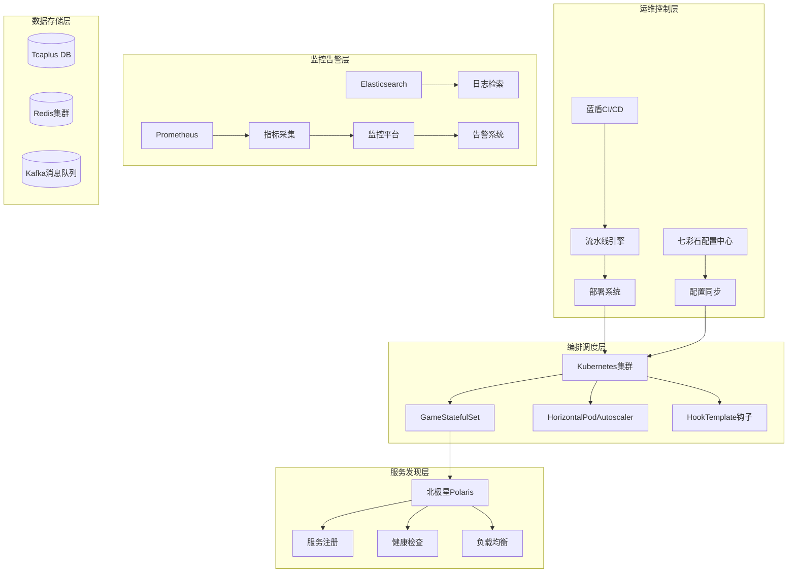
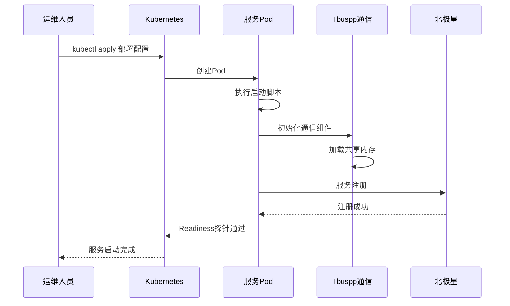
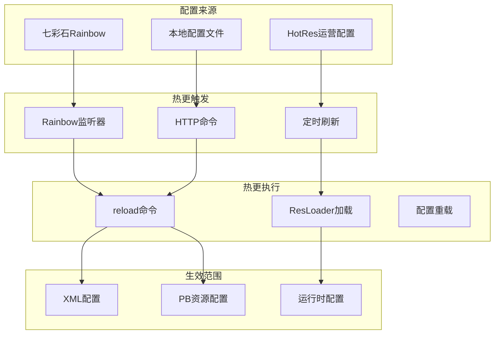
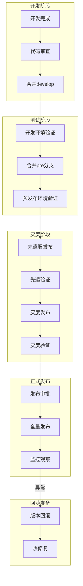
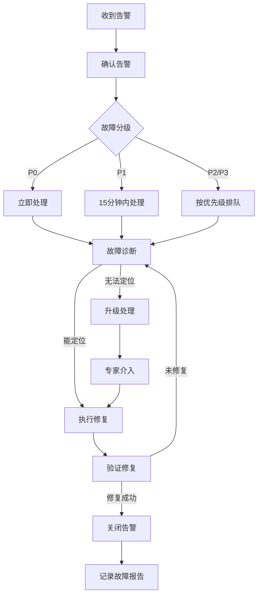
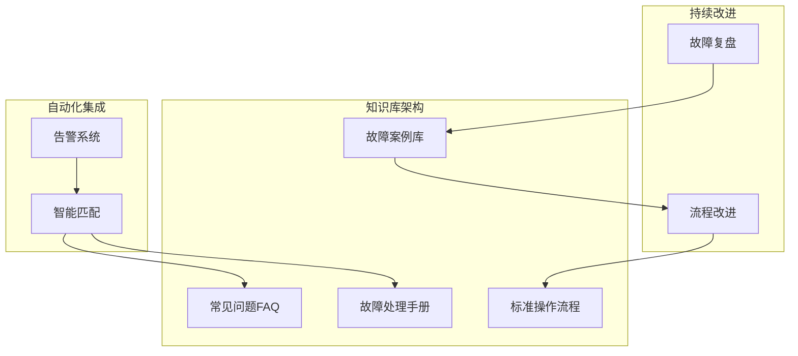

# 23. 运维操作手册与SOP分析

## 📋 概述

本文档详细分析了项目的运维操作标准流程（SOP），涵盖日常运维、版本发布、故障处理、数据库维护、缓存管理、配置变更、扩缩容、值班规范等核心运维场景，为运维人员提供标准化的操作指南。

---

## 🏗️ 一、运维架构总览

### 1.1 运维体系架构



### 1.2 环境分层架构

| 环境层级 | 环境名称 | 用途说明 | 配置标识 |
|:-------:|---------|---------|---------|
| **开发层** | dev | 日常开发测试 | `env_flag: dev` |
| **开发层** | mdev1/mdev2 | 多版本开发环境 | `env_flag: dev` |
| **预发布层** | pre | 版本验证环境 | `env_flag: idc_release` |
| **先遣层** | pioneer | 小范围灰度测试 | `env_flag: idc_release` |
| **灰度层** | gray-release | 大范围灰度发布 | `env_flag: idc_release` |
| **正式层** | release | 线上生产环境 | `env_flag: idc_release` |

**环境配置示例**（pool.yaml）：
```yaml
## 正式服
letsgo-releaseqq: { env_flag: idc_release, platform: 2, world: 1, zone: 1, tcaplus_zone: 1021, redis_db: 27 }
letsgo-releasewx: { env_flag: idc_release, platform: 1, world: 2, zone: 1, tcaplus_zone: 1022, redis_db: 28 }

## 灰度服
letsgo-gray-release: { env_flag: idc_release, platform: 0, world: 23, zone: 1, tcaplus_zone: 10062, redis_db: 50 }

## 先遣服
letsgo-pioneer5: { env_flag: idc_release, platform: 0, world: 198, zone: 1, tcaplus_zone: 10057, redis_db: 47 }
```

---

## 🔄 二、日常运维操作标准流程

### 2.1 服务启停操作

#### 2.1.1 服务启动流程



**启动命令配置**（process.yaml）：
```yaml
command:
  run:
    reload:
      uri: "cmd"
      params:
        cmd: "reload"
    check:
      uri: "cmd"
      params:
        cmd: "check"
    getTotalOnline:
      uri: "cmd"
      params:
        cmd: "gettotalonline"
    dsaOffline:
      uri: "cmd"
      params:
        cmd: "dsa_offline"
```

#### 2.1.2 服务停止流程

**优雅停机实现原理**：

```java
// PodOfflineManager.java - 优雅退出核心逻辑
public class PodOfflineManager {
    protected long podOffLineNotifyTime = 0;
    private volatile long offlineUnreadyTimestamp;
    
    // 接收下线通知
    public boolean podOffLineNotify() {
        logger.info("receive pod offline notify message");
        if (getPodOffLineNotifyTime() > 0) {
            logger.warn("already offlining");
            return false;
        }
        
        // 设置Tbuspp为不可用状态，阻止新请求进入
        if (getPodOfflineSetServerUnreadySwitch()) {
            TbusppManager.getInstance().setTbusppUnready();
        }
        
        // 记录下线开始时间
        setPodOffLineNotifyTime(Framework.currentTimeMillis());
        Monitor.getInstance().set.total(MonitorId.attr_pod_offline_cnt, 1);
        return true;
    }
    
    // 检查是否可以安全下线
    public boolean podOffLineCheck() {
        // 1. 检查是否已设置为不可用
        if (TbusppInstance.isInstanceReady(Framework.getInstance().getServerId())) {
            logger.warn("still in ready state");
            return false;
        }
        
        // 2. 检查协程任务是否完成
        if (CoroutineMgr.getInstance().hasUnfinishedJob()) {
            logger.warn("has unfinished job, count:{}", CoroutineMgr.getInstance().getAllJobCnt());
            return false;
        }
        
        // 3. 检查异步操作是否完成（RPC、Redis、Tcaplus等）
        int coroAysncCount = CoroutineAsyncMgr.getCount();
        if (coroAysncCount != 0) {
            CoroutineAsyncMgr.dumpRunningCoroutines();  // 记录运行中的协程
            return false;
        }
        
        // 4. 等待最小下线时间（默认15秒）
        long offlineTimeMs = offlineUnreadyTimestamp + 
            PropertyFileReader.getRealTimeIntItem("offline_after_unready_ms", 15_000);
        if (Framework.currentTimeMillis() < offlineTimeMs) {
            return false;
        }
        
        return true;
    }
}
```

**HookTemplate配置**（hook.yaml.tmpl）：
```yaml
apiVersion: tkex.tencent.com/v1alpha1
kind: HookTemplate
metadata:
  name: {{ $fullName }}
spec:
  policy: Ordered  # 按顺序执行
  metrics:
  # 步骤1: 隔离北极星流量
  - name: ${config["chart_server"]}-isolate-polaris
    provider:
      kubernetes:
        function: patch
        fields:
          - path: metadata.annotations.isolate.tencent.bkbcs.polaris
            value: "true"
    successfulLimit: 1
    
  # 步骤2: 通知服务准备下线
  - name: ${config["chart_server"]}-offline-notify
    count: 1
    interval: 10s
    successCondition: "asInt(result) == 0"
    provider:
      web:
        url: http://{{`{{args.PodName}}`}}:8080/pod-offline-notify
        timeoutSeconds: 10
        
  # 步骤3: 循环检查是否可以下线
  - name: ${config["chart_server"]}-offline-check
    count: {{ .Values.hookrun.count }}  # 最大检查次数
    interval: {{ .Values.hookrun.interval }}
    successCondition: "asInt(result) == 0"
    provider:
      web:
        url: http://{{`{{args.PodName}}`}}:8080/pod-offline-check
        timeoutSeconds: 10
```

### 2.2 配置热更新操作

#### 2.2.1 配置热更新流程



**热更新核心实现**：

```java
// ServerEngine.java - baseReload方法
public int baseReload(TxStopWatch stopWatch) {
    // 1. 更新环境配置
    updateEnvType();
    ConfigUtils.reloadConfigs();
    
    // 2. 版本信息重载
    VersionUtil.reload();
    
    // 3. GamePlay配置重载
    var err = GamePlay.getInstance().load();
    if (err.hasError()) {
        LOGGER.error("game play load failed:{}", err);
        return err.getValue();
    }
    
    // 4. XML配置重载
    XmlLoader.loadXml(stopWatch, framework.getGameName());
    
    // 5. 事件服务配置重载
    if (!EventServerConfig.load()) {
        logger.error("EventServerConfig reload failed");
        return -1;
    }
    
    // 6. CS协议元数据重载
    int csMetaLoad = CsMetaLoader.load();
    if (NKErrorCode.OK.getValue() != csMetaLoad) {
        return -1;
    }
    
    // 7. PB资源文件重载
    if (!ResLoader.load(PB_RES_FILES_DIR, stopWatch)) {
        return -1;
    }
    
    // 8. 通信组件重载
    TbusppManager.getInstance().reload();
    RpcClient.reload();
    
    // 9. 业务模块重载
    int ret = modulesOnReload();
    
    // 10. 监控组件重载
    Monitor.getInstance().reload();
    MSDKManager.reload();
    CacheFlowControl.getInstance().load();
    MsgRateLimitMgr.getInstance().reload();
    
    return ret;
}
```

**Rainbow配置变更监听**：

```java
// ConfChangeListeners.java - 配置变更回调
public class NKTableGroupListenCallback implements ListenCallback<RainbowChangeInfo> {
    @Override
    public void callback(RainbowChangeInfo change) {
        // 上报配置版本
        RainbowConfigLoader.reportRainbowGroupVersion(change.getEnvName(), change.getGroup(), false);
        
        final String currVersion = RainbowConfigLoader.getGroupVersionName(change.getEnvName(), change.getGroup());
        LOGGER.warn("listened rainbow config change, group:[{}] version:[{}]", change.getGroup(), currVersion);
        
        // 服务未启动完成时延迟reload
        if (!Framework.getInstance().isRunning()) {
            Framework.getInstance().setNeedReloadAfterInitDone(true);
            return;
        }
        
        // 触发reload
        try {
            Framework.getInstance().doCmd("reload", "rainbow");
        } catch (Exception e) {
            LOGGER.error("load fail", e);
        }
    }
}
```

### 2.3 日志监控与异常上报

#### 2.3.1 日志统计流水线

项目通过蓝盾流水线实现自动化的日志监控和异常上报：

```yaml
# 流水线配置 - 【服务器】开发服 日志统计-上报.yaml
version: v3.0
name: 【元梦之星】【服务器】开发服 日志统计-上报

on:
  schedules:
    interval:
      week: [Sun, Mon, Tue, Wed, Thu, Fri, Sat]  # 每天执行
      time-points: ["09:00"]  # 每天早上9点
  manual: enabled  # 支持手动触发

variables:
  post_url: http://letsgo.woa.com/api/tapd/log/add
  sync_alerts_url: http://letsgo.woa.com/api/tapd/sync/alerts
  tapd_notify_url: http://letsgo.woa.com/api/tapd/notify
  hour: "24"  # 同步最近24小时
  log_level: "ERROR"  # 日志级别

stages:
  # 阶段1: 异常日志收集
  - name: stage-1-异常日志
    jobs:
      job_28A:
        steps:
          # 针对不同环境收集异常日志
          - name: 查询异常+保存文件-dev
            scriptPath: "tools/log_catch_report.py -e dev --mode exception --hour ${{hour}}"
          - name: 查询异常+保存文件-pre
            scriptPath: "tools/log_catch_report.py -e pre --mode exception --hour ${{hour}}"
          - name: 查询异常+保存文件-release
            scriptPath: "tools/log_catch_report.py -e release --mode exception --hour ${{hour}}"
            
  # 阶段2: 日志级别统计
  - name: stage-2-日志级别
    jobs:
      job_hhe:
        steps:
          - name: 查询+保存文件-release
            scriptPath: "tools/log_catch_report.py -e release --mode level --log_level ERROR"
            
  # 阶段3: 异常上报
  - name: stage-3
    jobs:
      job_dcZ:
        steps:
          - name: 异常上报
            # Python脚本读取JSON文件并上报到TAPD
          - name: 同步+提醒
            # 触发TAPD通知
```

#### 2.3.2 日志分类与告警

| 日志级别 | 描述 | 告警策略 |
|---------|------|---------|
| ERROR | 业务异常、系统错误 | 立即告警，自动创建TAPD缺陷 |
| WARN | 警告信息、潜在问题 | 汇总告警，每日统计 |
| INFO | 正常业务流程 | 不告警，用于问题排查 |
| DEBUG | 调试信息 | 仅开发环境记录 |

---

## 🚀 三、版本发布SOP

### 3.1 版本发布流程



### 3.2 灰度发布策略

#### 3.2.1 灰度规则配置

```protobuf
// ResPlayerGrayRule.proto - 灰度规则定义
message PlayerGrayRuleConf {
  option (resKey) = "id";
  optional int32 id = 1;
  optional string startDate = 2;     // 开始日期 yyyy-MM-dd
  optional string endDate = 3;       // 结束日期
  repeated string startTimeList = 4; // 开始时间 HH:mm:ss
  repeated string endTimeList = 5;   // 结束时间
  repeated PlayerGrayTagArg tagArgs = 6;      // 灰度标签
  repeated PlayerGrayCondition condition = 7;  // 过滤条件
  optional bool tagInAllRuleTime = 8; // 是否全时间段生效
}

message PlayerGrayTagArg {
  optional PlayerGrayTagType tagType = 1;  // 标签类型
  optional string tagArg = 2;              // 标签参数
}
```

#### 3.2.2 功能开关控制

```java
// FeatureSwitchCloseListMsgHandler.java - 功能开关处理
public class FeatureSwitchCloseListMsgHandler extends AbstractGsClientRequestHandler {
    @Override
    protected void handle(Player player, Message msg) {
        // 获取功能开关配置
        ResGeneral.FeatureOpenConf conf = FeatureOpenConfData.getInstance()
            .get(FeatureOpenType.FOT_GeneralOutputControl, 0);
            
        if (conf == null || !conf.getIsShow()) {
            // 功能已关闭
            return;
        }
        
        // 检查细粒度开关
        boolean isDisabled = FeatureKeySwitchConf.getInstance()
            .getByTypeidAnd1Keys(FeatureOpenType.FOT_K1_GeneralOutputModuleType_VALUE, moduleType) != null;
    }
}
```

### 3.3 回滚操作流程

#### 3.3.1 服务回滚

```bash
# Kubernetes回滚命令
# 回滚到上一个版本
kubectl rollout undo deployment/gamesvr -n letsgo-release

# 回滚到指定版本
kubectl rollout undo deployment/gamesvr --to-revision=10 -n letsgo-release

# 查看回滚历史
kubectl rollout history deployment/gamesvr -n letsgo-release
```

#### 3.3.2 数据回滚机制

```java
// AccountTransferBackUpRollBackMgr.java - 数据回滚管理
public class AccountTransferBackUpRollBackMgr {
    
    // 数据回滚主流程
    public int accountTransferRollBackDataFromBackUp(String openId, int rollbackStage) {
        // 1. 获取备份数据
        List<TcaplusDb.AccountTransferBackUpTable> backUpTableList = new ArrayList<>();
        for (var openidtouid : datalist) {
            var backup = AccountTransferBackUpTableDao.getAccountTransferBackUpTable(openidtouid.getUid());
            backUpTableList.add(backup);
        }
        
        // 2. 按阶段执行回滚
        switch (rollbackStage) {
            case 0: return rollBackUserBaseData(openId, uidToPlatIdMap, backUpTableList);
            case 1: return rollBackRelationData(openId, backUpTableList);
            case 2: return rollBackBusinessModuleData(openId, uidToPlatIdMap, backUpTableList);
            case 3: return rollBackOtherData(openId, backUpTableList);
            case 4: return rollBackMainData(openId, uidToPlatIdMap, backUpTableList);
        }
        return result;
    }
    
    // 回滚用户基础数据
    private int rollBackUserBaseData(String openId, Map<Long, Integer> uidToPlatIdMap, 
                                      List<AccountTransferBackUpTable> backUpTableList) {
        for (AccountTransferBackUpTable backUpTable : backUpTableList) {
            // 更新PlayerPublic表
            result = updatePlayerPublicTablePlatId(backUpTable.getPlayerPublic(), openId, 
                backUpTable.getUid(), backUpTable.getPlayer().getPlatid());
                
            // 清除Redis缓存
            PlayerPublicDao.removeSinglePlayerPublicDataFromRedis(backUpTable.getUid());
            
            // 更新Player表
            result = updatePlayerTablePlatId(backUpTable.getPlayer().toBuilder(), openId,
                backUpTable.getUid(), backUpTable.getPlayer().getPlatid());
        }
        return result;
    }
}
```

---

## 💾 四、数据库维护操作

### 4.1 Tcaplus数据库管理

#### 4.1.1 Tcaplus配置结构

```yaml
# Tcaplus连接配置示例
tcaplus:
  name: "main"
  appid: 335
  secret: 0211EA0908151A36
  host: tcp://set26.tcapdir.idc.tcaplus.db:9999
  pool_size: 3
  alive: true
  multi_zone: true
  instance:
    - name: "main"
      appid: 335
      zone: 470
      secret: 0211EA0908151A36
      host: tcp://set26.tcapdir.idc.tcaplus.db:9999
      pool_size: 3
    - name: "starp"
      appid: 335
      zone: 471
      secret: 0211EA0908151A36
      host: tcp://set26.tcapdir.idc.tcaplus.db:9999
      pool_size: 3
```

#### 4.1.2 表管理操作

| 操作类型 | 操作步骤 | 注意事项 |
|---------|---------|---------|
| **批量加表** | 1.上传proto文件 → 2.设置表信息 → 3.确认创建 | key字段必须有required标识 |
| **批量改表** | 1.选择表 → 2.上传新proto → 3.确认变更 | 不能删除key字段/不能改变字段类型 |
| **批量删表** | 1.勾选表 → 2.确认删除 | 需确保无业务依赖 |
| **表监控** | 通过Tcaplus控制台查看表监控信息 | 关注QPS、延迟、存储容量 |

**表变更限制**：
1. key字段(required)不能删除
2. key字段名和字段类型不能改变
3. value字段有required标识的不能删除
4. 同tagid的字段名称和字段类型不能改变
5. 不能增加key字段
6. 增加的value字段名不能与已有字段重名

#### 4.1.3 数据查询工具

```bash
# TcaplusClient命令行工具使用
./start_tcaplusclient.sh database="tcaplus_db" run="show database"

# 支持的命令
help -show     # 查询命令帮助
help -get      # get命令帮助
help -insert   # insert命令帮助
help -replace  # replace命令帮助
help -delete   # delete命令帮助
help -partkeyget  # 部分key查询帮助
```

### 4.2 Redis缓存管理

#### 4.2.1 Redis集群配置

```yaml
# Redis多实例配置
redis:
  redis_ins:
    - redis_ip: 30.175.217.173
      redis_port: 6379
      redis_password: yuanmeng2023
      redis_alive: true
      redis_node_type: MAIN          # 主节点
    - redis_ip: 30.175.217.173
      redis_port: 6379
      redis_password: yuanmeng2023
      redis_alive: false
      redis_node_type: REGION        # 大区节点
    - redis_ip: 30.175.217.173
      redis_port: 6379
      redis_password: yuanmeng2023
      redis_alive: false
      redis_node_type: MINOR         # 次要节点
    - redis_ip: 21.253.208.65
      redis_port: 6379
      redis_password: ymzx@2023#
      redis_alive: false
      redis_node_type: FARMCRAZY     # 奇迹农场专用
```

#### 4.2.2 Redis节点类型

```java
// Cache.java - Redis节点类型定义
public enum CacheNodeType {
    MAIN,       // 主游戏节点，所有game都使用这个
    REGION,     // 大区节点，用来访问大区redis
    MINOR,      // 次要节点，configSvr使用
    FARMCRAZY,  // 奇迹农场专用
}
```

#### 4.2.3 Redis运维操作

| 操作 | 命令/方法 | 说明 |
|-----|----------|------|
| **连接检查** | `redis-cli ping` | 检查Redis可用性 |
| **内存查看** | `info memory` | 查看内存使用情况 |
| **慢查询** | `slowlog get 10` | 查看慢查询日志 |
| **键空间** | `dbsize` | 查看键数量 |
| **缓存清理** | `flushdb` | 清空当前数据库（谨慎使用） |

---

## 📊 五、扩缩容操作

### 5.1 HPA自动扩缩容配置

#### 5.1.1 Java服务HPA配置

```yaml
# hpa.yaml.tmpl - Java服务自动扩缩容
apiVersion: autoscaling/v2beta2
kind: HorizontalPodAutoscaler
metadata:
  name: ${config["server_name"]}-scaler
spec:
  maxReplicas: {{ .Values.autoscaling.maxReplicas }}
  minReplicas: {{ .Values.autoscaling.minReplicas }}
  scaleTargetRef:
    apiVersion: tkex.tencent.com/v1alpha1
    kind: GameStatefulSet
    name: {{ include "${config["chart_server"]}.fullname" . }}
  metrics:
    # 基于在线人数扩缩容
    - type: Pods
      pods:
        metric:
          name: attr_current_online
        target:
          averageValue: {{ .Values.autoscaling.onlineCnt }}
          type: AverageValue
```

#### 5.1.2 DSA服务HPA配置

```yaml
# dsa/hpa.yaml.tmpl - DSA服务自动扩缩容
apiVersion: autoscaling/v2beta2
kind: HorizontalPodAutoscaler
metadata:
  name: {{ include "${config["chart_server"]}.fullname" . }}
spec:
  minReplicas: {{ .Values.autoscaling.minReplicas }}
  maxReplicas: {{ .Values.autoscaling.maxReplicas }}
  metrics:
    # 基于CPU利用率
    - type: Resource
      resource:
        name: cpu
        target:
          type: Utilization
          averageUtilization: {{ .Values.autoscaling.targetCPUUtilizationPercentage }}
    # 基于内存利用率
    - type: Resource
      resource:
        name: memory
        target:
          type: Utilization
          averageUtilization: {{ .Values.autoscaling.targetMemoryUtilizationPercentage }}
    # 基于DSA繁忙程度（自定义指标）
    - type: Pods
      pods:
        metric:
          name: dsa_machine_busy_level
        target:
          type: AverageValue
          averageValue: {{ .Values.autoscaling.targetMetricDsaBusyAverageValue }}
          
  behavior:
    scaleUp:
      policies:
      - type: Pods
        value: {{ .Values.autoscaling.scaleUpPodCountValue }}  # 每次扩容Pod数
        periodSeconds: 60
    scaleDown:
      stabilizationWindowSeconds: 300  # 缩容稳定期5分钟
      policies:
        - type: Percent
          value: 10  # 60s内最多缩容10%
          periodSeconds: 60
```

#### 5.1.3 扩缩容参数说明

| 参数 | 默认值 | 说明 |
|-----|-------|------|
| `minReplicas` | 1 | 最小副本数 |
| `maxReplicas` | 5 | 最大副本数 |
| `targetCPUUtilizationPercentage` | 80 | CPU触发阈值 |
| `targetMemoryUtilizationPercentage` | 80 | 内存触发阈值 |
| `targetMetricDsaBusyAverageValue` | 1.8 | DSA繁忙度阈值（最大2） |
| `scaleUpPodCountValue` | 2 | 每次扩容Pod数 |
| `stabilizationWindowSeconds` | 300 | 缩容稳定窗口期 |

### 5.2 手动扩缩容操作

```bash
# 手动扩容
kubectl scale gamestatefulset/gamesvr --replicas=10 -n letsgo-release

# 查看扩缩容状态
kubectl get hpa -n letsgo-release

# 查看Pod状态
kubectl get pods -n letsgo-release -l app=gamesvr
```

---

## 🔧 六、故障处理流程

### 6.1 故障分级与响应

| 故障级别 | 影响范围 | 响应时间 | 处理时限 | 升级机制 |
|---------|---------|---------|---------|---------|
| **P0** | 全服不可用 | 5分钟 | 30分钟 | 立即升级到总监 |
| **P1** | 核心功能异常 | 15分钟 | 2小时 | 30分钟后升级 |
| **P2** | 部分功能异常 | 30分钟 | 4小时 | 1小时后升级 |
| **P3** | 非核心功能异常 | 1小时 | 24小时 | 按需升级 |

### 6.2 Tbuspp故障恢复

```html
<!-- tbuspp故障恢复步骤 - user_help.html -->

<!-- 方法1：重启Tbuspp -->
1. 备份log（WARNING&ERROR&FATAL日志）
2. 重启tbuspp

<!-- 方法2：清理共享内存后重启 -->
1. 备份共享内存(/dev/shm/baseagent/)
2. 备份log
3. 停止使用tbuspp的业务进程
4. 停止tbuspp
5. 删除共享内存
6. 启动tbuspp
7. 启动业务进程

<!-- 方法3：完全清理环境 -->
cd 安装目录/tbuspp/server/bin
./tbuspp.sh stop
./tbuspp.sh kill
./tbuspp.sh rmshm
./tbuspp.sh online
# 然后启动所有使用tbuspp库的app
```

### 6.3 服务健康检查

#### 6.3.1 北极星健康检查

```java
// PolarisDiscover.java - 服务健康检查与心跳
public class PolarisDiscover {
    private static ProviderAPI providerAPI = DiscoveryAPIFactory.createProviderAPI();
    
    public void init() {
        // 开启心跳线程
        int second = PropertyFileReader.getIntItem("polaris_discover_sec", 60);
        this.scheduler.scheduleWithFixedDelay(() -> {
            hearBeat();
        }, 5, second, TimeUnit.SECONDS);
    }
    
    // 服务注册
    private String registerService(DiscoverData data) {
        InstanceRegisterRequest request = new InstanceRegisterRequest();
        request.setNamespace(data.namespace);
        request.setService(data.service);
        request.setHost(data.host);
        request.setPort(data.port);
        request.setTtl(data.ttl);  // 健康检查TTL
        
        return providerAPI.register(request).getInstanceId();
    }
    
    // 心跳上报
    private void hearBeat() {
        for (Entry<String, DiscoverData> entry : allDiscover.entrySet()) {
            DiscoverData value = entry.getValue();
            InstanceHeartbeatRequest request = new InstanceHeartbeatRequest();
            request.setNamespace(value.namespace);
            request.setService(value.service);
            request.setHost(value.host);
            request.setPort(value.port);
            providerAPI.heartbeat(request);
        }
    }
}
```

#### 6.3.2 Kubernetes探针配置

```yaml
# 健康检查探针配置
livenessProbe:
  httpGet:
    path: /health
    port: 8080
  initialDelaySeconds: 30
  periodSeconds: 10
  
readinessProbe:
  httpGet:
    path: /ready
    port: 8080
  initialDelaySeconds: 5
  periodSeconds: 5
```

### 6.4 DSA数据备份与恢复

```lua
-- init_dsa.lua - DSA数据备份恢复机制

-- 备份数据
function _G.DsaBackupData()
  local toSaveData = {}
  
  -- 备份各管理器数据
  _G.DsaMetaMgr:BackupData(toSaveData)
  _G.DsProcMgr:BackupData(toSaveData)
  _G.GameSessionMgr:BackupData(toSaveData)
  _G.WaitLocalDsMgr:BackupData(toSaveData)
  _G.DsaPluginMgr.InvokePluginDsaBackupDataEvent(toSaveData)
  
  -- 保存到文件
  local err = TableSave.save(toSaveData, DSA_BACKUP_FILE)
  if err == nil then
    IRPCLog.LogInfo("success to save DSA's backup file", DSA_BACKUP_FILE)
  end
  
  -- 保存DsGate数据
  g6.dsgate.BackupData()
end

-- 恢复数据
local function RecoverData()
  if not Sys.CheckFileExist(DSA_BACKUP_FILE) then
    return
  end
  
  -- 恢复DsGate数据
  local ret = g6.dsgate.RecoverData()
  if ret ~= 0 then return end
  
  -- 加载备份文件
  local loadedData, err = TableSave.load(DSA_BACKUP_FILE)
  if loadedData ~= nil then
    -- 恢复各管理器数据
    _G.DsaMetaMgr:RecoverData(loadedData)
    _G.DsProcMgr:RecoverData(loadedData)
    _G.GameSessionMgr:RecoverData(loadedData)
    _G.WaitLocalDsMgr:RecoverData(loadedData)
    _G.DsaPluginMgr.InvokePluginDsaRecoverDataEvent(loadedData)
  end
end
```

---

## 👨‍💻 七、GM命令与IDIP操作

### 7.1 GM命令体系

#### 7.1.1 GM命令分类

| 命令类型 | 适用场景 | 示例命令 |
|---------|---------|---------|
| **玩家命令** | 修改玩家数据 | `GmModifyItem`, `GmActivityCenterClear` |
| **系统命令** | 服务器操作 | `reload`, `check`, `gettotalonline` |
| **大厅命令** | Lobby相关 | `GmLobbyAddRobot`, `GmLobbyMerge` |
| **农场命令** | 农场玩法 | `GMFarmTaskCmd` |
| **调试命令** | 问题排查 | `GMPlayerReqLogCmd` |

#### 7.1.2 GM命令实现示例

```java
// GmModifyItem.java - GM道具修改命令
public class GmModifyItem {
    /**
     * GM添加/删除道具指令
     * param[0] 1:添加 2:删除
     * param[1] 道具ID:道具数量;道具ID:道具数量;…
     */
    public int handle(Player player, List<String> params) {
        int operation = Integer.parseInt(params.get(0));  // 1-添加, 2-删除
        String itemsStr = params.get(1);
        
        List<ItemInfo> items = parseItems(itemsStr);
        
        if (operation == 1) {
            // 添加道具
            ChangedItems changedItems = player.getBag().addItems(items, ItemChangeReason.GM);
        } else {
            // 删除道具
            player.getBag().removeItems(items, ItemChangeReason.GM);
        }
        
        return NKErrorCode.OK.getValue();
    }
}
```

### 7.2 IDIP运维接口

#### 7.2.1 IDIP命令配置

```yaml
# process.yaml - IDIP相关命令
command:
  run:
    reload:
      uri: "cmd"
      params:
        cmd: "reload"
    gmSysUpdateTime:
      uri: "cmd"
      params:
        cmd: "gmsysupdatetime"
    dsaOffline:
      uri: "cmd"
      params:
        cmd: "dsa_offline"
    dsaPodOffline:
      uri: "cmd"
      params:
        cmd: "dsa_pod_offline"
```

### 7.3 运维命令使用规范

| 命令 | 风险等级 | 审批要求 | 使用场景 |
|-----|---------|---------|---------|
| `reload` | 低 | 无需审批 | 配置热更新 |
| `check` | 低 | 无需审批 | 服务状态检查 |
| `gettotalonline` | 低 | 无需审批 | 查询在线人数 |
| `setweight` | 中 | 需审批 | 调整服务权重 |
| `dsa_offline` | 高 | 需审批 | DSA下线 |
| 数据回滚 | 高 | 需审批 | 玩家数据恢复 |

---

## 📝 八、值班与On-call规范

### 8.1 值班职责

| 职责项 | 具体要求 |
|-------|---------|
| **监控巡检** | 每2小时检查一次监控大盘 |
| **告警响应** | P0/P1告警5分钟内响应 |
| **日志审查** | 每日审查ERROR日志上报 |
| **变更跟踪** | 跟踪值班期间的配置变更 |
| **交接记录** | 值班结束前完成交接文档 |

### 8.2 告警处理流程



### 8.3 故障报告模板

```markdown
## 故障报告

### 基本信息
- 故障时间：
- 故障等级：P0/P1/P2/P3
- 影响范围：
- 处理人员：

### 故障现象
（描述故障表现）

### 根因分析
（描述故障原因）

### 处理过程
1. 
2. 
3. 

### 修复措施
（描述采取的修复措施）

### 后续改进
- [ ] 监控告警优化
- [ ] 代码修复
- [ ] 流程改进
```

---

## 📈 九、改进空间

### 9.1 当前不足

| 方面 | 现状 | 问题 |
|-----|-----|------|
| **自动化程度** | 部分操作仍需手动 | 扩缩容、故障恢复自动化不足 |
| **文档完善度** | 部分SOP缺失 | 新人上手困难 |
| **监控覆盖** | 核心指标已覆盖 | 业务指标覆盖不全 |
| **演练机制** | 偶尔进行 | 缺乏定期演练计划 |

### 9.2 优化建议

#### 9.2.1 自动化运维增强

```yaml
# 建议：增加自动故障恢复机制
apiVersion: v1
kind: ConfigMap
metadata:
  name: auto-recovery-config
data:
  # 自动重启策略
  restart-policy: |
    conditions:
      - metric: error_rate
        threshold: 10%
        duration: 5m
    actions:
      - type: restart_pod
        max_retries: 3
        
  # 自动扩容策略  
  scale-policy: |
    conditions:
      - metric: cpu_usage
        threshold: 80%
        duration: 3m
    actions:
      - type: scale_up
        increment: 2
```

#### 9.2.2 混沌工程实践

```yaml
# 建议：引入混沌工程演练
chaos-experiments:
  - name: pod-failure
    description: 随机杀死Pod测试恢复能力
    schedule: "0 3 * * 1"  # 每周一凌晨3点
    
  - name: network-latency
    description: 注入网络延迟测试
    schedule: "0 3 * * 3"  # 每周三凌晨3点
    
  - name: resource-stress
    description: CPU/内存压力测试
    schedule: "0 3 * * 5"  # 每周五凌晨3点
```

#### 9.2.3 运维知识库建设



### 9.3 工具链建设建议

| 工具类型 | 建议方案 | 预期收益 |
|---------|---------|---------|
| **智能告警** | 引入AIOps告警聚合 | 减少告警疲劳 |
| **自动诊断** | 开发自动化诊断工具 | 缩短MTTR |
| **配置管理** | 统一配置管理平台 | 减少配置错误 |
| **变更管理** | 变更审批流程自动化 | 降低变更风险 |

---

## 📚 十、相关文档索引

| 文档名称 | 说明 | 路径 |
|---------|------|------|
| 系统流程分析 | 启动、重启、热更新流程 | 总结/02 系统流程分析.md |
| 异常紧急处理 | 熔断、限流、降级机制 | 总结/12 异常紧急处理.md |
| 热更新机制 | 配置热更新详细机制 | 总结/13 热更新机制.md |
| 监控告警 | Prometheus指标与告警 | 总结/09 监控告警.md |
| 调试工具 | Arthas、JMC等工具使用 | 总结/14 调试工具.md |

---

## 🔑 十一、关键配置速查

### 11.1 环境变量

| 变量名 | 说明 | 默认值 |
|-------|------|-------|
| `offline_set_server_unready_switch` | 下线时设置服务不可用 | true |
| `offline_after_unready_ms` | 设置不可用后等待时间 | 15000 |
| `pre_offline_max_time_out` | 预下线最大超时时间 | 900000 |
| `polaris_discover_sec` | 北极星心跳间隔 | 60 |

### 11.2 监控指标

| 指标名称 | 类型 | 说明 |
|---------|-----|------|
| `attr_pod_offline_cnt` | Counter | Pod下线次数 |
| `attr_pod_offline_cost_time` | Histogram | Pod下线耗时 |
| `attr_current_online` | Gauge | 当前在线人数 |
| `dsa_machine_busy_level` | Gauge | DSA繁忙程度 |
