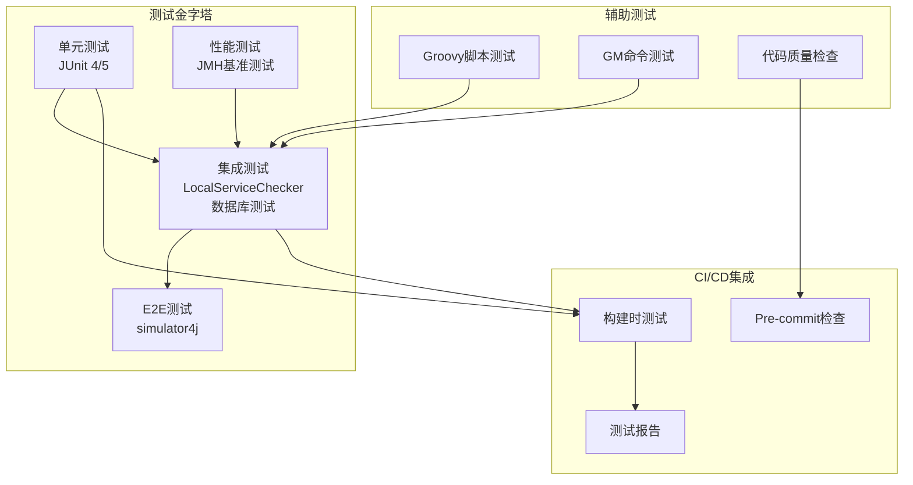
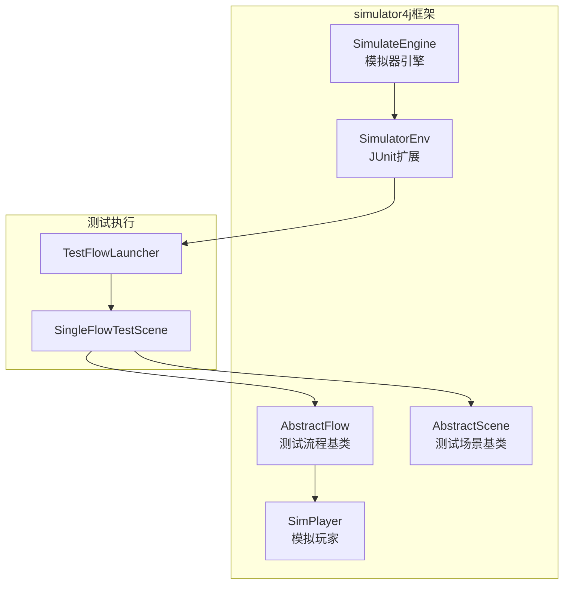
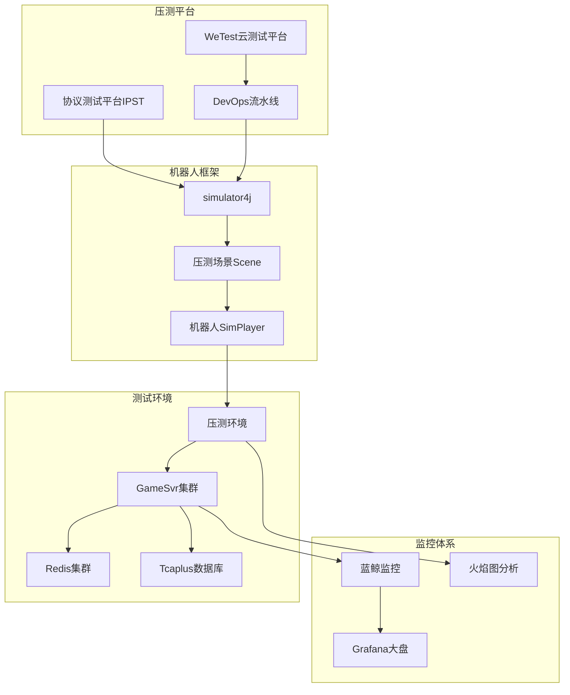
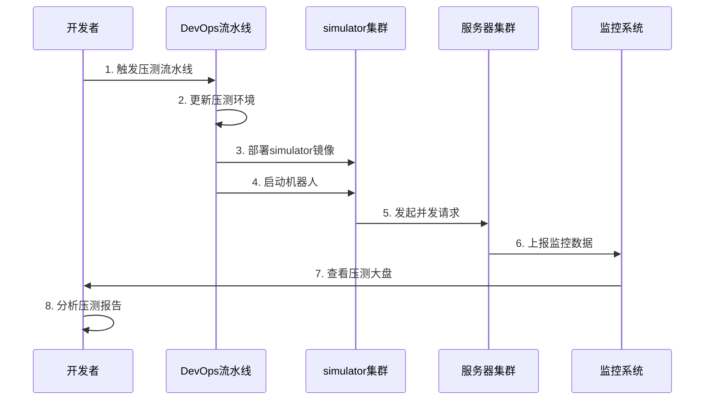
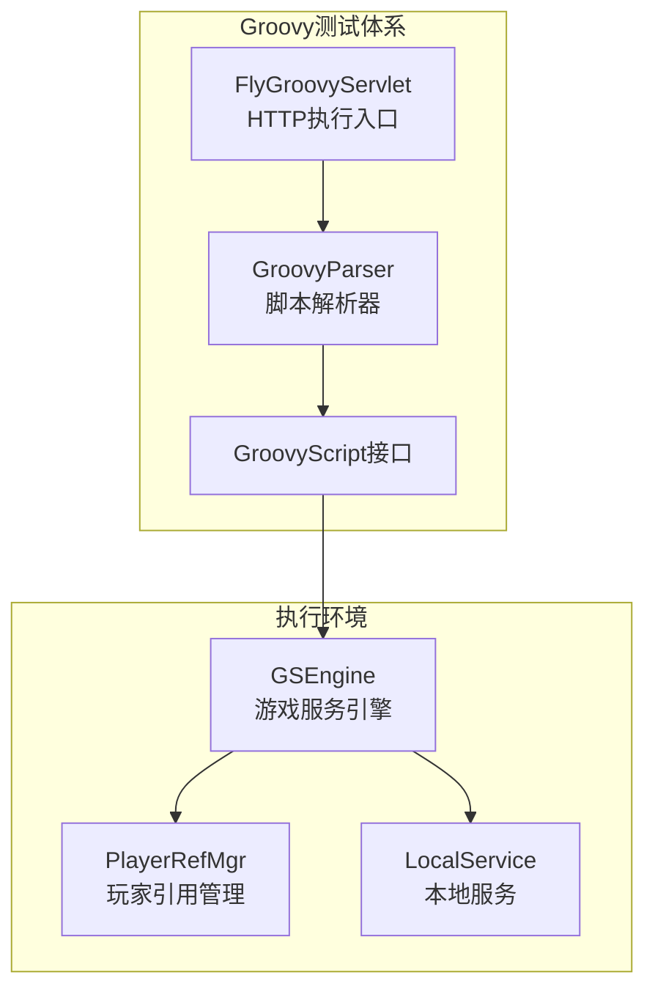
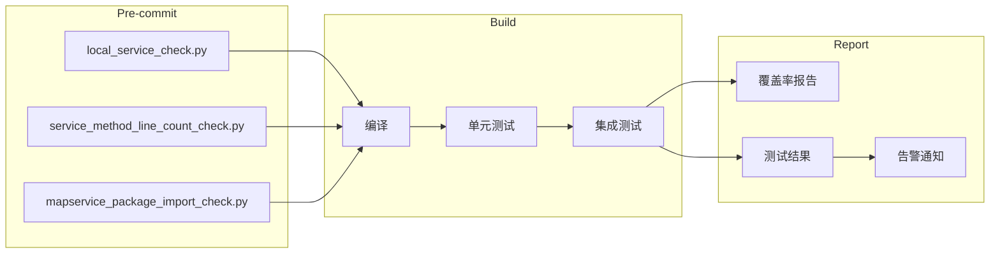
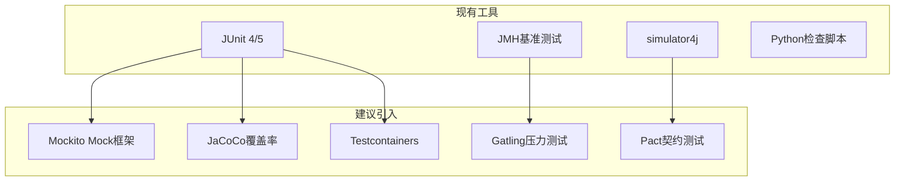

# 24. 测试体系与质量保障分析

## 目录

1. [概述](#概述)
2. [测试分层架构](#测试分层架构)
3. [单元测试体系](#单元测试体系)
4. [集成测试体系](#集成测试体系)
5. [性能测试与基准测试](#性能测试与基准测试)
6. [Groovy脚本测试](#groovy脚本测试)
7. [代码质量检查工具](#代码质量检查工具)
8. [测试数据管理](#测试数据管理)
9. [CI/CD测试集成](#cicd测试集成)
10. [测试最佳实践](#测试最佳实践)
11. [改进空间与建议](#改进空间与建议)

---

## 概述

### 测试体系定位

项目采用**金字塔测试模型**，构建了完整的多层次测试体系，确保代码质量和系统稳定性。

```
                /\
               /  \  E2E测试（少量）
              /----\  - simulator4j端到端测试
             /      \  集成测试（适量）
            /--------\  - LocalService检查测试
           /          \  - 数据库集成测试
          /------------\  单元测试（大量）
         /              \  - JUnit 4/5测试
        /----------------\  - JMH性能基准测试
```

### 核心测试框架

| 测试类型 | 框架/工具 | 用途 |
|---------|----------|------|
| **单元测试** | JUnit 4/5 | 功能模块测试 |
| **集成测试** | simulator4j | 端到端流程测试 |
| **性能测试** | JMH (Java Microbenchmark Harness) | 微基准测试 |
| **脚本测试** | Groovy | 在线调试和功能验证 |
| **代码检查** | Python脚本 | 静态代码分析 |

### 测试覆盖率要求

- **核心业务逻辑**：单元测试覆盖率 ≥ 80%
- **关键接口**：必须有集成测试
- **重要业务流程**：必须有端到端测试

---

## 测试分层架构

### 架构图



### 分层原则

| 层次 | 占比 | 执行时间 | 测试范围 |
|-----|------|---------|---------|
| 单元测试 | 70% | 毫秒级 | 单个类/方法 |
| 集成测试 | 20% | 秒级 | 模块间交互 |
| E2E测试 | 10% | 分钟级 | 完整业务流程 |

---

## 单元测试体系

### 测试框架

项目使用 **JUnit 4/5** 作为主要单元测试框架，配合 **Hamcrest** 提供更丰富的断言能力。

#### Gradle依赖配置

```gradle
// WeA/common/build.gradle
testImplementation 'junit:junit:4.11'
testImplementation 'org.slf4j:slf4j-simple:1.6.1'
testImplementation project(':protocol')

// WeA/projects/gamesvr/build.gradle
testImplementation 'org.hamcrest:hamcrest:2.2'
```

### 测试用例分布

项目包含 **165+ 个测试用例**，分布在 **54+ 个测试文件**中：

| 模块 | 测试文件 | 测试用例数 |
|-----|---------|-----------|
| common | ResourcePoolTest.java | 24 |
| common | ReflectionTest.java | 42 |
| common | ResPatchTest.java | 7 |
| timiutil | ArrayDequeTest.java | 8 |
| simulator4j | LoginTest.java | 3 |
| tcaplusclient | 多个测试文件 | 12+ |

### 标准单元测试模板

```java
package com.tencent.nk.activity;

import com.tencent.nk.util.NKErrorCode;
import com.tencent.timiutil.time.DateUtils;
import org.apache.logging.log4j.LogManager;
import org.apache.logging.log4j.Logger;
import org.junit.Assert;
import org.junit.Test;
import org.junit.Before;
import org.junit.After;

public class ActivityTest {
    
    private static final Logger LOGGER = LogManager.getLogger(ActivityTest.class);

    // 静态初始化块 - 初始化错误码等全局资源
    static {
        NKErrorCode.init();
    }

    /**
     * 测试前准备 - 每个测试方法执行前调用
     */
    @Before
    public void before() throws Exception {
        DateUtils.init(0L);  // 初始化时间工具
        // 准备测试数据
    }

    /**
     * 测试后清理 - 每个测试方法执行后调用
     */
    @After
    public void after() throws Exception {
        // 清理测试数据
    }

    /**
     * 测试活动时间段判断逻辑
     */
    @Test
    public void testJudgeValidTimeSpan() {
        // Given - 准备测试数据
        long applyTimestramp = Framework.currentTimeSec();
        var timeData = ResActivity.ActivityTimeData.newBuilder();
        timeData.getShowBeginTimeBuilder().setSeconds(1L);
        timeData.getShowEndTimeBuilder().setSeconds(1000L);
        
        // When - 执行测试方法
        var timeSpan = ActivityTimeUtil.judgeValidTimeSpan(
            timeData.build(), applyTimestramp);
        
        // Then - 验证结果
        Assert.assertNotNull(timeSpan);
        Assert.assertEquals(timeSpan.getBeginTimeSec(), 
            timeData.getShowBeginTime().getSeconds());
    }
}
```

### 协程环境单元测试

由于项目使用协程框架，涉及异步操作的测试需要在协程环境中执行：

```java
public class ResourcePoolTest {
    private static final Logger logger = LogManager.getLogger(ResourcePoolTest.class);
    
    private static DefaultService defaultService = null;
    private ResourcePool resourcePool;

    static {
        NKErrorCode.init();
    }

    @Before
    public void setUp() throws Exception {
        DateUtils.init(0L);
        initConfig();
        CoroHandle.init();        // 初始化协程
        Cache.init();             // 初始化缓存
        
        this.defaultService = new DefaultService();
        this.resourcePool = ResourcePool.get();
        
        // 初始化资源池配置
        NKErrorCode ret = this.resourcePool.load();
        assertEquals("资源池配置加载失败", NKErrorCode.OK, ret);
    }
    
    @After
    public void tearDown() throws Exception {
        try {
            this.defaultService.callJob(() -> {
                if (this.resourcePoolConsumer != null) {
                    this.resourcePoolConsumer.close();
                }
                return null;
            }, "res pool claim", true);
        } finally {
            CoroHandle.preStop();  // 停止协程
        }
    }
    
    /**
     * 测试基本的资源claim功能
     */
    @Test
    public void testBasicClaim() {
        String consumer = "test_consumer_" + DateUtils.currentTimeMillis();
        String resourceKey = "basic_claim_test_pool";
        
        try {
            // 在协程环境中执行测试
            this.defaultService.callJob(() -> {
                ResourcePoolDescriptor desc = resourcePool.claim(
                    consumer, resourceKey, 2, 5, 30000);
                
                assertNotNull("资源描述符不应为空", desc);
                assertEquals("资源键应匹配", resourceKey, desc.resourceKey);
                assertFalse("不应有错误", desc.hasError());
                
                return null;
            }, "res pool claim", true);
        } catch (NKCheckedException e) {
            fail(e.toString());
        }
    }
}
```

### 测试配置管理

测试配置通过 `.properties` 文件管理：

```properties
# ResourcePoolTest.properties

# 基本测试资源池
resource_pool_test_1_key=basic_claim_test_pool
resource_pool_test_1_total_capacity=15
resource_pool_test_1_consumer_limit=99

# 容量限制测试资源池
resource_pool_test_2_key=capacity_limit_test_pool
resource_pool_test_2_total_capacity=8
resource_pool_test_2_consumer_limit=99

# 并发测试资源池
resource_pool_test_9_key=concurrent_test_pool
resource_pool_test_9_total_capacity=50
resource_pool_test_9_consumer_limit=99
```

### 异常测试

```java
/**
 * 测试无效资源键的处理
 */
@Test
public void testInvalidResourceKey() {
    String consumer = "invalid_test_consumer_" + DateUtils.currentTimeMillis();
    String invalidKey = "non_existent_pool_" + DateUtils.currentTimeMillis();
    
    try {
        this.defaultService.callJob(() -> {
            ResourcePoolDescriptor desc = resourcePool.claim(
                consumer, invalidKey, 2, 5, 30000);
            
            assertNotNull("应返回描述符对象", desc);
            assertTrue("应有错误", desc.hasError());
            assertEquals("应返回资源池键非法错误", 
                NKErrorCode.ResourcePoolKeyIllegal, desc.errorCode);
            
            return null;
        }, "res pool invalid key", true);
    } catch (Exception e) {
        fail(e.toString());
    }
}

/**
 * 使用expected属性测试预期异常
 */
@Test(expected = NoSuchFieldException.class)
public void testFieldNotFound() throws Exception {
    ReflectionUtil.getField(SomeClass.class, "nonExistentField");
}
```

---

## 集成测试体系

### simulator4j 模拟器测试框架

项目实现了专门的游戏模拟器测试框架 `simulator4j`，用于端到端的集成测试。

#### 框架架构



#### SimulatorEnv - JUnit 5扩展

`SimulatorEnv` 是一个 JUnit 5 扩展，提供模拟器测试环境的自动管理：

```java
package com.tencent.nk.simulator4j.core;

/**
 * 模拟器env - JUnit 5测试扩展
 * 
 * 功能特性：
 * - 自动初始化模拟器引擎
 * - 在协程环境中执行测试
 * - 自动管理测试生命周期
 */
public class SimulatorEnv implements InvocationInterceptor, 
        BeforeAllCallback, AfterAllCallback {

    private static final Logger LOGGER = LogManager.getLogger(SimulatorEnv.class);

    /**
     * 测试类执行前 - 初始化模拟器环境
     */
    @Override
    public void beforeAll(ExtensionContext context) throws Exception {
        String[] args = new String[]{
            "--config", "cfg/config.pb", 
            "--properties", "properties/"
        };
        SimulateEngine.getInstance().init(true);
        RunningMap.getInstance().setEnable(false);
        LOGGER.debug("SimulatorEnv start");
    }

    /**
     * 测试类执行后 - 清理环境
     */
    @Override
    public void afterAll(ExtensionContext context) throws Exception {
        LOGGER.debug("SimulatorEnv end");
    }

    /**
     * 拦截测试方法 - 在协程环境中执行
     */
    @Override
    public void interceptTestMethod(Invocation<Void> invocation, 
            ReflectiveInvocationContext<Method> invocationContext,
            ExtensionContext extensionContext) throws Throwable {
        // 在SimPlayerService的协程环境中执行测试
        SimPlayerService.getInstance().callJob(0, () -> {
            try {
                invocation.proceed();
            } catch (Throwable throwable) {
                LOGGER.error("method {} run throwable ", 
                    invocationContext.getExecutable().getName(), throwable);
            }
            return null;
        }, "unittest");
    }
}
```

#### 测试流程基类 (AbstractFlow)

```java
package com.tencent.wea.simulator4j.flow.com;

/**
 * flow的抽象类 - 定义测试流程的标准接口
 */
public abstract class AbstractFlow {

    private static final Logger LOGGER = LogManager.getLogger(AbstractFlow.class);

    /**
     * 检查登录状态
     * @return 表示运行flow前是否检查登录状态
     */
    public boolean checkLoginStatus() {
        return true;
    }

    /**
     * 启动测试流程
     */
    public final void launch(SimPlayer player, Object... args) {
        if (LOGGER.isDebugEnabled()) {
            LOGGER.debug("{} launch flow {}", 
                player.getLogUniqueId(), getClass().getName());
        }

        if (!player.isLogin() && checkLoginStatus()) {
            NKErrorCode.SessionStateError.throwError(
                "unlogined before running {}", getClass().getName());
        }
        run(player, args);
    }

    /**
     * 执行测试流程 - 由子类实现具体测试逻辑
     */
    public abstract void run(SimPlayer player, Object... args);
}
```

#### TestFlowLauncher - 测试流程启动器

```java
package com.tencent.nk.simulator4j.core;

/**
 * 测试流程启动器 - 简化测试流程的执行
 */
public class TestFlowLauncher {

    public static void launch(AbstractFlow flow) {
        SingleFlowTestScene testScene = new SingleFlowTestScene(flow);
        testScene.init(World.getInstance().getContinent(0));
        testScene.launch();
    }
}
```

#### 完整集成测试示例

```java
package com.tencent.nk.simulator4j.login;

import com.tencent.nk.simulator4j.core.SimulatorEnv;
import com.tencent.nk.simulator4j.core.TestFlowLauncher;
import com.tencent.wea.simulator4j.flow.LoginFlow;
import org.junit.jupiter.api.*;
import org.junit.jupiter.api.extension.ExtendWith;

/**
 * 登录流程集成测试
 */
@TestMethodOrder(MethodOrderer.OrderAnnotation.class)  // 按顺序执行
@ExtendWith(SimulatorEnv.class)  // 使用模拟器测试环境
public class LoginTest {

    private static final Logger LOGGER = LogManager.getLogger(LoginTest.class);

    @BeforeAll
    public static void init() {
        LOGGER.debug("LoginTest start");
    }

    @AfterAll
    public static void end() {
        LOGGER.debug("LoginTest end");
    }

    /**
     * 测试注册登录流程
     */
    @Test
    @DisplayName(value = "注册登录")
    @Order(1)
    public void testRegister() {
        LoginFlow flow = new LoginFlow();
        TestFlowLauncher.launch(flow);
    }
}
```

### LocalService检查测试

`LocalServiceChecker` 用于验证服务间调用的正确性：

```java
package com.tencent.wea.localservice;

import com.tencent.nk.gamemodule.LocalServiceChecker;
import com.tencent.nk.gamemodule.ServiceRouteStrategy;
import com.tencent.wea.playerservice.playerref.BatchPlayerRef;
import com.tencent.wea.playerservice.playerref.PlayerRef;
import org.junit.Assert;
import org.junit.Test;

/**
 * GameServer LocalService正确性检查测试
 */
public class GamesvrLocalServiceTest extends LocalServiceChecker {

    private static final Logger LOGGER = 
        LogManager.getLogger(GamesvrLocalServiceTest.class);

    @Test
    public void check() {
        // 添加需要检查的LocalService
        addLocalServiceForCheck(PlayerRef.class, 
            ServiceRouteStrategy.DEFAULT, false);
        addLocalServiceForCheck(BatchPlayerRef.class, 
            ServiceRouteStrategy.DEFAULT, true);
        
        // 执行检查
        Assert.assertTrue(checkFunc());
    }
}
```

### 数据库集成测试

```java
/**
 * 数据库操作集成测试示例
 */
@Test
public void testDatabaseOperation() throws Exception {
    // 初始化数据库连接
    Cache.init();
    
    try {
        defaultService.callJob(() -> {
            // 执行数据库操作测试
            Player player = playerService.getPlayer(testUid);
            Assert.assertNotNull("玩家数据不应为空", player);
            
            // 修改数据
            player.setName("TestPlayer");
            playerService.savePlayer(player);
            
            // 验证修改
            Player updated = playerService.getPlayer(testUid);
            Assert.assertEquals("玩家名称应已更新", 
                "TestPlayer", updated.getName());
            
            return null;
        }, "db test", true);
    } finally {
        // 清理测试数据
        cleanupTestData(testUid);
    }
}
```

---

## 性能测试与基准测试

### JMH基准测试框架

项目使用 **JMH (Java Microbenchmark Harness)** 进行微基准测试，测试代码位于 `src/jmh/java` 目录。

#### 已有基准测试项目

| 测试类 | 测试对象 | 测试指标 |
|-------|---------|---------|
| RateLimiterBenchmark | 分布式限流器 | 吞吐量、平均延迟 |
| ResourcePoolBenchmark | 资源池 | 吞吐量、平均延迟 |
| GameLiveBenchmark | 游戏直播模块 | 吞吐量、平均延迟 |
| StatClusterBenchmark | 统计集群 | 吞吐量、平均延迟 |
| ResPatchBenchmark | 资源补丁 | 吞吐量、平均延迟 |
| DynamicPriorityQueueBenchmark | 动态优先队列 | 吞吐量、平均延迟 |
| RedisOpBenchmark | Redis操作 | 吞吐量、平均延迟 |

#### JMH测试模板

```java
package com.tencent.ratelimiter;

import org.openjdk.jmh.annotations.*;
import org.openjdk.jmh.runner.Runner;
import org.openjdk.jmh.runner.options.Options;
import org.openjdk.jmh.runner.options.OptionsBuilder;
import java.util.concurrent.TimeUnit;

/**
 * 限流器性能基准测试
 */
@BenchmarkMode({Mode.Throughput, Mode.AverageTime})  // 测试吞吐量和平均时间
@Warmup(iterations = 1, time = 1, timeUnit = TimeUnit.SECONDS)  // 预热
@Measurement(iterations = 1, time = 5, timeUnit = TimeUnit.SECONDS)  // 测量
@OutputTimeUnit(TimeUnit.MILLISECONDS)  // 输出时间单位
@Fork(value = 1)  // Fork数
@Threads(12)  // 并发线程数
@State(Scope.Benchmark)  // 状态作用域
@OperationsPerInvocation
public class RateLimiterBenchmark {
    
    private static final Logger logger = 
        LogManager.getLogger(RateLimiterBenchmark.class);
    
    static DefaultService defaultService = null;
    RateLimiter rateLimiter = new DistributeRateLimiter();

    // 参数化测试 - 不同阈值
    @Param(value = {"10", "50", "100", "200", "500", "1000"})
    private long threshold;
    private int seqence = 0; 

    static {
        NKErrorCode.init();
        DateUtils.init(0L);
    }
    
    /**
     * 初始化配置
     */
    public void initConfig() {
        try {
            InputStream inputStream = this.getClass()
                .getClassLoader()
                .getResourceAsStream("RateLimiterBenchmark.properties");
            var config = new Properties();
            config.load(new InputStreamReader(inputStream));
            PropertyFileReader.init(config, config);
        } catch (java.io.IOException e) {
            e.printStackTrace();
        }
    }

    /**
     * 测试准备 - 初始化协程和缓存
     */
    @Setup
    public void setUp() {
        initConfig();
        CoroHandle.init();
        Cache.init();
        this.defaultService = new DefaultService();
    }

    /**
     * 测试清理 - 停止协程
     */
    @TearDown
    public void tearDown() {
        CoroHandle.preStop();
    }

    /**
     * 基准测试方法 - 测试限流器获取操作
     */
    @Benchmark
    public boolean testAcquire() {
        String resKey = NKStringFormater.format(
            "global_notice_msg_{{}}", this.threshold);
        String indentify = NKStringFormater.format(
            "svr:{}:{}", "0", ++this.seqence);

        try {
            return this.defaultService.callJob(() -> {
                return rateLimiter.acquire(resKey, indentify, 5, this.threshold);
            }, "test_rate_limiter", true);
        } catch (NKCheckedException e) {
            e.printStackTrace();
        }
        return false;
    }
}
```

#### 多场景基准测试

```java
/**
 * 资源补丁性能基准测试 - 多种场景
 */
@BenchmarkMode({Mode.Throughput, Mode.AverageTime})
@Warmup(iterations = 1, time = 1, timeUnit = TimeUnit.SECONDS)
@Measurement(iterations = 1, time = 5, timeUnit = TimeUnit.SECONDS)
@State(Scope.Benchmark)
public class ResPatchBenchmark {

    @Benchmark
    public void testSmallPatch() {
        // 小补丁场景测试
    }
    
    @Benchmark
    public void testMediumPatch() {
        // 中等补丁场景测试
    }
    
    @Benchmark
    public void testLargePatch() {
        // 大补丁场景测试
    }
    
    @Benchmark
    public void testConcurrentPatch() {
        // 并发补丁场景测试
    }
}
```

### 性能指标要求

| 场景 | 指标 | 要求 |
|-----|------|------|
| RPC调用 | P99延迟 | < 50ms |
| Redis操作 | P99延迟 | < 5ms |
| 单服在线 | 用户数 | 5000+ |
| 单服TPS | 每秒事务 | 1000+ |
| 协程池 | 利用率 | < 80% |

---

## 压力测试体系

### 压测体系概述

项目构建了完整的**分布式压力测试体系**，支持从单接口压测到综合业务场景的全覆盖测试。压测体系基于自研的 **simulator4j** 机器人框架，配合 **WeTest** 云测试平台和 **协议测试平台(IPST)** 实现大规模并发测试。

### 压测架构



### simulator4j 压测框架

#### 框架架构

simulator4j 是一个基于协程的分布式游戏机器人模拟框架，支持大规模并发压测：

| 组件 | 类名 | 功能 |
|-----|------|------|
| **场景基类** | AbstractScene | 普通压测场景基类 |
| **状态机场景** | AbstractStateMachineScene | 状态机驱动的复杂场景 |
| **模拟玩家** | SimPlayer | 模拟客户端玩家行为 |
| **世界管理** | World | 管理所有机器人和场景 |
| **协议处理** | PbMsgClientHandler | 处理CS协议收发 |

#### 场景类型

**1. AbstractScene - 普通场景**

适用于简单、顺序执行的压测场景：

```java
public class RobotLoginScene extends AbstractScene {
    
    @Override
    protected void initProperties(List<SimPlayer> players) {
        // 初始化场景参数
        StringPropertyReader properties = getSceneProperties();
        int tps = properties.getIntItem("tps", 100);
        int playerCnt = properties.getIntItem("playerCnt", 1000);
    }
    
    @Override
    public void run(SimPlayer player) {
        // 执行登录流程
        player.login();
        // 执行其他操作...
    }
}
```

**2. AbstractStateMachineScene - 状态机场景**

适用于模拟真实玩家行为的复杂场景，使用权重驱动状态转换：

```java
public abstract class AbstractStateMachineScene extends AbstractScene {
    
    // 核心配置参数
    protected int initialTps;         // 初始TPS（登录速率）
    protected int runTps;             // 运行TPS（操作速率）
    protected long epochDuration;     // 每轮持续时间
    protected long totalDuration;     // 总持续时间
    protected String playerVersion;   // 客户端版本
    
    // 状态机核心
    private Map<SimPlayer, StateMachine> stateMachineMap;
    
    // 定义状态转换
    @TransitionTag(from = "IDLE", to = "LOBBY")
    public void enterLobby(SimPlayer player) {
        // 进入大厅
    }
    
    @TransitionTag(from = "LOBBY", to = "BATTLE")
    public void startBattle(SimPlayer player) {
        // 开始战斗
    }
}
```

#### 压测场景列表

项目包含 **200+** 个压测场景，覆盖所有核心业务模块：

| 场景分类 | 示例场景 | 测试内容 |
|---------|---------|---------|
| **登录测试** | RobotLoginScene | 登录TPS、首次登录耗时 |
| **房间测试** | RobotRoomScene, RobotRMBScene | 房间创建/解散/邀请 |
| **匹配测试** | RobotMatchScene, RobotCocMatchScene | 匹配队列、匹配耗时 |
| **战斗测试** | RobotBattleScene, RobotMOBAScene | 战斗流程、战斗结算 |
| **社交测试** | RobotFriendScene, RobotChatScene | 好友系统、聊天系统 |
| **UGC测试** | RobotUgcScene, RobotUgcLobbyScene | UGC创建/发布/拉取 |
| **农场测试** | RobotFarmScene, RobotFarmStealScene | 农场操作、偷菜 |
| **活动测试** | RobotActivityScene | 活动列表、活动奖励 |
| **邮件测试** | RobotMailScene, RobotMailTestScene | 邮件收发、附件领取 |
| **排行榜测试** | RobotRankScene | 排行榜更新、排行榜拉取 |
| **综合测试** | RobotLetsGoStateMachineScene | 全流程状态机压测 |

### 压测配置与执行

#### 本地压测配置

```python
# config.py - 压测配置文件
scene_config = {
    "scene": "RobotLoginScene",      # 场景名称
    "playerCnt": 1000,               # 机器人数量
    "loginTps": 50,                  # 登录TPS
    "runTps": 200,                   # 运行TPS
    "runCnt": 100,                   # 每个机器人执行次数
    "playerVersion": "1.6.10.1",   # 客户端版本
}
```

#### 流水线压测配置

```bash
# 压测参数示例
# 格式: simulator数量,线程数|场景名|参数列表
40,5|RobotLetsGoStateMachineScene|playerCnt:300,initialTps:2,runTps:50,noBatchSubmit:TRUE,epochDuration:60000,lobbyDuration:1500000,delayMax:900000,offlineIfErr:FALSE,mod:activity#bag#battle#chat#feature#guide#info#jump#mail#mall#misc#permit#raffle#resource#rank#relation#slip#task#ugc#xiaowo#lobby,playerVersion:1.6.10.1
```

#### 压测执行流程



### 压测监控指标

#### 客户端指标（Grafana）

| 指标 | 说明 | 告警阈值 |
|-----|------|---------|
| TPS | 每秒事务数 | - |
| 成功率 | 请求成功率 | < 99% |
| 平均耗时 | 平均响应时间 | > 200ms |
| P95耗时 | 95%请求耗时 | > 500ms |
| P99耗时 | 99%请求耗时 | > 1000ms |
| 超时数 | 超时请求数量 | > 0 |

#### 服务端指标（蓝鲸监控）

| 指标 | 说明 | 告警阈值 |
|-----|------|---------|
| CPU使用率 | 进程CPU占用 | > 80% |
| 内存使用率 | 进程内存占用 | > 90% |
| 协程队列长度 | 待处理任务数 | > 10000 |
| RPC延迟 | 服务间调用延迟 | > 50ms |
| Redis延迟 | Redis操作延迟 | > 10ms |
| DB延迟 | 数据库操作延迟 | > 20ms |

### 压测报告与分析

#### 模块压测报告示例

**登录模块压测报告**：

| 配置项 | 值 |
|-------|-----|
| 环境 | letsgo-hakulapress |
| GameSvr数量 | 2 |
| CPU/内存 | 4核/12GB |
| 机器人数量 | 5000 |
| 登录TPS | 200 |

| 事务名 | TPS | 成功率 | 平均耗时 | P95耗时 |
|-------|-----|--------|---------|---------|
| Login_C2S_Msg | 200 | 100% | 233ms | 319ms |

**房间模块压测报告（RMB场景）**：

| 事务名 | TPS | 成功率 | 说明 |
|-------|-----|--------|------|
| RoomCreate_C2S_Msg | 189.5 | 100% | 创建房间 |
| RoomInvite_C2S_Msg | 22.6 | 100% | 邀请好友 |
| RoomStart_C2S_Msg | 136.8 | 100% | 开始匹配 |
| RoomDisband_C2S_Msg | 165.9 | 100% | 解散房间 |

#### 综合压测报告示例

**S9综合压测配置**：
- 环境：letsgo-qapress4
- GameSvr：10实例
- 机器人数量：6万
- 持续时间：17小时

**压测结论**：
- 暂未发现明显耗时过高协议
- 压测过程中内存占用较高（97%以上）
- 停止压测后内存占用下降（80%左右）

### 压测工具链

#### 1. WeTest 云测试平台

```
地址：https://cloudtest.woa.com
功能：
- 自动化压测执行
- 压测报告生成
- 历史数据对比
```

#### 2. 协议测试平台 (IPST)

```
地址：https://ipst.woa.com
功能：
- 创建测试计划
- 配置机器人参数
- 执行压测任务
- 查看实时数据
```

#### 3. DevOps 流水线

| 流水线 | 功能 | 地址 |
|-------|------|------|
| 更新模拟器 | 构建simulator镜像 | devops.woa.com/.../simulator |
| 更新压测环境 | 部署服务端 | devops.woa.com/.../press-env |
| 启动模拟器 | 启动压测任务 | devops.woa.com/.../start-sim |

#### 4. 监控大盘

| 大盘 | 功能 | 说明 |
|-----|------|------|
| Grafana事务大盘 | 客户端上报数据 | TPS/耗时/成功率 |
| 蓝鲸负载均衡 | 服务端资源监控 | CPU/内存/连接数 |

### 压测最佳实践

#### 压测前准备

```
1. 确认测试环境配置
   - 服务器规格（CPU、内存）
   - 实例数量
   - 数据库配置

2. 准备测试数据
   - 测试账号范围
   - 账号数据初始化
   - 配置版本确认

3. 配置监控
   - 开启详细日志
   - 配置火焰图采集
   - 设置告警阈值
```

#### 压测执行步骤

```java
@Test
public void testPerformance() throws Exception {
    // 1. 预热阶段
    warmUp(100);
    
    // 2. 逐步增加并发量
    int[] concurrentLevels = {100, 500, 1000, 2000, 5000};
    
    for (int concurrent : concurrentLevels) {
        LOGGER.info("开始压测，并发数: {}", concurrent);
        
        long startTime = System.currentTimeMillis();
        CountDownLatch latch = new CountDownLatch(concurrent);
        
        // 启动并发请求
        for (int i = 0; i < concurrent; i++) {
            executor.submit(() -> {
                try {
                    performBusinessOperation();
                } finally {
                    latch.countDown();
                }
            });
        }
        
        latch.await();
        long duration = System.currentTimeMillis() - startTime;
        
        // 3. 记录性能指标
        double tps = concurrent * 1000.0 / duration;
        LOGGER.info("并发数: {}, 耗时: {}ms, TPS: {}", concurrent, duration, tps);
        
        // 4. 检查系统状态
        checkSystemHealth();
        
        // 5. 等待系统恢复
        Thread.sleep(5000);
    }
}
```

#### 常见问题排查

| 问题 | 可能原因 | 排查方法 |
|-----|---------|---------|
| 登录超时 | loginTps过高 | 降低loginTps参数 |
| 大量失败 | 服务端异常 | 查看服务端日志 |
| 内存溢出 | Player数据过大 | 分析HeapDump |
| CPU过高 | 热点代码 | 分析火焰图 |
| 协程阻塞 | IO等待过长 | 检查协程队列长度 |

### 性能分析工具

#### 1. 火焰图分析

```bash
# 使用async-profiler采集火焰图
sh profiler.sh -d 60 -f cpu.html <pid>

# 分析结果关注点
# - 热点方法
# - GC时间占比
# - IO等待时间
```

#### 2. HeapDump分析

```bash
# 生成HeapDump
jmap -dump:format=b,file=heapdump.hprof <pid>

# 使用MAT或JProfiler分析
# - 大对象分析
# - 内存泄漏检测
# - 对象引用链
```

#### 3. 压测数据记录

```java
// 使用监控系统记录压测数据
Monitor.getInstance().add.total(MonitorId.attr_stress_test_tps, tps, 
    new String[]{"concurrent_" + concurrent});
Monitor.getInstance().add.avg(MonitorId.attr_stress_test_rt, avgResponseTime, 
    new String[]{"concurrent_" + concurrent});
```

### 已有压测报告汇总

| 模块 | 压测场景 | 典型TPS | 典型耗时 | 备注 |
|-----|---------|---------|---------|------|
| **登录** | RobotLoginScene | 200 | 233ms | 有好友账号耗时更高 |
| **房间** | RobotRMBScene | 189 | 50ms | 房间创建 |
| **匹配** | RobotMatchScene | 1180 | 185ms | 单人匹配 |
| **邮件** | RobotMailTestScene | 2476 | 26ms | 邮件列表 |
| **活动** | RobotActivityScene | 3800 | 28ms | 活动列表 |
| **任务** | RobotTaskTestScene | 2926 | 28ms | 任务完成 |
| **通行证** | RobotPermitScene | 2302 | 11ms | 通行证信息 |
| **UGC** | RobotUgcScene | 7216 | - | 地图创建 |
| **社团** | RobotClubScene | 600 | 190ms | 创建/解散 |
| **排行榜** | RobotRankScene | 1000 | - | 榜单更新 |

---

## Groovy脚本测试

### 概述

项目支持使用 **Groovy脚本** 进行在线调试和功能验证测试。Groovy脚本可以在运行时动态加载执行，非常适合快速验证和问题排查。

### Groovy脚本架构



### GroovyScript接口

```java
package com.tencent.nk.groovy;

/**
 * Groovy脚本接口 - 所有测试脚本需要实现此接口
 */
public interface GroovyScript {
    /**
     * 执行脚本
     * @param args 脚本参数
     * @return 执行结果
     */
    String runScript(String[] args);
}
```

### 标准Groovy测试脚本模板

```groovy
package com.tencent.wea.scripts.rentao

import com.tencent.nk.groovy.GroovyScript
import com.tencent.nk.util.NKErrorCode
import com.tencent.timiCoroutine.LocalService
import com.tencent.timiCoroutine.TimiCoroExecutorService
import com.tencent.timiutil.time.DateUtils
import com.tencent.wea.framework.GSEngine
import com.tencent.wea.playerservice.player.Player
import com.tencent.wea.playerservice.playerref.PlayerRefMgr

import java.util.concurrent.Callable

/**
 * 测试脚本示例
 */
class Test implements GroovyScript {

    @Override
    String runScript(String[] args) {
        return test()
    }

    /**
     * 在PlayerService上下文中执行操作
     */
    static void runOnPlayerService(long uid, Callable<Void> callable) {
        def playerService = GSEngine.getSpecInstance().getPlayerService();
        LocalService.DoNotDirectCall.GroovyTest.runJob(
            playerService, uid, callable, "GameServerGroovyScript", false)
    }

    /**
     * 获取系统执行器
     */
    public TimiCoroExecutorService GetSystemExecuter() {
        return TimiCoroExecutorService.newInstanceWithNewContainer(
            "system_jobQueue", 200, 10, 100,
            TimiCoroExecutorService.InitContext.defaultInstance());
    }

    /**
     * 测试排行榜刷新功能
     */
    String freshRank() {
        long uid = 1900140737488530334L
        runOnPlayerService(uid, () -> {
            long currentSec = DateUtils.currentTimeSec();
            int rankId = 3001
            Random random = new Random();
            
            // 获取玩家对象
            Player player = PlayerRefMgr.getInstance().groovyGetPlayer(uid);

            // 批量测试刷新操作
            BenchUtils.benchCallable("freshRank", () -> {
                ResRanking.RankingConf rankingConf = 
                    RankingConfData.getInstance().get(rankId);
                RankSeasonInfo info = 
                    RankIdSeasonIdMapper.ofTs(rankingConf.getRankId(), currentSec);
                int randomNumber = random.nextInt(10000) + 1;
                player.getRankManager().refresh(rankId, randomNumber, info.getId());
            }, 100000, 1000)  // 执行10万次，每1000次输出一次
        })

        return null
    }

    /**
     * 简单测试方法
     */
    String test(String[] args) {
        LOGGER.info("Wea tsg test log, test")
    }
}
```

### Groovy脚本调用方式

#### 1. HTTP接口调用

```bash
# 通过curl调用Groovy脚本
./curl_230.0.10.1.sh groovy \
    "/data/home/user/letsgo_server/WeA/projects/gamesvr/src/main/java/com/tencent/wea/scripts/Test.groovy" \
    testMethod "param1 param2"
```

#### 2. 代码内调用

```java
// GSEngine中调用Groovy脚本
String groovyArg = "scripts/GamePlayerScript.groovy runScript " + arg;
Framework.getInstance().doGroovy(groovyArg);
```

### Groovy测试脚本分类

| 目录 | 用途 | 示例脚本 |
|-----|------|---------|
| gamesvr/scripts | 玩家相关测试 | CoolinTest.groovy, HugoTest.groovy |
| battlesvr/scripts | 战斗相关测试 | JoinTest.groovy, TestMigrateDS.groovy |
| cocsvr/scripts | 匹配相关测试 | CocMatchTest.groovy, CocPlayerLoadTest.groovy |
| farmsvr/scripts | 农场相关测试 | FarmTest.groovy, FarmPreHeatGroovy.groovy |

### 最佳实践

```groovy
/**
 * Groovy脚本最佳实践示例
 */
class BestPracticeScript implements GroovyScript {

    @Override
    String runScript(String[] args) {
        // 1. 参数验证
        if (args.length < 1) {
            return "Error: Missing required parameter"
        }
        
        try {
            long uid = Long.parseLong(args[0])
            
            // 2. 在正确的上下文中执行
            runOnPlayerService(uid, () -> {
                // 3. 获取玩家对象
                Player player = PlayerRefMgr.getInstance().groovyGetPlayer(uid);
                if (player == null) {
                    LOGGER.error("Player not found: {}", uid)
                    return
                }
                
                // 4. 执行测试逻辑
                doTestLogic(player)
                
                // 5. 记录日志
                LOGGER.info("Test completed for player: {}", uid)
            })
            
            return "Success"
        } catch (Exception e) {
            LOGGER.error("Script execution failed", e)
            return "Error: " + e.getMessage()
        }
    }
}
```

---

## 代码质量检查工具

### 概述

项目实现了多个Python脚本用于自动化代码质量检查，这些检查会在构建流程中自动执行。

### 检查工具列表

| 工具 | 文件 | 检查内容 |
|-----|------|---------|
| LocalService包检查 | local_service_check.py | 包依赖规范 |
| 方法行数检查 | service_method_line_count_check.py | 方法复杂度 |
| MapService依赖检查 | mapservice_package_import_check.py | 服务依赖规范 |
| Proto/XML兼容性检查 | proto_xml_check.py | 协议向后兼容性 |

### local_service_check.py - LocalService包检查

#### 工作原理

```python
# -*- coding: utf-8 -*-
"""
LocalService包检查工具

功能：检查代码是否违反LocalService的包隔离规则
原理：扫描Java文件，检查是否存在对LocalService内部包的非法访问
"""

def local_service_check(current_package, local_service_def, 
                         code_line, file_name, line_number):
    """
    检查单行代码是否违反LocalService访问规则
    
    Args:
        current_package: 当前文件所在包
        local_service_def: LocalService定义（包名和导出类列表）
        code_line: 代码行内容
        file_name: 文件名
        line_number: 行号
    """
    check_package = local_service_def.local_package_name

    # 包内部可以直接访问
    if check_package in current_package:
        return

    # 跳过注释行
    if code_line.startswith("//"):
        return

    # 检查是否访问了非导出类
    if check_package in code_line:
        for export_java_file in local_service_def.export_class_array:
            export_class_full_name = '{}.{}'.format(
                check_package, export_java_file.replace('.java', ''))
            code_line = code_line.replace(export_class_full_name, '')

        # 如果还包含该包名，说明访问了非导出类
        if check_package in code_line:
            result_array.append(
                u'({}:{}) {}'.format(file_name, line_number, code_line))
```

#### 配置文件 (local_service.json)

```json
{
    "com.tencent.nk.playerservice": [
        "Player.java",
        "PlayerRef.java",
        "PlayerMgr.java"
    ],
    "com.tencent.wea.battleservice": [
        "Battle.java",
        "BattleRef.java"
    ]
}
```

### service_method_line_count_check.py - 方法行数检查

#### 工作原理

```python
# -*- coding: utf-8 -*-
"""
服务方法行数检查工具

功能：检查Service类中的方法是否超过行数限制
原理：解析Java文件，统计每个public方法的行数
"""

def methodLineCountCheck(javaFilePath, javaFileName, methodLineCountLimit):
    """
    检查Java文件中方法的行数
    
    Args:
        javaFilePath: Java文件路径
        javaFileName: Java文件名
        methodLineCountLimit: 方法行数限制
    
    Returns:
        dict: 超过限制的方法及其行数
    """
    with codecs.open(playerRefFilepath, 'r', 'utf-8') as playerRefFile:
        fileLines = playerRefFile.readlines()

    methodStatisticing = False
    methodNameStatisticing = None
    methodCount = 0
    stack = []  # 用于匹配大括号
    methodCountStatisticResult = {}
    
    for line in fileLines:
        line = line.strip()
        
        # 检测方法开始
        if (line.startswith(u'public ') and 
            not line.startswith(u'public class ') and 
            u'static' not in line and 
            u'{' in line):
            methodStatisticing = True
            methodCount = 0
            methodNameStatisticing = getMethodNameFromLine(line)
            stack.append('{')
            
        elif methodStatisticing:
            # 统计方法行数
            for linec in line:
                if linec == u'}':
                    stack.pop()
                    if len(stack) == 0:
                        # 方法结束
                        methodStatisticing = False
                        if methodCount > methodLineCountLimit:
                            methodCountStatisticResult[methodNameStatisticing] = methodCount

                if linec == u'{':
                    stack.append(u'{')
            methodCount += 1

    return methodCountStatisticResult
```

#### 配置文件 (service_method_line_count_check.json)

```json
{
    "projects/gamesvr/src/main/java/com/tencent/wea/playerservice": {
        "PlayerRef.java": 100,
        "Player.java": 150
    }
}
```

### 构建集成

在 `build.sh` 中集成检查：

```bash
# WeA/build.sh

# 执行LocalService包检查
echo "Running LocalService check..."
python local_service_check.py
if [ $? -ne 0 ]; then
    echo "LocalService check failed!"
    exit 1
fi

# 执行方法行数检查
echo "Running method line count check..."
python service_method_line_count_check.py
if [ $? -ne 0 ]; then
    echo "Method line count check failed!"
    exit 1
fi

# 执行MapService依赖检查
echo "Running MapService package import check..."
python mapservice_package_import_check.py
if [ $? -ne 0 ]; then
    echo "MapService package import check failed!"
    exit 1
fi
```

### IntelliJ IDEA插件集成

项目提供了IntelliJ IDEA插件，在保存文件时自动执行检查：

```java
// tools/plugin4nk/src/main/java/.../SaveActionManager.java

public class SaveActionManager {
    public void onSave(String filePath) {
        // 获取项目路径
        String projectPath = getProjectPath();
        String pythonPath = String.format(
            "%s/local_service_check.py", projectPath);
        
        // 执行检查脚本
        Process proc = Runtime.getRuntime().exec(new String[]{
            "python", 
            String.format("%s/local_service_check.py", projectPath), 
            filePath
        });
        
        // 处理检查结果
        handleCheckResult(proc);
    }
}
```

---

## 测试数据管理

### 数据隔离原则

每个测试应使用独立的测试数据，避免测试间相互影响：

```java
/**
 * 测试数据隔离示例
 */
@Test
public void testMultipleConsumers() {
    // ✅ 使用时间戳确保数据唯一性
    long timestamp = DateUtils.currentTimeMillis();
    String consumer1 = "test_consumer_1_" + timestamp;
    String consumer2 = "test_consumer_2_" + timestamp;
    
    // 执行测试...
}
```

### 测试配置管理

#### Properties配置文件结构

```
src/test/resources/
├── ResourcePoolTest.properties      # 资源池测试配置
├── RateLimiterBenchmark.properties  # 限流器基准测试配置
├── GameLiveBenchmark.properties     # 游戏直播基准测试配置
└── log4j2-test.xml                  # 测试日志配置
```

#### 配置加载模板

```java
/**
 * 测试配置加载方法
 */
public void initConfig() {
    try {
        InputStream inputStream = this.getClass()
            .getClassLoader()
            .getResourceAsStream("ResourcePoolTest.properties");
        assertNotNull("配置文件不存在", inputStream);
        
        var config = new Properties();
        config.load(new InputStreamReader(inputStream));
        PropertyFileReader.init(config, config);
        
        logger.info("测试配置初始化完成");
    } catch (java.io.IOException e) {
        e.printStackTrace();
        fail("配置文件加载失败: " + e.toString());
    }
}
```

### 测试数据清理

```java
/**
 * 测试后清理示例
 */
@After
public void tearDown() throws Exception {
    try {
        // 在协程环境中清理资源
        this.defaultService.callJob(() -> {
            // 关闭资源池消费者
            if (this.resourcePoolConsumer != null) {
                this.resourcePoolConsumer.close();
            }
            
            // 关闭资源池管理器
            if (this.resourcePoolManager != null) {
                this.resourcePoolManager.close();
            }
            
            return null;
        }, "cleanup", true);
    } catch (Exception e) {
        e.printStackTrace();
        fail(e.toString());
    } finally {
        // 停止协程环境
        CoroHandle.preStop();
    }
}
```

---

## CI/CD测试集成

### 测试执行流程



### 构建流程中的测试

```bash
# build.sh 中的测试执行步骤

# 1. 代码质量检查
python local_service_check.py
python service_method_line_count_check.py
python mapservice_package_import_check.py

# 2. 编译项目
./gradlew build

# 3. 执行单元测试
./gradlew test

# 4. 执行集成测试
./gradlew integrationTest

# 5. 生成测试报告
./gradlew jacocoTestReport
```

### 测试报告要求

| 报告类型 | 内容 | 要求 |
|---------|------|------|
| 单元测试覆盖率 | JaCoCo报告 | 核心模块≥80% |
| 集成测试结果 | JUnit报告 | 100%通过 |
| 性能测试基准 | JMH报告 | 与基线对比 |
| 失败测试日志 | 详细堆栈 | 便于问题定位 |

### 告警机制

检查失败时自动发送企业微信告警：

```python
# 告警配置
wechat_robot_url = 'https://qyapi.weixin.qq.com/cgi-bin/webhook/send?key=xxx'

# 检查失败时发送告警
if len(result_array) > 0:
    alertContent = u'package check failed:\n'
    for result in result_array:
        alertContent += result + '\n'
    
    AutoAlarm.AlarmToRtx(wechat_robot_url, alertContent, u'@all')
    os._exit(-1)
```

---

## 测试最佳实践

### 测试独立性

✅ **DO**：每个测试创建独立数据

```java
@Test
public void testIndependent() {
    // 每个测试创建独立的数据
    String uniqueKey = "test_" + System.currentTimeMillis();
    // 测试逻辑...
}
```

❌ **DON'T**：多个测试共享数据

```java
private static String sharedKey = "test_key";  // 多个测试共享数据

@Test
public void test1() {
    // 使用sharedKey，可能影响其他测试
}
```

### 测试可重复性

测试应该可以重复执行，每次结果一致：

```java
@Test
public void testRepeatable() {
    // ✅ 使用固定的种子
    Random random = new Random(12345);
    
    // ✅ 使用固定的时间
    DateUtils.init(1609459200L);  // 2021-01-01 00:00:00
    
    // 执行测试...
}
```

### 测试文档化

使用注释说明测试目的和场景：

```java
/**
 * 测试资源池在资源耗尽情况下的行为
 * 
 * 场景：
 * 1. 资源池总容量为3
 * 2. 尝试获取100个资源
 * 
 * 预期：
 * 1. 返回ResourcePoolResExhausted错误
 * 2. 不影响其他消费者
 */
@Test
public void testResourceExhaustion() {
    // 测试实现...
}
```

### 测试命名规范

```java
// 命名格式：test + 被测方法名 + 测试场景

@Test
public void testClaimWithValidKey() { }

@Test
public void testClaimWithInvalidKey() { }

@Test
public void testClaimWhenPoolExhausted() { }

@Test
public void testClaimConcurrently() { }
```

### GM命令测试

项目提供 `GmTest` 工具用于测试GM命令：

```java
/**
 * GM测试工具 - 用于服务器内部测试GM命令
 */
public class GmTest implements GmHandler {

    private static final Logger LOGGER = LogManager.getLogger(GmTest.class);

    @Override
    public int handle(Player player, List<String> param) {
        if (param.isEmpty()) {
            LOGGER.error("param list empty");
            return NKErrorCode.InvalidParams.getValue();
        }

        // 构造GM命令消息
        CSHeader.Builder csHeader = CsHead.CSHeader.newBuilder()
            .setType(MsgTypes.MSG_TYPE_GMCOMMAND_C2S_MSG);
        GMCommand_C2S_Msg.Builder gmCommand = GMCommand_C2S_Msg.newBuilder()
            .setCmdName(param.get(0));
        
        if (param.size() > 1) {
            gmCommand.addAllParam(param.subList(1, param.size()));
        }
        
        // 执行GM命令
        new GMCommandMsgHandler().handle(player, csHeader.build(), gmCommand.build());

        return NKErrorCode.OK.getValue();
    }
}
```

---

## 改进空间与建议

### 当前不足

| 方面 | 现状 | 问题 |
|-----|------|------|
| 覆盖率 | 未系统化 | 缺少覆盖率门禁 |
| Mock测试 | 基本未使用 | 依赖外部服务的测试困难 |
| 契约测试 | 无 | RPC接口变更风险 |
| 压力测试 | 手动执行 | 缺少自动化回归 |
| 测试环境 | 共享环境 | 数据污染风险 |

### 改进建议

#### 1. 完善覆盖率体系

```groovy
// build.gradle 添加JaCoCo配置
plugins {
    id 'jacoco'
}

jacoco {
    toolVersion = "0.8.8"
}

jacocoTestReport {
    reports {
        xml.required = true
        html.required = true
    }
    
    afterEvaluate {
        classDirectories.setFrom(files(classDirectories.files.collect {
            fileTree(dir: it, exclude: [
                '**/generated/**',
                '**/protocol/**'
            ])
        }))
    }
}

// 覆盖率门禁
jacocoTestCoverageVerification {
    violationRules {
        rule {
            limit {
                minimum = 0.80  // 80%覆盖率要求
            }
        }
    }
}
```

#### 2. 引入Mock框架

```java
// 建议引入Mockito进行Mock测试
testImplementation 'org.mockito:mockito-core:4.x'
testImplementation 'org.mockito:mockito-junit-jupiter:4.x'

// 示例：Mock Redis操作
@Test
public void testWithMockedRedis() {
    Cache mockCache = mock(Cache.class);
    when(mockCache.get("key")).thenReturn("value");
    
    // 使用Mock对象进行测试
    String result = service.getData("key");
    assertEquals("value", result);
    
    verify(mockCache).get("key");
}
```

#### 3. 契约测试

```java
// 建议引入Pact进行契约测试
testImplementation 'au.com.dius.pact.consumer:junit5:4.x'

// 示例：定义消费者契约
@ExtendWith(PactConsumerTestExt.class)
public class PlayerServiceContractTest {
    
    @Pact(consumer = "gamesvr", provider = "playerdb")
    public RequestResponsePact createPact(PactDslWithProvider builder) {
        return builder
            .given("player exists")
            .uponReceiving("get player request")
            .path("/player/123")
            .method("GET")
            .willRespondWith()
            .status(200)
            .body(new PactDslJsonBody()
                .integerType("uid")
                .stringType("name"))
            .toPact();
    }
}
```

#### 4. 自动化压力测试

```yaml
# 建议集成到CI/CD流水线
performance_test:
  stage: test
  script:
    - ./gradlew jmh
    - python compare_benchmark.py baseline.json current.json
  only:
    - develop
    - master
  artifacts:
    reports:
      performance: benchmark_results.json
```

#### 5. 测试环境隔离

```yaml
# 建议使用Docker Compose隔离测试环境
version: '3.8'
services:
  test-redis:
    image: redis:6-alpine
    ports:
      - "6380:6379"
  
  test-tcaplus:
    image: tcaplus-mock:latest
    ports:
      - "9999:9999"
```

### 工具扩展建议



### 实施优先级

| 优先级 | 改进项 | 预期收益 | 实施难度 |
|:-----:|-------|---------|---------|
| P0 | JaCoCo覆盖率集成 | 量化测试质量 | 低 |
| P0 | 覆盖率门禁 | 强制保证覆盖率 | 低 |
| P1 | Mockito集成 | 提升测试独立性 | 中 |
| P1 | 测试环境Docker化 | 消除环境依赖 | 中 |
| P2 | 契约测试 | 保证接口兼容性 | 高 |
| P2 | 自动化压测 | 性能回归检测 | 高 |

---

## 总结

### 测试体系优势

1. **分层清晰**：采用金字塔测试模型，单元/集成/E2E测试分层明确
2. **框架完善**：自研simulator4j框架，支持完整的端到端测试
3. **脚本灵活**：Groovy脚本支持在线调试，快速验证问题
4. **检查自动化**：Python脚本实现代码质量自动检查
5. **协程兼容**：测试框架完整支持协程环境

### 测试体系组成

```
测试体系
├── 单元测试 (JUnit 4/5)
│   ├── 功能测试 (165+ 用例)
│   └── 性能基准 (JMH)
├── 集成测试
│   ├── simulator4j (E2E)
│   ├── LocalServiceChecker
│   └── 数据库测试
├── 脚本测试 (Groovy)
│   ├── 在线调试
│   └── 功能验证
└── 质量检查 (Python)
    ├── 包依赖检查
    ├── 方法行数检查
    └── 服务依赖检查
```

### 后续发展方向

1. **量化质量指标**：引入覆盖率度量和门禁
2. **增强测试隔离**：Mock框架 + Docker化环境
3. **保障接口兼容**：契约测试保证RPC接口稳定
4. **自动化性能回归**：压力测试集成到CI/CD