# 25. 领域驱动设计(DDD)与服务边界分析

## 目录

1. [概述](#概述)
2. [核心领域与边界上下文](#核心领域与边界上下文)
3. [领域模型与聚合根设计](#领域模型与聚合根设计)
4. [服务拆分原则与实践](#服务拆分原则与实践)
5. [数据一致性策略](#数据一致性策略)
6. [跨服务事务处理](#跨服务事务处理)
7. [事件驱动架构分析](#事件驱动架构分析)
8. [CQRS模式应用分析](#cqrs模式应用分析)
9. [实体与值对象设计](#实体与值对象设计)
10. [仓储模式实现](#仓储模式实现)
11. [改进空间与建议](#改进空间与建议)

---

## 概述

### DDD在项目中的定位

本项目是一个大型游戏服务端系统，虽然没有严格按照DDD的教科书式实现，但在实践中采用了许多DDD的核心思想和模式，形成了**务实的领域驱动设计**风格。

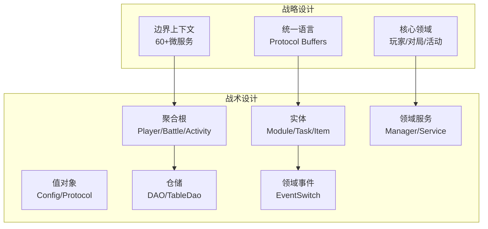

### DDD核心概念映射

| DDD概念 | 项目实现 | 典型示例 |
|---------|---------|---------|
| **边界上下文** | 微服务 | gamesvr, battlesvr, activitysvr |
| **聚合根** | Player类 | Player, CocPlayer, ArenaPlayer |
| **实体** | Module类 | PlayerModule, TaskModule |
| **值对象** | Protobuf Message | TcaplusDb.Player, Config类 |
| **仓储** | DAO层 | PlayerTableDao, BaseTable |
| **领域服务** | Manager类 | PlayerMgr, ActivityManager |
| **领域事件** | Event类 | LoginEvent, TaskCompleteEvent |
| **应用服务** | ServiceImpl | ActivityServiceImpl |

---

## 核心领域与边界上下文

### 领域划分

项目按业务领域划分为多个边界上下文（Bounded Context），每个边界上下文对应一个或多个微服务：

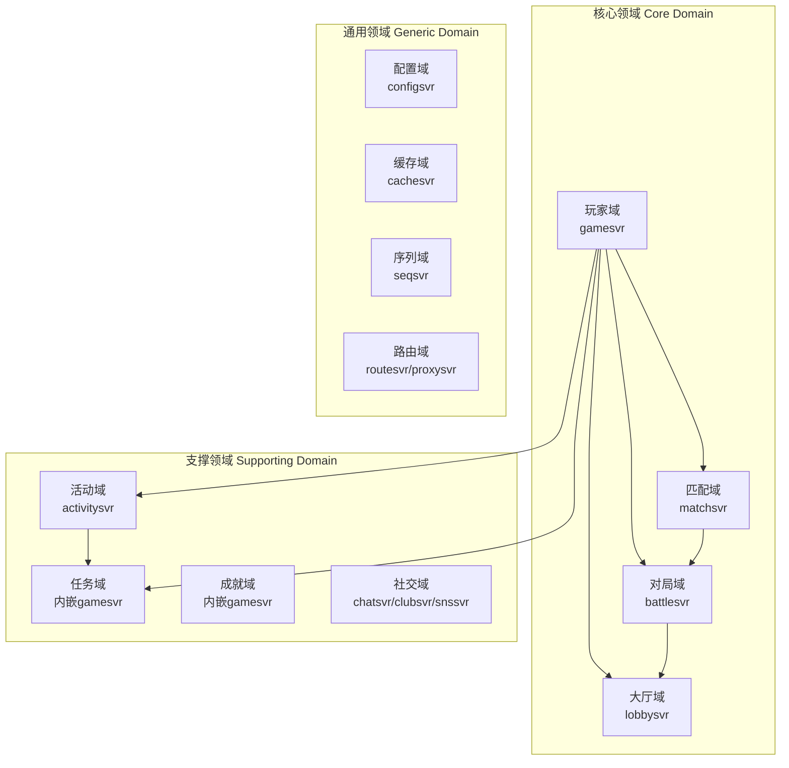

### 边界上下文详解

#### 1. 核心领域（Core Domain）

核心领域是项目的核心竞争力所在，包含最重要的业务逻辑：

| 边界上下文 | 服务 | 核心职责 | 聚合根 |
|-----------|------|---------|--------|
| **玩家上下文** | gamesvr | 玩家会话、状态管理、消息路由 | Player |
| **对局上下文** | battlesvr | 战斗逻辑、结算、DS管理 | BattleInfo |
| **匹配上下文** | matchsvr | 队伍匹配、MMR算法 | MatchInfo |
| **大厅上下文** | lobbysvr | 玩家同步、状态广播 | LobbyPlayer |

#### 2. 支撑领域（Supporting Domain）

支撑领域为核心业务提供必要的支持能力：

| 边界上下文 | 服务 | 核心职责 | 聚合根 |
|-----------|------|---------|--------|
| **活动上下文** | activitysvr | 运营活动、奖励发放 | PlayerActivity |
| **UGC上下文** | ugcsvr系列 | 用户创作内容 | UgcMap |
| **社交上下文** | chatsvr/clubsvr | 聊天、公会、好友 | Club/ChatChannel |
| **排行上下文** | ranksvr | 排行榜、积分计算 | RankData |

#### 3. 通用领域（Generic Domain）

通用领域提供基础设施能力，可通用化或外购：

| 边界上下文 | 服务 | 核心职责 |
|-----------|------|---------|
| **配置上下文** | configsvr | 配置分发、版本管理 |
| **路由上下文** | dirsvr/routesvr | 服务发现、消息路由 |
| **缓存上下文** | cachesvr | 分布式缓存 |
| **序列上下文** | seqsvr | ID生成、序列号 |

### 上下文映射（Context Mapping）

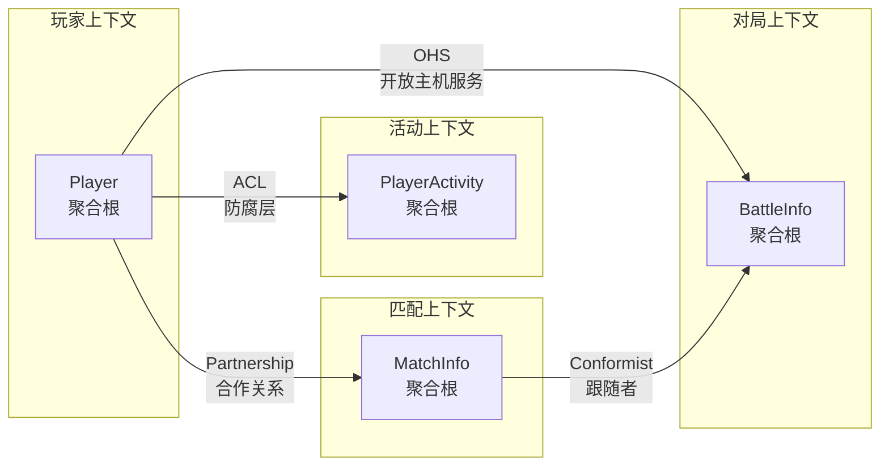

**上下文映射关系说明**：

| 关系类型 | 上游 | 下游 | 实现方式 |
|---------|------|------|---------|
| **ACL（防腐层）** | gamesvr | activitysvr | RPC调用 + 数据转换 |
| **OHS（开放主机服务）** | battlesvr | gamesvr | IRPC接口 |
| **Partnership（合作关系）** | gamesvr | matchsvr | SS协议双向通信 |
| **Conformist（跟随者）** | battlesvr | matchsvr | 遵循battlesvr的数据模型 |

---

## 领域模型与聚合根设计

### Player聚合根

Player是项目中最核心的聚合根，管理玩家的所有状态和行为：

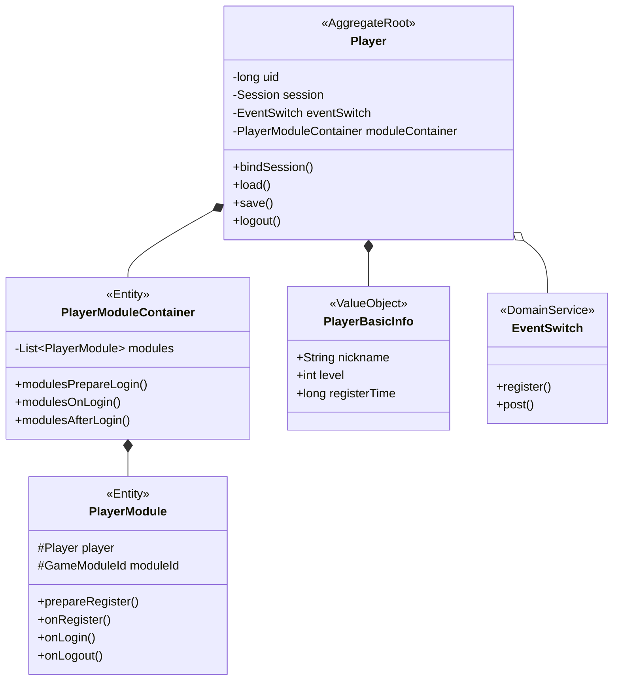

**聚合根代码结构** ([Player.java](C:/UGit/letsgo_server/WeA/projects/gamesvr/src/main/java/com/tencent/wea/playerservice/player/Player.java))：

```java
@NotThreadSafe
public class Player extends PlayerModuleContainer 
        implements PlayerFlow, EventConsumer, BaseDBObject, PushTopicSubscriber {
    
    // ========== 身份标识（不可变） ==========
    private final long uid;
    private final String openId;
    
    // ========== 关联实体 ==========
    private Session session;                              // 会话（可变）
    private final EventSwitch eventSwitch;                // 事件总线
    private final PlayerModuleContainer moduleContainer;  // 模块容器
    
    // ========== 值对象 ==========
    private PlayerBasicInfo basicInfo;                    // 基础信息
    private PlayerPublicInfo publicInfo;                  // 公开信息
    
    // ========== 聚合边界内的一致性保证 ==========
    public void bindSession(Session session) {
        this.session = session;
        // 触发登录流程，确保所有模块状态一致
        modulesPrepareLogin();
        modulesOnLogin();
        modulesAfterLogin(isTodayFirstLogin());
        modulesAfterLoginFinish(isTodayFirstLogin());
    }
}
```

### 模块化设计（实体）

Player聚合内部采用**模块化设计**，每个模块是独立的实体：

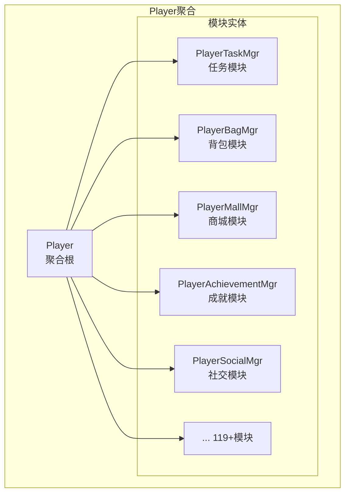

**模块生命周期** ([PlayerModule.java](C:/UGit/letsgo_server/WeA/projects/gamesvr/src/main/java/com/tencent/wea/playerservice/gamemodule/modules/PlayerModule.java))：

```java
public abstract class PlayerModule extends GameModule.Module {
    protected final Player player;    // 对聚合根的引用
    private final GameModuleId module;
    
    // 构造时自动注册到聚合根
    public PlayerModule(GameModuleId module, Player player) {
        this.module = module;
        this.player = player;
        this.player.addModule(this);  // 注册到聚合根
    }
    
    /*
     * 生命周期调用顺序:
     * 注册: prepareRegister -> onRegister -> *afterRegister
     * 加载: prepareLoad -> onLoad -> *afterLoad  
     * 登录: prepareLogin -> onLogin -> *afterLogin -> afterLoginFinish
     * 
     * '*' 标记的流程异步执行
     */
    public abstract void prepareRegister() throws NKCheckedException;
    public abstract void onRegister() throws NKCheckedException;
    public abstract void afterRegister() throws NKCheckedException;
    
    public abstract void prepareLoad() throws NKCheckedException;
    public abstract void onLoad() throws NKCheckedException;
    public abstract void afterLoad();
    
    public abstract void prepareLogin() throws NKCheckedException;
    public abstract void onLogin() throws NKCheckedException;
    public abstract void afterLogin(boolean todayFirstLogin);
    public abstract void afterLoginFinish(boolean todayFirstLogin);
    
    public abstract void onLogout();
    public abstract void onMidNight();
    public abstract void onWeekStart();
}
```

### 聚合根设计原则

项目中的聚合根设计遵循以下原则：

| 原则 | 实现方式 | 示例 |
|------|---------|------|
| **单一入口** | 所有操作通过聚合根 | 不直接修改PlayerModule，而是通过Player调用 |
| **边界内一致性** | 模块容器统一调度 | PlayerModuleContainer保证所有模块状态一致 |
| **引用不可变** | 聚合根ID不变 | Player的uid在生命周期内不变 |
| **最小聚合** | 按需加载模块 | 模块支持enable/disable |
| **事务边界** | 聚合内同步保存 | save()操作保证聚合内数据一致 |

---

## 服务拆分原则与实践

### 服务拆分原则

项目采用以下原则进行服务拆分：

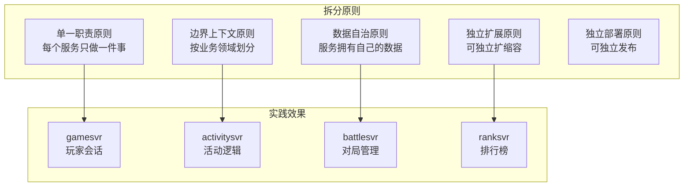

### 服务分层架构

每个服务内部采用统一的分层架构：

```
┌─────────────────────────────────────────────────────┐
│                 RPC Layer (rpc/service/)             │  ← 应用服务层（协调层）
│  - XxxServiceImpl                                    │
│  - RPC方法入口，参数校验，流程编排                    │
├─────────────────────────────────────────────────────┤
│                Service Layer (service/)              │  ← 领域服务层
│  - XxxManager                                        │
│  - 核心业务逻辑，领域规则                             │
├─────────────────────────────────────────────────────┤
│                 Logic Layer (logic/)                 │  ← 领域逻辑层
│  - 具体算法实现                                       │
│  - 业务规则校验                                       │
├─────────────────────────────────────────────────────┤
│                  Data Layer (db/)                    │  ← 基础设施层
│  - XxxTableDao                                       │
│  - 数据访问，持久化                                   │
└─────────────────────────────────────────────────────┘
```

### 服务交互模式

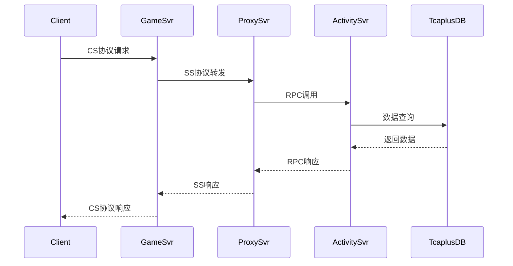

### 典型服务实现

**应用服务层** (ActivityServiceImpl)：

```java
public class ActivityServiceImpl implements ActivityService {
    
    // 应用服务：协调领域服务，处理用例
    @Override
    public RpcResult<RpcPlayerLoginRes.Builder> rpcPlayerLogin(RpcPlayerLoginReq.Builder req) {
        // 1. 参数校验（应用层职责）
        if (uid <= 0) {
            return RpcResult.create(NKErrorCode.InvalidParams);
        }
        
        // 2. 获取聚合根（通过仓储）
        PlayerActivity player = PlayerActivityManager.getInstance().getPlayer(uid);
        
        // 3. 调用领域服务
        player.updateHandleTime("rpcPlayerLogin");
        ActivityManager.getInstance().onLogin(player);
        
        // 4. 返回结果
        return RpcResult.create(resBuilder);
    }
}
```

---

## 数据一致性策略

### 一致性模型

项目采用**最终一致性**为主、**强一致性**为辅的混合策略：

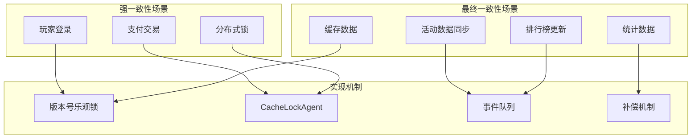

### 分布式锁实现

**CacheLockAgent** - 基于Redis的分布式锁：

```java
public class CacheLockAgent {
    
    // 尝试获取锁
    public boolean tryLock(long uid, int svrInstanceId) {
        String lockKey = buildLockKey(uid);
        // 使用Redis SETNX实现
        return redisCmd.setnx(lockKey, svrInstanceId, expireTime);
    }
    
    // 锁抢占（用于服务迁移场景）
    public boolean preemptLock(long uid, int oldSvrId, int newSvrId) {
        // 1. 通知原服务器释放
        RpcResult result = sendPreemptRequest(oldSvrId, uid);
        
        // 2. 等待数据存盘完成
        waitForDataPersist(uid);
        
        // 3. 获取新锁
        return tryLock(uid, newSvrId);
    }
}
```

### 版本号乐观锁

Tcaplus数据库操作使用版本号实现乐观锁：

```java
// 带版本号的更新操作
public void updatePlayerData(long uid, PlayerData data) {
    int maxRetry = 3;
    
    for (int i = 0; i < maxRetry; i++) {
        // 1. 读取当前版本
        TcaplusManager.TcaplusRsp getRsp = TcaplusUtil.newGetReq(builder).send();
        int version = getRsp.firstRecordData().version;
        
        // 2. 修改数据
        TcaplusDb.Player.Builder newBuilder = modifyData(data);
        
        // 3. 带版本号更新
        TcaplusManager.TcaplusRsp updateRsp = TcaplusUtil.newUpdateReq(newBuilder)
            .setVersion(version)  // 版本号检查
            .send();
        
        if (updateRsp.isOK()) {
            return;  // 成功
        }
        
        if (updateRsp.getResult().versionConflict()) {
            continue;  // 版本冲突，重试
        }
        
        throw new DBException("Update failed");
    }
}
```

### Cache-Aside模式

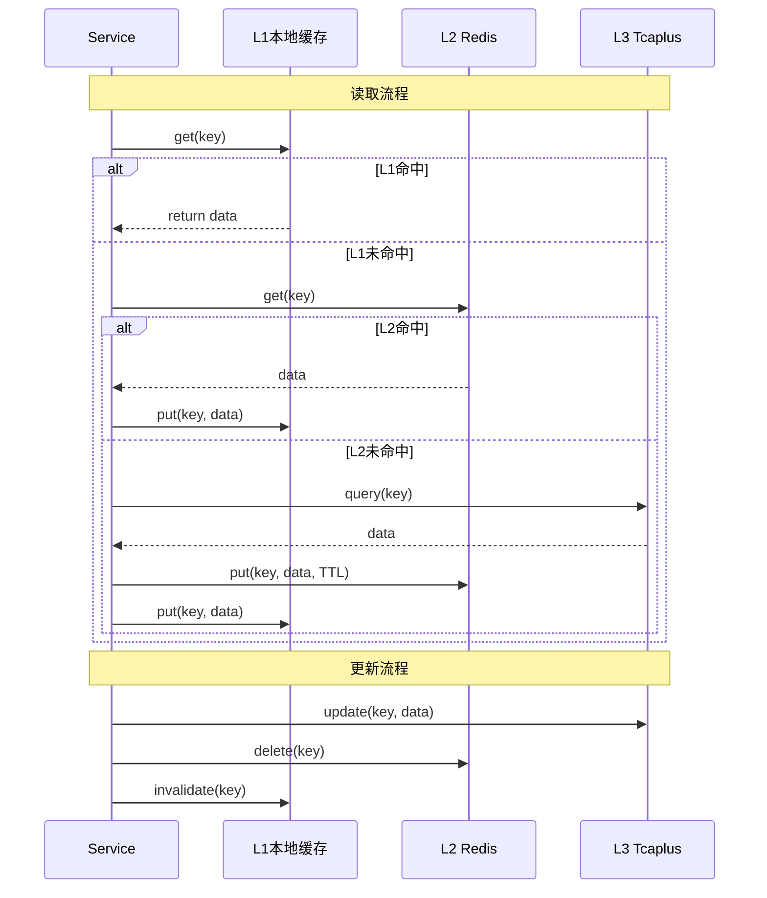

---

## 跨服务事务处理

### Saga模式应用

项目中跨服务的复杂操作采用Saga模式：

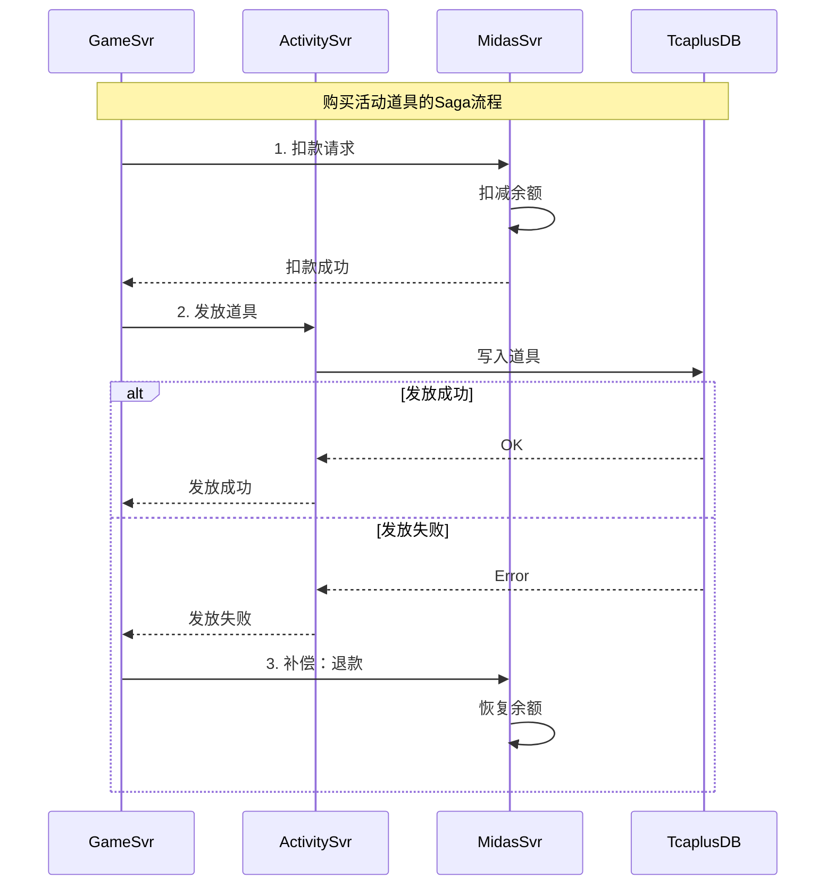

### 补偿机制实现

```java
public class RewardCompensateManager {
    
    // 奖励发放失败时的补偿队列
    private final Queue<CompensateTask> compensateQueue = new ConcurrentLinkedQueue<>();
    
    // 定时处理补偿任务
    public void processCompensate() {
        CompensateTask task;
        while ((task = compensateQueue.poll()) != null) {
            try {
                // 重试发放
                boolean success = retryReward(task);
                if (!success && task.getRetryCount() < MAX_RETRY) {
                    task.incrementRetry();
                    compensateQueue.offer(task);  // 重新入队
                } else if (!success) {
                    // 达到最大重试次数，记录日志，人工处理
                    logFailedCompensate(task);
                }
            } catch (Exception e) {
                LOGGER.error("Compensate failed", e);
            }
        }
    }
}
```

### 幂等性设计

```java
public class IdempotentHandler {
    
    // 使用唯一请求ID保证幂等
    public RpcResult processRequest(String requestId, Request req) {
        // 1. 检查是否已处理
        String cacheKey = "idempotent:" + requestId;
        String cachedResult = redisCmd.get(cacheKey);
        if (cachedResult != null) {
            return deserialize(cachedResult);  // 返回缓存结果
        }
        
        // 2. 处理请求
        RpcResult result = doProcess(req);
        
        // 3. 缓存结果（设置过期时间）
        redisCmd.setex(cacheKey, serialize(result), EXPIRE_SECONDS);
        
        return result;
    }
}
```

---

## 事件驱动架构分析

### EventSwitch事件总线

项目使用EventSwitch实现事件驱动架构，这是基于Guava EventBus的增强实现：

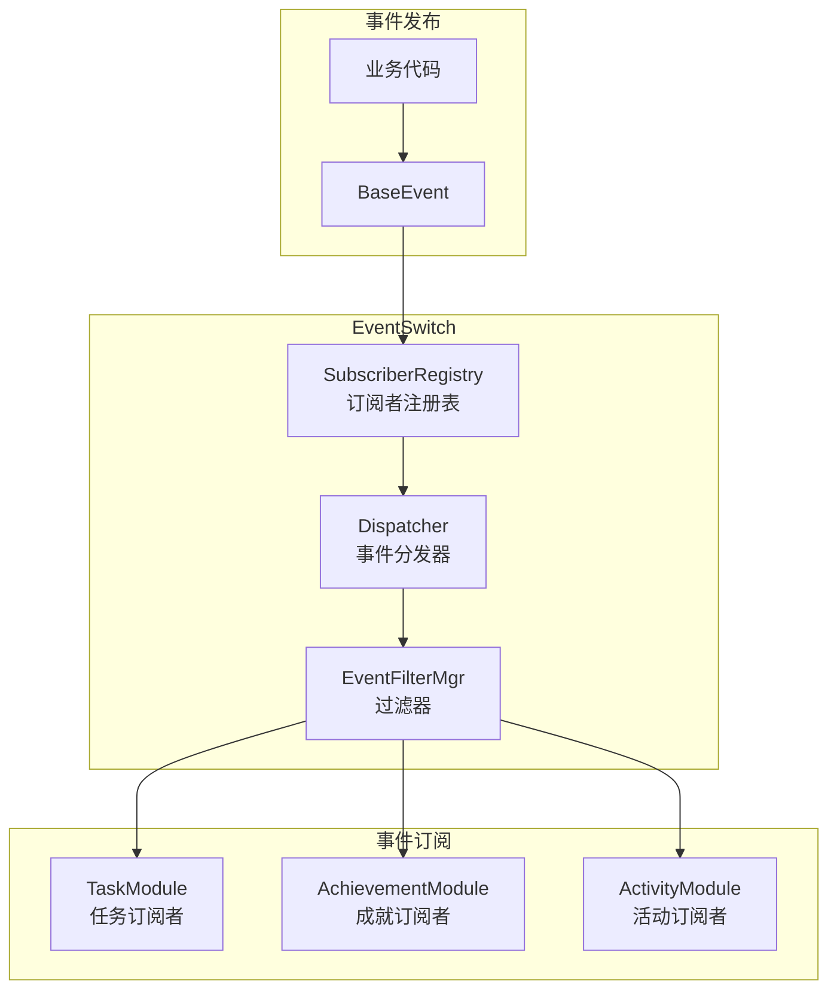

**EventSwitch核心实现** ([EventSwitch.java](C:/UGit/letsgo_server/WeA/common/src/main/java/com/tencent/eventbuspro/EventSwitch.java))：

```java
public class EventSwitch {
    
    private final SubscriberRegistry subscribers = new SubscriberRegistry(this);
    
    // 注册订阅者
    public void register(EventSubscriber eventSubscriber) {
        subscribers.register(eventSubscriber);
    }
    
    // 发布事件
    public void post(BaseEvent event, int filterMask) {
        // 1. 获取事件类型层级（支持事件继承）
        List<Class<?>> eventTypes = SubscriberRegistry.flattenHierarchy(event.getClass());
        
        for (Class<?> eventType : eventTypes) {
            // 2. 获取该类型的所有订阅者
            SubscribersContainer container = subscribers.getSubscribers(eventType);
            if (container != null) {
                container.startIterate();
                try {
                    // 3. 按过滤条件分发事件
                    for (Subscriber subscriber : container.getSubscribers()) {
                        if (EventFilterMgr.checkFilterMatch(
                                subscriber.getMethodInfo().getFilterMask(), 
                                filterMask)) {
                            subscriber.dispatchEvent(event);
                        }
                    }
                } finally {
                    container.endIterate();
                }
            }
        }
    }
}
```

### 玩家级事件总线

每个Player聚合根拥有独立的事件总线：

```java
public class Player extends PlayerModuleContainer {
    
    // 玩家级事件总线
    private final PlayerEventSwitch eventSwitch = new PlayerEventSwitch(this);
    
    // 事件分发
    public void dispatchEvent(BaseEvent event) {
        eventSwitch.post(event, EventFilterMgr.DEFAULT_MASK);
    }
}

// 使用示例
public class PlayerTaskMgr extends PlayerModule implements EventSubscriber {
    
    @SubscribeEvent(routers = EventRouterType.ERT_PlayerModule)
    public void onLevelUp(PlayerLevelUpEvent event) {
        // 检查等级相关任务
        checkLevelTasks(event.getNewLevel());
    }
}
```

### 领域事件类型

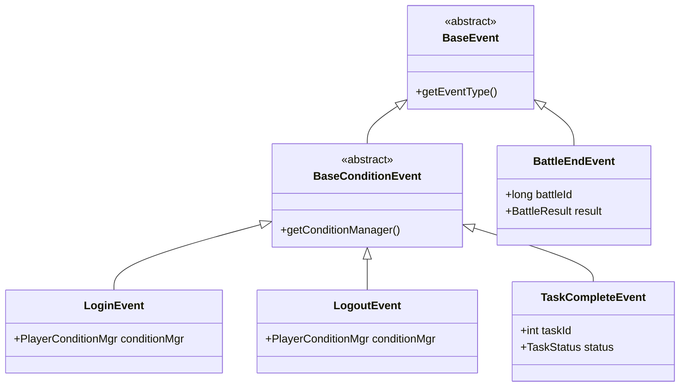

### 事件处理流程

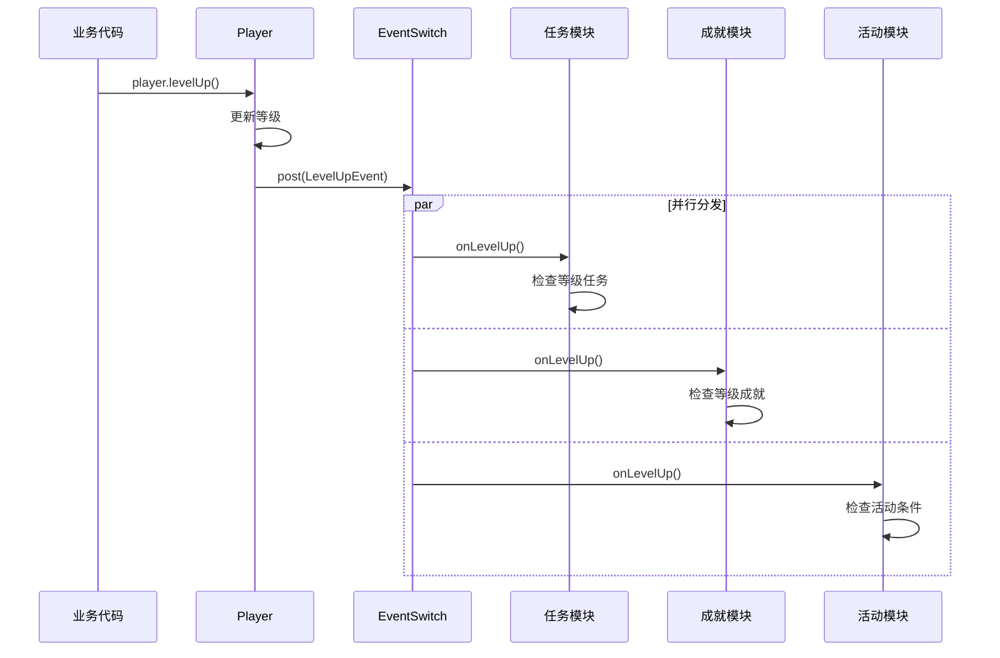

---

## CQRS模式应用分析

### 读写分离设计

项目在部分场景采用了CQRS（命令查询职责分离）的思想：

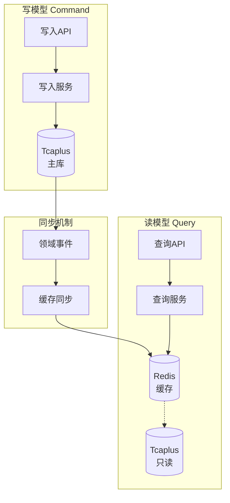

### 典型CQRS场景

#### 1. 排行榜系统

```java
// 写模型：更新玩家分数
public class RankWriteService {
    public void updateScore(long uid, int score) {
        // 1. 更新Tcaplus主库
        rankTableDao.updateScore(uid, score);
        
        // 2. 发布事件
        eventSwitch.post(new ScoreUpdateEvent(uid, score));
    }
}

// 读模型：查询排行榜
public class RankReadService {
    public List<RankItem> getTopN(int rankType, int topN) {
        // 优先从Redis缓存读取
        String cacheKey = "rank:" + rankType + ":top" + topN;
        List<RankItem> cached = redisCmd.zrevrange(cacheKey, 0, topN);
        if (cached != null) {
            return cached;
        }
        
        // 缓存未命中，从数据库加载
        return rankTableDao.queryTopN(rankType, topN);
    }
}
```

#### 2. 玩家公开信息

```java
// 写模型：更新玩家信息
public void updatePlayerInfo(Player player) {
    // 更新主表
    playerTableDao.update(player);
    
    // 更新公开信息表（只读副本）
    playerPublicDao.update(buildPublicInfo(player));
}

// 读模型：批量查询玩家公开信息
public Map<Long, PlayerPublicInfo> batchGetPublicInfo(List<Long> uids) {
    // 从公开信息表查询，不访问主表
    return playerPublicDao.batchGet(uids);
}
```

### 投影与物化视图

```java
// 活动排行榜投影
public class ActivityRankProjection {
    
    // 监听活动积分变化事件
    @SubscribeEvent
    public void onActivityPointsChange(ActivityPointsEvent event) {
        long uid = event.getUid();
        int activityId = event.getActivityId();
        int newPoints = event.getNewPoints();
        
        // 更新Redis ZSet（物化视图）
        String rankKey = "activity_rank:" + activityId;
        redisCmd.zadd(rankKey, newPoints, String.valueOf(uid));
    }
}
```

---

## 实体与值对象设计

### 实体（Entity）

实体具有唯一标识，关注生命周期：

```java
// 任务实体
public class RunTask {
    // ========== 标识 ==========
    private final int taskId;           // 任务ID（不可变）
    private final Player player;        // 所属聚合根
    
    // ========== 状态 ==========
    private TaskStatus status;          // 任务状态（可变）
    private int progress;               // 任务进度（可变）
    
    // ========== 关联 ==========
    private BaseConditionGroup conditionGroup;  // 条件组
    
    // 状态转换
    public boolean changeTaskStatus(TaskStatus newStatus) {
        if (canTransitionTo(newStatus)) {
            this.status = newStatus;
            return true;
        }
        return false;
    }
}
```

### 值对象（Value Object）

值对象不可变，通过属性值判断相等：

```java
// 配置表项（值对象）
public final class ResTaskConfig {
    private final int taskId;
    private final String taskName;
    private final List<Integer> rewards;
    private final List<ConditionConfig> conditions;
    
    // 不可变，通过构造函数初始化
    public ResTaskConfig(int taskId, String taskName, 
                         List<Integer> rewards, List<ConditionConfig> conditions) {
        this.taskId = taskId;
        this.taskName = taskName;
        this.rewards = Collections.unmodifiableList(rewards);
        this.conditions = Collections.unmodifiableList(conditions);
    }
    
    // equals和hashCode基于属性值
    @Override
    public boolean equals(Object o) {
        if (this == o) return true;
        if (!(o instanceof ResTaskConfig)) return false;
        ResTaskConfig that = (ResTaskConfig) o;
        return taskId == that.taskId && 
               Objects.equals(taskName, that.taskName);
    }
}
```

### Protobuf作为值对象

项目大量使用Protobuf Message作为值对象：

```protobuf
// 玩家基础信息（值对象）
message PlayerBasicInfo {
    optional string nickname = 1;
    optional int32 level = 2;
    optional int64 registerTime = 3;
    optional int32 vipLevel = 4;
}

// 道具信息（值对象）
message ItemInfo {
    optional int32 itemId = 1;
    optional int64 count = 2;
    optional int64 expireTime = 3;
}
```

---

## 仓储模式实现

### 仓储接口设计

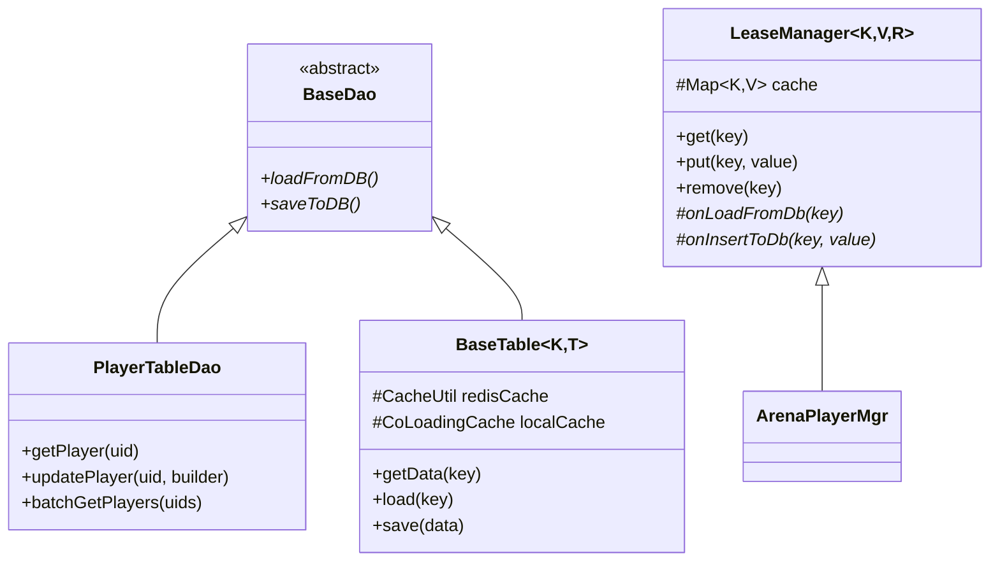

### 典型仓储实现

**PlayerTableDao** - 直接DAO模式：

```java
public class PlayerTableDao {
    private static final Logger LOGGER = LogManager.getLogger(PlayerTableDao.class);
    
    // 查询单个玩家
    @Nullable
    public static TcaplusDb.Player getPlayer(long uid) {
        if (uid <= 0) {
            return null;
        }
        
        TcaplusDb.Player.Builder builder = TcaplusDb.Player.newBuilder().setUid(uid);
        TcaplusManager.TcaplusRsp rsp = TcaplusUtil.newGetReq(builder).send();
        
        if (!rsp.isOK()) {
            LOGGER.error("get player failed, uid:{}, result:{}", uid, rsp.getResult());
            return null;
        }
        
        return (TcaplusDb.Player) rsp.firstRecordData().msg;
    }
    
    // 批量查询
    public static Map<Long, TcaplusDb.Player> batchGetPlayers(List<Long> uids) {
        if (uids == null || uids.isEmpty()) {
            return Collections.emptyMap();
        }
        
        TcaplusManager.TcaplusReq batchReq = null;
        for (Long uid : uids) {
            TcaplusDb.Player.Builder builder = TcaplusDb.Player.newBuilder().setUid(uid);
            if (batchReq == null) {
                batchReq = TcaplusUtil.newBatchGetReq(builder);
            } else {
                batchReq.addRecord(builder);
            }
        }
        
        return processBatchResult(batchReq.send());
    }
}
```

**LeaseManager** - 带租约的缓存仓储：

```java
public abstract class LeaseManager<K, V, R> {
    
    private final Map<K, V> cache = new ConcurrentHashMap<>();
    
    // 获取或加载
    public V get(K key) {
        V cached = cache.get(key);
        if (cached != null) {
            return cached;
        }
        
        // 从数据库加载
        NKPair<TcaplusErrorCode, R> result = onLoadFromDb(key);
        if (result.getFirst().isOK()) {
            V newValue = createFromRecord(result.getSecond());
            cache.put(key, newValue);
            return newValue;
        }
        
        return null;
    }
    
    // 子类实现具体加载逻辑
    protected abstract NKPair<TcaplusErrorCode, R> onLoadFromDb(K key);
    protected abstract V createFromRecord(R record);
}
```

### 三级缓存架构

```java
public abstract class BaseTable<K, T extends BaseDBData<K>> {
    
    protected CacheUtil redisCache;                    // L2: Redis缓存
    private CoLoadingCache<K, T> localCache;          // L1: 本地缓存
    
    // 三级缓存读取
    public T getData(K key) {
        // L1: 本地缓存
        if (localCache != null) {
            T data = localCache.get(key);
            if (data != null) return data;
        }
        
        // L2: Redis缓存
        T data = redisGet(key);
        if (data != null) {
            if (localCache != null) {
                localCache.put(key, data);
            }
            return data;
        }
        
        // L3: 数据库
        data = tcaplusGet(key);
        if (data != null) {
            redisSet(key, data);
            if (localCache != null) {
                localCache.put(key, data);
            }
        }
        
        return data;
    }
}
```

---

## 改进空间与建议

### 现有架构优点

| 方面 | 优点 |
|------|------|
| **领域划分** | 60+微服务按业务领域清晰划分 |
| **聚合设计** | Player聚合根设计合理，模块化程度高 |
| **事件驱动** | EventSwitch实现灵活的事件订阅机制 |
| **一致性保障** | 多级缓存+乐观锁+分布式锁完善 |
| **仓储抽象** | DAO层封装良好，支持批量操作 |

### 改进建议

#### 1. 显式聚合边界

**问题**：部分模块直接跨聚合访问数据

**建议**：引入领域服务作为跨聚合的桥梁

```java
// 改进前：直接跨聚合访问
public class TaskModule {
    public void checkTask() {
        // 直接访问背包模块
        int itemCount = player.getBagMgr().getItemCount(itemId);
    }
}

// 改进后：通过领域服务
public class TaskDomainService {
    public boolean checkItemCondition(Player player, int itemId, int required) {
        // 领域服务协调跨聚合查询
        return player.queryItemCount(itemId) >= required;
    }
}
```

#### 2. 领域事件持久化

**问题**：事件仅在内存分发，无法追溯和重放

**建议**：关键领域事件持久化

```java
// 建议：领域事件存储
public class DomainEventStore {
    
    public void saveEvent(DomainEvent event) {
        // 持久化到事件表
        eventTableDao.insert(EventRecord.builder()
            .eventId(event.getId())
            .eventType(event.getClass().getName())
            .aggregateId(event.getAggregateId())
            .payload(serialize(event))
            .occurredAt(event.getOccurredAt())
            .build());
    }
    
    // 支持事件重放
    public List<DomainEvent> getEventsAfter(String aggregateId, long afterEventId) {
        return eventTableDao.queryAfter(aggregateId, afterEventId)
            .stream()
            .map(this::deserialize)
            .collect(Collectors.toList());
    }
}
```

#### 3. 模块依赖声明

**问题**：模块间依赖隐式存在

**建议**：显式声明模块依赖

```java
// 建议：模块依赖注解
@ModuleDependency(
    requires = {GameModuleId.GMI_BagMgr, GameModuleId.GMI_ConditionMgr},
    optional = {GameModuleId.GMI_ActivityMgr}
)
public class PlayerTaskMgr extends PlayerModule {
    // 框架保证依赖模块先初始化
}
```

#### 4. CQRS更深度应用

**问题**：读写模型分离不够彻底

**建议**：引入独立的查询模型

```java
// 建议：独立的查询模型
public class PlayerQueryModel {
    // 专门用于查询的扁平化视图
    private long uid;
    private String nickname;
    private int level;
    private int totalBattles;
    private int winRate;
    // ...
    
    // 从领域模型投影
    public static PlayerQueryModel fromPlayer(Player player) {
        return PlayerQueryModel.builder()
            .uid(player.getUid())
            .nickname(player.getBasicInfo().getNickname())
            .level(player.getBasicInfo().getLevel())
            .totalBattles(calculateTotalBattles(player))
            .winRate(calculateWinRate(player))
            .build();
    }
}
```

#### 5. 防腐层增强

**问题**：跨上下文调用直接使用RPC

**建议**：增加防腐层转换

```java
// 建议：防腐层实现
public class ActivityAntiCorruptionLayer {
    
    // 将外部模型转换为本地模型
    public PlayerActivityData fromGameSvrPlayer(RpcPlayerInfo external) {
        return PlayerActivityData.builder()
            .uid(external.getUid())
            .level(external.getLevel())
            // 转换为本上下文的概念
            .activityPoints(calculateActivityPoints(external))
            .build();
    }
    
    // 将本地模型转换为外部模型
    public RpcActivityReward toExternalReward(InternalReward internal) {
        return RpcActivityReward.newBuilder()
            .setRewardId(internal.getId())
            .setItemList(convertItems(internal.getItems()))
            .build();
    }
}
```

### 架构演进路线图

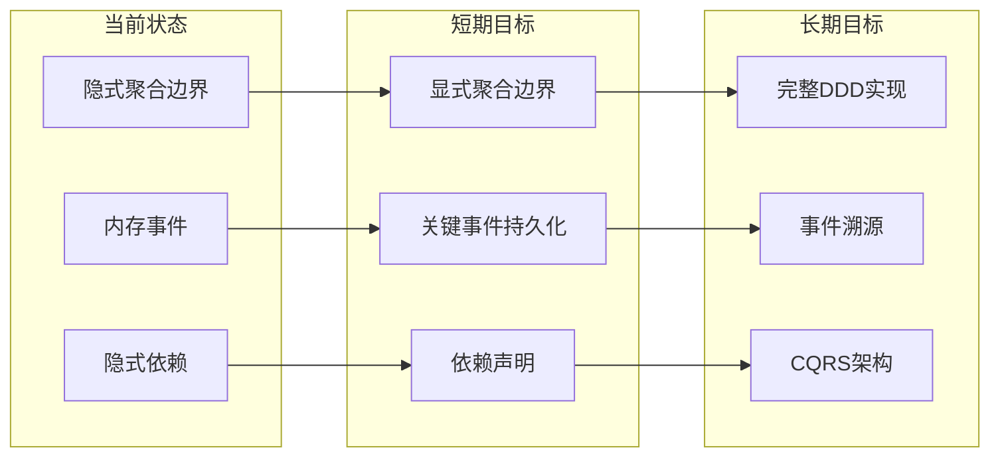

---

## 总结

### DDD实践成熟度评估

| 维度 | 评分 | 说明 |
|------|------|------|
| **领域划分** | ⭐⭐⭐⭐⭐ | 60+微服务按业务领域合理划分 |
| **聚合设计** | ⭐⭐⭐⭐ | Player聚合设计合理，但边界可更清晰 |
| **事件驱动** | ⭐⭐⭐⭐ | EventSwitch机制成熟，但缺乏持久化 |
| **一致性保障** | ⭐⭐⭐⭐⭐ | 多级缓存+锁机制完善 |
| **仓储模式** | ⭐⭐⭐⭐ | DAO层封装良好 |
| **CQRS应用** | ⭐⭐⭐ | 部分场景应用，可深化 |

### 核心设计模式应用

| 模式 | 应用位置 | 效果 |
|------|---------|------|
| **聚合根** | Player, BattleInfo | 保证领域对象一致性 |
| **实体** | PlayerModule | 管理业务状态 |
| **值对象** | Protobuf Message | 数据传输与配置 |
| **仓储** | TableDao | 持久化抽象 |
| **领域事件** | EventSwitch | 模块解耦 |
| **领域服务** | Manager类 | 跨聚合协调 |
| **应用服务** | ServiceImpl | 用例编排 |
| **防腐层** | RPC转换 | 上下文隔离 |

### 关键收益

1. **高内聚低耦合**：按业务领域划分服务，模块独立演进
2. **灵活扩展**：事件驱动机制支持功能快速扩展
3. **数据一致性**：多层次一致性保障机制
4. **可维护性**：清晰的分层结构便于维护

### 后续优化优先级

| 优先级 | 优化项 | 预期收益 |
|:---:|--------|---------|
| **P0** | 显式聚合边界 | 减少隐式依赖，提高可维护性 |
| **P1** | 关键事件持久化 | 支持审计和问题追溯 |
| **P1** | 模块依赖声明 | 初始化顺序保证，减少运行时错误 |
| **P2** | 深化CQRS | 读写性能优化 |
| **P2** | 防腐层增强 | 上下文隔离更彻底 |

---

## 十二、面试专栏

### 12.1 DDD面试常见QA — 结合项目实战回答

> DDD相关面试问题通常从概念理解→实际落地→权衡取舍三个层次递进，以下结合项目给出深度回答。

#### Q1: 你们项目的聚合根是怎么定的？为什么Player是聚合根？

> "聚合根的确定遵循三个原则：**业务一致性边界、操作入口唯一性、生命周期统一管理**。
>
> Player作为聚合根的原因：
> 1. **一致性边界**：玩家的所有状态（背包、任务、成就、社交等）必须保持一致——不能出现背包扣了道具但任务进度没更新的情况。Player聚合根通过`PlayerModuleContainer`统一管理119+个模块，保证所有模块在登录、登出、午夜刷新等生命周期节点同步更新。
> 2. **操作入口唯一**：外部对玩家数据的任何修改都必须通过Player实例，不能直接操作某个PlayerModule。这通过代码结构强制保证——所有`PlayerModule`都持有对`Player`的引用，但外部只能通过`Player.getXxxMgr()`获取模块。
> 3. **生命周期统一**：Player的创建（注册）、加载（登录）、保存、销毁（登出）统一管理，所有子模块跟随聚合根的生命周期。
>
> 反面例子：我们没有把'活动数据'放在Player聚合内，而是放在activitysvr的`PlayerActivity`聚合根中。因为活动数据的一致性边界独立于玩家核心数据——活动奖励发放和活动进度更新只需要在活动上下文内保持一致。"

#### Q2: 你们的服务是怎么拆的？60+微服务会不会太多了？

> "服务拆分遵循DDD的**限界上下文**原则，核心标准是：
> 1. **业务领域独立性**：每个服务对应一个独立的业务领域（如matchsvr=匹配域、battlesvr=对局域）
> 2. **数据自治**：每个服务拥有自己的数据存储，不直接读写其他服务的数据库
> 3. **独立部署/扩缩容**：如activitysvr在活动期间需要4倍扩容，不影响其他服务
>
> 至于是否过多，这是一个**合理的工程权衡**：
> - **拆分的收益**：每个服务代码量可控（2-5万行），团队可以并行开发，故障隔离粒度细
> - **拆分的代价**：跨服务调用的网络开销、分布式事务的复杂度、运维成本
> - **项目的务实选择**：gamesvr仍是巨型服务（包含玩家会话、119+模块），因为这些模块间强耦合，强行拆分反而增加复杂度。独立出去的服务（如activitysvr、ranksvr）都是与核心玩法松耦合且有独立扩缩容需求的领域。
>
> 所以不是为了拆而拆，而是在**内聚性和自治性之间找平衡**。"

#### Q3: 你们项目中有用到领域事件吗？怎么实现的？

> "有，我们通过自研的`EventSwitch`事件总线实现了领域事件机制——它基于Guava EventBus增强。
>
> **实现方式**：每个Player聚合根拥有独立的`PlayerEventSwitch`实例。当业务动作发生时（如升级、完成任务），发布领域事件；各订阅模块（任务模块、成就模块、活动模块）通过`@SubscribeEvent`注解自动接收。
>
> **关键设计点**：
> 1. **过滤机制**：`EventFilterMgr`支持按filterMask过滤，不同订阅者只接收感兴趣的事件子集
> 2. **玩家级隔离**：每个Player有独立的事件总线，避免跨玩家事件串扰
> 3. **同步分发**：事件在同一协程内同步分发（因为在聚合根边界内需要保证一致性）
>
> **实际效果**：新增一个活动类型只需要注册事件订阅者，不需要修改核心玩法代码。60+活动类型就是通过这种'开闭原则'快速迭代出来的。
>
> **不足之处**：当前事件仅在内存中分发，不支持持久化和重放。如果未来需要事件溯源能力，需要增加事件存储层。"

#### Q4: 你们怎么处理跨服务的数据一致性？用了分布式事务吗？

> "我们没有使用XA/2PC等强一致性分布式事务，因为对游戏业务来说**最终一致性**足够。主要采用以下策略：
>
> 1. **Saga模式**：跨服务的购买流程（如购买活动道具）：先扣款（midassvr） → 再发货（activitysvr），如果发货失败则补偿退款。补偿通过`RewardCompensateManager`的异步重试队列实现。
>
> 2. **幂等性保障**：每个关键操作都有唯一请求ID，通过Redis缓存结果实现幂等——重复请求直接返回缓存结果。
>
> 3. **最终一致性**：排行榜更新、活动积分同步等场景通过Kafka/Pulsar消息队列异步处理，允许秒级延迟。
>
> 4. **版本号乐观锁**：Tcaplus的版本号机制解决并发写冲突，冲突时最多重试3次。
>
> 之所以不用强一致性事务，是因为游戏场景的核心指标是**响应速度**（100ms以内），分布式事务的延迟开销（通常数百ms）不可接受。而最终一致性的'短暂不一致窗口'对玩家体验影响极小。"

#### Q5: DDD的值对象在你们项目中怎么体现的？

> "我们大量使用Protobuf Message作为值对象，因为它天然满足值对象的特征：
> 1. **不可变性**：Protobuf生成的Message对象一旦build就不可修改（immutable）
> 2. **通过属性值判等**：两个相同字段值的Message equals为true
> 3. **无唯一标识**：值对象不需要ID，通过内容描述自身
>
> 典型例子如`PlayerBasicInfo`（昵称、等级、注册时间）、`ItemInfo`（道具ID、数量、过期时间）。它们作为Player聚合根的属性存在，没有独立的生命周期。
>
> 配置表项也是值对象——`ResTaskConfig`一旦从CSV加载就不再修改，多个引用可以安全共享。"

#### Q6: 你觉得你们项目的DDD实践和教科书式DDD有什么差异？

> "最大的差异是**务实性**。教科书DDD强调完整的分层架构（Application→Domain→Infrastructure），每一层都有严格的依赖方向。我们的实践做了三个务实简化：
>
> 1. **聚合边界不够严格**：部分模块间存在直接引用（如TaskModule直接调用`player.getBagMgr()`），没有通过领域服务协调。这是历史代码的现实——119个模块全部通过领域服务解耦成本太高。
>
> 2. **事件不持久化**：领域事件只在内存分发，没有实现事件溯源。对于游戏场景，事件溯源的存储成本和复杂度远大于收益。
>
> 3. **CQRS部分应用**：排行榜、公开信息等场景做了读写分离，但不是全局的CQRS架构。全局CQRS会大幅增加同步复杂度。
>
> 核心观点是：DDD是一种思维方式，不是一个框架。我们借用了DDD最有价值的部分（限界上下文拆分服务、聚合根管理一致性、事件驱动解耦模块），而没有为了DDD而DDD。"

### 12.2 DDD实践成熟度速查表

| 维度 | 教科书标准 | 项目实际 | 差距分析 |
|------|-----------|---------|---------|
| **限界上下文** | 每个上下文有明确的通用语言 | 60+服务按业务域划分 ✅ | 基本达标 |
| **聚合根** | 严格的事务一致性边界 | Player聚合管理119+模块 ✅ | 部分模块跨聚合直接引用 |
| **领域事件** | 持久化+可重放 | EventSwitch内存分发 ⚠️ | 缺乏持久化能力 |
| **仓储模式** | 完整的Repository抽象 | DAO+LeaseManager+BaseTable ✅ | 抽象程度足够 |
| **防腐层** | 每个上下文间有ACL | RPC直接调用居多 ⚠️ | 需要增强转换层 |
| **值对象** | 不可变、无ID | Protobuf Message ✅ | 天然满足 |
| **CQRS** | 完整的命令查询分离 | 排行榜等部分场景 ⚠️ | 非全局应用 |
| **事件溯源** | 完整的事件日志 | 未实现 ❌ | 投入产出比不适合游戏场景 |

### 12.3 面试叙事模板

**30秒版（电梯演讲）**：
> "我们项目是一个60+微服务的大型游戏服务端，采用了务实的DDD设计。核心是Player聚合根管理119个业务模块，通过EventSwitch事件总线解耦模块间依赖，服务按限界上下文拆分并独立扩缩容。数据一致性通过Saga模式+乐观锁+幂等性保障。"

**2分钟版（深入展开）**：
> "在战略设计层面，我们按DDD的限界上下文将系统拆分为核心域（游戏/对局/匹配）、支撑域（活动/社交/UGC）和通用域（配置/缓存/路由）三大类。
>
> 在战术设计层面，Player是最核心的聚合根，采用模块化设计管理119个PlayerModule。每个模块有完整的生命周期回调（prepareLogin→onLogin→afterLogin→onLogout），通过EventSwitch事件总线实现模块间通信——比如玩家升级时，任务模块、成就模块、活动模块同时收到LevelUpEvent，各自更新进度。
>
> 跨服务通信采用RPC+消息队列，数据一致性用Saga+补偿机制，支付等关键场景有幂等性保障。
>
> 这套架构支撑了日活数百万的游戏运营，新增活动类型只需2-3天开发周期（得益于事件驱动的开闭原则设计）。"
