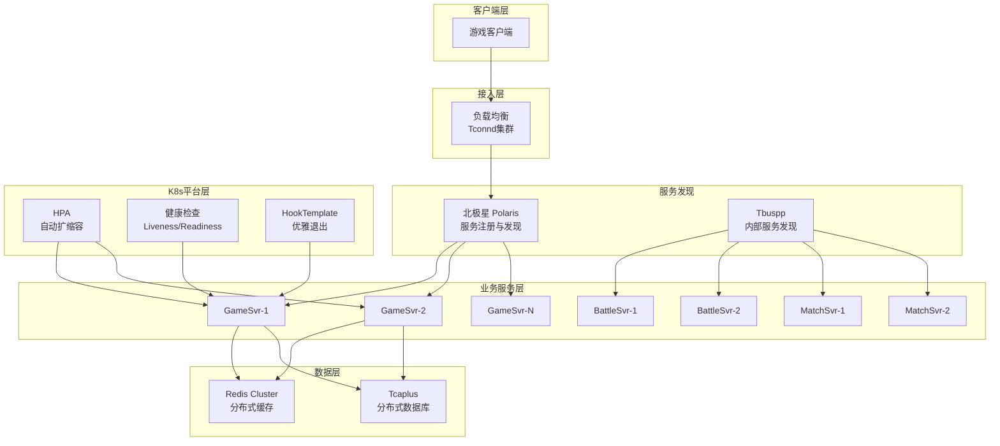
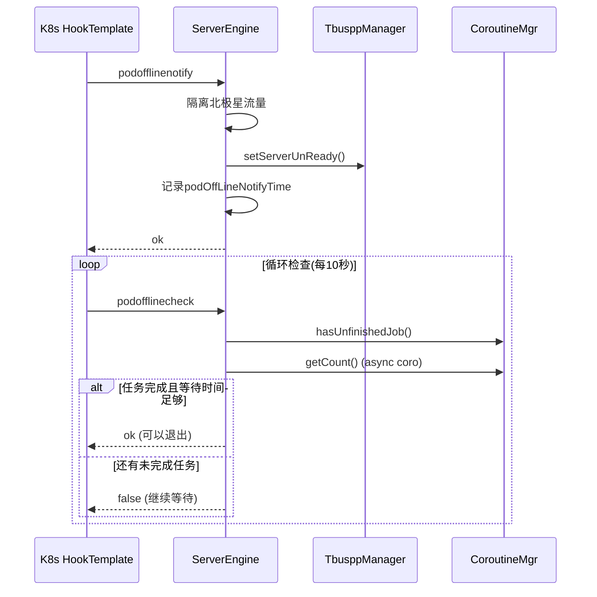
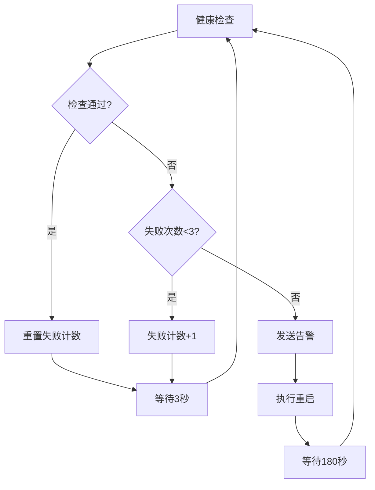
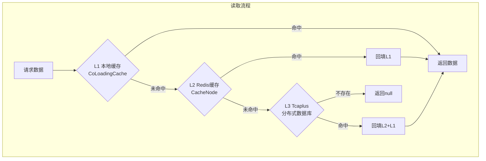
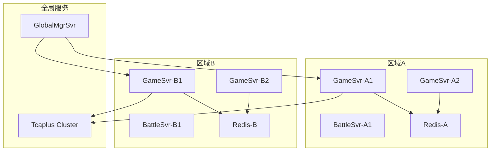
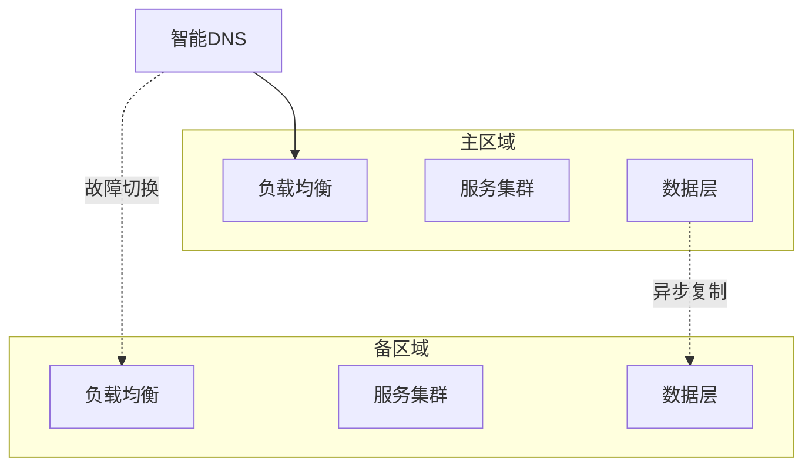

# 26. 高可用与容灾设计分析

## 目录

1. [概述](#概述)
2. [高可用架构总览](#高可用架构总览)
3. [服务发现与负载均衡](#服务发现与负载均衡)
4. [健康检查与心跳机制](#健康检查与心跳机制)
5. [优雅停机与Pod生命周期](#优雅停机与pod生命周期)
6. [熔断与降级保护](#熔断与降级保护)
7. [自动扩缩容](#自动扩缩容)
8. [故障自愈机制](#故障自愈机制)
9. [数据高可用设计](#数据高可用设计)
10. [多实例与故障隔离](#多实例与故障隔离)
11. [监控与告警体系](#监控与告警体系)
12. [改进空间与建议](#改进空间与建议)

---

## 概述

### 高可用设计定位

项目采用**多层次高可用架构**，通过服务发现、健康检查、熔断限流、自动扩缩容等机制，构建了一套完整的高可用与容灾体系，确保系统能够在各种故障场景下持续提供服务。

```
                    ┌─────────────────────────────────────────────────┐
                    │              高可用与容灾体系                      │
                    ├────────────┬────────────┬────────────┬──────────┤
                    │  服务发现   │  健康检查   │  熔断降级   │ 自动扩缩容│
                    │ Polaris/   │ 心跳机制   │ CombatHys  │   HPA    │
                    │ Tbuspp     │ Liveness   │ Break      │ 自定义指标│
                    ├────────────┼────────────┼────────────┼──────────┤
                    │  优雅停机   │  故障自愈   │  数据高可用 │  监控告警 │
                    │ PodOffline │ 自动重启   │ 多级缓存   │ Prometheus│
                    │ Manager    │ K8s重调度  │ Tcaplus    │ 企微机器人│
                    └────────────┴────────────┴────────────┴──────────┘
```

### 系统可用性目标

| 服务类型 | 可用性目标 | RPO | RTO |
|---------|-----------|-----|-----|
| **核心业务服务** | 99.99% | 0 | < 30秒 |
| **游戏服务(GameSvr)** | 99.9% | 0 | < 60秒 |
| **战斗服务(BattleSvr)** | 99.9% | 0 | < 120秒 |
| **数据存储(Tcaplus)** | 99.999% | 0 | < 10秒 |

### 核心设计原则

1. **无单点故障**：所有关键组件多实例部署
2. **快速故障检测**：秒级健康检查发现问题
3. **自动故障恢复**：减少人工干预，自动化处理
4. **优雅降级**：在故障时保证核心功能可用
5. **数据一致性**：确保数据不丢失

---

## 高可用架构总览

### 整体架构图



### 高可用组件清单

| 组件 | 文件位置 | 功能 |
|-----|---------|------|
| **PodOfflineManager** | [PodOfflineManager.java](C:/UGit/letsgo_server/WeA/common/src/main/java/com/tencent/nk/server/PodOfflineManager.java) | K8s优雅退出管理 |
| **PolarisDiscover** | [PolarisDiscover.java](C:/UGit/letsgo_server/WeA/common/src/main/java/com/tencent/cl5/PolarisDiscover.java) | 北极星服务发现 |
| **HeartbeatMgr** | [HeartbeatMgr.java](C:/UGit/letsgo_server/WeA/projects/battlesvr/src/main/java/com/tencent/wea/battleservice/heartbeat/HeartbeatMgr.java) | 心跳管理 |
| **CombatHystrix** | [CombatHystrix.java](C:/UGit/letsgo_server/WeA/timiutil/src/main/java/com/tencent/timiutil/tool/hystrix/CombatHystrix.java) | 战斗熔断器 |
| **Break** | [Break.java](C:/UGit/letsgo_server/WeA/common/src/main/java/com/tencent/cache/Break.java) | Redis熔断保护 |
| **ServiceNodeMgr** | [ServiceNodeMgr.java](C:/UGit/letsgo_server/WeA/common/src/main/java/com/tencent/servicesmgr/nodemgr/ServiceNodeMgr.java) | 服务节点管理 |
| **DirLoadBalancer** | [DirLoadBalancer.java](C:/UGit/letsgo_server/WeA/projects/dirsvr/src/main/java/com/tencent/wea/framework/DirLoadBalancer.java) | 负载均衡器 |

---

## 服务发现与负载均衡

### 3.1 北极星(Polaris)服务发现

#### 设计原理

北极星是腾讯开源的服务发现与治理平台，项目通过北极星实现：
- **服务注册**：服务启动时自动注册到北极星
- **服务发现**：动态获取可用服务实例
- **健康检查**：TTL心跳保活机制
- **负载均衡**：支持多种负载均衡策略

#### 核心实现

**文件位置**: [PolarisDiscover.java](C:/UGit/letsgo_server/WeA/common/src/main/java/com/tencent/cl5/PolarisDiscover.java)

```java
public class PolarisDiscover {
    private static ProviderAPI providerAPI = DiscoveryAPIFactory.createProviderAPI();
    private ConcurrentHashMap<String, DiscoverData> allDiscover = new ConcurrentHashMap<>();
    private ScheduledExecutorService scheduler;

    /**
     * 初始化服务发现
     */
    public void init() {
        if (allDiscover.isEmpty()) {
            return;
        }
        // 开启心跳线程
        int second = PropertyFileReader.getIntItem("polaris_discover_sec", 60);
        this.scheduler = ExecutorServiceUtil.newScheduledThreadPool("PolarisDiscover-hearBeat", 1);
        this.scheduler.scheduleWithFixedDelay(() -> {
            hearBeat();
        }, 5, second, TimeUnit.SECONDS);
    }

    /**
     * 注册服务
     */
    private String registerService(DiscoverData data) {
        InstanceRegisterRequest request = new InstanceRegisterRequest();
        request.setNamespace(data.namespace);
        request.setService(data.service);
        request.setHost(data.host);
        request.setPort(data.port);
        request.setTtl(data.ttl);  // 设置健康检查TTL
        
        InstanceRegisterResponse response = providerAPI.register(request);
        return response.getInstanceId();
    }

    /**
     * 心跳保活
     */
    private void hearBeat() {
        for (Entry<String, DiscoverData> entry : allDiscover.entrySet()) {
            DiscoverData value = entry.getValue();
            InstanceHeartbeatRequest request = new InstanceHeartbeatRequest();
            request.setNamespace(value.namespace);
            request.setService(value.service);
            request.setHost(value.host);
            request.setPort(value.port);
            providerAPI.heartbeat(request);
        }
    }
}
```

#### 使用方式

```java
// 服务注册
PolarisDiscover discover = new PolarisDiscover();
discover.start("gamesvr", "Production", 5, "10.0.0.1", 8080);
discover.init();

// 服务发现
NKPair<String, Integer> instance = PolarisUtil.discover("Production", "gamesvr");
String host = instance.getFirst();
int port = instance.getSecond();
```

### 3.2 Tbuspp内部服务发现

#### 设计原理

Tbuspp是腾讯内部的高性能通信框架，基于共享内存实现进程间通信，支持：
- **服务注册与发现**：基于名字服务的路由
- **多种路由策略**：随机、一致性哈希、模哈希、主节点
- **上下线通知**：服务实例状态变更通知
- **故障自恢复**：自动检测并剔除故障节点

#### 路由策略

```java
public class TbusppManager implements NtfEventListener {
    // 消息路由策略
    static public enum RouteType {
        Random(1),    // 随机路由 - 简单负载均衡
        MHash(3),     // 模哈希 - 基于key取模
        CHash(4),     // 一致性哈希 - 适合有状态服务
        Master(5);    // 主节点 - 单点路由
    }
    
    // 服务注册
    public void registerService(String serviceName, String userData);
    
    // 消息发送（带路由）
    public int sendData(String serviceName, ByteBuf data, MsgParam param);
}
```

### 3.3 负载均衡

#### DirSvr负载均衡器

**文件位置**: [DirLoadBalancer.java](C:/UGit/letsgo_server/WeA/projects/dirsvr/src/main/java/com/tencent/wea/framework/DirLoadBalancer.java)

负载均衡策略：
1. **在线人数权重**：根据各服务器在线人数动态分配
2. **服务器状态**：排除不健康的服务器
3. **灰度策略**：支持按用户ID灰度分流

```java
public class DirLoadBalancer {
    /**
     * 选择最优服务器
     */
    public ServerInfo selectBestServer(long uid, int zoneId) {
        List<ServerInfo> candidates = getAvailableServers(zoneId);
        
        // 按在线人数权重选择
        int totalWeight = 0;
        for (ServerInfo server : candidates) {
            totalWeight += calculateWeight(server);
        }
        
        int random = RandomGenerator.getInstance().nextInt(totalWeight);
        for (ServerInfo server : candidates) {
            random -= calculateWeight(server);
            if (random < 0) {
                return server;
            }
        }
        return candidates.get(0);
    }
}
```

---

## 健康检查与心跳机制

### 4.1 K8s健康检查

#### Readiness/Liveness Probe

项目通过HTTP接口暴露健康状态：

```yaml
# Helm Chart配置示例
readinessProbe:
  httpGet:
    path: /health
    port: 8080
  initialDelaySeconds: 30
  periodSeconds: 10

livenessProbe:
  httpGet:
    path: /health
    port: 8080
  initialDelaySeconds: 60
  periodSeconds: 30
```

### 4.2 服务间心跳机制

#### BattleSvr心跳管理

**文件位置**: [HeartbeatMgr.java](C:/UGit/letsgo_server/WeA/projects/battlesvr/src/main/java/com/tencent/wea/battleservice/heartbeat/HeartbeatMgr.java)

```java
public class HeartbeatMgr {
    private long interval = 1000;              // 心跳间隔
    private long lastHeartbeatTimeMs = 0;      // 上次心跳时间
    private long heartbeatFailCount = 0;       // 心跳失败次数
    private static final int MAX_HEARTBEAT_FAIL_CNT = 3;  // 最大失败次数

    /**
     * 发送心跳
     */
    private void sendHeartbeat() {
        long curTimeMs = Framework.currentTimeMillis();
        if (curTimeMs - lastHeartbeatTimeMs < HEARTBEAT_INTERVAL) {
            return;
        }
        lastHeartbeatTimeMs = curTimeMs;

        try {
            SsTycoonsvr.RpcBattleSvrHeartbeatReq.Builder req = 
                SsTycoonsvr.RpcBattleSvrHeartbeatReq.newBuilder()
                    .setSrc(Framework.getInstance().getServerId());
            
            RpcResult<SsTycoonsvr.RpcBattleSvrHeartbeatRes.Builder> heartbeatRes = 
                TycoonService.get().rpcBattleSvrHeartbeat(req);
            
            if (heartbeatRes.isOK()) {
                heartbeatFailCount = 0;  // 重置失败计数
            } else {
                heartbeatFailCount++;
            }
        } catch (Exception e) {
            heartbeatFailCount++;
            LOGGER.error("send heartbeat error", e);
        }
    }
}
```

#### 心跳检测与存活判断

**文件位置**: [BattleSvrInfo.java](C:/UGit/letsgo_server/WeA/projects/tycoonsvr/src/main/java/com/tencent/wea/tycoonservice/battle/BattleSvrInfo.java)

```java
public class BattleSvrInfo {
    private static final long DOWN_TIMEOUT = 30000;      // 30秒无心跳判定为DOWN
    private static final long OFFLINE_TIMEOUT = 10000;   // 10秒无心跳判定为OFFLINE
    private static final long CHECK_ALIVE_INTERVAL = 2000; // 2秒检查一次

    /**
     * 检查服务是否存活
     */
    public boolean checkAlive() {
        if (status == BattleSvrStatus.DOWN) {
            return false;
        }
        
        long curTimeMs = Framework.currentTimeMillis();
        
        // 长时间未心跳，判定服务器已DOWN
        if (curTimeMs - lastHeartbeatTimeMs >= DOWN_TIMEOUT) {
            status = BattleSvrStatus.DOWN;
            return false;
        }
        
        // 心跳持续中，无需检查
        if (curTimeMs - lastHeartbeatTimeMs <= OFFLINE_TIMEOUT) {
            return false;
        }
        
        // 主动检查存活状态
        status = BattleSvrStatus.OFFLINE;
        if (curTimeMs - lastCheckAliveTimeMs < CHECK_ALIVE_INTERVAL) {
            return false;
        }
        lastCheckAliveTimeMs = curTimeMs;
        
        // 发送存活检查RPC
        try {
            RpcResult<SsBattlesvr.RpcBattleSvrCheckAliveRes.Builder> checkRes = 
                BattleService.get().rpcBattleSvrCheckAlive(req);
            if (checkRes.isOK()) {
                onHeartbeat();  // 恢复心跳
            }
        } catch (Exception e) {
            LOGGER.error("check alive error", e);
        }
        return true;
    }
}
```

### 4.3 服务节点心跳

**文件位置**: [ServiceNodeMgr.java](C:/UGit/letsgo_server/WeA/common/src/main/java/com/tencent/servicesmgr/nodemgr/ServiceNodeMgr.java)

```java
public int serviceNodeHearbeat() {
    if (Framework.currentTimeMillis() - lastHeartBeatTS < 3) {
        return 0;  // 限制心跳频率
    }
    lastHeartBeatTS = Framework.currentTimeMillis();
    
    // 向GlobalMgrSvr上报心跳
    List<Integer> servers = TbusppInstance.getOnlineInstancesByServerType(
        WeAServerType.ST_GlobalmgrServer_VALUE);
    if (servers.isEmpty()) {
        return 0;
    }
    
    SsGlobalmgrsvr.ServiceNodeHearbeatReq.Builder req = 
        SsGlobalmgrsvr.ServiceNodeHearbeatReq.newBuilder();
    SsGlobalmgrsvr.ServiceNodeReportInfo.Builder reportInfo = 
        SsGlobalmgrsvr.ServiceNodeReportInfo.newBuilder();
    
    reportInfo.setVersion(getMaxVer());
    reportInfo.setLoadInfo(0);  // 负载信息
    reportInfo.setBusID(Framework.getInstance().getServerId());
    reportInfo.setStatus(getStatus().getNumber());
    
    // 发送心跳
    req.setReportInfo(reportInfo);
    GlobalmgrService.get().serviceNodeHearbeat(req);
}
```

// ... existing code ...

---

## 优雅停机与Pod生命周期

### 5.1 Pod下线流程(PodOffline)

#### 设计原理

K8s环境下的优雅退出是高可用的关键，项目通过`PodOfflineManager`实现：
- **流量隔离**：先停止接收新请求
- **任务完成**：等待进行中的任务完成
- **资源释放**：清理连接和资源
- **最小等待**：确保下游感知状态变更

**文件位置**: [PodOfflineManager.java](C:/UGit/letsgo_server/WeA/common/src/main/java/com/tencent/nk/server/PodOfflineManager.java)

#### 核心流程



#### 核心实现

```java
public class PodOfflineManager {
    protected long podOffLineNotifyTime = 0;
    protected boolean firstOfflineSuccess = false;
    private volatile long offlineUnreadyTimestamp;
    
    /**
     * 接收下线通知
     */
    public boolean podOffLineNotify() {
        if (getPodOffLineNotifyTime() == 0) {
            setPodOffLineNotifyTime(Framework.currentTimeMillis());
        }
        
        // 设置Tbuspp为UnReady，停止接收新请求
        if (getPodOfflineSetServerUnreadySwitch()) {
            TbusppManager.getInstance().setServerUnReady();
        }
        
        return true;
    }
    
    /**
     * 检查是否可以下线
     */
    public boolean podOffLineCheck() {
        // 1. 检查是否还在Ready状态
        if (getPodOfflineSetServerUnreadySwitch() &&
                TbusppInstance.isInstanceReady(Framework.getInstance().getServerId())) {
            logger.warn("still in ready state");
            return false;
        }
        
        // 2. 记录UnReady时间戳
        if (offlineUnreadyTimestamp == 0) {
            offlineUnreadyTimestamp = Framework.currentTimeMillis();
            return false;
        }
        
        // 3. 检查协程任务是否完成
        if (CoroutineMgr.getInstance().hasUnfinishedJob()) {
            int jobCnt = CoroutineMgr.getInstance().getAllJobCnt();
            logger.warn("has unfinished job, count:{}", jobCnt);
            Monitor.getInstance().set.total(MonitorId.attr_pod_offline_coro_job_count, jobCnt);
            return false;
        }
        
        // 4. 检查异步协程（RPC, Redis, Tcaplus）
        int coroAysncCount = CoroutineAsyncMgr.getCount();
        if (coroAysncCount != 0) {
            CoroutineAsyncMgr.dumpRunningCoroutines();  // 记录便于排查
            return false;
        }
        
        // 5. 最小等待时间（默认15秒）
        long offlineTimeMs = offlineUnreadyTimestamp +
                PropertyFileReader.getRealTimeIntItem("offline_after_unready_ms", 15_000);
        if (Framework.currentTimeMillis() < offlineTimeMs) {
            return false;
        }
        
        return true;
    }
}
```

### 5.2 K8s HookTemplate配置

**文件位置**: [hook.yaml.tmpl](C:/UGit/letsgo_server/helm_chart_release/template/chart/java/hook.yaml.tmpl)

```yaml
apiVersion: tkex.tencent.com/v1alpha1
kind: HookTemplate
metadata:
  name: {{ $fullName }}
spec:
  policy: Ordered  # 按顺序执行
  metrics:
  # 1. 隔离北极星流量
  - name: ${config["chart_server"]}-isolate-polaris
    provider:
      kubernetes:
        function: patch
        fields:
          - path: metadata.annotations.isolate.tencent.bkbcs.polaris
            value: "true"
    successfulLimit: 1

  # 2. 发送下线通知
  - name: ${config["chart_server"]}-offline-notify
    count: 1
    interval: 10s
    successCondition: "asInt(result) == 0"
    provider:
      web:
        url: http://{{PodName}}/pod-offline-notify
        jsonPath: "{$.ret}"
        timeoutSeconds: 10

  # 3. 循环检查是否可以退出
  - name: ${config["chart_server"]}-offline-check
    count: {{ .Values.hookrun.count }}      # 最大检查次数
    interval: {{ .Values.hookrun.interval }} # 检查间隔
    successCondition: "asInt(result) == 0"
    provider:
      web:
        url: http://{{PodName}}/pod-offline-check
        jsonPath: "{$.ret}"
        timeoutSeconds: 10
```

### 5.3 服务级自定义下线逻辑

不同服务可根据业务特点实现自定义下线检查：

#### BattleSvr - 等待战斗结束

```java
// BattleEngine.java
@Override
public boolean podOffLineCheck() {
    boolean battleOfflineCheck = BattleMgr.getInstance().podOfflineCheck();
    boolean frameworkCheckResult = super.podOffLineCheck();
    int totalBattleNum = BattleMgr.getInstance().getBattleNum();
    
    LOGGER.info("podOffLineCheck, battleOfflineCheck:{} totalBattleNum:{}",
            battleOfflineCheck, totalBattleNum);
    
    // 没有缓存Battle才可以退出
    return frameworkCheckResult && battleOfflineCheck;
}

@Override
public long getForcePodOfflineTimeMs() {
    // 最长等待120秒后强制退出
    return PropertyFileReader.getIntItem("battlesvr_offline_wait_time", 120000);
}
```

#### MatchSvr - 通知预下线并等待匹配完成

```java
// MSEngine.java
@Override
protected boolean podOffLineNotify() {
    super.podOffLineNotify();
    
    if (!PropertyFileReader.getRealTimeBooleanItem("disable_matchsvr_grace_reboot", false)) {
        try {
            LocalMatchService.get().notifyPreOffline();  // 通知匹配模块
        } catch (Exception e) {
            LOGGER.info("notifyPreOffline throw exception", e);
            return false;
        }
    }
    return true;
}

@Override
public boolean podOffLineCheck() {
    if (!PropertyFileReader.getRealTimeBooleanItem("disable_matchsvr_grace_reboot", false)) {
        int res = LocalMatchService.get().checkCanOffline();
        if (res > 0) {
            LOGGER.info("podofflinecheck need wait {}", res);
            return false;
        }
    }
    return true;
}
```

#### IdipSvr - 隔离北极星后等待120秒

```java
// IdipEngine.java
@Override
public boolean podOffLineCheck() {
    boolean frameworkCheckResult = super.podOffLineCheck();
    
    // 需要等待120秒确保所有客户端已同步北极星策略
    int offlineWaitTime = PropertyFileReader.getRealTimeIntItem("offline_idip_wait_time", 120000);
    boolean timeoutCheckResult = Framework.currentTimeMillis() >= 
        getPodOffLineNotifyTime() + offlineWaitTime;
    
    if (frameworkCheckResult && timeoutCheckResult) {
        return true;
    }
    return false;
}
```

### 5.4 预下线流程(PodPreOffline)

预下线用于不销毁Pod情况下的内存清理和数据存档。

**文件位置**: [PodPreOfflineManager.java](C:/UGit/letsgo_server/WeA/common/src/main/java/com/tencent/nk/server/PodPreOfflineManager.java)

```java
public boolean podPreOffLineCheck() {
    // 检查协程任务
    boolean check = PropertyFileReader.getRealTimeBooleanItem("pre_offline_check_coro_count", false);
    if (check) {
        if (CoroutineMgr.getInstance().hasUnfinishedJob()) {
            return false;
        }
        if (CoroutineAsyncMgr.getCount() != 0) {
            return false;
        }
    }
    
    // 最小等待5秒
    long preOfflineTimeMs = podPreOffLineNotifyTime +
            PropertyFileReader.getRealTimeIntItem("pre_offline_after_unready_ms", 5_000);
    if (Framework.currentTimeMillis() < preOfflineTimeMs) {
        return false;
    }
    return true;
}
```

---

## 熔断与降级保护

### 6.1 战斗用熔断器 - CombatHystrix

#### 设计原理

基于**三态模型**和**CPU负载自适应**的熔断器：
- **Open**：正常服务状态
- **Recovering**：恢复中，逐步增加处理能力
- **Closed**：熔断关闭，拒绝服务

**文件位置**: [CombatHystrix.java](C:/UGit/letsgo_server/WeA/timiutil/src/main/java/com/tencent/timiutil/tool/hystrix/CombatHystrix.java)

```java
public class CombatHystrix {
    public enum Status {
        Open,      // 正常服务
        Closed,    // 熔断关闭（拒绝服务）
        Recovering // 恢复中
    }

    /**
     * 状态切换逻辑
     */
    private void procOpen(long currentTimeMillis, double cpuLoad, double avgLoad) {
        if (cpuLoad < targetCpu) {
            setLastValue(rangeEnd);  // CPU正常，全量服务
            return;
        }
        procRecover(currentTimeMillis, cpuLoad, avgLoad);  // CPU过高，进入恢复模式
    }

    private void procRecover(long currentTimeMillis, double cpuLoad, double avgLoad) {
        if (reachBottomLine(currentTimeMillis, cpuLoad)) {
            return;  // 超过底线直接熔断
        }
        
        if (avgLoad >= targetCpu) {
            // CPU持续高，降低服务能力
            setLastValue(Math.max(rangeBegin, lastValue - 2 * step));
        } else if (avgLoad <= targetCpu - safetyRange) {
            // CPU恢复正常，逐步增加服务能力
            setLastValue(Math.min(rangeEnd, lastValue + step));
        }
    }
}
```

#### 配置参数

| 参数 | 含义 | 典型值 |
|------|------|--------|
| `targetCpu` | 目标CPU使用率 | 70% |
| `cpuBottomLine` | CPU使用率底线 | 90% |
| `step` | 调整步长 | 5 |
| `recoverSec` | 恢复检测间隔 | 2秒 |
| `stopSec` | 熔断后停止时间 | 5秒 |

### 6.2 Redis熔断保护 - Break

#### 设计原理

基于**滑动窗口**和**概率性熔断**：
- 统计窗口内成功/失败请求数
- 根据失败率计算丢弃概率
- 渐进式恢复，避免流量冲击

**文件位置**: [Break.java](C:/UGit/letsgo_server/WeA/common/src/main/java/com/tencent/cache/Break.java)

```java
public class Break {
    /**
     * 判断是否接受请求
     */
    private boolean accept() {
        BucketCollector bc = new BucketCollector() {};
        this.rw.stat(bc);  // 统计滑动窗口内的数据

        float k = PropertyFileReader.getFloatItem("redis_break_k", 1.3f);
        float acceptWeight = k * bc.count;  // 成功数有1.3倍放大
        
        // 计算丢弃率（偏保守策略）
        float dropRatio = Math.max(0,
                ((float) (bc.total - protection) - acceptWeight) / (float) (bc.total + 1));

        if (dropRatio <= 0) return true;
        
        // 概率性熔断
        if (RandomGenerator.getInstance().nextDouble() < dropRatio) {
            return false;  // 拒绝请求
        }
        return true;
    }
}
```

#### CacheNode熔断处理

```java
// CacheNode.java
public <V> CacheResult<V> getCache(String key, CodecType type, ...) {
    try {
        result.val = cmd.get(key);
    } catch (BreakException e) {
        LOGGER.error("getCache BreakException {}", key, e);
        result.errCode = CacheErrorCode.BREAK;
        this.stat.incrBre();  // 统计熔断次数
    }
}
```

### 6.3 分层降级策略

```
┌───────────────────────────────────────────────────────────┐
│                    异常分层处理体系                         │
├───────────────────────────────────────────────────────────┤
│  边界层（必须捕获）                                         │
│  - CS消息处理器、RPC服务端                                  │
│  → 捕获所有异常，转换为响应，记录监控                        │
├───────────────────────────────────────────────────────────┤
│  业务层（传播异常）                                         │
│  - Service、Manager类                                      │
│  → 抛出NKCheckedException、NKRuntimeException              │
├───────────────────────────────────────────────────────────┤
│  数据层（异常转换）                                         │
│  - DAO、Cache操作                                         │
│  → 转换底层异常为业务错误码                                 │
└───────────────────────────────────────────────────────────┘
```

#### 异常处理示例

```java
// CS消息处理 - 边界层统一异常处理
public void handleMessage(CSHeader header, Message msg) {
    try {
        processRequest(header, msg);
        
    } catch (NKCheckedException e) {
        // 业务检查异常：ERROR日志（预期外但可处理）
        Monitor.getInstance().add.fail(MonitorId.attr_c2s_req, 1, monitorParams);
        session.sendErrorMsg(e.getErrCode(), e.getMessage());
        LOGGER.error("checked exception", e);
        
    } catch (NKRuntimeException e) {
        // 业务逻辑错误：DEBUG日志（预期内错误）
        Monitor.getInstance().add.fail(MonitorId.attr_c2s_req, 1, monitorParams);
        session.sendErrorMsg(e.getErrCode(), e.getMessage());
        LOGGER.debug("runtime error", e);
        
    } catch (Exception e) {
        // 未预期异常：ERROR日志，返回UnknownError
        Monitor.getInstance().add.total(MonitorId.attr_c2s_req_unknown_fail, 1);
        session.sendErrorMsg(NKErrorCode.UnknownError.getValue(), null);
        LOGGER.error("unknown exception", e);
    }
}
```

### 6.4 缓存兜底策略

```java
// CacheNode 中的DB兜底查询
public <V> CacheResult<V> getCache(String key, ..., Supplier<V> query) {
    try {
        result.val = cmd.get(key);  // 尝试从缓存获取
        
        if (result.val == null && query != null) {
            result.val = query.get();  // 缓存未命中，查询DB
            
            if (result.val == null) {
                this.stat.incrDbFail();
                this.processNotFound(key, type);  // 填充空占位符（防穿透）
            } else {
                setCache(key, result.val, expiry, type);  // 回写缓存
            }
        }
    } catch (BreakException e) {
        result.errCode = CacheErrorCode.BREAK;  // 熔断后返回错误码
    }
}
```

// ... existing code ...

---

## 自动扩缩容

### 7.1 HPA自动扩缩容

#### 设计原理

项目使用K8s的**HorizontalPodAutoscaler(HPA)**实现自动扩缩容，支持多种指标：
- **资源指标**：CPU、内存使用率
- **自定义指标**：在线人数、服务繁忙度
- **扩缩容策略**：控制扩缩容速度，避免抖动

#### Java服务HPA配置

**文件位置**: [hpa.yaml.tmpl](C:/UGit/letsgo_server/helm_chart_release/template/chart/java/hpa.yaml.tmpl)

```yaml
apiVersion: autoscaling/v2beta2
kind: HorizontalPodAutoscaler
metadata:
  name: ${config["server_name"]}-scaler
spec:
  maxReplicas: {{ .Values.autoscaling.maxReplicas }}  # 最大副本数
  minReplicas: {{ .Values.autoscaling.minReplicas }}  # 最小副本数
  scaleTargetRef:
    apiVersion: tkex.tencent.com/v1alpha1
    kind: GameStatefulSet
    name: {{ include "${config["chart_server"]}.fullname" . }}
  metrics:
    # 基于在线人数的扩缩容
    - type: Pods
      pods:
        metric:
          name: attr_current_online  # Prometheus指标
        target:
          averageValue: {{ .Values.autoscaling.onlineCnt }}  # 单Pod目标在线数
          type: AverageValue
```

#### DSA服务高级HPA配置

**文件位置**: [dsa/hpa.yaml.tmpl](C:/UGit/letsgo_server/helm_chart_release/template/chart/dsa/hpa.yaml.tmpl)

```yaml
apiVersion: autoscaling/v2beta2
kind: HorizontalPodAutoscaler
metadata:
  name: {{ include "${config["chart_server"]}.fullname" . }}
spec:
  scaleTargetRef:
    apiVersion: tkex.tencent.com/v1alpha1
    kind: GameStatefulSet
    name: {{ include "${config["chart_server"]}.fullname" . }}
  minReplicas: {{ .Values.autoscaling.minReplicas }}
  maxReplicas: {{ .Values.autoscaling.maxReplicas }}
  
  metrics:
    # CPU使用率指标
    {{- if .Values.autoscaling.targetCPUUtilizationPercentage }}
    - type: Resource
      resource:
        name: cpu
        type: Utilization
        averageUtilization: {{ .Values.autoscaling.targetCPUUtilizationPercentage }}
    {{- end }}
    
    # 内存使用率指标
    {{- if .Values.autoscaling.targetMemoryUtilizationPercentage }}
    - type: Resource
      resource:
        name: memory
        type: Utilization
        averageUtilization: {{ .Values.autoscaling.targetMemoryUtilizationPercentage }}
    {{- end }}
    
    # 自定义业务指标（DSA繁忙度）
    {{- if .Values.autoscaling.targetMetricDsaBusyAverageValue }}
    - type: Pods
      pods:
        metric:
          name: dsa_machine_busy_level
        target:
          type: AverageValue
          averageValue: {{ .Values.autoscaling.targetMetricDsaBusyAverageValue }}
    {{- end }}
  
  behavior:
    # 扩容策略
    scaleUp:
      policies:
      - type: Pods
        value: {{ .Values.autoscaling.scaleUpPodCountValue }}  # 每次扩容Pod数
        periodSeconds: 60  # 60秒内
    
    # 缩容策略
    {{- if .Values.autoscaling.disableScaleDown }}
    scaleDown:
      selectPolicy: Disabled  # 禁止自动缩容
    {{- else }}
    scaleDown:
      stabilizationWindowSeconds: 300  # 缩容稳定期5分钟
      policies:
        - type: Percent
          value: 10           # 60秒内最多缩容10%
          periodSeconds: 60
    {{- end }}
```

### 7.2 扩缩容配置示例

**文件位置**: 各环境配置目录

```yaml
# run/config/idc_release/common.yaml
autoscaling.enabled: false       # 是否启用HPA
autoscaling.maxReplicas: 10      # 最大副本数

# run/config/idc_test/custom/letsgo-morecluster.yaml
autoscaling.enabled: true
autoscaling.maxReplicas: 10
```

### 7.3 扩缩容触发指标

| 指标 | 类型 | 触发阈值 | 说明 |
|-----|------|---------|------|
| CPU使用率 | 资源指标 | 70% | 超过阈值扩容 |
| 内存使用率 | 资源指标 | 80% | 超过阈值扩容 |
| 在线人数 | 自定义指标 | 单Pod 5000人 | GameSvr扩容依据 |
| DSA繁忙度 | 自定义指标 | 可配置 | DS服务扩容依据 |

---

## 故障自愈机制

### 8.1 容器级自动重启

#### 进程守护脚本

**文件位置**: [start.sh](C:/UGit/letsgo_server/run/deployment/dsc/start.sh)

```bash
#!/bin/bash

# 捕捉 k8s 终止信号，优雅停机
trap "echo 'receive SIGTERM, stop service...'; su -c './$STOP_SCRIPT' user00; exit 0" SIGTERM

sleep 60  # 等待服务完全启动

# 防止进程退出，自动拉起
count=0
failCnt=0
while true
do
    su -c "./$CHECK_SCRIPT" user00
    if [ $? -eq 0 ]; then
        # 健康检查通过
        failCnt=0
        sleep 3
    elif [[ $failCnt -lt 3 ]]; then
        # 检查失败，但未达到重启阈值
        echo "check fail, count $failCnt"
        failCnt=$((failCnt + 1))
        sleep 3
    else
        # 连续3次失败，触发重启
        failCnt=0
        count=$((count + 1))
        echo -e "\033[31mservice not running, try to restart...\033[0m"
        
        # 发送告警
        if [ $ALARM_WECHAT_ROBOT_KEY ]; then
            curl http://in.qyapi.weixin.qq.com/cgi-bin/webhook/send?key=$ALARM_WECHAT_ROBOT_KEY \
                -d "{\"msgtype\": \"markdown\", \"markdown\": {\"content\": \
                    \"环境: $io_tencent_bcs_namespace\n服务: $HOSTNAME\n\
                    <font color=red>健康检查失败，尝试重启[第 $count 次]</font><@all>\"}}"
        fi
        
        # 执行重启
        restart
        sleep 180  # 等待服务重启完成
    fi
done
```

#### 自愈流程



### 8.2 K8s层自动恢复

#### Pod重调度

当节点故障时，K8s自动将Pod重调度到健康节点：

```yaml
# GameStatefulSet配置
apiVersion: tkex.tencent.com/v1alpha1
kind: GameStatefulSet
spec:
  replicas: {{ .Values.replicaCount }}
  updateStrategy:
    type: InPlaceUpdate  # 原地更新，减少重调度
    inPlaceUpdateStrategy:
      gracePeriodSeconds: 30
```

### 8.3 服务级自动恢复

#### 连接重建

```java
// Tbuspp连接故障自恢复
public class TbusppManager {
    /**
     * 定期检查连接状态，自动重建
     */
    public void checkAndReconnect() {
        for (Connection conn : connections) {
            if (!conn.isAlive()) {
                try {
                    conn.reconnect();
                    LOGGER.info("reconnected to {}", conn.getTarget());
                } catch (Exception e) {
                    LOGGER.error("reconnect failed", e);
                }
            }
        }
    }
}
```

#### 缓存自动恢复

```java
// Redis连接熔断恢复
public class CacheNode {
    private Break breaker;  // 熔断器
    
    /**
     * 带熔断的Redis操作
     */
    public <V> V executeWithBreaker(Supplier<V> operation) {
        if (!breaker.accept()) {
            throw new BreakException("circuit breaker open");
        }
        
        try {
            V result = operation.get();
            breaker.recordSuccess();  // 成功，恢复熔断器状态
            return result;
        } catch (Exception e) {
            breaker.recordFailure();  // 失败，可能触发熔断
            throw e;
        }
    }
}
```

---

## 数据高可用设计

### 9.1 多级缓存架构



### 9.2 Tcaplus数据高可用

#### 乐观锁机制

```java
// 使用版本号防止并发冲突
public void updatePlayerGold(long uid, int addGold) throws NKCheckedException {
    int maxRetry = 3;
    
    for (int i = 0; i < maxRetry; i++) {
        // 1. 读取数据和版本号
        TcaplusManager.TcaplusReq getReq = TcaplusUtil.newGetReq(
            TcaplusDb.Player.newBuilder().setUid(uid));
        TcaplusManager.TcaplusRsp getRsp = getReq.send();
        
        TcaplusDb.Player player = (TcaplusDb.Player) getRsp.firstRecordData().msg;
        int version = getRsp.firstRecordData().version;
        
        // 2. 修改数据
        TcaplusDb.Player.Builder builder = player.toBuilder();
        builder.setGold(player.getGold() + addGold);
        
        // 3. 带版本号更新
        TcaplusManager.TcaplusReq updateReq = TcaplusUtil.newUpdateReq(builder);
        updateReq.setVersion(version);  // 乐观锁
        TcaplusManager.TcaplusRsp updateRsp = updateReq.send();
        
        if (updateRsp.isOK()) {
            return;  // 更新成功
        }
        
        // 版本冲突，重试
        if (updateRsp.getErrCode() == TcaplusErrorCode.VERSION_CONFLICT) {
            continue;
        }
        throw new NKCheckedException(NKErrorCode.DBOpFailed);
    }
    throw new NKCheckedException(NKErrorCode.DBVersionConflict);
}
```

### 9.3 缓存一致性策略

#### Cache-Aside模式

```java
// 读取：L1 -> L2 -> L3
public PlayerData getPlayerData(long uid) {
    // L1 本地缓存
    PlayerData data = localCache.get(uid);
    if (data != null) return data;
    
    // L2 Redis
    data = getFromRedis("player:" + uid);
    if (data != null) {
        localCache.put(uid, data);
        return data;
    }
    
    // L3 Tcaplus
    TcaplusDb.Player player = PlayerTableDao.getPlayer(uid);
    data = convertToPlayerData(player);
    putToRedis("player:" + uid, data, 3600);
    localCache.put(uid, data);
    return data;
}

// 更新：先更新DB，再删除缓存
public void updatePlayerData(long uid, PlayerData data) {
    // 1. 更新数据库
    PlayerTableDao.updateTcaplusPlayer(uid, builder);
    // 2. 删除缓存（而不是更新，避免脏数据）
    deleteFromRedis("player:" + uid);
    localCache.invalidate(uid);
}
```

### 9.4 分布式锁保护

```java
// 基于Redis的分布式锁
public class RedisLock {
    /**
     * 尝试获取锁
     */
    public boolean tryLock(String key, String value, long expireMs) {
        String script = """
            if redis.call('setnx', KEYS[1], ARGV[1]) == 1 then
                redis.call('pexpire', KEYS[1], ARGV[2])
                return 1
            end
            return 0
        """;
        return redis.eval(script, key, value, expireMs) == 1;
    }
    
    /**
     * 释放锁（只能释放自己持有的锁）
     */
    public boolean unlock(String key, String value) {
        String script = """
            if redis.call('get', KEYS[1]) == ARGV[1] then
                return redis.call('del', KEYS[1])
            end
            return 0
        """;
        return redis.eval(script, key, value) == 1;
    }
}
```

---

## 多实例与故障隔离

### 10.1 多实例部署架构



### 10.2 故障域隔离

#### 多IDC部署

```python
# gen_server_config.py
def isOpenMultiIdcDs(config_dict):
    """
    检查是否启用多IDC DS部署
    """
    is_multi_idc_ds_enable = False
    cfg_multi_idc_ds_enable = config_dict.get("multi_idc_ds_enable", False)
    
    if isinstance(cfg_multi_idc_ds_enable, bool):
        is_multi_idc_ds_enable = cfg_multi_idc_ds_enable
    elif isinstance(cfg_multi_idc_ds_enable, str):
        is_multi_idc_ds_enable = cfg_multi_idc_ds_enable.lower() == "true"
    
    return is_multi_idc_ds_enable
```

### 10.3 流量隔离

#### 灰度发布

```java
// 基于用户ID灰度
public boolean isGrayUser(long uid) {
    int grayPercent = PropertyFileReader.getRealTimeIntItem("gray_percent", 0);
    return (uid % 100) < grayPercent;
}

// 基于功能开关灰度
public void handleNewFeature(Player player) {
    if (!FeatureSwitch.isEnabled("new_feature", player.getUid())) {
        return;  // 功能未开启
    }
    // 新功能逻辑
}
```

// ... existing code ...

---

## 监控与告警体系

### 11.1 监控指标体系

#### Prometheus监控指标

| 指标类别 | 指标名称 | 说明 |
|---------|---------|------|
| **可用性** | attr_current_online | 当前在线人数 |
| **可用性** | attr_pod_offline_cost_time | Pod下线耗时 |
| **可用性** | attr_pod_offline_coro_job_count | 下线时未完成协程数 |
| **性能** | attr_c2s_req | 客户端请求数 |
| **性能** | attr_c2s_req_unknown_fail | 未知异常请求数 |
| **稳定性** | attr_redis_break_count | Redis熔断次数 |
| **稳定性** | attr_msg_rate_limit | 消息限流次数 |

#### 监控埋点示例

```java
// 监控当前在线人数
Monitor.getInstance().set.total(MonitorId.attr_current_online, playerCount);

// 监控限流情况
Monitor.getInstance().add.total(MonitorId.attr_msg_rate_limit, 1, 
    new String[]{msgName, "pod", "limit"});

// 监控熔断情况
Monitor.getInstance().add.total(MonitorId.attr_redis_break_count, 1, params);

// 监控Pod下线耗时
Monitor.getInstance().add.total(MonitorId.attr_pod_offline_cost_time, 
    costTime/1000, new String[]{serverType});
```

### 11.2 告警机制

#### 企业微信机器人告警

**文件位置**: [ExceptionMonitorUtil.java](C:/UGit/letsgo_server/WeA/timiutil/src/main/java/com/tencent/timiutil/wechatrobot/ExceptionMonitorUtil.java)

```java
public class ExceptionMonitorUtil {
    // 消息类型枚举
    public enum MsgType {
        DEBUG,      // 调试信息
        WARN,       // 警告
        IMPORTANT,  // 重要
        PANIC       // 紧急
    }
    
    /**
     * 发送告警
     */
    public static void sendAlert(MsgType type, String content, String... mentionedList) {
        // 根据类型和配置发送企业微信告警
        String robotKey = getAlarmRobotKey();
        if (robotKey == null) return;
        
        String url = "http://in.qyapi.weixin.qq.com/cgi-bin/webhook/send?key=" + robotKey;
        
        Map<String, Object> body = new HashMap<>();
        body.put("msgtype", "markdown");
        Map<String, Object> markdown = new HashMap<>();
        markdown.put("content", content);
        if (mentionedList.length > 0) {
            markdown.put("mentioned_list", Arrays.asList(mentionedList));
        }
        body.put("markdown", markdown);
        
        httpClient.post(url, body);
    }
}
```

#### 自动告警脚本

```bash
# start.sh中的告警
if [ $ALARM_WECHAT_ROBOT_KEY ]; then
    curl http://in.qyapi.weixin.qq.com/cgi-bin/webhook/send?key=$ALARM_WECHAT_ROBOT_KEY \
        -d "{\"msgtype\": \"markdown\", \"markdown\": {\"content\": \
            \"环境: $io_tencent_bcs_namespace\n服务: $HOSTNAME\n\
            <font color=red>健康检查失败，尝试重启[第 $count 次]</font><@all>\"}}"
fi
```

### 11.3 关键告警规则

| 告警类型 | 触发条件 | 告警级别 | 处理方式 |
|---------|---------|---------|---------|
| 服务下线超时 | Pod下线超过120秒 | 紧急 | 强制终止 |
| 在线人数异常 | 5分钟内下降30% | 重要 | 人工介入 |
| 熔断触发 | Redis熔断持续1分钟 | 重要 | 自动恢复+告警 |
| 错误率异常 | 错误率 > 0.5% | 紧急 | 考虑回滚 |
| 响应时间异常 | P99 > 2000ms | 警告 | 排查性能 |

---

## 改进空间与建议

### 12.1 现有机制优势

| 方面 | 优势 |
|------|------|
| **服务发现** | 双重服务发现（Polaris + Tbuspp），互为补充 |
| **优雅停机** | HookTemplate机制完善，支持自定义检查逻辑 |
| **熔断保护** | 多种熔断器（CPU自适应、概率性熔断） |
| **自动扩缩容** | 支持多种指标（资源、业务），策略灵活 |
| **故障自愈** | 多层次自愈（进程、容器、K8s） |
| **数据高可用** | 三级缓存 + 乐观锁 + 分布式锁 |

### 12.2 改进建议

#### 12.2.1 完善混沌工程

**现状**：缺乏系统化的故障注入测试

**改进建议**：
```java
// 建议：引入ChaosBlade进行故障演练
public class ChaosExperiment {
    /**
     * 模拟网络延迟
     */
    public void simulateNetworkDelay(String target, int delayMs) {
        // 注入网络延迟
    }
    
    /**
     * 模拟服务不可用
     */
    public void simulateServiceDown(String serviceName) {
        // 停止服务实例
    }
    
    /**
     * 模拟CPU高负载
     */
    public void simulateCpuBurn(int percent) {
        // CPU压力测试
    }
}
```

#### 12.2.2 增强可观测性

**现状**：监控指标分散，缺乏统一Dashboard

**改进建议**：
```yaml
# 建议：构建统一的Grafana Dashboard
panels:
  - title: "服务可用性"
    targets:
      - expr: up{job="gamesvr"}
        legendFormat: "GameSvr可用性"
      - expr: up{job="battlesvr"}
        legendFormat: "BattleSvr可用性"
  
  - title: "Pod生命周期"
    targets:
      - expr: sum(attr_pod_offline_cost_time)
        legendFormat: "平均下线耗时"
      - expr: sum(attr_pod_offline_coro_job_count)
        legendFormat: "未完成任务数"
  
  - title: "熔断状态"
    targets:
      - expr: sum(attr_redis_break_count) by (server)
        legendFormat: "{{server}}熔断次数"
```

#### 12.2.3 多活容灾

**现状**：单区域部署，无跨区域容灾

**改进建议**：


#### 12.2.4 增强分布式追踪

**现状**：缺乏全链路追踪能力

**改进建议**：
```java
// 建议：引入Jaeger分布式追踪
public class TraceUtil {
    private static Tracer tracer = initJaegerTracer("gamesvr");
    
    public static Span startSpan(String operationName) {
        return tracer.buildSpan(operationName).start();
    }
    
    public static void injectContext(Map<String, String> headers, Span span) {
        tracer.inject(span.context(), Format.Builtin.HTTP_HEADERS, 
            new TextMapAdapter(headers));
    }
}
```

#### 12.2.5 智能告警增强

**现状**：告警规则固定，缺乏智能分析

**改进建议**：
```java
// 建议：增加基于历史数据的异常检测
public class SmartAlertService {
    /**
     * 基于3-sigma原则的异常检测
     */
    public boolean isAnomaly(String metric, double value) {
        double mean = getHistoricalMean(metric);
        double stdDev = getHistoricalStdDev(metric);
        return Math.abs(value - mean) > 3 * stdDev;
    }
    
    /**
     * 告警收敛（相同告警合并）
     */
    public void alertWithDedup(String alertKey, Alert alert) {
        if (shouldAlert(alertKey)) {
            sendAlert(alert);
            markAlerted(alertKey);
        }
    }
}
```

### 12.3 改进优先级

| 优先级 | 改进项 | 预期收益 | 实施难度 |
|:-----:|-------|---------|---------|
| P0 | 统一监控Dashboard | 提升可观测性 | 低 |
| P0 | 告警规则优化 | 减少噪音告警 | 低 |
| P1 | 混沌工程演练 | 发现潜在风险 | 中 |
| P1 | 分布式追踪 | 问题定位效率 | 中 |
| P2 | 多活容灾 | 极端故障容忍 | 高 |
| P2 | 智能告警 | 减少人工干预 | 中 |

---

## 总结

### 高可用体系全景

```
高可用与容灾体系
├── 服务发现与负载均衡
│   ├── 北极星 Polaris（外部服务）
│   ├── Tbuspp（内部通信）
│   └── DirLoadBalancer（用户分配）
├── 健康检查与心跳
│   ├── K8s Probe（容器级）
│   ├── HeartbeatMgr（服务间）
│   └── ServiceNodeMgr（节点级）
├── 优雅停机
│   ├── PodOfflineManager
│   ├── HookTemplate
│   └── 服务级自定义检查
├── 熔断与降级
│   ├── CombatHystrix（CPU自适应）
│   ├── Break（概率性熔断）
│   └── 分层降级策略
├── 自动扩缩容
│   ├── HPA（资源指标）
│   └── 自定义指标（在线人数、繁忙度）
├── 故障自愈
│   ├── 进程守护脚本
│   ├── K8s重调度
│   └── 连接自动重建
├── 数据高可用
│   ├── 三级缓存架构
│   ├── 乐观锁机制
│   └── 分布式锁
└── 监控告警
    ├── Prometheus指标
    └── 企业微信告警
```

### 核心能力总结

| 能力 | 实现方式 | 关键指标 |
|-----|---------|---------|
| **快速故障发现** | 心跳 + 健康检查 | < 10秒 |
| **优雅退出** | HookTemplate + PodOfflineManager | 数据零丢失 |
| **自动恢复** | 进程守护 + K8s重调度 | < 60秒 |
| **弹性扩展** | HPA + 自定义指标 | 按需扩缩 |
| **故障隔离** | 熔断 + 限流 | 防止雪崩 |

### 后续发展方向

1. **完善混沌工程**：建立常态化故障演练机制
2. **增强可观测性**：统一监控平台，全链路追踪
3. **多活容灾**：跨区域部署，提升极端故障容忍能力
4. **智能化运维**：AIOps能力，自动根因分析

---

## 面试专栏

### SLA数字化指标解读

> 面试中高频问题："你们系统的可用性是多少？"、"99.99%意味着什么？" 以下将项目的高可用设计与SLA数字化指标对应。

#### 可用性等级速查表

| 可用性等级 | 百分比 | 年停机时间 | 月停机时间 | 日停机时间 | 项目对应服务 |
|:---:|:---:|:---:|:---:|:---:|:---|
| **两个9** | 99% | 3.65天 | 7.3小时 | 14.4分钟 | — |
| **三个9** | 99.9% | 8.76小时 | 43.8分钟 | 86.4秒 | GameSvr、BattleSvr |
| **四个9** | 99.99% | 52.56分钟 | 4.38分钟 | 8.64秒 | 核心业务服务（登录/支付） |
| **五个9** | 99.999% | 5.26分钟 | 26.3秒 | 0.86秒 | Tcaplus数据库层 |

#### 项目SLA指标体系

| 指标类别 | 指标名称 | 目标值 | 计算公式 | 监控方式 |
|---------|---------|-------|---------|---------|
| **可用性** | 服务可用率 | ≥99.99% | (1 - 故障时间/总时间) × 100% | Prometheus + Grafana |
| **延迟** | P50响应时间 | <50ms | 请求处理耗时中位数 | attr_c2s_req_cost |
| **延迟** | P99响应时间 | <1000ms | 99%分位响应时间 | attr_c2s_req_cost |
| **延迟** | P999响应时间 | <2000ms | 99.9%分位响应时间 | attr_c2s_req_cost |
| **错误率** | 请求错误率 | <0.1% | 失败请求数/总请求数 | attr_c2s_req + fail |
| **吞吐量** | 单Pod QPS | ≥5000 | 每秒处理请求数 | attr_c2s_req_total |
| **故障检测** | MTTD | <10秒 | 故障发生到检测的时间 | 心跳+健康检查 |
| **故障恢复** | MTTR | <60秒 | 故障检测到恢复的时间 | 自动重启+K8s调度 |
| **数据持久性** | RPO | 0 | 故障时最大数据丢失量 | Tcaplus同步写入 |
| **恢复目标** | RTO | <30秒 | 最大可接受的恢复时间 | 优雅停机+快速启动 |

#### 实现SLA的关键机制映射

```
99.99% 可用性 = 年停机52分钟

如何做到？

┌─ 预防故障 ─────────────────────────────────────────┐
│  • 多实例部署（无单点故障）                            │
│  • 优雅停机（PodOfflineManager，数据零丢失）          │
│  • 灰度发布（5%→10%→25%→50%→全量）                   │
│  • 配置变更秒级生效（七彩石热更新）                     │
└──────────────────────────────────────────────────────┘

┌─ 快速检测（MTTD < 10秒）─────────────────────────────┐
│  • K8s Liveness/Readiness Probe（秒级检查）           │
│  • HeartbeatMgr服务间心跳（可配置间隔）               │
│  • Prometheus指标采集（15秒间隔）                      │
│  • 企业微信机器人告警（P0告警5分钟内响应）             │
└──────────────────────────────────────────────────────┘

┌─ 自动恢复（MTTR < 60秒）─────────────────────────────┐
│  • 进程守护脚本（3次检测失败自动重启）                 │
│  • K8s Pod自动重调度（节点故障自动迁移）              │
│  • 连接自动重建（TbusppManager自动reconnect）         │
│  • CombatHystrix渐进式恢复（CPU自适应）               │
└──────────────────────────────────────────────────────┘

┌─ 故障隔离（防止雪崩）─────────────────────────────────┐
│  • Break概率性熔断（Redis故障隔离）                    │
│  • RateLimiter多维限流（5层限流策略）                  │
│  • 功能开关紧急关闭（秒级生效）                        │
│  • 分层降级策略（核心功能优先保障）                     │
└──────────────────────────────────────────────────────┘
```

#### 故障场景与恢复时间矩阵

| 故障场景 | 检测时间 | 自动恢复时间 | 人工介入时间 | 数据影响 | 对应机制 |
|---------|---------|------------|------------|---------|---------|
| 单个Pod崩溃 | 3秒 | 30秒 | 无需 | 零丢失 | K8s探针 + 自动重启 |
| 节点故障 | 10秒 | 60秒 | 无需 | 零丢失 | K8s重调度 + PodOfflineManager |
| Redis主节点抖动 | 3秒 | 自动 | 无需 | 缓存降级 | Break熔断 + L1兜底 |
| Redis集群故障 | 3秒 | N/A | 10分钟 | 缓存降级 | 三级缓存 + 降级策略 |
| Tcaplus分区故障 | 5秒 | N/A | 30分钟 | 部分读写失败 | Tcaplus多副本 |
| 新版本CPU过载 | 即时 | 自动 | 按需 | 无 | CombatHystrix + 回滚 |
| 配置下发错误 | 5分钟(人工) | N/A | 秒级 | 功能异常 | 七彩石热更新 |
| 网络分区 | 10秒 | 30秒 | 按需 | 会话迁移 | Tbuspp重连 + 重调度 |

#### 关键SLA指标的面试话术

**Q1: 你们系统的可用性是多少？怎么计算的？**
> "我们的核心业务服务目标是99.99%，即年停机不超过52分钟。计算方式是：(1 - 故障时间/总运行时间) × 100%。这里的'故障时间'指的是核心功能不可用的时间，不包括单个非核心功能的降级。实现这个目标的关键是**多层防护**：预防（多实例+灰度）、检测（秒级健康检查）、恢复（自动重启<60秒）、隔离（熔断限流防雪崩）。"

**Q2: MTTD和MTTR分别是什么？你们怎么优化的？**
> "**MTTD**（Mean Time To Detect）是平均故障检测时间，我们通过K8s探针（3秒间隔）+服务间心跳+Prometheus采集（15秒间隔）实现<10秒检测。
> **MTTR**（Mean Time To Recover）是平均故障恢复时间，我们通过进程守护脚本自动重启（3次检测+180秒等待）+K8s Pod重调度实现<60秒恢复。
> 优化思路是**尽量自动化**——人工介入的MTTR通常是30分钟起步，而自动恢复可以控制在1分钟以内。"

**Q3: RPO=0是怎么做到的？**
> "RPO=0意味着故障时不丢失任何数据。实现方式是：
> 1. **写入即持久化**：Tcaplus写入操作是同步确认的，返回成功即已持久化到多副本
> 2. **优雅停机**：PodOfflineManager确保Pod下线前完成所有进行中的数据写入，通过HookTemplate注册清理逻辑
> 3. **CacheLockAgent**：玩家会话锁确保同一玩家同一时刻只在一个GameSvr上有状态，服务迁移时先存盘再释放锁
> 4. **不依赖缓存持久性**：Redis仅作缓存使用，丢失后可从Tcaplus重建，不影响数据完整性"

**Q4: 如果同时挂了多个服务怎么办？有容灾预案吗？**
> "我们的容灾策略是**分级响应**：
> - **单Pod故障**（P3）：K8s自动重启，无需人工干预
> - **单服务多Pod故障**（P1）：HPA自动扩容补充算力，值班同学15分钟内响应
> - **多服务级联故障**（P0）：熔断器隔离故障域，功能开关紧急关闭非核心功能，值班总监5分钟内响应
> - **全服故障**（极端）：启动应急预案，切换到备用集群或降级为只读模式
> 核心原则是：**宁可降级，不可全挂**。通过熔断+限流+功能开关，确保即使部分服务不可用，核心登录和对局功能仍然可用。"
