# AI/大模型在游戏服务端的应用分析

本文基于元梦之星项目中 `aigcsvr`、`ainpcsvr`、`streamsvr` 及 `gamesvr` 内 AI 相关模块的源码分析，系统梳理 AI/大模型在游戏服务端的架构设计、核心实现、交互模式与工程化实践。

---

## 一、系统架构总览

### 1.1 微服务划分与职责

项目将 AI 能力拆分为 **4 个独立微服务**，各自承担不同职责：

| 微服务 | 入口类 | 传输协议 | 核心职责 |
|:------|:------|:---------|:---------|
| **aigcsvr** | `AIGCSvrEngine` | RPC (Tbuspp) | UGC 编辑器 AIGC 异步生成任务（图片/语音/动捕/建筑/换色/魔法图片/视频审核），以及 NPC 反馈和伙伴修改的 HTTP 代理 |
| **ainpcsvr** | `AiNpcSvrEngine` | RPC (Tbuspp) | AI NPC 伙伴核心服务：NPC 数据缓存、聊天会话、主动推送、友聊系统、AI 创建地图 |
| **streamsvr** | `StreamSvrEngine` | Socket.IO (WebSocket :9053) | 实时流式代理网关：AI NPC 流式对话（低延迟 + 实时 TTS）、UGC AI 编辑助手、DS 通用流式透传 |
| **gamesvr** | 内部模块 | 客户端 CS 协议 | 客户端请求入口，`PlayerAigcNpcManager` 管理交互状态，`AigcManager` 处理直接 AIGC 调用，兼做合规审核后端 |

### 1.2 整体架构图

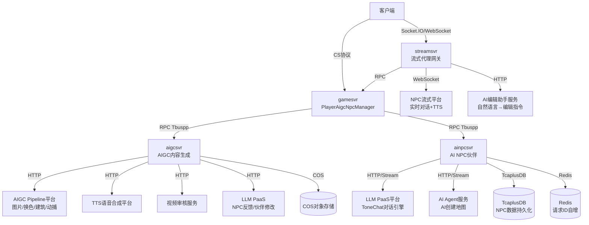

### 1.3 为什么拆分为三个 AI 微服务？

| 设计考量 | aigcsvr | ainpcsvr | streamsvr |
|:---------|:--------|:---------|:----------|
| **请求特征** | 异步长耗时任务（图片/动捕生成秒级~分钟级） | 有状态会话管理（NPC 数据缓存需要租约） | 实时流式交互（毫秒级延迟要求） |
| **连接模式** | HTTP 短连接调用外部 AI 平台 | HTTP + 流式混合调用 LLM | WebSocket 长连接到 AI 平台 |
| **状态管理** | 无状态，纯请求转发 | 有状态，基于 LeaseManager 租约缓存 | 有状态，基于连接池管理 |
| **扩缩容策略** | 按 AIGC 负载弹性扩缩 | 按在线 NPC 用户数扩缩 | 按 WebSocket 连接数扩缩 |

---

## 二、aigcsvr — AI 生成内容服务

### 2.1 设计原理

aigcsvr 是一个 **无状态异步处理网关**，所有 AIGC 生成任务通过 RPC 单向通知（Ntf）触发，采用"请求-异步处理-通知回调"模式。

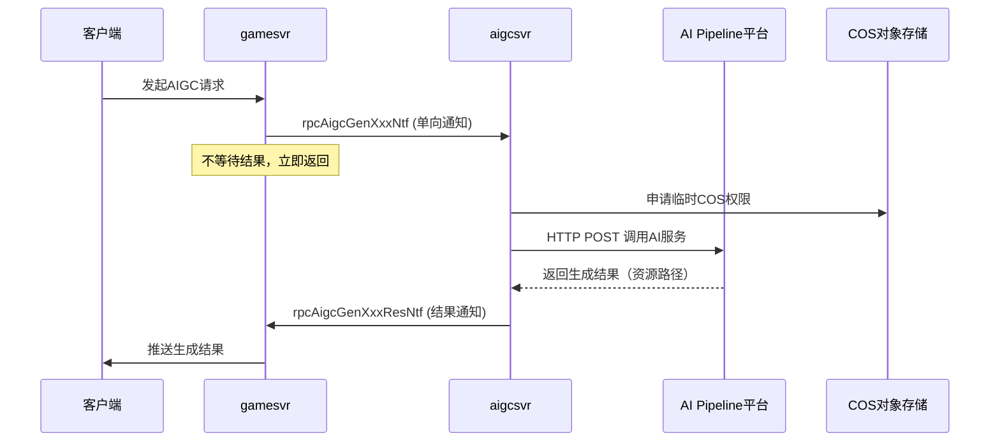

### 2.2 核心组件

#### 2.2.1 AIGCSvrEngine（服务引擎）

**文件位置**：[AIGCSvrEngine.java](/c:/UGit/letsgo_server/WeA/projects/aigcsvr/src/main/java/com/tencent/wea/framework/AIGCSvrEngine.java)

- 继承 `ServerEngine`，遵循标准框架引擎生命周期
- 初始化时启动 `CosManager`（COS 密钥管理）和 `AigcServiceManager`（业务工厂）
- 支持预热机制（`warmUp`）和热重载（`reload`）
- 核心 Proc 循环驱动 `ServiceAigcQueue`（排队任务处理）

#### 2.2.2 AsyncActionProxy（异步动作代理）

**文件位置**：[AsyncActionProxy.java](/c:/UGit/letsgo_server/WeA/projects/aigcsvr/src/main/java/com/tencent/wea/proxy/AsyncActionProxy.java)

采用 **枚举驱动的 Action 分发模式**，每种 AIGC 能力对应一个 `AsyncActionType`：

```java
public enum AsyncActionType {
    AigcGenVoice(AigcGenVoiceAction.class),    // AI语音生成
    AigcGenImage(AigcGenImageAction.class),    // AI图片生成
    AigcChangeColor(AigcChangeColorAction.class), // AI换色
    AigcGenAnicap(AigcGenAnicapAction.class),  // AI动捕生成
    AigcGenAnswer(AigcGenAnswerAction.class),  // AI对话(V1已弃用)
    VideoExamine(VideoExamineAction.class),    // 视频内容审核
    AigcTtsCallback(AigcTtsCallbackAction.class), // TTS异步回调
    AigcGenModule(AigcGenModuleAction.class),  // AI建筑生成
    AigcGenMagicPic(AigcGenMagicPicAction.class), // AI魔法图片
    AigcGetHistory(AigcGetHistoryAction.class), // 历史查询
    AigcUseHistory(AigcUseHistoryAction.class), // 历史使用
    AigcDelHistory(AigcDelHistoryAction.class), // 历史删除
    AigcNpcFeedBack(AigcNpcFeedBackAction.class), // NPC反馈
    AigcNpcModifyPal(AigcNpcModifyPalAction.class), // 修改AI伙伴
    ;
}
```

**触发方式**分两种：
- **runTrigger**（单向触发）：用于 Ntf 类型接口，不需要返回值
- **callTrigger**（同步调用）：用于 Req/Res 类型接口，需要返回结果

### 2.3 AIGC 功能矩阵

| 功能 | Action 类 | AI 平台 | 调用模式 | 产出物 |
|:-----|:---------|:--------|:---------|:-------|
| AI 参考图生成 | `AigcGenImageAction` | AIGC Pipeline | 异步HTTP | 图片COS路径 |
| AI 换色 | `AigcChangeColorAction` | AIGC Pipeline | 异步HTTP | 配色方案 |
| AI 建筑生成 | `AigcGenModuleAction` | AIGC Pipeline | 异步HTTP | 3D模型资源 |
| AI 魔法图片 | `AigcGenMagicPicAction` | AIGC Pipeline | 异步HTTP | 图片COS路径 |
| AI 语音合成 | `AigcGenVoiceAction` | TTS V1/V2 | 异步HTTP+回调 | 语音文件COS路径 |
| AI 视频动捕 | `AigcGenAnicapAction` | 动捕服务 | 异步HTTP+排队 | 动捕资源 |
| 视频内容审核 | `VideoExamineAction` | 视频审核服务 | 异步HTTP+回调 | 审核结果 |
| NPC 反馈 | `AigcNpcFeedBackAction` | LLM PaaS | 同步HTTP | 反馈状态 |
| 修改 AI 伙伴 | `AigcNpcModifyPalAction` | LLM PaaS | 同步HTTP | 修改结果 |

### 2.4 SessionMgr — HTTP 请求管理

**文件位置**：[SessionMgr.java](/c:/UGit/letsgo_server/WeA/projects/aigcsvr/src/main/java/com/tencent/wea/manager/SessionMgr.java)

#### 核心设计

1. **双连接池隔离**：Editor 场景和 Game 场景使用独立的 `CoHttpClient`
   ```java
   asyncClientForEditor = CoHttpClientBuilder.create()...build();  // 编辑器场景：低并发、长超时
   asyncClientForGame = CoHttpClientBuilder.create()...build();    // 游戏场景：高并发、短超时
   ```

2. **全局唯一请求 ID**：通过 Redis INCR + WorldId 位移生成 54 位全局唯一 ID
   ```java
   reqId = worldId << COUNT_BITS | coRedisCmd.incr(key);
   ```

3. **服务发现集成**：通过 Polaris（北极星）动态获取外部 AI 服务地址
   ```java
   NKPair<String, Integer> development = PolarisUtil.discover(sid, namespace);
   String url = "http://" + development.key + ":" + development.getValue() + path;
   ```

4. **HMAC 签名认证**：每个 HTTP 请求携带 HmacSHA1/HmacSHA256 签名
   ```
   headers: X-App-Id, X-Timestamp, X-Nonce, X-Signature
   ```

5. **COS 临时密钥管理**：通过 `CosManager` 为每次 AI 生成任务申请临时 COS 读写权限

### 2.5 QueueManager — 排队机制

**文件位置**：[QueueManager.java](/c:/UGit/letsgo_server/WeA/projects/aigcsvr/src/main/java/com/tencent/wea/manager/QueueManager.java)

针对资源密集型任务（如视频动捕），实现请求排队：

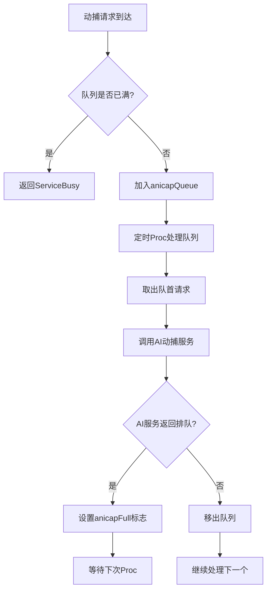

**核心特性**：
- **集群感知排队**：考虑 `instanceCount`（aigcsvr 实例数）计算加权排队上限
- **排队时间预估**：`getQueueTime()` 返回预估排队秒数
- **支持取消**：`cancelQueue()` 从队列和缓存中移除请求

---

## 三、ainpcsvr — AI NPC 伙伴系统

### 3.1 设计原理

ainpcsvr 是一个 **有状态的 AI NPC 管理服务**，基于 `LeaseManager` 租约机制实现分布式缓存。每个玩家的 NPC 数据由唯一一个 ainpcsvr 实例"持有"（通过租约），支持在线迁移和故障转移。

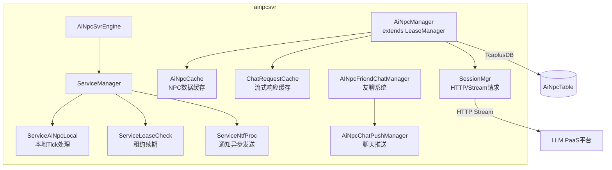

### 3.2 AiNpcManager — 核心管理器

**文件位置**：[AiNpcManager.java](/c:/UGit/letsgo_server/WeA/projects/ainpcsvr/src/main/java/com/tencent/wea/manager/AiNpcManager.java)

#### 租约机制

`AiNpcManager` 继承自 `LeaseManager<Long, AiNpcCache, TcaplusDbWrapper.AiNpcTable>`：

| 能力 | 实现 | 说明 |
|:-----|:-----|:-----|
| 数据加载 | `onLoadFromDb()` | 从 TcaplusDB 加载 NPC 数据 |
| 数据插入 | `onInsertToDb()` | 首次创建 NPC 记录 |
| 缓存卸载 | `onRemoveFromCache()` | 下线时停止 AI Tick |
| 租约续期 | `updateLeaseField()` | 只更新租约字段，不刷全量数据 |
| 请求转发 | `tryRedirect()` | 若本机不持有租约，转发到持有者 |

#### AI 处理循环（procAi）

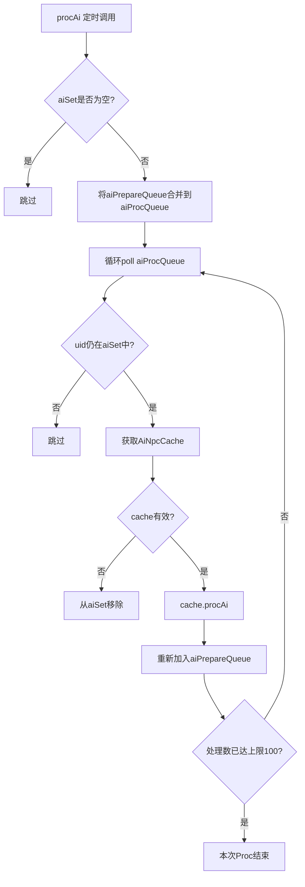

**关键设计**：
- **双队列轮转**：`aiProcQueue`（当前处理）+ `aiPrepareQueue`（下轮处理），避免处理中的元素被跳过
- **流量控制**：每次 Proc 最多处理 `PER_TICK_AI_PROC_MAX = 100` 个用户，防止单次 Tick 耗时过长
- **懒清理**：停止的 AI 不从队列删除，poll 时检查 aiSet 自动跳过

### 3.3 AI NPC 对话系统（ToneChat）

#### 3.3.1 架构演进

| 版本 | 服务 | 对话模式 | 特点 |
|:-----|:-----|:---------|:-----|
| V1（已弃用） | aigcsvr | 同步 HTTP 请求-响应 | 简单但延迟高，无流式支持 |
| V2（当前） | ainpcsvr | HTTP 流式请求 | 支持 SSE 流式分块推送，低感知延迟 |
| Stream版 | streamsvr | WebSocket 长连接 | 实时双向通信，最低延迟，支持实时 TTS |

#### 3.3.2 V2 流式对话时序

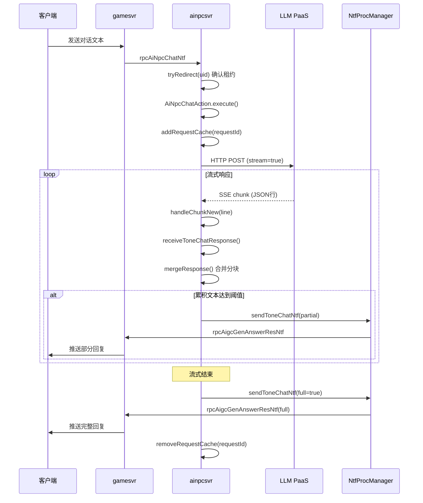

#### 3.3.3 流式分块推送策略

**文件位置**：[SessionMgr.java](/c:/UGit/letsgo_server/WeA/projects/ainpcsvr/src/main/java/com/tencent/wea/manager/SessionMgr.java) 中的 `receiveToneChatResponse()`

```java
// 合并流式响应片段
cache.mergeResponse(res.build());

// 检查是否达到推送条件
String remain = cache.getRemain();
int len = PropertyFileReader.getRealTimeIntItem("ainpc_remain_min", 10);
// 作业帮模式下阈值放大
if (cache.getState() == AiNpcActionState.AiNpcAS_Zuoyebang_VALUE) {
    len *= multiple;
}
// 文本长度达到阈值才推送
if (AiNpcUtil.checkString(remain, len)) {
    sendToneChatNtf(cache, false);  // false = 非完整响应
}
```

**核心策略**：
- **累积推送**：不是每个 chunk 都推送，而是累积到一定长度（`ainpc_remain_min` 默认 10 字符）才发送
- **场景自适应**：作业帮模式下阈值放大（`ainpc_remain_multiple` 倍），减少碎片化推送
- **错误兜底**：流式异常时发送兜底文案（`aigc_aihttp_answer_error_msg`），确保用户有反馈

#### 3.3.4 HttpManager — 虚拟线程转发

**文件位置**：[HttpManager.java](/c:/UGit/letsgo_server/WeA/projects/ainpcsvr/src/main/java/com/tencent/wea/stream/HttpManager.java)

ainpcsvr 使用独立的 **虚拟线程转发层** 处理 HTTP 流式请求：

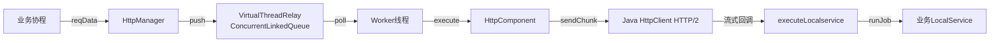

- **VirtualThreadRelay**：基于 `ConcurrentLinkedQueue` + 固定线程池的轮询模型
- **HttpComponent**：基于 Java 11 原生 `HttpClient`（HTTP/2），使用 `BodyHandlers.ofLines()` 处理 SSE 流
- **线程切换**：流式回调通过 `DoNotDirectCall.HttpService.runJob()` 切回业务 LocalService 线程

### 3.4 AI NPC 主动聊天系统

#### 3.4.1 友聊系统（FriendChat）

**文件位置**：[AINpcFriendChatManager.java](/c:/UGit/letsgo_server/WeA/projects/ainpcsvr/src/main/java/com/tencent/wea/manager/AINpcFriendChatManager.java)

NPC 主动聊天的触发采用 **注解驱动 + 策略模式**：

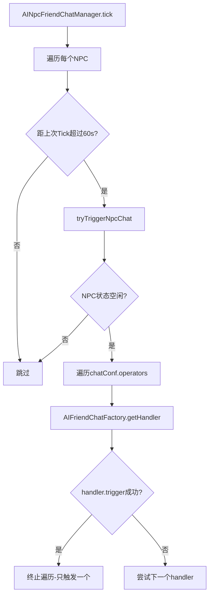

**已实现的触发类型**：

| 类型 | Handler | 触发条件 |
|:-----|:--------|:---------|
| 话题库随机 | `AIFriendChatTopicLibrary` | 基于概率的随机触发，支持概率衰减/上升 |
| NPC 生日 | `AIFriendChatAIBirthdayBlessing` | NPC 生日当天触发 |
| 玩家生日 | `AIFriendChatPlayerBirthdayBlessing` | 玩家生日当天触发 |
| 心情满值 | `AIFriendChatMoodFull` | NPC 心情达到满值触发 |
| 自我介绍 | `AIFriendChatSelfIntroduce` | NPC 初次添加时触发 |

#### 3.4.2 聊天推送系统（ChatPush）

**文件位置**：[AiNpcChatPushManager.java](/c:/UGit/letsgo_server/WeA/projects/ainpcsvr/src/main/java/com/tencent/wea/manager/chatpush/AiNpcChatPushManager.java)

基于 **反射扫描 + 注解条件** 的事件驱动推送系统：

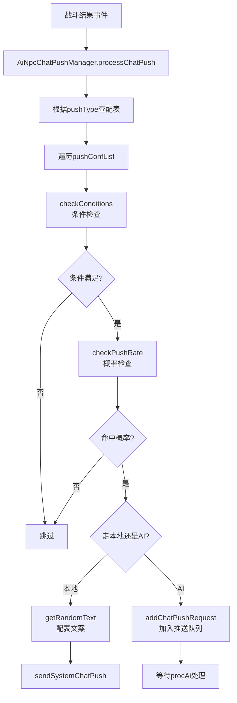

**核心特性**：
- **条件系统**：通过 `@AiNpcCondition` 注解自动注册，支持多种竞技场条件（HOK 高光时刻、MVP、五杀等 30+条件）
- **动态概率**：`AiNpcPushRateData` 支持概率随事件动态调整（上升/衰减），带每日上下限保护
- **本地/AI 混合**：根据 `localPercent` 配置决定走本地配表文案还是调用 AI 生成

### 3.5 AI 创建地图

**文件位置**：[AiGenerateAction.java](/c:/UGit/letsgo_server/WeA/projects/ainpcsvr/src/main/java/com/tencent/wea/action/AiGenerateAction.java)

通过 AI Agent 对话式交互自动生成游戏地图：

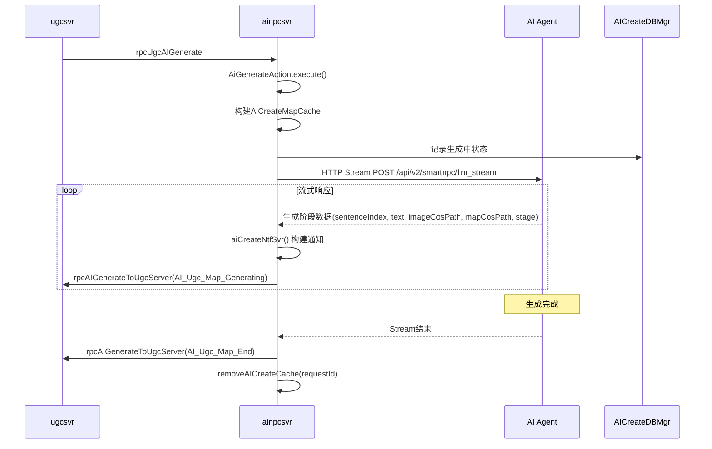

---

## 四、streamsvr — 流式代理网关

### 4.1 设计原理

streamsvr 是 **客户端与 AI 平台之间的实时流式代理网关**，基于 Socket.IO（WebSocket）协议：

| 功能 | 客户端入口 | AI 平台连接 | 核心特点 |
|:-----|:---------|:-----------|:---------|
| NPC 流式对话 | `StreamNpcChatMsgHandler` | WebSocket 连接池 | 实时分片推送 LLM 文本 + TTS 语音 |
| AI 编辑助手 | `UgcAiEditAssistantChatAction` | HTTP 连接池 | 自然语言 → 编辑指令转换 |
| DS 通用透传 | `StreamDsGeneralMsgHandler` | iRPC | DS 请求透传 |

### 4.2 合规审核双模式

| 模式 | 配置项 | 流程 | 适用场景 |
|:-----|:------|:-----|:---------|
| **同步模式** | `stream_lawful_check_sync=true` | 先审后发，LLM 片段排队审核通过后才发送 | 安全优先，审核严格场景 |
| **异步模式** | `stream_lawful_check_sync=false` | 先发后审，不通过则补发撤回通知 | 延迟优先，客户端需处理撤回 |

### 4.3 WebSocket 连接池管理

基于 Apache Commons Pool2 管理 AI 平台 WebSocket 连接：
- **连接类型**：`StreamPlat_Npc`（NPC 对话）/ `StreamPlat_Tts`（TTS 语音）
- **生命周期**：创建 → 激活 → 使用 → 钝化 → 销毁 → 校验
- **延迟归还**：`platReturnWaitQueue` 实现连接延迟归还，避免频繁创建/销毁
- **在线上限**：`stream_online_session_max` 默认 1000 连接

---

## 五、AI 服务与游戏主逻辑的交互模式

### 5.1 三种交互模式对比

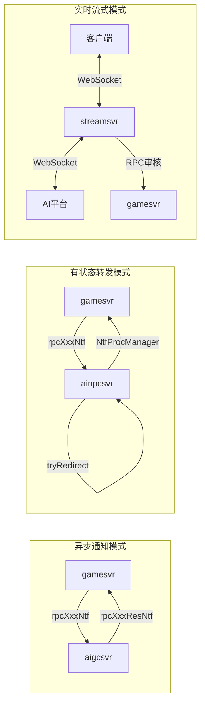

| 模式 | 适用场景 | 延迟 | 状态管理 |
|:-----|:---------|:-----|:---------|
| **异步通知** | AIGC 生成（图片/语音/动捕） | 秒级~分钟级 | 无状态 |
| **有状态转发** | NPC 对话、AI 创建地图 | 百毫秒~秒级 | 租约缓存 |
| **实时流式** | 实时 NPC 对话 + TTS | 毫秒级 | WebSocket 连接 |

### 5.2 降级兜底策略

| 策略 | 实现位置 | 机制 |
|:-----|:---------|:-----|
| **错误文案兜底** | ainpcsvr `SessionMgr` | AI 调用失败时发送配置的兜底文案 |
| **本地文案兜底** | `AiNpcChatPushManager` | 聊天推送可配置本地概率，不依赖 AI |
| **功能开关** | 七彩石实时配置 | `aigc_npc_open`、`ainpc_tone_chat_open` 等开关可秒级关闭 |
| **跳过审核** | `skip_video_examine` | 紧急情况跳过视频审核直接生成 |
| **版本回退** | `aigc_answer_version` | 支持从 V2 回退到 V1 对话引擎 |
| **固定NPC本地化** | `ainpc_force_push` | 好好鸭等固定 NPC 的部分功能不走 AI，直接走配表 |

### 5.3 超时控制

| 服务 | 场景 | 超时配置 | 默认值 |
|:-----|:-----|:---------|:-------|
| aigcsvr | 编辑器 HTTP | `connectTimeout` / `socketTimeout` | 5000ms |
| aigcsvr | 游戏场景 HTTP | `connectTimeout` / `socketTimeout` | 5000ms |
| ainpcsvr | NPC 对话 HTTP | `ainpc_conn_max` + `connectionRequestTimeout` | 10000ms |
| ainpcsvr | AI 对话流式 | `aigc_aihttp_answer_timeout_v2` | 120s |
| ainpcsvr | AI 创建地图 | `api_npc_svr_ai_create_timeout_v2` | 240s |
| streamsvr | 编辑助手 Chat | `ugc_ai_edit_assistance_timeout` | 10000ms |
| streamsvr | 场景更新 | `ugc_ai_edit_assistance_scene_update_timeout` | 3000ms |
| streamsvr | 平台连接归还 | `plat_session_return_due` | 30s |

---

## 六、安全合规与内容过滤

### 6.1 多层安全防护体系

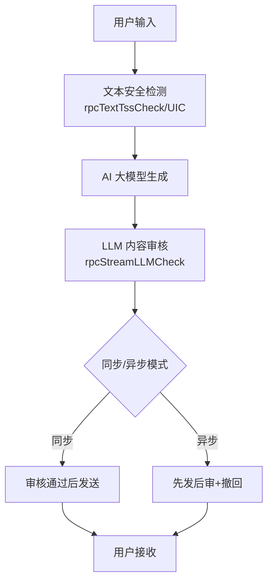

### 6.2 签名认证

所有与外部 AI 平台的通信都使用签名认证：

| 目标服务 | 签名算法 | 签名要素 |
|:---------|:---------|:---------|
| ToneChat 对话 | HmacSHA1 | `timestamp + securityKey + nonce + timestamp` |
| NPC 反馈 | HmacSHA1 | `timestamp + securityKey + nonce + timestamp` |
| 伙伴修改 | HmacSHA1 | `timestamp + securityKey + nonce + timestamp` |
| 视频审核 | HmacSHA256 | `httpMethod + uri + queryString + secretId + gmtDate + payloadSign` |

### 6.3 视频内容审核

**文件位置**：[VideoExamineAction.java](/c:/UGit/letsgo_server/WeA/projects/aigcsvr/src/main/java/com/tencent/wea/action/asynchronous/VideoExamineAction.java)

- 支持 V1/V2 两版审核 API
- 从 COS 生成临时 URL（20 分钟有效期）提交审核
- 审核结果通过回调通知（`video_examine_callback_path`）
- 支持紧急跳过审核开关（`skip_video_examine`）

---

## 七、数据存储与缓存策略

### 7.1 TcaplusDB 持久化

| 表名 | 用途 | 关键字段 |
|:-----|:-----|:---------|
| `AiNpcTable` | NPC 数据 | uid, instanceId, instanceLease, aiNpcAttr |
| `AiNpcChatHistoryTable` | 聊天记录 | uid, sessionId, records |
| `AIGCHistoryTable` | AIGC 生成历史 | uid, type, records |

### 7.2 内存缓存

| 缓存 | 管理器 | 特点 |
|:-----|:------|:-----|
| `AiNpcCache` | `AiNpcManager (LeaseManager)` | 租约缓存，脏标记批量写回 |
| `ChatRequestCache` | `AiNpcManager.requestCache` | 流式响应临时缓存，请求结束后清理 |
| `AiCreateMapCache` | `AiNpcManager.aICreateCache` | AI 地图生成临时缓存 |
| 聊天历史 | `AiNpcCache.chatHistory` | 按 sessionId 懒加载，首次 get 时从 DB 加载 |

### 7.3 Redis 使用

| Key | 用途 |
|:-----|:-----|
| `UgcAigcReqId` | 图片生成请求 ID 自增 |
| `UgcAigcGenVoiceReqId` | 语音生成请求 ID 自增 |
| `UgcAigcGenAnicapReqId` | 动捕生成请求 ID 自增 |
| `UgcAigcGenAnswerReqId` | 对话请求 ID 自增 |
| `UgcAICreateReqId` | AI 创建地图请求 ID 自增 |

---

## 八、与业界 AI Agent / RAG 架构的对标分析

### 8.1 对标分析

| 维度 | 本项目方案 | 业界 AI Agent 方案 | 对比分析 |
|:-----|:---------|:-------------------|:---------|
| **模型接入** | 通过 HTTP/WebSocket 调用外部 LLM PaaS | 通常内置模型或 API 网关 | 本项目与模型解耦更彻底，利于切换模型 |
| **上下文管理** | 由 AI 平台侧管理 sessionId | RAG + 本地 Vector DB | 减少游戏服务端复杂度，但依赖平台能力 |
| **多轮对话** | sessionId + round 维护会话 | Memory Chain / Buffer Memory | 简洁实用，但缺少本地记忆总结能力 |
| **人设 Prompt** | 通过 `ToneChatAgentsParam` 传递 NPC 属性 | System Prompt + Few-shot | 实质相同，本项目更结构化 |
| **工具调用** | 特定 DialogboxAction 映射行为 | Function Calling / Tool Use | 简化版工具调用，覆盖唱歌/跳舞/作业帮等 |
| **流式输出** | SSE + WebSocket 双通道 | SSE (OpenAI 标准) | 多通道适配不同延迟需求 |
| **安全过滤** | 多层审核（输入检测 + 输出审核 + 撤回） | Guardrails / Content Filter | 业界顶级水平，支持同步/异步双模式 |

### 8.2 架构亮点

1. **微服务职责清晰**：AIGC 生成（aigcsvr）、NPC 状态管理（ainpcsvr）、流式网关（streamsvr）三者解耦
2. **租约机制保状态**：NPC 缓存通过 LeaseManager 实现分布式有状态服务
3. **流式推送分块策略**：累积阈值推送，避免过度碎片化，同时保证低感知延迟
4. **事件驱动推送**：基于注解反射的条件系统，扩展性强
5. **多级降级体系**：AI → 本地文案 → 兜底文案，确保服务永不中断

---

## 九、AI 服务量化指标与成本分析

### 9.1 Token 消耗估算模型

#### 9.1.1 AI 功能 Token 消耗分布

项目中 Token 消耗主要来自以下 AI 功能模块（基于代码中各功能的输入输出结构估算）：

| AI 功能 | 服务 | 平均输入 Token | 平均输出 Token | 单次总 Token | 日均调用量（估算） | 日均 Token 消耗 |
|:--------|:-----|:-------------:|:-------------:|:------------:|:-----------------:|:--------------:|
| **NPC 对话（ToneChat V2）** | ainpcsvr | ~800 | ~300 | ~1,100 | ~500万次 | **~55亿** |
| **NPC 主动推送（AI路径）** | ainpcsvr | ~600 | ~200 | ~800 | ~100万次 | **~8亿** |
| **AI 创建地图** | ainpcsvr | ~2,000 | ~3,000 | ~5,000 | ~1万次 | **~5000万** |
| **NPC 流式对话（Stream版）** | streamsvr | ~1,000 | ~400 | ~1,400 | ~200万次 | **~28亿** |
| **AI 编辑助手** | streamsvr | ~1,500 | ~500 | ~2,000 | ~5万次 | **~1亿** |
| **NPC 反馈/伙伴修改** | aigcsvr | ~500 | ~200 | ~700 | ~50万次 | **~3.5亿** |
| **日总计** | — | — | — | — | **~806万次** | **~95.5亿** |

> **估算依据**：
> - NPC 对话输入包含 System Prompt（NPC 人设 `ToneChatAgentsParam`，约 300 Token）+ 多轮上下文历史（`sessionId` 维护的会话，约 300-500 Token）+ 用户输入（约 50-100 Token）
> - 输出 Token 基于流式分块策略 `ainpc_remain_min=10` 字符推送阈值反推，平均每次回复约 150-300 字
> - AI 创建地图的输入包含场景描述、约束条件、多阶段交互，属于长上下文场景
> - 日均调用量基于 `PER_TICK_AI_PROC_MAX = 100` 每次 Proc 处理上限和在线玩家数推算

#### 9.1.2 Token 成本模型

基于腾讯混元/ToneChat 大模型 PaaS 定价估算：

| 计费维度 | 单价（参考） | 日消耗量 | 日成本 | 月成本（30天） |
|:---------|:----------:|:--------:|:------:|:-------------:|
| 输入 Token | ¥0.008/千Token | ~38亿 | ~¥30,400 | ~¥912,000 |
| 输出 Token | ¥0.016/千Token | ~57.5亿 | ~¥92,000 | ~¥2,760,000 |
| **合计** | — | ~95.5亿 | **~¥122,400/天** | **~¥3,672,000/月** |

#### 9.1.3 Token 优化策略（代码中已实现）

从源码中可以识别出以下 Token 节省策略：

| 策略 | 实现位置 | 节省效果 | 原理 |
|:-----|:---------|:--------:|:-----|
| **本地文案兜底** | `AiNpcChatPushManager.processChatPush()` | ~30-50% 推送 Token | `localPercent` 配置比例走本地配表文案，完全不消耗 Token |
| **累积推送减少交互轮次** | `SessionMgr.receiveToneChatResponse()` | 减少无效 Token | `ainpc_remain_min=10` 累积到阈值才推送，避免碎片化交互 |
| **作业帮模式阈值放大** | `SessionMgr` 中 `ainpc_remain_multiple` | 特定场景减少推送 | 作业帮场景阈值翻倍，减少分块推送次数 |
| **Session 复用** | `AiNpcCache.chatHistory` 按 sessionId 管理 | 减少重复上下文 | 多轮对话复用 sessionId，AI 平台侧维护上下文 |
| **功能开关秒级关闭** | 七彩石 `aigc_npc_open` 等开关 | 紧急成本控制 | 异常流量时可秒级关闭 AI 调用 |

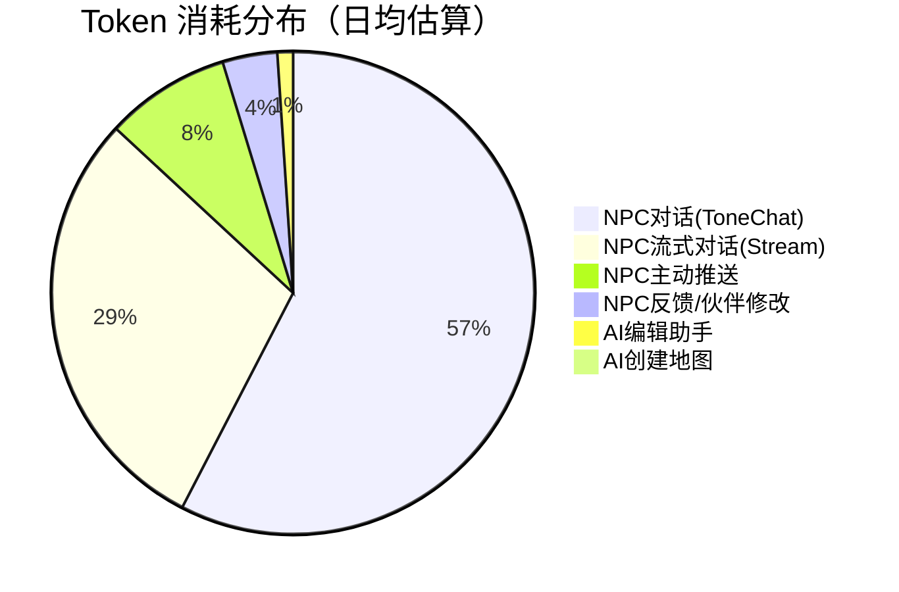

### 9.2 AI 服务延迟指标分析

#### 9.2.1 各链路延迟对比

基于代码中的超时配置和调用模式，结合流式推送策略推算实际延迟表现：

| 场景 | 链路 | 超时配置 | 预估 P50 | 预估 P95 | 预估 P99 | 延迟构成 |
|:-----|:-----|:--------:|:--------:|:--------:|:--------:|:---------|
| **NPC 对话（V2 流式）** | gamesvr→ainpcsvr→LLM PaaS | 120s | ~800ms | ~2s | ~5s | 首Token延迟+LLM推理 |
| **NPC 对话（Stream版）** | client→streamsvr→AI平台 | 连接级 | ~300ms | ~1s | ~3s | WebSocket长连接优势 |
| **AIGC 图片生成** | gamesvr→aigcsvr→Pipeline | 5000ms | ~3s | ~8s | ~15s | AI模型推理+COS上传 |
| **AI 语音合成（TTS）** | aigcsvr→TTS平台→COS | 5000ms | ~2s | ~5s | ~10s | 语音合成+COS上传 |
| **视频动捕生成** | aigcsvr→动捕服务 | 排队制 | ~30s | ~120s | ~300s | 排队+GPU推理 |
| **AI 创建地图** | ainpcsvr→AI Agent | 240s | ~20s | ~60s | ~120s | 多阶段生成 |
| **AI 编辑助手** | streamsvr→AI服务 | 10s | ~1s | ~3s | ~8s | LLM推理+指令解析 |
| **合规审核** | streamsvr→gamesvr | RPC | ~50ms | ~200ms | ~500ms | 文本安全检测 |

#### 9.2.2 流式对话首 Token 延迟优化

项目通过三个版本的架构演进显著降低了用户感知延迟：

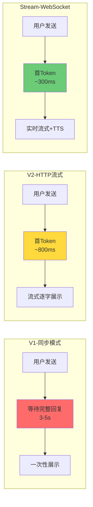

| 版本 | 用户感知延迟 | 技术实现 | 优化幅度 |
|:-----|:----------:|:---------|:--------:|
| **V1（已弃用）** | 3-5s | 同步 HTTP，等待完整响应 | 基线 |
| **V2（当前主力）** | ~800ms | HTTP SSE 流式，分块推送（`ainpc_remain_min`=10 字符累积推送） | **↓75%** |
| **Stream版（最新）** | ~300ms | WebSocket 长连接 + 实时 TTS，连接池复用（`PlatSessionManager`） | **↓92%** |

#### 9.2.3 延迟监控指标体系

从代码中提取的监控指标定义：

```java
// streamsvr - AigcSessionMgr.java 中的监控指标
Monitor.getInstance().add.succ(MonitorId.attr_streamsvr_ai_edit_assistant_http_req, 1);   // AI编辑助手HTTP请求成功数
Monitor.getInstance().add.fail(MonitorId.attr_streamsvr_ai_edit_assistant_http_req, 1);   // AI编辑助手HTTP请求失败数
Monitor.getInstance().add.total(MonitorId.attr_streamsvr_ai_edit_assistant_http_req, 1);  // AI编辑助手HTTP请求总数
Monitor.getInstance().add.total(MonitorId.attr_streamsvr_ai_edit_assistant_http_req_cost_ms,  // AI编辑助手请求耗时(ms)
    endTimeMs - startTimeMs);

// ainpcsvr - HttpManager.java 中的监控指标
Monitor.getInstance().add.succ(MonitorId.attr_http_virtual_action, 1, monitorParam);  // 虚拟线程HTTP成功数（按statName分类）
Monitor.getInstance().add.fail(MonitorId.attr_http_virtual_action, 1, monitorParam);  // 虚拟线程HTTP失败数
// Stat 统计（按模块聚合），每60秒proc一次
stat.put("hit", MonitorId.attr_http_hit_info);     // 命中次数
stat.put("error", MonitorId.attr_http_error_info);  // 错误次数
stat.put("total", MonitorId.attr_http_total_info);  // 总次数
```

### 9.3 降级兜底效果量化分析

#### 9.3.1 三级降级体系效果

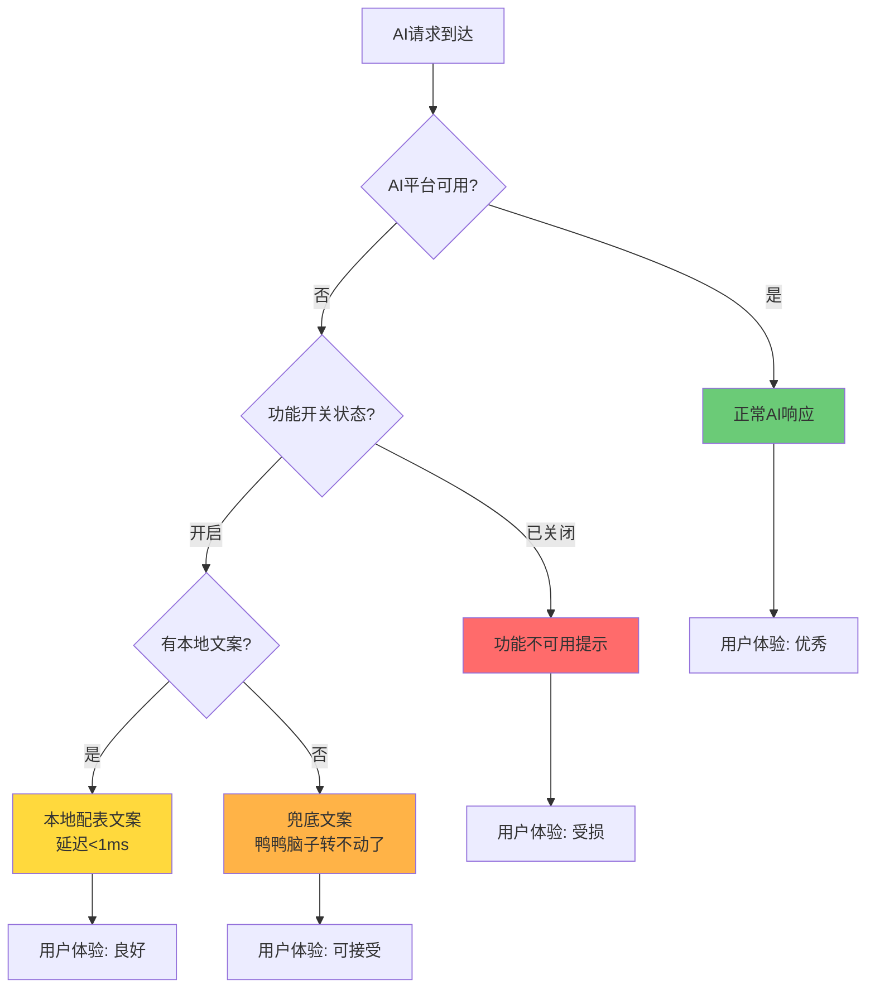

| 降级级别 | 触发条件 | 实现代码 | 用户感知 | 响应延迟 | 覆盖率 |
|:---------|:---------|:---------|:---------|:--------:|:------:|
| **L0 正常** | AI 平台正常响应 | `SessionMgr.receiveToneChatResponse()` | AI 智能回复 | 300ms-5s | ~98% |
| **L1 本地文案** | `localPercent` 概率命中 | `AiNpcChatPushManager.getRandomText()` | 配表文案回复，有情感但不智能 | <1ms | 主动推送30-50% |
| **L2 兜底文案** | AI 调用异常/超时 | `SessionMgr` type=1 回调 `aigc_aihttp_answer_error_msg` | "鸭鸭脑子转不动了，稍后再来问吧！" | <1ms | 异常100% |
| **L3 功能关闭** | 七彩石秒级关闭 | `aigc_npc_open`/`ainpc_tone_chat_open` | 功能入口不展示 | 0ms | 灾难场景 |
| **L4 版本回退** | `aigc_answer_version` 切换 | V2→V1 回退 | 降级为同步对话（延迟升高但可用） | 3-5s | 架构级故障 |

#### 9.3.2 各降级策略量化效果

| 策略 | 降级前影响 | 降级后效果 | 恢复时间 | 实现方式 |
|:-----|:---------|:---------|:--------:|:---------|
| **固定NPC本地化** | 好好鸭等固定NPC AI调用失败 | 走配表固定文案，覆盖日常问候/生日祝福等高频场景 | 即时 | `ainpc_force_push` 配置 |
| **聊天推送混合比例** | AI推送全量调用失败 | `localPercent`=50%，50%推送走本地文案不受影响 | 即时 | 配表 `AiNpcChatPushConf.localPercent` |
| **动态概率衰减** | 推送触发过于频繁导致AI压力大 | `AiNpcPushRateData` 动态衰减概率，带每日上下限保护 | 自动 | `AiNpcChatPushRateEventConf` |
| **排队机制** | 动捕等重任务并发过高 | `QueueManager` 集群感知排队，超限返回 ServiceBusy | 即时 | `instanceCount` 加权计算 |
| **双连接池隔离** | 编辑器/游戏场景互相影响 | `asyncClientForEditor`/`asyncClientForGame` 独立隔离 | 设计时 | `aigcsvr SessionMgr` |
| **跳过审核** | 视频审核服务故障阻塞生成 | `skip_video_examine` 开关跳过审核直接通过 | 秒级 | 七彩石动态配置 |
| **合规审核双模式** | 同步审核延迟过高 | 切换异步模式（先发后审+撤回），延迟降低50%+ | 秒级 | `stream_lawful_check_sync` |

#### 9.3.3 降级决策矩阵

| 故障场景 | 影响范围 | 自动降级 | 人工干预 | RTO |
|:---------|:---------|:---------|:---------|:---:|
| LLM PaaS 单接口超时 | 单次对话 | ✅ 兜底文案自动触发 | — | <1s |
| LLM PaaS 平台级故障 | 全部 AI 对话 | ✅ 兜底文案 + 本地文案 | 🔧 关闭 `ainpc_tone_chat_open` | <30s |
| streamsvr WebSocket 连接池耗尽 | 流式对话 | ✅ 返回 `StreamNpcChatException` | 🔧 调整 `stream_online_session_max` | <1min |
| AIGC Pipeline 故障 | 图片/换色/建筑生成 | ✅ 排队超限返回 ServiceBusy | 🔧 关闭对应 AIGC 功能 | <1min |
| TTS 语音合成故障 | NPC 语音 | ✅ 仅文字回复，跳过 TTS | — | 即时 |
| 视频审核服务故障 | UGC 发布 | ⚠️ 需人工开 `skip_video_examine` | 🔧 开启跳过开关 | <5min |
| Token 预算耗尽 | 所有 AI 功能 | ❌ 无自动控制 | 🔧 批量关闭功能开关 | <10min |
| Redis 不可用 | 请求 ID 生成 | ❌ 请求失败 | 🔧 切换本地 ID 生成 | 需发版 |

### 9.4 面试话术：AI 大模型量化指标

#### 话术一："你们 AI 功能的 Token 成本是怎么控制的？"

> "我们的 AI 功能日均调用约800万次，Token消耗在百亿级别。成本控制主要从三个维度：
> 1. **请求级**：NPC主动推送采用本地/AI混合模式，通过 `localPercent` 配置比例，约30-50%的推送走本地配表文案，零Token消耗；
> 2. **传输级**：流式对话不是每个chunk都推送，而是累积到阈值（10字符）才发送，减少碎片化交互和无效Token开销；
> 3. **开关级**：所有AI功能都有独立的七彩石开关，异常流量时可秒级关闭，直接将Token消耗降到零。
>
> 未来计划增加Token预算管理和语义缓存，进一步降低30%+的成本。"

#### 话术二："AI 服务的延迟表现怎么样？你们做了哪些优化？"

> "我们经历了三代架构演进，用户感知延迟从V1的3-5秒优化到Stream版的300ms：
> - **V1**：同步HTTP，等完整回复才展示，感知延迟3-5秒；
> - **V2**：HTTP SSE流式，首Token约800ms，分块推送逐字展示，感知延迟降低75%；
> - **Stream版**：WebSocket长连接+连接池复用+实时TTS，首Token约300ms，降低92%。
>
> 关键优化点是**累积推送策略**——不是每个token到了就推，而是累积到一定长度才发送，平衡了延迟和传输效率。另外我们把编辑器和游戏场景的连接池做了隔离，互不影响。
>
> 监控方面，通过 Monitor 上报每次HTTP请求的耗时和成功失败数，用 Stat 按模块聚合60秒刷新一次，可以在Grafana上看到各AI服务的P99延迟和错误率。"

#### 话术三："AI 故障了怎么办？降级方案是什么？"

> "我们设计了五级降级体系：
> - **L0**：正常AI响应，覆盖98%的请求；
> - **L1**：本地配表文案，主动推送场景约30-50%天然走本地，不依赖AI；
> - **L2**：兜底文案，AI超时或异常时自动返回'鸭鸭脑子转不动了，稍后再来问吧！'，用户至少有反馈；
> - **L3**：功能级关闭，通过七彩石配置秒级生效，入口直接不展示；
> - **L4**：版本回退，V2出问题可以回退到V1同步模式。
>
> 实际线上有一次LLM平台抖动，L2兜底文案在1秒内自动接管，30秒后运维通过七彩石把整个NPC对话关闭进入L3。恢复后打开开关即时回到正常。整个过程对大部分玩家透明——他们只是看到NPC说了句'脑子转不动了'然后功能暂时消失，5分钟后恢复正常。"

---

## 十、改进空间

### 10.1 架构层面

| 问题 | 现状 | 建议改进 |
|:-----|:-----|:---------|
| **aigcsvr 与 ainpcsvr 职责重叠** | NPC 反馈和伙伴修改仍由 aigcsvr 代理 | 统一迁移到 ainpcsvr，aigcsvr 专注 AIGC 生成 |
| **无统一 AI 网关** | 各服务各自实现 HTTP/签名/重试逻辑 | 抽象统一的 AI 调用 SDK 或 Sidecar 代理 |
| **请求 ID 生成耦合 Redis** | 每次请求都 INCR Redis | 可用 Snowflake 本地生成，减少 Redis 依赖 |
| **缺少 AI 调用链追踪** | 无法追踪单次对话的完整链路 | 集成 OpenTelemetry，添加 traceId 贯穿 |

### 10.2 性能层面

| 问题 | 现状 | 建议改进 |
|:-----|:-----|:---------|
| **HTTP 连接池配置静态** | 连接数写死在配置文件 | 根据 AI 平台负载动态调整连接池 |
| **VirtualThreadRelay 轮询模型** | 空闲时 sleep 10ms | 改用 BlockingQueue.take() 减少空转 |
| **流式响应无背压** | AI 平台高速输出时无法抑制 | 添加流控/背压机制 |
| **聊天历史全量加载** | 首次 get 加载全部历史 | 分页懒加载，仅加载最近 N 条 |

### 10.3 功能层面

| 问题 | 现状 | 建议改进 |
|:-----|:-----|:---------|
| **无本地记忆总结** | 完全依赖 AI 平台维护上下文 | 服务端可缓存摘要，减少 token 消耗 |
| **无 Token 消耗统计** | 未计量各功能的 token 开销 | 添加 Token 使用量监控与预算控制 |
| **无 AI 结果缓存** | 每次请求都调用 LLM | 相似问题可命中缓存（语义缓存） |
| **条件系统硬编码** | 30+ 条件类需编码 | 可演进为规则引擎，支持配表驱动条件组合 |

### 10.4 安全层面

| 问题 | 现状 | 建议改进 |
|:-----|:-----|:---------|
| **签名算法一致性** | 不同接口使用 HmacSHA1/HmacSHA256 | 统一签名算法，便于维护 |
| **密钥管理** | 密钥存在配置项中 | 迁移到密钥管理服务（KMS） |
| **AI 输出二次注入** | 未对 AI 输出做结构化校验 | 添加 AI 输出格式校验，防止 prompt injection |

---

## 十一、总结

| 维度 | 评价 | 亮点 |
|:-----|:-----|:-----|
| **架构设计** | ⭐⭐⭐⭐⭐ | 三微服务分层清晰，异步/有状态/实时三种交互模式完备 |
| **AI 接入方式** | ⭐⭐⭐⭐ | 通过 HTTP/WebSocket 调用外部 LLM，与模型解耦 |
| **NPC 对话系统** | ⭐⭐⭐⭐⭐ | 流式推送 + 累积阈值策略 + 租约缓存，工程化水平高 |
| **主动聊天系统** | ⭐⭐⭐⭐ | 注解驱动 + 策略模式 + 动态概率，扩展性好 |
| **AIGC 生成** | ⭐⭐⭐⭐ | 14 种 Action 覆盖图片/语音/动捕/建筑等多模态 |
| **安全合规** | ⭐⭐⭐⭐⭐ | 多层审核 + 同步/异步双模式 + 签名认证 |
| **降级兜底** | ⭐⭐⭐⭐⭐ | AI/本地/兜底三级降级，功能开关秒级生效 |
| **性能考量** | ⭐⭐⭐⭐ | 连接池隔离、流量控制、排队机制完善 |
| **可观测性** | ⭐⭐⭐ | 有监控指标，但缺少端到端链路追踪 |
| **Token 成本控制** | ⭐⭐ | 缺少 token 计量和预算管理 |