# 数据一致性与分布式事务实践

本文基于元梦之星项目中 `cachesvr`、`midassvr`、`asyncsvr`、`gamesvr` 以及公共组件（`CacheLockAgent`、`LeaseManager`、`BillUtil`、`PlayerInteractionInvoker` 等）的源码分析，系统梳理项目在数据一致性与分布式事务领域的架构设计、核心实现、使用方式与工程化实践。

---

## 一、系统架构总览

### 1.1 数据一致性挑战场景

在 60+ 微服务的分布式架构中，数据一致性面临多个维度的挑战：

| 场景 | 涉及服务 | 一致性要求 | 核心难点 |
|:-----|:---------|:---------|:---------|
| **玩家数据双写** | gamesvr → Redis + TcaplusDB | 强一致 | 缓存与DB间的数据同步 |
| **支付回调发货** | midassvr → gamesvr | 最终一致 | 掉单/重复支付/幂等性 |
| **跨服务数据交互** | 任意服务 → gamesvr | 最终一致 | 玩家离线/RPC失败 |
| **分布式缓存协调** | cachesvr 主从架构 | 最终一致 | 主从数据同步延迟 |
| **有状态服务迁移** | ainpcsvr / cachesvr 等 | 强一致 | 租约抢占/数据迁移 |
| **跨区数据操作** | gamesvr 跨区写入 | 最终一致 | 跨区RPC可靠性 |

### 1.2 一致性保障全景架构

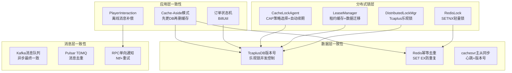

---

## 二、玩家数据双写一致性

### 2.1 设计原理

项目采用经典的 **Cache-Aside（旁路缓存）模式** 管理玩家数据的三级缓存（L1 本地 → L2 Redis → L3 TcaplusDB）。核心思想是：**读时填充缓存，写时先更DB再删缓存**。

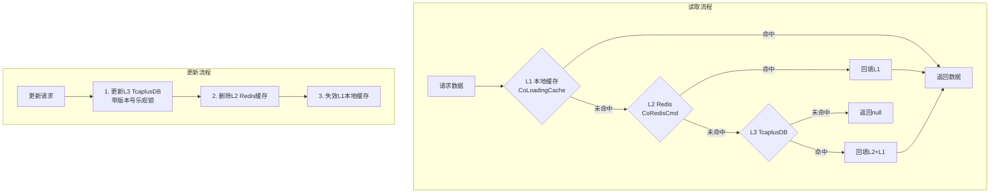

### 2.2 核心组件

#### 2.2.1 CoLoadingCache — 防击穿本地缓存

**文件位置**：[CoLoadingCache.java](/C:/UGit/letsgo_server/WeA/common/src/main/java/com/tencent/coLoadingCache/CoLoadingCache.java)

```java
public V get(K key) {
    V value = getFromCache(key);
    if (value != null) {
        return value;
    }
    // 有锁：使用 ReentrantRWLock 进行协程排队，防止缓存击穿
    if (builder != null) {
        ReentrantRWLock lock = ReentrantRWLock.newBuilder()
                .addLoadingCacheKey(builder.buildLockKey(key))
                .build();
        return lock.writeLockCall(() -> getFromCacheOrRemote(key));
    }
    return getFromCacheOrRemote(key);
}
```

**一致性保障要点**：
- **LRU + TTL 双淘汰**：容量满时 LRU 淘汰，超时后 TTL 自动过期
- **协程排队锁**：同一 key 的并发请求排队执行，只有第一个请求查 DB，后续复用结果
- **重入检测**：`loading` Set 检测递归加载，避免死锁

#### 2.2.2 SingleFlight — 防缓存击穿

**文件位置**：[SingleFlight.java](/C:/UGit/letsgo_server/WeA/common/src/main/java/com/tencent/cache/SingleFlight.java)

```java
// 核心思想：相同key的并发请求合并为一次DB查询
SingleData<V> curWg = waitMap.putIfAbsent(k, wg);
if (curWg == null) {
    // 第一个请求执行实际DB查询
    V v = supplier.get();
    wg.setVal(v);
    wg.executeSuccess();  // 唤醒所有等待者
    return v;
} else {
    // 后续请求等待第一个请求的结果
    return getResult(curWg);
}
```

SingleFlight 基于 `ConcurrentHashMap.putIfAbsent` 原子操作 + `SingleFlightAsync` 协程等待，确保大量并发请求仅触发一次 DB 读取。

#### 2.2.3 TcaplusDB 版本号乐观锁

**文件位置**：[TcaplusManager.java](/C:/UGit/letsgo_server/WeA/common/src/main/java/com/tencent/tcaplus/TcaplusManager.java)

```java
// 带版本号的更新操作
TcaplusManager.TcaplusRsp rsp = TcaplusUtil.newUpdateReq(builder)
    .setVersion(currentVersion)  // 当前持有的版本号
    .send();
// 如果版本号不匹配（被其他实例修改过），更新失败
// 返回 SVR_ERR_FAIL_INVALID_VERSION
```

**原理**：TcaplusDB 原生支持每条记录的版本号（version），每次成功写入自增。更新时携带当前版本号，DB 层原子比对，版本不匹配则拒绝写入，从而实现 **无锁并发控制**。

### 2.3 一致性风险与防护

| 风险 | 场景 | 现有防护 | 原理说明 |
|:-----|:-----|:---------|:---------|
| **脏读** | 更新DB后、删缓存前的短暂窗口 | TTL 过期兜底 | 缓存有生命周期，最终会过期刷新 |
| **缓存击穿** | 热点 key 过期后大量请求打到DB | SingleFlight + 协程排队锁 | 合并并发请求为单次 DB 查询 |
| **缓存穿透** | 查询不存在的数据 | 返回 null 不缓存 + 限流 | 避免恶意请求打穿 DB |
| **缓存雪崩** | 大量 key 同时过期 | TTL 随机化 + 熔断保护 | Redis `Break` 熔断器防止级联失败 |
| **并发写冲突** | 多实例同时更新同一玩家 | 版本号乐观锁 | TcaplusDB 原子 CAS 操作 |
| **丢失更新** | 读取→修改→写回间被覆盖 | 版本号 + 协程串行化 | 单玩家请求按 uid 哈希到固定协程队列 |

### 2.4 Redis 熔断保护

**文件位置**：[CoRedisCmd.java](/C:/UGit/letsgo_server/WeA/common/src/main/java/com/tencent/coRedis/CoRedisCmd.java)

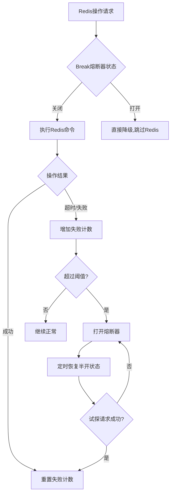

当 Redis 节点故障时，`Break` 熔断器自动跳过 Redis 层，请求直接打到 TcaplusDB，保障服务可用性。配合 `Throttle` 限流器控制 Redis 请求速率，防止 Redis 过载。

---

## 三、分布式锁体系与事务视角

### 3.1 三种分布式锁对比

项目实现了三种分布式锁，各有适用场景：

| 维度 | CacheLockAgent | DistributedLockMgr | RedisLock |
|:-----|:---------------|:-------------------|:----------|
| **存储后端** | TcaplusDB | TcaplusDB | Redis |
| **自动续期** | ✅ 定时器/业务触发 | ❌ | ❌ |
| **CAP策略** | ✅ 强一致/可用性可选 | ❌ 仅强一致 | ❌ |
| **锁抢占** | ✅ RPC通知释放 | ❌ 仅超时抢占 | ❌ |
| **版本号防ABA** | ✅ | ✅ | ❌ |
| **可重入** | ❌ | ❌ | ❌ |
| **适用场景** | 有状态缓存管理 | 跨服资源互斥 | 轻量级短期锁 |
| **复杂度** | 高 | 中 | 低 |
| **典型使用者** | cachesvr、ranksvr | clubsvr、ugcsvr | 登录锁、支付锁 |

### 3.2 CacheLockAgent — 最完善的分布式锁

**文件位置**：[CacheLockAgent.java](/C:/UGit/letsgo_server/WeA/common/src/main/java/com/tencent/cachelock/CacheLockAgent.java)

#### 3.2.1 设计原理

CacheLockAgent 是项目中功能最完善的分布式锁，设计思想是 **将分布式锁与业务缓存生命周期绑定**。核心设计：

1. **双过期时间**：`cacheLock_Cache_ValidTime`（本地缓存有效期）+ `cacheLock_DB_ValidTime`（DB锁有效期），本地缓存到期触发续锁，DB到期才真正释放锁
2. **CAP策略选择**：`capAvailability=false` 强一致（抢锁失败则操作失败）/ `capAvailability=true` 可用性优先（对端不可达也允许拿锁）
3. **锁抢占机制**：通过 RPC 通知持有者释放锁 + 业务数据回写

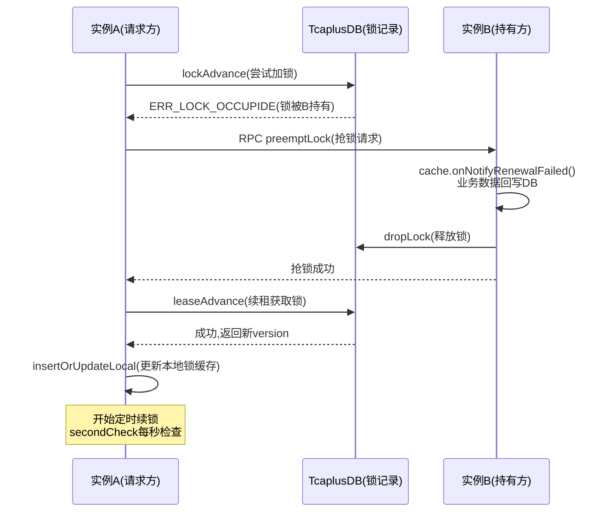

#### 3.2.2 续锁机制

```java
// 定时器每秒触发 secondCheck
private void secondCheck(CacheLockKey key) {
    LocalLock checkLocalLock = lockCache.get(key);
    
    // 1. 检查是否处于移除状态（需重试释放）
    if (checkLocalLock.isRemoving()) {
        callJobSerially(key.key, () -> tryReleaseRemovingLock(key));
        return;
    }
    
    // 2. 检查DB锁是否过期
    if (checkLocalLock.expireTime <= Framework.currentTimeMillis()) {
        callJobSerially(key.key, () -> checkReleaseExpireLock(key));
        return;
    }
    
    // 3. 本地缓存到期则续锁
    if (checkLocalLock.cacheExpireTime < Framework.currentTimeMillis() && enableTimerRenewal) {
        callJobSerially(key.key, () -> checkAndRenewal(key));
    }
}
```

**续锁容错设计**：
- **版本号冲突修复**：续锁时版本号不匹配，会重新查询 DB 确认是否仍是自己持有，如果是则修复本地版本号
- **业务缓存有效性检查**：续锁前通过 `doCheckCacheValid()` 确认业务层缓存是否还有效
- **重试移除机制**：释放锁失败时标记为 `isRemoving` 状态，定时器重试最多 3 次

#### 3.2.3 CAP策略选择

```java
private CacheLockErrorCode onPreemptLockFailed(CacheLockKey key, CacheLockErrorCode errorCode) {
    if (errorCode != CacheLockErrorCode.ERR_OK) {
        // 可用性优先策略：对端不在线也允许拿锁
        if (errorCode == CacheLockErrorCode.ERR_PREEMPT_LOCK_TARGET_NOT_ON_LINE && capAvailability) {
            return CacheLockErrorCode.ERR_OK;
        }
        // 强一致策略：抢锁失败则操作失败
        return errorCode;
    }
    return errorCode;
}
```

| 策略 | 行为 | 适用场景 |
|:-----|:-----|:---------|
| **强一致** (`capAvailability=false`) | 抢锁对端不在线 → 操作失败 | 支付、货币等资金敏感场景 |
| **可用性优先** (`capAvailability=true`) | 抢锁对端不在线 → 仍允许拿锁 | 社交数据、排行榜等容忍短暂不一致场景 |

### 3.3 LeaseManager — 租约缓存管理器

**文件位置**：[LeaseManager.java](/C:/UGit/letsgo_server/WeA/common/src/main/java/com/tencent/lease/LeaseManager.java)

#### 3.3.1 设计原理

LeaseManager 是基于 **租约（Lease）机制** 的有状态服务缓存管理器。每个数据对象由唯一一个服务实例"租用"，租约到期前定时续租，支持故障转移和数据迁移。

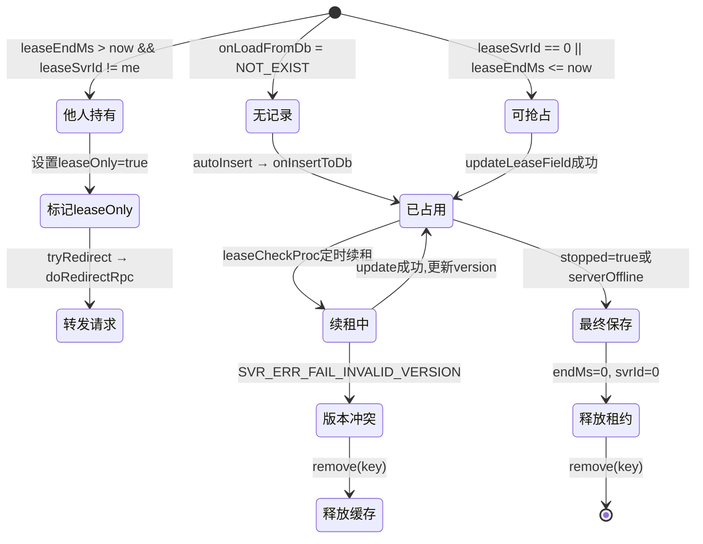

#### 3.3.2 四级队列驱动模型

```java
// 租约检查队列 — 判断是否需要续租或保存
protected ConcurrentLinkedQueue<LeaseJob<K>> leaseJobQueue;

// 保存队列 — 待执行的更新任务
protected ConcurrentLinkedDeque<LeaseJob<K>> updateJobQueue;

// 等待上次保存完成的队列 — 防止连续保存导致version错误
protected ConcurrentLinkedDeque<LeaseJob<K>> updatePendingQueue;

// 立即保存队列 — 重要数据变更时立即触发
protected ConcurrentLinkedQueue<K> immediateQueue;
```

**关键设计**：
- **updatingSet 防重入**：正在保存的 key 加入 `updatingSet`，新的保存任务进入 `pendingQueue` 等待
- **三种保存类型**：`LeaseJob_Update`（定期续租保存）、`LeaseJob_Immediate`（立即保存）、`LeaseJob_Final`（最终保存释放租约）
- **请求转发**：`tryRedirect()` 自动判断租约归属，不在本机则通过 RPC 转发到持有者执行

#### 3.3.3 使用场景

| 使用方 | 继承 LeaseManager | 数据对象 | 说明 |
|:------|:-----------------|:---------|:-----|
| **ainpcsvr** | `AiNpcManager` | `AiNpcCache` | AI NPC 数据的分布式有状态管理 |
| **cachesvr** | 间接使用 | `CacheInfo` | 分布式缓存的数据所有权管理 |

---

## 四、支付回调场景的一致性设计

### 4.1 支付全链路流程

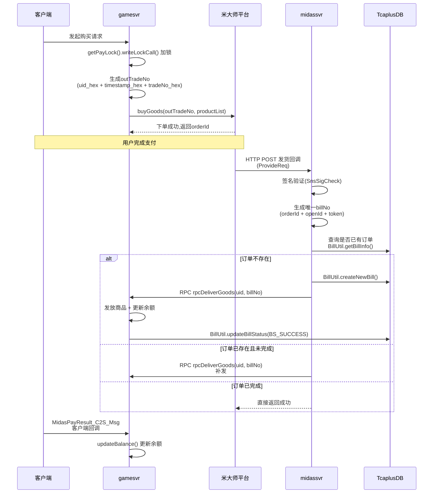

### 4.2 幂等性设计

#### 4.2.1 订单去重（BillUtil）

**文件位置**：[BillUtil.java](/C:/UGit/letsgo_server/WeA/common/src/main/java/com/tencent/wea/bill/BillUtil.java)

BillUtil 通过 **唯一订单号 + 状态机** 实现支付幂等性：

```java
// 唯一订单号生成
String billNo = getUniqueBillNo(orderId, openId, goodsToken);
// billNo = portalSerialNo + openId + token → 全局唯一

// 查询订单是否已存在
TcaplusDb.BillTable table = BillUtil.getBillInfo(uid, BillType.BT_DirectPurchase_VALUE, billNo, 1);
if (table == null) {
    // 首次收到：创建订单
    billKey = BillUtil.createNewBill(uid, type, billNo, info, false);
} else {
    // 已存在：检查状态
    if (table.getStatus() != BillStatus.BS_SUCCESS_VALUE) {
        // 未完成：允许重试发货
        billKey = new BillUtil.BillKey(table);
    }
    // 已完成：跳过（幂等返回）
}
```

**订单状态机**：

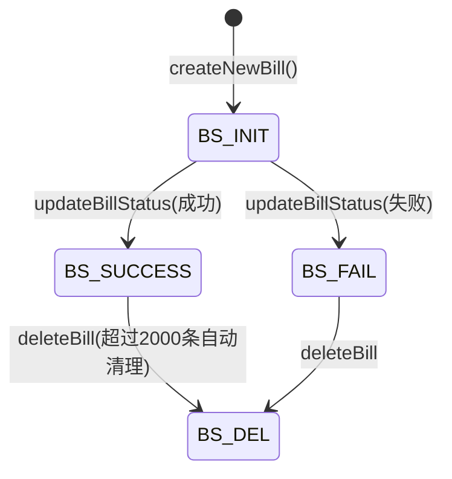

**关键设计**：
- **Seq自增管理**：每个用户的订单 seq 自增，超过 `STORAGE_NUM=2000` 时自动删除最早的订单
- **Insert原子性**：`TcaplusUtil.newInsertReq(bill)` 利用 TcaplusDB 的 INSERT 唯一性约束，防止并发创建重复订单
- **状态检查**：收到重复回调时，已完成的订单直接返回成功，未完成的允许重试

#### 4.2.2 充值流水幂等（Redis去重）

**文件位置**：[MidasChargePayFlowManager.java](/C:/UGit/letsgo_server/WeA/projects/midassvr/src/main/java/com/tencent/wea/midasservice/MidasChargePayFlowManager.java)

```java
// 基于Redis的幂等检查
private static boolean checkIdempotent(String key) {
    // 查询Redis中是否已处理过
    CacheResult<String> res = Cache.getCacheString(MidasChargeFlow.getKey(key));
    if (res.val != null && !res.val.isEmpty()) {
        return false;  // 已处理，拒绝重复
    }
    // 设置标记，8小时过期
    Cache.setCacheStringWithExpiry(MidasChargeFlow.getKey(key), "1", 3600 * 8);
    return true;
}
```

**去重key**：`xaProvideUin + "_" + portalSerialNo`（用户openid + 平台订单号），全局唯一。

#### 4.2.3 游戏币支付重试机制

**文件位置**：[PlayerMoneyMgr.java](/C:/UGit/letsgo_server/WeA/projects/gamesvr/src/main/java/com/tencent/wea/playerservice/money/PlayerMoneyMgr.java)

```java
// 游戏币支付失败自动重试
// 最多重试5次
if (retryInfo.retryCount >= 5) {
    iterator.remove();  // 超过上限，放弃
    Monitor.getInstance().add.fail(MonitorId.attr_midas_coin_pay_retry_num, 1);
    continue;
}
retryInfo.addRetryCount();
retryInfo.setLastRetryTimeMs(Framework.currentTimeMillis());
// 重新调用米大师coinPay
GoodsPayRes.Builder payRes = MidasManager.getInstance().coinPay(session, retryInfo.urlParams, retryInfo.isUgcBuy);
if (payRes.getRet() == 0) {
    // 支付成功，发放商品
    player.getBagManager().setMoneyNumWithSubReason(...);
    Monitor.getInstance().add.succ(MonitorId.attr_midas_coin_pay_retry_num, 1);
}
```

**重试策略**：
- **最大重试次数**：5次
- **重试判断**：`checkCoinPayNeedRetry()` 判断错误码是否值得重试（网络超时值得重试，参数错误不重试）
- **监控**：`attr_midas_coin_pay_retry_num` 监控重试成功/失败率

### 4.3 支付锁防并发

```java
// 支付操作加写锁，防止同一玩家并发支付
getPayLock(player.getOpenId()).writeLockCall(() -> {
    // 小游戏走特殊逻辑
    if (miniGamePayCheck(...)) return 0;
    // 关闭上一单未完成的订单
    if (isDirectBuy) closeLastBuyOrder();
    // 商品购买锁，防止重复购买同一商品
    if (needLock) {
        productInfoList.forEach(productInfo -> {
            if (!buyLock(productInfo.getProductId())) {
                NKErrorCode.MidasBuyLockFail.throwError(...);
            }
        });
    }
    // 生成交易号并下单
    String outTradeNo = Long.toHexString(uid) + "_" + Integer.toHexString(DateUtils.currUnixSec())
            + "_" + Integer.toHexString(getTradeNo());
    BuyGoodsRes.Builder buyResult = MidasManager.getInstance().buyGoods(...);
    ...
});
```

**多层锁保护**：
1. **OpenId写锁**：`getPayLock(openId).writeLockCall()` — 单玩家串行化支付
2. **商品购买锁**：`buyLock(productId)` — 防止重复购买同一商品
3. **交易号唯一**：`uid_hex + timestamp_hex + tradeNo_hex` — 全局唯一订单号

---

## 五、跨服务数据一致性

### 5.1 PlayerInteractionInvoker — 离线消息补偿

**文件位置**：[PlayerInteractionInvoker.java](/C:/UGit/letsgo_server/WeA/common/src/main/java/com/tencent/wea/interaction/player/PlayerInteractionInvoker.java)

PlayerInteraction 是项目中跨服务数据交互的核心机制，通过 **先持久化再在线通知** 的模式保证最终一致性。

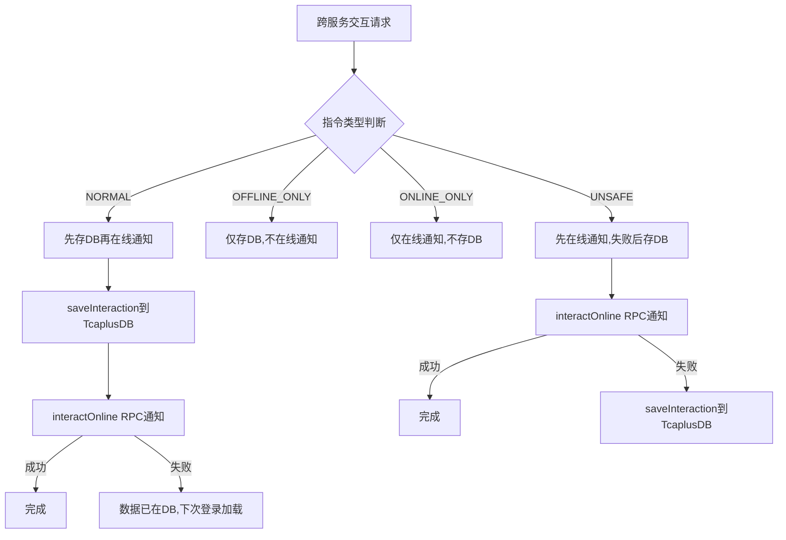

#### 5.1.1 四种指令安全等级

| 等级 | 类型 | 先存DB | 在线通知 | 适用场景 |
|:-----|:-----|:---:|:---:|:---------|
| **NORMAL** | 先存后发 | ✅ | ✅ | 支付发货、好友赠送等关键操作 |
| **OFFLINE_ONLY** | 仅离线 | ✅ | ❌ | 离线邮件、系统公告 |
| **ONLINE_ONLY** | 仅在线 | ❌ | ✅ | 实时聊天、状态同步 |
| **UNSAFE** | 先发后存 | 失败才存 | ✅ | 非关键通知（如充值流水推送） |

#### 5.1.2 跨区数据写入

```java
private static boolean saveInteraction(long interactionId, long dest, ...) {
    if (Framework.getInstance().getWorldId() != BaseGenerator.getWorldId(dest)) {
        // 跨区写入：通过RPC委托目标区的gamesvr写入
        SsGamesvr.RpcCrossDBReq.Builder rpcCrossDBReq = SsGamesvr.RpcCrossDBReq.newBuilder()
                .setCrossKey(dest)
                .setInteraction(req);
        GameService.get().rpcCrossDB(rpcCrossDBReq);
    } else {
        // 同区写入：直接写TcaplusDB
        TcaplusUtil.newInsertReq(req).send();
    }
}
```

### 5.2 cachesvr 主从同步

#### 5.2.1 架构设计

cachesvr 采用 **Master-Slave 主从架构**，Master 节点持有数据所有权，Slave 节点作为只读副本：

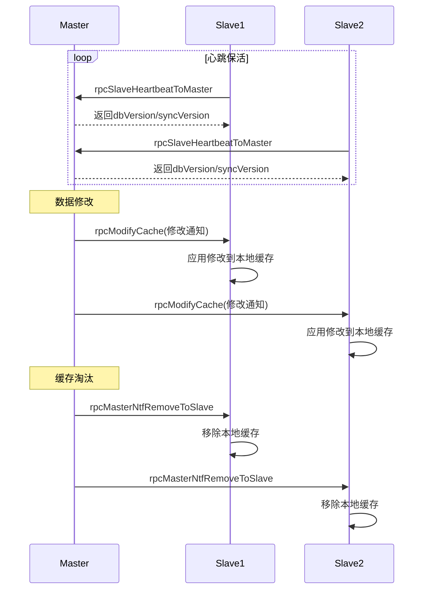

#### 5.2.2 一致性保障

| 机制 | 实现 | 说明 |
|:-----|:-----|:-----|
| **心跳检测** | `rpcSlaveHeartbeatToMaster` | 定时心跳，超时标记 Slave 离线 |
| **版本号同步** | `dbVersion` / `syncVersion` | 每次修改递增版本号 |
| **主动推送** | `masterNtfModifyToSlave` | Master 修改后立即推送 Slave |
| **故障检测** | `doCheckMasterValid` | 定期检查 Master 有效性 |
| **主节点重载** | `reloadMaster` | Master 故障后可重载 |
| **LRU-TTL 缓存** | `CacheMgr` | 容量 + 过期双淘汰策略 |

---

## 六、消息队列与最终一致性

### 6.1 Kafka/Pulsar 消息队列

**文件位置**：[Kafka.java](/C:/UGit/letsgo_server/WeA/common/src/main/java/com/tencent/mqueue/kafka/Kafka.java)、[Pulsar.java](/C:/UGit/letsgo_server/WeA/common/src/main/java/com/tencent/mqueue/pulsar/Pulsar.java)

项目使用 Kafka 和 Pulsar(TDMQ) 两套消息队列，在异步解耦场景实现最终一致性：

| 消息队列 | 使用场景 | 消费模式 | 一致性保障 |
|:---------|:---------|:---------|:---------|
| **Kafka** | UGC数据同步、玩家行为日志 | 共享模式（负载均衡）+ 独立模式（顺序消费） | 消费者组自动管理 |
| **Pulsar/TDMQ** | 跨服事件通知、排行榜更新 | 消息去重 `productUniqueForBytes` | 基于消息ID去重 |

### 6.2 两种消费模式

```java
// 共享模式：负载均衡，并发消费（适合无序场景）
public KafkaData productForShareMode(KTopic topic, String msg) {
    return producer.call(topic.getTopic(), 
        String.valueOf(ZQueueGenerator.getInstance().allocGuid()),  // 随机key，均匀分布
        msg);
}

// 独立模式：顺序消费（适合有序场景）
public KafkaData productForStandaloneMode(KKey key, String msg) {
    return producer.call(key.getTopic(), key.name(), msg);  // 固定key，同一partition
}
```

### 6.3 异步消费协程化

消费者使用 `KafkaAsync` 继承 `CoroutineAsync` 将消息处理纳入协程体系，避免阻塞主线程：

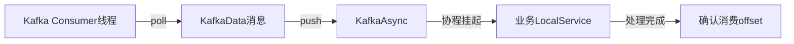

---

## 七、补偿机制实现

### 7.1 PlayerInteraction 离线补偿

当在线 RPC 通知失败时，数据已持久化到 `PlayerInteractionTable`，玩家下次登录时自动加载并处理：

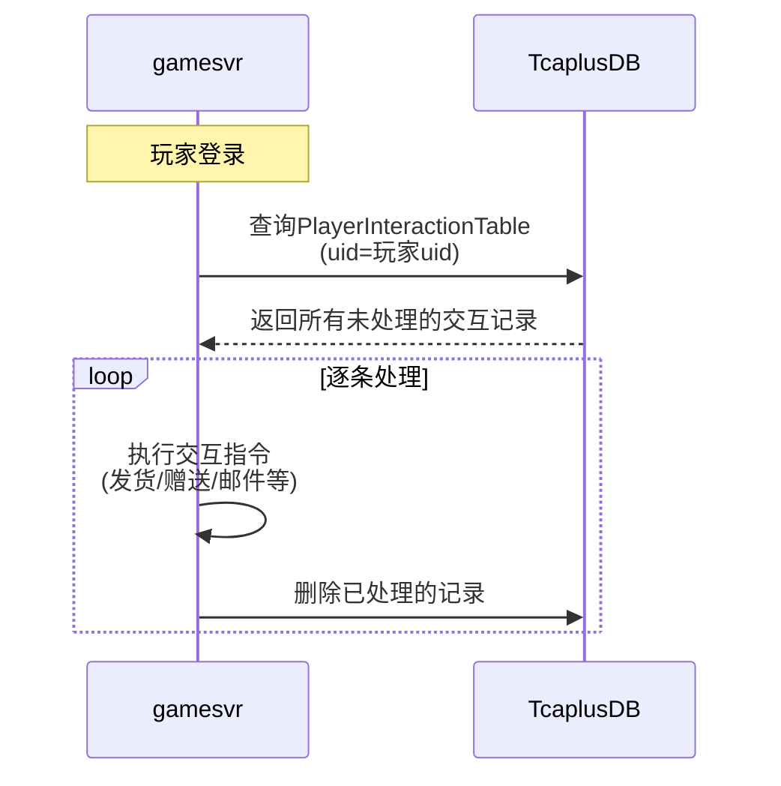

### 7.2 支付重试补偿

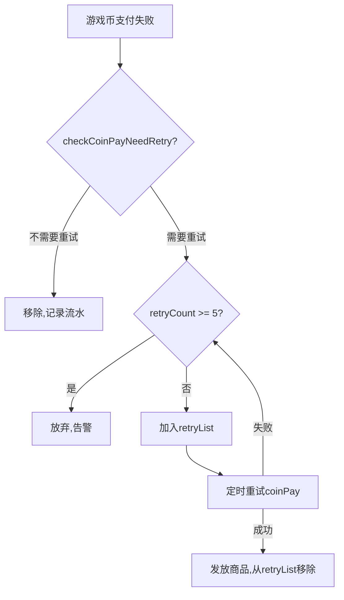

### 7.3 Tlog 流水日志

所有关键数据变更都通过 Tlog 记录流水日志（UDP 异步发送），用于事后对账：

```java
// 订单流水
TlogBillFlow.hire(publicFields)
    .setBillNo(billKey.billNo)
    .setType(billKey.type)
    .setSeq(billKey.seq)
    .setStatus(status)
    .setProductInfo(productInfo.toString())
    .logToTlogd();

// 支付操作流水
TlogFlowMgr.sendMidasBuyFlow(player, productId, MidasBuyOperate.MBO_PAY, ...);
```

---

## 八、版本号乐观锁的并发冲突处理策略

### 8.1 乐观锁使用模式

项目在多个层面使用 TcaplusDB 的版本号机制：

| 使用场景 | 冲突处理策略 | 代码位置 |
|:---------|:-----------|:---------|
| **CacheLockAgent续锁** | 重新查询DB确认持有者 → 修复version | `CacheLockAgent.renewal()` |
| **LeaseManager租约** | 版本冲突 → 直接释放缓存 | `LeaseManager.updateLeaseAsync()` |
| **DistributedLockMgr** | 最多重试3次 → 放弃 | `DistributedLockMgr.lock()` |
| **玩家数据更新** | 版本冲突 → 重新加载数据 | `TcaplusUtil.newUpdateReq().setVersion()` |

### 8.2 CacheLockAgent的版本冲突修复

```java
// 续锁版本号冲突时的特殊处理
if (dbRet.getVal1() == DistributeLockErrorCode.ERR_LOCK_DB_INVALID_VERSION) {
    // 先查询一次DB确认持有者
    Tuple<DistributeLockErrorCode, DistributeLockData> getRet = dbDriver.getLockData(lockInfo);
    if (getRet.getVal1() == DistributeLockErrorCode.ERR_LOCK_OK) {
        if (getRet.getVal2().getOwnerID() == serverId 
            && getRet.getVal2().getExpireTime() > Framework.currentTimeMillis()) {
            // 仍是自己持有 → 修复本地版本号（可能是连续两次续锁导致的版本跳变）
            locallock.version = getRet.getVal2().getVersion();
            return CacheLockErrorCode.ERR_OK;
        } else {
            // 已被他人持有 → 通知续锁失败
            return CacheLockErrorCode.ERR_RENEWAL_SELF_HAS_NO_LOCK;
        }
    }
}
```

---

## 九、对标业界分布式事务方案

### 9.1 对标分析

| 业界方案 | 本项目对应实践 | 适用场景 | 对比分析 |
|:---------|:-------------|:---------|:---------|
| **2PC/3PC** | 无 | 强一致跨库事务 | 项目使用TcaplusDB(NoSQL)，无跨表事务需求 |
| **TCC** | CacheLockAgent(Try-Lock + Confirm-Business + Cancel-Release) | 需要预留资源的场景 | 实质上是简化版TCC，但没有显式的Confirm/Cancel接口 |
| **Saga** | PlayerInteraction(先存后发 + 失败补偿) | 长事务最终一致性 | 类似Saga的补偿模式，玩家登录时执行补偿 |
| **本地消息表** | BillUtil(订单表) + Tlog(流水日志) | 可靠消息投递 | 订单先持久化再通知，类似本地消息表模式 |
| **消息队列最终一致** | Kafka/Pulsar异步通知 | 跨服务异步解耦 | 标准的消息驱动最终一致性 |
| **乐观锁** | TcaplusDB版本号 | 低冲突并发控制 | 原生支持，性能最优 |
| **分布式锁** | CacheLockAgent/DistributedLockMgr/RedisLock | 互斥资源访问 | 三种实现覆盖不同场景 |
| **租约机制** | LeaseManager | 有状态服务的数据所有权 | 类似etcd的Lease，但基于TcaplusDB实现 |

### 9.2 架构亮点

1. **多层防护体系**：版本号乐观锁（DB层）+ 分布式锁（服务层）+ 协程串行化（进程层）+ 业务锁（应用层）
2. **CAP策略可选**：CacheLockAgent 支持强一致和可用性两种策略，业务可按需选择
3. **离线补偿机制**：PlayerInteraction 的先持久化再通知模式，确保数据最终一致
4. **全链路流水**：Tlog + BillTable 双重记录，支持事后对账和问题追溯
5. **协程化全链路**：所有 IO 操作（DB/Redis/RPC）协程化，避免锁等待时阻塞线程

---

## 十、改进空间

### 10.1 缓存一致性增强

| 问题 | 现状 | 建议改进 |
|:-----|:-----|:---------|
| **短暂脏读窗口** | 依赖TTL过期 | 引入延迟双删：更新DB后延迟100ms再删一次缓存 |
| **缓存删除失败** | 无重试机制 | 引入缓存失效消息队列，异步可靠删除 |
| **L1→L2不一致** | 多实例各自L1独立 | 通过Redis Pub/Sub广播缓存失效通知 |
| **热点key问题** | 无特殊处理 | 热点key本地缓存延长TTL + 分片策略 |

### 10.2 分布式锁改进

| 问题 | 现状 | 建议改进 |
|:-----|:-----|:---------|
| **RedisLock非原子操作** | SETNX和EXPIRE分离 | 使用`SET key value EX seconds NX`原子命令 |
| **RedisLock释放不安全** | GET+DEL非原子 | 使用Lua脚本：`if redis.call('get',KEYS[1])==ARGV[1] then redis.call('del',KEYS[1])` |
| **RedisLock无自动续期** | 锁可能提前过期 | 添加watchdog线程定期续期 |
| **三种锁无统一抽象** | 各自独立使用 | 定义统一`DistributedLock`接口，工厂模式按场景选择 |

### 10.3 支付一致性增强

| 问题 | 现状 | 建议改进 |
|:-----|:-----|:---------|
| **幂等检查Redis过期** | 8小时后Redis key过期 | 关键订单同时写入TcaplusDB做永久去重 |
| **无定时对账** | 依赖米大师平台 | 增加服务端定时对账任务，比对订单状态 |
| **重试策略简单** | 固定5次重试 | 引入指数退避重试（1s→2s→4s→8s→16s） |
| **资损风险** | 无资损监控 | 添加资损告警：实时监控发货量与支付量差异 |

### 10.4 跨服务一致性增强

| 问题 | 现状 | 建议改进 |
|:-----|:-----|:---------|
| **UNSAFE指令可能丢失** | 在线失败才存DB，存DB也可能失败 | 改为先存后发模式，或增加异步重试队列 |
| **无分布式事务追踪** | 缺少跨服务链路ID | 在RPC/消息中添加traceId，贯穿全链路 |
| **消息队列无死信队列** | 消费失败无兜底 | Kafka添加死信Topic，失败消息进入人工处理流程 |
| **缺少Saga编排器** | 各服务自行补偿 | 引入轻量Saga编排器，统一管理补偿逻辑 |

### 10.5 监控与可观测性

| 问题 | 现状 | 建议改进 |
|:-----|:-----|:---------|
| **缓存命中率不可见** | 无统一指标 | 为CoLoadingCache/Redis添加hit/miss Prometheus指标 |
| **锁等待时间不可见** | 仅有成功/失败计数 | 添加锁等待延迟直方图（P50/P99/P999） |
| **版本冲突频率不可见** | 仅打日志 | 添加乐观锁冲突次数指标，告警阈值 |
| **数据一致性校验** | 无主动校验 | 定期抽样比对Redis与TcaplusDB数据一致性 |

---

## 十一、总结

| 维度 | 评价 | 亮点 |
|:-----|:-----|:-----|
| **缓存一致性** | ⭐⭐⭐⭐ | Cache-Aside + 版本号乐观锁 + 协程排队锁 + SingleFlight 四层防护 |
| **分布式锁** | ⭐⭐⭐⭐⭐ | CacheLockAgent 功能完善：CAP策略、自动续期、锁抢占、版本冲突修复 |
| **支付一致性** | ⭐⭐⭐⭐ | 订单状态机 + Redis幂等去重 + 多层锁保护 + 自动重试 |
| **跨服务一致性** | ⭐⭐⭐⭐ | PlayerInteraction 先持久化再通知 + 四种安全等级 + 跨区写入支持 |
| **租约机制** | ⭐⭐⭐⭐⭐ | LeaseManager 四级队列驱动 + 版本号保护 + 请求自动转发 |
| **消息一致性** | ⭐⭐⭐ | Kafka/Pulsar双队列 + 消息去重，但缺少死信队列和事务消息 |
| **补偿机制** | ⭐⭐⭐⭐ | 离线消息补偿 + 支付重试 + Tlog流水对账 |
| **可观测性** | ⭐⭐⭐ | 有监控指标和Tlog流水，但缺少缓存命中率和锁延迟监控 |
| **资损防控** | ⭐⭐⭐ | 有签名验证和幂等检查，但缺少主动对账和资损告警 |