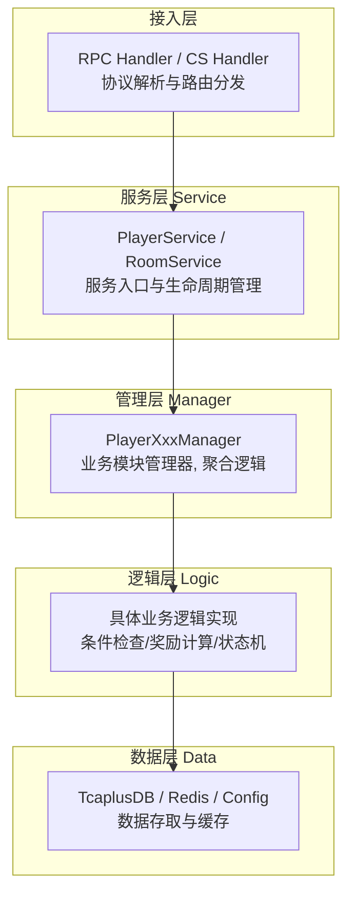
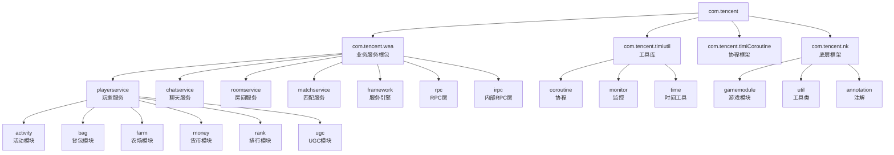
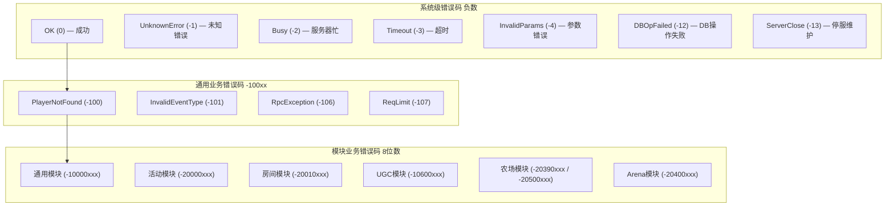
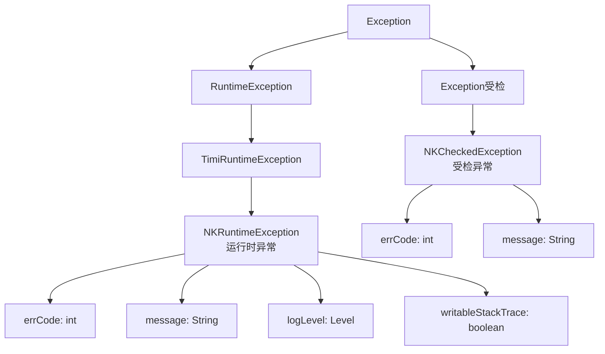
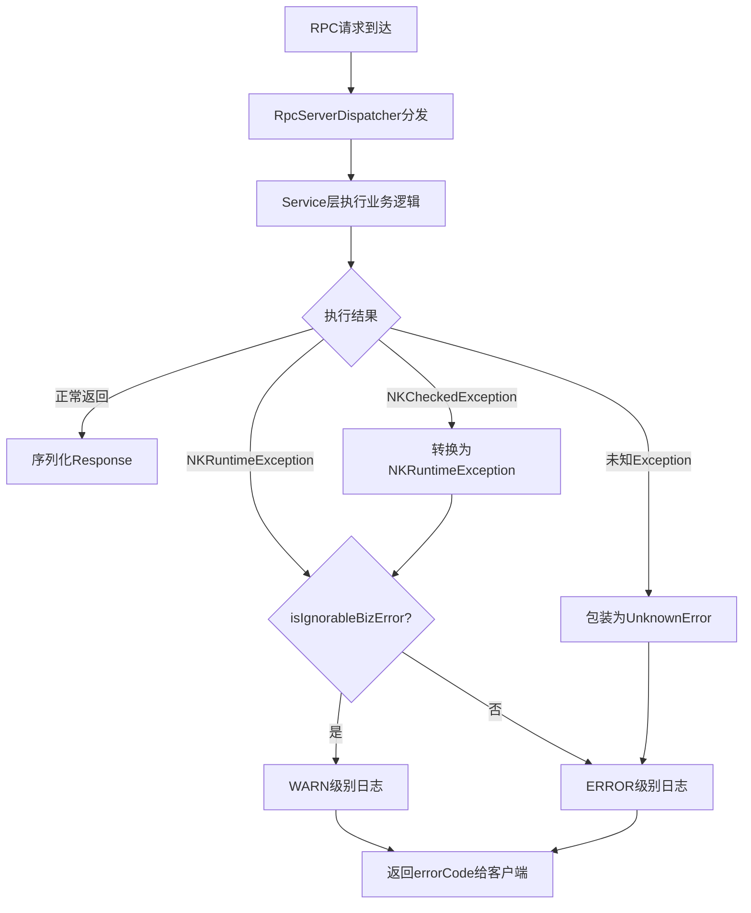
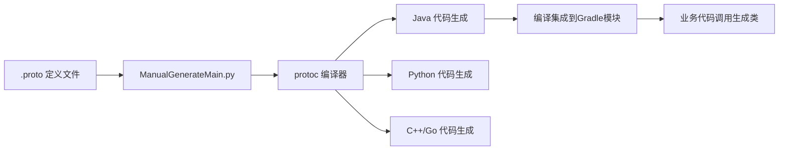
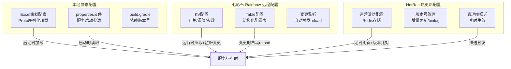
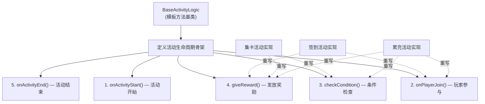
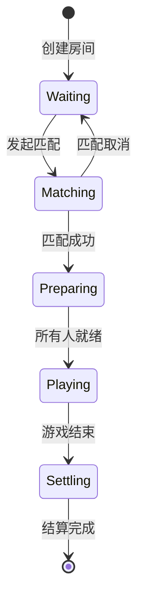
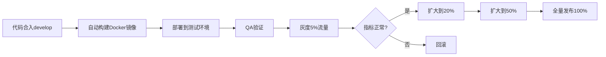

# 开发规范与编码标准

本文基于元梦之星项目（letsgo_server）60+ 微服务的源码分析，系统梳理项目在代码分层架构、命名约定、错误码体系、异常处理、RPC接口定义、日志规范、配置管理、设计模式应用等方面的工程规范与最佳实践。

---

## 一、代码分层架构规范

### 1.1 设计原理

项目采用 **五层分层架构**，遵循"高内聚低耦合"原则，每一层有明确的职责边界和调用约束。核心思想是：**上层调用下层，同层不互相调用，跨层不允许反向依赖**。



### 1.2 各层职责与规范

| 层级 | 典型类命名 | 职责 | 调用约束 |
|:-----|:---------|:-----|:---------|
| **接入层 (RPC)** | `PlayerServerServiceImpl`、`CsHandler` | 协议解析、参数校验、路由分发 | 仅调用 Service 层 |
| **服务层 (Service)** | `PlayerService`、`RoomService` | 服务入口、生命周期管理、模块编排 | 调用 Manager 层 |
| **管理层 (Manager)** | `PlayerBagManager`、`PlayerActivityManager` | 业务模块管理器、聚合多个逻辑单元 | 调用 Logic 层和 Data 层 |
| **逻辑层 (Logic)** | `TaskFactory`、`ConditionChecker` | 具体业务规则实现、条件判断 | 调用 Data 层 |
| **数据层 (Data)** | `TcaplusUtil`、`Cache`、`ResLoader` | DB读写、缓存操作、配置加载 | 不调用上层 |

### 1.3 典型分层代码示例

以 gamesvr 中的玩家服务为例：

**接入层** — `PlayerServerServiceImpl`（RPC入口）

```java
// 文件：WeA/projects/gamesvr/src/main/java/com/tencent/wea/irpc/service/PlayerServerServiceImpl.java
// 职责：RPC请求的入口，负责协议解析和路由到Service层
public class PlayerServerServiceImpl {
    // RPC方法直接委托给Service层
    public void rpcDeliverGoods(long uid, String billNo) {
        playerService.deliverGoods(uid, billNo);
    }
}
```

**服务层** — `PlayerService`（服务编排）

```java
// 文件：WeA/projects/gamesvr/src/main/java/com/tencent/wea/playerservice/PlayerService.java
// 职责：管理Player生命周期，编排各Manager的调用顺序
public class PlayerService {
    private static final Logger LOGGER = LogManager.getLogger(PlayerService.class);
    // 登录时按序初始化各Manager
    // 登出时按序回收各Manager
}
```

**管理层** — `PlayerBagManager`（业务聚合）

```java
// 职责：管理玩家背包数据，聚合物品的增删改查逻辑
public class PlayerBagManager {
    // 聚合物品操作、货币操作、装备操作等多个逻辑单元
    public void addItem(int itemId, int count, String reason) { ... }
    public void removeItem(int itemId, int count, String reason) { ... }
}
```

**数据层** — `TcaplusUtil`（数据存取）

```java
// 文件：WeA/common/src/main/java/com/tencent/tcaplus/TcaplusUtil.java
// 职责：封装TcaplusDB的CRUD操作，提供版本号乐观锁支持
TcaplusUtil.newInsertReq(builder).send();
TcaplusUtil.newUpdateReq(builder).setVersion(currentVersion).send();
```

### 1.4 分层原则总结

| 原则 | 说明 | 违反后果 |
|:-----|:-----|:---------|
| **单向依赖** | 上层只调用下层，不允许反向 | 循环依赖导致编译失败 |
| **同层不互调** | Manager之间不直接调用 | 通过Service层或事件机制解耦 |
| **数据层无业务** | Data层不含业务判断逻辑 | 保持数据操作的纯粹性 |
| **接入层薄封装** | RPC层只做参数校验和转发 | 避免接入层膨胀 |
| **Manager独立** | 每个Manager管理一个业务域 | 可独立测试、替换 |

---

## 二、包结构与命名规范

### 2.1 设计原理

项目采用 **按功能模块划分包结构** 的策略，包路径体现服务归属和功能定位。统一以 `com.tencent` 为根包，按组织层级逐层细化。

### 2.2 包结构总览



### 2.3 命名规范详细说明

#### 2.3.1 包命名规范

| 层级 | 命名规范 | 示例 |
|:-----|:---------|:-----|
| **服务根包** | `com.tencent.wea.{服务名}service` | `com.tencent.wea.playerservice` |
| **功能子包** | `com.tencent.wea.playerservice.{模块名}` | `com.tencent.wea.playerservice.farm` |
| **公共组件** | `com.tencent.{组件名}` | `com.tencent.cache`, `com.tencent.rpc` |
| **工具类** | `com.tencent.timiutil.{功能}` | `com.tencent.timiutil.coroutine` |
| **协议定义** | `com.tencent.wea.protocol` | 自动生成的Proto类 |

#### 2.3.2 类命名规范

| 类别 | 命名模式 | 示例 | 说明 |
|:-----|:---------|:-----|:-----|
| **服务引擎** | `XxxEngine` | `GSEngine`, `SceneEngine` | 服务启动入口类 |
| **服务类** | `XxxService` | `PlayerService`, `MatchService` | 服务层入口 |
| **管理器** | `XxxManager`/`XxxMgr` | `PlayerBagManager`, `RoomMgr` | 业务聚合管理器 |
| **工厂类** | `XxxFactory` | `TaskFactory`, `SceneFactory` | 工厂模式创建对象 |
| **工具类** | `XxxUtil`/`XxxUtils` | `TcaplusUtil`, `DateUtils` | 无状态的静态方法 |
| **配置类** | `XxxConfig` | `GSConfig`, `HotResConfig` | 配置加载与管理 |
| **常量类** | `XxxConsts` | `PlayerConsts` | 常量定义 |
| **RPC实现** | `XxxServiceImpl` | `PlayerServerServiceImpl` | RPC接口实现 |

#### 2.3.3 方法与变量命名规范

| 类别 | 规则 | 正例 | 反例 |
|:-----|:-----|:-----|:-----|
| **类名** | 大驼峰 (PascalCase) | `PlayerService` | `playerService` |
| **方法名** | 小驼峰 (camelCase) | `getPlayerActivity` | `GetPlayerActivity` |
| **常量** | 全大写+下划线 | `MAX_PLAYERS`, `LOGGER` | `maxPlayers` |
| **变量** | 小驼峰 | `playerCount` | `player_count` |
| **Logger** | 固定命名 | `private static final Logger LOGGER` | `private Logger log` |
| **Proto字段** | 小写+下划线 | `player_id`, `item_count` | `playerId` |

```java
// 标准的类结构模板
public class PlayerXxxManager {
    private static final Logger LOGGER = LogManager.getLogger(PlayerXxxManager.class);
    
    // 常量定义
    private static final int MAX_RETRY_COUNT = 3;
    
    // 成员变量
    private final Map<Integer, XxxData> dataMap = new ConcurrentHashMap<>();
    
    // 公有方法（业务接口）
    public void doSomething(long uid, int param) { ... }
    
    // 私有方法（内部实现）
    private void handleInternal(long uid) { ... }
}
```

---

## 三、错误码体系设计

### 3.1 设计原理

项目设计了一套 **基于模块ID的结构化错误码体系**，通过 `NKErrorCode` 类统一管理所有错误码。核心设计思想是：**每个错误码自带模块归属信息，支持自动异常抛出、忽略标记和责任人追溯**。

错误码格式规范：
- **负数错误码 (<0)**：表示内部错误
- **0**：表示成功（OK）
- **8位数格式 (ModuleId-XXXX)**：前4位是模块ID（参考 `GameModuleId`），后4位是具体错误码
- **范围 10010001 ~ 19990999**：业务逻辑错误

### 3.2 错误码分层结构



### 3.3 核心组件

**文件位置**：[NKErrorCode.java](/C:/UGit/letsgo_server/WeA/common/src/main/java/com/tencent/nk/util/NKErrorCode.java)

`NKErrorCode` 继承自 `TimiEnum`，是一个**不可变的错误码枚举类**，支持以下核心能力：

| 能力 | 方法 | 说明 |
|:-----|:-----|:-----|
| **异常抛出** | `throwError(message)` | 抛出 `NKRuntimeException` |
| **条件抛出** | `throwErrorIfNotOk(message)` | 非OK时抛异常 |
| **无堆栈抛出** | `throwErrorNoStack()` | 高性能场景，不写堆栈 |
| **智能抛出** | `throwErrorSmart()` | Debug模式写堆栈，生产不写 |
| **条件判断** | `throwIf(boolean, message)` | 条件为true时抛异常 |
| **忽略标记** | `@Ignored` 注解 | 标记为可忽略的业务错误 |
| **责任人追溯** | `@Author` 注解 | 标记错误码的负责开发者 |
| **错误码查找** | `forNumber(int)` | 根据数值查找错误码对象 |

```java
// 错误码定义示例
public static final NKErrorCode OK = new NKErrorCode(0);
public static final NKErrorCode InvalidParams = new NKErrorCode(-4);    // 请求参数错误

@Ignored  // 标记为可忽略的业务错误，不会触发ERROR级别告警
public static final NKErrorCode FeatureShield = new NKErrorCode(-29);   // 功能屏蔽中

// 模块化错误码（8位数，前4位模块ID）
public static final NKErrorCode UgcMapNotExist = new NKErrorCode(-10600001);  // UGC模块
public static final NKErrorCode FarmPlantError = new NKErrorCode(-20390001);  // 农场模块
```

### 3.4 错误码使用规范

```java
// ✅ 推荐：使用具体错误码 + 上下文信息
NKErrorCode.InvalidParams.throwError("uid={}, itemId={} not found", uid, itemId);

// ✅ 推荐：条件判断式抛出
NKErrorCode.InvalidParams.throwIf(itemId <= 0, "invalid itemId={}", itemId);

// ✅ 推荐：高频路径使用无堆栈模式
NKErrorCode.FeatureLocked.throwErrorNoStack();

// ✅ 推荐：智能模式（Debug有堆栈，生产无堆栈）
NKErrorCode.DBOpFailed.throwErrorSmart("update player {} failed", uid);

// ❌ 避免：使用UnknownError替代具体错误码
NKErrorCode.UnknownError.throwError("something wrong");  // 应使用具体错误码
```

### 3.5 错误码性能优化

项目对错误码的异常抛出进行了**性能优化**设计：

| 方案 | 场景 | 原理 |
|:-----|:-----|:-----|
| **throwErrorNoStack()** | 高频业务错误 | 创建异常时不写入堆栈，避免 `fillInStackTrace` 的开销 |
| **throwErrorSmart()** | 兼顾调试与性能 | 仅在 `LOGGER.isDebugEnabled()` 时写堆栈 |
| **@Ignored + isIgnorableBizError()** | 日志降级 | 被标记的错误码打 WARN 而非 ERROR，减少告警噪音 |
| **initIgnoreBizError() 缓存** | 启动时初始化 | 反射扫描一次 `@Ignored` 注解并缓存结果，避免运行时反射 |

---

## 四、异常处理规范

### 4.1 设计原理

项目建立了 **双轨异常体系**：`NKRuntimeException`（运行时异常/非受检异常）和 `NKCheckedException`（受检异常），两者都携带 `NKErrorCode` 错误码。核心设计思想是：**所有异常必须携带结构化错误码，框架层统一拦截和处理**。



### 4.2 异常类型与使用场景

| 异常类型 | 使用场景 | 是否需要catch | 典型触发方式 |
|:---------|:---------|:---:|:---------|
| **NKRuntimeException** | 业务逻辑错误（参数校验、状态不合法） | 否 | `errorCode.throwError()` |
| **NKCheckedException** | 需要调用方显式处理的IO/RPC异常 | 是 | `throw new NKCheckedException(code)` |
| **PlayerNotFoundException** | 特殊：玩家不存在（触发自动转发） | 否 | Service层自动转换 |

### 4.3 框架层异常拦截

RPC框架层对异常进行统一拦截和处理：



**关键代码**：

```java
// LocalService层的异常拦截
try {
    result = method.invoke(implObj, args);
} catch (NKCheckedException e) {
    if (e.getCause() instanceof TimeoutException) {
        LOGGER.error("LocalService callJob timeout, method: {}.{}", 
            method.getDeclaringClass().getSimpleName(), method.getName());
    }
    throw e;
} catch (NKRuntimeException e) {
    throw e;  // 直接透传，保留原始错误码
} catch (Exception e) {
    throw new NKCheckedException(NKErrorCode.UnknownError, e);  // 未知异常统一包装
}
```

### 4.4 异常处理最佳实践

```java
// ✅ 推荐：明确的错误码 + 上下文信息
try {
    int res = logicOperation.execute(actData);
} catch (Exception e) {
    LOGGER.error("handlePlayerActivity! uid[{}] e: ", uid, e);
    return NKErrorCode.PlayerActivityLoad.getValue();
}

// ✅ 推荐：RPC调用结果检查
RpcResult result = someRpcCall();
result.throwError("rpc call failed, uid={}", uid);  // 非OK时自动抛出NKRuntimeException

// ✅ 推荐：DB操作结果检查
ObjectResult dbResult = TcaplusUtil.newUpdateReq(builder).send();
dbResult.throwError("update player data failed");

// ❌ 避免：吞掉异常不处理
try {
    doSomething();
} catch (Exception e) {
    // 什么都不做 — 严禁！
}

// ❌ 避免：catch后抛出新异常丢失原因链
try {
    doSomething();
} catch (Exception e) {
    throw new RuntimeException("failed");  // 丢失了原始异常e
}
```

---

## 五、RPC接口定义规范

### 5.1 设计原理

项目通过 Protocol Buffers 定义所有 RPC 接口和通信协议，采用 **三类 Proto 文件** 分治不同场景：配置Proto、数据库Proto、通信协议Proto。核心思想是：**协议即接口契约，生成代码保证类型安全**。

### 5.2 Proto文件分类与目录

| 类型 | 目录 | 命名约定 | 用途 |
|:-----|:-----|:---------|:-----|
| **配置Proto** | `WeA/common/common/excel/proto/` | `Res{模块}Config.proto` | 策划配表的Protobuf定义 |
| **数据库Proto** | `WeA/common/common/protos/db_proto/proto/` | `{实体名}_data.proto` | TcaplusDB表结构定义 |
| **通信协议Proto** | `WeA/common/common/protos/cs_proto/proto/` | `{模块名}_protocol.proto` | CS/SS 通信消息定义 |

### 5.3 Proto编写规范

#### 5.3.1 文件与命名规范

| 元素 | 命名规则 | 示例 |
|:-----|:---------|:-----|
| **文件名** | 小写字母 + 下划线 | `farm_protocol.proto` |
| **Message名** | 大驼峰 | `PlayerLoginReq`, `FarmPlantData` |
| **字段名** | 小写 + 下划线 | `player_id`, `item_count` |
| **Enum名** | 大驼峰 | `ItemType`, `RoomState` |
| **Enum值** | 全大写 + 前缀 | `ITEM_TYPE_NONE = 0` |
| **字段编号** | 从1开始递增 | `int64 uid = 1;` |

#### 5.3.2 消息定义规范

```protobuf
// ✅ 标准CS协议消息定义
syntax = "proto3";
package com.tencent.wea.protocol;

// 客户端→服务端请求
message FarmPlant_C2S_Msg {
    int32 plot_id = 1;       // 地块ID
    int32 seed_id = 2;       // 种子ID
}

// 服务端→客户端响应
message FarmPlant_S2C_Msg {
    int32 ret = 1;           // 返回码
    int32 plot_id = 2;       // 地块ID
    int64 harvest_time = 3;  // 收获时间
}

// 枚举类型规范：首项设为0作为默认值
enum FarmPlotState {
    FARM_PLOT_STATE_NONE = 0;
    FARM_PLOT_STATE_EMPTY = 1;
    FARM_PLOT_STATE_PLANTED = 2;
    FARM_PLOT_STATE_HARVESTABLE = 3;
}
```

#### 5.3.3 服务间RPC消息规范

```protobuf
// SS（服务间）RPC消息命名规范：Rpc{操作}{Req/Rsp}
message RpcMatchReq {
    int64 room_id = 1;
    int64 leader_id = 2;
    int32 match_type = 3;
    MatchRuleInfo match_rule_info = 4;
}

message RpcMatchRsp {
    int32 ret = 1;
    int64 match_id = 2;
}
```

### 5.4 代码生成与使用流程



**关键步骤**：
1. 在对应 proto 目录新增/修改 `.proto` 文件
2. 执行 `ManualGenerateMain.py all --isolation` 生成代码
3. 生成的Java类自动集成到 `protocol` 模块
4. 业务代码通过 Builder 模式构建消息对象


```java
// Proto生成的Builder模式使用
SsGamesvr.RpcCrossDBReq.Builder rpcCrossDBReq = SsGamesvr.RpcCrossDBReq.newBuilder()
        .setCrossKey(dest)
        .setInteraction(req);
GameService.get().rpcCrossDB(rpcCrossDBReq);
```

---

## 六、日志编写规范

### 6.1 设计原理

项目使用 **Log4j2** 作为日志框架，采用 **50+ 文件分类** 的日志体系，将不同模块的日志写入独立文件，便于故障排查和性能分析。核心设计思想是：**结构化日志 + 模块隔离 + 级别管控**。

### 6.2 Logger声明规范

```java
// ✅ 统一声明方式：private static final + LOGGER命名
private static final Logger LOGGER = LogManager.getLogger(PlayerService.class);

// ❌ 禁止的声明方式
private Logger log = LogManager.getLogger(this.getClass());  // 非static
protected static Logger logger;  // 非final，命名不规范
```

### 6.3 日志级别使用规范

| 级别 | 使用场景 | 示例 |
|:-----|:---------|:-----|
| **ERROR** | 需要人工介入的严重错误 | DB写入失败、RPC超时、数据不一致 |
| **WARN** | 可自动恢复的异常情况 | 可忽略的业务错误(`@Ignored`)、重试成功 |
| **INFO** | 关键业务流程节点 | 玩家登录/登出、支付完成、配置加载 |
| **DEBUG** | 调试信息（生产默认关闭） | 详细参数、中间状态、算法过程 |

### 6.4 日志内容规范

```java
// ✅ 推荐：包含关键业务参数和上下文
LOGGER.error("handlePlayerActivity! uid[{}] actId[{}] e: ", uid, actId, e);

// ✅ 推荐：使用占位符而非字符串拼接（性能更好）
LOGGER.info("player login success, uid={}, openId={}, zone={}", uid, openId, zoneId);

// ✅ 推荐：异常对象放在最后一个参数（Log4j2自动打印堆栈）
LOGGER.error("rpc call failed, target={}", targetSvr, exception);

// ❌ 避免：字符串拼接（即使日志级别被禁用也会执行拼接）
LOGGER.debug("player data: " + player.toString());

// ❌ 避免：缺少关键参数
LOGGER.error("operation failed");  // 缺少uid等定位信息
```

### 6.5 日志分文件策略

项目采用按模块分文件的日志策略，将不同业务模块的日志写入独立文件：

| 日志类别 | 文件 | 内容 |
|:---------|:-----|:-----|
| **应用主日志** | `app.log` | 通用业务日志 |
| **RPC调用日志** | `rpc.log` | 所有RPC请求/响应 |
| **DB操作日志** | `tcaplus.log` | TcaplusDB读写操作 |
| **Redis操作日志** | `redis.log` | Redis命令执行 |
| **支付流水日志** | `midas.log` | 米大师支付相关 |
| **Tlog流水日志** | `tlog.log` | 数据上报流水 |
| **监控告警日志** | `wechat.log` | 企业微信告警推送 |
| **协程调度日志** | `coroutine.log` | 协程调度与执行 |

### 6.6 日志与@Ignored协同

```java
// 框架层根据@Ignored注解自动降级日志级别
try {
    NKErrorCode.RoomClientVersionMemberForceUpdate.throwError("");
} catch (NKRuntimeException e) {
    if (e.isIgnorableBizError()) {
        // @Ignored标记的错误码 → WARN级别，不触发告警
        LOGGER.warn("business error (ignorable): ", e);
    } else {
        // 非Ignored错误码 → ERROR级别，触发告警
        LOGGER.error("business error: ", e);
    }
}
```

---

## 七、配置管理规范

### 7.1 设计原理

项目采用 **三级配置管理** 策略：本地静态配置、七彩石(Rainbow)远程配置、HotRes热更新配置。不同类型的配置有不同的更新时机和适用场景，核心设计思想是：**按变更频率和影响范围选择配置管理方式**。

### 7.2 三级配置体系



### 7.3 各配置方式详细说明

#### 7.3.1 本地静态配置（Excel → Proto）

**适用场景**：策划配表（数值、文案、关卡配置等），变更需发版

```
目录：WeA/common/common/excel/proto/
命名：Res{模块名}Config.proto（如 ResFarmSeasonRankTitleConfig.proto）
加载：ResLoader.load() 在服务启动时一次性加载
更新：修改Excel → 导出Proto → 重新编译发版
```

#### 7.3.2 七彩石(Rainbow)远程配置

**适用场景**：运行时开关、阈值参数、功能灰度，变更不需发版

**文件位置**：[RainbowConfig.java](/C:/UGit/letsgo_server/WeA/common/src/main/java/com/tencent/rainbow/config/RainbowConfig.java)

```java
// 七彩石配置变更自动触发reload
class NKTableGroupListenCallback implements ListenCallback<RainbowChangeInfo> {
    @Override
    public void callback(RainbowChangeInfo change) {
        // 1. 上报配置版本
        RainbowConfigLoader.reportRainbowGroupVersion(change.getEnvName(), change.getGroup(), false);
        
        // 2. 触发服务reload
        if (Framework.getInstance().isRunning()) {
            Framework.getInstance().doCmd("reload", 
                String.format("rainbow,%s", currVersion));
        } else {
            // 服务未启动完成，标记启动后reload
            Framework.getInstance().setNeedReloadAfterInitDone(true);
        }
    }
}
```

#### 7.3.3 HotRes热更新配置

**适用场景**：运营活动配置、商城商品、推荐策略等高频变更配置

**文件位置**：[HotResTable.java](/C:/UGit/letsgo_server/WeA/common/src/main/java/com/tencent/hotresourceloader/HotResTable.java)

```java
// HotRes配置基类，通过Redis存储+版本号管理实现热更新
public abstract class HotResTable<Key, Proto, Config> {
    // 定时刷新间隔（默认30秒）
    protected int refreshSecond() { return 30; }
    
    // 配置名定义（全局唯一标识）
    public abstract String getHotResName();
    
    // 配置加载后的回调
    protected abstract void onHotResLoad();
    
    // 配置增量更新的回调
    protected abstract void onHotResReplace(List<Config> list);
    protected abstract void onHotResDelete(List<Config> list);
}
```

### 7.4 配置选择决策表

| 场景 | 推荐方式 | 理由 |
|:-----|:---------|:-----|
| 策划数值配表 | Excel → Proto本地 | 变更需测试验证，发版更安全 |
| 功能开关/灰度 | 七彩石KV | 运行时即时生效，支持环境隔离 |
| 限流阈值/超时参数 | 七彩石KV | 紧急调整不需发版 |
| 运营活动配置 | HotRes | 高频变更，管理端可视化编辑 |
| 商城商品/推荐 | HotRes | 运营自主管理，增量更新 |
| 服务启动参数 | properties本地 | 启动时一次性读取 |
| 依赖版本号 | gradle.properties | 构建时确定 |

---

## 八、设计模式应用指南

### 8.1 设计原理

项目在业务实现中广泛应用了 **工厂模式、模板方法、策略模式、状态机、单例、观察者** 等经典设计模式。核心设计思想是：**用模式解决重复问题，用抽象管理变化**。

### 8.2 核心设计模式应用

#### 8.2.1 工厂模式 — TaskFactory

**文件位置**：`WeA/projects/gamesvr/src/main/java/com/tencent/wea/playerservice/task/TaskFactory.java`

```java
// 通过HashMap注册所有Task类型，运行时根据ID创建实例
private static final HashMap<Integer, Class<? extends BaseTask>> TASK_HASH_MAP = new HashMap<>();

// 静态注册
static {
    TASK_HASH_MAP.put(TaskType.DAILY_LOGIN, DailyLoginTask.class);
    TASK_HASH_MAP.put(TaskType.BATTLE_WIN, BattleWinTask.class);
    // ...
}

// 运行时创建
public static BaseTask createTask(int taskType) {
    Class<? extends BaseTask> clazz = TASK_HASH_MAP.get(taskType);
    return clazz.getDeclaredConstructor().newInstance();
}
```

**应用价值**：60+ 任务类型通过工厂统一创建，新增任务类型只需注册一行代码。

#### 8.2.2 模板方法模式 — 活动生命周期

活动系统通过模板方法定义活动的标准生命周期，60+ 活动类型继承并重写特定步骤：



#### 8.2.3 策略模式 — 匹配算法

matchsvr 中不同匹配模式采用策略模式实现不同的匹配算法：

| 策略 | 实现类 | 适用场景 |
|:-----|:------|:---------|
| **MMR匹配** | `MmrMatchStrategy` | 排位赛（技术水平匹配） |
| **快速匹配** | `QuickMatchStrategy` | 休闲模式（优先速度） |
| **段位匹配** | `TierMatchStrategy` | 段位赛（段位区间匹配） |

#### 8.2.4 状态机模式 — 房间/场景

房间和场景通过状态机管理生命周期，防止非法状态转换：



#### 8.2.5 单例模式 — 管理器

项目中大量使用单例模式管理全局状态：

```java
// 典型单例 — 饿汉式
public class Framework {
    private static final Framework INSTANCE = new Framework();
    public static Framework getInstance() { return INSTANCE; }
}

// Monitor监控单例
public class Monitor {
    private static volatile Monitor instance;
    public static Monitor getInstance() { return instance; }
}
```

#### 8.2.6 观察者模式 — 事件系统

项目通过事件系统实现模块间解耦：

```java
// 事件发布
EventManager.fire(EventType.PLAYER_LOGIN, new PlayerLoginEvent(uid));

// 事件订阅（各Manager独立订阅感兴趣的事件）
@Subscribe
public void onPlayerLogin(PlayerLoginEvent event) {
    // 活动Manager处理登录事件
    checkDailyLoginReward(event.getUid());
}
```

### 8.3 设计模式选择指南

| 场景 | 推荐模式 | 项目中的实例 |
|:-----|:---------|:-----------|
| 多种类型的创建 | **工厂模式** | TaskFactory、SceneFactory |
| 相似流程不同细节 | **模板方法** | 活动生命周期、玩家模块初始化 |
| 可替换的算法 | **策略模式** | 匹配算法、路由策略 |
| 有限状态转换 | **状态机** | 房间状态、场景状态、订单状态 |
| 全局唯一实例 | **单例模式** | Framework、Monitor、各种Manager |
| 模块间解耦通知 | **观察者/事件** | 事件系统、配置变更监听 |

---

## 九、Git分支管理策略

### 9.1 设计原理

项目采用 **主干开发 + 功能分支 + 灰度发布** 的分支管理策略，结合 K8s 的蓝绿部署能力实现安全的版本迭代。

### 9.2 分支策略

```mermaid
gitgraph
    commit id: "main"
    branch develop
    commit id: "dev-1"
    branch feature/farm-cook
    commit id: "feat-1"
    commit id: "feat-2"
    checkout develop
    merge feature/farm-cook id: "merge-feat"
    branch release/v3.2
    commit id: "release-candidate"
    commit id: "hotfix-1"
    checkout develop
    merge release/v3.2 id: "merge-release"
    checkout main
    merge release/v3.2 id: "deploy"
```

| 分支类型 | 命名规范 | 用途 | 生命周期 |
|:---------|:---------|:-----|:---------|
| **main** | `main` / `master` | 生产环境代码 | 永久 |
| **develop** | `develop` | 开发集成分支 | 永久 |
| **feature** | `feature/{功能名}` | 新功能开发 | 合入后删除 |
| **release** | `release/v{版本号}` | 发布候选 | 发布后归档 |
| **hotfix** | `hotfix/{问题描述}` | 紧急修复 | 合入后删除 |

### 9.3 灰度发布流程



---

## 十、Code Review检查项清单

### 10.1 完整清单

| 检查类别 | 检查项 | 严重级别 |
|:---------|:------|:---:|
| **代码规范** | 类名大驼峰、方法名小驼峰、常量全大写下划线 | P1 |
| **代码规范** | Logger声明为 `private static final Logger LOGGER` | P1 |
| **代码规范** | 包结构符合 `com.tencent.wea.{服务}.{模块}` 规范 | P1 |
| **功能正确性** | 业务逻辑正确，边界条件处理完善 | P0 |
| **功能正确性** | 使用具体的NKErrorCode而非UnknownError | P1 |
| **异常处理** | 不吞掉异常，不丢失异常原因链 | P0 |
| **异常处理** | RPC/DB结果必须检查返回值 | P0 |
| **性能考虑** | 避免在循环中进行DB/Redis调用 | P0 |
| **性能考虑** | 高频路径使用 `throwErrorNoStack()` / `throwErrorSmart()` | P2 |
| **性能考虑** | 日志使用占位符而非字符串拼接 | P2 |
| **并发安全** | 共享资源使用线程安全容器或锁保护 | P0 |
| **并发安全** | 协程场景使用协程锁（ReentrantRWLock）而非JDK锁 | P0 |
| **安全性** | 敏感信息（密钥、token）不打印到日志 | P0 |
| **安全性** | 输入参数校验（防止非法uid、越界数值） | P1 |
| **日志记录** | 关键操作有INFO日志（登录/支付/配置变更） | P1 |
| **日志记录** | 日志包含uid等关键定位参数 | P1 |
| **日志记录** | 日志级别使用正确（ERROR不滥用） | P2 |
| **测试覆盖** | 核心业务逻辑有单元测试 | P1 |
| **Proto规范** | Message名大驼峰、字段名小写下划线 | P1 |
| **Proto规范** | Enum首项为0默认值 | P1 |
| **配置管理** | 运行时参数走七彩石、运营配置走HotRes | P2 |
| **文档更新** | Proto文件变更同步更新相关文档 | P2 |

---

## 十一、改进空间

### 11.1 分层架构改进

| 问题 | 现状 | 建议改进 |
|:-----|:-----|:---------|
| **gamesvr巨型服务** | GSEngine单文件 200K+，PlayerService聚合100+模块 | 按域拆分子服务，或引入模块化框架（如Java 9 Module） |
| **Manager层膨胀** | 部分Manager文件超过100K | 将大Manager拆分为多个SubManager |
| **层间边界模糊** | 部分Manager直接调用另一个Manager | 引入领域事件或中介者模式解耦 |
| **缺少接口抽象** | Manager之间直接类依赖 | 定义接口层（IXxxManager），面向接口编程 |

### 11.2 错误码体系改进

| 问题 | 现状 | 建议改进 |
|:-----|:-----|:---------|
| **单文件过大** | NKErrorCode.java 超过7500行 | 按模块拆分为独立错误码类（NKErrorCode → UgcErrorCode + FarmErrorCode + ...） |
| **模块ID管理** | GameModuleId已注释废弃 | 重新启用模块ID注册机制，提供自动化分配工具 |
| **错误码文档** | 缺少自动化错误码文档 | 开发注解处理器自动生成错误码文档 |
| **客户端文案** | 部分错误码缺少客户端提示文案 | 强制要求新增错误码配套TextErrorCode |

### 11.3 日志规范改进

| 问题 | 现状 | 建议改进 |
|:-----|:-----|:---------|
| **日志格式不统一** | 各模块日志格式差异较大 | 引入结构化日志（JSON格式），便于ELK等系统解析 |
| **缺少TraceId** | 跨服务调用缺少统一链路ID | 在RPC上下文中传递traceId，日志自动附加 |
| **日志采样** | 高频日志可能影响性能 | 引入采样日志机制，高频路径按比例打印 |
| **50+日志文件维护** | 文件数量多，配置复杂 | 统一用MDC（Mapped Diagnostic Context）按模块路由 |

### 11.4 配置管理改进

| 问题 | 现状 | 建议改进 |
|:-----|:-----|:---------|
| **三套系统并存** | 本地/七彩石/HotRes各自独立 | 统一配置门面（ConfigFacade），屏蔽底层差异 |
| **配置版本追溯** | 配置变更记录分散 | 引入配置变更审计日志，记录who/when/what |
| **配置灰度** | 七彩石支持但HotRes不支持 | HotRes增加灰度能力，按区/按用户生效 |
| **配置校验** | 缺少自动化配置校验 | 配置加载时增加Schema校验，非法配置拒绝加载 |

### 11.5 Code Review改进

| 问题 | 现状 | 建议改进 |
|:-----|:-----|:---------|
| **规则依赖人工** | 检查项靠人记忆 | 引入自动化Lint规则（如Checkstyle/PMD/SonarQube） |
| **缺少预提交检查** | 编译通过即可提交 | 增加Git pre-commit hook，自动运行lint和单元测试 |
| **Proto变更影响** | Proto变更可能影响多个服务 | 增加Proto兼容性自动检测工具（如buf lint） |

---

## 十二、总结

| 维度 | 评价 | 亮点 |
|:-----|:-----|:-----|
| **分层架构** | ⭐⭐⭐⭐ | 五层架构职责清晰，模块化程度高 |
| **命名规范** | ⭐⭐⭐⭐⭐ | 统一的大/小驼峰规则，Logger命名一致 |
| **错误码体系** | ⭐⭐⭐⭐ | 结构化错误码 + @Ignored降级 + 无堆栈优化 |
| **异常处理** | ⭐⭐⭐⭐ | 双轨异常体系 + 框架统一拦截 + 错误码转换 |
| **Proto规范** | ⭐⭐⭐⭐ | 三类Proto分治 + 自动代码生成 + 命名约定 |
| **日志规范** | ⭐⭐⭐ | 50+分文件隔离 + 级别管控，但缺少结构化和TraceId |
| **配置管理** | ⭐⭐⭐⭐ | 三级配置体系 + 变更监听 + 增量更新 |
| **设计模式** | ⭐⭐⭐⭐⭐ | 工厂/模板方法/策略/状态机/单例/观察者全面应用 |
| **分支管理** | ⭐⭐⭐⭐ | 主干开发 + 灰度发布 + K8s蓝绿部署 |
| **Code Review** | ⭐⭐⭐ | 有检查清单，但缺少自动化工具支持 |