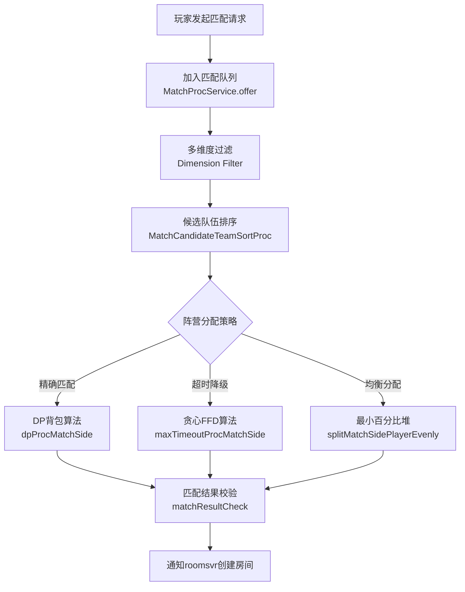
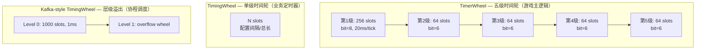
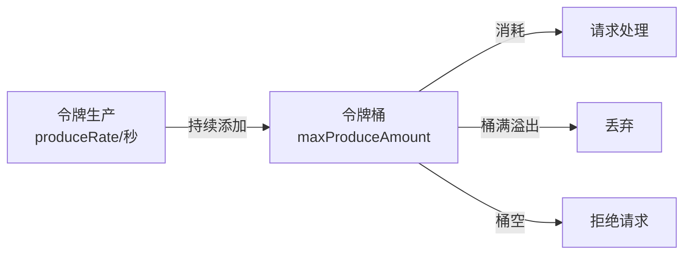
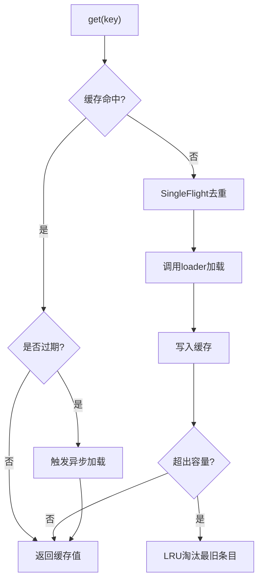
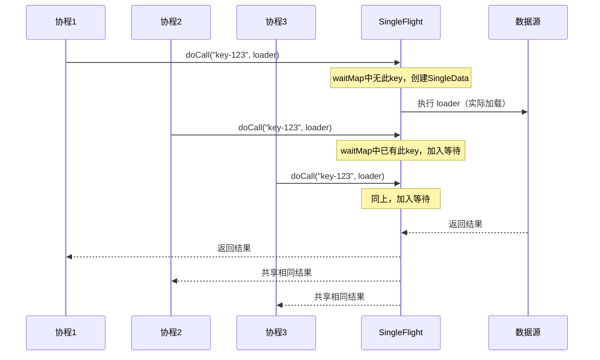
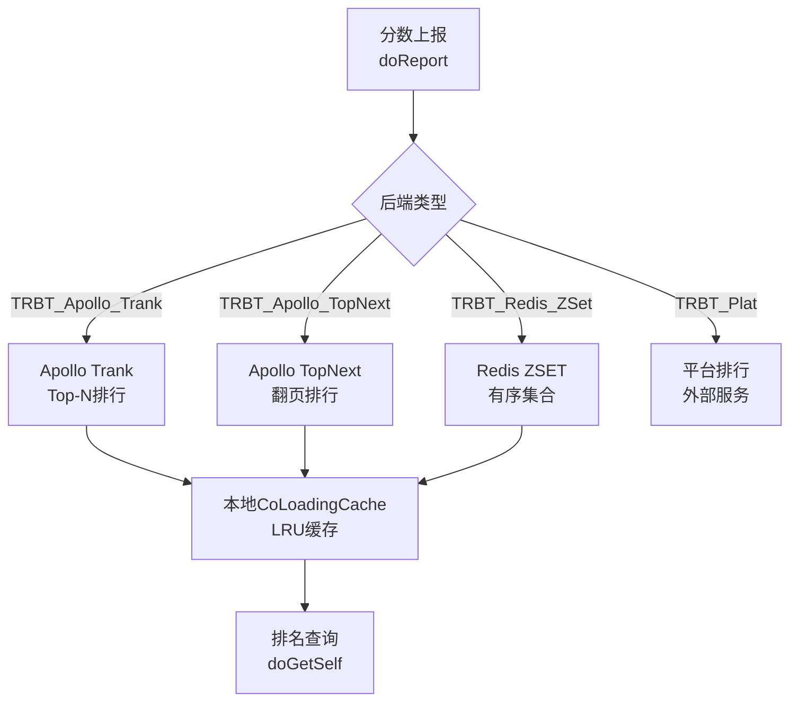

# 项目中的算法与数据结构实践

本文基于元梦之星项目（letsgo_server）60+ 微服务的源码分析，系统梳理项目在匹配算法、排行榜排序、路由算法、时间轮定时器、令牌桶限流、LRU缓存、SingleFlight并发控制、动态规划等方面的算法与数据结构应用，涵盖原理、作用、使用方式、进阶分析及改进空间。

---

## 一、匹配系统算法（matchsvr）

### 1.1 设计原理

匹配系统（matchsvr）是游戏服务端最核心的算法密集型模块之一，负责将等待中的玩家/队伍按照技术水平、等待时间、阵营均衡等多维度条件撮合成对局。项目采用**多维度过滤 + 动态规划阵营分配 + 超时降级**的三阶段匹配策略。

**核心算法流程**：



### 1.2 多维度过滤算法

**文件位置**：`WeA/projects/matchsvr/src/main/java/com/tencent/wea/matchservice/matchdata/matchProcService/matchProcCommon/MatchProcUtils.java`

匹配维度（MatchDimension）是匹配系统的基础数据结构，每个维度定义了一个匹配条件（如MMR分数、段位、地图偏好等）。

**维度定义**：

```protobuf
message MatchDimension {
  optional int32 id = 1;
  optional string dimName = 3;                  // 维度名字
  optional MatchCreateIndexOper createIndexOper = 4;  // 建立索引运算规则
  optional MatchFindRule relations = 5;          // 运算规则（范围匹配）
  optional int32 isFilterValType = 6;            // 是否过滤器值型维度
}
```

**维度关系合并算法**（`dimensionRelation`）：

多维度过滤后产生多个候选集合，需要通过**交集/并集运算**合并为最终候选队伍列表：

```java
// 关系运算类型
switch (rel.getOperation().getNumber()) {
    case MROT_INTERSECTION_VALUE: {  // 交集：多维度同时满足
        for (int dimID : rel.getDimensionsList()) {
            Set<MatchTeamInfo> tmp = tMemberInfoMap.get(dimID);
            if (!isInit) {
                tmpResult.addAll(tmp);  // 初始化
                isInit = true;
            } else {
                tmpResult.retainAll(tmp);  // 取交集
            }
        }
        break;
    }
    case MROT_UNION_VALUE: {  // 并集：任一维度满足
        for (int dimID : rel.getDimensionsList()) {
            tmpResult.addAll(tMemberInfoMap.get(dimID));
        }
        break;
    }
}
```

**算法复杂度**：假设有 D 个维度，每个维度候选集平均大小为 N，交集操作 O(D×N)，并集操作 O(D×N)。

### 1.3 DP背包算法 — 精确阵营分配

**文件位置**：`WeA/projects/matchsvr/src/main/java/com/tencent/wea/matchservice/matchdata/matchProcService/matchProcCommon/MatchAlgorithmUtils.java`

核心方法 `dpProcMatchSide` 使用**0-1背包动态规划**算法，将候选队伍精确填充到各阵营中，确保每个阵营人数恰好等于配置的上限。

**算法原理**：

将阵营分配问题转化为背包问题：
- **背包容量** = 阵营最大人数（`teamMaxNum`）
- **物品** = 候选队伍，物品重量为队伍人数（`memberCnt`）
- **目标** = 恰好装满背包

```java
public static boolean dpProcMatchSide(List<MatchSideInfo> matchSideList, MatchParams matchParams) {
    for (MatchSideInfo sideInfo : sideSetBak) {
        int teamMaxNum = sideInfo.getTeamPlayers();
        boolean[][] curDpArray = new boolean[teamSetBak.size()][teamMaxNum + 1];
        Set<MatchTeamInfo>[] curDpMatchTeamSet = new Set[teamMaxNum + 1];
        
        for (int index = 0; matchIte.hasNext(); index++) {
            MatchTeamInfo teamCurr = matchIte.next();
            
            // 继承上一层结果
            if (index > 0) {
                curDpArray[index] = Arrays.copyOf(curDpArray[index - 1], teamMaxNum + 1);
            }
            
            // 当前队伍单独填充
            if (!curDpArray[index][teamCurr.getMemberCnt()]) {
                curDpArray[index][teamCurr.getMemberCnt()] = true;
                curDpMatchTeamSet[teamCurr.getMemberCnt()] = new HashSet<>();
                curDpMatchTeamSet[teamCurr.getMemberCnt()].add(teamCurr);
            }
            
            // DP状态转移：组合已有结果
            if (index > 0) {
                for (int i = 1; i < teamMaxNum; ++i) {
                    if (curDpArray[index - 1][i]) {
                        int newCnt = i + teamCurr.getMemberCnt();
                        if (newCnt <= teamMaxNum && !curDpArray[index][newCnt]) {
                            curDpArray[index][newCnt] = true;
                            curDpMatchTeamSet[newCnt] = new HashSet<>(curDpMatchTeamSet[i]);
                            curDpMatchTeamSet[newCnt].add(teamCurr);
                        }
                    }
                }
            }
            
            // 找到精确解
            if (curDpArray[index][teamMaxNum]) {
                // 分配阵营并加入结果
                for (MatchTeamInfo teamInfo : curDpMatchTeamSet[teamMaxNum]) {
                    teamInfo.setSide(sideInfo.getSideID());
                }
                matchParams.matchResult.addAll(curDpMatchTeamSet[teamMaxNum]);
                break;
            }
        }
    }
}
```

**复杂度分析**：
- 时间复杂度：O(N × C)，N 为候选队伍数，C 为阵营最大人数
- 空间复杂度：O(N × C)，DP数组 + 方案追踪数组

### 1.4 贪心FFD算法 — 超时降级匹配

当匹配超时后，精确匹配不再可行，系统降级为**贪心算法**（First Fit Decreasing），尽可能多地填充真人玩家：

```java
private static int maxTimeoutProcMatchSide(List<MatchSideInfo> matchSideList, MatchParams matchParams) {
    // 1. 按策略排序候选队伍（人数多优先 / 等待时间长优先）
    TeamInfoSortStrategyRegistry.getInstance()
        .getStrategy(matchParams.baseTeamInfo.getMatchType())
        .sort(matchParams.baseTeamInfo, teamSetBak);
    
    // 2. 贪心填充：按排序顺序逐个尝试放入阵营
    for (MatchSideInfo sideInfo : sideSetBak) {
        int teamMaxNum = sideInfo.getTeamPlayers();
        int sideMemCnt = 0;
        while (matchIte.hasNext()) {
            MatchTeamInfo teamCurr = matchIte.next();
            if ((sideMemCnt + teamCurr.getMemberCnt()) <= teamMaxNum) {
                sideMemCnt += teamCurr.getMemberCnt();
                teamCurr.setSide(sideInfo.getSideID());
                matchParams.matchResult.add(teamCurr);
            }
        }
    }
}
```

### 1.5 最小百分比堆 — 均衡阵营分配

`splitMatchSidePlayerEvenly` 方法使用**最小堆（PriorityQueue）+ 百分比排序**，确保超时后各阵营真人玩家比例尽可能均衡：

```java
private static int splitMatchSidePlayerEvenly(List<MatchSideInfo> matchSideList, MatchParams matchParams) {
    // 最小堆：按阵营真人占比排序（占比低的优先分配）
    PriorityQueue<MatchSideInfo> sidePlayerPercentHeap = new PriorityQueue<>(
        Comparator.comparingDouble(m -> {
            Integer sidePlayerCnt = sideAssignedPlayerCntMap.get(m.getSideID());
            int sideMaxPlayer = Math.max(1, m.getTeamPlayers());
            return sidePlayerCnt.doubleValue() / sideMaxPlayer;  // 百分比
        })
    );
    
    // 依次将队伍分配到占比最低的阵营
    for (MatchTeamInfo teamInfo : sortedMatchTeamInfoList) {
        processOneMatchTeamOnSplitMatchSidePlayerEvenly(
            teamInfo, sidePlayerPercentHeap, sideAssignedPlayerCntMap, matchResult);
    }
}
```

**数据结构选择**：PriorityQueue（最小堆）保证每次 O(log S) 时间获取占比最低的阵营（S 为阵营数），总复杂度 O(N × log S)。

### 1.6 MMR评分系统

**文件位置**：`WeA/projects/battlesvr/src/main/java/com/tencent/wea/battleservice/battledata/settlement/mmrscore/`

项目使用基于**Elo算法**的MMR（Matchmaking Rating）分数结算系统，支持多种游戏模式：

| 模式 | 实现 | 适用场景 |
|:-----|:-----|:---------|
| **BR模式** | `BRMmrSettlement` | 大逃杀（按排名计算分数变化） |
| **Team模式** | `TeamMmrSettlement` | 团队对抗（按胜负计算） |
| **Chest模式** | `ChestMmrSettlement` | 宝箱争夺玩法 |

**Elo算法核心公式**：
```
预期胜率: E = 1 / (1 + 10^((Rb - Ra) / 400))
分数变化: ΔR = K × (S - E)
  - Ra/Rb: 双方当前MMR分
  - S: 实际结果（1=胜, 0.5=平, 0=负）
  - K: 调节系数（根据玩家场次/段位动态调整）
```

MMR分数范围由配置控制：默认 `[0, 4000]`，通过 `MatchMWConstsData` 管理边界值。

### 1.7 使用与进阶

**使用方式**：
1. 策划通过Excel配表定义匹配规则（`ResMatch.MatchRule`）、维度（`ResMatch.MatchDimension`）、房间配置（`ResMatch.MatchRoomInfo`）
2. 运行时通过 `MatchAlgorithmUtils.getMatchResult()` 执行匹配
3. 超时策略通过 `MatchTaskTimeoutType` 控制降级行为

**进阶特性**：
- **动态最小人数**：`getDynamicMinCnt` 根据等待时间动态降低开局人数要求
- **黑名单校验**：`matchResultCheck` 在最终撮合后检查拉黑关系
- **AI填充策略**：`getDynamicRobots` 根据MMR分段配置不同难度的机器人
- **排序策略注册表**：`TeamInfoSortStrategyRegistry` 通过策略模式支持不同玩法的排序逻辑

---

## 二、时间轮算法（TimerWheel / TimingWheel）

### 2.1 设计原理

项目实现了**三套时间轮**用于不同场景的定时任务调度，核心思想是将定时器按到期时间散列到环形数组中，避免排序，实现 O(1) 的插入和到期检测。



### 2.2 五级层级时间轮（TimerWheel）

**文件位置**：`WeA/common/src/main/java/com/tencent/nk/timer/TimerWheel.java`

这是项目的核心定时器实现，模仿 **Linux 内核的多级时间轮**（TVR/TVN），采用 5 级结构：`8+6+6+6+6 = 32 bit`，理论可管理 2^32 个 tick 的定时范围。

**核心数据结构**：

```java
public class TimerWheel {
    // 5级时间轮参数
    private static final int TVR_BITS = 8;   // 第1级位数
    private static final int TVN_BITS = 6;   // 第2-5级位数
    private static final int TVR_SIZE = 256;  // 第1级 slot 数
    private static final int TVN_SIZE = 64;   // 第2-5级 slot 数
    
    public final TimerVector[] timerVectors = new TimerVector[5];  // 5级轮
    private long currentTick;     // 当前 tick
    private TimerList runningTimerList;  // 当前正在执行的任务链表
}
```

**定位算法**（`calculateLocation`）：根据到期时间与当前时间的差值，确定定时器应放在哪一级的哪个 slot：

```java
private TimerList calculateLocation(TimerHandle timerHandle) {
    long idx = expiredTick - currentTick;
    if (idx < 0)                              return runningTimerList;     // 已过期
    else if (idx < TVR_SIZE)                  return timerVectors[0].get(expiredTick & TVR_MASK);      // 第1级
    else if (idx < (1 << (8+6)))              return timerVectors[1].get((expiredTick >> 8) & TVN_MASK);   // 第2级
    else if (idx < (1 << (8+12)))             return timerVectors[2].get((expiredTick >> 14) & TVN_MASK);  // 第3级
    else if (idx < (1 << (8+18)))             return timerVectors[3].get((expiredTick >> 20) & TVN_MASK);  // 第4级
    else                                       return timerVectors[4].get((expiredTick >> 26) & TVN_MASK);  // 第5级
}
```

**进位机制**（`cascade`）：当第1级轮转一圈时，触发第2级的 cascade（进位），将高级轮的任务重新分配到低级轮：

```java
private void tick() {
    while (realTick > currentTick) {
        ++currentTick;
        long index = currentTick & TVR_MASK;
        runningTimerList = timerVectors[0].get((int) index);
        int i = 0;
        while (index == 0 && i < 4) {  // 第1级回到0时触发进位
            index = (currentTick >> (TVR_BITS + i * TVN_BITS)) & TVN_MASK;
            cascade(i + 1, (int) index);  // 将高级轮任务下移
            i++;
        }
    }
}
```

**链表结构**：每个 slot 使用**双向循环链表**（`TimerList`），支持 O(1) 插入/删除：

```java
private static class TimerList {
    TimerHandle root;  // 哨兵节点
    
    // 尾部插入 O(1)
    private void addTimerBack(TimerHandle timer) {
        TimerHandle tail = root.prev;
        timer.next = root;
        timer.prev = tail;
        tail.next = timer;
        root.prev = timer;
    }
    
    // 进位时取出整个链表 O(1)
    private TimerHandle carry() {
        TimerHandle tail = root.prev;
        if (tail == root) return null;
        root.next.prev = null;
        root.prev.next = null;
        root.next = root;
        root.prev = root;
        return tail;
    }
}
```

### 2.3 Kafka风格溢出时间轮

**文件位置**：`WeA/timiutil/src/main/java/com/tencent/timiutil/timer/TimingWheel.java`

用于**协程调度**（`CoroutineKafkaTimer`），采用 Kafka 源码中的时间轮设计：

- **1ms精度**，1000个 slot
- **DelayQueue** 驱动时钟推进（避免空转）
- **溢出自动创建上级轮**（`addOverflowWheel`）

```java
// 溢出时自动创建上级时间轮
private synchronized void addOverflowWheel() {
    if (overflowWheel == null) {
        overflowWheel = new TimingWheel(
            interval,       // 上级轮的 tickDuration = 当前轮的 interval
            wheelSize,
            currentTimeMs,
            taskCounter,
            queue           // 共享 DelayQueue
        );
    }
}
```

### 2.4 单级简易时间轮

**文件位置**：`WeA/common/src/main/java/com/tencent/nk/util/timingWheel/TimingWheel.java`

用于业务层的简单定时任务（如农场收获倒计时），使用配置化的 `tickDuration` 和 `interval`：

```java
public void init(long tickDuration, long interval) {
    ticksPerWheel = (int) (interval / tickDuration + 1);
    timerWheel = new TimerTaskList[ticksPerWheel];
    // 注册定时回调，每个 tick 执行一次
    CurrentExecutorUtil.addRepeatTimer(TimerType.TimingWheelTimer, 
        TimerUtil.msToTick(tickDuration), TimerUtil.msToTick(tickDuration), 
        true, this::runOneRound);
}
```

### 2.5 三套时间轮对比

| 特性 | TimerWheel（5级） | Kafka TimingWheel | 简易 TimingWheel |
|:-----|:---|:---|:---|
| **文件** | `nk/timer/TimerWheel.java` | `timiutil/timer/TimingWheel.java` | `nk/util/timingWheel/TimingWheel.java` |
| **层级** | 5级（8+6+6+6+6） | 动态溢出 | 1级 |
| **精度** | 20ms（1 tick） | 1ms | 可配置 |
| **容量** | 2^32 tick | 理论无限 | `interval/tickDuration` |
| **驱动** | 主循环 tick | DelayQueue | 定时回调 |
| **场景** | 游戏主逻辑定时 | 协程超时调度 | 业务定时任务 |
| **数据结构** | 双向循环链表 | 双向链表 + AtomicLong | ArrayList |

### 2.6 使用与进阶

**使用示例**：

```java
// 游戏主逻辑中添加定时器
TimerHandle handle = timerManager.addTimer(expireTick, () -> {
    // 回调逻辑：如农场作物成熟通知
    player.onCropReady(plotId);
});

// 取消定时器
timerManager.deleteTimer(handle);
```

**进阶特性**：
- **realTick vs currentTick**：支持游戏暂停场景，`realTick` 为实际流逝时间，`currentTick` 可暂停
- **过期任务排序插入**：`addExpiredTimer` 保证过期任务按到期时间顺序执行
- **携带取消标记**：`TimingWheelTask.isCanceled()` 支持惰性删除

---

## 三、令牌桶限流算法（RateLimiter）

### 3.1 设计原理

**文件位置**：`WeA/common/src/main/java/com/tencent/util/RateLimiter.java`

项目实现了经典的**令牌桶算法**（Token Bucket），用于控制各类请求的频率，防止系统过载。核心思想：以固定速率向桶中添加令牌，每次请求消耗令牌，桶满则丢弃多余令牌，桶空则拒绝请求。



### 3.2 核心实现

```java
public class RateLimiter {
    private final String name;
    private final boolean threadSafe;
    private final ReentrantLock lock = new ReentrantLock();
    private long lastConsumeTimeMs = 0;     // 上次消费时间
    private double currentLeftAmount = 0;    // 当前剩余令牌数
    
    /**
     * @param maxProduceAmount 桶容量（最大令牌数）
     * @param produceRate      每秒产生令牌数（支持小数，如 0.2 = 5秒1个）
     * @param consumeAmount    本次消耗令牌数
     */
    private boolean consumeThreadUnsafe(double maxProduceAmount, double produceRate, double consumeAmount) {
        long now = Framework.currentTimeMillis();
        if (lastConsumeTimeMs == 0) {
            // 第一次消费：桶初始化为满
            currentLeftAmount = maxProduceAmount;
            lastConsumeTimeMs = now;
        } else {
            // 计算时间差产生的令牌
            double incAmount = (now - lastConsumeTimeMs) * produceRate / 1000;
            currentLeftAmount += incAmount;
            lastConsumeTimeMs = now;
            // 令牌不超过桶容量
            if (currentLeftAmount > maxProduceAmount) {
                currentLeftAmount = maxProduceAmount;
            }
        }
        
        if (currentLeftAmount < consumeAmount) {
            return false;  // 令牌不足，拒绝
        }
        
        currentLeftAmount -= consumeAmount;
        return true;  // 消费成功
    }
}
```

### 3.3 线程安全设计

RateLimiter 支持两种模式：

| 模式 | 构造方式 | 适用场景 |
|:-----|:---------|:---------|
| **线程不安全** | `new RateLimiter("name")` | 单协程/单线程场景（游戏主逻辑） |
| **线程安全** | `new RateLimiter("name", true)` | 多线程共享场景 |

线程安全版本使用 `ReentrantLock` 加锁：

```java
private boolean consumeThreadSafe(double maxProduceAmount, double produceRate, double consumeAmount) {
    lock.lock();
    try {
        return consumeThreadUnsafe(maxProduceAmount, produceRate, consumeAmount);
    } finally {
        lock.unlock();
    }
}
```

### 3.4 使用示例

```java
// UGC数据编辑限流：每秒最多10次
RateLimiter editLimiter = new RateLimiter("ugc_edit_rate");
if (!editLimiter.consume(10.0, 10.0, 1.0)) {
    return NKErrorCode.ReqLimit;  // 触发限流
}
```

### 3.5 进阶分析

**优点**：
- **懒计算**：不需要后台线程持续添加令牌，仅在消费时计算时间差
- **高性能**：O(1) 时间复杂度，无锁版本适合游戏主逻辑
- **灵活精度**：支持小数速率（如 0.2/秒 = 5秒1次）

**与漏桶对比**：

| 特性 | 令牌桶（本项目） | 漏桶 |
|:-----|:---|:---|
| **突发处理** | ✅ 允许突发（桶满时可连续消耗） | ❌ 严格匀速 |
| **速率控制** | 平均速率 + 突发容忍 | 严格固定速率 |
| **实现复杂度** | 低 | 低 |
| **适用场景** | 游戏请求限流 | 网络流量整形 |

---

## 四、LRU缓存（CoLoadingCache）

### 4.1 设计原理

**文件位置**：`WeA/common/src/main/java/com/tencent/coLoadingCache/CoLoadingCache.java`

`CoLoadingCache` 是项目中使用最广泛的缓存组件（项目中有 50+ 处使用），实现了**LRU淘汰 + TTL过期 + 自动加载 + SingleFlight去重 + 协程安全**的综合缓存方案。



### 4.2 核心能力

| 能力 | 实现方式 | 说明 |
|:-----|:---------|:-----|
| **LRU淘汰** | `LinkedHashMap(accessOrder=true)` | 访问时自动移到链尾，超容量时淘汰链头 |
| **TTL过期** | `expireAfterWrite(ms)` | 写入后固定时间过期 |
| **自动加载** | `setLoader(Function)` | 缓存未命中时自动调用加载函数 |
| **批量加载** | `setBatchLoader(Function)` | 支持批量key的高效加载 |
| **协程锁** | `LockKeyBuilder` | 按key粒度加锁，防止缓存击穿 |
| **淘汰通知** | `setRemoveNotifier` | 条目被淘汰时回调，可用于资源清理 |
| **手动过期** | `expireManually()` | 禁用自动过期，由业务控制 |

### 4.3 Builder模式构建

```java
// 典型用法：排行榜数据缓存
CoLoadingCache<Long, RankData> cache = new CoLoadingCache.Builder<Long, RankData>()
    .setCapacity(10000)                    // 最大缓存条目数（LRU容量）
    .expireAfterWrite(60000)               // 60秒后过期
    .setLoader(this::loadRankFromRedis)    // 缓存未命中时的加载函数
    .setBatchLoader(this::batchLoadRank)   // 批量加载函数
    .setRemoveNotifier(this::onEvict)      // 淘汰回调
    .setLockKeyBuilder(new LockKeyBuilder<>("rank", Long::toString))  // 按key加锁
    .build();
```

### 4.4 项目中的使用场景

| 使用场景 | 服务 | 配置 |
|:---------|:-----|:-----|
| **元数据缓存** | proxysvr | `MetadataCache` — 路由元数据 |
| **排行榜缓存** | ugcdatastoresvr | `RankCache` — 排行榜数据 |
| **玩家公开信息** | gamesvr | `LocalRedisPublicInfoCache` — 其他玩家的公开资料 |
| **路由缓存** | proxysvr | `RoutingCache` — 服务路由表 |
| **赛季数据** | gamesvr | `SeasonReviewMgr` — 历史赛季数据 |
| **地图设置** | ugcdatastoresvr | `MapSettingCache` — UGC地图配置 |
| **俱乐部信息** | gamesvr | `LocalClubBasicInfoCache` — 俱乐部基础信息 |

### 4.5 进阶分析

**LRU + TTL双淘汰策略**：
- **LRU淘汰**：当缓存条目数超过 `capacity` 时，淘汰最久未访问的条目
- **TTL过期**：当条目的写入时间超过 `expireAfterWrite` 时，标记为过期，下次访问时重新加载
- 两者同时生效，互不冲突

**与Guava Cache对比**：

| 特性 | CoLoadingCache（本项目） | Guava Cache |
|:-----|:---|:---|
| **协程安全** | ✅ 专门适配协程环境 | ❌ 仅线程安全 |
| **SingleFlight** | ✅ 内置去重 | ❌ 需手动实现 |
| **批量加载** | ✅ `setBatchLoader` | ✅ `loadAll` |
| **淘汰通知** | ✅ `setRemoveNotifier` | ✅ `removalListener` |
| **按key加锁** | ✅ `LockKeyBuilder` | ❌ 全局锁 |

---

## 五、SingleFlight并发控制

### 5.1 设计原理

**文件位置**：`WeA/common/src/main/java/com/tencent/cache/SingleFlight.java`

`SingleFlight` 借鉴 Go 语言 `singleflight` 包的设计，解决**缓存击穿**问题：当大量协程同时请求同一个缓存失效的 key 时，只有一个协程去加载数据，其他协程等待并共享结果。



### 5.2 核心实现

```java
public class SingleFlight {
    private ConcurrentHashMap<String, SingleData> waitMap = new ConcurrentHashMap<>();
    
    public <K, V> V doCall(K key, Execute<V> supplier) throws Throwable {
        String k = getKey(key);
        SingleData<V> curWg = waitMap.get(k);
        if (curWg != null) {
            return getResult(curWg);  // 已有其他协程在执行，等待结果
        }
        
        SingleData<V> wg = new SingleData<>();
        curWg = waitMap.putIfAbsent(k, wg);  // CAS竞争
        if (curWg == null) {
            // 竞争胜利，执行实际加载
            V v = supplier.get();
            waitMap.remove(k, wg);
            wg.setVal(v);
            wg.endFlag.set(true);
            wg.executeSuccess();  // 唤醒所有等待者
            return v;
        } else {
            return getResult(curWg);  // 竞争失败，等待结果
        }
    }
}
```

### 5.3 等待与通知机制

`SingleData` 通过 `SingleFlightAsync` 实现协程级别的等待/通知：

```java
public static class SingleData<V> {
    private List<SingleFlightAsync> asyncList = new ArrayList<>();  // 等待者列表
    private volatile AtomicBoolean endFlag = new AtomicBoolean(false);
    private V val;
    
    // 加载成功：唤醒所有等待者
    public synchronized void executeSuccess() {
        for (SingleFlightAsync async : asyncList) {
            async.success(this.val);
        }
    }
    
    // 加载失败：通知所有等待者异常
    public synchronized void executeFailure(RuntimeException v) {
        for (SingleFlightAsync async : asyncList) {
            async.failure(v);
        }
    }
}
```

### 5.4 使用场景

```java
// 全局数据读取：防止并发加载
private final SingleFlight singleFlight = new SingleFlight();

public V get(K k) {
    var cached = cache.get(k);
    if (cached != null && !cached.isCacheExpired()) {
        return cached;
    }
    // SingleFlight保证：同一key只执行一次远程调用
    return singleFlight.doCall(k, () -> getFromRemote(k));
}

// COS文件操作：5秒超时
private SingleFlight callFlight = new SingleFlight(5000, TimeUnit.MILLISECONDS);
```

### 5.5 进阶特性

- **`tryCallOnce`**：非阻塞版本，如果有其他协程在执行则直接返回 null
- **超时控制**：构造时指定 `timeout` 和 `TimeUnit`，防止无限等待
- **协程感知**：`getKey` 方法组合 key + 线程ID，支持跨协程共享

---

## 六、路由算法（RpcRelayMode）

### 6.1 设计原理

项目实现了**9种RPC路由模式**（`RpcRelayMode`），用于将请求路由到正确的服务实例。每种模式对应不同的路由算法和数据结构。

### 6.2 九种路由模式

| 模式 | 值 | 算法 | 数据结构 | 适用场景 |
|:-----|:--:|:-----|:---------|:---------|
| **RRM_SpecDst** | 1 | 指定目的地址 | 直接寻址 | 明确知道目标实例 |
| **RRM_KeyHash** | 2 | 哈希取余 | HashMap | 按key分片（如uid % N） |
| **RRM_ConsistentHash** | 3 | 一致性哈希 | TreeMap（红黑树） | 需要平滑扩缩容 |
| **RRM_MetaData** | 4 | 元数据转发 | 元数据注册表 | 按玩家元数据路由 |
| **RRM_Match** | 5 | 匹配模式 | 匹配队列 | 匹配服务路由 |
| **RRM_StateTrans** | 6 | 状态转发 | 状态表 | 有状态服务路由 |
| **RRM_Region** | 7 | 大区转发 | 区域映射表 | 跨区路由 |
| **RRM_SpecDstKeyHash** | 8 | 指定目标+哈希 | 组合 | 先指定再哈希 |
| **RRM_Hall** | 9 | 大厅模式 | 大厅表 | 大厅服务路由 |

### 6.3 路由键提取

**文件位置**：`WeA/common/src/main/java/com/tencent/rpc/RpcRoutingUtil.java`

```java
public static long getRoutingKey(RpcRouting routing) {
    RpcRelayData data = routing.getRelayData();
    switch (data.getRelayMode()) {
        case RRM_MetaData_VALUE:
            if (data.getMetaData().getType().equals(MetaDataType.MDT_MapId)) {
                return RandomGenerator.getInstance().nextLong();  // 地图ID随机分配
            }
            return data.getMetaData().getUuid();  // 按玩家UUID路由
        case RRM_KeyHash_VALUE:
        case RRM_SpecDstKeyHash_VALUE:
            return data.getKeyHash().getKey();  // 按哈希key路由
        default:
            return 0;
    }
}
```

### 6.4 哈希取余 vs 一致性哈希

| 特性 | 哈希取余（KeyHash） | 一致性哈希（ConsistentHash） |
|:-----|:---|:---|
| **算法** | `key % N` | 虚拟节点环 + 二分查找 |
| **扩缩容影响** | 全量重映射 | 仅影响相邻节点 |
| **数据结构** | 简单数组 | TreeMap（红黑树） |
| **适用场景** | 节点数固定 | 动态扩缩容 |
| **查找复杂度** | O(1) | O(log N) |

---

## 七、排行榜数据结构（ranksvr）

### 7.1 设计原理

ranksvr 负责全局和赛季排行榜管理，采用**多后端存储 + 本地缓存**的架构：



### 7.2 Redis ZSET排行榜

Redis的有序集合（Sorted Set）是排行榜的核心数据结构，底层使用**跳表（Skip List）+ 哈希表**的组合：

- **跳表**：支持 O(log N) 的范围查询和排名计算
- **哈希表**：支持 O(1) 的成员分数查询

| 操作 | Redis命令 | 复杂度 | 说明 |
|:-----|:---------|:---:|:-----|
| 上报分数 | `ZADD key score member` | O(log N) | 插入或更新分数 |
| 查询排名 | `ZREVRANK key member` | O(log N) | 获取倒序排名 |
| Top-N | `ZREVRANGE key 0 N` | O(N+log N) | 获取前N名 |
| 分数范围 | `ZRANGEBYSCORE key min max` | O(log N + M) | 按分数区间查询 |

### 7.3 多级缓存策略

排行榜数据通过 `CoLoadingCache` 实现多级缓存：

```java
// 排名号缓存：10000条，60秒过期
cachedZSetRank = new CoLoadingCache.Builder<NKPair<Integer, Long>, Integer>()
    .setCapacity(10000)
    .expireAfterWrite(60000)
    .setLockKeyBuilder(new LockKeyBuilder<>("rank_list/zset_rank", NKPair::toString))
    .setLoader(kv -> getZSetRankNoFromRedis(kv.key, kv.value))
    .build();
```

### 7.4 赛季结算

`doSettleLaunch` 支持赛季结算，将当前排行榜数据快照并归档：
- **快照机制**：将排行数据从活跃 ZSET 复制到快照 ZSET
- **批量结算**：分批处理，防止一次性处理过多数据

---

## 八、Protobuf变长编码

### 8.1 设计原理

项目大量使用 Protocol Buffers 进行序列化，其核心编码算法——**Varint变长编码**是性能优化的关键。

### 8.2 Varint编码原理

Varint用最少的字节表示整数：每个字节的最高位（MSB）为标志位，1表示后续还有字节，0表示当前是最后一个字节：

```
值: 1         编码: 0000 0001  (1字节)
值: 150       编码: 1001 0110  0000 0001  (2字节)
值: 300       编码: 1010 1100  0000 0010  (2字节)
```

| 数值范围 | 字节数 | 比固定4字节 |
|:---------|:---:|:---:|
| 0 ~ 127 | 1 | 节省75% |
| 128 ~ 16383 | 2 | 节省50% |
| 16384 ~ 2097151 | 3 | 节省25% |
| 2097152 ~ 268435455 | 4 | 持平 |
| > 268435455 | 5 | 多用25% |

### 8.3 在项目中的作用

由于游戏中大量字段是小整数（如物品ID、数量、状态码），Varint编码极大减小了序列化数据体积：

```protobuf
message PlayerBagItem {
    int32 item_id = 1;    // 物品ID通常 < 10000 → 2字节
    int32 count = 2;      // 数量通常 < 100 → 1字节
    int64 expire_time = 3; // 时间戳 → 5-8字节
}
// 相比固定编码(4+4+8=16字节)，Varint平均仅需8-11字节
```

---

## 九、其他算法实践总结

### 9.1 面试高频算法映射

| 面试高频算法 | 项目中的映射 | 具体实现 |
|:-------------|:-----------|:---------|
| **动态规划** | 匹配阵营分配 | `dpProcMatchSide` — 0-1背包 |
| **贪心算法** | 超时匹配/阵营填充 | `maxTimeoutProcMatchSide` — FFD |
| **哈希表** | 维度候选集管理/路由表 | `ConcurrentHashMap` 全局使用 |
| **优先队列/堆** | 均衡阵营分配 | `PriorityQueue` 最小百分比堆 |
| **链表** | 时间轮 slot | 双向循环链表 `TimerList` |
| **树** | 一致性哈希/定时器 | `TreeMap` 红黑树 |
| **位运算** | 时间轮定位 | `& MASK`, `>> BITS` 位操作 |
| **LRU缓存** | 全局缓存组件 | `CoLoadingCache` — LinkedHashMap |
| **令牌桶** | 请求限流 | `RateLimiter` |
| **Elo算法** | MMR评分 | `mmrscore` 目录 |
| **集合交并** | 维度过滤 | `retainAll / addAll` |
| **二分查找** | 阵营队伍选择 | `IndexFinder.findLastIndexLessThanOrEqual` |
| **CAS无锁** | SingleFlight竞争 | `ConcurrentHashMap.putIfAbsent` |

### 9.2 数据结构使用统计

| 数据结构 | 使用场景 | 选择理由 |
|:---------|:---------|:---------|
| **ConcurrentHashMap** | SingleFlight、路由表、配置缓存 | 线程安全 O(1) 查找 |
| **LinkedHashMap** | CoLoadingCache LRU | 维护访问顺序 + 自动淘汰 |
| **PriorityQueue** | 阵营均衡分配、DelayQueue | 快速获取最值 O(log N) |
| **ArrayList** | 候选队伍列表、排序 | 随机访问 O(1)、排序友好 |
| **HashSet** | 维度候选集、匹配结果 | 去重 + O(1) 查找 |
| **TreeMap** | 一致性哈希环 | 有序 + O(log N) 范围查找 |
| **双向循环链表** | 时间轮 slot | O(1) 插入/删除/批量取出 |
| **数组** | 时间轮各级、DP数组 | 连续内存 O(1) 寻址 |
| **DelayQueue** | Kafka时间轮驱动 | 阻塞等待最近到期元素 |
| **AtomicBoolean/Integer** | SingleFlight标记、计数器 | 无锁原子操作 |

---

## 十、改进空间

### 10.1 匹配算法改进

| 问题 | 现状 | 建议改进 |
|:-----|:-----|:---------|
| **DP空间占用** | `boolean[N][C]` + `Set[C]` 全量分配 | 使用滚动数组优化为 `boolean[2][C]`，空间从 O(NC) 降至 O(C) |
| **候选集数据结构** | HashSet存储，排序时转ArrayList | 考虑使用 TreeSet 或维护有序结构，避免频繁排序 |
| **MMR维度匹配** | 线性扫描范围 | 引入区间树（Interval Tree）加速范围查询 |
| **匹配公平性** | 超时贪心可能不公平 | 引入加权公平队列（WFQ），按等待时间加权 |
| **匹配质量评估** | 缺少量化评估 | 增加匹配质量分（MMR差距、等待时间分布）的监控指标 |

### 10.2 时间轮改进

| 问题 | 现状 | 建议改进 |
|:-----|:-----|:---------|
| **三套并存** | 三套时间轮分别维护 | 统一为可配置的时间轮框架，参数化精度和层级 |
| **cascade开销** | 进位时需遍历链表重新定位 | 引入懒进位（Lazy Cascade），仅在查询时进位 |
| **内存预分配** | TimerList对象预创建 | 使用数组+偏移量替代对象链表，减少GC压力 |
| **取消效率** | 惰性取消（执行时检查标记） | 对于大量取消场景，考虑引入取消计数优化 |

### 10.3 缓存策略改进

| 问题 | 现状 | 建议改进 |
|:-----|:-----|:---------|
| **缓存预热** | 冷启动时大量cache miss | 服务启动时增加预热阶段，预加载热点数据 |
| **淘汰策略单一** | 仅LRU | 考虑LFU（最少使用频率）或W-TinyLFU，更适合热点数据场景 |
| **缓存统计** | 缺少命中率等监控 | 增加 hitCount/missCount/loadCount 等指标上报 |
| **多级缓存** | 本地缓存单级 | 引入 L1（进程内）+ L2（Redis）多级缓存架构 |

### 10.4 限流算法改进

| 问题 | 现状 | 建议改进 |
|:-----|:-----|:---------|
| **单机限流** | 仅本地限流 | 增加分布式限流（Redis + Lua脚本）支持集群限流 |
| **限流粒度** | 按服务维度 | 增加按用户/IP/接口多维度限流 |
| **自适应限流** | 静态配置阈值 | 引入自适应限流（如根据CPU/RT自动调节） |
| **限流反馈** | 仅返回布尔值 | 增加剩余令牌数、预计等待时间等信息 |

### 10.5 SingleFlight改进

| 问题 | 现状 | 建议改进 |
|:-----|:-----|:---------|
| **key+线程ID** | `getKey` 组合线程ID | 在协程环境下可能不够精确，建议使用协程ID |
| **缺少缓存时间** | 每次都需要调用方管理缓存 | 可增加短时结果缓存（如100ms），避免密集请求 |
| **错误传播** | 失败时所有等待者收到相同异常 | 增加可选的错误降级策略（如返回旧值） |
| **内存泄漏风险** | waitMap在异常时可能残留 | 增加TTL自动清理机制 |

---

## 十一、总结

| 维度 | 评价 | 亮点 |
|:-----|:-----|:-----|
| **匹配算法** | ⭐⭐⭐⭐⭐ | DP背包+贪心+最小堆三级策略，覆盖精确匹配/超时降级/均衡分配 |
| **时间轮** | ⭐⭐⭐⭐⭐ | 三套时间轮各有侧重，五级轮复刻Linux内核设计 |
| **令牌桶限流** | ⭐⭐⭐⭐ | 懒计算高性能，支持线程安全/不安全双模式 |
| **LRU缓存** | ⭐⭐⭐⭐⭐ | CoLoadingCache集成LRU+TTL+SingleFlight+协程锁，功能完备 |
| **SingleFlight** | ⭐⭐⭐⭐ | 优雅解决缓存击穿，支持阻塞/非阻塞两种模式 |
| **路由算法** | ⭐⭐⭐⭐ | 9种路由模式全覆盖，哈希/一致性哈希/元数据灵活组合 |
| **排行榜** | ⭐⭐⭐⭐ | Redis ZSET+多后端+本地缓存三级架构 |
| **Elo评分** | ⭐⭐⭐⭐ | 支持BR/Team/Chest多模式，配置化K值和段位映射 |
| **编码算法** | ⭐⭐⭐⭐ | Protobuf Varint变长编码大幅减小数据体积 |
| **数据结构选型** | ⭐⭐⭐⭐⭐ | 每种场景精准选型，HashMap/TreeMap/PQ/链表各司其职 |