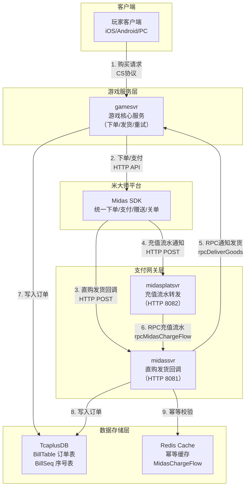
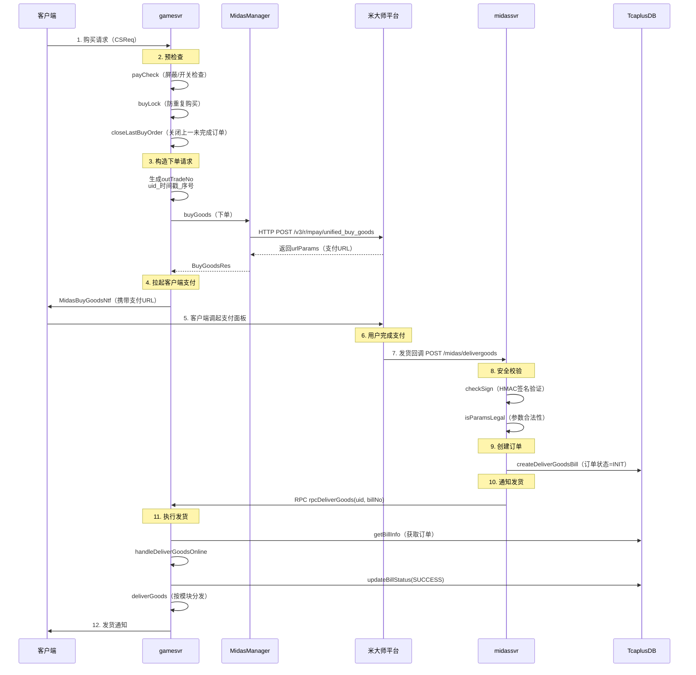
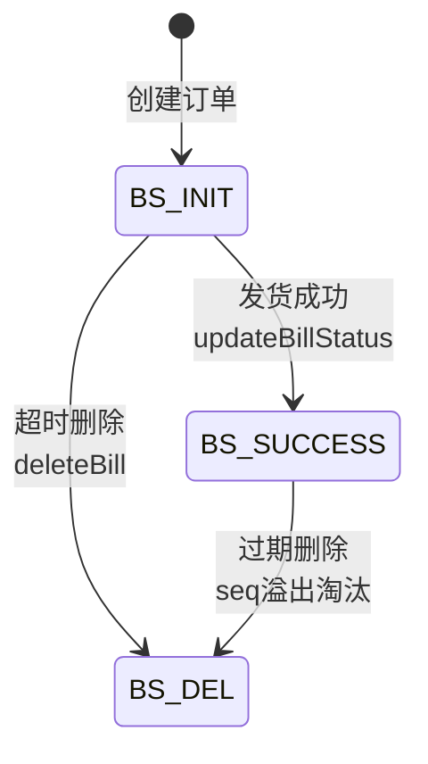
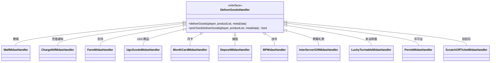
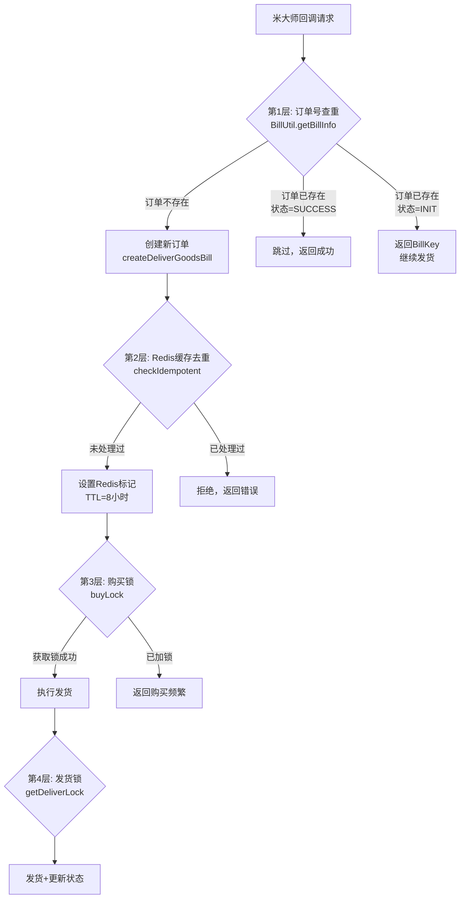
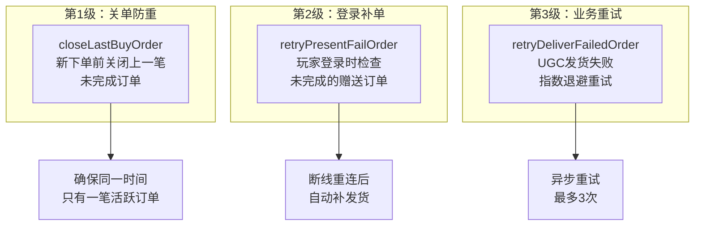
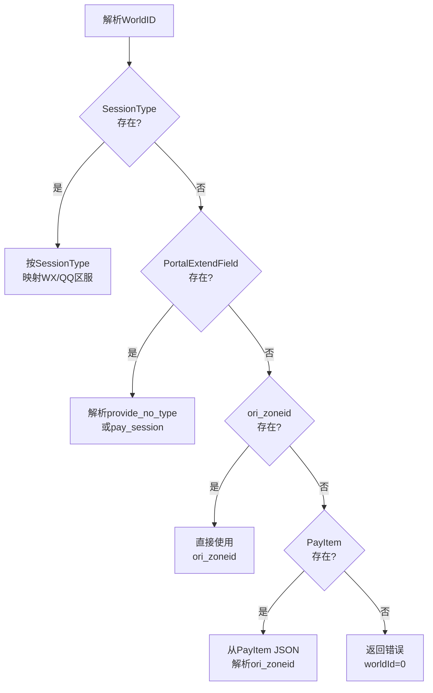

# 支付与交易系统深度分析

本文基于元梦之星项目（letsgo_server）的支付系统源码分析，系统梳理 midassvr / midasplatsvr 的服务架构、支付全链路流程、订单管理、幂等性设计、发货机制、掉单补单、安全设计、货币系统及改进空间等内容，涵盖原理、作用、使用方式、进阶分析及改进建议。

---

## 一、支付系统架构概览

### 1.1 设计原理

项目的支付系统基于腾讯**米大师（Midas）**支付平台构建，采用**双服务分离 + 策略模式发货 + 订单状态机**的架构设计。核心思想是将支付回调接收与业务发货逻辑解耦，通过订单表（BillTable）实现支付状态的持久化管理，确保"钱货一致"。



### 1.2 双服务职责划分

项目将支付系统拆分为两个独立微服务，各司其职：

| 服务 | 职责 | HTTP端口 | 核心Servlet | 通信方式 |
|:-----|:-----|:--------:|:-----------|:---------|
| **midassvr** | 接收米大师直购发货回调，创建订单并通知gamesvr发货 | 8081 | `DeliverGoodsServlet` | 内嵌Tomcat HTTP |
| **midasplatsvr** | 接收充值流水通知和账户流水通知，转发给midassvr处理 | 8082 | `MidasChargeFlowServlet`<br/>`MidasAccountFlowServlet` | 内嵌Tomcat HTTP |

**为什么拆分两个服务？**

1. **职责分离**：midassvr 处理直购发货（需要写订单+通知发货），midasplatsvr 处理平台侧流水通知（只需转发+记录）
2. **流量隔离**：直购发货是关键链路（涉及资金安全），与纯日志型流水通知隔离，避免互相影响
3. **安全边界**：midassvr 需要验证签名和管理密钥，midasplatsvr 主要做参数校验和转发

### 1.3 服务初始化

两个服务均继承 `ServerEngine`，使用内嵌 Tomcat 对外提供 HTTP 服务：

**midassvr 初始化**（`MidasEngine`）：

```java
public int init() {
    midasService = new MidasService();  // 协程服务，3个执行器
    int port = Integer.parseInt(PropertyFileReader.getItem("midas_http_port", "8081"));
    new WeATomcat(port)
        .addServlet(new DeliverGoodsServlet("delivergoods", "/midas/delivergoods"))
        .start();
}
```

**midasplatsvr 初始化**（`MidasPlatSvrEngine`）：

```java
public int init() {
    midasPlatService = new MidasPlatService();  // 协程服务，3个执行器
    int port = Integer.parseInt(PropertyFileReader.getItem("midas_plat_http_port", "8082"));
    new WeATomcat(port)
        .addServlet(new MidasChargeFlowServlet("chargeflow", "/midasplatsvr/sendchargeflow"))
        .addServlet(new MidasAccountFlowServlet("accountflow", "/midasplatsvr/sendaccountflow"))
        .start();
}
```

**协程服务设计**：`MidasService` 和 `MidasPlatService` 均继承 `LocalService`，使用 3 个执行器协程池处理请求，超时时间 20 秒：

```java
public class MidasService extends LocalService {
    private static final long DEFAULT_TIMEOUT = 20000;
    
    public MidasService() {
        super(LocalServiceType.LOCAL_MIDASSVR_SERVLET_SERVICE);
        setExecutorServiceCount(3);
        generateExecutorGroupWithNewContainer("MidasService", 1000, 1000, getLocalServiceType());
    }
    
    public <V> V callJob(Callable<V> callable) throws NKCheckedException {
        int hashkey = MTRandom.getRandomProvider().nextInt(getExecutorServiceCount());
        return DoNotDirectCall.MidasFixMe.callJob(this, hashkey, DEFAULT_TIMEOUT, callable, "MidasServiceCallJob", true);
    }
}
```

---

## 二、支付全链路流程

### 2.1 两种支付模式

项目支持两种核心支付模式：

| 模式 | 说明 | 发起方 | 回调方式 | 典型场景 |
|:-----|:-----|:------:|:---------|:---------|
| **直购（DirectBuy）** | 人民币直接购买，客户端拉起支付面板 | 客户端 | 米大师→midassvr 发货回调 | IAP购买、礼包购买 |
| **游戏币支付（CoinPay）** | 使用游戏内钻石/虚拟货币支付 | 服务端 | 服务端直接扣款+发货 | 商城钻石购买 |

### 2.2 直购全链路流程



### 2.3 下单核心逻辑

**文件位置**：`WeA/common/src/main/java/com/tencent/wea/midas/MidasManager.java`

`buyGoods` 方法是下单的核心入口，负责构造请求并调用米大师HTTP API：

```java
public BuyGoodsRes.Builder buyGoods(Session session, int platId, List<ProductInfo> productInfoList,
        boolean isDirectBuy, String outTradeNo, DeliverGoodsMetaData metaData, 
        boolean isValuablePriority, boolean isUgcBuy) throws IOException, OpensnsException {
    
    BuyGoodsReq.Builder req = BuyGoodsReq.newBuilder();
    req.setAction(BUY_GOODS_ACTION)
        .setOfferId(getOfferId(isUgcBuy, session))
        .setOpenid(session.getOpenid())
        .setOpenkey(session.getPayToken())
        .setSessionId("itopid")
        .setSessionType("itop")
        .setPf(session.getPayPf())
        .setCurrencyType("CNY")
        .setMetadata(metaData);
    req.addAllProductList(productInfoList);
    
    // iOS直购设置IAP渠道
    if (isDirectBuy && platId == PlatformID.IOS_VALUE && !session.getClientInfo().getIsPCLoginPlat()) {
        req.setPayChannel("iap").setIapQuantity(req.getProductListCount());
    }
    // 游戏币支付设置资源信息
    if (!isDirectBuy) {
        req.setResOfferId(getProvideOfferId())
            .setZoneid(String.valueOf(getPayZoneId(session.getAccountType())))
            .setResourceid(getResId())
            .setInGameCoinPay(1)
            .setOutTradeNo(outTradeNo);
        if (isValuablePriority) {
            req.setInGameCoinPayMethod("valuable_present");  // 有价货币优先
        }
    }
    
    BuyGoodsRes.Builder res = BuyGoodsRes.newBuilder();
    String secretKey = getSecretKey(isUgcBuy, session);
    doPostEncode(BUY_GOODS_URL, BUY_GOODS_PATH, req, res, secretKey);
    
    // 错误处理
    if (res.getRet() == 1018) {
        NKErrorCode.MidasLoginInvalidError.throwError(...);  // 登录态失效
    } else if (res.getRet() != 0) {
        NKErrorCode.MidasBuyGoodsFailed.throwError(...);     // 下单失败
    }
    return res;
}
```

### 2.4 米大师API接口

| 接口 | 路径 | 用途 | 调用方 |
|:-----|:-----|:-----|:------:|
| **统一下单** | `/v3/r/mpay/unified_buy_goods` | 创建支付订单 | gamesvr |
| **余额查询** | `/v3/r/mpay/unified_query` | 查询虚拟货币余额 | gamesvr |
| **游戏币支付** | `/v3/r/mpay/mobile_save_goods` | 虚拟货币扣款 | gamesvr |
| **赠送** | `/v3/r/mpay/unified_present` | 发放虚拟货币 | gamesvr |
| **关闭订单** | 配置化URL | 关闭未完成订单 | gamesvr |

---

## 三、订单管理系统

### 3.1 设计原理

订单系统是支付链路的核心，采用 **TcaplusDB持久化 + 自增序号 + 状态机** 的设计，确保每笔交易可追溯、可审计。

**文件位置**：`WeA/common/src/main/java/com/tencent/wea/bill/BillUtil.java`

### 3.2 订单数据模型

```protobuf
// 订单主表
message BillTable {
    int64 uid = 1;       // 玩家UID（主键）
    int32 type = 2;      // 订单类型（主键）
    string billNo = 3;   // 订单号（主键）
    int64 seq = 4;       // 自增序号
    int32 status = 5;    // 订单状态
    int64 createTime = 6;// 创建时间
    BillInfo billInfo = 7;// 订单详情
}

// 订单序号表（自增计数器）
message BillSeq {
    int64 uid = 1;       // 玩家UID（主键）
    int32 type = 2;      // 订单类型（主键）
    int64 seq = 3;       // 当前序号
}
```

### 3.3 订单状态机



| 状态 | 值 | 含义 | 触发时机 |
|:-----|:--:|:-----|:---------|
| **BS_INIT** | 初始 | 订单已创建，待发货 | midassvr收到回调时 |
| **BS_SUCCESS** | 成功 | 发货完成 | gamesvr发货成功时 |
| **BS_DEL** | 已删除 | 订单被清理 | 序号超过2000时淘汰最早的 |

### 3.4 订单创建流程

```java
public static BillKey createNewBill(long uid, int type, String billNo, BillInfo.Builder info, boolean useSeq) {
    long seq = 1;
    if (useSeq) {
        // 1. 自增序号（原子操作）
        seq = increaseAndGetSeq(uid, type);
        // 2. 超过2000条时淘汰最早的订单
        if (seq > STORAGE_NUM) {
            deleteBillInfoBySeq(uid, type, seq - STORAGE_NUM);
        }
    }
    
    // 3. 构造订单记录
    TcaplusDb.BillTable.Builder bill = TcaplusDb.BillTable.newBuilder()
        .setUid(uid).setType(type).setBillNo(billNo).setSeq(seq)
        .setStatus(BillStatus.BS_INIT_VALUE)
        .setCreateTime(Framework.currentTimeMillis())
        .setBillInfo(info);
    
    // 4. 插入TcaplusDB
    TcaplusManager.TcaplusRsp rsp = TcaplusUtil.newInsertReq(bill).send();
    
    // 5. 记录流水日志
    sendBillFlow(new BillKey(bill.build()), BillStatus.BS_INIT_VALUE, info);
    
    return new BillKey(bill.build());
}
```

**关键设计决策**：

| 设计点 | 实现方式 | 作用 |
|:-------|:---------|:-----|
| **自增序号** | TcaplusDB Increase原子操作 | 保证并发安全的序号生成 |
| **滑动窗口淘汰** | `seq > 2000` 时删除 `seq - 2000` | 控制存储量，防止订单无限增长 |
| **插入去重** | `newInsertReq`（不存在才插入） | 防止同一笔订单重复创建 |
| **流水审计** | 每次状态变更记录Tlog | 全链路可追溯 |

### 3.5 订单号生成规则

项目中有多种订单号生成策略：

| 场景 | 生成规则 | 示例 |
|:-----|:---------|:-----|
| **交易订单号（outTradeNo）** | `uid_hex + "_" + 时间戳_hex + "_" + 序号_hex` | `1a2b3c_6412a3b0_1` |
| **发货订单号（billNo）** | `orderId + openId + goodsToken` | 米大师回调参数拼接 |
| **业务订单号（busBillNo）** | `BillNoIdGenerator.getBusinessBillNo("midas")` | 业务内部追踪用 |
| **赠送订单号** | `uid_hex + "_" + 时间戳_hex + "_" + presentTradeNo_hex` | 与交易订单号格式一致 |

---

## 四、发货机制与策略模式

### 4.1 设计原理

发货系统采用**策略模式（Strategy Pattern）**，通过 `DeliverGoodsHandler` 接口抽象发货逻辑，不同商品模块注册各自的处理器，实现发货逻辑的解耦和扩展。



### 4.2 处理器注册表

**文件位置**：`WeA/projects/gamesvr/src/main/java/com/tencent/wea/playerservice/money/PlayerMoneyMgr.java`

项目注册了 **26种** 发货处理器，覆盖所有商业化场景：

```java
static {
    registerDeliverGoodsHandler(MidasModuleType.MMT_MALL, MallMidasHandler.getInstance());
    registerDeliverGoodsHandler(MidasModuleType.MMT_MONTH_CARD, MonthCardMidasHandler.getInstance());
    registerDeliverGoodsHandler(MidasModuleType.MMT_PERMIT, PermitMidasHandler.getInstance());
    registerDeliverGoodsHandler(MidasModuleType.MMT_INTER_SERVER_GIFT, InterServerGiftMidasHandler.getInstance());
    registerDeliverGoodsHandler(MidasModuleType.MMT_MALL_GIVE, MallGiveMidasHandler.getInstance());
    registerDeliverGoodsHandler(MidasModuleType.MMT_DEPOSIT, DepositMidasHandler.getInstance());
    registerDeliverGoodsHandler(MidasModuleType.MMT_RECHARGE_NTF, ChargeNtfMidasHandler.getInstance());
    registerDeliverGoodsHandler(MidasModuleType.MMT_UGC_GOODS, UgcGoodsMidasHandler.getInstance());
    registerDeliverGoodsHandler(MidasModuleType.MMT_FARM, FarmMidasHandler.getInstance());
    registerDeliverGoodsHandler(MidasModuleType.MMT_BP, BPMidasHandler.getInstance());
    registerDeliverGoodsHandler(MidasModuleType.MMT_LUCKY_TURNTABLE, LuckyTurntableMidasHandler.getInstance());
    // ... 共26种处理器
}
```

### 4.3 商品ID编码规则

**文件位置**：`WeA/common/src/main/java/com/tencent/wea/midas/MidasProductUtil.java`

商品ID采用 `模块类型_参数1_参数2_...` 的编码规则，通过 `MidasProductUtil` 解析：

```java
public static MidasProductParam getMidasProductParam(String productId) {
    String[] strLs = StringUtils.split(productId, "_");
    return new MidasProductParam(productId, strLs);
    // strLs[0] → MidasModuleType（模块类型枚举值）
    // strLs[1] → 参数1（如商品ID）
    // strLs[2] → 参数2（可选）
}
```

**示例**：`1_10086` → `MMT_MALL(1)` + 商品ID `10086`

| 模块类型 | 枚举值 | 说明 | 处理器 |
|:---------|:------:|:-----|:-------|
| MMT_MALL | 1 | 商城商品 | MallMidasHandler |
| MMT_MONTH_CARD | 2 | 月卡 | MonthCardMidasHandler |
| MMT_RECHARGE | 3 | 充值 | — |
| MMT_RECHARGE_NTF | 10 | 充值通知 | ChargeNtfMidasHandler |
| MMT_UGC_GOODS | 11 | UGC商品 | UgcGoodsMidasHandler |
| MMT_FARM | 13 | 农场 | FarmMidasHandler |
| MMT_BP | 14 | 战令 | BPMidasHandler |
| MMT_LUCKY_TURNTABLE | 16 | 幸运转盘 | LuckyTurntableMidasHandler |

### 4.4 发货执行流程

`handleDeliverGoodsOnline` 是发货的核心方法，实现了完整的发货流水线：

```java
public void handleDeliverGoodsOnline(TcaplusDb.BillTable billTable) {
    BillKey billKey = new BillUtil.BillKey(billTable);
    BillInfo.Builder billInfo = billTable.getBillInfo().toBuilder();
    
    // 1. 清除直购订单缓存
    if (isDirectBuy) {
        clearBuyOrder(billInfo.getOutTradeNo());
    }
    
    // 2. 更新订单状态为成功
    BillUtil.updateBillStatus(billKey, BillStatus.BS_SUCCESS_VALUE);
    
    // 3. 按模块分类商品
    Map<MidasModuleType, List<MidasProductParam>> productParamMap = new HashMap<>();
    for (DeliverProductInfo info : billInfo.getProductInfoListList()) {
        MidasProductParam productParam = MidasProductUtil.getMidasProductParam(info.getProductId());
        productParamMap.computeIfAbsent(productParam.getModuleType(), k -> new ArrayList<>()).add(productParam);
    }
    
    // 4. 预检查所有模块
    for (var entry : productParamMap.entrySet()) {
        DeliverGoodsHandler handler = getDeliverGoodsHandler(entry.getKey());
        if (!handler.preCheckDeliverGoods(player, entry.getValue(), metaData.build())) {
            return;  // 预检查失败，不发货也不退款
        }
    }
    
    // 5. 执行各模块发货
    for (var entry : productParamMap.entrySet()) {
        DeliverGoodsHandler handler = getDeliverGoodsHandler(entry.getKey());
        handler.deliverGoods(player, entry.getValue(), metaData.build());
        // 解锁购买锁
        for (MidasProductParam param : entry.getValue()) {
            buyUnlock(param.getProductId(), MidasBuyUnlockReason.MBUR_Deliver_Suc);
        }
    }
    
    // 6. 更新累计充值金额
    if (addSveRmb > 0) {
        getMoney().addSaveRmb(addSveRmb);
    }
    
    // 7. 触发发货事件（通知活动系统等）
    new PlayerMidasDeliverGoodsEvent(player).setBillInfo(billInfo.build()).dispatch();
}
```

---

## 五、幂等性与防重设计

### 5.1 设计原理

支付系统的幂等性是**资金安全**的核心保障。米大师平台可能因网络超时等原因对同一笔订单重复回调，必须确保同一笔订单只发货一次。项目采用**多层防重**策略：



### 5.2 订单号去重（midassvr）

**文件位置**：`WeA/projects/midassvr/src/main/java/com/tencent/wea/http/DeliverGoodsServlet.java`

在创建订单前，先查询是否已存在相同订单号的记录：

```java
public BillUtil.BillKey createDeliverGoodsBill(long uid, DeliverGoodsReq.Builder reqBuilder, 
        String billNo, DeliverGoodsMetaData.Builder appMeta, ...) {
    // 查询是否已有订单
    TcaplusDb.BillTable table = BillUtil.getBillInfo(uid, BillType.BT_DirectPurchase_VALUE, billNo, 1);
    
    if (table == null) {
        // 订单不存在 → 创建新订单
        BillInfo.Builder info = BillInfo.newBuilder()
            .addAllProductInfoList(reqBuilder.getProductListList())
            .setPayChannel(reqBuilder.getPayChannel())
            .setOutTradeNo(reqBuilder.getOutTradeNo());
        billKey = BillUtil.createNewBill(uid, BillType.BT_DirectPurchase_VALUE, billNo, info, false);
    } else {
        // 订单已存在 → 只有状态非SUCCESS时才返回BillKey继续发货
        if (table.getStatus() != BillStatus.BS_SUCCESS_VALUE) {
            billKey = new BillUtil.BillKey(table);
        }
        // 状态已SUCCESS → billKey=null → 不再通知发货
    }
    return billKey;
}
```

### 5.3 Redis缓存去重（充值流水）

**文件位置**：`WeA/projects/midassvr/src/main/java/com/tencent/wea/midasservice/MidasChargePayFlowManager.java`

充值流水通过 Redis SET-IF-NOT-EXISTS 实现幂等：

```java
private static boolean checkIdempotent(String key) throws NKCheckedException {
    return MidasEngine.getSpecInstance().getMidasService().callJob(() -> {
        // 查询Redis是否已有此key
        CacheResult<String> res = Cache.getCacheString(MidasChargeFlow.getKey(key));
        if (res.val != null && !res.val.isEmpty()) {
            return false;  // 已处理过，拒绝
        }
        // 设置标记，TTL=8小时
        res = Cache.setCacheStringWithExpiry(MidasChargeFlow.getKey(key), "1", 3600 * 8);
        return true;
    });
}
```

### 5.4 购买锁防并发

gamesvr 层使用写锁（`getPayLock`）防止同一玩家并发下单：

```java
getPayLock(player.getOpenId()).writeLockCall(() -> {
    // 加锁后的操作
    // 1. 关闭上一未完成订单
    closeLastBuyOrder();
    // 2. 商品维度加锁
    productInfoList.forEach(productInfo -> {
        if (!buyLock(productInfo.getProductId())) {
            NKErrorCode.MidasBuyLockFail.throwError(...);
        }
    });
    // 3. 下单
    MidasManager.getInstance().buyGoods(...);
    return 0;
});
```

### 5.5 转区场景的特殊处理

当玩家转区后，可能存在两个 UID 对应同一笔订单的情况。项目在 48 小时内会同时检查新旧两个账号的订单：

```java
if (needCheck) {
    for (OpenIdToUidInfo info : uidDatas) {
        long anotherUid = info.getUid();
        if (anotherUid == uid) continue;
        // 检查另一个账号是否已有此订单
        TcaplusDb.BillTable anotherTable = BillUtil.getBillInfo(anotherUid,
            BillType.BT_DirectPurchase_VALUE, billNo, 1);
        if (anotherTable != null) {
            return billKey;  // 已在另一账号处理，不再创建
        }
    }
}
```

---

## 六、掉单处理与补单机制

### 6.1 设计原理

掉单（用户支付成功但服务端未成功发货）是支付系统最严重的问题之一。项目实现了**三级防掉单**机制：



### 6.2 关单机制

**文件位置**：`WeA/projects/gamesvr/src/main/java/com/tencent/wea/playerservice/money/PlayerMoneyMgr.java`

每次新下单前，检查上一笔订单是否完成，未完成则主动关闭：

```java
public void closeLastBuyOrder() {
    if (!PropertyFileReader.getRealTimeBooleanItem("midas_close_pay_switch", false)) {
        return;
    }
    if (getMoney().getBuyOrderInfo().getTradeNo().isEmpty()) {
        return;
    }
    // 超过7天自动清除
    if (getMoney().getBuyOrderInfo().getBuyTimeMs() + DateUtils.ONE_DAY_MILLIS * 7
            < Framework.currentTimeMillis()) {
        getMoney().getBuyOrderInfo().clear();
        return;
    }
    // 调用米大师关单API
    MidasManager.getInstance().closePay(player.getOpenId(), 
        getMoney().getBuyOrderInfo().getTradeNo(),
        getMoney().getBuyOrderInfo().getOfferId());
}
```

### 6.3 登录补单

玩家登录时自动检查是否有未完成的赠送（present）订单，自动补发：

```java
public void retryPresentFailOrder(int retryFrom) {
    // 检查PayToken有效性
    if (player.getSession().getPayToken().isEmpty()) {
        return;
    }
    List<FailPresentOrder> failList = getMoney().getFailPresentOrderList();
    for (FailPresentOrder failOrder : failList) {
        // 校验订单有效性
        if (failOrder.isInvalid()) continue;
        // 重试赠送
        present(failOrder.getPresentCnt(), failOrder.getPresentReasonValue(),
            failOrder.getBusBillNo(), failOrder.getBillNo(), 
            failOrder.getRetryNum(), failOrder.getAddTime(), ...);
    }
}
```

### 6.4 UGC发货重试（指数退避）

UGC商品发货失败后，使用**指数退避策略**自动重试：

```java
public void retryDeliverFailedOrder(Player player) {
    Iterator<UgcBuyGoodsDeliverFailOrder> iterator = buyGoodsInfo.getFailOrder().valuesSafeIterator();
    while (iterator.hasNext()) {
        UgcBuyGoodsDeliverFailOrder failOrder = iterator.next();
        
        // 指数退避：interval × 10^retryNum
        long interval = PropertyFileReader.getRealTimeIntItem("ugc_retry_deliver_goods_interval", 5000);
        if (failOrder.getAddTime() + interval * Math.pow(10, failOrder.getRetryNum())
                > Framework.currentTimeMillis()) {
            continue;  // 未到重试时间
        }
        
        // 最多重试3次
        if (failOrder.getRetryNum() >= 3) {
            sendTlogFlow(player, failOrder, UgcBuyGoodsOperate.UBGO_DELIVER_FAIL);
            continue;
        }
        
        // 超过10天放弃
        if (failOrder.getAddTime() + DateUtils.ONE_DAY_MILLIS * 10L < Framework.currentTimeMillis()) {
            continue;
        }
        
        // 执行重试
        try {
            deliver(player, failOrder.getMapId(), ...);
        } catch (Exception e) {
            // 失败再次入队
            addFailedOrder(player, ..., failOrder.getRetryNum() + 1, ...);
        }
    }
}
```

**重试时间表**：

| 重试次数 | 延迟时间（interval=5s） | 说明 |
|:--------:|:----------------------:|:-----|
| 0 | 5秒 | 首次重试 |
| 1 | 50秒 | 第二次 |
| 2 | 500秒（~8分钟） | 第三次 |
| ≥3 | — | 放弃，记录失败日志 |

---

## 七、支付安全设计

### 7.1 签名验证

**文件位置**：`WeA/projects/midassvr/src/main/java/com/tencent/wea/http/DeliverGoodsServlet.java`

midassvr 对每个发货回调请求进行 HMAC 签名验证，防止伪造请求：

```java
private boolean checkSign(HttpServletRequest req, HashMap<String, String> params, 
        String sign, String purchaserMidasAppId, DeliverGoodsMetaData.Builder metaData) {
    // 1. 获取密钥（不同offerId对应不同密钥）
    String secret = PropertyFileReader.getItem("midas_deliver_secret_key", "");
    
    // UGC内购使用创作者专属密钥
    if ("1450200244".equals(purchaserMidasAppId)) {
        PlayerUgcBuyPartnerTable partnerTable = MidasManager.getInstance()
            .getUgcBuyPartner(metaData.getCreatorId(), false);
        if (partnerTable != null) {
            secret = partnerTable.getSecretKey();
        }
    }
    secret = secret + "&";
    
    // 2. 移除签名字段
    params.remove("Sign");
    params.remove("SigType");
    
    // 3. 计算签名（HMAC-SHA256）
    String newSign = SnsSigCheck.makeSig("POST", req.getRequestURI(), params, secret);
    
    // 4. 压测环境跳过验证
    if (ServerEngine.getInstance().isPressTest()) {
        return true;
    }
    
    // 5. 对比签名
    return newSign.equals(sign);
}
```

### 7.2 多层安全措施

| 安全层 | 措施 | 实现方式 | 防范场景 |
|:-------|:-----|:---------|:---------|
| **传输层** | HTTPS + 签名验证 | HMAC-SHA256 | 中间人攻击/请求伪造 |
| **参数层** | 参数合法性校验 | `isParamsLegal` | 恶意构造参数 |
| **业务层** | 商品在售校验 | `mallDeliverCheck` | 过期商品购买 |
| **金额层** | 购买数量限制 | `buyLimit` 配置 | 超额购买 |
| **账号层** | OpenID一致性校验 | 购买者与发货者比对 | 账号混淆 |
| **频率层** | 购买锁 + 限流 | `buyLock` 30秒锁 | 重复购买/刷单 |
| **环境层** | 沙箱/现网密钥隔离 | `midas_env` 配置 | 沙箱环境逃逸 |

### 7.3 商品校验（预发货检查）

直购发货前的商品合法性校验：

```java
private NKPair<Integer, String> mallDeliverCheck(MidasProductParam productParam, long uid, long clientVersion) {
    int commodityId = Integer.parseInt(productParam.getParam1());
    MallCommodity commodityConf = MallCommodityConf.getInstance().get(commodityId);
    
    // 1. 商品存在性检查
    if (commodityConf == null) {
        return new NKPair<>(NKErrorCode.ResKeyNotFound.getValue(), "Commodity not found");
    }
    
    // 2. 在售状态检查
    if (commodityConf.getSyncDB()) {
        NKErrorCode result = MallCommodityConf.getInstance().isInSale(commodityConf, clientVersion);
        if (result != NKErrorCode.OK) {
            return new NKPair<>(result.getValue(), "Commodity not in sale");
        }
        
        // 3. 购买次数限制检查
        if (!commodityConf.getLimitType().equals(MallCommodityLimit.MCL_None)) {
            proto_BuyRecordStruct buyRecord = PlayerCommodityBuyTimesSyncDao
                .getPlayerCommodityBuyTimes(uid, commodityConf);
            if (buyRecord != null) {
                int buyNum = buyRecord.getBuyNum();
                int buyLimit = commodityConf.getLimitNum();
                if (productParam.getNum() + buyNum > buyLimit) {
                    return new NKPair<>(NKErrorCode.MallCommodityBuyOutLimit.getValue(), "over limit");
                }
            }
        }
    }
    return new NKPair<>(NKErrorCode.OK.getValue(), "success");
}
```

---

## 八、充值流水与对账

### 8.1 充值流水处理

**文件位置**：`WeA/projects/midasplatsvr/src/main/java/com/tencent/wea/http/MidasChargeFlowServlet.java`

midasplatsvr 接收米大师平台的充值流水通知，解析 WorldID 后记录流水：

```java
protected void doPost(HttpServletRequest req, HttpServletResponse rsp) {
    // 1. 参数校验
    boolean check = checkParams(paramsMap, rsp);
    
    // 2. 构造RPC请求
    SsMidassvr.RpcMidasChargeFlowReq.Builder rpcReq = ...;
    rpcReq.setXaProvideUin(paramsMap.get("XaProvideUin")[0])
        .setPayItem(paramsMap.get("PayItem")[0])
        .setOrigPayAmt(Integer.parseInt(paramsMap.get("OrigPayAmt")[0]))
        .setPortalSerialNo(paramsMap.get("PortalSerialNo")[0]);
    
    // 3. 解析WorldID（多来源降级策略）
    worldId = getWorldIdByParamsMap(paramsMap);
    // 优先级：SessionType > PortalExtendField > ori_zoneid > PayItem
    
    // 4. 记录Tlog流水
    TlogFlowMgr.sendMidasPayFlow(paramsMap, platId, worldId);
}
```

**WorldID解析降级策略**：



### 8.2 Tlog流水审计

项目通过 Tlog 系统记录支付全链路的关键流水：

| 流水类型 | 触发时机 | 记录内容 |
|:---------|:---------|:---------|
| **MidasBuyFlow** | 下单/发货/失败 | 商品ID、金额、订单号、成功/失败 |
| **BillFlow** | 订单状态变更 | 订单号、类型、序号、状态 |
| **MidasPayFlow** | 充值流水通知 | OpenID、金额、渠道、时间 |
| **MidasAccountFlow** | 账户流水通知 | 账户变动详情 |
| **UgcBuyGoodsFlow** | UGC购买全程 | 地图ID、商品ID、购买/重试/失败 |

---

## 九、小游戏支付特殊处理

### 9.1 微信/QQ小游戏支付

小游戏平台不走标准的米大师SDK下单流程，而是由服务端生成签名数据，客户端直接调用小游戏支付API：

```java
if (isDirectBuy && player.getSession().getClientInfo().isWxMiniGame()) {
    String sessionKey = player.getUserAttr().getPlayerProfileInfo().getWxMiniGameSessionKey();
    String outTradeNo = generateOutTradeNo();
    
    // 1. 生成支付签名数据
    String signData = MidasManager.getInstance()
        .getWxMiniGamePaySignData(productInfoList.get(0), outTradeNo, finalMetaData, platId);
    
    // 2. 生成支付签名
    String paySign = MidasManager.getInstance().genWxMiniGamePaySig(signData);
    
    // 3. 生成会话签名
    String signature = MidasManager.getInstance().genMiniGameSignature(sessionKey, signData);
    
    // 4. 通知客户端拉起小游戏支付面板
    MidasBuyGoodsNtf.Builder ntf = MidasBuyGoodsNtf.newBuilder()
        .setSignData(signData)
        .setPaySig(paySign)
        .setSignature(signature);
    player.sendNtfMsg(MsgTypes.MSG_TYPE_MIDASBUYGOODSNTF, ntf);
}
```

### 9.2 UGC内购

UGC内购使用独立的 offerId 和密钥体系，支持创作者分成：

```java
// UGC内购使用独立offerId
String ugcAppid = PropertyFileReader.getRealTimeItem("midas_ugc_buy_offer_id", "1450200244");
if (ugcAppid.equals(reqBuilder.getPurchaserMidasAppId())) {
    // 使用metadata中的gopenid替换openId
    reqBuilder.setOpenId(metaData.getGopenid());
}
```

---

## 十、货币/钻石系统

### 10.1 虚拟货币体系

| 货币类型 | 说明 | 获取方式 | 消费方式 |
|:---------|:-----|:---------|:---------|
| **钻石（Diamond）** | 主要虚拟货币 | 充值/活动/赠送 | 商城购买/UGC购买 |
| **有价钻石** | 充值获得的钻石 | 仅充值 | 优先消费 |
| **免费钻石** | 活动赠送的钻石 | 活动/任务 | 有价消费后使用 |

### 10.2 余额一致性

游戏币支付前进行余额校验：

```java
// 钻石余额检查
if (!isDirectBuy && !checkMoney(CoinType.CT_Diamond.getNumber(), costDiamond)) {
    sendMidasErrorNotice(PlayerNoticeMsgType.PNT_MIDAS_BALANCE_NOT_ENOUGH, "当前余额不足");
    NKErrorCode.MidasBuyCheckCostNotEnough.throwError(...);
}
```

**有价货币优先扣减**：当设置 `isValuablePriority = true` 时，优先扣减充值获得的有价钻石：

```java
if (isValuablePriority) {
    req.setInGameCoinPayMethod("valuable_present");
}
```

### 10.3 游戏币支付重试

游戏币支付失败后支持自动重试，使用配置化的重试间隔：

```java
private static final long[] CoinPayRetryIntervals = new long[]{5, 30, 60, 300, 1800};
// 5秒 → 30秒 → 60秒 → 300秒 → 1800秒
```

---

## 十一、监控与告警

### 11.1 支付监控指标

| 监控ID | 指标名称 | 统计维度 | 告警阈值 |
|:-------|:---------|:---------|:---------|
| `attr_midas_deliver_ntf_num` | 发货回调通知 | total/succ/fail | 失败率 > 1% |
| `attr_midas_deliver_num` | 发货执行 | total/succ/fail | 失败率 > 0.5% |
| `attr_midas_direct_buy_num` | 直购下单 | total/succ/fail | 失败率 > 5% |
| `attr_midas_diamond_buy_num` | 钻石购买 | total/succ/fail | 失败率 > 5% |
| `attr_midas_deliver_openid_error_num` | OpenID不一致 | fail | 任何非零 |

### 11.2 全链路追踪

每笔支付交易通过 `busBillNo`（业务订单号）串联全链路日志：

```
下单日志(MBO_BUY) → 支付日志(MBO_WX_MINI_GAME_BUY) → 
回调日志(MBO_DELIVER_NTF) → 发货日志(MBO_DELIVER) → 
重试日志(UBGO_RETRY) → 失败日志(UBGO_DELIVER_FAIL)
```

---

## 十二、与业界支付系统对比

| 特性 | 本项目（Midas） | 支付宝 | 微信支付 | Stripe |
|:-----|:---------------|:-------|:---------|:-------|
| **下单方式** | 服务端统一下单 | 服务端预创建 | 服务端统一下单 | 服务端Intent创建 |
| **支付回调** | HTTP POST到midassvr | HTTP异步通知 | HTTP异步通知 | Webhook |
| **幂等设计** | 订单号查重+Redis缓存 | 订单号幂等 | 订单号幂等 | Idempotency-Key |
| **签名方式** | HMAC-SHA256 | RSA2 | HMAC-SHA256 | HMAC-SHA256 |
| **订单存储** | TcaplusDB | MySQL | MySQL | PostgreSQL |
| **掉单处理** | 关单+登录补单+指数退避 | 定时查询+补单 | 定时查询+补单 | Webhook重试 |
| **分布式事务** | 状态机+最终一致性 | TCC | 本地消息表 | 事件溯源 |
| **发货模式** | 策略模式26种Handler | 接口回调 | 接口回调 | 事件驱动 |

---

## 十三、改进空间

### 13.1 架构层面

| 问题 | 现状 | 建议改进 |
|:-----|:-----|:---------|
| **单点风险** | midassvr单实例内嵌Tomcat | 引入负载均衡+多实例部署，回调URL配置多个入口 |
| **缺少对账系统** | 依赖人工对账 | 实现自动化T+1对账，定时比对米大师流水与本地订单 |
| **缺少退款流程** | 未见退款API调用 | 增加退款接口和退款状态管理（REFUND_PENDING/REFUND_SUCCESS） |
| **消息队列缺失** | 发货回调直接RPC调用gamesvr | 引入消息队列（Kafka/Pulsar）解耦回调与发货，提高可靠性 |

### 13.2 幂等性增强

| 问题 | 现状 | 建议改进 |
|:-----|:-----|:---------|
| **Redis幂等过期** | TTL=8小时后可重复 | 增加持久化幂等记录，或将TTL延长至订单有效期+缓冲 |
| **并发创建订单** | Insert重复会报错 | 使用TcaplusDB的CAS操作或分布式锁确保原子创建 |
| **BillSeq原子性** | Increase+Insert可能并发冲突 | 使用Lua脚本或CAS操作简化序号生成 |

### 13.3 掉单处理增强

| 问题 | 现状 | 建议改进 |
|:-----|:-----|:---------|
| **被动补单** | 仅在登录时和定时触发时补单 | 增加主动查询机制：定时扫描INIT状态订单，主动向米大师查询支付结果 |
| **UGC仅3次重试** | 超过3次直接放弃 | 增加告警通知+人工介入入口，避免丢失已支付订单 |
| **缺少补偿日志** | 重试日志分散 | 建立统一的补偿事务表，记录每次重试的详细信息 |

### 13.4 安全加固

| 问题 | 现状 | 建议改进 |
|:-----|:-----|:---------|
| **签名算法** | HMAC-SHA256 | 考虑引入请求时间戳校验（防重放攻击，如±5分钟窗口） |
| **IP白名单** | 未见IP校验逻辑 | 增加米大师回调IP白名单校验 |
| **金额校验** | 仅检查商品在售 | 增加前后端金额一致性校验（客户端下单金额 vs 米大师回调金额） |
| **风控规则** | 仅购买次数限制 | 引入异常交易检测（如短时间大量购买、非常规时段交易） |

### 13.5 可观测性

| 问题 | 现状 | 建议改进 |
|:-----|:-----|:---------|
| **分散的监控指标** | 各环节独立统计 | 构建支付漏斗看板：下单→支付→回调→发货，实时展示转化率 |
| **缺少SLA监控** | 无端到端延迟统计 | 记录每笔交易的全链路耗时，设定P99延迟目标 |
| **缺少业务指标** | 仅有技术指标 | 增加业务维度监控：ARPU、付费率、商品转化率 |

---

## 十四、总结

| 维度 | 评价 | 亮点 |
|:-----|:-----|:-----|
| **架构设计** | ⭐⭐⭐⭐ | 双服务分离，职责清晰，支付网关与业务逻辑解耦 |
| **订单管理** | ⭐⭐⭐⭐ | 状态机管理+自增序号+滑动窗口淘汰，设计完整 |
| **幂等设计** | ⭐⭐⭐⭐⭐ | 四层防重（订单查重+Redis+购买锁+发货锁），层次分明 |
| **发货机制** | ⭐⭐⭐⭐⭐ | 26种策略模式Handler，扩展性极强，新商品类型可快速接入 |
| **掉单处理** | ⭐⭐⭐⭐ | 关单+登录补单+指数退避三级机制 |
| **安全设计** | ⭐⭐⭐⭐ | HMAC签名+参数校验+商品校验+购买限制多层防护 |
| **监控审计** | ⭐⭐⭐⭐ | 全链路Tlog流水+Monitor指标，可追溯性好 |
| **小游戏适配** | ⭐⭐⭐⭐ | 微信/QQ小游戏支付特殊流程完善 |
| **货币系统** | ⭐⭐⭐⭐ | 有价/免费钻石分离，有价优先消费 |
| **改进空间** | — | 缺少自动对账、退款流程、消息队列解耦、主动补单机制 |