# 业务建模案例分析

本文基于元梦之星项目（letsgo_server）的四个典型业务领域——**农场玩法（farmsvr）**、**活动系统（activitysvr）**、**UGC系统（ugcsvr）**、**社交系统（clubsvr/chatsvr）**，深入分析其业务建模方法。每个案例覆盖需求分析、领域划分、聚合根与实体设计、接口设计、数据存储策略，并结合DDD理论框架（参见25号文档），展现项目中务实的领域驱动设计实践。

---

## 一、建模方法论概述

### 1.1 建模流程

项目在业务建模中采用**自顶向下+自底向上**的混合方法：先按业务域划分微服务边界（战略设计），再在每个服务内部通过聚合根、实体、值对象等战术模式落地具体实现。

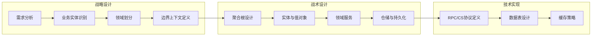

### 1.2 项目统一建模规范

| 建模要素 | 项目实现方式 | 技术承载 |
|:---------|:------------|:---------|
| **聚合根** | 核心业务实体 | Farm, PlayerActivity, UgcPublish, ClubLiveInfo |
| **实体** | 具有唯一标识的业务对象 | BaseActivity, ActivityUnit, ChatGroup |
| **值对象** | 不可变的数据传输对象 | Protobuf Message, Config类 |
| **领域服务** | 跨聚合协调逻辑 | Manager类 (FarmMgr, ActivityManager, ClubManager) |
| **应用服务** | 用例编排入口 | ServiceImpl + CSHandler |
| **仓储** | 数据持久化抽象 | DAO + TcaplusDB + Redis |
| **领域事件** | 模块解耦通知 | EventSwitch, @ClubEvent |
| **工厂** | 对象创建封装 | ActivityFactoryUtil, ReflectionFactory |

---

## 二、案例一：农场玩法（farmsvr）建模

### 2.1 业务领域分析

农场是元梦之星的核心副玩法，玩家拥有独立的农场空间，可进行种植、收获、装扮、好友互动（偷菜/施肥）、钓鱼、派对等丰富玩法。农场系统的特点是**状态丰富、实时性强、多玩家交互**。

**核心业务实体识别**：

| 业务实体 | 说明 | 关键属性 |
|:---------|:-----|:---------|
| **农场（Farm）** | 玩家的农场空间 | uid, 基础信息, 装扮数据, 种植数据 |
| **农田（FarmLand）** | 种植区域 | 作物类型, 成长状态, 种植时间 |
| **家具/装扮（Furniture）** | 农场装饰物 | itemId, 位置, 朝向 |
| **事件（FarmEvent）** | 农场中的随机事件 | 事件类型, 触发条件, 奖励 |
| **NPC农场** | 系统NPC的农场 | npcId, 模板, 互动规则 |
| **好友互动** | 偷菜/施肥/浇水 | 操作类型, 目标uid, CD时间 |

### 2.2 领域模型设计

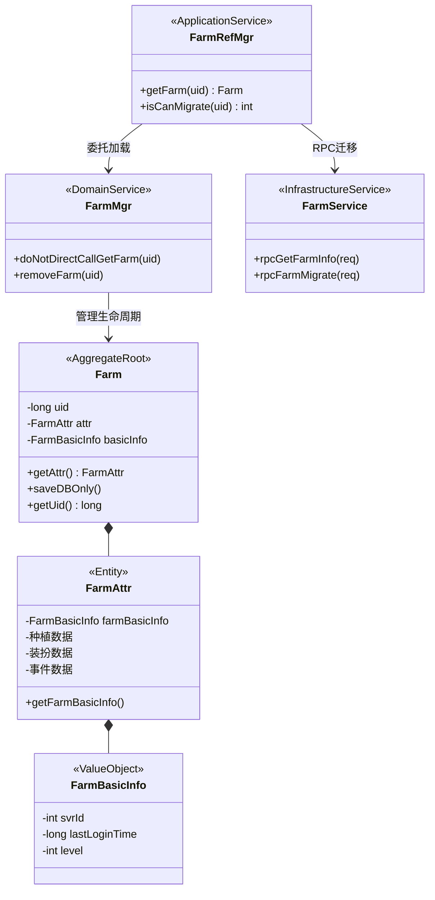

### 2.3 聚合根设计：Farm

Farm是农场领域的聚合根，管理一个玩家农场的所有状态。设计遵循以下原则：

**1. 单一入口原则**：所有对农场的操作通过 `FarmRefMgr.getFarm(uid)` 获取聚合根后进行，不允许直接操作内部实体。

**2. 数据迁移机制**：农场支持跨服务实例迁移，聚合根记录 `svrId` 标识当前所在的服务器实例：

```java
// FarmRefMgr.getFarm — 带迁移保护的聚合根加载
public Farm getFarm(long uid) {
    FarmMgr farmMgr = doNotDirectCall_getFarmMgr();
    
    // 1. 迁移保护检查
    var migrateRet = FarmRefMgr.getInstance().isCanMigrate(uid);
    if (migrateRet != 1) {
        farmMgr.removeFarm(uid);  // 清除残留数据
        return null;
    }
    
    // 2. 加载农场聚合根
    var farm = farmMgr.doNotDirectCallGetFarm(uid);
    
    // 3. 跨服迁移检测
    var lastSvrId = farm.getAttr().getFarmBasicInfo().getSvrId();
    if (lastSvrId != Framework.getInstance().getServerId()) {
        // RPC通知原服务器存盘并释放
        var rpcResult = FarmService.get().rpcFarmMigrate(req);
        if (rpcResult.isOK()) {
            farmMgr.removeFarm(farm.getUid());
            farm = farmMgr.doNotDirectCallGetFarm(uid);  // 重新加载最新数据
        }
        farm.getAttr().getFarmBasicInfo().setSvrId(Framework.getInstance().getServerId());
        farm.saveDBOnly();
    }
    return farm;
}
```

**3. gamesvr侧的玩家模块**：在gamesvr中，`PlayerFarmMgr` 作为玩家的农场管理模块，继承 `PlayerModule`，负责管理玩家农场的客户端交互、事件处理、Buff计算、天气系统等。

### 2.4 服务架构与分层

farmsvr采用独立微服务部署，内部遵循标准分层架构：

```
farmsvr/
├── framework/
│   └── FarmEngine.java          ← 服务引擎（初始化/启停）
├── farmservice/
│   ├── FarmService.java         ← LocalService（协程池，RPC处理）
│   ├── store/
│   │   ├── FarmRefMgr.java      ← 聚合根访问入口（含迁移保护）
│   │   └── FarmMgr.java         ← 农场内存管理
│   └── managers/
│       ├── GodFigureMgr.java    ← 祈福/神像子领域
│       └── ...                  ← 其他子领域Manager
```

**FarmEngine初始化流程**：

```java
public int init() {
    GuidManager.init();           // ID生成器
    CosManager.getInstance().init(); // COS对象存储
    ESManager.getInstance().init();  // ElasticSearch
    farmService = new FarmService();
    farmService.init();
    
    // 注册RPC服务
    rpcServer.attachExecutor(FarmService.class, farmService);
    rpcServer.attachExecutor(CommonService.class, farmService);
    rpcServer.addFilter(new CsForwardFilter());  // CS消息转发过滤器
    
    // 注册IRPC服务（G6引擎交互）
    g6IrpcServer.attachExecutor(FarmServerService.class, farmService);
    g6IrpcServer.attachExecutor(DsEventSubscriberService.class, farmService);
    g6IrpcServer.attachExecutor(DsCommonServerService.class, farmService);
    
    FlyJetty.create(FlyJettyPidEnum.farmSvr);  // HTTP管理接口
}
```

### 2.5 接口设计

农场系统采用**CS协议转发 + SS RPC**的双层通信模式：

| 协议层 | 说明 | 示例 |
|:-------|:-----|:-----|
| **CS协议** | 客户端→gamesvr | FarmCSHandler处理种植、收获、偷菜等请求 |
| **SS RPC** | gamesvr→farmsvr | `rpcGetFarmInfo`, `rpcFarmMigrate` |
| **G6 IRPC** | DS（专用服务器）→farmsvr | DsEventSubscriberService 处理DS事件 |

**CS请求处理流程**：

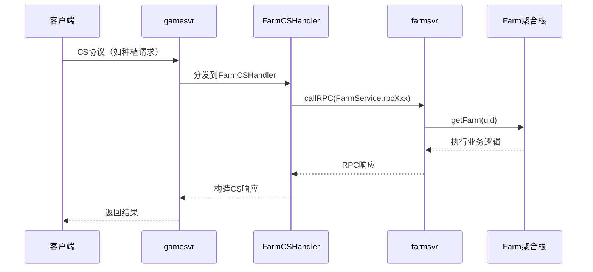

### 2.6 数据存储设计

| 存储层 | 用途 | 数据 |
|:-------|:-----|:-----|
| **TcaplusDB** | 持久化 | Farm表（uid为主键），含农场全量Protobuf数据 |
| **内存缓存** | 热数据 | FarmMgr维护的Farm对象Map |
| **Redis** | 迁移锁 | 迁移状态标记，防止并发迁移 |

### 2.7 设计亮点与权衡

| 设计决策 | 选择 | 原因 |
|:---------|:-----|:-----|
| **独立微服务** | farmsvr独立部署 | 农场玩法迭代频繁，独立部署减少主服影响 |
| **聚合根迁移** | 跨实例数据迁移 | 农场数据状态丰富，需要保证单点一致性 |
| **CS转发模式** | gamesvr转发到farmsvr | 复用gamesvr的会话管理和鉴权能力 |
| **G6 IRPC集成** | DS事件订阅 | 农场场景需要DS（专用服务器）支持3D实时渲染 |
| **预热机制** | FarmWarmUp启动预热 | 避免首次访问的冷启动延迟 |

---

## 三、案例二：活动系统（activitysvr）建模

### 3.1 业务领域分析

活动系统是游戏运营的核心支撑模块，需要支持**60+种活动类型**的快速上线和灵活配置。其核心挑战是在保持架构统一性的同时支持千变万化的活动玩法。

**核心业务实体识别**：

| 业务实体 | 说明 | 关键属性 |
|:---------|:-----|:---------|
| **活动（BaseActivity）** | 单个活动实例 | activityId, type, 生命周期状态 |
| **活动单元（ActivityUnit）** | 玩家活动数据 | id, 红点信息, 模块数据, 动态副标题 |
| **活动配置（ActivityMainConfig）** | 活动静态配置 | 类型, 时间范围, 奖励配置, 任务组 |
| **玩家活动（PlayerActivity）** | 玩家的活动聚合根 | uid, runningActivities, taskManager |
| **活动模块（BaseModule）** | 可插拔功能模块 | moduleType, moduleData |
| **活动任务（ActivityTask）** | 活动中的子任务 | taskId, 进度, 状态, 奖励 |

### 3.2 领域模型设计

活动系统的核心设计采用**工厂模式 + 策略模式 + 模块化组合**的三层抽象：

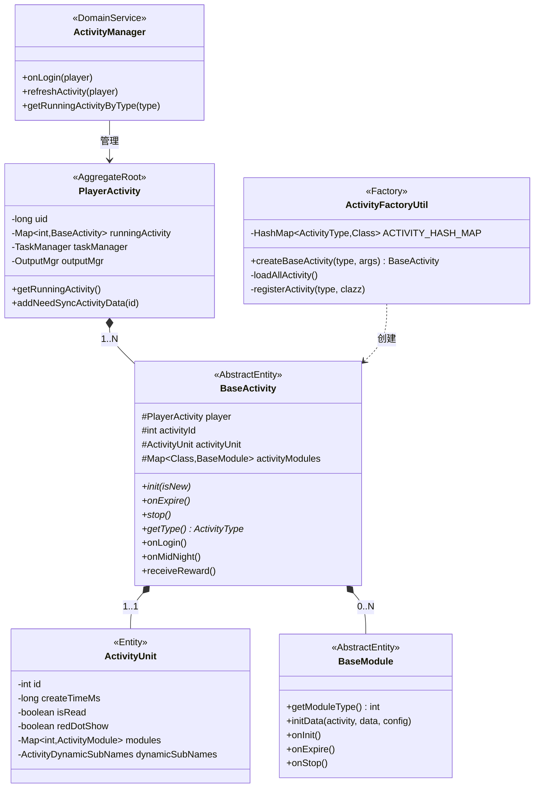

### 3.3 工厂模式：活动类型自动注册

`ActivityFactoryUtil` 通过**反射 + 自动注册**实现60+种活动类型的零配置接入：

```java
public class ActivityFactoryUtil {
    // 全部活动实例 <type, class>
    private static final HashMap<ActivityType, Class<? extends BaseActivity>> ACTIVITY_HASH_MAP = new HashMap<>();
    // 反射扫描工厂
    private static final ReflectionFactory<BaseActivity> REFLECTION_FACTORY_PROCESS = 
        new ReflectionFactory<>("com.tencent.wea.service.implement", BaseActivity.class);

    static {
        loadAllActivity();  // 静态初始化时自动扫描注册
    }

    // 自动扫描指定包下所有BaseActivity子类并注册
    private static void loadAllActivity() {
        for (Class<? extends BaseActivity> clazz : REFLECTION_FACTORY_PROCESS.getAllClasses()) {
            BaseActivity handler = constructors[0].newInstance(null, null);
            ActivityType type = handler.getType();  // 通过实例获取类型
            registerActivity(type, clazz);           // 注册到Map
        }
    }

    // 工厂方法：根据类型创建活动实例
    public static BaseActivity createBaseActivity(ActivityType activityType, Object... initArgs) {
        Class<? extends BaseActivity> clazz = ACTIVITY_HASH_MAP.get(activityType);
        return constructors[0].newInstance(initArgs);
    }
}
```

**设计优势**：
- **开闭原则**：新增活动类型只需继承 `BaseActivity` 并放到指定包下，无需修改工厂代码
- **零配置**：反射自动发现，避免手动注册遗漏
- **类型安全**：通过 `getType()` 抽象方法确保类型映射正确

### 3.4 模板方法模式：活动生命周期

`BaseActivity` 定义了活动的完整生命周期模板，子类只需覆写关注的阶段：

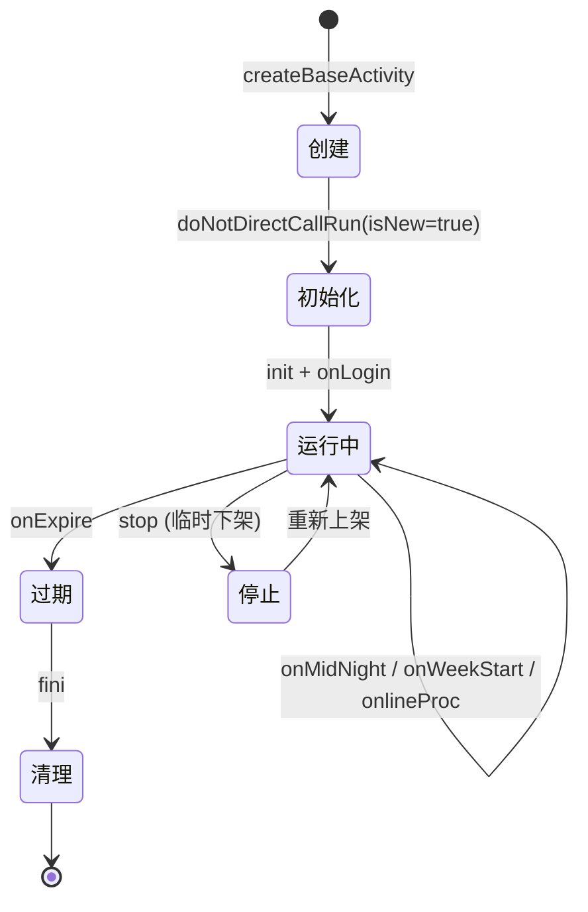

**生命周期方法对照表**：

| 生命周期方法 | 调用时机 | 职责 | 是否必须覆写 |
|:------------|:---------|:-----|:----------:|
| `init(isNew)` | 活动首次加载/重建 | 初始化模块、注册红点 | 可选 |
| `onLogin()` | 玩家登录 | 检查状态、刷新数据 | 可选 |
| `onMidNight()` | 每日凌晨 | 清理日数据、刷新红点 | 可选 |
| `onWeekStart()` | 每周开始 | 清理周数据 | 可选 |
| `onlineProc()` | 在线定时调用 | 轻量级刷新（禁RPC） | 可选 |
| `onExpire()` | 活动到期 | 过期结算逻辑 | **必须** |
| `stop()` | 活动临时下架 | 暂停逻辑 | **必须** |
| `getType()` | 类型标识 | 返回ActivityType | **必须** |
| `receiveReward()` | 领奖 | 发放奖励 | 可选 |

### 3.5 模块化组合：可插拔功能模块

activitysvr版本的 `BaseActivity` 引入了**模块化组合模式**，活动可按需加载功能模块：

```java
// 活动中加载模块
protected void initModule() throws Exception {
    loadModule(RaffleModule.class);   // 抽奖模块
    loadModule(TaskModule.class);     // 任务模块
    loadModule(ShopModule.class);     // 商店模块
}

// 模块加载机制
protected void loadModule(Class<? extends BaseModule> moduleClass) throws Exception {
    BaseModule module = moduleClass.getConstructor().newInstance();
    int type = module.getModuleType();
    
    // 从ActivityUnit中获取模块持久化数据
    ActivityModule moduleAttr = activityUnit.getModules().get(type);
    if (moduleAttr == null) {
        moduleAttr = new ActivityModule();
        activityUnit.getModules().put(type, moduleAttr);
    }
    
    // 获取模块配置
    ActivityModuleConfig moduleConfig = getModuleConfig(type);
    module.initData(this, moduleAttr.getModuleData(), moduleConfig);
    activityModules.put(moduleClass, module);
}

// 使用模块
RaffleModule raffle = getModule(RaffleModule.class);
raffle.doRaffle(player, raffleId);
```

### 3.6 双服务架构

活动系统采用**gamesvr + activitysvr** 双服务架构，分别处理不同场景：

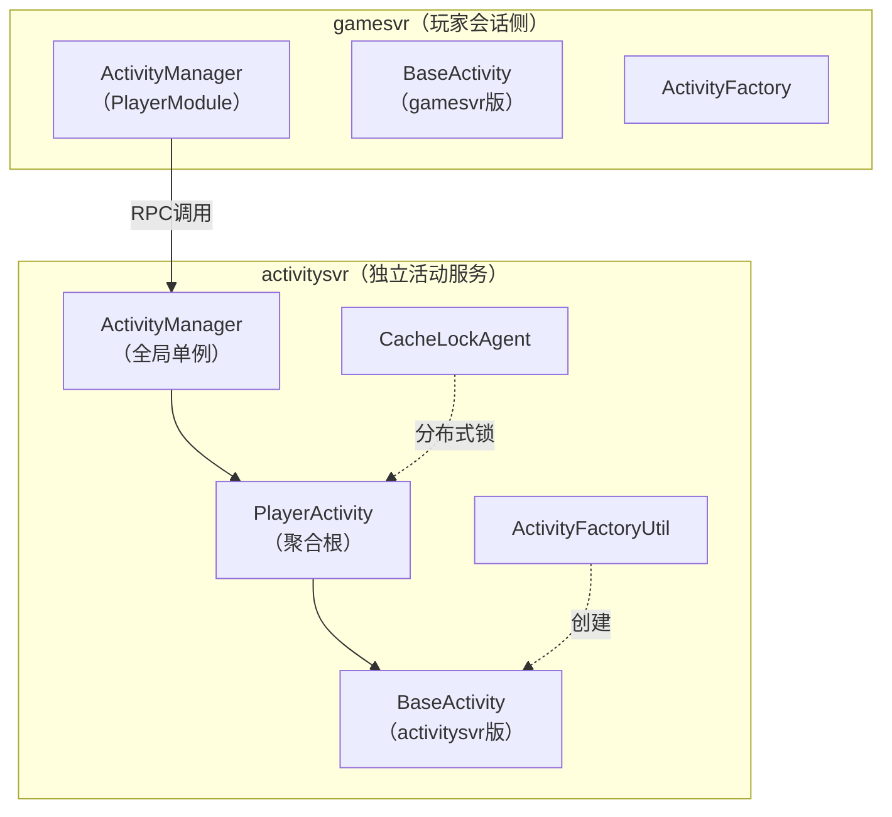

| 服务 | 职责 | 活动类型 |
|:-----|:-----|:---------|
| **gamesvr** | 处理与玩家会话紧耦合的活动 | 需要实时访问玩家数据的活动 |
| **activitysvr** | 处理独立运算的活动 | 不依赖玩家实时数据的运营活动 |

### 3.7 数据存储设计

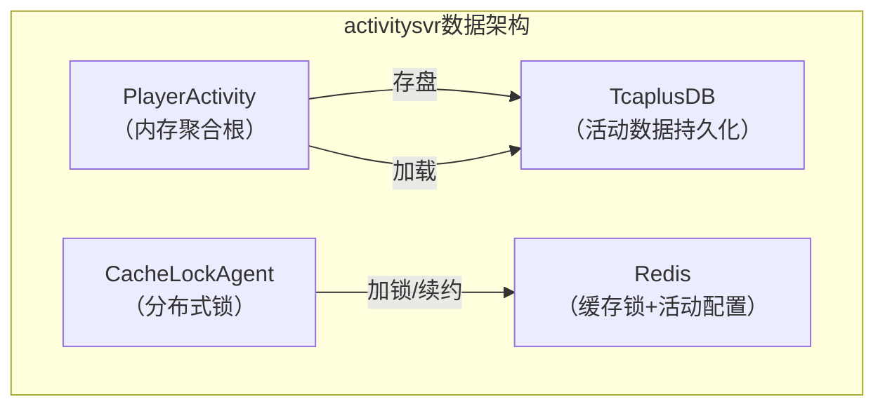

**CacheLockAgent保护**：activitysvr通过分布式锁确保同一玩家的活动数据不会被多个服务实例并发修改：

```java
cacheLockAgent = new CacheLockAgent(
    ActivityService.get(),
    DistributedLockMgr.getInstance(),
    true,                               // 启用
    LocalServiceType.LOCAL_ACTIVITYSVR_ACTIVITY_SERVICE,
    cachelockValidTime,                 // 缓存有效时间
    cachelockDBValidTime,               // DB有效时间
    true                                // 支持抢占
);
```

### 3.8 设计亮点与权衡

| 设计决策 | 选择 | 原因 |
|:---------|:-----|:-----|
| **反射工厂** | 自动扫描注册 | 60+活动类型手动注册易遗漏，反射保证全覆盖 |
| **模板方法** | 统一生命周期 | 活动行为差异大但生命周期统一，模板方法最合适 |
| **模块化组合** | 可插拔模块 | 不同活动共享相同功能（如抽奖、任务），组合优于继承 |
| **双服务** | gamesvr + activitysvr | 分离会话相关活动和独立运算活动，降低耦合 |
| **红点管理** | 统一红点框架 | 60+活动的红点逻辑统一抽象，减少重复代码 |

---

## 四、案例三：UGC系统（ugcsvr）建模

### 4.1 业务领域分析

UGC（用户生成内容）系统支持玩家创作和发布自定义地图，涵盖**地图创作 → 版本管理 → 发布审核 → 推荐分发 → 弹幕评论**的完整内容生命周期。UGC是元梦之星差异化竞争力的核心模块之一。

**核心业务实体识别**：

| 业务实体 | 说明 | 关键属性 |
|:---------|:-----|:---------|
| **UGC地图（UgcPublish）** | 已发布的地图作品 | mapId, 作者uid, 版本, 审核状态 |
| **地图版本（MapVersion）** | 地图的历史版本 | versionId, 版本号, 提交时间 |
| **弹幕（Danmu）** | 地图中的弹幕消息 | 弹幕内容, 发送者, 时间位置 |
| **评论/评分** | 用户对地图的评价 | 评分, 评论内容, 点赞数 |
| **推荐配置** | 运营推荐规则 | 推荐权重, 展示位置, 生效时间 |
| **创作者（Creator）** | 地图作者信息 | uid, 创作等级, 作品数 |

### 4.2 领域模型设计

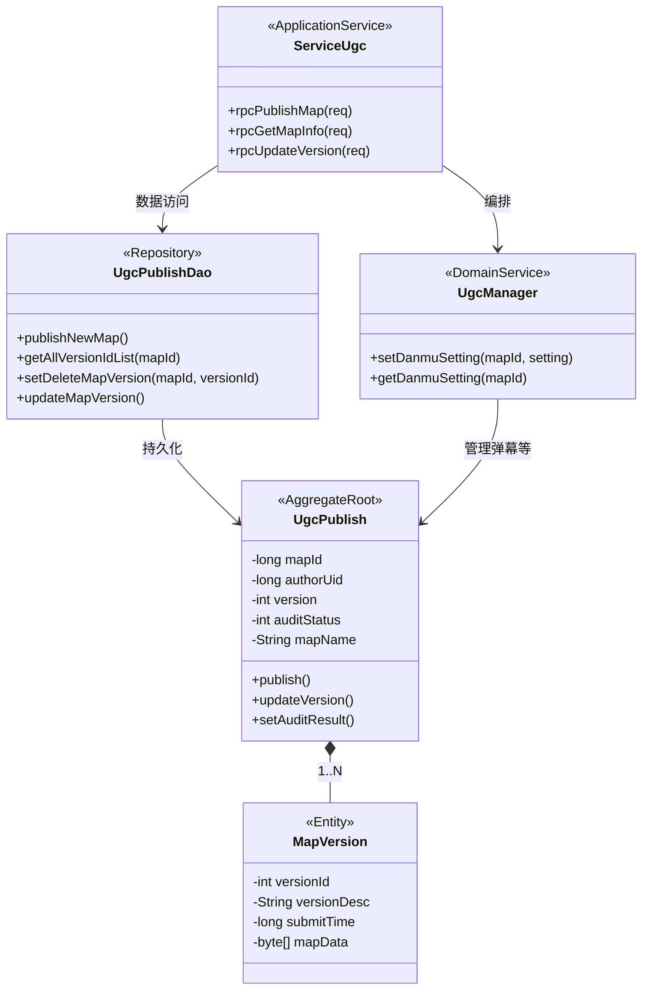

### 4.3 聚合根设计：UgcPublish

UGC系统的聚合根是 `UgcPublish`，代表一个已发布的地图作品。围绕它组织了版本管理、审核、弹幕等子领域。

**版本管理机制**：
```java
// UgcPublishDao — 版本管理核心逻辑
public class UgcPublishDao {
    
    // 发布新地图
    public void publishNewMap(long mapId, long authorUid, byte[] mapData) {
        // 1. 写入地图基础信息
        // 2. 创建初始版本（version = 1）
        // 3. 设置审核状态为待审
    }
    
    // 获取地图的所有版本列表
    public List<Integer> getAllVersionIdList(long mapId) {
        // 按时间倒序返回所有版本ID
    }
    
    // 软删除指定版本
    public void setDeleteMapVersion(long mapId, int versionId) {
        // 标记删除，保留数据用于回溯
    }
    
    // 更新地图版本
    public void updateMapVersion(long mapId, int newVersion, byte[] mapData) {
        // 1. 创建新版本记录
        // 2. 更新地图当前版本号
        // 3. 提交审核
    }
}
```

### 4.4 领域服务：弹幕管理

`UgcManager` 负责弹幕设置等跨实体协调逻辑：

```java
public class UgcManager {
    // 设置弹幕配置
    public void setDanmuSetting(long mapId, DanmuSetting setting) {
        // 1. 校验地图是否存在且有权限
        // 2. 更新弹幕开关/过滤规则
        // 3. 通知相关在线玩家
    }
    
    // 获取弹幕配置
    public DanmuSetting getDanmuSetting(long mapId) {
        // 从缓存/DB获取弹幕设置
    }
}
```

### 4.5 接口设计

UGC系统接口分为**创作者侧**和**玩家侧**：

| 接口类别 | 协议方式 | 核心接口 | 说明 |
|:---------|:---------|:---------|:-----|
| **地图发布** | SS RPC | rpcPublishMap | 创作者发布新地图 |
| **版本管理** | SS RPC | rpcUpdateVersion, rpcGetAllVersions | 版本迭代管理 |
| **地图查询** | SS RPC | rpcGetMapInfo | 获取地图详情 |
| **弹幕设置** | SS RPC | rpcSetDanmuSetting | 作者配置弹幕规则 |
| **推荐列表** | SS RPC | rpcGetRecommendList | 获取推荐地图列表 |

**RPC消息转发机制**：

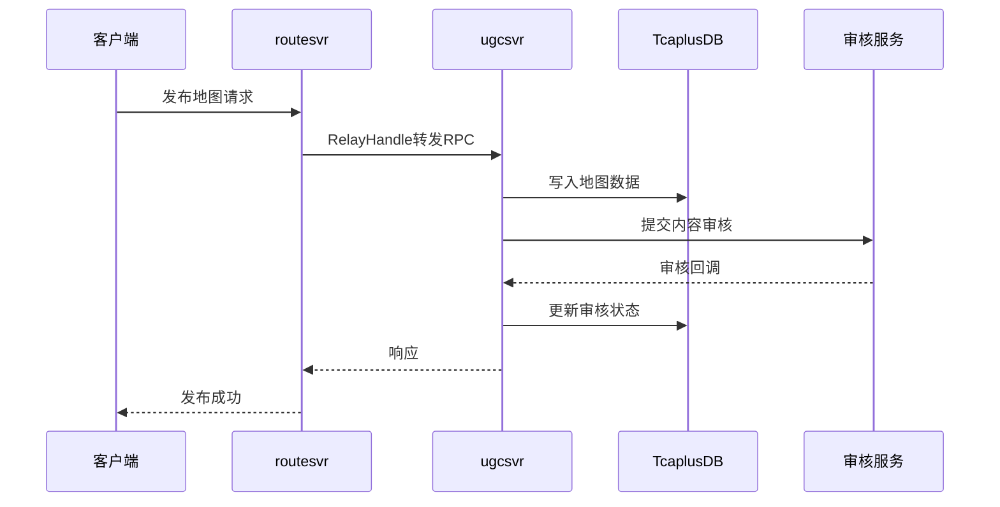

### 4.6 数据存储设计

| 存储层 | 数据类型 | 说明 |
|:-------|:---------|:-----|
| **TcaplusDB** | 地图元数据 | mapId, authorUid, version, status |
| **COS对象存储** | 地图二进制数据 | 地图场景文件、缩略图、资源包 |
| **ElasticSearch** | 搜索索引 | 地图名称、标签、描述的全文检索 |
| **Redis** | 热数据缓存 | 热门地图信息、推荐列表、弹幕设置 |
| **MySQL** | 运营数据 | 推荐配置、审核记录、统计数据 |

**COS + ES集成初始化**（FarmEngine中也体现了类似集成）：
```java
// 服务启动时初始化外部存储
CosManager.getInstance().init();     // COS对象存储客户端
ESManager.getInstance().init();      // ElasticSearch客户端
```

### 4.7 设计亮点与权衡

| 设计决策 | 选择 | 原因 |
|:---------|:-----|:-----|
| **版本化管理** | 多版本共存 + 软删除 | 支持版本回溯和审核回退 |
| **审核异步** | 异步回调模式 | 审核耗时长，不能阻塞发布流程 |
| **混合存储** | TcaplusDB + COS + ES | 元数据、二进制、搜索各取所长 |
| **弹幕独立管理** | UgcManager统一管理 | 弹幕逻辑跨地图通用，抽离复用 |

---

## 五、案例四：社交系统（clubsvr/chatsvr）建模

### 5.1 业务领域分析

社交系统是元梦之星的核心互动支撑，包括**公会（Club）**和**聊天（Chat）**两大领域，涉及关系建模、群组管理、消息分发等复杂业务。

**核心业务实体识别**：

| 业务实体 | 说明 | 关键属性 |
|:---------|:-----|:---------|
| **公会（Club）** | 玩家组织 | clubId, 创建者, 成员列表, 公会等级 |
| **公会成员（ClubMember）** | 公会内的成员 | uid, 角色(会长/管理/成员), 加入时间 |
| **聊天组（ChatGroup）** | 消息频道 | groupId, 成员列表, 频道类型 |
| **消息（ChatMessage）** | 单条消息 | msgId, 发送者, 内容, 时间戳 |
| **公会活动（ClubLiveInfo）** | 公会直播/活动 | liveId, 状态, 参与者 |
| **社区频道（CommunityChannel）** | 分类讨论频道 | channelId, 类型, 权限设置 |

### 5.2 领域模型设计

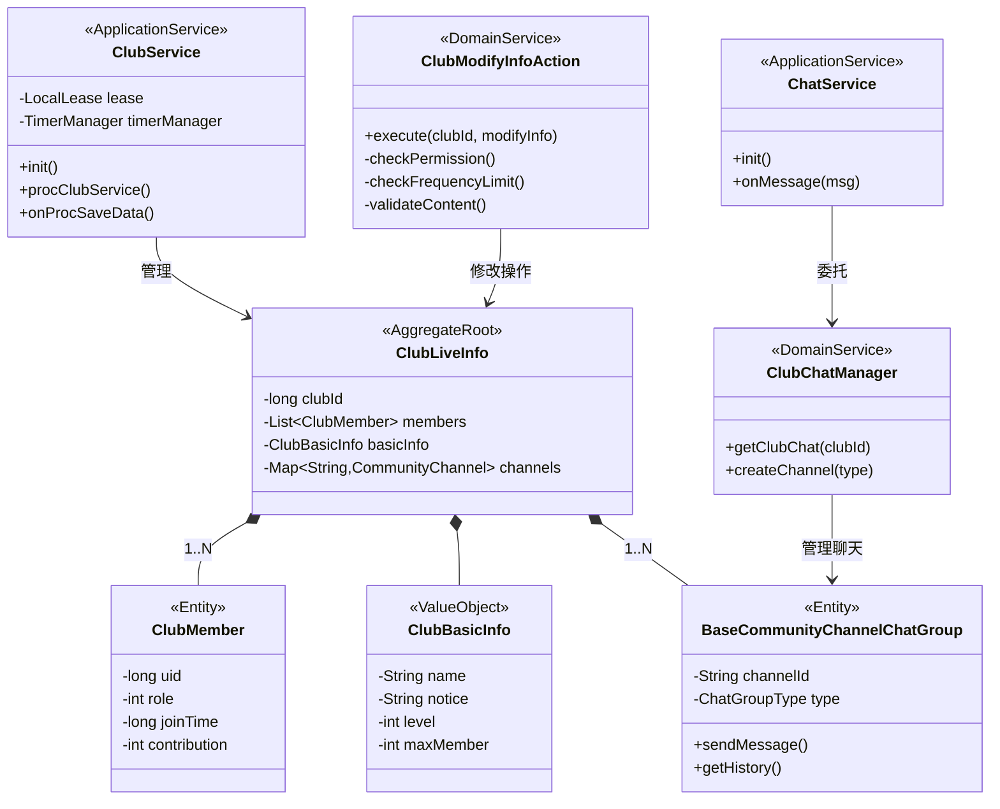

### 5.3 Action模式：操作封装

公会系统使用**Action模式**将每个操作封装为独立的类，实现操作的职责单一和测试友好：

```java
// ClubModifyInfoAction — 修改公会信息的操作封装
public class ClubModifyInfoAction {
    
    public NKErrorCode execute(long clubId, ModifyInfo modifyInfo) {
        // 1. 权限校验
        NKErrorCode permCheck = checkPermission(clubId, operator);
        if (permCheck != NKErrorCode.OK) return permCheck;
        
        // 2. 频率限制（防刷）
        NKErrorCode freqCheck = checkFrequencyLimit(operator);
        if (freqCheck != NKErrorCode.OK) return freqCheck;
        
        // 3. 内容合规校验
        NKErrorCode contentCheck = validateContent(modifyInfo);
        if (contentCheck != NKErrorCode.OK) return contentCheck;
        
        // 4. 执行修改
        club.getBasicInfo().setName(modifyInfo.getName());
        club.getBasicInfo().setNotice(modifyInfo.getNotice());
        
        // 5. 事件通知
        EventSwitch.fireClubEvent(ClubEventType.INFO_MODIFIED, clubId);
        
        return NKErrorCode.OK;
    }
}
```

### 5.4 租约管理：有状态服务

ClubService通过**租约（Lease）**机制实现公会数据的单点管理：

```java
public class ClubService extends LocalService {
    private LocalLease lease;
    private TimerManager timerManager;
    
    public int init() {
        // 1. 初始化租约管理
        lease = new LocalLease(serviceType);
        lease.init();
        
        // 2. 注册定时任务
        timerManager = new TimerManager();
        timerManager.registerTimer("procClubService", this::procClubService, 1000);
        timerManager.registerTimer("saveData", this::onProcSaveData, 60000);
        
        // 3. 注册RPC处理器
        rpcServer.attachExecutor(ClubRpcService.class, this);
    }
    
    // 定时巡检：检查租约有效性、处理过期事件
    public void procClubService() {
        lease.renew();  // 续约
        // 处理公会定时逻辑（如公会活动开始/结束）
    }
}
```

### 5.5 社区频道：聊天组继承体系

聊天系统通过 `BaseCommunityChannelChatGroup` 抽象基类支持多种频道类型：

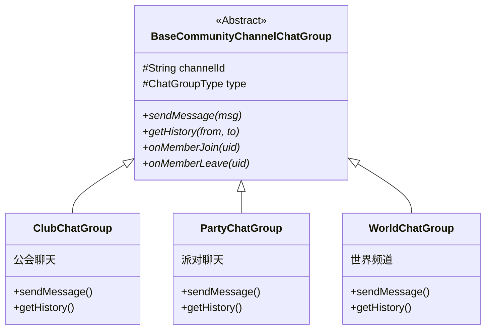

### 5.6 接口设计

| 服务 | 接口 | 协议方式 | 说明 |
|:-----|:-----|:---------|:-----|
| **clubsvr** | CreateClub | SS RPC | 创建公会 |
| **clubsvr** | ModifyClubInfo | SS RPC | 修改公会信息（Action封装） |
| **clubsvr** | JoinClub/LeaveClub | SS RPC | 加入/退出公会 |
| **chatsvr** | SendMessage | SS RPC | 发送聊天消息 |
| **chatsvr** | GetHistory | SS RPC | 获取历史消息 |
| **chatsvr** | CreateChannel | SS RPC | 创建频道 |

### 5.7 数据存储设计

| 存储层 | 数据类型 | 说明 |
|:-------|:---------|:-----|
| **TcaplusDB** | 公会数据 | 公会信息、成员列表（clubId为主键） |
| **Redis** | 在线状态 | 公会成员在线状态、消息队列 |
| **MySQL** | 聊天记录 | 历史消息持久化，支持分页查询 |

### 5.8 设计亮点与权衡

| 设计决策 | 选择 | 原因 |
|:---------|:-----|:-----|
| **Action模式** | 操作独立封装 | 公会操作种类多且复杂，Action解耦利于维护 |
| **租约管理** | 单点有状态 | 公会数据一致性要求高，租约避免多实例冲突 |
| **频道继承体系** | 基类 + 多子类 | 不同频道行为差异大但接口统一 |
| **事件驱动** | EventSwitch | 公会操作需通知多个子系统，事件解耦 |
| **clubsvr/chatsvr分离** | 职责分离 | 公会管理（低频写）和聊天消息（高频读写）特性不同 |

---

## 六、横向对比分析

### 6.1 四大业务域建模策略对比

| 对比维度 | farmsvr | activitysvr | ugcsvr | clubsvr/chatsvr |
|:---------|:--------|:------------|:-------|:----------------|
| **聚合根** | Farm | PlayerActivity | UgcPublish | ClubLiveInfo |
| **主要模式** | 迁移保护 | 工厂+策略+模块化 | 版本管理 | Action+租约 |
| **数据一致性** | 跨实例迁移 | 分布式锁 | 审核异步 | 租约单点 |
| **扩展方式** | 新Manager | 新Activity子类 | DAO扩展 | 新Action类 |
| **通信模式** | CS转发+G6 IRPC | 双服务RPC | RPC+审核回调 | RPC+事件驱动 |
| **存储策略** | Tcaplus+内存 | Tcaplus+Redis锁 | Tcaplus+COS+ES | Tcaplus+Redis+MySQL |
| **迭代频率** | 版本迭代 | 极高（运营驱动） | 中等 | 稳定 |

### 6.2 共性设计模式

四个领域中反复出现的共性模式：

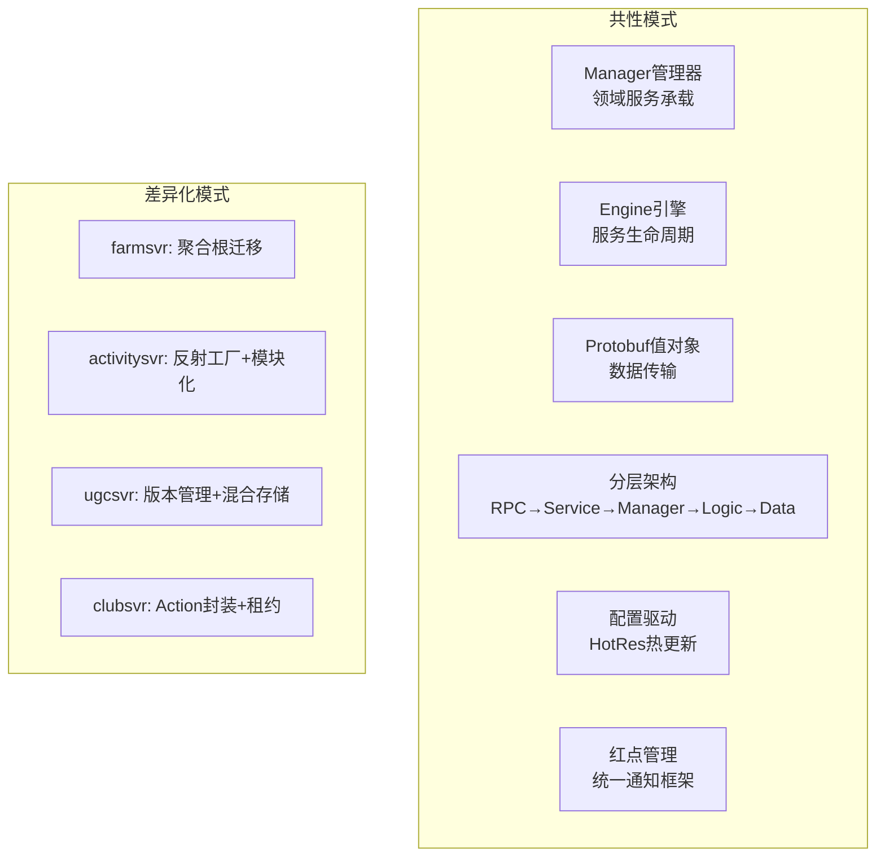

### 6.3 DDD实践程度评估

| DDD概念 | 项目实践程度 | 评价 |
|:--------|:------------|:-----|
| **限界上下文** | ★★★★★ | 微服务边界清晰，每个svr就是一个限界上下文 |
| **聚合根** | ★★★★☆ | Farm/PlayerActivity等核心实体有明确的聚合根语义 |
| **值对象** | ★★★★☆ | Protobuf Message天然满足值对象不可变特性 |
| **领域事件** | ★★★☆☆ | EventSwitch有事件机制，但未全面使用 |
| **仓储模式** | ★★★☆☆ | DAO层存在但未严格抽象Repository接口 |
| **工厂模式** | ★★★★★ | ActivityFactoryUtil是教科书级的反射工厂实现 |
| **领域服务** | ★★★★☆ | Manager类承担领域服务职责，职责划分合理 |
| **应用服务** | ★★★★☆ | Service层编排用例，不含业务逻辑 |

---

## 七、改进空间与面试专栏

### 7.1 改进建议

#### 7.1.1 仓储层抽象不足

**现状**：各服务的数据访问直接通过DAO/TcaplusDB操作，缺少统一的Repository接口抽象。

**建议**：
```java
// 理想的仓储抽象
public interface FarmRepository {
    Farm findById(long uid);
    void save(Farm farm);
    void remove(long uid);
}

// 实现类
public class TcaplusFarmRepository implements FarmRepository {
    // 具体TcaplusDB操作
}
```

**收益**：便于单元测试Mock、更容易切换存储引擎。

#### 7.1.2 领域事件未全面推广

**现状**：仅clubsvr使用了EventSwitch事件机制，其他服务更多依赖直接RPC调用。

**建议**：引入统一的领域事件总线，在活动系统、农场系统中也采用事件驱动：
- 活动过期事件 → 触发奖励结算、数据清理
- 农场操作事件 → 触发成就统计、好友通知

#### 7.1.3 活动系统继承层次过深

**现状**：60+活动子类继承BaseActivity，虽然引入了模块化组合，但部分活动仍存在继承层次过深的问题。

**建议**：进一步推广模块化组合模式，将更多共性逻辑抽取为可插拔模块，减少继承深度。

#### 7.1.4 聚合根边界可优化

**现状**：部分聚合根（如Farm）包含了过多的子实体，导致加载/存储粒度较粗。

**建议**：考虑延迟加载策略，将低频访问的子领域数据（如历史记录）独立存储。

### 7.2 面试话术

#### Q1：你们的业务建模方法论是什么？

> 我们采用自顶向下+自底向上的混合建模方法。战略层面，按业务域将系统拆分为60+微服务，每个服务对应一个限界上下文——比如farmsvr负责农场玩法，activitysvr负责运营活动，clubsvr负责社交。战术层面，每个服务内部围绕聚合根组织领域模型，比如Farm是农场领域的聚合根，PlayerActivity是活动领域的聚合根。核心设计原则是"高内聚低耦合"，通过Manager类承担领域服务职责，通过Protobuf定义统一的值对象。

#### Q2：如何支持60+种活动类型的快速迭代？

> 活动系统的核心设计是"工厂+策略+模块化组合"三层抽象。首先通过反射工厂（ActivityFactoryUtil）自动扫描注册所有BaseActivity子类，新增活动只需继承基类并放到指定包下，零配置接入。其次通过模板方法模式统一生命周期（init → onLogin → onMidNight → onExpire），子类只覆写差异部分。最后通过可插拔模块（BaseModule）复用共性功能，比如抽奖模块、任务模块可以组合到不同活动中。这种设计让新活动的开发周期从1周降到1-2天。

#### Q3：如何保证分布式场景下的数据一致性？

> 不同业务域采用不同策略。农场系统通过"聚合根迁移"保证单点写入——Farm对象记录所在服务实例ID，访问时检测迁移，通过RPC通知原实例存盘释放后重新加载。活动系统通过CacheLockAgent分布式锁保护玩家活动数据的并发安全。公会系统通过租约（Lease）机制确保公会数据只被一个服务实例管理。共同点是都遵循"单写者原则"，只是实现手段因业务特性不同而有所区分。

#### Q4：DDD在你们项目中落地的程度如何？

> 我们务实地采用了DDD的核心理念，但没有教条式地照搬。做得好的方面：限界上下文通过微服务边界清晰划分，每个svr就是一个BC；聚合根语义明确，Farm/PlayerActivity等核心实体有完善的不变性保护；工厂模式通过反射实现了教科书级的自动注册。可以改进的方面：仓储层抽象不够统一，部分DAO直接暴露了存储细节；领域事件机制只在clubsvr中充分使用，其他服务还是以直接RPC调用为主。总体来说，我们的DDD实践偏务实，核心理念贯穿始终，但在具体实现上因游戏业务特性做了适当取舍。

---

## 八、总结

本文通过四个典型业务域的建模案例，展现了元梦之星项目在业务建模上的核心方法论和设计决策：

| 维度 | 总结 |
|:-----|:-----|
| **建模方法** | 战略层面微服务拆分 + 战术层面DDD实践 |
| **核心模式** | 工厂模式、模板方法、策略模式、Action模式、模块化组合 |
| **一致性保障** | 聚合根迁移、分布式锁、租约管理三种策略因地制宜 |
| **存储策略** | 按数据特性混合使用TcaplusDB/Redis/MySQL/COS/ES |
| **扩展性设计** | 反射工厂零配置接入、模块化组合自由组装、Action独立封装 |
| **务实DDD** | 核心理念贯穿，实现方式因业务特性灵活取舍 |

四个业务域的建模实践证明：好的领域模型不是学术上的完美DDD，而是在**开发效率、运行性能、团队协作**之间找到最佳平衡点的务实设计。