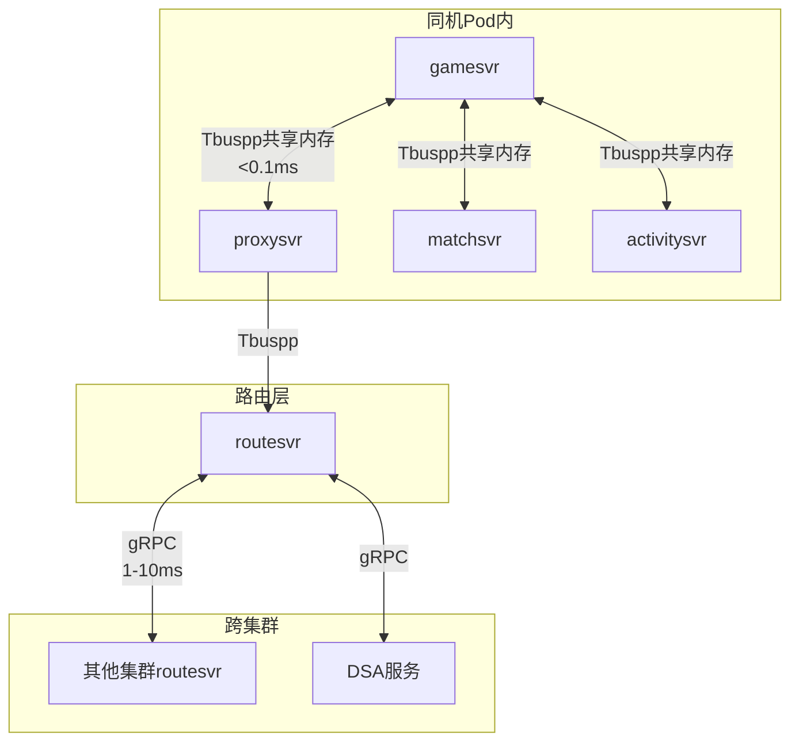
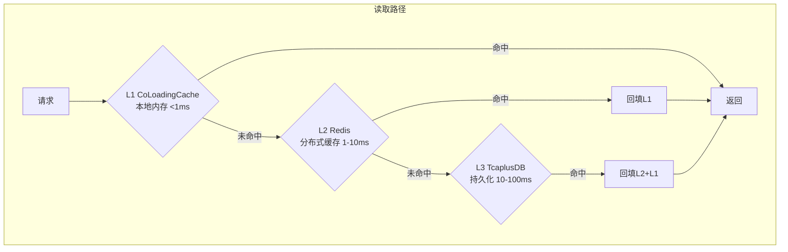
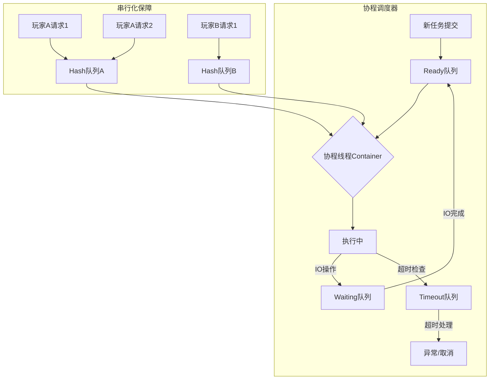
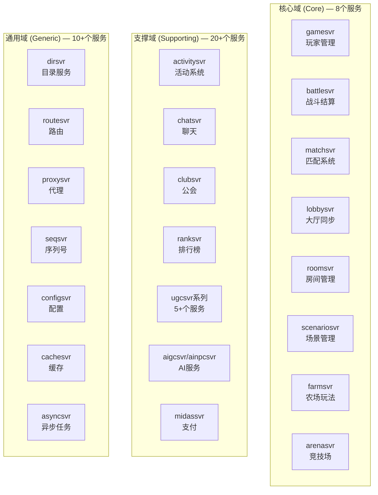
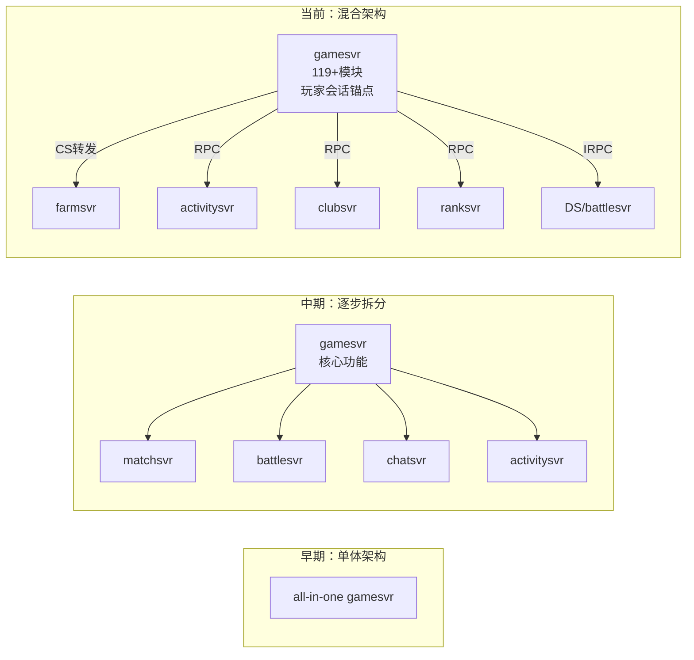
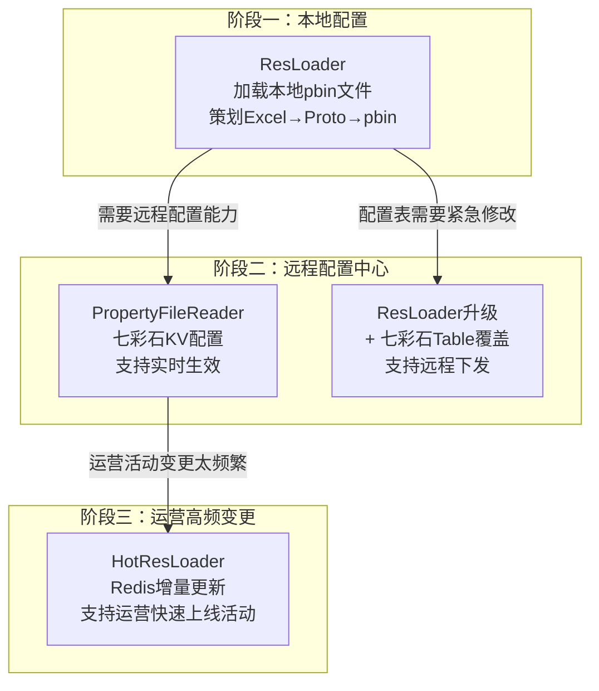
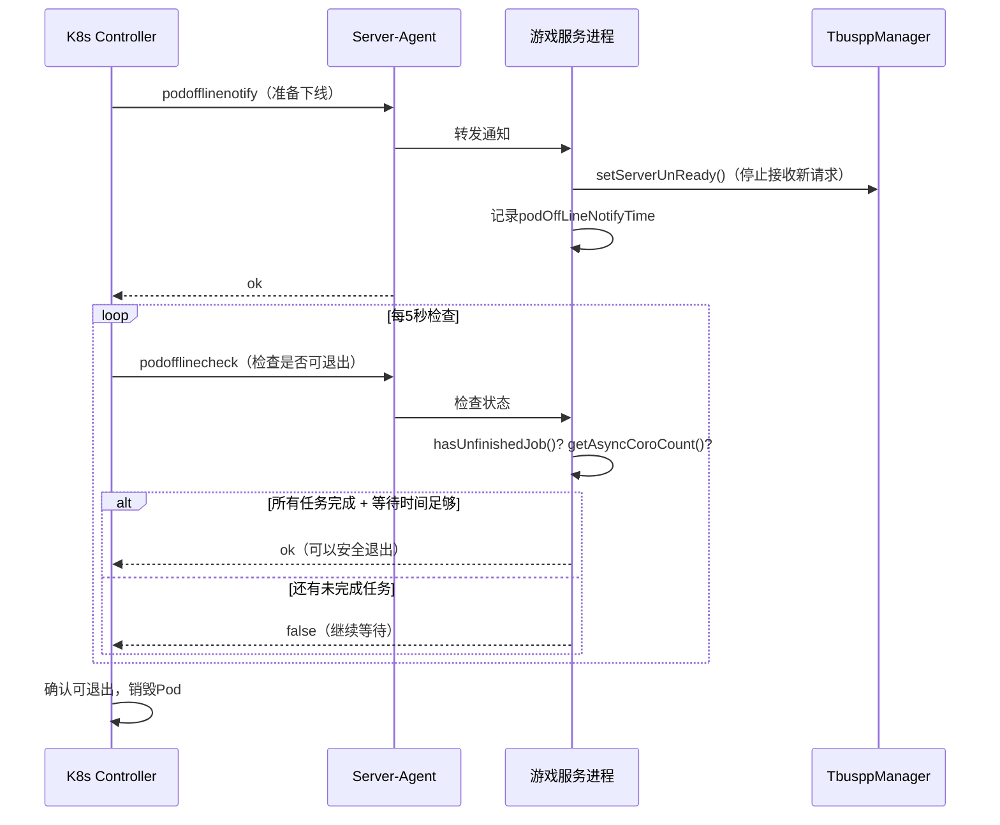
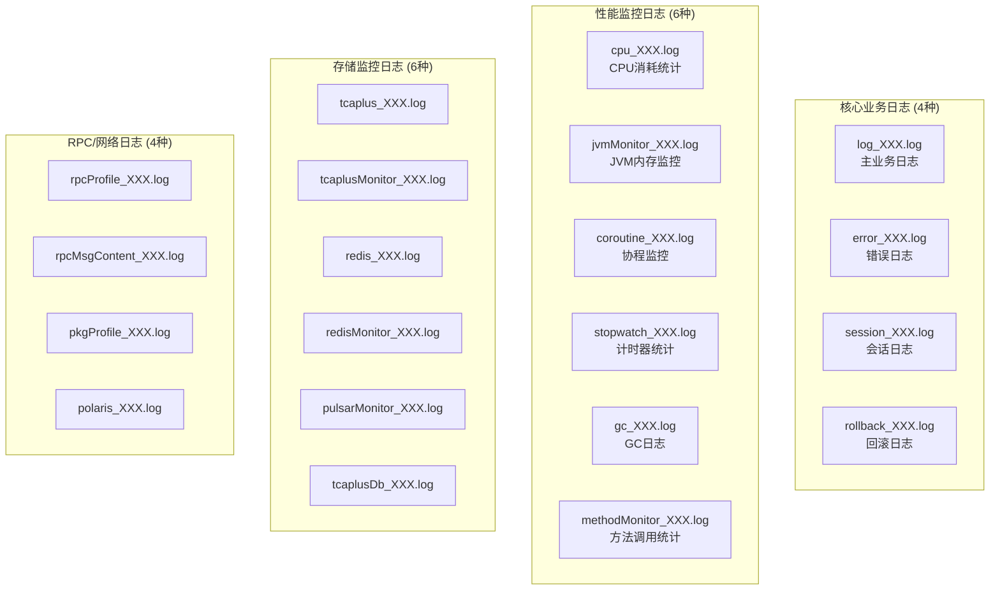
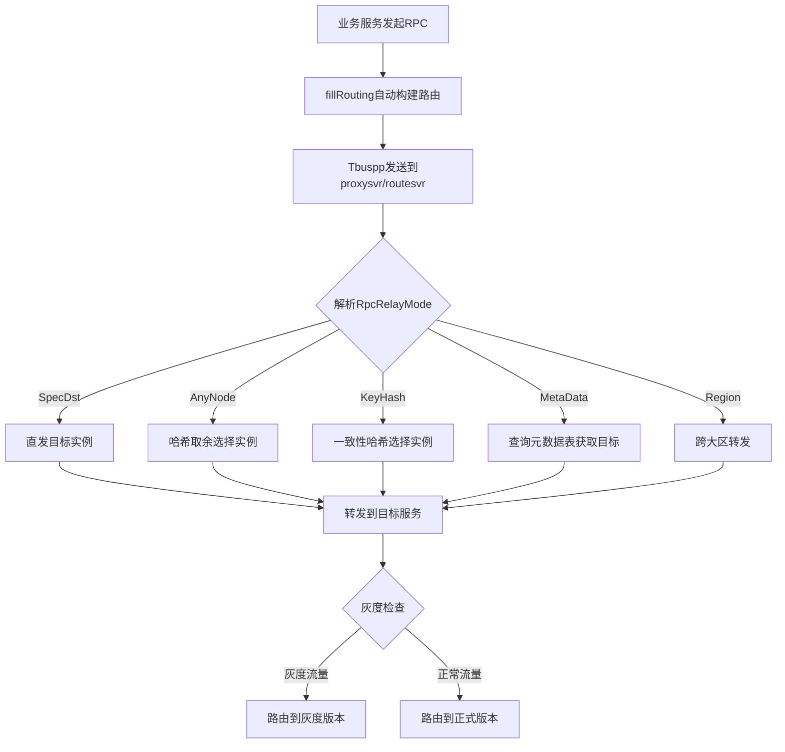
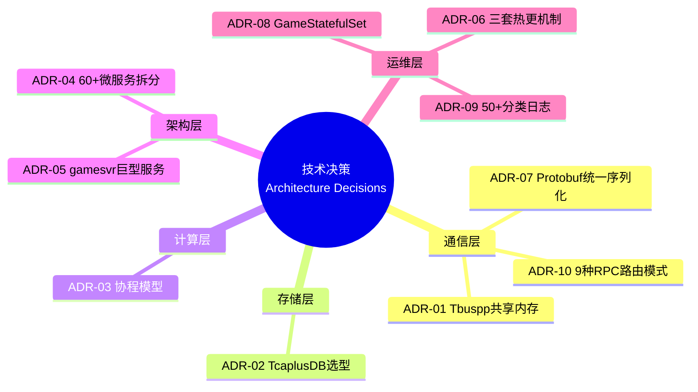

# 技术决策分析（Architecture Decision Records）

本文采用ADR（Architecture Decision Record）格式，系统梳理元梦之星项目（letsgo_server）中10个关键技术决策的**背景 → 方案对比 → 决策 → 后果**，展现"为什么这么做"的技术判断力。每个决策覆盖原理介绍、实际使用、进阶分析以及改进空间，为面试中"技术选型"类问题提供深度素材。

---

## 目录

1. [ADR-01：为什么选Tbuspp共享内存而非gRPC直连？](#adr-01)
2. [ADR-02：为什么选TcaplusDB而非MySQL？](#adr-02)
3. [ADR-03：为什么采用协程而非多线程？](#adr-03)
4. [ADR-04：60+微服务是否过度拆分？](#adr-04)
5. [ADR-05：gamesvr为何仍是巨型服务？](#adr-05)
6. [ADR-06：三套热更机制并存的历史原因与统一规划](#adr-06)
7. [ADR-07：为什么选Protobuf而非JSON/Thrift？](#adr-07)
8. [ADR-08：K8s GameStatefulSet vs 普通Deployment？](#adr-08)
9. [ADR-09：日志50+文件分类 vs 统一日志的取舍](#adr-09)
10. [ADR-10：9种RPC路由模式的设计决策](#adr-10)

---

## ADR-01：为什么选Tbuspp共享内存而非gRPC直连？ {#adr-01}

### 1.1 背景

元梦之星需要支撑**百万级DAU**的实时游戏通信，60+微服务之间存在高频、低延迟的RPC调用需求。服务间通信方案的选择直接影响整体性能和架构可维护性。

### 1.2 方案对比

| 对比维度 | Tbuspp共享内存 | gRPC直连 | 自研TCP框架 |
|:---------|:-------------|:---------|:-----------|
| **通信延迟** | **<0.1ms**（同机共享内存） | 1-10ms（网络TCP） | 1-5ms |
| **序列化开销** | 零拷贝传输 | Protobuf序列化/反序列化 | 自定义编解码 |
| **服务发现** | 内置NameServer | 需要额外注册中心 | 需要自建 |
| **负载均衡** | 内置多种路由策略 | 客户端/服务端均衡 | 需要自建 |
| **跨机通信** | 支持（自动降级为TCP） | 原生支持 | 原生支持 |
| **生态成熟度** | 腾讯内部成熟 | 业界通用标准 | 无生态 |
| **调试工具** | 内部工具链 | 丰富（grpcurl、Postman） | 缺乏 |
| **K8s适配** | 需要适配 | 原生支持 | 需要适配 |

### 1.3 决策

**选择Tbuspp共享内存作为主要服务间通信方式，同时在routesvr层支持gRPC作为跨集群通信的补充。**

核心理由：
1. **极致性能**：游戏服务器对延迟极其敏感，共享内存通信的延迟在0.1ms以内，比gRPC的网络往返低一个数量级
2. **零拷贝优势**：同机部署时数据直接通过共享内存传递，避免了序列化/反序列化和网络协议栈的开销
3. **腾讯生态配套**：Tbuspp与TSF4G2框架深度集成，提供成熟的服务发现、负载均衡、监控能力

### 1.4 项目中的使用

**基础通信初始化**：

```java
// TbusppManager — 服务间通信核心管理器
public class TbusppManager implements NtfEventListener {
    // 路由策略枚举
    static public enum RouteType {
        Random(1),    // 随机路由
        MHash(3),     // 模哈希
        CHash(4),     // 一致性哈希
        Master(5);    // 主节点
    }
    
    // 服务注册
    public void registerService(String serviceName, String userData);
    
    // 消息收发
    public int sendData(String serviceName, ByteBuf data, MsgParam param);
    public int recvData(byte[] data, MsgDesc desc);
}
```

**混合通信架构**：项目实际采用Tbuspp + gRPC的混合模式。同机服务间使用Tbuspp共享内存通信；routesvr作为网关，使用gRPC与其他集群的服务通信；DSA/DS通过IRPC（基于Tbuspp传输）进行交互。



### 1.5 进阶分析

**Tbuspp的三层通信模型**：
- **Layer 1 - 共享内存通道**：同机进程间，消息直接写入共享内存队列，接收方轮询读取
- **Layer 2 - TCP通道**：跨机通信自动降级为TCP传输，对业务透明
- **Layer 3 - Agent代理**：Tbuspp Agent进程负责服务注册/发现、消息路由、健康检查

**与gRPC的互补使用**：routesvr内部使用GrpcManager管理跨集群gRPC通信，Discover组件通过Polaris实现服务发现，GrpcServer支持KeyHash、MetaData、SpecDst等多种路由模式，实现了两套通信体系的有机融合。

### 1.6 后果与改进空间

**正面后果**：
- 同机RPC延迟控制在0.1ms以内，满足游戏帧级别的实时性要求
- 零拷贝传输显著降低CPU消耗，单机可承载更多服务实例
- 内置的服务发现和路由策略减少了基础设施开发成本

**负面后果**：
- 与开源生态隔离，外部开发者学习成本高
- 共享内存方式要求服务同机部署，限制了K8s调度灵活性
- 调试工具不如gRPC丰富，问题排查依赖内部工具

**改进建议**：
1. 在routesvr层统一抽象通信接口，使业务层不感知底层传输方式
2. 增加gRPC直连通道作为Tbuspp的降级方案，提升跨机部署能力
3. 补充协议级监控指标（QPS、延迟分布、错误率），增强可观测性

---

## ADR-02：为什么选TcaplusDB而非MySQL？ {#adr-02}

### 2.1 背景

游戏服务器需要一个高性能的数据持久化层，存储玩家数据（背包、等级、任务进度等）和全局数据（公会、排行榜等）。数据特点是**单条记录大（Protobuf序列化后可达数百KB）、读写频率高、主键查询为主**。

### 2.2 方案对比

| 对比维度 | TcaplusDB | MySQL | MongoDB | DynamoDB |
|:---------|:---------|:------|:--------|:---------|
| **数据模型** | KV + Protobuf | 关系型表结构 | 文档模型 | KV |
| **查询方式** | 主键查询为主 | SQL全能力 | 丰富查询 | 主键+索引 |
| **写入性能** | **极高（百万QPS级）** | 中等（万级QPS） | 高 | 高 |
| **序列化** | 原生Protobuf支持 | 需要ORM转换 | BSON | JSON |
| **运维成本** | 腾讯云托管 | 自建或云RDS | 自建或云托管 | AWS托管 |
| **版本号乐观锁** | **原生支持** | 需要手动实现 | 有条件更新 | 条件写入 |
| **批量操作** | 原生支持 | 事务+批量SQL | bulkWrite | BatchWrite |
| **Schema变更** | Protobuf兼容性 | DDL锁表风险 | 无Schema | 灵活 |

### 2.3 决策

**选择TcaplusDB作为主要持久化存储，MySQL仅用于运营后台和统计报表等关系型查询场景。**

核心理由：
1. **游戏数据模型适配**：玩家数据是典型的KV模型（uid→玩家全量数据），不需要复杂关联查询
2. **Protobuf原生支持**：TcaplusDB原生支持Protobuf序列化，与项目的协议体系无缝衔接
3. **版本号乐观锁**：内置版本号机制，天然支持并发写入冲突检测，对游戏场景极为重要
4. **腾讯云托管**：免去DBA运维成本，自动处理分片、备份、故障切换

### 2.4 项目中的使用

**标准CRUD操作模式**：

```java
// TcaplusManager — 数据库操作核心
// 查询操作（协程化，同步语法异步执行）
TcaplusDb.Player.Builder record = TcaplusDb.Player.newBuilder();
record.setUid(uid);
TcaplusManager.TcaplusReq req = TcaplusUtil.newGetReq(record);
TcaplusManager.TcaplusRsp queryRsp = req.send();  // 协程挂起等待

// 带版本号的更新（乐观锁防并发冲突）
TcaplusManager.TcaplusRsp playerRsp = TcaplusUtil.newUpdateReq(builder)
    .setVersion(version)    // 携带版本号
    .send();
if (rsp.getResult() == TcaplusErrorCode.SVR_ERR_FAIL_INVALID_VERSION) {
    // 版本冲突，需要重试
}

// 批量查询（减少网络往返）
TcaplusManager.TcaplusReq batchReq = TcaplusUtil.newBatchGetReq(builder);
batchReq.setChangeField("Uid", "Openid", "Level");  // 部分字段查询
batchReq.addRecord(builder2);  // 添加更多记录
TcaplusManager.TcaplusRsp rsp = batchReq.send();
```

**数据表定义**（Protobuf格式）：

```protobuf
// TcaplusDB表结构 — 天然的Protobuf定义
message Player {
    int64 uid = 1 [(tcaplusdb.tcaplusdb_primary_key) = true];
    string openid = 2;
    int32 level = 3;
    bytes bag_data = 4;      // 背包序列化数据
    bytes task_data = 5;     // 任务序列化数据
    bytes social_data = 6;   // 社交序列化数据
    // ... 更多字段
}
```

### 2.5 进阶分析

**TcaplusDB + Redis + CoLoadingCache 三级缓存架构**：



TcaplusDB并非独立使用，而是作为三级缓存架构的最底层，配合Redis和本地缓存共同工作，实现了**读操作<1ms响应、写操作10-50ms持久化**的性能目标。

**版本号乐观锁的重试模式**：

```java
public <T> T updateWithRetry(long uid, Function<T, T> modifier, int maxRetry) {
    for (int i = 0; i < maxRetry; i++) {
        TcaplusRsp getResult = TcaplusUtil.newGetReq(builder).send();
        int version = getResult.getVersion();
        T data = parseData(getResult);
        T newData = modifier.apply(data);
        
        TcaplusManager.TcaplusReq updateReq = TcaplusUtil.newUpdateReq(newData);
        updateReq.setVersion(version);  // 版本号保护
        TcaplusManager.TcaplusRsp rsp = updateReq.send();
        
        if (rsp.isOK()) return newData;
        if (rsp.getResult() == TcaplusErrorCode.SVR_ERR_FAIL_INVALID_VERSION) {
            continue;  // 版本冲突，重试
        }
        throw new NKCheckedException(NKErrorCode.DBOpFailed);
    }
    throw new NKCheckedException(NKErrorCode.DBOpFailed, "max retry exceeded");
}
```

### 2.6 后果与改进空间

**正面后果**：
- 单条记录读写延迟稳定在10-50ms，满足游戏实时性需求
- Protobuf原生支持避免了ORM层的性能损耗和复杂性
- 版本号乐观锁有效防止了并发写冲突，无需额外分布式锁（轻量场景）
- 腾讯云全托管，零DBA运维

**负面后果**：
- 无法进行复杂关联查询，运营报表需要额外依赖MySQL/ClickHouse
- 与腾讯云绑定，迁移到其他云平台成本极高
- 缺少标准SQL接口，数据分析和ad-hoc查询不便
- 部分键查询性能不如主键查询，限制了数据访问模式

**改进建议**：
1. 增加慢查询日志，记录超过阈值的数据库操作
2. 建立查询耗时分布统计，持续优化批量操作的批量大小
3. 对运营分析场景，增加数据同步到ClickHouse的通道

---

## ADR-03：为什么采用协程而非多线程？ {#adr-03}

### 3.1 背景

游戏服务器面临**高并发IO密集型**的典型场景：大量玩家同时在线，每个请求需要访问Redis、TcaplusDB等多个后端服务，传统多线程模型在数千并发下面临线程切换开销大、内存占用高、锁竞争复杂等问题。

### 3.2 方案对比

| 对比维度 | 协程（Kona Fiber） | 多线程 | Reactor异步回调 |
|:---------|:-------------------|:-------|:---------------|
| **内存占用** | **~KB级/协程** | ~MB级/线程 | 事件对象开销小 |
| **切换开销** | **用户态切换，纳秒级** | 内核态切换，微秒级 | 无切换（事件驱动） |
| **编程模型** | **同步语法，异步执行** | 同步阻塞 | 回调/Promise地狱 |
| **并发规模** | **单线程数千协程** | 通常数百线程 | 理论上无限 |
| **调试友好** | 一般（协程栈追踪） | 好（线程dump） | 差（回调链断裂） |
| **锁竞争** | **同一队列串行，无锁** | 需要精心设计锁 | 无锁（单线程模型） |
| **代码复杂度** | 低 | 中等 | 高 |

### 3.3 决策

**选择基于Kona Fiber的协程框架作为核心并发模型，配合哈希队列实现同一玩家请求的串行化处理。**

核心理由：
1. **同步语法写异步代码**：开发者可以用同步方式编写DB查询、RPC调用等IO操作，协程框架自动处理挂起/恢复
2. **单线程无锁串行**：同一玩家的请求通过哈希队列分配到同一协程线程，天然串行化，消除了数据竞争
3. **轻量级高并发**：单个协程仅占用KB级内存，单线程可支撑数千协程并发

### 3.4 项目中的使用

**协程任务提交**：

```java
// 1. 基础异步执行
CurrentExecutorUtil.runJob(() -> {
    // 异步任务：协程挂起/恢复对业务代码透明
    TcaplusRsp rsp = req.send();  // 看似同步，实为协程挂起等待
    return processResult(rsp);
}, "taskName", false);

// 2. 按Key串行执行（核心：保证同一玩家请求串行处理）
CurrentExecutorUtil.runJobSequentialByKey(
    LocalServiceType.LOCAL_PLAYER_SERVICE,
    playerId,   // 同一playerId的请求分配到同一协程线程
    () -> {
        modifyPlayerData(playerId);  // 无需加锁
        return null;
    },
    "modifyPlayer", false
);

// 3. 分批并行处理（核心优化方法）
HashMap<Long, PlayerData> resultMap = 
    CurrentExecutorUtil.partBatchSubmitJob(
        playerIds,           // 10000个key
        this::loadPlayer,    // 处理函数
        50,                  // 每批50个
        5000                 // 超时5秒
    );
```

**协程池配置参数**：

| 参数 | 默认值 | 说明 | 调优建议 |
|:-----|:-------|:-----|:---------|
| CoroThreadCount | 3 | 协程线程数 | 根据CPU核心数调整，2-8 |
| CoroutinePoolCnt | 32 | 协程池初始大小 | 根据并发量调整 |
| MaxCoroutinePoolCnt | 9999 | 协程池最大大小 | 防止无限增长 |
| MaxStartNewJobOneCycleInCoroSchedule | 100 | 每次调度最多启动新任务数 | 控制突发 |
| MillSecToCheckTimeoutJob | 20 | 超时检查间隔(ms) | 平衡精度和开销 |

### 3.5 进阶分析

**协程调度器架构**：



**Kona Fiber vs 标准VirtualThread**：项目支持多种协程实现（Continuation、VirtualThread、JKU），其中Kona Fiber是腾讯基于OpenJDK优化的协程实现，相比标准VirtualThread具有更低的切换开销和更好的GC友好性。

**协程+IO的协作模式**：

```java
// 协程化的TcaplusDB访问（CoroutineAsync封装）
@CoroutineAsync
public TcaplusRsp asyncGet(String tableName, Message key) {
    // 内部实现：
    // 1. 发送DB请求
    // 2. 协程挂起（yield），释放当前线程
    // 3. DB响应到达时，恢复协程（resume）
    // 4. 对调用者来说就像同步调用一样
    return TcaplusManager.getInstance().get(tableName, key);
}
```

### 3.6 后果与改进空间

**正面后果**：
- 开发效率大幅提升：同步语法降低了异步编程的心智负担
- 性能优异：单服务实例可支撑数千并发连接
- 数据安全：哈希队列串行化消除了90%的并发数据竞争问题

**负面后果**：
- 协程栈追踪不如线程直观，调试和性能分析有额外复杂度
- 对第三方库的协程兼容性有要求（阻塞调用会block整个协程线程）
- Kona Fiber为腾讯内部实现，社区支持有限

**改进建议**：
1. 增加长时间未完成协程的告警，防止协程泄漏
2. 实现协程池动态扩缩容，根据负载自适应调整
3. 增加背压机制，队列满时拒绝新任务并触发降级

---

## ADR-04：60+微服务是否过度拆分？ {#adr-04}

### 4.1 背景

项目包含约60个独立微服务，从核心游戏服务（gamesvr、battlesvr、matchsvr）到UGC系统（ugcsvr系列5+个服务）、AI服务（aigcsvr、ainpcsvr）再到基础设施服务（routesvr、proxysvr、seqsvr）。微服务拆分粒度一直是架构设计中的关键权衡。

### 4.2 方案对比

| 对比维度 | 60+微服务（当前） | 20-30中等粒度 | 少量巨型服务 |
|:---------|:-----------------|:-------------|:-----------|
| **独立部署** | ✅ 每个服务独立发布 | ⚠️ 部分耦合 | ❌ 全量发布 |
| **故障隔离** | ✅ 故障范围小 | ⚠️ 中等 | ❌ 全局影响 |
| **团队协作** | ✅ 团队独立开发 | ⚠️ 需要协调 | ❌ 代码冲突频繁 |
| **运维复杂度** | ❌ 高（60+部署单元） | ⚠️ 中等 | ✅ 简单 |
| **调用链路** | ❌ 长（多跳转发） | ⚠️ 中等 | ✅ 进程内调用 |
| **资源利用率** | ❌ 每个服务有固定开销 | ⚠️ 中等 | ✅ 资源共享 |
| **迭代速度** | ✅ 快速独立迭代 | ⚠️ 需要协调 | ❌ 发布周期长 |

### 4.3 决策

**采用60+微服务的细粒度拆分策略，遵循"一个业务域一个服务"原则，配合Helm Chart + K8s实现统一管理。**

服务拆分遵循的原则：
1. **业务域隔离**：每个服务对应一个限界上下文（如farmsvr=农场域、activitysvr=活动域）
2. **数据自治**：每个服务拥有独立的数据存储，不共享数据库表
3. **迭代频率**：高频迭代的模块独立为服务（如活动系统每周更新）
4. **团队边界**：服务边界与团队组织结构对齐（康威定律）

### 4.4 项目中的服务分类



### 4.5 进阶分析

**为什么不算过度拆分？**

1. **K8s生态消化了运维复杂度**：通过Helm Chart模板化管理，60+服务的部署、升级、回滚都是自动化的。`update.py`脚本根据服务类型自动选择模板（java/dsa/tconnd），一键生成所有Chart配置。

2. **Tbuspp消化了通信开销**：共享内存通信的延迟<0.1ms，多一跳转发的性能开销几乎可以忽略。

3. **独立部署带来的真实收益**：活动系统（activitysvr）每周发版1-2次，如果与gamesvr耦合，每次发版都需要全服停服更新，对DAU影响巨大。

**服务粒度的合理性验证**：

| 维度 | 评估 | 说明 |
|:-----|:-----|:-----|
| 每个服务是否有独立的业务价值？ | ✅ | 每个svr对应明确的业务域 |
| 每个服务是否有独立的数据？ | ✅ | 独立TcaplusDB表 + Redis命名空间 |
| 服务间调用链是否过长？ | ⚠️ | 部分场景需要3-4跳（client→tconnd→gamesvr→proxysvr→targetsvr） |
| 是否有"纳米服务"？ | ❌ | 最小的服务（seqsvr）也有明确的独立职责 |

### 4.6 后果与改进空间

**正面后果**：
- 活动系统、UGC系统可以独立高频迭代，不影响核心游戏服务
- 故障隔离效果好：单个服务异常不会拖垮全局
- 团队并行开发效率高

**负面后果**：
- 调用链路长，端到端延迟需要精心管控
- 分布式调试和问题排查复杂度高
- 各服务固定资源开销（JVM内存、Tbuspp通道等）总和较大

**改进建议**：
1. 引入分布式链路追踪（OpenTelemetry），解决跨服务调用链路排查困难
2. 考虑将低频、功能单一的服务合并（如部分UGC子服务）
3. 建立服务依赖关系可视化，定期评估服务边界合理性

---

## ADR-05：gamesvr为何仍是巨型服务？ {#adr-05}

### 5.1 背景

尽管项目整体采用微服务架构，gamesvr仍然是一个超大型服务：GSEngine 208KB、playerservice目录下有**119+子模块**（登录、背包、商城、任务、竞技场等），几乎涵盖了所有与玩家会话直接相关的功能。这与60+微服务的拆分策略形成了有趣的对比。

### 5.2 历史演进分析



### 5.3 决策原因分析

**gamesvr不拆分的技术原因**：

1. **玩家会话锚点**：gamesvr是玩家TCP连接的终点，所有CS消息都经由gamesvr。如果将背包、任务等模块拆为独立服务，每个操作都需要RPC调用而非进程内方法调用，延迟会显著增加。

2. **数据局部性**：Player聚合根包含119+个PlayerModule，这些模块共享同一个Player对象。如果拆分，跨服务的数据同步将极其复杂：
   ```java
   // gamesvr中 — Player聚合根管理119+模块
   public class Player {
       private PlayerModuleContainer moduleContainer;  // 119+模块
       // 任务完成 → 触发成就 → 触发奖励 → 触发背包变更 → 触发红点
       // 如果这些模块在不同服务中，每一步都是RPC调用
   }
   ```

3. **事件级联开销**：玩家操作经常触发跨模块级联事件（如完成任务→触发成就→发放奖励→更新背包→刷新红点），在单进程内是方法调用链，拆分后变成RPC调用链。

### 5.4 进阶分析

**已成功拆出的模块特征**：

| 已拆出的服务 | 拆分原因 | 与gamesvr的交互频率 |
|:------------|:---------|:------------------|
| farmsvr | 独立玩法空间，数据独立 | 低（进入农场时） |
| activitysvr | 迭代频率极高（每周） | 中（登录/领奖时） |
| clubsvr | 多玩家共享数据 | 低（公会操作时） |
| matchsvr | 算法独立，CPU密集 | 中（匹配时） |
| battlesvr | 独立运算，短生命周期 | 中（对局期间） |

**仍留在gamesvr的模块特征**：

| 模块 | 留在gamesvr的原因 |
|:-----|:----------------|
| 背包(bag) | 几乎每个操作都涉及物品变更 |
| 任务(task) | 与所有业务模块强耦合 |
| 商城(mall) | 涉及背包、货币等多个模块 |
| 成就(achievement) | 需要监听所有模块事件 |
| 红点(redDot) | 需要访问所有模块状态 |

**拆分的边界判断公式**：

```
拆分收益 = 独立迭代频率 × 故障隔离价值 × 团队分工价值
拆分成本 = 跨服调用频率 × 单次调用延迟 × 数据同步复杂度

当 拆分收益 > 拆分成本 时，适合拆分
```

### 5.5 后果与改进空间

**正面后果**：
- 玩家请求处理延迟极低（进程内方法调用）
- 模块间数据共享简单直接，事件级联无网络开销
- Player聚合根的一致性容易保障

**负面后果**：
- gamesvr代码量巨大，新人上手困难
- 单个gamesvr实例的资源占用高（JVM堆可能需要8-16GB）
- gamesvr发版涉及所有玩家模块，发布风险集中

**改进建议**：
1. **模块化治理**：在gamesvr内部强化模块边界，通过编译期检查禁止模块间直接引用
2. **渐进式拆分**：优先将低频访问、独立数据的模块（如成就统计）拆为独立服务
3. **考虑CQRS**：将读操作密集的查询逻辑（如红点计算）异步化到独立服务

---

## ADR-06：三套热更机制并存的历史原因与统一规划 {#adr-06}

### 6.1 背景

项目中并存三套独立的配置热更新机制：ResLoader（Excel配置+七彩石Table）、PropertyFileReader（七彩石KV）、HotResLoader（运营配置Redis增量更新）。三套机制各有其更新方式、触发时机和适用场景，形成了较为复杂的配置管理体系。

### 6.2 三套机制对比

| 对比维度 | ResLoader | PropertyFileReader | HotResLoader |
|:---------|:---------|:-------------------|:-------------|
| **数据源** | 本地pbin + 七彩石Table | 七彩石KV | Redis |
| **触发方式** | reload命令/七彩石推送 | **实时生效**（直接读取） | 定时轮询（5秒） |
| **更新粒度** | 全量替换 | 单Key更新 | **增量binlog** |
| **适用场景** | 策划Excel配置表 | 开关、参数、灰度控制 | 运营活动、商城配置 |
| **配置复杂度** | 结构化（Proto表） | 简单KV | 结构化（Proto） |
| **线程安全** | 原子替换Map引用 | Properties容器 | ConcurrentHashMap |

### 6.3 历史原因分析



**三套机制不是一开始设计出来的，而是随业务演进逐步叠加的**：
1. **ResLoader（最早）**：项目启动时只有本地配置文件，策划Excel导出为pbin二进制文件
2. **七彩石集成（中期）**：需要不停服修改配置的需求增加，引入七彩石配置中心，ResLoader升级支持远程覆盖
3. **HotResLoader（后期）**：运营活动配置变更极其频繁（每天可能多次），七彩石的reload机制太重量级，于是专门设计了基于Redis的增量更新机制

### 6.4 项目中的使用

**三套机制的配置优先级**：

```
代码默认值 < 本地pbin文件 < 七彩石Table覆盖 < 七彩石KV实时配置
                                        ↓
                               HotResLoader（独立链路）
```

**Framework reload统一入口**：

```java
// baseReload — 三套机制的统一触发入口
public int baseReload(TxStopWatch stopWatch) {
    // 1. ResLoader：加载pbin + 七彩石Table覆盖
    ResLoader.load(PB_RES_FILES_DIR, stopWatch);
    
    // 2. PropertyFileReader：七彩石KV自动实时生效（无需在此触发）
    // getRealTimeBooleanItem() 每次调用都读取最新值
    
    // 3. HotResLoader：由独立定时任务5秒轮询
    // HotResHolder.process() 在自己的线程中运行
    
    // 4. 通知业务模块
    modulesOnReload();
    reload();
}
```

**HotResLoader增量更新机制**：

```java
// HotResLoader — 基于版本号的增量更新
private HotResRedisDataLoaded loadConfigs(HotResPrivateMethods hotResPrivateMethods) {
    long localVersion = hotResPrivateMethods.getVersion();
    
    if (localVersion == -1) {
        // 首次加载：全量拉取
        hotResRedisData.load();
    } else {
        hotResRedisData.loadVersion();
        if (hotResRedisData.getVersion() == localVersion) {
            return null;  // 版本相同，无需更新
        }
        // 增量加载：通过binlog拉取变更
        hotResRedisData.loadBinlogAndDeal(localVersion);
    }
    return hotResRedisData;
}
```

### 6.5 进阶分析

**三套机制的适用场景矩阵**：

| 配置变更频率 | 配置复杂度 | 实时性要求 | 推荐机制 |
|:------------|:---------|:---------|:---------|
| 低（版本迭代） | 高（结构化表） | 中（reload可接受） | **ResLoader** |
| 中（日常运维） | 低（开关/参数） | 高（秒级生效） | **PropertyFileReader** |
| 高（每日多次） | 高（活动/商城） | 高（秒级生效） | **HotResLoader** |

**线程安全保障对比**：

| 机制 | 安全策略 | 说明 |
|:-----|:---------|:-----|
| ResLoader | `volatile` + 原子替换引用 | 新Map加载完毕后一次性替换旧引用 |
| PropertyFileReader | Properties内部同步 | 增量更新到Properties容器 |
| HotResLoader | ConcurrentHashMap + swap | 全量更新时原子交换整个Map |

### 6.6 后果与改进空间

**正面后果**：
- 三套机制覆盖了从低频到高频的所有配置变更场景
- HotResLoader的增量更新显著减少了高频变更的网络开销
- 七彩石KV的实时生效让运维操作的响应极快

**负面后果**：
- 开发者需要理解三套不同的配置加载机制，学习成本高
- baseReload方法中多个组件顺序reload，中途失败会导致配置不一致
- HotResLoader的5秒固定轮询间隔不够灵活

**改进建议**：
1. **两阶段提交**：baseReload改为prepare→commit模式，确保配置更新的原子性
2. **统一配置接口**：对业务层提供统一的`ConfigService.get(key)`接口，屏蔽底层机制差异
3. **自适应轮询**：HotResLoader根据变更频率动态调整轮询间隔（1秒~30秒）
4. **配置变更审计**：记录每次配置变更的diff日志，支持问题回溯

---

## ADR-07：为什么选Protobuf而非JSON/Thrift？ {#adr-07}

### 7.1 背景

项目需要在**客户端-服务器通信（CS）、服务器间通信（SS/RPC）、数据持久化（DB）、配置管理（Config）**四个层面统一数据序列化方案。

### 7.2 方案对比

| 对比维度 | Protobuf | JSON | Thrift | FlatBuffers |
|:---------|:---------|:-----|:-------|:-----------|
| **序列化大小** | **极小（二进制）** | 大（文本） | 小（二进制） | 极小 |
| **序列化速度** | **快** | 慢 | 快 | **极快（零拷贝）** |
| **Schema演进** | ✅ 前后兼容 | 无Schema | ✅ 兼容 | ✅ 兼容 |
| **代码生成** | ✅ 多语言 | 不需要 | ✅ 多语言 | ✅ 多语言 |
| **可读性** | ❌ 二进制 | ✅ 人类可读 | ❌ 二进制 | ❌ 二进制 |
| **DB集成** | ✅ TcaplusDB原生 | 需要JSON列 | ❌ 不支持 | ❌ 不支持 |
| **生态工具** | ✅ 丰富 | ✅ 极丰富 | ⚠️ 中等 | ⚠️ 较少 |
| **变长编码** | ✅ Varint | ❌ | ❌ | ✅ |

### 7.3 决策

**选择Protobuf作为唯一序列化方案，统一用于CS协议、SS协议、DB存储、配置管理四个层面。**

核心理由：
1. **四层统一**：一个Proto文件同时定义网络协议和数据库Schema，减少数据转换开销
2. **TcaplusDB原生支持**：数据库直接读写Protobuf二进制，无需ORM转换层
3. **向前/向后兼容**：新增字段不影响旧版本客户端，支持灰度发布
4. **多语言代码生成**：客户端（C#/Lua）和服务端（Java）使用同一份Proto文件生成代码

### 7.4 项目中的使用

**四层统一的Proto定义**：

```
WeA/common/common/protos/
├── cs_proto/           # CS协议（客户端↔服务器）
│   ├── cs_meta.xml     # CS消息路由配置
│   └── *.proto         # CS消息定义
├── ss_proto/           # SS协议（服务器↔服务器）
│   └── *.proto         # RPC消息定义
├── db_proto/           # DB协议（数据库表结构）
│   └── *.proto         # TcaplusDB表定义
├── g6_irpc/            # IRPC协议（服务器↔DS）
│   └── *.proto         # DS交互消息定义
└── base_common_proto/  # 公共协议
    ├── cs_head.proto   # CS协议头
    ├── ss_head.proto   # SS协议头
    └── irpc.proto      # IRPC协议头
```

**Proto字段选项扩展（高级特性）**：

```protobuf
// 路由字段选项 — 控制RPC自动路由
extend google.protobuf.FieldOptions {
    optional bool field_dest_zone = 200001;   // 分区服路由
    optional bool field_dest_serv = 200002;   // 指定busid
    optional bool field_hash_key = 200003;    // 一致性哈希key
    optional bool field_meta_type = 200004;   // 元数据类型
    optional bool field_route_key = 200009;   // 路由key
}

// IDIP扩展选项
extend google.protobuf.MessageOptions {
    optional IdipHandler handler = 110001;    // 处理服务器类型
    optional bool checkUserInfo = 110004;     // 检查用户信息
}
```

这些自定义扩展让Protobuf不仅仅是序列化工具，还承担了**路由规则声明、接口元数据定义**等职责。

### 7.5 进阶分析

**Protobuf的向前/向后兼容性在项目中的实践**：

```protobuf
// 兼容性规则
message PlayerData {
    int64 uid = 1;          // 永不删除、永不修改类型
    string name = 2;
    int32 level = 3;
    // 新版本新增字段 — 旧版本忽略未知字段
    int32 vip_level = 4;    // v2.0新增
    bytes extra_data = 5;   // v3.0新增
    // 废弃字段 — 保留字段号，不复用
    reserved 6, 7;          // 已废弃的字段号
    reserved "old_field";   // 已废弃的字段名
}
```

**变长编码（Varint）的性能优势**：小数值（如bool、枚举、小整数）只占1-2字节，而JSON即使是`true`也需要4字节。在大量协议传输中，这种压缩效果对带宽和CPU都有显著优化。

### 7.6 后果与改进空间

**正面后果**：
- 四层统一减少了数据转换的代码和性能开销
- 自定义字段选项实现了声明式路由，降低了路由配置的错误率
- 向前/向后兼容性支撑了版本号灰度发布策略

**负面后果**：
- 二进制格式不可读，调试时需要额外工具解码
- Proto文件变更需要重新编译所有依赖模块
- 缺少运行时的Schema验证（Proto3移除了required字段）

**改进建议**：
1. 建立Proto变更的CI检查，自动检测不兼容的变更
2. 对高频协议考虑使用FlatBuffers替代（零拷贝，更适合高频小包场景）
3. 增加Proto→Markdown的自动文档生成工具

---

## ADR-08：K8s GameStatefulSet vs 普通Deployment？ {#adr-08}

### 8.1 背景

游戏服务器是**有状态服务**：每个实例持有在线玩家的内存数据，不能像Web服务那样随意销毁和重建。但标准K8s的StatefulSet在滚动更新、灰度发布等方面不能完全满足游戏服务的需求。

### 8.2 方案对比

| 对比维度 | GameStatefulSet (BCS) | StatefulSet | Deployment |
|:---------|:--------------------|:------------|:-----------|
| **Pod标识** | ✅ 稳定的有序标识 | ✅ 稳定标识 | ❌ 随机名称 |
| **有序部署** | ✅ 支持并行启动 | ⚠️ 严格有序 | ✅ 并行 |
| **滚动更新** | ✅ **Partition+MaxUnavailable** | ⚠️ 只支持Partition | ✅ MaxUnavailable |
| **预删除钩子** | ✅ **HookTemplate优雅退出** | ❌ 仅preStop | ❌ 仅preStop |
| **原地更新** | ✅ 支持 | ❌ 重建Pod | ❌ 重建Pod |
| **灰度发布** | ✅ 精细控制 | ⚠️ 有限 | ⚠️ 有限 |

### 8.3 决策

**选择BCS提供的GameStatefulSet作为所有游戏服务的部署方式。**

核心理由：
1. **HookTemplate优雅退出**：游戏服务器销毁前需要确保在线玩家存盘完毕，HookTemplate提供了比preStop更精细的检查机制
2. **灰度发布支持**：partition参数控制更新范围，配合MaxUnavailable实现分批灰度
3. **并行启动**：podManagementPolicy=Parallel允许Pod并行启动，加速集群部署

### 8.4 项目中的使用

**GameStatefulSet核心配置**：

```yaml
apiVersion: tkex.tencent.com/v1alpha1
kind: GameStatefulSet
metadata:
  name: gamesvr
spec:
  serviceName: gamesvr
  replicas: 10
  podManagementPolicy: Parallel       # 并行启动（而非StatefulSet的有序）
  
  updateStrategy:
    type: RollingUpdate
    rollingUpdate:
      partition: 11                    # 大于replicas=不更新，灰度控制
      maxUnavailable: 1               # 每次最多1个Pod不可用
  
  preDeleteUpdateStrategy:
    hook:
      templateName: gamesvr-hook       # HookTemplate优雅退出
```

**HookTemplate优雅退出流程**：



### 8.5 进阶分析

**多容器Pod架构**：每个Pod包含4个容器，分别承担不同职责：

| 容器 | 职责 | 与GameStatefulSet的关系 |
|:-----|:-----|:----------------------|
| 主业务容器 | 运行gamesvr/matchsvr等 | 需要优雅退出保护 |
| log-agent | 日志采集→织言平台 | 跟随Pod生命周期 |
| rainbow-agent | 配置同步→七彩石 | 支持热更新 |
| server-agent | 服务管理HTTP接口 | HookTemplate通信入口 |

**灰度发布的精细控制**：

```yaml
# 灰度流程：
# 1. partition=11（大于replicas=10），不触发更新
# 2. partition=9，更新Pod-9（最后一个）
# 3. 验证Pod-9正常后，partition=7，继续灰度
# 4. 确认无问题后，partition=0，全量更新
```

### 8.6 后果与改进空间

**正面后果**：
- HookTemplate确保零数据丢失的优雅停机
- 灰度发布可以精确控制到单个Pod粒度
- 并行启动加速了集群级别的部署和扩容

**负面后果**：
- GameStatefulSet是BCS私有CRD，与标准K8s生态不完全兼容
- HookTemplate增加了部署复杂度和学习成本
- 迁移到其他K8s平台需要适配

**改进建议**：
1. 为HookTemplate增加超时保护，防止无限等待导致Pod无法退出
2. 集成HPA（Horizontal Pod Autoscaler），实现基于在线人数的自动扩缩容
3. 考虑开源替代方案（如OpenKruise），降低平台绑定风险

---

## ADR-09：日志50+文件分类 vs 统一日志的取舍 {#adr-09}

### 9.1 背景

gamesvr单个实例配置了**50+种不同功能的日志文件**：从核心业务日志（log/error）到性能监控（cpu/jvmMonitor/coroutine）、存储监控（tcaplus/redis）、网络分析（rpcProfile/pkgProfile）等。这种细粒度分类的日志策略在业界并不常见。

### 9.2 方案对比

| 对比维度 | 50+分类文件（当前） | 统一日志文件 | 结构化日志平台（如ELK） |
|:---------|:-----------------|:-----------|:---------------------|
| **问题定位效率** | ✅ 直接打开对应文件 | ❌ 需要grep过滤 | ✅ 强大搜索 |
| **存储开销** | ⚠️ 每个文件有固定开销 | ✅ 单文件管理 | ✅ 集中存储 |
| **运维复杂度** | ❌ 文件多，清理复杂 | ✅ 简单 | ⚠️ 平台运维 |
| **实时分析** | ⚠️ 需要逐文件分析 | ❌ 海量数据中搜索 | ✅ 实时查询 |
| **离线环境** | ✅ 无需外部依赖 | ✅ 无依赖 | ❌ 需要平台 |
| **性能影响** | ⚠️ 多文件句柄 | ✅ 最小 | ⚠️ 网络传输 |

### 9.3 决策

**采用50+分类文件方案，将不同功能的日志物理隔离到独立文件。**

核心理由：
1. **游戏运维的特殊性**：线上故障排查时间极其紧迫（分钟级），直接打开`tcaplus_XXX.log`比在海量统一日志中grep效率高得多
2. **性能监控独立性**：CPU、GC、协程等监控日志需要独立分析（如火焰图生成、GC日志分析），混合在一起会增加解析成本
3. **日志采集分流**：不同日志文件可以配置不同的采集策略和保留时间
4. **离线排查能力**：生产环境可能无法实时连接日志平台，分类文件让运维可以快速scp下载特定日志

### 9.4 项目中的日志分类体系



**自定义日志格式**：

```
%d{yyyy-MM-dd HH:mm:ss.SSS,GMT+8} %timeoffset|%-5level|%thread|%fiberid|%creator|%traceid|%uid|%battleid|%file:%line|%method|%msg%n
```

项目扩展了Log4j2的Converter，增加了`%fiberid`（协程ID）、`%traceid`（分布式追踪ID）、`%uid`（玩家ID）、`%battleid`（战斗ID）等游戏特有字段，实现了请求级别的精确追踪。

**动态路由日志（按玩家UID分文件）**：

```xml
<Routing name="clientMessage" ignoreExceptions="false">
  <Routes pattern="${ctx:uid}">
    <Route>
      <RollingFile name="rolling-${ctx:uid}-XXX"
        fileName="../log/cs_log/${ctx:uid}_XXX.log">
      </RollingFile>
    </Route>
  </Routes>
  <IdlePurgePolicy timeToLive="5" timeUnit="minutes"/>
</Routing>
```

当需要追踪特定玩家问题时，可以动态开启按UID分文件的日志，5分钟无活动自动清理。

### 9.5 后果与改进空间

**正面后果**：
- 故障排查效率极高，直达问题日志文件
- 性能监控日志独立，支持专业分析工具（GCViewer、火焰图等）
- 按UID动态路由日志，精准追踪线上问题

**负面后果**：
- 50+日志文件的磁盘占用和文件句柄消耗较大
- 日志清理策略需要精心配置（7天自动删除、单文件128MB、最多50个滚动文件）
- 部分低频使用的日志文件浪费存储空间

**改进建议**：
1. 合并低频使用的日志文件（如多种Monitor日志可合并为monitor_XXX.log）
2. 增加异步日志配置（AsyncLogger/Disruptor），减少日志写入对业务的性能影响
3. 日志滚动时自动压缩（.gz格式），减少磁盘占用
4. 生产环境将默认日志级别提升为INFO（当前为DEBUG）

---

## ADR-10：9种RPC路由模式的设计决策 {#adr-10}

### 10.1 背景

60+微服务之间的RPC调用需要灵活的路由策略：有些请求需要发送到特定实例（如玩家数据所在的gamesvr），有些需要负载均衡分散到任意实例，有些需要按元数据（如房间ID）路由到管理该房间的服务。

### 10.2 9种路由模式

项目定义了9种RPC路由模式（RpcRelayMode），覆盖了各种路由场景：

| 路由模式 | 枚举值 | 原理 | 典型使用场景 |
|:---------|:------|:-----|:-----------|
| **RRM_SpecDst** | 0 | 指定目标BusID | 已知目标实例的精确调用 |
| **RRM_AnyNode** | 1 | 哈希取余随机选择 | 无状态服务的负载均衡 |
| **RRM_KeyHash** | 2 | 一致性哈希路由 | 全局服（ranksvr/seqsvr）按uid分片 |
| **RRM_MetaData** | 3 | 元数据查表路由 | 根据房间ID/对局ID路由到管理实例 |
| **RRM_MatchData** | 4 | 匹配模式路由 | matchsvr的匹配队列路由 |
| **RRM_StateRouteData** | 5 | 状态转发模式 | 基于服务状态的智能路由 |
| **RRM_Region** | 6 | 大区转发模式 | 跨大区服务调用 |
| **RRM_LobbyData** | 7 | 大厅模式 | lobbysvr的场景路由 |
| **RRM_SpecDstKeyHash** | 8 | 指定目标+Key哈希 | 特定服务下的二次哈希分片 |
| **RRM_UgcSceneData** | 9 | UGC场景模式 | UGC地图场景的路由 |

### 10.3 决策

**设计多种专用路由模式而非通用路由，通过Proto字段选项声明式定义路由规则。**

核心理由：
1. **游戏场景的多样性**：不同业务场景的路由需求差异极大，通用路由无法满足所有场景
2. **声明式路由**：路由规则嵌入Proto定义，编译期确定，减少运行时配置错误
3. **proxysvr/routesvr统一处理**：所有路由逻辑集中在路由层，业务服务无需关心路由细节

### 10.4 项目中的使用

**声明式路由（Proto字段选项）**：

```protobuf
// 示例：ranksvr的RPC接口
message RpcGetRankReq {
    int64 uid = 1 [(field_hash_key) = true];     // 按uid一致性哈希
    int32 rank_type = 2;
}

// 示例：battlesvr的RPC接口
message RpcBattleSettleReq {
    int32 zone_id = 1 [(field_dest_zone) = true]; // 按分区路由
    int64 battle_id = 2 [(field_meta_uuid) = true]; // 元数据查表路由
    int32 meta_type = 3 [(field_meta_type) = true];
}
```

**自动路由构建**：

```java
// RpcRoutingUtil — 根据Proto字段选项自动构建路由
public static void fillRouting(RpcRequest request) {
    RpcHeader.Builder header = request.getHeader();
    int msgId = header.getPbMessageType();
    Proto proto = msgId2Proto.get(msgId);
    
    // 根据字段的field_hash_key、field_dest_zone等选项
    // 自动构建RpcRouting对象
    WeAServerType toServer = getServer(header.getClassName());
    toServer = convertServerType(request, toServer, proto);
    RpcRouting routing = doBuild(msgId, toServer.getNumber(), request);
    header.setRouting(routing);
}
```

**路由处理流程**：



### 10.5 进阶分析

**一致性哈希 vs 模哈希**：
- **模哈希（AnyNode）**：`hash(key) % node_count`，简单快速，但节点变更时大量key重新分配
- **一致性哈希（KeyHash）**：哈希环上选择最近节点，节点变更只影响相邻key，适合有状态服务分片

**元数据路由（MetaData）的工作原理**：
1. 服务注册时将元数据（如房间ID→实例映射）写入路由表
2. RPC调用时携带元数据UUID（如房间ID）
3. routesvr查询元数据表，找到管理该房间的实例
4. 转发请求到目标实例

### 10.6 后果与改进空间

**正面后果**：
- 声明式路由减少了配置错误，Proto变更时路由自动适配
- 9种模式覆盖了所有业务场景，业务开发者无需关心路由实现
- 灰度发布与路由集成，支持灰度流量精确控制

**负面后果**：
- 9种路由模式的学习和理解成本较高
- 路由规则分散在各Proto文件中，缺少全局视图
- 元数据路由依赖路由表的实时性，数据不一致会导致路由错误

**改进建议**：
1. 建立路由规则全局索引，自动生成路由拓扑文档
2. 增加路由级别的监控指标（各模式的QPS、延迟、错误率）
3. 为MetaData路由增加缓存和过期机制，提升查询效率

---

## 十一、决策总览与面试专栏

### 11.1 10个决策的全局视图



### 11.2 决策评估矩阵

| ADR | 决策 | 性能影响 | 开发效率 | 运维复杂度 | 可替代性 | 决策评级 |
|:----|:-----|:--------|:--------|:---------|:--------|:--------|
| 01 | Tbuspp共享内存 | ★★★★★ | ★★★☆☆ | ★★★☆☆ | 低 | **A+** |
| 02 | TcaplusDB | ★★★★★ | ★★★★☆ | ★★★★★ | 低 | **A** |
| 03 | 协程模型 | ★★★★★ | ★★★★★ | ★★★☆☆ | 中 | **A+** |
| 04 | 60+微服务 | ★★★☆☆ | ★★★★☆ | ★★★☆☆ | 高 | **B+** |
| 05 | gamesvr巨型服务 | ★★★★★ | ★★★☆☆ | ★★★☆☆ | 中 | **A-** |
| 06 | 三套热更 | ★★★★☆ | ★★★☆☆ | ★★☆☆☆ | 中 | **B** |
| 07 | Protobuf | ★★★★★ | ★★★★☆ | ★★★★☆ | 中 | **A** |
| 08 | GameStatefulSet | ★★★★☆ | ★★★★☆ | ★★★★☆ | 低 | **A** |
| 09 | 50+分类日志 | ★★★☆☆ | ★★★★☆ | ★★☆☆☆ | 高 | **B+** |
| 10 | 9种路由模式 | ★★★★☆ | ★★★★★ | ★★★☆☆ | 中 | **A** |

### 11.3 面试话术

#### Q1：你在项目中做过什么重要的技术选型决策？

> 我主要参与了几个关键的技术选型。**通信层面**，我们选择了Tbuspp共享内存作为服务间通信方式而非gRPC直连，核心原因是游戏服务器对延迟极其敏感，共享内存通信的延迟在0.1ms以内，比gRPC的网络往返低一个数量级。但同时我们在routesvr层保留了gRPC作为跨集群通信的补充。**存储层面**，选择TcaplusDB而非MySQL，因为游戏数据是典型的KV模型，Protobuf原生支持和版本号乐观锁恰好满足需求。**并发模型**上，选择协程而非多线程，让开发者用同步语法写异步代码，配合哈希队列实现无锁串行化。每个决策都是在性能、开发效率和运维成本之间寻找最佳平衡点。

#### Q2：如何评价你们的微服务拆分策略？60+个服务会不会太多？

> 我们的60+微服务拆分策略总体上是合理的，但确实存在一些值得反思的地方。**合理之处**：每个服务对应一个清晰的限界上下文，数据自治，独立部署。像activitysvr每周发版1-2次，如果耦合在gamesvr中，每次发版都需要全服更新。K8s + Helm Chart消化了运维复杂度，Tbuspp共享内存消化了通信开销。**需要反思的地方**：gamesvr仍然是119+模块的巨型服务，这不是设计不好，而是有状态会话服务的天然约束——玩家请求的高频模块间级联使得拆分的性能成本超过了收益。这让我认识到，微服务拆分不应该追求"越细越好"，而应该用"拆分收益 > 拆分成本"的公式来决策。

#### Q3：你们项目中有哪些技术决策是事后看可以做得更好的？

> 主要有两个方面。一是**三套热更机制并存**的问题。ResLoader、PropertyFileReader、HotResLoader三套机制不是一开始设计的，而是随业务演进逐步叠加的，导致开发者需要理解三套不同的配置加载机制。如果重新设计，我会统一配置接口层，让业务代码通过统一的`ConfigService.get(key)`访问配置，底层自动选择最优的更新通道。二是**日志50+文件分类**虽然排查效率高，但运维复杂度也高，部分低频日志可以合并。理想方案是分类文件 + 结构化日志平台的组合，本地分类文件用于紧急排查，结构化平台用于常态化分析。

#### Q4：如何判断一个技术选型是好的决策？

> 我认为好的技术决策有三个标准：**一是权衡清晰**，不存在"完美方案"，关键是明确知道选择A放弃B的原因——比如我们选Tbuspp放弃的是跨平台通用性，但换来的是极致低延迟。**二是后果可控**，决策的负面后果有明确的缓解方案——比如Tbuspp的跨机限制通过gRPC补充通道来解决。**三是适合当下**，技术选型要匹配当前的业务阶段和团队能力——我们的TcaplusDB选型在腾讯生态内是最优解，如果换到其他公司可能就不适用了。总结来说，ADR（Architecture Decision Records）格式是一个好工具：记录**背景、方案对比、决策、后果**，让团队清楚每个选择的"为什么"。

---

## 十二、总结

本文通过10个关键技术决策的ADR分析，展现了元梦之星项目在架构设计上的核心判断力：

| 决策领域 | 核心原则 | 代表决策 |
|:---------|:---------|:--------|
| **性能至上** | 游戏服务器对延迟极其敏感，性能是首要约束 | Tbuspp共享内存、协程模型 |
| **场景适配** | 不同场景需要不同方案，拒绝一刀切 | 9种路由模式、三套热更机制 |
| **务实演进** | 架构随业务发展渐进式演进，不追求完美 | gamesvr巨型服务、配置机制叠加 |
| **生态融合** | 充分利用腾讯内部基础设施，降低成本 | TcaplusDB、GameStatefulSet |
| **运维友好** | 日志分类、优雅停机、灰度发布保障线上稳定 | 50+分类日志、HookTemplate |

**技术决策的核心心法**：
> 好的架构不是学术上的完美设计，而是在**性能、效率、成本、风险**之间找到最适合当前阶段的平衡点。每一个看似"不完美"的决策背后，都有其务实的道理——理解这些道理，比记住决策本身更有价值。