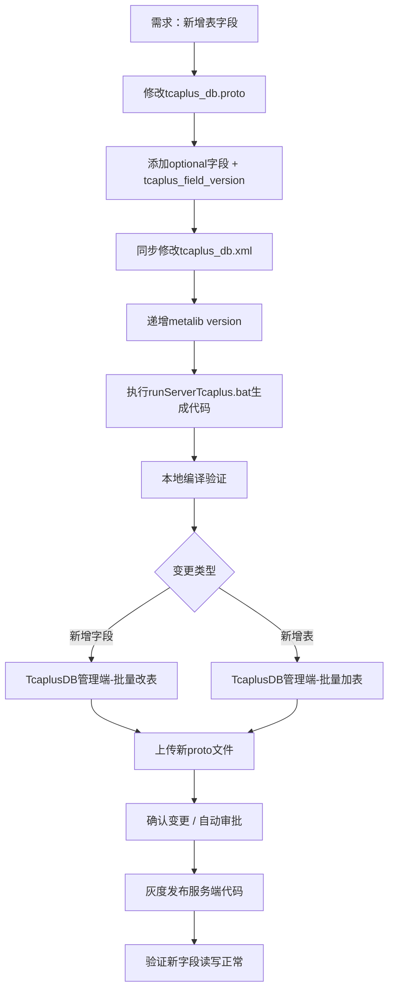
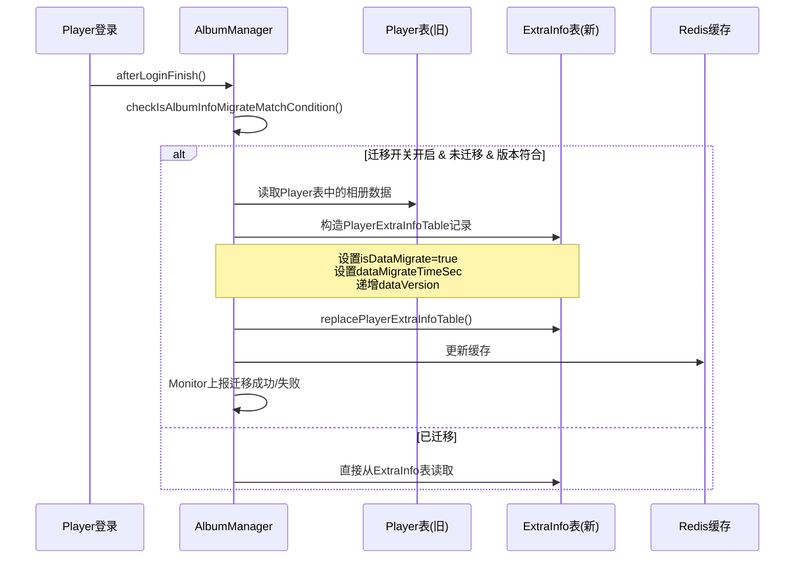
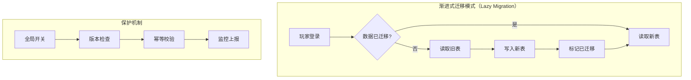
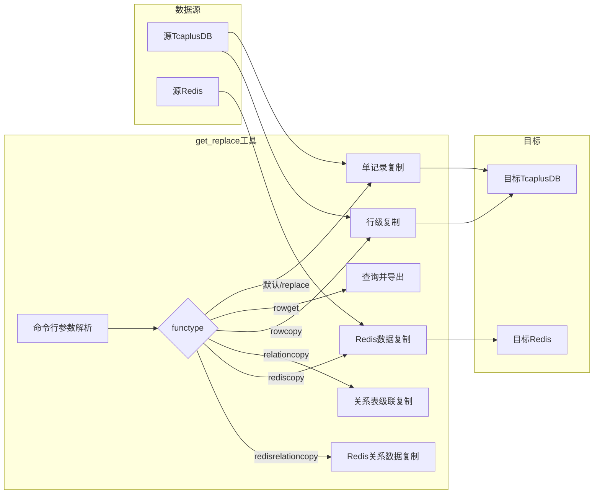
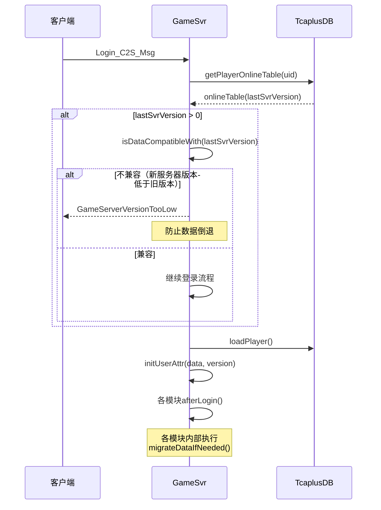
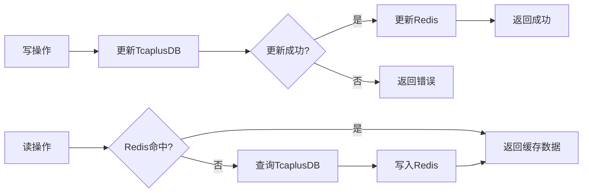
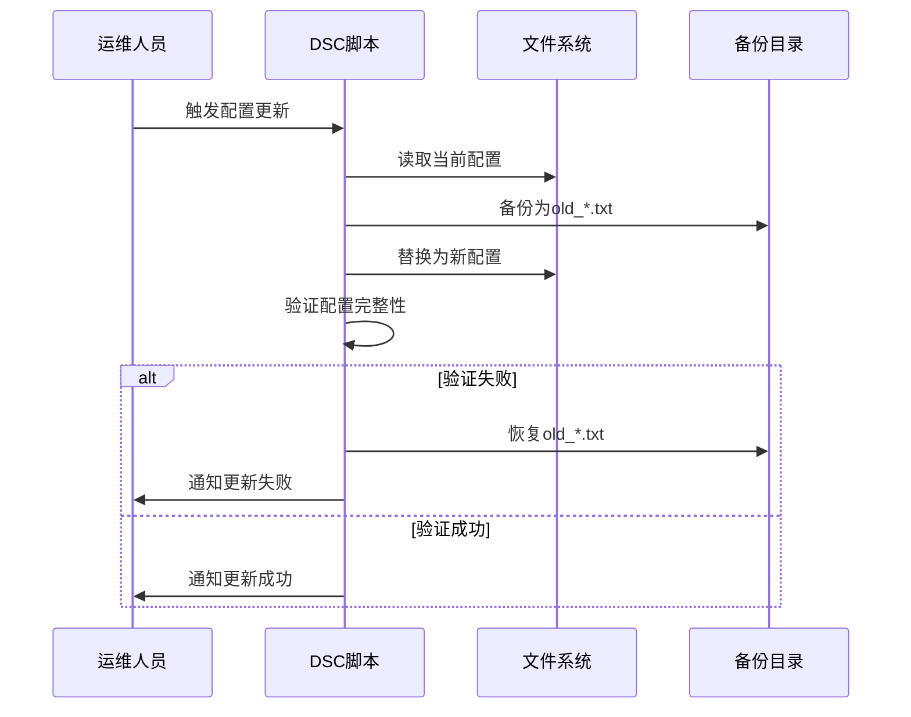
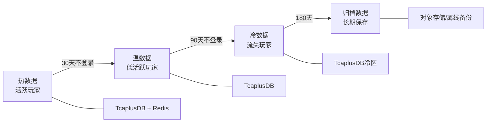
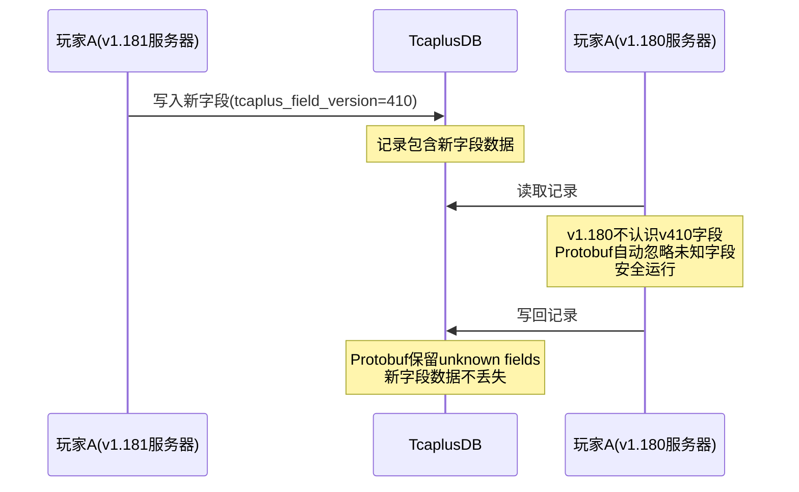

# 数据迁移与Schema演进实践

本文深入分析元梦之星项目（letsgo_server）中**数据迁移与Schema演进**的完整实践体系，涵盖TcaplusDB表结构变更流程、Protobuf字段向前/向后兼容策略、在线数据迁移方案设计、数据归档清理策略、跨版本数据兼容性处理，以及自研迁移工具的技术实现。每个维度覆盖原理介绍、项目中的使用、进阶分析以及改进空间，为面试中"数据治理能力"类问题提供深度素材。

---

## 目录

1. [TcaplusDB表结构变更流程](#section1)
2. [Protobuf字段的向前/向后兼容策略](#section2)
3. [在线数据迁移方案设计](#section3)
4. [自研数据迁移工具分析（get_replace）](#section4)
5. [玩家数据版本管理与递进迁移模式](#section5)
6. [Redis数据的Schema演进策略](#section6)
7. [数据备份恢复与归档清理策略](#section7)
8. [跨版本数据兼容性处理](#section8)
9. [对标业界数据迁移方案](#section9)
10. [改进空间与总结](#section10)

---

## 一、TcaplusDB表结构变更流程 {#section1}

### 1.1 原理介绍

TcaplusDB是腾讯自研的NoSQL数据库，以Protobuf作为Schema定义语言。与MySQL的DDL（`ALTER TABLE`）不同，TcaplusDB的表结构变更基于**Protobuf消息扩展机制**——通过新增optional字段、标注字段版本号来实现无锁、不停服的Schema演进。

**核心概念**：
- **metalib版本号**：XML表定义中的全局版本号（如`version="438"`），每次表结构变更递增
- **字段版本号（tcaplus_field_version）**：每个新增字段标注引入时的metalib版本号，TcaplusDB据此判断该字段是否存在于特定记录中
- **双态Schema**：Proto定义 + XML表定义共同描述表结构，Proto用于序列化/反序列化，XML用于TcaplusDB存储引擎

### 1.2 项目中的使用

**表定义双文件结构**：

项目中每张TcaplusDB表同时在两个文件中定义：

```protobuf
// 1. Proto定义文件：db_proto/proto/tcaplus_db.proto
// 用于Java/Go代码的序列化/反序列化
message PlayerPublic {
  option (tcaplus_customattr2) = "TableType=GENERIC";
  option (tcaplus_primarykey) = "Uid";
  option (tcaplus_splitkey) = "Uid";
  required int64 Uid = 1;
  optional proto_PlayerPublicProfileInfo PublicProfile = 2;
  optional proto_PlayerPublicSummaryInfo PublicSummary = 3;
  optional proto_IdipTaskInfo idipTaskInfo = 4[(tcaplus_field_version) = 86];
  optional proto_PlayerPublicEquipments PublicEquipments = 5[(tcaplus_field_version) = 92];
  // ... 持续新增字段
  optional proto_VillagePublicInfo VillagePublicInfo = 25[(tcaplus_field_version) = 415];
}
```

```xml
<!-- 2. XML定义文件：tcaplus_db.xml -->
<!-- 用于TcaplusDB存储引擎的表结构管理 -->
<metalib tagsetversion="1" name="tcaplus_tb" version="438">
    <struct name="PlayerPublic" version="1" primarykey="Uid" splittablekey="Uid"
            customattr2="TableType=GENERIC">
        <entry name="Uid" type="int64" version="1" />
        <entry name="PublicProfile" type="DbPlatBuffer" version="1" />
        <entry name="PublicSummary" type="DbPlatBuffer" version="1" />
        <entry name="idipTaskInfo" type="DbPlatBuffer" version="86" />
        <entry name="PublicEquipments" type="DbPlatBuffer" version="92" />
        <!-- ... -->
    </struct>
</metalib>
```

**表结构变更完整流程**：



**变更限制规则**（来自运维SOP文档）：

| 操作 | 是否允许 | 说明 |
|:-----|:------:|:-----|
| 新增optional字段 | ✅ | 必须带`tcaplus_field_version`，版本号≥当前meta版本 |
| 新增表 | ✅ | key字段必须标记`required` |
| 删除key字段 | ❌ | 主键字段不可删除 |
| 修改字段类型 | ❌ | 已有字段的类型不可更改 |
| 修改字段tag号 | ❌ | Protobuf序列化依赖tag号 |
| 删除required字段 | ❌ | 会导致已有数据无法解析 |
| 新增key字段 | ❌ | 主键结构不可变更 |
| 重命名字段 | ❌ | TcaplusDB按字段名存储 |

### 1.3 进阶分析

**TcaplusDB的DbPlatBuffer设计**：

```xml
<struct name="DbPlatBuffer" version="1">
    <entry name="Length" type="int" desc="" />
    <entry name="Buffer" type="char" count="256000" refer="Length"
           desc="max len supported by tcaplus" />
</struct>
```

TcaplusDB对Protobuf嵌套消息的存储采用**Blob化策略**：将整个Protobuf消息序列化为二进制后存入`DbPlatBuffer`结构中。这意味着：
- **嵌套消息内部字段变更透明**：只要外层message不变，嵌套消息的字段增删完全由Protobuf自身兼容性保障
- **单列最大256KB限制**：`DbPlatBuffer`的Buffer上限为256000字节，超大数据需使用`DbPlatBufferLarge`（1MB）或`column_split`列拆分
- **列拆分机制**：通过`column_split`选项将大字段拆分为多列存储

```protobuf
// tcaplus_option.proto中的自定义选项
extend google.protobuf.FieldOptions {
    optional int32 tcaplus_field_version = 50002 [default = 1];
    optional string column_split = 50003 [default = ""];
    optional int32 string_size = 50004 [default = 1024];
    optional bool db_large_blob = 50005 [default = false]; // 使用1MB大Blob
}
```

**与MySQL DDL的对比**：

| 对比维度 | TcaplusDB | MySQL |
|:---------|:---------|:------|
| Schema定义语言 | Protobuf + XML | SQL DDL |
| 变更方式 | 新增字段+版本号 | ALTER TABLE |
| 是否锁表 | **否** | 大表DDL可能锁表 |
| 是否需要数据迁移 | **否**（自动兼容） | 可能需要（如改列类型） |
| 变更回滚 | 字段只增不删 | DROP COLUMN |
| 多版本共存 | **原生支持** | 需要应用层处理 |
| 在线变更 | **不停服** | 需要pt-online-schema-change |

### 1.4 改进空间

1. **Schema变更审核自动化**：目前依赖人工检查兼容性，建议开发CI工具自动对比新旧Proto文件，检测不兼容变更
2. **metalib版本号管理规范化**：版本号已累积到438，建议建立版本号分配登记表，避免多人并行开发时版本号冲突
3. **废弃字段清理机制**：项目中仅1个字段使用`deprecated = true`标注，大量历史废弃字段仍占用存储空间
4. **变更影响评估工具**：开发自动化工具评估字段变更对线上数据量、序列化大小的影响

---

## 二、Protobuf字段的向前/向后兼容策略 {#section2}

### 2.1 原理介绍

Protobuf的兼容性建立在**tag-based编码**机制上：每个字段由tag号（field number）标识，序列化时以`tag + wire_type + value`格式编码。这使得：

- **向后兼容（Backward Compatibility）**：新版本代码能解析旧版本数据，未知字段使用默认值
- **向前兼容（Forward Compatibility）**：旧版本代码能解析新版本数据，未知字段被忽略（Proto2保存到unknown fields）

**兼容性黄金法则**：
1. 新增字段使用新的tag号
2. 不删除字段（可标记`deprecated`）
3. 不修改字段类型
4. 不修改字段tag号
5. 不把`optional`改为`required`

### 2.2 项目中的使用

**TcaplusDB表字段的版本化管理**：

项目使用`tcaplus_field_version`自定义选项严格管理每个字段的引入版本。以`OpenIdToUid`表为例：

```protobuf
message OpenIdToUid {
  option (tcaplus_primarykey) = "Openid,PlatId";
  option (tcaplus_splitkey) = "Openid";
  required string Openid = 1;             // 基础版本
  required int32 PlatId = 2;              // 基础版本
  optional int64 Uid = 3;                 // 基础版本
  optional int32 Zoneid = 5;              // 基础版本
  optional int64 CreateTime = 6;          // 基础版本
  optional int32 Deleted = 7;             // 基础版本，复用为AccountState
  optional int64 LoginTime = 8;           // 基础版本
  optional int64 DeletedTime = 9;         // 基础版本
  optional int32 isRegisterFini = 10;     // 基础版本
  optional int32 accountType = 11[(tcaplus_field_version) = 185];     // v185新增
  optional int64 CreatorId = 12[(tcaplus_field_version) = 190];       // v190新增：大区Id
  optional int32 TransferStatus = 13[(tcaplus_field_version) = 410];  // v410新增：转区状态
  optional int64 TransferInterval = 14[(tcaplus_field_version) = 410]; // v410新增：转区时间
}
```

**版本演进时间线分析**：
- v1~v85：基础表结构建立期，核心字段定义
- v86~v200：功能扩展期，频繁新增业务字段
- v200~v400：稳定运营期，新增字段趋于收敛
- v400+：新业务需求（如转区功能TransferStatus）

**CS Attr（客户端-服务器属性）的增量同步兼容**：

项目中大量使用了CS Attr属性系统，属性定义在独立的proto文件中：

```protobuf
// cs_attr_proto/attr_PlayerPublicProfileInfo.proto
message proto_PlayerPublicProfileInfo {
  option (wea_attr_cls) = "PlayerPublicProfileInfo";
  option (wea_attr_key) = "playerPublicProfileInfo";
  // 字段可自由新增，因为存储在DbPlatBuffer中
  // Protobuf自身兼容性保障嵌套消息的向前/向后兼容
}
```

这种设计的关键优势：嵌套消息内部的字段变更不需要修改外层TcaplusDB表结构，只需要Protobuf自身的兼容性即可。

**废弃字段处理方式**：

```protobuf
// PlayerPublic表中的废弃字段示例
optional proto_MatchStaticsDb MatchStaticsInfo = 12
    [deprecated = true, (tcaplus_field_version) = 165];  // 废弃

// 注释掉的废弃字段（更常见的做法）
// message RelationMsgTable {
//   option (tcaplus_primarykey) = "Uid,Type";
//   ...
// }
```

### 2.3 进阶分析

**Proto2 vs Proto3兼容性差异**：

项目选择Proto2（`syntax = "proto2"`）的原因之一是兼容性考量：

| 特性 | Proto2 | Proto3 |
|:-----|:-------|:-------|
| required字段 | 支持（用于主键） | 不支持 |
| 默认值语义 | 显式区分"有值"和"默认值" | 字段不存在=默认值 |
| unknown fields | 保留 | 保留（v3.5+） |
| 适用场景 | TcaplusDB主键需要required | 新项目推荐 |

**DbPlatBuffer的二级兼容性**：

```
存储层兼容性（TcaplusDB）
├── 一级：TcaplusDB表字段级别（tcaplus_field_version）
│   └── 新增entry = 表结构变更 → 需要在管理端"批量改表"
└── 二级：Protobuf嵌套消息级别（Protobuf自身兼容性）
    └── 嵌套message内部字段变更 → 只需重新编译代码
```

这种二级兼容性设计极大减少了表结构变更频率：只要外层表结构不变，嵌套消息（如各种Attr）的字段变更完全由Protobuf保障兼容。

### 2.4 改进空间

1. **字段废弃标准化**：建立废弃字段SOP，所有废弃字段必须标记`deprecated = true`并添加注释说明废弃原因和版本
2. **Proto兼容性CI检查**：在CI/CD流水线中集成proto-breaking-change-detector，自动检测不兼容变更
3. **字段使用率审计**：定期审计哪些字段已不再被读写，推动废弃标记

---

## 三、在线数据迁移方案设计 {#section3}

### 3.1 原理介绍

在线数据迁移（Online Data Migration）指在不停服的情况下，将数据从旧结构/旧表迁移到新结构/新表。核心挑战在于：
- **数据一致性**：迁移过程中持续有新数据写入
- **服务可用性**：迁移不能影响正常业务
- **可回滚性**：迁移失败能安全回退
- **渐进式**：不是一次性全量迁移，而是按需逐步迁移

### 3.2 项目中的使用

**案例1：相册数据从Player表迁移到PlayerExtraInfoTable**

这是项目中最完整的在线数据迁移案例。随着Player表数据量不断膨胀，相册数据被拆分到独立的`PlayerExtraInfoTable`表。



**迁移条件检查（三重保护机制）**：

```java
private boolean checkIsAlbumInfoMigrateMatchCondition() {
    // 保护1：全局迁移开关（七彩石动态配置）
    boolean albumInfoMigrateSwitch =
        PropertyFileReader.getRealTimeBooleanItem("player_album_info_migrate_switch", false);
    if (!albumInfoMigrateSwitch) return false;

    // 保护2：幂等检查——是否已迁移
    if (isAlbumInfoDataMigrate()) return false;

    // 保护3：客户端版本号检查——仅新版本客户端触发迁移
    boolean albumInfoMigrateVersionCheckSwitch =
        PropertyFileReader.getRealTimeBooleanItem("player_album_info_migrate_version_check_switch", false);
    if (albumInfoMigrateVersionCheckSwitch) {
        String lowestVersionStr = MiscConf.getInstance().getMiscConf()
            .getAlbumConf().getDataMigrateLowestVersion();
        long lowestVersion = VersionUtil.encodeClientVersion(lowestVersionStr);
        return VersionUtil.clientVersionCompareAll(
            player.getClientVersion64(), lowestVersion) >= 0;
    }
    return true;
}
```

**迁移执行逻辑**：

```java
private void albumInfoMigrateToPlayerExtraInfoTable() {
    if (isAlbumInfoDataMigrate()) return; // 幂等保护

    // 构造目标表数据
    TcaplusDb.PlayerExtraInfoTable.Builder tableBuilder =
        TcaplusDb.PlayerExtraInfoTable.newBuilder().setUid(player.getUid());
    tableBuilder.getAlbumInfoBuilder()
        .setIsDataMigrate(true)           // 迁移标记
        .setDataMigrateTimeSec(currentTimeSec)  // 迁移时间戳
        .setDataVersion(albumInfo.getDataVersion() + 1)  // 版本号递增
        .addAllAlbumPicMap(getSortedPicInfoListByCreateTime(albumInfo));

    // 监控上报
    Monitor.getInstance().add.total(MonitorId.attr_gamesvr_album_info_migrate, 1);

    // 执行写入
    NKErrorCode code = PlayerExtraInfoTableDao.replacePlayerExtraInfoTable(
        player.getUid(), tableBuilder,
        PlayerExtraInfoTableDao.PlayerExtraInfoTableField.albumInfo);

    if (code.getValue() != NKErrorCode.OK.getValue()) {
        Monitor.getInstance().add.fail(MonitorId.attr_gamesvr_album_info_migrate, 1);
    } else {
        Monitor.getInstance().add.succ(MonitorId.attr_gamesvr_album_info_migrate, 1);
    }
}
```

**案例2：KVStoreTable迁移到Redis**

```protobuf
// tcaplus_db.proto中的注释表明了迁移意图
//TODO 逻辑移到redis后删除
message KVStoreTable {
  option (tcaplus_primarykey) = "WorldZoneKey,key";
  option (tcaplus_splitkey) = "WorldZoneKey";
  required int64 WorldZoneKey = 1;
  required string key = 2;
  required KVStoreValue value = 3;
}
```

### 3.3 进阶分析

**在线迁移的设计模式总结**：



**迁移方案对比**：

| 方案 | 项目采用 | 优点 | 缺点 |
|:-----|:------:|:-----|:-----|
| Lazy迁移（登录时迁移） | ✅ | 不影响在线用户、自然覆盖活跃玩家 | 低活跃玩家长期未迁移 |
| 全量脚本迁移 | ✅（get_replace工具） | 一次性完成 | 占用数据库资源 |
| 双写模式 | 部分采用 | 数据一致性好 | 写入开销翻倍 |
| CDC（变更数据捕获） | ❌ | 实时性好 | 架构复杂 |

### 3.4 改进空间

1. **迁移进度可视化**：建立迁移Dashboard，展示已迁移/未迁移的用户比例
2. **后台批量迁移补充**：对长期不登录的玩家启动后台批量迁移任务
3. **迁移回滚机制**：目前缺乏自动回滚能力，建议在迁移期间保留旧数据一段时间
4. **迁移完成后清理**：迁移完成后自动清理旧表中的冗余数据，释放存储空间

---

## 四、自研数据迁移工具分析（get_replace） {#section4}

### 4.1 原理介绍

`get_replace`是项目自研的Go语言数据迁移工具，支持TcaplusDB记录级别的**跨集群、跨Zone、跨表**数据复制。核心设计思想是：读取源表记录 → 反序列化 → 按规则转换 → 序列化 → 写入目标表。

### 4.2 项目中的使用

**工具架构**：



**核心参数说明**：

| 参数 | 说明 | 示例 |
|:-----|:-----|:-----|
| `--fa/--ta` | 源/目标AppId | `352` |
| `--fz/--tz` | 源/目标ZoneId | `25` |
| `--fd/--td` | 源/目标DirUrl | `tcp://set2.tcapdir...` |
| `--fs/--ts` | 源/目标签名 | `88A05100A76773EC` |
| `--ft/--tt` | 源/目标表名 | `Player` |
| `--fk/--tk` | 源/目标主键 | `300140737489167328` |
| `--igf` | 忽略字段列表 | `Platid,Openid` |
| `--mode` | 写入模式 | `replace` |
| `--functype` | 功能类型 | `rowcopy`/`rediscopy` |
| `--proto` | Schema定义文件 | `./tcaplus_db.xml` |

**典型使用场景**：

```bash
# 场景1：玩家数据跨服复制（忽略平台ID和OpenID）
./get_replace \
  --fa 352 --fd tcp://set2.tcapdir.tcaplusdev.oa.com:9999 --fs 88A05100A76773EC \
  --ta 352 --td tcp://set2.tcapdir.tcaplusdev.oa.com:9999 --ts 88A05100A76773EC \
  --fz 25 --tz 25 \
  --ft Player --tt Player \
  --fk 300140737489167328 --tk 300140737489176330 \
  --proto ./tcaplus_db.xml \
  --mode replace -igf Platid,Openid

# 场景2：Redis缓存数据同步
./get_replace \
  --functype rediscopy \
  --fredisip 30.175.217.173 --fredisport 6379 --fredispwd yuanmeng2023 \
  --tredisip 30.175.217.173 --tredisport 6379 --tredispwd yuanmeng2023 \
  --fredisdb 28 --tredisdb 28 \
  --fredisprefix PlayerPublic_30_ --tredisprefix PlayerPublic_30_ \
  --frediskey 300140737489167328 --trediskey 00140737488358329
```

**环境适配脚本（get_replace_ym.sh）**：

项目封装了多环境适配脚本，支持私有环境、IDC测试环境、发布环境、海外环境的快速切换：

```bash
# 环境配置映射
private_appid=352    # 私有开发环境
idc_test_18_appid=284  # IDC测试环境(set18)
release_appid=335    # 正式发布环境
idc_test_oversea_appid=16  # 海外环境

# 根据参数自动选择环境连接信息
fConf=($(echo ${fromDbZone} | tr " " "\n"))
if [ "${fConf[2]}" == "private" ]; then
    fa=$private_appid
    fd=$private_dir
    fs=$private_secret
elif [ "${fConf[2]}" == "idc_release" ]; then
    # ...
fi
```

### 4.3 进阶分析

**工具的技术实现要点**：

1. **XML Schema解析**：通过Go的`encoding/xml`解析`tcaplus_db.xml`，获取表结构定义（主键、分表键、字段类型）
2. **Protobuf反射**：使用`google.golang.org/protobuf/reflect/protoreflect`实现字段级别的动态读写
3. **TcaplusDB Go SDK**：基于`tcaplus-go-api`实现TcaplusDB记录的CRUD操作
4. **Redis操作**：使用`go-redis/v9`实现Redis数据的读写
5. **字段过滤机制**：`--igf`参数支持忽略指定字段（如复制玩家数据时忽略平台信息）

**数据复制的原子性保障**：

```
源表Get → 内存中处理（字段过滤/主键替换） → 目标表Replace
                                            ↑
                                    如果目标已存在则覆盖
```

### 4.4 改进空间

1. **批量操作支持**：当前工具以单记录为单位操作，建议增加批量模式提升效率
2. **断点续传**：大规模数据迁移时，增加进度记录和断点续传能力
3. **数据校验**：迁移后增加源表和目标表的数据一致性校验步骤
4. **日志和审计**：完善操作日志记录，支持操作回溯
5. **Web化管理界面**：将命令行工具封装为Web服务，降低使用门槛

---

## 五、玩家数据版本管理与递进迁移模式 {#section5}

### 5.1 原理介绍

递进迁移模式（Incremental Migration Pattern）是一种在应用层实现的数据版本管理策略。核心思想：每个数据结构都携带版本号，加载数据时根据版本号执行从旧版本到新版本的逐步转换。

### 5.2 项目中的使用

**农场赛季数据迁移（FarmSeasonManager）**：

```java
private static final int CURRENT_DATA_VERSION = 1;

private void migrateDataIfNeeded(FarmSeasonPlayerData data) {
    int version = data.getDataVersion();
    if (version >= CURRENT_DATA_VERSION) {
        return; // 已是最新版本，跳过
    }

    LOGGER.info("farm {} season data migration: v{} -> v{}",
        farm.getUid(), version, CURRENT_DATA_VERSION);

    // 递进式迁移——逐版本执行
    if (version < 1) {
        migrateToV1(data);
    }
    // 未来版本扩展：
    // if (version < 2) { migrateToV2(data); }
    // if (version < 3) { migrateToV3(data); }

    data.setDataVersion(CURRENT_DATA_VERSION);
    markDirty(); // 标记数据脏，触发持久化
}
```

**服务器版本兼容性检查（ServerVersion）**：

```java
// Framework.java
public final boolean isDataCompatibleWith(long version) {
    return ServerVersion.isDataCompatible(getServerVersionNumber(), version) ||
        !PropertyFileReader.getRealTimeBooleanItem(
            "forbid_db_record_server_version_rewind", true);
}

// ServerVersion.java
// 只比较major和minor版本号，patch版本不影响数据兼容性
public static boolean isDataCompatible(long thisVersion, long lastVersion) {
    return (thisVersion >>> PATCH_BITS) >= (lastVersion >>> PATCH_BITS);
}
```

**登录时的版本校验流程**：



### 5.3 进阶分析

**递进迁移模式的设计优势**：

```
版本0 (v0)
    ↓ migrateToV1()
版本1 (v1)
    ↓ migrateToV2()
版本2 (v2)
    ↓ migrateToV3()
版本3 (v3) ← 当前版本
```

- **可追溯**：每个版本的迁移逻辑独立，方便审计和Debug
- **安全性**：即使跨多个版本，也能逐步安全迁移
- **向后兼容**：旧版本数据总能通过链式迁移升级到最新版本
- **易测试**：每个迁移步骤可独立单元测试

**多模块并行迁移的协调**：

项目中`afterLogin`阶段是各模块执行数据迁移的标准时机。Player对象加载后，依次调用各模块的`afterLogin()`方法，每个模块自主判断是否需要执行数据迁移：

```
Player.afterLogin()
├── FriendManager.afterLogin() → transferFriendVisitData()
├── PlayerAlbumManager.afterLoginFinish() → albumInfoMigrateToPlayerExtraInfoTable()
├── FarmSeasonManager.init() → migrateDataIfNeeded()
└── PlayerUgcManager.afterLogin() → exchangeDataWithUgcSvr()
```

### 5.4 改进空间

1. **迁移框架统一化**：各模块的迁移逻辑分散，建议抽象统一的`DataMigrator`接口
2. **迁移监控完善**：统一上报迁移耗时、成功率、失败原因等指标
3. **迁移降级策略**：迁移失败时的降级策略不够完善，建议迁移失败不影响登录流程
4. **迁移回滚点**：在迁移前保存数据快照，支持迁移失败后数据回滚

---

## 六、Redis数据的Schema演进策略 {#section6}

### 6.1 原理介绍

Redis作为缓存层，其数据Schema演进面临独特挑战：Redis本身没有Schema概念，数据结构完全由应用层定义。当数据格式变更时，需要应用层自行处理新旧数据的兼容。

### 6.2 项目中的使用

**Key版本化策略**：

```java
// 开发规范中的标准做法
public static final String PLAYER_DATA_KEY = "player:data:v2:{uid}";

// 兼容旧版本的读取逻辑
public String getPlayerData(long uid) {
    // 先尝试读取新版本
    String data = redis.get(String.format("player:data:v2:%d", uid));
    if (data == null) {
        // 读取旧版本并迁移
        data = redis.get(String.format("player:data:v1:%d", uid));
        if (data != null) {
            // 迁移到新版本
            redis.set(String.format("player:data:v2:%d", uid), migrateData(data));
            redis.del(String.format("player:data:v1:%d", uid));
        }
    }
    return data;
}
```

**Protobuf序列化的Redis缓存兼容**：

项目中Redis大量使用Protobuf序列化存储数据（如`PlayerExtraInfoTable`的Redis缓存），Protobuf的天然兼容性确保了：
- 新增字段：旧缓存数据反序列化时新字段取默认值
- 废弃字段：新代码序列化时不再写入，旧缓存中的数据被忽略

```java
// PlayerExtraInfoTableDao中的缓存读写
public static NKErrorCode setSinglePlayerExtraInfoTableToRedis(
    long uid, PlayerExtraInfoTable playerExtraInfoTable,
    Collection<PlayerExtraInfoTableField> changeFields) {
    // 按字段粒度存储到Redis Hash
    // 每个字段独立序列化为Protobuf二进制
}
```

**Redis缓存与DB的一致性**：



### 6.3 进阶分析

**Redis兼容性检查清单**（来自开发规范）：
- Key规则不变化（变化需评审）
- 存储PB数据按PB规则兼容
- Schema调整评估线上数据影响
- 提供数据迁移方案

**Redis数据迁移的get_replace工具支持**：

工具支持`rediscopy`和`redisrelationcopy`两种Redis数据迁移模式，实现DB和Redis数据的协同迁移：

```bash
# Redis数据复制示例
./get_replace \
  --functype rediscopy \
  --fredisdb 28 --tredisdb 28 \
  --fredisprefix PlayerPublic_30_ --tredisprefix PlayerPublic_30_ \
  --frediskey <source_uid> --trediskey <target_uid>
```

### 6.4 改进空间

1. **缓存版本自动管理**：开发缓存Key版本号自动升级工具，避免手动维护
2. **过期策略优化**：旧版本Key设置TTL过期时间，自动清理
3. **缓存预热迁移**：版本更新时提前批量预热新版本缓存

---

## 七、数据备份恢复与归档清理策略 {#section7}

### 7.1 原理介绍

数据备份恢复是数据迁移的安全网，确保在迁移失败或数据损坏时能够恢复到已知正确状态。数据归档则是将不再活跃的数据从热存储迁移到冷存储，降低存储成本和查询压力。

### 7.2 项目中的使用

**玩家数据回档机制**：

```protobuf
// tcaplus_db.proto中的回档注释
// 回档玩家数据需要考虑的表
// Player, PlayerPublic, PlayerMail, PlayerInteractionTable
// TODO 是否回档 PlayerUgc*
```

项目中玩家数据回档涉及多张关联表，需要协同处理。

**配置备份恢复机制**（DSC在线更新）：

```bash
# online_update_dsc.sh中的备份逻辑
# 备份策略：将原配置复制为old_前缀的备份文件
cp -f current_config.txt old_current_config.txt
# 替换为新文件
cp -rf new_config.txt current_config.txt
```



**DSA数据备份恢复**：

DSA（Dedicated Server Agent）在重启时通过`DsaBackupData`和`RecoverData`机制实现游戏会话数据的备份与恢复：
- 备份内容：gameSessions、maxCreateGameSessionSeqs、birthMark
- 恢复时机：DSA进程重启时自动执行`RecoverData`

**TcaplusDB表管理工具**：

```python
# del_table.py — TcaplusDB表删除工具
class Tcaplus:
    def delTable(self, tableName):
        url = "http://" + self.host + "/app/newoms.php/webservice/business/table/deleting"
        params = {
            "app_id": self.app_id,
            "zone_id": self.zone_id,
            "table_name": tableName,
            "auto_approve": 1,      # 自动审批
            "auto_exec_trans": 1    # 自动执行
        }
        # 通过WebService API删除表
```

### 7.3 进阶分析

**数据生命周期管理**：



**备份策略对比**：

| 层级 | 备份方式 | 恢复时间 | 数据粒度 |
|:-----|:---------|:---------|:---------|
| TcaplusDB | 平台自动备份 | 分钟级 | 全表/全库 |
| Redis | RDB/AOF | 秒级 | 全量 |
| 应用层 | get_replace导出 | 分钟级 | 单记录/批量 |
| 配置 | old_前缀备份 | 秒级 | 单文件 |

### 7.4 改进空间

1. **自动化归档流水线**：建立定期归档任务，将N天未活跃的玩家数据迁移到冷存储
2. **回档工具产品化**：将get_replace封装为Web工具，支持运营/客服人员自助回档
3. **备份有效性验证**：定期执行备份恢复演练，验证备份数据的可用性
4. **数据保留策略文档化**：建立明确的数据保留期限策略（法规合规要求）

---

## 八、跨版本数据兼容性处理 {#section8}

### 8.1 原理介绍

跨版本数据兼容性是指在服务器滚动升级过程中，不同版本的服务器实例能够安全地读写同一份数据。这在灰度发布场景尤为关键——部分服务器已升级到新版本，部分仍运行旧版本。

### 8.2 项目中的使用

**服务器版本号编码**：

```java
// ServerVersion.java
// 版本号编码为long类型：major.minor.patch
// isDataCompatible只比较major和minor
public static boolean isDataCompatible(long thisVersion, long lastVersion) {
    return (thisVersion >>> PATCH_BITS) >= (lastVersion >>> PATCH_BITS);
}

// 版本比较忽略patch版本号
public static int versionCompareIgnorePatchVersion(long aNumber, long bNumber) {
    aNumber = aNumber >>> PATCH_BITS;
    bNumber = bNumber >>> PATCH_BITS;
    return aNumber == bNumber ? 0 : ((aNumber < bNumber) ? -1 : 1);
}
```

**登录时的版本保护**：

```java
// LoginMsgHandler.java
if (onlineTable.getLastSvrVersion() > 0) {
    if (!Framework.getInstance().isDataCompatibleWith(onlineTable.getLastSvrVersion())) {
        // 当前服务器版本低于玩家上次登录的服务器版本
        // 抛出错误，防止数据倒退
        NKErrorCode.GameServerVersionTooLow.throwError(
            "uid:{} serverVersion:{} < lastSvrVersion:{}",
            session.getUid(),
            Framework.getInstance().getServerVersionNumber(),
            onlineTable.getLastSvrVersion());
    }
}
```

**客户端版本兼容处理**：

```java
// FriendManager.java — 高低版本兼容示例
// 新版本新增了更细粒度的隐身设置，需要从旧字段同步
if (VersionUtil.checkClientVersion("", "1.3.7.27", player.getClientVersion64())) {
    PlayerPublicGameSettings publicSettings = player.getUserAttr().getPlayerPublicGameSettings();
    publicSettings.setHideProfileToFriend(publicSettings.getHidePersonalProfile());
    publicSettings.setHideProfileToStranger(publicSettings.getHidePersonalProfile());
}
```

**缓存版本校验**：

```java
// 登录缓存复用时的版本检查
// loginCacheVersionCheck() — 缓存数据版本与当前服务器版本不匹配则清除缓存
if (isNeedReloadPlayer()) {
    // 移除缓存，强制从DB重新加载
}
```

### 8.3 进阶分析

**多维度版本兼容矩阵**：

```
                    服务器版本
                   v1.180  v1.181  v1.182
    客户端版本
    v1.180          ✅      ✅      ✅
    v1.181          ⚠️      ✅      ✅
    v1.182          ⚠️      ⚠️      ✅
    
    ✅ = 完全兼容
    ⚠️ = 需要兼容逻辑（新功能降级处理）
```

**灰度发布期间的数据安全**：



### 8.4 改进空间

1. **版本兼容性自动化测试**：CI中增加跨版本兼容性测试，模拟新旧服务器混跑场景
2. **数据版本可视化**：在监控面板中展示各Zone的数据版本分布
3. **强制最低版本升级**：对于不兼容变更，增加强制最低服务器版本检查

---

## 九、对标业界数据迁移方案 {#section9}

### 9.1 业界主流方案对比

| 方案 | 代表 | 原理 | 适用场景 | 项目对应 |
|:-----|:-----|:-----|:---------|:---------|
| **Online DDL** | MySQL 5.6+/pt-osc | 后台拷贝表+增量同步 | 关系型数据库Schema变更 | TcaplusDB原生支持 |
| **Dual Write** | Stripe | 同时写新旧两套存储 | 存储系统迁移 | 相册数据迁移期双写 |
| **Lazy Migration** | MongoDB | 读取时自动升级文档格式 | 文档型数据格式升级 | FarmSeasonManager |
| **CDC（变更数据捕获）** | Debezium | 监听binlog实时同步 | 异构数据源同步 | 未采用 |
| **Schema Registry** | Confluent | 集中管理Schema版本 | 消息队列数据格式管理 | tcaplus_field_version |
| **Blue-Green Migration** | AWS | 两套环境切换 | 大规模数据库迁移 | 未采用 |
| **Expand-Contract** | 演进式设计 | 先扩展后收缩 | 渐进式Schema变更 | 新增字段→废弃旧字段 |

### 9.2 项目方案优势分析

**TcaplusDB + Protobuf的Schema演进优势**：

1. **零停机**：表结构变更不需要停服，不存在MySQL长时间DDL锁表问题
2. **自动兼容**：Protobuf的tag-based编码天然支持向前/向后兼容
3. **版本化管理**：`tcaplus_field_version`提供精确的字段引入版本追踪
4. **Blob化存储**：嵌套消息的Schema变更对TcaplusDB完全透明
5. **工具链完整**：get_replace工具支持多种数据迁移场景

**与MySQL对比的劣势**：

1. 不支持复杂查询（无SQL），Schema变更灵活但查询能力有限
2. 字段只增不删，长期积累导致表结构冗余
3. 缺乏标准的数据迁移框架（如Flyway/Liquibase）

---

## 十、改进空间与总结 {#section10}

### 10.1 整体改进建议

| 改进项 | 优先级 | 难度 | 预期收益 |
|:------|:-----:|:----:|:---------|
| Schema变更CI自动检查 | P0 | 中 | 防止不兼容变更上线 |
| 统一数据迁移框架 | P0 | 高 | 标准化各模块的迁移逻辑 |
| 迁移进度Dashboard | P1 | 中 | 可视化迁移状态 |
| 废弃字段审计工具 | P1 | 低 | 减少存储浪费 |
| 自动化归档流水线 | P1 | 高 | 降低存储成本 |
| get_replace Web化 | P2 | 中 | 降低运维使用门槛 |
| CDC实时同步引入 | P2 | 高 | 支持异构数据源同步 |
| 跨版本兼容性测试 | P2 | 中 | 提前发现兼容性问题 |

### 10.2 面试高频QA

**Q1：TcaplusDB表结构变更和MySQL DDL有什么区别？**

A：TcaplusDB基于Protobuf的Schema定义，变更通过新增optional字段+版本号标注实现，**不停服、不锁表、原生多版本共存**。而MySQL DDL（尤其是大表）可能导致长时间锁表，需要pt-online-schema-change等工具辅助。TcaplusDB的代价是字段只增不删，长期会造成Schema冗余。

**Q2：如何保证在线数据迁移的数据一致性？**

A：项目采用Lazy Migration模式，在玩家登录时按需迁移。一致性通过三重保护保障：①全局开关（动态配置）控制迁移范围；②幂等标记（isDataMigrate）防止重复迁移；③版本号递增确保迁移方向性。同时通过Monitor上报成功/失败率进行监控。

**Q3：Protobuf的向前/向后兼容是怎么实现的？**

A：Protobuf使用tag-based编码，每个字段由field number标识。新增字段使用新的tag，旧版本代码解析时跳过未知tag（保存到unknown fields），新版本代码解析旧数据时新字段取默认值。项目中严格遵循"不删除字段、不修改类型、不修改tag"的黄金法则。

**Q4：项目中如何处理灰度发布期间的数据兼容？**

A：通过三层机制保障：①服务器版本号记录在PlayerOnlineTable中，登录时检查`isDataCompatibleWith()`防止数据倒退；②TcaplusDB的`tcaplus_field_version`确保新字段只在新版本服务器写入；③Protobuf的unknown fields机制确保旧版本服务器不会丢弃新字段数据。

**Q5：你们的数据迁移工具是怎么设计的？**

A：自研Go语言工具`get_replace`，支持6种操作模式：单记录复制、行级复制、查询导出、关系表级联复制、Redis数据复制、Redis关系数据复制。工具通过解析XML Schema定义获取表结构，使用Protobuf反射实现字段级动态操作，支持跨集群、跨Zone、跨表的数据迁移，并提供字段过滤（`--igf`）能力。

### 10.3 总结

元梦之星项目的数据迁移与Schema演进体系具有以下特点：

1. **TcaplusDB + Protobuf的天然兼容性**：得益于tag-based编码和字段版本号机制，表结构变更几乎零成本
2. **DbPlatBuffer二级兼容性设计**：嵌套消息的Schema变更对存储层透明，大幅减少表变更频率
3. **Lazy Migration模式成熟**：以相册数据迁移为代表的在线迁移方案，三重保护机制保障安全性
4. **自研工具链完整**：get_replace覆盖TcaplusDB和Redis的多种迁移场景
5. **版本管理贯穿全栈**：从服务器版本、客户端版本到数据版本，多维度协同保障跨版本兼容性

这套体系支撑了百万DAU游戏的持续迭代演进，在不停服的前提下完成了数百次Schema变更和多次大规模数据迁移。