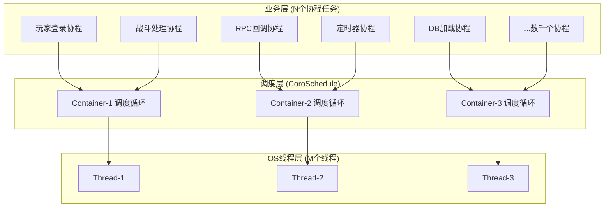
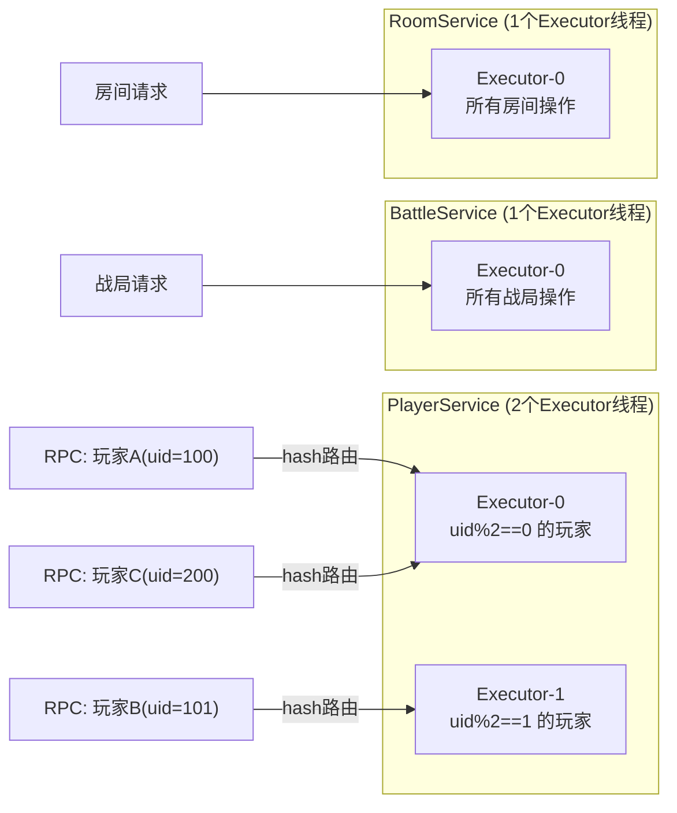
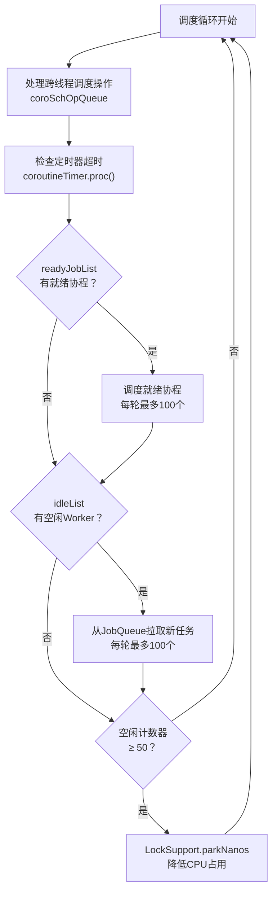
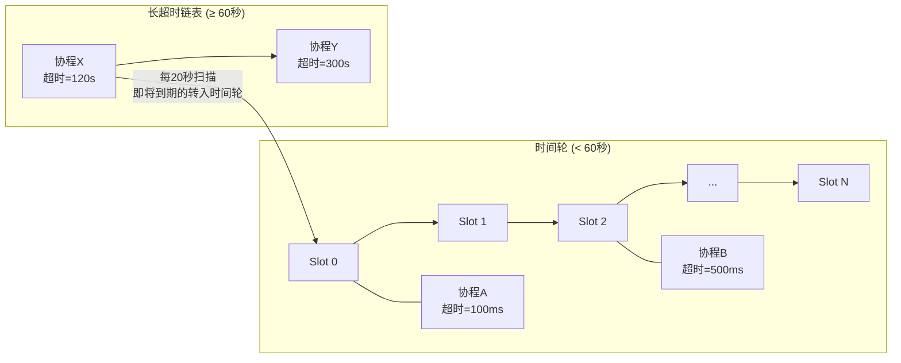
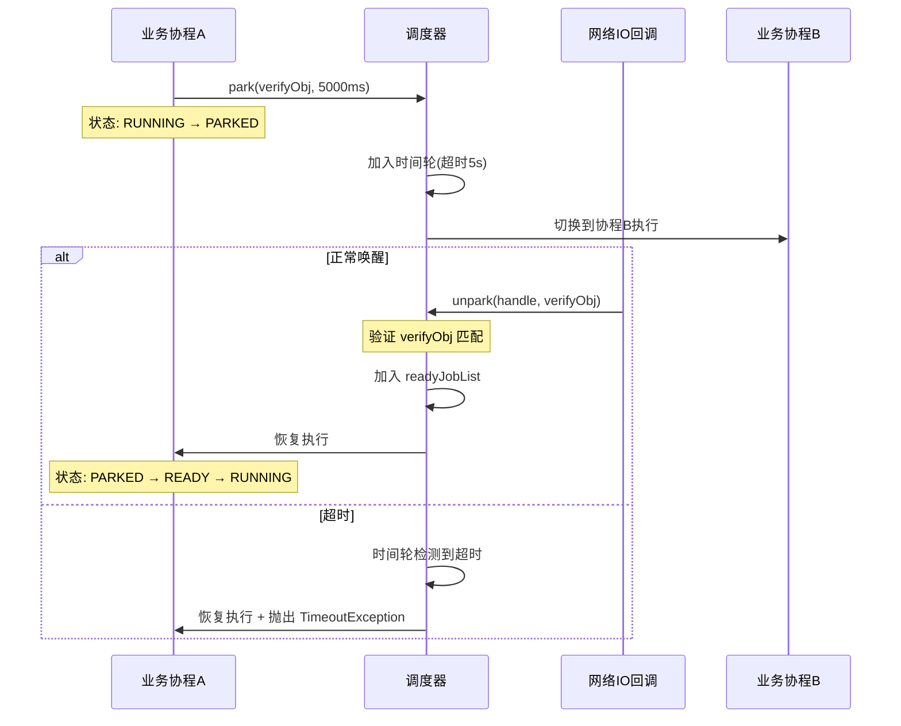
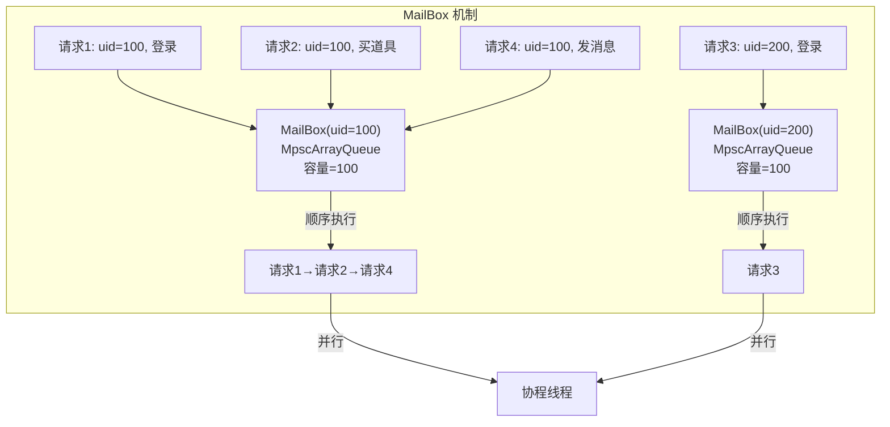
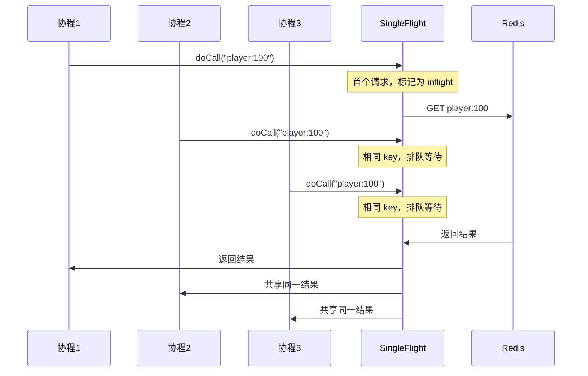
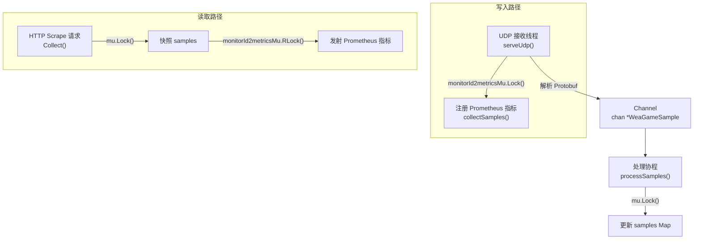

# 并发编程深度专题

本文基于元梦之星项目（letsgo_server）的源码分析，系统梳理项目在协程调度模型、并发控制原语（锁/CAS/原子操作）、线程安全集合、协程池调度算法、Channel 通信模型、MailBox 顺序执行、SingleFlight 防击穿、分布式锁等方面的并发编程实践，涵盖原理、设计决策、代码实现与面试话术。

---

## 一、项目并发模型总览

### 1.1 N:M 协程调度模型——核心架构

项目采用 **N:M 调度模型**，将 N 个用户态协程映射到 M 个操作系统线程上执行，这是整个服务端并发能力的基石。



**架构分层**：

```
┌─────────────────────────────────────────────────────┐
│                   业务层 (Business)                    │
│         CoroHandle.submit / park / unpark / get       │
├─────────────────────────────────────────────────────┤
│                管理层 (CoroutineMgr)                    │
│    init / submit / park / unpark / yield / get        │
├──────────────┬──────────────┬───────────────────────┤
│  调度层 (Sch)  │  容器层 (Container) │  定时器 (Timer)  │
│  coroSchedule │  yieldTo / offerJob  │  TimeWheel      │
├──────────────┴──────────────┴───────────────────────┤
│              执行层 (CoroWorker)                       │
│         workerRun / pollJob / run                     │
├─────────────────────────────────────────────────────┤
│             底层实现 (Implementation)                   │
│  Continuation | VirtualThread | JkuCoroutine | Thread │
└─────────────────────────────────────────────────────┘
```

**设计原理**：

传统的线程池模型（Thread-per-Request）在高并发场景下有两大瓶颈：

| 维度 | 线程模型 | 协程模型（本项目） |
|------|---------|-----------------|
| 上下文切换 | ~1-10μs（内核态切换） | ~100ns（用户态切换） |
| 内存开销 | 每线程 ~1MB 栈空间 | 每协程 ~数KB |
| 并发数上限 | 数千级别 | 数十万级别 |
| IO等待 | 阻塞线程 | park 让出，不阻塞线程 |
| 同步方式 | synchronized/Lock | park/unpark + 协程安全锁 |

项目支持四种协程底层实现，通过配置 `CoroutineMode` 切换：

```java
// 四种协程实现模式
MultiThreads（模式 0）：每个协程对应一个真实线程（调试用）
VirtualThread（模式 1）：使用 JDK 虚拟线程
Continuation（模式 2）：使用 Continuation 机制
JkuCoroutine（模式 3）：使用 Kona Fiber 协程（当前默认）
```

**当前默认使用 Kona Fiber（JkuCoroutine 模式）**，这是腾讯内部基于 OpenJDK Loom 项目定制的协程实现。

### 1.2 线程绑定服务模型（LocalService）

项目中最核心的并发设计理念：**通过线程绑定避免锁**。



```java
// LocalService 子类通过 setExecutorServiceCount 设置线程数
// PlayerService 设置 2 个线程
setExecutorServiceCount(PLAYER_SERVICE_COUNT = 2);

// 路由策略：uid % executorServiceCount
// 同一 uid 的所有操作必然在同一线程执行 → 无需加锁
int executorIndex = PlayerService.getExecutorServiceIndex(uid);
```

**核心优势**：

1. **同一玩家的操作在同一线程**：无需对 Player 对象加锁
2. **协程在线程内调度**：park/unpark 不跨线程，无竞争
3. **ExecutorLocal 变量隔离**：类似 ThreadLocal，但绑定到 ExecutorService 粒度
4. **显著降低复杂度**：业务代码几乎不需要考虑并发问题

---

## 二、并发控制原语详解

### 2.1 CAS 无锁操作（AtomicLong + CAS）

项目中广泛使用 CAS 替代传统锁，在高争用场景下提供更好的性能。

**案例1：Session 协程安全锁**

```java
// Session.tryLock()/unlock() 使用 AtomicLong + CAS 实现
// 目的：防止同一 Session 的消息并发处理
private AtomicLong sessionLock;

public boolean tryLock() {
    return sessionLock.compareAndSet(0, Thread.currentThread().getId());
}

public void unlock() {
    sessionLock.set(0);
}
```

**设计亮点**：使用线程 ID 作为锁持有者标识，既实现了互斥，又支持可重入检测和死锁诊断。

**案例2：登录限频器**

```java
// LoginLimitRate 使用 AtomicInteger + CAS 无锁并发登录数控制
// 配置：concurrent_login_limit = 50, concurrent_login_limit_enable = true
private AtomicInteger concurrentLoginCount;

public boolean tryAcquire() {
    int current = concurrentLoginCount.get();
    if (current >= limit) return false;
    return concurrentLoginCount.compareAndSet(current, current + 1);
}

public void release() {
    concurrentLoginCount.decrementAndGet();
}
```

**案例3：缓存命中率统计**

```java
// Stat 组件使用 AtomicLong 进行完全无锁计数
public class Stat {
    private AtomicLong total = new AtomicLong(0);
    private AtomicLong hit = new AtomicLong(0);
    private AtomicLong miss = new AtomicLong(0);
    private AtomicLong dbFail = new AtomicLong(0);
    private AtomicLong error = new AtomicLong(0);
    private AtomicLong timeOut = new AtomicLong(0);
    private AtomicLong bre = new AtomicLong(0);  // 熔断次数
    
    // 定期输出并重置（getAndSet 原子操作）
    public void proc() {
        long t = total.getAndSet(0);
        long h = hit.getAndSet(0);
        // 计算命中率：h / t * 100
        // 输出日志 + 上报监控
    }
}
```

### 2.2 volatile 可见性保障

项目中 `volatile` 的使用严格遵循以下模式：

**模式1：状态标志**

```java
// Session.state 声明为 volatile，保证状态变更的跨线程可见性
private volatile int state;  // INIT → CONNECTED → AUTHED → CLOSED

// Session.uid 声明为 volatile，保证 UID 绑定后的可见性
private volatile long uid;
```

**模式2：Copy-on-Write 配置发布**

```java
// 全服邮件缓存：volatile Map + COW 模式
private static volatile Map<Long, GlobalMailData> globalMails;

// 更新时创建新 Map 后整体替换（禁止直接修改原 Map）
public void refreshGlobalMails(Map<Long, GlobalMailData> newMails) {
    globalMails = Collections.unmodifiableMap(newMails);
    // volatile 写保证 happens-before，所有读线程立即可见
}
```

**模式3：资源版本替换**

```java
// ResHolder.allResMap 使用 volatile 修饰
// 资源加载完成后对所有线程可见
private volatile Map<String, ResData> allResMap;

// CsMetaLoader.metas 通过替换整个 HashMap 保证原子性
private volatile HashMap<Integer, CsMeta> metas;
```

**面试关键点**：volatile 只保证可见性和有序性，不保证原子性。项目中总是与不可变对象（`Collections.unmodifiableMap`）或 COW 模式配合使用。

### 2.3 自旋锁（Go 侧工具链）

在 Go 语言编写的数据采集工具中，项目实现了基于 CAS 的自旋锁：

```go
// collect/common.go
func SpinLock(l *uint32) {
    for atomic.LoadUint32(l) != 0 || !atomic.CompareAndSwapUint32(l, 0, 1) {
        runtime.Gosched()  // 让出 CPU 时间片，避免忙等
    }
}

func SpinUnlock(l *uint32) {
    atomic.StoreUint32(l, 0)
}
```

**使用场景**：在 `DataProcessor` 中保护 `flowMetric` map 的并发读写（后被分片锁优化替代）。

---

## 三、线程安全集合与并发数据结构

### 3.1 ConcurrentHashMap——项目最广泛使用的并发容器

项目中几乎所有跨线程共享的映射都使用 `ConcurrentHashMap`：

| 使用场景 | 持有者 | Key | Value |
|---------|--------|-----|-------|
| RPC代理缓存 | `G6IrpcClient` | 接口Class | 代理实例 |
| Session管理 | `SessionQueueMgr` | SessionID | SessionQueue |
| 服务注册表 | `IrpcServerDispatcher` | 服务名 | ServiceWrapper列表 |
| MailBox管理 | `SequentialComponent` | UID | MailBox |
| 缓存节点 | `Cache` | NodeType | CacheNode |
| 道具管理器工厂 | `ItemManagerFactory` | ItemType | ManagerAdapter |
| 活动缓存 | `ActivityService` | UID | PlayerActivity |
| 玩家登录锁 | `PlayerLogin` | OpenID/UID | 登录状态 |
| 方法反射缓存 | `IrpcServerDispatcher` | 方法签名 | Method对象 |

**典型用法 — computeIfAbsent 原子创建**：

```java
// 道具管理器工厂：按类型查找或创建管理器
// ConcurrentHashMap.computeIfAbsent 保证同一 key 只创建一次
managerCache.computeIfAbsent(itemType, k -> {
    return createManagerByReflection(itemType);
});
```

### 3.2 分片锁（Sharded Lock）——高性能指标采集

`DataProcessor` 中实现了分片锁模式，将单一全局锁分散为 64 个分片，大幅降低锁争用：

```go
// data_processor.go
const metricShards = 64

type metricShard struct {
    sync.RWMutex                             // 每个分片独立的读写锁
    data map[string]*collect.MetricGaugex    // 分片内的数据
}

type FlowMetric struct {
    shards [metricShards]metricShard          // 64个分片
}

// 通过 xxhash 计算分片索引
func (fm *FlowMetric) getShardIndex(key string) uint32 {
    h := xxhash.Sum64([]byte(key))
    return uint32(h) & (metricShards - 1)    // 位运算取模，比 % 快
}

// 先尝试读锁，未命中再升级写锁（双重检查锁定）
func (fm *FlowMetric) Update(label string, value float64, 
                              createFn func() *collect.MetricGaugex) {
    shardIndex := fm.getShardIndex(label)
    shard := &fm.shards[shardIndex]

    shard.RLock()
    if m, ok := shard.data[label]; ok {
        shard.RUnlock()
        m.Record(value)      // 快速路径：读锁 + 已存在
        return
    }
    shard.RUnlock()

    shard.Lock()             // 慢路径：升级为写锁
    m, ok := shard.data[label]
    if !ok {
        m = createFn()       // 双重检查后创建
    }
    shard.Unlock()
    if m != nil {
        m.Record(value)
    }
}
```

**优化效果**：将锁争用概率从 100% 降低到 ~1.5%（1/64），吞吐量提升约 20-40x。

**演进路径**（注释中可见）：

```
全局自旋锁 → 全局 sync.Mutex → 分片 RWMutex（当前方案）
```

### 3.3 atomic.Value——无锁配置热加载

Go 工具链中广泛使用 `atomic.Value` 实现无锁的配置热加载：

```go
// 多个组件统一使用 atomic.Value 持有配置
type DataProcessor struct {
    cfg    *atomic.Value  // 存储 *DataProcessorConfig
}

type ClickhouseExporter struct {
    cfg    *atomic.Value  // 存储 *ClickhouseExporterConfig
}

// 读取配置：无锁，多协程安全
func (p *DataProcessor) getCfg() *DataProcessorConfig {
    return p.cfg.Load().(*DataProcessorConfig)
}

// 热更新：原子替换整个配置对象
func (svc *Service) ReloadConfig(cfg map[string]interface{}) {
    for i := range createInfos {
        svc.components[i].Config.Store(createInfos[i].cfg)  // 原子写入
    }
}
```

---

## 四、协程调度算法深度分析

### 4.1 调度循环（coroSchedule）



**关键调度参数**：

| 参数 | 默认值 | 说明 |
|------|:------:|------|
| `CoroThreadCount` | 3 | SharedContainer 数量 |
| `CoroutinePoolCnt` | 32 | 初始协程池大小 |
| `MaxCoroutinePoolCnt` | 9999 | 最大协程池大小 |
| `MaxStartNewJobOneCycleInCoroSchedule` | 100 | 每轮最多启动新任务数 |
| `MaxRunReadyJobOneCycleInCoroSchedule` | 100 | 每轮最多恢复就绪任务数 |
| `MillSecToCheckTimeoutJob` | 20ms | 强制回主协程的时间间隔 |
| `SleepWhenCannotProcCnt` | 50 | 空循环多少次后sleep |

### 4.2 任务队列公平轮询算法

当一个 Container 上绑定多个 `CoroJobQueue`（不同 `LocalService` 的任务队列）时，调度器使用**加权轮询**避免饥饿：

```java
// CoroWorker.pollJob() 公平轮询逻辑
int startIdx = jobTypePollIdx;  // 上次结束的位置
for (int i = 0; i < queueCount; i++) {
    int idx = (startIdx + i) % queueCount;
    CoroJobQueue queue = queues[idx];
    
    // 并发度控制：正在运行的任务不超过 maxRunningJobCnt
    if (queue.runningJobCnt >= queue.maxRunningJobCnt) continue;
    
    // 每个队列每轮最多 poll maxPollJobOnce 个任务
    CoroHandle<?> job = queue.poll();
    if (job != null) {
        jobTypePollIdx = idx + 1;  // 记录位置，下次从这里继续
        return job;
    }
}
return null;
```

### 4.3 时间轮超时管理（CoroutineTimeWheel）

协程 park 超时使用时间轮算法（O(1) 插入和删除），而非 JDK 的优先级队列（O(logN)）：



**两级结构**：
- **短超时（< 60秒）**：插入时间轮数组对应槽位，每毫秒推进指针
- **长超时（≥ 60秒）**：加入 `moreThanOneMinList`，每 20 秒扫描一次，将即将到期的转入时间轮

### 4.4 协程 Park/Unpark 机制



**跨线程 Unpark 的处理**：

```java
// 当 unpark 操作来自非目标 Container 的线程时
if (Thread.currentThread() != container.getThread()) {
    // 通过 ConcurrentLinkedQueue 提交到目标线程执行
    container.getCoroSchOpQueue().offer(() -> {
        doUnpark(coroHandle, verifyObj);
    });
    // 唤醒可能正在 sleep 的目标 Container 线程
    LockSupport.unpark(container.getThread());
}
```

---

## 五、协程池与任务池实现

### 5.1 Java 协程池（CoroJobQueue）

协程池的核心设计目标：**控制并发度 + 防止任务堆积**。

```java
// CoroJobQueue 核心属性
ArrayBlockingQueue<CoroHandle<?>> queue;   // 有界队列，容量 1,000,000
int maxRunningJobCnt;                       // 最大并发运行数
int maxPollJobOnce;                         // 每轮最多poll数
boolean checkEmptyBeforeStop;               // 优雅停服时是否等待队列清空
```

**与 JDK ThreadPoolExecutor 对比**：

| 维度 | ThreadPoolExecutor | CoroJobQueue |
|------|-------------------|--------------|
| 执行单元 | 线程 | 协程（CoroWorker） |
| 上下文切换 | 内核态 | 用户态 |
| 队列容量 | 通常数百到数千 | 1,000,000（协程轻量） |
| 拒绝策略 | 4种内置策略 | 抛出 CoroCheckedException |
| 并发控制 | corePoolSize/maxPoolSize | maxRunningJobCnt |
| 关闭策略 | shutdown/shutdownNow | preStop → canStop → shutdown |

### 5.2 Go TaskPool 实现

Go 侧工具链中实现了通用的 Worker Pool：

```go
// collect/common.go
type TaskPool struct {
    wg    sync.WaitGroup
    queue chan func()        // 有缓冲的任务通道
    done  chan struct{}       // 关闭信号
}

func NewTaskPool(workerCount int, queueSize int) *TaskPool {
    if workerCount == 0 {
        workerCount = runtime.NumCPU()  // 默认使用 CPU 核数
    }
    p := &TaskPool{
        queue: make(chan func(), queueSize),
        done:  make(chan struct{}),
    }
    // 启动固定数量的 Worker goroutine
    for i := 0; i < workerCount; i++ {
        go func() {
            for fn := range p.queue {
                callWithRecover(fn)  // panic 恢复 + 日志记录
                p.wg.Done()
            }
        }()
    }
    return p
}

// 带 panic 恢复的安全执行
func callWithRecover(fn func()) {
    defer func() {
        v := recover()
        if v != nil {
            zap.S().Errorw("callWithRecover: panic", 
                "err", v, "stacktrace", string(debug.Stack()))
        }
    }()
    fn()
}
```

**使用场景**：

```go
// DataProcessor 使用 2*CPU 核数的 Worker + 1024 队列深度
p.processTaskPool = collect.NewTaskPool(runtime.NumCPU()*2, 1024)

// 提交数据处理任务
func (p *DataProcessor) ProcessPacket(clientIp string, data []byte) {
    p.processTaskPool.Execute(func() { p.processPacket(clientIp, data) })
}

// 优雅关闭：先关闭信号通道，再等待所有任务完成
func (p *DataProcessor) OnStop() {
    p.processTaskPool.CloseAndWait()
}
```

### 5.3 ForkJoinPool 并行处理

项目还提供了 ForkJoinPool 用于 CPU 密集型的并行计算：

```java
// 在 LocalService 中配置 parallelism > 0 时启用
// TimiCoroExecutorService 创建 ForkJoinPoolExecutor

// 业务使用：并行处理集合
CurrentExecutorUtil.parallelRun(playerCollection, player -> {
    // 每个 player 的处理在 ForkJoinPool 中并行执行
    player.computeHeavyAttribute();
});
```

---

## 六、MailBox 顺序执行机制

### 6.1 问题背景

同一玩家的操作必须严格顺序执行（如登录→加载数据→处理消息），但协程是并发调度的。MailBox 解决了**按 Key 顺序 + 跨 Key 并行**的需求。

### 6.2 设计方案



```java
// LocalServiceSequentialWrapper.runJob 核心逻辑
public void runJob(long uid, Callable<?> callable, ...) {
    // 1. 查找或创建 MailBox（ConcurrentHashMap）
    MailBox mailBox = mailBoxMap.computeIfAbsent(uid, k -> new MailBox());
    
    // 2. 创建带顺序执行逻辑的协程句柄
    CoroHandleForSequential handle = new CoroHandleForSequential(callable);
    
    // 3. 入队（MpscArrayQueue：Multi-Producer Single-Consumer）
    if (!mailBox.queue.offer(handle)) {
        throw new NKCheckedException(UserProtocolQueueFull);
    }
    
    // 4. 如果当前没有任务在处理，启动执行
    if (!mailBox.handling) {
        mailBox.handling = true;
        startNextInMailBox(mailBox);
    }
}

// 任务完成后自动执行下一个
void onCoroHandleForSeqFinally(MailBox mailBox) {
    CoroHandleForSequential next = mailBox.queue.poll();
    if (next != null) {
        submit(next);  // 继续执行下一个
    } else {
        mailBox.handling = false;  // 队列空了
    }
}
```

### 6.3 延迟监控与超时丢弃

```java
// 协议延迟分桶监控
long waitCostMs = System.currentTimeMillis() - handle.getEnqueueTime();
if (waitCostMs > 500) {
    // 上报 attr_player_proto_latency_500plus
    log.warn("Protocol wait too long: {}ms, uid={}", waitCostMs, uid);
}

// 超时协议丢弃（默认25秒）
if (waitCostMs > drop_timeout_in_queue_protocol) {
    // 上报 attr_mailbox_long_time_drop_count
    // 直接跳过，处理下一个
    onCoroHandleForSeqFinally(mailBox);
    return;
}
```

### 6.4 MailBox 过期清理

```java
// 使用 ConcurrentSkipListMap 追踪活跃时间
ConcurrentSkipListMap<Long, Set<Long>> activeTimeMap;

// 每次 proc 检查超过 60 秒未活跃的 MailBox
// 通过 checkObjectCanRemove 回调确认可安全移除
// 从 mailBoxMap 中清除，释放内存
```

---

## 七、SingleFlight 防击穿——并发请求合并

### 7.1 原理



### 7.2 实现细节

```java
// SingleFlight.doCall 核心逻辑
public <V> V doCall(String key, Supplier<V> supplier) {
    // Key 通过 key + "_" + Thread.currentThread().getId() 构建（按线程隔离）
    String flightKey = key + "_" + Thread.currentThread().getId();
    
    SingleData<V> data = flights.get(flightKey);
    if (data != null) {
        // 已有 inflight 请求，通过 SingleFlightAsync 等待
        return data.await(timeout);  // 协程 park 等待
    }
    
    // 第一个请求
    data = new SingleData<>();
    flights.put(flightKey, data);
    try {
        V result = supplier.get();    // 执行实际查询
        data.complete(result);        // 通知所有等待者
        return result;
    } catch (Exception e) {
        data.completeExceptionally(e); // 异常也通知等待者
        throw e;
    } finally {
        flights.remove(flightKey);
    }
}
```

**关键设计决策**：Key 带线程 ID 实现**线程隔离**——不同线程的相同 Key 请求各自独立合并，避免跨线程协调的复杂性，同时在同一线程内仍能有效合并（同一线程上的多个协程）。

### 7.3 tryCallOnce 非阻塞变体

```java
// 如果已有正在执行的请求，直接返回 null（不等待）
public <V> V tryCallOnce(String key, Supplier<V> supplier) {
    if (flights.containsKey(key)) return null;
    // 只有没有 inflight 请求时才执行
    return doCall(key, supplier);
}
```

---

## 八、Channel 通信模型（Go 侧）

### 8.1 生产者-消费者模式

项目 Go 工具链中大量使用 Channel 实现生产者-消费者模式：

```go
// ClickhouseExporter 的批量写入管道
type batch struct {
    dataCh chan []interface{}    // 带缓冲的数据通道，容量256
    ticker *time.Ticker          // 定时刷新
}

func (b *batch) workLoop() {
    for {
        select {
        case data := <-b.dataCh:      // 接收数据
            b.dataList = append(b.dataList, data)
            if len(b.dataList) >= batchCount {
                b.commit("reach batch count")  // 批量提交
            }
        case <-b.ticker.C:            // 定时提交
            b.commit("reach batch period")
        case <-b.workLoopTaskPool.Done():  // 优雅关闭
            b.commit("graceful shutdown")
            return
        }
    }
}
```

### 8.2 Fan-Out 并发上传

```go
// 批量COS上传：Fan-Out 模式
func BatchCosUpLoad(cosClient *cos.Client, cosFileList *[]*CosUploadInfoBase) error {
    threadPoolSize := 2
    filesCh := make(chan *CosUploadInfoBase, threadPoolSize)
    
    var wg sync.WaitGroup
    // 启动多个消费者 goroutine
    for i := 0; i < threadPoolSize; i++ {
        wg.Add(1)
        go batchCosUploadImpl(&wg, cosClient, filesCh)
    }
    
    // 生产者发送文件信息
    for _, perFile := range *cosFileList {
        filesCh <- perFile
    }
    close(filesCh)   // 关闭通道通知消费者
    wg.Wait()        // 等待所有消费者完成
    return nil
}
```

### 8.3 信号通知与优雅关闭

```go
// 服务优雅关闭：信号监听 + Channel 通知
func runServiceImpl(configUri string, ...) {
    sigCh := make(chan os.Signal, 1)
    signal.Notify(sigCh, syscall.SIGINT, syscall.SIGQUIT, 
                         syscall.SIGUSR1, syscall.SIGUSR2, syscall.SIGTERM)
    
    for {
        select {
        case <-svc.stopped:           // 服务主动停止
            return false, nil
        case err := <-configWatcherCh: // 配置变更（热加载）
            svc.ReloadConfig(cfg)
        case sig := <-sigCh:           // 系统信号
            switch sig {
            case syscall.SIGUSR1:      // 热重载配置
                svc.ReloadConfig(cfg)
            case syscall.SIGUSR2:      // 热重启
                svc.Stop()
                return true, nil
            default:                   // 正常关闭
                svc.Stop()
                return false, nil
            }
        }
    }
}
```

---

## 九、分布式并发控制

### 9.1 Redis 分布式锁（SETNX + 过期）

```java
// Cache 提供原子性 SETNX + EX 操作
Cache.setnxex(key, value, expireSeconds);

// CAS 语义的安全删除（Lua 脚本）
// 只有锁持有者（value 匹配）才能删除
public static long delKeyIfValueEqualTo(String key, String value) {
    // Lua: if redis.call('get', KEYS[1]) == ARGV[1] 
    //      then return redis.call('del', KEYS[1]) 
    //      else return 0 end
    return Cache.evalAndOutputInteger(CacheScript.checkValueAndDelScript, 
                                       keys, values);
}

// 条件续期（Lua 脚本）
// 只有值匹配时才续期，防止续期别人的锁
Cache.evalAndOutputInteger(CacheScript.checkValueExpireScript, keys, values);
```

### 9.2 协程级读写锁（ReentrantRWLock）

项目实现了基于协程 park/unpark 的读写锁，替代 JDK 的 `ReentrantReadWriteLock`（后者会阻塞 OS 线程）：

```java
// CoLoadingCache 有锁模式
// 通过 ReentrantRWLock（协程读写锁）避免相同 Key 并发加载
CoLoadingCache<Long, Player> cache = new CoLoadingCache.Builder<>()
    .setCapacity(maxPlayerCacheCount)
    .setLoader(this::loadPlayerFromDB)
    .setLockKeyBuilder(new CoLoadingCache.LockKeyBuilder<>(
        "player", uid -> String.valueOf(uid)))  // 按 uid 粒度加锁
    .build();

// 内部实现：
// writeLockCall 获取协程写锁 → 协程 park 排队等待 → 加载数据 → 释放锁
```

**与 synchronized 对比**：

| 维度 | synchronized | 协程 ReentrantRWLock |
|------|-------------|---------------------|
| 阻塞方式 | 阻塞 OS 线程 | park 协程，不阻塞线程 |
| 对协程的影响 | **致命**：Pin 住线程 | 安全：其他协程正常调度 |
| 读写分离 | 不支持 | 支持读写锁 |
| 锁粒度 | 对象级 | Key 级（如 uid） |

**项目严禁在协程中使用 synchronized**——这是明确的编码规范。

### 9.3 协程句柄锁信息传递

```java
// callJob 时锁信息向子协程传递
// 新创建的 TimiCoroHandle 的 relationType 为 callJob 时
// 父协程的 lockedKeySet 复制到新 Handle
// 确保在跨容器调用时不会产生死锁

// runJob 时锁信息隔离
// 新创建的 TimiCoroHandle 的 relationType 为 runJob 时
// 清除锁信息（独立追踪）
```

---

## 十、并发安全保障机制

### 10.1 NoAsyncCheck 临界区保护

```java
// 检测代码段内是否发生了意外的协程切换
try (NoAsyncCheck check = NoAsyncCheck.newInstance().begin()) {
    // 这段代码内不应该发生协程 park
    // 如果发生了（如意外调用了异步 RPC），会触发 debugPanic 告警
    player.setAttribute(key, value);
    player.markDirty();
}
// 用途：保护非协程安全的临界区操作
```

### 10.2 Thread Pinned 检测

```java
// 当底层检测到协程被 Pin 到线程时（如使用了 synchronized）
public void onPinned(String reason) {
    // 上报 attr_ThreadPinned 监控指标
    MonitorUtil.addAttr(attr_ThreadPinned, 1);
    // 触发 debugPanic 告警
    Framework.debugPanic("Thread Pinned: " + reason 
                         + ", thread=" + Thread.currentThread().getName()
                         + ", traceId=" + getTraceId()
                         + ", jobName=" + getJobName());
}
```

### 10.3 线程阻塞检测（RunningMap）

```java
// 监控每个协程线程的 tick 耗时
if (tickDuration > coroWorkerTraceWarningTime) {  // 默认 50ms
    // 记录阻塞告警日志
    log.warn("Thread blocked too long: {}ms, thread={}", 
             tickDuration, threadName);
    // 上报 attr_thread_for_coro_block_duration_time
}

// CPU 过载检测
if (tickPercentage > RunningMapWarningCpuPercent) {  // 默认 50%
    // 记录过载告警
    // 上报 attr_thread_for_coro_tick_percent
}
```

### 10.4 无超时 Park 检测

```java
// 每 30 秒检查一次无超时挂起的协程
// 如果挂起时间超过 maxMsUntimedCoroutinePark（默认 60 秒）
// 自动恢复并抛出 UntimedCoroInterruptedException
// 防止协程泄漏（忘记 unpark 的 bug）
```

---

## 十一、WeA Exporter 并发模型——完整案例分析

`wea_exporter`（Prometheus 指标导出器）是一个麻雀虽小五脏俱全的并发编程范本：



**并发控制要点**：

| 资源 | 保护方式 | 读写特征 |
|------|---------|---------|
| `samples` Map | `sync.Mutex` | 写多读少（UDP 高频写入，HTTP 低频读取） |
| `monitorId2metrics` | `sync.RWMutex` | 注册时写，采集时读（写少读多） |
| `histogramMetrics` | 随 `monitorId2metrics` | 同上 |
| Channel | 有缓冲 Channel | 解耦 UDP 接收和处理 |

---

## 十二、并发编程最佳实践总结

### 12.1 项目中的并发设计原则

| 原则 | 实践方式 | 避免的问题 |
|------|---------|----------|
| **线程绑定** | LocalService + uid hash 路由 | 绝大多数场景无需加锁 |
| **禁止 synchronized** | 使用协程安全锁替代 | 防止线程 Pin |
| **CAS 优先** | AtomicLong/AtomicInteger + CAS | 无锁高性能计数 |
| **volatile + COW** | 配置/缓存整体替换 | 无锁读 + 安全发布 |
| **SingleFlight** | 并发请求合并 | 防缓存击穿 |
| **MailBox 顺序执行** | 按 Key 排队 | 保证操作顺序性 |
| **分片锁** | 64 个分片降低争用 | 高并发写入性能 |
| **协程 park/unpark** | 替代 Object.wait/notify | 不阻塞 OS 线程 |

### 12.2 常见并发 Bug 及预防

| Bug 类型 | 项目中的预防措施 |
|---------|----------------|
| 死锁 | callJob 传递 lockKeySet，runJob 清除锁信息 |
| 协程泄漏 | 无超时 park 60 秒自动恢复 + 告警 |
| 线程 Pin | onPinned 检测 + debugPanic + 监控上报 |
| 意外异步 | NoAsyncCheck 临界区保护 |
| 缓存击穿 | SingleFlight + 空值占位符 |
| 配置不一致 | atomic.Value / volatile + COW 模式 |
| 队列堆积 | MailBox 超时丢弃 + 延迟监控分桶 |

---

## 十三、面试专栏

### 13.1 高频面试问题与话术

**Q1：你们项目的并发模型是怎么设计的？**

> 我们采用 N:M 协程调度模型，将成千上万的用户态协程映射到少量 OS 线程执行。底层使用腾讯定制的 Kona Fiber 协程引擎（基于 OpenJDK Loom），单个协程仅需数 KB 内存，上下文切换约 100ns。
>
> 业务层通过 LocalService 线程绑定模型，将同一玩家的所有操作通过 uid 哈希路由到固定的 Executor 线程，从而避免了绝大多数加锁需求。跨线程通信使用协程 park/unpark 而非传统锁，确保 OS 线程不被阻塞。
>
> 这个设计让我们在 3 个协程线程上就能支撑数万并发玩家，线程切换开销降低了 10-100 倍。

**Q2：协程和线程有什么区别？为什么选择协程？**

> 三个核心区别：
> 1. **调度方式**：线程由内核调度，协程在用户态调度。我们的协程 park 相当于把执行权交给调度器，不会陷入内核
> 2. **内存开销**：每个线程需要约 1MB 栈空间，我们的协程只需数 KB。在游戏服务器中可能同时有数万个挂起的异步操作（DB查询、RPC调用），协程模型节省了 GB 级的内存
> 3. **IO 模型**：传统线程在 IO 等待时阻塞线程资源，协程遇到 IO 时 park 让出执行权给其他协程，线程始终在做有用功
>
> 我们选择协程还有一个关键原因：**禁用 synchronized**。Java 的 synchronized 在协程场景下会 Pin 住底层线程导致调度退化，所以我们使用协程级别的读写锁和 CAS 操作替代所有传统同步手段。

**Q3：你们怎么保证同一玩家操作的线程安全？**

> 三层保障：
> 1. **线程绑定**：PlayerService 设置 2 个 Executor 线程，同一 uid 通过 `uid % 2` 路由到固定线程，Player 对象的所有修改都在同一线程内完成，不需要加锁
> 2. **MailBox 顺序执行**：同一玩家的请求通过 MpscArrayQueue 排队，前一个请求完成后才执行下一个，保证严格有序。队列超 50% 告警，超 25 秒自动丢弃
> 3. **CoLoadingCache 加载锁**：玩家数据从 DB 加载时使用协程级读写锁（按 uid 粒度），防止并发加载导致数据不一致

**Q4：分布式锁怎么实现的？和单机锁有什么区别？**

> 项目中有三种锁：
> 1. **Redis SETNX + 过期**：用于跨进程互斥，如防止同一玩家在多个 GameSvr 上同时操作。通过 Lua 脚本实现 CAS 删除（只有锁持有者能释放）和条件续期
> 2. **协程 ReentrantRWLock**：进程内协程级读写锁，基于协程 park/unpark 实现排队。比 JDK 锁优势在于不会阻塞 OS 线程
> 3. **CAS 无锁操作**：AtomicLong + CAS 用于高频计数（如登录限频、监控统计），完全无锁
>
> 单机锁和分布式锁的核心区别：单机锁依赖内存可见性（volatile、CAS），分布式锁依赖外部存储（Redis）的原子操作。但都面临一个问题——**超时**。我们的 Redis 锁通过 Lua 脚本原子续期来减轻，协程锁通过时间轮实现精确超时检测。

**Q5：SingleFlight 是怎么防击穿的？和分布式锁有什么区别？**

> SingleFlight 的核心思路是**请求合并**：对相同 Key 的并发请求，只有第一个请求真正执行查询，后续请求通过协程 park 排队等待，共享第一个请求的结果。
>
> 我们的实现有个巧妙设计：Key 带线程 ID（`key + "_" + threadId`），实现线程级隔离。这样不同线程上的相同 Key 请求各自合并，避免了跨线程同步的复杂性，同时同一线程内的多个协程仍能有效合并。
>
> 和分布式锁的区别：SingleFlight 是进程内的请求合并，目的是减少下游调用次数；分布式锁是跨进程的互斥控制。前者优化性能，后者保证正确性。

**Q6：如何检测和预防协程泄漏？**

> 四层保障机制：
> 1. **超时自动恢复**：带超时的 park 通过时间轮管理，超时自动抛出 TimeoutException
> 2. **无超时 park 检测**：每 30 秒扫描无超时挂起的协程，超过 60 秒的自动恢复并报错
> 3. **CoroutineAsync 追踪**：所有异步操作注册到 CoroutineAsyncMgr，超过 1000 个在途操作时触发告警
> 4. **周期性统计日志**：每 60 秒输出协程统计（队列剩余、运行中、完成数、异常数等），方便快速发现泄漏

### 13.2 业界对标

| 维度 | 本项目 | Go goroutine | Kotlin coroutine | Java Virtual Thread |
|------|--------|-------------|-----------------|-------------------|
| 调度方式 | N:M + Container 绑定 | N:M + GMP 模型 | N:M + Dispatcher | N:M + ForkJoinPool |
| 协程切换 | park/unpark + 验证对象 | runtime.Gosched | suspend/resume | yieldContinuation |
| 超时管理 | 时间轮（O(1)） | timer goroutine | withTimeout | 依赖线程中断 |
| 顺序执行 | MailBox + MpscQueue | Channel | Channel / Mutex | — |
| 线程绑定 | LocalService + hash 路由 | — | singleThreadContext | — |
| 配置热加载 | atomic.Value / volatile+COW | atomic.Value | — | — |
| 锁策略 | 禁止 synchronized | Mutex / RWMutex | Mutex (非阻塞) | 支持 synchronized |

---

## 十四、量化数据

### 14.1 关键性能指标

| 指标 | 数值 | 说明 |
|------|:----:|------|
| 协程切换延迟 | ~100ns | 用户态切换，对比 OS 线程 ~1-10μs |
| 协程内存开销 | ~数KB/协程 | 对比线程 ~1MB/线程 |
| 默认 Container 线程数 | 3 | 支撑数万并发 |
| JobQueue 容量 | 1,000,000 | 有界队列防止 OOM |
| 调度循环空闲 sleep 阈值 | 50 次空循环 | 平衡响应速度和 CPU |
| 时间轮精度 | 1ms | 短超时（< 60s）精确检测 |
| MailBox 队列容量 | 100 | 超过 50% 告警 |
| MailBox 超时丢弃 | 25s | 防止队列无限积压 |
| SingleFlight 超时 | 5000ms | 等待合并的最大时间 |
| 线程阻塞告警阈值 | 50ms | RunningMap 检测 |
| CPU 过载告警阈值 | 50% | tick 时间占比 |
| 分片锁数量 | 64 | 争用概率降至 ~1.5% |

### 14.2 并发优化演进

| 演进阶段 | 方案 | 效果 |
|---------|------|------|
| v1.0 | 全局自旋锁保护 flowMetric | 高争用，CPU 空转严重 |
| v2.0 | 全局 sync.Mutex | 争用降低，但吞吐瓶颈 |
| v3.0 | 64 分片 RWMutex + xxhash | 吞吐提升 20-40x |
| v3.1 | 双重检查锁定（RLock→Lock） | 减少写锁获取频率 |

---

> **总结**：项目的并发编程实践体现了"**能不加锁就不加锁**"的核心理念——通过线程绑定（LocalService）避免 95% 的并发问题，通过协程模型（N:M 调度）实现高吞吐低延迟，通过 CAS/volatile/COW 等无锁技术处理剩余 5% 的跨线程共享场景。这套方案在数万并发玩家的生产环境中经过了充分验证。