# Redis深度原理与应用专题

本文基于元梦之星项目（letsgo_server）的源码分析，系统梳理项目在 Redis 客户端架构、数据结构选型、连接管理与连接池、熔断限流保护、Lua 脚本原子操作、分布式锁实现、缓存一致性策略、热key/大key治理、多节点隔离等方面的 Redis 深度实践，涵盖原理、设计决策、代码实现与面试话术。

---

## 一、项目 Redis 使用全景

### 1.1 Redis 在项目中的定位

项目采用 **L1（本地缓存）→ L2（Redis）→ L3（TcaplusDB）** 三级缓存架构，Redis 作为 L2 层承担核心角色：

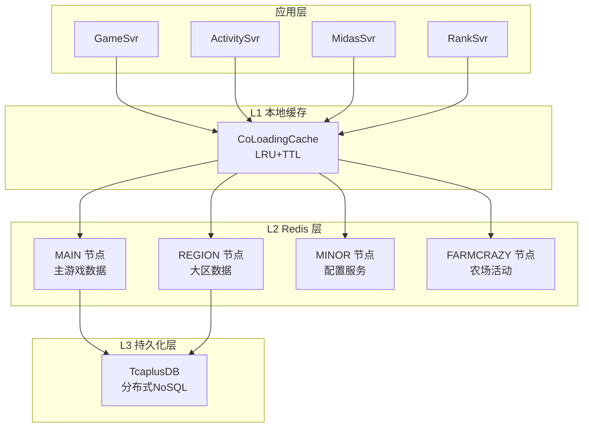

**Redis 在项目中承担的六大职能**：

| 职能 | 使用场景 | 使用的数据结构 | 典型业务 |
|------|---------|-------------|---------|
| **缓存加速** | 玩家数据、UGC地图、公开信息 | String（PB/JSON/ByteArray） | 三级缓存L2层 |
| **分布式锁** | 登录锁、支付锁、资源锁 | String（SETNX） | RedisLock、CacheLockAgent |
| **计数器** | 点赞数、游玩次数、限频 | String（INCR/INCRBY）+ Hash（HINCRBY） | 照片点赞、操作限频 |
| **排行榜** | 点赞排行、时间排行、钓鱼名人堂 | ZSet（ZADD/ZREVRANGE） | 照片墙排行、社团活跃榜 |
| **集合运算** | 好友关系、黑名单、订阅列表 | Set（SADD/SISMEMBER） | 好友申请、关注列表 |
| **队列/消息** | 延迟消息、异步通知 | List（RPUSH/LPOP） | 延迟私聊消息 |

### 1.2 Redis Key 命名规范

项目通过 `CacheUtil` 枚举 + `CacheApi` 接口实现统一的 Key 命名规范：

```java
// CacheApi.genPartitionKey 生成规则：
// {业务名}_{特性名}_{分区ID}_{业务Key}
// 示例：AlbumPicLikeNum__1001_100123456

// CacheApi.genUniformKey 生成规则（全区共享）：
// {业务名}_{特性名}_{业务Key}
// 示例：GlobalMailList__mailId_12345
```

**Key 设计原则**：

| 原则 | 实现方式 | 代码位置 |
|------|---------|---------|
| **业务隔离** | 每个业务场景一个 CacheUtil 枚举值作为前缀 | `CacheUtil.java` |
| **分区隔离** | Key 中包含 worldId，防止跨区数据污染 | `CacheApi.partition()` |
| **可追溯** | Key 格式固定，可从 Key 反推业务含义 | `CacheUtil.parseKey()` |
| **避免冲突** | 统一通过 `genPartitionKey()` 生成，禁止手动拼接 | `CacheApi` 接口约束 |

项目中 `CacheUtil` 枚举定义了 **260+ 种** Redis Key 前缀，覆盖玩家数据、UGC、社交、活动、农场、排行等全部业务域。

### 1.3 Redis 客户端技术选型——Lettuce

项目使用 **Lettuce** 作为 Redis 客户端（而非更常见的 Jedis），这是一个关键的技术决策。

**文件位置**：[RedisIns.java](/c:/UGit/letsgo_server/WeA/common/src/main/java/com/tencent/cache/RedisIns.java)

| 维度 | Jedis | Lettuce（项目选择） |
|------|-------|-------------------|
| 线程模型 | 阻塞式，连接不线程安全 | 基于 Netty 的异步非阻塞 |
| 连接方式 | 每个线程一个连接（或连接池） | 单连接多路复用 + 可选连接池 |
| 协程兼容 | 阻塞 IO 会 Pin 住协程线程 | **异步 API 天然适配协程 park/unpark** |
| 性能 | 高并发需大量连接 | 少量连接即可高吞吐 |
| 编解码 | 固定 | **支持自定义 Codec**（PB/JSON/ByteArray） |
| Redis集群 | 支持 | 支持 |

**选择 Lettuce 的核心原因**：项目使用 N:M 协程模型，Redis 操作必须异步化。Lettuce 的 `RedisFuture` + 协程 `park/unpark` 完美配合——发起 Redis 命令后协程挂起，命令完成后协程恢复，OS 线程始终不被阻塞。

---

## 二、Redis 连接管理与协程化封装

### 2.1 连接架构

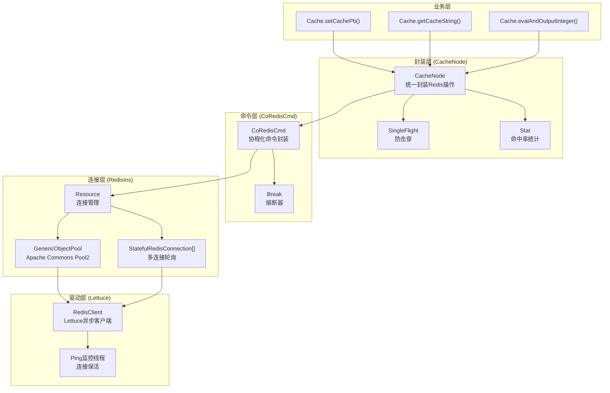

### 2.2 RedisIns——连接实例管理

**文件位置**：[RedisIns.java](/c:/UGit/letsgo_server/WeA/common/src/main/java/com/tencent/cache/RedisIns.java)

```java
// Redis 连接初始化
RedisURI uri = RedisURI.builder()
    .withHost(option.redisIP)
    .withPassword(option.redisPass)
    .withPort(option.redisPort)
    .withDatabase(option.redisDB)
    .build();

// 关闭 Lettuce 自带的延迟统计（避免额外开销）
ClientResources res = DefaultClientResources.builder()
    .commandLatencyCollectorOptions(
        DefaultCommandLatencyCollectorOptions.disabled())
    .build();

rc.client = RedisClient.create(res, uri);
```

**两种连接模式**：

| 模式 | 配置 | 实现方式 | 适用场景 |
|------|------|---------|---------|
| **多连接轮询**（默认） | `redis_use_pool=false` | 创建 N 个 `StatefulRedisConnection`，通过 `cursor.incrementAndGet() % N` 轮询 | 低延迟，连接数可控 |
| **连接池** | `redis_use_pool=true` | `ConnectionPoolSupport.createGenericObjectPool()` Apache Commons Pool2 | 连接数弹性伸缩 |

**多连接轮询模式核心代码**：

```java
// 轮询获取连接
public CoRedisCmd getRes(CodecType type) {
    int timeout = PropertyFileReader.getRealTimeIntItem("redis_cmd_timeout", 3000);
    int connCount = PropertyFileReader.getRealTimeIntItem("redis_conn_count", 10);
    
    long cur = cursor.incrementAndGet();          // 原子自增
    int idx = (int) (cur % connCount);            // 取模轮询
    List<StatefulRedisConnection> conns = allConn.get(type.ordinal());
    
    if (conns != null && idx < conns.size()) {
        return CoRedisCmd.wrap(conns.get(idx).async(), brk, timeout);
    }
    // 按需创建新连接
    return CoRedisCmd.wrap(createConnection(type, idx).async(), brk, timeout);
}
```

### 2.3 CoRedisCmd——协程化 Redis 命令

**文件位置**：[CoRedisCmd.java](/c:/UGit/letsgo_server/WeA/common/src/main/java/com/tencent/coRedis/CoRedisCmd.java)

CoRedisCmd 是连接业务层和 Lettuce 异步 API 的关键桥梁，核心设计：**将 Lettuce 的 `RedisFuture` 转换为协程 `park/unpark`**。

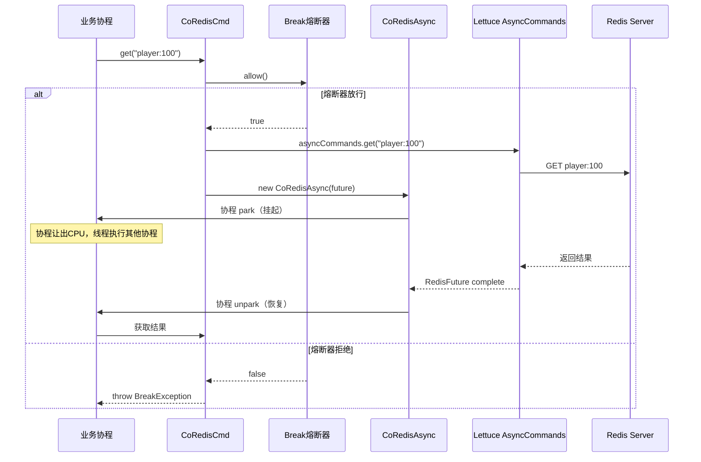

**核心特性**：

| 特性 | 实现方式 | 效果 |
|------|---------|------|
| **协程非阻塞** | `CoRedisAsync` 继承 `CoroutineAsync`，future 完成时 unpark | Redis IO 不阻塞 OS 线程 |
| **超时控制** | `redis_cmd_timeout` 配置，默认 3000ms | 防止慢查询拖垮协程 |
| **熔断保护** | 每次命令前检查 `Break.allow()` | Redis 故障时快速失败 |
| **多编码支持** | PB_TYPE / JSON_TYPE / STRING_TYPE / ByteArray_Type | 适配不同序列化需求 |

### 2.4 连接监控与保活

```java
// Redis 连接状态监听
rc.client.addListener(new RedisConnectionStateListener() {
    @Override
    public void onRedisConnected(RedisChannelHandler<?, ?> connection) {
        Monitor.getInstance().add.succ(MonitorId.attr_redis_conn_info, 1, monitorParam);
    }
    
    @Override
    public void onRedisDisconnected(RedisChannelHandler<?, ?> connection) {
        Monitor.getInstance().add.fail(MonitorId.attr_redis_conn_info, 1, monitorParam);
    }
});

// 定时 Ping-Pong 保活线程
pingSch.scheduleAtFixedRate(() -> {
    if (isPing || pingFlag) {
        ping();          // 遍历所有连接执行 PING
        isPing = false;
    }
}, 1, ttl, TimeUnit.SECONDS);  // 默认每10秒检查一次

// Ping 失败则重置连接
String response = sync.ping();
if (!"PONG".equals(response)) {
    conn.reset();  // 重置异常连接
}
```

---

## 三、Redis 数据结构选型与业务实践

### 3.1 数据结构使用全景

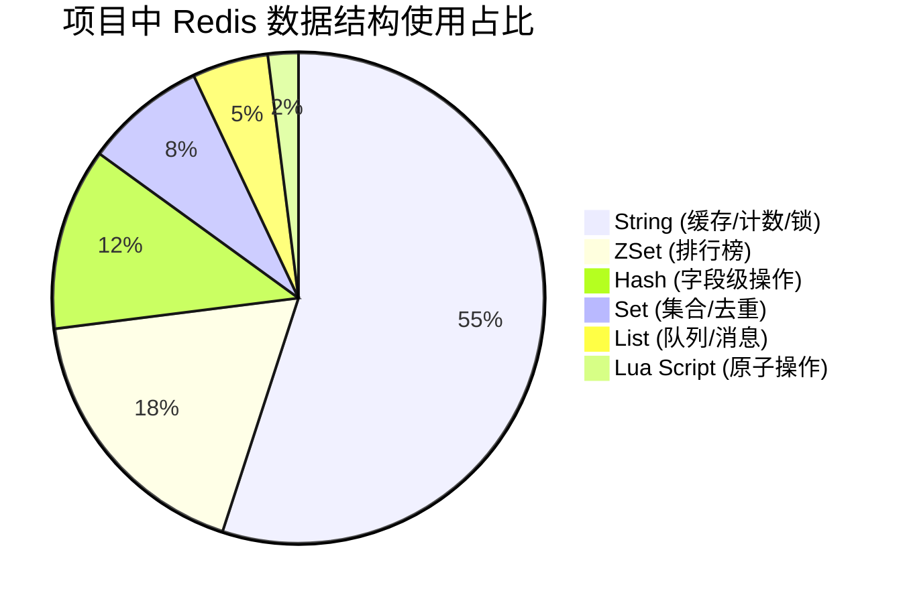

### 3.2 String——最广泛使用的数据结构

#### 3.2.1 多编码格式支持

项目通过 `CacheCodec` 实现了四种 String 编码格式：

| 编码类型 | Codec 实现 | 存储格式 | 适用场景 | 序列化开销 |
|---------|-----------|---------|---------|-----------|
| `PB_TYPE` | 自定义 Protobuf Codec | 二进制 | 玩家数据、UGC数据 | 最小 |
| `JSON_TYPE` | JSON Codec | JSON 字符串 | 需要可读性的场景 | 中等 |
| `STRING_TYPE` | Lettuce StringCodec | UTF-8 字符串 | 简单值、计数器 | 最小 |
| `ByteArray_Type` | 自定义 ByteArray Codec | 原始字节 | 图片信息等二进制数据 | 无 |

**使用示例**：

```java
// PB 格式缓存（最常用）——二进制存储，体积最小
Cache.setCachePbWithRandExpiry("player:100", playerBuilder, 3600);

// JSON 格式缓存——可读性好，便于调试
Cache.setCachePbForJsonWithExpiry("config:activity", configBuilder, 7200);

// String 格式缓存——简单值
Cache.setCacheStringWithExpiry("token:abc123", "uid_12345", 1800);

// ByteArray 格式缓存——原始二进制
Cache.setCacheByteArrayWithExpiry("pic:wall:info", picInfo.toByteArray(), 86400);
```

#### 3.2.2 SETNX 分布式锁

```java
// RedisLock 核心实现
String lockValue = String.valueOf(CoroHandle.current().coroBaseInfo.coroHandleId());
Boolean setnxRet = coRedisCmd.setnx(lockName, lockValue);
if (setnxRet) {
    doExpire(lockName, expireTime);  // 设置过期时间
    return lockValue;
}
```

#### 3.2.3 INCR/INCRBY 原子计数

```java
// 照片点赞——Hash 字段级原子自增
coRedisCmd.hincrby(redisKey, picKey, incrNum);

// 带上限的安全自增（Lua 脚本）
CacheScript.incrScript:
  if cur < max then incrby else return cur
```

### 3.3 ZSet——排行榜核心数据结构

#### 3.3.1 照片墙排行榜实现

**文件位置**：[AlbumPicLikeNumericDao.java](/c:/UGit/letsgo_server/WeA/common/src/main/java/com/tencent/wea/redis/AlbumPicLikeNumericDao.java)

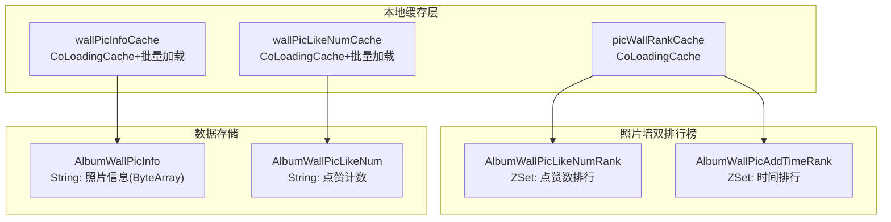

**Lua 脚本原子更新排行榜**：

```lua
-- setAndUpdateZsetScript: 原子性"更新ZSet + 容量控制 + 设置过期"
local current_score = redis.call('zscore', zset_key, member_key)

-- 只有新 score 更大才更新（防止降分覆盖）
if current_score == false or member_score > tonumber(current_score) then
    redis.call('zadd', zset_key, member_score, member_key)
    
    -- 超过上限移除 score 最小的元素
    local zset_size = redis.call('zcard', zset_key)
    if zset_size > max_limit then
        redis.call('zremrangebyrank', zset_key, 0, zset_size - max_limit - 1)
    end
    
    -- 设置过期时间
    redis.call('expireat', zset_key, expire_timestamp)
    return 1
end
return 0
```

**设计亮点**：
- **容量上限控制**：`max_limit` 参数（默认 2000）限制 ZSet 成员数，自动淘汰低分成员
- **单调递增保护**：只有新 score > 旧 score 才更新，防止并发操作导致数据回退
- **原子性**：整个"比较→更新→裁剪→设过期"操作在一个 Lua 脚本中完成

#### 3.3.2 ZSet 使用模式总结

| 场景 | Key 示例 | Score 含义 | Member 含义 | 操作 |
|------|---------|-----------|------------|------|
| 点赞排行 | `AlbumWallPicLikeNumRank_{labelType}` | 点赞数 | `uid-picKey` | ZADD + ZREVRANGE |
| 时间排行 | `AlbumWallPicAddTimeRank_{labelType}` | Unix 时间戳 | `uid-picKey` | ZADD + ZREVRANGE |
| 社团活跃 | `TopNClubHeat_{worldId}` | 活跃值 | clubId | ZADD + ZRANGE |
| 钓鱼名人堂 | `FarmFishingHallOfFameRank_{worldId}` | 鱼的重量 | uid | ZADD + ZREVRANGE |

### 3.4 Hash——字段级操作

```java
// 照片点赞计数——一个玩家的所有照片点赞数存在一个 Hash 中
// Key: AlbumPicLikeNum_{worldId}_{uid}
// Field: picKey
// Value: 点赞数

// 读取单张照片点赞数
String valueStr = coRedisCmd.hget(redisKey, picKey);

// 原子自增
coRedisCmd.hincrby(redisKey, picKey, incrNum);

// 批量设置（hmset）
Cache.hmset(key, fieldsMap);

// 批量获取（hmget）
Cache.hmget(key, field1, field2, field3);
```

**Hash vs String 选型决策**：

| 维度 | String（每个字段一个Key） | Hash（一个Key多个字段） |
|------|------------------------|---------------------|
| 内存效率 | 每个Key有额外开销（~50字节） | 字段共享Key开销，ziplist编码更省内存 |
| 过期控制 | 每个字段可独立过期 | 只能整个Key过期 |
| 原子性 | 单个操作天然原子 | HMSET/HINCRBY 原子 |
| 适用场景 | 字段间TTL不同 | 同一实体的多个属性 |
| 项目选型 | 缓存、锁、计数器 | 玩家照片点赞（同一玩家多照片） |

### 3.5 Set——集合与去重

```java
// 好友关系存储
Cache.saddCacheForString(key, friendUid);

// 检查是否已关注
Cache.sismemberCacheForString(key, targetUid);

// 获取全部好友
Cache.smembersForString(key);

// 随机获取一个成员（陌生人推荐）
Cache.srandMemberCacheForString(key);

// 弹出一个成员（抽奖池）
Cache.spopCacheForString(key);
```

### 3.6 List——消息队列

```java
// 延迟私聊消息队列
// 生产者端：消息入队
Cache.rpushCacheForPb(key, messageBuilder);

// 消费者端：消息出队
CacheResult<T> msg = Cache.lpopCacheForPb(key);

// 队列长度检查
CacheResult<Long> len = Cache.llenCacheForString(key);
```

---

## 四、Redis 熔断器与高可用保障

### 4.1 Break 熔断器——自适应概率丢弃

**文件位置**：[Break.java](/c:/UGit/letsgo_server/WeA/common/src/main/java/com/tencent/cache/Break.java)

项目实现了一个基于 **滑动窗口 + 概率丢弃** 的自适应熔断器，这不同于传统的三态熔断器（Open/HalfOpen/Closed），而是采用 Google SRE 推荐的**客户端自适应限流算法**。

#### 4.1.1 算法原理

```java
// 核心公式：
// dropRatio = max(0, (total - protection - K * success) / (total + 1))
//
// 其中：
// total = 滑动窗口内总请求数
// success = 滑动窗口内成功请求数
// K = 放大系数（默认1.3，可配置）
// protection = 保护基数（默认1）

private boolean accept() {
    BucketCollector bc = new BucketCollector() {};
    this.rw.stat(bc);  // 统计滑动窗口内的 total 和 success
    
    float k = PropertyFileReader.getFloatItem("redis_break_k", 1.3f);
    float acceptWeight = k * bc.count;    // 成功数放大 1.3 倍
    
    // 计算丢弃概率
    float dropRatio = Math.max(0,
        ((float)(bc.total - protection) - acceptWeight) / (float)(bc.total + 1));
    
    if (dropRatio <= 0) return true;      // 健康状态，全部放行
    
    // 概率性丢弃
    if (RandomGenerator.getInstance().nextDouble() < dropRatio) {
        return false;  // 丢弃此请求
    }
    return true;
}
```

#### 4.1.2 算法特性

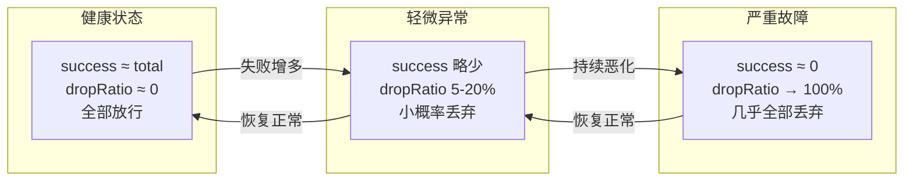

**与传统三态熔断器对比**：

| 维度 | 传统三态（如Hystrix） | 项目概率丢弃 |
|------|-------------------|-----------|
| 状态转换 | 离散：Open→HalfOpen→Closed | **连续**：丢弃概率平滑变化 |
| 恢复策略 | HalfOpen 试探一个请求 | **自动恢复**：成功率提升→概率自动降低 |
| 过度保护风险 | 可能：全Open时所有请求被拦截 | **低**：即使高失败率也有请求通过 |
| K值调节 | 无 | K=1.3 允许 30% 超额请求，加速恢复 |
| 配置复杂度 | 需设阈值、超时、试探次数 | **仅需配置 K 值和窗口大小** |

#### 4.1.3 滑动窗口实现

```java
// 滑动窗口参数
private static final int WINDOW = 10 * 1000;   // 窗口大小：10秒
private static final int BUCKETS = 20;           // 桶数量：20个
// 每个桶跨度 = 10000ms / 20 = 500ms

// 熔断触发时回调
brk.setListen((msg) -> {
    isPing = true;  // 触发 Ping 检测
    Monitor.getInstance().add.succ(MonitorId.attr_redis_break_count, 1);
});
```

### 4.2 CacheErrorCode——错误码体系

```java
public enum CacheErrorCode {
    UN_KNOW_ERROR(0),  // Lettuce 内部错误
    OK(1),             // 成功
    INTERRUPTED(2),    // 协程被中断
    TIMEOUT(3),        // 异步获取结果超时
    BREAK(4);          // 熔断
}
```

**业务层根据 ErrorCode 做差异化处理**：

```java
CacheResult<T> result = Cache.getCachePb(key);
switch (result.errCode) {
    case OK:       return result.val;
    case TIMEOUT:  // 超时：返回兜底数据或重试
    case BREAK:    // 熔断：直接降级，不访问 Redis
    case INTERRUPTED: // 中断：记录日志，返回默认值
}
```

### 4.3 多节点隔离——业务域故障隔离

```java
// 四种 Redis 节点类型
public enum CacheNodeType {
    MAIN,       // 主游戏节点：玩家数据、UGC、社交等核心业务
    REGION,     // 大区节点：跨服数据（QQ区/微信区共享）
    MINOR,      // 次要节点：ConfigSvr 配置服务专用
    FARMCRAZY,  // 农场活动节点：奇迹农场专用
}
```

**隔离策略**：

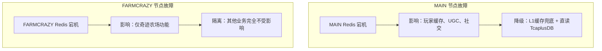

---

## 五、Lua 脚本——原子操作保障

### 5.1 项目中的 Lua 脚本库

**文件位置**：[CacheScript.java](/c:/UGit/letsgo_server/WeA/common/src/main/java/com/tencent/cache/CacheScript.java)

项目封装了 **8 个** Lua 脚本，覆盖原子计数、条件删除、排行榜更新等核心场景：

| 脚本名 | 功能 | 原子操作内容 | 使用场景 |
|--------|------|-----------|---------|
| `decrScript` | 安全递减 | GET → 判断 ≥ step → DECRBY | 库存扣减（不扣到负数） |
| `incrScript` | 带上限递增 | GET → 判断 < max → INCRBY | 限频计数（不超上限） |
| `incrWithExpireScript` | 带上限递增+设过期 | GET → 判断 < max → INCRBY → EXPIRE | 活动参与次数限制 |
| `checkValueAndDelScript` | 条件删除（CAS） | GET → 比较 value → DEL | **分布式锁安全释放** |
| `checkValueExpireScript` | 条件续期 | GET → 比较 value → EXPIRE | **分布式锁安全续期** |
| `checkKeyExpireScript` | 存在时续期 | EXISTS → EXPIRE | Key 保活 |
| `checkZSetLimitAndDealScript` | ZSet 容量控制 | ZCARD → ZREMRANGEBYRANK | 排行榜容量上限管理 |
| `setAndUpdateZsetScript` | 排行榜原子更新 | ZSCORE → ZADD → ZCARD → ZREMRANGEBYRANK → EXPIREAT | **照片墙排行榜** |

### 5.2 分布式锁的 Lua 脚本安全性

#### 5.2.1 安全释放锁（checkValueAndDelScript）

```lua
-- 只有锁持有者才能删除锁
local current_value = redis.call('GET', KEYS[1])
if current_value == ARGV[1] then  -- 值匹配才删除
    redis.call('DEL', KEYS[1])
    return 1
else
    return 0
end
```

**为什么需要 Lua 脚本？** 如果用两条独立命令 `GET` + `DEL`：

```
时刻1: 协程A GET lock → 值="A"，确认是自己的锁
时刻2: 锁过期自动删除
时刻3: 协程B SETNX lock → 值="B"，获取新锁
时刻4: 协程A DEL lock → 删除了协程B的锁！（严重Bug）
```

Lua 脚本保证 GET + 比较 + DEL 在一个原子操作中完成，杜绝上述竞态条件。

#### 5.2.2 安全续期锁（checkValueExpireScript）

```lua
-- 只有锁持有者才能续期
local current_value = redis.call('GET', key)
if current_value == expected_value then
    redis.call('EXPIRE', key, ttl)
    return 1
else
    return 0  -- 值不匹配，锁已被他人获取
end
```

### 5.3 安全递减——防止扣到负数

```lua
-- decrScript: 库存扣减安全保护
local cur = tonumber(redis.call('get', KEYS[1]) or 0)
local decr = tonumber(ARGV[1])
if cur >= decr then           -- 当前值 ≥ 扣减量才执行
    return redis.call('decrby', KEYS[1], decr)
else
    return cur                -- 不足则返回当前值，不扣减
end
```

**业务场景**：活动道具兑换、限量商品购买等，确保并发扣减时不出现负数。

### 5.4 CacheApi 统一封装

`CacheApi` 接口为 Lua 脚本操作提供了统一的高层 API：

```java
// 安全递增（带上限）
default <K> CacheResult<Long> incr(K key, long step, long max);

// 安全递增（带上限+过期时间）
default <K> CacheResult<Long> incrWithExpire(K key, long step, long max, long expireSec);

// 安全递减
default <K> CacheResult<Long> decr(K key, long step);

// 安全删除（CAS）
default <K> CacheResult<Long> delSafe(K key, String value);

// 条件续期
default <K> CacheResult<Long> expireKeyIfValueEqual(K key, String expectedValue, long sec);

// ZSet 容量控制
default <K> CacheResult<Long> checkZSetLimitAndDeal(K key, long maxSize);
```

---

## 六、分布式锁深度分析

### 6.1 RedisLock——轻量级分布式锁

**文件位置**：[RedisLock.java](/c:/UGit/letsgo_server/WeA/common/src/main/java/com/tencent/wea/redis/lock/RedisLock.java)

#### 6.1.1 实现原理

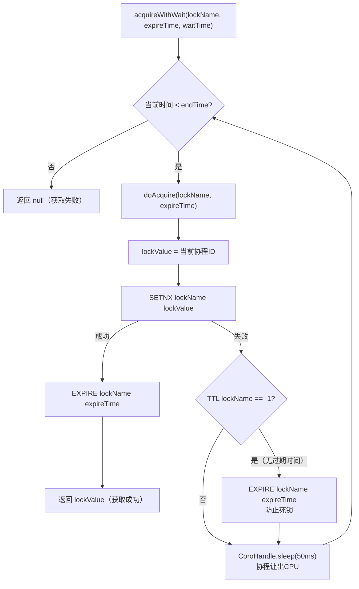

#### 6.1.2 核心代码分析

```java
// 锁值 = 当前协程ID（全局唯一标识）
String lockValue = String.valueOf(CoroHandle.current().coroBaseInfo.coroHandleId());

// 获取锁
Boolean setnxRet = coRedisCmd.setnx(lockName, lockValue);
if (setnxRet) {
    doExpire(lockName, expireTime);   // 设置过期时间
    return lockValue;
} else {
    // 防护：如果锁没有TTL（可能是之前SETNX成功但EXPIRE失败），强制设置
    Long ttl = coRedisCmd.ttl(lockName);
    if (ttl == -1) {
        doExpire(lockName, expireTime);
    }
}

// 释放锁（非原子操作——已知缺陷）
public boolean release(String lockName, String lockValue) {
    String ret = coRedisCmd.get(lockName);
    if (ret.equals(lockValue)) {
        coRedisCmd.del(lockName);    // GET + DEL 不是原子操作
        return true;
    }
    return false;
}
```

#### 6.1.3 已知问题与改进方案

| 问题 | 现状 | 风险 | 改进方案 |
|------|------|------|---------|
| **SETNX + EXPIRE 非原子** | 两条独立命令 | SETNX 成功但 EXPIRE 失败→死锁 | `SET key value EX seconds NX` 原子命令 |
| **释放不安全** | GET + DEL 非原子 | 释放了他人的锁 | 使用 `checkValueAndDelScript` Lua 脚本 |
| **无自动续期** | 锁可能提前过期 | 业务未完成锁已释放 | 添加 watchdog 协程定期续期 |
| **等待粒度粗** | 每 50ms 检查一次 | 获取锁延迟最大 50ms | 可用 Redis Pub/Sub 通知 |

**改进后的安全释放**（项目中 `Cache` 类已提供）：

```java
// 使用 Lua 脚本安全释放（项目中已有实现）
public static boolean delKeyIfValueEqualTo(String key, String value) {
    String script = "if redis.call(\"get\", KEYS[1]) == ARGV[1]\n"
                  + "then return redis.call(\"del\", KEYS[1])\n"
                  + "else return 0 end";
    Long number = coRedisCmd.eval(script, ScriptOutputType.INTEGER, 
                                   new String[]{key}, value);
    return number == 1;
}
```

### 6.2 三种分布式锁对比——Redis vs TcaplusDB

| 维度 | RedisLock | CacheLockAgent | DistributedLockMgr |
|------|-----------|---------------|-------------------|
| **存储后端** | Redis | TcaplusDB | TcaplusDB |
| **获取速度** | **最快**（1-10ms） | 中等（10-100ms） | 中等（10-100ms） |
| **自动续期** | ❌ | ✅ 定时器自动续期 | ❌ |
| **持久性** | Redis重启丢失 | **持久化到磁盘** | **持久化到磁盘** |
| **锁抢占** | ❌ | ✅ RPC通知释放 | ❌ |
| **CAP策略** | ❌ | ✅ 强一致/可用性可选 | ❌ |
| **适用场景** | 短期互斥（秒级） | 长期缓存管理 | 跨服资源互斥 |
| **典型使用** | 登录锁、支付锁 | cachesvr数据管理 | 活动创建互斥 |

### 6.3 Redis 锁使用最佳实践

```java
// 项目中推荐的 Redis 锁使用模式
String lockValue = null;
try {
    lockValue = redisLock.acquireWithWait(lockName, 5000, 3000);
    if (lockValue == null) {
        // 获取锁超时，返回"操作过于频繁"
        NKErrorCode.OperateTooFrequent.throwError("lock timeout");
    }
    // 执行业务逻辑（确保在锁过期时间内完成）
    doBusiness();
} finally {
    if (lockValue != null) {
        redisLock.release(lockName, lockValue);
    }
}
```

---

## 七、缓存一致性策略

### 7.1 Cache-Aside 模式详解

项目严格遵循 **Cache-Aside（旁路缓存）** 模式：

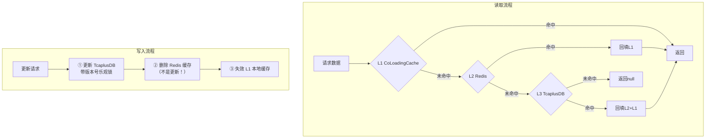

### 7.2 为什么"删除"而非"更新"缓存？

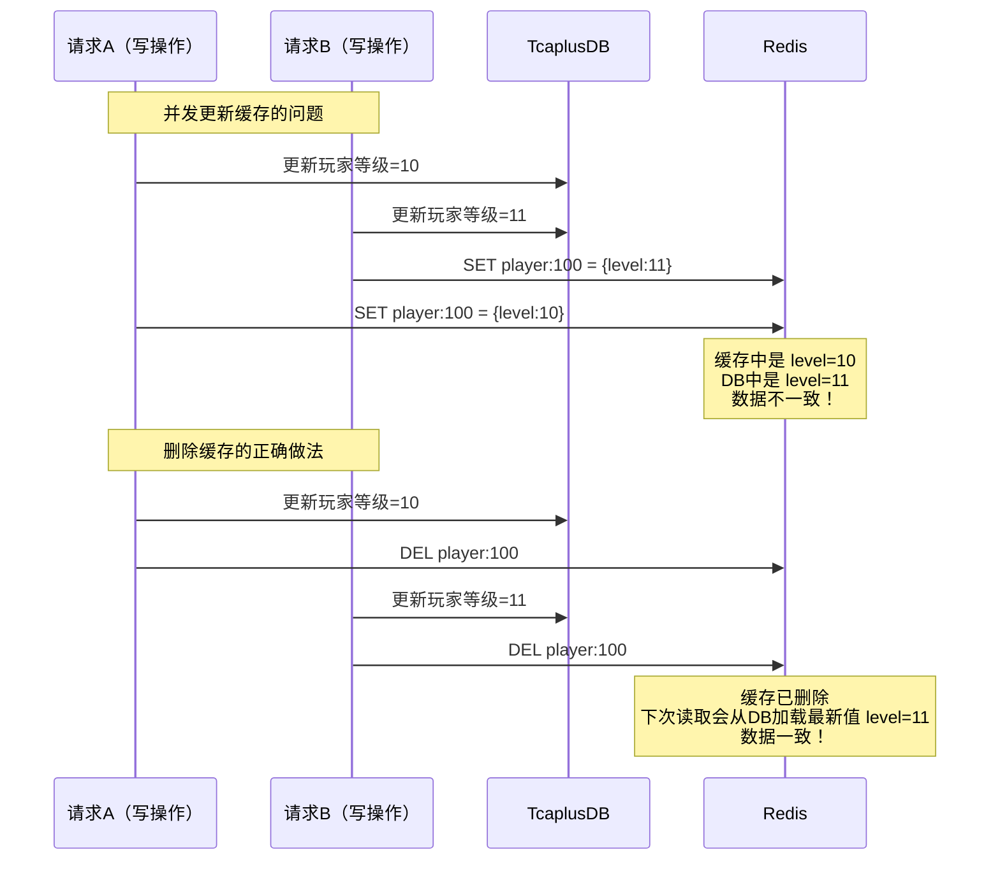

### 7.3 TTL 随机化防雪崩

```java
// CacheNode.getRandExpiry() —— TTL 随机化
// 在基准 TTL 上做 ±5% 的随机浮动
public long getRandExpiry(long sec) {
    return randomByRatio(sec, 0.05);  // [sec*0.95, sec*1.05]
}

// CacheApi.randomByRatio() 实现
default long randomByRatio(long base, double ratio) {
    double factor = 1 + ratio - 2 * ratio * randNext();
    return (long) (base * factor);
}

// 使用示例
Cache.setCachePbWithRandExpiry("player:100", builder, 3600);
// 实际 TTL 在 3420s ~ 3780s 之间随机
```

**效果**：即使同一时刻缓存大量数据，过期时间也会分散在一个范围内，避免集体过期导致的缓存雪崩。

### 7.4 空值缓存防穿透

```java
// CacheNode.getCache() 中的防穿透逻辑
// 当 Redis 返回空值（null）时，CacheNode 写入占位符 "*"
// 占位符有短 TTL（如 5 分钟），防止恶意请求反复穿透到 DB

// 读取时检测占位符
if (result.errCode == CacheErrorCode.OK 
    && type == CodecType.STRING_TYPE 
    && result.val != null 
    && "*".equals(result.val.toString())) {
    result.val = null;  // 占位符转换为 null 返回业务层
}
```

### 7.5 SingleFlight 防击穿

```java
// CacheNode.getCache() 中的 SingleFlight 集成
// 当 useSingleFlight=true 时，相同 Key 的并发请求只有第一个执行 Redis 查询
public <T> CacheResult<T> getCache(String key, CodecType type, 
                                    boolean useSingleFlight, Supplier<T> query) {
    // useSingleFlight=true: 合并并发请求
    // useSingleFlight=false: 每个请求独立查询
}

// 业务层选择
Cache.getCacheStringForSingleFlight(key);  // 启用 SingleFlight
Cache.getCacheString(key);                  // 不启用 SingleFlight
```

---

## 八、监控与可观测性

### 8.1 Stat 统计组件——命中率监控

```java
// CacheNode 内置 Stat 统计，7 个核心指标
public class Stat {
    private AtomicLong total;    // 总请求数
    private AtomicLong hit;      // 缓存命中
    private AtomicLong miss;     // 缓存未命中
    private AtomicLong dbFail;   // DB回源失败
    private AtomicLong error;    // 未知错误
    private AtomicLong timeOut;  // 超时
    private AtomicLong bre;      // 熔断次数
    
    // 定期输出统计并重置（getAndSet原子操作）
    public void proc() {
        long t = total.getAndSet(0);
        long h = hit.getAndSet(0);
        // 计算命中率: h / t * 100%
        // 输出日志 + 上报 Monitor
    }
}
```

### 8.2 连接状态监控

```java
// 连接建立/断开事件上报
Monitor.getInstance().add.succ(MonitorId.attr_redis_conn_info, 1);  // 连接成功
Monitor.getInstance().add.fail(MonitorId.attr_redis_conn_info, 1);  // 连接断开

// 熔断次数上报
Monitor.getInstance().add.succ(MonitorId.attr_redis_break_count, 1);
```

### 8.3 监控指标总览

| 指标名 | 类型 | 含义 | 告警阈值建议 |
|--------|------|------|------------|
| `attr_redis_conn_info` | 计数 | 连接建立/断开次数 | 断开 > 5次/分钟 |
| `attr_redis_break_count` | 计数 | 熔断触发次数 | > 0 |
| `cache_hit_rate` | 百分比 | 缓存命中率 | < 80% |
| `cache_timeout_count` | 计数 | 超时次数 | > 10次/分钟 |
| `redis_cmd_timeout` | 配置 | 命令超时时间 | 默认 3000ms |

---

## 九、Redis 使用优化实践

### 9.1 批量操作——减少网络往返

```java
// 单条查询（N次网络往返）
for (String key : keyList) {
    Cache.getCachePb(key);  // 每次一个 RTT
}

// 批量查询（1次网络往返）
Cache.mgetCachePb(key1, key2, key3);  // MGET 一次完成

// 项目中的实际案例：照片墙批量加载
// wallPicInfoCache 支持 batchLoader
private static final CoLoadingCache<String, proto_AlbumPicInfo> wallPicInfoCache = 
    new CoLoadingCache.Builder<String, proto_AlbumPicInfo>()
        .setLoader(AlbumPicLikeNumericDao::loadWallPicInfo)           // 单条加载
        .setBatchLoader(AlbumPicLikeNumericDao::loadWallPicInfoBatch) // 批量加载
        .build();

// 批量加载实现：一次 MGET 查询多个照片信息
private static Map<String, proto_AlbumPicInfo> loadWallPicInfoBatch(
        Collection<String> wallPicKeyList) {
    CacheResult<List<KeyValue<String, byte[]>>> result = 
        CacheUtil.AlbumWallPicInfo.mgetCacheByteArray(
            Arrays.asList(wallPicKeyList.toArray()));
    // 反序列化并返回
}
```

### 9.2 本地缓存 + Redis 双层防护

```java
// CoLoadingCache 作为 L1 缓存，减少 Redis 访问
// 照片墙排行榜缓存——60秒本地缓存
private static final CoLoadingCache<T2<RankType, AlbumPicLabelType>, List<ScoredValue<String>>> 
    picWallRankCache = new CoLoadingCache.Builder<>()
        .setLoader(AlbumPicLikeNumericDao::loadWallPicRank)  // L2 Redis 回源
        .setLockKeyBuilder(new LockKeyBuilder<>("wall_pic_rank", Object::toString))
        .setCapacity(10)
        .expireAfterWrite(60 * 1000)  // 60秒本地缓存
        .build();

// 效果：60秒内同一排行榜只查一次 Redis
// 配合 LockKeyBuilder 协程排队，防止并发回源
```

### 9.3 Key 过期时间策略

| 数据类型 | TTL 策略 | 理由 |
|---------|---------|------|
| 玩家缓存 | 随机化 TTL（3600s ± 5%） | 防雪崩 |
| 活动配置 | 固定 TTL 或永不过期 | 热点数据 |
| 分布式锁 | 固定短 TTL（5-15s） | 防死锁 |
| 空值占位符 | 短 TTL（5 分钟） | 防穿透但不浪费内存 |
| 支付幂等标记 | 8 小时 | 覆盖支付回调窗口期 |
| 排行榜 | EXPIREAT 绝对时间 | 活动结束后自动清理 |

### 9.4 热 Key 与大 Key 治理

#### 9.4.1 热 Key 治理

| 问题 | 项目治理方案 | 效果 |
|------|-----------|------|
| 排行榜 Top 玩家频繁被查 | CoLoadingCache 本地缓存（60s TTL） | Redis 请求量减少 95%+ |
| 活动首日配置缓存击穿 | SingleFlight 请求合并 | DB 查询合并为 1 次 |
| 全服公开信息频繁访问 | 永不过期 + 主动失效 | 零穿透 |

#### 9.4.2 大 Key 治理

| 问题 | 项目治理方案 | 效果 |
|------|-----------|------|
| ZSet 排行榜无限增长 | `setAndUpdateZsetScript` 中 `max_limit=2000` 自动裁剪 | ZSet 大小可控 |
| 玩家订单表无限增长 | `BillUtil` 超过 2000 条自动删除最早订单 | 内存可控 |
| Hash 字段过多 | 按业务域拆分不同 CacheUtil 枚举 | 避免单个 Hash 过大 |

---

## 十、对标业界 Redis 最佳实践

### 10.1 与 Redis 官方最佳实践对标

| 最佳实践 | 项目实现情况 | 评估 |
|---------|------------|------|
| **Key 命名规范** | CacheUtil 枚举 + CacheApi 接口统一生成 | ✅ 优秀 |
| **合理设置 TTL** | 随机化防雪崩 + 分场景差异化 TTL | ✅ 优秀 |
| **使用连接池** | Lettuce 多连接轮询 + 可选 Pool2 连接池 | ✅ 良好 |
| **批量操作代替循环** | MGET/HMGET 批量查询 + CoLoadingCache batchLoader | ✅ 良好 |
| **Lua 脚本原子操作** | 8 个 Lua 脚本覆盖锁/计数/排行榜 | ✅ 优秀 |
| **熔断保护** | Break 自适应概率丢弃 | ✅ 优秀（超越传统三态） |
| **避免大 Key** | ZSet max_limit 裁剪 + 订单自动清理 | ✅ 良好 |
| **监控告警** | 7 维度 Stat 统计 + 连接监控 + 熔断计数 | ⚠️ 可补充命中率大盘 |
| **Pipeline 批量发送** | 未使用 Redis Pipeline | ⚠️ 可优化高频批量场景 |
| **读写分离** | 未使用（单实例模式） | ⚠️ 高读场景可考虑 |

### 10.2 改进空间

| 改进点 | 现状 | 建议方案 | 优先级 |
|--------|------|---------|:------:|
| **RedisLock 原子性** | SETNX + EXPIRE 分离 | `SET key value EX seconds NX` | P0 |
| **RedisLock 释放安全** | GET + DEL 非原子 | 使用已有的 `checkValueAndDelScript` | P0 |
| **自动续期** | RedisLock 无 watchdog | 添加协程定时续期任务 | P1 |
| **Redis Pipeline** | 未使用 | 批量写入场景使用 Pipeline | P1 |
| **缓存预热** | 冷启动缓存为空 | 服务启动时主动加载热点数据 | P2 |
| **Redis Pub/Sub** | 未使用 | L1 缓存失效广播通知 | P2 |
| **Redis Cluster** | 单实例/多节点隔离 | 数据量增长后迁移到集群模式 | P2 |

---

## 十一、面试专栏

### 11.1 Redis 核心原理面试 QA

**Q1：Redis 为什么这么快？**

> "Redis 快的核心原因有五个：
> 1. **纯内存操作**：数据存储在内存中，内存读写速度是磁盘的 10 万倍
> 2. **单线程模型**（6.0 之前）：避免了多线程上下文切换和锁竞争的开销
> 3. **IO 多路复用**：epoll/kqueue 高效处理大量并发连接，一个线程处理数万连接
> 4. **高效数据结构**：SDS、ziplist、intset、skiplist 等针对不同场景做了极致优化
> 5. **单线程避免了锁**：所有操作天然原子，无需加锁
>
> 在我们项目中，Redis 的 P99 延迟在 1-10ms 之间（网络 + 序列化），本地缓存命中则 < 1ms。"

**Q2：Redis 的持久化机制有哪些？各有什么优缺点？**

> "Redis 提供两种持久化机制：
>
> **RDB（快照）**：定期将内存数据快照写入磁盘。优点是文件紧凑、恢复速度快；缺点是可能丢失最后一次快照后的数据。
>
> **AOF（追加日志）**：每次写操作追加到日志文件。优点是数据丢失少（可配置 everysec/always）；缺点是文件较大、恢复较慢。
>
> **混合持久化**（Redis 4.0+）：RDB + AOF 结合，兼顾两者优势。
>
> 在我们项目中，Redis 主要作为缓存层（L2），数据源是 TcaplusDB。即使 Redis 数据全部丢失，也能从 L3 重建，所以我们更关注 Redis 的**可用性**而非持久化。我们通过多节点隔离（MAIN/REGION/MINOR/FARMCRAZY）实现故障隔离，通过 Break 熔断器实现故障时自动降级。"

**Q3：你们项目怎么解决缓存穿透、击穿、雪崩？**

> "我们有一套完整的三级防护体系：
>
> **缓存穿透**（查不存在的数据）：三层防护——DAO 层参数校验拦截非法请求、CacheNode 空值占位符（`*`，5 分钟 TTL）、SingleFlight 合并穿透请求。
>
> **缓存击穿**（热点 Key 过期）：SingleFlight 在 CacheNode 层合并同 Key 并发请求，只有第一个请求查 DB；CoLoadingCache 的协程读写锁排队加载；核心配置永不过期。
>
> **缓存雪崩**（大量 Key 同时过期）：TTL 随机化（±5% 浮动）、Break 自适应熔断器、三级缓存架构（L1 本地兜底）、业务层降级处理。
>
> 实际效果：活动首日开服零故障，数千并发请求通过 SingleFlight 合并为 1 次 DB 查询。"

**Q4：你们的 Redis 分布式锁是怎么实现的？有什么问题？**

> "我们有三种分布式锁实现，按场景选型：
>
> **RedisLock**（轻量级）：基于 SETNX + EXPIRE，锁值是协程 ID。适合秒级短期互斥，如登录锁、支付锁。已知问题是 SETNX 和 EXPIRE 非原子——如果 SETNX 成功但 EXPIRE 失败会导致死锁，我们通过 TTL 检测来兜底（发现 TTL=-1 时强制设置过期时间）。
>
> **CacheLockAgent**（最完善）：基于 TcaplusDB 持久化存储，支持自动续期、CAP 策略选择、锁抢占机制。用于 cachesvr 的有状态数据管理等核心场景。
>
> **DistributedLockMgr**（基于TcaplusDB乐观锁）：版本号 CAS 机制，最多重试 3 次。用于跨服活动创建等场景。
>
> Redis 锁的核心改进方向是使用 `SET key value EX seconds NX` 原子命令替代 SETNX + EXPIRE，以及使用 Lua 脚本实现安全释放（我们的 CacheScript 中已有 `checkValueAndDelScript`）。"

**Q5：你们怎么选择 Redis 客户端？为什么用 Lettuce 不用 Jedis？**

> "核心原因是**协程兼容性**。我们的服务端使用 N:M 协程模型（Kona Fiber），Redis 操作必须是非阻塞的。
>
> Jedis 是阻塞式 IO，在协程环境下会 Pin 住底层 OS 线程——一个 Redis 命令等待 5ms，整个线程上的数千个协程都无法调度。
>
> Lettuce 基于 Netty 的异步 IO，返回 `RedisFuture`。我们通过 `CoRedisAsync` 将 Future 完成事件转换为协程 `unpark`，Redis IO 等待期间协程挂起，OS 线程继续执行其他协程。
>
> Lettuce 还有一个优势：**单连接多路复用**。不像 Jedis 需要大量连接池，我们默认只需 10 个连接就能支撑数万并发请求。"

**Q6：你们 Redis 的熔断器是怎么设计的？和 Hystrix 有什么区别？**

> "我们采用了 Google SRE 推荐的**自适应客户端限流算法**，而不是传统的三态熔断器。
>
> 核心公式：`dropRatio = max(0, (total - K * success) / (total + 1))`
>
> K 值默认 1.3，意味着允许 30% 的超额请求通过——这是恢复期的关键，让系统有机会逐渐恢复。
>
> 与 Hystrix 的核心区别：
> 1. **状态是连续的**：丢弃概率从 0% 平滑上升到接近 100%，没有突变
> 2. **自动恢复**：不需要 HalfOpen 试探，成功率上升时概率自动降低
> 3. **不会过度保护**：即使高失败率，也有少量请求通过，不会像 Hystrix Open 状态那样完全拒绝
> 4. **配置简单**：只需设置 K 值和窗口大小，不需要设阈值、超时、试探次数
>
> 滑动窗口是 10 秒 / 20 个桶 = 每 500ms 一个桶，统计颗粒度足够细。"

**Q7：Lua 脚本在你们项目中怎么使用的？为什么不直接用 Redis 事务（MULTI/EXEC）？**

> "我们用 Lua 脚本解决三类原子性问题：
>
> 1. **分布式锁安全操作**：`checkValueAndDelScript`（CAS 删除）和 `checkValueExpireScript`（条件续期），保证只有锁持有者能释放/续期
> 2. **安全计数器**：`incrScript`（带上限递增）和 `decrScript`（安全递减），防止溢出和扣到负数
> 3. **排行榜原子更新**：`setAndUpdateZsetScript` 在一个脚本中完成"比较→更新→裁剪→设过期"
>
> 不用 MULTI/EXEC 的原因：Redis 事务不支持条件分支——MULTI 中的命令全部执行或全部不执行，但无法根据中间结果做判断。比如'如果当前值 < max 才 INCR'这种逻辑，事务做不到，只有 Lua 脚本能实现。
>
> 另外 Lua 脚本在 Redis 单线程中原子执行，不会被其他命令插入，天然保证隔离性。"

### 11.2 项目量化数据

| 指标 | 数据 | 说明 |
|------|:----:|------|
| Redis 节点类型 | 4 种 | MAIN/REGION/MINOR/FARMCRAZY |
| CacheUtil Key 前缀 | 260+ 种 | 覆盖全部业务域 |
| Redis 客户端 | Lettuce | 异步非阻塞，适配协程 |
| 默认连接数 | 10 个/节点 | 多连接轮询模式 |
| 命令超时 | 3000ms | 可配置 |
| 熔断窗口 | 10s / 20桶 | 500ms 颗粒度 |
| 熔断 K 值 | 1.3 | 允许 30% 超额请求 |
| Lua 脚本 | 8 个 | 覆盖锁/计数/排行榜 |
| Ping 保活间隔 | 10s | 可配置 |
| TTL 随机浮动 | ±5% | 防雪崩 |
| L2 响应时间 | 1-10ms | 网络 + 序列化 |
| 缓存监控维度 | 7 种 | total/hit/miss/dbFail/error/timeout/break |
| 编码格式 | 4 种 | PB/JSON/String/ByteArray |
| ZSet 容量上限 | 2000 | 自动裁剪低分成员 |

### 11.3 Redis 知识图谱

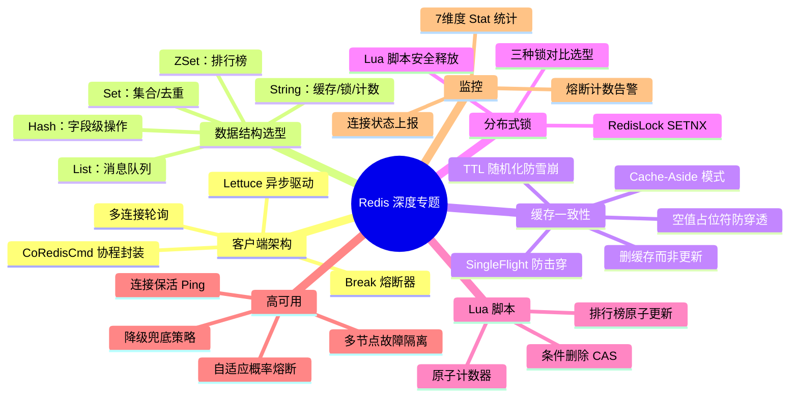

---

> **总结**：项目的 Redis 实践体现了"**以缓存为中心、以协程为基础、以安全为底线**"的设计理念——通过 Lettuce 异步客户端 + CoRedisCmd 协程封装实现零阻塞的 Redis 访问；通过 Break 自适应熔断器 + 多节点隔离保障高可用；通过 Lua 脚本保证分布式锁和计数器的原子性安全；通过 CacheUtil 枚举 + CacheApi 接口实现 260+ 种 Key 的统一管理规范。整套方案在数万并发玩家的生产环境中经过充分验证。
