# 消息队列深度专题

本文基于元梦之星项目（letsgo_server）的源码分析，系统梳理项目在消息队列领域的深度实践，涵盖 Apache Pulsar 作为核心 MQ 的架构设计、事件驱动系统的完整链路、CKafka 在数据采集旁路的应用、消息可靠性保障、消费语义控制、死信与重试机制、限流与监控体系、以及与 RPC 通信的双通道设计等。结合原理分析、代码实现与面试话术。

---

## 一、项目消息队列使用全景

### 1.1 MQ 在项目中的定位

项目采用 **Pulsar + CKafka 双 MQ 架构**，各司其职：

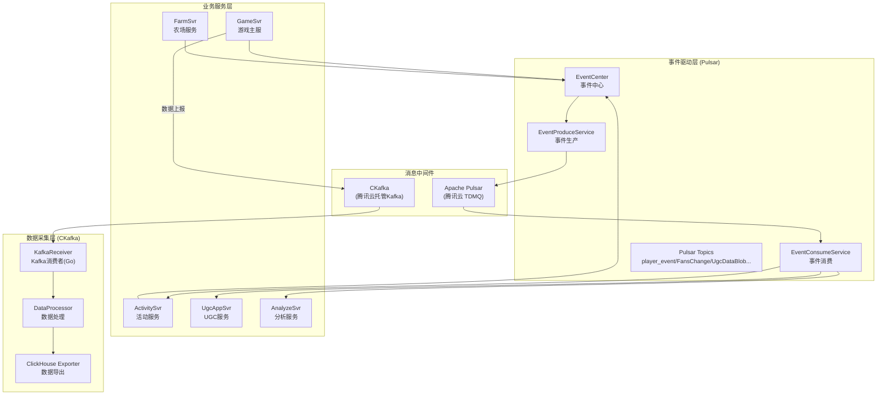

### 1.2 双 MQ 选型与分工

| 维度 | Pulsar（核心业务MQ） | CKafka（数据采集旁路） |
|------|-------------------|-------------------|
| **使用场景** | 跨服务事件分发（活动事件、粉丝变更、UGC同步） | Tlog数据采集、ClickHouse数据导出 |
| **消息语义** | At-Least-Once + 手动 ACK | At-Least-Once + 自动提交 |
| **消息模型** | 发布-订阅（Shared/Key_Shared） | 消费者组（Consumer Group） |
| **消息格式** | Protobuf 序列化（byte[]） | Protobuf 序列化 |
| **延迟要求** | 低延迟（实时事件驱动） | 可容忍秒级延迟 |
| **实现语言** | Java（WeA 主服务） | Go（collectsvr 采集服务） |
| **可靠性保障** | 死信队列 + 重试队列 | 自动 Offset 提交 |
| **部署方式** | 腾讯云 TDMQ（托管 Pulsar） | 腾讯云 CKafka（托管 Kafka） |

### 1.3 为什么选 Pulsar 作为核心 MQ？

项目在技术选型中选择 Pulsar 而非 Kafka 作为核心业务消息队列，核心原因如下：

| 维度 | Kafka | Pulsar（项目选择） |
|------|-------|------------------|
| **消费模型** | Partition 绑定消费者 | **Key_Shared 模式：同Key有序，不同Key并发** |
| **延迟消息** | 不原生支持 | **原生支持 deliverAfter 延迟投递** |
| **死信/重试队列** | 需自行实现 | **原生支持 DLQ + Retry Topic** |
| **消息确认** | 基于 Offset 位移 | **逐条 ACK/NACK，更精细** |
| **多租户** | 不原生支持 | **原生 Tenant/Namespace 隔离** |
| **存储计算分离** | 紧耦合 | **BookKeeper 存储分离，弹性伸缩** |
| **在线系统适配** | 适合高吞吐批处理 | **适合低延迟在线系统** |

> 正如项目中 Tbuspp 文档所述："*kafka不太适合在线系统，kafka相当于消息'银行'，生产者把消息存到银行（中间节点，kafka服务器，还有磁盘的参与），所以kafka通常用在旁路系统，或者回流系统，对时延要求不那么敏感的场景*"

---

## 二、Pulsar 客户端架构——三层封装体系

### 2.1 架构总览

项目对 Pulsar 进行了三层封装，从底层到高层分别是：

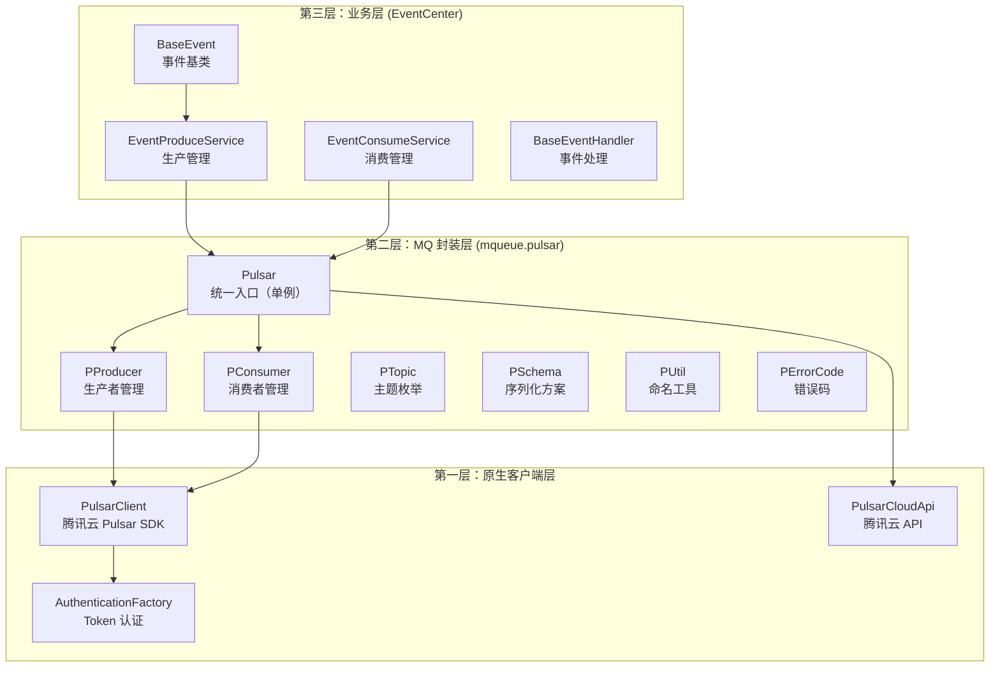

### 2.2 Pulsar 核心封装——Pulsar 单例

**文件位置**：[Pulsar.java](/C:/UGit/letsgo_server/WeA/common/src/main/java/com/tencent/mqueue/pulsar/Pulsar.java)

```java
public class Pulsar {
    private PulsarClient client;
    private PProducer producer = new PProducer();
    private PConsumer consumer = new PConsumer();
    
    public void init() {
        String serviceUrl = PropertyFileReader.getItem("pulsar_url", "");
        String token = PropertyFileReader.getItem("pulsar_auth", "");
        int listenThread = PropertyFileReader.getIntItem("pulsar_listen_thread", 1);
        
        // 创建 Pulsar 客户端
        this.client = PulsarClient.builder()
                .serviceUrl(serviceUrl)
                .listenerThreads(listenThread)
                .authentication(AuthenticationFactory.token(token))
                .build();
        
        producer.init();
        consumer.init();
        
        // 同时初始化新版 PulsarClient（用于事件中心）
        com.tencent.mq.pulsar.PulsarClient.getInstance().init(this.client);
        
        // 自动创建所有 Topic
        initTopic();
    }
}
```

**初始化流程**：

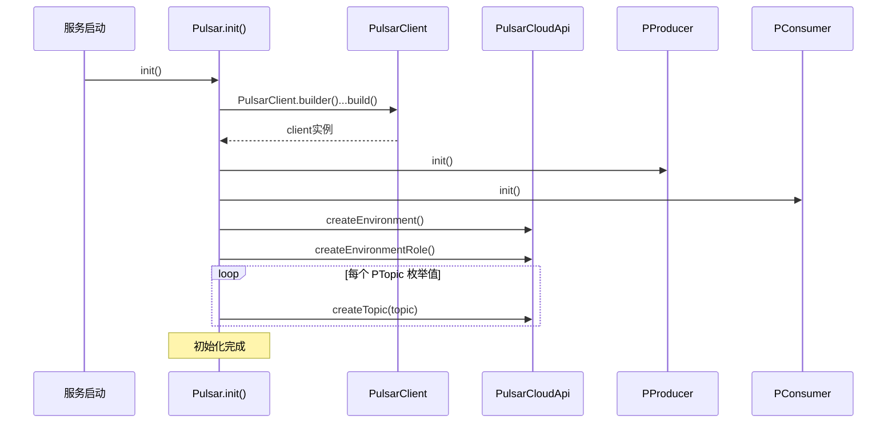

### 2.3 Topic 管理——PTopic 枚举

**文件位置**：[PTopic.java](/C:/UGit/letsgo_server/WeA/common/src/main/java/com/tencent/mqueue/pulsar/PTopic.java)

```java
public enum PTopic {
    Init(PSchema.Bytes),                                                    // 初始化
    TestTopic(PSchema.Bytes),                                               // 测试
    FansChange(PSchema.Bytes),                                              // 粉丝变更事件
    UgcDataBlob(PSchema.Bytes),                                             // UGC数据同步
    UgcAppPlayerInfo(PSchema.Bytes),                                        // UGC玩家信息
    gameplay_commercial(PSchema.Bytes),                                     // 商业化玩法事件
    game_key_event(PSchema.Bytes),                                          // 游戏关键事件
    SyncEvent_UgcServer(PSchema.Bytes, SubscriptionType.Key_Shared),        // UGC服务同步（Key_Shared）
    TLOGSYN(PSchema.String, SubscriptionType.Shared, true, true),           // Tlog数据同步（带死信+重试）
    ;
    
    private PSchema schema;              // 序列化方案
    private SubscriptionType subType;    // 订阅模式
    private boolean isOpenDead = false;  // 是否开启死信队列
    private boolean isOpenRetry = false; // 是否开启重试队列
}
```

**Topic 命名规则**（由 `PUtil` 管理）：

```
完整Topic路径: {tenant}/{envName}/{topicName}
示例: pulsar-zj9xr89m8rw7/letsgo-release/FansChange

重试Topic: {tenant}/{envName}/{topicName}-{subscriptionName}-RETRY
死信Topic: {tenant}/{envName}/{topicName}-{subscriptionName}-DLQ
订阅名: subscription-{topicName}-{serverName}
```

### 2.4 序列化方案——PSchema

```java
public enum PSchema {
    Bytes(Schema.BYTES),    // byte[] 序列化（Protobuf 二进制）
    String(Schema.STRING),  // String 序列化（JSON/文本）
}
```

**选型策略**：

| Schema | 适用场景 | 序列化开销 | 可读性 |
|--------|---------|-----------|--------|
| **Bytes**（默认） | 跨服事件（EventBatchSendData PB） | 最小 | 低 |
| **String** | Tlog 数据同步（文本格式） | 中等 | 高 |

### 2.5 消息大小与延迟限制

```java
// PProducer.call() 中的安全检查
private <T> boolean checkMsgSize(PSchema schema, T value) {
    int limit = PropertyFileReader.getRealTimeIntItem(
        "pulsar_msg_limit_size", 4 * 1024 * 1024);  // 默认 4MB
    // ...
}

// 延迟消息限制
private static final int MaxDelaySec = 10 * 24 * 60 * 60; // 最大10天

// 延迟不能超过消息保留时间
int retentionTTl = PropertyFileReader.getRealTimeIntItem(
    "pulsar_retention_ttl_sec", 84600);  // 默认约1天
```

---

## 三、生产者深度分析

### 3.1 PProducer——生产者管理

**文件位置**：[PProducer.java](/C:/UGit/letsgo_server/WeA/common/src/main/java/com/tencent/mqueue/pulsar/PProducer.java)

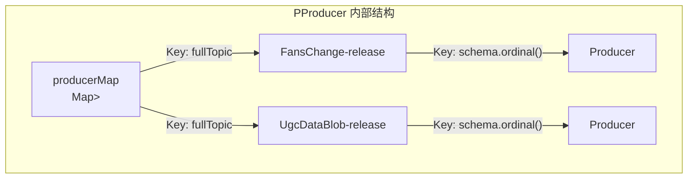

#### 3.1.1 生产者创建

```java
// 带 ProducerInterceptor 的生产者创建
private Producer newProducer(PulsarClient client, String topic, 
                              String name, PSchema schema) {
    return client.newProducer(schema.getSchema())
            .topic(topic)
            .producerName(createProducerName(name, schema))
            .intercept(new ProducerInterceptor() {
                @Override
                public void onSendAcknowledgement(Producer producer, Message message, 
                                                    MessageId msgId, Throwable exception) {
                    if (exception != null) {
                        LOGGER.error("producer ack error topic={} msgId={}", topic, msgId);
                    }
                }
                // ...
            }).create();
}

// 生产者命名规则
private String createProducerName(String name, PSchema schema) {
    String serverName = Framework.getInstance().getServerName();
    int worldId = Framework.getInstance().getWorldId();
    return "pulsar-client-" + name + "-" + schema.name() + "-" + worldId + "-" + serverName;
    // 示例: pulsar-client-FansChange-Bytes-1001-gamesvr
}
```

#### 3.1.2 异步发送与协程集成

```java
// PProducer.call() —— 核心发送逻辑
public <T> PulsarData call(PSchema schema, String topic, String key, 
                            String envName, T value, long delay) {
    // 1. 消息大小检查（4MB限制）
    if (!checkMsgSize(schema, value)) {
        return new PulsarData(PErrorCode.MSG_SIZE_ERROR);
    }
    
    // 2. 延迟时间检查（最大10天）
    if (delay > MaxDelaySec) {
        return new PulsarData(PErrorCode.DELAY_SEC_ERROR);
    }
    
    // 3. 查找对应的 Producer
    Producer<T> producer = producerMap.get(fullTopic).get(schema.ordinal());
    
    // 4. 创建异步任务（ZAsync 封装 CoroutineAsync）
    Async<PulsarData, T> pulsarDataAsync = new Async<>(fullTopic, key, value);
    pulsarDataAsync.setTask(() -> {
        TypedMessageBuilder<T> messageBuilder = producer.newMessage()
                .key(key).value(value);
        
        if (delay > 0) {
            messageBuilder.deliverAfter(delay, TimeUnit.SECONDS);  // 延迟投递
        }
        
        messageBuilder.sendAsync()
            .thenAccept(msgId -> pulsarDataAsync.completed(new PulsarData(msgId)))
            .exceptionally(ex -> {
                pulsarDataAsync.fail(ex);
                return null;
            });
    });
    
    // 5. 协程等待（park/unpark），超时3秒
    return pulsarDataAsync.run(3000);
}
```

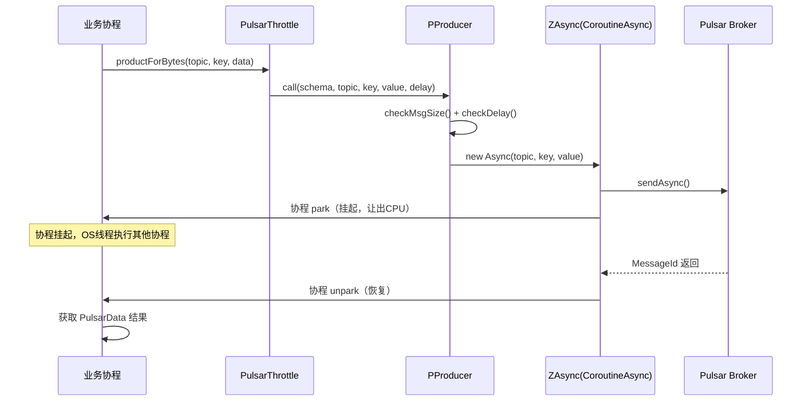

### 3.2 消息唯一性保障

Pulsar 封装层提供了**消息唯一性**保障（`productUniqueForBytes`），基于 Redis SETNX 实现去重：

```java
// 唯一消息生产
public PulsarData productUniqueForBytes(PTopic topic, byte[] msg, 
                                         String key, long uniqueSec) {
    return PulsarThrottle.doReq(() -> ..., () -> {
        if (checkUnique(key, uniqueSec)) {
            // Redis 中不存在该 key，可以生产
            return this.producer.call(topic.getSchema(), topic.getTopic(), key, "", msg, 0);
        }
        // key 已存在，重复消息
        return new PulsarData(PErrorCode.PRODUCT_ERR_UNIQUE_REPEATED);
    });
}

// 基于 Redis SETNX + 过期时间实现去重
private boolean checkUnique(String key, long uniqueSec) {
    CacheResult<String> cacheResult = CacheUtil.PulsarUniMsg.setnxexCacheString(key, "", uniqueSec);
    if (cacheResult.isOk()) {
        if (cacheResult.val.equals("1")) {
            return true;  // SETNX 成功，第一次生产
        }
    }
    return false;  // 已存在，重复
}
```

**去重流程**：

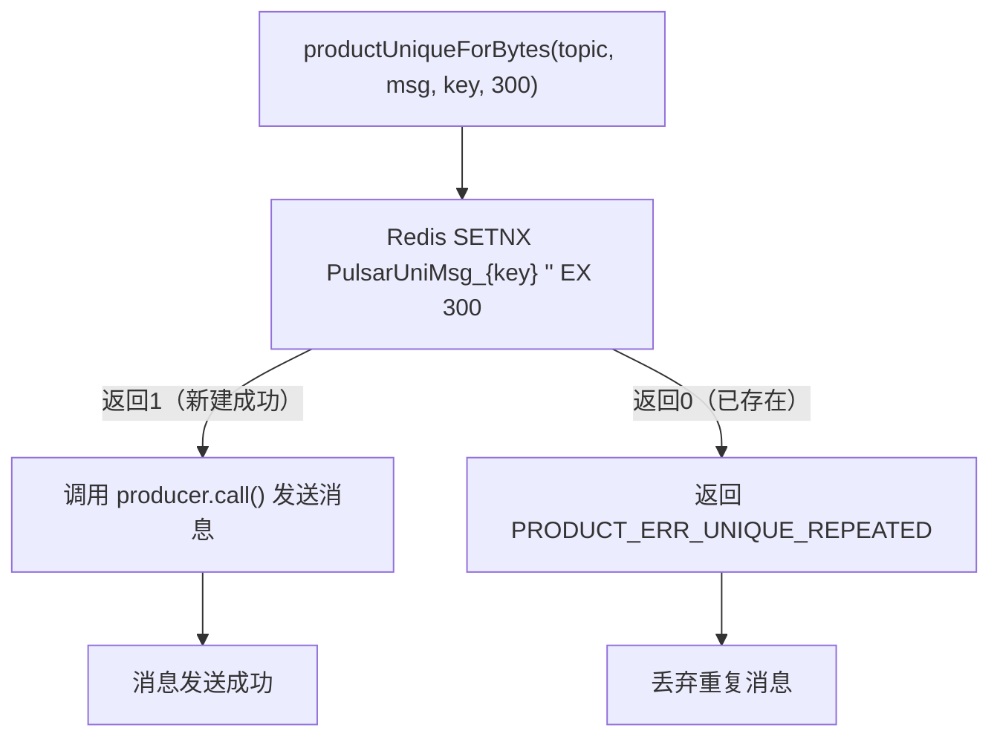

### 3.3 延迟消息

Pulsar 原生支持延迟消息，项目直接利用 `deliverAfter` API：

```java
// 延迟消息发送
Pulsar.getInstance().productDelayForBytes(
    PTopic.game_key_event, key, data, 60);  // 60秒后投递

// 限制：只有 Shared 订阅模式才支持延迟消息
private void checkDelay(PTopic topic) throws RuntimeException {
    if (topic.getSubType() != SubscriptionType.Shared) {
        throw new RuntimeException(
            "delay queue not support this mode " + topic.getSubType().name());
    }
}
```

### 3.4 错误码体系

```java
public enum PErrorCode {
    OK(1),                              // 成功
    TOPIC_NOT_EXIST(2),                 // Topic不存在
    SCHEMA_NOT_EXIST(3),                // Schema不匹配
    INTERNAL_EXCEPTION(4),              // 内部异常
    DELAY_SEC_ERROR(5),                 // 延迟时间超限（>10天）
    DELAY_SEC_NOT_SHARED_ERROR(6),      // 延迟消息必须使用Shared模式
    TIMEOUT_ERROR(7),                   // 发送超时（3秒）
    DELAY_SEC_EXCEED_TTL_ERROR(8),      // 延迟时间超过消息保留时间
    PRODUCT_ERR_UNIQUE_REPEATED(9),     // 唯一消息重复
    MSG_SIZE_ERROR(10),                 // 消息超过4MB限制
}
```

---

## 四、消费者深度分析

### 4.1 PConsumer——消费者管理

**文件位置**：[PConsumer.java](/C:/UGit/letsgo_server/WeA/common/src/main/java/com/tencent/mqueue/pulsar/PConsumer.java)

#### 4.1.1 消费者订阅模式

项目使用了 Pulsar 的三种订阅模式：

| 订阅模式 | 使用场景 | 消息分发策略 | 对应Topic |
|---------|---------|-----------|----------|
| **Shared** | 通用事件消费、Tlog同步 | 轮询分发给所有消费者 | 大多数Topic |
| **Key_Shared** | UGC服务同步 | 同Key消息→同消费者（保序） | `SyncEvent_UgcServer` |
| **Failover** | 不使用（项目排除了Exclusive模式） | 主备切换 | — |

#### 4.1.2 消费者创建流程

```java
// 带自动ACK的消费者（标准模式）
public void createConsumer(PulsarClient client, ConsumerOption option) {
    option.messageListener = new InternalMessageListener(consumerHandle, option, service);
    create(client, option);
}

// 不自动ACK的消费者（事件中心模式）
public Consumer createConsumerWithoutAck(PulsarClient client, ConsumerOption option) {
    option.messageListener = new InternalMessageListenerWithoutAck(
        consumerHandle, option.topic, option.schema, service);
    return create(client, option);
}

// 底层创建
public Consumer create(PulsarClient client, ConsumerOption option) {
    ConsumerBuilder consumerBuilder = client.newConsumer(option.schema.schema)
            .topic(option.fullTopic)
            .subscriptionName(option.subscriptionName)
            .subscriptionType(option.subType)
            .consumerName(createConsumerName(option.topic))
            .messageListener(option.messageListener)
            .subscriptionInitialPosition(SubscriptionInitialPosition.Earliest);
    
    // 启用重试
    if (option.isOpenRetry) {
        consumerBuilder.enableRetry(true);
    }
    
    // 配置死信队列策略
    if (option.isOpenDead) {
        DeadLetterPolicyBuilder deadLetterPolicyBuilder = DeadLetterPolicy.builder()
                .maxRedeliverCount(5)           // 最大重试5次
                .deadLetterTopic(option.deadTopic);
        deadLetterPolicyBuilder.retryLetterTopic(option.retryTopic);
        consumerBuilder.deadLetterPolicy(deadLetterPolicyBuilder.build());
    }
    
    return consumerBuilder.subscribe();
}
```

#### 4.1.3 两种消息监听器

**标准模式（InternalMessageListener）**——自动 ACK：

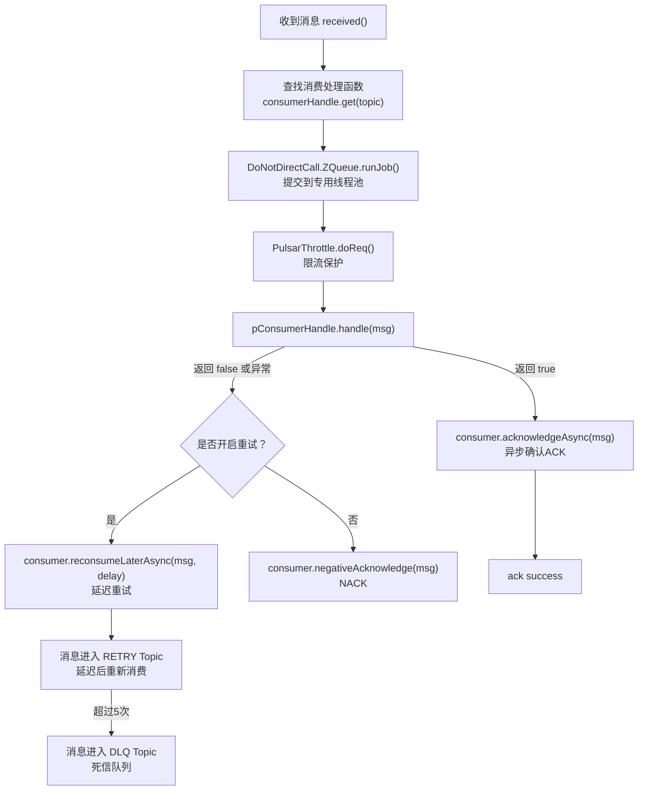

**无ACK模式（InternalMessageListenerWithoutAck）**——手动 ACK（事件中心专用）：

```java
// 事件中心消费流程
// 1. EventMessageHandler 接收消息
// 2. 通过 RPC 转发给目标服务
// 3. RPC 成功 → ACK
// 4. RPC 失败 → NACK

@Override
public boolean handle(Message<byte[]> message) {
    // 解析消息
    EventBatchSendData.Builder eventBatchSendData = EventBatchSendData.newBuilder();
    eventBatchSendData.mergeFrom(message.getData());
    
    // 通过 RPC 转发
    RpcResult<Builder> rpcResult = CommonService.get().rpcForwardEventMQ(req);
    
    if (rpcResult.isOK()) {
        // RPC 成功，手动确认消息
        EventConsumeService.getInstance().acknowledgeMessage(topic, message.getMessageId());
        return true;
    } else {
        // RPC 失败，否定确认（触发重试）
        EventConsumeService.getInstance().negativeAcknowledgeMessage(topic, message.getMessageId());
        return false;
    }
}
```

### 4.2 死信队列与重试机制

#### 4.2.1 重试策略

```java
// 重试延迟配置
int retryDelay = PropertyFileReader.getRealTimeIntItem("pulsar_retry_delay", 10);  // 默认10秒

// 消费失败 → 延迟重试
private void retryTopic(Consumer consumer, Message msg) {
    CompletableFuture completableFuture = consumer.reconsumeLaterAsync(
        msg, retryDelay, TimeUnit.SECONDS);
    completableFuture.thenAccept(v -> {
        LOGGER.info("retryTopic success msgId={} topic={}", msg.getMessageId(), option.topic);
    });
}
```

#### 4.2.2 死信队列设计

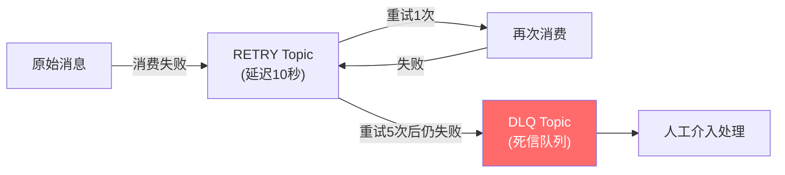

**以 TLOGSYN 为例**：
- 原始 Topic: `pulsar-zj9xr89m8rw7/letsgo-release/TLOGSYN`
- 重试 Topic: `pulsar-zj9xr89m8rw7/letsgo-release/TLOGSYN-subscription-TLOGSYN-analyzesvr-RETRY`
- 死信 Topic: `pulsar-zj9xr89m8rw7/letsgo-release/TLOGSYN-subscription-TLOGSYN-analyzesvr-DLQ`

### 4.3 消费者命名规范

```java
// 消费者名
private String createConsumerName(String name) {
    String serverName = Framework.getInstance().getServerName();
    int worldId = Framework.getInstance().getWorldId();
    return "consumer-" + name + "-" + worldId + "-" + serverName;
    // 示例: consumer-FansChange-1001-activitysvr
}

// 订阅名
static public String getSubscriptionName(String topic) {
    String svrName = ServerEngine.getInstance().getSvrName();
    return "subscription-" + topic + "-" + svrName;
    // 示例: subscription-FansChange-activitysvr
}
```

---

## 五、事件驱动系统——MQ 与 RPC 双通道

### 5.1 事件中心架构

项目的事件中心（EventCenter）是消息队列的核心使用场景，支持 **MQ 和 RPC 双通道**分发：

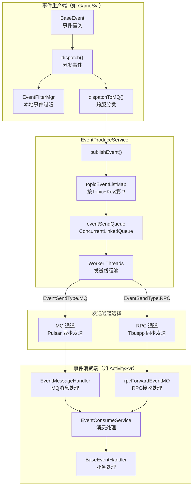

### 5.2 MQ vs RPC 双通道设计

事件分发支持两种通道，通过 XML 配置动态切换：

```java
// EventServerConfig 配置文件决定发送方式
// event_global_cfg.xml 中配置：
// <topic topic="player_event" send="MQ"/>    → MQ通道
// <topic topic="player_event" send="RPC"/>   → RPC通道

public static EventSendType getTopicSendType(String topic) {
    // 私服模式强制使用 RPC
    if (PropertyFileReader.getRealTimeBooleanItem("private_svr_enable", false)) {
        return EventSendType.RPC;
    }
    EventSendType sendType = topicSendCfg.get(topic);
    if (sendType == EventSendType.MQ) {
        // 运行时可通过七彩石开关降级为 RPC
        if (PropertyFileReader.getRealTimeBooleanItem("event_mq_send_enable", true)) {
            return EventSendType.MQ;
        } else {
            return EventSendType.RPC;  // MQ 不可用时降级为 RPC
        }
    }
    return sendType;
}
```

**双通道对比**：

| 维度 | MQ 通道（Pulsar） | RPC 通道（Tbuspp） |
|------|-----------------|------------------|
| **解耦度** | 高（生产者不感知消费者） | 低（直接调用） |
| **可靠性** | Pulsar 持久化保障 | 依赖 RPC 重试 |
| **延迟** | 毫秒级（经过 Broker 中转） | 微秒级（共享内存直达） |
| **吞吐** | 高（异步+批量） | 中等（同步调用） |
| **适用** | 正式环境、跨服事件 | 私服/测试、同服事件 |
| **降级** | 可降级到 RPC | — |

### 5.3 事件生产流程详解

**文件位置**：[EventProduceService.java](/C:/UGit/letsgo_server/WeA/common/src/main/java/com/tencent/eventcenter/mq/EventProduceService.java)

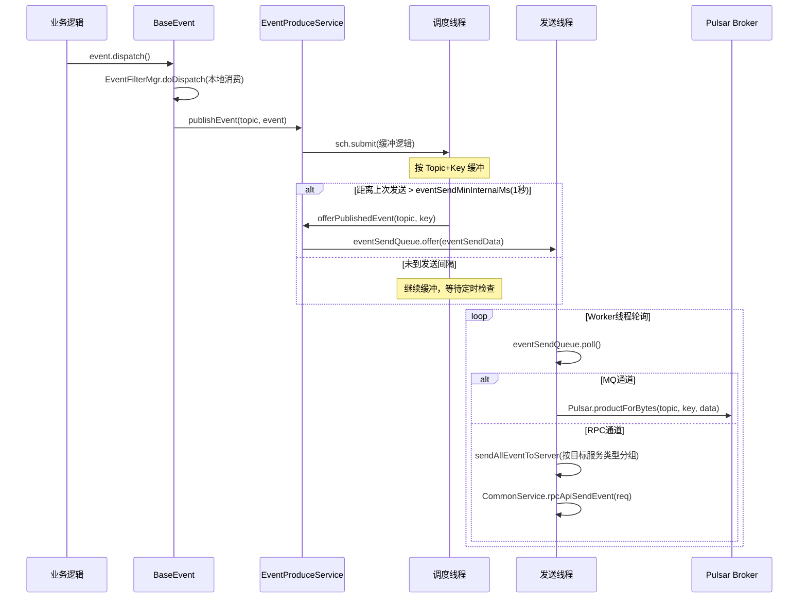

**关键设计——事件缓冲与批量发送**：

```java
// 按 Topic + Key 缓冲事件
private final HashMap<String, HashMap<String, List<BaseEvent>>> topicEventListMap;

// 配置参数
eventQueueMaxLen = 200;           // 每个 Key 下最大缓冲事件数
eventSendMinInternalMs = 1000;    // 最小发送间隔 1 秒
eventTopicMaxIdleTimeMs = 60000;  // Key 最大空闲时间 60 秒

// 发送队列保护
if (eventSendQueue.size() > 10000) {
    LOGGER.error("event send queue size larger than 10000");
    return;  // 队列过长，丢弃
}
```

### 5.4 事件配置管理

**文件位置**：[EventServerConfig.java](/C:/UGit/letsgo_server/WeA/common/src/main/java/com/tencent/eventcenter/EventServerConfig.java)

事件配置通过 XML 文件管理，支持热加载：

```
配置目录: ../common/resource/xml/submode/
文件命名: *_event.xml

配置格式:
<event type="EVT_PlayerLevelUp" producer="gamesvr" consumer="activitysvr,ugcappsvr"/>
```

**配置加载流程**：

1. **扫描**：递归扫描 `submode/` 下所有 `*_event.xml` 文件
2. **构建 followEvent**：确定本服务关心的事件集合
3. **加载 Topic 配置**：从 `event_global_cfg.xml` 读取 Topic→SendType 映射
4. **构建 ProducerConfig**：本服务作为生产者的事件→消费者列表
5. **构建 ConsumerConfig**：本服务作为消费者的Topic列表
6. **检查**：确保 Producer ≠ Consumer（防止自循环）

### 5.5 事件对账机制

```java
// 事件对账开关——正式/预发布环境默认关闭，测试环境默认开启
protected static boolean openEventReconciliation() {
    if (ServerEngine.getInstance().isBusiness() || 
        ServerEngine.getInstance().isPreBusiness()) {
        return PropertyFileReader.getRealTimeBooleanItem(
            "open_event_reconciliation", false);
    }
    return PropertyFileReader.getRealTimeBooleanItem(
        "open_event_reconciliation", true);
}

// 对账逻辑：发送 RPC 到 ActivitySvr 记录事件日志
private void sendServerEvent(long uid, EventSendData eventSendData) {
    SendServerEventReq.Builder req = SendServerEventReq.newBuilder();
    req.setUid(uid);
    req.setData(eventSendData.getProtoData());
    ActivityService.get().sendServerEvent(req);
}
```

**事件 UUID 全链路追踪**：

```java
// 每个事件批次生成唯一 UUID
eventSendData.setEventUuid(UUID.randomUUID().toString());

// UUID 在整个链路中传递
req.setUuid(eventSendData.getEventUuid());

// 用于：
// 1. 事件对账（生产→消费 一对一匹配）
// 2. 重复事件检测
// 3. 问题排查日志关联
```

---

## 六、CKafka 在数据采集旁路的应用

### 6.1 数据采集架构

项目使用腾讯云 CKafka（托管 Kafka）作为数据采集旁路的消息中间件，由 Go 语言实现的 `collectsvr` 服务消费。

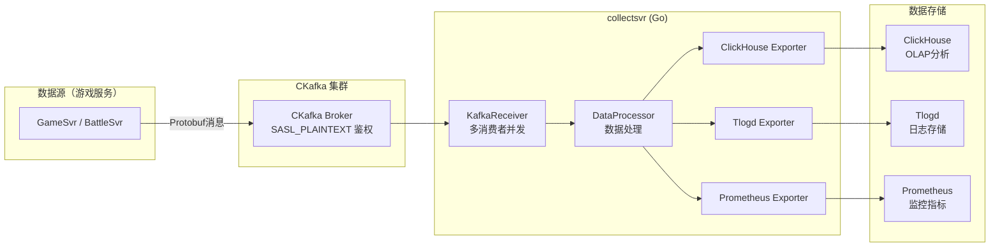

### 6.2 KafkaReceiver 实现分析

**文件位置**：[kafka_receiver.go](/C:/UGit/letsgo_server/tools/j6_data_tools/src/collectsvr/kafka_receiver/kafka_receiver.go)

#### 6.2.1 消费者组配置

```yaml
# common.yaml 中的 Kafka 配置
kafka:
  brokers: 9.151.209.233:6356
  session_timeout: 30                    # 链接超时时间 30s
  consumer_poll_interval: 30             # 消费者每次拉取最大间隔时间 30s
  consumer_poll_maximum: 50              # 消费者每次拉取最大数量
  consumer_poll_time: 500                # 消费者拉取数据的时间 500ms
  consume_limiter: seconds(60)
  security_protocol: SASL_PLAINTEXT      # SASL 鉴权
  sasl_mechanism: PLAIN
  sasl_username: ckafka-n5oa9v52#zmeta
  sasl_password: FeJmaihsmzxjnpCC2L6a
```

#### 6.2.2 多消费者并发消费

```go
// KafkaReceiver 支持多消费者并发
type KafkaReceiver struct {
    consumeTaskPool  *collect.TaskPool      // 消费线程池
    processTaskPool  *collect.TaskPool      // 处理线程池
    dataProcessor    *data_processor.DataProcessor
    consumers        []*kafka.Consumer      // 多个消费者实例
    statMsgCount     *collect.MetricSum     // 消息计数监控
    statMsgSize      *collect.MetricSum     // 消息大小监控
}

func (r *KafkaReceiver) OnStart(svc *collect.Service, rc *collect.RuntimeComponent) bool {
    consumerCount := cfg.ConsumerCount  // 可配置消费者数量
    if consumerCount <= 1 {
        consumerCount = 1
    }
    
    r.consumeTaskPool = collect.NewTaskPool(consumerCount, consumerCount)
    r.processTaskPool = collect.NewTaskPool(0, 0)
    
    // 创建多个消费者并启动消费循环
    for i := 0; i < consumerCount; i++ {
        consumer, err := r.newConsumer(&cfgMap, topicList)
        r.consumeTaskPool.Execute(func() { r.consumeLoop(consumer, pollIntervalMs) })
        r.consumers = append(r.consumers, consumer)
    }
    return true
}
```

#### 6.2.3 消费循环与消息路由

```go
func (r *KafkaReceiver) consumeLoop(consumer *kafka.Consumer, pollIntervalMs int) {
    for {
        select {
        case <-r.consumeTaskPool.Done():
            return  // 收到停止信号
        default:
            ev := consumer.Poll(pollIntervalMs)  // 拉取消息
            switch e := ev.(type) {
            case *kafka.Message:
                // 提取服务ID（从Key或Header）
                svrId := r.getSvrId(e)
                // 根据Topic匹配消息类型
                r.processMessage(svrId, *e.TopicPartition.Topic, e.Value)
            case kafka.OffsetsCommitted:
                // Offset 自动提交回调
            case kafka.Error:
                r.logger.Errorw("kafka.Error", "event", e)
            }
        }
    }
}

// Topic → 消息类型 的正则路由
func (r *KafkaReceiver) getMsgType(topic string) (byte, bool) {
    indexes := r.topicReg.FindStringSubmatchIndex(topic)
    for i := 2; i < len(indexes); i += 2 {
        if indexes[i] >= 0 {
            subexpIndex := i/2 - 1
            return r.subexpIndexToMsgTypes[subexpIndex], true
        }
    }
    return 0, false
}
```

### 6.3 优雅停机

```go
func (r *KafkaReceiver) OnStop() {
    // 1. 停止消费循环
    r.consumeTaskPool.Close()
    
    // 2. 关闭所有消费者（触发最后一次 Offset 提交）
    for i, consumer := range r.consumers {
        if err := consumer.Close(); err != nil {
            r.logger.Errorw("fail to close consumer", "err", err, "index", i)
        }
    }
    
    // 3. 等待消费线程结束
    r.consumeTaskPool.Wait()
    
    // 4. 等待处理线程结束
    r.processTaskPool.CloseAndWait()
}
```

---

## 七、限流与监控体系

### 7.1 PulsarThrottle——生产端限流

**文件位置**：[PulsarThrottle.java](/C:/UGit/letsgo_server/WeA/common/src/main/java/com/tencent/cache/PulsarThrottle.java)

所有 Pulsar 生产和消费操作都经过 `PulsarThrottle` 限流保护：

```java
// 每次 Pulsar 操作都经过限流
public PulsarData productForBytes(PTopic topic, String key, byte[] msg) {
    return PulsarThrottle.doReq(
        () -> new ThrottleParam(topic.toString(), "productForBytes"),
        () -> this.producer.call(topic.getSchema(), topic.getTopic(), key, "", msg, 0)
    );
}

// 消费端同样经过限流
DoNotDirectCall.ZQueue.runJob(this.service, Framework.currentTimeNanos(), () -> {
    var ret = PulsarThrottle.doReq(
        () -> new ThrottleParam(topic, "received"),
        () -> pConsumerHandle.handle(msg)
    );
    // ...
});
```

`PulsarThrottle` 继承自 `BaseThrottle`，提供统一的限流 + 监控框架：
- **请求计数**：按 Topic + 操作类型 统计 QPS
- **耗时统计**：记录每个操作的最大/平均耗时
- **日志打印**：每 60 秒输出一次访问统计

### 7.2 PulsarMonitor——全局监控

```java
public class PulsarMonitor extends BaseMonitor {
    private static final int INTERVAL = 60;  // 60秒统计周期
    
    public PulsarMonitor(Class<? extends Enum<?>> enumeration, String separator) {
        super(enumeration, separator, INTERVAL, 
              MonitorId.attr_pulsar_req_info, "PulsarMonitor");
    }
    
    @Override
    public void printLog(String text) {
        // 每60秒打印一次Pulsar访问统计
        LOGGER.info("\npulsar keys access of the past {} sec:\n{}", INTERVAL, text);
    }
}
```

### 7.3 事件监控指标体系

```java
// 事件生产监控
Monitor.getInstance().add.total(MonitorId.attr_event_dispatch_count, 1, 
    getEventMonitorParam(topic, eventType));        // 事件分发总数
Monitor.getInstance().add.succ(MonitorId.attr_event_dispatch_count, 1, ...);  // 分发成功
Monitor.getInstance().add.fail(MonitorId.attr_event_dispatch_count, 1, ...);  // 分发失败

// 事件发送队列监控
Monitor.getInstance().set.total(MonitorId.attr_event_remote_send_queue, 
    eventSendQueue.size());                         // 发送队列深度
Monitor.getInstance().add.total(MonitorId.attr_event_remote_send_count, 1, ...);  // 发送计数

// Key队列满监控
Monitor.getInstance().add.total(MonitorId.attr_event_remote_key_queue_full, 1, ...);

// 事件消费监控
Monitor.getInstance().add.succ(MonitorId.attr_event_remote_receive_count, 1, ...);  // 消费成功
Monitor.getInstance().add.fail(MonitorId.attr_event_remote_receive_count, 1, ...);  // 消费失败

// 端到端延迟监控
long costTime = DateUtils.currentTimeMillis() - eventBatchSendData.getSendTimeMs();
Monitor.getInstance().set.total(MonitorId.attr_event_remote_send_time, 
    (double) totalTimesMsCost / totalTimes, ...);   // 平均发送耗时
```

### 7.4 Kafka 采集监控

```go
// collectsvr 中的监控指标
r.statMsgCount = svc.GetMetricSum("collectsvr_msg_count", "component", rc.Name)
r.statMsgSize  = svc.GetMetricSum("collectsvr_msg_size", "component", rc.Name)

// 消息处理时统计
func (r *KafkaReceiver) processMessage(svrId string, topic string, data []byte) {
    r.processTaskPool.Execute(func() {
        r.statMsgCount.Add(1)            // 消息计数
        r.statMsgSize.Add(float64(len(data)))  // 消息大小
        r.dataProcessor.ProcessData(msgType, data, svrId)
    })
}
```

### 7.5 监控指标总览

| 指标名 | 类型 | 含义 | 维度 |
|--------|------|------|------|
| `attr_pulsar_req_info` | 计数/耗时 | Pulsar 请求统计 | topic + operation |
| `attr_event_dispatch_count` | 计数 | 事件分发总/成功/失败 | server + topic + eventType |
| `attr_event_remote_send_queue` | 瞬时值 | 事件发送队列深度 | — |
| `attr_event_remote_send_count` | 计数 | 远程事件发送计数 | server + topic + eventType |
| `attr_event_remote_receive_count` | 计数 | 远程事件消费成功/失败 | server + topic + eventType |
| `attr_event_remote_send_time` | 耗时 | 事件端到端延迟（ms） | server + topic |
| `attr_event_remote_key_queue_full` | 计数 | Key缓冲队列满丢弃 | server + topic + eventType |
| `collectsvr_msg_count` | 累加 | Kafka消费消息数 | component |
| `collectsvr_msg_size` | 累加 | Kafka消费消息总大小 | component |

---

## 八、消息可靠性保障

### 8.1 可靠性全链路分析

```mermaid
flowchart TB
    subgraph "生产端可靠性"
        P1["① 消息大小检查<br/>≤4MB"]
        P2["② PulsarThrottle限流<br/>防止过载"]
        P3["③ sendAsync异步发送<br/>+回调确认"]
        P4["④ 超时保护(3秒)<br/>TimeoutException"]
        P5["⑤ 错误码体系<br/>10种错误类型"]
    end
    
    subgraph "Broker端可靠性"
        B1["① Pulsar 持久化<br/>BookKeeper多副本"]
        B2["② 消息保留策略<br/>TTL=12小时"]
        B3["③ 多租户隔离<br/>Tenant/Namespace"]
    end
    
    subgraph "消费端可靠性"
        C1["① 手动ACK/NACK<br/>精确确认"]
        C2["② 重试队列<br/>延迟10秒重试"]
        C3["③ 死信队列<br/>最大5次重试"]
        C4["④ 消费端限流<br/>PulsarThrottle"]
        C5["⑤ 专用线程池<br/>ConsumerService"]
    end
    
    P1 --> P2 --> P3 --> P4 --> P5
    B1 --> B2 --> B3
    C1 --> C2 --> C3 --> C4 --> C5
```

### 8.2 消息不丢失保障

| 阶段 | 风险 | 保障机制 | 代码位置 |
|------|------|---------|---------|
| **生产** | 发送失败 | sendAsync + 回调日志 + 错误码返回 | `PProducer.call()` |
| **生产** | 协程超时 | 3秒超时检测 + TimeoutException | `ZAsync.run(3000)` |
| **存储** | Broker宕机 | BookKeeper多副本持久化 | TDMQ 云服务保障 |
| **存储** | 消息过期 | TTL=12小时，retention=24小时 | `topic_msg_ttl: 43200` |
| **消费** | 处理失败 | NACK → 重试（延迟10秒） | `processNegativeAck()` |
| **消费** | 多次失败 | 5次重试后进入 DLQ | `maxRedeliverCount(5)` |
| **消费** | 消费者宕机 | Shared模式自动重平衡 | Pulsar 原生机制 |

### 8.3 消息不重复消费

| 层级 | 去重机制 | 实现方式 |
|------|---------|---------|
| **生产端** | 唯一消息生产 | `productUniqueForBytes` + Redis SETNX |
| **传输层** | 消息ID唯一 | Pulsar MessageId 全局唯一 |
| **消费端** | 幂等性保障 | 事件UUID + topicMessageId 拼接去重 |
| **消费端** | 状态机保护 | 业务层状态机防重复处理 |

```java
// 消费端去重：Topic内MessageId唯一
String topicMessageId = eventBatchSendData.getTopic() + ":" + messageId;
// 结合业务层幂等Key，确保消息不被重复处理
```

### 8.4 MQ 不可用时的降级策略

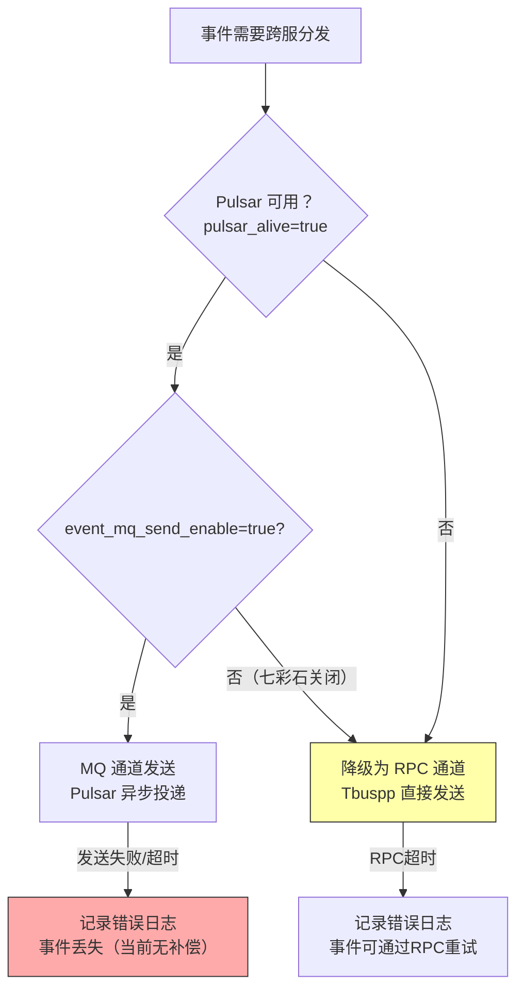

---

## 九、Pulsar 配置管理

### 9.1 多环境配置

```yaml
# common.yaml —— Pulsar 生产环境配置
pulsar:
  url: http://pulsar-zj9xr89m8rw7.sap-6ob3nvu3.tdmq.ap-nj.internal.tencenttdmq.com:8080
  auth: eyJrZXlJZCI6InB1bHNhci16ajl4cjg5bThydzciLC...（JWT Token）
  tenant: pulsar-zj9xr89m8rw7
  namespace: letsgo
  cloud_region: ap-nanjing
  topic_partition: 1          # 分区数量
  topic_msg_ttl: 43200        # 消息TTL=12小时
  retention_ttl_sec: 86400    # 消息保留=24小时
  listen_thread: 3            # 监听线程数
  pulsar_alive: true          # Pulsar 总开关

# dev/common.yaml —— 开发环境配置
pulsar:
  pulsar_alive: false          # 开发环境默认关闭
  url: http://pulsar-zj9xr89m8rw7.sap-nkc09cfo.tdmq.ap-nj.public.tencenttdmq.com:8080
```

### 9.2 运行时可调参数

| 参数名 | 默认值 | 含义 | 动态可调 |
|--------|:------:|------|:--------:|
| `pulsar_alive` | true | Pulsar 总开关 | ❌ |
| `event_mq_send_enable` | true | MQ 发送开关（降级用） | ✅ |
| `pulsar_msg_limit_size` | 4MB | 消息大小上限 | ✅ |
| `pulsar_retention_ttl_sec` | 86400 | 消息保留时间 | ✅ |
| `pulsar_retry_delay` | 10 | 重试延迟（秒） | ✅ |
| `pulsar_nack_retry_count` | 5 | 最大重试次数 | ✅ |
| `pulsar_listen_thread` | 3 | 监听线程数 | ❌ |
| `event_producer_queue_max_len` | 200 | Key缓冲队列上限 | ✅ |
| `event_producer_send_min_internal_ms` | 1000 | 最小发送间隔 | ✅ |
| `event_producer_topic_max_idle_time_ms` | 60000 | Key最大空闲时间 | ✅ |
| `event_producer_send_threads_number` | 1 | 发送线程数 | ❌ |
| `disable_pulsar_monitor` | false | 关闭Pulsar监控 | ✅ |
| `private_svr_enable` | false | 私服模式（强制RPC） | ✅ |

---

## 十、对标业界消息队列最佳实践

### 10.1 与业界方案对标

| 最佳实践 | 项目实现情况 | 评估 |
|---------|------------|------|
| **消息不丢失** | 手动ACK + 重试 + 死信队列 | ✅ 优秀 |
| **消息去重** | Redis SETNX 生产端去重 + 消费端幂等 | ✅ 良好 |
| **延迟消息** | Pulsar 原生 deliverAfter | ✅ 优秀 |
| **死信队列** | 原生 DLQ + maxRedeliverCount=5 | ✅ 优秀 |
| **监控告警** | 5+监控维度 + PulsarMonitor + 60秒统计 | ✅ 良好 |
| **限流保护** | PulsarThrottle 统一封装 | ✅ 良好 |
| **消息积压处理** | 发送队列 10000 上限保护 | ⚠️ 可增加积压告警 |
| **顺序消息** | Key_Shared 模式保证同Key有序 | ✅ 良好 |
| **多租户隔离** | Tenant + Namespace + envName 三级隔离 | ✅ 优秀 |
| **优雅停机** | preStop() 等待队列清空 + consumer.close() | ✅ 良好 |
| **消息追踪** | UUID + topicMessageId 全链路 | ✅ 良好 |
| **降级方案** | MQ → RPC 降级 + 运行时开关 | ✅ 优秀 |
| **批量发送** | 事件缓冲合并（1秒间隔） | ✅ 良好 |
| **消费端幂等** | 业务层状态机 + 事件UUID | ⚠️ 可增加统一幂等框架 |
| **Exactly-Once** | 未实现（At-Least-Once + 幂等） | ⚠️ 符合游戏场景需求 |

### 10.2 改进空间

| 改进点 | 现状 | 建议方案 | 优先级 |
|--------|------|---------|:------:|
| **生产端失败补偿** | 失败仅记日志 | 增加本地消息表或重试队列 | P1 |
| **消费端统一幂等** | 各业务自行实现 | 抽象统一幂等 Key 框架 | P1 |
| **消息积压监控** | 仅队列大小保护 | 增加 Lag 监控 + 自动告警 | P1 |
| **消息压缩** | 未启用 | 对大消息启用 LZ4 压缩 | P2 |
| **批量消费** | 逐条消费 | 支持批量拉取+批量ACK | P2 |
| **跨集群容灾** | 单集群 | Pulsar Geo-Replication | P2 |
| **消息Schema演进** | 依赖 PB 向后兼容 | 引入 Schema Registry | P3 |

---

## 十一、面试专栏

### 11.1 消息队列核心原理面试 QA

**Q1：你们项目为什么选 Pulsar 而不是 Kafka？**

> "选 Pulsar 的核心原因有四个：
>
> 第一，**消费模型更灵活**。Kafka 的消费者绑定 Partition，扩缩容需要 Rebalance。Pulsar 支持 Key_Shared 模式——同一个 Key 的消息路由到同一消费者保证有序，不同 Key 的消息可以并发消费，这完美匹配我们按玩家 UID 分发事件的需求。
>
> 第二，**原生支持延迟消息**。游戏中有很多延迟场景（比如活动倒计时触发、延迟奖励发放），Pulsar 的 `deliverAfter` API 直接支持，Kafka 需要自己实现延迟队列。
>
> 第三，**原生死信和重试队列**。消费失败的消息自动进入 RETRY Topic，超过最大重试次数（5次）进入 DLQ，不需要额外开发。
>
> 第四，**存储计算分离**。Pulsar 的 Broker 是无状态的，存储由 BookKeeper 负责，扩缩容更灵活。而 Kafka 的 Partition 与 Broker 耦合，迁移数据成本高。
>
> 但 Kafka 也有它的优势——更高的吞吐和更成熟的生态。所以我们在数据采集旁路场景使用 CKafka，把游戏 Tlog 数据通过 Kafka 采集到 ClickHouse 做 OLAP 分析。"

**Q2：你们的事件驱动系统是怎么设计的？**

> "我们设计了一套 MQ + RPC 双通道的事件驱动系统。
>
> **事件定义**：所有事件继承 `BaseEvent` 基类，通过 Protobuf 序列化。每个事件有类型ID、数据Map、Topic归属，支持 int/long/string/proto 四种数据类型。
>
> **事件配置**：通过 XML 配置文件管理事件的生产者、消费者和 Topic 映射。配置支持热加载，服务启动时自动扫描 `*_event.xml` 文件。
>
> **发送通道**：事件分发时根据配置选择 MQ 或 RPC 通道。MQ 通道走 Pulsar 异步发送，适合正式环境跨服事件；RPC 通道走 Tbuspp 直接调用，适合私服或测试环境。通过七彩石开关可以运行时从 MQ 降级到 RPC。
>
> **生产优化**：EventProduceService 按 Topic+Key 缓冲事件，每秒合并一次发送，避免高频小消息打爆 MQ。发送队列有 10000 上限保护。
>
> **消费可靠**：事件消费端通过 RPC 转发到目标服务，RPC 成功才 ACK，失败则 NACK 触发重试。每个事件批次有 UUID 用于全链路追踪和对账。"

**Q3：消息消费失败了怎么办？怎么保证消息不丢失？**

> "我们有三层保障：
>
> **第一层——NACK 重试**：消费端处理失败时调用 `consumer.negativeAcknowledge(msg)`，消息会被重新投递。
>
> **第二层——延迟重试队列**：对于开启了重试的 Topic（如 TLOGSYN），消费失败后消息进入 RETRY Topic，延迟 10 秒后重新消费。延迟时间可通过 `pulsar_retry_delay` 动态调整。
>
> **第三层——死信队列**：如果消息重试 5 次仍然失败，自动进入 DLQ（Dead Letter Queue），由运维人员人工介入处理。
>
> 消息不丢失的保障：生产端用 `sendAsync` + 回调确认，发送失败记日志告警；Broker 端由腾讯云 TDMQ 保障多副本持久化；消费端手动 ACK，只有处理成功才确认消费。
>
> 还有一个降级机制——如果 Pulsar 完全不可用，可以通过七彩石开关将 MQ 通道降级为 RPC 通道，事件改为 Tbuspp 直接发送，保证业务不中断。"

**Q4：你们怎么保证消息不被重复消费？**

> "我们采用 At-Least-Once + 幂等性 的方案，分两层保障：
>
> **生产端去重**：对于需要唯一性的消息，使用 `productUniqueForBytes` 方法，基于 Redis SETNX 在指定时间窗口内保证同一 Key 的消息只生产一次。
>
> **消费端幂等**：每条消息有唯一的 `topicMessageId = topic + ':' + messageId`，加上事件批次的 UUID，业务层可以根据这些标识实现幂等处理。比如订单状态机只允许正向流转，重复消费不会改变已完成的订单状态。
>
> 游戏场景对 Exactly-Once 的要求没有金融支付那么严格。大多数事件是"通知型"的（比如等级提升、活动进度更新），重复消费的影响有限——最多是多触发一次检查逻辑，而检查结果不会变。对于支付等关键场景，我们有独立的幂等保障机制（Redis 幂等标记 + 订单状态机）。"

**Q5：Kafka 和 Pulsar 的核心区别是什么？**

> "核心区别在于**架构设计理念**：
>
> **存储模型**：Kafka 的 Partition 是存储和消费的基本单元，Partition 绑定在 Broker 上，数据迁移成本高。Pulsar 采用存储计算分离——Broker 无状态负责路由，BookKeeper 负责持久化，扩容只需加 Broker，不需要数据迁移。
>
> **消费模型**：Kafka 的消费者组中，一个 Partition 只能被一个消费者消费，所以消费者数不能超过 Partition 数。Pulsar 的 Shared 模式不受限制，Key_Shared 模式保证同 Key 有序的前提下还能并行消费。
>
> **消息确认**：Kafka 基于 Offset 位移确认，只能顺序确认（不能跳过某条消息）。Pulsar 支持逐条 ACK/NACK，处理失败的消息可以独立重试，不阻塞其他消息。
>
> **延迟消息**：Kafka 不原生支持。Pulsar 原生支持 `deliverAfter` 和 `deliverAt`。
>
> **多租户**：Kafka 不原生支持。Pulsar 原生 Tenant/Namespace/Topic 三级隔离。
>
> **适用场景**：Kafka 更适合高吞吐的日志采集、流处理（Kafka Streams）。Pulsar 更适合在线系统的事件驱动、延迟消息、精细化消费控制。"

**Q6：你们的消息队列怎么做监控和告警的？**

> "我们有四个维度的监控：
>
> **生产端监控**：PulsarThrottle 统一拦截所有 Pulsar 操作，按 Topic + 操作类型 统计 QPS 和耗时，每 60 秒输出一次统计日志。同时事件分发的总数/成功/失败通过 Monitor 上报。
>
> **队列深度监控**：EventProduceService 的发送队列深度通过 `attr_event_remote_send_queue` 指标实时上报，超过 10000 时丢弃并告警。Key 缓冲队列超过 200 时也会告警。
>
> **消费端监控**：消费成功和失败通过 `attr_event_remote_receive_count` 上报。端到端延迟（从发送到消费的时间差）通过 `attr_event_remote_send_time` 上报，每 60 秒计算平均值。
>
> **Kafka 采集监控**：Go 端的 collectsvr 通过 Prometheus 指标上报消息计数和消息大小。"

**Q7：如果消息积压了怎么处理？**

> "消息积压分两种情况处理：
>
> **生产端积压**：EventProduceService 的发送队列超过 10000 时直接丢弃新消息并记录错误日志。同时每个 Key 的缓冲队列有 200 的上限。这是一种背压机制——如果消费跟不上生产，宁可丢弃新事件也不让队列无限增长导致 OOM。
>
> **消费端积压**：Pulsar 的 Shared 模式支持水平扩容——增加消费者实例即可提升消费能力，不需要像 Kafka 那样增加 Partition。另外，消费端使用专用的 ConsumerService 线程池处理消息，不会阻塞 Pulsar 的监听线程。
>
> **改进方向**：目前缺少消费端 Lag 监控和自动告警。理想情况下应该监控每个 Topic 的未消费消息数，超过阈值自动告警并触发扩容。"

### 11.2 项目量化数据

| 指标 | 数据 | 说明 |
|------|:----:|------|
| 核心 MQ | Pulsar（腾讯云 TDMQ） | 跨服事件驱动 |
| 旁路 MQ | CKafka（腾讯云） | 数据采集 |
| Pulsar Topic 类型 | 9 种 | PTopic 枚举（含 Init/Test） |
| 业务 Topic | 7 种 | FansChange/UgcDataBlob/game_key_event 等 |
| 订阅模式 | 3 种 | Shared（默认）/Key_Shared/Failover |
| 消息格式 | 2 种 | Bytes（PB）/ String |
| 消息大小限制 | 4MB | 可配置 |
| 延迟消息上限 | 10天 | 硬编码限制 |
| 消息 TTL | 12小时 | 可配置 |
| 消息保留时间 | 24小时 | 可配置 |
| 发送超时 | 3秒 | 协程 park/unpark |
| 最大重试次数 | 5次 | DLQ 策略 |
| 重试延迟 | 10秒 | 可配置 |
| 监听线程数 | 3 | 可配置 |
| 发送线程数 | 1 | 可配置 |
| Key缓冲上限 | 200 | 可配置 |
| 发送队列上限 | 10000 | 硬编码 |
| 最小发送间隔 | 1秒 | 可配置 |
| 监控统计周期 | 60秒 | PulsarMonitor |
| 错误码类型 | 10种 | PErrorCode 枚举 |
| Kafka 消费者库 | confluent-kafka-go v1.9.2 | Go 端 |
| Pulsar 客户端库 | pulsar-client 2.10.1 | Java 端 |

### 11.3 消息队列知识图谱

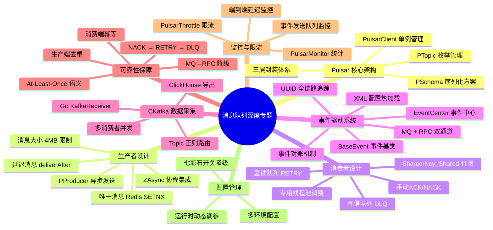

---

> **总结**：项目的消息队列实践体现了"**双 MQ 各司其职、MQ+RPC 双通道互备、三层可靠性保障**"的设计理念——Pulsar 承担核心业务的事件驱动，提供延迟消息、死信队列、Key_Shared 有序消费等高级特性；CKafka 承担数据采集旁路的高吞吐日志传输；事件中心的 MQ/RPC 双通道设计确保了 MQ 不可用时可以无缝降级到 RPC。通过 PulsarThrottle 限流、手动 ACK/NACK、重试+死信队列的三层保障，实现了 At-Least-Once 消息可靠性。整套方案在数万并发玩家的生产环境中稳定运行。