# MySQL与数据库原理深度专题

本文从面试高频考点出发，系统梳理 MySQL/关系型数据库的核心原理（索引、事务、锁机制、查询优化），并结合元梦之星项目（letsgo_server）中 TcaplusDB（NoSQL）的实际实践，进行深度对比分析。既覆盖面试必考的 MySQL 理论知识，又展示项目中数据库选型与数据管理的工程能力。

---

## 目录

1. [项目数据库使用全景](#section1)
2. [MySQL 核心架构与存储引擎](#section2)
3. [索引原理与优化](#section3)
4. [事务与隔离级别](#section4)
5. [锁机制深度分析](#section5)
6. [查询优化与执行计划](#section6)
7. [TcaplusDB 核心原理与架构](#section7)
8. [TcaplusDB vs MySQL 全维度对比](#section8)
9. [项目数据模型设计实践](#section9)
10. [分布式数据库通用原理](#section10)
11. [面试高频QA与话术](#section11)

---

## 一、项目数据库使用全景 {#section1}

### 1.1 数据存储架构总览

元梦之星采用 **TcaplusDB（主存储）+ Redis（缓存层）+ MySQL（辅助存储）+ ClickHouse（分析存储）** 的多存储引擎架构：

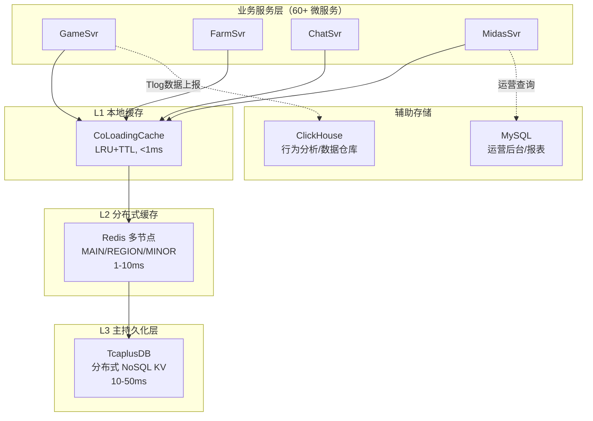

### 1.2 各存储引擎职能划分

| 存储引擎 | 数据模型 | 主要职能 | 数据量级 | 读写特征 |
|---------|---------|---------|---------|---------|
| **TcaplusDB** | KV + Protobuf | 玩家全量数据、游戏状态、社交关系 | 百亿级记录 | 高频读写，主键查询 |
| **Redis** | String/Hash/ZSet/Set | 缓存加速、分布式锁、排行榜、计数器 | 千万级Key | 极高频读，写入适中 |
| **MySQL** | 关系型表 | 运营后台、配置管理、统计报表 | 百万级记录 | 低频读写，复杂查询 |
| **ClickHouse** | 列式存储 | 玩家行为分析、数据仓库、Ad-hoc查询 | 万亿级行 | 批量写入，复杂分析 |

### 1.3 为什么面试必须掌握 MySQL？

项目虽以 TcaplusDB 为主存储，但面试中 MySQL 是 **~80% 的 JD 必选项**，原因如下：

| 原因 | 说明 |
|------|------|
| **通用性** | MySQL 是后端工程师的"通用语言"，即使项目不直接使用也必须精通 |
| **原理互通** | 索引、事务、锁的核心原理在所有数据库中通用，MySQL 是学习载体 |
| **对比能力** | 理解 MySQL 才能解释"为什么选 TcaplusDB"，展示技术选型深度 |
| **项目实际** | 项目中 MySQL 用于运营后台、PyMySQL 工具链、数据分析旁路 |

---

## 二、MySQL 核心架构与存储引擎 {#section2}

### 2.1 MySQL 架构分层

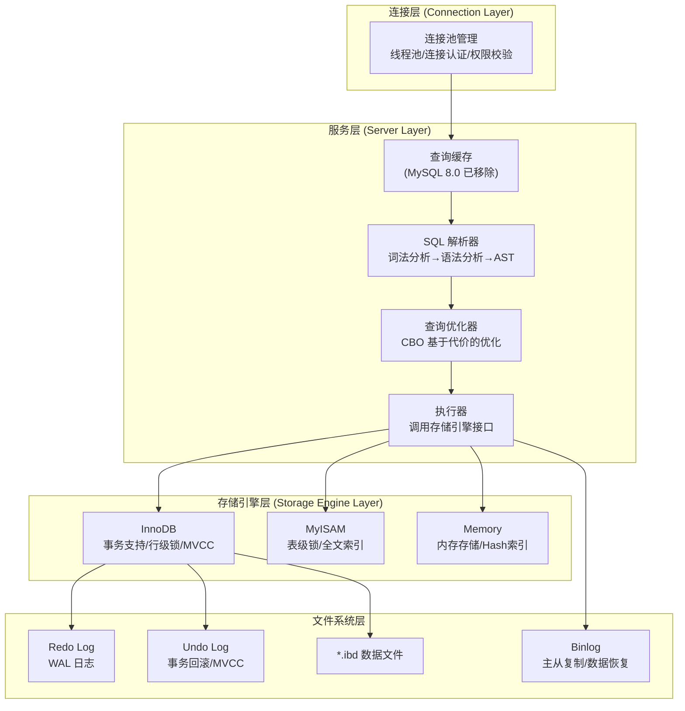

### 2.2 InnoDB 存储引擎核心特性

InnoDB 是 MySQL 的默认存储引擎（MySQL 5.5+），也是面试必考内容：

| 特性 | 说明 | 面试关键点 |
|------|------|-----------|
| **B+树索引** | 聚簇索引 + 二级索引 | 回表、覆盖索引、最左前缀 |
| **事务支持** | ACID 完整支持 | 隔离级别、MVCC、幻读 |
| **行级锁** | Record Lock + Gap Lock + Next-Key Lock | 锁粒度、死锁检测 |
| **MVCC** | 多版本并发控制 | Read View、Undo Log 版本链 |
| **Buffer Pool** | 内存缓存页管理 | LRU 变种、Change Buffer |
| **WAL** | Write-Ahead Logging | Redo Log 二阶段提交 |
| **Doublewrite** | 双写缓冲 | 解决 Partial Page Write |
| **自适应哈希索引** | AHI | 热点数据加速 |

### 2.3 InnoDB Buffer Pool 架构

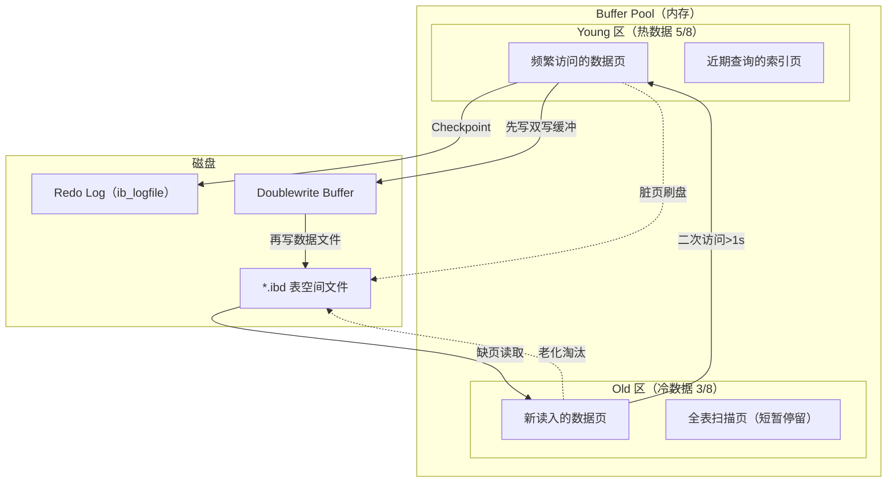

**Buffer Pool LRU 改进（面试重点）**：
- **传统 LRU 问题**：全表扫描会把热点数据挤出缓存
- **MySQL 改进**：将 LRU 分为 Young（热区 5/8）和 Old（冷区 3/8），新页先进 Old 区，超过 `innodb_old_blocks_time`（默认1s）后再次访问才提升到 Young 区
- **项目对比**：项目 `CoLoadingCache` 也实现了 LRU+TTL 双淘汰策略，设计理念相同

### 2.4 WAL（Write-Ahead Logging）与两阶段提交

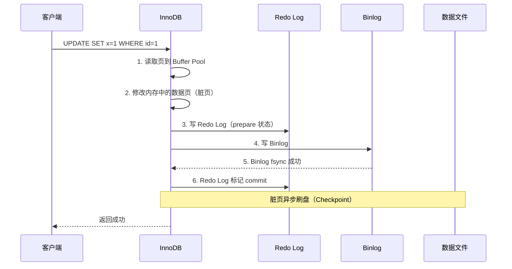

**为什么需要两阶段提交？**
- 保证 Redo Log 和 Binlog 的一致性
- 崩溃恢复时：Redo 有 prepare + Binlog 有记录 → 提交；Redo 有 prepare + Binlog 无记录 → 回滚
- **面试话术**："两阶段提交是 MySQL 保证主从一致性的核心机制，本质是分布式事务的 2PC 协议在单机内的应用"

---

## 三、索引原理与优化 {#section3}

### 3.1 B+树索引结构

```
                        [非叶子节点: 10 | 20 | 30]
                       /           |           \
           [5|8|10]          [12|15|20]         [22|25|30]
            / | \             / | \              / | \
     [3,5] [6,8] [9,10]  [11,12] [13,15] [18,20] [21,22] [23,25] [28,30]
      ↓↔↓    ↓↔↓    ↓↔↓    ↓↔↓      ↓↔↓      ↓↔↓      ↓↔↓      ↓↔↓     ↓↔↓
                    叶子节点通过双向链表连接（支持范围查询）
```

**B+树核心特性（面试必答）**：

| 特性 | 说明 | 面试考点 |
|------|------|---------|
| **数据只在叶子节点** | 非叶子节点仅存储索引键 | 对比 B 树（所有节点存数据） |
| **叶子节点双向链表** | 支持高效范围查询和排序 | 为什么比 Hash 索引适合范围查询 |
| **高扇出（Fan-out）** | 3-4 层可存储数十亿条记录 | 千万级数据查询只需 3-4 次 IO |
| **有序性** | 天然支持 ORDER BY | 为什么 B+树适合数据库 |

**层高与数据量的关系**（假设页大小 16KB，每个索引项占 12 字节）：

| B+树层高 | 非叶子扇出 | 可存储记录数 | IO 次数 |
|:-------:|:---------:|:-----------:|:------:|
| 2层 | ~1300 | ~170万 | 2次 |
| 3层 | ~1300 | ~22亿 | 3次 |
| 4层 | ~1300 | ~2.8万亿 | 4次 |

### 3.2 聚簇索引 vs 二级索引

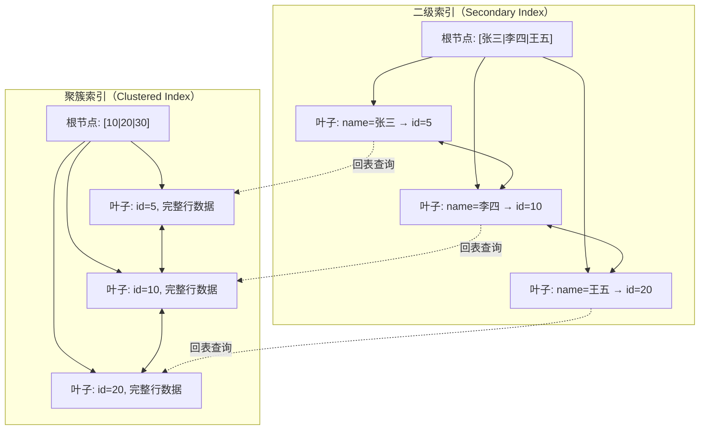

**核心概念**：

| 概念 | 说明 | 示例 |
|------|------|------|
| **聚簇索引** | 数据按主键物理排列存储，一张表只有一个 | `PRIMARY KEY (id)` |
| **二级索引** | 叶子节点存储主键值，查完整数据需回表 | `INDEX idx_name (name)` |
| **回表** | 通过二级索引找到主键后，再到聚簇索引查完整行 | `SELECT * FROM t WHERE name='xxx'` |
| **覆盖索引** | 查询字段全部在索引中，无需回表 | `SELECT name FROM t WHERE name='xxx'` |
| **最左前缀** | 联合索引 `(a,b,c)` 可匹配 `a`、`(a,b)`、`(a,b,c)` | `WHERE a=1 AND b=2` |
| **索引下推 ICP** | 在索引层过滤不满足条件的记录，减少回表 | MySQL 5.6+ |

### 3.3 索引失效场景（面试高频）

| 序号 | 失效场景 | 原因 | 示例 |
|:----:|---------|------|------|
| 1 | 对索引列使用函数 | 破坏了 B+树的有序性 | `WHERE YEAR(create_time)=2024` |
| 2 | 隐式类型转换 | 触发函数转换 | `WHERE varchar_col=123`（应加引号） |
| 3 | 不满足最左前缀 | 跳过联合索引左侧列 | 索引 `(a,b,c)` 只用 `WHERE b=1` |
| 4 | LIKE 左模糊 | 无法利用索引有序性 | `WHERE name LIKE '%张'` |
| 5 | OR 条件 | 有一侧无索引则全表扫描 | `WHERE a=1 OR b=2`（b 无索引） |
| 6 | 优化器判断全表扫描更快 | 回表成本高于全表扫描 | 查询覆盖超过 30% 数据 |
| 7 | 索引列参与运算 | 同函数原因 | `WHERE id+1=10` |
| 8 | IS NULL / IS NOT NULL | 取决于数据分布和优化器 | 视具体情况 |

### 3.4 索引优化实战建议

```sql
-- ❌ 低效：对列使用函数
SELECT * FROM player WHERE DATE(login_time) = '2024-01-01';

-- ✅ 改写：范围查询
SELECT * FROM player WHERE login_time >= '2024-01-01'
                       AND login_time < '2024-01-02';

-- ❌ 低效：`SELECT *` 导致大量回表
SELECT * FROM player WHERE name = '张三';

-- ✅ 改写：覆盖索引，避免回表
SELECT id, name FROM player WHERE name = '张三';
-- 需要联合索引 INDEX idx_name_id (name, id)

-- ❌ 低效：未利用最左前缀
-- 联合索引 (zone_id, level, vip)
SELECT * FROM player WHERE level = 50;

-- ✅ 改写：从最左列开始
SELECT * FROM player WHERE zone_id = 1 AND level = 50;
```

**与项目 TcaplusDB 的对比**：

| 对比点 | MySQL 索引 | TcaplusDB 索引 |
|--------|-----------|---------------|
| 索引结构 | B+树（聚簇+二级） | Hash 分片 + PartKey 索引 |
| 范围查询 | B+树叶子链表高效支持 | 不支持范围扫描（需遍历） |
| 复杂查询 | SQL 任意组合条件 | 仅支持主键/分表键/PartKey 查询 |
| 索引数量 | 单表可创建多个 | 主键 + 少量全局二级索引 |
| 索引维护 | 写入时自动维护 | 自动维护，但索引类型有限 |

---

## 四、事务与隔离级别 {#section4}

### 4.1 事务 ACID 特性

| 特性 | 全称 | 说明 | InnoDB 实现机制 |
|------|------|------|----------------|
| **A** | Atomicity 原子性 | 事务要么全部成功，要么全部回滚 | **Undo Log** 记录反向操作 |
| **C** | Consistency 一致性 | 事务前后数据满足完整性约束 | 由 A+I+D 共同保证 |
| **I** | Isolation 隔离性 | 并发事务互不干扰 | **MVCC + 锁** |
| **D** | Durability 持久性 | 提交后数据永久保存 | **Redo Log + Doublewrite** |

### 4.2 四种隔离级别


| 隔离级别 | 脏读 | 不可重复读 | 幻读 | 实现方式 | 性能 |
|---------|:----:|:---------:|:----:|---------|:----:|
| READ UNCOMMITTED | ❌ | ❌ | ❌ | 无隔离 | 最高 |
| **READ COMMITTED** | ✅ | ❌ | ❌ | 每次读取生成新 Read View | 高 |
| **REPEATABLE READ** | ✅ | ✅ | ⚠️ | 事务首次读生成 Read View | 中 |
| SERIALIZABLE | ✅ | ✅ | ✅ | 读加共享锁，写加排他锁 | 最低 |

> ⚠️ **MySQL 的 RR 级别通过 Next-Key Lock 在很大程度上解决了幻读问题**，但在特定场景下仍可能出现。

### 4.3 MVCC 多版本并发控制（面试核心）

**MVCC 的核心组件**：

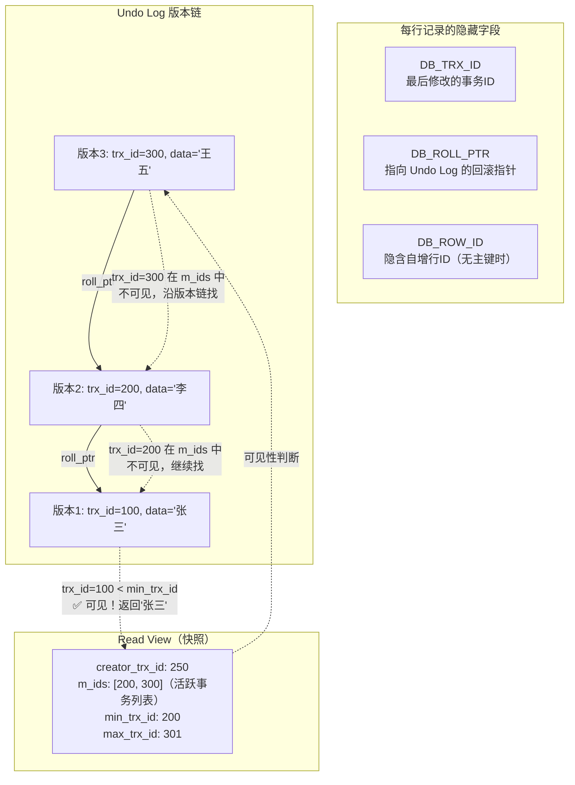

**Read View 可见性判断规则**：

```
对于版本链中的某个版本（trx_id）：

1. trx_id == creator_trx_id  → ✅ 可见（自己的修改）
2. trx_id < min_trx_id       → ✅ 可见（事务已提交）
3. trx_id >= max_trx_id      → ❌ 不可见（事务在快照之后开始）
4. min_trx_id ≤ trx_id < max_trx_id：
   - trx_id 在 m_ids 中      → ❌ 不可见（事务尚未提交）
   - trx_id 不在 m_ids 中    → ✅ 可见（事务已提交）
```

**RC vs RR 的区别在于 Read View 的生成时机**：
- **RC**：每次 SELECT 都生成新的 Read View → 能看到其他事务已提交的最新数据
- **RR**：只在事务第一次 SELECT 时生成 Read View → 整个事务看到的是同一份快照

**面试话术**：
> "MVCC 的核心是通过 Undo Log 版本链和 Read View 实现无锁读取。每条记录都维护一个版本链，每个事务通过 Read View 判断哪个版本对自己可见。RC 级别每次查询都重新生成 Read View，所以能看到最新提交的数据；RR 级别在事务开始时固定 Read View，所以整个事务中看到的数据一致。"

### 4.4 项目中的"事务"对比

**TcaplusDB 无事务支持**，项目通过其他机制模拟事务语义：

| MySQL 事务特性 | TcaplusDB 对应实现 | 项目实现方式 |
|---------------|-------------------|-------------|
| 原子性（A） | 单记录操作原子性 | 利用单行 Replace/Update 原子操作 |
| 一致性（C） | 版本号乐观锁 | `setVersion()` + 冲突重试 |
| 隔离性（I） | 无 MVCC | 应用层协程串行化（同一 uid 请求串行） |
| 持久性（D） | TcaplusDB 集群持久化 | 多副本 + WAL |

```java
// 项目中模拟"事务"的典型模式（TcaplusDB 版本号乐观锁）
// 类似 MySQL 的 SELECT FOR UPDATE + UPDATE 模式
TcaplusRsp getResult = TcaplusUtil.newGetReq(builder).send();
int version = getResult.getVersion();  // 相当于 SELECT ... FOR UPDATE

// 业务逻辑修改数据
modifyData(getResult);

// 带版本号写回（相当于 UPDATE ... WHERE version=N）
TcaplusRsp updateResult = TcaplusUtil.newUpdateReq(newBuilder)
    .setVersion(version)  // CAS 操作
    .send();

if (updateResult.getResult() == SVR_ERR_FAIL_INVALID_VERSION) {
    // 版本冲突 → 重试（类似乐观锁回滚）
    retry();
}
```

---

## 五、锁机制深度分析 {#section5}

### 5.1 MySQL InnoDB 锁分类

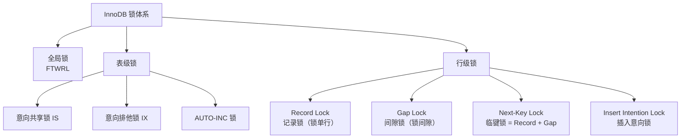

### 5.2 行级锁详解

| 锁类型 | 作用范围 | 解决问题 | 加锁场景 |
|--------|---------|---------|---------|
| **Record Lock** | 精确锁定某一行 | 防止并发修改同一行 | `WHERE id=1` 命中唯一索引 |
| **Gap Lock** | 锁定两条记录之间的间隙 | 防止幻读（RR级别） | 范围查询时锁定间隙 |
| **Next-Key Lock** | Record Lock + Gap Lock | 防止幻读 + 防止并发修改 | **默认行为**（RR级别） |
| **Insert Intention Lock** | 间隙中的插入意向 | 允许同一间隙内不同位置的并发插入 | INSERT 操作 |

### 5.3 锁的加锁规则（RR 级别）

```
加锁的基本规则：
1. 索引上的等值查询：
   - 唯一索引命中：Next-Key Lock 退化为 Record Lock
   - 唯一索引未命中：Next-Key Lock 退化为 Gap Lock
   - 普通索引命中：Next-Key Lock + 向右遍历到不满足时的 Gap Lock

2. 索引上的范围查询：
   - 扫描到的所有记录加 Next-Key Lock
   - 直到不满足条件的第一条记录为止

3. 无索引查询：
   - 全表扫描 → 锁住所有记录 + 所有间隙 → 相当于表锁
```

**死锁示例**：

```sql
-- 事务A
BEGIN;
UPDATE account SET balance=balance-100 WHERE id=1;  -- 持有 id=1 的 X 锁
UPDATE account SET balance=balance+100 WHERE id=2;  -- 等待 id=2 的 X 锁

-- 事务B
BEGIN;
UPDATE account SET balance=balance-100 WHERE id=2;  -- 持有 id=2 的 X 锁
UPDATE account SET balance=balance+100 WHERE id=1;  -- 等待 id=1 的 X 锁 → 死锁！
```

**InnoDB 死锁处理**：
- **死锁检测**：Wait-for Graph 等待图检测环路（默认开启，`innodb_deadlock_detect=ON`）
- **处理策略**：回滚 Undo Log 量最小的事务
- **超时机制**：`innodb_lock_wait_timeout` 默认 50 秒

### 5.4 项目锁体系对比

| 对比维度 | MySQL InnoDB 锁 | 项目分布式锁体系 |
|---------|----------------|----------------|
| 锁粒度 | 行级锁（Record/Gap/Next-Key） | Key 级锁（Redis SETNX / TcaplusDB 记录锁） |
| 实现层 | 存储引擎层自动管理 | 应用层显式管理 |
| 死锁检测 | 自动 Wait-for Graph | 无自动检测，依靠超时 |
| 锁等待 | 事务阻塞等待 | 协程挂起等待（CacheLockAgent） |
| 锁续期 | 事务结束自动释放 | 需要手动续期（CacheLockAgent watchdog） |
| 公平性 | FIFO 队列 | 无保证（谁先抢到谁用） |
| 跨表事务 | 原生支持 | 需要应用层编排（无 2PC） |

---

## 六、查询优化与执行计划 {#section6}

### 6.1 EXPLAIN 执行计划核心字段

```sql
EXPLAIN SELECT * FROM player WHERE zone_id=1 AND level>50 ORDER BY login_time DESC LIMIT 100;
```

| 字段 | 含义 | 关键值 |
|------|------|--------|
| **type** | 访问类型 | `const`>`eq_ref`>`ref`>`range`>`index`>`ALL` |
| **key** | 实际使用的索引 | 为 NULL 则未用索引 |
| **key_len** | 使用的索引长度 | 越短越好，判断联合索引使用了几列 |
| **rows** | 预估扫描行数 | 越少越好 |
| **filtered** | 过滤后剩余百分比 | 越高越好 |
| **Extra** | 额外信息 | `Using index`（覆盖索引）、`Using filesort`（需优化） |

### 6.2 常见优化策略

| 场景 | 问题 | 优化方案 |
|------|------|---------|
| **慢查询** | `type=ALL` 全表扫描 | 添加合适的索引 |
| **回表过多** | 二级索引 + 大量 `SELECT *` | 使用覆盖索引或减少查询列 |
| **深分页** | `LIMIT 1000000, 10` | 延迟关联：先查主键再关联 |
| **排序开销** | `Extra: Using filesort` | 利用索引有序性避免排序 |
| **临时表** | `Extra: Using temporary` | 优化 GROUP BY / DISTINCT |
| **锁等待** | 长事务持锁 | 缩小事务范围，避免大事务 |
| **热点更新** | 高并发更新同一行 | 拆行/队列化/异步更新 |

### 6.3 深分页优化（面试高频）

```sql
-- ❌ 低效：MySQL 需要扫描 1000010 行然后丢弃前 1000000 行
SELECT * FROM player ORDER BY id LIMIT 1000000, 10;

-- ✅ 方案1：延迟关联（推荐）
SELECT p.* FROM player p
INNER JOIN (
    SELECT id FROM player ORDER BY id LIMIT 1000000, 10
) t ON p.id = t.id;
-- 子查询走覆盖索引，只扫描索引不回表

-- ✅ 方案2：游标分页（适合连续翻页）
SELECT * FROM player WHERE id > 上一页最后一条id ORDER BY id LIMIT 10;
-- 直接定位起始位置，O(1) 而非 O(N)

-- ✅ 方案3：业务层限制
-- 搜索结果最多展示前 100 页，或使用 "加载更多" 代替页码翻页
```

**项目中的分页对比**：TcaplusDB 不支持 OFFSET/LIMIT 语义，分页通过 **业务层自行管理 Seq 自增** 实现（如 BillUtil 的订单分页），本质就是方案2的"游标分页"。

---

## 七、TcaplusDB 核心原理与架构 {#section7}

### 7.1 TcaplusDB 架构

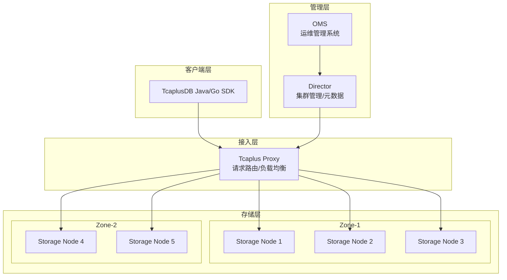

### 7.2 TcaplusDB 核心特性

| 特性 | 实现方式 | 项目中的体现 |
|------|---------|-------------|
| **分片策略** | 基于 `tcaplus_splitkey` Hash 分片 | `option (tcaplus_splitkey) = "Uid"` |
| **主键查询** | Hash 定位到分片 → 内存索引定位记录 | `newGetReq(builder).send()` |
| **PartKey 查询** | 部分主键匹配，扫描分片内记录 | `newGetByPartKeyReq()` 支持 |
| **全局二级索引** | 独立索引表，异步构建 | `option (tcaplus_index) = "index1:Uid"` |
| **版本号控制** | 每条记录自带版本号，写入时原子自增 | `setVersion()` 乐观锁 |
| **Protobuf Schema** | 原生 Protobuf 序列化 | Proto 定义即表结构 |
| **Blob 存储** | 嵌套消息序列化为 `DbPlatBuffer` | 单字段最大 256KB/1MB |
| **LIST 表** | 支持 LIST 类型表（有限条记录列表） | `TableType=LIST;ListNum=100` |

### 7.3 项目数据表分类

通过分析项目中 41+ 张 TcaplusDB 表定义，按设计模式分类：

| 表设计模式 | 典型表 | 主键设计 | 分表键 | 数量 |
|-----------|--------|---------|--------|:----:|
| **单 Key 实体表** | Player, PlayerPublic, PlayerOnlineTable | `Uid` | `Uid` | ~15 |
| **双 Key 关系表** | RelationTable, PlayerMail, ChatSession | `Uid1,Uid2,Type` / `Uid,Id` | `Uid` / `Uid1` | ~12 |
| **多 Key 复合表** | ChatMsg, CommonNumericAttr | `GroupId,SubId,SeqId` | `GroupId` | ~8 |
| **全局管理表** | Server, GuidKey, GlobalMgrDistLock | `serverId,worldId` / `lockKey` | 按场景 | ~6 |
| **LIST 表** | BattleHistory | `type,uuid` | `uuid` | ~3 |

### 7.4 数据访问模式


---

## 八、TcaplusDB vs MySQL 全维度对比 {#section8}

### 8.1 核心维度对比

| 对比维度 | MySQL (InnoDB) | TcaplusDB | 胜出方 | 说明 |
|---------|---------------|-----------|:-----:|------|
| **数据模型** | 关系型（行列表结构） | KV + Protobuf | 各有优势 | MySQL 灵活查询，TcaplusDB 高性能 KV |
| **查询能力** | SQL 全能力（JOIN/子查询/聚合） | 主键/PartKey/全局二级索引 | MySQL | TcaplusDB 查询能力极其有限 |
| **写入性能** | 万级 QPS | **百万级 QPS** | TcaplusDB | Hash 分片 + 无事务开销 |
| **读取延迟** | 1-10ms（Buffer Pool 命中） | **10-50ms**（网络往返） | MySQL | 但项目有 Redis L2 层补偿 |
| **事务支持** | 完整 ACID | **无事务**（单行原子） | MySQL | TcaplusDB 用乐观锁模拟 |
| **锁机制** | 行级锁 + MVCC | 版本号乐观锁 | 各有优势 | 乐观锁无死锁，MySQL 锁更完善 |
| **Schema 变更** | DDL 可能锁表 | **不停服、不锁表** | TcaplusDB | Protobuf 兼容性原生保障 |
| **序列化** | 需要 ORM 转换 | **原生 Protobuf** | TcaplusDB | 零 ORM 层，效率极高 |
| **运维成本** | 需 DBA 或云 RDS | **全托管** | TcaplusDB | 腾讯云托管，零运维 |
| **扩展性** | 分库分表复杂 | **自动 Hash 分片** | TcaplusDB | 透明水平扩展 |
| **生态系统** | 极其丰富 | **腾讯内部生态** | MySQL | 工具链、社区、文档 |
| **迁移成本** | 行业标准，随处可迁 | **强绑定腾讯云** | MySQL | 离开腾讯云成本极高 |
| **数据分析** | 原生支持 | 需导出到 ClickHouse | MySQL | Ad-hoc 查询能力差距巨大 |
| **复杂关联** | 原生 JOIN | **不支持** | MySQL | 跨表查询需应用层处理 |

### 8.2 适用场景对比

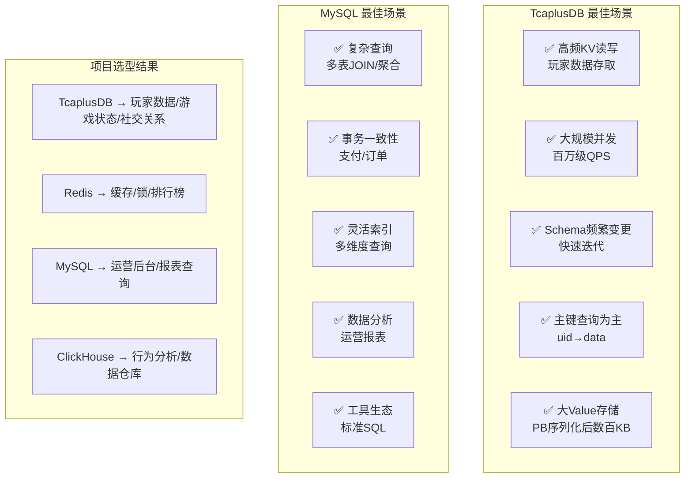

### 8.3 "如果用 MySQL 替代 TcaplusDB"——技术挑战分析

面试中可能问"为什么不直接用MySQL"，以下是技术挑战分析：

| 挑战 | MySQL 方案 | 复杂度 | TcaplusDB 原生方案 |
|------|-----------|:------:|-------------------|
| **百万QPS写入** | 分库分表（ShardingSphere） + 写入缓冲 | 🔴高 | Hash 自动分片 |
| **数百KB单行** | TEXT/BLOB + 大页优化 | 🟡中 | DbPlatBuffer 原生支持 |
| **Protobuf存储** | ORM层转换（MyBatis） | 🟡中 | 原生Protobuf |
| **Schema频繁变更** | pt-online-schema-change | 🟡中 | 新增字段即完成 |
| **版本号乐观锁** | 手动 `WHERE version=N` | 🟢低 | 原生支持 |
| **40+张表分库** | 分库分表路由 + 中间件 | 🔴高 | Zone 隔离 |
| **跨区数据复制** | 主从复制 + 双写 | 🔴高 | get_replace 工具 |

**面试话术**：
> "我们选择 TcaplusDB 而非 MySQL，核心原因有三：一是游戏玩家数据是典型的 KV 模型（uid→全量数据），不需要 JOIN 和复杂查询，KV 存储天然更高效；二是 Protobuf 原生支持省去了 ORM 层的开销和复杂性；三是版本号乐观锁原生支持，恰好满足游戏场景的并发控制需求。但 MySQL 的 SQL 能力、事务支持和生态系统是 TcaplusDB 无法替代的，所以运营后台和数据分析仍然使用 MySQL/ClickHouse。"

---

## 九、项目数据模型设计实践 {#section9}

### 9.1 主键与分表键设计模式

项目 41+ 张表的主键设计遵循以下模式：

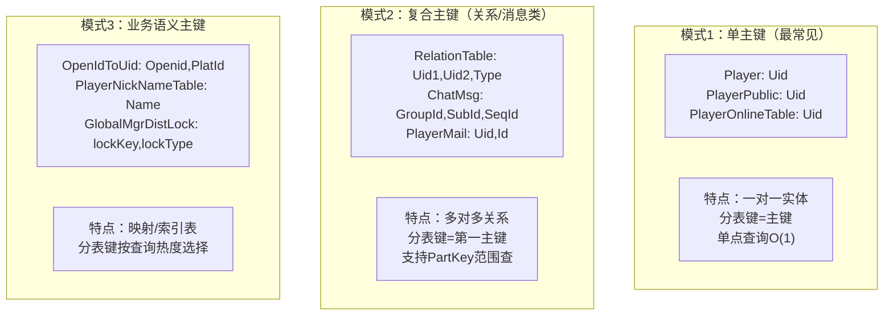

### 9.2 分表键选择策略

| 策略 | 分表键选择 | 适用场景 | 项目示例 |
|------|-----------|---------|---------|
| **用户维度分片** | `Uid` 作为分表键 | 玩家个人数据，天然均匀 | Player, PlayerPublic, PlayerMail |
| **关系发起方分片** | `Uid1` 作为分表键 | 社交关系，一次性拉取某用户所有关系 | RelationTable: `splitkey=Uid1` |
| **群组维度分片** | `GroupId` 作为分表键 | 聊天消息，同组消息在同一分片 | ChatMsg: `splitkey=GroupId,GroupSubId` |
| **业务键分片** | 业务标识作为分表键 | 全局资源管理 | Server: `splitkey=worldId` |
| **时间维度分片** | 时间戳为分表键 | 监控数据，避免热点 | OnlineMonitor: `splitkey=timekey` |

**面试话术**：
> "分表键选择的核心原则是**按查询热度均匀分布**。我们玩家相关的表用 Uid 分片，因为查询总是按 uid 路由；社交关系表用关系发起方 Uid1 分片，因为拉好友列表是高频操作。聊天消息用 GroupId 分片，保证同一群的消息在同一分片，支持 PartKey 范围查询。这和 MySQL 分库分表选择 Sharding Key 的原则是一样的。"

### 9.3 PlayerPublic 字段拆分设计（大宽表优化）

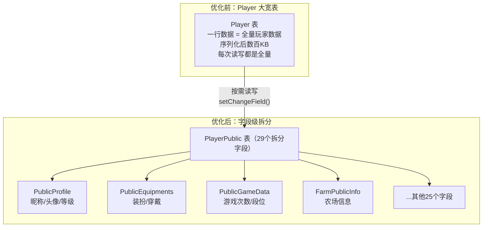

**设计亮点（面试可说）**：
- **字段级按需读写**：通过 `setChangeField()` 指定只读/写特定字段，减少网络传输
- **脏字段检测**：每个字段独立 `isDirty()` 检测，只写入变更的字段
- **立即/延迟双策略**：外显字段（昵称、装扮）立即写入，非外显字段走限频合并
- **增量/全量自适应**：当增量数据 > 全量的 10% 时自动切换为全量写入

### 9.4 与 MySQL 数据建模的对比

| 建模实践 | MySQL 方案 | TcaplusDB 项目方案 |
|---------|-----------|-------------------|
| **一对一关系** | 外键 + JOIN | 嵌套 Protobuf（Player 内嵌 UserAttr） |
| **一对多关系** | 从表 + 外键索引 | 复合主键表（PlayerMail: Uid,Id） |
| **多对多关系** | 中间表 + 双向外键 | 复合主键 + PartKey 索引（RelationTable） |
| **大字段存储** | TEXT/BLOB + 分表 | DbPlatBuffer（256KB）/ DbPlatBufferLarge（1MB） |
| **字段扩展** | ALTER TABLE 加列 | Protobuf 新增 optional 字段 + version |
| **数据归档** | 分区表 + 定时归档 | LIST 表自动限制条数（`ListNum=100`） |
| **唯一约束** | UNIQUE 索引 | INSERT 原子性（记录已存在则失败） |
| **范式化** | 第三范式 + 反范式优化 | **完全反范式**（一个 uid 对应一行大数据） |

---

## 十、分布式数据库通用原理 {#section10}

### 10.1 CAP 定理

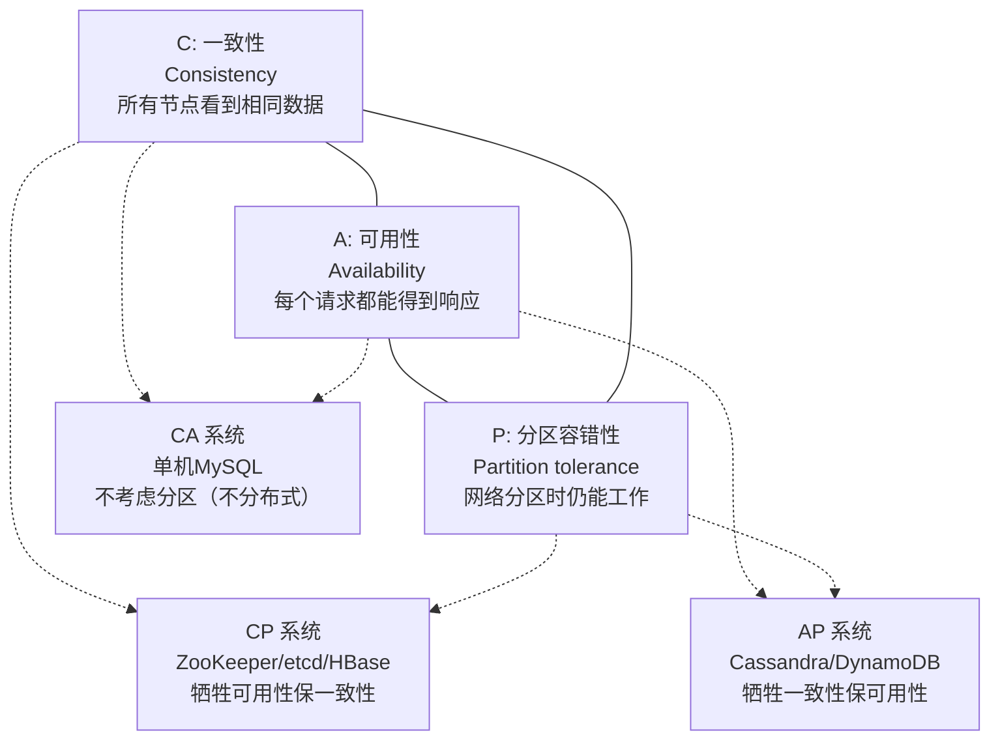

**项目 CAP 选择**：
- **TcaplusDB**：CP 倾向（强一致性，分区时牺牲可用性）
- **Redis 缓存**：AP 倾向（可用性优先，熔断降级）
- **CacheLockAgent**：CAP 策略可配（`capAvailability` 参数）

### 10.2 一致性 Hash 与数据分片

```
传统 Hash: key % N  →  扩容时 rehash 大量数据
一致性 Hash: hash(key) → 虚拟环 → 顺时针找最近节点

       0
      /|\
   255 | 1
    /  |  \
  ...  |  ...
    \  |  /
   128 | 127
      \|/
      129

节点: A(50), B(130), C(200)
key hash=80 → 顺时针找到 B(130)
key hash=160 → 顺时针找到 C(200)
扩容加 D(90) → 只需迁移 [51,90] 的数据从 B 到 D
```

**项目中的分片策略**：
- TcaplusDB 使用 **Hash 分片**（基于 `tcaplus_splitkey`），由平台自动管理
- Redis 使用 **一致性 Hash**（Cluster 模式 16384 slots）
- 项目 RPC 路由使用 **一致性 Hash**（`RouteType.CHash`）保证有状态请求路由到同一服务

### 10.3 分布式数据库核心问题与解决方案

| 问题 | 说明 | MySQL 方案 | 项目方案 |
|------|------|-----------|---------|
| **分库分表** | 单表数据过大 | ShardingSphere / DBLE | TcaplusDB 自动分片 |
| **分布式事务** | 跨分片数据一致性 | XA / Seata / TCC | 版本号乐观锁 + 补偿 |
| **全局 ID** | 分布式唯一主键 | Snowflake / UUID | GuidKey 表自增 |
| **跨分片查询** | 分表后的聚合查询 | 中间件聚合 | 不支持（导出到 ClickHouse） |
| **热点数据** | 单分片压力过大 | 分区表 + 读写分离 | 三级缓存（L1→L2→L3）|
| **数据迁移** | Schema 变更/扩容 | pt-osc / gh-ost | Protobuf 兼容 + get_replace |
| **主从复制** | 读写分离/容灾 | GTID 主从复制 | TcaplusDB 多副本自动同步 |

### 10.4 MySQL 分库分表 vs TcaplusDB 自动分片

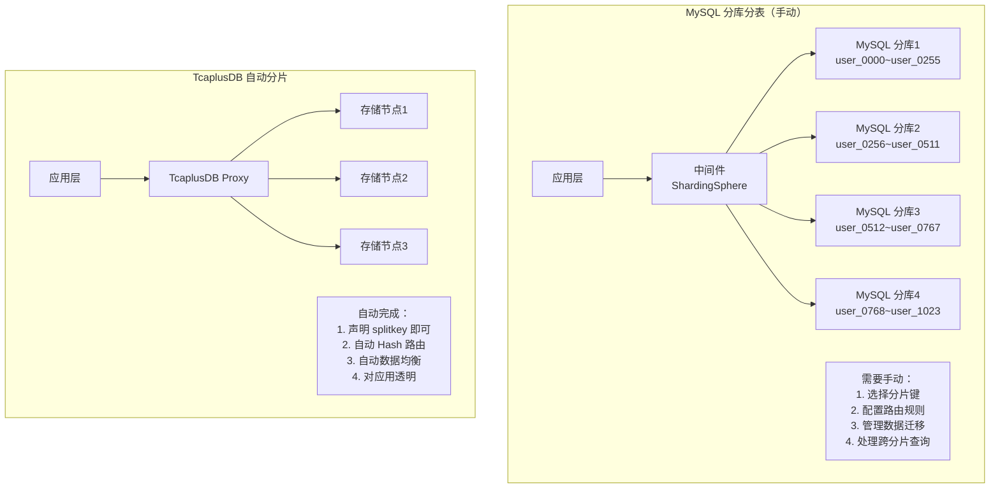

---

## 十一、面试高频 QA 与话术 {#section11}

### 11.1 MySQL 核心原理类

**Q1: 说说 B+树和 B 树的区别？为什么 MySQL 用 B+树？**

> "B+树相比 B 树有三个关键优势：
> 1. **数据只在叶子节点**——非叶子节点只存索引键，单个节点能容纳更多索引项，树更矮，IO 次数更少；
> 2. **叶子节点双向链表连接**——天然支持范围查询和 ORDER BY，这对数据库场景至关重要；
> 3. **查询性能稳定**——每次查询都走到叶子层，不像 B 树有时在中间节点就返回。
> 在我们项目中，TcaplusDB 使用 Hash 索引实现 O(1) 主键查询，但代价是不支持范围查询——这正好印证了 B+树在数据库中的不可替代性。"

**Q2: 解释一下 MVCC 的原理？**

> "MVCC 的核心是每行记录维护一个版本链（通过 Undo Log），每个事务通过 Read View 判断哪个版本对自己可见。
> Read View 包含三个关键信息：当前活跃事务列表 m_ids、最小活跃事务 ID min_trx_id、下一个待分配的事务 ID max_trx_id。判断规则是：版本的 trx_id 小于 min_trx_id 或不在 m_ids 中则可见，否则不可见。
> RC 级别每次 SELECT 生成新的 Read View，所以能看到最新提交的数据；RR 级别在事务首次 SELECT 时固定 Read View，整个事务看同一份快照。
> 在我们项目中，TcaplusDB 没有 MVCC，我们通过协程级串行化（同一 uid 的请求哈希到固定协程队列）+ 版本号乐观锁来实现类似的并发控制。"

**Q3: MySQL 的 RR 级别能完全解决幻读吗？**

> "MySQL 的 RR 级别通过 Next-Key Lock（Record Lock + Gap Lock）在大多数情况下解决了幻读。但有一个特殊场景：如果事务 A 用快照读（普通 SELECT）看不到事务 B 新插入的记录，然后事务 A 对这些'看不到'的记录执行 UPDATE，UPDATE 使用当前读会看到并修改这些记录，之后再 SELECT 就能看到了——这就是 RR 级别下的'幻读'场景。
> 解决方案是对查询加 `SELECT ... FOR UPDATE`（当前读），让 MySQL 使用 Next-Key Lock 锁住间隙，阻止其他事务插入。"

### 11.2 数据库选型类

**Q4: 你们为什么选 TcaplusDB 而不是 MySQL？**

> "选型基于三个核心考量：
> 1. **数据模型匹配**——游戏玩家数据是纯粹的 KV 模型，uid → 全量玩家数据，完全不需要 JOIN 和复杂 SQL 查询，KV 存储天然更高效；
> 2. **性能需求**——百万 DAU 游戏，峰值 QPS 达百万级，TcaplusDB 基于 Hash 分片和内存索引可以轻松支撑，MySQL 在同等规模下需要复杂的分库分表架构；
> 3. **Protobuf 原生支持**——项目通信协议全量使用 Protobuf，TcaplusDB 用 Protobuf 定义表结构，省去了 ORM 层的开销和复杂性。
> 
> 但 MySQL 的 SQL 能力和事务支持是不可替代的，所以运营后台、配置管理和数据报表仍然走 MySQL，行为分析走 ClickHouse。本质上是**用正确的工具做正确的事**。"

**Q5: 如果让你把 TcaplusDB 迁移到 MySQL，你会怎么做？**

> "这是一个重大的架构变更，需要分几步走：
> 1. **数据建模重构**——将 Protobuf 大 Value 拆解为关系型表结构，玩家核心数据拆为 player_base、player_bag、player_task 等多张表；
> 2. **引入分库分表中间件**——使用 ShardingSphere，以 uid 为分片键，按取模策略分 1024 片；
> 3. **实现 ORM 层**——用 MyBatis 或 JPA 替代当前的 TcaplusUtil 直接操作；
> 4. **版本号乐观锁改造**——在每张表加 version 列，UPDATE 时加 `WHERE version=N`；
> 5. **双写过渡**——先双写 TcaplusDB + MySQL，验证数据一致性后切流；
> 6. **性能优化**——引入更强的 Redis 缓存策略，因为 MySQL 单机性能远低于 TcaplusDB。
> 
> 整体工作量非常大，这也是技术选型要在项目初期谨慎决策的原因。"

### 11.3 实战经验类

**Q6: 你们的缓存和数据库一致性怎么保证？**

> "我们采用 Cache-Aside（旁路缓存）模式，三级缓存架构 L1 本地 → L2 Redis → L3 TcaplusDB。
> **读路径**：L1 命中直接返回（<1ms），未命中查 L2（1-10ms），再未命中查 L3（10-50ms），逐级回填。
> **写路径**：先更新 TcaplusDB，再删除 Redis 缓存和 L1 缓存——是'删除'而非'更新'，因为并发场景下先到的写可能后更新缓存导致脏数据。
> 防穿透用空值缓存 + SingleFlight 请求合并，防击穿用 CoLoadingCache 协程排队锁，防雪崩用 TTL 随机偏移 ±5% + Redis 熔断器。"

**Q7: 你们数据库的表结构变更是怎么做的？**

> "TcaplusDB 的 Schema 变更比 MySQL 简单得多——基于 Protobuf 的向前/向后兼容性：
> 1. 在 proto 文件中新增 optional 字段，标注 `tcaplus_field_version`；
> 2. 同步修改 XML 表定义，递增 metalib 版本号；
> 3. 在 TcaplusDB 管理端执行'批量改表'——**不停服、不锁表**；
> 4. 灰度发布新版本代码。
> 旧版本的数据通过 Protobuf 自动兼容——新增字段取默认值，旧代码读到新字段自动忽略。项目运营至今已经执行了 438 次 Schema 变更，全部不停服完成。
> 这与 MySQL 的 DDL 形成鲜明对比——MySQL 大表 ALTER TABLE 可能需要 pt-online-schema-change 或 gh-ost 来避免锁表。"

**Q8: 说说项目中 TcaplusDB 版本号乐观锁的使用？**

> "版本号乐观锁是我们并发控制的核心手段。TcaplusDB 每条记录都内置版本号，写入成功后自动自增。
> 使用模式类似 MySQL 的 `SELECT ... FOR UPDATE` + `UPDATE ... WHERE version=N`：先 Get 获取当前版本号，业务逻辑处理后带版本号 Update。如果期间被其他实例修改过，版本号不匹配，Update 失败返回 `SVR_ERR_FAIL_INVALID_VERSION`，业务层重试。
> CacheLockAgent 的续锁也用这个机制——续锁时版本冲突会重新查询 DB 确认是否仍是自己持有锁，如果是则修复本地版本号。
> 对比 MySQL 的悲观锁（行锁），乐观锁的优势是**无锁等待、无死锁风险**，适合读多写少、冲突率低的游戏场景。"

**Q9: 如果面试官问你 MySQL 的索引优化经验？**

> "虽然项目主存储是 TcaplusDB，但我在运营后台和工具开发中有 MySQL 索引优化的实践：
> 1. **运营查询优化**——运营后台按区服+时间范围查询玩家数据，原始 SQL 全表扫描耗时数十秒，通过建立 `(zone_id, login_time)` 联合索引 + 覆盖索引优化到毫秒级；
> 2. **慢查询分析**——使用 EXPLAIN 分析执行计划，重点关注 type、key、rows、Extra 四个字段；
> 3. **分页优化**——报表系统的深分页问题，用延迟关联替代 `LIMIT offset, count`；
> 4. **索引设计原则**——遵循最左前缀原则、避免对索引列使用函数、选择性高的列放在联合索引左侧。
> 
> 这些原则本质上在 TcaplusDB 中也通用——我们选择分表键时考虑查询热度和数据均匀分布，和 MySQL 选择分片键的原则完全一致。"

### 11.4 量化数据速查表

| 指标 | 数值 | 说明 |
|------|------|------|
| TcaplusDB 表数量 | 41+ 张 | 从 proto 文件中统计 |
| Schema 变更次数 | 438 次（metalib version） | 全部不停服完成 |
| 最大 PlayerPublic 字段 | 29 个拆分字段 | 字段级按需读写 |
| 单字段最大值 | 256KB（DbPlatBuffer）/ 1MB（Large） | Protobuf 序列化后的大小 |
| L3 读取延迟 | 10-50ms | TcaplusDB 网络往返 |
| L2 读取延迟 | 1-10ms | Redis 缓存命中 |
| L1 读取延迟 | <1ms | 本地内存 HashMap |
| 版本号乐观锁重试 | 最多 3 次 | 冲突率极低（<0.1%） |
| 缓存 TTL | 5 分钟（±5% 随机） | 防雪崩 |
| 分布式锁实现 | 3 种 | CacheLockAgent/RedisLock/DistributedLockMgr |
| 存盘限频窗口 | 3 秒 | 合并多次修改为一次写入 |
| 异步队列限流 | 80000 上限 | AsyncTcaplusManager 防压 |
| Protobuf 兼容性 | 向前 + 向后兼容 | tag-based 编码天然保障 |
| B+树3层可存 | ~22 亿条记录 | MySQL 千万级表通常 3 层 B+树 |
| InnoDB Buffer Pool | 默认 128MB，建议 70-80% 物理内存 | MySQL 调优核心参数 |

---

## 十二、总结

### 12.1 本文核心知识图谱

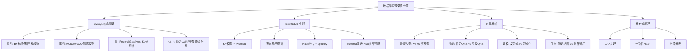

### 12.2 面试要点速记

1. **MySQL 三大核心**：索引（B+树）、事务（MVCC）、锁（Next-Key Lock）
2. **TcaplusDB 三大优势**：百万级 QPS、Protobuf 原生、版本号乐观锁
3. **选型三原则**：数据模型匹配、性能需求匹配、运维成本可控
4. **一致性三层防护**：版本号乐观锁（DB 层）+ 分布式锁（服务层）+ 协程串行化（进程层）
5. **缓存三件套**：防穿透（空值缓存）、防击穿（SingleFlight）、防雪崩（TTL 随机化）

---

> **总结**：本专题以"MySQL 原理 + TcaplusDB 实践 + 对比分析"的三维视角，既覆盖面试 ~80% JD 必考的 MySQL 理论知识，又结合项目实际展示了 NoSQL 数据库在百万 DAU 游戏中的工程实践。核心信息是：**理解关系型数据库的原理是基础，在此基础上根据业务场景做出正确的选型才是高级工程师的能力**。