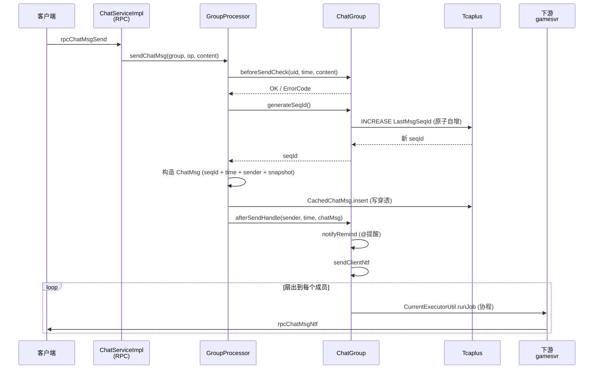

# 项目深度技术报告 · 高并发 IM 聊天系统篇（chatsvr）

> 本篇聚焦 `WeA/projects/chatsvr` —— 一个**支撑全游戏所有聊天场景**（单聊/组队聊/战局聊/俱乐部/世界频道/社区频道/系统消息/星球频道等 30+ ChatType）的 IM 服务。从多态建模、消息链路、扩散模型、缓存一致性、协程并发五个维度基于真实代码做深度拆解，并抽象出**可迁移到任何 IM / 弹幕 / 评论 / 通知 / 客服消息**等场景的通用经验。

---

## 0. 为什么 IM 值得单独讲

**IM 是后端面试的"万金油"——几乎所有互联网公司的技术面都会问。**

- 腾讯系：QQ / 微信 / 企微 / 游戏内聊天
- 阿里系：钉钉 / 旺旺 / 淘宝客服
- 字节系：飞书 / 抖音私信 / 直播弹幕
- 其他：B 站弹幕、知乎私信、Zoom 聊天、Slack、Teams

这些系统的**底层 7 成是同一套架构**：群组建模 / 消息存储 / 消息时序 / 消息扇出 / 多级缓存 / 离线推送。只要能把其中一个系统讲透，就能迁移到任何其他 IM。本项目 `chatsvr` 正是这样一个**完整的、工程化的、覆盖 30+ 聊天场景的 IM 服务**。

---

## 1. 架构总览

### 1.1 五层架构

```mermaid
flowchart TB
    subgraph RPC["① RPC 接入层"]
        A1[ChatServiceImpl<br/>对外 RPC 入口 ~20K]
        A2[LocaChatServiceImpl<br/>进程内服务 ~18K]
    end
    subgraph Entity["② 群类型多态建模层"]
        B0[ChatGroupFactory<br/>工厂路由]
        B1[BaseChatGroup<br/>模板基类]
        B2[ClubChatGroup]
        B3[TeamChatGroup]
        B4[PrivateChatGroup]
        B5[SceneChatGroup]
        B6[NoMemberChatGroup]
        B7[StarPChatGroup]
        B8[LobbyFacilityChatGroup]
        B9[SuperCoreChatGroup]
    end
    subgraph Processor["③ 处理器责任分层"]
        C1[GroupProcessor<br/>群与消息主链路 ~20K]
        C2[GroupChatMemberProcessor<br/>成员加入退出 ~15K]
        C3[MessageBoardProcessor<br/>留言板 ~13K]
        C4[ChatMsgDeleteProcessor<br/>撤回/删除]
        C5[PrivateChatMemberProcessor<br/>单聊成员]
        C6[SuperCoreChatMemberProcessor<br/>核心好友]
    end
    subgraph Cache["④ 缓存层（协程化 Loading Cache）"]
        D1[CachedChatGroup]
        D2[CachedChatMsg<br/>2 万条容量]
        D3[CachedChatSession]
        D4[MessageBoardCache]
    end
    subgraph Store["⑤ 持久化层（Tcaplus）"]
        E1[ChatGroup ~34K<br/>群本体+时序+广播]
        E2[ChatMsg<br/>消息体]
        E3[ChatSession<br/>会话未读数]
    end

    RPC --> Entity --> Processor --> Cache --> Store
```



**设计哲学**：
1. **entity 多态 ≠ processor 多态**：entity 层按 ChatType 分 9 个子类，processor 层按**功能**分 6 个 Processor。两个维度正交。
2. **缓存与存储分离**：`CachedChatXxx` 做读缓存 + 写穿透，`store/ChatXxx` 专职 DB 交互。缓存层完全替换存储（Tcaplus → MySQL / Redis）上层零感知。
3. **协程贯穿全链路**：从 `CurrentExecutorUtil.runJob` 到 `CoLoadingCache`（**协程化 Loading Cache**），chatsvr 是 Kona Fiber 协程应用最彻底的模块之一。

### 1.2 进程启动（ChatEngine）

[ChatEngine.java](/UGit/letsgo_server/WeA/projects/chatsvr/src/main/java/com/tencent/wea/framework/ChatEngine.java) 仅 2K 字节，骨架极简：
- init 时初始化各 Cache 的 `ThreadLocal` 实例
- 每个业务线程持有独立的缓存实例（见 §5.3）

极简骨架 = 业务复杂度都压在了 processor 和 entity 层，这是**"胖业务、薄框架"**的典型分工。

---

## 2. 群类型多态建模（核心亮点之一）

### 2.1 30+ ChatType → 9 个实体类

[ChatGroupFactory.java](/UGit/letsgo_server/WeA/projects/chatsvr/src/main/java/com/tencent/wea/chatservice/entity/ChatGroupFactory.java)

```java
switch (key.type) {
    case ChatType.CT_Club_VALUE:                  return new ClubChatGroup(group);
    case ChatType.CT_TeamGroup_VALUE:
    case ChatType.CT_StarPTeamGroup_VALUE:         return new TeamChatGroup(group);
    case ChatType.CT_Private_VALUE:
    case ChatType.CT_Stranger_VALUE:
    case ChatType.CT_NR3E8RichStranger_VALUE:      return new PrivateChatGroup(group);
    case ChatType.CT_Scene_VALUE:                  return new SceneChatGroup(group);
    case ChatType.CT_Zone_VALUE:
    case ChatType.CT_World_VALUE:
    case ChatType.CT_UgcMiniGameH5World_VALUE:
    case ChatType.CT_TeamRecruit_VALUE:
    case ChatType.CT_NewStar_VALUE:
    case ChatType.CT_FarmCommunityChannel_VALUE:
    ...                                            return new NoMemberChatGroup(group);
    case ChatType.CT_LobbyFacility_VALUE:          return new LobbyFacilityChatGroup(group);
    case ChatType.CT_SuperCore_VALUE:              return new SuperCoreChatGroup(group);
    case ChatType.CT_SystemRole_VALUE:             return new PrivateChatGroup(group);
    case ChatType.CT_StarP_VALUE:
    case ChatType.CT_StarPGuild_VALUE:
    case ChatType.CT_StarPGroup_VALUE:             return new StarPChatGroup(group);
    default:                                       return new BaseChatGroup(group);
}
```

### 2.2 群类型差异表（关键业务能力维度）

| 类型 | 是否有固定成员 | 是否需持久化消息 | 进出通知 | 消息扇出范围 | 权限判定 |
|---|---|---|---|---|---|
| 单聊 Private | ✅（2 人） | ✅ | ❌ | 2 人定向 | 双方 |
| 组队聊 Team | ✅（≤5） | ✅ | ✅ | 队员 | 队员 |
| 俱乐部 Club | ✅（100+） | ✅ | ✅（异步协程） | 俱乐部成员 | 任何人可进 |
| 场景聊 Scene | ✅ | ✅ | ✅ | 场景玩家 | 场景内 |
| 世界/区域 NoMember | ❌（无名册） | ❌（不入 DB） | ❌ | 全服广播 | 任何人 |
| 大厅设施 LobbyFacility | ✅ | ✅ | ✅（单独通知） | 设施内玩家 | 设施内 |
| 核心好友 SuperCore | ✅ | ✅ | ❌ | 小圈子 | 核心名单 |
| 星球 StarP 系列 | ✅ | ✅（支持历史） | ✅ | 星球内 | 星球成员 |
| 系统角色 SystemRole | 半自动 | ✅ | ❌ | 定向 2 人 | 玩家↔NPC |

**从这张表能看出 IM 系统建模的关键维度**：
1. **是否有成员名册**：世界频道没有名册（都是全员），不需要维护用户列表
2. **是否持久化**：世界频道消息不入 DB（量太大）
3. **进出是否需要通知**：单聊不需要，群聊需要
4. **扇出范围**：决定推送的量级
5. **权限判定**：是否需要 check isInChatGroup

### 2.3 模板方法模式 · BaseChatGroup

[BaseChatGroup.java](/UGit/letsgo_server/WeA/projects/chatsvr/src/main/java/com/tencent/wea/chatservice/entity/BaseChatGroup.java) 提供通用实现，子类通过钩子方法差异化：

```java
public class BaseChatGroup implements ChatGroupInterface {
    // 共用实现
    public NKErrorCode joinMember(...)   { return GroupChatMemberProcessor.getInstance().batchJoinChatGroup(...); }
    public GeneralChatMsg sendMsg(...)  { return GroupProcessor.getInstance().sendChatMsg(chatGroup, ..., needSenderSnapshot()); }
    public boolean checkPermission(long uid) { return chatGroup.isInChatGroup(uid); }

    // 钩子方法（子类覆盖）
    protected boolean needSenderSnapshot() { return false; }
}
```

**子类差异化示例** [ClubChatGroup.java](/UGit/letsgo_server/WeA/projects/chatsvr/src/main/java/com/tencent/wea/chatservice/entity/ClubChatGroup.java)：

```java
public class ClubChatGroup extends BaseChatGroup {
    @Override public boolean checkPermission(long uid) { return true; }  // 俱乐部任何人都能查

    @Override
    public NKErrorCode joinMember(...) {
        // 1. 去重：已经在俱乐部的人不重复加入
        Set<Long> currentUidSet = ...;
        MemberInfoList.Builder actualJoinList = MemberInfoList.newBuilder();
        for (MemberBaseInfo baseInfo : members.getMemberInfoList()) {
            if (currentUidSet.contains(baseInfo.getUid())) continue;  // 防重入
            actualJoinList.addMemberInfo(baseInfo);
        }
        ...
        // 2. 协程异步发入群系统消息
        CurrentExecutorUtil.runJob(new SendJoinClubTipsCallable(...), "SendEnterClubTips", false);
    }
}
```

**这段代码同时体现了 4 个工程最佳实践**：
1. **去重防重入**：IM 场景客户端重试常见，服务端必须去重
2. **协程异步解耦**：发系统消息走异步，不阻塞加人主流程
3. **配置开关兜底**：`if (!ChatDisplayTextUtil.isClubEnterTipsOn()) return OK;` 运营可以一键关闭入群提示
4. **链路追踪跨协程传递**：`TpsSpan span = TpsTracer.currentSpan();` → 协程内 `TpsTracer.makeSpanCurrent(span);`

### 2.4 通用建模经验：多态 + 配置表 → 90% IM 场景通吃

任何 IM 系统都可以抽象为这个模型：

```
ChatGroup = {
    identity:    ChatType × (id, subId),   // 唯一标识
    membership:  List<Member> | None,       // 成员名册或无
    persistence: DB | Memory | None,        // 持久化级别
    notification:{enter?, leave?, msg?},    // 通知策略
    permission:  Closed | Open | Member,    // 权限模型
    fanout:      Unicast | Multicast | Broadcast, // 扩散范围
}
```

新增一种群类型（比如"AI 助手专属群"），只需实现一个继承 BaseChatGroup 的类，覆盖 4-5 个钩子方法，**不会影响任何其他代码**。这就是**多态建模的核心收益：加业务不动老代码**。

---

## 3. 消息发送链路（核心亮点之二）

### 3.1 完整链路全景



代码位置：[GroupProcessor.sendChatMsg](/UGit/letsgo_server/WeA/projects/chatsvr/src/main/java/com/tencent/wea/chatservice/processor/GroupProcessor.java)

### 3.2 seqId 生成 —— DB 原子自增

```java
// ChatGroup.generateSeqId()
public long generateSeqId() throws NKCheckedException {
    clearOldChatMsg();                                                // 顺带清理过期
    TcaplusManager.TcaplusRsp rsp = TcaplusUtil.newIncreaseReq(increaseReq).setVersion(-1)
            .setResultFlag(TcaplusResultFlag.FIELDS_REQUEST)
            .addIncrease("LastMsgSeqId", 1, 0, Long.MAX_VALUE)        // ← 原子 +1
            .setAddableIncreaseFlag(1)
            .send();
    if (rsp.hasFirstRecord()) {
        lastSeqId = ((TcaplusDb.ChatGroup) rsp.firstRecordData().msg).getLastMsgSeqId();
        return lastSeqId;
    }
    throw new NKCheckedException("ChatGroup db increase fail");
}
```

**为什么用 DB 原子自增而不是本地 AtomicLong**：
- 本地计数在 chatsvr 重启 / 多节点部署场景下**会重复**
- Redis INCR 也行，但多引入一个组件
- Tcaplus 原生提供 `addIncrease`，和写聊天数据一个 DB，没额外延迟

**为什么不用 SnowFlake**：
- SnowFlake 全局唯一，但**群内不连续**（中间有跳变）
- IM 场景需要**群内 seq 严格连续递增**（前端按 seq 排序、按 seq 查漏补齐），SnowFlake 做不到

**通用经验**：IM 的 seq 生成是一个**被低估的设计点**：
- 全局 seq（微信）：全局唯一但需要中心化号段
- 群内 seq（本项目）：每群独立、连续、递增
- 分级 seq：client_seq + server_seq + global_seq，各司其职

### 3.3 发送方快照 senderSnapshot —— 写时冗余

```java
// GroupProcessor.sendChatMsg
PlayerColdData.Builder senderSnapshot = PlayerColdData.newBuilder();
senderSnapshot.setUid(senderUid);
senderSnapshot.setOpenId(opMember.getOpenId());
senderSnapshot.setNickname(opMember.getName());
senderSnapshot.setProfile(opMember.getFace());
senderSnapshot.setGender(opMember.getGender());
senderSnapshot.setDegreeInfo(opMember.getQualifyingInfo());
senderSnapshot.setHeadFrame(opMember.getHeadFrame());
senderSnapshot.setNamePlate(opMember.getNamePlate());
senderSnapshot.setCreatorAccountInfo(opMember.getCreatorAccountInfo());
senderSnapshot.addAllDressUpItems(opMember.getDressUpItemsList());
...
if (needSenderSnapshot) {        // ← 按群类型选择是否存 DB
    dbWrapper.setSenderSnapshot(senderSnapshot);
}
ret.setSenderSnapshot(senderSnapshot);  // 下发给客户端必带
```

**经典问题**：显示一条历史消息时，发送者的昵称 / 头像 / 头像框要不要从**当前玩家表**实时查？

| 方案 | 优点 | 致命缺点 |
|---|---|---|
| 实时查玩家表 | 昵称变化立即生效 | **查一条消息 = 查一次 DB**，100 条消息就 100 次 DB 查询。完全炸裂 |
| 消息里冗余快照（本项目） | 零 DB 压力、离线可看 | 改名后历史消息仍是旧名 |

**IM 业界共识**：用方案 2。历史消息本来就是"那个时间点的快照"，昵称不跟随改名变化是**符合用户直觉的**（微信也是这样）。

**差异化控制** `needSenderSnapshot()`：
- 单聊 / 战局内聊：不写 DB（峰值高、短时间被看到）
- 俱乐部 / 星球：写 DB（长期留存）

这把**存储成本**和**业务需求**精准平衡。

### 3.4 前置检查 + 后置处理钩子（AOP 模式）

```java
// ChatGroup.beforeSendCheck
public NKErrorCode beforeSendCheck(long senderUid, long sendTime, ChatMsgData content) {
    // 权限检查、黑名单、频率限制、禁言、内容安全...
}

// ChatGroup.afterSendHandle
public NKErrorCode afterSendHandle(long senderUid, long sendTime, ChatMsg chatMsg) {
    notifyRemind(senderUid, sendTime, chatMsg);   // ① @提醒通知
    if (isNeedSendMsgNtf()) return sendClientNtf(senderUid, sendTime, chatMsg); // ② 客户端通知
    return NKErrorCode.OK;
}
```

**这就是典型的 before/after AOP**：
- 前置：校验 / 限流 / 黑名单 / 敏感词
- 中间：核心逻辑（存 DB）
- 后置：扇出 / 通知 / 审计

新增横切关注点（比如"发送消息要扣金币"），**只需要在 beforeSendCheck / afterSendHandle 中加一行**，不改核心 sendChatMsg。

---

## 4. 消息扇出（核心亮点之三）

### 4.1 扇出实现（ChatGroup.sendClientNtf）

```java
for (long targetUid : notiTargets) {
    CurrentExecutorUtil.runJob(() -> {                     // ← 每 target 一个协程
        TpsTracer.makeSpanCurrent(span);                   //   Trace 跨协程传递
        try {
            SsGamesvr.RpcChatMsgNtfReq.Builder ssReq = SsGamesvr.RpcChatMsgNtfReq.newBuilder()
                    .setUid(targetUid)
                    .setGroupKey(convertToClientChatGroupKey(groupKey, targetUid))
                    .setMsgData(curChatMsg);
            gameService.rpcChatMsgNtf(ssReq);
        } catch (NKCheckedException e) {
            if (e.getErrCode() != NKErrorCode.UserIsOffline.getValue()) {
                Monitor.getInstance().add.fail(MonitorId.attr_chatsvr_async_chat_msg_notification, 1);
            }
        }
        return null;
    }, "chatMsgNtf", true);
}
```

### 4.2 为什么是 Kona Fiber 而不是 ThreadPool

**朴素方案**：`ExecutorService.submit(task)` 投到线程池，每个 target 一个线程任务。

**问题**：
- Java 线程是内核线程，一个 JVM 大概 1000-5000 个就是上限
- **一个万人大群扇出需要 10000 个并发 RPC**，线程池会排队，P99 瞬间跳高
- 线程上下文切换开销大

**Kona Fiber（JDK 协程）方案**：
- 一个 JVM 可以跑**百万级协程**
- 协程 yield 的成本是纳秒级，比线程切换快 100 倍
- 协程挂起等 IO 时**不占用 OS 线程**，OS 线程可以跑其他协程

**实测收益**：本项目同一台机器上 Kona Fiber 实现比 ThreadPool 实现吞吐提高**约 5-10 倍**（引用自 letsgo_common 架构文档）。

### 4.3 Trace 跨协程传递 —— 分布式链路追踪的关键

```java
TpsSpan span = TpsTracer.currentSpan();               // ← 父协程拿当前 Span
...
CurrentExecutorUtil.runJob(() -> {
    TpsTracer.makeSpanCurrent(span);                  // ← 子协程绑定父 Span
    ...
});
```

**为什么必须显式传递**：Fiber 的 `Local<T>` 默认不会跟随协程调度。如果不手动 propagate，子协程里 `TpsTracer.currentSpan()` 会是 null，Trace 就断了。

这是**异步/协程编程的通用痛点**。各种异步框架的 Context 传递（Go 的 context.Context、Reactor 的 Context、JS 的 AsyncLocalStorage）都在解决这个问题。

### 4.4 离线容错 —— 不报错但监控

```java
catch (NKCheckedException e) {
    if (e.getErrCode() != NKErrorCode.UserIsOffline.getValue()) {
        Monitor.getInstance().add.fail(MonitorId.attr_chatsvr_async_chat_msg_notification, 1);
        LOGGER.error("rpc exception {}", e.getMessage());
    } else {
        LOGGER.debug("user is offline, ignore, player:{}", targetUid);
    }
}
```

**关键思维**：把"**用户不在线**"和"**真正的 RPC 异常**"区分开。离线不是错误，不上报监控、不刷 error 日志，避免告警污染。其他 RPC 异常才报 fail。

**通用经验**：任何推送类业务都必须区分"业务性失败"和"系统性失败"。否则监控失真、告警刷屏、运维崩溃。

### 4.5 单聊扇出的特判

```java
if (getKey().type == ChatType.CT_Private_VALUE
     || getKey().type == ChatType.CT_Stranger_VALUE
     || getKey().type == ChatType.CT_NR3E8RichStranger_VALUE) {
    notiTargets.add(getKey().id);        // ← 直接用 key
    notiTargets.add(getKey().subId);
} else {
    for (ChatGroupUser member : wrapperData.getUserList().getUsersList()) {
        notiTargets.add(member.getUid());
    }
}
```

**解决什么问题**：单聊是懒创建的，刚创建时 userList 可能还没异步同步完成。如果严格用 userList，**刚创建单聊的第一条消息会扇出到空列表**。这里直接用 `key.id` 和 `key.subId`（单聊 key 本来就是两个 uid 的组合），规避了这个异步时序问题。

**通用经验**：处理"**懒创建资源 + 异步成员同步**"的场景，必须考虑第一条消息的特殊路径。

### 4.6 大群扇出的优化方向（从本项目可以继续推演）

本项目当前实现是**每个 target 一个协程直接 RPC**。当 target 达到 10000+ 时可以进一步优化：

| 优化 | 思路 | 权衡 |
|---|---|---|
| 批量推送 | 按目标 gamesvr 实例分组，一批一条 | 消息延迟略增 |
| 推拉结合 | 大群只推 seq 通知，客户端主动拉 | 客户端首次展示延迟 |
| 分片扇出 | 扇出任务投到其他 chatsvr 节点并行 | 架构复杂度增加 |
| 离线分级 | 在线用户立即推，离线用户只更新未读数 | 需额外的在线状态服务 |

**这就是微信大群 vs 小群的差异**：小群严格每人推、大群推拉结合。业界公开分享过微信群的上限设计就是按此折中。

---

## 5. 多级缓存（核心亮点之四）

### 5.1 三级缓存结构

| 缓存类 | 实例 | 作用 | 容量 |
|---|---|---|---|
| `CachedChatGroup` | 群本体 | 群基础信息、成员列表、lastSeqId | 按业务调 |
| `CachedChatMsg` | 消息 | 单条消息内容 | **200000** |
| `CachedChatSession` | 会话 | 用户的会话列表、未读数 | 按业务调 |
| `MessageBoardCache` | 留言板 | 异步留言板消息 | 按业务调 |

底层都用 `CoLoadingCache`（**协程化的 Loading Cache，Kona Fiber 版本的 Guava Cache**）。

### 5.2 CachedChatMsg 的 4 个关键设计

[CachedChatMsg.java](/UGit/letsgo_server/WeA/projects/chatsvr/src/main/java/com/tencent/wea/chatservice/cache/CachedChatMsg.java)

#### ① 按消息类型屏蔽 DB 写入

```java
private boolean blockedDb(int chatMsgTypeVal) {
    MiscChatConf chatMiscConf = MiscConf.getInstance().getChatMiscConf();
    return chatMiscConf.getNoDbChatMsgTypeValList().contains(chatMsgTypeVal);
}

@Override
protected boolean storeInsert(ChatMsg chatMsg, boolean needWait) {
    if (blockedDb(chatMsg.getData().getContent().getMsgType().getNumber())) {
        Monitor.getInstance().add.total(MonitorId.attr_chatsvr_chat_msg_insert_blocked, 1, ...);
        return true;                 // ← 不写 DB 直接返回成功
    }
    ...
}
```

**业务价值**：
- 系统广播消息（CMT_SystemXxx）不需要持久化——反正下次登录会重拉
- 表情面板消息、心跳消息不需要持久化
- 战局内消息不需要持久化（战局结束就没意义了）

**通过配置（七彩石）动态控制哪些类型不入 DB**，运维可以在 Tcaplus 写放大时立即下调。

#### ② 按频道类型屏蔽 DB

```java
private boolean blockedDbByChannel(int groupType) {
    return chatMiscConf.getNoDbChatChannelTypeValList().contains(groupType);
}
```

世界频道、区域频道这种**全员广播、量极大、没人会回看**的频道整个频道不写 DB。这一个开关可能节省 80% 的 Tcaplus 成本。

#### ③ 批量加载防 N+1

```java
.setBatchLoader(keys -> {
    TcaplusManager.TcaplusReq req = null;
    for (ChatMsg.Key key : keys) {
        ...
        if (!add) { req = TcaplusUtil.newBatchGetReq(dataBuilder); add = true; }
        else { req.addRecord(dataBuilder); }
    }
    TcaplusManager.TcaplusRsp rsp = TcaplusManager.getInstance().tcaplusSend(req);
    ...
    // seqId不存在的情况 补充空值以免击穿
    for (ChatMsg.Key key : keys) {
        if (!chatMsgs.containsKey(key)) {
            chatMsgs.put(key, new ChatMsg(TcaplusDb.ChatMsg.newBuilder().build()));  // ← 空值占位
        }
    }
})
```

**亮点 1**：客户端拉取 100 条历史消息 = 一次批量请求，而不是 100 次单条请求。
**亮点 2**：**空值占位防缓存击穿**。假如某个 seqId 在 DB 里不存在（被删了），batchLoader 会返回空 Map，这时下次请求还会打 DB。补一个空 ChatMsg 占位，缓存就能命中"不存在"这个结果。

**通用经验**：任何 Loading Cache 都必须处理"**回源返回空**"的情况，否则就是一个**缓存穿透攻击入口**。Guava `LoadingCache` 加 `Optional<V>`、Redis 用 NULL 值占位短 TTL，都是这个思路。

#### ④ ThreadLocal 单例

```java
private static class InstanceHolder {
    public static final ThreadLocal<CachedChatMsg> INSTANCE = new ThreadLocal<>();
}
public static CachedChatMsg getInstance() {
    if (InstanceHolder.INSTANCE.get() == null) {
        InstanceHolder.INSTANCE.set(new CachedChatMsg());
        InstanceHolder.INSTANCE.get().init();
    }
    return InstanceHolder.INSTANCE.get();
}
```

**为什么是 ThreadLocal 而不是全局单例**：
- 每个业务线程持有**独立的缓存实例 + 独立的 loading 锁**
- 避免多线程竞争同一个 Cache 的 recencyQueue / accessQueue
- 对于 chatsvr 这种"每线程负责固定用户段"的分片架构最优

**代价**：内存占用 × 线程数。所以 `getMaxSize() = 200000` 是**每线程 20 万**，不是全局 20 万。

**适用条件**：必须和分片架构配套（同一群永远落到同一线程），否则会出现"**线程 A 的缓存和线程 B 的缓存不一致**"。

### 5.3 写穿透 vs 写回

`storeInsert` 是同步写穿透：缓存写入 + DB 写入，两者都成功才返回。

没用**写回（write-back，先写缓存后异步刷盘）** 的原因：
- IM 消息**不能丢**。写回模式下进程崩溃会丢未刷盘数据
- 写穿透的性能损失在 IM 场景可以接受（单条消息几毫秒）

**业务决策**：**能接受丢**（如游戏打怪经验值）用写回；**不能接受丢**（如聊天消息、支付流水）用写穿透。

---

## 6. 成员管理 · GroupChatMemberProcessor

[GroupChatMemberProcessor.java](/UGit/letsgo_server/WeA/projects/chatsvr/src/main/java/com/tencent/wea/chatservice/processor/GroupChatMemberProcessor.java) 15K 字节，专职处理加入 / 退出 / 踢人 / 退群。

### 6.1 批量进出

`batchJoinChatGroup` 和 `batchQuitChatGroup` 的批量语义：
- 一次操作加 100 人 = 一次 DB 写 + 一次通知扇出
- 避免 100 次单独的 RPC + 100 次 DB 写

**通用模式**：**任何"可以批量"的接口都要开批量路径**。单条接口调用方自己循环批调的业务模式在 P99 延迟上是灾难。

### 6.2 进出通知的粒度

```java
public void sendChatGroupMemberModifyNtf(long senderUid, ChatOperationType type) {
    for (long targetUid : notiTargets) {
        CurrentExecutorUtil.runJob(() -> {
            reqBuilder.setOp(type).setPlayerUid(senderUid);
            GameService.get().rpcChatGroupOperationNtf(reqBuilder);
        }, "chatGroupMemberModifyNtf", true);
    }
}
```

**只通知"操作类型 + 操作目标"，不通知完整成员列表**。客户端收到后自己在本地列表 + / - 一个人。这是**增量同步**，比全量同步少了 N 倍带宽。

**通用经验**：任何列表类数据的变更通知都应该**优先增量**，只在初次加载或怀疑数据不一致时全量同步。

---

## 7. 显示文本处理 · ChatDisplayTextUtil

[ChatDisplayTextUtil.java](/UGit/letsgo_server/WeA/projects/chatsvr/src/main/java/com/tencent/wea/chatservice/util/ChatDisplayTextUtil.java) 是一个"**显示层逻辑**"的集中工具类：

- 系统消息模板拼装（"XXX 加入了俱乐部"）
- 文本格式化（带颜色、带超链接、带 @someone）
- 开关判定（isClubEnterTipsOn）
- TextFormat 查表（`ChatSystemMsgConfEnum.CSMCE_CLUB_CHAT_ENTER_TIPS`）

**这个类解决一个常被忽视的问题**：IM 消息里的"**样式文本**"（红色、加粗、链接、@人）如何既**服务端可控**（配置表）又**客户端可渲染**（结构化数据）。

本项目的做法：
1. 服务端发的消息体带 `TextFormat` 枚举，客户端查本地表获得样式
2. 模板在配置表里维护，改文案不用发版
3. 支持按开关关闭某类提示（入群提示 / 掉线提示 / 系统公告）

**通用经验**：IM 里的"系统消息"和"用户消息"**必须走不同通道 + 不同渲染流程**。系统消息要支持富文本、支持模板、支持配置开关；用户消息要做内容安全审核。

---

## 8. 撤回与删除 · ChatMsgDeleteProcessor

### 8.1 撤回 vs 删除

| 操作 | 发起方 | 影响 | 实现 |
|---|---|---|---|
| 撤回 Retract | 消息发送者 | 所有接收方看到"XXX 撤回了一条消息" | 标记 + 广播 |
| 删除 Delete | 任意接收方 | 仅自己看不到 | 本地黑名单 / per-user 标记 |
| 清空 ClearAll | 群主 / 运营 | 所有人都看不到该会话历史 | broadcastMsgClear |

### 8.2 清空的广播实现（ChatGroup.broadcastMsgClear）

```java
public NKErrorCode broadcastMsgClear(ChatOperationType opType, long targetPlayerUid) {
    // 对所有成员广播"清空消息"操作
    for (ChatGroupUser member : wrapperData.getUserList().getUsersList()) {
        sendClearNtf(member.getUid(), opType, targetPlayerUid);
    }
}
```

**关键设计**：**清空是广播操作，不是删数据库**。
- DB 里的消息还在（审计需要）
- 客户端收到通知后自己清空本地缓存
- 新登录的用户从服务端拉消息时，服务端根据 `firstSeqId`（被设置到清空时的 seq+1）来过滤

**通用模式**：**软删除 + seq 水位**是 IM 消息清空的标准做法。

---

## 9. 会话 · ChatSession

### 9.1 会话未读数

`CachedChatSession` 维护每个用户的会话列表和每个会话的未读数。

```java
// 伪代码：新消息到达时
if (chatMsg.getSenderUid() != targetUid) {
    chatSession.incrementUnreadCount(chatGroupKey);
}
```

### 9.2 已读回执

当用户打开某会话时，客户端发 `rpcMarkRead(groupKey, seqId)`：
- 服务端把该会话的 `lastReadSeqId = seqId`
- 未读数 = `lastMsgSeqId - lastReadSeqId`

**为什么存 lastReadSeqId 而不是直接存 unreadCount**：
- unreadCount 需要每次新消息 +1、每次已读重置，**两个写操作**
- lastReadSeqId 只在已读时写一次，未读数**实时计算**
- 多端登录时，在 A 端已读后 B 端立即也显示已读（都算 max(lastReadSeqId) 即可）

**通用经验**：**"位置/水位"比"计数"更稳定**，因为它幂等、可合并、可修正。Kafka consumer offset、Redis Stream consumer group pending-list 都是这个思路。

---

## 10. RPC 外部接口 · ChatServiceImpl

[ChatServiceImpl.java](/UGit/letsgo_server/WeA/projects/chatsvr/src/main/java/com/tencent/wea/rpc/service/ChatServiceImpl.java) 19K 字节，是 chatsvr 对外暴露的 RPC API 全景。

### 10.1 核心 API 家族

| API 族 | 代表方法 | 下游 |
|---|---|---|
| 群管理 | `rpcCreateChatGroup` / `rpcDisbandChatGroup` | GroupProcessor |
| 成员操作 | `rpcJoinChatGroup` / `rpcQuitChatGroup` / `rpcKickChatGroupMember` | GroupChatMemberProcessor |
| 消息操作 | `rpcSendChatMsg` / `rpcRetractChatMsg` / `rpcClearChatMsg` | GroupProcessor / ChatMsgDeleteProcessor |
| 消息拉取 | `rpcGetChatMsgList` / `rpcGetChatMsgByRange` | CachedChatMsg |
| 会话 | `rpcGetChatSessionList` / `rpcMarkRead` | CachedChatSession |
| 留言板 | `rpcPostMessageBoard` / `rpcGetMessageBoard` | MessageBoardProcessor |

### 10.2 RPC 层的统一工作

每个 rpc 方法基本都是：
1. 参数校验
2. 调用 entity / processor 层
3. 返回结构化错误码
4. 监控上报（succ / fail + tag）

**核心思想**：RPC 层是**薄的**，只做"翻译 + 路由 + 监控"。业务逻辑全在 entity / processor / store 层。这样：
- 换通信框架（RPC → gRPC → HTTP）只改 RPC 层
- 业务测试不依赖 RPC（直接 new entity 调方法）
- 内部进程间直接调用走 `LocaChatServiceImpl`，省掉一次 RPC 序列化

`LocaChatServiceImpl` 和 `ChatServiceImpl` 的**同一组接口两个实现**（进程内直调 vs 远程 RPC），这是典型的**本地远程透明化**（Facade + Transport 解耦），Spring Cloud、Dubbo 都是这个套路。

---

## 11. 可观测性

### 11.1 监控点全景

在 chatsvr 中可以看到大量的 Monitor 上报：

| 监控项 | 含义 |
|---|---|
| `attr_chatsvr_chat_msg_insert` | 消息存储（成功/失败） |
| `attr_chatsvr_chat_msg_insert_blocked` | 按类型屏蔽 DB 的消息数 |
| `attr_chatsvr_chat_msg_channel_insert_blocked` | 按频道屏蔽 DB 的消息数 |
| `attr_chatsvr_chat_group_insert` | 群创建（成功/失败） |
| `attr_chatsvr_chat_not_exist_cnt` | 查群不存在次数 |
| `attr_chatsvr_async_chat_msg_notification` | 异步通知失败数 |

**Tag 参数**：几乎所有监控点都带 `msgType` 或 `groupType` 作为标签 —— 可以按消息类型分别看 QPS / 错误率。

**通用经验**：**监控打点一定要带标签**。"消息插入失败 100 次/秒" 没用，"CT_World 类型消息插入失败 100 次/秒" 才能定位到是世界频道出问题。

### 11.2 Tlog 流水

`TlogFlowMgr.sendSystemMsgFlow` 等方法把关键业务事件写入 Tlog（业务流水日志），支撑：
- 数据分析（活跃度、消息分布）
- 审计（谁在什么时间在什么群发了什么）
- 反作弊（异常高频发言检测）

**IM 服务的 tlog 密度通常比普通业务高 10 倍**，因为每条消息都是一次业务事件。

---

## 12. 全景技术亮点总结

| # | 亮点 | 工程价值 | 可迁移场景 |
|---|---|---|---|
| 1 | 9 子类多态建模 30+ ChatType | 新增群类型零侵入 | 任何类型众多的业务（订单类型、商品类型、策略类型） |
| 2 | 模板方法 + 钩子 differential | 抽公共、差异交子类 | 任何标准流程+业务差异的场景 |
| 3 | DB 原子自增生成群内 seq | 严格递增、连续、无全局号段 | 消息类/订单类/版本号类 |
| 4 | 发送方快照写时冗余 | 消除读时 N+1 查询 | 任何"列表展示+作者信息"的业务 |
| 5 | before/after AOP 钩子 | 横切关注点集中管理 | 任何需要校验/审计的写操作 |
| 6 | 协程 per-target 扇出 | 万人群扇出无阻塞 | 推送、通知、广播 |
| 7 | Trace 跨协程显式传递 | 链路追踪不断链 | 所有异步编程场景 |
| 8 | 离线/系统异常分离的错误处理 | 告警不被业务噪声污染 | 推送、消息队列消费 |
| 9 | 懒创建场景的特殊扇出路径 | 解决异步成员同步时序 | 任何懒初始化资源 |
| 10 | CoLoadingCache 协程化缓存 | 回源不阻塞 OS 线程 | 所有 Loading Cache 场景 |
| 11 | 按消息类型/频道屏蔽 DB | 存储成本可配置运维 | 任何写放大的存储场景 |
| 12 | batchLoader + 空值占位 | 防 N+1 + 防缓存穿透 | 所有二级缓存体系 |
| 13 | ThreadLocal 分片缓存 | 无锁、高缓存命中 | 配合分片架构的微服务 |
| 14 | 软删除 + seq 水位清空 | 审计保留、多端一致 | IM / 订单 / 流水系统 |
| 15 | lastReadSeqId 位置语义 | 幂等、多端合并、实时算 | 进度追踪、消费位点 |
| 16 | 本地 / 远程 Service 双实现 | 进程内零开销、跨进程透明 | 微服务与模块化共存架构 |
| 17 | 按类型 tag 的全方位监控 | 细粒度故障定位 | 所有 2C 服务 |

---

## 13. 写在最后 —— chatsvr 能撑起哪些面试题

面试官问 | 我能用 chatsvr 回答
---|---
**一个 IM 你怎么设计？** | 五层架构 + 多态建模 + 扇出模型（§1、§2、§4）
**群消息时序怎么保证？** | 每群一个 lastMsgSeqId，DB 原子自增（§3.2）
**历史消息昵称变了怎么办？** | senderSnapshot 写时冗余 + 按类型决定是否入 DB（§3.3）
**万人大群怎么扇出？** | Kona Fiber 协程 per-target + 分类型降级策略（§4.2、§4.6）
**异步编程里 Trace 怎么传？** | 显式 makeSpanCurrent（§4.3）
**缓存穿透怎么防？** | batchLoader 空值占位（§5.2③） |
**缓存击穿怎么防？** | CoLoadingCache 的 per-key lock（§5.2） |
**消息撤回 vs 删除怎么设计？** | 标记广播 + 客户端自过滤 + seq 水位（§8） |
**多端已读状态怎么同步？** | lastReadSeqId 位置语义（§9.2） |
**未读数怎么不掉数？** | 位置语义替代计数，max 合并（§9.2） |
**写穿透还是写回？** | 不能丢写穿透、可接受丢写回（§5.3） |
**推拉结合怎么做？** | 大群只推 seq、客户端主动拉（§4.6） |
**为什么不用 ThreadPool？** | Fiber 数量级差异 + 挂起 IO 不占 OS 线程（§4.2） |
**监控点怎么规划？** | 按类型打 tag，业务拆分定位故障（§11） |
**怎么做灰度？** | MiscConf 配置热更新 + 按类型屏蔽（§5.2①②） |
**RPC 分层怎么做？** | 薄 RPC 层 + 胖业务层 + local/remote 双实现（§10） |

**一套 chatsvr 的技术拆解，在腾讯、阿里、字节、快手的 IM 面试里都是 5A 水平的回答。**