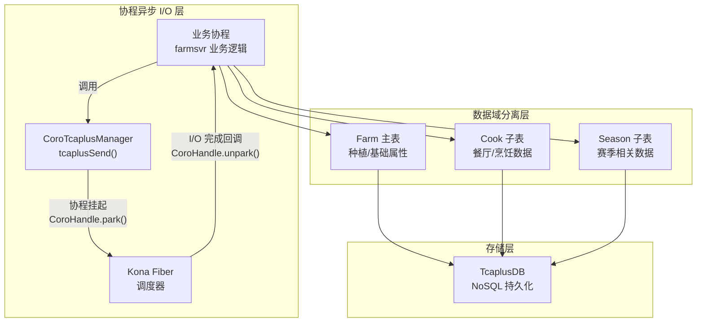
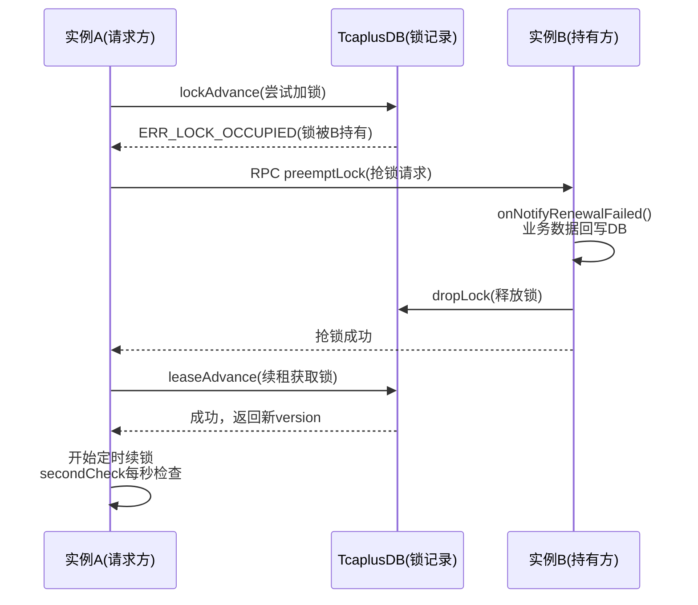
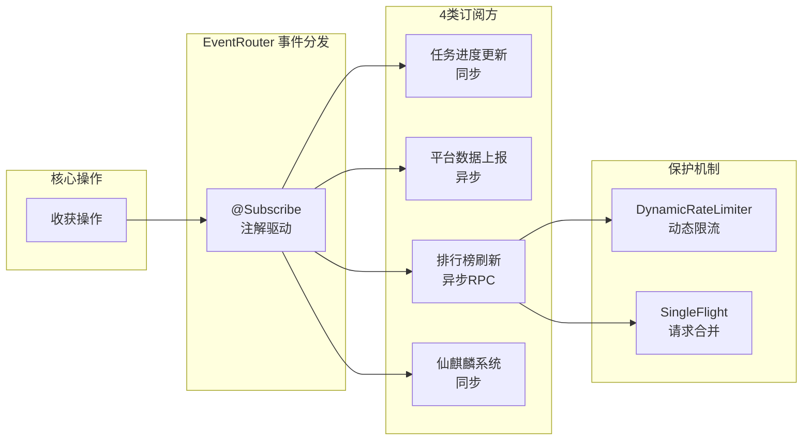
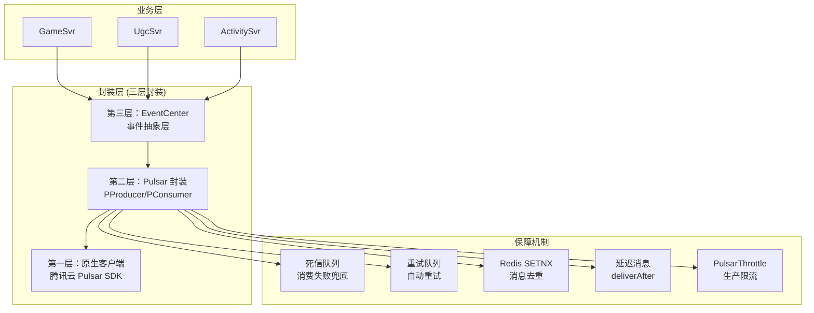

# 项目深度技术报告 — 农场服务篇（farmsvr）

> **项目背景**: farmsvr 作为独立微服务，承载数十万日活的农场种植/养殖/餐厅经营/赛季竞赛等全链路玩法，涉及复杂的赛季生命周期管理和跨服数据交互。

---

## 亮点一：基于协程的异步数据加载架构 + 多级存储设计

### 1.1 一句话描述

> 基于 Kona Fiber 协程实现 TcaplusDB 异步读写，结合数据域分离和版本迁移框架，解决高并发下的 I/O 阻塞和数据膨胀问题。

### 1.2 业务场景与痛点

农场玩家数据（`FarmAttr`）通过 Protobuf 序列化存储到 TcaplusDB。随业务迭代，子模块越来越多（种植 + 赛季 + 餐厅 + 烹饪 + 仙麒麟...），面临两大痛点：

1. **I/O 阻塞**：每次数据加载/落盘都是阻塞 I/O，传统线程模型下会卡住工作线程
2. **数据膨胀**：单条 Protobuf 消息持续增长，序列化/反序列化开销递增

### 1.3 技术架构



### 1.4 核心实现解析

#### 1.4.1 协程异步 I/O — park/unpark 模型

这是整个异步架构的核心。当需要读写 TcaplusDB 时，业务协程不会阻塞 OS 线程，而是通过 park 让出执行权：

```java
// CoroTcaplusManager.tcaplusSend() 核心流程
public TcaplusRsp tcaplusSend(TcaplusReq req) {
    // 1. 获取当前协程句柄
    CoroHandle<TcaplusRsp> handle = CoroHandle.current();
    
    // 2. 发送异步请求到 TcaplusDB
    tcaplusClient.asyncSend(req, response -> {
        // 3. I/O 完成回调：设置结果并唤醒协程
        handle.setResult(response);
        handle.unpark();  // 唤醒挂起的协程
    });
    
    // 4. 挂起当前协程，让出线程给其他协程
    return handle.park(timeout);  // 线程不阻塞！
}
```

**运行机制**：
1. 协程 A 调用 `park()` → 状态变为 `PARKED`，让出 CPU
2. 调度器切换到协程 B/C/D... 继续执行其他任务
3. TcaplusDB 返回数据 → 回调触发 `unpark()` → 协程 A 进入 `READY` 队列
4. 调度器在下一个调度轮次恢复协程 A，继续执行后续代码

**关键优势**：同步的代码写法，异步的执行效果。业务开发者不需要写回调地狱。

#### 1.4.2 N:M 协程调度模型

```
┌───────────────────────────────────────────────────┐
│          业务层 (N 个协程任务)                       │
│  [玩家A加载] [玩家B落盘] [RPC回调] [定时器] ...     │
├───────────────────────────────────────────────────┤
│        调度层 (CoroSchedule + Container)            │
│  readyJobList → 每轮最多 100 个 → coroSchedule      │
├───────────────────────────────────────────────────┤
│             OS线程层 (M=3 个线程)                    │
│        [Thread-1] [Thread-2] [Thread-3]            │
└───────────────────────────────────────────────────┘
```

| 维度 | 线程模型 | 项目协程模型 |
|------|---------|------------|
| 上下文切换 | ~1-10μs（内核态） | ~100ns（用户态） |
| 内存开销 | ~1MB/线程 | ~数KB/协程 |
| 并发上限 | 数千级别 | 数万级别 |
| I/O 等待 | 阻塞线程 | park 让出，不阻塞线程 |

#### 1.4.3 数据域分离 — 拆表 + 懒加载

```java
// 主数据加载 — 登录时必须加载
public void loadFarmData(long uid) {
    FarmAttr attr = CoroTcaplusManager.tcaplusSend(
        TcaplusUtil.newGetReq(FarmAttr.newBuilder().setUid(uid))
    );
    // 主表包含种植、基础属性等核心数据
}

// 餐厅数据 — 按需懒加载（玩家进入餐厅时才加载）
public CookData loadCookData(long uid) {
    if (cookDataCache.containsKey(uid)) {
        return cookDataCache.get(uid);  // 已加载过直接返回
    }
    // 首次访问才从 DB 加载
    CookData data = CookMgr.loadCook(uid);
    cookDataCache.put(uid, data);
    return data;
}
```

**设计决策**：
- **拆表原因**：餐厅模块数据量大但访问频率低（仅部分玩家进入餐厅），与主表分离后主表大小降低约 40%
- **懒加载优势**：减少登录时的 I/O 次数和数据传输量
- **跨表一致性**：主表和子表通过 uid 关联，操作同一玩家时在同一协程线程内串行执行

#### 1.4.4 数据大小监控 + 版本迁移

```java
// 落盘时上报序列化字节大小
public void saveFarmData(long uid, FarmAttr attr) {
    byte[] bytes = attr.toByteArray();
    int dataSize = bytes.length;
    
    // 上报到 Prometheus 监控
    Monitor.getInstance().set.total(MonitorId.attr_farmsvr_data_size, dataSize);
    
    // 超阈值告警
    if (dataSize > 4096) {
        log.warn("Farm data size exceeds threshold: uid={}, size={}", uid, dataSize);
    }
    
    CoroTcaplusManager.tcaplusSend(TcaplusUtil.newSetReq(attr));
}

// 数据版本递进迁移
public void migrateDataIfNeeded(FarmAttr attr) {
    int currentVersion = attr.getDataVersion();
    if (currentVersion < 2) {
        migrateV1ToV2(attr);  // v1 → v2：字段重命名
    }
    if (currentVersion < 3) {
        migrateV2ToV3(attr);  // v2 → v3：新增字段初始化
    }
    // 递进式：每次登录自动检测并升级
}
```

### 1.5 面试深挖问答

| 问题 | 回答要点 |
|------|---------|
| **为什么不用 CompletableFuture？** | CF 的回调链还是在回调线程执行，代码复杂度高；协程的 park/unpark 让异步代码以同步方式编写，业务开发者感知不到异步 |
| **协程 vs Go goroutine？** | 都是 N:M 模型。Go 用 GMP 调度，我们用 Kona Fiber（基于 Loom）。差别：Go 是语言原生支持，我们是 JVM 层面实现，可以复用 Java 生态 |
| **park 超时怎么处理？** | 时间轮管理（O(1) 插入删除）。短超时（<60s）精确到 ms 检测，长超时（≥60s）二级链表每 20s 扫描 |
| **懒加载的缺点？** | 首次访问时有冷加载延迟；需要处理加载失败的降级；代码需要 null 检查 |
| **Protobuf 膨胀原因？** | varint 编码对大数值效率低；repeated 字段增多；嵌套 message 层级深。项目通过拆表 + 按需加载控制 |

### 1.6 简历写法

> 负责农场玩法的异步数据加载架构设计，基于 Kona Fiber 协程框架实现 TcaplusDB 异步读写（park/unpark 模型），将阻塞 I/O 转为协程挂起，单进程支撑数万协程并发。设计数据域隔离方案，主表与子模块（餐厅/赛季）分表存储 + 按需懒加载，降低单条数据大小约 40%。建立 Protobuf 序列化大小实时监控 + 阈值告警机制。设计递进式数据版本迁移框架，保障百万级玩家跨版本数据平滑升级。

---

## 亮点二：分布式缓存锁 + 赛季切换的数据一致性保障

### 2.1 一句话描述

> 通过 CacheLockAgent 分布式缓存锁 + 版本号乐观锁 + 三重安全保护机制，保障农场赛季切换场景下多实例环境的数据一致性和安全性。

### 2.2 业务场景与痛点

农场赛季切换涉及：旧赛季数据回收（货币按万分比转换 + 数据清理）+ 新赛季初始化。多个 farmsvr 实例同时处理不同玩家的赛季切换请求，必须保证：

1. **原子性**：扣减旧货币 + 发放新货币 必须原子完成
2. **安全性**：防止运营误操作导致数据误删
3. **多实例安全**：不同实例可能同时操作同一玩家数据

### 2.3 CacheLockAgent 架构



### 2.4 核心实现解析

#### 2.4.1 锁的生命周期管理

```java
// CacheLockAgent 双过期时间设计
// cacheLock_Cache_ValidTime = 本地缓存有效期（如30s）
// cacheLock_DB_ValidTime = DB锁有效期（如60s）
// 本地缓存到期 → 触发续锁
// DB锁到期 → 真正释放锁

// 续锁机制：每秒 secondCheck
private void secondCheck(CacheLockKey key) {
    LocalLock lock = lockCache.get(key);
    
    // 1. DB锁过期 → 释放
    if (lock.expireTime <= now()) {
        checkReleaseExpireLock(key);
        return;
    }
    
    // 2. 本地缓存到期 → 续锁
    if (lock.cacheExpireTime < now() && enableTimerRenewal) {
        checkAndRenewal(key);  // TcaplusDB 带版本号续锁
    }
}
```

#### 2.4.2 CAP 策略选择

CacheLockAgent 的独特设计 — 业务方可自行选择 CAP 策略：

```java
// 强一致模式（capAvailability = false）
// 场景：赛季货币转换等资金敏感操作
// 行为：抢锁对端不在线 → 操作失败，保证数据一致
if (!capAvailability && errorCode == ERR_PREEMPT_LOCK_TARGET_NOT_ON_LINE) {
    return ERR_PREEMPT_FAILED;  // 拒绝操作
}

// 可用性优先模式（capAvailability = true）  
// 场景：排行榜、社交数据等容忍短暂不一致
// 行为：抢锁对端不在线 → 仍允许拿锁
if (capAvailability && errorCode == ERR_PREEMPT_LOCK_TARGET_NOT_ON_LINE) {
    return ERR_OK;  // 允许拿锁
}
```

#### 2.4.3 版本号冲突修复

```java
// 续锁时版本号冲突的自修复机制
if (dbResult == ERR_LOCK_DB_INVALID_VERSION) {
    // 可能是连续两次续锁导致的版本跳变
    // 重新查询DB确认持有者
    DistributeLockData lockData = dbDriver.getLockData(lockInfo);
    
    if (lockData.getOwnerID() == myServerId 
        && lockData.getExpireTime() > now()) {
        // 仍是自己持有 → 修复本地版本号
        localLock.version = lockData.getVersion();
        return ERR_OK;
    } else {
        // 已被他人持有 → 通知续锁失败
        cache.onNotifyRenewalFailed();
    }
}
```

#### 2.4.4 赛季切换的三重安全保护

```java
// 第一重：配表时间门控
if (currentTime < seasonConfig.getCleanStartTime()) {
    return;  // 未到清理时间，拒绝执行
}

// 第二重：赛季状态检测
if (player.getSeasonState() != SeasonState.SEASON_END) {
    return;  // 赛季未结束，拒绝清理
}

// 第三重：七彩石远程硬开关
if (!RainbowConfig.getBool("farm_season_clean_enable", false)) {
    return;  // 远程开关关闭，拒绝执行
}
// 三重保护全部通过后才执行清理
```

### 2.5 与业界分布式锁方案对比

| 维度 | CacheLockAgent（本项目） | Redis Redisson | ZooKeeper |
|------|----------------------|----------------|-----------|
| 存储后端 | TcaplusDB | Redis | ZK |
| 自动续期 | ✅ secondCheck 每秒 | ✅ WatchDog 30s | ✅ 临时节点 |
| CAP策略可选 | ✅ 业务方选择 | ❌ 固定 | ❌ 固定CP |
| 锁抢占通知 | ✅ RPC通知释放 | ❌ 等待超时 | ✅ 节点删除通知 |
| 版本号防ABA | ✅ TcaplusDB版本号 | ❌ | ✅ ZK版本号 |
| 回调机制 | ✅ onNotifyRenewalFailed | ❌ | ❌ |

### 2.6 面试深挖问答

| 问题 | 回答要点 |
|------|---------|
| **为什么不直接用 Redis Redisson？** | TcaplusDB 是项目主数据库，锁记录和业务数据在同一存储层，减少外部依赖。且 CacheLockAgent 支持 CAP 策略选择和锁抢占回调，这是 Redisson 不具备的 |
| **看门狗续期失败怎么办？** | 续期失败触发 `onNotifyRenewalFailed` 回调，业务层回写脏数据到 DB，然后释放锁。标记 `isRemoving` 状态，定时器重试最多 3 次 |
| **CAS 的 ABA 问题？** | TcaplusDB 版本号单调递增（每次写入+1），不会出现 ABA。即使续锁版本冲突，也会重新查询 DB 确认，而不是盲目 CAS |
| **三重保护的必要性？** | 线上经验教训：运营曾误配时间导致赛季提前清理。三重互相独立的保护确保任何单点失误都不会导致数据误删 |

### 2.7 简历写法

> 设计农场赛季切换系统的分布式一致性方案。基于 CacheLockAgent 实现分布式缓存锁（锁续期 + 自动过期 + 回调通知），配合版本号乐观锁保障多实例环境下的数据安全。支持 CAP 策略可选（强一致 vs 可用性优先）。赛季货币转换采用事务性操作保证原子性。引入"时间门控 + 状态校验 + 远程开关"三重保护机制，上线以来零数据误删事故。

---

## 亮点三：跨服事件驱动架构 + 动态限流 + 缓存防击穿

### 3.1 一句话描述

> 通过事件驱动架构实现核心操作与下游系统松耦合，配合动态限流和 SingleFlight 请求合并机制，保障高并发下的系统稳定性。

### 3.2 技术架构



### 3.3 核心实现

#### 3.3.1 事件驱动解耦

```java
// EventRouter 发布事件
public void onHarvest(long uid, int cropId, int amount) {
    // 核心操作完成后，发布收获事件
    HarvestEvent event = new HarvestEvent(uid, cropId, amount);
    EventRouter.post(event);  // 自动分发给所有 @Subscribe 注解方法
}

// 订阅方（松耦合，不感知发布者）
@Subscribe
public void onHarvestForTask(HarvestEvent event) {
    // 同步更新任务进度
    taskManager.updateProgress(event.getUid(), TaskType.HARVEST, event.getAmount());
}

@Subscribe(async = true)
public void onHarvestForRank(HarvestEvent event) {
    // 异步RPC通知排行榜
    IrpcClientFiberAsync.send(ranksvr, updateRankReq);
}
```

#### 3.3.2 动态限流

```java
// DynamicRateLimiterMgr — 基于配表热更新
public class DynamicRateLimiterMgr {
    // CAS 无锁计数
    private AtomicLong counter = new AtomicLong(0);
    private AtomicInteger windowSize = new AtomicInteger(100);
    
    // ConcurrentLinkedQueue 管理滑动窗口
    private ConcurrentLinkedQueue<Long> windowQueue = new ConcurrentLinkedQueue<>();
    
    public boolean tryAcquire(String msgType) {
        // 从配表读取当前限流规则（支持热更新）
        RateLimitConfig config = HotResLoader.getConfig(msgType);
        long current = counter.incrementAndGet();
        
        // 滑动窗口检查
        windowQueue.offer(System.currentTimeMillis());
        while (windowQueue.size() > config.getWindowSize()) {
            windowQueue.poll();
        }
        
        return current <= config.getLimit();
    }
}
```

#### 3.3.3 SingleFlight 防缓存击穿

```java
// 核心思想：相同 key 的并发请求合并为一次 DB 查询
SingleData<V> existing = waitMap.putIfAbsent(key, newFlight);
if (existing == null) {
    // 第一个请求：执行实际查询
    V result = supplier.get();
    newFlight.complete(result);  // 唤醒所有等待者
    waitMap.remove(key);
    return result;
} else {
    // 后续请求：协程 park 等待第一个请求的结果
    return existing.await(timeout);  // 共享同一结果
}
```

**关键设计**：Key 带线程 ID（`key + "_" + threadId`），实现线程级隔离 — 不同线程各自合并，避免跨线程同步复杂性。

### 3.4 面试深挖问答

| 问题 | 回答要点 |
|------|---------|
| **事件驱动 vs MQ 解耦？** | 进程内用 EventBus（低延迟、无序列化开销），跨进程用 Pulsar MQ（可靠投递、消息持久化） |
| **缓存穿透/击穿/雪崩区别？** | 穿透=不存在的数据绕过缓存（防：布隆过滤器+空值缓存），击穿=热点key过期后并发打DB（防：SingleFlight+互斥锁），雪崩=大量key同时过期（防：TTL随机化+熔断） |
| **滑动窗口 vs 令牌桶？** | 项目都用了。滑动窗口用于消息频率控制（精确计数），令牌桶用于 RPC 限流（允许突发） |

---

## 亮点四：Pulsar 消息队列中间件封装

### 4.1 一句话描述

> 基于腾讯云 Pulsar 封装统一消息中间件，支持多种订阅模式、自动死信队列与重试、基于 Redis SETNX 的唯一消息去重，覆盖 UGC 数据同步等多业务场景。

### 4.2 技术架构



### 4.3 三种订阅模式

```java
public enum PTopic {
    // Shared 模式：延迟消息必须用此模式，消息无序但负载均衡
    TLOGSYN(PSchema.String, SubscriptionType.Shared, true, true),
    
    // Key_Shared 模式：同 Key 有序，不同 Key 并发
    SyncEvent_UgcServer(PSchema.Bytes, SubscriptionType.Key_Shared),
    
    // Failover 模式：故障转移，正常只有主消费者消费
    FansChange(PSchema.Bytes),  // 默认
}
```

| 模式 | 有序性 | 并发性 | 适用场景 |
|------|--------|--------|---------|
| **Shared** | ❌ 无序 | ✅ 高并发 | 延迟消息、无序通知 |
| **Key_Shared** | ✅ 同Key有序 | ✅ 不同Key并发 | UGC 数据同步（同一地图有序） |
| **Failover** | ✅ 全局有序 | ❌ 单消费者 | 粉丝变更、关键事件 |

### 4.4 消息去重与幂等

```java
// 基于 Redis SETNX + EXPIRE 的唯一消息去重
public boolean productUniqueForBytes(PTopic topic, String uniqueKey, 
                                      byte[] msg, int expireSeconds) {
    // 先检查是否已发送过
    String redisKey = "pulsar_dedup_" + topic.name() + "_" + uniqueKey;
    boolean isNew = Cache.setnxex(redisKey, "1", expireSeconds);
    
    if (!isNew) {
        return false;  // 已发送过，跳过（幂等）
    }
    
    // 首次发送
    return productForBytes(topic, msg);
}
```

### 4.5 面试深挖问答

| 问题 | 回答要点 |
|------|---------|
| **Pulsar vs Kafka？** | Pulsar 原生支持 Key_Shared（同Key有序+并发）、延迟消息（deliverAfter）、死信队列；Kafka 适合高吞吐批处理，项目用 CKafka 做数据采集旁路 |
| **SETNX 去重的缺陷？** | Redis key 有过期时间，过期后可能重复消费。关键业务同时写 TcaplusDB 做永久去重 |
| **消费失败怎么办？** | handle() 返回 false → 进入重试队列 → 超过重试次数 → 进入死信队列 → 人工介入 |