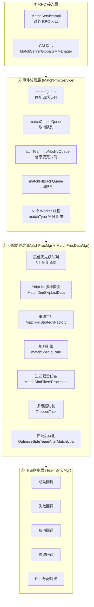

# 项目深度技术报告 · 分布式撮合引擎篇（matchsvr）

> 本篇聚焦 `WeA/projects/matchsvr` —— 一个**承载全游戏所有匹配流量**的分布式撮合引擎。从数据结构、并发模型、设计模式、算法、工程取舍五个维度，基于真实代码深度拆解，并抽象出**可迁移到外卖派单 / 打车派单 / 广告竞价 / 推荐召回 / 任务调度**等任何"撮合类"系统的通用经验。

---

## 0. 为什么值得把撮合引擎作为单项目拎出来讲

一句话：**撮合引擎是互联网后端最通用、最能体现系统能力的"带算法的微服务"**。

所有需要做"**N 个请求方 + M 个资源方 + 一堆约束 + 实时性要求**"的系统，本质都是撮合：

| 业务 | 请求方 | 资源方 | 约束维度 |
|---|---|---|---|
| 游戏匹配 | 玩家/队伍 | 对手/战局 | MMR/阵营/延迟/段位 |
| 外卖派单 | 订单 | 骑手 | 距离/负载/订单类型 |
| 打车派单 | 乘客 | 司机 | 距离/车型/航向/评分 |
| 广告 DSP | 流量 | 广告主 | 出价/人群/频控 |
| Feed 推荐 | 用户 | 内容 | 兴趣/新鲜度/多样性 |
| K8s 调度 | Pod | Node | CPU/Mem/亲和性/污点 |

`matchsvr` 这套架构里的**跳表索引 / 分片并发 / 责任链过滤器 / 策略模式 / 多级超时 / 滑动窗口统计 / 负载反馈**，几乎可以一比一套到上述任何一个业务。这就是它作为"单项目深度讲解"的价值。

---

## 1. 架构总览

### 1.1 进程内四层架构



**设计哲学**：
1. **接入与处理解耦**：RPC 线程只做校验和入队，不在 RPC 线程跑算法。避免慢匹配拖死整个 RPC 线程池。
2. **按 matchType 分片**：每个匹配类型固定分到一个 Worker 线程，**同一 matchType 天然串行无锁**——这是下面所有数据结构都可以用非线程安全 HashMap 的底层前提。
3. **Tick 驱动**：每个 Worker 以 10ms 为步长 `sleep(10)`，每个 tick 消费四种队列 + 执行一次 `matchProcess()`。匹配不是"请求驱动"而是"节拍驱动"。

### 1.2 启动骨架（MSEngine.java）

`MSEngine` 继承 `ServerEngine` 基类，提供标准生命周期：

- `init()`：按依赖顺序初始化 `MatchService` → `TeamSyncService` → `MatchProcService`，然后 `MsMetaAIRpcManager` / `TeamSizeMatchingRuleDataMgr`
- `reload()`：支持配置热更新，逐个子模块独立 reload，**单模块失败不影响其他模块**（`ret |= -1` 累积错误码而非 return）
- `stop()`：反向优雅关闭
- `podOffLineNotify()` + `podOffLineCheck()`：**K8s 优雅下线双阶段**——收到预下线通知先 `notifyPreOffline`（停止接新匹配），`checkCanOffline` 返回"还剩多少队伍在匹配中"，为 0 才允许 Pod 退出

这是一个教科书级的**无损滚动升级**骨架。大多数自研服务上云的第一个坑就是"Pod 被杀时匹配中的玩家丢请求"，这里的双阶段钩子直接解决。

---

## 2. 并发模型：分片无锁 + 节拍驱动 Worker

### 2.1 核心代码位置

- [MatchProcService.java](/UGit/letsgo_server/WeA/projects/matchsvr/src/main/java/com/tencent/wea/matchservice/matchdata/matchProcService/MatchProcService.java)
- [MatchProcMgr.java](/UGit/letsgo_server/WeA/projects/matchsvr/src/main/java/com/tencent/wea/matchservice/matchdata/matchProcService/MatchProcMgr.java)

### 2.2 分片路由 —— 为什么是 `matchType % threads`

```java
// MatchProcService.java
public void offer(MatchTeamInfo teamInfo) {
    int matchType = teamInfo.getMatchType();
    int id = matchType % threads;                          // ← 哈希分片
    ConcurrentLinkedQueue<MatchTeamInfo> queue = matchQueue.get(id);
    boolean result = queue.offer(teamInfo);
    ...
}
```

**核心思想**：把"全局匹配池"**按业务维度切片**，让相同 matchType 的所有队伍永远落到**同一 Worker 线程**。

收益矩阵：

| 关注点 | 收益 |
|---|---|
| 线程安全 | 该 matchType 下所有数据结构**单写者**，用普通 HashMap / PriorityQueue 即可，无锁 |
| CPU 缓存 | 同匹配池的热数据稳定驻留一个核心的 L1/L2，缓存命中率高 |
| 故障隔离 | 某个 matchType 算法劣化，只卡住一个线程，其他匹配不受影响 |
| 可扩缩 | 新增匹配类型无需改代码，配置 `match_proc_threads_number` 扩线程数即可 |

**陷阱与取舍**：
- ❌ 单线程热点：某个 matchType 流量特别大时会打爆一个线程。本工程通过**策略拆分**（把大类型拆成多个 subType）规避
- ❌ 跨线程同 matchType 做全局统计会错乱——所以 `matchPoolInfo` 用 `ConcurrentHashMap` 做**聚合出口**

**通用迁移**：打车派单把"城市 ID % N"做分片、外卖把"POI 网格 ID % N"做分片，是完全一样的套路。Kafka 分区、Redis Cluster slot 路由本质也是同一个思想。

### 2.3 四队列 + 单轮配额的节拍 Worker

每个 Worker 线程一个 `do-while` 大循环，每轮做 5 件事：

```java
// MatchProcService.java 核心循环
while ((teamInfo = poll(num)) != null) { worker.process(teamInfo); }                 // ① 匹配入队
while ((cancelTeamInfo = pollCancelMatch(num)) != null) { worker.processCancelMatch(cancelTeamInfo); } // ② 取消
int MAX_PROCESS_MODIFY_TEAM_INFO_CNT_PER_ROUND = 30;
while (null != (matchModifyTeamInfo = pollModifyMatchTeamInfo(num))
        && processedModifyTeamInfoCnt < MAX_PROCESS_MODIFY_TEAM_INFO_CNT_PER_ROUND) { ... }            // ③ 修改
while ((matchFillBackInfo = pollMatchFillBack(num)) != null) { ... }                                   // ④ 回填
worker.matchProcess();                                                                                 // ⑤ 匹配 tick
Thread.sleep(10);
```

**工程亮点**：
1. **修改队列有单轮上限 30**：`MAX_PROCESS_MODIFY_TEAM_INFO_CNT_PER_ROUND = 30`。因为修改操作可能很重，限制单轮最多处理 30 条，**避免修改事件洪峰饿死匹配 tick**
2. **取消队列有整体背压**：`cancelQueueMaxCnt = 5000`，写满拒收并上报 `Monitor.attr_matchsvr_add_cancel_queue`。防止客户端疯狂重试撑爆内存
3. **sleep 10ms 节拍**：不是 `busy-wait`，也不是 `wait/notify`。10ms = 100 fps，比人类反应时间快两个数量级，对匹配业务够用；同时避免 CPU 空转

**通用经验**：**"有限单轮配额 + 多队列并列消费"** 是处理"多类型事件、优先级不同、避免饥饿"的金科玉律。Netty 的 `ioRatio`、Go runtime 的 `findrunnable` 都是同思路。

### 2.4 优先级队列的公平消费 —— 5:1 配比算法

`MatchProcMgr.getCurMatchCount()` 是全篇最**朴素但最工程化**的一段代码：

```java
// MatchProcMgr.java
private int[] getCurMatchCount() {
    int highTotalCnt = highPriorityQueue.size();
    int lowTotalCnt  = lowPriorityQueue.size();
    int calcHighCnt  = perLoopTotalProcessCnt * highLowRatio / (highLowRatio + 1); // 500*5/6 ≈ 416
    int calcLowCnt   = perLoopTotalProcessCnt - calcHighCnt;                       // ≈ 84
    int highResumeCnt = highTotalCnt - calcHighCnt;
    int lowResumeCnt  = lowTotalCnt  - calcLowCnt;

    int highProcCnt;
    if (highResumeCnt > 0) {                                           // 高优队列够
        highProcCnt = (lowResumeCnt > 0) ? calcHighCnt : (calcHighCnt - lowResumeCnt); // 低优不够 → 高优借额度
    } else { highProcCnt = highTotalCnt; }                             // 高优不够 → 全拿出来

    int lowProcCnt;
    if (lowResumeCnt > 0) {
        lowProcCnt = (highResumeCnt > 0) ? calcLowCnt : (calcLowCnt - highResumeCnt);  // 高优不够 → 低优借额度
    } else { lowProcCnt = lowTotalCnt; }
    return new int[]{highProcCnt, lowProcCnt};
}
```

**这套算法解决了三个问题**：

| 场景 | 朴素策略的问题 | 本算法的处理 |
|---|---|---|
| 高优量大、低优量大 | 严格 5:1，低优永远**饥饿** | 5:1 按比例切 |
| 高优量小、低优量大 | 高优优先跑完再跑低优，低优**堆积** | **高优跑完后，把剩余额度让给低优** |
| 高优量大、低优量小 | 低优一旦处理完就浪费 CPU | **低优处理完后，额度还给高优** |

这就是**"带优先级的公平消费" with work-stealing**。核心是 `highProcCnt = calcHighCnt - lowResumeCnt`（当 lowResumeCnt < 0，即低优不足时，`- 负数 = +正数`，高优借走空出的额度）。

**通用迁移**：Java `ThreadPoolExecutor` 想做优先级但又怕饥饿？照这套改就对了。Nginx / Envoy 的 weighted round-robin 本质也是这个算法。

### 2.5 取消与匹配的竞态 —— cancelFailMap 乒乓法

经典问题：**用户发起匹配 → 立刻取消**，两个事件可能被分到同一 Worker 的不同队列，但到达顺序不可控。

```java
// MatchProcMgr.cancelMatch  —— 取消先到，但队伍还没入池
public void cancelMatch(MatchCancelTeamInfo cancelTeamInfo) {
    if (dataMgr.cancelMatch(cancelTeamInfo)) {
        cancelSuccProc(cancelTeamInfo);          // 正常路径：队伍在池里 → 直接删
    } else {
        offerCancelFirstTimeFailureMap(cancelTeamInfo); // ← 队伍不在池：挂起到"待消"表
    }
}

// MatchProcMgr.consumeTeamQueue —— 队伍入池时反查
if (cancelFailMap.containsKey(teamInfo.getRoomID())) {
    MatchCancelTeamInfo cTeamInfo = cancelFailMap.get(teamInfo.getRoomID());
    cancelFailMap.remove(cTeamInfo.getUuID());
    if (cTeamInfo.getMatchCancelTime() > teamInfo.getMatchTime()) {
        TeamSyncMgr.getInstance().offerCancelSucc(cTeamInfo);   // 取消时间>匹配时间 → 取消生效
        continue;
    } else {
        TeamSyncMgr.getInstance().offerCancelFail(cTeamInfo);   // 否则取消失败
    }
}

// MatchProcMgr.timeoutProcCancelTeam —— 兜底：2 秒没等到就超时清理
if (teamInfo.getMatchCancelTime() + getLocalCancelMatchMaxTimeOut() < now) {
    this.timeOutSkipList.pollFirst();
    cancelFailMap.remove(teamInfo.getUuID());
    TeamSyncMgr.getInstance().offerCancelFail(teamInfo);
}
```

**三件套**：
1. **待消挂起表** `cancelFailMap`：取消找不到队伍时不立即失败，先挂起
2. **队伍入池反查**：队伍入池时反查是否有待消，有就按**时间戳判定**（取消时间 > 匹配时间即取消成功）
3. **超时轮兜底** `ConcurrentSkipListSet<MatchCancelTeamInfo> timeOutSkipList`：按超时时间排序，最多挂 2 秒，超时了强制清理

**通用经验**：**网络异步场景中"操作 A 可能先于操作 B 到达"** 是常态。与其假设顺序，不如让后到的操作**反查**先到的操作——这就是 CRDT / 事件溯源 / 分布式事务 TCC 的核心思想。

---

## 3. 核心数据结构：跳表做多维索引

### 3.1 为什么是 SkipList

[MatchDimSkipListData.java](/UGit/letsgo_server/WeA/projects/matchsvr/src/main/java/com/tencent/wea/matchservice/matchdata/matchProcService/matchProcDataMgr/MatchDimSkipListData.java)

```java
protected ConcurrentSkipListMap<Long, Map<Long, MatchTeamInfo>> dimIndexData = new ConcurrentSkipListMap<>();
//                               ↑ 维度值       ↑ room_id       ↑ 队伍详情
```

**匹配的核心查询**：给定基准队伍 MMR=1500、可接受 Δ=±100，找出所有 MMR ∈ [1400, 1600] 的候选队伍。

这是典型的**一维范围查询**。对比选型：

| 数据结构 | 范围查询 | 动态增删 | 有序遍历 | 并发 | 实现复杂度 |
|---|---|---|---|---|---|
| HashMap | ❌ O(N) 全扫 | ✅ O(1) | ❌ | ConcurrentHashMap | 低 |
| 红黑树 (TreeMap) | ✅ O(log N) | ✅ O(log N) | ✅ | 只能加锁 | 中 |
| 最小堆 (PriorityQueue) | ❌ 只能取 top | ✅ O(log N) | ❌ | 需锁 | 低 |
| **跳表 ConcurrentSkipListMap** | ✅ O(log N) subMap | ✅ O(log N) | ✅ | **无锁并发** | 中 |
| B+Tree | ✅ | ✅ | ✅ | 一般在磁盘上 | 高 |

**选跳表的三个理由**：
1. 范围查询用 `subMap(from, to)` 天然 `O(log N)`，且返回的是 lazy view，遍历时才真正走链表
2. `ConcurrentSkipListMap` 是 JUC 里**唯一的无锁并发有序 Map**（TreeMap 只能靠 `Collections.synchronizedSortedMap` 加粗锁）
3. **按层概率性构建**，实现和调试都比红黑树简单

### 3.2 双重剪枝 —— 工程细节决定成败

```java
// MatchDimSkipListData.range
int cnt = 0;         // 已命中数
int loopedCnt = 0;   // 已遍历数
for (... ) {
    for (...) {
        if (filterController != null && !filterController.doFilter(...)) {
            isAdd = false;  // 过滤器拒绝
        }
        if (isAdd) { resultSet.add(...); ++cnt; filterController.ntfMatchTeamAddToPreResult(...); }
        ++loopedCnt;
        if (cnt       >= cntParam.getMaxCnt())        return resultSet;  // ← 命中够了
        if (loopedCnt >= cntParam.getMaxLoopedCnt())  return resultSet;  // ← 遍历够了
    }
}
```

**没有第二个剪枝会怎样**：假设匹配池 10 万人但过滤器（黑名单 + 同 IP + 延迟高）过滤率 99%，要找 10 个候选人就要扫 1000 个。如果只限制 `maxCnt`，过滤器全拒时会变成 O(N) 全扫**一次匹配 tick 卡 100ms**。

**双重剪枝的本质**：把"**结果维度**"和"**工作量维度**"**同时限制住**，防止算法从 O(log N) 退化成 O(N)。这是所有"带过滤的索引查询"都必须做的事。ES、MySQL 的 `SCAN_LIMIT`、Redis 的 `COUNT` 都是同思路。

### 3.3 index value 为什么用 `Map<Long, MatchTeamInfo>` 而不是 `Set<MatchTeamInfo>`

```java
protected ConcurrentSkipListMap<Long, Map<Long, MatchTeamInfo>> dimIndexData = new ConcurrentSkipListMap<>();
//                                    ↑ Map 而非 Set，key 是 room_id
```

因为 `del(dimValue, teamInfo)` 时：
- 如果是 Set：只能 `set.remove(teamInfo)`，依赖 `equals/hashCode`，**一旦 teamInfo 的 mmr 中途被改过，equals 就不对了**，删不掉
- 是 Map（room_id → team）：`map.remove(teamInfo.getRoomID())` 用**不可变 id** 做 key，天然稳定

这是一个小细节，但反映了工程思维：**索引的 key 一定要是不可变量**。

---

## 4. 多级超时 + 扩圈匹配

### 4.1 超时任务的三种状态

[MatchProcMgr.timeoutProc](/UGit/letsgo_server/WeA/projects/matchsvr/src/main/java/com/tencent/wea/matchservice/matchdata/matchProcService/MatchProcMgr.java)

```java
int ret = task.runTask(teamInfo, this);
if (-2 == ret) {                                 // 未完全超时也未成功
    long nextExpire = MatchProcUtils.getNextTimeout(teamInfo, task);
    if (nextExpire > 0) {                        // 还能再等一轮
        task.setExpireTime(nextExpire);
        dataMgr.addTimeTask(task);
    } else {                                     // 最后一轮也过了
        dataMgr.maxTimeoutHandler(teamInfo);
    }
}
else if (-1 == ret) { dataMgr.maxTimeoutHandler(teamInfo); } // 最大超时：兜底匹配（AI 对手 / 扩圈 / 直接失败）
else { /* 成功已处理 */ }
```

**分层超时**的业务含义：

| 超时等级 | 行为 | 业务意义 |
|---|---|---|
| T1（5s） | 将匹配半径 Δ 从 ±50 扩到 ±100 | 正常用户体验区间 |
| T2（15s） | 扩到 ±200，放宽 IDC | 开始容忍跨 IDC 打 |
| T3（30s） | 去掉段位限制，降低同阵营数 | 优先成局 |
| Tmax（60s） | 填 AI 机器人 / 直接失败 | 兜底 |

这是**"先紧后松"**的匹配策略：初期追求**质量**（强约束），随时间单调**降低约束**，最终保证**成局**。

**通用经验**：外卖派单的"先派给近骑手、慢慢扩大半径、最后给预约骑手"，广告竞价的"先精准人群、然后类似人群、最后兜底广告"——**任何"既要质量又要兜底"的业务都应该分级超时**。

### 4.2 超时存储 —— 用优先队列做 Timer

`MatchProcDataMgr.peekTimeTask() / pollTimeTask() / addTimeTask()` 背后是一个按 `expireTime` 排序的 `PriorityQueue`。每个 tick 从堆顶 peek 一下，如果到期就 poll 执行，没到期就退出——**O(log N) 插入、O(1) 到期判断**。

对比 `ScheduledExecutorService`：
- 优点：在同一 Worker 线程执行，无跨线程同步，天然有序
- 缺点：不能取消（但本工程里取消靠 cancelFailMap 另一套机制，所以不是问题）

**这就是 Netty 的 HashedWheelTimer 的"简配版"**。业务 tick 量不大时完全够用。

---

## 5. 策略模式 · MatchFillStrategy 家族

### 5.1 7 种匹配填充策略

`matchFillStrategy/` 下 12 个文件，实现了 `IMatchFillStrategy` 接口：

| 策略 | 场景 |
|---|---|
| `DefaultMatchFillStrategy` | 兜底 |
| `DesignateSideMatchFillStrategy` | 指定阵营（蓝方/红方） |
| `TeamSizeMatchingMatchFillStrategy` | 按队伍尺寸（1v1/2v2/5v5） |
| `WereWoldSideIdentityMatchFillStrategy` | 狼人杀（身份牌 + 阵营） |
| `LobbyMatchMatchFillStrategy` | 大厅匹配（轻量） |
| `PreSelectSideMatchFillStrategy` | 预选边（进场前挑阵营） |
| `ChestSideIdentityMatchFillStrategy` + Normal | 宝箱模式两种变体 |

### 5.2 工厂设计的 4 个工程亮点

[MatchFillStrategyFactory.java](/UGit/letsgo_server/WeA/projects/matchsvr/src/main/java/com/tencent/wea/matchservice/matchdata/matchProcService/matchProcCommon/matchFillStrategy/MatchFillStrategyFactory.java)

1. **两级判定**：先判定是否走 `DesignateSideMatchFillStrategy` 这个"横切关注"，再 switch 业务规则。避免把所有分支塞在一个 switch 里

2. **兜底 default 防滚服**：
   ```java
   default:
       // 假设新增一个特殊规则, 滚服过程中, 老服读表, 也会解析成这个default(不认识的枚举)
       return new DefaultMatchFillStrategy();
   ```
   **老版本读新配置**是分布式系统的经典灾难。这里用 default 兜底，老服遇到不认识的枚举不会抛异常，而是退化为默认策略。**这是线上生存能力的体现**

3. **运行时开关控制策略切换**：
   ```java
   boolean isForceDisablePreSelectMatchFillStrategy = PropertyFileReader.getRealTimeBooleanItem(
           "is_force_disable_pre_select_match_fill_strategy", false);
   ```
   新策略上线出问题时，**不需要发版**，改七彩石配置瞬间降级回老策略。这是**特性开关（Feature Flag）的典型用法**

4. **context 为空时的降级**：`if (null == context.rule) { return false; }`，优雅降级而不是 NPE

### 5.3 通用模板：策略模式的"正确打开方式"

很多人写策略模式写成 `if (type == A) new AStrategy(); else if ...`，这和 switch 没区别。真正的策略模式应该具备：

| 能力 | 本项目的实现 |
|---|---|
| **开闭原则** | 新增策略实现接口即可，工厂 switch 增加一个 case |
| **降级兜底** | default 返回 DefaultStrategy |
| **上下文解耦** | 用 `MatchFillStrategyContext` 传参，而非长参列表 |
| **运行时切换** | 七彩石开关强制禁用某策略 |
| **灰度放量** | 可以按 uid 哈希路由到不同策略 |

---

## 6. 规则引擎 · 特殊规则家族

### 6.1 规则类型全景

`matchSpecialRule/` 下按业务维度分目录，每个目录是一套规则实现：

- `TeamSize/` —— 队伍尺寸组合匹配（30K+ 字节的 `FindTeamExcelCfgCombination.java`）
- `chestsideidentity/` —— 宝箱模式阵营身份（26K 的 `ChestSideIdentityRule.java`）
- `chestsideidentitynormal/` —— 宝箱简化版
- `lobbymatch/` —— 大厅匹配
- `randomside/` —— 随机阵营预选（24K 的 `PreSelectSideMatchRule.java`）
- `werewolfsideidentity/` —— 狼人杀
- `Filter/` —— 特殊规则过滤器子链

**设计特点**：每种规则都是一个**自洽的业务子系统**，有自己的 Rule 类、Context 类、DataMgr 类。规则之间通过 `SpecialRuleType` 枚举在工厂层路由。

### 6.2 队伍组合搜索 —— 回溯 + 剪枝

[FindTeamExcelCfgCombination.java](/UGit/letsgo_server/WeA/projects/matchsvr/src/main/java/com/tencent/wea/matchservice/matchdata/matchProcService/matchSpecialRule/TeamSize/FindTeamExcelCfgCombination.java) 是一个典型的"**匹配业务中的算法题**"：

给定一个目标阵容（比如 5v5 需要：1 坦克 + 2 输出 + 2 辅助），从候选队伍池里挑出若干支小队组合出完整阵容。

这是**带约束的子集和问题**，本质是 NP 问题，工程实现是：**回溯 + 可行性剪枝 + 组合哈希缓存**。文件 30K 字节的规模说明了实际业务的复杂度——这不是一道算法题，而是一套业务规则 + 性能优化 + 兜底降级的完整工程。

**通用迁移**：外卖"一次派 3 单凑顺路"、打车"顺风车拼车"、物流"车辆装载问题"都是同一套思路。

---

## 7. 责任链过滤器 · 反射注册的开闭原则

### 7.1 反射扫包 + 自动注册

[MatchDimFiltersProcessor.java](/UGit/letsgo_server/WeA/projects/matchsvr/src/main/java/com/tencent/wea/matchservice/matchdata/matchProcService/matchprocfilter/MatchDimFiltersProcessor.java)

```java
static {
    loadFilters();  // 静态块加载
}

private static void loadFilters() {
    ReflectionFactory<MatchDimFilter> filterClassFactory = new ReflectionFactory<>(
            "com.tencent.wea.matchservice.matchdata.matchProcService.matchprocfilter.filterimpl",
            MatchDimFilter.class);
    for (Class<? extends MatchDimFilter> subClass : filterClassFactory.getAllClasses()) {
        if (subClass.isInterface() || Modifier.isAbstract(subClass.getModifiers())) continue;
        Constructor<? extends MatchDimFilter> filterCtor = subClass.getConstructor();
        registerFilter(filterCtor.newInstance());
    }
    filterList.sort(Comparator.comparingInt(MatchDimFilter::getExecuteOrder));  // ← 按优先级排序
}
```

**效果**：`filterimpl` 包下现有 10 个过滤器（`AiDifficultyTestGrpFilter` / `DimeValTypeFilter` / `DsIdcFilter` / `EnsureSinglePlayerTeamGenderMixFilter` / `MatchRegionalPoolFilter` / `MetaAiDyeFilter` / `MetaAiDyeFilterV2` / `PlatMergeGrayBoxTestFilter` / `SpecVirtualCfgRoomInfoIdFilter` / `WarmRoundFilter`）。

**新增第 11 个过滤器**：只需要

1. 在 `filterimpl` 包下新建一个类，实现 `MatchDimFilter`
2. 实现 `isPass(ctx, base, candidate)`、`getExecuteOrder()`、`isEnable()`

**不需要改**：工厂代码、责任链代码、配置文件。**完全符合开闭原则**。

### 7.2 三阶段钩子设计

```java
public interface MatchDimFilter {
    boolean isEnable();                                                            // 运行时开关
    int getExecuteOrder();                                                         // 优先级
    void initCtx(MatchProcFilterContext ctx, MatchTeamInfo base);                  // ① 基准队伍准备阶段
    boolean isPass(MatchProcFilterContext ctx, MatchTeamInfo base, MatchTeamInfo candidate); // ② 过滤
    void onCandidateTeamAddToPreResult(MatchProcFilterContext ctx, MatchTeamInfo base, MatchTeamInfo candidate); // ③ 命中回调
}
```

**为什么要三阶段**：
- `initCtx`：一次匹配 tick 只跑一次，做**共享预计算**（比如构造 bloomfilter、查黑名单缓存）
- `isPass`：每个候选队伍跑一次，要**快**（≤ O(log N)）
- `onCandidateTeamAddToPreResult`：命中后**累加上下文**（比如已选阵营计数 +1，供后续过滤器读取）

这就是**滑动上下文**—— 过滤器之间可以通过 ctx 通信。这是比"纯无状态责任链"更进阶的设计。

### 7.3 过滤器的容错

```java
try {
    boolean isPassCurFilter = filter.isPass(ctx, baseTeamInfo, candidateTeamInfo);
    if (!isPassCurFilter) return false;
} catch (Exception e) {
    // 算不过滤
    LOGGER.error("team {} doFilter catch", candidateTeamInfo.getRoomID(), e);
    // ← 注意：异常后没 return false，继续走下一个过滤器
}
```

**关键细节**：过滤器抛异常时，**不是"拒绝"也不是"通过"**，而是**跳过该过滤器**。这样**一个坏过滤器不会把整个匹配链条废掉**——单点失败隔离。

---

## 8. 滑动窗口聚合器 · 环形桶实现

### 8.1 代码一览

[SlidingWindowAggregator.java](/UGit/letsgo_server/WeA/projects/matchsvr/src/main/java/com/tencent/wea/matchservice/matchstatistics/matchtime/SlidingWindowAggregator.java)

```java
private static class UuidIdWindow {
    private final double[] sums;        // 每桶总耗时
    private final int[]    counts;      // 每桶样本数
    private final long[]   bucketStartMillis; // 每桶起始时间
    void add(long valueMillis, long timestampMillis) {
        int  idx         = indexFor(timestampMillis);       // 环形索引
        long bucketStart = bucketStartFor(timestampMillis); // 整点
        if (bucketStartMillis[idx] != bucketStart) {        // ← 自过期
            sums[idx] = 0.0; counts[idx] = 0;
            bucketStartMillis[idx] = bucketStart;
        }
        sums[idx] += valueMillis; counts[idx]++;
    }
}
```

### 8.2 为什么环形桶自过期 + 懒回收

**朴素实现**：后台线程定期清理过期桶。问题：
- 额外线程
- 清理和写入要加锁
- 清理滞后时读取旧数据

**环形桶**：固定 `bucketCount = 30` 个桶，用 `timestamp % bucketCount` 当索引。写入时**只要发现当前桶的 `bucketStart` 与预期不符，就是过期的旧桶**，直接覆盖清零。

收益：
- ✅ 无后台线程
- ✅ 无锁（单写者 or volatile 即可）
- ✅ 内存固定（30 个 double + 30 个 int + 30 个 long ≈ 1KB/uuid）
- ✅ 自愈 —— 时钟回拨 / 时间跳变也不会崩

这就是 **Sentinel / Hystrix / Guava RateLimiter** 统计窗口的简化版。你可以直接把这段 100 行代码抄出来用在任何需要"最近 N 分钟平均值"的业务。

### 8.3 minSamplesForValid —— 统计可信度门槛

```java
if (totalCount < minSamplesForValid) return Optional.empty();
```

"最近 30 分钟只有 3 个样本"和"最近 30 分钟有 10000 个样本"的均值**置信度完全不同**。后者可信，前者在统计学上属于"样本不足"。返回 `Optional.empty()` 让调用方自己决定降级策略。

**通用经验**：任何统计量都要有**样本数下限**，否则小流量场景会做出错误决策（比如"用户 X 最近请求只有 2 次都失败了，就永久拉黑"）。

---

## 9. 负载感知调度 · DSC 负载反馈

### 9.1 DSCLoadDataMgr —— 战斗服务器负载收集

`DSCLoadDataMgr.java` 定期接收 `dscallocsvr` 上报的每个 DSC（战斗服务器）的 CPU 负载，用于：

1. **分配决策**：匹配成局后需要分配 DSC，优先挑 CPU 空闲的
2. **反压控制**：如果所有 DSC 都过载，可以**暂停匹配成局**（宁可让玩家多等，也不能让战斗卡顿）

```java
// GmSetMatchDscCpuLoad.java（GM 工具，说明这个开关可以人工干预）
// 可以手动设置 DSC 的 CPU 负载值，用于压测 / 故障演练
```

### 9.2 与开源系统的对比

这套思想对应的是：
- **K8s Descheduler**：根据 node 负载反向驱逐 pod
- **Envoy 的 OUTLIER_DETECTION**：根据上游错误率动态摘除
- **Nginx 的 `least_conn`**：根据连接数分配

**核心模式**：**下游把状态反馈给上游，上游据此做智能调度**。这比纯轮询/随机分配的收益可能差出一个数量级。

---

## 10. 匹配后优化 —— 局部最优到全局最优

### 10.1 为什么需要"匹配后优化"

匹配算法的本质是**贪心**——每次成局选当前最佳的若干队伍。但贪心的局部最优很可能不是全局最优：

**举例**：三支队 A(MMR=1500), B(MMR=1510), C(MMR=1600)，要分成两边对打。
- 贪心：A+B 一边（Σ=3010），C 单独无法成局
- 最优：A+C 一边（Σ=3100）vs B 单独（不够）——也不行
- **换一支人进来**：加 D(MMR=1400) → A+D（Σ=2900） vs B+C（Σ=3110），差距 210
- **把 A 拆掉重排**：甚至换人换位置可能更好

这就是 [OptimizeSideTeamAfterMatchUtils.java](/UGit/letsgo_server/WeA/projects/matchsvr/src/main/java/com/tencent/wea/matchservice/matchdata/matchProcService/matchSpecialRule/TeamSize/OptimizeSideTeamAfterMatchUtils.java)（33K 字节）要干的事：**成局候选出来后，再跑一轮优化，重新排布阵营**。

### 10.2 工程取舍

| 维度 | 取舍 |
|---|---|
| 优化目标 | MMR 方差最小、阵营人数平衡、段位分布平衡 |
| 算法 | 局部交换（swap）+ 模拟退火思想 |
| 时间预算 | 硬截止（比如 10ms），到点即停，保证 tick 不超时 |
| 回退 | 优化后如果**还不如**原始分配，丢弃优化结果 |

**通用经验**：**两阶段决策**（"先出可行解、再优化为近似最优解"）比一次跑满分算法更适合线上系统。因为线上系统时间预算是硬约束。

---

## 11. 兜底填充 · MatchFillBack

### 11.1 设计动机

匹配超时还没成局 → 不能让玩家一直等 → 兜底策略：

- **填 AI 机器人**：`MetaAiMatchTaskExecutor`（33K 字节）负责请求 MetaAI 服务生成机器人
- **直接失败**：`matchFailProc` 告知玩家"匹配超时请重试"
- **跨池借人**：从相邻匹配池借队伍

### 11.2 MatchFillBackMgr —— 独立的异步填充通道

```java
// MatchProcService 有独立的 matchFillBackQueue 和 processFillBack 路径
ConcurrentHashMap<Integer, ConcurrentLinkedQueue<MatchFillBackInfo>> matchFillBackQueue;
```

**为什么要独立队列**：
- 回填任务耗时高（要调用 MetaAI 远程 RPC，几十到几百 ms）
- 如果塞进主匹配队列会阻塞普通匹配
- 所以独立队列 + 独立超时任务 `FillBackTimeoutTask`

这是**"慢活儿隔离"** —— 长尾任务独立通道，保护主通道 P99。

---

## 12. 动态规则 · DynamicRulesMgr

### 12.1 热扩展规则

[DynamicRulesMgr.java](/UGit/letsgo_server/WeA/projects/matchsvr/src/main/java/com/tencent/wea/matchservice/matchdata/matchProcService/dynamicPlayerRules/DynamicRulesMgr.java) 实现了"**匹配规则表驱动**"：

- 规则不是写死在代码里，而是配置在 Excel 表 + 七彩石
- `reload()` 时重新拉规则
- Rule 有**执行顺序、启用开关、生效时间段**

**业务意义**：运营想做"春节活动只给情侣匹配"，程序员不需要发版，配规则表 + reload 即可。

### 12.2 通用范式

这是典型的**"配置即代码"**。同样思路可见于：
- 风控规则引擎（Drools）
- 广告投放系统的定向规则
- 网关的路由规则（Nginx reload）

---

## 13. TeamSyncMgr —— 跨进程状态同步

### 13.1 为什么要有 TeamSync

`matchsvr` 是**无状态**的（进程挂了数据不丢失），所有队伍状态都必须**对账**到其他服务：
- 匹配成功 → 通知 `lobbysvr` 把队伍标记为"已成局"
- 匹配失败 → 通知 `lobbysvr` 把队伍还原到"大厅状态"
- 取消 → 通知 `roomsvr`

[TeamSyncMgr.java](/UGit/letsgo_server/WeA/projects/matchsvr/src/main/java/com/tencent/wea/matchservice/matchdata/teamSyncService/TeamSyncMgr.java) 文件 73K 字节（大文件），是 matchsvr 最厚的对外出口层。

### 13.2 设计要点

1. **多类型出队** ：`offerSucc` / `offerFail` / `offerCancelSucc` / `offerCancelFail` / `offerModifyTeamInfoSuccQueue` / `offerMetaAiMatchParamsQueue` —— 每种业务事件一条独立通道
2. **失败重试**：`offerFail` 进退避队列，定时重试 RPC
3. **顺序保证**：对同一 roomID 的事件必须按产生顺序下发（用 seqId 对账）

**通用经验**：**跨服状态同步**永远是分布式系统最难的部分。matchsvr 这种"匹配无状态 + 同步层兜底"的架构，比"匹配持久化 + 下游强一致"更适合游戏这种**写多读少、时延敏感**的场景。

---

## 14. GM 工具链

`matchservice/gm/` 下一组 GM 命令类，`MatchServerGlobalGMManager` 集中注册：

| GM 命令 | 作用 |
|---|---|
| `GMPlayerInfoMgr` | 查看指定玩家当前匹配状态 |
| `GMSetDirectMatchSucc` | 强制让某队伍匹配成功（线上故障兜底） |
| `GmSetMatchDscCpuLoad` | 手动调整 DSC 负载值（测试负载感知） |
| `GmSetMatchRoomInfoID` | 修改队伍 room_info_id（修数据） |
| `GmUgcGameCfg` | UGC 游戏配置热刷 |

**为什么要有这套东西**：线上出问题时，程序员需要**即时干预**。没有 GM 工具，故障就只能靠"重启大法"。这是**生产级服务的成熟度标志**。

**通用经验**：任何对外服务都应该有一套**可观测 + 可干预**的 GM 通道，最好是独立 HTTP 端口（本工程是 `FlyJetty` 提供 `jetty_port=5003`），避免占用业务 RPC 入口。

---

## 15. 全景技术亮点总结

| # | 亮点 | 工程价值 | 可迁移场景 |
|---|---|---|---|
| 1 | 按 matchType 分片的无锁 Worker | 相同类型天然串行，无锁高吞吐 | 任何带天然分片键的 CPU 密集业务 |
| 2 | 4 队列单轮配额节拍 Tick | 防饥饿、防长尾、防洪峰 | 游戏帧驱动、事件编排引擎 |
| 3 | 5:1 高低优先级 work-stealing | 保证公平又不浪费 | 线程池、消息队列消费 |
| 4 | SkipList 多维索引 + 双重剪枝 | O(log N) 范围查询不退化 | 任何带过滤的索引查询 |
| 5 | 反射注册 + 三阶段钩子责任链 | 完全开闭，零侵入新增 | 风控引擎、审核引擎、流水线 |
| 6 | 策略工厂 + default 防滚服 + 热开关 | 灰度放量、故障降级 | 任何策略型业务 |
| 7 | 多级超时 + 渐进扩圈 | 先紧后松，保质兼保量 | 派单、撮合、召回 |
| 8 | 环形桶滑动窗口 + 样本门槛 | 无锁、自愈、置信度可控 | 任何指标统计、限流、熔断 |
| 9 | 下游负载反馈调度 | 避免过载、反压感知 | 任何需要智能路由的 LB |
| 10 | cancelFailMap 时序乒乓法 | 异步事件乱序修正 | 所有异步操作的幂等/顺序性 |
| 11 | 匹配后优化（两阶段决策） | 先可行、再最优 | 调度、规划、RL 后处理 |
| 12 | 慢活儿独立队列 (MatchFillBack) | 保护主通道 P99 | API 网关、后台任务 |
| 13 | 双阶段优雅下线钩子 | K8s 无损滚动升级 | 任何云原生服务 |
| 14 | GM 工具链 + 独立 HTTP 端口 | 线上可干预性 | 所有生产级服务 |
| 15 | 配置热更新 + 按模块 reload | 不发版修规则 | 风控、路由、推荐 |

---

## 16. 写在最后 —— 这个项目能讲清什么样的面试问题

面试官问 | 我能用 matchsvr 回答
---|---
**一个高并发场景你怎么设计？** | 分片 Worker + 无锁队列 + Tick 驱动（§2）
**怎么做范围查询？** | SkipList + subMap + 双重剪枝（§3）
**如何避免饥饿？** | 5:1 权重 + work-stealing（§2.4）
**策略模式怎么用？** | 工厂 + 运行时开关 + default 兜底（§5）
**责任链怎么设计扩展？** | 反射注册 + 三阶段钩子（§7）
**怎么做限流/熔断统计？** | 环形桶滑动窗口（§8）
**K8s 无损滚动怎么实现？** | 双阶段钩子 podOffLineNotify/Check（§1.2）
**异步事件乱序怎么处理？** | 挂起表 + 时间戳乒乓（§2.5）
**长尾任务怎么隔离？** | 独立队列 + 独立超时（§11）
**有状态还是无状态？** | 无状态匹配 + TeamSyncMgr 对账（§13）
**分布式事务？** | 这里不需要强一致 —— 用最终一致 + 补偿（§13）
**算法题怎么工程化？** | 带约束的组合搜索 + 时间预算硬截止（§6、§10）

**一套 matchsvr 能撑起一整轮技术面**。这是单项目深度讲解的力量。