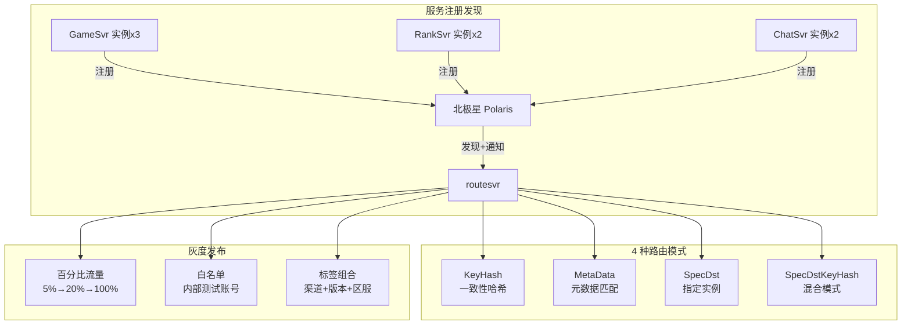
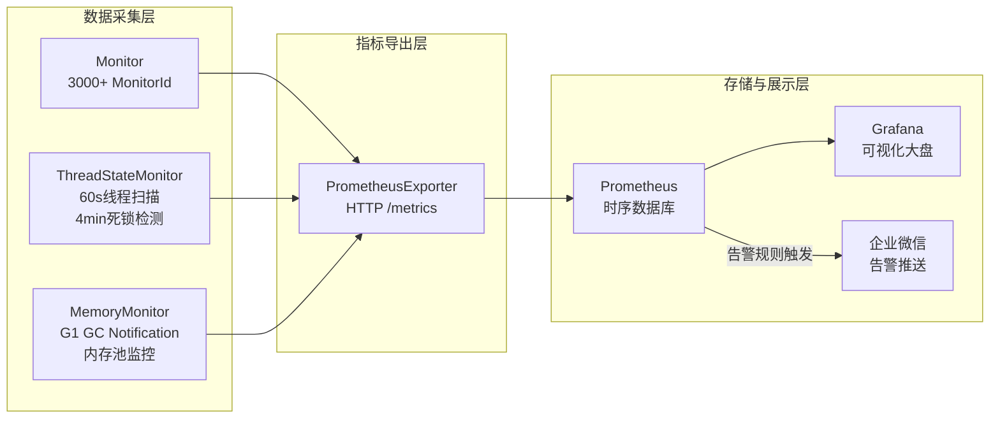
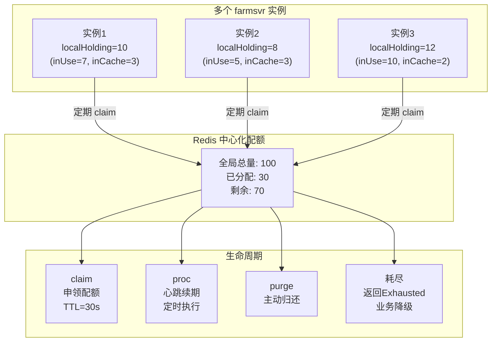
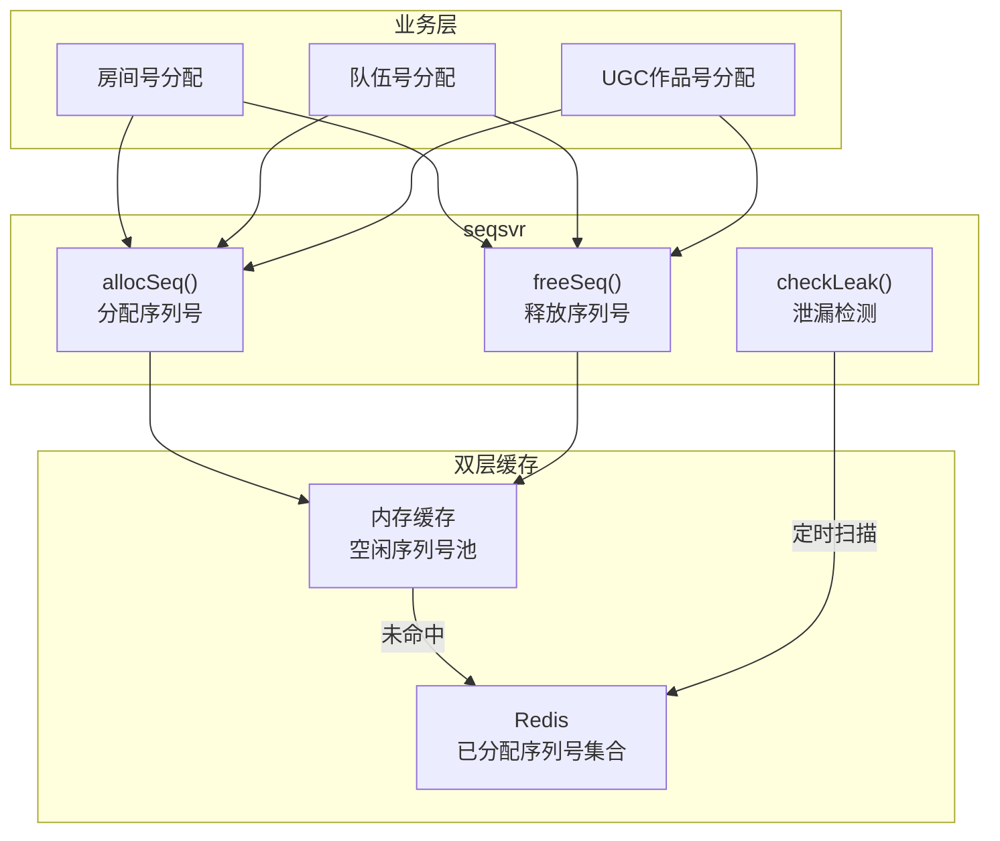
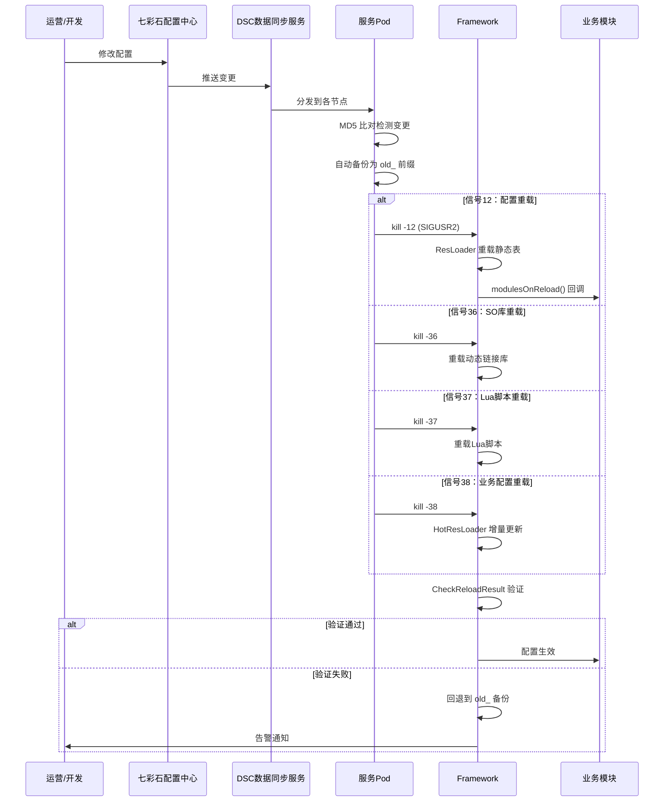

# 项目深度技术报告 — 服务治理篇（基础架构）

> **项目背景**: 参与游戏 10+ 微服务（gamesvr/chatsvr/ranksvr/matchsvr/roomsvr/ugcsvr/farmsvr 等）的基础架构和服务治理体系建设，涵盖服务发现、路由、灰度发布、监控告警、配置热更新等全套服务治理能力。

---

## 亮点一：微服务路由 + 灰度发布 + 全链路可观测性

### 1.1 一句话描述

> 基于 Polaris 实现服务注册发现，routesvr 支持 4 种路由模式，结合 3 种灰度发布策略和 Monitor→Prometheus→Grafana 全链路监控体系。

### 1.2 服务路由架构



### 1.3 四种路由模式详解

```java
// RpcRelayMode — 9种路由模式（核心4种）
public enum RpcRelayMode {
    // 1. KeyHash：一致性哈希，同一 key 总是路由到同一实例
    // 场景：按 uid 路由，保证同一玩家的请求到同一 ranksvr
    KeyHash,
    
    // 2. MetaData：按元数据匹配（如区服ID）
    // 场景：跨区路由，按 worldId 匹配目标区的服务
    MetaData,
    
    // 3. SpecDst：指定目标实例
    // 场景：管理指令、GM 操作指定特定实例
    SpecDst,
    
    // 4. SpecDstKeyHash：先指定实例组，再组内哈希
    // 场景：分组部署，组内负载均衡
    SpecDstKeyHash,
    
    // ... 另外5种：Random/MasterSlave/Broadcast/MatchId/StateId
}
```

| 路由模式 | 算法 | 适用场景 | 扩缩容影响 |
|---------|------|---------|----------|
| **KeyHash** | 一致性哈希（虚拟节点） | 排行榜、缓存 | 仅影响 1/N 的数据 |
| **MetaData** | 元数据精确匹配 | 跨区路由 | 无影响 |
| **SpecDst** | 直接寻址 | GM 操作 | 无影响 |
| **Random** | 随机选择 | 无状态服务 | 无影响 |

### 1.4 灰度发布实现

```java
// GrayScale 灰度策略
public class BlueGreenDeploymentUtil {
    
    // 检查灰度标记
    public static boolean checkBlueGreenMark(Player player) {
        // 策略1：百分比流量
        if (grayConfig.getPercentage() > 0) {
            int hash = Math.abs(player.getUid().hashCode() % 100);
            if (hash < grayConfig.getPercentage()) {
                return true;  // 命中灰度
            }
        }
        
        // 策略2：白名单
        if (grayConfig.getWhitelist().contains(player.getOpenId())) {
            return true;
        }
        
        // 策略3：标签组合（渠道 + 版本 + 区服）
        if (grayConfig.matchTags(player.getChannel(), 
                                  player.getVersion(), 
                                  player.getWorldId())) {
            return true;
        }
        
        return false;  // 未命中，走老版本
    }
}
```

### 1.5 全链路可观测性



**监控四维度上报**：

```java
// 每个 RPC 调用自动上报四维度指标
Monitor.getInstance().add.succ(monitorId, 1);    // 成功数
Monitor.getInstance().add.fail(monitorId, 1);    // 失败数
Monitor.getInstance().add.timeout(monitorId, 1); // 超时数
Monitor.getInstance().add.total(monitorId, 1);   // 总调用数

// 线程级监控
ThreadStateMonitor.scan();  // 每60s扫描线程状态
ThreadStateMonitor.detectDeadlock();  // 每4min死锁检测

// 内存级监控
MemoryMonitor.onGCNotification();  // G1 GC 回调
MemoryMonitor.checkMemoryPools();  // 内存池使用率
```

### 1.6 面试深挖问答

| 问题 | 回答要点 |
|------|---------|
| **一致性哈希虚拟节点原理？** | 每个物理节点映射为多个虚拟节点均匀分布在哈希环上，新增/删除节点只影响相邻虚拟节点的数据，避免数据倾斜 |
| **灰度发布如何回滚？** | 流量百分比降为 0% 即可回滚。白名单模式直接清空列表。配合 Monitor 实时监控错误率，超阈值自动触发回滚 |
| **Prometheus 数据模型？** | 四种指标类型：Counter（累计计数）、Gauge（瞬时值）、Histogram（分布）、Summary（百分位）。项目用 Counter 统计调用量，Gauge 统计在线人数 |
| **可观测性三支柱？** | Metrics（指标，已完善）、Logging（日志，50+ 分类日志文件）、Tracing（链路追踪，项目待增强） |

### 1.7 简历写法

> 参与游戏微服务治理体系建设（10+ 服务），基于 Polaris 实现服务注册发现，routesvr 支持 4 种路由模式（一致性哈希/元数据/指定实例/混合），灵活应对不同业务场景。实现 3 种灰度发布策略（百分比/白名单/标签），配合 Monitor 实时监控 + 自动回滚决策。搭建全链路可观测性体系：3000+ 监控指标 → Prometheus → Grafana，ThreadStateMonitor 线程 + 死锁检测，MemoryMonitor G1 GC + 内存泄漏预警。

---

## 亮点二：分布式资源池（ResourcePool） — Redis 中心化配额管理

### 2.1 一句话描述

> 基于 Redis 中心化存储实现跨进程的全局资源配额管控，支持 TTL 自动过期回收、主动归还和耗尽降级，应用于农场疯狂模式岛屿位等场景。

### 2.2 技术架构



### 2.3 核心实现

```java
// ResourcePool.claim — 向Redis申领本地配额
public ClaimResult claim(String consumer, String resourceKey, 
                          int localInUse, int localInCache, long expiredTime) {
    // localHolding = inUse + inCache
    int localHolding = localInUse + localInCache;
    
    // Redis 原子操作：检查全局剩余 → 分配 → 设置TTL
    // 如果全局剩余不足 → 返回 ResourcePoolResExhausted
    // 如果成功 → 更新 Redis 中该实例的持有量
    
    long ttl = expiredTime;  // 30秒TTL
    return redisClaimAtomic(consumer, resourceKey, localHolding, ttl);
}

// ResourcePoolConsumer — 业务层封装
public class ResourcePoolConsumer {
    public ResourceAcquireResult acquire() {
        if (inCache > 0) {
            inCache--;
            inUse++;
            return SUCCESS;
        }
        // 本地无缓存，需要向 Redis 申领
        ClaimResult result = pool.claim(this, resourceKey, inUse, 0, 30000);
        if (result == EXHAUSTED) {
            return EXHAUSTED;  // 全局耗尽，业务降级
        }
        return SUCCESS;
    }
    
    public void release() {
        inUse--;
        inCache++;  // 释放后进入本地缓存，不立即归还Redis
    }
}

// proc — 定期心跳续期
public void proc() {
    // 续期 TTL，防止过期被回收
    pool.claim(this, resourceKey, inUse, inCache, 30000);
}

// purge — 主动归还所有本地缓存
public void purge() {
    inCache = 0;
    pool.claim(this, resourceKey, inUse, 0, 30000);
}
```

### 2.4 面试深挖问答

| 问题 | 回答要点 |
|------|---------|
| **为什么不直接用 Redis DECR？** | DECR 只能做简单计数，无法追踪每个实例的持有量，无法在实例挂掉后精确回收。ResourcePool 通过 TTL 和 claim 协议实现完整的生命周期管理 |
| **续期机制 vs TTL 过期竞争？** | proc 续期间隔远小于 TTL（如每 10s 续期，TTL=30s），正常情况下永远不会过期。实例宕机后 30s 自动回收，不影响全局 |
| **耗尽时的降级策略？** | 返回 `ResourcePoolResExhausted` 错误码，业务层：①提示用户当前繁忙 ②切换到备选资源 ③排队等待 |

---

## 亮点三：分布式唯一 ID 生成服务（seqsvr）

### 3.1 一句话描述

> 分布式唯一 ID 生成服务支持多种序列号类型的分配与回收，Redis + 内存双层缓存协同，配合泄漏检测定时清理。

### 3.2 技术架构



### 3.3 核心实现

```java
public class SeqMgr {
    // 多种序列号类型
    public enum SeqType {
        ROOM_ID,     // 房间号
        TEAM_ID,     // 队伍号
        UGC_MAP_ID,  // UGC地图号
        // ...
    }
    
    // 分配序列号
    public long allocSeq(SeqType type) {
        // 1. 优先从内存空闲池分配
        Long cached = freePool.get(type).poll();
        if (cached != null) {
            return cached;
        }
        
        // 2. 内存池为空，从 Redis 原子递增
        long seq = Redis.INCR("seq:" + type.name());
        
        // 3. 标记为已分配
        Redis.SADD("seq_allocated:" + type.name(), String.valueOf(seq));
        
        return seq;
    }
    
    // 释放序列号（可回收复用）
    public void freeSeq(SeqType type, long seq) {
        // 1. 从已分配集合移除
        Redis.SREM("seq_allocated:" + type.name(), String.valueOf(seq));
        
        // 2. 放入内存空闲池
        freePool.get(type).offer(seq);
    }
    
    // 泄漏检测
    public void checkLeak() {
        // 定时扫描：Redis中标记为已分配但长时间无心跳的序列号
        // 超过阈值（如1小时）自动回收
        Set<String> allocated = Redis.SMEMBERS("seq_allocated:" + type);
        for (String seqStr : allocated) {
            long lastHeartbeat = getLastHeartbeat(seqStr);
            if (now() - lastHeartbeat > LEAK_THRESHOLD) {
                freeSeq(type, Long.parseLong(seqStr));
                log.warn("Leak detected and recovered: type={}, seq={}", type, seqStr);
            }
        }
    }
}
```

### 3.4 与业界唯一 ID 方案对比

| 方案 | 有序性 | 可回收 | 性能 | 适用场景 |
|------|--------|--------|------|---------|
| **seqsvr（本项目）** | ✅ 递增 | ✅ 支持回收 | 中（Redis） | 房间号等需要回收的场景 |
| **雪花算法** | ✅ 趋势递增 | ❌ | 高（本地） | 订单号等不回收场景 |
| **UUID** | ❌ 无序 | ❌ | 高（本地） | 分布式追踪ID |
| **Redis INCR** | ✅ 严格递增 | ❌ | 中（Redis） | 简单自增 |
| **号段模式（Leaf）** | ✅ 趋势递增 | ❌ | 高（批量） | 高并发订单号 |

**项目选择 seqsvr 的核心原因**：游戏场景中房间号、队伍号等资源是有限的，需要在使用完毕后回收复用。这是雪花算法和号段模式都不支持的特性。

---

## 亮点四：DSC 配置热更新 + 变更检测 + 信号驱动重载

### 4.1 一句话描述

> 通过 DSC 数据同步服务实现配置在线更新，MD5 变更检测 + 信号驱动重载 + 自动备份回滚，保障配置变更的零停机和安全性。

### 4.2 配置热更新全链路



### 4.3 三套热更机制

| 机制 | 触发方式 | 更新粒度 | 适用场景 |
|------|---------|---------|---------|
| **七彩石 Table** | 配置中心推送 | 整表替换 | 运营活动配置、限流规则 |
| **七彩石 KV** | 配置中心推送 | 单个KV | 功能开关、阈值调整 |
| **HotRes Redis** | 30s 定时轮询 | 增量更新 | 频繁变更的业务配置 |

### 4.4 MD5 变更检测

```bash
# landun_genchange_git.sh 核心逻辑
# 遍历配置目录，MD5 比对本地与线上版本
for file in $(find $CONFIG_DIR -type f); do
    local_md5=$(md5sum $file | awk '{print $1}')
    remote_md5=$(get_remote_md5 $file)
    
    if [ "$local_md5" != "$remote_md5" ]; then
        echo "CHANGED: $file"
        # 生成 HTML 差异报告
        diff_html $file $remote_file >> change_report.html
    fi
done
```

### 4.5 面试深挖问答

| 问题 | 回答要点 |
|------|---------|
| **为什么用信号驱动？** | 信号是 Unix 进程间通信的标准方式，无需额外端口/连接，适合容器环境。不同信号触发不同重载类型，粒度可控 |
| **重载失败怎么处理？** | CheckReloadResult 验证配置有效性（语法检查+关键字段非空），失败时自动回退到 old_ 备份文件，发送企业微信告警 |
| **三套热更机制为什么不统一？** | 历史演进原因。七彩石适合低频高可靠变更（运营配置），HotRes 适合高频业务配置（30s轮询）。统一收敛是 P3 改进项 |

### 4.6 简历写法

> 参与 DSC 配置热更新体系建设，实现配置在线更新零停机。通过 MD5 比对检测配置变更，DSC 服务推送到各节点，4 种 Unix 信号驱动不同类型的重载（配置/SO 库/Lua/业务），CheckReloadResult 验证重载结果。配置替换前自动备份，失败时自动回滚，保障配置变更安全性。

---

## 技术深度总结

### 跨三个项目的统一技术线索

```mermaid
graph TB
    subgraph "一致性保障（贯穿全项目）"
        direction LR
        A1["进程内<br/>协程串行化<br/>MailBox 顺序执行"]
        A2["服务内<br/>版本号乐观锁<br/>TcaplusDB CAS"]
        A3["跨服务<br/>分布式缓存锁<br/>CacheLockAgent"]
        A4["跨系统<br/>消息队列去重<br/>Pulsar + Redis SETNX"]
    end
    
    subgraph "性能优化（贯穿全项目）"
        direction LR
        B1["I/O 优化<br/>协程 park/unpark<br/>零线程阻塞"]
        B2["缓存优化<br/>三级缓存<br/>L1→L2→L3"]
        B3["请求优化<br/>SingleFlight<br/>请求合并"]
        B4["JVM 优化<br/>G1 GC 调优<br/>对象池化"]
    end
    
    subgraph "可靠性保障（贯穿全项目）"
        direction LR
        C1["限流熔断<br/>DynamicRateLimiter<br/>Redis Break"]
        C2["降级兜底<br/>功能开关<br/>耗尽降级"]
        C3["监控告警<br/>3000+ 指标<br/>四级告警"]
        C4["数据安全<br/>三重保护<br/>备份回滚"]
    end
    
    A1 --> A2 --> A3 --> A4
    B1 --> B2 --> B3 --> B4
    C1 --> C2 --> C3 --> C4
```



### 面试整体表述

> "从这三个项目的技术实践中，有三条贯穿始终的技术线索：
>
> **一是一致性保障**：从进程内的协程串行化（MailBox 按 UID 排队），到服务内的 TcaplusDB 版本号乐观锁，再到跨服务的 CacheLockAgent 分布式缓存锁（支持 CAP 策略选择），最后到跨系统的 Pulsar 消息去重，形成了四层递进的一致性保障体系。
>
> **二是性能优化**：从底层的 Kona Fiber 协程异步化（将所有 I/O 转为 park/unpark），到中间层的三级缓存架构（CoLoadingCache→Redis→TcaplusDB），到应用层的 SingleFlight 请求合并，再到 JVM 层的 G1 GC 调优，全链路的性能优化。
>
> **三是可靠性保障**：动态限流 + Redis 熔断器保护下游，功能开关 + 耗尽降级保证核心功能可用，3000+ 监控指标 + 四级告警实现实时感知，三重安全保护 + 配置自动备份保障数据安全。"