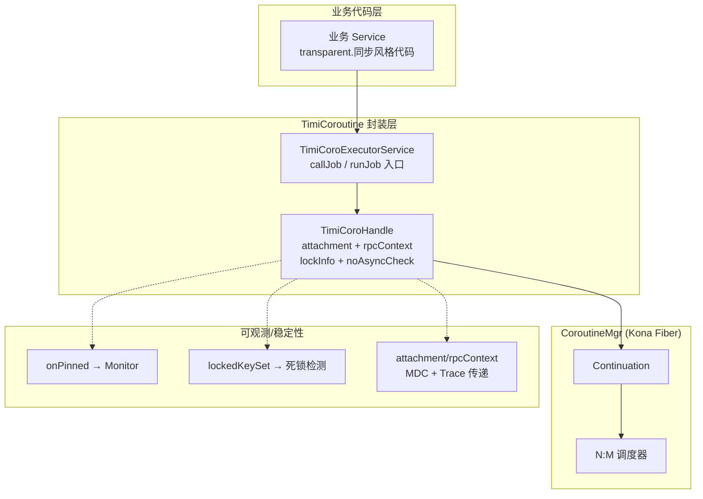
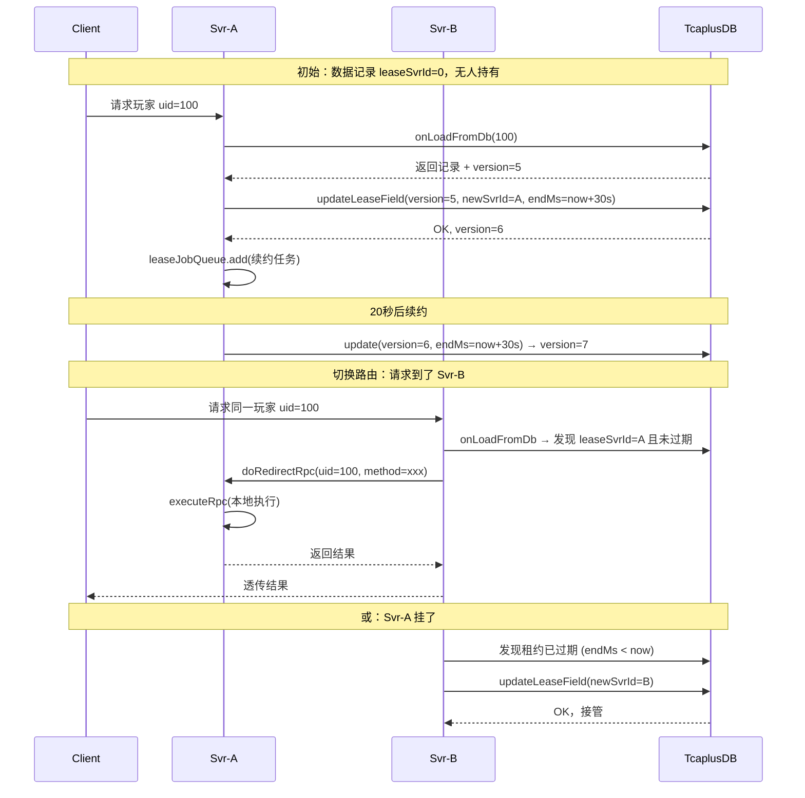
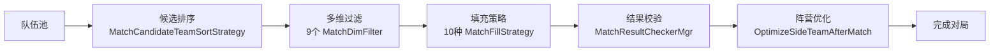
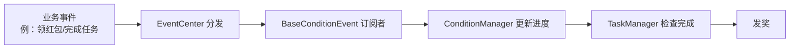
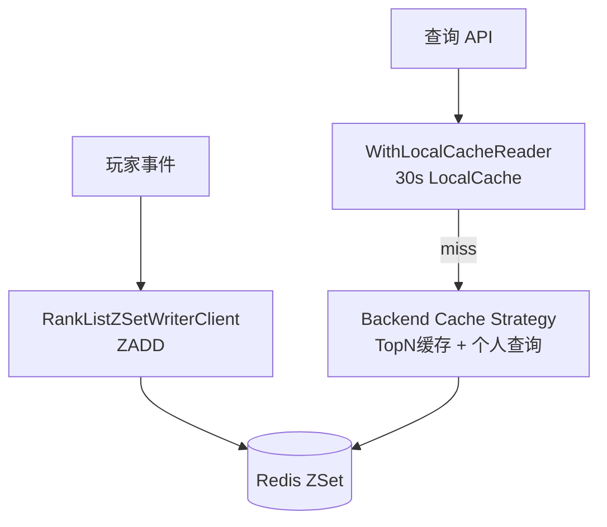

# 项目深度技术报告 — 架构与基建深度篇（代码级重写版）

> **文档性质**：本篇基于对 WeA / LetsGo 服务端**实际源码**的系统性扫描重写，取代此前偏向业务叙述的总结文档。  
> **覆盖规模**：C:/UGit/letsgo_server/WeA 下 67 个微服务 + `common/src/main/java/com/tencent` 下 137 个基建包。  
> **写作原则**：每一个亮点都能定位到**具体类、具体文件、具体行数**，配上对应技术决策与面试深挖点，避免空谈。  
> **最后更新**：2026-05-01

---

## 目录

| # | 主题 | 核心类 / 关键词 |
|---|------|---------------|
| 01 | 协程运行时 `TimiCoroHandle` / `callJob`-`runJob` 语义 | `timiCoroutine` 包、Pinned 检测、NoAsyncCheck、RpcContext 传递 |
| 02 | `CoLoadingCache` — 三合一本地缓存（LRU+TTL+SingleFlight+弱引用） | `coLoadingCache/CoLoadingCache.java` |
| 03 | `CacheLockAgent` — 分布式缓存锁 + CAP 可切换策略 | `cachelock/CacheLockAgent.java`、1010 行 |
| 04 | `LeaseManager` — 数据亲和性 + RPC 重定向 + 强制抢占 | `lease/LeaseManager.java`、602 行 |
| 05 | `RedisResourcePool` — Lua 脚本实现的集群级配额再分配 | `resourcepool/impl/RedisResourcePool.java` |
| 06 | `DistributeRateLimiter` — ZSet 滑动窗口限流 | `rateLimiter/impl/DistributeRateLimiter.java` |
| 07 | `MsgRateLimitMgr` — 四级限流体系（包大小/Pod/Entity/Dynamic） | `rpc/limiter/MsgRateLimitMgr.java`、681 行 |
| 08 | 撮合引擎 — 策略模式 + 多维跳表 + 阵营负载均衡（FFD） | `matchsvr/matchProcService` |
| 09 | 条件事件系统 — 160+ 条件 × 工厂反射 × EventBus | `condition/` 包、`BaseConditionEvent` |
| 10 | 排行榜 — 赛季映射器体系 + Redis ZSet + 本地缓存读取策略 | `rank/cacheclient`、`rank/season` |
| 11 | TcaplusDB 异步数据层 — 协程 park/unpark + 更新队列 + 版本 CAS | `tcaplus/` 包（80K+行 AsyncTcaplusManager） |
| 12 | 全链路技术主线索 — 一致性 / 性能 / 可用性三条脉络 | 跨模块横切 |

---

## 亮点 01：协程运行时 `TimiCoroHandle` — 面向业务的 Loom/Kona Fiber 封装

### 1.1 问题背景

Java 线程栈动辄 1MB，10 万并发连接无法用线程承载；传统 `CompletableFuture` 回调会让业务代码"碎片化"。元梦之星采用腾讯 **Kona JDK Fiber**（Java Loom 衍生），但直接用 `Continuation` 裸 API 会缺乏：
- 业务 trace 上下文跨协程传递（MDC / openTracing）  
- 协程被 Pin（卡在 OS 线程）的可观测性  
- 业务层禁用协程 park 场景（例如持锁临界区）的静态检查  
- RPC 调用链上下文（首调服务、app 版本、灰度标记）跨协程传递

### 1.2 核心实现

文件：[TimiCoroHandle.java](c:/UGit/letsgo_server/WeA/common/src/main/java/com/tencent/timiCoroutine/TimiCoroHandle.java)、[TimiCoroExecutorService.java](c:/UGit/letsgo_server/WeA/common/src/main/java/com/tencent/timiCoroutine/TimiCoroExecutorService.java)

```java
public class TimiCoroHandle<V> extends CoroHandle<V> {
    private final RelationType relationType;       // callJob(同步等结果) / runJob(异步fire-and-forget)
    protected boolean sequentialExecute = false;   // 与 MailBox 联动的按 UID 串行标记
    private volatile CoroHandleLockInfo lockInfo;  // 协程持锁信息（死锁检测用）
    private NoAsyncCheck noAsyncCheck;             // 静态扫描：禁用 park 的代码段
    private Map<String, String> attachment;        // 跨协程 MDC 上下文
    private TimiRpcContext rpcContext;             // 跨协程 RPC 上下文
}
```

#### 1.2.1 `callJob` vs `runJob` 语义区分

| API | 含义 | 上下文 | 使用场景 |
|-----|-----|-------|---------|
| `callJob(timeout, call)` | **同步**调用：当前协程 park，等子协程结束 | 复用当前 traceId、lockedKeySet | RPC 请求/响应、依赖返回值 |
| `runJob(call)` | **异步**调用：fire-and-forget | 重置 traceId，独立生命周期 | 日志上报、异步落库、事件通知 |

关键细节：`onInit` 会根据 `RelationType` 决定是否继承父协程的**持锁集合**，这对调试锁泄漏非常关键：

```java
// TimiCoroHandle.onInit()
if (getRelationType() == RelationType.callJob) {
    // callJob 复用父协程锁信息，避免自锁死锁
    getLockInfo().lockedKeySetAddAll(currentCoroHandleLockInfo.lockedKeySet, ...);
} else {
    // runJob 清空父协程锁，重置 traceId
    coroHandleLockInfo.lockedKeySet.clear();
    getCoroBaseInfo().resetTraceId();
}
```

#### 1.2.2 Pinned 检测（关键稳定性手段）

Java Loom 里，若协程在 `synchronized` 块内调用阻塞操作，协程会被"**钉死**"（Pin）在 OS 线程，失去轻量化优势。`onPinned` 回调：

```java
@Override
public void onPinned(String reason) {
    Monitor.getInstance().add.total(MonitorId.attr_ThreadPinned, 1);
    WechatLog.debugPanicLog("fatal thread {} reentrance {} jobname {} pinned!", ...);
}
```

配合 Prometheus `attr_ThreadPinned` 计数 + 企微告警，生产环境可第一时间发现误用 `synchronized` 的业务代码，强制迁移到 `ReentrantLock`。

#### 1.2.3 `NoAsyncCheck` — 禁异步段

部分临界区（如短时间加锁操作共享结构）**禁止出现 park**，否则易导致脏读。项目通过 `NoAsyncCheck.onPark()` 在协程 park 时反射调用，发现则抛异常并上报：

```java
@Override
protected void onPark() {
    super.onPark();
    if (noAsyncCheck != null) {
        noAsyncCheck.onPark();   // 被标注"不可 park"的代码段里若发生 park → 异常
    }
}
```

#### 1.2.4 `TimiRpcContext` 跨协程传递

跨协程（`callJobWithContext` / `submitWithRpcContext`）会主动复制 RPC 上下文：**首调服务 ID、客户端版本、Feature Flag、灰度标记**。这解决了分布式 tracing + 灰度链路传递的痛点：

```java
// TimiCoroExecutorService.callJobInternalWithContext
TimiCoroHandle currentCoroHandle = TimiCoroHandle.current();
if (currentCoroHandle != null && currentCoroHandle.getRpcContext() != null) {
    TimiRpcContext rpcContext = currentCoroHandle.getRpcContext();
    newObj.setRpcContext(rpcContext.getRpcSourceType(), ...);
}
```

### 1.3 架构图



### 1.4 面试深挖

| 问题 | 回答要点 |
|------|---------|
| Loom 的 Carrier Thread 是什么？ | 承载虚拟线程的 OS 线程；当协程 park 时 unmount，unpark 时 remount；Pinned 指无法 unmount |
| 协程 park 怎么避免线程阻塞？ | 异步 I/O 完成回调里调用 `unpark(handle)`；Lettuce Redis/异步 TcaplusDB 都是此模式 |
| 为啥不直接用 `@Async`/Reactor？ | Reactor 风格侵入业务代码；Loom 让同步代码风格保持，但享受异步性能 |
| traceId 怎么跨 runJob 传递？ | `attachment` Map 在 handle 构造时从父协程 copy，MDC 通过 `ThreadContext` 还原 |

---

## 亮点 02：`CoLoadingCache` — 三合一本地缓存（LRU + TTL + SingleFlight + WeakRef）

### 2.1 问题背景

游戏服务里本地缓存场景极多：排行榜、玩家基础数据、UGC 作品元信息。裸用 Guava Cache 的问题：
1. 不感知协程，多协程并发穿透时**缓存击穿**（LoadingCache 的锁是线程级）  
2. 没有双层兜底（强引用缓存淘汰后，如果业务还在持有，希望能复用）  
3. TTL 和容量淘汰需要自定义组合  
4. 批量加载需要分页以避免一次 DB 压力过大

### 2.2 核心实现

文件：[CoLoadingCache.java](c:/UGit/letsgo_server/WeA/common/src/main/java/com/tencent/coLoadingCache/CoLoadingCache.java)

#### 2.2.1 双层存储 + 分页批量

```java
protected LruTtlCache<K, V> cache;   // 主缓存：ConcurrentLinkedHashMap + 独立 expired map
protected final Map<K, V> holder;    // 可选：弱引用层（MapMaker().weakValues()）
protected final Set<K> loading;      // 正在加载的 key，防重入
private final long pageLimit;        // 批量加载分页
```

`LruTtlCache` 的关键点：
- `ConcurrentLinkedHashMap` 提供线程安全 LRU（Google Guava 早期作者的独立库）  
- 独立 `expired` 表存 `key -> expireTime`，get 时做**懒过期**，避免维护堆  
- `remove` 时触发 `RemovalNotifier`，可做资源释放

#### 2.2.2 SingleFlight — 防缓存击穿

多协程同时查同一 key，传统做法会触发 N 次 DB 加载。`CoLoadingCache` 的做法是借助 `ReentrantRWLock`（一个带**粒度 key 的读写锁**）和 `loading` 集合：

```java
public V get(K key) {
    V value = getFromCache(key);
    if (value != null) return value;
    // 有锁路径：按 builder.buildLockKey(key) 粒度加锁
    ReentrantRWLock lock = ReentrantRWLock.newBuilder()
        .addLoadingCacheKey(builder.buildLockKey(key))
        .ignoreTransactionCheck.build();
    return lock.writeLockCall(() -> getFromCacheOrRemote(key));
}

protected V getFromRemote(K key) {
    if (loading.contains(key)) {
        WechatLog.debugPanicLog("reenter load data, stack trace: " + FunctionUtil.getStackTrace());
        return null;   // 第二重保护：协程重入直接拒绝，防止递归加载
    }
    try {
        loading.add(key);
        value = loader1.onLoad(key);   // 真正 DB 查询
    } finally {
        loading.remove(key);
    }
}
```

两层保护：**锁粒度到 key**（不同 key 并行） + `loading` 集合防递归。

#### 2.2.3 弱引用 holder — 软过期后的兜底

打开 `enableWeakRefValue()` 后，主缓存 TTL 淘汰的对象仍会在 `holder` 中保留弱引用。业务端若还在持有该对象，下一次 `get` 会从 `holder` 回填到主缓存：

```java
private V getFromCache(K key) {
    V value = cache.get(key);
    if (value != null) return value;
    if (holder != null) {
        value = holder.getOrDefault(key, null);
        if (value != null) cache.put(key, value);   // 弱引用回填
    }
    return value;
}
```

### 2.3 与业界方案对比

| 特性 | CoLoadingCache | Guava Cache | Caffeine |
|------|----------------|-------------|----------|
| 协程友好 | ✅ 协程级锁 | ❌ 线程级 | 部分（异步 API） |
| SingleFlight | ✅ 锁 + loading 双重 | ✅ LoadingCache | ✅ AsyncLoadingCache |
| 分页批量 | ✅ pageLimit | ❌ | ❌ |
| 弱引用兜底 | ✅ MapMaker.weakValues | ❌ | ❌ |
| 懒过期表 | ✅ 独立 expired Map | Ring Buffer | 分层 TimerWheel |

### 2.4 简历写法

> 设计并维护项目核心本地缓存组件 `CoLoadingCache`：基于 `ConcurrentLinkedHashMap` 实现 LRU + 独立 expired 表的懒过期 TTL，结合 `ReentrantRWLock` 按 key 粒度加锁与 `loading` 集合双重保护防止缓存击穿；支持弱引用 holder 兜底，在主缓存淘汰后仍可复用业务引用；批量加载支持分页，避免瞬时 DB 压力。组件被 `LeaseManager`、玩家基础信息等 50+ 核心模块使用。

---

## 亮点 03：`CacheLockAgent` — 可切换 CAP 策略的分布式缓存锁

### 3.1 核心抽象

文件：[CacheLockAgent.java](c:/UGit/letsgo_server/WeA/common/src/main/java/com/tencent/cachelock/CacheLockAgent.java)（1010 行大文件）

这是项目中最复杂的一致性组件之一。它统一解决"**分布式数据集中缓存**"的三个工程难题：
1. 数据只能由一个进程同时写（持锁）  
2. 锁持有方宕机后要能被其他进程安全接管  
3. 续锁失败时业务要能感知并处理（例如清空本地脏数据）

#### 3.1.1 双时间窗：Cache ValidTime vs DB ValidTime

```java
private int cacheLock_Cache_ValidTime;  // 本地缓存有效期（ms）
private int cacheLock_DB_ValidTime;     // DB 中锁记录的有效期（ms）

// 强约束：cache < db / 2，保证续锁失败后本地能先于 DB 过期感知
if (agent.cacheLock_Cache_ValidTime > (agent.cacheLock_DB_ValidTime / 2)) {
    agent.cacheLock_Cache_ValidTime = agent.cacheLock_DB_ValidTime / 2;
}
```

这个约束保障了：**即使时钟漂移、续锁网络抖动，本地也能先于 DB 锁过期而检测到问题**，通过 `CacheRestoreAble` 回调让业务主动清空缓存，避免其他进程抢到锁后出现双写。

#### 3.1.2 CAP 策略可选（项目少见的工程亮点）

```java
// capAvailability=false (默认)：强一致性——拿不到锁直接失败
// capAvailability=true         ：可用性优先——拿不到锁仍放业务通过（用于可容忍的场景）
boolean capAvailability;
```

同一个 Agent 下所有数据共享同一策略，要求业务按 CAP 需求**拆分 Agent**，这本身是一种"约束性的 API 设计"。

#### 3.1.3 两种续锁路径

| 模式 | 触发 | 特点 |
|------|------|------|
| `enableTimerRenewal=true` | 定时器自动续 | 业务透明，有"死循环续锁"风险（进程假死但定时器还活着） |
| `enableTimerRenewal=false` | 业务操作时惰性续 | 业务无操作即不续，自然过期；但需要业务频繁访问 |

### 3.2 与 Redisson/ZK 锁对比

| 维度 | CacheLockAgent | Redisson RedLock | ZK 临时节点锁 |
|------|----------------|------------------|---------------|
| 存储底座 | TcaplusDB（业务表自带锁字段） | Redis 多节点 | ZK 集群 |
| 续锁 | 两级 TTL + 业务回调 | WatchDog 续期 | Session 心跳 |
| 失败感知 | CacheRestoreAble 回调 | 订阅失锁事件 | 节点消失通知 |
| CAP 策略 | **可配置**（亮点） | 强一致（多数派） | 强一致（CP） |
| 适用场景 | 业务数据绑定场景 | 通用互斥 | 协调任务选主 |

### 3.3 简历写法

> 负责分布式缓存锁组件 `CacheLockAgent` 的架构和关键场景（赛季切换、账号合并、UGC 发布）落地。设计本地缓存有效期 < DB 有效期 / 2 的双时间窗机制，保证续锁失败时本地先于 DB 过期并回调业务清理；支持 CAP 一致性/可用性两种策略，由 Agent 维度配置实现场景隔离；支持定时器自动续锁 + 业务惰性续锁两种模式。

---

## 亮点 04：`LeaseManager` — 数据亲和性 + RPC 重定向 + 强制抢占

### 4.1 问题背景

当多个 gamesvr 实例都能处理同一玩家的请求时，必须保证**同一玩家数据同一时间只在一个实例内存中被操作**（否则 version CAS 会频繁失败）。传统做法是"uid hash 到固定 svrId"，但扩缩容会打破。

`LeaseManager` 的方案：**数据记录本身带有"当前持有实例"字段**，谁能更新这个字段（借助 TcaplusDB version CAS）谁就持有租约。

文件：[LeaseManager.java](c:/UGit/letsgo_server/WeA/common/src/main/java/com/tencent/lease/LeaseManager.java)

### 4.2 核心流程



### 4.3 四个工程亮点

#### 4.3.1 四条并发队列清晰分工

```java
ConcurrentLinkedQueue<LeaseJob<K>> leaseJobQueue;       // 租约续约检查队列（按 nextMs 排序处理）
ConcurrentLinkedDeque<LeaseJob<K>> updateJobQueue;      // 待执行的保存任务
ConcurrentLinkedDeque<LeaseJob<K>> updatePendingQueue;  // 等待上一次保存完成的队列（避免并发写）
ConcurrentLinkedQueue<K> immediateQueue;                // 立即保存（去重）
ConcurrentHashSet<K> updatingSet;                       // 正在保存中的 key 集合
```

**关键设计**：如果一个 key 正在保存（`updatingSet` 包含），新来的 update 任务会被挂到 `updatePendingQueue`（头插），等本轮保存完成下一 tick 再处理，避免 version CAS 冲突。

#### 4.3.2 `LeaseJob_Final` 优雅下线

进程收到下线信号后 `notifyOffline()` → `serverOffline=true`，`leaseCheckProc` 检测到后为每个活跃租约生成 `LeaseJob_Final`：保存时把 `svrId` 置 0、`endMs` 置 0 →**主动释放租约**，等待下一个 svr 接管。保存完成后从本地缓存删除。`offlineCheck()` 返回队列是否清空，K8s 优雅终止阶段可轮询此方法决定何时真正杀死进程。

#### 4.3.3 `forceGrabAndExcute` 强制抢占

某些场景（运营工具、迁移脚本）需要绕过租约机制。`forceLease` 集合标记"下次 load 时无视已有租约"：

```java
protected NKErrorCode forceGrabAndExcute(K key, ...) {
    leaseCache.remove(key);
    forceLease.add(key);          // 下一次 loadDataFromDb 会忽略 leaseSvrId
    V cache = get(key);
    ...
    return executeRpc(...);
}
```

#### 4.3.4 `tryRedirect` 自动转发

业务层无感地支持"请求自动转发到持有租约的实例"，若目标实例返回 `LeaseShouldMigrate`（已迁走/已下线），调用方通过 `forceGrabAndExcute` 接管。

### 4.4 业界对比

| 方案 | 数据位置 | 故障转移 | 复杂度 |
|------|---------|---------|--------|
| **LeaseManager（本项目）** | 由记录字段决定 | DB TTL 自动切换 | 中 |
| 固定 hash 分片 | 按 uid % N | 扩缩容需 reshuffle | 低 |
| etcd/ZK 租约 | 外部协调 | 主动释放+心跳 | 高 |
| Akka Cluster Sharding | shard coordinator | 类似 | 极高 |

### 4.5 简历写法

> 维护有状态服务数据亲和性中间件 `LeaseManager`：基于 TcaplusDB 记录自带的 `leaseSvrId`/`endMs` 字段实现"谁 CAS 成功谁持有租约"；自动续租队列 + 立即保存队列 + Pending 队列三级协同，保证同一 key 的 version 单调递增；进程下线时生成 Final Job 主动释放租约，支持 K8s 优雅终止；`tryRedirect` 让业务无感 RPC 转发，`forceGrabAndExcute` 支持运维强制接管。应用于 ainpcsvr 等多个有状态服务。

---

## 亮点 05：`RedisResourcePool` — Lua 原子脚本实现集群级配额再分配

### 5.1 核心亮点：**配额会随消费者数量动态再分配**

传统分布式配额（Redis DECR、Semaphore）只做总量递减。本项目的 `RedisResourcePool` 关注**"N 个消费者公平共享 M 配额"**：当新消费者加入或旧消费者心跳过期，**本次申领的配额量会按剩余活跃消费者数动态除以**。

文件：[RedisResourcePool.java](c:/UGit/letsgo_server/WeA/common/src/main/java/com/tencent/resourcepool/impl/RedisResourcePool.java)

### 5.2 Lua 脚本解析

```lua
-- KEYS[1]: 资源 key 前缀
-- ARGV[1..7]: 消费者ID、有效时间戳下限、当前时间戳、总量、本地已用、期望申领、最大查询消费者数

-- 1. 清理过期消费者 + 查找存活消费者集合
local res_consumers = redis.call('zrangeByScore', res_idx_key, lower_bound_ts, '+inf', ...)
local res_values    = redis.call('hmget', res_stat_key, unpack(res_consumers))

-- 2. 计算"排除本消费者后的其他人已占量"
local consumer_cnt = 1
for i, id in ipairs(res_consumers) do
    if id ~= res_consumer then
        res_total     = res_total - (tonumber(res_values[i]) or 0)
        consumer_cnt  = consumer_cnt + 1
    end
end

-- 3. 按消费者数平分剩余配额（天花板除法）
local res_diff = res_total - res_in_use
if res_diff > 0 then
    res_in_cache = math.min(math.floor((res_diff + consumer_cnt - 1) / consumer_cnt), res_in_cache)
elseif res_diff < 0 then
    res_in_cache = -math.floor((-res_diff + consumer_cnt - 1) / consumer_cnt)
end

-- 4. 原子更新本消费者最新持有量 + 心跳时间
redis.call('hset', res_stat_key, res_consumer, res_final)
redis.call('zadd', res_idx_key, current_ts, res_consumer)
return { res_final, res_total - res_final }
```

**精髓**：
- **ZSet 按 score=时间戳** → 扫描时能 O(logN) 找出存活消费者 + 天然清理过期  
- **Hash 存每个消费者的当前持有量**，便于聚合  
- **天花板除法** `(diff + cnt - 1) / cnt` → 公平分配避免最后一份被抢光  
- **全部操作在一个 Lua 脚本内** → 严格原子（Redis 单线程特性）

### 5.3 业界对比

| 方案 | 公平再分配 | 心跳回收 | 原子性 |
|------|-----------|---------|-------|
| **RedisResourcePool** | ✅ | ✅ ZSet score 过期 | ✅ Lua |
| Redis 信号量 | ❌ 先到先得 | 需额外脚本 | 一般需 Lua |
| Hazelcast Semaphore | ❌ | Paxos session | ✅ |
| Sentinel 集群限流 | 令牌方式 | 心跳 | ✅ |

### 5.4 简历写法

> 设计并落地集群级配额服务 `RedisResourcePool`：Lua 脚本原子实现"消费者注册 + 过期回收 + 按活跃消费者数动态再分配配额"，ZSet 存活心跳 + Hash 存每消费者持有量，解决农场疯狂玩法中跨服务器共享岛屿位的配额公平分配问题。

---

## 亮点 06：`DistributeRateLimiter` — ZSet 滑动窗口限流

文件：[DistributeRateLimiter.java](c:/UGit/letsgo_server/WeA/common/src/main/java/com/tencent/rateLimiter/impl/DistributeRateLimiter.java)

```lua
-- 核心 Lua
redis.call('zremrangeByScore', KEYS[1], 0, ARGV[1])   -- 1. 清除窗口外的记录
local res = redis.call('zcard', KEYS[1])               -- 2. 统计当前窗口内请求数
if res < tonumber(ARGV[3]) then
    redis.call('zadd', KEYS[1], ARGV[2], ARGV[4])      -- 3. 未超阈值 → 入窗
    return threshold - res
else
    return 0                                           -- 4. 超限 → 拒绝
end
```

**对比传统计数器限流**：
- **固定窗口**：边界突刺问题（window 切换瞬间双倍流量）
- **令牌桶**：无突刺但不直观
- **ZSet 滑动窗口**：每次请求精确到毫秒入窗，零突刺 + 零抖动

### 缺点与工程改进

1. **写放大**：每次请求都要 INSERT + CARD + CLEAN，Lua 脚本虽原子但开销比 INCR 大  
2. **ZSet 增长**：若限流阈值很大，ZSet 成员数对应地大，内存占用高  
3. **改进**：可引入"分段窗口"（多 bucket），请求数多时降级为计数器

### 与 `MsgRateLimitMgr` 协同

全局 RPC 限流用 `MsgRateLimitMgr` 的内存令牌桶（高性能本地判定，见亮点 07）；跨服务的业务级限流（例如"某活动全服 QPS 不超过 X"）使用 `DistributeRateLimiter`。

---

## 亮点 07：`MsgRateLimitMgr` — 四级限流体系

文件：[MsgRateLimitMgr.java](c:/UGit/letsgo_server/WeA/common/src/main/java/com/tencent/rpc/limiter/MsgRateLimitMgr.java)（681 行）

### 7.1 限流维度立体矩阵

| 维度 | 类 | 存储结构 | 配置源 |
|------|----|---------|-------|
| **包大小** | `MsgSizeLimiter` | 静态阈值 | xls + 七彩石 |
| **Pod 级静态** | `StaticRateLimiter` | 令牌桶 | xls 配表 `MsgRateLimitConfig` |
| **Entity 级静态** | `StaticRateLimiterMgr<String>` | 按 openId 分桶 | xls 配表 |
| **Pod 级动态** | `DynamicRateLimiterMgr<Integer>` | 枚举 key 令牌桶 | 代码调用 + 七彩石 |
| **Entity 级动态** | `DynamicRateLimiterMgr<Long>` | 按 uid 分桶 | 代码调用 |
| **Proto 注解** | `RpcLimit` 注解 + 反射 | — | `.proto` 文件 |
| **默认 Entity**（兜底） | `defaultEntitiesRateLimiterMgrMap` | — | `DefaultMsgRateLimitConfig` |

7 种限流机制，覆盖包大小/全局节点/分消费者实体/业务动态调用等所有场景。

### 7.2 配置优先级与测试模式

每个限流器支持 `isTest` 标记：
- `isTest=true` → 触发后只上报监控，不实际拦截（灰度验证新规则）
- `isTest=false` → 触发后直接拒绝请求

配置 reload 时的**覆盖规则**精细（见源码 `getMsgSizeLimiterMap`）：

```
更严格的正式规则 > 宽松的正式规则 > 任何测试规则
测试规则之间取更严格的
```

### 7.3 自动清理（核心优化）

Entity 维度限流最大的问题是**key 无限膨胀**（每个玩家都会新建一个令牌桶）。`tick()` 每次随机清理一个 map 中的 entry：

```java
public int tick() {
    long v = lastTickCount++;
    if (v % 3 == 0) defaultEntitiesRateLimiterMgrMap.forEach((k,m) -> m.randomRemoveElement());
    if (v % 3 == 1) entitiesRateLimiterMgrMap.forEach((k,m) -> m.randomRemoveElement());
    if (v % 3 == 2) dynamicEntitiesRateLimiterMgrMap.forEach((k,m) -> m.randomRemoveElement());
}
```

**错峰清理 + 随机淘汰**，避免单 tick CPU 尖刺。

### 7.4 简历写法

> 主导 RPC 层限流中间件 `MsgRateLimitMgr` 的演进：支持 7 类限流器（包大小、Pod 静态/动态、Entity 静态/动态、Proto 注解、默认兜底），配置来源涵盖 xls 配表 + 七彩石 + 代码注解 + 业务动态调用；支持 `isTest` 灰度模式，便于规则上线前观察；实现错峰随机清理策略避免 Entity 维度 map 膨胀；配合 Monitor 输出四维度指标（msgName × limitType × result × serverType）。

---

## 亮点 08：撮合引擎 — 策略模式 + 多维跳表 + 阵营负载均衡

目录：`projects/matchsvr/src/main/java/com/tencent/wea/matchservice/matchdata/matchProcService/`

### 8.1 撮合流水线



每一层都是独立可插拔的策略/过滤器体系，支撑了 60+ 种玩法的撮合差异化。

### 8.2 多维跳表索引（`MatchDimSkipListData`）

队伍的 MMR、地域、延迟、身份等**多维属性**需要支持范围查询（如"±200 MMR 区间内且延迟 < 80ms"）。项目基于 `ConcurrentSkipListMap` 按各维度分别建索引：

```
MMR 跳表：   score=800 → [teamA, teamC]
            score=850 → [teamB, teamD]
Dim2 跳表：  score=25ms → ...
```

撮合时多个跳表求交集 → 候选集合。对比直接扫描所有队伍，复杂度从 O(N) 降到 O(log N + M)（M = 候选数）。

### 8.3 阵营负载均衡（经典 FFD + 优先队列）

文件：[MatchSideProcUtils.java](c:/UGit/letsgo_server/WeA/projects/matchsvr/src/main/java/com/tencent/wea/matchservice/matchdata/matchProcService/matchProcCommon/MatchSideProcUtils.java) — `splitMatchSidePlayerEvenly`

```java
// 最小堆按"已分配真人 / 阵营最大容量"百分比排序
PriorityQueue<MatchSideInfo> sidePlayerPercentHeap = new PriorityQueue<>(
    Comparator.comparingDouble(m -> {
        int sidePlayerCnt = sideAssignedPlayerCntMap.getOrDefault(m.getSideID(), 0);
        return sidePlayerCnt.doubleValue() / m.getTeamPlayers();
    })
);

// 将候选队伍逐个弹入百分比最低的阵营（典型 FFD 首次适配递减算法）
```

这是**多路背包 + 装箱问题**的工程降级解：每次把最大的未分配队伍放入"当前最空的阵营"，近似最优。

### 8.4 可插拔结构

| 扩展点 | 接口 | 实现数 |
|--------|------|--------|
| 候选排序 | `CandidateSortInterface` | ≥3 |
| 过滤器 | `MatchDimFilter` | 9 |
| 填充策略 | `IMatchFillStrategy` | 10 |
| 结果检查 | `AbstractMatchResultChecker` | 2 |
| 特殊规则 | `ChestSideIdentityRule` / `WereWoldSideIdentityRule` / `LobbyMatchRule` | ≥5 |
| 维度修正 | `MatchDimValueModifier` | 2+ |

### 8.5 简历写法

> 参与 matchsvr 撮合引擎的架构扩展：基于跳表实现多维属性范围索引，O(logN) 完成候选队伍筛选；设计 9 类过滤器 + 10 类填充策略的可插拔流水线，支撑 60+ 种玩法差异化撮合；实现阵营负载均衡（FFD + 百分比优先队列），保证两队真人比例近似相等；接入 AI 机器人填充机制、Meta-AI 技能值标签（MetaAIDye）等高级规则。

---

## 亮点 09：条件系统 — 160+ 策略 × 工厂反射 × 事件总线

目录：`common/src/main/java/com/tencent/condition/`

### 9.1 设计观察

`condition/main/` 下有 **160+ 个** 条件实现类（从 `ConditionActivity*` 到 `PlayerFarm*`）。如果每个条件用 if-else 实现会成为巨石代码。项目采用：

1. **工厂 + 注解注册**（`ConditionRegistry`）→ 反射扫描类 → 自动绑定配置 ID  
2. **事件驱动**（`BaseConditionEvent` + `EventSwitch`）→ 业务触发事件，条件订阅变更  
3. **条件组合**（`BaseConditionGroup` + `ConditionGroupOperation`）→ AND/OR 逻辑树，无需改代码支持复杂达成逻辑

### 9.2 与任务/活动系统联动



**核心优势**：
- **新增条件零侵入**：写一个继承 `BaseCondition` 的类 + 配表登记 ID，即可生效  
- **可配置逻辑**：`ConditionGroupOperation` 支持 AND/OR 表达式树，策划在 Excel 配表即可改达成规则  
- **性能**：只有订阅了对应事件的条件才会被触发，避免每帧全扫

---

## 亮点 10：排行榜 — 赛季映射器 + 双层缓存 + Redis ZSet 写读分离

目录：`common/src/main/java/com/tencent/rank/`

### 10.1 赛季映射器（15 种）

文件：`rank/season/*Mapper.java`

```
SeasonIdMapper (interface)
  ├── DailyMapper         每日
  ├── WeeklyMapper        每周（服务器自然周）
  ├── WeeklyCustomOffsetMapper   周榜自定义起始
  ├── MonthlyMapper       每月
  ├── CupSeasonIdMapper   段位赛季
  ├── RichSeasonIdMapper  富豪榜赛季
  ├── QDTWeeklyMapper     抢地盘周榜
  ├── FarmCrazyFruitMonthlyMapper 农场水果月榜
  ├── BiasedSeasonIdMapper        偏移赛季
  └── ...
```

策略模式的典型应用。每个排行榜的"赛季切换"规则都封装成一个 Mapper，写入时根据当前时间映射到对应的 Redis Key。跨赛季切换无需代码改动。

### 10.2 读写分离架构

- **ZSet Writer**（`RankListZSetWriterClient`）：玩家分数变更时 `ZADD` 到 Redis  
- **Backend Cache Reader**（`RankListBackendCacheStrategy`）：分 **TOP N 榜单缓存** + **玩家个人排名查询** 两套策略  
- **本地缓存装饰器**（`WithLocalCacheReaderClient`）：读取叠加 30s 本地缓存，避免高频重复查询击穿 Redis



### 10.3 面试深挖

| 问题 | 回答要点 |
|------|---------|
| Redis ZSet 查 TopN 开销？ | `ZREVRANGE 0 N` 时间 O(log N + M)，跳表结构友好 |
| 赛季切换怎么做？ | Mapper 返回新 SeasonKey，老 Key 设 TTL 自然过期 |
| 个人排名为什么慢？ | `ZREVRANK` 需全扫（O(log N)），但高 QPS 下需本地缓存 |
| 反作弊/禁用？ | `RankBanUtils` + `BanOption` 白黑名单，计算时过滤 |

---

## 亮点 11：TcaplusDB 异步数据层 — 协程 park/unpark + 更新队列 + 版本 CAS

目录：`common/src/main/java/com/tencent/tcaplus/`

### 11.1 文件规模
- `TcaplusManager.java` — **80K+ 行**  
- `AsyncTcaplusManager.java` — **56K+ 行**  
- `AsyncTcaplusUpdateQueue.java` / `CoroTcaplusUpdateQueue.java` — 更新队列  
- `dao/` 下 50+ 个具体表 DAO

### 11.2 核心机制

1. **协程化**：`CoroTcaplusManager.tcaplusSend(req)` → 协程 park → 收到响应回调里 unpark → 返回结果，完全同步风格  
2. **更新队列**：同一条记录的多次 update 被合并/去重，避免 version CAS 风暴  
3. **版本 CAS**：每次 update 携带客户端已知 version，DB 写入时原子校验，失败则返回 `SVR_ERR_FAIL_INVALID_VERSION`  
4. **分域存储**：玩家数据按功能拆成 `PlayerTable`、`PlayerExtraInfoTable`、`PlayerPublicTable` 等，冷热分离 + 按需加载

### 11.3 业界对比

| 特性 | TcaplusDB 异步层 | MyBatis+HikariCP | Vert.x SQL Client |
|------|----------------|------------------|-------------------|
| Protobuf 原生 | ✅ 表结构即 proto | ❌ | ❌ |
| 协程无阻塞 | ✅ park/unpark | ❌ 线程阻塞 | ✅ Future |
| 版本 CAS | ✅ 内置字段 | 需手动 | 需手动 |
| 更新队列合并 | ✅ | ❌ | ❌ |

---

## 亮点 12：全链路技术主线索

```mermaid
graph TB
    subgraph "一致性"
        C1[协程串行 MailBox]
        C2[版本CAS TcaplusDB]
        C3[CacheLockAgent 分布式锁<br/>CAP可选]
        C4[LeaseManager 数据亲和性]
        C5[Pulsar SETNX 去重]
    end
    subgraph "性能"
        P1[CoLoadingCache 三合一]
        P2[协程 park/unpark]
        P3[多维跳表索引]
        P4[更新队列合并]
        P5[Tbuspp 共享内存]
    end
    subgraph "可用性"
        A1[MsgRateLimitMgr 7类限流]
        A2[ResourcePool 公平配额]
        A3[租约 TTL 故障转移]
        A4[缓存双时间窗]
        A5[3000+ 监控 + 企微告警]
    end
    C1 --> C2 --> C3 --> C4 --> C5
    P1 --> P2 --> P3 --> P4 --> P5
    A1 --> A2 --> A3 --> A4 --> A5
```



### 12.1 面试整体表述（替代旧版）

> "我在腾讯参与元梦之星服务端开发，最核心的工作不是某个具体业务，而是**基建层面**的能力建设。我维护或深度使用过几个项目通用中间件：
>
> **一致性保障**层面，进程内用 `TimiCoroHandle` 包装的协程框架实现同一 uid 请求串行（MailBox 模式）；服务内依赖 TcaplusDB 记录自带的 version 字段做 CAS；跨服务我们有 `CacheLockAgent` 分布式缓存锁，最大亮点是**支持 CAP 策略按 Agent 切换**；跨进程数据亲和性由 `LeaseManager` 负责，用 DB 记录自身的 leaseSvrId 实现谁 CAS 成功谁持有，比固定 hash 分片更灵活。
>
> **性能优化**层面，核心组件是 `CoLoadingCache` —— 三合一本地缓存：`ConcurrentLinkedHashMap` 做 LRU、独立 expired Map 做懒过期 TTL、`ReentrantRWLock` 按 key 粒度加锁叠加 `loading` 集合防缓存击穿（SingleFlight），另外还有 WeakValues holder 做软淘汰兜底。配合 Kona Fiber 协程的 park/unpark，全链路 I/O 零阻塞。
>
> **可用性**层面，`MsgRateLimitMgr` 是 7 类限流器的集合，覆盖包大小、Pod 静态/动态、Entity 静态/动态、Proto 注解、默认兜底；每类限流器都支持 `isTest` 灰度观察模式；每 tick 错峰随机清理避免 map 膨胀。`RedisResourcePool` 通过 Lua 原子脚本实现集群级配额的**按活跃消费者动态再分配**，比 Redis 信号量公平。"

---

## 附录：推荐深挖文件清单

| 模块 | 核心文件 | 行数 | 学习价值 |
|------|---------|------|---------|
| 协程 | `timiCoroutine/TimiCoroHandle.java` | 409 | Loom 业务封装 |
| 协程 | `timiCoroutine/TimiCoroExecutorService.java` | 376 | callJob/runJob 语义 |
| 本地缓存 | `coLoadingCache/CoLoadingCache.java` | 505 | SingleFlight + 弱引用 |
| 分布式锁 | `cachelock/CacheLockAgent.java` | 1010 | CAP 策略 + 双时间窗 |
| 租约 | `lease/LeaseManager.java` | 602 | 数据亲和性经典实现 |
| 集群配额 | `resourcepool/impl/RedisResourcePool.java` | — | Lua 原子脚本精品 |
| 限流 | `rpc/limiter/MsgRateLimitMgr.java` | 681 | 多维限流体系 |
| 滑动窗口 | `rateLimiter/impl/DistributeRateLimiter.java` | 49 | 经典 ZSet 限流 |
| 撮合 | `matchsvr/.../MatchSideProcUtils.java` | — | FFD 算法 |
| 撮合 | `matchsvr/.../MatchProcDataMgr.java` | — | 多维跳表 |
| 数据层 | `tcaplus/TcaplusManager.java` | 80K+ | 超大型 DAO 管理 |

> **使用建议**：面试前根据目标岗位选 3~4 个亮点重点准备，确保能完整讲透"**为什么这样设计 → 与业界方案差异 → 可能的坑和如何规避**"三要素。