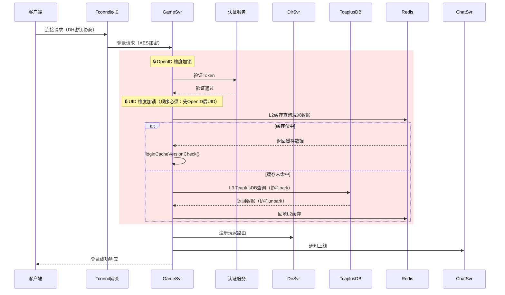
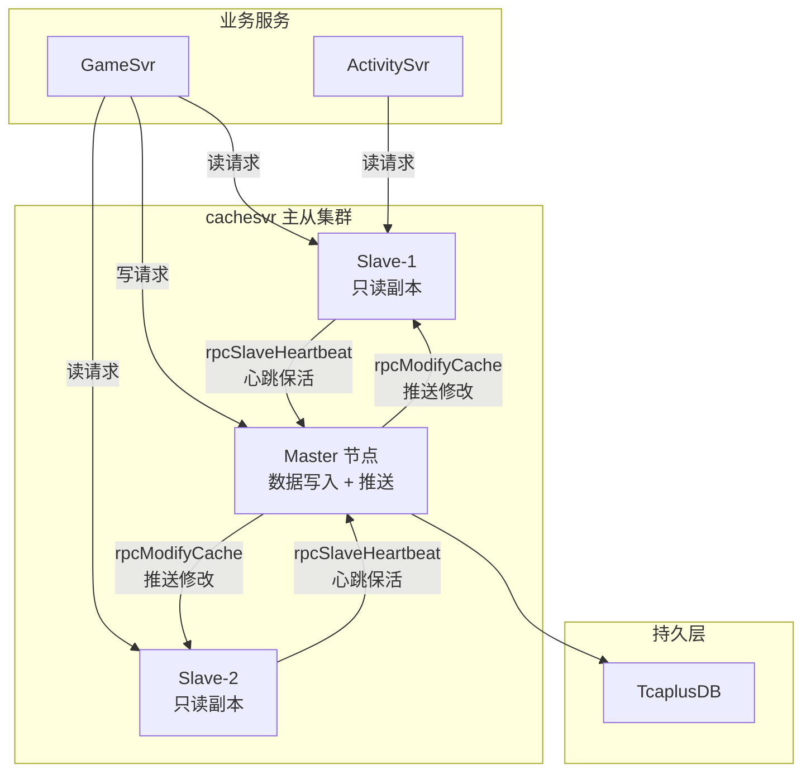
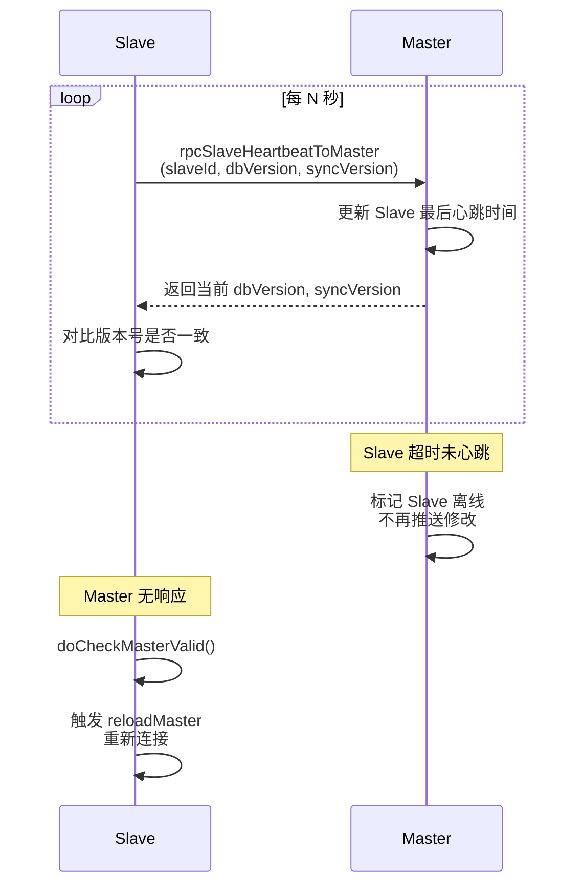
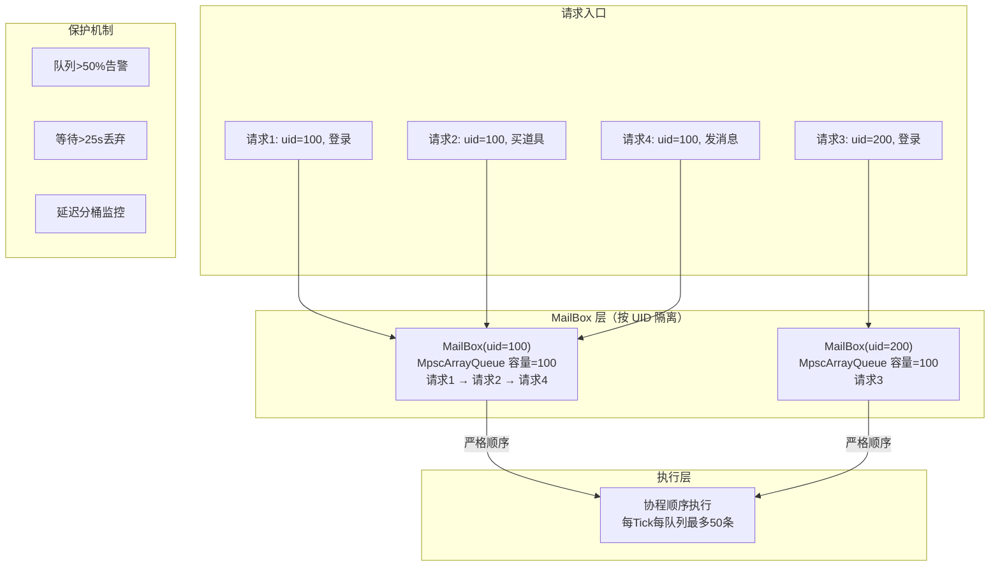

# 项目深度技术报告 — 游戏核心服务篇（gamesvr）

> **项目背景**: gamesvr 作为游戏核心服务，承载数十万 DAU 的登录/匹配/战斗/活动/支付等全链路核心功能，包含 119+ 玩家业务子模块，涉及 6+ 微服务协作的复杂分布式场景。

---

## 亮点一：高并发登录链路 — 分层锁 + 缓存优先 + 协程并发模型

### 1.1 一句话描述

> 设计 ConcurrentHashMap 双维度分层登录锁，结合缓存优先加载策略和协程异步化，保障数十万 DAU 的登录链路安全性与性能。

### 1.2 登录链路全景

登录涉及 6 个微服务协作、25 个步骤：



### 1.3 核心实现解析

#### 1.3.1 ConcurrentHashMap 双维度分层锁

```java
public class PlayerLogin {
    // 第一维度：OpenID 锁 — 防止同一账号并发登录
    private ConcurrentHashMap<String, PlayerLoginLock> openIdLockMap = new ConcurrentHashMap<>();
    
    // 第二维度：UID 锁 — 防止同一玩家数据并发操作
    private ConcurrentHashMap<Long, PlayerLoginLock> uidLockMap = new ConcurrentHashMap<>();
    
    // 超时防死锁：6秒自动过期
    private ConcurrentHashMap<String, Long> loginLockExpireMap = new ConcurrentHashMap<>();
    
    public LoginResult login(String openId, long uid) {
        // 1. 先获取 OpenID 锁（顺序固定，避免死锁）
        PlayerLoginLock openIdLock = openIdLockMap.computeIfAbsent(
            openId, k -> new PlayerLoginLock());
        
        synchronized (openIdLock) {
            // 设置6秒超时
            loginLockExpireMap.put(openId, System.currentTimeMillis() + 6000);
            
            // 2. 再获取 UID 锁
            PlayerLoginLock uidLock = uidLockMap.computeIfAbsent(
                uid, k -> new PlayerLoginLock());
            
            synchronized (uidLock) {
                // 3. 执行登录逻辑（内部全部协程异步）
                return doLogin(openId, uid);
            }
        }
    }
}
```

**设计决策分析**：

| 决策 | 原因 |
|------|------|
| **双维度加锁** | OpenID 锁防止账号级并发（如切区场景），UID 锁防止数据级并发 |
| **固定加锁顺序** | 先 OpenID 后 UID，消除死锁可能 |
| **6 秒超时** | 定时扫描 `loginLockExpireMap`，超时自动清理防止锁泄漏 |
| **ConcurrentHashMap** | 分段锁机制，不同玩家登录互不阻塞 |

#### 1.3.2 缓存优先加载策略

```java
public Player loadPlayer(long uid) {
    // 优先级1：本地 PlayerRef 缓存
    Player cached = getPlayerFromCache(uid);
    if (cached != null) {
        // 版本校验：检查缓存是否过期
        if (loginCacheVersionCheck(cached)) {
            return cached;  // 快速返回
        }
    }
    
    // 优先级2：Redis L2 缓存
    PlayerData redisData = CoRedisCmd.get("player:" + uid);
    if (redisData != null) {
        Player player = deserialize(redisData);
        updateLocalCache(uid, player);  // 回填L1
        return player;
    }
    
    // 优先级3：TcaplusDB L3（协程异步）
    PlayerData dbData = CoroTcaplusManager.tcaplusSend(
        TcaplusUtil.newGetReq(uid));
    Player player = deserialize(dbData);
    updateRedisCache(uid, player);   // 回填L2
    updateLocalCache(uid, player);   // 回填L1
    return player;
}
```

**缓存版本校验机制**：

```java
// 每次数据变更时递增版本号
// 登录时比较本地版本和远端版本
// 版本一致 → 直接使用缓存（零I/O）
// 版本不一致 → 从DB重新加载
private boolean loginCacheVersionCheck(Player player) {
    int localVersion = player.getCacheVersion();
    int remoteVersion = getRemoteVersion(player.getUid());  // Redis查询
    return localVersion == remoteVersion;
}
```

#### 1.3.3 全链路协程异步化

```java
// 登录链路中所有 I/O 操作全部协程化
public LoginResult doLogin(String openId, long uid) {
    // 1. Token验证 — 协程异步RPC
    AuthResult auth = IrpcClientFiberAsync.call(authService, verifyReq);
    // 协程park → 验证服务处理 → 协程unpark
    
    // 2. 数据加载 — 协程异步DB
    Player player = loadPlayer(uid);
    // 协程park → TcaplusDB查询 → 协程unpark
    
    // 3. 路由注册 — 协程异步RPC
    DirService.register(uid, currentServerId);
    // 协程park → dirsvr处理 → 协程unpark
    
    // 4. 上线通知 — 协程异步RPC（不等待返回）
    IrpcClientFiberAsync.send(chatService, onlineNotify);
    
    return LoginResult.success(player);
}
// 整个过程：OS线程从不阻塞，协程自动挂起/恢复
```

### 1.4 面试深挖问答

| 问题 | 回答要点 |
|------|---------|
| **ConcurrentHashMap 原理？** | JDK8 后用 Node 数组 + 链表/红黑树，put 时 CAS + synchronized（锁定头节点），扩容时支持多线程并发迁移。优势是不同 bucket 的操作互不阻塞 |
| **为什么双维度加锁？** | 场景：玩家切区时，旧区按 UID 释放数据，新区按 OpenID 创建会话。如果只有一维锁，切区期间可能出现数据竞争 |
| **加锁顺序能调换吗？** | 不能。如果线程A先锁UID再锁OpenID，线程B先锁OpenID再锁UID → 死锁。固定顺序是经典的死锁预防策略 |
| **锁超时 6s 够吗？** | 正常登录链路 <1s 完成。6s 是容错阈值（网络抖动/DB慢查询）。超时后锁自动释放+上报告警+Monitor 监控 |
| **缓存优先 vs Cache-Aside？** | 缓存优先是 Cache-Aside 的读路径优化。写路径仍是先更新DB再删缓存。额外加了版本号校验解决"缓存可能过期"的问题 |

### 1.5 简历写法

> 负责游戏核心登录链路优化（6 个微服务协作/25 步流程），设计 ConcurrentHashMap 双维度分层登录锁（OpenID+UID 顺序加锁 + 6 秒超时），支撑数十万 DAU 的并发登录安全。实现缓存优先加载 + 版本校验策略，减少 TcaplusDB 冷读 60%+。全链路基于 Kona Fiber 协程异步化（park/unpark 模型），单进程支撑万级协程并发 I/O。接入层实现动态限流保护，支持配表热更新限流规则。

---

## 亮点二：cachesvr 分布式缓存服务 — 主从架构 + 心跳检测 + LRU-TTL 淘汰

### 2.1 一句话描述

> 参与分布式缓存服务（cachesvr）的主从架构开发，实现主从复制、心跳故障检测和 LRU-TTL 组合淘汰策略，有效降低核心业务对 TcaplusDB 的读压力。

### 2.2 技术架构



### 2.3 核心实现

#### 2.3.1 主从复制 — Write-Update 模式

```java
// Master 节点数据修改后主动推送 Slave
public void masterNtfModifyToSlave(CacheKey key, CacheData data) {
    // 遍历所有在线 Slave
    for (SlaveInfo slave : slaveCacheMetaMap.values()) {
        if (slave.isOnline()) {
            // 通过 RPC 推送修改到 Slave
            rpcModifyCache(slave.getServerId(), key, data, currentSyncVersion);
        }
    }
    // 递增同步版本号
    syncVersion.incrementAndGet();
}

// Slave 接收到修改通知
public void onMasterModify(CacheKey key, CacheData data, long syncVer) {
    // 直接更新本地缓存（不回查 DB）
    localCache.put(key, data);
    // 更新同步版本号
    this.lastSyncVersion = syncVer;
}
```

#### 2.3.2 心跳故障检测



#### 2.3.3 LRU-TTL 组合淘汰

```java
public class CacheMgr {
    // 可配置参数
    private int cacheCapacity;    // 最大缓存容量
    private long cacheTTLMs;      // TTL 过期时间(ms)
    private int cacheMaxSlaveNum; // 最大 Slave 数
    
    // LRU + TTL 双淘汰
    public CacheData get(CacheKey key) {
        CacheEntry entry = cache.get(key);
        if (entry == null) return null;
        
        // TTL 检查
        if (entry.isExpired(cacheTTLMs)) {
            cache.remove(key);
            return null;  // 过期淘汰
        }
        
        // LRU 更新访问时间
        entry.updateAccessTime();
        return entry.getData();
    }
    
    // 容量检查 + LRU 淘汰
    public void put(CacheKey key, CacheData data) {
        if (cache.size() >= cacheCapacity) {
            // 淘汰最久未访问的条目
            evictLRU();
        }
        cache.put(key, new CacheEntry(data, System.currentTimeMillis()));
    }
}
```

### 2.4 与业界缓存方案对比

| 维度 | cachesvr（本项目） | Redis Sentinel | Redis Cluster |
|------|-----------------|----------------|---------------|
| 同步模式 | Master 主动推送 | 异步复制 | 异步复制 |
| 一致性 | 最终一致 | 最终一致 | 最终一致 |
| 心跳检测 | 自定义 RPC | Sentinel 哨兵 | Gossip 协议 |
| 淘汰策略 | LRU + TTL 可配 | 8 种策略可选 | 同 Redis |
| 优势 | 嵌入式，零网络延迟 | 成熟稳定 | 自动分片 |
| 劣势 | 功能较简单 | 需要哨兵节点 | 配置复杂 |

### 2.5 面试深挖问答

| 问题 | 回答要点 |
|------|---------|
| **主从数据不一致怎么办？** | 心跳中携带 dbVersion/syncVersion，Slave 检测到版本落后时触发增量同步。极端情况下 reloadMaster 全量同步 |
| **Master 挂了怎么办？** | Slave 通过 `doCheckMasterValid` 检测，标记 Master 无效。当前设计需要人工切换（未实现自动选举），这是改进点 |
| **LRU vs LFU？** | LRU 实现简单、对突发流量友好；LFU 对稳定访问模式更优但有频率老化问题。项目选 LRU 因为游戏玩家访问模式波动大 |
| **Write-Update vs Write-Invalidate？** | 项目用 Write-Update（推送新数据），避免 Slave 收到 invalidate 后再查 DB 的额外延迟。代价是推送数据量更大 |

### 2.6 简历写法

> 参与分布式缓存服务（cachesvr）主从架构开发。实现主从复制 + 心跳故障检测机制（Master 推送修改/Slave 定期心跳/超时自动摘除），LRU-TTL 组合淘汰策略可配置容量和过期时间。缓存同步基于 RPC 推送模式保障最终一致性，配合主节点有效性检测支持故障恢复。有效降低核心业务对 TcaplusDB 的读压力。

---

## 亮点三：玩家级请求串行化队列（MailBox） — 流量整形与并发安全

### 3.1 一句话描述

> 设计按 UID 隔离的 MailBox 请求串行化队列，通过 Tick 驱动消费模型实现流量整形，保证同一玩家请求严格串行执行，避免并发数据不一致。

### 3.2 技术架构



### 3.3 核心实现

#### 3.3.1 MailBox 顺序执行

```java
// SequentialComponent.runJob — 核心入口
public void runJob(long uid, Callable<?> callable) {
    // 1. 查找或创建 MailBox
    MailBox mailBox = mailBoxMap.computeIfAbsent(uid, k -> new MailBox());
    
    // 2. 创建带顺序执行逻辑的协程句柄
    CoroHandleForSequential handle = new CoroHandleForSequential(callable);
    handle.setEnqueueTime(System.currentTimeMillis());  // 记录入队时间
    
    // 3. 入队（MpscArrayQueue：多生产者单消费者，无锁高性能）
    if (!mailBox.queue.offer(handle)) {
        // 队列满 → 返回错误码
        throw new NKCheckedException(UserProtocolQueueFull);
    }
    
    // 4. 如果当前没有任务在处理，启动执行
    if (!mailBox.handling) {
        mailBox.handling = true;
        startNextInMailBox(mailBox);
    }
}

// 任务完成后自动执行下一个（链式调用）
void onCoroHandleForSeqFinally(MailBox mailBox) {
    CoroHandleForSequential next = mailBox.queue.poll();
    if (next != null) {
        // 检查等待时间是否超过丢弃阈值（25s）
        long waitMs = System.currentTimeMillis() - next.getEnqueueTime();
        if (waitMs > DROP_TIMEOUT) {
            Monitor.add(attr_mailbox_long_time_drop_count, 1);
            onCoroHandleForSeqFinally(mailBox);  // 跳过，处理下一个
            return;
        }
        submit(next);  // 继续执行
    } else {
        mailBox.handling = false;  // 队列空了
    }
}
```

#### 3.3.2 延迟监控分桶

```java
// 协议等待延迟分桶上报
long waitCostMs = System.currentTimeMillis() - handle.getEnqueueTime();

if (waitCostMs > 500) {
    Monitor.add(attr_player_proto_latency_500plus, 1);
}
if (waitCostMs > 1000) {
    Monitor.add(attr_player_proto_latency_1000plus, 1);
}
if (waitCostMs > 5000) {
    Monitor.add(attr_player_proto_latency_5000plus, 1);
    log.warn("Protocol wait too long: {}ms, uid={}", waitCostMs, uid);
}
```

#### 3.3.3 MailBox 过期清理

```java
// 使用 ConcurrentSkipListMap 追踪活跃时间
ConcurrentSkipListMap<Long, Set<Long>> activeTimeMap;

// 每次 proc 检查超过 60 秒未活跃的 MailBox
// 通过 checkObjectCanRemove 回调确认可安全移除
// 从 mailBoxMap 中清除，释放内存
```

### 3.4 为什么不用 Actor 模型？

| 维度 | MailBox（本项目） | Actor 模型（Akka） |
|------|-----------------|------------------|
| 消息传递 | RPC 请求直接入队 | 消息对象封装 |
| 状态管理 | 外部 Player 对象 | Actor 内部状态 |
| 错误处理 | 协程异常 + 超时丢弃 | 监督策略 |
| 复杂度 | 低（数百行代码） | 高（完整 Actor 框架） |
| 适配性 | 完美适配现有协程体系 | 需要引入新框架 |

**选择理由**：MailBox 是轻量级方案，几百行代码实现了核心的 per-key 串行化需求，完美嵌入现有的协程调度体系中。引入 Akka 等 Actor 框架代价太大。

### 3.5 面试深挖问答

| 问题 | 回答要点 |
|------|---------|
| **MpscArrayQueue 原理？** | Multi-Producer Single-Consumer 无锁队列，基于 CAS 实现并发安全的入队，单消费者出队无需同步。来自 JCTools 库 |
| **队列满了怎么办？** | 返回 `UserProtocolQueueFull` 错误码给客户端。客户端收到后延迟重试。同时上报 Monitor 告警 |
| **25 秒丢弃会不会丢重要操作？** | 25 秒未处理说明系统已经严重过载，此时丢弃是保护措施。客户端有重试机制，关键操作（支付等）有独立的保障通道 |
| **和 Tick 消费有什么关系？** | 实际项目中 MailBox 是协程驱动的（不是 Tick），但 `ProtocolQueue`（另一个队列）是 Tick 驱动的，每帧每队列最多消费 50 条，防止单玩家风暴 |

### 3.6 简历写法

> 设计玩家级请求串行化队列（MailBox），按 UID 隔离请求队列（ConcurrentHashMap<UID, MpscArrayQueue>），保证同一玩家请求严格串行执行，避免并发数据不一致。协程驱动消费模型实现请求流量整形，超 25 秒自动丢弃防止队列积压。延迟分桶监控（500ms/1s/5s）配合 Prometheus 指标实时观测排队情况。同模式应用于活动系统，实现活动事件有序处理。