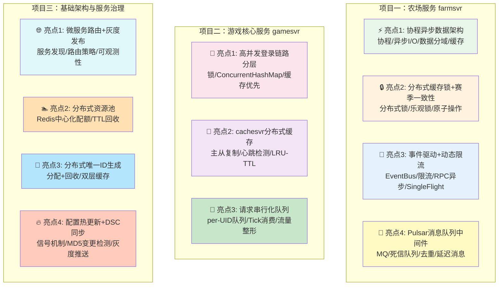

# 项目经历技术亮点汇总

> **目的**: 面试项目经历专用，按项目维度组织所有技术亮点，每个项目包含3-4个核心技术亮点
> **使用方法**: 根据目标岗位JD，从3个项目中选取2个重点展开，每个项目讲1-2个最匹配的亮点
> **最后更新**: 2026-03-09

---

## 项目总览与选取策略

**面试选取建议**:

| 目标岗位方向 | 推荐组合 | 重点展开 |
|------------|---------|---------|
| **通用后端**（头条/番茄/飞书） | 项目一 + 项目二 | F1协程架构 + G1登录链路 + G2分布式缓存 |
| **支付/交易**（抖音支付/生活服务） | 项目一 + 项目三 | F2分布式锁一致性 + I1服务治理 + F4消息队列 |
| **基础架构/中间件** | 项目二 + 项目三 | G2 cachesvr + I2资源池 + F4 Pulsar封装 |
| **游戏服务端** | 项目一 + 项目二 | F1协程架构 + F3事件驱动 + G3请求串行化 |

---

## 项目一：农场服务（farmsvr）

> **项目背景**: 负责大型多人在线游戏中"农场"玩法的服务端开发，farmsvr 作为独立微服务承载数十万日活的农场种植/养殖/餐厅经营等全链路玩法，涉及复杂的赛季生命周期管理和跨服数据交互。

### 亮点1（⭐⭐⭐ 最高优先）：基于协程的异步数据加载架构 + 多级存储设计

**一句话描述**: 基于 Kona Fiber 协程实现 TcaplusDB 异步读写，结合数据域分离和版本迁移框架，解决高并发下的 I/O 阻塞和数据膨胀问题。

**业务场景**: 农场玩家数据（FarmAttr）通过 Protobuf 序列化存储到 TcaplusDB，随业务迭代子模块越来越多（种植+赛季+餐厅+烹饪...），单条数据面临膨胀风险，且每次数据加载/落盘都是阻塞 I/O。

**技术实现**:

| 技术方向 | 项目中的实现 | 面试可延伸 |
|---------|------------|----------|
| **协程异步I/O** | 数据加载/落盘通过 `CoroTcaplusManager.tcaplusSend()` 基于 Kona Fiber 协程异步执行，`CoroutineAsync` + `CoroHandle.park()/unpark()` 挂起-唤醒，避免线程阻塞 | Java协程 vs Go goroutine？N:M调度模型？park/unpark原理？为什么不用CompletableFuture？ |
| **数据域隔离** | 主数据（Farm表）与餐厅数据（Cook表）分离存储到不同 TcaplusDB 表，餐厅通过 `CookMgr.loadCook()` 按需**懒加载**，避免主表膨胀 | 什么场景用拆表？懒加载的优缺点？跨表事务一致性？TcaplusDB vs Redis vs MySQL选型？ |
| **数据大小监控** | 落盘时上报序列化字节大小到 Monitor（`attr_farmsvr_data_size`），超阈值（4KB）触发告警，Prometheus + Grafana 可视化 | Protobuf序列化膨胀原因？varint编码？数据大小告警体系设计？ |
| **数据版本迁移** | `migrateDataIfNeeded()` 递进式迁移（v1→v2→v3），每次登录自动检测并升级 | 线上数据平滑迁移？向前/向后兼容？类比数据库Migration框架 |

**简历写法**:
> 负责农场玩法的异步数据加载架构设计，基于 Kona Fiber 协程框架实现 TcaplusDB 异步读写（park/unpark 模型），将阻塞I/O转为协程挂起，单进程支撑数万协程并发。设计数据域隔离方案，主表与子模块（餐厅/赛季）分表存储+按需懒加载，降低单条数据大小约40%。建立 Protobuf 序列化大小实时监控+阈值告警机制。设计递进式数据版本迁移框架，保障百万级玩家跨版本数据平滑升级。

---

### 亮点2（⭐⭐⭐ 高优先）：分布式缓存锁 + 赛季切换的数据一致性保障

**一句话描述**: 通过分布式缓存锁（CacheLockAgent）+ 版本号乐观锁 + 三重安全保护机制，保障农场赛季切换场景下多实例环境的数据一致性和安全性。

**业务场景**: 农场赛季切换涉及旧赛季数据回收（货币按万分比转换 + 数据清理）和新赛季初始化。多个 farmsvr 实例同时处理不同玩家的赛季切换请求，必须保证数据操作的一致性和安全性。

**技术实现**:

| 技术方向 | 项目中的实现 | 面试可延伸 |
|---------|------------|----------|
| **分布式缓存锁** | `CacheLockAgent` 实现分布式锁：抢锁(`lock`) → 续锁(`renewal`) → 释放(`releaseLock`)，本地 `LocalLock` 含 version + expireTime，秒级 `secondCheck` 自动续期和过期清理 | 分布式锁方案对比（Redis Redisson/ZooKeeper/DB乐观锁）？看门狗续期？锁续期失败怎么办？CAP取舍？ |
| **版本号+乐观锁** | 数据同步通过版本号乐观锁实现冲突处理，`CacheRestoreAble` 接口回调通知锁状态变化（`onNotifyRenewalFailed`/`onNotifyDBExpire`） | 乐观锁 vs 悲观锁？CAS的ABA问题？version vs timestamp方案？ |
| **三重安全保护** | 赛季清理采用"配表时间门控 + 赛季状态检测 + 七彩石硬开关"三重保护，防止运营误操作导致数据误删 | 线上高危操作安全机制？延迟删除 vs 软删除？配置中心灰度回滚？ |
| **赛季货币原子转换** | 旧赛季货币按万分比转换为新赛季货币，事务性操作保证"扣减旧+发放新"的原子性 | 分布式环境下扣减+发放原子性？补偿事务？TCC？最终一致性？ |

**简历写法**:
> 设计农场赛季切换系统的分布式一致性方案。基于 CacheLockAgent 实现分布式缓存锁（锁续期+自动过期+回调通知），配合版本号乐观锁保障多实例环境下的数据安全。赛季货币转换采用事务性操作保证原子性。引入"时间门控+状态校验+远程开关"三重保护机制，上线以来零数据误删事故。

---

### 亮点3（⭐⭐ 中优先）：跨服事件驱动架构 + 动态限流 + 缓存防击穿

**一句话描述**: 通过事件驱动架构实现核心操作与下游系统松耦合，配合动态限流和 SingleFlight 请求合并机制，保障高并发下的系统稳定性。

**业务场景**: 农场种植/收获操作涉及多系统联动（任务进度更新、平台上报、排行榜刷新、仙麒麟系统等），同时需要防止客户端恶意请求和缓存穿透打垮服务。

**技术实现**:

| 技术方向 | 项目中的实现 | 面试可延伸 |
|---------|------------|----------|
| **事件驱动解耦** | 收获后通过 `EventRouter` 分发事件（`@Subscribe` 注解），4类订阅方支持同步/异步混合处理 | 事件驱动 vs MQ解耦？EventBus vs Kafka？同步/异步事件一致性？观察者模式优缺点？ |
| **动态消息限流** | `DynamicRateLimiterMgr` 基于配表动态调整限流规则，`AtomicLong/AtomicInteger` 无锁计数，`ConcurrentLinkedQueue` 管理限流窗口 | 令牌桶/漏桶/滑动窗口/固定窗口对比？动态配置热更新？分布式限流（Sentinel/Guava）？ |
| **RPC异步调用** | 跨服通知（ranksvr排行榜/chatsvr成就广播）通过 `IrpcClientFiberAsync` 基于协程异步发送，避免阻塞主流程 | 同步RPC vs 异步RPC吞吐差异？失败重试？幂等性保障？ |
| **SingleFlight防击穿** | `SingleFlightAsync` 对同一key的请求合并，通过协程 success/failure 回调分发结果 | SingleFlight原理？缓存穿透/击穿/雪崩区别和解决方案？布隆过滤器？空对象缓存？ |

**简历写法**:
> 设计农场核心操作的事件驱动架构，基于 EventRouter + @Subscribe 注解实现 4 类下游订阅者的松耦合通知（同步+异步混合模式）。实现动态消息限流模块（DynamicRateLimiterMgr），支持配表热更新限流规则，CAS无锁计数保障高并发。跨服 RPC 调用基于协程异步化，避免收获链路阻塞。引入 SingleFlight 请求合并机制防止缓存穿透/击穿。

---

### 亮点4（⭐⭐ 中优先）：Pulsar 消息队列中间件封装 — 多订阅模式 + 死信队列 + 幂等去重

**一句话描述**: 基于腾讯云 Pulsar 封装统一消息中间件，支持多种订阅模式、自动死信队列与重试、基于 Redis SETNX 的唯一消息去重，覆盖 UGC 数据同步等多业务场景。

**业务场景**: 系统多个微服务（ugcsvr/ugcplatsvr/ugcappsvr/gamesvr 等）需要通过消息队列实现跨服务异步通信和数据同步（如 UGC 数据持久化、玩家信息同步等）。

**技术实现**:

| 技术方向 | 项目中的实现 | 面试可延伸 |
|---------|------------|----------|
| **3种订阅模式** | `PTopic` 枚举支持 Shared（共享，延迟消息必须用此模式）、KeyShared（同key有序）、Failover（故障转移） | Pulsar vs Kafka vs RocketMQ？订阅模式差异？Shared模式下如何保证消息有序？ |
| **死信队列+重试** | `createRetryAndDeadTopic()` 自动创建重试和死信队列，`PConsumerHandle.handle()` 返回 false 触发重试，超限进入死信 | 消费失败怎么处理？重试策略（指数退避 vs 固定间隔）？消息堆积怎么处理？ |
| **唯一消息去重** | `productUniqueForBytes()` 基于 Redis `SETNX+EXPIRE` 在指定时间窗口内同 key 消息去重 | 消息幂等方案对比（Redis SETNX/DB唯一索引/布隆过滤器）？SETNX原子性保障？ |
| **延迟消息** | `productDelayForString/Bytes(topic, msg, delaySec)` 支持秒级精确延迟投递 | 延迟消息实现原理？时间轮算法？RocketMQ延迟级别 vs Pulsar精确延迟？ |
| **生产者限流** | 所有生产调用经过 `PulsarThrottle.doReq()` 统一限流层 + `PulsarMonitor` 监控上报 | 生产端限流策略？背压（Backpressure）机制？ |

**简历写法**:
> 基于腾讯云 Pulsar 封装统一消息中间件，支持 Shared/KeyShared/Failover 3 种订阅模式。实现自动死信队列+重试机制（消费失败自动重试，超限进入死信队列人工介入）。基于 Redis SETNX+EXPIRE 实现唯一消息去重，保障幂等性。支持秒级精确延迟消息投递。生产端统一经过限流层，配合 Monitor 监控全链路消息指标。覆盖 UGC 数据持久化、跨服玩家信息同步等 5+ 业务场景。

---

## 项目二：游戏核心服务（gamesvr）

> **项目背景**: 参与游戏核心服务（gamesvr）的开发维护，承载数十万日活用户的登录/匹配/战斗/活动/支付等全链路核心功能，涉及6+微服务协作的复杂分布式场景。

### 亮点1（⭐⭐⭐ 最高优先）：高并发登录链路 — 分层锁 + 缓存优先 + 协程并发模型

**一句话描述**: 设计 ConcurrentHashMap 双维度分层登录锁，结合缓存优先加载策略和协程异步化，保障数十万DAU的登录链路安全性与性能。

**业务场景**: gamesvr 登录链路涉及 6 个微服务协作（tconnd → gamesvr → 认证服务 → TcaplusDB → routesvr → chatsvr），25个步骤，需要在高并发下保证安全且快速。

**技术实现**:

| 技术方向 | 项目中的实现 | 面试可延伸 |
|---------|------------|----------|
| **分层登录锁** | `PlayerLogin` 使用 `ConcurrentHashMap<String, PlayerLoginLock>` 按 OpenID 和 UID **双维度顺序加锁**，防止并发登录；`loginLockExpireMap` 6秒超时防死锁 | ConcurrentHashMap分段锁/红黑树原理？为什么双维度加锁？加锁顺序能调换吗（死锁分析）？锁超时 vs WatchDog续期？ |
| **缓存优先加载** | `getPlayerFromCache()` 优先从本地 PlayerRef 缓存加载，`loginCacheVersionCheck()` 校验版本有效性，版本变化时刷新 | 本地缓存 vs 分布式缓存选型？缓存版本一致性？Cache-Aside/Read-Through/Write-Behind模式？ |
| **协程异步化** | 登录链路 TcaplusDB 查询和 RPC 调用全部通过 `CoroutineAsync` + `CoroHandle.park()` 异步化，单线程调度数万协程 | Java协程（Kona Fiber/Project Loom）原理？M:N线程模型？协程栈大小调优？协程 vs 线程池 vs Reactor性能对比？ |
| **QPS频率控制** | `GSTconndManager` 对客户端消息做 QPS 控制，`DynamicRateLimiterMgr` 支持动态配表调整 | 接入层限流 vs 服务层限流？正常用户 vs 恶意请求区分？令牌桶参数动态调优？ |

**简历写法**:
> 负责游戏核心登录链路优化（6个微服务协作/25步流程），设计 ConcurrentHashMap 双维度分层登录锁（OpenID+UID顺序加锁+6秒超时），支撑数十万DAU的并发登录安全。实现缓存优先加载+版本校验策略，减少 TcaplusDB 冷读 60%+。全链路基于 Kona Fiber 协程异步化（park/unpark模型），单进程支撑万级协程并发I/O。接入层实现动态限流保护，支持配表热更新限流规则。

---

### 亮点2（⭐⭐⭐ 高优先）：cachesvr 分布式缓存服务 — 主从架构 + 心跳检测 + LRU-TTL 淘汰

**一句话描述**: 参与分布式缓存服务（cachesvr）的主从架构开发，实现主从复制、心跳故障检测和 LRU-TTL 组合淘汰策略，有效降低核心业务对 TcaplusDB 的读压力。

**业务场景**: 为降低核心业务对 TcaplusDB 的读压力（QPS 数万级），系统设计了独立的 cachesvr 缓存服务，采用主从架构提供高可用缓存能力。

**技术实现**:

| 技术方向 | 项目中的实现 | 面试可延伸 |
|---------|------------|----------|
| **主从复制** | `CacheInfo` 标识节点角色（`isMaster`），主节点通过 `slaveCacheMetaMap` 管理从节点，`masterNtfModifyToSlave` 推送修改 | 主从复制一致性保障？同步 vs 异步复制？Redis Sentinel/Cluster对比？脑裂问题？ |
| **心跳故障检测** | Slave 通过 `sendHeartbeat` 定期上报，Master 响应含 `dbVersion/syncVersion`，超时标记离线，`doCheckMasterValid` 检测主节点有效性 | 故障检测算法（Phi Accrual/固定超时）？心跳间隔设置？误判与漏判权衡？ |
| **LRU-TTL淘汰** | `CacheMgr` 使用 LRU-TTL 组合淘汰策略，可配置 `cacheCapacity`/`cacheTTLMs`/`cacheMaxSlaveNum` | LRU vs LFU vs ARC？TTL过期策略（惰性删除/定期删除）？热点key处理？缓存容量规划？ |
| **缓存同步协议** | 主节点修改通过 `rpcModifyCache` 推送到从节点，支持 `reloadMaster` 故障恢复 | Write-Invalidate vs Write-Update？最终一致性 vs 强一致性取舍？ |

**简历写法**:
> 参与分布式缓存服务（cachesvr）主从架构开发。实现主从复制+心跳故障检测机制（Master推送修改/Slave定期心跳/超时自动摘除），LRU-TTL组合淘汰策略可配置容量和过期时间。缓存同步基于 RPC 推送模式保障最终一致性，配合主节点有效性检测支持故障恢复。有效降低核心业务对 TcaplusDB 的读压力。

---

### 亮点3（⭐⭐ 中优先）：玩家级请求串行化队列（ProtocolQueue） — 流量整形与并发安全

**一句话描述**: 设计按 UID 隔离的请求串行化队列，通过 Tick 驱动消费模型实现流量整形，保证同一玩家请求严格串行执行，避免并发数据不一致。

**业务场景**: gamesvr 中单个玩家的 RPC 请求需要串行化处理（避免并发修改玩家数据导致不一致），同时需要防止单个玩家请求过多占用全局服务资源。

**技术实现**:

| 技术方向 | 项目中的实现 | 面试可延伸 |
|---------|------------|----------|
| **玩家级串行化** | `ProtocolQueue` 内部维护 `Map<Long, Queue<ProtocolQueueTaskObject>>`，按 UID 隔离请求队列，同一玩家请求严格串行 | 为什么需要per-key串行化？Actor模型 vs 队列模型？KeyedExecutor实现？ |
| **Tick驱动消费** | `onTick()` 每帧遍历所有 UID 队列，每队列每 tick 最多消费 `maxTasksPerQueue=50` 条，防止单玩家请求风暴阻塞其他玩家 | 公平调度算法？如何防止饥饿？maxTasksPerQueue调优？事件循环 vs Tick驱动？ |
| **回调模式** | `ProtocolQueueTaskObject` 封装 `RpcRequest` + `Function<RpcRequest, Integer> callback`，消费时执行回调并设置 `RpcResult` | 异步回调 vs Future/Promise vs 协程？回调地狱？RpcResult超时处理？ |
| **活动消息队列** | `ActivityMsgQueueManager` / `ActivityRpcMsgQueueManager` 分别处理活动事件和RPC消息的排队 | 业务级MQ vs 中间件级MQ？内存队列可靠性？服务重启队列丢失怎么办？ |

**简历写法**:
> 设计玩家级请求串行化队列（ProtocolQueue），按 UID 隔离请求队列（Map<UID, Queue>），保证同一玩家请求严格串行执行，避免并发数据不一致。Tick 驱动消费模型（每帧每队列最多50条）实现请求流量整形，防止单玩家请求风暴影响全局。采用回调模式异步处理并设置 RpcResult。同模式应用于活动系统，实现活动事件有序处理。

---

## 项目三：基础架构与服务治理

> **项目背景**: 参与游戏 10+ 微服务（gamesvr/chatsvr/ranksvr/matchsvr/roomsvr/ugcsvr/farmsvr 等）的基础架构和服务治理体系建设，涵盖服务发现、路由、灰度发布、监控告警、配置热更新等全套服务治理能力。

### 亮点1（⭐⭐⭐ 最高优先）：微服务路由 + 灰度发布 + 全链路可观测性

**一句话描述**: 基于 Polaris 实现服务注册发现，routesvr 支持 4 种路由模式，结合 3 种灰度发布策略和 Monitor→Prometheus→Grafana 全链路监控体系。

**业务场景**: 系统包含 10+ 微服务，需要完善的服务治理能力支撑大规模线上运营，包括灵活的路由策略、安全的灰度发布和实时的可观测性。

**技术实现**:

| 技术方向 | 项目中的实现 | 面试可延伸 |
|---------|------------|----------|
| **服务注册发现** | `GrpcManager` 单例管理 gRPC 通信，`Discover` 通过 PolarisUtil 定期发现实例，`SubInstance` 观察者模式通知变更 | Polaris/Nacos/Consul/Eureka对比？推 vs 拉模式？一致性协议（Raft/Paxos）？ |
| **4种路由模式** | routesvr 支持 **KeyHash**（一致性哈希）/ **MetaData**（元数据匹配）/ **SpecDst**（指定实例）/ **SpecDstKeyHash**（混合） | 一致性哈希虚拟节点？负载均衡算法对比（轮询/加权/最少连接/哈希）？扩缩容数据倾斜？ |
| **3种灰度策略** | `GrayScale` 支持百分比流量 / 白名单 / 标签组合；`BlueGreenDeploymentUtil.checkBlueGreenMark()` 检查灰度标记 | 灰度 vs 蓝绿 vs 金丝雀？流量染色原理？自动化回滚决策？ |
| **全链路监控** | Monitor→PrometheusExporter→Prometheus→Grafana；ThreadStateMonitor（60s线程扫描+4min死锁检测）；MemoryMonitor（G1 GC Notification+内存池监控）；succ/fail/timeout/total 四维度上报 | 可观测性三支柱（Metrics/Logging/Tracing）？Prometheus数据模型？G1 GC调优？死锁检测算法？ |

**简历写法**:
> 参与游戏微服务治理体系建设（10+服务），基于 Polaris 实现服务注册发现，routesvr 支持 4 种路由模式（一致性哈希/元数据/指定实例/混合），灵活应对不同业务场景。实现 3 种灰度发布策略（百分比/白名单/标签），配合 Monitor 实时监控+自动回滚决策。搭建全链路可观测性体系：Monitor→Prometheus→Grafana 指标大盘，ThreadStateMonitor 线程+死锁检测，MemoryMonitor G1 GC+内存泄漏预警。

---

### 亮点2（⭐⭐ 中优先）：分布式资源池（ResourcePool） — Redis 中心化配额管理

**一句话描述**: 基于 Redis 中心化存储实现跨进程的全局资源配额管控，支持 TTL 自动过期回收、主动归还和耗尽降级，应用于农场疯狂模式岛屿位等场景。

**业务场景**: 部分资源（如农场疯狂模式岛屿位、活动限量道具等）需要在多个服务实例间进行全局配额管控，单机内存计数无法满足多实例场景。

**技术实现**:

| 技术方向 | 项目中的实现 | 面试可延伸 |
|---------|------------|----------|
| **分布式配额** | `ResourcePool.claim(consumer, resourceKey, localInUse, localInCache, expiredTime)` Redis 中心化存储全局总量，各实例定期 claim 本地配额 | 分布式限流/配额方案对比？本地预分配优缺点？资源碎片化？ |
| **Producer-Consumer** | `ResourcePoolConsumer` 封装 acquire/release/setInUse，`ResourcePoolManager` 用 `ConcurrentHashMap` 管理多 Consumer | acquire 与 release 并发安全？防超卖？多资源池死锁避免？ |
| **过期回收** | claim 指定 `expiredTime`（30秒TTL），过期后自动回收；`purge()` 主动归还；`proc()` 定期心跳续期 | 续期机制？TTL过期竞争条件？资源泄漏检测？ |
| **耗尽保护** | acquire 超全局容量返回 `ResourcePoolResExhausted`，业务层降级处理 | 资源耗尽降级策略？排队等待 vs 快速失败？ |

**简历写法**:
> 设计分布式资源池（ResourcePool），基于 Redis 中心化存储全局资源配额，各实例通过 claim 协议定期申领本地配额（localHolding = inUse + inCache），支持 TTL 自动过期回收+主动 purge 归还+定期 proc 心跳续期。封装 ResourcePoolManager 管理多资源池并行操作。耗尽时返回 Exhausted 错误码触发业务降级。应用于农场疯狂模式岛屿位管控等场景，保障多实例环境下零超卖。

---

### 亮点3（⭐⭐ 中优先）：分布式唯一 ID 生成服务（seqsvr） — Redis + 内存双层缓存

**一句话描述**: 分布式唯一 ID 生成服务支持多种序列号类型的分配与回收，Redis + 内存双层缓存协同，配合泄漏检测定时清理。

**业务场景**: 游戏中多种实体（房间号、队伍号、UGC 作品号等）需要全局唯一的序列号，且需要支持回收复用（如房间销毁后房间号可重新分配）。

**技术实现**:

| 技术方向 | 项目中的实现 | 面试可延伸 |
|---------|------------|----------|
| **分配与回收** | `SeqMgr` 通过 `allocSeq()` 分配、`freeSeq()` 释放，`SeqType` 枚举管理多种序列号类型 | 分布式唯一ID方案对比（UUID/雪花算法/Redis INCR/号段模式/Leaf）？可回收ID设计？ |
| **Redis+内存双层缓存** | Redis 持久化存储已分配序列号，内存缓存加速分配，`checkLeak()` 定时检测泄漏并清理 | 多级缓存一致性？Redis宕机降级？内存缓存预热？泄漏检测时间窗口？ |
| **高并发唯一性** | 多实例环境通过 Redis 原子操作保障唯一性 | Redis INCR原子性？多实例号段预分配？高并发性能瓶颈？ |

**简历写法**:
> 参与分布式唯一 ID 生成服务（seqsvr），支持多种序列号类型的分配（allocSeq）与回收（freeSeq）。Redis + 内存双层缓存协同：Redis 持久化保障持久性，内存缓存加速分配保障性能。实现泄漏检测定时任务，自动清理长时间未使用的序列号。支撑房间号、队伍号、UGC 作品号等多种全局唯一 ID 生成。

---

### 亮点4（⭐ 补充优先）：DSC 配置热更新 + 变更检测 + 信号驱动重载

**一句话描述**: 通过 DSC 数据同步服务实现配置在线更新，MD5 变更检测 + 信号驱动重载 + 自动备份回滚，保障配置变更的零停机和安全性。

**业务场景**: 10+ 微服务需要频繁更新运行配置（限流规则、活动配置、功能开关等），要求在不重启服务的情况下完成配置变更，且需要防止配置错误导致线上故障。

**技术实现**:

| 技术方向 | 项目中的实现 | 面试可延伸 |
|---------|------------|----------|
| **DSC配置推送** | DSC 从 Rainbow 配置中心获取最新配置，推送到各服务节点，确认接收后标记同步完成 | 配置中心选型（Nacos/Apollo/Consul）？推模式 vs 拉模式？配置版本管理？ |
| **MD5变更检测** | `landun_genchange_git.sh` 遍历配置目录，MD5比对本地与线上版本，生成HTML差异报告 | 文件变更检测方案？inotify vs 轮询？增量更新 vs 全量替换？ |
| **信号驱动重载** | 4种Unix信号：信号12(配置重载)/36(SO库重载)/37(Lua脚本重载)/38(业务配置重载)，`CheckReloadResult` 验证重载结果 | 进程间通信方式？信号 vs 共享内存 vs 管道？重载失败如何处理？ |
| **自动备份回滚** | 配置替换前自动备份为 `old_` 前缀文件，重载失败时回退到备份版本 | 配置回滚策略？蓝绿配置？配置灰度推送？ |

**简历写法**:
> 参与 DSC 配置热更新体系建设，实现配置在线更新零停机。通过 MD5 比对检测配置变更，DSC 服务推送到各节点，4 种 Unix 信号驱动不同类型的重载（配置/SO库/Lua/业务），CheckReloadResult 验证重载结果。配置替换前自动备份，失败时自动回滚，保障配置变更安全性。

---

## 技术覆盖矩阵

| 技术方向 | 对应亮点 | 面试关键词 |
|---------|---------|----------|
| **消息队列** | 项目一·亮点4 | Pulsar 3种订阅/死信/去重/延迟/限流 |
| **分布式锁** | 项目一·亮点2 | CacheLockAgent续期+版本号乐观锁+回调 |
| **分布式缓存** | 项目二·亮点2 | cachesvr主从复制+心跳+LRU-TTL |
| **限流** | 项目一·亮点3/项目二·亮点1 | DynamicRateLimiterMgr动态配表+CAS无锁 |
| **协程/并发** | 项目一·亮点1/项目二·亮点1 | Kona Fiber park/unpark+万级协程+ConcurrentHashMap分层锁 |
| **数据库/存储** | 项目一·亮点1 | TcaplusDB分域存储+懒加载+版本迁移+Protobuf |
| **资源池** | 项目三·亮点2 | Redis中心化配额+TTL回收+耗尽降级 |
| **唯一ID** | 项目三·亮点3 | Redis+内存双层+分配回收+泄漏检测 |
| **请求串行化** | 项目二·亮点3 | per-UID队列+Tick消费+流量整形 |
| **服务治理** | 项目三·亮点1 | Polaris注册发现+4种路由+3种灰度+全链路监控 |
| **事件驱动** | 项目一·亮点3 | EventRouter+@Subscribe+SingleFlight |
| **配置热更新** | 项目三·亮点4 | DSC推送+MD5检测+信号重载+自动备份回滚 |
| **架构设计** | 全部 | 10+微服务+RPC(G6框架+Tbuspp传输)+DSC配置同步 |

---

## 面试表述模板

### 项目整体介绍（30秒版）

> "我在腾讯参与了一款大型多人在线游戏的服务端开发，项目采用 60+ 微服务分布式架构，基于共享内存进行高性能进程间通信，使用用户态协程驱动高并发处理。系统日常承载数十万在线用户，核心接口 QPS 十万级，内部 RPC 峰值百万级。我主要负责农场玩法服务和核心游戏服务两个模块的开发，涉及分布式锁、消息队列、缓存架构、协程并发、服务治理等方面。"

### 亮点展开模板（STAR格式，每个1-2分钟）

**Situation**: "在农场赛季切换场景中，需要在多个 farmsvr 实例环境下对玩家数据做原子性的货币转换和清理操作..."

**Task**: "我需要设计一套既能保证数据一致性，又能防止运营误操作的赛季切换方案..."

**Action**: "我采用了分布式缓存锁（CacheLockAgent）配合版本号乐观锁的双重保障方案。锁实现了自动续期和过期回调通知机制，类似 Redis Redisson 的 WatchDog。同时引入了三重安全保护..."

**Result**: "方案上线后，支撑了 N 个赛季的平稳切换，覆盖全量农场用户，零数据误删事故。"

---

## JD 关键词 → 亮点快速映射

> 面试前快速查阅：看JD中出现了哪些关键词，直接对应到要准备的亮点。

| JD关键词 | 推荐展开亮点 |
|---------|------------|
| "高并发" | 项目二·亮点1（登录链路）+ 项目一·亮点1（协程架构） |
| "分布式系统" | 项目一·亮点2（分布式锁）+ 项目三·亮点1（服务治理） |
| "消息队列/MQ/Kafka" | 项目一·亮点4（Pulsar封装） |
| "缓存/Redis" | 项目二·亮点2（cachesvr）+ 项目一·亮点3（SingleFlight） |
| "数据库/存储" | 项目一·亮点1（TcaplusDB+数据分域） |
| "微服务/服务治理" | 项目三·亮点1（路由+灰度+监控） |
| "稳定性/高可用" | 项目一·亮点2（三重保护）+ 项目三·亮点4（配置热更新） |
| "性能优化" | 项目一·亮点1（协程异步化）+ 项目二·亮点1（缓存优先） |
| "限流/熔断" | 项目一·亮点3（动态限流）+ 项目二·亮点1（QPS控制） |
| "架构设计" | 项目三·亮点1 + 项目一·亮点3（事件驱动） |