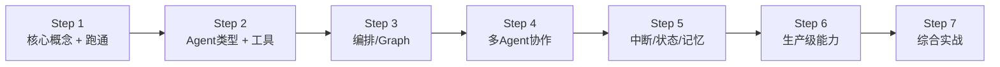

---

# Eino & tRPC-Agent-Go 一周精选学习路线

## 整体策略

> 两个框架**交替推进**，核心概念相互印证，避免重复学习基础 Agent 知识。

---

## Step 1：核心概念 + 跑通第一个 Agent

**掌握内容**：理解 Agent = LLM + Tool + Memory 的核心范式；两个框架的 Agent 接口 + Runner 入口 + 事件流模型

### Eino 侧

| 阅读项 | 文件 | 重点 |
|-------|------|------|
| 项目概览 | [README.zh_CN.md](D:/UGit/Go-Agent/eino/README.zh_CN.md) | 四层架构图（组件→编排→ADK→扩展） |
| **核心接口** ⭐ | [adk/interface.go](D:/UGit/Go-Agent/eino/adk/interface.go) (7KB) | `Agent`、`AgentEvent`、`AgentAction`、`AgentInput` 四个核心类型 |
| Runner 入口 | [adk/runner.go](D:/UGit/Go-Agent/eino/adk/runner.go) (8.7KB) | `NewRunner` → `Query`/`Run`/`Resume` 方法，理解 `AsyncIterator` 事件流 |

### tRPC-Agent-Go 侧

| 阅读项 | 文件 | 重点 |
|-------|------|------|
| 项目概览 | [README.md](D:/UGit/Go-Agent/trpc-agent-go/README.md) | 架构图 + 时序图 + 快速开始 |
| 最简示例 ⭐ | [examples/llmagent/main.go](D:/UGit/Go-Agent/trpc-agent-go/examples/llmagent/main.go) | `openai.New` → `llmagent.New` → `runner.Run` → 消费 event channel |
| 带工具的示例 | [examples/runner/main.go](D:/UGit/Go-Agent/trpc-agent-go/examples/runner/main.go) | FunctionTool + SessionService + 事件消费完整流程 |
| Runner 文档 | [docs/runner.md](D:/UGit/Go-Agent/trpc-agent-go/docs/runner.md) (3KB) | 事件流消费注意事项（不要仅用 `Done` 判定结束） |

---

## Step 2：Agent 类型 + 工具系统

**掌握内容**：两框架各自支持的 Agent 类型；工具定义、MCP 集成

### Eino 侧

| 阅读项 | 文件 | 重点 |
|-------|------|------|
| **ChatModelAgent** ⭐ | [adk/chatmodel.go](D:/UGit/Go-Agent/eino/adk/chatmodel.go) (34KB) | ReAct 循环：模型调用→判断tool_calls→执行工具→回传→再调用 |
| WorkflowAgent | [adk/workflow.go](D:/UGit/Go-Agent/eino/adk/workflow.go) (17KB) | Sequential / Loop / Parallel 三种编排模式 |
| Tool 定义 | [schema/tool.go](D:/UGit/Go-Agent/eino/schema/tool.go) (5.9KB) | ToolInfo + JSON Schema 参数定义 |
| Tool 接口 | `components/tool/interface.go` | BaseTool 接口 |

### tRPC-Agent-Go 侧

| 阅读项 | 文件 | 重点 |
|-------|------|------|
| Agent 类型总览 | [docs/agent.md](D:/UGit/Go-Agent/trpc-agent-go/docs/agent.md) (10KB) | 6 种 Agent 定义：LLM/Chain/Parallel/Cycle/Graph/ReAct |
| 工具系统 | [docs/tool.md](D:/UGit/Go-Agent/trpc-agent-go/docs/tool.md) (6.7KB) | FunctionTool / MCP / OpenAPI / DuckDuckGo |
| ReAct 示例 | `examples/react/` | Thought-Action-Observation 循环 |
| MCP 示例 | `examples/mcptool/` | MCP 工具集成实战 |

---

## Step 3：Graph 编排

**掌握内容**：DAG 图编排的核心概念；条件分支、并行、循环的实现方式

### Eino 侧

| 阅读项 | 文件 | 重点 |
|-------|------|------|
| Graph 核心 | [compose/graph.go](D:/UGit/Go-Agent/eino/compose/graph.go) (35KB，按需看) | `NewGraph` / `AddNode` / `AddEdge` / `Compile` |
| Chain 串行 | [compose/chain.go](D:/UGit/Go-Agent/eino/compose/chain.go) | 最简单的线性编排 |
| ToolsNode | [compose/tool_node.go](D:/UGit/Go-Agent/eino/compose/tool_node.go) | 工具执行节点，Graph 中的工具调用点 |

### tRPC-Agent-Go 侧

| 阅读项 | 文件 | 重点 |
|-------|------|------|
| **Graph 设计全文** ⭐ | [docs/graph_km.md](D:/UGit/Go-Agent/trpc-agent-go/docs/graph_km.md) (47KB) | StateGraph + Schema + 条件边 + Human-in-the-Loop（对标 LangGraph） |
| Graph 基础示例 | `examples/graph/basic/` | 最小化 StateGraph 示例 |
| 并行/扇出 | `examples/graph/fanout/` `examples/graph/diamond/` | 并行节点 + 汇聚 |
| 中断示例 | `examples/graph/interrupt/` | Graph 中的中断/恢复 |

---

## Step 4：多 Agent 协作

**掌握内容**：Agent 嵌套、Agent 互调、Supervisor/Team 模式

### Eino 侧

| 阅读项 | 文件 | 重点 |
|-------|------|------|
| AgentTool | [adk/agent_tool.go](D:/UGit/Go-Agent/eino/adk/agent_tool.go) (9.3KB) | Agent → Tool 封装，实现 Agent 嵌套调用 |
| Transfer | [adk/deterministic_transfer.go](D:/UGit/Go-Agent/eino/adk/deterministic_transfer.go) (8KB) | Agent 间确定性切换 |
| **DeepAgent** ⭐ | [adk/prebuilt/deep/deep.go](D:/UGit/Go-Agent/eino/adk/prebuilt/deep/deep.go) (5.7KB) | 任务分解 + 子 Agent 协调 |
| Supervisor | [adk/prebuilt/supervisor/supervisor.go](D:/UGit/Go-Agent/eino/adk/prebuilt/supervisor/supervisor.go) (2KB) | 主管模式 |

### tRPC-Agent-Go 侧

| 阅读项 | 文件 | 重点 |
|-------|------|------|
| 多 Agent 示例 | `examples/multiagent/` | SubAgent 嵌套 |
| Team 模式 | `examples/team/` | Coordinator + Worker 协作 |
| Transfer/Handoff | `examples/transfer/` | Agent 间任务移交 |
| AgentTool | `examples/agenttool/` | Agent 作为 Tool 被其他 Agent 调用 |

---

## Step 5：中断/恢复 + Session/Memory

**掌握内容**：Human-in-the-Loop 机制；会话持久化和长期记忆

### Eino 侧

| 阅读项 | 文件 | 重点 |
|-------|------|------|
| **中断机制** ⭐ | [adk/interrupt.go](D:/UGit/Go-Agent/eino/adk/interrupt.go) (10.7KB) | Tool 中断 + Agent 中断信号 |
| CheckPoint | [compose/checkpoint.go](D:/UGit/Go-Agent/eino/compose/checkpoint.go) | 状态持久化，从中断处恢复 |
| Resume | [compose/resume.go](D:/UGit/Go-Agent/eino/compose/resume.go) | Runner.Resume / ResumeWithParams |

### tRPC-Agent-Go 侧

| 阅读项 | 文件 | 重点 |
|-------|------|------|
| Session 管理 | [docs/session.md](D:/UGit/Go-Agent/trpc-agent-go/docs/session.md) (5KB) | InMemory / Redis / PG / MySQL 四种后端 |
| Memory 记忆 | [docs/memory.md](D:/UGit/Go-Agent/trpc-agent-go/docs/memory.md) (3.6KB) | Auto Memory / Session Memory |
| 中断示例 | `examples/humaninloop/` `examples/toolinterrupt/` | 工具中断 + Human-in-the-Loop |
| Session 示例 | `examples/session/` | 会话管理实战 |

---

## Step 6：生产级能力

**掌握内容**：回调/Plugin、可观测性、服务暴露协议、知识库 RAG

### Eino 侧

| 阅读项 | 文件 | 重点 |
|-------|------|------|
| 回调系统 | [callbacks/interface.go](D:/UGit/Go-Agent/eino/callbacks/interface.go) | OnStart/OnEnd/OnError 切面 |
| 流式处理 | [schema/stream.go](D:/UGit/Go-Agent/eino/schema/stream.go) | StreamReader，理解框架自动流拼接/合并 |
| Plan & Execute | [adk/prebuilt/planexecute/plan_execute.go](D:/UGit/Go-Agent/eino/adk/prebuilt/planexecute/plan_execute.go) (28KB) | 规划→执行模式 |

### tRPC-Agent-Go 侧

| 阅读项 | 文件 | 重点 |
|-------|------|------|
| Plugin 机制 | `examples/plugin/` + `examples/callbacks/` | Before/After Agent/Model/Tool 六个钩子 |
| 可观测性 | [docs/observability.md](D:/UGit/Go-Agent/trpc-agent-go/docs/observability.md) (5.8KB) | 伽利略 + 智研 + OTel |
| AG-UI 服务 | [docs/agui.md](D:/UGit/Go-Agent/trpc-agent-go/docs/agui.md) | 前端 Web 界面协议 |
| A2A 协议 | [docs/a2a.md](D:/UGit/Go-Agent/trpc-agent-go/docs/a2a.md) (5.8KB) | Agent-to-Agent 远程调用 |
| OpenAI 服务 | `examples/openaiserver/` | 暴露为 OpenAI 兼容 API |
| 知识库 RAG | `docs/knowledge/trag.md` (7.3KB) + `docs/knowledge/taiji.md` (7.6KB) | 完整 RAG 链路 |

---

## Step 7：综合实战

**掌握内容**：跨框架集成、自定义 Agent、端到端项目

### 实战任务清单

| 任务 | 涉及能力 | 框架 |
|------|---------|------|
| ① 实现一个带多工具的 ChatModelAgent | Tool 定义 + ReAct 循环 | Eino |
| ② 用 StateGraph 编排一个带条件分支+重试的工作流 | Graph 编排 + 条件边 + 循环 | tRPC-Agent-Go |
| ③ 实现多 Agent Team 协作 | Coordinator + Worker + Handoff | tRPC-Agent-Go |
| ④ 实现一个可中断/恢复的 Agent | CheckPoint + Resume | Eino |
| ⑤ 将 Eino Agent 集成到 tRPC-Agent-Go | Eino 适配器 | 交叉 |
| ⑥ 部署为 AG-UI + OpenAI API 双协议服务 | 服务端集成 | tRPC-Agent-Go |

### Eino → tRPC-Agent-Go 集成（交叉点）

| 阅读项 | 文件 | 重点 |
|-------|------|------|
| 适配器目录 | [trpc/agent/eino/](D:/UGit/Go-Agent/trpc-agent-go/trpc/agent/eino/) | Eino Agent → tRPC Agent 转换 |
| 渐进式示例 | `trpc/agent/eino/examples/`（00~07 共 8 个） | 从简单到复杂的迁移示例 |

---

## 精通自测清单

### ✅ Eino

- [ ] 能说清 `Agent` → `Runner` → `AsyncIterator[AgentEvent]` 整条事件流链路
- [ ] 能用 `compose.Graph` 搭建带条件分支+并行+循环的工作流
- [ ] 能实现 CheckPoint 持久化并从中断处恢复
- [ ] 能把 Agent 封装为 Tool（AgentTool），实现 Agent 嵌套
- [ ] 理解流式处理自动拼接/合并机制

### ✅ tRPC-Agent-Go

- [ ] 能区分并选用 6 种 Agent 类型的适用场景
- [ ] 能用 StateGraph 编排复杂图工作流
- [ ] 能搭建 Team 模式的多 Agent 协作
- [ ] 能编写 Plugin 实现全局拦截（日志/监控/安全）
- [ ] 能暴露为 AG-UI / A2A / OpenAI 三种协议
- [ ] 能将 Eino Agent 无缝迁移到 tRPC-Agent-Go 生态