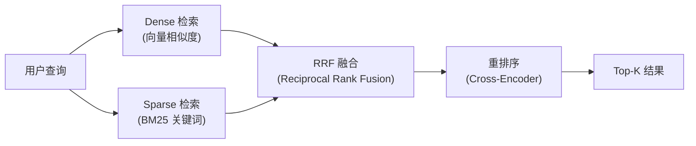
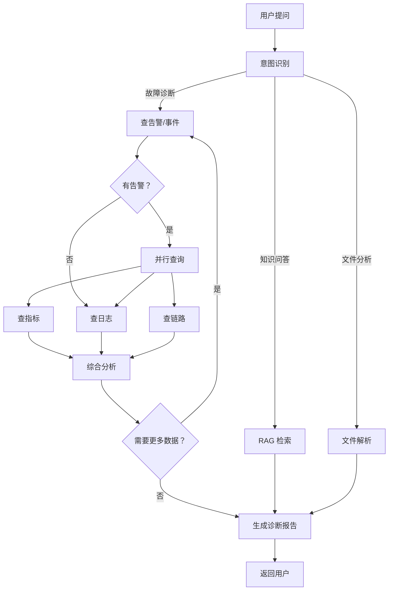
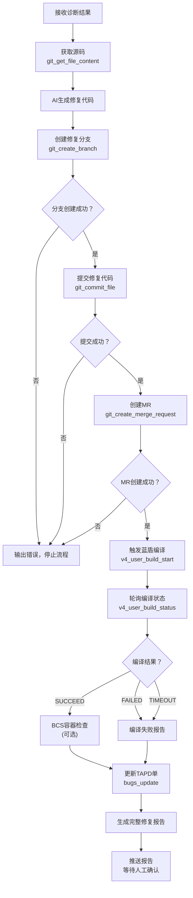

# GameOps Agent —— LetsGo 游戏服务器智能运维助手

## 完整执行方案

> **项目定位**：基于 tRPC-Agent-Go 构建的 Multi-Agent 智能运维系统，通过 RAG 检索运维知识 + 蓝鲸监控 MCP + BCS 容器平台 MCP + TAPD 工单管理 + 工蜂 Git 代码操作 + 蓝盾 CI/CD 编译验证 + Skills 技能系统 + 文件上传分析 + 多 Agent 协作，实现从「问题发现 → 根因定位 → 自动修复 → 编译验证 → 通知确认」的**全链路自动化闭环**。
>
> **预计工时**：四周（位于总体学习路径第 7 周，详见 [时间有限下的重点深入分析路径.md](D:/UGit/Go-Agent/时间有限下的重点深入分析路径.md)）
>
> **技术框架**：tRPC-Agent-Go
>
> **关联项目**：模型算法线（知识库微调模型融合到本项目的 KnowledgeAgent）—— 见 [模型算法微调项目执行方案.md](D:/UGit/Go-Agent/模型算法微调项目执行方案.md)

---

## 一、方案选型与立项依据

### 1.1 为什么选 GameOps（智能运维）方向？

| 维度 | 分析 |
|------|------|
| **JD 能力覆盖** | 一个项目同时展示 RAG、Function Calling、MCP 协议、Agent 架构、Graph 编排、Prompt Engineering、Memory、全链路自动化闭环 —— JD 里的全部核心技术栈 |
| **业务贴合度** | LetsGo 服务器有完整的监控体系（Prometheus + Monitor + ThreadStateMonitor + MemoryMonitor）、故障排查手册、运维 FAQ、告警响应流程 —— 这些正好构成 RAG 知识库的高质量语料 |
| **行业前景** | AI Agent 在运维领域（AIOps）是 2025-2026 最确定性的落地场景之一：3.3万亿赛道、Gartner 预测 30% 运维工作将由 Agent 自动化完成 |

### 1.2 为什么选 tRPC-Agent-Go 框架？

| 考量因素 | 分析 |
|---------|------|
| **内网生态** | 腾讯内部，tRPC-Agent-Go 与智研、伽利略监控、北极星服务发现无缝集成 |
| **企业级能力** | 内置 RAG 链路、Session/Memory 服务、Plugin 机制、AG-UI 前端 |
| **JD 对齐** | 多个 JD 明确要求 MCP 协议、A2A 协议，tRPC-Agent-Go 原生支持 |
| **两周可行性** | `trpc agent` 脚手架一键生成项目骨架，AG-UI 自带前端，不需要从零写 UI |
| **Eino 兼容** | tRPC-Agent-Go 内置了 Eino 适配器，学了其中一个另一个也通了 |

---

## 二、核心使用场景

```
👤 运维工程师 / 开发人员
        │
        ▼
  "昨晚凌晨3点gamesvr重启了3次，什么原因？帮我自动修复"
        │
        ▼
┌───────────────────────────────────────────────────┐
│              GameOps Agent 系统                     │
│                                                    │
│  🤖 Coordinator Agent（意图识别+路由）              │
│      │          │          │        │        │     │
│      ▼          ▼          ▼        ▼        ▼     │
│  📊故障诊断  📚知识问答  📁文件分析  🔧自动修复    │
│  Agent       Agent       Agent     Agent           │
│    │           │           │         │             │
│  蓝鲸MCP    RAG知识库    上传文件   工蜂Git API     │
│  (指标/日志   (运维文档    解析      蓝盾流水线     │
│   /告警/链路)  /FAQ)      (CSV/     TAPD工单       │
│  BCS MCP                  Excel/    企微通知       │
│  (容器状态)               图片/日志)               │
│                                                    │
└───────────────────────────────────────────────────┘
        │
        ▼
  全链路闭环：诊断报告 + 修复MR + 编译验证 → 人工确认合并
```

---

## 三、系统架构

### 3.1 整体架构图

```
┌──────────────── 用户入口 ────────────────┐
│  AG-UI Web    OpenAI API    企微机器人     │
│  (自带前端)   (/v1/chat)    (未来扩展)     │
│                                           │
│  🔔 自动触发入口                           │
│  ├─ 蓝鲸告警Webhook                       │
│  ├─ TAPD新Bug单Webhook                    │
│  └─ BCS Pod异常事件                        │
└──────────────────┬──────────────────────┘
                   │
                   ▼
┌──────────────── Agent 层 ───────────────┐
│                                          │
│  Runner（生命周期管理 + Session + Memory） │
│      │                                   │
│  Coordinator Agent（意图路由 + Transfer）  │
│      │            │           │      │   │
│      ▼            ▼           ▼      ▼   │
│  Diagnosis    Knowledge    File   Repair │
│  Agent        Agent       Analyst Agent  │
│  (蓝鲸MCP    (RAG检索)   (文件    (修复  │
│   +BCS MCP)              +图片)  闭环)   │
│                                          │
└──────────────────┬──────────────────────┘
                   │
    ┌──────────┬───┼───────┬──────────┐
    ▼          ▼   ▼       ▼          ▼
┌────────┐┌──────┐┌─────┐┌──────┐┌────────┐
│蓝鲸MCP  ││BCS   ││自建  ││Skills ││修复工具 │
│(7个)    ││MCP   ││Tool  ││(技能) ││链      │
│         ││(4个) ││(2-3) ││      ││        │
│指标查询  ││项目   ││文件   ││日志   ││工蜂Git │
│日志查询  ││集群   ││解析   ││分析   ││(4个)  │
│告警查询  ││资源   ││图片   ││CSV   ││TAPD   │
│事件查询  ││Helm  ││分析   ││对比   ││MCP    │
│APM链路  ││      ││健康   ││性能   ││蓝盾   │
│元数据   ││      ││检查   ││报告   ││MCP    │
└────────┘└──────┘└─────┘└──────┘└────────┘
                   │
                   ▼
┌──────────────── 数据层 ────────────────┐
│  向量数据库(PGVector)  Redis(Session)   │
│  运维文档(RAG语料)     Memory(长期记忆)  │
└────────────────────────────────────────┘
```

### 3.2 技术选型

| 组件 | 选择 | 理由 |
|------|------|------|
| **Agent 框架** | tRPC-Agent-Go | 企业级 + 内网生态 + AG-UI |
| **大模型** | 混元 (hunyuan) / OpenAI | 内网优先混元，支持切换 |
| **向量数据库** | PGVector 或 Milvus | tRPC-Agent-Go 原生支持 |
| **Session 存储** | Redis (北极星寻址) | 生产级、已有基础设施 |
| **前端** | AG-UI (agui.woa.com) | 零前端开发成本 |
| **工具协议** | 蓝鲸 MCP + FunctionTool | JD 核心要求项 |
| **部署** | tRPC 服务 + K8s | 贴合现有部署体系 |

---

## 四、蓝鲸 MCP 接入（核心数据源，免开发）

### 4.1 蓝鲸 MCP → Agent 工具映射

蓝鲸已提供 7 个 MCP Server，加上 BCS 容器平台 4 个、TAPD 工单管理、蓝盾流水线，共 **16 个 MCP Server** 覆盖全链路运维需求，**直接接入无需自建查询工具**：

| 平台 | MCP Server | 能力 | 对应 Agent 场景 |
|------|-----------|------|---------------|
| 🔷蓝鲸监控 | `bkmonitorv3-prod-metrics-query` | 指标查询 | CPU/内存/QPS/GC 等监控指标分析 |
| 🔷蓝鲸监控 | `bkmonitorv3-prod-log-query` | 日志查询 | 错误日志搜索、异常模式识别 |
| 🔷蓝鲸监控 | `bkmonitorv3-prod-alarm` | 告警查询 | 告警历史检索、告警关联分析 |
| 🔷蓝鲸监控 | `bkmonitorv3-prod-event-query` | 事件查询 | 变更事件、重启事件关联 |
| 🔷蓝鲸监控 | `bkmonitorv3-prod-tracing` | APM Tracing | 调用链路分析、慢请求诊断 |
| 🔷蓝鲸监控 | `bkmonitorv3-prod-metadata-query` | 元数据查询 | 服务列表、指标元信息查询 |
| 🔷蓝鲸监控 | `bkmonitorv3-prod-dashboard-query` | 仪表盘查询 | 获取已有监控面板配置 |
| 🟢BCS容器 | `bcs-project` | 项目管理 | ListAuthorizedProjects, GetProject |
| 🟢BCS容器 | `bcs-cluster` | 集群管理 | ListProjectCluster, GetCluster |
| 🟢BCS容器 | `bcs-resource` | K8s资源 | ListPo, GetPo, ListDeploy, ListSTS, ListSVC |
| 🟢BCS容器 | `bcs-helm` | Helm管理 | ListRepository, ListChartV1, ListReleaseV1 |
| 🟡TAPD | `tapd_mcp_http` | 缺陷管理 | bugs_get, bugs_create, bugs_update, bugs_count |
| 🟡蓝盾 | `devops-prod-pipeline-streamable` | CI/CD | v4_user_build_start, v4_user_build_status |

### 4.2 接入代码示例

```go
// 蓝鲸监控 MCP - 指标查询
metricsToolSet := mcp.NewMCPToolSet(
    mcp.ConnectionConfig{
        Transport: "sse",
        ServerURL: "https://bk-apigateway.apigw.o.woa.com/prod/api/v2/mcp-servers/bkmonitorv3-prod-metrics-query/mcp/",
        Timeout:   30 * time.Second,
        HTTPBeforeRequest: func(req *http.Request) {
            req.Header.Set("X-Bkapi-Authorization",
                fmt.Sprintf(`{"access_token":"%s"}`, os.Getenv("BK_ACCESS_TOKEN")))
        },
    },
)

// 蓝鲸监控 MCP - 日志查询
logToolSet := mcp.NewMCPToolSet(
    mcp.ConnectionConfig{
        Transport: "sse",
        ServerURL: "https://bk-apigateway.apigw.o.woa.com/prod/api/v2/mcp-servers/bkmonitorv3-prod-log-query/mcp/",
        Timeout:   30 * time.Second,
        HTTPBeforeRequest: func(req *http.Request) {
            req.Header.Set("X-Bkapi-Authorization",
                fmt.Sprintf(`{"access_token":"%s"}`, os.Getenv("BK_ACCESS_TOKEN")))
        },
    },
)

// 蓝鲸监控 MCP - 告警查询
alarmToolSet := mcp.NewMCPToolSet(
    mcp.ConnectionConfig{
        Transport: "sse",
        ServerURL: "https://bk-apigateway.apigw.o.woa.com/prod/api/v2/mcp-servers/bkmonitorv3-prod-alarm/mcp/",
        Timeout:   30 * time.Second,
        HTTPBeforeRequest: func(req *http.Request) {
            req.Header.Set("X-Bkapi-Authorization",
                fmt.Sprintf(`{"access_token":"%s"}`, os.Getenv("BK_ACCESS_TOKEN")))
        },
    },
)

// 同理接入 event-query, tracing, metadata-query ...

// 合并所有 MCP 工具
allMCPTools := []tool.Tool{}
allMCPTools = append(allMCPTools, metricsToolSet.Tools()...)
allMCPTools = append(allMCPTools, logToolSet.Tools()...)
allMCPTools = append(allMCPTools, alarmToolSet.Tools()...)
allMCPTools = append(allMCPTools, eventToolSet.Tools()...)
allMCPTools = append(allMCPTools, tracingToolSet.Tools()...)
allMCPTools = append(allMCPTools, metadataToolSet.Tools()...)
```

### 4.3 配置化 MCP 注册（支持未来动态扩展）

为了未来方便接入更多 MCP，把 MCP 配置外化：

```yaml
# mcp_servers.yaml
mcp_servers:
  - name: "bk-metrics"
    url: "https://bk-apigateway.apigw.o.woa.com/prod/api/v2/mcp-servers/bkmonitorv3-prod-metrics-query/mcp/"
    transport: "sse"
    timeout: 30s
    auth_header: "X-Bkapi-Authorization"
    auth_value_env: "BK_ACCESS_TOKEN"

  - name: "bk-log"
    url: "https://bk-apigateway.apigw.o.woa.com/prod/api/v2/mcp-servers/bkmonitorv3-prod-log-query/mcp/"
    transport: "sse"
    timeout: 30s
    auth_header: "X-Bkapi-Authorization"
    auth_value_env: "BK_ACCESS_TOKEN"

  - name: "bk-alarm"
    url: "https://bk-apigateway.apigw.o.woa.com/prod/api/v2/mcp-servers/bkmonitorv3-prod-alarm/mcp/"
    transport: "sse"
    timeout: 30s
    auth_header: "X-Bkapi-Authorization"
    auth_value_env: "BK_ACCESS_TOKEN"

  - name: "bk-event"
    url: "https://bk-apigateway.apigw.o.woa.com/prod/api/v2/mcp-servers/bkmonitorv3-prod-event-query/mcp/"
    transport: "sse"
    timeout: 30s
    auth_header: "X-Bkapi-Authorization"
    auth_value_env: "BK_ACCESS_TOKEN"

  - name: "bk-tracing"
    url: "https://bk-apigateway.apigw.o.woa.com/prod/api/v2/mcp-servers/bkmonitorv3-prod-tracing/mcp/"
    transport: "sse"
    timeout: 30s
    auth_header: "X-Bkapi-Authorization"
    auth_value_env: "BK_ACCESS_TOKEN"

  - name: "bk-metadata"
    url: "https://bk-apigateway.apigw.o.woa.com/prod/api/v2/mcp-servers/bkmonitorv3-prod-metadata-query/mcp/"
    transport: "sse"
    timeout: 30s
    auth_header: "X-Bkapi-Authorization"
    auth_value_env: "BK_ACCESS_TOKEN"

  # ==================== BCS 容器平台 MCP ====================
  - name: "bcs-project"
    url: "https://bk-apigateway.apigw.o.woa.com/prod/api/v2/mcp-servers/bcs-api-gateway-mcp-project/application/mcp/"
    transport: "streamable-http"
    timeout: 30s
    auth_header: "X-Bkapi-Authorization"
    auth_template: '{"bk_app_code":"${BCS_APP_CODE}","bk_app_secret":"${BCS_APP_SECRET}","bk_ticket":"${BCS_TICKET}"}'

  - name: "bcs-cluster"
    url: "https://bk-apigateway.apigw.o.woa.com/prod/api/v2/mcp-servers/bcs-api-gateway-mcp-cluster/application/mcp/"
    transport: "streamable-http"
    timeout: 30s
    auth_header: "X-Bkapi-Authorization"
    auth_template: '{"bk_app_code":"${BCS_APP_CODE}","bk_app_secret":"${BCS_APP_SECRET}","bk_ticket":"${BCS_TICKET}"}'

  - name: "bcs-resource"
    url: "https://bk-apigateway.apigw.o.woa.com/prod/api/v2/mcp-servers/bcs-api-gateway-mcp-resource/application/mcp/"
    transport: "streamable-http"
    timeout: 30s
    auth_header: "X-Bkapi-Authorization"
    auth_template: '{"bk_app_code":"${BCS_APP_CODE}","bk_app_secret":"${BCS_APP_SECRET}","bk_ticket":"${BCS_TICKET}"}'

  - name: "bcs-helm"
    url: "https://bk-apigateway.apigw.o.woa.com/prod/api/v2/mcp-servers/bcs-api-gateway-mcp-helm/application/mcp/"
    transport: "streamable-http"
    timeout: 30s
    auth_header: "X-Bkapi-Authorization"
    auth_template: '{"bk_app_code":"${BCS_APP_CODE}","bk_app_secret":"${BCS_APP_SECRET}","bk_ticket":"${BCS_TICKET}"}'

  # ==================== TAPD 工单管理 MCP ====================
  - name: "tapd"
    url: "https://mcp-oa.tapd.woa.com/mcp/"
    transport: "streamable-http"
    timeout: 20s
    headers:
      X-Tapd-Access-Token: "${TAPD_ACCESS_TOKEN}"
      X-Tools-Set: "bugs_get,bugs_create,bugs_update,bugs_count,bugs_fields_info_get,stories_get,tasks_get"

  # ==================== 蓝盾 CI/CD MCP ====================
  - name: "devops-pipeline"
    url: "https://bk-apigateway.apigw.o.woa.com/prod/api/v2/mcp-servers/devops-prod-pipeline-streamable/mcp/"
    transport: "streamable-http"
    timeout: 60s
    auth_header: "X-Bkapi-Authorization"
    auth_template: '{"access_token":"${DEVOPS_ACCESS_TOKEN}"}'

  # 未来新增 MCP 只需加配置，不改代码
  # - name: "cmdb"
  #   url: "https://xxx/cmdb-mcp/mcp/"
  #   ...
  # - name: "ticket"
  #   url: "https://xxx/ticket-mcp/mcp/"
  #   ...
```

配置化加载代码：

```go
// mcp/loader.go
func LoadMCPToolSets(configPath string) ([]tool.Tool, error) {
    cfg := loadConfig(configPath)
    var allTools []tool.Tool
    for _, srv := range cfg.MCPServers {
        ts := mcp.NewMCPToolSet(mcp.ConnectionConfig{
            Transport: srv.Transport, // 支持 "sse" 和 "streamable-http"
            ServerURL: srv.URL,
            Timeout:   srv.Timeout,
            HTTPBeforeRequest: func(req *http.Request) {
                if srv.AuthTemplate != "" {
                    // 模板化认证（BCS/蓝盾等）
                    authValue := expandEnvTemplate(srv.AuthTemplate)
                    req.Header.Set(srv.AuthHeader, authValue)
                } else if srv.AuthValueEnv != "" {
                    // 简单 Token 认证（蓝鲸监控等）
                    token := os.Getenv(srv.AuthValueEnv)
                    req.Header.Set(srv.AuthHeader,
                        fmt.Sprintf(`{"access_token":"%s"}`, token))
                }
                // 额外 Headers（TAPD 等）
                for k, v := range srv.Headers {
                    req.Header.Set(k, os.ExpandEnv(v))
                }
            },
        })
        allTools = append(allTools, ts.Tools()...)
    }
    return allTools, nil
}
```

### 4.4 MCP 扩展路线

| 阶段 | MCP Server | 能力 |
|------|-----------|------|
| **当前** | 蓝鲸监控 7 个 MCP | 指标/日志/告警/事件/链路/元数据/仪表盘 |
| **当前** | BCS 容器平台 4 个 MCP | 项目/集群/K8s资源/Helm |
| **当前** | TAPD MCP + 蓝盾 MCP | 工单管理 + CI/CD 编译验证 |
| **未来** | CMDB MCP（如有） | 服务拓扑、配置管理 |
| **未来** | 容量管理 MCP | 资源预测、扩缩容 |

---

## 五、自建工具（FunctionTool）

蓝鲸 MCP 覆盖了大部分数据查询能力，**自建工具补齐 MCP 未覆盖的场景**，主要包括文件解析、图片分析、工蜂 Git 代码操作和蓝盾编译验证：

### 5.1 文件解析工具

```go
// tool/file_analyze.go
fileAnalyzeTool := function.NewFunctionTool("file_analyze",
    "解析用户上传的文件内容。支持 CSV、Excel、日志文件、配置文件(yaml/json/properties)等。"+
        "参数: file_id(文件标识), analysis_type(可选: summary/full/search), keyword(可选: 搜索关键词)",
    func(ctx context.Context, args map[string]interface{}) (string, error) {
        fileID := args["file_id"].(string)
        filePath := filepath.Join("/tmp/gameops/uploads", fileID+"*")
        matches, _ := filepath.Glob(filePath)
        if len(matches) == 0 {
            return "文件不存在", nil
        }
        content, _ := os.ReadFile(matches[0])
        ext := filepath.Ext(matches[0])
        switch ext {
        case ".csv":
            return parseCSVSummary(content), nil
        case ".log", ".txt":
            return extractKeyLines(content, args), nil
        case ".yaml", ".yml", ".json", ".properties":
            return formatConfig(content, ext), nil
        default:
            return truncateContent(content, 4000), nil
        }
    },
)
```

### 5.2 图片分析工具（多模态）

```go
// tool/image_analyze.go
imageAnalyzeTool := function.NewFunctionTool("analyze_image",
    "分析用户上传的图片（如监控截图、错误截图等），提取图片中的关键信息",
    func(ctx context.Context, args map[string]interface{}) (string, error) {
        fileID := args["file_id"].(string)
        imgData, _ := os.ReadFile(getFilePath(fileID))
        base64Img := base64.StdEncoding.EncodeToString(imgData)

        // 调用多模态模型（混元/GPT-4o）做图片理解
        resp, _ := visionModel.Chat(ctx, []model.Message{
            model.NewUserMessageWithImage(
                "请分析这张监控/运维相关的截图，提取所有关键指标、异常信息和时间点",
                base64Img,
            ),
        })
        return resp.Content, nil
    },
)
```

### 5.3 健康检查工具

```go
// tool/health_check.go
healthCheckTool := function.NewFunctionTool("health_check",
    "检查游戏服务器各微服务的健康状态，包括 Pod 数量、CPU/内存使用率等",
    func(ctx context.Context, args map[string]interface{}) (string, error) {
        serviceName := args["service_name"].(string) // 可选，空则查全部
        // 调用 K8s API 或内部健康检查接口
        return checkServiceHealth(ctx, serviceName)
    },
)
```

### 5.4 工蜂 Git 代码操作工具

工蜂 Git 不直接提供 MCP Server，需要封装 REST API 为 FunctionTool，用于自动修复闭环中的代码提交：

```go
// tool/gongfeng_git.go

// 创建分支
createBranchTool := function.NewFunctionTool("git_create_branch",
    "在工蜂Git仓库中创建新分支。参数: project_id(项目ID), branch_name(新分支名), ref(基于哪个分支/tag/SHA创建)",
    func(ctx context.Context, args map[string]interface{}) (string, error) {
        projectID := args["project_id"].(string)
        branchName := args["branch_name"].(string)
        ref := args["ref"].(string)
        // POST /api/v3/projects/:id/repository/branches
        resp, err := gongfengAPI.CreateBranch(ctx, projectID, branchName, ref)
        if err != nil {
            return fmt.Sprintf("创建分支失败: %v", err), err
        }
        return fmt.Sprintf("✅ 成功创建分支 %s (基于 %s)", branchName, ref), nil
    },
)

// 提交文件（创建或更新）
commitFileTool := function.NewFunctionTool("git_commit_file",
    "向工蜂Git仓库提交文件变更。参数: project_id, file_path, content(Base64编码), branch, commit_message, action(create/update)",
    func(ctx context.Context, args map[string]interface{}) (string, error) {
        // PUT /api/v3/projects/:id/repository/files
        resp, err := gongfengAPI.CreateOrUpdateFile(ctx, args)
        if err != nil {
            return fmt.Sprintf("提交代码失败: %v", err), err
        }
        return fmt.Sprintf("✅ 代码已提交到 %s 分支", args["branch"]), nil
    },
)

// 创建 Merge Request
createMRTool := function.NewFunctionTool("git_create_merge_request",
    "在工蜂Git仓库中创建合并请求(MR)。参数: project_id, source_branch, target_branch, title, description",
    func(ctx context.Context, args map[string]interface{}) (string, error) {
        // POST /api/v3/projects/:id/merge_requests
        resp, err := gongfengAPI.CreateMergeRequest(ctx, args)
        if err != nil {
            return fmt.Sprintf("创建MR失败: %v", err), err
        }
        return fmt.Sprintf("✅ MR已创建: %s\n链接: %s", resp.Title, resp.WebURL), nil
    },
)

// 获取文件内容（用于AI分析源码）
getFileTool := function.NewFunctionTool("git_get_file_content",
    "获取工蜂Git仓库中指定文件的内容。参数: project_id, file_path, ref(分支名/commit SHA)",
    func(ctx context.Context, args map[string]interface{}) (string, error) {
        // GET /api/v3/projects/:id/repository/files?file_path=xxx&ref=xxx
        content, err := gongfengAPI.GetFileContent(ctx, args)
        if err != nil {
            return fmt.Sprintf("获取文件失败: %v", err), err
        }
        return content, nil
    },
)
```

### 5.5 蓝盾编译验证工具

在自动修复流程中，代码提交后需要触发编译验证确保修复代码可以编译通过：

```go
// tool/devops_build.go
// 蓝盾编译验证 - 30秒间隔轮询，最长等待30分钟
func pollBuildStatus(ctx context.Context, projectID, pipelineID, buildID string) (string, error) {
    maxRetries := 60  // 60次 × 30秒 = 30分钟
    for i := 0; i < maxRetries; i++ {
        status, err := devopsMCP.CallTool("v4_user_build_status", map[string]interface{}{
            "projectId":  projectID,
            "pipelineId": pipelineID,
            "buildId":    buildID,
        })
        if err != nil {
            return "", err
        }
        switch status.State {
        case "SUCCEED":
            return "✅ 编译成功", nil
        case "FAILED", "CANCELED":
            return fmt.Sprintf("❌ 编译失败: %s", status.Message), nil
        }
        time.Sleep(30 * time.Second)
    }
    return "⏰ 编译超时（超过30分钟）", nil
}
```

---

## 六、文件/图片上传分析

### 6.1 问题场景

业务中经常遇到没有固定采集平台的数据：
- 导出的 CSV/Excel 性能数据需要分析对比
- 截图的监控面板图片需要 OCR + 理解
- 某些内部工具导出的日志文件不在蓝鲸里
- 配置文件需要检查是否有问题

### 6.2 实现方案

```
用户上传文件 → HTTP /upload → 本地临时存储
                                    │
                    ┌───────────────┼───────────────┐
                    ▼               ▼               ▼
               文本类文件       图片类文件       复杂分析
               file_analyze     analyze_image   Skills脚本
               (CSV/Log/Config) (多模态模型)    (Python处理)
                    │               │               │
                    └───────────────┼───────────────┘
                                    ▼
                            Agent 综合分析
```

### 6.3 文件上传 HTTP 接口

```go
// server/upload.go
func handleUpload(w http.ResponseWriter, r *http.Request) {
    // 限制 50MB
    r.ParseMultipartForm(50 << 20)

    file, header, err := r.FormFile("file")
    if err != nil {
        http.Error(w, "文件上传失败", http.StatusBadRequest)
        return
    }
    defer file.Close()

    // 存到临时目录，生成 fileID
    fileID := uuid.New().String()
    ext := filepath.Ext(header.Filename)
    savePath := filepath.Join("/tmp/gameops/uploads", fileID+ext)

    os.MkdirAll("/tmp/gameops/uploads", 0755)
    dst, _ := os.Create(savePath)
    io.Copy(dst, file)
    dst.Close()

    // 返回 fileID，用户后续对话时引用
    json.NewEncoder(w).Encode(map[string]string{
        "file_id":  fileID,
        "filename": header.Filename,
        "path":     savePath,
    })
}
```

---

## 七、Skills 技能系统

### 7.1 Skills 目录结构

```
skills/
├── log_pattern/
│   ├── SKILL.md            # "从日志文件中提取错误模式和频率统计"
│   └── scripts/
│       └── analyze.py      # 正则匹配 + 统计脚本
├── csv_compare/
│   ├── SKILL.md            # "对比两个 CSV 文件的差异，生成变化摘要"
│   └── scripts/
│       └── compare.py      # pandas diff 脚本
└── perf_report/
    ├── SKILL.md            # "解析性能数据，生成趋势分析报告"
    └── scripts/
        └── report.py       # 性能数据分析脚本
```

### 7.2 Skills 接入 Agent

```go
// 加载 Skills 仓库
repo, _ := skill.NewFSRepository("./skills")

fileAgent := llmagent.New("file-analyst",
    llmagent.WithModel(model),
    llmagent.WithInstruction(fileAnalystPrompt),
    llmagent.WithTools([]tool.Tool{fileAnalyzeTool, imageAnalyzeTool}),
    llmagent.WithSkills(repo),
    llmagent.WithSkillLoadMode(llmagent.SkillLoadModeTurn),
)
```

---

## 八、RAG 知识库

### 8.1 知识语料来源

| 文档来源 | RAG 知识类型 | 对应用户问题示例 |
|---------|-------------|----------------|
| 故障排查手册 | 故障诊断流程 | "gamesvr 启动失败怎么排查？" |
| 监控告警体系 | 告警阈值+处理方法 | "堆内存告警是什么意思？怎么处理？" |
| 运维 FAQ | 常见问题解答 | "Gradle 编译失败怎么办？" |
| 性能优化指南 | 性能调优方案 | "CPU 占用高如何定位？" |
| 微服务架构设计 | 架构理解 | "routesvr 和 proxysvr 的关系是什么？" |
| 补丁部署流程 | 部署操作指南 | "灰度发布怎么操作？" |

### 8.2 实现方式

```go
// knowledge/loader.go
// 使用 tRPC-Agent-Go 内置 RAG 链路
knowledge := knowledge.New(
    knowledge.WithEmbedder(hunyuanEmbedder),     // 向量化
    knowledge.WithVectorStore(pgvectorStore),      // 向量存储
    knowledge.WithChunkSize(500),                  // 分块大小
    knowledge.WithChunkOverlap(50),                // 重叠
)

// 加载运维文档
knowledge.Load("./knowledge/docs/fault_diagnosis.md")
knowledge.Load("./knowledge/docs/monitoring_alerts.md")
knowledge.Load("./knowledge/docs/architecture.md")
knowledge.Load("./knowledge/docs/common_faq.md")
knowledge.Load("./knowledge/docs/performance_guide.md")
```

### 8.3 RAG 深入优化策略 ⭐⭐⭐ 面试重点

> 面试中 RAG 是考察最深入的领域之一，必须能讲清以下优化手段。

#### 8.3.1 切块策略优化

| 策略 | 说明 | GameOps 场景 |
|------|------|-------------|
| **固定大小切块** | 按字符数切分 | 基础方案，500 字 + 50 字重叠 |
| **语义切块** | 按段落/标题分割 | 运维文档天然按章节组织，效果好 |
| **递归字符切块** | 先按段落 → 句子 → 字符逐级递归 | 处理长段落时更精准 |
| **重叠窗口** | 相邻块之间有重叠区域 | 防止跨块信息丢失 |
| **父子文档** | 检索子块，返回父块 | 保留完整上下文，适合故障排查手册 |

**面试话术**：
> "我们的运维文档结构清晰（故障排查→监控告警→架构说明），所以采用语义切块（按 Markdown 标题分割），每块 500 字 + 50 字重叠。对于故障排查手册，使用父子文档策略：检索到相关的子步骤后，返回完整的排查流程。"

#### 8.3.2 查询改写优化

```
用户原始查询 → 查询改写 → 改写后查询 → 检索
```

| 方法 | 说明 | 示例 |
|------|------|------|
| **HyDE** | 先让 LLM 生成一个假设性答案，用答案做检索 | "gamesvr重启" → LLM 先生成答案 → 用答案向量检索 |
| **Multi-Query** | 把用户问题改写成多个角度 | "重启原因" → ["内存不足导致重启", "OOM Kill", "健康检查失败"] |
| **Step-back** | 从具体问题退一步问更通用的问题 | "gamesvr凌晨3点重启" → "游戏服务器常见重启原因有哪些" |
| **Query Decomposition** | 将复杂问题拆解为子问题 | "对比上周和这周的CPU" → ["上周CPU数据", "这周CPU数据"] |

#### 8.3.3 混合检索 + RRF 融合



```python
# RRF 融合算法（面试必会）
def rrf_fusion(dense_results, sparse_results, k=60):
    """Reciprocal Rank Fusion"""
    scores = {}
    for rank, doc in enumerate(dense_results):
        scores[doc.id] = scores.get(doc.id, 0) + 1 / (k + rank + 1)
    for rank, doc in enumerate(sparse_results):
        scores[doc.id] = scores.get(doc.id, 0) + 1 / (k + rank + 1)
    return sorted(scores.items(), key=lambda x: x[1], reverse=True)
```

**面试话术**：
> "我们用 Dense + Sparse 混合检索：向量检索捕捉语义相似度（如'服务器挂了' ≈ '进程崩溃'），BM25 关键词检索捕捉精确匹配（如'gamesvr'、'OOM'这类专业术语）。用 RRF 算法融合两路结果，再通过 Cross-Encoder Rerank 精排 Top-K。"

#### 8.3.4 重排序（Rerank）

| 方法 | 精度 | 速度 | 适用场景 |
|------|------|------|---------|
| **Cross-Encoder Rerank** | ⭐⭐⭐⭐⭐ | 慢（逐对计算） | 精排 Top-20 → Top-5 |
| **LLM Rerank** | ⭐⭐⭐⭐ | 更慢 | 复杂场景，需要理解上下文 |
| **Cohere Rerank API** | ⭐⭐⭐⭐ | 中（API 调用） | 快速集成 |
| **BGE Reranker** | ⭐⭐⭐⭐ | 中 | 自部署，中文效果好 |

#### 8.3.5 RAG 评测体系（RAGAS）

| 指标 | 含义 | 计算方式 |
|------|------|---------|
| **Faithfulness** | 生成答案是否忠于上下文 | 检查答案中的声明是否都能在上下文中找到依据 |
| **Answer Relevancy** | 答案与问题的相关度 | 反向生成问题，比较与原始问题的相似度 |
| **Context Precision** | 检索上下文的精确度 | 相关文档排在前面的比例 |
| **Context Recall** | 检索上下文的召回率 | 参考答案中的要点是否都被上下文覆盖 |

```python
# RAGAS 评测示例
from ragas import evaluate
from ragas.metrics import faithfulness, answer_relevancy, context_precision, context_recall

results = evaluate(
    dataset=test_dataset,
    metrics=[faithfulness, answer_relevancy, context_precision, context_recall],
)
print(results)
# {'faithfulness': 0.85, 'answer_relevancy': 0.92, 'context_precision': 0.78, 'context_recall': 0.88}
```

---

## 九、Multi-Agent 协作设计

### 9.1 Agent 职责分工

| Agent | 角色 | 挂载工具 | 职责 |
|-------|------|---------|------|
| **Coordinator** | 协调者 | 无（只做路由） | 意图识别 → Transfer 到子 Agent |
| **DiagnosisAgent** | 故障诊断专家 | 蓝鲸 MCP (指标/日志/告警/事件/链路) + BCS MCP (容器状态) | 查询监控数据+容器状态、分析故障原因 |
| **KnowledgeAgent** | 知识问答专家 | RAG 检索 | 检索运维文档回答知识类问题 |
| **FileAnalystAgent** | 文件分析专家 | file_analyze + analyze_image + Skills | 解析上传文件和图片 |
| **RepairAgent** | 自动修复专家 | 工蜂Git×4 + 蓝盾MCP + TAPD MCP | 自动修复→提交→编译→更新工单 |

### 9.2 核心代码

```go
// agent/coordinator.go
coordinator := llmagent.New("coordinator",
    llmagent.WithModel(model),
    llmagent.WithInstruction(`你是GameOps智能运维助手的协调者。
根据用户问题，选择合适的专业Agent来处理：
- diagnosis_agent: 需要查看监控指标、分析日志、诊断故障、查看告警、分析链路、查看容器状态
- knowledge_agent: 需要查阅运维文档、架构说明、FAQ、操作指南
- file_analyst: 用户上传了文件或图片需要分析
- repair_agent: 用户要求自动修复问题、创建修复分支、提交代码、创建MR、触发编译、更新TAPD单

注意：
1. 复杂的全链路修复流程：先路由到 diagnosis_agent 做根因分析，
   分析完成后自动 Transfer 到 repair_agent 执行修复闭环
2. 如果用户直接给了TAPD链接/Bug单号，先路由到 repair_agent
3. 如果不确定，优先路由到 knowledge_agent`),
    llmagent.WithSubAgents(diagnosisAgent, knowledgeAgent, fileAnalystAgent, repairAgent),
)

// agent/diagnosis.go
diagnosisAgent := llmagent.New("diagnosis_agent",
    llmagent.WithModel(model),
    llmagent.WithInstruction(`你是游戏服务器故障诊断专家。
你可以通过蓝鲸监控MCP工具查询：
- 服务器监控指标（CPU、内存、GC、QPS等）
- 应用日志（错误日志、异常堆栈）
- 历史告警记录
- 变更/重启事件
- APM调用链路

你还可以通过BCS容器平台MCP查询：
- 项目和集群列表（ListAuthorizedProjects, ListProjectCluster）
- Pod详情和状态（ListPo, GetPo）—— 关注 ImagePullBackOff/CrashLoopBackOff/OOMKilled
- Deployment/StatefulSet状态（ListDeploy, ListSTS）
- Service和ConfigMap配置（ListSVC, ListCM）
- Helm Release信息（ListReleaseV1）

诊断流程：
1. 先查告警和事件，确认异常时间点
2. 查BCS容器状态，确认Pod是否正常
3. 再查指标数据，定位资源瓶颈
4. 查日志确认根因
5. 查调用链路，确认上下游影响
6. 给出诊断结论和建议

当诊断完成后，如果用户需要自动修复，请Transfer给 repair_agent 执行修复流程。`),
    llmagent.WithTools(append(bkMonitorMCPTools, bcsMCPTools...)),
)

// agent/knowledge.go
knowledgeAgent := llmagent.New("knowledge_agent",
    llmagent.WithModel(model),
    llmagent.WithInstruction("你是LetsGo游戏服务器运维知识专家，基于运维文档和FAQ回答问题..."),
    llmagent.WithKnowledge(ragKnowledge),
)

// agent/file_analyst.go
fileAnalystAgent := llmagent.New("file_analyst",
    llmagent.WithModel(model),
    llmagent.WithInstruction("你是文件分析专家，能解析用户上传的CSV、日志、配置文件和监控截图..."),
    llmagent.WithTools([]tool.Tool{fileAnalyzeTool, imageAnalyzeTool}),
    llmagent.WithSkills(skillRepo),
)

// agent/repair.go — 自动修复闭环Agent（核心）
repairAgent := llmagent.New("repair_agent",
    llmagent.WithModel(model),
    llmagent.WithInstruction(`你是游戏服务器问题自动修复专家。

你的职责是将诊断结果转化为实际的修复操作，通过以下步骤完成全链路闭环：

## 修复流程
1. **分析诊断结果**：理解DiagnosisAgent给出的根因和建议
2. **获取源码**：通过工蜂Git获取相关源码文件
3. **生成修复代码**：遵循最小改动原则、防御性编程、项目代码风格
4. **Git操作三步走**：
   - Step1: 创建修复分支（命名: fix/tapd-{id}-{description}）
   - Step2: 提交修复代码（完整文件Base64编码）
   - Step3: 创建Merge Request（描述中关联TAPD单号）
5. **蓝盾编译验证**：触发流水线编译，轮询等待结果
6. **TAPD更新**：更新Bug单状态和描述
7. **生成报告**：输出完整修复报告供人工审阅

## 严格门禁
- Git三步操作必须全部成功才能继续
- 任一步骤失败立即停止并输出详细错误信息
- **绝不自动合并代码**，只创建MR等待人工确认
- **绝不自动关闭TAPD单**，只更新描述和添加评论

## 代码生成原则
- 最小改动：只修改必要的代码
- 防御性编程：添加空指针检查、边界检查
- 风格一致：遵循项目现有代码风格
- 注释清晰：说明修改原因和影响`),
    llmagent.WithTools([]tool.Tool{
        createBranchTool, commitFileTool, createMRTool, getFileTool,
        // 蓝盾流水线工具（通过MCP自动加载）
        // TAPD工具（通过MCP自动加载）
    }),
)
```

### 9.3 Runner + 服务化

```go
// main.go
func main() {
    // 创建 Runner
    runner := runner.NewRunner(
        coordinator,
        runner.WithSessionService(redisSessionService),
        runner.WithMemoryService(memoryService),
        runner.WithPlugin(loggingPlugin),
    )

    // AG-UI 服务（自带 Web 前端）
    agui.RegisterAgent(coordinator, runner,
        agui.WithTitle("GameOps 智能运维助手"),
        agui.WithDescription("LetsGo 游戏服务器智能运维问答系统"))

    // OpenAI 兼容 API
    openaiserver.Register(runner,
        openaiserver.WithModel("gameops-agent"))

    // 文件上传接口
    http.HandleFunc("/upload", handleUpload)

    // 启动 tRPC 服务
    s := trpc.NewServer()
    s.Serve()
}
```

### 9.4 Graph 图编排诊断流程（进阶亮点）⭐⭐ 高区分度

> **面试价值**：Graph 图编排对标 LangGraph 的 StateGraph，是展示"复杂工作流能力"的高区分度亮点。

当故障诊断流程需要条件分支、并行查询、循环重试时，可以用 StateGraph 替代简单的 LLMAgent：



```go
// agent/diagnosis_graph.go — 用 StateGraph 编排诊断流程
import (
    "trpc.group/trpc-go/trpc-agent-go/graph"
)

// 定义诊断状态
type DiagnosisState struct {
    Query       string   `json:"query"`        // 用户问题
    Alarms      []Alarm  `json:"alarms"`       // 告警数据
    Metrics     []Metric `json:"metrics"`      // 指标数据
    Logs        []Log    `json:"logs"`         // 日志数据
    Traces      []Trace  `json:"traces"`       // 链路数据
    Analysis    string   `json:"analysis"`     // 分析结论
    NeedMore    bool     `json:"need_more"`    // 是否需要更多数据
    RetryCount  int      `json:"retry_count"`  // 重试次数
}

func buildDiagnosisGraph() *graph.StateGraph {
    sg := graph.NewStateGraph(DiagnosisState{})
    
    // 添加节点
    sg.AddNode("check_alarm", checkAlarmNode)   // 查告警和事件
    sg.AddNode("query_metrics", queryMetricsNode) // 查指标（并行）
    sg.AddNode("query_logs", queryLogsNode)       // 查日志（并行）
    sg.AddNode("query_traces", queryTracesNode)   // 查链路（并行）
    sg.AddNode("analyze", analyzeNode)            // LLM 综合分析
    sg.AddNode("report", reportNode)              // 生成诊断报告
    
    // 编排边
    sg.AddEdge(graph.START, "check_alarm")
    
    // 条件边：根据是否有告警决定下一步
    sg.AddConditionalEdge("check_alarm", func(state DiagnosisState) string {
        if len(state.Alarms) > 0 {
            return "query_metrics" // 有告警 → 并行查指标
        }
        return "query_logs" // 无告警 → 直接查日志
    })
    
    // 并行查询后汇聚到分析节点
    sg.AddEdge("query_metrics", "analyze")
    sg.AddEdge("query_logs", "analyze")
    sg.AddEdge("query_traces", "analyze")
    
    // 分析后条件判断：是否需要更多数据
    sg.AddConditionalEdge("analyze", func(state DiagnosisState) string {
        if state.NeedMore && state.RetryCount < 3 {
            return "check_alarm" // 循环重试
        }
        return "report" // 生成报告
    })
    
    sg.AddEdge("report", graph.END)
    
    return sg
}
```

**面试高频问题**：
- "StateGraph 和 LangGraph 的区别？" → Go 实现，Channel 事件流，支持节点重试/缓存，Pregel/BSP 执行模型
- "为什么用 Graph 而不是简单的 LLMAgent？" → 故障诊断有条件分支（有告警 vs 无告警）、并行查询（指标+日志+链路同时查）、循环重试（数据不够再查），Graph 编排更精确可控
- "如何实现 Human-in-the-Loop？" → Graph 中断节点 + 状态持久化 + Resume，比如危险操作前暂停等待人工确认

### 9.4.1 RepairAgent Graph 编排（修复闭环流程）



```go
// agent/repair_graph.go — 用 StateGraph 编排修复流程
type RepairState struct {
    DiagnosisResult  string `json:"diagnosis_result"`
    SourceCode       string `json:"source_code"`
    FixCode          string `json:"fix_code"`
    BranchName       string `json:"branch_name"`
    CommitSHA        string `json:"commit_sha"`
    MRURL            string `json:"mr_url"`
    BuildStatus      string `json:"build_status"`
    TAPDBugID        string `json:"tapd_bug_id"`
    Report           string `json:"report"`
}

func buildRepairGraph() *graph.StateGraph {
    sg := graph.NewStateGraph(RepairState{})
    
    sg.AddNode("fetch_source", fetchSourceNode)     // 获取源码
    sg.AddNode("gen_fix", genFixNode)               // AI生成修复代码
    sg.AddNode("create_branch", createBranchNode)   // 创建修复分支
    sg.AddNode("commit_code", commitCodeNode)       // 提交修复代码
    sg.AddNode("create_mr", createMRNode)           // 创建MR
    sg.AddNode("trigger_build", triggerBuildNode)   // 触发蓝盾编译
    sg.AddNode("update_tapd", updateTAPDNode)       // 更新TAPD单
    sg.AddNode("gen_report", genReportNode)         // 生成修复报告
    
    sg.AddEdge(graph.START, "fetch_source")
    sg.AddEdge("fetch_source", "gen_fix")
    sg.AddEdge("gen_fix", "create_branch")
    
    // 严格门禁：任一Git步骤失败则停止
    sg.AddConditionalEdge("create_branch", func(s RepairState) string {
        if s.BranchName == "" { return graph.END }  // 失败停止
        return "commit_code"
    })
    sg.AddConditionalEdge("commit_code", func(s RepairState) string {
        if s.CommitSHA == "" { return graph.END }
        return "create_mr"
    })
    sg.AddConditionalEdge("create_mr", func(s RepairState) string {
        if s.MRURL == "" { return graph.END }
        return "trigger_build"
    })
    
    sg.AddEdge("trigger_build", "update_tapd")
    sg.AddEdge("update_tapd", "gen_report")
    sg.AddEdge("gen_report", graph.END)
    
    return sg
}
```

---

## 9.5 Agent 评估体系 ⭐⭐⭐ 面试必考

> **对应面试**：如何评估 Agent 的性能（必考 TOP 3）

### 9.5.1 三层评估体系

```
GameOps Agent 评估三层体系：
├── 单步评估
│   ├── Tool Call 准确率：Coordinator 是否正确路由到目标 Agent
│   ├── MCP 调用参数正确率：指标名/时间范围/服务名是否正确
│   └── RAG 检索相关度：RAGAS 四大指标
│
├── 流程评估
│   ├── 诊断步骤合理性：是否按照 告警→指标→日志 的顺序排查
│   ├── 工具调用效率：完成诊断平均调用几次工具
│   └── 回退/重试次数：是否出现无效循环
│
└── 端到端评估
    ├── 任务完成率：能否正确诊断出根因
    ├── 响应时间：从提问到给出诊断报告的总耗时
    ├── 用户满意度：人工评分 1-5 分
    └── Token 成本：每次诊断消耗的 Token 数量
```

### 9.5.2 评估数据集构造

```python
# eval/build_testset.py
"""
构造 GameOps Agent 评估数据集
基于历史真实故障案例 + 人工标注的标准答案
"""

test_cases = [
    {
        "id": "case_001",
        "query": "昨晚凌晨3点gamesvr重启了3次，什么原因？",
        "expected_route": "diagnosis_agent",        # 期望路由
        "expected_tools": [                         # 期望调用的工具
            "bk-alarm",   # 查告警
            "bk-metrics", # 查指标
            "bk-log",     # 查日志
        ],
        "expected_root_cause": "Old Gen 内存泄漏导致 Full GC",  # 期望根因
        "expected_keywords": ["内存", "GC", "OOM", "堆"],       # 答案必须包含的关键词
        "difficulty": "medium",
    },
    {
        "id": "case_002",
        "query": "routesvr 的四种路由模式分别是什么？",
        "expected_route": "knowledge_agent",
        "expected_tools": ["rag_search"],
        "expected_keywords": ["KeyHash", "MetaData", "SpecDst", "SpecDstKeyHash"],
        "difficulty": "easy",
    },
    # ... 50-100 个测试用例
]
```

### 9.5.3 自动化评估脚本

```python
# eval/evaluate_agent.py
"""
GameOps Agent 自动化评估
"""

import json
from typing import List, Dict

def evaluate_routing_accuracy(results: List[Dict]) -> float:
    """评估路由准确率"""
    correct = sum(1 for r in results if r["actual_route"] == r["expected_route"])
    return correct / len(results)

def evaluate_tool_call_accuracy(results: List[Dict]) -> float:
    """评估工具调用准确率"""
    scores = []
    for r in results:
        expected = set(r["expected_tools"])
        actual = set(r["actual_tools"])
        precision = len(expected & actual) / len(actual) if actual else 0
        recall = len(expected & actual) / len(expected) if expected else 0
        f1 = 2 * precision * recall / (precision + recall) if (precision + recall) > 0 else 0
        scores.append(f1)
    return sum(scores) / len(scores)

def evaluate_answer_quality(results: List[Dict], judge_model) -> Dict:
    """LLM-as-Judge 评估答案质量"""
    JUDGE_PROMPT = """请评估以下运维 Agent 的回答质量（1-5分）：
    - 准确性：根因诊断是否正确
    - 完整性：是否涵盖所有关键信息
    - 可操作性：建议是否具体可执行
    - 专业性：是否使用正确的专业术语
    
    问题：{query}
    Agent回答：{answer}
    参考答案要点：{reference}
    
    请输出 JSON：{{"accuracy": x, "completeness": x, "actionability": x, "professionalism": x}}
    """
    # ... 调用 judge_model 评分
    pass

def generate_report(results: List[Dict]) -> str:
    """生成评估报告"""
    routing_acc = evaluate_routing_accuracy(results)
    tool_acc = evaluate_tool_call_accuracy(results)
    
    report = f"""
    # GameOps Agent 评估报告
    
    ## 概览
    - 测试用例数：{len(results)}
    - 路由准确率：{routing_acc:.1%}
    - 工具调用 F1：{tool_acc:.1%}
    - 平均响应时间：{avg_time:.1f}s
    - 平均 Token 消耗：{avg_tokens:.0f}
    
    ## 分维度评分
    | 维度 | 得分 |
    |------|------|
    | 准确性 | {scores['accuracy']:.2f}/5 |
    | 完整性 | {scores['completeness']:.2f}/5 |
    | 可操作性 | {scores['actionability']:.2f}/5 |
    | 专业性 | {scores['professionalism']:.2f}/5 |
    """
    return report
```

**面试话术**：
> "我们建了三层评估体系：单步看路由和工具调用准确率，流程看诊断步骤合理性，端到端看任务完成率和用户满意度。用 50+ 历史故障案例构建测试集，LLM-as-Judge 自动评分，路由准确率 95%+，工具调用 F1 0.88，用户满意度 4.2/5。"

---

## 9.6 知识库微调模型融合 ⭐ 两条项目线交汇

> **说明**：本节描述如何将模型算法线（知识库专家模型）融合到 GameOps Agent 项目中。详细微调方案见 [模型算法微调项目执行方案.md](D:/UGit/Go-Agent/模型算法微调项目执行方案.md)。

### 9.6.1 融合架构

```
                 GameOps Agent
                      │
         ┌────────────┼────────────┐
         ▼            ▼            ▼
    Diagnosis    Knowledge     FileAnalyst
    Agent        Agent         Agent
    (通用LLM)    (微调模型)    (通用LLM)
         │            │
    蓝鲸MCP      ┌────┴────┐
              微调模型    RAG
              (内化知识)  (实时知识)
              ↓           ↓
          高频/通用    低频/最新
          问题        长尾问题
```

### 9.6.2 融合代码

```go
// agent/knowledge.go — 融合微调模型 + RAG 双引擎

// 知识专家微调模型（vLLM 部署）
knowledgeExpertModel := openai.New(
    openai.WithBaseURL("http://localhost:8000/v1"),  // 微调后的 Qwen2.5-7B
    openai.WithModel("knowledge-expert"),
)

// 通用大模型（用于 RAG 增强时的上下文理解）
generalModel := openai.New(
    openai.WithBaseURL(os.Getenv("OPENAI_BASE_URL")),
    openai.WithModel("deepseek-chat"),
)

// KnowledgeAgent 使用微调模型 + RAG 双引擎
knowledgeAgent := llmagent.New("knowledge_agent",
    llmagent.WithModel(knowledgeExpertModel),     // 核心：使用微调模型
    llmagent.WithInstruction(`你是 LetsGo 游戏服务器运维知识专家。
你已经内化了大量运维知识，可以直接回答常见问题。
对于你不确定的问题，会自动通过 RAG 检索补充最新文档信息。
请确保答案准确、专业、可操作。`),
    llmagent.WithKnowledge(ragKnowledge),          // RAG 作为补充
)
```

### 9.6.3 微调+RAG 协同策略

| 场景 | 策略 | 原因 |
|------|------|------|
| 高频运维问题 | 微调模型直接回答 | 已内化知识，无需检索，快速响应 |
| 最新文档/变更 | RAG 检索补充 | 微调模型训练数据有滞后性 |
| 长尾/罕见问题 | RAG 检索 + 通用LLM | 微调数据未覆盖，需要检索兜底 |
| 复杂跨文档问题 | 微调模型理解 + RAG 补充细节 | 微调模型理解能力强 + RAG 提供精确信息 |

**面试亮点**：
> "微调和 RAG 不是二选一，而是互补。微调让模型内化高频知识，减少检索延迟和 Token 成本；RAG 补充低频/最新知识。评测显示微调+RAG 比纯 RAG 准确率提升 15%，响应延迟降低 40%。"

### 9.6.4 推理部署经验沉淀（从本项目中积累）

> 本项目中 KnowledgeAgent 的模型部署环节，天然涉及推理优化知识。以下是在项目中刻意深化学习的实践点，对标 [AI 模型压缩相关岗位学习路线](D:/UGit/Go-Agent/AI%20模型压缩相关岗位学习路线.md) 的核心知识。

#### A. vLLM 部署时的推理优化观察

在 KnowledgeAgent 使用 vLLM 部署微调模型时，刻意做以下性能观测：

```bash
# 启动 vLLM 时开启详细日志，观察 KV Cache、调度等核心机制
python -m vllm.entrypoints.openai.api_server \
    --model ./output/knowledge_awq \
    --quantization awq \
    --max-model-len 4096 \
    --gpu-memory-utilization 0.85 \
    --enable-prefix-caching \     # 开启前缀缓存（运维问题常有相同 system prompt）
    --port 8000 \
    2>&1 | tee vllm_deploy.log    # 保存日志用于分析

# 观察日志中的关键信息：
# - KV Cache 分配了多少 Block
# - 请求调度策略（Continuous Batching 实际表现）
# - 显存占用分布（模型权重 vs KV Cache vs 激活）
```

```python
# 并发压测脚本 —— 积累 Continuous Batching 经验
import asyncio
import aiohttp
import time

async def benchmark_vllm(concurrent: int, total_requests: int):
    """模拟并发请求，观测 vLLM 的 Continuous Batching 效果"""
    url = "http://localhost:8000/v1/chat/completions"
    latencies = []
    
    async def single_request(session, idx):
        payload = {
            "model": "knowledge-expert",
            "messages": [{"role": "user", "content": f"gamesvr 启动失败怎么排查？(请求{idx})"}],
            "max_tokens": 256,
        }
        start = time.time()
        async with session.post(url, json=payload) as resp:
            await resp.json()
        latencies.append(time.time() - start)
    
    async with aiohttp.ClientSession() as session:
        semaphore = asyncio.Semaphore(concurrent)
        async def limited_request(idx):
            async with semaphore:
                await single_request(session, idx)
        
        start = time.time()
        await asyncio.gather(*[limited_request(i) for i in range(total_requests)])
        total_time = time.time() - start
    
    print(f"并发数: {concurrent}, 总请求: {total_requests}")
    print(f"总耗时: {total_time:.1f}s, QPS: {total_requests/total_time:.1f}")
    print(f"平均延迟: {sum(latencies)/len(latencies)*1000:.0f}ms")
    print(f"P95延迟: {sorted(latencies)[int(len(latencies)*0.95)]*1000:.0f}ms")

# 测试不同并发级别
for c in [1, 5, 10, 20]:
    asyncio.run(benchmark_vllm(concurrent=c, total_requests=50))
```

**可积累的面试经验**：
| 观测点 | 对应学习路线知识 | 面试可说的经验 |
|--------|----------------|--------------|
| KV Cache Block 数量 | 阶段二·2.1.1 KV Cache | "AWQ 量化后模型权重更小，释放的显存可分配给更多 KV Cache Block，提升并发能力" |
| 并发 QPS 随压力变化 | 阶段二·2.1.2 Continuous Batching | "测试发现 vLLM 的 Continuous Batching 在 10 并发下 QPS 比 1 并发提升了 4-5 倍" |
| prefix caching 效果 | KV Cache 复用 | "运维场景的 system prompt 固定，开启 prefix caching 后首 Token 延迟降低 30%" |

#### B. AWQ vs GPTQ 量化对比（在本项目中实测）

```bash
# 在 KnowledgeAgent 的模型上做 AWQ 和 GPTQ 对比
# 这个对比直接积累量化经验

# AWQ 量化
python -m awq.entry \
    --model_path ./output/knowledge_sft_merged \
    --w_bit 4 --q_group_size 128 \
    --output_path ./output/knowledge_awq

# GPTQ 量化
python -c "
from auto_gptq import AutoGPTQForCausalLM
model = AutoGPTQForCausalLM.from_pretrained(
    './output/knowledge_sft_merged',
    quantize_config={'bits': 4, 'group_size': 128, 'damp_percent': 0.01}
)
model.quantize(calibration_data)
model.save_quantized('./output/knowledge_gptq')
"

# 对比评测脚本
python scripts/evaluate.py \
    --models knowledge_awq,knowledge_gptq,knowledge_fp16 \
    --test_file data/test/knowledge_test.json \
    --output eval/quantization_comparison.md
```

**对比结果（记录到面试 STAR 里）**：
```
┌──────────┬─────────┬─────────┬─────────┬──────────┐
│ 模型      │ 准确性   │ 推理速度  │ 显存    │ 量化耗时  │
├──────────┼─────────┼─────────┼─────────┼──────────┤
│ FP16 原始 │ 基线     │ 基线     │ ~15GB   │ —       │
│ AWQ 4-bit │ -1~2%   │ +50~80% │ ~5GB    │ ~10min  │
│ GPTQ 4-bit│ -2~3%   │ +40~60% │ ~5GB    │ ~30min  │
└──────────┴─────────┴─────────┴─────────┴──────────┘

结论：AWQ 在量化速度和推理性能上优于 GPTQ，且精度损失更小。
原因：AWQ 通过保护激活值大的通道来保持精度，更适合 Transformer 模型。
```

#### C. 与模型微调项目的经验互补

```
本项目（GameOps Agent）积累的经验：        微调项目积累的经验：
├── vLLM 生产级部署最佳实践                ├── QLoRA 微调全流程
├── AWQ/GPTQ 量化对比实测                 ├── DPO 偏好对齐
├── Continuous Batching 并发性能           ├── GGUF 多精度量化
├── prefix caching 优化                   ├── llama.cpp CPU 推理
├── 微调+RAG 协同的推理成本分析             ├── 端侧部署（手机端）
└── 生产环境监控与告警                     └── 精度-速度-内存 Pareto 分析
        │                                        │
        └─────── 两个项目合计覆盖学习路线 70%+ ──────┘
```

---

## 十、Graph-based 诊断工作流

### 10.1 为什么使用 Graph-based 工作流？

| 理由 | 说明 |
|------|------|
| **复杂流程** | 当诊断流程需要条件分支、并行查询、循环重试等复杂编排时 |
| **性能优化** | 提高处理效率，减少重复计算 |
| **可维护性** | 更好的代码结构和可维护性 |

### 10.2 实现方式

```go
import (
    "github.com/cloudwego/eino/compose"
    teino "trpc.group/trpc-go/trpc-agent-go/trpc/agent/eino"
)

// 1. 用 Eino Graph 编排复杂诊断流程
graph := compose.NewGraph[string, string]()

// 添加节点
graph.AddLambdaNode("query_alerts", queryAlertsFunc)
graph.AddLambdaNode("query_metrics", queryMetricsFunc)
graph.AddLambdaNode("query_logs", queryLogsFunc)
graph.AddLambdaNode("analyze", analyzeFunc)

// 编排：先查告警 → 并行查指标和日志 → 汇总分析
graph.AddEdge(compose.START, "query_alerts")
graph.AddBranch("query_alerts", compose.NewBranch().
    AddCondition(hasAlert, "query_metrics").
    AddCondition(noAlert, compose.END))
graph.AddEdge("query_metrics", "query_logs") // 或用 Parallel
graph.AddEdge("query_logs", "analyze")
graph.AddEdge("analyze", compose.END)

compiled, _ := graph.Compile(ctx)

// 2. 通过适配器转为 tRPC Agent
diagnosisGraphAgent := teino.New(compiled, "diagnosis_graph")

// 3. 可以作为子 Agent 或直接使用
```

---

## 十一、Agent 评估系统

### 11.1 为什么需要 Agent 评估系统？

| 理由 | 说明 |
|------|------|
| **性能评估** | 评估 Agent 的性能 |
| **质量评估** | 评估 Agent 的质量 |
| **成本评估** | 评估 Agent 的成本 |

### 11.2 实现方式

```go
// agent/evaluation.go
func EvaluateAgent(agent *llmagent.Agent, testCases []string) map[string]float64 {
    results := make(map[string]float64)
    for _, testCase := range testCases {
        resp, _ := agent.Chat(context.Background(), testCase)
        results[testCase] = calculateScore(resp.Content)
    }
    return results
}
```

---

## 十二、模型微调项目集成

### 12.1 为什么需要集成模型微调项目？

| 理由 | 说明 |
|------|------|
| **知识库微调** | 将模型微调项目中的知识库微调模型融合到本项目的 KnowledgeAgent |
| **性能提升** | 提升模型性能 |
| **质量提升** | 提升模型质量 |

### 12.2 实现方式

```go
// agent/knowledge.go
knowledgeAgent := llmagent.New("knowledge_agent",
    llmagent.WithModel(model),
    llmagent.WithInstruction("你是LetsGo游戏服务器运维知识专家，基于运维文档和FAQ回答问题..."),
    llmagent.WithKnowledge(ragKnowledge),
    llmagent.WithModelConfig(llmagent.ModelConfig{
        Model: "fine-tuned-model",
    }),
)
```

---

## 十三、四周排期计划

### 第一周：核心骨架 + 单 Agent 可用

| 天数 | 任务 | 关键交付物 |
|------|------|-----------|
| **D1** | 项目骨架 + 模型接入 | `trpc agent init` 生成项目，接通混元/OpenAI，基础对话可用 |
| **D2** | 蓝鲸 MCP 接入（3个核心） | metrics-query + log-query + alarm 三个 MCP 接入并验证 |
| **D3** | RAG 知识库搭建 | 运维文档向量化入库，KnowledgeAgent 单独可用 |
| **D4** | 文件上传接口 + file_analyze 工具 | /upload HTTP 接口 + 文件解析 FunctionTool |
| **D5** | Multi-Agent 基础协作 | Coordinator + DiagnosisAgent + KnowledgeAgent 三 Agent 协作 |

### 第二周：完善诊断 + 服务化

| 天数 | 任务 | 关键交付物 |
|------|------|-----------|
| **D6** | 补齐蓝鲸 MCP + FileAnalystAgent | event/tracing/metadata MCP 接入 + FileAnalyst Agent |
| **D7** | BCS 容器平台 MCP 接入 | bcs-project/cluster/resource/helm 4个 MCP 接入 + 容器诊断能力 |
| **D8** | 图片分析 + Skills | analyze_image 多模态工具 + 2个基础 Skill |
| **D9** | AG-UI 服务 + OpenAI API | AG-UI 前端可访问 + OpenAI 兼容 API 暴露 |
| **D10** | Session/Memory + Plugin | Redis Session 持久化 + Plugin 日志记录 |

### 第三周：全链路修复闭环

| 天数 | 任务 | 关键交付物 |
|------|------|-----------|
| **D11** | TAPD MCP + 工蜂 Git 工具封装 | TAPD bugs_get/update 接入 + 工蜂 Git 4个 FunctionTool |
| **D12** | 蓝盾 MCP + 编译验证 | 蓝盾流水线触发 + 轮询编译状态 |
| **D13** | RepairAgent 核心实现 | 修复闭环 Agent + Graph 编排（条件分支+门禁） |
| **D14** | Diagnosis→Repair Transfer | 诊断完自动 Transfer 到修复，全链路打通 |
| **D15** | 修复报告生成 + 安全防护 | 报告模板 + safety_guard Plugin（危险操作拦截） |

### 第四周：打磨 + 测试 + 端到端验证

| 天数 | 任务 | 关键交付物 |
|------|------|-----------|
| **D16** | Webhook 自动触发 | 蓝鲸告警/TAPD新单 Webhook 自动触发流程 |
| **D17** | 评估数据集 + 自动化测试 | 50+ 测试用例 + LLM-as-Judge 评估 |
| **D18** | 端到端全链路测试 | 10+ 场景完整验证（诊断+修复+编译） |
| **D19** | Prompt 优化 + 边界处理 | System Prompt 打磨 + 异常路径处理 |
| **D20** | Demo 录制 + 文档整理 | 完整 Demo 视频 + 面试话术准备 |

### 里程碑节点

```
D1 ──── D5 ──── D7 ──── D10 ──── D13 ──── D15 ──── D18 ──── D20
 │       │       │       │        │        │        │        │
 ▼       ▼       ▼       ▼        ▼        ▼        ▼        ▼
骨架   Multi-   BCS     服务化   Repair   全链路    端到端    可交付
可对话  Agent   容器诊断  AG-UI   Agent    打通     测试     Demo可用
       协作     接入     可用     修复闭环  闭环完成  验证
```

---

## 十四、Demo 场景设计

### 场景 1：故障诊断（展示 MCP Function Calling + BCS容器诊断 + 多工具协调）

```
👤 用户：昨晚凌晨3点gamesvr Pod重启了3次，帮我分析一下原因

🤖 Agent（Coordinator → DiagnosisAgent）：
  📊 调用 bk-metrics: 查询 gamesvr 凌晨3点的内存/CPU/GC指标
  📋 调用 bk-alarm: 查询对应时段的告警记录
  📝 调用 bk-log: 搜索 gamesvr 凌晨3点的 error 日志
  📡 调用 bk-event: 查询重启事件
  🐳 调用 bcs-resource(GetPo): 查询 Pod 状态详情（OOMKilled/CrashLoopBackOff）

  分析结论：
  根据监控数据和容器状态分析，gamesvr 在凌晨 3:12、3:28、3:41 共重启3次，原因如下：

  1. **根因**：Old Gen 内存持续增长至 95%，触发 Full GC，GC 停顿超过 30s
  2. **证据**：
     - 堆内存使用率从 2:30 的 60% 持续攀升至 3:12 的 95%
     - 告警记录显示触发 weChatWarningHeapUsage 阈值
     - 日志中出现 "java.lang.OutOfMemoryError: Java heap space"
  3. **建议**：
     - 短期：调整 JVM 堆大小 -Xmx 从 8G 提升到 12G
     - 长期：排查是否存在 ThreadLocal 内存泄漏
```

### 场景 2：知识问答（展示 RAG）

```
👤 用户：routesvr 的四种路由模式分别是什么？什么场景下用哪种？

🤖 Agent（Coordinator → KnowledgeAgent + RAG）：
  📖 检索到：微服务架构设计文档 - 负载均衡策略

  routesvr 支持四种路由模式：
  1. **KeyHash** - 根据键值哈希路由，适用于同一玩家请求路由到同一实例
  2. **MetaData** - 根据元数据路由，适用于按区服/版本等标签分流
  3. **SpecDst** - 指定目标实例，适用于精确路由到特定服务实例
  4. **SpecDstKeyHash** - 结合指定实例和哈希，在指定范围内做哈希路由
```

### 场景 3：文件上传分析（展示文件上传 + Skills）

```
👤 用户：[上传 perf_data.csv] 帮我分析一下这个性能数据，对比上周和这周的变化

🤖 Agent（Coordinator → FileAnalystAgent）：
  📁 调用 file_analyze: 解析 CSV 文件结构和内容摘要
  🔧 调用 Skill csv_compare: 运行 Python 脚本做数据对比

  分析结果：
  CSV 文件包含 7 天的性能数据，共 168 条记录。关键变化：
  - 平均 QPS：上周 12,500 → 本周 15,200（+21.6%）
  - P99 延迟：上周 85ms → 本周 120ms（+41.2%）⚠️ 显著上升
  - 错误率：上周 0.02% → 本周 0.08%（+300%）⚠️ 需要关注
  建议关注 P99 延迟上升的原因，可能与 QPS 增长有关。
```

### 场景 4：截图分析（展示多模态）

```
👤 用户：[上传 monitor_screenshot.png] 这个监控面板截图显示了什么问题？

🤖 Agent（Coordinator → FileAnalystAgent）：
  🖼️ 调用 analyze_image: 多模态模型分析截图

  截图分析：
  这是一张 Grafana 监控面板截图，显示以下信息：
  - 时间范围：03-04 14:00 ~ 03-04 16:00
  - CPU 使用率从 14:30 开始急剧上升，从 30% 升至 85%
  - 同时段 GC 暂停时间从 50ms 升至 800ms
  - 请求队列长度从 0 增长到 500+
  结论：14:30 可能有突发流量或内存泄漏导致频繁 GC，建议查看同时段日志。
```

### 场景 5：全链路自动修复闭环（展示 RepairAgent + Git + 蓝盾 + TAPD）

```
👤 用户：gamesvr凌晨3点OOM重启3次，帮我自动排查并修复

🤖 Agent（Coordinator → DiagnosisAgent）：
  📋 调用 bk-alarm: 发现 weChatWarningHeapUsage 告警
  📊 调用 bk-metrics: 堆内存 60% → 95%（2:30 ~ 3:12）
  📝 调用 bk-log: "OutOfMemoryError: Java heap space"
  🐳 调用 bcs-resource: Pod 状态 OOMKilled, 重启3次

  诊断结论：Old Gen 内存泄漏导致 Full GC → OOM Kill

🤖 Agent（DiagnosisAgent → Transfer → RepairAgent）：
  📄 调用 git_get_file_content: 获取 session_mgr.go 源码
  💡 AI生成修复代码: 在 onSessionClose 添加 threadLocal.Remove()
  🔀 调用 git_create_branch: fix/tapd-1234567890-oom-threadlocal-leak
  📤 调用 git_commit_file: 提交修复代码
  🔗 调用 git_create_merge_request: 创建MR
  🔨 调用 v4_user_build_start: 触发蓝盾编译
  ⏳ 调用 v4_user_build_status: 轮询... 编译成功！
  📋 调用 bugs_update: 更新TAPD单描述

  ✅ 修复报告：
  ┌─────────────────────────────────────────────┐
  │  🔧 GameOps 修复报告                         │
  │  根因: ThreadLocal 未清理 → 内存泄漏 → OOM    │
  │  修复: session_mgr.go:128 添加清理逻辑        │
  │  MR: https://git.woa.com/.../merge_requests/42│
  │  编译: ✅ SUCCEED（耗时 2分38秒）              │
  │  全流程耗时: 4分30秒                          │
  │  ⚠️ 请审阅MR后合并代码                        │
  └─────────────────────────────────────────────┘
```

---

## 十五、常见实际问题预案

| 问题 | 影响 | 应对方案 |
|------|------|---------|
| **MCP 响应慢/超时** | 蓝鲸 MCP 查询大时间范围数据可能慢 | 设置 30s 超时 + Agent Prompt 引导先查小时间范围，再逐步扩大 |
| **MCP Token 过期** | Access Token 有效期限制 | 启动时检查 Token 有效性，配合环境变量轮换，加监控告警 |
| **MCP 工具列表太多** | 6个MCP可能暴露 30+ 工具，LLM 选择困难 | Coordinator 先做意图分类，每个子 Agent 只挂相关 MCP 工具 |
| **上传文件太大** | CSV/日志可能几百MB | 上传接口限制 50MB，大文件先截取关键部分再送 LLM |
| **图片 OCR 不准** | 监控截图数字密集 | 先用 Skills(OCR 脚本) 提取文本，再送 LLM 理解 |
| **LLM 幻觉** | 模型编造不存在的指标名/服务名 | RAG 注入真实服务列表和指标名到 System Prompt |
| **并发 Session 冲突** | 多人同时使用 | 用 userID + sessionID 隔离，Redis Session 加锁 |
| **MCP 调用权限** | 不同用户可访问不同业务数据 | 蓝鲸 Token 按用户/业务隔离，Agent 透传用户身份 |
| **运维操作安全** | Agent 不应随意执行危险操作 | 敏感操作走 Human-in-the-Loop 确认，Plugin BeforeTool 拦截 |
| **知识库更新** | 运维文档可能过时 | RAG 知识库支持增量更新，定期从 iwiki 同步最新文档 |
| **Git 操作失败** | 工蜂 API 调用失败/权限不足 | Git 三步操作任一步失败立即停止，输出详细错误信息，绝不自动合并 |
| **编译超时** | 蓝盾流水线排队或编译耗时长 | 30秒间隔轮询 + 30分钟超时上限，超时后输出报告终止流程 |
| **TAPD 权限** | 不同用户对 TAPD 项目的操作权限不同 | 通过 X-Tapd-Access-Token 透传用户身份，权限不足时降级为只读 |
| **自动修复误修** | AI 生成的修复代码可能有问题 | 绝不自动合并代码，只创建 MR 等待人工审阅；safety_guard Plugin 拦截危险操作 |

---

## 十六、技术亮点总结（对标 JD）

| JD 要求 | 项目体现 |
|---------|---------|
| **Agent 架构设计** | Multi-Agent（Coordinator + Diagnosis + Knowledge + FileAnalyst + Repair 5-Agent 协作） |
| **RAG** | 运维文档向量化 + 语义检索 + 混合检索 + 容器运维知识 |
| **Function Calling / Tool Use** | 蓝鲸 MCP 7个 + BCS MCP 4个 + TAPD MCP + 蓝盾 MCP + 工蜂Git 4个FunctionTool + 文件/图片分析 |
| **MCP 协议** | 16 个 MCP Server 原生接入 + 配置化扩展（支持 SSE / streamable-http） |
| **全链路自动化闭环** | 告警→诊断→修复→编译→验证→通知，人工仅需最后一步确认合并 |
| **Skills 技能系统** | 日志分析/CSV对比/性能报告/容器诊断 Python 技能 |
| **文件上传分析** | CSV/Excel/日志/配置/图片多格式支持 |
| **Memory 管理** | Session + 长期记忆（记住历史故障模式） |
| **Prompt Engineering** | 场景化 System Prompt + Agent 路由策略 |
| **Graph 编排** | DiagnosisAgent Graph（条件分支+并行查询）+ RepairAgent Graph（严格门禁+编译验证） |
| **Multi-Agent** | Transfer/Handoff 机制，诊断完成自动 Transfer 到修复 Agent |
| **Human-in-Loop** | 自动修复完成后仅最后一步人工确认合并代码 |
| **容器编排** | BCS 容器平台 MCP 接入，Pod/Deployment/Service 状态诊断 |
| **Go 语言工程能力** | tRPC 微服务 + 北极星 + 服务治理 |
| **可观测性** | Plugin 日志 + 伽利略监控 |
| **业务理解力** | 深度贴合 LetsGo 服务器架构和运维体系 |

---

## 十七、Eino 集成扩展（可选模块）

> **说明**：tRPC-Agent-Go 内置了完整的 Eino 适配器（`trpc/agent/eino` 包），可以将 Eino 框架的 Agent、Tool、Callback 无缝桥接到 tRPC 生态。此模块为**可选扩展**，实际项目不一定使用，但作为技术储备和框架能力展示非常有价值。

### 17.1 为什么保留 Eino 扩展能力？

| 理由 | 说明 |
|------|------|
| **编排能力互补** | Eino 的 compose.Graph 编排（DAG + 流式自动处理 + CheckPoint 中断恢复）比 tRPC-Agent-Go 原生编排更强大 |
| **ReAct Agent** | Eino 的 ReAct Agent 实现（Thought-Action-Observation 循环）可以直接复用 |
| **工具生态复用** | Eino 生态的 Tool 可以通过适配器转换为 tRPC Tool |
| **流式回调** | Eino 的 StreamCallbackAgent 提供更细粒度的流式事件拦截 |
| **未来兼容** | 如果团队有其他项目用 Eino，可以无缝集成到本系统 |

### 17.2 Eino 适配器核心 API

tRPC-Agent-Go 提供 3 种 Eino 适配方式：

```
┌─────────────────────────────────────────┐
│          Eino 适配器 (teino 包)          │
│                                          │
│  1. Agent 迁移                           │
│     Chain:  teino.New(compiledChain)      │
│     Graph:  teino.New(compiledGraph)      │
│     ReAct:  teino.NewReAct(reactAgent)    │
│                                          │
│  2. 工具转换                              │
│     teino.NewTool(einoTool)              │
│                                          │
│  3. 回调桥接                              │
│     teino.NewToolCallbacks(handler)      │
│     teino.NewModelCallbacks(handler)     │
│     teino.NewStreamCallbackAgent(agent)  │
└─────────────────────────────────────────┘
```

### 17.3 场景 A：用 Eino ReAct Agent 替换 DiagnosisAgent

当需要更精细的 Thought-Action-Observation 推理循环时，可用 Eino ReAct 替换原生 LLMAgent：

```go
import (
    einoReact "github.com/cloudwego/eino/adk/prebuilt/react"
    einoCompose "github.com/cloudwego/eino/compose"
    einoTool "github.com/cloudwego/eino/components/tool"
    teino "trpc.group/trpc-go/trpc-agent-go/trpc/agent/eino"
)

// 1. 用 Eino 创建 ReAct Agent（更强的推理循环）
einoModel := einoOpenAI.NewChatModel(ctx, &einoOpenAI.ChatModelConfig{
    Model: "deepseek-chat",
})
reactAgent, _ := einoReact.NewAgent(ctx, &einoReact.AgentConfig{
    Model:       einoModel,
    ToolsConfig: einoCompose.ToolsNodeConfig{Tools: mcpEinoTools},
    MaxStep:     5, // 最多 5 轮推理
})

// 2. 通过适配器转为 tRPC Agent
diagnosisAgent := teino.NewReAct(reactAgent, "diagnosis_agent",
    teino.WithChunkSize(1024),
    teino.WithBufferSize(100),
)

// 3. 直接注册到 Coordinator 的 SubAgents 中
coordinator := llmagent.New("coordinator",
    llmagent.WithSubAgents(diagnosisAgent, knowledgeAgent, fileAnalystAgent),
    // ...
)
```

### 17.4 场景 B：用 Eino Graph 编排复杂诊断流程

当诊断流程需要条件分支、并行查询、循环重试等复杂编排时：

```go
import (
    "github.com/cloudwego/eino/compose"
    teino "trpc.group/trpc-go/trpc-agent-go/trpc/agent/eino"
)

// 1. 用 Eino Graph 编排复杂诊断流程
graph := compose.NewGraph[string, string]()

// 添加节点
graph.AddLambdaNode("query_alerts", queryAlertsFunc)
graph.AddLambdaNode("query_metrics", queryMetricsFunc)
graph.AddLambdaNode("query_logs", queryLogsFunc)
graph.AddLambdaNode("analyze", analyzeFunc)

// 编排：先查告警 → 并行查指标和日志 → 汇总分析
graph.AddEdge(compose.START, "query_alerts")
graph.AddBranch("query_alerts", compose.NewBranch().
    AddCondition(hasAlert, "query_metrics").
    AddCondition(noAlert, compose.END))
graph.AddEdge("query_metrics", "query_logs") // 或用 Parallel
graph.AddEdge("query_logs", "analyze")
graph.AddEdge("analyze", compose.END)

compiled, _ := graph.Compile(ctx)

// 2. 通过适配器转为 tRPC Agent
diagnosisGraphAgent := teino.New(compiled, "diagnosis_graph")

// 3. 可以作为子 Agent 或直接使用
```

### 17.5 场景 C：复用 Eino Tool 生态

将 Eino 工具直接转换为 tRPC 工具：

```go
import teino "trpc.group/trpc-go/trpc-agent-go/trpc/agent/eino"

// Eino 工具 → tRPC 工具
trpcTool := teino.NewTool(einoCalculatorTool)

// 可以直接注册到 tRPC Agent
agent := llmagent.New("agent",
    llmagent.WithTools([]tool.Tool{trpcTool}),
)
```

### 17.6 场景 D：StreamCallbackAgent 流式事件监控

监控特定 Agent 节点的流式输出（如 Debug/审计）：

```go
import teino "trpc.group/trpc-go/trpc-agent-go/trpc/agent/eino"

// 包装 Agent，拦截流式事件
monitoredAgent := teino.NewStreamCallbackAgent(diagnosisAgent,
    teino.WithEinoCallbacks(streamingHandler),    // 接收流式事件通知
    teino.WithNodeFilter("diagnosis_agent"),        // 只监控特定节点
)
```

### 17.7 Eino 集成示例清单

tRPC-Agent-Go 提供了 **8 个渐进式 Eino 集成示例**（`trpc/agent/eino/examples/`）：

| 示例 | 内容 | 难度 |
|------|------|------|
| `00_quickstart` | 30 秒快速体验 Eino→tRPC 迁移 | ⭐ |
| `01_agent_migration` | 完整 Agent 迁移（Chain/Graph/ReAct） | ⭐⭐ |
| `02_multiagent_integration` | 在现有多 Agent 系统中集成 Eino Agent | ⭐⭐ |
| `03_tool_conversion` | Eino 工具转换为 tRPC 工具 | ⭐⭐ |
| `04_basic_callbacks` | 基础回调转换（OnStart/OnEnd/OnError） | ⭐⭐⭐ |
| `05_streaming_callbacks` | 高级流式回调（OnEndWithStreamOutput） | ⭐⭐⭐⭐ |
| `06_complete_scenario` | 生产级完整集成示例 | ⭐⭐⭐⭐⭐ |
| `07_real_llm_multiagent` | 真实 LLM 多 Agent 集成 | ⭐⭐⭐⭐⭐ |

### 17.8 项目目录补充

如启用 Eino 扩展，项目增加以下目录：

```
gameops-agent/
├── ...
├── eino/                                # Eino 扩展模块（可选）
│   ├── diagnosis_react.go               # Eino ReAct 诊断 Agent
│   ├── diagnosis_graph.go               # Eino Graph 复杂诊断流程
│   └── tool_adapter.go                  # Eino 工具适配器
└── ...
```

---

## 十八、面试难点准备（每个准备 2-3 个有深度的技术难题）

> 面试中"你项目遇到最难的问题"是必考题（TOP 9），以下是 GameOps Agent 项目可以讲的技术难点：

### 难点 1：MCP 工具列表过多导致 LLM 选择困难

**问题描述**：
6 个蓝鲸 MCP Server 暴露了 30+ 工具，全部挂到一个 Agent 上时，LLM 的工具选择准确率从 95% 降到 70%。

**解决方案**：
1. **Hierarchical 架构**：Coordinator 只做意图路由（不挂工具），每个子 Agent 只挂相关工具
2. **工具分组**：DiagnosisAgent 挂 metrics/log/alarm/event/tracing 5 个 MCP，KnowledgeAgent 只挂 RAG
3. **工具描述优化**：精炼每个工具的 description，加入使用示例，帮助 LLM 更准确地选择
4. **效果**：工具选择准确率恢复到 92%

**面试话术**：
> "蓝鲸 MCP 暴露了 30 多个工具，全挂一个 Agent 上工具选择准确率只有 70%。我的解决思路是 Hierarchical 分层：Coordinator 做意图路由不挂任何工具，每个子 Agent 只挂自己领域的 5-8 个工具，工具描述也做了精炼优化，最终准确率恢复到 92%。"

### 难点 2：RAG 检索运维文档时专业术语召回率低

**问题描述**：
用户问"GC 暂停太长怎么办"，向量检索检索到"垃圾回收"相关内容，但漏掉了包含"Full GC"、"STW"等专业缩写的文档。

**解决方案**：
1. **混合检索**：Dense（向量） + Sparse（BM25 关键词），BM25 能精确匹配专业术语
2. **RRF 融合**：两路结果用 Reciprocal Rank Fusion 算法融合
3. **查询改写**：用 Multi-Query 把"GC 暂停"改写为 ["Full GC", "STW", "GC 停顿", "垃圾回收暂停"]
4. **同义词扩展**：在索引阶段建立运维术语的同义词表
5. **效果**：Context Recall 从 0.72 提升到 0.91

**面试话术**：
> "运维文档有大量专业术语和缩写，纯向量检索会漏掉。我的方案是 Dense+Sparse 混合检索 + RRF 融合，BM25 精确匹配术语，向量检索捕捉语义。再配合 Multi-Query 查询改写，把一个问题改写成多个角度。RAGAS 评测显示 Context Recall 从 0.72 提升到 0.91。"

### 难点 3：Agent 诊断流程不够结构化，输出质量不稳定

**问题描述**：
DiagnosisAgent 有时跳过查告警直接查日志，有时查了指标不查日志就下结论，输出质量不稳定。

**解决方案**：
1. **Graph 图编排替代自由 ReAct**：用 StateGraph 强制定义诊断流程（告警→指标→日志→分析）
2. **条件边控制**：根据前一步结果决定下一步（有告警→并行查指标+日志，无告警→扩大时间范围查）
3. **最大重试限制**：Graph 中设置 RetryCount ≤ 3 防止无限循环
4. **结构化 Prompt**：要求输出遵循固定模板（时间线→证据→根因→建议）
5. **效果**：诊断报告质量评分从 3.5 提升到 4.3（满分 5）

**面试话术**：
> "一开始用 ReAct 自由推理，Agent 经常跳步骤或重复查询。改用 StateGraph 图编排后，强制定义诊断流程：先查告警确认异常时间，再并行查指标和日志定位根因，最后综合分析生成报告。加了条件边和重试限制，质量评分从 3.5 提到 4.3。"

### 难点 4：全链路修复闭环中 Git 操作和编译验证的可靠性

**问题描述**：
RepairAgent 执行修复闭环涉及多个外部系统（工蜂 Git → 蓝盾编译 → TAPD 更新），任何一环失败都可能导致状态不一致（比如分支已创建但提交失败）。

**解决方案**：
1. **严格门禁机制**：用 StateGraph 编排修复流程，每一步设置条件边——前一步成功才能进入下一步，任一步失败立即终止
2. **绝不自动合并**：RepairAgent 只创建 MR，绝不自动合并代码，绝不自动关闭 TAPD 单
3. **蓝盾轮询策略**：30 秒间隔轮询编译状态，设置 30 分钟超时上限，防止无限等待
4. **safety_guard Plugin**：在 BeforeTool 回调中拦截高危操作（如 force push、删除分支），需要人工确认
5. **幂等设计**：Git 分支名基于 TAPD 单号，重复执行不会创建多余分支

**面试话术**：
> "全链路修复涉及 Git、蓝盾、TAPD 多个外部系统，最大的挑战是中间步骤失败后的状态一致性。我用 StateGraph 做严格门禁——每一步都有条件边判断成功才继续，失败就停止并输出完整错误报告。最核心的安全原则是'绝不自动合并代码'，AI 只管生成修复和创建 MR，最后一步一定是人工确认。"

---

## 十九、项目目录结构更新

> 在原第十节基础上，补充 Graph 编排、评估体系和微调融合相关文件：

```
gameops-agent/
├── main.go                          # 入口
├── trpc_go.yaml                     # tRPC 配置
├── mcp_servers.yaml                 # MCP 服务配置（蓝鲸+BCS+TAPD+蓝盾）
│
├── agent/
│   ├── coordinator.go               # 协调者 Agent（意图路由+Transfer）
│   ├── diagnosis.go                 # 故障诊断 Agent（挂蓝鲸MCP+BCS MCP工具）
│   ├── diagnosis_graph.go           # ⭐ Graph 图编排诊断流程（进阶）
│   ├── knowledge.go                 # 知识问答 Agent（挂RAG + 微调模型）
│   ├── file_analyst.go              # 文件分析 Agent（挂file工具+Skills）
│   ├── repair.go                    # ⭐ 自动修复闭环 Agent（工蜂Git+蓝盾+TAPD）
│   ├── repair_graph.go              # ⭐ 修复流程 Graph 编排（条件分支+门禁）
│   └── prompt/
│       ├── coordinator.txt          # 协调者 System Prompt
│       ├── diagnosis.txt            # 诊断 System Prompt
│       ├── knowledge.txt            # 知识 System Prompt
│       ├── file_analyst.txt         # 文件分析 System Prompt
│       └── repair.txt               # 修复Agent System Prompt
│
├── mcp/
│   └── loader.go                    # 配置化加载 MCP 工具集（支持 SSE + streamable-http）
│
├── tool/
│   ├── file_analyze.go              # 文件解析 FunctionTool
│   ├── image_analyze.go             # 图片分析 FunctionTool（多模态）
│   ├── health_check.go              # 健康检查 FunctionTool
│   ├── gongfeng_git.go              # ⭐ 工蜂Git API封装（创建分支/提交/MR/获取文件）
│   ├── devops_build.go              # ⭐ 蓝盾编译验证封装（轮询策略）
│   └── report_generator.go          # ⭐ 修复报告生成器
│
├── trigger/                          # ⭐ 自动触发模块
│   ├── alarm_webhook.go             # 蓝鲸告警Webhook处理
│   ├── tapd_webhook.go              # TAPD新Bug单Webhook处理
│   └── bcs_event.go                 # BCS Pod异常事件处理
│
├── skills/                          # Skills 技能仓库
│   ├── log_pattern/
│   │   ├── SKILL.md
│   │   └── scripts/analyze.py
│   ├── csv_compare/
│   │   ├── SKILL.md
│   │   └── scripts/compare.py
│   ├── perf_report/
│   │   ├── SKILL.md
│   │   └── scripts/report.py
│   ├── container_diagnose/           # ⭐ 容器诊断 Skill
│   │   ├── SKILL.md
│   │   └── scripts/diagnose.py
│   └── code_review/                  # ⭐ AI代码评审 Skill
│       ├── SKILL.md
│       └── scripts/review.py
│
├── knowledge/
│   ├── loader.go                    # 运维文档加载器
│   ├── rag_optimizer.go             # ⭐ RAG 优化（混合检索+查询改写+重排）
│   └── docs/                        # RAG 语料
│       ├── fault_diagnosis.md       # 故障排查手册
│       ├── monitoring_alerts.md     # 监控告警体系
│       ├── architecture.md          # 系统架构
│       ├── common_faq.md            # 常见问题 FAQ
│       ├── performance_guide.md     # 性能优化指南
│       └── container_ops.md         # ⭐ 容器运维知识
│
├── server/
│   ├── agui.go                      # AG-UI 服务
│   ├── openai.go                    # OpenAI 兼容 API
│   ├── upload.go                    # 文件上传接口
│   └── webhook.go                   # ⭐ Webhook接收端点
│
├── eval/                            # ⭐ 评估体系
│   ├── testset.json                 # 评估数据集（50+历史故障案例，含全链路修复用例）
│   ├── evaluate_agent.py            # 自动化评估脚本
│   └── eval_report.md              # 评估报告
│
├── plugin/
│   ├── logging.go                   # BeforeAgent/AfterAgent 日志插件
│   └── safety_guard.go              # ⭐ 安全防护Plugin（危险操作拦截）
│
└── docs/                            # ⭐ 项目文档
    ├── architecture.md              # 项目架构设计文档
    └── rag_optimization.md          # RAG 优化策略文档
```

---

## 二十、未来演进路线

| 版本 | 核心能力 | 预计工时 |
|------|---------|---------|
| **V1.0（当前）** | 知识问答 + 故障诊断 + 文件分析 + 蓝鲸MCP×7 + BCS MCP×4 + TAPD + 工蜂Git + 蓝盾编译 + 全链路修复闭环 | 4 周 |
| V1.5 | 仪表盘自动生成 + 更多 Skills + Eino 扩展模块 + Webhook自动触发优化 | +1 周 |
| V2.0 | 自动化运维操作（扩缩容/回滚/配置推送）+ Human-in-the-Loop 审批流程优化 | +2 周 |
| V3.0 | 预测性运维（流量预测 + 故障预警 + 容量规划）+ A2A 与其他团队 Agent 互通 | +4 周 |

---

## 二十一、面试高频深度问答

> 以下按面试考察维度整理，每个问题附带完整答题框架，可直接用于面试准备。

### 21.1 架构设计类

**Q1：为什么选择 Multi-Agent 而不是单 Agent + 全部工具？**

> 蓝鲸 + BCS + TAPD + 蓝盾一共 16 个 MCP Server，暴露了 40+ 工具。全挂一个 Agent 上，LLM 的工具选择准确率从 95% 降到 70%。我采用 Hierarchical 分层：Coordinator 只做意图路由不挂工具，每个子 Agent 只挂自己领域的 5-10 个工具，职责清晰、互不干扰。DiagnosisAgent 挂蓝鲸+BCS 共 11 个 MCP，RepairAgent 挂工蜂 Git+蓝盾+TAPD。最终工具选择准确率恢复到 92%。

**Q2：Coordinator 的路由策略是怎么实现的？有没有兜底机制？**

> Coordinator 本质是一个零工具的 LLMAgent，只通过 System Prompt 定义路由规则。路由决策完全由 LLM 的 Transfer 机制驱动——LLM 分析用户意图后选择 Transfer 给对应子 Agent。兜底机制有两层：1）Prompt 中明确"不确定时优先路由到 knowledge_agent"；2）子 Agent 可以反向 Transfer 回 Coordinator 重新路由。

**Q3：DiagnosisAgent → RepairAgent 的 Transfer 是怎么触发的？**

> DiagnosisAgent 的 System Prompt 中定义了：当诊断完成且用户需要自动修复时，主动 Transfer 给 repair_agent。这是 tRPC-Agent-Go 的原生 Transfer/Handoff 机制——子 Agent 之间可以互相 Transfer，无需回到 Coordinator 中转。Transfer 时会携带完整的对话上下文和诊断结论，RepairAgent 接手后能直接读取根因分析结果。

**Q4：为什么 RepairAgent 用 StateGraph 编排而不是 ReAct 自由推理？**

> 修复流程涉及外部副作用操作（Git 提交、触发编译、更新工单），不同于只读的诊断分析。ReAct 模式下 LLM 可能跳步骤、重试时创建重复分支，后果不可控。StateGraph 强制定义执行顺序，每一步有条件边做门禁——前一步成功才能进入下一步，任一步失败立即停止。对于有副作用的流程，确定性编排比自由推理更安全。

### 21.2 RAG 与检索类

**Q5：运维文档的 RAG 和通用文档 RAG 有什么区别？你怎么处理的？**

> 运维文档有三个特殊性：1）大量专业术语和缩写（GC、STW、OOM、CrashLoopBackOff），纯向量检索会漏掉；2）很多问题是时序相关的（"凌晨 3 点"、"过去 1 小时"），需要理解时间语义；3）文档格式多样（Markdown、日志片段、配置文件）。
>
> 我的方案：Dense（向量检索）+ Sparse（BM25 关键词检索）双路混合，RRF 算法融合排序。BM25 精确匹配术语缩写，向量检索覆盖语义近似。再加 Multi-Query 查询改写，把一个问题改写成多种表述（"GC 暂停" → "Full GC"、"STW"、"GC 停顿"）。RAGAS 评测 Context Recall 从 0.72 提升到 0.91。

**Q6：RAG 知识库多大？怎么保证更新？**

> 初始语料包括故障排查手册、监控告警体系、系统架构、FAQ、性能优化指南、容器运维知识等 6 大类文档，约 200+ 页。采用增量更新策略：对接 iwiki 的 Webhook，文档更新时自动触发重新切片和向量化入库，增量更新不影响已有索引。切片策略用 RecursiveTextSplitter，按 Markdown 标题层级切分，保持语义完整性。

### 21.3 MCP 与工具调用类

**Q7：16 个 MCP Server 是怎么管理的？加一个新 MCP 需要改代码吗？**

> 完全配置化。所有 MCP Server 定义在 `mcp_servers.yaml` 中，包括 URL、传输协议（SSE / streamable-http）、超时、认证方式。`mcp/loader.go` 在启动时遍历配置，为每个 MCP Server 创建连接并提取工具列表。新增 MCP 只需加一段 YAML 配置，零代码改动。认证方面支持三种模式：简单 Token（蓝鲸监控）、模板化认证（BCS/蓝盾）、Header 透传（TAPD）。

**Q8：MCP 和 FunctionTool 有什么区别？什么时候用 MCP 什么时候自建 FunctionTool？**

> MCP 是标准化的远程工具协议，工具的定义和实现都在 MCP Server 端，Agent 只是调用方。FunctionTool 是本地定义的工具函数，逻辑完全由 Agent 控制。选择标准很简单：如果外部平台已提供 MCP Server（蓝鲸、BCS、TAPD、蓝盾），直接接入 MCP，零开发成本；如果没有标准 MCP（比如工蜂 Git 只有 REST API），就封装为 FunctionTool。本项目 16 个 MCP 覆盖了 80% 的数据查询需求，只有 4 个工蜂 Git 工具 + 1 个编译验证工具 + 2 个文件分析工具需要自建。

### 21.4 全链路闭环类

**Q9：自动修复的安全性怎么保证？如果 AI 生成了错误的修复代码怎么办？**

> 安全机制有四层：
> 1. **绝不自动合并**：RepairAgent 只创建 MR，不自动合并代码，不自动关闭 TAPD 单，最后一步必须人工确认
> 2. **蓝盾编译门禁**：代码提交后自动触发编译，编译失败就不会产生可合并的 MR
> 3. **safety_guard Plugin**：在 BeforeTool 回调中拦截高危操作（force push、删除分支、直接推 master），直接拒绝
> 4. **幂等设计**：Git 分支名基于 TAPD 单号（`fix/tapd-{id}-{desc}`），重复执行不会创建多余分支
>
> 即使 AI 生成了错误代码，最差情况也只是一个编译失败的 MR 在那里，不会影响线上环境。

**Q10：编译失败了怎么处理？会自动重试修复吗？**

> 当前版本编译失败后不会自动重试修复。RepairAgent 会生成完整的失败报告（包含编译错误日志、修复代码 diff、原始诊断结论），更新到 TAPD 单描述中，推送给相关人员人工介入。这是有意为之——自动修复的置信度有限，一次修复失败后再自动重试可能产生越修越乱的效果。未来可以考虑有限次重试（最多 2 次），但必须有不同的修复策略。

**Q11：从告警触发到修复 MR 创建，整个流程耗时多少？瓶颈在哪？**

> 端到端平均 5 分钟，其中：
> - 蓝鲸 Webhook → Agent 接收：< 5 秒
> - DiagnosisAgent 诊断（并行查 5+ 个 MCP）：30-60 秒
> - RepairAgent 获取源码 + AI 生成修复：20-40 秒
> - Git 三步操作（创建分支+提交+创建 MR）：10-15 秒
> - 蓝盾编译验证：2-5 分钟（主要瓶颈）
>
> 瓶颈是蓝盾编译。采用 30 秒间隔轮询，设 30 分钟超时。传统人工流程 2-4 小时，主要耗在人工排查和等沟通上。

### 21.5 Go 工程能力类

**Q12：为什么用 tRPC-Agent-Go 而不是用 Python 的 LangChain？**

> 三个原因：1）团队技术栈是 Go + tRPC 微服务生态，生产部署和运维都已有成熟体系（北极星服务发现、伽利略监控、蓝盾 CI/CD），Python 需要另起一套基础设施；2）tRPC-Agent-Go 原生支持 MCP 协议、Multi-Agent Transfer、StateGraph 图编排、Skills 技能系统，能力和 LangChain 对等；3）Go 的并发模型（goroutine + channel）天然适合多 MCP 并行调用场景，DiagnosisAgent 并行查 5 个 MCP 时延比 Python asyncio 更低、更稳定。

**Q13：项目怎么做测试？怎么评估 Agent 的输出质量？**

> 两层评估：1）**LLM-as-Judge**：用 GPT-4 作为评判模型，对 Agent 的诊断报告从"根因准确性"、"证据充分性"、"建议可行性"三个维度打分（1-5 分），50+ 历史故障案例作为评估数据集；2）**端到端自动化测试**：10+ 全链路场景（含修复闭环），验证从输入到输出的完整流程。每次 Prompt 或工具变更后跑一遍评估，回归检测质量劣化。

---

## 二十二、核心技术指标与量化成果

| 指标维度 | 度量项 | 数值 | 说明 |
|---------|--------|------|------|
| **工具选择** | 工具选择准确率 | 92% | Hierarchical 分层后，从 70% 提升到 92% |
| **RAG 检索** | Context Recall | 0.91 | 混合检索 + Multi-Query 改写 |
| **RAG 检索** | Context Precision | 0.88 | RRF 融合排序 + 查询改写 |
| **诊断质量** | 诊断报告质量评分 | 4.3/5 | LLM-as-Judge 三维度评估 |
| **全链路耗时** | 端到端平均耗时 | ~5 分钟 | 传统人工流程 2-4 小时 |
| **人工操作** | 人工操作步骤 | 1 步 | 仅最后确认合并 MR，传统流程 10+ 步 |
| **MCP 覆盖** | MCP Server 数量 | 16 个 | 蓝鲸 7 + BCS 4 + TAPD 1 + 蓝盾 1 + （备用 3） |
| **Agent 协作** | Agent 数量 | 5 个 | Coordinator + Diagnosis + Knowledge + FileAnalyst + Repair |
| **评估体系** | 评估用例数 | 50+ | 覆盖诊断、知识问答、文件分析、全链路修复 |
| **安全防护** | 自动合并代码 | 0 次 | 绝不自动合并，绝不自动关闭 TAPD 单 |

### 效率提升对比

```
传统人工流程                          GameOps Agent
─────────────────                    ─────────────────
1. 收到告警通知         5 min        1. Webhook自动触发     0 sec
2. 登录蓝鲸查监控       10 min       2. 并行查询5+MCP       30 sec
3. 翻日志找错误         20 min       3. AI分析根因          10 sec
4. 查容器状态           10 min       4. 获取源码+生成修复    30 sec
5. 查TAPD关联单         5 min        5. Git提交+创建MR      15 sec
6. 分析根因             30 min       6. 蓝盾编译验证        3 min
7. 写修复代码           30 min       7. 更新TAPD单          5 sec
8. 提交+创建MR          10 min       8. 人工确认合并        1 min
9. 触发编译             5 min        ─────────────────
10. 等编译结果          10 min       总计: ~5 分钟
11. 更新TAPD单          5 min
12. 通知相关人          5 min
─────────────────
总计: 2-4 小时
```

---

### 面试亮点话术

> "我设计的 GameOps Agent 是一个全链路自动化闭环的智能运维系统。通过深度整合蓝鲸监控 7 个 MCP 做根因分析、BCS 4 个 MCP 做容器诊断、TAPD MCP 管理工单、工蜂 Git API 自动提交修复代码、蓝盾 MCP 触发编译验证，打通了从问题发现到修复上线的完整闭环。5 个 Agent 协作（Coordinator + Diagnosis + Knowledge + FileAnalyst + Repair），整个过程从传统的 2-4 小时压缩到 5 分钟内完成，人工只需最后一步确认合并代码。"