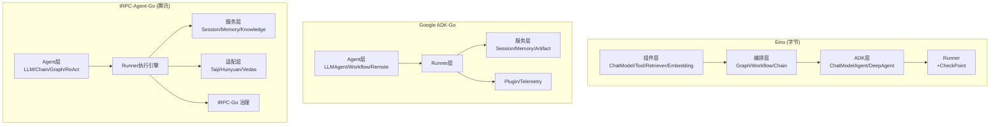

---

# Go Agent 框架对比分析

## 一、三个框架概述

### 1. Eino (CloudWeGo / 字节跳动)

**定位**：Go 语言 LLM 应用开发框架，借鉴 LangChain、Google ADK 等，按 Go 惯例设计。

**核心架构层次**：
```
组件层 (Components) → 编排层 (Compose) → ADK层 (Agent开发套件) → 扩展层 (EinoExt)
```

**关键特性**：
- **组件抽象**：`ChatModel`、`Tool`、`Retriever`、`Embedding`、`ChatTemplate` 等可复用模块
- **ADK 智能体**：`ChatModelAgent`（ReAct循环）、`DeepAgent`（复杂任务分解+子Agent协调）、`WorkflowAgent`（Sequential/Loop/Parallel 三种模式）
- **Graph 编排**：基于 DAG 的图编排，支持分支、并行、条件路由，编排结果可包装成 Tool 给 Agent 调用
- **流式处理**：框架自动处理流拼接、装箱、合并、复制
- **中断/恢复**：任意 Agent 或 Tool 可暂停等待人工输入，从 CheckPoint 恢复
- **回调切面**：OnStart/OnEnd/OnError 等固定切点注入日志、追踪、指标

**Agent 接口定义**（来自 [interface.go](D:/UGit/Go-Agent/eino/adk/interface.go)）：
```go
type Agent interface {
    Name(ctx context.Context) string
    Description(ctx context.Context) string
    Run(ctx context.Context, input *AgentInput, options ...AgentRunOption) *AsyncIterator[*AgentEvent]
}
```

**Runner 设计**（来自 [runner.go](D:/UGit/Go-Agent/eino/adk/runner.go)）：
- 轻量级 Runner，负责 Agent 生命周期管理
- 支持 `Run`、`Query`、`Resume`、`ResumeWithParams` 方法
- 可选 `CheckPointStore` 用于中断持久化

---

### 2. Google ADK-Go (Google)

**定位**：Google 官方 Agent 开发套件的 Go 版本，code-first、模型无关、部署无关。

**核心架构层次**：
```
Agent层 → Runner层 → Session/Memory/Artifact服务层 → Plugin/Telemetry层
```

**关键特性**：
- **Agent 类型**：`LLMAgent`（核心 LLM Agent）、`LoopAgent`、`ParallelAgent`、`SequentialAgent`、`RemoteAgent`（A2A 协议）、自定义 Agent（`agent.New`）
- **Plugin 系统**：Before/After Agent/Model/Tool 回调，全局插件管理
- **Session 管理**：完整的 Session Service 抽象，支持 InMemory 和数据库后端
- **Artifact 管理**：文件/数据产物的保存、加载、版本管理
- **Memory 服务**：跨 Session 的长期记忆检索
- **Telemetry**：OpenTelemetry 原生集成
- **A2A 协议**：Agent-to-Agent 远程调用支持

**Agent 接口定义**（来自 [agent.go](D:/UGit/Go-Agent/adk-go/agent/agent.go)）：
```go
type Agent interface {
    Name() string
    Description() string
    Run(InvocationContext) iter.Seq2[*session.Event, error]
    SubAgents() []Agent
    internal() *agent
}
```

**Runner 设计**（来自 [runner.go](D:/UGit/Go-Agent/adk-go/runner/runner.go)）：
- 必须指定 `SessionService`
- 自动管理 Session 中的 Agent 树遍历，找到正确的 Agent 继续对话
- 支持 Plugin 生命周期管理
- 通过 `iter.Seq2` (Go 1.22+ range-over-func) 返回事件流

---

### 3. tRPC-Agent-Go (腾讯)

**定位**：tRPC 框架的 Agent 实现，面向企业级分布式 AI 应用，深度整合腾讯内网生态。

**核心架构层次**：
```
底层 (Agent接口抽象) → 中间层 (Runner执行引擎 + Session/Memory/Knowledge) → 上层 (适配器+协议集成)
```

**关键特性**：
- **Agent 类型**：`LLMAgent`、`ChainAgent`、`ParallelAgent`、`CycleAgent`、`GraphAgent`（对标 LangGraph）、`ReActAgent`
- **多平台适配**：Taiji、Hunyuan、Vedas、Knot、LKE、Eino 等 AI 平台
- **企业级服务治理**：基于 tRPC-Go 的超时、重试、北极星寻址、连接池等
- **Knowledge 知识库**：完整的 RAG 链路（tRAG、Taiji RAG）
- **Skill 技能系统**：Claude Skills 能力
- **Planner 规划器**：Agent 计划和推理能力
- **可视化编排**：Agent Builder（拖拽式编排，可一键导出代码）
- **多协议支持**：OpenAI、A2A、MCP、AG-UI
- **可观测性**：伽利略 + 智研监控

**Agent 接口定义**（来自 Wiki 知识库）：
```go
type Agent interface {
    Run(ctx context.Context, invocation *Invocation) (event.EventChannel, error)
    SubAgents() []Agent
    Tools() []tool.Tool
    FindSubAgent(name string) (Agent, bool)
    Info() Info
}
```

**Runner 设计**：
- 中心协调器角色，管理 Agent 全生命周期
- 串联 Session/Memory/Knowledge 服务
- 插件机制：BeforeModel/AfterModel/BeforeTool/AfterTool/BeforeAgent/AfterAgent
- 事件流通过 channel 在组件间传递

---

## 二、多维度对比

| 维度 | **Eino (字节)** | **Google ADK-Go** | **tRPC-Agent-Go (腾讯)** |
|------|----------------|-------------------|------------------------|
| **开源方** | CloudWeGo (字节跳动) | Google | tRPC-Group (腾讯) |
| **语言** | Go 1.18+ | Go 1.22+ (iter.Seq2) | Go 1.19+ |
| **定位** | LLM 应用框架 | Agent 开发套件 | 企业级 Agent 框架 |
| **Agent 接口** | `Run() *AsyncIterator` | `Run() iter.Seq2` | `Run() EventChannel` |
| **事件流模型** | AsyncIterator (自定义) | iter.Seq2 (标准库) | Channel |
| **Agent 类型** | ChatModel, Deep, Sequential, Loop, Parallel | LLM, Sequential, Loop, Parallel, Remote(A2A), Custom | LLM, Chain, Parallel, Cycle, Graph, ReAct |
| **编排能力** | Graph (DAG) + Workflow ⭐ | Workflow Agents | StateGraph (对标 LangGraph) ⭐ |
| **多 Agent** | DeepAgent + AgentTool | SubAgent 树 + Agent Transfer | Team (Coordinator/Handoff) + SubAgent |
| **工具系统** | BaseTool + compose.ToolsNode | FunctionTool + MCP | FunctionTool + MCP + OpenAPI |
| **Session** | 轻量(SessionValues) | 完整 Session Service | 完整 Session Service (多后端) |
| **Memory** | 无独立模块 | Memory Service | Memory Service (多后端) |
| **Knowledge/RAG** | Retriever + Indexer 抽象 | 无内置 | 完整 RAG 链路 ⭐ |
| **中断/恢复** | ⭐ CheckPoint 持久化 | Tool Confirmation | Tool Interrupt |
| **流式处理** | ⭐ 自动流拼接/合并 | 基本流式 | 流式事件推送 |
| **Planner** | 无 | 无 | ⭐ Planner 接口 |
| **Skill** | 无 | 无 | ⭐ Claude Skills |
| **模型支持** | OpenAI/Claude/Gemini/Ollama... | Gemini 优化，模型无关 | OpenAI/Hunyuan/Taiji/Venus... |
| **可观测性** | 回调切面 | OpenTelemetry | 伽利略 + 智研 + OTel |
| **服务治理** | 无 | 无 | ⭐ tRPC-Go (北极星/重试/超时) |
| **部署形态** | 库引用 | 库/Cloud Run/A2A | tRPC 服务/AG-UI/A2A/OpenAI |
| **脚手架** | 无 | 无 | ⭐ `trpc agent` 命令 |
| **可视化** | Eino Devops | ADK Web | Agent Builder ⭐ |

---

## 三、架构对比图



---

## 四、其他常见 Agent 架构/框架

除了这三个 Go 框架，业界还有以下主流 Agent 架构值得关注：

### 1. **LangChain / LangGraph** (Python/JS)
- **最成熟**的 LLM 应用框架生态
- LangGraph 引入了 **有状态图编排**，是 Graph Agent 的标杆实现
- 提供 LCEL (LangChain Expression Language) 链式表达
- tRPC-Agent-Go 的 GraphAgent 明确对标 LangGraph

### 2. **CrewAI** (Python)
- 专注于 **多 Agent 角色协作**（Crew 概念）
- 每个 Agent 有明确的 Role、Goal、Backstory
- 支持 Sequential 和 Hierarchical 两种 Process
- 类似 tRPC-Agent-Go 的 Team/Coordinator 模式

### 3. **AutoGen** (Microsoft, Python)
- 微软开源，强调 **多 Agent 对话** 和 **Human-in-the-Loop**
- Agent 之间通过消息传递协作
- 支持 Group Chat 模式，多 Agent 轮流发言
- 灵活的对话终止条件

### 4. **OpenAI Swarm** (Python)
- OpenAI 出品，极简的 **多 Agent 编排** 框架
- 核心概念：Agent + Handoff（Agent 间移交）
- 无状态设计，轻量级
- tRPC-Agent-Go 的 Transfer/Handoff 机制与此类似

### 5. **Google ADK Python / Java**
- ADK-Go 的 Python/Java 版本，功能更丰富
- 完整的 A2A (Agent-to-Agent) 协议支持
- Vertex AI 深度集成

### 6. **Semantic Kernel** (Microsoft, C#/Python)
- 微软另一个 Agent 框架，面向企业
- 强调 **Plugin** 和 **Planner** 概念
- 与 Azure OpenAI 深度集成

---

## 五、对比总结与选型建议

| 场景 | 推荐框架 | 理由 |
|------|---------|------|
| **字节内部 / CloudWeGo 生态** | **Eino** | 强大的编排能力，流式处理最优，中断/恢复机制完善 |
| **Google Cloud / Gemini 生态** | **Google ADK-Go** | 官方支持，A2A 协议原生，Cloud Run 部署友好 |
| **腾讯内部 / tRPC 生态** | **tRPC-Agent-Go** | 完整的企业级治理、内网 AI 平台深度集成、可视化编排 |
| **需要强大图编排** | **Eino** > **tRPC-Agent-Go** | Eino 的 compose 包功能最丰富；tRPC 的 GraphAgent 对标 LangGraph |
| **需要 RAG 能力** | **tRPC-Agent-Go** > **Eino** | tRPC 有完整的 RAG 链路和多知识库支持 |
| **需要最小化依赖** | **Google ADK-Go** | 最轻量，依赖最少，接口最简洁 |
| **多 Agent 协作** | **tRPC-Agent-Go** ≈ **Eino** | 两者都有丰富的多 Agent 模式 |
| **生产级服务治理** | **tRPC-Agent-Go** | tRPC-Go 框架的北极星/超时/重试/监控等治理能力 |

**总结**：
- **Eino** 的优势在于**编排能力最强**（Graph/Workflow + 流式自动处理），以及**中断/恢复机制最完善**
- **Google ADK-Go** 的优势在于**接口最简洁**，利用了 Go 1.22 的 `iter.Seq2`，代码最地道
- **tRPC-Agent-Go** 的优势在于**企业级全栈能力最完整**，从 Agent 到服务治理到可视化编排一站式解决