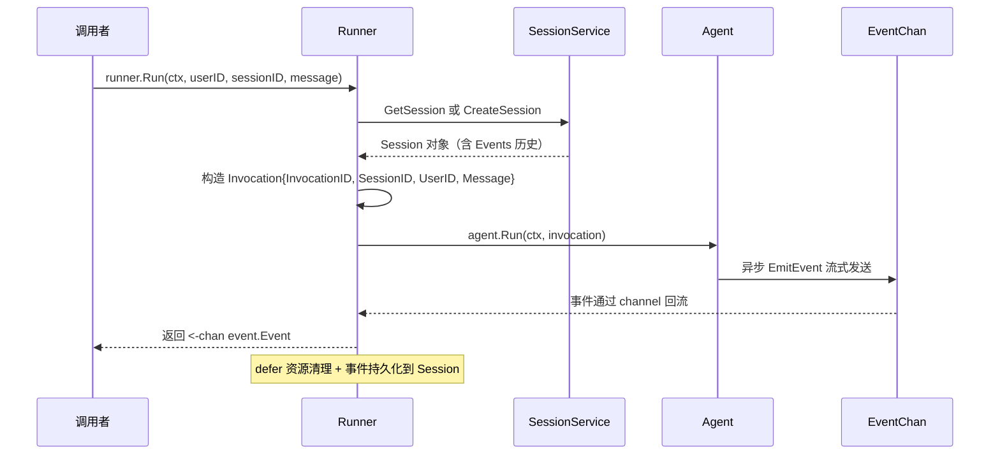
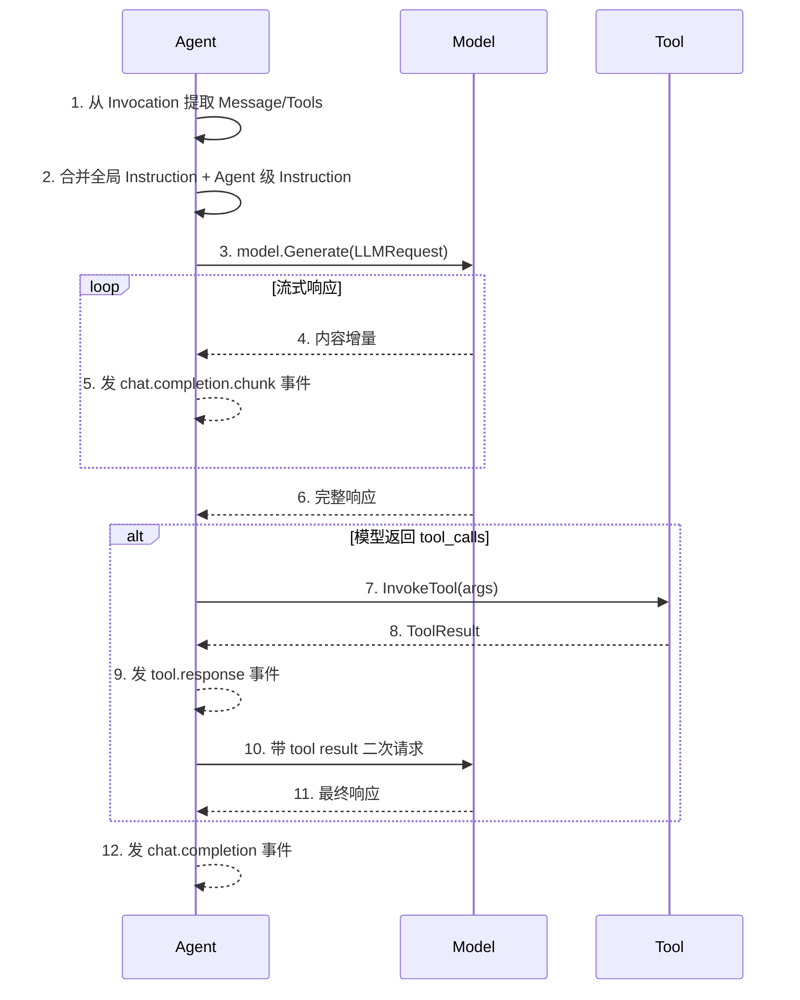
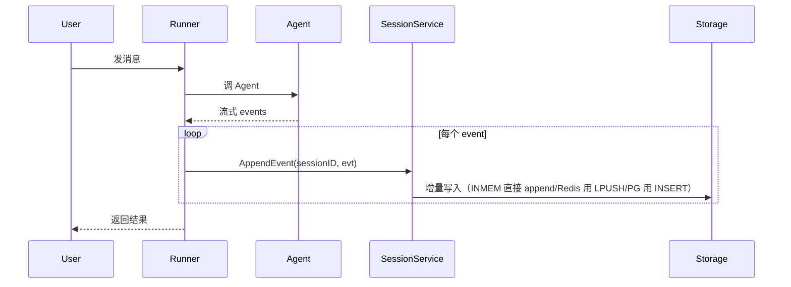
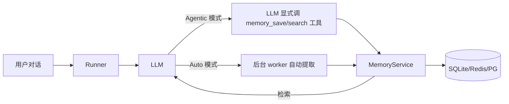
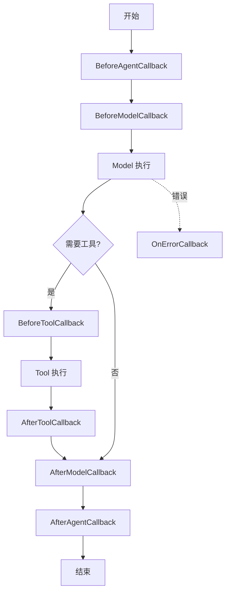

# 🔧 框架内部机制速查 · trpc-agent-go 黑盒拆白

> 📌 **本文档目标**：解决"这块是框架做的——那框架是怎么做的？"这个翻车追问。
> 把面经/INTERVIEW.md 中所有标 🟢/🟡 的"框架完成"项展开到**源码级别细节**。
>
> 配套资料：
> - [framework_vs_self.md](framework_vs_self.md)：边界拆解 + 自研亮点
> - [markDown1779416409534.md](markDown1779416409534.md)：原题 + 题后补注
> - [../project-agent/INTERVIEW.md](../project-agent/INTERVIEW.md)：自我答辩稿
>
> **使用方式**：被追问"框架是怎么实现的"时，按下面 8 个模块对号入座，**3 句话讲清核心机制**。

---

## 一、Runner 执行机制（被追问最多）

### 1.1 Runner 是什么

> Runner 是 Agent 执行容器，**串联 Session/Memory/Tool 服务**，把 Agent 的 `Run(ctx, invocation)` 包装成简洁的 `Run(ctx, userID, sessionID, message)` 接口。

### 1.2 内部执行流程（必背）



**6 阶段细节**：
1. **延迟创建**：Server 端首次请求时 `getRunner(appName)` 才创建实例，**带读写锁缓存**——读锁查缓存，写锁建实例，避免并发重建。
2. **Session 加载**：调 `SessionService.GetSession`，没命中就 `CreateSession`；返回的 Session 含 `Events []event.Event` 全量历史 + `State map[string]any` 自定义状态。
3. **Invocation 构建**：每次 Run 创建独立 Invocation 对象（含 InvocationID 唯一标识），用于后续 OTel span 关联。
4. **事件流采集**：Agent 通过 `EmitEvent` 把生产者事件丢进 channel，Runner 是消费者，**异步聚合 + 按 SSE/HTTP 推送**。
5. **持久化**：每个事件写入 Session.Events 追加（append-only，不重写）。
6. **资源清理**：defer 释放 Session 锁、关闭 channel、flush OTel span。

### 1.3 5 种核心事件类型

| 事件 | 触发 | 关键字段 |
|---|---|---|
| ResponseEvent | 模型生成内容 | Choices / Message / Delta |
| TokenStatEvent | Token 统计 | PromptTokens / CompletionTokens / TotalTokens |
| ToolCallEvent | 工具调用 | ToolName / Arguments / Result |
| CompletionEvent | 任务完成 | Done=true / FinishReason |
| ErrorEvent | 异常 | Error / Type / Message |

### 1.4 两层超时控制（被追问点）

| 层 | 控制方式 | 推荐值 | 超时行为 |
|---|---|---|---|
| 全局 | `context.WithTimeout` | 30-120 秒 | 整个 Run 取消，触发 Done |
| 请求级 | `openaiopt.WithRequestTimeout` | 30 秒 | 断网络连接，单次调用失败 |

> **实际超时 = min(ctx deadline, 请求 timeout)**——这是面试官最爱挖的坑。

### 1.5 ManagedRunner（高级用法）

> 实现 `ManagedRunner` 接口可调 `SetDeadline` 动态设置截止时间，**生产场景中用于"剩余预算"管理**：用户 token 配额快用完时，主动给 Runner 设个短 deadline。

---

## 二、Agent 执行引擎（5 种 Agent 区别必背）

### 2.1 5 种 Agent 类型

| Agent | 执行方式 | 关键 Option | 我项目用了吗 |
|---|---|---|---|
| **LLMAgent** | 单模型调用 | `WithModel/WithTools/WithInstruction/WithGenerationConfig` | ✅ Coordinator + 4 子 Agent 都是 |
| **ChainAgent** | 顺序串行 | `WithSubAgents` | ❌（我们用 transfer 而非链式） |
| **ParallelAgent** | 并发执行 | `WithSubAgents` + `WithMaxConcurrency` | ❌ |
| **CycleAgent** | 循环迭代（生成→评估→改进） | `WithSubAgents` + `WithMaxIterations` | ❌ |
| **GraphAgent** | 状态机/DAG 编排 | `AddNode/AddEdge/AddConditionalEdges/AddSubgraphNode` | ❌（够轻量场景用 transfer） |

### 2.2 LLMAgent 内部执行流程



**关键细节**：
- **WithPreloadMemory(N)**：自动从 MemoryService 拉 top-N 条历史记忆注入 prompt 头部；
- **GenerationConfig**：MaxTokens / Temperature / TopP / Stream / ToolChoice 五件套；
- **EndInvocationAfterTransfer**：transfer 后立即结束本轮，防止父 Agent "抢话"——我项目就用这个防 a2a 死循环。

---

## 三、Tool 系统三层架构（被追问"MCP schema 怎么生成"）

### 3.1 三层架构

```
┌─────────────────────────────────────┐
│ 工具集层 (ToolSet)                   │
│   Name() / Tools() / Close()         │  ← 生命周期管理
├─────────────────────────────────────┤
│ 工具接口层                           │
│   Tool / CallableTool /              │
│   InvokableTool / StreamableTool     │  ← 4 种工具能力抽象
├─────────────────────────────────────┤
│ Schema 转换层                        │
│   Declaration() →                    │
│   convertParameterTypeToSchema →    │  ← Go struct + jsonschema tag
│   convertMapToSchema (递归)         │     → JSON Schema
└─────────────────────────────────────┘
```

### 3.2 关键接口

```go
type Tool interface {
    Name() string
    Info() *Info
    Declaration() *Declaration  // 返回工具声明（含 InputSchema）
}

type CallableTool interface {
    Tool
    Call(ctx context.Context, jsonArgs []byte) (any, error)
}

type StreamableTool interface {
    Tool
    StreamCall(ctx, jsonArgs) (StreamReader, error)  // 长任务分块返回
}
```

### 3.3 Schema 是怎么自动生成的（必背）

```go
type myToolRequest struct {
    Input string `json:"input" jsonschema:"description=Input description,required"`
    Limit int    `json:"limit" jsonschema:"default=10,minimum=1,maximum=100"`
}

func handler(_ context.Context, req myToolRequest) (myToolResponse, error) { ... }

tool := function.NewFunctionTool(handler,
    function.WithName("my_tool"),
    function.WithDescription("Tool description"),
)
```

**框架内部 5 步反射**：
1. `reflect.TypeOf(req)` 拿到 myToolRequest 的反射类型；
2. 遍历字段，读取 `json:` tag 拿字段名，`jsonschema:` tag 拿描述/约束；
3. 递归处理嵌套结构（map/slice/struct）；
4. 提取 8 个标准 JSON Schema 字段：`type / description / required / properties / items / default / enum / $ref`；
5. 输出符合 OpenAI Function Calling 规范的 InputSchema。

> **回答模板**："框架用 `reflect` + `jsonschema` tag 把 Go struct 自动转成 JSON Schema，喂给 LLM。我项目里写工具就是定义 request struct + handler 函数两步。"

### 3.4 MCP 三种传输方式

| Transport | 通信 | 适用 | 优势 | 劣势 |
|---|---|---|---|---|
| **STDIO** | stdin/stdout JSON-RPC | 本地子进程 | 低延迟、简单 | 不能跨机 |
| **SSE** | HTTP 长连接单向推送 | Web 场景 | 浏览器兼容 | 单向 |
| **Streamable HTTP** | HTTP POST 双向流 | 通用场景 | 协议通用 | 需处理流 |

我项目 `mcp_servers.yaml` 配的是 **Streamable HTTP**——蓝鲸/BCS/工蜂 MCP server 都跑在远端，需要 HTTP 跨服务调用。

### 3.5 Tool 调用完整链路

```
LLM 输出 tool_call → Runner 解析 ToolCall 列表 →
找到 Tool 实例 → tool.Call(ctx, jsonArgs) →
返回结果封装为 ToolMessage → 二次喂给 LLM → 最终响应
```

---

## 四、Session 持久化机制（被追问"5 天连续对话怎么不忘"）

### 4.1 Session 实体

| 字段 | 类型 | 作用 |
|---|---|---|
| ID | string | 唯一标识，建议 `chat-session-{timestamp}` |
| AppName | string | 多应用隔离 key |
| UserID | string | 多用户隔离 key |
| State | `map[string]any` | 自定义状态数据（如"goal"目标钉、"tenant_id"租户等） |
| Events | `[]event.Event` | 事件流历史（核心） |

### 4.2 增量持久化（关键设计）

> Session 不是每次全量 dump，而是**每个事件 append-only 追加**，避免大 session 序列化开销。



### 4.3 三种存储后端对比

| 后端 | 持久化 | 适用 | TTL | 我项目用 |
|---|---|---|---|---|
| InMemory | ❌ 进程内 | 单机 demo / 测试 | ❌ | dev 环境 |
| Redis | ✅ 跨进程 | 生产、多副本 | ✅ EXPIRE 自动清 | 生产环境 |
| PostgreSQL | ✅ 完整持久 | 长期审计、强一致 | 应用层维护 | ❌ |

### 4.4 自动总结机制（**亮点**）

> 长对话超过阈值，框架自动把旧 events 压缩成 summary，**省 token + 防超 context**。

```go
sessionService, _ := sessionredis.NewService(
    sessionredis.WithURL("redis://..."),
    sessionredis.WithAsyncSummaryNum(2),       // 2 个 worker 并发跑总结
    sessionredis.WithSummaryQueueSize(100),    // 排队队列 100
    // 触发条件 3 选 1：
    sessionredis.WithSummaryTrigger(summary.CheckEventThreshold(20)),    // 20 条 events
    sessionredis.WithSummaryTrigger(summary.CheckTokenThreshold(4000)), // 4k token
    sessionredis.WithSummaryTrigger(summary.CheckTimeThreshold(5*time.Minute)), // 5 分钟静默
)
```

**降级**：如果 SummaryModel 不可用（API 挂了），框架自动 fallback 到纯 events 模式，**不影响主链路**。

### 4.5 Session 隔离怎么做

> AppName + UserID 组合 key 物理隔离。Redis 后端 key 是 `session:{appName}:{userID}:{sessionID}`，根本看不到别人的。

---

## 五、Memory 长短期记忆（被追问"Memory 和 Session 啥区别"）

### 5.1 Memory vs Session 一表区分

| 维度 | Session | Memory |
|---|---|---|
| 范围 | 单会话 | 跨会话（用户级） |
| 生命周期 | 会话结束可清 | 长期保留 |
| 数据 | events 全量历史 | 提取后的偏好/事实 |
| 检索 | 按时间序读 | 关键词 / 向量 / 混合 |
| 框架接口 | `SessionService` | `MemoryService` |

### 5.2 两种工作模式（必答）



| 模式 | 优势 | 劣势 |
|---|---|---|
| **Agentic** | LLM 完全控制、决策可解释 | 增加 LLM 思考负担 |
| **Auto** | 透明、无侵入 | 提取规则黑盒 |

> 我项目偏好"用户习惯查 letsgo 集群"这类轻信息走 **Agentic**——LLM 调 `memory_save` 工具显式存。

### 5.3 内置工具（默认禁用 delete，需手动启用）

```go
memoryService := memoryinmemory.NewMemoryService(
    memoryinmemory.WithToolEnabled(memory.DeleteToolName, true), // 默认禁用，要显式开
)
```

---

## 六、Callbacks / Plugin 钩子机制（被追问 "AOP 是怎么注入的"）

### 6.1 6 个回调钩子点



### 6.2 我项目里 4 个 callback 的注入点

| Callback | 用途 | 自研代码 |
|---|---|---|
| BeforeModelCallback | 注入检测、prompt 重写 | `src/plugin/input_guard.go` |
| AfterModelCallback | PII 脱敏、事实校验 | `src/plugin/output_guard.go` |
| BeforeToolCallback | **HITL 拦截**（高危工具暂停等审批） | `src/plugin/safety_guard.go` |
| AfterToolCallback | HMAC 审计落盘 | `src/plugin/audit_hook.go` |

### 6.3 Callback vs Plugin 区别

| 维度 | Callback | Plugin |
|---|---|---|
| 范围 | Agent 级（每个 Agent 独立） | Runner 级（全局生效） |
| 初始化 | 每次 Agent 创建时绑 | Runner 仅初始化一次 |
| 钩子点 | 6 个（含 Tool） | 4 个（BeforeAgent/Model + AfterAgent/Model） |
| 用途 | 业务逻辑（Guard / Audit） | 横切关注（监控 / 限流） |

> 我项目把 input_guard/output_guard/safety_guard/audit_hook 都做成 **Callback**，因为它们是业务相关的——Diagnosis Agent 的 Guard 规则和 Repair Agent 不一样。

### 6.4 自定义返回值机制

> Callback 可以**通过 context 提前返回结果**，跳过后续真实调用——这是 HITL 暂停的核心：safety_guard 在 BeforeToolCallback 里返回"等待审批"假结果，工具压根不执行。

---

## 七、Knowledge / RAG 框架机制（被追问"RAG 流程"）

### 7.1 BuiltinKnowledge 4 件套

```
Loader（加载文档）→ Chunker（切片）→ Embedder（向量化）→ VectorStore（存向量库）
                                                                    ↓
查询时：query → Embedder → VectorStore.Search(top-k) → 注入 prompt
```

### 7.2 框架支持的组件矩阵

| 模块 | 框架内置实现 |
|---|---|
| Loader | File / URL / Markdown / PDF |
| Chunker | FixedSize / Markdown / Sentence |
| Embedder | OpenAI / 内部 BGE-M3 / Hunyuan |
| VectorStore | InMemory / pgvector / TcVector / Milvus |
| Reranker | 内部 reranker 模型 |

### 7.3 Agentic RAG（我项目用的）

```go
knowledge := builtin.NewKnowledge(
    builtin.WithEmbedder(embedder),
    builtin.WithVectorStore(store),
    builtin.WithChunker(chunker),
)
// 把 knowledge 包装成 Tool
searchTool := knowledgetool.NewTool(knowledge,
    knowledgetool.WithName("knowledge_search"),
    knowledgetool.WithDescription("查 Runbook/FAQ/Incident，问运维问题前先查这里"))
```

> LLM 自主决定调不调 `knowledge_search`——这就是 Agentic RAG。我项目里 KnowledgeAgent 把它挂在工具列表里。

---

## 八、A2A 协议（跨进程子 Agent，被追问最重）

### 8.1 SubAgent vs A2A 区别

| 维度 | 本地 SubAgent | A2A Remote |
|---|---|---|
| 通信 | 同进程函数调用 | HTTP 跨服务 |
| 配置 | `WithSubAgents([]agent.Agent{sub})` | `a2aagent.New(WithAgentCardURL(url))` |
| 部署 | 单 binary | 独立服务 |
| Session | 共享 | 通过 TransferStateKey 传递 |

### 8.2 A2A 关键 API

```go
// 客户端：把远程 Agent 包装成本地 Agent
a2aAgent := a2aagent.New(
    a2aagent.WithAgentCardURL("http://remote:8888"),  // Agent Card 描述端点
    a2aagent.WithName("technical_support"),
    a2aagent.WithTransferStateKey("meta"),  // 状态透传 key
)

// 像本地 Agent 一样用
parentAgent := llmagent.New("coordinator",
    llmagent.WithSubAgents([]agent.Agent{a2aAgent}),
)
```

### 8.3 Agent Card 是什么

> Agent Card = `/.well-known/agent.json`——A2A 协议规定的 **Agent 元信息描述**，类似 OpenAPI。包含 name / description / capabilities / endpoints。客户端先 fetch agent card，再按描述调实际接口。

### 8.4 状态透传机制

```go
// 父端 Run 时通过 RuntimeState 传
runner.Run(ctx, userID, sessionID, msg,
    agent.WithRuntimeState(map[string]any{"meta": "tenant=foo"}))

// 子端 Agent 通过 invocation 读
inv, _ := agent.InvocationFromContext(ctx)
meta := inv.RunOptions.RuntimeState["meta"].(string)
```

### 8.5 我项目里 A2A 怎么用的

> 我项目**默认不开 A2A**——4 个子 Agent 都是 in-process（性能更好）。但通过 build tag `+build a2a_real` / `+build a2a_stub` 提供了 A2A 服务端，**给外部 Agent 调用我们的 RepairAgent 留了口子**。
> 配置见 `src/services/a2a/a2a_real.go`，注入到 tRPC 服务通过 `RegisterToTRPC`。

### 8.6 A2A 防 a2a 死循环（**亮点话术**）

| 层 | 措施 |
|---|---|
| 框架 | `WithEndInvocationAfterTransfer(true)` 单轮一次 transfer |
| Agent Card | 不暴露 `recursive_capable: true` |
| Prompt | system 明令"单轮一次 Transfer" |
| 监控 | OTel `agent.transfer.depth` Prometheus 告警 |

---

## 九、Debug Server（被追问"你怎么调试 Agent 流程的"）

### 9.1 7 个 REST API 端点

| 路径 | 方法 | 功能 |
|---|---|---|
| `/list-apps` | GET | 列出所有 Agent 应用 |
| `/apps/{app}/users/{u}/sessions` | GET/POST | 会话列表/创建 |
| `/apps/{app}/users/{u}/sessions/{sid}` | GET | 会话详情 |
| `/run` | POST | Agent 非流式执行 |
| `/run_sse` | POST | Agent SSE 流式执行 |
| `/debug/trace/{event_id}` | GET | 单事件 trace |
| `/debug/trace/session/{session_id}` | GET | 整 session trace |

### 9.2 关键技术点

- **gorilla/mux** 路由器 + **gorilla/cors** CORS 中间件；
- **DetachedContext**：HTTP 请求超时不影响 Agent 执行（Agent 跑 5 分钟也行，HTTP 30 秒断开了无所谓，重连可恢复）；
- **InMemoryExporter**：OTel span 内存暂存，按 session_id → []trace_id 索引；
- **ADK 格式转换**：内部 event 自动转 Google ADK Web UI 兼容格式，**不用自己写前端**。

> 我项目调试基本靠 ADK Web UI（trpc-agent-go 自带），点几下就能看到完整 trace。

---

## 十、Plugin 内部机制（与 Callback 区分）

### 10.1 Plugin 接口

```go
type Plugin interface {
    Name() string
    BeforeAgent(ctx, invocation) error
    BeforeModel(ctx, request) error
    AfterModel(ctx, request, response) error
    AfterAgent(ctx, invocation, events) error
}

runner := runner.NewRunner("app", agent,
    runner.WithPlugins([]Plugin{metricsPlugin, tracingPlugin}),
)
```

### 10.2 单例语义

> **每个 Runner 实例只初始化一次 Plugin**，钩子函数在每次执行时被调用——所以 Plugin 适合做**全局监控埋点 / 限流器 / 配额扣费**这类横切关注。

---

## 📌 面试场景模拟：5 个高频追问的标准答法

### Q1：你说用了 Runner，那 Runner 内部是怎么做的？

> Runner 是 Agent 执行容器。内部 6 步：① 延迟创建 + 读写锁缓存；② 调 SessionService 加载/创建会话拿 Events 历史；③ 构 Invocation 对象（含唯一 InvocationID）；④ 注入 Session/Memory/Tool 三个服务能力；⑤ 调 `agent.Run(ctx, invocation)` 拿 EventChan；⑥ 流式聚合事件，append 到 Session.Events，defer 清理资源。两层超时控制：`context.WithTimeout` 全局 + `WithRequestTimeout` 单请求，**实际超时取 min**。

### Q2：MCP schema 是你写的吗？怎么生成的？

> 不是手写。框架用 Go 反射：定义 request struct + `jsonschema:` tag，`function.NewFunctionTool` 内部调 `convertParameterTypeToSchema`，递归处理 properties/items/required/enum 等 8 个 JSON Schema 字段，最后输出 OpenAI Function Calling 兼容的 schema。MCP 协议则是 JSON-RPC 2.0 over STDIO/SSE/Streamable HTTP，框架通过 `mcp.NewMCPToolSet` 自动从远端 MCP server 发现工具列表。

### Q3：Session 自动总结是怎么实现的？不会卡主链路吗？

> 框架的 SessionService 内置 Summarizer，三档触发器（事件数 20 / token 4000 / 静默 5 分钟），任一命中就异步触发。**核心是异步**：`WithAsyncSummaryNum(2)` 起 2 个 worker，`WithSummaryQueueSize(100)` 排队队列；触发后丢队列就返回，**不阻塞 Run 流程**。降级策略：SummaryModel 调失败就回退到纯 events 模式，主链路零回归。

### Q4：HITL 你说在 BeforeToolCallback 里拦截，框架是怎么允许你提前返回结果的？

> 框架 callback 有"自定义返回值机制"——callback 函数可以通过 context 直接返回一个假的 ToolResult，框架检测到就**跳过真实工具执行**。我利用这点实现 HITL：safety_guard 检测到高危写工具，往 SSE 推 `confirmation_required` 事件，同时 callback 返回 `{status: "pending_approval", plan: {...}}`，工具不真跑。用户 approve 后 LLM 重入同一工具带 `confirmed=true`，这次 callback 放行。

### Q5：A2A 协议和 SubAgent 区别？

> SubAgent 是同进程函数调用、共享 Session、性能高；A2A 是跨进程 HTTP 调用、独立部署、需通过 `WithTransferStateKey` 显式传状态。两者**都实现 `agent.Agent` 接口**，对父 Agent 透明。A2A 关键是 **Agent Card**——`/.well-known/agent.json` 描述 Agent 能力的元信息（类似 OpenAPI），客户端先拉 Card 再调实际端点。我项目默认 in-process SubAgent，但 A2A 服务端开了，**用 build tag stub/real 双实现**适配离线 CI。

---

## 🗂 框架源码速查表（被追问"源码看过吗"）

| 模块 | 关键源文件 | 一句话总结 |
|---|---|---|
| Runner | `runner/runner.go` | NewRunner + Run + Close |
| LLMAgent | `agent/llmagent/agent.go` | Run 内部 4 阶段循环 |
| Session | `session/inmemory/`, `session/redis/` | events append + summary 异步 |
| Memory | `memory/inmemory/`, `memory/redis/` | tool-based agentic 存取 |
| Tool 反射 | `tool/function/function_tool.go` | reflect + jsonschema → InputSchema |
| MCP Client | `tool/mcp/` | trpc-mcp-go 包装 |
| Callbacks | `agent/llmagent/callback.go` | 6 钩子点 |
| Plugin | `runner/plugin.go` | 4 钩子点 + 单例 |
| A2A Client | `agent/a2aagent/a2a.go` | AgentCardURL fetch + HTTP |
| Debug Server | `server/debug/server.go` | 7 个 REST 端点 + ADK 转换 |

> **被问到具体源码细节**："这部分我读过 `xx.go` 大概行号 100-200，关键是 yy 实现"——能说出文件名 + 大概范围就够了。

---

## ✅ 结尾自检：5 个"绝对不能答错"的问题

- [ ] Runner 和 Agent 谁是谁的容器？（**Runner 是 Agent 的容器**）
- [ ] Session 和 Memory 区别？（**短期单会话 vs 长期跨会话**）
- [ ] Function Calling 和 MCP 关系？（**前者是模型协议、后者是工具进程间协议，正交**）
- [ ] Callback 和 Plugin 区别？（**Agent 级 6 钩子 vs Runner 级 4 钩子单例**）
- [ ] SubAgent 和 A2A 区别？（**同进程函数调用 vs 跨进程 HTTP 调用**）
