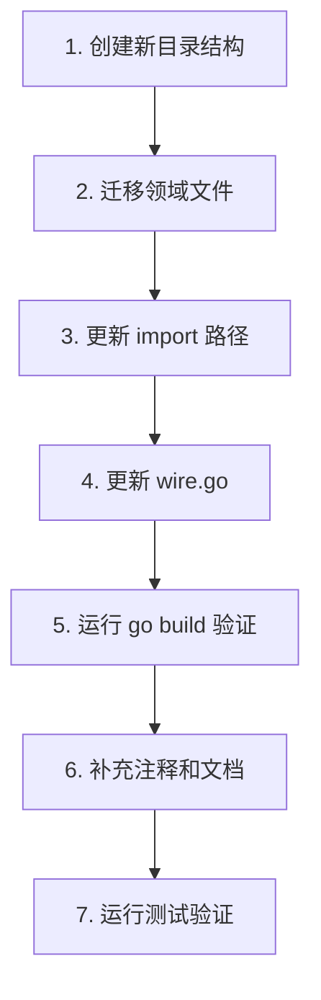

## 用户需求

使用 trpc-ddd-codegen skill 分析当前 oncall_agent 项目，检查是否符合 DDD 代码规范，并提出重构计划。

## 项目概述

oncall_agent 是一个基于 tRPC-Go 框架的魔方营销平台问题定位 Agent 服务，采用领域驱动设计（DDD）架构，包含多个 Agent（magic_oncall、magic_config、rule_engine、cdkey、span_analysis、repo）和工具（magic_tool、mcp_tool、trace_analysis 等）。

## 核心功能

- SSE/A2A/AGUI 服务接入
- 多 Agent 协作（问题定位、配置生成、规则引擎等）
- 外部服务集成（Galileo、Lingshan、Magic 配置数据库等）

## 技术栈

- **框架**: tRPC-Go
- **架构**: DDD（领域驱动设计）
- **依赖注入**: Wire
- **数据库**: MySQL（GORM）
- **配置中心**: Rainbow、Wuji

## 已符合规范的方面

| 项目 | 状态 | 说明 |
| --- | --- | --- |
| 项目根目录结构 | ✓ | main.go、wire.go、filter.go 位置正确 |
| reqFilter 注册 | ✓ | 已在 main.go 中注册 |
| Wire 依赖注入 | ✓ | wire.go 和 wire_gen.go 结构正确 |
| 领域接口分离 | ✓ | domain/interfaces/external/ 定义外部接口 |
| 基础设施层 | ✓ | infrastructure/external、repo、config 分离 |
| README 问题排查指南 | ✓ | 已包含日志字段说明和排查流程 |
| Dep 结构体模式 | ✓ | 依赖超过 5 个时使用 Dep 包装 |


## 发现的问题

### 1. 目录结构问题

**问题**: `domain/agents/` 和 `domain/tools/` 不符合 DDD 规范

**规范要求**:

```
domain/{domain_name}/
├── {domain}_api.go      # 导出接口 + Dep 结构体
├── {domain}_impl.go     # 业务逻辑实现
├── {domain}_mock.go     # mockgen 自动生成
├── interfaces/          # 该领域专属接口
└── models/              # 该领域专属模型
```

**当前结构**:

```
domain/agents/magic_oncall_agent/  # ❌ 应该是 domain/magic_oncall/
domain/tools/magic_tool/           # ❌ 应该是 domain/magic_tool/
```

### 2. 文件命名问题

| 当前命名 | 规范命名 | 说明 |
| --- | --- | --- |
| `magic_oncall_agent_api.go` | `magic_oncall_api.go` | 包名已包含 agent，无需重复 |
| `magic_oncall_agent_impl.go` | `magic_oncall_impl.go` | 同上 |
| `magic_tool_api.go` | `magic_tool.go` 或 `magic_tool_api.go` | 可保留 |


### 3. 缺失的规范内容

| 项目 | 说明 |
| --- | --- |
| 包级注释 | 部分文件缺少 `// Package xxx ...` 注释 |
| 导出符号注释 | 部分导出符号缺少以符号名开头的注释 |
| interfaces 子目录 | 各领域缺少专属的 `interfaces/` 目录 |


### 4. 目录完整性检查

| 目录 | 状态 | 说明 |
| --- | --- | --- |
| `infrastructure/cache/` | 缺失 | 如需本地缓存应创建 |
| `infrastructure/messaging/` | 缺失 | 如需消息队列应创建 |
| `tests/` | 缺失 | 集成测试/契约测试目录 |


## 重构方案

### 方案概述

采用渐进式重构，将 `domain/agents/` 和 `domain/tools/` 迁移到规范的 `domain/{domain_name}/` 结构。

### 重构步骤



## 目录结构变更详情

### 变更前

```
domain/
├── agents/
│   ├── cdk_agent/
│   ├── magic_config_agent/
│   ├── magic_oncall_agent/
│   ├── repo_agent/
│   ├── rule_engine_agent/
│   └── span_analysis_agent/
├── interfaces/external/
├── model/
└── tools/
    ├── cdkey_query/
    ├── lingshan_query/
    ├── log_query/
    ├── magic_tool/
    ├── mcp_tool/
    └── trace_analysis/
```

### 变更后

```
domain/
├── cdk/                          # 原 agents/cdk_agent
│   ├── cdk_api.go
│   ├── cdk_impl.go
│   └── cdk_mock.go
├── magic_config/                 # 原 agents/magic_config_agent
│   ├── magic_config_api.go
│   ├── magic_config_impl.go
│   └── magic_config_mock.go
├── magic_oncall/                 # 原 agents/magic_oncall_agent
│   ├── magic_oncall_api.go
│   ├── magic_oncall_impl.go
│   └── magic_oncall_mock.go
├── repo/                         # 原 agents/repo_agent
│   ├── repo_api.go
│   ├── repo_impl.go
│   └── repo_mock.go
├── rule_engine/                  # 原 agents/rule_engine_agent
│   ├── rule_engine_api.go
│   ├── rule_engine_impl.go
│   └── rule_engine_mock.go
├── span_analysis/                # 原 agents/span_analysis_agent
│   ├── span_analysis_api.go
│   ├── span_analysis_impl.go
│   └── span_analysis_mock.go
├── cdkey_query/                  # 原 tools/cdkey_query（保留）
│   └── cdkey_query_impl.go
├── lingshan_query/               # 原 tools/lingshan_query（保留）
│   └── lingshan_query_impl.go
├── log_query/                    # 原 tools/log_query（保留）
│   └── log_query_impl.go
├── magic_tool/                   # 原 tools/magic_tool（保留）
│   └── magic_tool_impl.go
├── mcp_tool/                     # 原 tools/mcp_tool（保留）
│   └── mcp_tool_impl.go
├── trace_analysis/               # 原 tools/trace_analysis（保留）
│   └── trace_analysis_impl.go
├── interfaces/external/          # 保留
└── model/                        # 保留
```

## Agent Extensions

### Skill

- **trpc-ddd-codegen**
- Purpose: 作为 DDD 代码规范参考，验证重构后的代码结构是否符合规范
- Expected outcome: 确保所有文件命名、目录结构、注释规范符合 DDD 标准