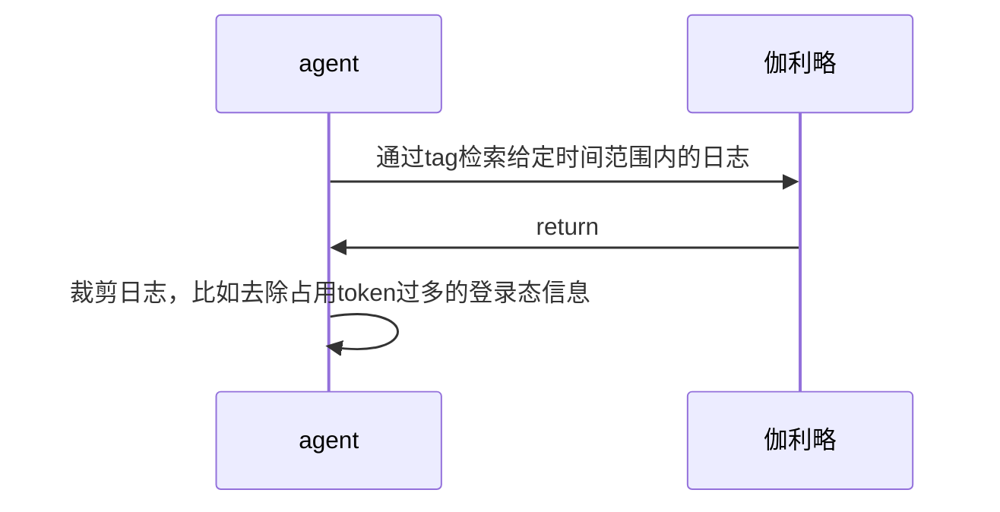
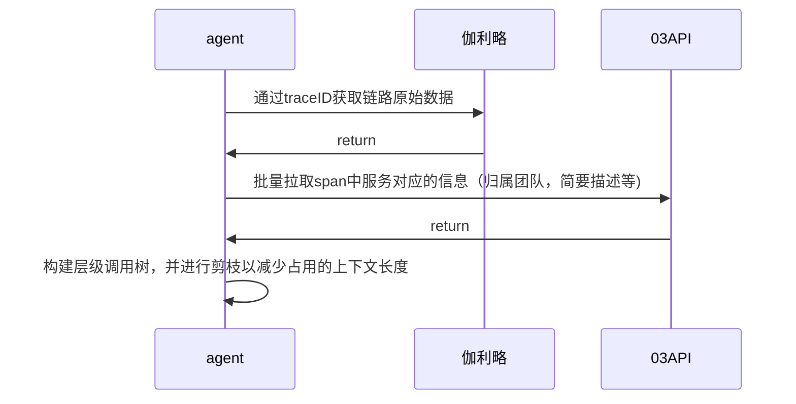

# 摘要
LLM驱动的AI agent在后台问题定位中展现了很大的潜力，特别是在长文本的总结、归纳方面效率显著优于人工。

本文讲解了腾讯视频-视频技术部在实现由AI驱动的问题自定定位系统的尝试。我们为[魔方营销平台](https://magic.woa.com/v5/)这一使用tRPC-go的微服务后台系统制作了问题定位agent，用户只需给定一些业务参数，agent即可自动查日志、分析trace、阅读相关代码实现问题定位，目前已投入线上使用并成功解决若干oncall问题。

由于本项目构建的agent具有通用性，理论上所有后台分布式系统经过适配后均可部署使用，因此在此分享其具体实现。
# 概述
Agent本质是在大模型API之上构建的上下文管理服务：agent后台服务需要将对于解决问题有效的信息加入到大模型上下文中，排除掉无关信息，以提高大模型回答准确率。Agent服务提供的业务特定工具可以让未对业务数据经过训练的大模型理解业务。

人工排查分布式后台系统的繁琐不必做多余赘述，相信多数开发深有体会。开发需要根据测试同学的自然语言描述定位到目标服务、查看相关日志以及trace，trace链路可能拥有上百个span，开发需要精确定位到其中关键的span后尝试理解请求的行为。若历史代码日志较为晦涩难懂或业务代码隐藏了真正报错原因，则开发还需查看代码才能够理解请求行为。我们希望能够构建agent服务自动化这一重复繁琐的流程，用户只需和agent对话即可获得若干请求的分析报告，即使是非技术背景的同事也可以明白请求行为。

具体来说，我们希望能自动化下图的流程：

该范式能解决绝大多数分布式微服务后台的问题定位，原因是：
- 大部分微服务后台有统一的接入层，请求首先会经过接入层服务，从而留下检索日志的入口（即使有少数不经过接入层的请求，如消息队列、定时任务、后台调用触发，其入口往往可以被穷举）。
- 在少量查询日志的入口服务中，可以增加日志上报的tag用于agent检索。如魔方平台中通过活动ID、模块ID、用户ID等检索接入层日志，若请求抽奖不中则会在日志中显示不中的原因。具体来说，魔方接入层上报给伽利略的样例用户领取请求日志如下图，重要信息在红框中标出:

- 一般系统的trace采样规则会将报错、高延迟、白名单用户触发的请求进行完整采样，因此大部分需要排查问题的trace都会被采样。trace中包含了每一次RPC调用的主被调以及请求和响应的包体内容，为进一步排查span行为提供信息。
- 检索各个span的服务日志时，可以使用traceID检索，从而因避免各个服务上报日志`tag`不同导致检索不到。
- 检索日志对应的代码上下文时，可以通过日志正文内容进行语义检索（knot代码知识库使用此方法）。另外日志中往往会包含打印该日志的代码在工蜂仓库中的位置，可以通过工蜂MCP直接拉取对应代码（仅devcloud环境可用）。

## 本项目业务背景-魔方营销平台
[魔方营销平台](https://magic.woa.com/v5/)是腾讯视频内部用于活动营销的平台，运营可在此通过可视化方式搭建营销活动，是典型的tRPC-go微服务分布式后台系统，架构图如下：

业务细节不在此赘述，若需查看可访问iwiki空间：https://iwiki.woa.com/space/Magic

对于oncall agent搭建，我们关心的是以下两点
- 有统一接入层，大部分用户请求经过接入层，少部分请求由消息队列/后台直调/定时触发，直接请求到对应后台接口
- 对于白名单用户/超时/报错的请求，trace会被采样。
# 当前效果展示
样例回复:
[样例问题定位结果1-分析一段时间内领取请求](https://iwiki.woa.com/p/4016989321)
[样例问题定位结果2-条件计算未通过](https://iwiki.woa.com/p/4016989390)

企业微信机器人UI演示(早期版本，仅供参考UI）


# 具体实现
我们的思路是**将人工排查问题时需要用到的工具全部提供给AI**，包括业务知识库、远程日志、链路追踪(trace)获取工具、代码库、业务系统工具，期望AI能够与业务系统充分交互。
## 设计目标
- 最大限度减少对业务系统侵入和改动
- 复用公司已有的基础设施，减少业务造轮子
- 支持多轮对话、UI美观、能通过A2A协议被其他agent调用

## 架构图

代码地址: https://git.woa.com/video_pay_oss/magic_group/oncall_agent/tree/feature/dev_showcase
## agent层
现网agent的system prompt配置地址：https://wuji.woa.com/p/edit?appid=magic_online&schemaid=t_agent_config，可作为样例参考
### 编排框架
推荐使用司内的[trpc-agent-go](https://km.woa.com/articles/show/634645)进行agent逻辑编排，以下是若干agent编排框架对比：

| 对比项         | trpc-agent-go                    | eino                                             | langchain/langgraph                              | 混元一站式编排                                                                         |
| ----------- | -------------------------------- | ------------------------------------------------ | ------------------------------------------------ | ------------------------------------------------------------------------------- |
| 语言          | Golang                           | Golang                                           | Python                                           | 主要是GUI拖拽，自定义组件开发需使用Python                                                       |
| 开发者         | 司内                               | 字节跳动                                             | 开源社区                                             | 司内                                                                              |
| agent编排难易程度 | 较为简单                             | 略复杂<br>比如输出中间的工具调用过程需要手动实现callback，另外历史对话管理需手动实现 | 复杂<br>python不符合开发习惯                              | 略复杂，组件命名不符合直觉。且无法得知平台组件内部实现细节，比如MCP和function call。编排实现有bug的最重要因素是对被调用模块行为的错误假设。 |
| 会话管理        | 有成熟封装                            | 需手动实现                                            | 有成熟封装                                            | 有成熟封装，但只能获取固定轮数的对话历史                                                            |
| 版本管理        | git                              | git                                              | git                                              | 没有任何版本管理                                                                        |
| A2A         | 支持                               | 支持                                               | 支持                                               | 不支持                                                                             |
| 二次开发难度      | 低                                | 低                                                | 高<br>python不符合开发习惯                               | 高，编排平台闭源                                                                        |
| 部署方案        | 123或CVM本地部署                      | 123或CVM本地部署                                      | venus托管<br>在venus上发布demo过程中发现其权限控制有bug，当前处于不可用状态 | 混元平台托管                                                                          |
| 是否选用        | ✅<br>最便捷，最符合开发习惯。司内oncall响应非常迅速。 | ❌<br>早期demo使用，手动开发会话管理略复杂，已转trpc-agent-go        | ❌<br>Python开发不符合习惯                               | ❌<br>没有版本管理、平台组件是黑盒以及不支持A2A，难以二次开发。                                             |
### 单agent vs 多agent
根据[Towards a Science of Scaling Agent Systems](https://arxiv.org/abs/2512.08296)，盲目在单agent基础上建立多agent系统并不能提升任务执行效果，原因是上下文分散和多agent之间通信开销；在某些逻辑前后依赖比较大、需要串行执行的任务上，多agent系统相比于单agent准确率降低可达70%。对于任务中可并行的部分，使用多agent系统可以实现并行、更专用的上下文以提高效率和准确率。因此，我们需要根据任务的特性设计agent架构。

具体对比如下
#### 多代理系统（MAS）与单代理系统（SAS）性能对比分析

| 场景 | 任务类型 | MAS vs. SAS 性能表现 | 原因分析 |
|------|----------|----------------------|----------|
| **MAS 优势场景** | 可并行化、可分解（例如：金融推理） | **性能提升 +80.8%** | 有效的并行专业化和信息合成，使得多代理能够同时处理子任务并整合结果。 |
| **MAS 劣势场景** | 顺序性、状态依赖（例如：游戏规划） | **性能下降 -39% 至 -70%** | 高协调开销在线性任务上碎片化推理，导致通信成本超过并行收益。 |
| **中性/轻微影响场景** | 中等结构化（例如：工作台） | 性能变化 -11% 至 +6% | 问题结构与协调成本之间的权衡达到平衡，多代理系统收益有限。 |
简要说明：
- **MAS 优势场景**：在如金融分析等可分解任务中，多代理通过分工协作显著提升效率。
- **MAS 劣势场景**：在顺序任务中（如游戏规划），协调开销导致性能下降，单代理反而更高效。
- **中性场景**：对于中等复杂度的任务，多代理系统的影响较小，性能变化范围窄。

我们将agent进行逻辑分层，拆分出主agent和单独的span分析agent，主要考虑是：
- 为了**让多数情况响应更快**，span分析agent不是每次请求都必须调用，而是根据问题的复杂程度按需调用，使得仅通过日志和trace即可充分定位问题的情况更快。若用户觉得需要深度分析而agent未执行，则用户可以在下一轮对话要求深度分析。
- 给定trace后，分析各个span行为是可并行的。
- 避免上下文过长。为了可拓展性，我们不能将所有服务的代码库工具直接提供给agent，而是根据需要分析的目标服务动态添加相关的访问代码库工具到上下文中。

理论上，并发分析span也应当是一个优势，但由于我们目前使用的UI只有1个输出文本框，若多个agent并发输出会导致输出杂糅在一起，所以还是使用顺序执行。若后续UI支持，可以放开并行执行span分析agent。
## 本地工具
工具包含了本地工具以及通过MCP方式远程调用的工具。
所有本地工具的实现均在此目录下: https://git.woa.com/video_pay_oss/magic_group/oncall_agent/tree/feature/dev_showcase/src/tools
魔方问题定位agent配置的本地工具列表可以参考现网无极配置: https://wuji.woa.com/p/edit?appid=magic_online&schemaid=t_local_tool_config
以下对于每一个本地工具进行详细描述。
### 远程日志
实现: https://git.woa.com/video_pay_oss/magic_group/oncall_agent/blob/feature/dev_showcase/src/tools/log_query/tool.go

注意⚠️：由于每个服务上报日志时的tag一般没有统一的规范(例如在魔方系统中，活动ID可能在服务A中的上报字段是tags.act_id，在服务B中可能又是tags.actID, 没有统一检索的字段)，因此需要在工具描述或者agent的system prompt中告知每一个检索日志的入口服务可以用哪些tag检索日志。在已经知道traceID时，分析trace中span的服务日志时，可以通过traceID直接检索，而无需关心上报的tag是否统一。

由于魔方系统中查询用户请求日志的入口主要为魔方接入层，以及少量后台接口调用和消息队列消费的接口，因此需要检索日志的目标服务**可以被穷举**，可以适用此方法。
流程图


#### 依赖
##### 伽利略可观测平台 API
参考文档
[伽利略可观测平台](https://galileo.woa.com/?orgId=tencent)
[伽利略开放API接口文档](https://iwiki.woa.com/p/4007673553)

工具代码:
https://git.woa.com/video_pay_oss/magic_group/oncall_agent/blob/master/src/tools/log_query/tool.go
### 链路追踪
工具代码: 
https://git.woa.com/video_pay_oss/magic_group/oncall_agent/blob/feature/dev_showcase/src/tools/trace_analysis/tools.go#L32
链路追踪工具的主要作用为根据traceID从可观测平台(伽利略)中拉取调用链，进行数据处理后以AI友好的方式返回。

流程图:

调用伽利略API后，可以获得平铺的每个span，格式为：
```json
{
    "spans":[
        {
            "span_id": xxx, // 本span的id
            "parent_span_id": xxx, // 父span id
            "tags": [ // tags包含该span相关信息，比如主被调服务名、输入输出、耗时等
                {
                    "key": "trpc.callee_server", // span被调
                    "value": "kt_st_activity.operation_position_service"
                },
                {
                    "key": "trpc.caller_server", // span主调
                    "value": "kt_st_paysvr.pay_module_checkout_counter"
                }
                // ...省略更多tags，包括耗时、ip、环境等
            ]
        },
        {
            "span_id": xxx, // 本span的id
            "parent_span_id": xxx, // 父span id
            "tags": [ // tags包含该span相关信息，比如主被调服务名、输入输出、耗时等
                {
                    "key": "trpc.callee_server", // span被调
                    "value": "kt_st_activity.operation_position_service2"
                },
                {
                    "key": "trpc.caller_server", // span主调
                    "value": "kt_st_paysvr.pay_module_checkout_counter2"
                }
               // ...省略更多tags，包括耗时、ip、环境等
            ]
        }  
        // ... 省略更多span     
    ]
}

```

原始的伽利略trace数据不能直接作为工具调用结果返回给agent，主要原因为
1. 所有span是平铺的，没有层级缩进的结构。父span和子span之间可能相隔甚远，不利于理解。
2. span中只包含主被调的服务名，若AI由服务名猜测服务作用，可能不够准确。
3. 单个请求的链路可能很长，达到300+个span，会大幅超过大模型上下文窗口(context length)

为了解决以上3个问题，我们在链路追踪的工具代码层面做了对应处理：
1. 手动构建层级调用结构，形成树状调用图
2. 获取服务详情，补充到trace中
3. 对树状调用图进行剪枝，去除掉对于问题定位无关的span，缩减trace长度。


#### 剪枝策略
由于后台系统的trace可能包含上百个span，若不进行剪枝则在处理超长trace时输入会超过模型上下文长度，因此我们必须对构建的调用链进行剪枝。本项目用到的剪枝规则主要是以下几个：
- 调用链深度最多为5。拉取trace时可以通过指定`root_span_id`，即根节点的ID，使得多次调用后能拉到完整调用链。
- 调用链深度超过3时，若主调服务并非本组负责的服务，则在此剪枝，即不理解外部系统内部的报错。这一条规则要求后台系统较少有循环依赖，否则主调为外部系统的服务会被直接截断，之后请求到内部系统的日志无法被分析到。
- 若总span数超过100时，则对多余span进行剪枝。
示意图如下：

由于此处的剪枝策略完全是依赖本人开发经验决定的，有非常多可以改进的点（核心目标是多保留一些对问题定位有帮助的信息，去除无关信息），比如：
1. 完全没有对报错的span进行特殊处理，错误信息往往对问题定位至关重要，可以多保留一些报错的span。但这里的改进也有诸多困难点，比如有些**非关键路径**的错误是可以被忽视的。
2. 没有对大量重复的span进行压缩。比如服务分批从数据库多次拉取数据时会生成非常多sibling span，这些sibling span包含较多冗余信息。一个改进的方向是使用LLM总结归纳即将被剪枝的子树和大量的sibling span，但这会带来额外的时间开销，在需要快速定位的场景较难落地。
以上改进点部分由KM文章[从10分钟到1秒钟——利用AI完成超长Trace日志中问题的快速定位](https://km.woa.com/articles/show/639814)启发而来。

### 补充服务信息
在调用伽利略API获取到trace链路后，由于trace数据中没有包含业务相关的信息，agent只能根据服务名(即{app}.{server}，比如`magic.magic_access`, `magic.magic_lotter`)去猜测每个服务的作用：在命名符合规范时可能可以直接推断出来，比如服务名`magic.magic_lotter`代表`魔方抽奖服务`。但是由于历史原因，服务名有时并不一定能准确反映服务作用，因此需要拉取服务的简要描述来补充信息。

我部门内主要使用[123平台](https://123.woa.com/v2/test#/overview)进行部署，在创建服务时可以指定功能描述，此描述可以通过`03开放API`拉取。这样做的好处是：可以最大限度利用已有的信息，并且将服务描述统一收拢到一处。若部门另建一套存储服务描述的服务也可行，但需给每个服务添加描述，历史包袱可能过重。

通过03开放API，我们可以获取给定服务的备注信息，以补充trace中的服务描述，使得agent能够更好理解trace中每个span的含义。
列如，魔方接入层的备注信息为：

#### 依赖
##### 伽利略可观测平台 API
参考上文
##### 03获取服务描述
按照[03 开放 API 使用指南](https://iwiki.woa.com/p/4013718706)申请API权限。
需要调用的接口为: [查询服务基本信息列表](https://apigw.woa.com/release#/api/detail/ef86c09c)


## MCP工具

魔方问题定位agent配置的MCP工具可以参考现网无极配置: https://wuji.woa.com/p/edit?appid=magic_mcp&schemaid=oncall_agent_mcp_list
MCP工具主要包含了3个部分：业务工具、代码库访问工具、知识库访问工具。其中业务工具使用[03 MCP网关](https://03.woa.com/mcpServer)转发实现，后两者使用[knot知识库](https://knot.woa.com/knowledge/list)。
 
MCP工具的关键设计是：对于每一个工具，都存储了与其相关的服务名（即{app}.{server}）。比如，魔方抽奖模块代码库MCP工具的相关服务名就是`magic.magic_lotter`，即魔方抽奖服务。当`span分析agent`被`入口agent`调用时，会接受`目标服务名(target)`的参数（服务名由trace中需要分析的span得到），后台服务会保证`span分析agent` **只看到与目标服务名相关的代码库和业务工具**，而`入口agent`只能看到通用的工具，看不到与服务直接相关的工具。

若不如此设计，当后台系统拥有数百个服务时，这数百个服务的工具描述会占用大量的token，挤占了用于真正的问题定位的上下文空间。对于一些通用的工具，比如业务整体的通用知识库，则不受此限制，在魔方问题定位助手中使用`target="*"`表示。
### 业务工具

若需让agent可以调用任意业务系统后台接口（比如魔方问题定位agent需要调用查询领取状态的后台接口以确定用户是否有领取），可以使用[03 MCP网关](https://03.woa.com/mcpServer)。03 MCP网关的作用是将已有的PB协议接口封装成为MCP接口，已有服务无需发布、仅需配置即可让已有的PB接口通过MCP调用，对业务系统侵入性小。

有关MCP网关的详细介绍和使用方法，请参考[此iwiki文档](https://iwiki.woa.com/p/4015190255)

### 代码库&知识库访问工具

为了让agent可以通过语义检索相关的代码片段，我们需要为agent配置代码库&知识库访问工具，此处使用[knot 知识库](https://knot.woa.com/knowledge/list)实现。其原理为对工蜂代码仓库和对应的AI wiki使用[BGE M3](https://bge-model.com/Introduction/index.html)算法做向量检索以及倒排索引，平台合并两种检索结果后进行排序，最后返回。

向量检索的大致工作流程:


在span分析agent定位过程中，该工具主要用途为
- 检索AI wiki，获取服务概况信息
- 检索代码库，通过语义相似度检索获取打印某个日志的代码上下文

#### 检索样例

比如对于腾讯视频发放解约挽留微信优惠券的服务，其knot知识库工具描述是
```
可用于检索的知识库：
- magic.renewal_reward 

包含语义和关键词两种检索方式, 语义检索适合用中文作为查询条件。在工具调用时，可以对用户的问题进行适当改写以提升向量检索效果。
```
工具的输入参数有两个:
- keyword: 用于关键词检索（`倒排索引`），多个关键词用英文分号(;)隔开，使用时应该从用户的问题中提取出最相关的关键词，可以适当扩写关键词
- query: 用于`语义检索`，使用时应该从用户的问题中提取出原始问题，去掉无关的词语
若查询参数指定为
```
keyword=概况
query=概况
```
则返回的第一个chunk为:
```markdown
本项目是基于TRPC微服务架构的系统，专注于微信支付和解约挽留场景，旨在通过技术手段提升用户续费转化率。系统围绕三大核心激励需求构建：

1. **视频会员续费挽留**  
   优化续费流程设计，通过简化操作路径和强化权益感知，提高用户主动续费意愿。

2. **自动续费优惠券激励**  
   建立奖励发放机制（如优惠券、积分等），在用户选择自动续费时触发奖励，通过即时反馈增强转化动力。典型场景包括：
   - 自动续费签约时弹出可堆叠活动弹窗
   - 需校验续费状态、流水、活动时间等条件（参见[续费激励模块服务](#)）

3. **体育会员解约挽留**  
   针对用户解约行为设计干预策略，通过差异化权益投放降低流失率。

系统通过以下技术实现关键能力：
- **TRPC微服务协作**：处理支付回调（`parseWechatRequest`）、奖励发放等流程
- **支付全链路验证**：覆盖业务逻辑、用户信息转换等关键节点
- **异步消息处理**：通过Kafka消费支付通知事件
// 省略更多内容
```

又比如，当agent看到解约挽留服务打印了以下日志时
```json
magic send succ, rsp:{"msg":"success","propertyType":1,"cdkeyMap":{"10032534":""},"orderidMap":{"10032534":"***_renewal"},"orderId":"***_renewal","ext_param":{"coupon_id":"***"}}, req:{"appid":"1","userInfo":{"userid":"***","userType":6},"actid":128727,"modid":223401,"propertyId":10032534,"orderId":"***_renewal","sendNum":1,"ext_param":{"pay_appid":"***","pay_openid":"***","pay_mchid":"***","bid":"3"}}
```
（日志含义为服务调用魔方发货，给用户成功发放了自动续费微信优惠券）
会构造以下的知识库查询参数
```
keyword=magic send succ;log;reward;send;发货成功
query=查找打印magic send succ日志的代码，包含rsp和req参数
```
得到打印该日志的代码上下文
```go
/*---------send定义---------*/
// @file_path logic/reward/reward.go
// package reward
// import "logic/reward/reward.go/magicReward/send"

```go
// send 调用魔方发货（底层使用通用限量，过期时间为活动时间+6个月）
func (m *magicReward) send(ctx context.Context) (*SendRestult, error) {
	req := &magic.StNewPropertySendReq{
		UserInfo: &magic.StUserInfo{
			Userid:   cast.ToString(m.info.Vuid),
			UserType: int32(magic.EN_ACT_LOGIN_TYPE_ACT_LOGIN_TYPE_VUSERID),
		},
		Appid:        m.appID,
		Actid:        m.info.ActID,
		Modid:        m.info.ModID,
		PropertyId:   m.propertyID,
		OrderId:      m.rewardOrderID,
		SendNum:      1, // 魔方发货当前仅支持发送单个物品
		IsPrepublish: m.info.IsPrepublish,
		ExtParam: map[string]string{
			"pay_appid":  m.info.PayAppID,  // 透传支付号appid
			"pay_openid": m.info.PayOpenID, // 透传支付号openid，非空时（微信支付入口）可以简化底层账号转换
			"pay_mchid":  m.info.PayMchID,  // 透传签约（用券）商户id，非空时可以用于底层额外校验券可用性
		},
	}
	// 领取时透传对应签约的bid（如优惠券需要该值）
	if len(m.info.BidList) == 1 {
		req.ExtParam["bid"] = cast.ToString(m.info.BidList[0]) // 领取接口定义保证了领取请求情况下个数为1
	}

	rsp, err := m.sendCli.NewPropertySendInterface(ctx, req)
	// 处理业务异常
	code := errs.Code(err)
	if code == consts.PropertyGetLimit || code == consts.PropertySetLimit {
		log.ErrorContextf(ctx, "magic send limit err:%v, req:%+v", err, utils.MustToJSON(req))
		return &SendRestult{Status: pb.ReceiveStatus_LIMITED}, nil // 魔方达限量；达到日周月总限，或底层未幂等数据不一致
	}
	if code == consts.PropertyActTIme {
		log.ErrorContextf(ctx, "magic send time err:%v, req:%+v", err, utils.MustToJSON(req))
		return &SendRestult{Status: pb.ReceiveStatus_FINISHED}, nil // 活动临界时间点
	}

	// 调用发货失败
	if err != nil {
		log.ErrorContextf(ctx, "magic send err:%v, req:%+v", err, utils.MustToJSON(req))
		return nil, errs.New(int(pb.Err_MAGIC_SEND), "magic send error")
	}
	// 其他发货失败原因
	if rsp.GetRet() != 0 {
		log.ErrorContextf(ctx, "magic send ret err, rsp:%+v, req:%+v", utils.MustToJSON(rsp), utils.MustToJSON(req))
		return nil, errs.New(int(pb.Err_MAGIC_SEND), "magic send ret error")
	}
	// 发货成功或幂等发货
	log.InfoContextf(ctx, "magic send succ, rsp:%+v, req:%+v", utils.MustToJSON(rsp), utils.MustToJSON(req))
	return &SendRestult{Status: pb.ReceiveStatus_RECEIVED, ExtParam: m.extParam(rsp)}, nil
} 
```
从而能够更加深度地理解日志的含义。

#### 依赖
##### knot
[通过MCP使用知识库](https://iwiki.woa.com/p/4016681356)

## UI层

### 企微机器人
通过以下文档操作后，可以将本服务的SSE服务接入企业微信机器人，效果请参考 #当前效果展示 的动图。
[我有一个模型，怎么自定义接入，在企微助手号或者企微智能机器人使用？](https://iwiki.woa.com/p/4008300671)
[自定义agent接入易事厅](https://iwiki.woa.com/p/4008300671)

### 自研太极编排平台UI
大致流程为:
自研太极UI -> 太极一站式agent -> 私有sse接口

太极一站式agent的编排中，使用自定义的插件将请求转发到本服务的sse接口，配置可参考：
https://taiji.woa.com/web-llm/web/llm_task_edit?id=21384&wsId=11331

自研太极UI的地址为（测试环境的魔方oncall助手):
https://vip-ai.woa.com/?agentId=21384

若需替换为其余agent，仅需更改URL中的`agentId`参数。

### AGUI
trpc-agent-go 自带，只需启动对应a2a server即可


# 总结

本文档详细描述了魔方问题定位agent的设计思路以及具体实现，包含各个工具设计、agent编排框架等，在生产环境中能实现部分问题的定位工作。

同时，我认为这对业务系统侵入最小（仅需在日志检索入口服务处增加tag）、最大限度利用公司内已有基础设施（伽利略，knot，03 MCP网关）并且效果较好（能结合日志、trace、代码、服务概述、AI wiki）的问题定位agent实现方案，因此在此分享。

其余业务可以参考方案自行构建各自业务系统的agent，或者直接修改本项目的代码和配置的工具列表进行适配。

# 参考文档
[从10分钟到1秒钟——利用AI完成超长Trace日志中问题的快速定位](https://km.woa.com/articles/show/639814) 

[antropic-Building effective agents](https://www.anthropic.com/engineering/building-effective-agents)

[Towards a Science of Scaling Agent Systems](https://arxiv.org/abs/2512.08296)

[【Wecom Docs】魔方后台oncall问题定位agent概要设计](https://doc.weixin.qq.com/doc/w3_AU0AugYcAAcCNeF3sqkatSvKGTM1I?scode=AJEAIQdfAAonrAQi5oAU0AugYcAAc)

[魔方后台问题定位AI助手使用说明](https://iwiki.woa.com/p/4016237644)

## 问题排查指南

### 日志字段说明

每条请求日志由 `reqFilter` 注入以下固定字段（可在日志平台 Tag 搜索）：

| 字段 | 说明 |
|---|---|
| `service` | 被调服务名，如 `trpc.magic.oncall_agent.sse` |
| `method` | 被调方法名，如 `HandleSSE` |
| `env` | 环境标识，正式环境为 `production` |
| `req` | 请求体 JSON |
| `rsp` | 响应体 JSON |
| `ret` | tRPC 错误码，`0` 表示成功 |
| `cost_time` | 接口耗时（纳秒） |

业务逻辑中通过 `log.WithContextFields(ctx, "key", val)` 注入的字段也可在 Tag 搜索中查询，如 `session_id`、`user_id` 等。

### 日志检索方法

**Galileo 日志平台**：

- **Tag 搜索**（精确）：在 "标签搜索" 中输入 `key=value`，例如 `ret=10001` 查所有该错误码请求。
- **正文搜索**（模糊）：在 "日志正文" 中搜索关键字，如 `"InitApp failed"` 定位启动错误。
- **TraceId 追踪**：在 Tag 搜索中输入 `trace_id=<value>` 串联完整链路。

### 常见问题排查流程

**用户反馈 Agent 无响应：**
1. Galileo 搜索 `service=trpc.magic.oncall_agent.sse` + 时间范围
2. 过滤 `ret!=0` 找到异常请求
3. 取 `trace_id` 搜索完整链路
4. 查看 LLM 调用耗时和工具调用结果

**配置不生效：**
1. 检查 rainbow 日志中 `load rainbow cfg` 输出
2. 检查 wuji 表配置 `is_valid=1`
3. 查看 `method=HandleSSE` 请求的 `req` 字段确认入参

**性能问题：**
1. 过滤 `cost_time > 30000000000`（30s）的请求
2. 查看 trace 链路定位慢工具调用
