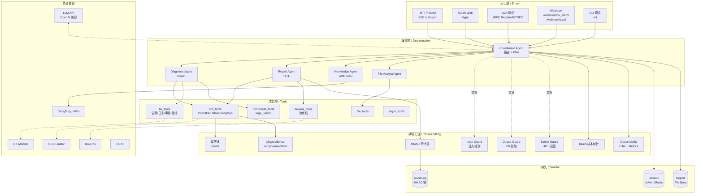
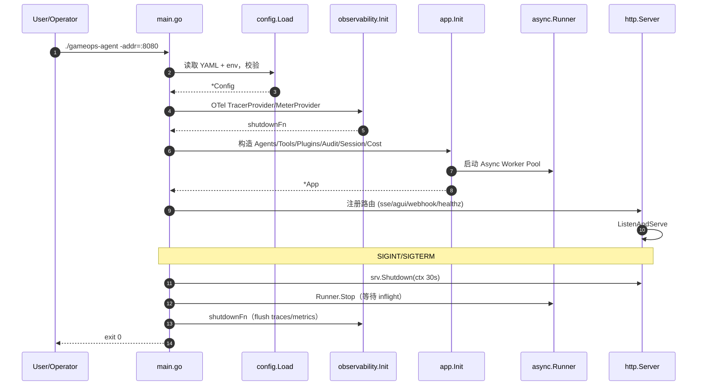
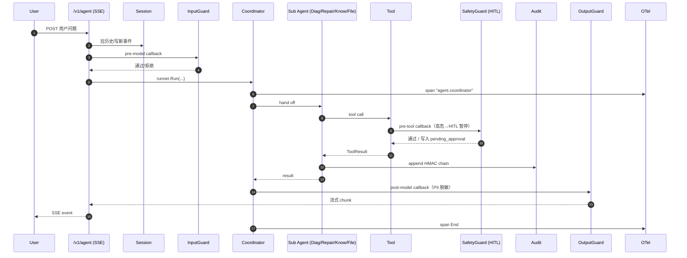
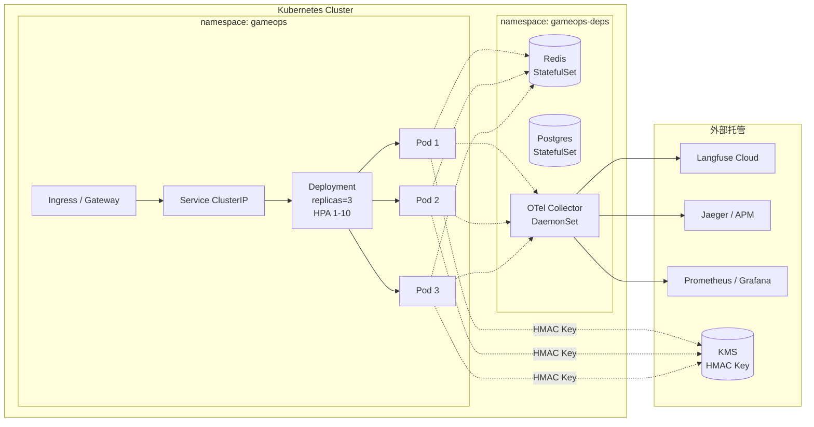

# GameOps Agent — 架构总览

> 本文是给**面试官 / 新人 onboarding** 用的简明架构说明。
> 详细的"为什么这样设计"答辩请看 [INTERVIEW.md](./INTERVIEW.md)。

## 一图概览

## 模块速查表

| 模块 | 路径 | 关键文件 | 职责 |
|---|---|---|---|
| 启动 | `main.go` + `src/app/app.go` | - | flag 解析、依赖装配、graceful shutdown |
| 配置 | `src/config/` | `loader.go` | YAML + env 加载，DefaultConfig + Override |
| 编排 | `src/agents/` | `coordinator/`, `react.go`, `common.go` | Coordinator + 4 子 Agent，prompt 走 system_prompt.md |
| 工具 | `src/tools/` | 6 大工具组 | 与 BCS/BK/DevOps 等外部系统交互 |
| 基础 | `src/infrastructure/` | `bcsapi/`, `bkapi/`, `devopsapi/`, `gongfengapi/`, `tapdapi/` | HTTP Client，含重试/超时/PII 处理 |
| 插件 | `src/plugin/` | `input_guard.go`, `output_guard.go`, `safety_guard.go`, `audit_hook.go` | callback 形式注入到框架的 hook 点 |
| 审计 | `src/audit/` | `hmac.go`（链式）, `remote_sink.go` | 不可篡改审计链，远端 sink 落 ES/对象存储 |
| 异步 | `src/async/` | `runner.go`, `job.go`, `store.go` | 长任务 / 高危任务异步化 |
| 会话 | `src/session/` | `session.go`（+ Redis 实现） | trpc-agent-go Session 适配，支持自动总结 |
| 幂等 | `src/idempotency/` | - | Webhook / 工具调用幂等键 |
| 弹性 | `pkg/resilience/` | `retry.go`, `breaker.go`, `bulkhead.go`, `ratelimit.go` | 通用韧性原语 |
| 知识 | `src/knowledge/` | `builder.go`, `iwiki_tool.go` | iWiki MCP 工具封装 |
| 报告 | `src/report/` | `report.go`, `summarizer.go`, `templates.go` | 故障复盘报告自动生成 |
| 观测 | `src/observability/` | `otel.go`, `metrics_*.go`, `genai_span.go`, `callbacks.go` | OTel + 自定义 Metrics + GenAI 语义约定 |
| 服务 | `src/services/` | `sse/`, `agui/`, `a2a/`, `webhook/` | 对外接入协议 |
| 评测 | `eval/` | `judge.go`, `judge_llm.go`, `judge_tool_selection.go` | LLM-as-Judge + ADK Eval |
| 命令 | `src/cmd/` | `auditverify/`, `preflight/` | 审计验签 CLI、启动前自检 CLI |

## 启动时序

## 单次请求时序

## 部署拓扑（生产）

## 关键设计决策（决策日志）

| # | 决策 | 替代方案 | 选用理由 |
|---|---|---|---|
| 1 | 使用 trpc-agent-go 而非自研 | LangGraph / 自研 | 公司基础设施一等公民，原生 OTel + A2A + AG-UI |
| 2 | Coordinator + 子 Agent 而非单 Agent | 大 prompt 单 Agent | 子 Agent 各自 prompt 短，便于评测与回归 |
| 3 | HITL 用 pending state + 异步等待 | 同步阻塞工具调用 | 不阻塞 worker，支持长审批时间 |
| 4 | HMAC 链式审计 | 普通 append-only | 防篡改，可单点验签 |
| 5 | Session 默认 in-mem，Redis 可选 | 强制 Redis | 本地零依赖可跑，生产可切换 |
| 6 | Plugin 走 callback 而非 middleware | middleware | 框架原生扩展点，与 OTel callback 共享生命周期 |
| 7 | 工具白名单 + 集群级 RBAC | 仅工具级 | 多 cluster 环境必需 |
| 8 | A2A/AG-UI 用 build tag stub/real | 永远依赖 | 外网 / 离线 CI 可编译 |
