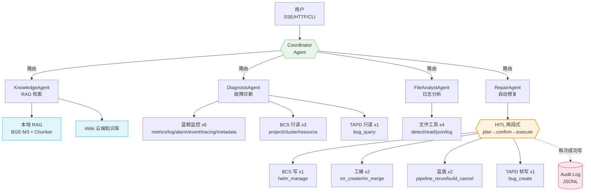

# GameOps Agent — LetsGo 游戏服务器智能运维助手

> 基于 **tRPC-Agent-Go** 构建的 Multi-Agent + Agentic RAG 智能运维系统。
>
> 完整方案见：[GameOps Agent 完整执行方案.md](../GameOps%20Agent%20%E5%AE%8C%E6%95%B4%E6%89%A7%E8%A1%8C%E6%96%B9%E6%A1%88.md)

---

## 📦 项目当前状态：**D30.2 CI/CD 自动化门禁已交付** 🎉

> 自 D1 骨架起步，当前已走完 **D1 → D30.2 共 45+ 个迭代节点**，形成「Agent 编排 → 工具写操作 → HITL 安全门 → 审计链 → 可观测性 → 评测体系 → CI/MR 自动化」一条完整闭环。

**近期里程碑**：

- **D26~D30.2 Prompt 工程可量化闭环**：Prompt 决策树（D26）→ E2E 跑通（D27）→ 生产埋点（D28）→ Golden 剧本（D29）→ evalrun 双 Judge（D30）→ JSON 落盘 + schema_version 守护（D30.1）→ **GitLab CI + MR 自动评论**（D30.2）
- **D22~D22.1 BCS 写能力毕业**：helm / scale / pod_restart / configmap / hpa_patch / alarm_silence / secret_update **七剑矩阵** + 全链路 E2E 集成测试
- **D19.5~D19.8 ReadyWaiter 抽象复用四连**：pod_restart → scale → helm → fast_poll 替换实现；上层三个工具源码零改动验证"接口稳定 / 实现可替换"
- **D20~D20.2 HPA 能力闭环**：感知（三档策略）→ 双工具复用（scale + rollout_restart 双档）→ 写入（bcs_hpa_patch 5 op + 6 层防护）
- **D17.6~D17.7 审计链安全到顶**：HMAC 签名 + 多 kid 轮换 + 链式 prev_sig + 跨重启 state 原子持久化 + 离线验签 CLI `auditverify`
- **D16~D19.4 可观测性闭环**：OTel GenAI Semantic Conv v1.30 + 双通道 OTLP Exporter + 6 种 Sampler 策略 + Prometheus 规则 10 条 + Grafana 7-panel dashboard + async 指标
- **D15 Webhook → 报告闭环**：蓝鲸告警 / TAPD 推送自动触发诊断 → `src/report/` 生成 Markdown 修复报告 → 可查询端点

> 📋 **完整进度与设计决策**见 [PROGRESS.md](PROGRESS.md)（5800+ 行开发日志）
> 📖 **端到端演示剧本**见 [docs/e2e_playbook.md](docs/e2e_playbook.md)
> 📊 **可观测性手册**见 [docs/observability.md](docs/observability.md)
> 🧪 **评测体系说明**见 [eval/README.md](eval/README.md)

---

## 🏗 系统架构



---

## 🧰 能力矩阵

| Agent | 职责 | 挂载工具数 | 关键 target | HITL | 状态 |
|-------|------|-----------|-------------|------|------|
| **Coordinator** | 路由 + 防循环 | — | — | — | ✅ |
| **KnowledgeAgent** | RAG 检索（本地+iWiki） | 2 | `*`（通用） | — | ✅ |
| **DiagnosisAgent** | 诊断：指标/日志/告警 | 10 | bk-monitor / bcs-read / tapd-read | — | ✅ |
| **FileAnalystAgent** | 日志文件切片+结构化分析 | 4 | 独立沙盒 | — | ✅ |
| **RepairAgent** | 修复：回滚/MR/流水线 | 7 | bcs-write / gongfeng / devops / tapd | **强制** | ✅ |

### 平台对接能力矩阵

| 平台 | 工具数 | 客户端 | Mock 模式 | 真实模式前置 | 审计 |
|------|-------|-------|----------|--------------|------|
| **蓝鲸监控** | 6（全只读） | `bkapi.Client` | ✅ | `BK_APP_CODE` + `BK_APP_SECRET` | — |
| **BCS 容器** | 4（3 读 + 1 写） | `bcsapi.Client` | ✅ | `BCS_TOKEN` | ✅（写） |
| **工蜂 Git** | 2（全写） | `gongfengapi.Client` | ✅ | `GONGFENG_TOKEN` + `GONGFENG_ALLOW_AUTO_MERGE` | ✅ |
| **蓝盾 CI/CD** | 2（全写） | `devopsapi.Client` | ✅ | `DEVOPS_TOKEN` + `DEVOPS_ALLOW_AUTO_OPS` | ✅ |
| **TAPD** | 2（1 读 + 1 软写） | `tapdapi.Client` | ✅ | `TAPD_USER` + `TAPD_TOKEN` | ✅（写） |
| **iWiki 知识库** | 1（只读） | 框架 `trpc/knowledge/iwiki` | Stub 降级 | `IWIKI_PAAS_ID` + `IWIKI_TOKEN` | — |
| **本地 RAG** | 1（只读） | 框架 `BuiltinKnowledge` | Stub 降级 | `OPENAI_API_KEY`（Embedder） | — |

> **生产就绪度自检**：`go run ./src/cmd/preflight` 一眼看清所有平台的 REAL/MOCK/DISABLED 状态。

---

## ✅ 全阶段交付清单（D1 → D30.2）

> 完整每条阶段的「本日完成 / 设计决策 / 单测结论」**见 [PROGRESS.md](PROGRESS.md)**（5800+ 行）。此处按四个工程主题分组速览。

### 🏗 阶段一：平台对接 + HITL（D1 → D10）

- [x] **D1** 项目骨架：5 Agent + ReAct Planner + HTTP/CLI 双入口
- [x] **D2** 蓝鲸 APIGW：6 个只读 FunctionTool（metrics/log/alarm/event/tracing/metadata）
- [x] **D3** BCS Gateway：4 FunctionTool + `TargetedTool` 分发器
- [x] **D4** KnowledgeAgent RAG：`BuiltinKnowledge` + 本地样例 + stub 降级 + iWiki 云端工具
- [x] **D5** FileAnalystAgent：4 工具 + 沙盒路径白名单
- [x] **D6** 统一 HITL 两段式框架 + 写工具 Mock 骨架
- [x] **D7** Coordinator 防循环 + SSE 结构化事件（6 种）
- [x] **D8** 工蜂 Git + TAPD 生产级 HTTP 客户端
- [x] **D9** 蓝盾 BK-CI 生产级 HTTP 客户端 + E2E 集成测试
- [x] **D10** 审计日志 + preflight 自检 + iwiki 单测 + E2E 剧本文档

### 🧠 阶段二：Session / 评测 / 防护 / 报告（D11 → D15）

- [x] **D11** Session/Memory + AG-UI Web 前端 + A2A 协议服务
- [x] **D12** 评测体系（eval/）：Golden Set + Tool Trajectory 打分
- [x] **D13** Skills 技能系统 + Agent 级插件（safety_guard + audit_hook）
- [x] **D14** 输入/输出防护（input_guard / output_guard）+ LLM-as-Judge 打分器 + ToolCallbacks 挂载
- [x] **D15** 修复报告生成（`src/report/`）+ 蓝鲸/TAPD Webhook 自动触发 + 报告查询端点

### 🔭 阶段三：可观测性 / 审计链 / 写能力毕业（D16 → D22.1）

- [x] **D16~D16.4** OTel GenAI Semantic Conv v1.30 + Tracer/Meter Provider + 6 种 Sampler + Prometheus 规则 10 条
- [x] **D17.1** 安全规则 YAML 热加载（mtime 原子热替换）
- [x] **D17.2~D17.2.1** 真实 LLM Judge + 结构化 JSON 打分 + Judge prompt YAML 热加载
- [x] **D17.3~D17.4** 审计远端汇聚（RemoteSink + 5xx/429 重试 + 背压）+ OTLP Metric 指标扩展
- [x] **D17.5** evalrun 接入 LLMJudge（`--enable-llm-judge` / `--judge-fail-on-threshold`）
- [x] **D17.6~D17.7** 审计日志 HMAC 签名 + 多 kid 轮换 + 链式 prev_sig + 跨重启 state 原子持久化 + `auditverify` 离线验签
- [x] **D18.1~D18.4** BCS 写技能矩阵：scale_deployment / pod_restart / alarm_silence / configmap_update
- [x] **D19.1** 真实 OTLP Metric Exporter 对接（PeriodicReader 15s）
- [x] **D19.2** async-tool 异步工具模式（Job/Store/Runner + job_submit/job_status/job_cancel/job_wait）
- [x] **D19.3** 跨模块 E2E 集成测试（src/integration/，覆盖 D16~D19.2 九个阶段接缝）
- [x] **D19.4** Grafana 7-panel dashboard + 告警规则 8 条
- [x] **D19.5~D19.8** ReadyWaiter 抽象 → pod_restart / scale / helm 三次复用 → FastPoll 实现替换（上层工具零改动）
- [x] **D20~D20.2** HPA 感知三档策略（block/warn/force）→ rollout_restart 双档复用（warn/ignore）→ `bcs_hpa_patch` 5 op + 6 层防护
- [x] **D21~D21.1** `bcs_pod_logs_tail` + `bcs_pod_describe` —— 诊断链毕业
- [x] **D22~D22.1** `bcs_secret_update`（配置侧二元闭环：configmap + secret）+ BCS 全链路 E2E

### 🧪 阶段四：Prompt 工程可量化闭环（D26 → D30.2）

- [x] **D26** DiagnosisAgent / RepairAgent Prompt 决策树固化 + 漂移保护单测
- [x] **D27** E2E 代码级跑通（Golden 剧本 → Agent 真跑 → 工具链验证）
- [x] **D28** 生产指标埋点：`tool_selection_accuracy` / `hitl_stage` / `reject` 三维
- [x] **D29** Golden 剧本：`gameops-core.evalset.json` 12 条金标用例
- [x] **D30** evalrun 接通 Tool Selection Judge（算法 Judge，零 LLM 成本）
- [x] **D30.1** Judge JSON 落盘 DTO + `schema_version="v1"` 守护 + 10 个 DTO 单测
- [x] **D30.2** GitLab CI 流水线骨架（3 stage / 5 job）+ MR 自动评论（bash+jq+curl）+ 7 个 CI 陷阱自查修复

---

## 🗂 目录结构

```
project-agent/
├── main.go                      # 入口（多服务注册）
├── filter.go                    # tRPC 请求过滤器（日志+耗时）
├── go.mod / trpc_go.yaml        # Go 模块 & tRPC 配置
├── mcp_servers.yaml             # MCP 服务配置
│
├── src/
│   ├── agents/                  # Agent 层
│   │   ├── common.go            # FillSystemContextInfo + BuildGenConfig
│   │   ├── react.go             # 中文化 ReAct Planner
│   │   ├── coordinator/         # 协调者 Agent
│   │   ├── diagnosis_agent/     # 故障诊断 Agent
│   │   ├── knowledge_agent/     # 知识问答 Agent
│   │   ├── file_analyst_agent/  # 文件分析 Agent
│   │   └── repair_agent/        # 自动修复 Agent
│   │
│   ├── tools/                   # 工具层
│   │   ├── targeted.go          # TargetedTool + FilterByTargets 分发器
│   │   ├── mcp_tools/           # MCP 工具管理（target 映射）
│   │   ├── bk_tools/            # 蓝鲸监控 6 工具（target=bk-monitor）
│   │   ├── bcs_tools/           # BCS 容器 4 工具（target=bcs-read/bcs-write）
│   │   └── util_tools/          # 通用工具（time / base64）
│   │
│   ├── infrastructure/          # 基础设施层
│   │   ├── bkapi/               # 蓝鲸 APIGW HTTP 客户端
│   │   └── bcsapi/              # BCS Gateway HTTP 客户端
│   │
│   ├── knowledge/               # RAG 封装层 (D4)
│   │   └── builder.go           # Builder：框架 BuiltinKnowledge + stub 降级
│   │
│   ├── tools/
│   │   ├── bk_tools/            # D2：蓝鲸监控 6 个 FunctionTool
│   │   ├── bcs_tools/           # D3：BCS 容器平台 4 个 FunctionTool
│   │   ├── file_tools/          # D5：本地文件分析 4 个 FunctionTool
│   │   └── targeted.go          # D3：TargetedTool + 按 target 分发
│   │
│   ├── services/                # 服务层
│   │   ├── a2a/                 # A2A 协议
│   │   ├── agui/                # AG-UI Web
│   │   └── sse/                 # SSE 流式
│   │
│   └── config/                  # 配置层
│       └── loader.go            # YAML 配置加载
│
├── knowledge/docs/              # RAG 语料（D3 填充）
├── skills/                      # Skills 技能（D7 填充）
├── eval/                        # 评估体系（D17 填充）
└── plugin/                      # 插件（D15 填充）
```

---

## 🚀 快速开始

### 1. 环境准备

```powershell
# Go >= 1.21
go version

# 配置 Go 代理
go env -w GOPROXY=https://goproxy.cn,direct
go env -w GOPRIVATE=git.woa.com,trpc.group
```

### 2. 配置模型 API

```powershell
# 混元（内网）
$env:OPENAI_API_KEY  = "<your-hunyuan-api-key>"
$env:OPENAI_BASE_URL = "http://hunyuanapi.woa.com/openapi/v1"

# 或 DeepSeek
$env:OPENAI_API_KEY  = "sk-xxxxxx"
$env:OPENAI_BASE_URL = "https://api.deepseek.com/v1"
```

### 3. 编译运行

```powershell
go mod tidy
go run . -model hunyuan-turbo-s
```

### 4. （可选）配置蓝鲸监控真实对接

不配置时自动走 **Mock 模式**（DiagnosisAgent 依然可以正常调用工具，返回预置样例数据）。

```powershell
# 蓝鲸 APIGW 凭据
$env:BK_APP_CODE       = "<your-bk-app-code>"
$env:BK_APP_SECRET     = "<your-bk-app-secret>"
$env:BK_APIGW_BASE_URL = "https://bkapi.paas.woa.com"

# 强制 Mock（调试用）
$env:BK_API_MOCK = "1"
```

**蓝鲸工具清单**（挂载到 `DiagnosisAgent.LocalTools`）：

| 工具名 | 用途 | 关键入参 |
|-------|------|---------|
| `bk_metrics_query`  | 时序指标查询   | `bk_biz_id` `data_label` `metric_name` `method` |
| `bk_log_query`      | 日志检索       | `bk_biz_id` `index_set` `query` |
| `bk_alarm_query`    | 告警列表       | `bk_biz_id` `status` `severity` |
| `bk_event_query`    | 事件中心       | `bk_biz_id` `event_type` `keyword` |
| `bk_tracing_query`  | APM Trace 查询 | `bk_biz_id` `app_name` `trace_id` |
| `bk_metadata_query` | CMDB 元数据    | `bk_biz_id` `resource` `filter` |

**BCS 工具清单**（按 target 自动分发）：

| 工具名 | target | 归属 Agent | 用途 |
|-------|--------|-----------|------|
| `bcs_project_query`  | `bcs-read`  | Diagnosis | BCS 项目列表 |
| `bcs_cluster_query`  | `bcs-read`  | Diagnosis | 集群状态 / K8s 版本 |
| `bcs_resource_query` | `bcs-read`  | Diagnosis | Pod / Deployment / Event |
| `bcs_helm_manage`    | `bcs-write` | **Repair** | Helm 部署/回滚（内置 HITL 确认门） |

配置 BCS 凭据（可选）：

```powershell
$env:BCS_GATEWAY_URL = "https://bcs-api.xxx.com"
$env:BCS_TOKEN       = "<your-bcs-token>"
# 强制 Mock（调试用）
$env:BCS_API_MOCK    = "1"
# 仅用于本地绕过 HITL 确认门（生产环境勿开！）
$env:HITL_DISABLE    = "0"
```

---

## 📚 KnowledgeAgent RAG（D4）

### 本地知识库目录

```
data/knowledge/
  architecture/   # 架构文档
  runbook/        # 运行手册
  faq/            # 常见问答
  incident/       # 历史故障复盘
```

每个子目录名会自动作为 `category` metadata 附加到文档上，LLM 可通过 `knowledge_search` 工具按 category 过滤。

### 环境变量

```powershell
# OpenAI 兼容 embedding（与 LLM 共用 API Key）
$env:OPENAI_API_KEY        = "<your-openai-api-key>"
$env:OPENAI_BASE_URL       = "https://api.openai.com/v1"     # 或内部代理
$env:OPENAI_EMBEDDING_MODEL = "text-embedding-3-small"        # 可选，默认就是这个

# 本地知识库目录（默认 data/knowledge）
$env:KNOWLEDGE_DATA_DIR = "data/knowledge"

# 强制禁用 RAG（本地调试时可用）
$env:KNOWLEDGE_DISABLE = "0"
```

未配置 `OPENAI_API_KEY` 时会自动走 **stub 模式**，`knowledge_search` 工具返回占位提示，LLM 会在回复中明确告知用户"知识库未就绪"，服务依然可正常启动。

---

## 🗂 FileAnalystAgent 文件分析（D5）

### 工具清单（全部纯本地计算，无外部依赖）

| 工具 | 作用 |
|------|------|
| `file_detect` | 识别文件类型（json/yaml/log/text/binary）+ 基本统计 + 下一步 hint |
| `file_read_slice` | 按字节或行分段读取，支持 keyword 过滤；防 OOM 硬上限 1 MiB |
| `json_query` | JSON 文件按 JSONPath-lite 提取字段（`$.a.b[0].c`） |
| `log_analyze` | 级别分布 + 时间聚集桶 + 高频错误模式 Top-K + First/Last 错误锚点 |

### 安全沙盒

- 所有路径必须位于 **允许根目录白名单** 内，默认：`data/samples/` + `os.TempDir()`
- 可通过环境变量扩展：

```powershell
# 允许访问的根目录（多根用 ; 分隔；系统路径分隔符也可）
$env:FILE_ANALYZE_ROOT = "data/samples;D:/tmp/uploads"
```

- 单次读取字节硬上限 1 MiB，防止超大文件 OOM。

### 样例

```powershell
# CLI 模式下把文件路径丢给 Agent
go run . -cli -q "帮我看下 data/samples/game-core-oom.log，这个服务为什么反复重启？"
```

预期流程：
1. Coordinator 路由到 `file_analyst_agent`
2. `file_detect` → kind=log
3. `log_analyze` → FATAL×3 / ERROR×5，时间窗 10:15-10:17 集中，模式=OOM
4. `file_read_slice` 读 first_error 附近上下文
5. 给出根因："容器 OOMKilled（cache 加载峰值 4.1GB 超 limit 2GB）"
6. 建议：「可 Transfer 给 `diagnosis_agent` 查 10:15-10:20 的指标」

---

## 🛡 RepairAgent HITL 两段式确认（D6）

### 设计模式

所有写操作工具遵循统一范式（由 `src/tools/hitl` 提供）：

```
用户意图 → LLM 调工具（不带 confirmed）
            ↓
       工具返回 Plan（action / severity / side_effect / impact_scope / rollback_plan）
            ↓
      LLM 把 Plan.human_prompt 原样展示给用户
            ↓
      用户回复「确认」
            ↓
   LLM 重新调同一个工具（带 confirmed=true）
            ↓
       工具真正执行
```

### 已覆盖的写工具

| 工具 | target | 默认 severity | 要求 reason |
|------|--------|--------------|------------|
| `bcs_helm_manage`(rollback) | bcs-write | high | ❌ |
| `bcs_helm_manage`(install) | bcs-write | high | ❌ |
| `bcs_helm_manage`(uninstall) | bcs-write | **critical** | ✅ |
| `gongfeng_mr_create` | gongfeng | medium | ❌ |
| `gongfeng_mr_merge` | gongfeng | **critical** | ✅ |
| `devops_pipeline_rerun` | devops | medium | ❌ |
| `devops_build_cancel` | devops | medium | ✅ |
| `tapd_bug_create` | tapd | low（软写） | ❌ |

### 环境变量

```powershell
# 工蜂 Git 凭据（未设置时走 Mock）
$env:GONGFENG_TOKEN = "..."
$env:GONGFENG_BASE_URL = "https://git.woa.com/api/v3"   # 默认值

# 蓝盾 CI/CD
$env:DEVOPS_TOKEN = "..."
$env:DEVOPS_BASE_URL = "https://devops.woa.com"          # 默认值

# TAPD
$env:TAPD_TOKEN = "..."
$env:TAPD_USER = "..."
$env:TAPD_WORKSPACE_ID = "..."

# HITL 软关闭（仅用于 CI / 集成测试，生产绝不要开）
$env:HITL_DISABLE = "1"
```

---

## 🔗 工蜂 Git + TAPD 真实对接（D8）

### 架构决策

- **接入方式**：**直接 HTTPS REST**，不依赖 MCP 客户端环境，能独立部署到 K8s。
- **Mock / Real 切换**：未配置凭据自动进入 Mock 模式，`*_API_MOCK=1` 可强制 Mock。
- **凭据来源**：二选一
  - 生产：环境变量（K8s Secret 注入）
  - 开发：本地 `.env`（已 gitignore）

### 工蜂 Git API Client

```powershell
$env:GONGFENG_TOKEN      = "<PRIVATE-TOKEN>"
$env:GONGFENG_BASE_URL   = "https://git.woa.com/api/v3"    # 默认值
$env:GONGFENG_API_MOCK   = "1"                              # 可选：强制 Mock

# 安全闸门：默认即便配置了真实 Token，gongfeng_mr_merge 仍不会真实下发。
# 仅当显式打开下列开关且用户已 confirmed，才会调用真实合并 API。
$env:GONGFENG_ALLOW_AUTO_MERGE = "1"                        # 默认关，会放给团队政策。
```

已对接的端点：

| 方法             | HTTP   | Path                                         | 备注                      |
| ---------------- | ------ | -------------------------------------------- | ------------------------- |
| `CreateMR`       | POST   | `/projects/:id/merge_requests`               | 发起评审单            |
| `MergeMR`        | PUT    | `/projects/:id/merge_requests/:iid/merge`    | 最高危动，默认不真实下发 |
| `GetMR`          | GET    | `/projects/:id/merge_requests/:iid`          | 只读                      |
| 通用 `DoJSON`   | ANY    | -                                            | 供后续新增接口复用        |

### TAPD OpenAPI Client

```powershell
$env:TAPD_BASE_URL     = "https://api.tapd.cn"              # 默认值
$env:TAPD_USER         = "<API User>"
$env:TAPD_TOKEN        = "<API Password / Secret>"
$env:TAPD_WORKSPACE_ID = "12345"
$env:TAPD_API_MOCK     = "1"                                # 可选：强制 Mock
```

TAPD 响应遵循官方 envelope：`{"status":1,"data":[{"Bug":{...}}],"info":"success"}`，`status!=1` 会被归一化为 error。

| 方法             | HTTP   | Path    | 备注             |
| ---------------- | ------ | ------- | ---------------- |
| `QueryBugs`      | GET    | `/bugs` | 只读，支持关键字/状态/处理人 |
| `CreateBug`      | POST   | `/bugs` | 软写，仍走 HITL 两段式 |

### 单测覆盖

- `infrastructure/gongfengapi/client_test.go`：httptest mock server 覆盖真实 HTTP 路径、Token 校验、403 错误、Mock 切换。
- `infrastructure/tapdapi/client_test.go`：覆盖 BasicAuth、envelope 解析、`status=0` 错误、form-urlencoded 创建。
- `tools/tapd_tools/tapd_tools_test.go`：HITL 两段式 + title 必填。

---

## 🚦 蓝盾 CI/CD 真实对接（D9）

### 配置

```powershell
$env:DEVOPS_BASE_URL   = "https://devops.woa.com"   # 默认值
$env:DEVOPS_TOKEN      = "<X-DEVOPS-ACCESS-TOKEN>"  # 蓝盾 OpenAPI 个人令牌
$env:DEVOPS_USER       = "<X-DEVOPS-UID>"           # 可选：v4+ 接口需要
$env:DEVOPS_API_MOCK   = "1"                         # 可选：强制 Mock

# 安全闸门：默认即便配了真实 Token，重跑流水线/取消构建仍不会真实下发。
# 仅当显式打开下列开关且用户已 confirmed，才会调用真实 API。
$env:DEVOPS_ALLOW_AUTO_OPS = "1"                    # 默认关
```

### 端点

| 方法            | HTTP  | Path                                                        | 备注                         |
| --------------- | ----- | ----------------------------------------------------------- | ---------------------------- |
| `BuildHistory`  | GET   | `/ms/process/api/service/builds/:projectId/:pipelineId/history`      | 支持 records 包裹与数组形式 |
| `PipelineStart` | POST  | `/ms/process/api/service/builds/:projectId/:pipelineId/start`         | 触发/重跑；buildId 非空 → retryStart=true |
| `BuildCancel`   | POST  | `/ms/process/api/service/builds/:projectId/:pipelineId/:buildId/cancel` | 取消正在运行的构建         |
| 通用 `DoJSON`   | ANY   | -                                                            | 鉴权 X-DEVOPS-ACCESS-TOKEN / X-DEVOPS-UID + envelope `status==0` |

### 单测 & 剧本集成测试

- `infrastructure/devopsapi/client_test.go`：httptest 覆盖 Mock / 强制 Mock / BuildHistory / envelope `status!=0` / PipelineStart / BuildCancel / 403。
- `tools/devops_tools/devops_tools_test.go`：HITL 两段式 + reason 必填 + Mock fallback。
- **`src/integration/repair_flow_test.go`（E2E 剧本）**：不依赖真实 LLM，通过 CallableTool 接口串起三幕剧本：
  1. **OOM 故障全链路**：bk_alarm_query → bk_metrics_query → gongfeng_mr_create（两段 HITL）→ tapd_bug_create（两段 HITL）
  2. **坏版本回滚**：devops_pipeline_rerun 在 `DEVOPS_ALLOW_AUTO_OPS` 关闭/打开两种状态下的行为
  3. **工具分组 target 过滤**：DiagnosisAgent/RepairAgent 可见工具集正确性

---

### 样例：Helm 回滚

```powershell
go run . -cli -q "game-core 这个服务在 letsgo 集群 BCS-K8S-00001 下 OOM 了，请帮我回滚到上一个版本"
```

预期链路：
1. Coordinator → repair_agent
2. `bcs_helm_manage(action=history)` 查看 3 个历史 revision
3. 返回 Plan（severity=high，展示 release/revision/副作用）
4. LLM 原样展示给用户
5. 用户回复「确认回滚到 revision 4」
6. `bcs_helm_manage(action=rollback, revision=4, confirmed=true)` 真正执行

---

## 📡 SSE 流式事件协议（D7）

后端 `POST /v1/agent` 以 Server-Sent Events 推送 6 种事件，前端按 `event:` 字段分流渲染：

| event 名 | 触发时机 | 关键字段（`data.*`） | 渲染建议 |
|----------|---------|-------------------|---------|
| `delta` | LLM 流式文本增量 | `response`, `author` | 追加到当前气泡 |
| `tool_call` | 子 Agent 开始调用某个工具 | `tool_call.name`, `tool_call.args`(debug) | 显示"🔧 正在调用 xxx" |
| `agent_transfer` | Coordinator / 子 Agent 间切换 | `transfer.from`, `transfer.to`, `transfer.reason` | 显示"🔄 转接到 xxx" |
| `confirmation_required` | **HITL 等待用户确认** | `confirmation.{action,severity,target,side_effect,impact_scope,rollback,params,human_prompt}` | **高亮气泡 + 弹「确认 / 取消」按钮** |
| `final` | 本轮对话结束 | `finished: true` | 收起 loading |
| `error` | 出错 | `response` | 红字展示 |

### HITL 确认事件示例

```
event:confirmation_required
data:{"response":"⚠ 即将执行 bcs.helm.rollback ...","author":"repair_agent","event_type":"confirmation_required","confirmation":{"action":"bcs.helm.rollback","severity":"high","target":"BCS-K8S-001/letsgo/game-core","side_effect":"release 回滚到 revision=4","impact_scope":"命名空间下所有 Pod 滚动重启","rollback":"若回滚后仍异常，再指向更早 revision","params":{"revision":4},"human_prompt":"⚠ **即将执行写操作：bcs.helm.rollback**..."},"global_output":{"context":"","answer_success":0,"docs":[]}}
```

前端拿到此事件后，应：
1. 锁定输入框，高亮渲染 `human_prompt`
2. 显示「确认」/「取消」按钮，或允许用户输入「改用 revision=3」等修改意见
3. 用户点击确认后，发送新一轮 `/v1/agent` 请求，content 为「确认」（或修改意见），Agent 会带 `confirmed=true` 重新调用工具真正执行

### 防循环机制

- **Prompt 层**：Coordinator system_prompt 明令"单轮只发起一次 Transfer"
- **代码层**：Coordinator 构造时加入 `llmagent.WithEndInvocationAfterTransfer(true)`，Transfer 后立即结束本轮
- 双保险，即便 LLM 违反 prompt 纪律，框架层也会强制结束，避免 Token 空转

---

## 🔭 未来可拓展方向

当前骨架已稳定交付。以下是**适合继续演进**的方向，按投入产出比排序（仅列出方向，不承诺时点）：

| 方向 | 粒度 | 价值 |
|------|------|------|
| **D31 Judge 趋势可视化** | ~0.5 天 | 从历次 pipeline 的 `judge_report.json` 聚合 DimAvg，渲染 SVG 折线图作为 artifact，装到 GitLab Pipeline Graphs 扩展位。让「这次改动让 ToolSelection 从 0.94 跌到 0.62」这种问题一眼可见 |
| **D28.1 Prometheus 告警补齐** | ~0.5 天 | 给 `hitl_stage` / `reject_total` / `tool_selection_accuracy` 配告警规则（D19.4 已埋 10 条业务告警，这一组是 prompt 工程侧的对称物，与 D30.2 的离线评测形成「在线+离线」双通道） |
| **NetworkPolicy / Ingress 写能力** | ~1 天 | BCS 写能力矩阵当前聚焦于 Deployment/HPA/ConfigMap/Secret，网络侧留白。按 D20 HPA 的抽象范式引入 `bcs_networkpolicy_patch` 即可 |
| **Runbook 自驱执行** | ~2~3 天 | KnowledgeAgent 检索到 Runbook 后，当前只做「知识回答」。下一步可让 Coordinator 识别「可执行片段」→ Transfer 给 RepairAgent 逐步确认执行。本质是把「知识」升级为「脚本」，但每一步仍走 HITL |
| **多租户 / 多业务 ID 隔离** | ~1 天 | 当前 `BK_BIZ_ID` 与 `cluster_id` 靠配置/参数；大集团场景下需要引入租户维度的配额、审计过滤、工具可见性控制 |

> 以上均为 nice-to-have。当前骨架对于「演示、面试、Demo、内部试点」已完全够用。

---

## 📚 参考

- 参考实现：[oncall_agent](https://git.woa.com/video_pay_oss/magic_group/oncall_agent)
- 框架文档：[trpc-agent-go](https://git.woa.com/trpc-go/trpc-agent-go)
